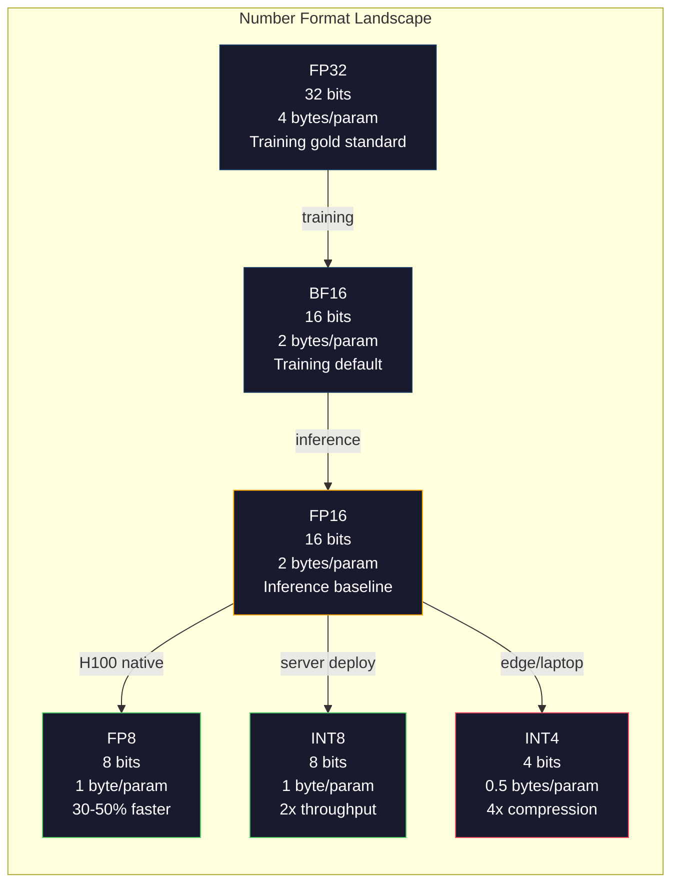
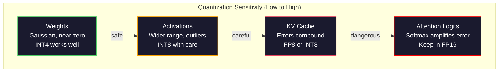
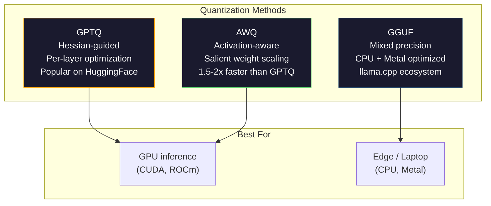

# क्वांटिज़ेशनः मॉडल फिट बनाना  मापनेः मॉडल को चलाने दें

> FP16 में 70B मॉडल को 140GB की आवश्यकता होती है. दो A100 केवल वजन के लिए। FP8 पर क्वांटिज़ करेंः एक 80GB GPU। INT4: एक मैकबुक।

> **【中文解读】**70 अरब से अधिक तत्व मॉडल को FP16 में 140GB की आवश्यकता होती है।

> **【拓展：量化→llama.cpp/GGUF】**llama.cpp 和 GGUF 形式 让大模型能在消费级硬件上运行──GPTQ、AWQ、GGUF等量化方法是将70B+ 模型部署到本地设备的关键──理解量化是理解大模型部署的基础──

>  **【前置】**學本節前请先掌握:Phase 10·01-10 (LLM 基础);浮点数表示 (FP32/FP16/BF16/INT8/INT4);numpy 矩阵运算──

>  **【类比】**量化 = 压缩图片──原照片(FP16) प्रति像素 16 位,肉眼分辨不出和 8 位(FP8) का अंतर, लेकिन文件大小一半──再压到4 位──INT4)肉眼开始看到(精度损失),但文件小4 倍──模型量化同理:FP16→INT4 大小变 1/4,性能损失通常 <5%──GGUF 格式让你在MacBook上跑Llama-70B──

**Type:** Build
**Languages:** Python (with numpy)
**Prerequisites:** Phase 10, Lessons 01-10 (LLMs from Scratch)
**Time:** ~120 minutes

## सीखने के लक्ष्य

- प्रति-टेंसर और प्रति-चैनल स्केलिंग सहित FP16 से INT8 और INT4 तक सममित और असमित मात्राबद्धता लागू करें
  FP16 से INT8 और INT4 तक के लिए एक-दूसरे के लिए एक-दूसरे के लिए एक-दूसरे के लिए एक-दूसरे के लिए एक-दूसरे के लिए एक-दूसरे के लिए एक-दूसरे के लिए एक-दूसरे के लिए एक-दूसरे के लिए एक-दूसरे के लिए एक-दूसरे के लिए एक-दूसरे के लिए एक-दूसरे के लिए एक-दूसरे के लिए एक-दूसरे के लिए एक-दूसरे के लिए एक-दूसरे के लिए एक-दूसरे के लिए एक-दूसरे के लिए एक-दूसरे के लिए एक-दूसरे के लिए एक-दूसरे के लिए एक-दूसरे के लिए एक-दूसरे के लिए एक-दूसरे के लिए एक-दूसरे के लिए एक-दूसरे के लिए एक-दूसरे के लिए एक-दूसरे के लिए एक-दूसरे के लिए एक-दूसरे के लिए एक-दूसरे के लिए एक-दूसरे के लिए एक-दूसरे के साथ एक-दूसरे के लिए एक-दूसरे के लिए एक-दूसरे के लिए एक-दूसरे के साथ एक-दूसरे के साथ एक-दूसरे के साथ एक-दूसरे के साथ एक-दूसरे के साथ एक-दूसरे के साथ एक-दूसरे के साथ एक-दूसरे के साथ एक-दूसरे के साथ एक-दूसरे के साथ एक-दूसरे के साथ एक-साथ एक-साथ एक-साथ एक-साथ एक-साथ एक-साथ एक-साथ एक-साथ एक-साथ एक-साथ एक-साथ एक-साथ एक-साथ एक-साथ एक-साथ एक-साथ एक-साथ एक-साथ एक-साथ एक-साथ एक-साथ एक-साथ एक-साथ एक-साथ एक-साथ एक-साथ एक-साथ-साथ-साथ एक-साथ-साथ-साथ-साथ-साथ-साथ-साथ-सासासासा-सा-सा-सा-सा-सा-सा-सा-सा-सा-सा-सा-सा-सा-सा-सा-सा-सा-सा-सा-सा-सा-सा-सा-सा-सा-सा-सा-सा-सा-सा-सा-सा-सा-सा-सा-सा-सा-सा-सा-सा-सा-सा-सा-सा-सा-सा-सा-सा-सा-सा-सा-सा-सा-सा-सा-सा-सा-सा-सा-सा-सा-सा-सा-सा-सा-सा-सा-सा-सा-सा-सा-सा-सा-सा-सा-
- क्वांटिज़ेशन से मेमोरी बचत की गणना करें और यह निर्धारित करें कि किसी दिए गए GPU के VRAM में कौन सी सटीकता फिट बैठती है
  गणितीय रूप से प्रदर्शित संग्रहण बचत मात्रा, निर्धारित GPU गणितीय संग्रहण के लिए उपयुक्त की सटीकता
- प्रशिक्षण के बाद क्वांटिज़ेशन (PTQ) और क्वांटिज़ेशन-जागरूक प्रशिक्षण (QAT) के बीच अंतर समझाएं
  解释 प्रशिक्षण के बाद मात्रात्मकता (PTQ) और मात्रात्मक संज्ञानात्मकता (QAT) के बीच अंतर
- वास्तविक मॉडल को मात्राबद्ध करने और एक बेंचमार्क पर सटीकता-स्मृति व्यापार को मापने के लिए GPTQ या AWQ लागू करें
   GPTQ या AWQ  मात्रात्मक वास्तविक मॉडल का उपयोग करें, और आधार पर माप सटीकता-प्रमाणात्मक भार मापें

> **【中文解读】**इस वर्ग में क्वांटिफिकेशन तकनीक को प्राप्त करने के लिए सटीकता परिवर्तन और गति का उपयोग किया गया है।

## समस्या  समस्या परिचय

Llama 3 70B में 70 बिलियन पैरामीटर हैं. प्रत्येक पैरामीटर एक 16-बिट फ्लोटिंग प्वाइंट नंबर है. जो 140 बिलियन बाइट है. 140GB. एक एकल A100 में 80GB VRAM है. आप एक ही GPU पर वजन भी नहीं लोड कर सकते हैं, कम से कम निष्कर्ष चला सकते हैं। आपको एक मॉडल की सेवा करने के लिए $ 2 प्रति घंटे पर दो A100 की आवश्यकता है।

> Llama 3 70B में 700 अरब पैरामीटर हैं। प्रत्येक पैरामीटर एक 16 बिट्स浮点 संख्या है। यानी 1400 अरब बाइट्स। 140GB। एकल चार्ज A100 में 80GB 显存有──आपको भार भार भी नहीं लोड करने में सक्षम हैं।

लेकिन 16 बिट्स प्रति पैरामीटर व्यर्थ है। न्यूरल नेटवर्क क्लस्टर में अधिकांश वजन शून्य के करीब है। FP16 की पूरी गतिशील सीमा (0.000000059 से 65,504) लगभग पूरी तरह से अप्रयुक्त है। यदि आप Llama 3 70B में वजन की वास्तविक वितरण को मापते हैं, तो उनमें से 95% -0.1 और +0.1 के बीच गिरते हैं। आप 16 बिट्स को 4 में फिट होने वाले मानों का प्रतिनिधित्व करने के लिए जल रहे हैं।

> लेकिन प्रत्येक पैरामीटर 16 बिट्स का है व्यय। न्यूरल नेटवर्क में अधिकांश वजन शून्य के पास जमा है। एफपी16 की पूर्ण गतिशीलता सीमा। 0.000000059 से लेकर 65,504 तक लगभग पूरी तरह से उपयोग नहीं की गई है। यदि आप एलएमए 3 70 बी के बीच वजन का वास्तविक वितरण मापते हैं, तो 95% -0.1 से +0.1 के बीच गिर गया है।

क्वांटिज़ेशन उच्च परिशुद्धता वाले नंबरों को कम परिशुद्धता वाले नंबरों के साथ बदल देता है। FP16 से FP8 मेमोरी को आधा काटता है। FP16 से INT4 इसे एक चौथाई तक काटता है। यह 140GB मॉडल 35GB हो जाता है। यह एक एकल उपभोक्ता GPU पर फिट बैठता है। 2-बिट क्वांटिज़ेशन (आग्रहनशील, नुकसान, लेकिन कुछ कार्यों के लिए उपयोग करने योग्य) पर धक्का दें और एक ही मॉडल 16GB लैपटॉप पर चलता है।

>  कम सटीकता वाले डिजिटल के साथ उच्च सटीकता वाले डिजिटल को बदल देंFP16 से FP8 तक प्रकाश भंडारण में आधे की कमी करेंFP16 से INT4 तक चार में से एक तक 140GB  मॉडल में बदलकर 35GB प्रवेश योग्य एकल चार्ज खपत स्तर के GPU 推到 2 बिट के 量化

लागत सटीकता है. आप जो भी बिट्स निकालते हैं वे जानकारी को नष्ट कर देते हैं। सवाल यह है कि आप कितनी सटीकता खोते हैं और कहां। एक अच्छी तरह से क्वांटिज़्ड INT4 मॉडल अधिकांश बेंचमार्क पर मूल की गुणवत्ता का 95-99% रखता है। INT4 के लिए एक भोले क्वांटिज़ेशन मॉडल को पूरी तरह से नष्ट कर सकता है। अंतर तकनीक है।

> 代价是精度──每移除一个都破坏信息── प्रश्न यह है कि आप कितना सटीकता खोते हैं तथा किसमे नुकसान होता है── अच्छी मात्रा में आईएनटी4 模型 बहुसंख्यक आधार पर मूल गुण का 95-99% बरकरार रखता है── साधारण आईएनटी4 量化可能 पूरी तरह से नष्ट हो सकता है── अंतर तकनीक में है──

GPTQ के साथ Llama 3 से INT4 के सामुदायिक क्वांटिज़ेशन में विकिटेक्स पर लगभग 1-2 भ्रम बिंदु खोए हुए हैं। मिस्ट्रल ने MMLU पर शून्य मापने योग्य गुणवत्ता हानि के साथ Mixtral 8x22B के FP8 चेकपोइंट जारी किए। GGUF प्रारूप llama.cpp को सक्षम करता है, जो M-सीरीज चिप्स के साथ मैकबुक पर 70B मॉडल चलाता है। क्वांटिज़ेशन एक हैक नहीं है। यह 7B से बड़ा प्रत्येक मॉडल के लिए मानक तैनाती पथ है।

> 社区GPTQ द्वारा Llama 3 को INT4 में मापने के लिए, WikiText पर केवल 1-2 个困惑度点──Mistral ने Mixtral 8x22B के FP8 检查点,MMLU पर लगभग शून्य गुणवत्ता हानि को जारी किया──GGUF प्रारूप ड्राइविंग llama.cpp, मैकबुक एम 系列 चिप्स पर चल रहा है 70B मॉडल── मापने के लिए हैक नहीं किया गया──यह प्रत्येक 7B से अधिक मॉडल का मानक तैनाती मार्ग है──

> **【中文解读】**FP16 प्रत्येक पैरामीटर 16 बिट्स,70B  मॉडल की आवश्यकता 140GB  पर 95% का वजन केंद्रित है -0.1 से +0.1  के बीच 16 बिट्स का उपयोग करते हुए ये मान बहुत बर्बाद हो गए हैं  को INT4 तक मापने से भंडारण की मांग 35GB तक कम हो जाएगी, खपत स्तर के GPU पर चलाने में सक्षम  अच्छा INT4  को मापने से मूल मॉडल 95-99% की गुणवत्ता को बनाए रखने  GPTQ  को Llama 3 से INT4 तक मात्र 1-2  उलझन बिंदुओं का नुकसान, मिस्ट्रल के FP8  को MMLU पर लगभग शून्य नुकसान 

> **【拓展：量化生态】**量化生态已非常成熟:GPTQ(आधारित निकटता के द्वितीय चरण के सूचना के चरणबद्ध量化) 、AWQ( सक्रिय संज्ञानात्मक अधिकार वजनकरण, संरक्षण प्रमुख 权重) 、GGUF(llama.cpp का मात्राबद्ध प्रारूप, समर्थन 2-8 बिट 混合精度) ⋅llama.cpp 让70B 模型在MacBook M 系列芯片上运行,催生本地大模型部署的生态(Ollama、LM Studio等) ⋅

## अवधारणा का मूल अवधारणा

### संख्या प्रारूप: प्रत्येक बिट क्या करता है

प्रत्येक फ्लोटिंग-पॉइंट नंबर में तीन भाग होते हैंः साइन, एक्सपोनेंट और मंटिस (जिसे सिसिगेंट भी कहा जाता है) । साइन एक बिट है। एक्सपोनेंट रेंज (कई बड़ी या छोटी संख्या हो सकती है) निर्धारित करता है। मंटिस सटीकता निर्धारित करता है (आप कितने दशमलव स्थान प्राप्त करते हैं) ।

> प्रत्येक浮点数 में तीन भाग हैंः符号、指数和尾数(या इसे有效数字 भी कहा जाता है)。符号占据一位──指数决定范围(数可以多大或多小)──尾数决定精度(有多少位小数)──

```
FP32:  [1 sign] [8 exponent] [23 mantissa]  = 32 bits
FP16:  [1 sign] [5 exponent] [10 mantissa]  = 16 bits
BF16:  [1 sign] [8 exponent] [7  mantissa]  = 16 bits
FP8:   [1 sign] [4 exponent] [3  mantissa]  = 8  bits (E4M3)
FP8:   [1 sign] [5 exponent] [2  mantissa]  = 8  bits (E5M2)
INT8:  [1 sign] [7 value]                   = 8  bits (uniform steps)
INT4:  [1 sign] [3 value]                   = 4  bits (16 levels total)
```

**FP32**23 mantissa bits आपको सटीकता के लगभग 7 दशमलव अंकों देते हैं। रेंजः लगभग 1.2 x 10^-38 से 3.4 x 10^38. प्रशिक्षण पहले केवल FP32 में होता था। यह अभी भी संचय के लिए लागू होता है (मैट्रिक्स गुणा के दौरान चल रहे योग) ।

> **FP32**                                                                                                                                                                                                                                                              

**FP16**10 mantissa bits लगभग 3.3 दशमलव अंकों का परिणाम होते हैं। एक्सपोनेंट 5 bits तक कम हो जाता है, जो कि रेंज को नाटकीय रूप से कम करता है (max value ~65,504) । यह वजन के लिए ठीक है (जो शून्य के करीब क्लस्टर होता है) लेकिन सक्रियण और ग्रेडिएंट के लिए खतरनाक है जो प्रशिक्षण के दौरान बढ़ सकता है। FP16 प्रशिक्षण के दौरान निचले प्रवाह को रोकने के लिए नुकसान स्केलिंग की आवश्यकता होती है।

> **FP16**यह वजन में कमी की समस्या है, लेकिन प्रशिक्षण में सक्रियता और वृद्धि की दर बहुत खतरनाक है। प्रशिक्षण में नुकसान को रोकने के लिए FP16 को नुकसान को कम करने की आवश्यकता होती है।

**BF16**(मस्तिष्क तैरने 16) 8-बिट एक्सपोनेंट को FP32 से रखता है लेकिन mantissa को 7 बिट तक छोटा करता है। एफपी 32 की तरह ही रेंज, एफपी 16 की तुलना में कम सटीकता। गूगल ने इसे विशेष रूप से गहरे सीखने के लिए डिज़ाइन किया है। अंतर्ज्ञान: तंत्रिका नेटवर्क के लिए सटीकता से अधिक रेंज महत्वपूर्ण है। एफपी 16 में 10^-20 का ग्रेडिएंट जो शून्य तक बहता है, बीएफ 16 में जीवित रहता है। 0.07342 का वजन जो BF16 में 0.0734 तक घुमाता है पर्याप्त करीब है। प्रत्येक आधुनिक प्रशिक्षण रन में BF16 या BF16/FP32 मिश्रण का उपयोग किया जाता है।

> **BF16**(Brain Float 16) FP32 के 8 बिट्स सूचकांक को बनाए रखेगा लेकिन अंतिम संख्या को 7 बिट्स तक घटाएगा। FP32 के समान, FP16 से कम सटीकता है। Google विशेष रूप से गहन सीखने के लिए डिज़ाइन किया गया है।

**FP8**E4M3 (4 एक्सपोनेंट, 3 मंटिस) का उपयोग अनुमान के दौरान वजन और सक्रियण के लिए किया जाता है। E5M2 (5 एक्सपोनेंट, 2 मंटिस) का उपयोग प्रशिक्षण के दौरान ग्रेडिएंट के लिए किया जाता है जहां रेंज सटीकता से अधिक मायने रखता है। H100 GPU पर FP8 अनुमान FP16 की तुलना में 30-50% गति प्राप्त करता है।

> **FP8**E4M3;;4 अंकों,3 अंकों) का उपयोग प्रशिक्षण के समय वजन और सक्रियण के लिए किया जाता है;;E5M2;;5 अंकों,2 अंकों) का उपयोग प्रशिक्षण के समय की तरंग, इस समय सटीकता से अधिक महत्वपूर्ण है;;H100 GPU पर FP8  का उपयोग FP16 快 30-50% से अधिक, गुणवत्ता हानि अनदेखी की जा सकती है;;

**INT8**एक पूर्णांक प्रारूप है। कोई एक्सपोनेंट नहीं, कोई मंटिसा नहीं। केवल -128 से 127 तक समान रूप से अंतराल वाले 256 मान हैं। इस सीमा में तैरते बिंदुओं के वजन को मैप करने के लिए आपको एक पैमाने कारक की आवश्यकता है। लाभः तैरते बिंदु की तुलना में पूर्णांक अंकगणित तेज और अधिक ऊर्जा कुशल है। A100 पर INT8 मैट्रिक्स गुणा FP16 के लिए 624 TOPS बनाम 312 TFLOPS पर चलता है।

> **INT8**                                                                                                                                                                                                                                                              

**INT4**केवल 16 संभावित मान। पैमाने कारक भारी उठाना करता है। गुणवत्ता पूरी तरह से इस बात पर निर्भर करती है कि आप पैमाने का चयन कैसे करते हैं और आप किस वजन को मात्राबद्ध करते हैं। अत्याधुनिक INT4 विधियां (GPTQ, AWQ) मूल मॉडल की गुणवत्ता का 95%+ बरकरार रखते हैं।

> **INT4**और आगे  केवल 16  संभावित मूल्य  संकुचित कारक पुनःभार ग्रहण करें  गुणवत्ता पूरी तरह से इस बात पर निर्भर करती है कि आप किस अनुपात में संकुचित करना और किस वजन को मापना चुनते हैं  सबसे उन्नत INT4  विधि  GPTQ、AWQ) मूल मॉडल 95%+ की गुणवत्ता  को बनाए रखें 



### क्वांटिज़ेशन कैसे काम करता है

कोर ऑपरेशन सरल है. एक तन्सर ले फ्लोटिंग-पॉइंट मान, एक पैमाने कारक, गुणा, सबसे निकटतम पूर्णांक के लिए गोल, और भंडारण पूर्णांक प्लस पैमाने कारक.

> 核心操作 बहुत सरल है।  एक浮点值张量 ले लो, संकुचित कारक ढूंढो, इसे गुणा करो, चार चार में से पांच तक निकटतम पूर्णांक में प्रवेश करो, फिर पूर्णांक को संकुचित कारक के साथ संग्रहीत करो।

**Quantize:**
```
scale = max(abs(tensor)) / max_int_value
quantized = round(tensor / scale)
```

**Dequantize:**
```
reconstructed = quantized * scale
```

सिमेट्रिक रेंज (-127 से 127) के साथ INT8 के लिएः
```
scale = max(abs(tensor)) / 127
quantized = clamp(round(tensor / scale), -128, 127)
```

त्रुटि गोल त्रुटि है. प्रत्येक मान से अधिक से अधिक से बाहर हो सकता है `scale / 2`एक परत के पार कुल त्रुटि आप कितने वजन है और मॉडल उन वजन में गड़बड़ी के लिए कितना संवेदनशील है पर निर्भर करता है।

> 误差是四舍五进误差── प्रत्येक मूल्य में सबसे अधिक偏离 `scale / 2` एक स्तर में कुल त्रुटि आपके पास कितना वजन है और मॉडल इन भारों के विघटन के प्रति कितना संवेदनशील है

**Per-tensor vs per-channel quantization.**प्रति-टेंसर पूरे वजन मैट्रिक्स के लिए एक पैमाने कारक का उपयोग करता है। सरल लेकिन खोने वालाः यदि एक कॉलम में बड़े मान और दूसरे में छोटे मान हैं, तो छोटे मान अपनी सटीकता का अधिकांश हिस्सा खो देते हैं। प्रति चैनल प्रति आउटपुट चैनल (वजन मैट्रिक्स की पंक्ति या कॉलम) में एक पैमाने कारक का उपयोग करता है। अधिक ओवरहेड (आप 1 के बजाय N पैमाने के कारकों को स्टोर करते हैं) लेकिन नाटकीय रूप से बेहतर गुणवत्ता। प्रत्येक उत्पादन क्वांटिज़ेशन विधि में प्रति चैनल या अधिक बारीक क्षुद्रता का उपयोग किया जाता है।

> **逐张量 vs 逐通道量化。**张量对整个权重矩阵使用一个缩小因子――简单但有损: यदि एक列有大值另一个列有小值,小值会失去大部分精度―― प्रत्येक输出通道的每行或每列) 缩小因子――开销更大――储存 N 缩小因子而不是 1 个) 质量显著更好―― प्रत्येक उत्पादन量化方法的逐步通道或更的细粒――

**Asymmetric quantization**शून्य बिंदु का ऑफसेट जोड़ता हैः `quantized = round(tensor / scale) + zero_point`. यह उन वितरणों को संभालता है जो शून्य पर केंद्रित नहीं हैं। उदाहरण के लिए, ReLU सक्रियण हमेशा गैर-नकारात्मक होते हैं। सममित मात्राकरण नकारात्मक मानों पर आधे पूर्णांक रेंज को बर्बाद करता है जो कभी दिखाई नहीं देते हैं। असिममित मात्राकरण वास्तविक रेंज [मिनेट, अधिकतम] को पूर्ण पूर्णांक रेंज तक मैप करता है।

> **非对称量化**添加零点偏移:`quantized = round(tensor / scale) + zero_point`◊ यह प्रसंस्करण शून्य-केंद्रित वितरण में नहीं है। उदाहरण के लिए, ReLU  सक्रिय मूल्य总是非负的――对称量化将一半整数范围浪费在从未出现的负值上――非对称量化将实际范围 [min, max] 映射到整数范围――

### संवेदनशीलता पदानुक्रम

एक मॉडल में सब कुछ क्वांटिज़ेशन को समान रूप से सहन नहीं करता है. एक स्पष्ट पदानुक्रम है।

> 模型 में मात्रा के प्रति सहिष्णुता के सभी भाग समान नहीं हैं।

**Weights (most robust).**प्रशिक्षण के दौरान मॉडल वजन धीरे-धीरे बदलता है और लगभग शून्य के करीब केंद्रित गौशियन वितरण का पालन करता है। वे अच्छी तरह से क्वांटिज़ करते हैं। प्रति चैनल पैमाने के साथ INT8 वजन लगभग हानि रहित परिणाम प्रदान करते हैं। INT4 के लिए अधिक परिष्कृत तरीकों की आवश्यकता होती है लेकिन काम करता है।

> **权重（最鲁棒）。**模型 वजन प्रशिक्षण में धीरे-धीरे बदलता है, लगभग शून्य-केंद्रित उच्च वितरण का अनुसरण करता है। 它们量化效果好──带带逐通道缩小的INT8 权重产生几乎无损的结果──INT4 需要更复杂的方法但可行──

**Activations (moderate sensitivity).**निष्कर्षण के दौरान नेटवर्क के माध्यम से बहने वाले मध्यवर्ती मान हैं। वे वजन से अधिक व्यापक गतिशील रेंज रखते हैं और इसमें असाधारण तत्व होते हैं। एक एकल ध्यान सिर सक्रियण मानों का उत्पादन कर सकता है औसत से 100 गुना बड़ा है। मॉडल की गुणवत्ता के लिए ये विकट मान महत्वपूर्ण हैं। उन्हें मात्राबद्ध करने से जानकारी नष्ट हो जाती है। समाधानः अधिक सटीकता में आउटलेटरी चैनल रखें (LLM.int8()), प्रति टोकन या प्रति चैनल सक्रियण पैमाने का उपयोग करें।

> **激活（中等敏感度）。** सक्रियण का अर्थ है कि एक समूह के मूल्यों का एक बड़ा हिस्सा है।  सक्रियण का एक बड़ा हिस्सा है।  सक्रियण का एक बड़ा हिस्सा है।  सक्रियण का एक बड़ा हिस्सा है।  सक्रियण का एक बड़ा हिस्सा है।  सक्रियण का एक बड़ा हिस्सा है।  सक्रियण का एक बड़ा हिस्सा है।  सक्रियण का एक बड़ा हिस्सा है।  सक्रियण का एक बड़ा हिस्सा है।  सक्रियण का एक बड़ा हिस्सा है।  सक्रियण का एक बड़ा हिस्सा है।  सक्रियण का एक बड़ा हिस्सा है।  सक्रियण का एक बड़ा हिस्सा है।  सक्रियण का एक बड़ा हिस्सा है।  सक्रियण का एक बड़ा हिस्सा है।  सक्रियण का एक बड़ा हिस्सा है।    सक्रियण का एक बड़ा हिस्सा है।                                                                                                                                                                                                                                                                                                                                                          

**KV cache (high sensitivity).**कुंजी-मूल्य कैश सभी पिछले टोकन के लिए ध्यान राज्यों को संग्रहीत करता है। लंबी संदर्भ लंबाई पर, KV कैश मेमोरी पर हावी होता है। 32K संदर्भ पर 70B मॉडल के लिए, केवल KV कैश FP16 में 40GB है। KV कैश को FP8 या INT8 में क्वांटिज़ करना विशाल मेमोरी बचाता है लेकिन भविष्य की सभी ध्यान गणनाओं में कोई त्रुटि यौगिकता। गुणवत्ता प्रभाव अनुक्रम लंबाई के साथ पैमाने पर होता है।

> **KV 缓存（高敏感度）。**键值缓存存储 सभी पूर्व टोकन के ध्यान की स्थिति──长上下文长度下,KV 缓存主导内存──70B 模型在 32K 上下文下, केवल KV 缓存就有40GB FP16──将 KV 缓存量化为FP8或INT8 节省大量内存,但任何差异会在所有后文注意计算中累积──质量影响随序列长度增加──

**Attention logits (most sensitive).**ध्यान में सॉफ्टमैक्स अपने इनपुट में छोटे बदलावों के प्रति अत्यधिक संवेदनशील है। पूर्व-सॉफ्टमैक्स लॉजिट में 0.01 की क्वांटिज़ेशन त्रुटि ध्यान वितरण को सार्थक रूप से बदल सकती है। अधिकांश क्वांटिज़ेशन योजनाएं ध्यान गणना को उच्च परिशुद्धता (FP16 या BF16) में रखती हैं, भले ही बाकी सब कुछ क्वांटिज़ेड हो।

> **注意力 logits（最敏感）。**ध्यान में सॉफ्टमैक्स अपने इनपुट के छोटे बदलावों के प्रति उच्च संवेदनशील है। प्री-सॉफ्टमैक्स लॉजिट में 0.01 की मात्रात्मक त्रुटि ध्यान वितरण को काफी बदल सकती है। अधिकांश मात्रात्मक योजनाएं यहां तक कि अन्य सभी भागों को भी मापने योग्य बनाती हैं, ध्यान गणना को अधिक सटीकता में भी बनाए रखती हैं।



### पीटीक्यू बनाम क्यूएटी

**Post-Training Quantization (PTQ)**एक पहले से ही प्रशिक्षित मॉडल को मात्राबद्ध करता है। कोई पुनर्व्यवस्था नहीं। आप FP16 वजन, गणना पैमाने के कारकों, गोल, और तैनात करते हैं। तेज़ (मिनट से घंटों तक) और सस्ता। INT8 और FP8 के लिए अच्छी तरह से काम करता है। INT4 के लिए, भोले PTQ अक्सर खराब रूप से विफल होते हैं क्योंकि गोल करने की त्रुटियां जमा होती हैं। उन्नत PTQ विधियां (GPTQ, AWQ) क्वांटिज़ेशन त्रुटि को कम करने के लिए माप डेटा का उपयोग करती हैं।

> **训练后量化（PTQ）**量化已训练的模型──无需重训──取 FP16 权重,计算缩放因子,四舍五入,部署──快速(几分钟到几小时)且便宜──INT8 和 FP8 效果好──对 INT4,朴素PTQ 经常失败,因为四舍五入误差累积──高级PTQ 方法(GPTQ、AWQ) 使用校准数据最小化量化误差──

**Quantization-Aware Training (QAT)**प्रशिक्षण के दौरान आगे के पास में नकली क्वांटिज़ेशन ऑपरेशन डालें। मॉडल अपने वजन को उस स्थान पर रखना सीखता है जहां गोल करने की त्रुटियां छोटी होती हैं। सीधे-थ्रू अनुमानक (STE) का उपयोग करके नकली क्वांटिज़ेशन के माध्यम से ग्रेडिएंट्स बहते हैंः गोलाकार ऑपरेशन में ग्रेडिएंट 1 का दिखावा करें। QAT PTQ की तुलना में INT4 और INT2 मॉडल बेहतर बनाता है लेकिन इसके लिए पूर्ण प्रशिक्षण की आवश्यकता होती है। गूगल ने मिथुन के कुशल सेवा के लिए QAT का इस्तेमाल किया। मेटा ने कुछ एलम्मा तैनाती लक्ष्यों के लिए QAT का उपयोग किया।

> **量化感知训练（QAT）**प्रशिक्षण के पूर्ववर्ती प्रसार में छिपाई हुई झूठी मात्रा में परिचालनों में योगदान करना। मॉडल एसोसिएशन का वजन चौबीस में से एक में गलतफहमी के स्थान पर होगा।

| Aspect | PTQ | QAT |
|--------|-----|-----|
| Cost / 成本 | Minutes to hours / 几分钟到几小时 | Full training run / 完整训练运行 |
| Quality at INT8 / INT8 质量 | Excellent (< 0.1% loss) / 优秀（< 0.1% 损失） | Excellent / 优秀 |
| Quality at INT4 / INT4 质量 | Good with GPTQ/AWQ (1-3% loss) / 配合 GPTQ/AWQ 良好（1-3% 损失） | Better (< 1% loss) / 更好（< 1% 损失） |
| Quality at INT2 / INT2 质量 | Poor / 差 | Usable for some tasks / 某些任务可用 |
| Calibration data / 校准数据 | 128-1024 examples / 128-1024 样本 | Full training dataset / 完整训练数据集 |
| When to use / 使用时机 | Deployment, iteration / 部署、迭代 | Maximum quality at low bit-width / 低比特宽度的最大质量 |

### GPTQ, AWQ, GGUF

**GPTQ (GPT Quantization)**एक शॉट पीटीक्यू विधि है। यह हेसियन (प्रत्येक भार के लिए आउटपुट कितना संवेदनशील है, इसके बारे में दूसरी-क्रम की जानकारी) को मापने के लिए एक छोटे से माप डेटासेट (128 उदाहरण विशिष्ट है) का उपयोग करके एक बार में एक परत में वजन को मात्राबद्ध करता है। हेसियन के अनुसार महत्वपूर्ण वजन अधिक सावधानीपूर्वक मात्राबद्ध किया जाता है। जीपीटीक्यू LLM के लिए INT4 क्वांटिज़ेशन को व्यावहारिक बनाने की पहली विधि थी। गले लगाने वाले चेहरे पर TheBloke ने सैकड़ों मॉडल के क्वांटिज़ेड संस्करण जारी करके GPTQ को लोकप्रिय बनाया।

> **GPTQ**यह एक बार में एक बार में एक बार में एक बार में एक बार में एक बार में एक बार में एक बार में एक बार में एक बार में एक बार में एक बार में एक बार में एक बार में एक बार में एक बार में एक बार में एक बार में एक बार में एक बार में एक बार में एक बार में एक बार में एक बार में एक बार में एक बार में एक बार में एक बार में एक बार में एक बार में एक बार में एक बार में एक बार में एक बार में एक बार में एक बार में एक बार में एक बार में एक बार में एक बार में एक बार में एक बार में एक बार में एक बार में एक बार में एक बार में एक बार में एक बार में एक बार में एक बार में एक बार में एक बार में एक बार में एक बार में एक बार में एक बार में एक बार में एक बार में एक बार में एक बार में एक बार में एक बार में एक बार में एक बार में एक बार में एक बार में एक बार में एक बार में एक बार में एक बार में एक बार में एक बार में एक बार में एक बार में एक बार में एक बार में एक बार में एक बार में एक बार में एक बार में एक बार में एक बार में एक बार में एक बार में एक बार एक बार में एक बार एक बार में एक बार में एक बार एक बार में एक बार में एक बार एक बार में एक बार में एक बार एक बार में एक बार में एक बार में एक बार एक बार एक बार में एक बार में एक बार में एक बार में एक बार में एक बार में एक बार एक बार में एक बार में एक बार में एक बार में एक बार में एक बार में एक बार में एक बार में एक बार में एक बार में एक बार में एक बार में एक बार में एक बार में एक बार में एक बार में एक बार में एक बार में एक बार में एक बार में एक बार में एक बार में एक बार में एक बार में एक बार में एक बार में एक बार में एक बार में एक बार में एक बार में एक बार में एक बार में एक बार में एक बार में एक बार में एक बार में एक बार में एक बार में एक बार में एक बार में एक बार में एक बार में एक बार में एक बार में एक बार में एक बार में एक बार में एक बार में एक बार में एक बार में एक बार में एक बार में एक बार में एक बार में एक बार में एक बार में एक बार में एक बार में एक बार में एक बार में एक बार में एक बार में एक बार में एक बार में एक

**AWQ (Activation-Aware Weight Quantization)**यह ध्यान देता है कि वजन का एक छोटा अंश (लगभग 1%) असमान रूप से महत्वपूर्ण है क्योंकि वे बड़े सक्रियण मानों के साथ गुणा करते हैं। AWQ इन प्रमुख भारों को माप डेटा का उपयोग करके पहचानता है और उन्हें क्वांटिज़ेशन से पहले स्केल करता है (फिर संबंधित सक्रियण को कम करता है) । इससे महत्वपूर्ण भारों को एक सीमा में रखा जाता है जहां INT4 क्वांटिज़ेशन सटीक होता है। AWQ आमतौर पर GPTQ गुणवत्ता से मेल खाता है या थोड़ा से अधिक होता है जबकि आवेदन करने के लिए 1.5-2 गुना तेज होता है।

> **AWQ**观察到少部分权重 (~1%) क्योंकि बड़े सक्रियण मूल्य के साथ गुणा और विशेष रूप से महत्वपूर्ण है।

**GGUF (GPT-Generated Unified Format)**यह फ़ाइल प्रारूप है जिसका उपयोग llama.cpp और उसके पारिस्थितिकी तंत्र द्वारा किया जाता है। यह मिश्रित क्वांटिज़ेशन का समर्थन करता हैः विभिन्न परतों को अलग-अलग बिट चौड़ाई मिलती है। पहली और आखिरी परतों (इम्बेडिंग और आउटपुट हेड) को आमतौर पर अधिक सटीकता पर रखा जाता है। मध्य परतों को INT4 या INT3 मिलता है। GGUF फ़ाइलें आत्म-निहित हैंः वजन, टोकन, मेटाडेटा सभी एक फ़ाइल में। यह प्रारूप सीपीयू इन्फेरेंस और एप्पल सिलिकॉन के लिए डिज़ाइन किया गया है, जहां पूरे मॉडल को मेमोरी में लोड करना और सीपीयू या मेटल जीपीयू पर मैट्रिक्स गुणन चलाना मानक मार्ग है। Q4_K_M सबसे लोकप्रिय GGUF क्वांटिज़ेशन वेरिएंट है, जो गुणवत्ता और आकार को संतुलित करता है।

> **GGUF**यह एक ही फ़ाइल में है। यह एक ही फ़ाइल में है। यह एक ही फ़ाइल में है। यह एक ही फ़ाइल में है। यह एक ही फ़ाइल में है। यह एक ही फ़ाइल में है। यह एक ही फ़ाइल में है। यह एक ही फ़ाइल में है। यह एक ही फ़ाइल में है। यह एक ही फ़ाइल में है। यह एक ही फ़ाइल में है। यह एक ही फ़ाइल में है। यह एक ही फ़ाइल में है। यह एक ही फ़ाइल में है। यह एक ही फ़ाइल में है। यह एक ही फ़ाइल में है। यह एक ही फ़ाइल में है। यह एक ही फ़ाइल में है। यह एक ही फ़ाइल में है। यह एक ही फ़ाइल में है। यह एक ही फ़ाइल में है। यह एक ही फ़ाइल में है। यह एक ही फ़ाइल में है। यह एक ही फ़ाइल में है। यह एक ही फ़ाइल में है। यह एक ही फ़ाइल में है। यह एक ही फ़ाइल में है। यह एक ही फ़ाइल में है। यह एक ही फ़ाइल में है। यह एक ही फ़ाइल में है। यह एक ही फ़ाइल में है। यह एक ही फ़ाइल में है। यह एक ही फ़ाइल में है। यह एक ही फ़ाइल में है। यह एक ही फ़ाइल में है। यह एक ही फ़ाइल में है। यह एक ही फ़ाइल में है। यह एक ही फ़ाइल में है। यह एक ही फ़ाइल में है। यह एक ही फ़ाइल में है। यह एक ही फ़ाइल में है। यह एक ही फ़ाइल में है। यह एक ही फ़ाइल में है। यह एक ही फ़ाइल में है। यह एक ही है। यह एक ही फ़ाइल में है। यह एक ही है। यह एक अलग फ़ाइल में है। यह एक अलग फ़ाइल में है। यह है। यह एक अलग है कि विभिन्न संस्करण में है। यह है। यह है। यह अलग है कि विभिन्न संस्करण में से एक है।



### गुणवत्ता माप

आप कैसे जानते हैं कि आपका क्वांटिज़्ड मॉडल अभी भी अच्छा है?

> कैसे आप अपने माप मॉडल अभी भी उपयोगी है का न्याय करने के लिए?

**Perplexity.**सबसे आम मीट्रिक। निचला बेहतर है। मूल और क्वांटिज़ेड मॉडल दोनों के लिए एक बनाए गए डेटासेट (विकिटेक्सट -2) पर उलझन की गणना करें। डेल्टा आपको बताता है कि क्वांटिज़ेशन ने कितनी जानकारी नष्ट की। अंगूठे के नियमः डेल्टा <0.5 उत्कृष्ट है, 0.5-1.0 अच्छा है, 1.0-2.0 अधिकांश कार्यों के लिए स्वीकार्य है, > 2.0 का मतलब है कि कुछ गलत हो गया है।

> **困惑度。**️️️️️️️️️️️️️️️️️️️️️️️️️️️️️️️️️️️️️️️️️️️️️️️️️️️️️️️️️️️️️️️️️️️️️️️️️️️️️️️️️️️️️️️️️️️️️️️️️️️️️️️️️️️️️️️️️️️️️️️️️️️️️️️️️️️️️️️️️️️️️️️️️️️️️️️️️️️️️️️️️️️️️️️️️️️️️️️️️️️️️️️️️️️️️️️️️️️️️️️️️️️️️️️️️️️️️️️️️️️️️️️️️️️️️️️️️️️️️️️️️️️️️️️️️️️️️️️️️️️️️️️️️️️️️️️️️️️️️️️️️️️️️️️️️️️️️️️️️️️️️️️️️️️️️️️️️️️️️️️️️️️️️️️️️️️️️️️️️️️️️️️️️️️️️️️️️️️️️️️️️️️️️️️️️️️️️️️️️️️️️️️️️️️️️️️️️️️️️️️️️️️️️️️️️️️️️️️️️️️️️️️️️️️️️️️️️️️️️️️️️️️️️️️️️️️️️️️️️️️️️️️️️️️️️️️️️️️️️️️️️️️️️️️️️️️️️️️️️️️️️️️️️️️️

**Task-specific benchmarks.**एमएमएलयू, ह्यूमनईवल, जीएसएम 8 के या अपने कस्टम मूल्यांकन सूट पर क्वांटिज़ेड मॉडल चलाएं। मूल के साथ तुलना करें। क्वांटिज़ेशन विभिन्न क्षमताओं को असमान रूप से प्रभावित करता है। गणित और कोड कार्य सामान्य ज्ञान की तुलना में सटीकता हानि के लिए अधिक संवेदनशील हैं।

> **任务特定基准。**MMLU、HumanEval、GSM8K या आपके स्व-परिभाषा मूल्यांकन सूट पर चल रहे माप मॉडल── मूल मॉडल की तुलना में── माप के विभिन्न क्षमताओं पर प्रभाव असमान है── गणित और कोड कार्य सामान्य ज्ञान की तुलना में सटीकता हानि के प्रति अधिक संवेदनशील हैं──

**Output comparison.**एक ही संकेत पर दोनों मॉडल से प्रतिक्रियाएं उत्पन्न करें और तुलना करें। LLM-as-judge (Lection 10) यहाँ अच्छी तरह से काम करता है। एक जीत दर की गणना करेंः क्वांटिज़ेड मॉडल संकेतों के किस अंश से मेल खाता है या मूल से हराता है?

> **输出比较。**दो मॉडल में एक ही प्रॉम्प्ट पर ऊपर उत्पन्न प्रतिक्रिया और तुलना करें।

**Latency and throughput.**क्वांटिज़ेशन मॉडल को तेज़ और सस्ता बनाने के लिए मौजूद है। प्रति सेकंड टोकन, समय से पहले टोकन, और मेमोरी उपयोग को मापें। मूल से धीमा क्वांटिज़ेड मॉडल बेकार से भी बदतर है।

> **延迟和吞吐量。**量化存在 का उद्देश्य मॉडल को अधिक तेज़ और सस्ता बनाना है। 量化存在 का उद्देश्य प्रति सेकंड टोकन को मापना है। 數字, प्रथम टोकन  समय और स्मृति उपयोग। 量化模型 की गति मूल मॉडल से धीमी है।

| Model | Format | Size | Perplexity (WikiText-2) | MMLU | Tokens/sec (A100) |
|-------|--------|------|------------------------|------|-------------------|
| Llama 3 70B | FP16 | 140GB | 3.12 | 79.5% | 38 |
| Llama 3 70B | FP8 | 70GB | 3.14 | 79.3% | 55 |
| Llama 3 70B | GPTQ INT4 | 35GB | 4.32 | 77.8% | 72 |
| Llama 3 70B | AWQ INT4 | 35GB | 4.18 | 78.1% | 75 |
| Llama 3 70B | GGUF Q4_K_M | 40GB | 4.25 | 77.9% | 28 (CPU) |

पैटर्नः FP8 लगभग मुफ्त है। INT4 की लागत 1-2 MMLU अंक है लेकिन दोहरी गति और स्मृति को तिमाही देता है। लगभग हर तैनाती के लिए समझौता इसके लायक है।

> 模式:FP8 几乎免费──INT4 代价 1-2  MMLU बिंदु लेकिन吞吐量 दोगुना,内存 घटकर एक चौथाई हो गया── यह भार लगभग सभी तैनाती के लिए लायक है──

### वास्तविक संख्याएँ

H100 पर FP16 से FP8: 30-50% अनुमानित गति, < 0.1% गुणवत्ता हानि। यह बिना दिमाग के क्वांटिज़ेशन है। हर H100 तैनाती में इसका उपयोग करना चाहिए।

> H100 ऊपर FP16 तक FP8:30-50% 推理加速,< 0.1% 质量损失── यह विचार का कोई मतलब नहीं है  प्रत्येक H100 部署都应使用──

FP16 से INT8 (LLM.int8()): 2 गुना मेमोरी में कमी, <0.5% गुणवत्ता हानि। मिश्रित परिशुद्धता दृष्टिकोण FP16 में असाधारण सुविधाओं को बनाए रखता है जबकि बाकी सब कुछ INT8 में मात्राबद्ध करता है।

> FP16 तक INT8 ((LLM.int8()): 2 倍内存减少,< 0.5%质量损失――混合精度方法保持离群特征在 FP16而其他全部量化到INT8――

FP16 से INT4 (GPTQ/AWQ): 4x मेमोरी में कमी, मॉडल और विधि के आधार पर 1-3% गुणवत्ता हानि। एक ही 48GB GPU पर 70B मॉडल सक्षम करता है।

> FP16 तक INT4(GPTQ/AWQ):4 倍内存 घट गया,1-3% 质量损失, मॉडल और विधि पर निर्भर करती है―使70B 模型可在单张48GB GPU上运行──

FP16 से INT4 (GGUF Q4_K_M): 3.5x मेमोरी में कमी, 1-2% गुणवत्ता हानि। सीपीयू निष्कर्ष के लिए अनुकूलित। Q4_K_M पर एक 70B मॉडल लगभग 40GB है और 64GB के साथ एक M3 मैक्स पर 10-15 टोकन / सेकंड पर चलता है।

> FP16 तक INT4(GGUF Q4_K_M):3.5 倍内存 घट गया,1-2% 质量损失──为CPU 推理优化──Q4_K_M का 70B 模型约40GB,在64GB M3 Max上以 10-15 टोकन/秒运行──

FP16 से INT2: 8 गुना मेमोरी में कमी, 5-15% गुणवत्ता हानि. केवल विशिष्ट संकीर्ण कार्यों के लिए व्यवहार्य जहां आप गिरावट सहन कर सकते हैं। अनुसंधान सीमा, सामान्य उपयोग के लिए उत्पादन के लिए तैयार नहीं।

> FP16 तक INT2:8 倍内存减少,5-15% 质量损失―― केवल विशिष्ट संकीर्ण कार्य हेतु लागू हो सकता है

## इसे बनाओ, इसे पूरा करो।
```figure
quantization
```

## इसे बनाओ

### चरण 1: संख्या प्रारूप प्रतिनिधित्व

प्रत्येक प्रारूप का बिट-स्तर प्रतिनिधित्व बनाएं ताकि आप यह देख सकें कि संकेत, एक्सपोनेंट और मंटिसा क्या करते हैं।

>  प्रत्येक प्रारूप के बिट्स श्रेणी के प्रतिनिधित्व का निर्माण करें, देखें कि संकेत, सूचकांक और अंत संख्याओं का क्या प्रभाव पड़ता है

```python
import numpy as np


def float_to_fp32_bits(value):
    bits = np.float32(value).view(np.uint32)
    sign = (bits >> 31) & 1
    exponent = (bits >> 23) & 0xFF
    mantissa = bits & 0x7FFFFF
    return {"sign": int(sign), "exponent": int(exponent), "mantissa": int(mantissa),
            "exponent_bits": format(int(exponent), '08b'),
            "mantissa_bits": format(int(mantissa), '023b'),
            "value": float(value),
            "actual_exponent": int(exponent) - 127}


def float_to_fp16_bits(value):
    fp16 = np.float16(value)
    bits = fp16.view(np.uint16)
    sign = (bits >> 15) & 1
    exponent = (bits >> 10) & 0x1F
    mantissa = bits & 0x3FF
    return {"sign": int(sign), "exponent": int(exponent), "mantissa": int(mantissa),
            "exponent_bits": format(int(exponent), '05b'),
            "mantissa_bits": format(int(mantissa), '010b'),
            "value": float(fp16),
            "actual_exponent": int(exponent) - 15}


def float_to_bf16_bits(value):
    fp32_bits = np.float32(value).view(np.uint32)
    bf16_bits = (fp32_bits >> 16).astype(np.uint16)
    sign = (bf16_bits >> 15) & 1
    exponent = (bf16_bits >> 7) & 0xFF
    mantissa = bf16_bits & 0x7F
    reconstructed = np.uint32(bf16_bits.astype(np.uint32) << 16).view(np.float32)
    return {"sign": int(sign), "exponent": int(exponent), "mantissa": int(mantissa),
            "exponent_bits": format(int(exponent), '08b'),
            "mantissa_bits": format(int(mantissa), '07b'),
            "value": float(reconstructed),
            "actual_exponent": int(exponent) - 127}


def simulate_fp8_e4m3(value):
    sign = 1 if value < 0 else 0
    abs_val = abs(value)
    max_val = 448.0
    abs_val = min(abs_val, max_val)
    if abs_val == 0:
        return {"sign": sign, "exponent": 0, "mantissa": 0, "value": 0.0,
                "exponent_bits": "0000", "mantissa_bits": "000"}
    exp = int(np.floor(np.log2(abs_val)))
    exp = max(-6, min(8, exp))
    mantissa_val = abs_val / (2.0 ** exp) - 1.0
    mantissa_quant = round(mantissa_val * 8) / 8
    mantissa_quant = max(0, min(0.875, mantissa_quant))
    reconstructed = (1.0 + mantissa_quant) * (2.0 ** exp)
    if sign:
        reconstructed = -reconstructed
    mantissa_int = int(round(mantissa_quant * 8))
    return {"sign": sign, "exponent": exp + 7, "mantissa": mantissa_int,
            "exponent_bits": format(exp + 7, '04b'),
            "mantissa_bits": format(mantissa_int, '03b'),
            "value": float(reconstructed),
            "actual_exponent": exp}


def display_format_comparison(value):
    fp32 = float_to_fp32_bits(value)
    fp16 = float_to_fp16_bits(value)
    bf16 = float_to_bf16_bits(value)
    fp8 = simulate_fp8_e4m3(value)

    print(f"\n  Value: {value}")
    print(f"  {'Format':<8} {'Stored Value':>14} {'Error':>12} {'Sign':>5} {'Exp Bits':>10} {'Man Bits':>25}")
    print(f"  {'-'*76}")
    print(f"  {'FP32':<8} {fp32['value']:>14.6f} {abs(fp32['value'] - value):>12.8f} {fp32['sign']:>5} {fp32['exponent_bits']:>10} {fp32['mantissa_bits']:>25}")
    print(f"  {'FP16':<8} {fp16['value']:>14.6f} {abs(fp16['value'] - value):>12.8f} {fp16['sign']:>5} {fp16['exponent_bits']:>10} {fp16['mantissa_bits']:>25}")
    print(f"  {'BF16':<8} {bf16['value']:>14.6f} {abs(bf16['value'] - value):>12.8f} {bf16['sign']:>5} {bf16['exponent_bits']:>10} {bf16['mantissa_bits']:>25}")
    print(f"  {'FP8e4m3':<8} {fp8['value']:>14.6f} {abs(fp8['value'] - value):>12.8f} {fp8['sign']:>5} {fp8['exponent_bits']:>10} {fp8['mantissa_bits']:>25}")
```

### चरण 2: सममित मात्रा (प्रति-टेंसर और प्रति-चैनल)

मूलभूत क्वांटिज़ेशन ऑपरेशन. प्रति-टेंसर पूरे मैट्रिक्स के लिए एक पैमाने का उपयोग करता है. प्रति-चैनल प्रति पंक्ति या कॉलम एक पैमाने का उपयोग करता है।

> 基本量化操作── प्रत्येक वर्ग में एक संकुचन कारक का उपयोग करके पूरे वर्ग में एक संकुचन कारक का उपयोग करके एक संकुचन कारक का उपयोग करके एक संकुचन कारक का उपयोग करके एक संकुचन कारक का उपयोग करके एक संकुचन कारक का उपयोग करके एक संकुचन कारक का उपयोग करके एक संकुचन कारक का उपयोग करके एक संकुचन कारक का उपयोग करके एक संकुचन कारक का उपयोग करके एक संकुचन कारक का उपयोग करके एक संकुचन कारक का उपयोग करके एक संकुचन कारक का उपयोग करके एक संकुचन कारक का उपयोग करके एक संकुचन कारक का उपयोग करके एक संकुचन कारक का उपयोग करके एक संकुचन कारक का उपयोग करके एक संकुचन कारक का उपयोग करके एक संकुचन कारक का उपयोग करके एक संकुचन कारक का उपयोग करके एक संकुचन कारक का उपयोग करके एक संकुचन कारक का उपयोग करके एक संकुचन कारक का उपयोग करके एक संकुचन कारक का उपयोग करके एक संकुचन कारक का उपयोग करके एक संकुचन कारक का उपयोग करके एक संकुचन कारक का उपयोग करके एक संकुचन कारक का उपयोग करके एक संकुचन कारक का उपयोग करके एक संकुचन को संकुचन के आधार पर एक संकुचन को संकुचन के आधार पर एक संकुचन के आधार पर एक संकुचन के रूप में।

```python
def quantize_symmetric(tensor, num_bits=8):
    qmin = -(2 ** (num_bits - 1))
    qmax = 2 ** (num_bits - 1) - 1
    abs_max = np.max(np.abs(tensor))
    if abs_max == 0:
        return np.zeros_like(tensor, dtype=np.int32), 1.0
    scale = abs_max / qmax
    quantized = np.clip(np.round(tensor / scale), qmin, qmax).astype(np.int32)
    return quantized, float(scale)


def dequantize_symmetric(quantized, scale):
    return quantized.astype(np.float64) * scale


def quantize_per_channel(tensor, num_bits=8, axis=0):
    qmin = -(2 ** (num_bits - 1))
    qmax = 2 ** (num_bits - 1) - 1

    if axis == 0:
        abs_max = np.max(np.abs(tensor), axis=1, keepdims=True)
    else:
        abs_max = np.max(np.abs(tensor), axis=0, keepdims=True)

    abs_max = np.where(abs_max == 0, 1.0, abs_max)
    scales = abs_max / qmax
    quantized = np.clip(np.round(tensor / scales), qmin, qmax).astype(np.int32)
    return quantized, scales.squeeze()


def dequantize_per_channel(quantized, scales, axis=0):
    if axis == 0:
        return quantized.astype(np.float64) * scales.reshape(-1, 1)
    else:
        return quantized.astype(np.float64) * scales.reshape(1, -1)


def quantize_asymmetric(tensor, num_bits=8):
    qmin = 0
    qmax = 2 ** num_bits - 1
    t_min = np.min(tensor)
    t_max = np.max(tensor)
    if t_max == t_min:
        return np.zeros_like(tensor, dtype=np.int32), 1.0, 0
    scale = (t_max - t_min) / (qmax - qmin)
    zero_point = int(np.round(qmin - t_min / scale))
    zero_point = max(qmin, min(qmax, zero_point))
    quantized = np.clip(np.round(tensor / scale + zero_point), qmin, qmax).astype(np.int32)
    return quantized, float(scale), int(zero_point)


def dequantize_asymmetric(quantized, scale, zero_point):
    return (quantized.astype(np.float64) - zero_point) * scale
```

### चरण 3: गुणवत्ता माप

मापें कि क्वांटिज़ेशन कितनी जानकारी नष्ट करता है। औसत वर्ग त्रुटि, संकेत-गिरफ्तार अनुपात, और मूल और पुनर्निर्माण किए गए Tensors के बीच कॉसिन समानता।

>  माप-माप से कितना जानकारी बिगड़ गई है  मूल  मात्रा और पुनः निर्माण  मात्रा के बीच औसत अंतर                                                                                                                                                                                                                                                

```python
def quantization_error(original, reconstructed):
    diff = original - reconstructed
    mse = float(np.mean(diff ** 2))
    rmse = float(np.sqrt(mse))
    max_error = float(np.max(np.abs(diff)))
    signal_power = float(np.mean(original ** 2))
    snr_db = 10 * np.log10(signal_power / max(mse, 1e-20))

    orig_flat = original.flatten()
    recon_flat = reconstructed.flatten()
    norm_orig = np.linalg.norm(orig_flat)
    norm_recon = np.linalg.norm(recon_flat)
    if norm_orig == 0 or norm_recon == 0:
        cosine_sim = 0.0
    else:
        cosine_sim = float(np.dot(orig_flat, recon_flat) / (norm_orig * norm_recon))

    return {"mse": mse, "rmse": rmse, "max_error": max_error,
            "snr_db": float(snr_db), "cosine_similarity": cosine_sim}


def compare_quantization_methods(tensor, num_bits=8):
    q_pt, s_pt = quantize_symmetric(tensor, num_bits)
    recon_pt = dequantize_symmetric(q_pt, s_pt)
    err_pt = quantization_error(tensor, recon_pt)

    q_pc, s_pc = quantize_per_channel(tensor, num_bits, axis=0)
    recon_pc = dequantize_per_channel(q_pc, s_pc, axis=0)
    err_pc = quantization_error(tensor, recon_pc)

    q_asym, s_asym, zp = quantize_asymmetric(tensor, num_bits)
    recon_asym = dequantize_asymmetric(q_asym, s_asym, zp)
    err_asym = quantization_error(tensor, recon_asym)

    print(f"\n  Quantization Comparison ({num_bits}-bit, tensor shape {tensor.shape}):")
    print(f"  {'Method':<20} {'MSE':>12} {'SNR (dB)':>10} {'Cosine Sim':>12} {'Max Error':>12}")
    print(f"  {'-'*68}")
    print(f"  {'Per-tensor sym':<20} {err_pt['mse']:>12.8f} {err_pt['snr_db']:>10.2f} {err_pt['cosine_similarity']:>12.8f} {err_pt['max_error']:>12.8f}")
    print(f"  {'Per-channel sym':<20} {err_pc['mse']:>12.8f} {err_pc['snr_db']:>10.2f} {err_pc['cosine_similarity']:>12.8f} {err_pc['max_error']:>12.8f}")
    print(f"  {'Asymmetric':<20} {err_asym['mse']:>12.8f} {err_asym['snr_db']:>10.2f} {err_asym['cosine_similarity']:>12.8f} {err_asym['max_error']:>12.8f}")

    return {"per_tensor": err_pt, "per_channel": err_pc, "asymmetric": err_asym}
```

### चरण 4: बिट-वाइडथ स्वीप

एक ही टेंसर को अलग-अलग बिट चौड़ाई (2, 3, 4, 8, 16) पर क्वांटिज़ करें और प्रत्येक स्तर पर गुणवत्ता मापें। यह दर्शाता है कि गुणवत्ता चट्टान कहां है।

> विभिन्न स्तरों पर (२,३,४,८,१६) एक ही मात्रा का मापन करें और प्रत्येक स्तर की गुणवत्ता का मापन करें।

```python
def bit_width_sweep(tensor):
    print(f"\n  Bit-Width Sweep (tensor shape {tensor.shape}):")
    print(f"  {'Bits':>6} {'Levels':>8} {'MSE':>14} {'SNR (dB)':>10} {'Cosine Sim':>12} {'Compression':>12}")
    print(f"  {'-'*64}")

    results = []
    for bits in [2, 3, 4, 8, 16]:
        q, s = quantize_per_channel(tensor, bits, axis=0)
        recon = dequantize_per_channel(q, s, axis=0)
        err = quantization_error(tensor, recon)
        levels = 2 ** bits
        compression = 32.0 / bits

        print(f"  {bits:>6} {levels:>8} {err['mse']:>14.8f} {err['snr_db']:>10.2f} {err['cosine_similarity']:>12.8f} {compression:>11.1f}x")
        results.append({"bits": bits, "levels": levels, "error": err, "compression": compression})

    return results
```

### चरण 5: संवेदनशीलता प्रयोग

ट्रांसफार्मर के विभिन्न भागों को मात्राबद्ध करने का अनुकरण करें और मापें कि कौन से घटक सबसे संवेदनशील हैं। यह संवेदनशीलता पदानुक्रम प्रदर्शित करता हैः वजन < सक्रियण < KV कैश < ध्यान।

> 模拟量化变压器 के विभिन्न भागों ने यह माप लिया कि कौन से घटक सबसे संवेदनशील हैं।

```python
def simulate_transformer_layer(input_data, weights, kv_scale=1.0):
    hidden = input_data @ weights["qkv"]
    seq_len = hidden.shape[1]
    d_model = weights["qkv"].shape[1] // 3
    q, k, v = hidden[:, :, :d_model], hidden[:, :, d_model:2*d_model], hidden[:, :, 2*d_model:]

    attn_scores = (q @ k.transpose(0, 2, 1)) / np.sqrt(d_model) * kv_scale
    attn_max = np.max(attn_scores, axis=-1, keepdims=True)
    attn_exp = np.exp(attn_scores - attn_max)
    attn_weights = attn_exp / np.sum(attn_exp, axis=-1, keepdims=True)

    attn_output = attn_weights @ v
    output = attn_output @ weights["out"]
    return output, {"q": q, "k": k, "v": v, "attn_scores": attn_scores,
                    "attn_weights": attn_weights, "attn_output": attn_output}


def sensitivity_experiment(batch_size=2, seq_len=16, d_model=64, num_bits=8):
    np.random.seed(42)
    input_data = np.random.randn(batch_size, seq_len, d_model) * 0.1

    weights = {
        "qkv": np.random.randn(d_model, 3 * d_model) * (2.0 / d_model) ** 0.5,
        "out": np.random.randn(d_model, d_model) * (2.0 / d_model) ** 0.5,
    }

    baseline_output, baseline_internals = simulate_transformer_layer(input_data, weights)

    experiments = {}

    q_qkv, s_qkv = quantize_per_channel(weights["qkv"], num_bits, axis=0)
    q_out, s_out = quantize_per_channel(weights["out"], num_bits, axis=0)
    quantized_weights = {
        "qkv": dequantize_per_channel(q_qkv, s_qkv, axis=0),
        "out": dequantize_per_channel(q_out, s_out, axis=0),
    }
    weight_quant_output, _ = simulate_transformer_layer(input_data, quantized_weights)
    experiments["Weights only"] = quantization_error(baseline_output, weight_quant_output)

    _, fresh_internals = simulate_transformer_layer(input_data, weights)
    q_act, s_act = quantize_per_channel(
        fresh_internals["attn_output"].reshape(-1, d_model), num_bits, axis=0
    )
    quant_attn_out = dequantize_per_channel(q_act, s_act, axis=0).reshape(batch_size, seq_len, d_model)
    act_quant_output = quant_attn_out @ weights["out"]
    experiments["Activations only"] = quantization_error(baseline_output, act_quant_output)

    q_k, s_k = quantize_per_channel(fresh_internals["k"].reshape(-1, d_model), num_bits, axis=0)
    q_v, s_v = quantize_per_channel(fresh_internals["v"].reshape(-1, d_model), num_bits, axis=0)
    quant_k = dequantize_per_channel(q_k, s_k, axis=0).reshape(batch_size, seq_len, d_model)
    quant_v = dequantize_per_channel(q_v, s_v, axis=0).reshape(batch_size, seq_len, d_model)
    attn_scores_kv = (fresh_internals["q"] @ quant_k.transpose(0, 2, 1)) / np.sqrt(d_model)
    attn_max_kv = np.max(attn_scores_kv, axis=-1, keepdims=True)
    attn_exp_kv = np.exp(attn_scores_kv - attn_max_kv)
    attn_weights_kv = attn_exp_kv / np.sum(attn_exp_kv, axis=-1, keepdims=True)
    kv_quant_output = (attn_weights_kv @ quant_v) @ weights["out"]
    experiments["KV cache only"] = quantization_error(baseline_output, kv_quant_output)

    noise_scale = np.std(fresh_internals["attn_scores"]) * 0.05
    noisy_scores = fresh_internals["attn_scores"] + np.random.randn(*fresh_internals["attn_scores"].shape) * noise_scale
    noisy_max = np.max(noisy_scores, axis=-1, keepdims=True)
    noisy_exp = np.exp(noisy_scores - noisy_max)
    noisy_weights = noisy_exp / np.sum(noisy_exp, axis=-1, keepdims=True)
    attn_quant_output = (noisy_weights @ fresh_internals["v"]) @ weights["out"]
    experiments["Attention logits (5% noise)"] = quantization_error(baseline_output, attn_quant_output)

    print(f"\n  Sensitivity Experiment ({num_bits}-bit quantization):")
    print(f"  {'Component':<30} {'MSE':>14} {'SNR (dB)':>10} {'Cosine Sim':>12}")
    print(f"  {'-'*68}")
    for name, err in sorted(experiments.items(), key=lambda x: x[1]["mse"]):
        print(f"  {name:<30} {err['mse']:>14.8f} {err['snr_db']:>10.2f} {err['cosine_similarity']:>12.8f}")

    return experiments
```

### चरण 6: सिमुलेटेड GPTQ

GPTQ एक समय में एक कॉलम को मात्राबद्ध करता है, हेसियन का उपयोग करके गोल त्रुटि को कैसे वितरित किया जाए, यह एक सरल संस्करण है जो मूल विचार को कैप्चर करता हैः वजन महत्व को मापने के लिए मापने के लिए माप डेटा का उपयोग करें, फिर कम से कम महत्वपूर्ण वजन को अधिक आक्रामक रूप से मात्राबद्ध करें।

```python
def simulated_gptq(weight_matrix, calibration_inputs, num_bits=4):
    n_in, n_out = weight_matrix.shape
    qmin = -(2 ** (num_bits - 1))
    qmax = 2 ** (num_bits - 1) - 1

    H = np.zeros((n_in, n_in))
    for x in calibration_inputs:
        x = x.reshape(-1, 1) if x.ndim == 1 else x
        for row in range(x.shape[0]):
            xi = x[row].reshape(-1, 1)
            H += xi @ xi.T
    H /= len(calibration_inputs)
    H += np.eye(n_in) * 1e-4

    weight_importance = np.diag(H)

    quantized = np.zeros_like(weight_matrix, dtype=np.int32)
    scales = np.zeros(n_out)
    errors = np.zeros(n_out)

    W = weight_matrix.copy()

    for col in range(n_out):
        w_col = W[:, col]
        abs_max = np.max(np.abs(w_col))
        if abs_max == 0:
            scales[col] = 1.0
            continue
        scale = abs_max / qmax
        scales[col] = scale

        q_col = np.clip(np.round(w_col / scale), qmin, qmax).astype(np.int32)
        quantized[:, col] = q_col

        quant_error = w_col - q_col * scale
        errors[col] = np.sqrt(np.mean(quant_error ** 2))

        if col < n_out - 1:
            importance_weights = weight_importance / (np.max(weight_importance) + 1e-10)
            for next_col in range(col + 1, min(col + 4, n_out)):
                compensation = quant_error * importance_weights * 0.1
                W[:, next_col] += compensation

    return quantized, scales, {"column_errors": errors,
                               "mean_error": float(np.mean(errors)),
                               "max_error": float(np.max(errors))}


def dequantize_gptq(quantized, scales):
    result = np.zeros_like(quantized, dtype=np.float64)
    for col in range(quantized.shape[1]):
        result[:, col] = quantized[:, col] * scales[col]
    return result
```

### चरण 7: AWQ सिमुलेशन

AWQ प्रमुख भारों की पहचान करता है (जो बड़े सक्रियण के साथ गुणा करते हैं) और उन्हें क्वांटिज़ेशन से पहले स्केलिंग करके बचाता है।

```python
def simulated_awq(weight_matrix, calibration_inputs, num_bits=4, salient_fraction=0.01):
    n_in, n_out = weight_matrix.shape
    qmin = -(2 ** (num_bits - 1))
    qmax = 2 ** (num_bits - 1) - 1

    activation_magnitudes = np.zeros(n_in)
    for x in calibration_inputs:
        if x.ndim == 1:
            activation_magnitudes += np.abs(x)
        else:
            activation_magnitudes += np.mean(np.abs(x), axis=0)
    activation_magnitudes /= len(calibration_inputs)

    n_salient = max(1, int(n_in * salient_fraction))
    salient_indices = np.argsort(activation_magnitudes)[-n_salient:]

    scale_factors = np.ones(n_in)
    for idx in salient_indices:
        col_max = np.max(np.abs(weight_matrix[idx, :]))
        if col_max > 0:
            scale_factors[idx] = min(4.0, 1.0 / (col_max + 1e-8) * np.mean(np.abs(weight_matrix)))

    scaled_weights = weight_matrix * scale_factors.reshape(-1, 1)

    quantized, scales = quantize_per_channel(scaled_weights, num_bits, axis=0)
    dequantized = dequantize_per_channel(quantized, scales, axis=0)

    result = dequantized / scale_factors.reshape(-1, 1)

    err = quantization_error(weight_matrix, result)

    return result, {"salient_indices": salient_indices,
                    "scale_factors": scale_factors[salient_indices],
                    "error": err,
                    "n_salient": n_salient}
```

### चरण 8: पूर्ण पाइपलाइन

सब कुछ एक साथ तार. एक ही वजन मैट्रिक्स पर साफ़ मात्रा, प्रति चैनल, GPTQ, और AWQ तुलना करें.

```python
def full_quantization_comparison(d_in=256, d_out=512, num_bits=4, n_calibration=32):
    np.random.seed(42)

    weight = np.random.randn(d_in, d_out) * 0.02
    outlier_rows = np.random.choice(d_in, size=5, replace=False)
    weight[outlier_rows] *= 10

    calibration = [np.random.randn(8, d_in) * 0.1 for _ in range(n_calibration)]

    q_naive, s_naive = quantize_symmetric(weight, num_bits)
    recon_naive = dequantize_symmetric(q_naive, s_naive)
    err_naive = quantization_error(weight, recon_naive)

    q_pc, s_pc = quantize_per_channel(weight, num_bits, axis=0)
    recon_pc = dequantize_per_channel(q_pc, s_pc, axis=0)
    err_pc = quantization_error(weight, recon_pc)

    q_gptq, s_gptq, gptq_info = simulated_gptq(weight, calibration, num_bits)
    recon_gptq = dequantize_gptq(q_gptq, s_gptq)
    err_gptq = quantization_error(weight, recon_gptq)

    recon_awq, awq_info = simulated_awq(weight, calibration, num_bits)
    err_awq = awq_info["error"]

    print(f"\n  Full Quantization Comparison ({num_bits}-bit, {d_in}x{d_out} matrix)")
    print(f"  Matrix has {len(outlier_rows)} outlier rows (10x scale)")
    print()
    print(f"  {'Method':<20} {'MSE':>14} {'SNR (dB)':>10} {'Cosine Sim':>12}")
    print(f"  {'-'*58}")
    print(f"  {'Naive per-tensor':<20} {err_naive['mse']:>14.8f} {err_naive['snr_db']:>10.2f} {err_naive['cosine_similarity']:>12.8f}")
    print(f"  {'Per-channel':<20} {err_pc['mse']:>14.8f} {err_pc['snr_db']:>10.2f} {err_pc['cosine_similarity']:>12.8f}")
    print(f"  {'Simulated GPTQ':<20} {err_gptq['mse']:>14.8f} {err_gptq['snr_db']:>10.2f} {err_gptq['cosine_similarity']:>12.8f}")
    print(f"  {'Simulated AWQ':<20} {err_awq['mse']:>14.8f} {err_awq['snr_db']:>10.2f} {err_awq['cosine_similarity']:>12.8f}")

    test_input = np.random.randn(4, d_in) * 0.1
    baseline = test_input @ weight
    output_naive = test_input @ recon_naive
    output_pc = test_input @ recon_pc
    output_gptq = test_input @ recon_gptq
    output_awq = test_input @ recon_awq

    print(f"\n  End-to-End Output Error (matmul with test input):")
    print(f"  {'Method':<20} {'Output MSE':>14} {'Output Cosine':>14}")
    print(f"  {'-'*50}")
    for name, output in [("Naive", output_naive), ("Per-channel", output_pc),
                          ("GPTQ", output_gptq), ("AWQ", output_awq)]:
        out_err = quantization_error(baseline, output)
        print(f"  {name:<20} {out_err['mse']:>14.8f} {out_err['cosine_similarity']:>14.8f}")

    return {"naive": err_naive, "per_channel": err_pc, "gptq": err_gptq, "awq": err_awq}


def memory_calculator(num_params_billions, bits_per_param):
    bytes_per_param = bits_per_param / 8
    total_bytes = num_params_billions * 1e9 * bytes_per_param
    total_gb = total_bytes / (1024 ** 3)
    return total_gb


def print_memory_table():
    print("\n  Memory Requirements by Model and Precision:")
    print(f"  {'Model':<15} {'FP32':>8} {'FP16':>8} {'FP8':>8} {'INT8':>8} {'INT4':>8} {'INT2':>8}")
    print(f"  {'-'*64}")
    for name, params in [("7B", 7), ("13B", 13), ("34B", 34), ("70B", 70), ("405B", 405)]:
        fp32 = memory_calculator(params, 32)
        fp16 = memory_calculator(params, 16)
        fp8 = memory_calculator(params, 8)
        int8 = memory_calculator(params, 8)
        int4 = memory_calculator(params, 4)
        int2 = memory_calculator(params, 2)
        print(f"  {name:<15} {fp32:>7.1f}G {fp16:>7.1f}G {fp8:>7.1f}G {int8:>7.1f}G {int4:>7.1f}G {int2:>7.1f}G")


if __name__ == "__main__":
    np.random.seed(42)

    print("=" * 70)
    print("QUANTIZATION: MAKING MODELS FIT")
    print("=" * 70)

    print("\nSTEP 1: Number Format Comparison")
    print("-" * 50)
    for val in [0.1, 3.14159, -0.00073, 42.5, 0.0000012]:
        display_format_comparison(val)

    print("\n\nSTEP 2: Memory Requirements")
    print("-" * 50)
    print_memory_table()

    print("\n\nSTEP 3: Quantization Methods Comparison")
    print("-" * 50)
    weight_matrix = np.random.randn(128, 256) * 0.02
    weight_matrix[0] *= 15
    weight_matrix[42] *= 8
    compare_quantization_methods(weight_matrix, num_bits=8)
    compare_quantization_methods(weight_matrix, num_bits=4)

    print("\n\nSTEP 4: Bit-Width Sweep")
    print("-" * 50)
    sweep_tensor = np.random.randn(64, 128) * 0.05
    bit_width_sweep(sweep_tensor)

    print("\n\nSTEP 5: Sensitivity Experiment")
    print("-" * 50)
    print("\n  INT8:")
    sensitivity_experiment(num_bits=8)
    print("\n  INT4:")
    sensitivity_experiment(num_bits=4)

    print("\n\nSTEP 6: GPTQ vs AWQ vs Naive (INT4)")
    print("-" * 50)
    full_quantization_comparison(d_in=256, d_out=512, num_bits=4)

    print("\n\nSTEP 7: Distribution Analysis")
    print("-" * 50)
    np.random.seed(0)
    simulated_weights = np.random.randn(1000) * 0.02
    abs_vals = np.abs(simulated_weights)
    pct_in_range = np.mean(abs_vals < 0.1) * 100
    print(f"\n  Simulated weight distribution (1000 params, std=0.02):")
    print(f"  Weights in [-0.1, 0.1]: {pct_in_range:.1f}%")
    print(f"  Weights in [-0.05, 0.05]: {np.mean(abs_vals < 0.05) * 100:.1f}%")
    print(f"  Weights in [-0.01, 0.01]: {np.mean(abs_vals < 0.01) * 100:.1f}%")
    print(f"  Max absolute value: {np.max(abs_vals):.6f}")
    print(f"  Mean absolute value: {np.mean(abs_vals):.6f}")

    histogram = np.histogram(simulated_weights, bins=20)
    print(f"\n  Weight histogram:")
    max_count = max(histogram[0])
    for i in range(len(histogram[0])):
        bar_len = int(histogram[0][i] / max_count * 40)
        lo = histogram[1][i]
        hi = histogram[1][i + 1]
        print(f"  [{lo:>7.4f}, {hi:>7.4f}] {'#' * bar_len} ({histogram[0][i]})")

    print("\n\n" + "=" * 70)
    print("DONE")
    print("=" * 70)
```

## इसे फ्रेमवर्क के साथ लागू करें

### ऑटोजीपीटीक्यू के साथ क्वांटिज़िंग

```python
# pip install auto-gptq transformers
# from auto_gptq import AutoGPTQForCausalLM, BaseQuantizeConfig
# from transformers import AutoTokenizer
#
# model_id = "meta-llama/Llama-3.1-8B"
# quantize_config = BaseQuantizeConfig(
#     bits=4,
#     group_size=128,
#     desc_act=False,
# )
#
# tokenizer = AutoTokenizer.from_pretrained(model_id)
# model = AutoGPTQForCausalLM.from_pretrained(model_id, quantize_config)
#
# calibration = [tokenizer(t, return_tensors="pt") for t in calibration_texts[:128]]
# model.quantize(calibration)
# model.save_quantized("llama-8b-gptq-int4")
```

### ऑटोएडब्ल्यूक्यू के साथ क्वांटिज़िंग

```python
# pip install autoawq
# from awq import AutoAWQForCausalLM
# from transformers import AutoTokenizer
#
# model_id = "meta-llama/Llama-3.1-8B"
# model = AutoAWQForCausalLM.from_pretrained(model_id)
# tokenizer = AutoTokenizer.from_pretrained(model_id)
#
# model.quantize(tokenizer, quant_config={"zero_point": True, "q_group_size": 128, "w_bit": 4})
# model.save_quantized("llama-8b-awq-int4")
```

### GGUF में परिवर्तित करना

```bash
# pip install llama-cpp-python
# python convert_hf_to_gguf.py meta-llama/Llama-3.1-8B --outtype q4_k_m --outfile llama-8b-q4km.gguf
# llama-server -m llama-8b-q4km.gguf -c 4096 -ngl 99
```

### क्वांटिज़्ड मॉडल की सेवा करना

```python
# pip install vllm
# vllm serve model-awq --quantization awq --dtype half --max-model-len 8192
```

vLLM नेटिव रूप से AWQ और GPTQ मॉडल का समर्थन करता है। यह मैट्रिक्स गुणन के दौरान डिक्वांटाइजेशन को संभालता है और KV कैश के लिए पेजड ध्यान का उपयोग करता है। H100 पर FP8 के लिए, जोड़ें `--dtype float8_e4m3fn`. .

> vLLM मूल जीवन समर्थन AWQ 和 GPTQ 模型── यह रक्शंस गुणा के दौरान संसाधित करने के लिए उलट-वैकल्पिकता,并 उपयोग分页注意力管理 KV 缓存── H100 में FP8 时上使用,添加 `--dtype float8_e4m3fn`

## इसे भेजें उत्पाद

यह सबक हमें फल देता है`outputs/skill-quantization.md`, एक निर्णय ढांचा सही मात्राबद्धता रणनीति चुनने के लिए। आपके मॉडल के आकार, लक्ष्य हार्डवेयर और गुणवत्ता आवश्यकताओं को देखते हुए, यह आपको बताता है कि किस प्रारूप, विधि और सत्यापन चरणों का उपयोग करना है। इसमें मेमोरी बजट गणना, प्रति घटक सटीकता सिफारिशें और vLLM, llama.cpp और TensorRT-LLM के लिए तैनाती व्यंजनों शामिल हैं।

> 本课产 出 `outputs/skill-quantization.md`, एक सही मात्राबद्ध रणनीति का चयन करने के लिए निर्णय ढांचे। यह आपको बताता है कि किस प्रकार के प्रारूप, विधि और सत्यापन चरणों का उपयोग करना है। इसमें इन-मेज बजट गणना शामिल है। प्रत्येक घटक की सटीकता सिफारिशें और vLLM, llama.cpp और TensorRT-LLM के तैनाती संयोजन शामिल हैं।

## अभ्यास विषय

1. समूह क्वांटिज़ेशन लागू करें. प्रत्येक चैनल पर एक पैमाने के बजाय, एक चैनल के भीतर 128 वजन वाले समूह के लिए एक पैमाने का उपयोग करें। यह वास्तव में GPTQ और AWQ का उपयोग करता है। एक ही वजन मैट्रिक्स पर 32, 64, 128 और 256 के समूह आकारों की तुलना करें। छोटे समूह बेहतर गुणवत्ता देते हैं लेकिन पैमाने के कारकों के लिए अधिक भंडारण ओवरहेड देते हैं।
   चीनी अनुवादः实现分组量化── प्रत्येक मार्ग में एक संकुचन कारक का उपयोग नहीं करना, बल्कि मार्ग में प्रत्येक 128 权重一组一个缩小因子的 उपयोग करना── यह GPTQ 和 AWQ 实际使用的── 32、64、128 和 256 के समान भार矩阵 पर तुलना में छोटे समूह का आकार बेहतर है लेकिन संकुचन कारक का भंडारण व्यय अधिक है──

2. मिश्रित परिशुद्धता क्वांटायर बनाएं। INT8 पर बहु-परत नेटवर्क की पहली और आखिरी परतों को क्वांटिज़ करें जबकि INT4 पर मध्य परतों को क्वांटिज़ करें। समान INT4 और समान INT8 के खिलाफ अंत-से-अंत आउटपुट गुणवत्ता की तुलना करें। सभी-INT8 की तुलना में मेमोरी बचत को मापें।
   चीनी अनुवादः कंस्ट्रक्शन मिक्स्ड सटीकता मापने वाला यंत्र── बहुस्तरीय नेटवर्क के प्रथम स्तरीय मापने के लिए INT8, मध्यस्तरीय मापने के लिए INT4── होगा अंत तक आउटपुट गुणवत्ता के साथ एकीकरण INT4 和 एकीकरण INT8 तुलना── मापने के लिए कुल INT8 के内存省──

3. क्वांटिज़ेशन-जागरूक प्रशिक्षण के लिए सीधी-थ्रू अनुमानक (STE) को लागू करें। एक रेग्रिशन कार्य पर प्रशिक्षित सरल दो-परत नेटवर्क के आगे के पास में नकली क्वांटिज़ेशन/डेक्वांटाइज ऑपरेशन डालें। सामान्य रूप से प्रशिक्षित मॉडल (तब PTQ से INT4) के बीच अंतिम नुकसान की तुलना करें। QAT के साथ शुरू से प्रशिक्षित मॉडल के साथ तुलना करें।
   चीनी अनुवादः क्वांटिफाइंग संज्ञानात्मक प्रशिक्षण के प्रत्यक्ष अनुमानक को प्राप्त करना (STE) ◊ प्रशिक्षण के लिए एक सरल दो-स्तरीय नेटवर्क के पूर्ववर्ती प्रसार में छिड़काव करना (PTOQ से INT4) ।

4. LLM.int8 से प्रेरित एक आउटरीयर-जागरूक क्वांटायर बनाएं। ऐसे चैनलों का पता लगाएं जहां सक्रियण परिमाण औसत से 6 गुना अधिक हो। उन चैनलों को FP16 में रखें और बाकी सब कुछ INT8 तक क्वांटिज़ करें। चरण 5 से ट्रांसफार्मर परत पर अंत-से-अंत गुणवत्ता को अलग-अलग आउटरीयर सीमाओं (3x, 6x, 10x) के साथ मापें।

5. एक क्वांटिज़ेशन क्वालिटी डैशबोर्ड लागू करें। एक वजन मैट्रिक्स को देखते हुए, गणना और प्रदर्शित करेंः वजन वितरण हिस्टोग्राम, क्वांटिज़ेशन त्रुटि वितरण, प्रति चैनल पैमाने के कारक, सबसे खराब क्वांटिज़ेशन चैनल (सबसे अधिक पुनर्निर्माण त्रुटि), और 100 यादृच्छिक इनपुट पर मूल और क्वांटिज़ेशन आउटपुट के बीच कॉसिन समानता। पहचानें कि कौन से चैनल को उच्च परिशुद्धता पर रखा जाना चाहिए।

## कीवर्ड्स  शब्द खोज तालिका

| Term | What people say | What it actually means | 中文释义 |
|------|----------------|----------------------|---------|
| FP16 | "Half precision" | 16-bit float with 5 exponent bits and 10 mantissa bits, max value 65,504, standard inference format | 半精度浮点，5 位指数 10 位尾数 |
| BF16 | "Brain float" | 16-bit float with 8 exponent bits (same range as FP32) and 7 mantissa bits, designed by Google for training | 脑浮点，8 位指数与 FP32 相同范围 |
| FP8 | "Eight-bit float" | Two variants: E4M3 (inference, more precision) and E5M2 (training, more range), native on H100 | 8 位浮点，E4M3 用于推理，E5M2 用于训练 |
| INT8 | "Eight-bit integer" | 256 uniformly spaced values from -128 to 127, needs a scale factor to map from floats | 8 位整数，-128 到 127 均匀分布 |
| INT4 | "Four-bit integer" | 16 levels total, requires sophisticated methods (GPTQ, AWQ) to maintain quality | 4 位整数，仅 16 个级别 |
| Per-channel quantization | "One scale per row" | Uses a separate scale factor for each output channel instead of one for the whole tensor, dramatically reduces error | 逐通道量化，每个输出通道独立缩放 |
| GPTQ | "The Hessian method" | Post-training quantization using second-order information to minimize output error, one layer at a time | 基于二阶信息的训练后量化 |
| AWQ | "Activation-aware" | Scales salient weights (those multiplied by large activations) before quantization to protect them | 激活感知量化，保护关键权重 |
| GGUF | "The llama.cpp format" | Self-contained model file with mixed-precision layers, optimized for CPU and Apple Silicon inference | llama.cpp 格式，CPU 和 Apple Silicon 优化 |
| PTQ | "Quantize after training" | Convert a trained model's weights to lower precision without retraining, fast but limited at extreme compression | 训练后量化，不重新训练直接转换精度 |
| QAT | "Quantize during training" | Insert fake quantization into the forward pass so the model learns to tolerate rounding, better at INT4/INT2 | 量化感知训练，前向传播中插入伪量化 |
| Calibration data | "The 128 examples" | A small dataset run through the model to compute activation statistics for setting scale factors | 校准数据，少量样本计算激活统计 |
| Scale factor | "The multiplier" | Converts between floating-point range and integer range: `float_val = int_val * scale` | 缩放因子，浮点与整数范围的转换乘数 |
| Perplexity delta | "How much worse" | Difference in perplexity between original and quantized model, < 0.5 is excellent, > 2.0 is a problem | 困惑度差值，衡量量化后的质量损失 |

## आगे पढ़ना 延伸閱讀

- [Frantar et al., 2022 -- "GPTQ: Accurate Post-Training Quantization for Generative Pre-trained Transformers"](https://arxiv.org/abs/2210.17323)-- पेपर जो हेसन-निर्देशित वजन गोल करने का उपयोग करके LLM के लिए INT4 क्वांटिज़ेशन को व्यावहारिक बनाता है
- [Lin et al., 2023 -- "AWQ: Activation-aware Weight Quantization for LLM Compression and Acceleration"](https://arxiv.org/abs/2306.00978)-- क्वांटिज़ेशन से पहले स्केल करके, GPTQ से मेल खाकर या उससे आगे बढ़कर महत्वपूर्ण वजन की रक्षा करना
- [Dettmers et al., 2022 -- "LLM.int8(): 8-bit Matrix Multiplication for Transformers at Scale"](https://arxiv.org/abs/2208.07339)-- मिश्रित परिशुद्धता INT8 जो FP16 में असाधारण विशेषताएं रखता है, गुणवत्ता हानि के बिना INT8 निष्कर्ष सक्षम
- [Xiao et al., 2023 -- "SmoothQuant: Accurate and Efficient Post-Training Quantization for Large Language Models"](https://arxiv.org/abs/2211.10438)-- W8A8 तैनाती के लिए सक्रियण से वजन में क्वांटिज़ेशन कठिनाई को माइग्रेट करना
- [Micikevicius et al., 2022 -- "FP8 Formats for Deep Learning"](https://arxiv.org/abs/2209.05433)-- एनवीआईडीए/एआरएम/इंटेल पेपर जो E4M3 और E5M2 प्रारूपों को परिभाषित करता है अब H100 पर मूल रूप से
