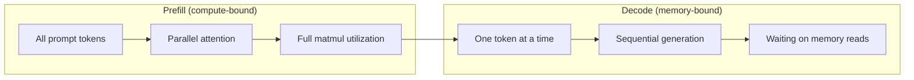
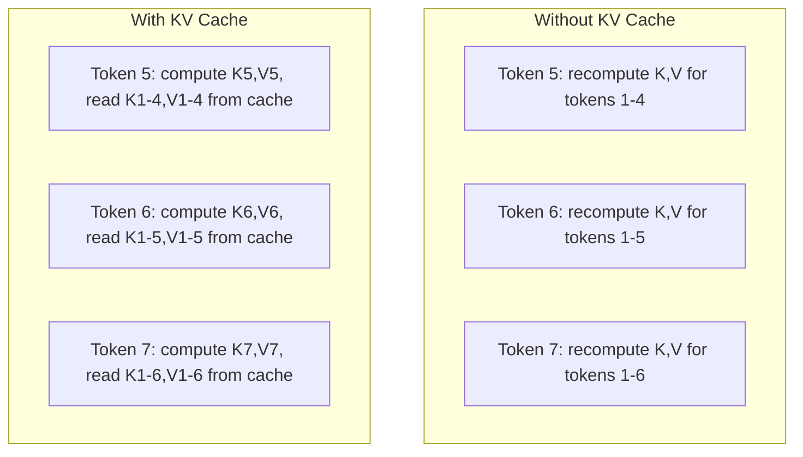
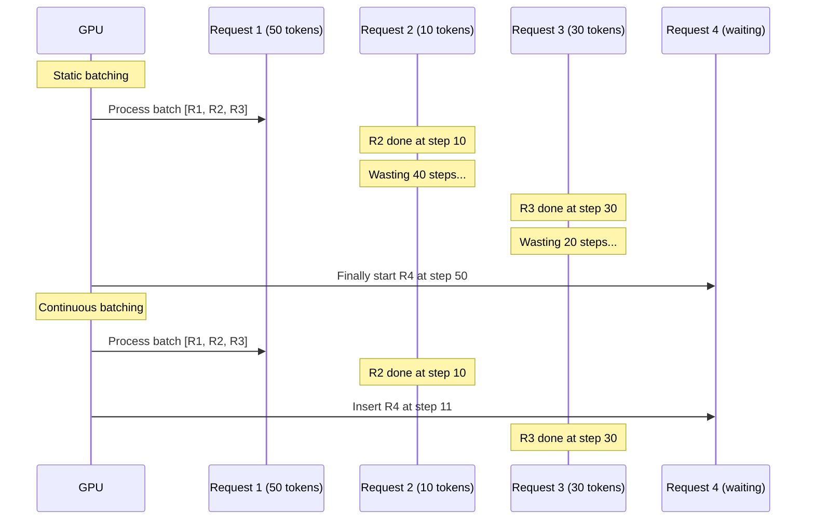
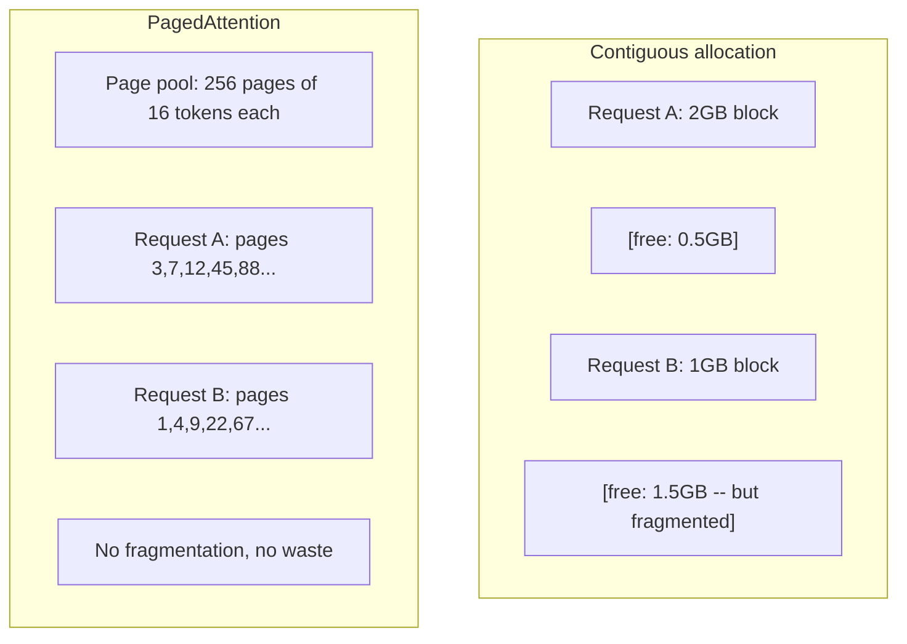
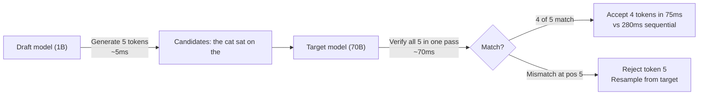

# इन्फेरेंस अनुकूलन                                                                                                                                                                                                                                                                                                                                                                                                                                                                                                                        

> दो चरण LLM inference को परिभाषित करते हैं. प्रीफिल आपके प्रॉम्प्ट को समानांतर में संसाधित करता है - कम्प्यूटेबल-बाउंड. डिकोड एक समय में टोकन उत्पन्न करता है - मेमोरी-बाउंड. प्रत्येक अनुकूलन एक या दोनों को लक्षित करता है.

> **【中文解读】**LLM 推理分两个阶段:预填充(并行处理快速,计算密集) 和码(逐代币 生成,显存带宽密集) ⋅KV-cache、连续批处理、投机解码都是针对这两个阶段的优化──

> **【拓展：推理优化→生产部署】**vLLM, TensorRT-LLM, TGI आदि विचार ढांचे ने KV-कैश प्रबंधन, निरंतर बैचिंग, पेजड ध्यान आदि को अनुकूलित किया है। इन तकनीकों को समझना उत्पादन वातावरण के लिए महत्वपूर्ण है।

>  **【前置】**学本节前कृपया पहले समझेंःचरण 10·01-08(ट्रांसफॉर्मर 架构、注意);GPU 计算 vs 显存带宽概念。本节是阶段 17 (इन्फ्रास्ट्रक्चर एंड प्रोडक्शन) के पहले स्थान उत्पादन LLM 部署核心。

>  **【类比】**LLM 推理 = 读书 + 写读书笔记。**Prefill**(处理 prompt) = 快速翻完书(并行扫所有 टोकन,计算密集);**Decode**(生成) = 逐字写笔记(一次写一个字,显存带宽密集)**KV cache**= 翻书时做书签(记住了每页关键信息,写笔记时不用重复);**continuous batching**= 同时给多人读书会服务 (动态拼组)

**Type:** Build
**Languages:** Python
**Prerequisites:** Phase 10, Lessons 01-08 (Transformer architecture, attention)
**Time:** ~120 minutes

## सीखने के लक्ष्य

- ऑटोरेग्रेसिव टोकन जनरेशन के दौरान अधिशेष गणना को समाप्त करने के लिए KV-कैश लागू करें
  实现 KV 缓存                                                                                                                                                                                                                                                                                                                                                                                                                                                                                                                       
- एलएलएम निष्कर्षण के प्रीफिल बनाम डिकोड चरणों को समझाएं और प्रत्येक में अलग-अलग बोतल की खाई क्यों है (कंप्यूटर-बाउंड बनाम मेमोरी-बाउंड)
  解释 LLM 推理的预填充与解码阶段及其不同瓶(计算密集 vs 访存密集)
- समवर्ती अनुरोधों के तहत GPU उपयोग को अधिकतम करने के लिए निरंतर बैचिंग और पेजडएटेंशन अवधारणाओं को लागू करें
  实现连续批处理和PageAttention 概念, अनुरोध पर जीपीयू उपयोग दर को अधिकतम करना
- निष्कर्ष अनुकूलन तकनीकों (केवी कैश, अनुमानात्मक डिकोडिंग, फ्लैश ध्यान) और उनके आउटपुट/लैटेंसी ट्रेडऑफ की तुलना करें
  तुलना करें अनुमानित अनुकूलन तकनीक(KV 缓存、投机解码、Flash Attention) और उसके吞吐量/延迟权衡

> **【中文解读】**本课焦 LLM 推理优化──两个核心概念:(1) प्रीफिल 阶段并行处理提示, GPU 计算量(FLOPS तक सीमित;(2) डिकोड 阶段 प्रति टोकन 生成,显存带宽――KV-cache 避免重复计算已生成的 टोकन के K/V,连续批处理最大化 GPU उपयोग दर,PagedAttention 解决 KV-cache के भंडारण टुकड़े का मुद्दा显――

## समस्या  समस्या परिचय

आप 4xA100 GPU पर Llama 3 70B को तैनात करते हैं. एक एकल उपयोगकर्ता को प्रति सेकंड ~ 50 टोकन मिलते हैं। यह तेजी से लगता है। फिर 100 उपयोगकर्ता एक साथ एंडपॉइंट पर पहुंचते हैं। पारगमन 3 टोकन / सेकंड / उपयोगकर्ता तक गिर जाता है। आपका $ 25,000 / महीने का GPU बिल मानव प्रकार की तुलना में धीमा प्रतिक्रियाएं प्रदान कर रहा है।

> आप 4xA100 GPU पर तैनात Llama 3 70B── एकल उपयोगकर्ता को लगभग 50 टोकन/सेकंड मिलता है── यह बहुत अच्छा लगता है── फिर 100 उपयोगकर्ता एक ही समय में टर्मिनल बिंदु का दौरा करते हैं──吞吐量 घटकर प्रति उपयोगकर्ता 3 टोकन/सेकंड──आप प्रति माह 25,000 डॉलर के GPU  खाते में मानव से अधिक धीमी प्रतिक्रिया प्रदान करते हैं──

मॉडल स्वयं 1 उपयोगकर्ता से 100 उपयोगकर्ता के बीच नहीं बदलता है। एक ही वजन, एक ही वास्तुकला, एक ही गणित. जो बदलाव होता है वह है कि आप काम को कैसे शेड्यूल करते हैं। साफ़-साफ़ अनुमान उपलब्ध GPU कम्प्यूटर का 90%+ बर्बाद करता है। एक उपयोगकर्ता टोकन 47 के लिए इंतजार कर रहा है एक पूरे बैच स्लॉट खुला है जबकि GPU स्मृति बस matmuls के बीच निष्क्रिय बैठता है। इस बीच, एक नए उपयोगकर्ता के 2,000 टोकन का अनुरोध उस निष्क्रिय समय को उपयोगी गणना से भर सकता है।

> 模型 स्वयं 1 उपयोगकर्ता और 100 उपयोगकर्ताओं के बीच कोई परिवर्तन नहीं है  समान वजन  समान संरचना  समान गणित  परिवर्तन यह है कि आप कैसे काम करते हैं  सरल तर्क 90%+ के लिए उपलब्ध GPU 计算  व्यर्थ है  47 वें टोकन के उपयोगकर्ता पूरे बैच स्लॉट स्थान पर कब्जा करते हैं, जबकि GPU  स्पष्ट भंडारण  अंतर  में रखा गया है  रैंक गुणा   साथ ही, एक नए उपयोगकर्ता के 2,000 टोकन प्रोंट का उपयोग उपयोगी गणना के साथ किया जा सकता है 

यह एक स्केलिंग समस्या नहीं है. यह एक शेड्यूलिंग समस्या है. इस पाठ में तकनीक - KV कैशिंग, निरंतर बैचिंग, पेजड ध्यान, अनुमानात्मक डिकोडिंग, उपसर्ग कैशिंग - जो अलग कर रहे हैं एक$25k/month inference bill from a $5k/महीने एक समान यातायात सेवा.

> यह विस्तार की समस्या नहीं है, बल्कि विनियमन की समस्या है।$25k 推理账单降为服务相同流量的 $5k 账单的关键──

vLLM 4xA100-80GB पर Llama 3 70B की सेवा करने वाले कम समवर्तीता पर ~ 50 टोकन / सेकंड / उपयोगकर्ता प्राप्त करते हैं, और निरंतर बैचिंग और पेजडएटेंशन के माध्यम से 100 समवर्ती अनुरोधों पर 15-25 TPS / उपयोगकर्ता को बनाए रखते हैं। इन अनुकूलन के बिना, एक ही हार्डवेयर उस समवर्तीता पर 5 TPS / उपयोगकर्ता की सेवा करता है। एक ही GPU, एक ही मॉडल, 4x थ्रूपुट।

> vLLM में 4xA100-80GB 上 सेवे लामा 3 70B, कम并发时达到约50 टोकन/秒/用户,通过连续批处理和PagedAttention在 100 并发请求下维持15-25 TPS/用户――没有这些优化,同样的硬件在该并发下只服务5 TPS/用户――同样的GPU、同样的模型、4倍吞吐量――

## अवधारणा का मूल अवधारणा

> **【中文解读】**LLM 推理 के दो चरणों में स्पष्ट रूप से अलग-अलग बोतल हैंः पूर्व-भरण 阶段 सीमित GPU FLOPS (गणितीय मात्रा), डिकोड 阶段 सीमित स्पष्ट भंडारण带宽 (प्रकाशित भंडारण)  प्रत्येक उत्पादन को पूरे मॉडल का वजन पढ़ना चाहिए)  केवी-कैश सबसे बुनियादी अनुकूलन है 缓存 उत्पन्न टोकन के कुंजी/मूल्य, पुनः गणना से बचने के लिए, 阶段 की जटिलता को O n^2)  से O n (N)  तक कम करेगा।

> **【拓展：vLLM 和 PagedAttention】**vLLM  का परिचय PagedAttention vLLM  का उपयोग करके vLLM के लिए एक निश्चित आकार के पृष्ठ भंडारण के रूप में किया जाता है। यह vLLM के लिए एक बड़ी मात्रा में है।


### प्रीफिल बनाम डिकोड

प्रत्येक LLM inference request में दो अलग-अलग चरण होते हैं।

> प्रत्येक एमएलएम अनुशंसा अनुरोध के दो अलग-अलग चरण होते हैं।

**Prefill**सभी टोकन ज्ञात हैं, इसलिए पूरे अनुक्रम में ध्यान समानांतर में गणना की जा सकती है। यह एक बड़ा मैट्रिक्स गुणा है - जीपीयू कोर व्यस्त रहते हैं। बोतल की खाई गणना हैः आपका हार्डवेयर प्रति सेकंड कितने फ्लोप्स वितरित कर सकता है। एक ए 100 312 टीएफएलओपीएस (बीएफ 16) करता है। 70 बी मॉडल पर 4,096-टोकन प्रॉम्प्ट के लिए प्रीफिल करने में ~ 400 एमएस का समय लगता है।

> **预填充**处理整个输入提示──所有代币 已知,所以注意力可以在完整序列上并行计算──这是大型矩阵乘法GPU 核心保持忙碌──瓶是计算:硬件每秒能提供多少 FLOPS──A100做 312 TFLOPS(BF16)──70B 模型上 4,096-代币提示的预填充在单张A100上约需要400ms──

**Decode**एक समय में एक आउटपुट टोकन उत्पन्न करता है। प्रत्येक नए टोकन में सभी पिछले टोकन शामिल होते हैं, लेकिन प्रत्येक फॉरवर्ड पास पर केवल एक टोकन ही उत्पन्न होता है। वजन मैट्रिक्स के आकार पूर्व भरने के दौरान के रूप में ही हैं, लेकिन आप उन्हें एक मैट्रिक्स के बजाय एक वेक्टर से गुणा कर रहे हैं. GPU कोर माइक्रोसेकंड में समाप्त हो जाते हैं, फिर अगले बैच के वजन की मेमोरी से आने का इंतजार करते हैं। बोतल की गली मेमोरी बैंडविड्थ हैः आप HBM से कंप्यूटिंग इकाइयों में मॉडल वजन को कितनी तेजी से स्ट्रीम कर सकते हैं। एक A100 2 TB / s बैंडविड्थ है। FP16 में 70B मॉडल 140 GB है। एक बार पूरा मॉडल पढ़ने में 70ms लगते हैं -- यह एक ही डिकोडिंग चरण के लिए आपका तल है।

> **解码**个别生成输出代币――每个新代币 关注所有前代币,但每次前向传播只产生一个代币――权力矩阵与预填充时的尺寸相同,但你使用单向量而不是矩阵与相乘――GPU 核心在微秒内完成,然后等待下一批权重从内存到内存到内存带宽:你能以多快的速度将模型权重从HBM 传输到计算单元――A100 有 2 TB/s 带宽――FP16 的 70B 模型是140 GB――读完整模型需要70ms这是单次解码步骤的下限.



**ops:byte ratio**(जिसे अंकगणितीय तीव्रता भी कहा जाता है) इस व्यापार को कैप्चर करता है. यह मापता है कि आप प्रति बाइट स्मृति से लोड किए गए कितने संचालन करते हैं.

```
ops:byte ratio = FLOPs per token / bytes read from memory
```

4,096 टोकन के बैच के साथ प्रीफिल के दौरान, आप लोड किए गए वजन के प्रति ~ 4,096 गुण संचय संचालन करते हैं। अनुपात उच्च है - आप कंप्यूटिंग-बाउंड हैं। बैच आकार 1 के साथ डिकोडिंग के दौरान, आप लोड किए गए वजन के प्रति ~ 1 ऑपरेशन करते हैं। अनुपात कम है - आप मेमोरी-बाउंड हैं।

मूल अंतर्दृष्टिः *डिकोड मेमोरी-बंद है क्योंकि आप एक ही टोकन उत्पन्न करने के लिए पूरे मॉडल को पढ़ते हैं।* नीचे प्रत्येक अनुकूलन या तो आप जो पढ़ते हैं उसे कम करता है, प्रति पठन पर संसाधित टोकन की बैच बढ़ाता है, या पूरी तरह से पढ़ने से बचाता है।

> 核心洞察:*解码内存密集型的, क्योंकि आप पूरे मॉडल को पढ़कर एक एकल टोकन उत्पन्न करते हैं*―― नीचे दिए गए प्रत्येक अनुकूलन या तो पढ़ने की मात्रा को कम करता है, या प्रति पढ़ने के प्रसंस्करण के टोकन को 批次 बढ़ाता है, या पूरी तरह से पढ़ने से बचता है――

### KV कैश

ध्यान के दौरान, प्रत्येक टोकन का क्वेरी प्रत्येक पिछले टोकन के कुंजी और मूल्य वेक्टरों का ध्यान रखती है। कैशिंग के बिना, टोकन N को उत्पन्न करने के लिए सभी N-1 से पहले टोकन के लिए कुंजी और मूल्य अनुमानों की पुनः गणना की आवश्यकता होती है। टोकन 1 को टोकन 2 उत्पन्न करते समय, फिर फिर टोकन 3 के लिए, फिर फिर टोकन 4 के लिए प्रोजेक्ट किया जाता है। टोकन 1,000 के माध्यम से, आपने टोकन 1 को कुल 999 बार प्रोजेक्ट किया है।

> ध्यान गणना में, प्रत्येक टोकन के प्रश्न सभी पिछले टोकन के कुंजी और मूल्य के आकार पर ध्यान केंद्रित करते हैं। कोई भंडारण नहीं है, उत्पन्न टोकन N को पुनः गणना करने की आवश्यकता है सभी N-1  पहले टोकन के कुंजी और मूल्य के अनुमानों को।

KV कैश सभी पिछले टोकन से कुंजी और मूल्य अनुमानों को संग्रहीत करता है। जब टोकन N उत्पन्न करते हैं, तो आप केवल टोकन N के लिए कुंजी और मूल्य की गणना करते हैं, फिर उन्हें टोकन 1 से N-1 तक कैश किए गए K / V के साथ जोड़ते हैं।

> KV 缓存存储 सभी पूर्व टोकन के की और मूल्य का अनुमान── उत्पन्न टोकन N 时, आप केवल टोकन N के की और मूल्य की गणना करते हैं, फिर के साथ कैश के टोकन 1 से N-1 के K/V 拼接──



**Memory formula for KV cache:**

```
KV cache size = 2 * num_layers * num_kv_heads * head_dim * seq_len * bytes_per_param
```

Llama 3 70B (80 परतें, 8 KV सिरों के साथ GQA, head_dim=128, BF16) के लिएः

```
per token: 2 * 80 * 8 * 128 * 2 bytes = 327,680 bytes = 320 KB
at 4,096 tokens: 320 KB * 4,096 = 1.28 GB
at 128K tokens: 320 KB * 131,072 = 40 GB
```

Llama 3 70B के लिए एक एकल 128K-सामग्री वार्तालाप 40 GB केवी कैश का उपभोग करता है - आधा A100 की स्मृति। प्रत्येक 4K टोकन पर 100 समवर्ती उपयोगकर्ताओं के साथ, केवल KV कैश को 128 GB की आवश्यकता होती है। यही कारण है कि KV कैश प्रबंधन निष्कर्ष अनुकूलन की केंद्रीय चुनौती है।

> Llama 3 70B का एकल 128K ऊपर नीचे वार्तालाप खपत 40 GB KV 缓存 आधे张 A100 का内存──100 并发用户 प्रत्येक 4K टोकन 时, केवल KV 缓存就需要 128 GB──这就是为什么 KV 缓存管理是推理优化的核心挑战──

### निरंतर बैचिंग

स्टैटिक बैचिंग N अनुरोधों के बैच के आगमन तक इंतजार करता है, उन्हें एक साथ संसाधित करता है, और नए अनुरोधों को स्वीकार करने से पहले *all* समाप्त होने तक इंतजार करता है। यदि एक अनुरोध को 500 टोकन और दूसरे को 10 की आवश्यकता होती है, तो यह समाप्त होने के बाद 490 डिकोडिंग चरणों के लिए निष्क्रिय रहता है।

> 静态批处理 प्रतीक्षा करें एक बैच N 个 अनुरोध आ गया है, साथ में संसाधित किया गया है, प्रतीक्षा करें* सब कुछ* पूरा होने के बाद पुनः नया अनुरोध स्वीकार करें。 यदि एक अनुरोध को 500 टोकन की आवश्यकता है  अन्य को 10 की आवश्यकता है, लघु अनुरोध को पूरा होने के बाद 置 490 个解码步骤。

निरंतर बैचिंग (जिसे पुनरावृत्ति स्तर बैचिंग भी कहा जाता है) किसी भी अनुरोध को पूरा करने के तुरंत बाद बैच में नए अनुरोधों को सम्मिलित करता है। प्रत्येक डिकोडिंग चरण में बैच का पुनर्मूल्यांकन किया जाता है। 10 टोकन के बाद समाप्त होने वाला अनुरोध तुरंत प्रतीक्षा अनुरोध से प्रतिस्थापित होता है।

> 连续批处理 (连续批处理) किसी भी अनुरोध के पूरा होने के तुरंत बाद नया अनुरोध डाला जाएगा।



आउटपुट लंबाई में सुधार इस बात पर निर्भर करता है कि आउटपुट लंबाई कितनी भिन्न होती है। समान लंबाई के साथ, निरंतर बैचिंग स्थिर बैचिंग से मेल खाती है। चर लंबाई (सामान्य मामला) के साथ, निरंतर बैचिंग 2-5 गुना अधिक आउटपुट प्रदान कर सकती है क्योंकि GPU स्लॉट कभी भी खाली नहीं बैठते हैं।

> 吞吐量 बढ़ाव आउटपुट लंबाई में कितना बदलाव होता है ️️️️️️️️️️️️️️️️️️️️️️️️️️️️️️️️️️️️️️️️️️️️️️️️️️️️️️️️️️️️️️️️️️️️️️️️️️️️️️️️️️️️️️️️️️️️️️️️️️️️️️️️️️️️️️️️️️️️️️️️️️️️️️️️️️️️️️️️️️️️️️️️️️️️️️️️️️️️️️️️

### पृष्ठ ध्यान

प्रत्येक अनुरोध के लिए KV कैश एक आसन्न स्मृति ब्लॉक है। जब अनुरोध आते हैं और जाते हैं, तो स्मृति टुकड़े - ऑपरेटिंग सिस्टम में रैम टुकड़े टुकड़े की तरह। 4K टोकन अनुरोध को 1.28 GB आसन्न की आवश्यकता होती है। यहां तक कि अगर आपके पास 2 GB मुफ्त कुल है, तो आपके पास 1.28 GB *समीक्षा* नहीं हो सकता है। आप या तो स्मृति बर्बाद करते हैं या अनुरोध को अस्वीकार करते हैं।

> प्रत्येक अनुरोध के केवी 缓存 एक ब्लॉक है निरंतर内存── आगमन और प्रस्थान के साथ,内存 टुकड़े टुकड़े 像操作系统 में रैम 碎片化──4K टोकन के अनुरोध के लिए 1.28 GB 连续空间── भले ही कुल 2 GB 空, हो सकता है 1.28 GB *连续* अंतरिक्ष── आप यादृच्छिक भंडारण या अनुरोध को अस्वीकार करना चाहते हैं।

PagedAttention (vLLM से) ओएस शैली की वर्चुअल मेमोरी को KV कैश में लागू करता है। प्रति अनुरोध एक आसन्न ब्लॉक आवंटित करने के बजाय, यह निश्चित आकार के "पृष्ठ" (आमतौर पर प्रत्येक 16 टोकन) आवंटित करता है। पृष्ठ भौतिक GPU मेमोरी में कहीं भी हो सकते हैं। एक पृष्ठ तालिका प्रत्येक अनुरोध के तार्किक अनुक्रम स्थानों को भौतिक पृष्ठ स्थानों पर मानचित्रित करती है।

> PagedAttention(vLLM से) ऑपरेटिंग सिस्टम के प्रकार का वर्चुअल内存 KV 缓存 में लागू किया जाएगा।



PagedAttention भी सक्षम करता है **copy-on-write**यदि 50 अनुरोध एक ही सिस्टम प्रॉम्प्ट को साझा करते हैं, तो उस सिस्टम प्रॉम्प्ट के लिए KV कैश पृष्ठ एक बार संग्रहीत होते हैं और सभी 50 अनुरोधों द्वारा संदर्भित होते हैं। केवल जब एक अनुरोध भिन्न होता है (अलग उपयोगकर्ता संदेश) तो इसे अपने स्वयं के पृष्ठ प्राप्त होते हैं। यह साझा सिस्टम प्रॉम्प्ट वाले अनुप्रयोगों के लिए मेमोरी उपयोग को नाटकीय रूप से कम करता है।

vLLM ने PagedAttention के माध्यम से लगभग शून्य स्मृति अपशिष्ट (~ 4% बनाम ~ 60-80% साफ़ आवंटन में) की रिपोर्ट की।

### अनुमानित डिकोडिंग

डिकोड धीमा है क्योंकि यह अनुक्रमिक है -- आप एक टोकन उत्पन्न करते हैं, इसे वापस खिलाते हैं, अगले को उत्पन्न करते हैं. लेकिन क्या होगा अगर आप अगले 5 टोकन को सस्ते में अनुमान लगा सकते हैं, फिर उन्हें एक साथ सत्यापित कर सकते हैं?

> 解码慢是因为它是顺序的生成一个代币,反回去,生成下一个――但是如果你能低价猜测下一个5个代币,然后一次验证所有吗?

अनुमानित डिकोडिंग एक छोटे, तेजी से उपयोग करता है **draft model**K उम्मीदवार टोकन उत्पन्न करने के लिए।**target model**फिर एक आगे के पास में सभी K उम्मीदवारों को संसाधित करता है (जो एक पूर्व-पूर्ति की तरह दिखता है - समानांतर, कम्प्यूटिंग-बाउंड, कुशल) यदि लक्ष्य मॉडल ड्राफ्ट मॉडल की भविष्यवाणियों से सहमत है, तो आप एक लक्ष्य आगे के पास के समय में सभी K टोकन स्वीकार करते हैं। यदि यह स्थिति j पर असहमत है, तो आप टोकन 1 से j-1 तक स्वीकार करते हैं और बाकी को फेंक देते हैं।

> 投机解码使用小而快的**草稿模型**生成 K 个候选标签──大型**目标模型**फिर एक बार के लिए प्रक्षेपण में सभी K 个候选人 (K 个候选人) को संसाधित करना (K 个候选人)  (K 个候选人)  (K 个候选人)  (K 个候选人)  (K 个候选人)  (K 个候选人)  (K 个候选人)  (K 个候选人)  (K 个候选人)  (K 个候选人)  (K 个候选人)  (K 个候选人)  (K 个候选人)  (K 个候选人)  (K 个候选人)  (K 个候选人)  (K 个候选人)  (K 个候选人)  (K 个候选人)  (K 个候选人)  (K 个候选人)  (K 个候选人)  (K 个候选人)  (K 个候选人)  ()  ()  ()  ()  ()  ()  ()  ()  ()  ()  () () () () () () () () () () () ( () () () () () () () ( () () () () () () () () () () () ( () () () () () () () () () () () () () () () () () () () ( () () () () () () () () () () () () ()



गति गति पर निर्भर करता है **acceptance rate**- कितनी बार मसौदा मॉडल की भविष्यवाणियों लक्ष्य से मेल खाती हैं। Llama 3 8B के लिए Llama 3 70B के लिए मसौदा के लिए, 70-85% की स्वीकृति दरें प्राकृतिक भाषा पर विशिष्ट हैं। यह 2-3x डिकोडिंग गति का अनुवाद करता है।

> 加速取决于**接受率**草稿模型的预测多频繁地匹配目标──Llama 3 8B 为 Llama 3 70B 草稿 बनाते समय, प्राकृतिक भाषा पर स्वीकृति दर आमतौर पर 70-85% है── यह 2-3 गुना के लिए अनुवादित है解码加速──

अनुमानित डिकोडिंग के तीन दृष्टिकोणः

| Method | Draft source | Acceptance rate | Overhead |
|--------|-------------|-----------------|----------|
| Draft-target (Leviathan et al.) | Separate small model | 70-85% | Draft model memory |
| EAGLE (Li et al.) | Lightweight head on target | 75-90% | ~1% extra parameters |
| N-gram lookup | Token n-gram table | 40-60% | Negligible |

**EAGLE**लक्ष्य मॉडल के छिपे राज्यों के शीर्ष पर एक छोटे से ऑटोरेग्रेसिव सिर को प्रशिक्षित करता है। यह लक्ष्य मॉडल की दूसरी से अंतिम परत सुविधाओं का उपयोग करके अगले टोकन के एम्बेडिंग की भविष्यवाणी करता है। क्योंकि यह लक्ष्य मॉडल के स्वयं के प्रतिनिधित्वों (अलग मॉडल के नहीं) पर काम करता है, यह न्यूनतम अतिरिक्त स्मृति के साथ उच्च स्वीकृति दर प्राप्त करता है। ईगल-2 एक गतिशील ड्राफ्ट ट्री जोड़ता है जो संदर्भ के आधार पर उम्मीदवारों की संख्या को समायोजित करता है।

**N-gram speculative decoding**वर्तमान संदर्भ या पूर्वनिर्मित कॉर्पस से n-ग्राम निरंतरता की तालिका बनाए रखता है। यदि मसौदा उसी बातचीत में पहले दिखाई देने वाले से मेल खाता है (पुनरावृत्ति पैटर्न, कोड, संरचित आउटपुट), तो यह शून्य तंत्रिका नेटवर्क ओवरहेड के साथ फायर करता है। स्वीकृति दर औसत से कम है लेकिन प्रति अटकल की लागत अनिवार्य रूप से मुफ्त है।

अनुमानात्मक डिकोडिंग *गणितीय रूप से सटीक* है - आउटपुट वितरण लक्ष्य मॉडल के वितरण के समान है। यह एक अनुमान नहीं है। सत्यापन चरण यह सुनिश्चित करता है कि प्रत्येक स्वीकार किए गए टोकन में लक्ष्य मॉडल द्वारा असाइन की गई संभावना है।

> 投机解码是*数学精确*输出分布与目标模型的分布完全相同──它不是近似──验证步骤确保每一个接受的代币 恰恰具有目标模型会分配的概率──

### पूर्वसर्ग कैशिंग

कई अनुरोध एक ही पूर्वावलोकन साझा करते हैं। एक चैटबॉट सिस्टम प्रॉम्प्ट। एक RAG संदर्भ ब्लॉक। कुछ शॉट उदाहरण सेट। पूर्वावलोकन कैशिंग के बिना, प्रत्येक अनुरोध इन साझा टोकन के लिए KV कैश को खरोंच से पुनः गणना करता है।

> 许多请求共享相同的前──聊天机器人系统提示──RAG 上下文块──少样本示例集──没有前缓存,每个请求从头重新计算这些共享代币的KV 缓存──

प्रीफिक्स कैशिंग सामान्य प्रीफिक्स के लिए KV कैश को संग्रहीत करता है और अनुरोधों के बीच इसका पुनः उपयोग करता है। जब एक नया अनुरोध एक ज्ञात प्रीफिक्स के साथ आता है, तो सिस्टम कैश किए गए KV प्रविष्टियों को कॉपी (या संदर्भ) करता है और केवल अद्वितीय प्रत्यय के लिए KV की गणना करता है।

> पूर्व缓存存储常见前 के के के 缓存并请求间复用──当新请求带有已知前到达时,系统复制(或引用)缓存 के के 条目, केवल गणना एकमात्र 后 के के के के के ──

2,000 टोकन वाले सिस्टम प्रॉम्प्ट के लिए सभी अनुरोधों के बीच साझा किया जाता है, प्रीफिक्स कैशिंग प्रति अनुरोध ~ 400ms प्रीफिल को समाप्त करता है। 100 अनुरोध / सेकंड पर, यह प्रति सेकंड 40 सेकंड GPU गणना बचाता है - एक GPU के मूल्य से अधिक काम।

>  सभी अनुरोध साझा करने के लिए 2,000-टोकन  सिस्टम प्रॉम्प्ट के लिए, पूर्व कैशिंग ने प्रत्येक अनुरोध के लगभग 400ms के पूर्व-भरण को समाप्त कर दिया  100 अनुरोध/सेकंड के समय में, प्रति सेकंड 40 सेकंड की बचत GPU  गणना  एक GPU के काम के आकार से अधिक 

### इन्फेरेंस इंजन

तीन इंजन उत्पादन एलएलएम सेवा पर हावी हैंः

| Engine | Key innovation | Best for |
|--------|---------------|----------|
| vLLM | PagedAttention, continuous batching | General-purpose serving, highest compatibility |
| SGLang | RadixAttention (prefix caching), structured generation | Multi-turn chatbots, constrained decoding |
| TensorRT-LLM | NVIDIA kernel fusion, FP8 quantization | Maximum single-GPU throughput on NVIDIA hardware |

**vLLM**यह सबसे व्यापक मॉडल रेंज का समर्थन करता है, किसी भी GPU आपूर्तिकर्ता (NVIDIA, AMD, Intel) पर चलता है, और PagedAttention + निरंतर बैचिंग के माध्यम से मजबूत आउटपुट प्राप्त करता है। OpenAI- संगत एपीआई का मतलब है कि आप इसे किसी भी OpenAI एपीआई कॉल के लिए प्रतिस्थापन के रूप में छोड़ सकते हैं।

**SGLang**vLLM के समान नींव पर बनाता है लेकिन संरचित LLM कार्यक्रमों के लिए प्रीफिक्स कैशिंग के लिए रडिक्सएटेंशन और एक डोमेन-विशिष्ट भाषा जोड़ता है। यदि आपके कार्यभार में मल्टी-टर्न वार्तालाप, उपकरण उपयोग या प्रतिबंधित डिकोडिंग (JSON आउटपुट, रेजेक्स-ग्यूडेड जनरेशन) शामिल है, तो एसजीएलएंग अक्सर प्रीफिक्स पुनः उपयोग के माध्यम से 2-5 गुना वीएलएलएम से बेहतर प्रदर्शन करता है।

**TensorRT-LLM**यह NVIDIA हार्डवेयर पर उच्चतम एकल-जीपीयू आउटपुट प्राप्त करता है लेकिन अधिक सेटअप की आवश्यकता होती है और केवल NVIDIA GPU पर काम करता है।

Llama 3 70B (4xA100-80GB, BF16) के लिए वास्तविक दुनिया के नंबरः

| Metric | vLLM | SGLang | TensorRT-LLM |
|--------|------|--------|---------------|
| Throughput (1 user) | ~50 TPS | ~55 TPS | ~65 TPS |
| Throughput (100 users) | ~2,500 total TPS | ~3,200 total TPS | ~3,000 total TPS |
| Time to first token | ~400ms | ~300ms (prefix hit) | ~350ms |
| Max context | 128K | 128K | 128K |

### ओप्सःबाइट फ्रेमवर्क

आप जो नहीं मापते हैं उसे अनुकूलित नहीं कर सकते। आपरेशनःबाइट अनुपात आपको बताता है कि आप कम्प्यूटेबल-बाउंड या मेमोरी-बाउंड हैं, जो यह निर्धारित करता है कि कौन से अनुकूलन मायने रखते हैं।

```
Compute roof: peak FLOPS of the GPU
Memory roof:  peak bandwidth * ops:byte ratio
```

जब ops:byte कम होता है (डेकोड, छोटे बैच), तो आप मेमोरी बैंडविड्थ छत पर हिट होते हैं। अधिक गणना (उच्च घड़ी, अधिक कोर) जोड़ना मदद नहीं करता है। आपको मेमोरी रीड्स (क्वांटिकेशन, KV कैश संपीड़न) को कम करने या अधिक उपयोगी काम पर रीड्स को निरस्त करने के लिए बैच आकार में वृद्धि करने की आवश्यकता होती है।

जब ops:byte उच्च होता है (पूर्व भरने, बड़े बैच), तो आप कंप्यूटिंग छत पर पहुंच जाते हैं। मेमोरी बैंडविड्थ अनुकूलन मदद नहीं करता है। आपको अधिक FLOPS को निचोड़ने के लिए तेजी से GPU, कर्नेल फ्यूजन या कम परिशुद्धता की आवश्यकता होती है।

| Scenario | ops:byte | Bound | Optimize with |
|----------|----------|-------|---------------|
| Prefill, batch=1 | ~4,096 | Compute | Kernel fusion, FP8 |
| Decode, batch=1 | ~1 | Memory | Quantization, KV compression |
| Decode, batch=32 | ~32 | Memory | Larger batch, continuous batching |
| Decode, batch=256 | ~256 | Transitioning | Both matter |
| Decode, batch=1024 | ~1,024 | Compute | Kernel fusion, tensor parallelism |

A100 पर क्रॉसओवर बिंदु ops:byte = 156 (312 TFLOPS / 2 TB/s) के आसपास है। 156 के नीचे, आप मेमोरी-बाउंड हैं। 156 के ऊपर, आप कंप्यूटिंग-बाउंड हैं। निरंतर बैचिंग प्रति पुनरावृत्ति अधिक टोकन पैक करके इस क्रॉसओवर की ओर डिकोड को धक्का देती है।

## इसे बनाओ, इसे पूरा करो।
```figure
context-window-slide
```

## इसे बनाओ

### चरण 1: स्क्रैच से KV कैश

हम एक बहु-हेड केवी कैश बनाते हैं जो प्रति परत, प्रति सिर, कुंजी और मूल्य अनुमानों को संग्रहीत करता है, और स्मृति विकास पैटर्न का प्रदर्शन करता है।

```python
import numpy as np

class KVCache:
    def __init__(self, num_layers, num_heads, head_dim, max_seq_len, dtype=np.float16):
        self.num_layers = num_layers
        self.num_heads = num_heads
        self.head_dim = head_dim
        self.max_seq_len = max_seq_len
        self.dtype = dtype

        self.k_cache = np.zeros(
            (num_layers, num_heads, max_seq_len, head_dim), dtype=dtype
        )
        self.v_cache = np.zeros(
            (num_layers, num_heads, max_seq_len, head_dim), dtype=dtype
        )
        self.seq_len = 0

    def update(self, layer_idx, new_keys, new_values):
        num_new = new_keys.shape[1]
        end = self.seq_len + num_new
        self.k_cache[layer_idx, :, self.seq_len:end, :] = new_keys
        self.v_cache[layer_idx, :, self.seq_len:end, :] = new_values
        return (
            self.k_cache[layer_idx, :, :end, :],
            self.v_cache[layer_idx, :, :end, :]
        )

    def advance(self, num_tokens):
        self.seq_len += num_tokens

    def memory_bytes(self):
        return self.k_cache.nbytes + self.v_cache.nbytes

    def used_bytes(self):
        per_token = 2 * self.num_layers * self.num_heads * self.head_dim * np.dtype(self.dtype).itemsize
        return per_token * self.seq_len
```

### चरण 2: KV कैश के साथ ध्यान

एक सरल बहु-हेड ध्यान जो डिकोड चरणों के लिए KV कैश का उपयोग करता है।

```python
def scaled_dot_product_attention(query, keys, values):
    head_dim = query.shape[-1]
    scores = np.matmul(query, keys.transpose(0, 1, 3, 2)) / np.sqrt(head_dim)
    seq_len_q = scores.shape[-2]
    seq_len_k = scores.shape[-1]
    if seq_len_q > 1:
        mask = np.triu(np.ones((seq_len_q, seq_len_k), dtype=np.float32), k=seq_len_k - seq_len_q + 1)
        scores = scores + mask * (-1e9)
    max_scores = np.max(scores, axis=-1, keepdims=True)
    exp_scores = np.exp(scores - max_scores)
    attn_weights = exp_scores / np.sum(exp_scores, axis=-1, keepdims=True)
    return np.matmul(attn_weights, values)


class MultiHeadAttention:
    def __init__(self, d_model, num_heads):
        self.num_heads = num_heads
        self.head_dim = d_model // num_heads
        scale = np.sqrt(2.0 / d_model)
        self.W_q = np.random.randn(d_model, d_model).astype(np.float32) * scale
        self.W_k = np.random.randn(d_model, d_model).astype(np.float32) * scale
        self.W_v = np.random.randn(d_model, d_model).astype(np.float32) * scale
        self.W_o = np.random.randn(d_model, d_model).astype(np.float32) * scale

    def forward(self, x, kv_cache=None, layer_idx=0):
        batch, seq_len, d_model = x.shape
        Q = np.matmul(x, self.W_q).reshape(batch, seq_len, self.num_heads, self.head_dim).transpose(0, 2, 1, 3)
        K = np.matmul(x, self.W_k).reshape(batch, seq_len, self.num_heads, self.head_dim).transpose(0, 2, 1, 3)
        V = np.matmul(x, self.W_v).reshape(batch, seq_len, self.num_heads, self.head_dim).transpose(0, 2, 1, 3)

        if kv_cache is not None:
            K_full, V_full = kv_cache.update(layer_idx, K[0], V[0])
            K = K_full[np.newaxis, :, :, :]
            V = V_full[np.newaxis, :, :, :]
            if seq_len == 1:
                kv_cache.advance(1)

        attn_out = scaled_dot_product_attention(Q, K, V)
        attn_out = attn_out.transpose(0, 2, 1, 3).reshape(batch, -1, d_model)
        return np.matmul(attn_out, self.W_o)
```

### चरण 3: निरंतर बैचिंग सिम्युलेटर

यह स्थैतिक और निरंतर बैचिंग के बीच अनुसूची अंतर का अनुकरण करता है।

```python
import heapq

class Request:
    def __init__(self, request_id, prompt_tokens, output_tokens, arrival_step):
        self.request_id = request_id
        self.prompt_tokens = prompt_tokens
        self.output_tokens = output_tokens
        self.arrival_step = arrival_step
        self.tokens_generated = 0
        self.start_step = None
        self.end_step = None

    def is_done(self):
        return self.tokens_generated >= self.output_tokens


def simulate_static_batching(requests, batch_size):
    step = 0
    completed = []
    queue = list(requests)
    queue.sort(key=lambda r: r.arrival_step)

    while queue:
        batch = []
        while queue and len(batch) < batch_size:
            r = queue.pop(0)
            r.start_step = max(step, r.arrival_step)
            batch.append(r)

        if batch:
            step = max(step, max(r.start_step for r in batch))
            max_output = max(r.output_tokens for r in batch)
            for r in batch:
                r.tokens_generated = r.output_tokens
                r.end_step = step + max_output
            step += max_output
            completed.extend(batch)

    return completed


def simulate_continuous_batching(requests, batch_size):
    step = 0
    completed = []
    queue = sorted(requests, key=lambda r: r.arrival_step)
    queue_idx = 0
    active = []
    waiting = []

    while queue_idx < len(queue) or active or waiting:
        while queue_idx < len(queue) and queue[queue_idx].arrival_step <= step:
            waiting.append(queue[queue_idx])
            queue_idx += 1

        while waiting and len(active) < batch_size:
            r = waiting.pop(0)
            r.start_step = step
            active.append(r)

        if not active:
            if waiting:
                step += 1
                continue
            elif queue_idx < len(queue):
                step = queue[queue_idx].arrival_step
                continue
            else:
                break

        for r in active:
            r.tokens_generated += 1

        done = [r for r in active if r.is_done()]
        for r in done:
            r.end_step = step + 1
            completed.append(r)
        active = [r for r in active if not r.is_done()]

        step += 1

    return completed


def batching_stats(completed):
    latencies = [r.end_step - r.arrival_step for r in completed]
    total_time = max(r.end_step for r in completed) - min(r.arrival_step for r in completed)
    total_tokens = sum(r.output_tokens for r in completed)
    return {
        "avg_latency": np.mean(latencies),
        "p50_latency": np.median(latencies),
        "p99_latency": np.percentile(latencies, 99),
        "total_time": total_time,
        "throughput": total_tokens / total_time if total_time > 0 else 0,
    }
```

### चरण 4: पूर्वनिर्धारित कैश

एक tri आधारित पूर्वावधान कैश जो साझा पूर्वावधानों के लिए KV प्रविष्टियों को संग्रहीत करता है।

```python
class TrieNode:
    def __init__(self):
        self.children = {}
        self.kv_data = None
        self.hit_count = 0


class PrefixCache:
    def __init__(self, max_entries=1000):
        self.root = TrieNode()
        self.max_entries = max_entries
        self.total_entries = 0
        self.hits = 0
        self.misses = 0

    def _walk(self, token_ids):
        node = self.root
        depth = 0
        for tid in token_ids:
            if tid not in node.children:
                break
            node = node.children[tid]
            depth += 1
        return node, depth

    def lookup(self, token_ids):
        node, depth = self._walk(token_ids)
        if depth > 0:
            self.hits += 1
            current = self.root
            for tid in token_ids[:depth]:
                current = current.children[tid]
                current.hit_count += 1
            kv_entries = []
            current = self.root
            for tid in token_ids[:depth]:
                current = current.children[tid]
                if current.kv_data is not None:
                    kv_entries.append(current.kv_data)
            return depth, kv_entries
        self.misses += 1
        return 0, []

    def insert(self, token_ids, kv_per_token):
        node = self.root
        for i, tid in enumerate(token_ids):
            if tid not in node.children:
                if self.total_entries >= self.max_entries:
                    return i
                node.children[tid] = TrieNode()
                self.total_entries += 1
            node = node.children[tid]
            if i < len(kv_per_token):
                node.kv_data = kv_per_token[i]
        return len(token_ids)

    def hit_rate(self):
        total = self.hits + self.misses
        return self.hits / total if total > 0 else 0.0
```

### चरण 5: अनुमानित डिकोडिंग सिम्युलेटर

हम विन्यास योग्य स्वीकृति दरों के साथ मसौदा-लक्ष्य अनुमानात्मक डिकोडिंग का अनुकरण करते हैं।

```python
class DraftModel:
    def __init__(self, vocab_size, acceptance_rate=0.8):
        self.vocab_size = vocab_size
        self.acceptance_rate = acceptance_rate

    def generate(self, context, num_tokens):
        tokens = np.random.randint(0, self.vocab_size, size=num_tokens)
        return tokens

    def get_probs(self, context, token):
        probs = np.random.dirichlet(np.ones(self.vocab_size))
        return probs


class TargetModel:
    def __init__(self, vocab_size):
        self.vocab_size = vocab_size

    def get_probs(self, context, tokens=None):
        if tokens is not None:
            return [np.random.dirichlet(np.ones(self.vocab_size)) for _ in tokens]
        return np.random.dirichlet(np.ones(self.vocab_size))


def speculative_decode(draft_model, target_model, context, num_speculative=5,
                       draft_cost=1.0, target_cost=10.0, verify_cost=12.0):
    total_tokens = 0
    total_cost = 0.0
    accepted_counts = []
    context = list(context)

    max_tokens = 100

    while total_tokens < max_tokens:
        draft_tokens = draft_model.generate(context, num_speculative)
        total_cost += draft_cost * num_speculative

        target_probs = target_model.get_probs(context, draft_tokens)
        total_cost += verify_cost

        accepted = 0
        for i, token in enumerate(draft_tokens):
            draft_p = draft_model.get_probs(context + list(draft_tokens[:i]), token)
            target_p = target_probs[i]

            r = np.random.random()
            acceptance_prob = min(1.0, target_p[token] / (draft_p[token] + 1e-10))

            if r < draft_model.acceptance_rate:
                accepted += 1
                context.append(token)
                total_tokens += 1
            else:
                new_token = np.random.choice(draft_model.vocab_size, p=target_p)
                context.append(new_token)
                total_tokens += 1
                break

        accepted_counts.append(accepted)

        if accepted == num_speculative:
            bonus_probs = target_model.get_probs(context)
            bonus_token = np.random.choice(draft_model.vocab_size, p=bonus_probs)
            context.append(bonus_token)
            total_tokens += 1

    sequential_cost = total_tokens * target_cost
    return {
        "total_tokens": total_tokens,
        "speculative_cost": total_cost,
        "sequential_cost": sequential_cost,
        "speedup": sequential_cost / total_cost if total_cost > 0 else 1.0,
        "avg_accepted": np.mean(accepted_counts),
        "acceptance_rate": np.mean(accepted_counts) / num_speculative,
    }


def compare_speculation_strategies(vocab_size=1000, num_trials=20):
    results = {}

    for name, acceptance_rate, spec_tokens in [
        ("Draft-target (8B->70B)", 0.78, 5),
        ("EAGLE", 0.85, 6),
        ("N-gram", 0.50, 4),
        ("No speculation", 0.0, 0),
    ]:
        if spec_tokens == 0:
            results[name] = {
                "speedup": 1.0,
                "acceptance_rate": 0.0,
                "avg_accepted": 0.0,
            }
            continue

        trial_results = []
        for _ in range(num_trials):
            draft = DraftModel(vocab_size, acceptance_rate=acceptance_rate)
            target = TargetModel(vocab_size)
            context = list(np.random.randint(0, vocab_size, size=10))
            result = speculative_decode(draft, target, context, num_speculative=spec_tokens)
            trial_results.append(result)

        results[name] = {
            "speedup": np.mean([r["speedup"] for r in trial_results]),
            "acceptance_rate": np.mean([r["acceptance_rate"] for r in trial_results]),
            "avg_accepted": np.mean([r["avg_accepted"] for r in trial_results]),
        }

    return results
```

### चरण 6: KV कैश मेमोरी प्रोफाइलर

वास्तविक मॉडल कॉन्फ़िगरेशन के लिए KV कैश मेमोरी आवश्यकताओं की गणना करें।

```python
MODEL_CONFIGS = {
    "Llama-3-8B": {
        "num_layers": 32, "num_kv_heads": 8, "head_dim": 128,
        "model_params_b": 8, "gqa": True,
    },
    "Llama-3-70B": {
        "num_layers": 80, "num_kv_heads": 8, "head_dim": 128,
        "model_params_b": 70, "gqa": True,
    },
    "Llama-3-405B": {
        "num_layers": 126, "num_kv_heads": 8, "head_dim": 128,
        "model_params_b": 405, "gqa": True,
    },
    "Mistral-7B": {
        "num_layers": 32, "num_kv_heads": 8, "head_dim": 128,
        "model_params_b": 7, "gqa": True,
    },
    "GPT-4-est": {
        "num_layers": 120, "num_kv_heads": 96, "head_dim": 128,
        "model_params_b": 1800, "gqa": False,
    },
}


def kv_cache_memory(config, seq_len, dtype_bytes=2):
    per_token = 2 * config["num_layers"] * config["num_kv_heads"] * config["head_dim"] * dtype_bytes
    total = per_token * seq_len
    return {
        "per_token_bytes": per_token,
        "per_token_kb": per_token / 1024,
        "total_bytes": total,
        "total_mb": total / (1024 ** 2),
        "total_gb": total / (1024 ** 3),
    }


def memory_budget(config, gpu_memory_gb, model_dtype_bytes=2, kv_dtype_bytes=2):
    model_memory_gb = config["model_params_b"] * 1e9 * model_dtype_bytes / (1024 ** 3)
    overhead_gb = gpu_memory_gb * 0.1
    available_for_kv = gpu_memory_gb - model_memory_gb - overhead_gb

    if available_for_kv <= 0:
        return {"error": "Model does not fit in GPU memory", "model_memory_gb": model_memory_gb}

    per_token = 2 * config["num_layers"] * config["num_kv_heads"] * config["head_dim"] * kv_dtype_bytes
    max_tokens = int(available_for_kv * (1024 ** 3) / per_token)

    return {
        "gpu_memory_gb": gpu_memory_gb,
        "model_memory_gb": round(model_memory_gb, 1),
        "overhead_gb": round(overhead_gb, 1),
        "available_for_kv_gb": round(available_for_kv, 1),
        "max_total_tokens": max_tokens,
        "max_users_at_2k": max_tokens // 2048,
        "max_users_at_4k": max_tokens // 4096,
        "max_users_at_32k": max_tokens // 32768,
    }
```

## इसे फ्रेमवर्क के साथ लागू करें

vLLM के साथः

```python
from vllm import LLM, SamplingParams

llm = LLM(
    model="meta-llama/Llama-3-70B-Instruct",
    tensor_parallel_size=4,
    enable_prefix_caching=True,
    max_model_len=8192,
    gpu_memory_utilization=0.9,
)

params = SamplingParams(temperature=0.7, max_tokens=256)
outputs = llm.generate(["Explain inference optimization in one paragraph."], params)
```

पूर्वनिर्धारित कैशिंग + संरचित आउटपुट के लिए SGLang के साथः

```python
import sglang as sgl

@sgl.function
def classify(s, text):
    s += sgl.system("You are a classifier. Output JSON only.")
    s += sgl.user(f"Classify this text: {text}")
    s += sgl.assistant(sgl.gen("result", regex=r'\{"label": "(positive|negative|neutral)"\}'))

runtime = sgl.Runtime(model_path="meta-llama/Llama-3-70B-Instruct", tp_size=4)
sgl.set_default_backend(runtime)

results = classify.run_batch([
    {"text": "This product is amazing!"},
    {"text": "Terrible experience."},
    {"text": "It was okay I guess."},
])
```

TensorRT-LLM के साथः

```python
import tensorrt_llm
from tensorrt_llm.runtime import ModelRunner

runner = ModelRunner.from_dir("./llama-70b-trt-engine/", rank=0)

outputs = runner.generate(
    batch_input_ids=[tokenizer.encode("Explain KV caching.")],
    max_new_tokens=256,
    temperature=0.7,
)
```

## इसे भेजें उत्पाद

इस पाठ से उत्पन्न होता हैः
- `outputs/skill-inference-optimization.md`-- एलएलएम निष्कर्ष सेवा निदान और अनुकूलन के लिए एक कौशल

> 本课产出:
> - `outputs/skill-inference-optimization.md` निदान और अनुकूलन LLM 推理服务 के कौशल

## अभ्यास विषय

1. 4. 4K संदर्भ में Llama 3 70B के लिए, प्रत्येक के लिए अधिकतम समवर्ती उपयोगकर्ताओं की गणना 4xA100-80GB पर करें। INT4 के लिए KV क्वांटिज़ेशन को उपयोगकर्ता क्षमता का लगभग 4 गुना करना चाहिए।
   中文翻译:修改 KV 缓存分析器比较 FP16 vs FP8 vs INT4 KV 缓存量化──对于4K 上下文的Llama 3 70B,计算 4xA100-80GB 上每种格式最大并发用户数──INT4 KV 量化应大约 4倍用户容量──

2. पीजीपी उपयोग (प्रति चरण भरने वाले बैच स्लॉट का अंश) को ट्रैक करने के लिए निरंतर बैचिंग सिम्युलेटर का विस्तार करें। 50 अनुरोधों के साथ स्थैतिक और निरंतर बैचिंग दोनों के लिए समय के साथ प्लॉट उपयोग जिनकी आउटपुट लंबाई एक पारेटो वितरण (आकार = 1.5, पैमाने = 20) का पालन करती है। निरंतर बैचिंग को 80% उपयोग बनाए रखना चाहिए।
   चीनी अनुवादः विस्तार निरंतर批处理模拟器 अनुगमन GPU उपयोग दर(प्रति चरण में槽次位填充比例) ・绘制静态和连续批处理随时间的利用率图,50 个请求的输出长度遵循帕累托分布(形=1.5,尺度=20) ・连续批处理应维持 >80% उपयोग दर。

3. KV कैश का एक समूहबद्ध-सवाल ध्यान (GQA) संस्करण लागू करें जहां `num_kv_heads < num_query_heads`. Llama 3 70B 64 क्वेरी हेड का उपयोग करता है लेकिन केवल 8 KV हेड। मेमोरी बचत बनाम पूर्ण मल्टी-हेड ध्यान (8 गुना KV कैश आकार में कमी) की गणना करें।
   中文翻译:实现分组查询注意力(GQA) संस्करण के KV 缓存, उनमें से `num_kv_heads < num_query_heads`◊Llama 3 70B 64 查询头, लेकिन केवल 8  KV 头――计算相比完整多头注意力内存节省(KV 缓存大小减少8倍)

4. एक पूर्वावलोकन कैश बनाएं जो LRU निष्कासन का उपयोग करता है। अधिकतम प्रविष्टियों को 500 पर सेट करें और 1,000 अनुरोध उत्पन्न करें जहां 60% 5 सामान्य पूर्वावधानों में से एक साझा करते हैं। हिट दर को मापें और असीमित कैश की तुलना करें। अच्छे निष्कासन के साथ, हिट दर 55% से ऊपर होनी चाहिए।
   中文翻译:构建使用 LRU 淘汰的前缓存──设置 max_entries 为 500,生成 1,000 个请求, जिनमें से 60% 共享 5 个常见前之一──测量命中率并与无限缓存比较──良好淘汰下命中率应保持在 55%以上──

5. पेड़ आधारित अटकलों (ईएजीएलई -2) को लागू करने के लिए अनुमानात्मक डिकोडिंग सिम्युलेटर का विस्तार करें। के ड्राफ्ट टोकन की एक एकल श्रृंखला के बजाय, उम्मीदवारों का एक पेड़ उत्पन्न करें (उदाहरण के लिए, 3 स्तरों में से प्रत्येक में 2 शाखाएँ = 8 पत्ती उम्मीदवार) । सत्यापन दौर बनाम रैखिक अटकलों के लिए स्वीकार किए गए कुल टोकन की तुलना करें।
   चीनी अनुवादः विस्तार投机解码模拟器实现树状投机(EAGLE-2风格) ・・・ K 个草稿 टोकन के एकल链 नहीं, बल्कि उम्मीदवार पेड़ उत्पन्न करना है(उदाहरण के लिए 3 层每层 2 分支 = 8 个叶选) ◊ तुलना करें प्रत्येक दौर परीक्षण स्वीकार किए गए टोकन 总数与线性投机──

## कीवर्ड्स  शब्द खोज तालिका

| Term | What people say | What it actually means | 中文释义 |
|------|----------------|----------------------|---------|
| Prefill | "Processing the prompt" | Computing attention over all input tokens in parallel -- compute-bound because the full matrix multiplication keeps GPU cores busy | 预填充，并行处理所有输入 token，计算密集 |
| Decode | "Generating tokens" | Producing one token per forward pass, reading the full model weights each time -- memory-bound because compute finishes before the next weights arrive | 解码，逐 token 生成，访存密集 |
| KV cache | "Caching attention states" | Storing the key and value projections for all previous tokens so they are not recomputed at each decode step -- trades memory for compute | KV 缓存，存储已生成 token 的 K/V 投影 |
| Continuous batching | "Dynamic batching" | Inserting new requests into the running batch as soon as any request finishes, evaluated at every decode iteration rather than waiting for the whole batch | 连续批处理，请求完成即插入新请求 |
| PagedAttention | "Virtual memory for KV cache" | Allocating KV cache in fixed-size pages instead of contiguous blocks, eliminating memory fragmentation and enabling copy-on-write for shared prefixes | 分页注意力，用固定大小页管理 KV 缓存 |
| Speculative decoding | "Draft and verify" | Using a fast draft model to propose multiple tokens, then verifying them all in one target model forward pass -- mathematically exact, 2-3x speedup | 投机解码，草稿模型提议+目标模型验证 |
| EAGLE | "Self-speculative decoding" | A speculative decoding variant that trains a lightweight head on the target model's own hidden states, achieving higher acceptance rates than a separate draft model | EAGLE，在目标模型隐藏状态上训练轻量草稿头 |
| Prefix caching | "Reusing system prompt KV" | Storing computed KV cache entries for common prefixes (system prompts, few-shot examples) and reusing them across requests to skip redundant prefill | 前缀缓存，复用系统提示的 KV 缓存 |
| Ops:byte ratio | "Arithmetic intensity" | The ratio of compute operations to memory bytes read -- determines whether a workload is compute-bound (high ratio) or memory-bound (low ratio) | 运算字节比，判断计算密集还是访存密集 |
| Time to first token | "TTFT" | Latency from receiving a request to producing the first output token -- dominated by prefill time for long prompts | 首 token 延迟，从接收请求到生成第一个 token |

## आगे पढ़ना 延伸閱讀

- Kwon et al., "पेज्ड ध्यान के साथ सेवा करने वाले बड़े भाषा मॉडल के लिए कुशल मेमोरी प्रबंधन" (2023) -- vLLM पेपर जिसने पेज्ड KV कैश प्रबंधन की शुरुआत की, अब इन्फरेन्स सेवा के लिए उद्योग मानक
- लेवीयथन और अन्य, "स्पेक्टेटिव डिकोडिंग के माध्यम से ट्रांसफार्मर से फास्ट इन्फेरेंस" (2023) -- आधारभूत पेपर जो साबित करता है कि ड्राफ्ट-सत्यापित अटकलें सटीक लक्ष्य मॉडल वितरण का उत्पादन करती हैं जबकि 2-3x गति प्राप्त करती हैं
- लि और अन्य, "एजीएलः अनुमानित नमूनाकरण को फीचर अनिश्चितता को पुनर्विचार करने की आवश्यकता है" (2024) -- एक अलग ड्राफ्ट मॉडल का उपयोग करने के बजाय लक्ष्य मॉडल की अपनी विशेषताओं पर एक प्रमुख को प्रशिक्षित करके उच्च स्वीकृति दर प्राप्त करता है
- झेंग एट एल., "एसजीएलएंगः स्ट्रक्चरल लैंग्वेज मॉडल प्रोग्राम का कुशल निष्पादन" (2024) -- प्रीफिक्स कैशिंग के लिए रेडिक्सएटेंशन और मल्टी-कॉल एलएलएम कार्यक्रमों के लिए एक प्रोग्रामिंग मॉडल की शुरूआत करता है
- विलियम्स एट अल, "रोफलाइनः मल्टीकोर आर्किटेक्चर के लिए एक अंतर्दृष्टिपूर्ण विज़ुअल परफॉर्मेंस मॉडल" (2009) -- मूल छतलाइन पेपर जिसने कंप्यूटिंग बनाम मेमोरी बोतल गड्ढे के बारे में तर्क के लिए ओएसःबाइट फ्रेमवर्क को औपचारिक बनाया
