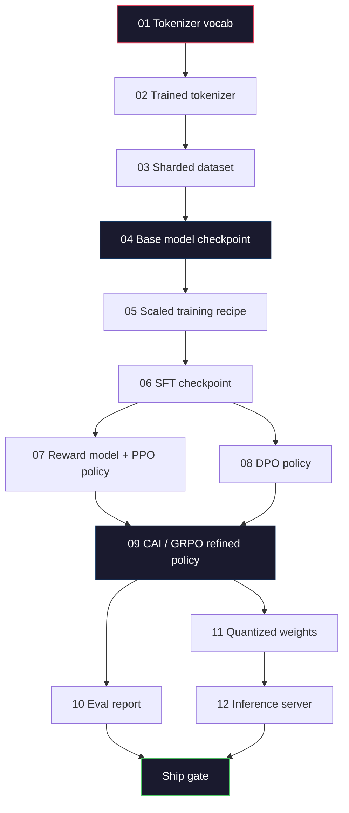
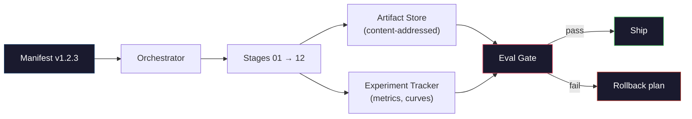

# एक पूर्ण LLM पाइपलाइन का निर्माण

> सब कुछ पाठ 01 से 12 तक एक पाइपलाइन का एक चरण है। यह सबक एक मंच है जो उन चरणों को एक एकल अंत-से-अंत रन में बदल देता हैः टोकन, प्री-ट्रेन, स्केल, एसएफटी, संरेखित, मूल्यांकन, क्वांटिज़, सेवा। आप एक लैपटॉप पर एक 70B मॉडल को प्रशिक्षित नहीं करेंगे। आप ऑर्केस्ट्रेशन लेयर, मैनिफिस, एवल गेट और रूलबैक प्लान तैयार करेंगे जो 2026 सीमा टीम द्वारा तय करने के लिए उपयोग किया जाएगा कि क्या शिप किया जाएगा। यह है कपास्टोन.

> **【中文解读】**第 01-12 课程是一条管线的各个阶段──本课将它们连连为端到端运行:分词→预训练→扩展→SFT→对齐→评估→量化→部署──你不会在笔记本上训练70B 模型,但你会出 2026年前沿团队用来决定发布什么编排层──

> **【拓展：端到端管线→生产实践】**वास्तविक बड़े मॉडल उत्पादन लाइन में भी शामिल हैंः डेटा संस्करण प्रबंधन, प्रयोग अनुवर्ती (W&B) मॉडल पंजीकरण, ए/बी परीक्षण, रोट्रॉल योजना।

>  **【前置】**यह चरण 10 का कैपस्टोन है, चरण 10 को पूरा करने की आवश्यकता है।

>  **【类比】**完整LLM 管线 = 造车流水线.前面 12 课学学了每个工位. 发动机,装底盘,喷漆),本节是工厂设计师把这些工位按顺序串起,加上"质检门" (质检门) "返工通道" (rollback) "生产计划表" (प्रदर्शन) .

**Type:** Build
**Languages:** Python (stdlib)
**Prerequisites:** All Phase 10 lessons 01-12
**Time:** ~120 minutes

## सीखने के लक्ष्य

- 11 पूर्व पाठों (टोकनीज़र, डेटा, प्री-ट्रेनिंग, स्केलिंग, एसएफटी, आरएलएचएफ, डीपीओ, सीएआई, इवल, क्वांटिज़ेशन, इन्फेरेंस) को एक एकल पुनरावर्तन योग्य पाइपलाइन विनिर्देश में मिलाएं
  将分词、数据、预训练、扩展、SFT、RLHF、DPO、CAI、评估、量化、推理) को एक एकल पुनः प्रयोज्य पाइपलाइन विनियमन के रूप में संकलित किया गया है
- चरणों के बीच कलाकृतियों के अनुबंध को परिभाषित करेंः प्रत्येक चरण क्या खपत करता है, यह क्या बनाता है, और अगला चरण इनपुट की पुष्टि कैसे करता है
  定义阶段间产品契约: प्रत्येक चरण में खपत क्या है 产出 क्या है 下一阶段 कैसे सत्यापित करें
- एक ऑर्केस्ट्रेटर का निर्माण करें जो प्रयोगों को ट्रैक करता है, कलाकृतियों को हैश करता है, और मूल्यांकन सीमाओं पर निर्णयों को जहाज करता है
  संयोजक का निर्माण, प्रयोगों का अनुसरण करना, उत्पादों का पालन करना, और मूल्य निर्धारण पर निर्णय लेने का प्रबंधन करना
- रोलबैक योजना का डिजाइन करेंः कौन सी कलाकृतियों को फिर से चलाया जाना सस्ता है, कौन सी महंगी हैं, और एक भ्रष्ट चेकपोस्ट की लागत क्या है
  डिजाइन रोटल प्लानः कौन सी वस्तुएं सस्ती चल सकती हैं, कौन सी महंगी, खराब की जाँच बिंदु लागत

## समस्या  समस्या परिचय

पहले के सबक प्रत्येक काम करते हैं। टोकनराइज़र प्रशिक्षित। छोटे जीपीटी पूर्व-प्रशिक्षित। एसएफटी डेटासेट इकट्ठा किया गया। इनाम मॉडल प्रशिक्षित। डीपीओ रन। मापा गया समतुल्य। निर्यात किया गया मात्रा वजन। इन्फरेंस सर्वर फटा हुआ। प्रत्येक एक नोटबुक है। प्रत्येक के अपने स्वयं के सम्मेलन, अपने स्वयं के आउटपुट पथ, अपने स्वयं के बीज हैं।

> पहले के पाठ्यक्रमों में प्रत्येक कार्य कर सकता है 分词器 प्रशिक्षण दिया गया है 迷你 GPT 预训练 किया गया है SFT 数据集组装了 奖励模型训练了──DPO 运行了──评估测量了──量化权重导出了──推理服务器启动了──每一个都是一个笔记本──每一个都有自己的约定,自己的输出路径──自己的种子──

सीमा पर प्रशिक्षण रन एक नोटबुक नहीं है। Llama 3 405B लगभग 54 दिनों में 30 मिलियन H100 घंटे लग गए। डीपसेक-वी3 ने लगभग 2.8 मिलियन एच800 घंटे का उपयोग किया। उस समय के दौरान, एक भ्रष्ट चेकपॉइंट, एक डेटा दूषित, एक मूल्यांकन प्रतिगमन एक टीम को एक सप्ताह की दीवार घड़ी और एक महीने के GPU बजट की लागत हो सकती है। टीमों का इससे बचने का तरीका पाइपलाइन स्वच्छता के माध्यम से हैः प्रत्येक चरण में एक निर्धारक इनपुट, एक निर्धारक आउटपुट, एक प्रात्यक्षिक, एक हैश और एक गेट होता है।

> पूर्वोत्तर प्रशिक्षण संचालन एक नोटबुक नहीं है। लामा 3 405B ने लगभग 3000 मिलियन एच100 घंटे, लगभग 54 दिन का उपयोग किया। डीपसईक-वी 3 ने लगभग 280 मिलियन एच800 घंटे का उपयोग किया। इस बीच, एक खराब चेकपॉइंट, एक बार डेटा प्रदूषण, एक बार मूल्यांकन वापसी टीम को एक सप्ताह के लंच समय और एक महीने के जीपीयू बजट का नुकसान पहुंचाने की संभावना है।

यह है कीपस्टोन. आप एक लैपटॉप पर पाइपलाइन को अंत से अंत तक नहीं चलाएंगे. आप ऑर्केस्ट्रेटर लिखेंगे जो चरणों को समन्वयित करता है, मैनिफेस्ट जो रन का वर्णन करता है, सत्यापनकर्ता जो जहाज निर्णयों को बंद करता है, और रिप्ले प्लान जो किसी तीसरे पक्ष को एक फ़ाइल से आपके काम को फिर से चलाने की अनुमति देता है। कोड छोटा है; अनुशासन बड़ा है।

> यह शीर्ष बिंदु पाठ्यक्रम है। आप अपने नोटबुक के ऊपर से अंत तक संचालन लाइन नहीं लिखेंगे। आप प्रत्येक चरण के समन्वयक को व्यवस्थित करेंगे। आप संचालन के स्पष्टीकरण का वर्णन करेंगे।

पैटर्न 100M से 1T पैरामीटर तक अपरिवर्तित है. एक ही चार घटक - manifesto, orchestrator, eval gate, artefact store - Llama 3 चलाएं और अपने शौक GPT भी चलाएं. अंतर प्रत्येक चरण के कॉन्फ़िग के अंदर संख्याओं का आकार है, पाइपलाइन के आकार नहीं.

## अवधारणा का मूल अवधारणा

> **【中文解读】**इस कोर्स में सभी घटकों को पूर्ण LLM प्रशिक्षण के लिए एकीकृत किया जाएगा।

> **【拓展：完整管线的成本估算】** प्रशिक्षण एक Llama 3 70B  श्रेणी मॉडल की पूर्ण पाइपलाइन लागतः पूर्व प्रशिक्षण लगभग 200-500 मिलियन डॉलर (GPU समय), SFT लगभग 1-50,000 डॉलर (Data Tag), RLHF/DPO लगभग 5-10 मिलियन डॉलर (Preference Data Tag) ⋅ कुल लागत में पूर्व प्रशिक्षण 95% है, लेकिन तैयार चरण मॉडल की व्यावहारिकता और सुरक्षा को निर्धारित करता है।


### बारह चरण

प्रत्येक चरण 10 पाठ एक चरण है. यहाँ पूर्ण निर्भरता ग्राफ है.



चरण 07 और 08 समानांतर चल सकते हैं। बाकी सब कुछ एक कठिन निर्भरता है। चरण 02 (टोकनीज़र) में परिवर्तन हर डाउनस्ट्रीम कलाकृतियों को अमान्य करता है। चरण 10 (ईवल) में परिवर्तन केवल जहाज निर्णय को अमान्य करता है।

> 阶段 07 和 08 可以并行运行──其他都是硬依赖──阶段 02(分词器) के परिवर्तन से सभी नीचे游产品 विफल रहे──阶段 10(评估) के परिवर्तन से केवल निर्णय जारी करने का प्रभाव नहीं पड़ा──

### प्रकट

मैनिफेस्ट एक एकल फ़ाइल है जो इसे फिर से खेलने के लिए पूरी तरह से एक रन का वर्णन करती है। पाइपलाइन का कोई भी उत्पाद उस स्थिति पर निर्भर नहीं होना चाहिए जो मैनिफेस्ट में नहीं है। फ़ील्ड बोरिंग और अनिवार्य हैं।

```
pipeline_version: 1.2.3
seed: 42
git_commit: a1b2c3d4
stages:
  01_tokenizer:
    recipe: bpe_32k
    input_hash: sha256:...
    output_hash: sha256:...
    wall_clock_sec: 3600
    cost_usd: 12
```

स्टेज N का आउटपुट हैश स्टेज N+1 का इनपुट हैश है। कोई भी विचलन और पाइपलाइन रुक जाती है। यह है कि आप डेटा भ्रष्टाचार को जल्दी कैसे पकड़ते हैं। यह यह भी है कि एक अलग महाद्वीप पर एक टीम के साथी यह कैसे सत्यापित करते हैं कि उनके रिप्ले ने आपके समान कलाकृतियां उत्पन्न कीं।

अभ्यास में टीमों का उपयोग एक छोटे से YAML योजना प्लस एक स्पष्ट जांचकर्ता है कि पिछले सफल रन के खिलाफ भिन्न है। किसी भी डेल्टा अपेक्षित क्षेत्रों (की लागत, दीवार घड़ी) के बाहर एक लाल झंडा है।

### कलाकृतियों का टाइपिंग

प्रत्येक चरण का आउटपुट एक टाइप किया हुआ कलाकृतियाँ हैं, एक निर्देशिका ब्लाब नहीं, एक मक्खन नहीं, लेकिन एक ज्ञात योजना के साथ एक नामित प्रकार।

| Stage | Artifact Type | Key Fields |
|-------|--------------|-----------|
| 01-02 | Tokenizer | vocab.json, merges.txt, config.json, hash |
| 03 | Dataset | shards[], row count, token count, dedup stats |
| 04-05 | Checkpoint | weights.safetensors, config.json, optimizer state, step count |
| 06 | SFT Model | checkpoint + SFT recipe + data mix |
| 07 | Reward Model | RM checkpoint + preference data hash |
| 08-09 | Policy | checkpoint + reference hash + beta + KL budget consumed |
| 10 | Eval Report | benchmark scores + regression diffs + eval data hash |
| 11 | Quantized Model | quantized weights + calibration data + accuracy delta vs FP16 |
| 12 | Server Spec | endpoint + model hash + config + observability hooks |

टाइपिंग सबसे आम विफलता मोड को रोकता हैः चरण 06 इनपुट के रूप में चरण 08 आउटपुट का उपयोग करना, एसएफटी पथ के माध्यम से डीपीओ-प्रशिक्षित मॉडल को शिपिंग करना। टाइप किए गए कलाकृतियों और टाइप किए गए चरण हस्ताक्षर इन त्रुटियों को संकलन समय विफलताओं, पांच दिनों की विफलताओं नहीं बनाते हैं।

### ईवल गेट

शिपिंग "प्रशिक्षण समाप्त नहीं है।" शिपिंग "प्रशिक्षण समाप्त है और मूल्यांकन गेट पारित किया गया है।" गेट को रन शुरू होने से पहले परिभाषित किया जाता है।

```
gates:
  mmlu:      >= baseline + 0.5   # no regression
  humaneval: >= baseline + 1.0
  truthfulqa: >= baseline         # no drop
  safety_refusal_rate: <= 0.05
  kl_from_reference: <= 25.0
  cost_total_usd: <= 50000
```

प्रत्येक गेट एक संख्यात्मक सीमा है। कोई "अच्छी लगती है" गेट नहीं। कोई व्यक्तिगत हस्ताक्षर नहीं। यदि प्रत्येक गेट गुजरता है, तो कलाकृतियों को शिपपेबल चिह्नित किया जाता है। यदि कोई गेट विफल होता है, तो रन को एक नामित समीक्षक द्वारा स्पष्ट ओवरराइड होने की प्रतीक्षा में रखा जाता है, जो स्वयं मैनिफिस में लॉग इन किया जाता है।

दो गेट सबसे अधिक आपदाओं को पकड़ते हैं। एक * रिग्रेशन * गेट (नया मॉडल को मूल बेंचमार्क पर पिछले मॉडल के रूप में कम से कम उतना ही अच्छा होना चाहिए) प्रशिक्षण कीड़े को पकड़ता है। एक * KL बजट * गेट (समझाव वाली नीति अपने संदर्भ से X से अधिक नहीं बह सकती है) संरेखण ओवरकुकिंग को पकड़ता है। प्रत्येक उत्पादन पाइपलाइन में दोनों होते हैं।

### संगीतकार

एक छोटा कोड जो मैनिफिस पढ़ता है, चरणों को भेजता है, कलाकृतियों का पता चलता है, और किसी भी अनुबंध उल्लंघन पर रोक देता है। यह एयरफ्लो नहीं है। यह कुबेफ्लो नहीं है। पाइपलाइन स्वच्छता के लिए आप कुछ उबाऊ चाहते हैं जो आपने लिखा है।

संगीतकार का काम संकीर्ण हैः

1. डायरी से DAG को हल करें।
2. प्रत्येक चरण के लिए, जांचें कि क्या अपेक्षित आउटपुट पहले से ही सही हैश पर मौजूद है (यदि हां तो छोड़ दें) ।
3. मंच चलाएं, स्टडआउट / स्टडर को कैप्चर करें, दीवार घड़ी और लागत को मापें।
4. डाउनस्ट्रीम चरण के अपेक्षित इनपुट हैश के खिलाफ आउटपुट हैश की पुष्टि करें।
5. विफलता पर, सटीक विफलता चरण के साथ आंशिक घोषणा पत्र लिखें और शून्य से बाहर निकलें।

यह पायथन की 200 पंक्तियों है. यह फ़ाइल की तरह दिखने वाला है.`code/main.py`इस सबक में. हुड के नीचे, असली पाइपलाइन का उपयोग करता है`torchrun`या `ray`समूहों पर व्यक्तिगत चरणों को निष्पादित करने के लिए, लेकिन ऑर्केस्ट्रेटर स्वयं एक ही बॉक्स पर चलता है।

### प्रयोगों का पता लगाना और कलाकृतियों का भंडारण

दो बाहरी प्रणालियों पाइपलाइन को एंकर करते हैं।

**Experiment tracker (wandb, neptune, mlflow).**लॉग हानि वक्रों, मूल्यांकन माप, प्रणाली टेलीमेट्री प्रति चरण. ट्रैकर है जहां आप जाना है जब आप की जरूरत है तुलना करने के लिए रन ए के खिलाफ रन बी तीन सप्ताह बाद. टीमों लगभग हमेशा इस के लिए एक होस्ट ट्रैकर का उपयोग - अपने खुद के लिखने समय खो देता है कि प्रशिक्षण में जाना चाहिए.

**Artifact store (S3, R2, GCS).**चेकपॉइंट, डेटासेट, टोकन, मूल्यांकन रिपोर्ट के लिए अपरिवर्तनीय वस्तु भंडारण। कलाकृतियों को हैश द्वारा संबोधित किया जाता है, फ़ाइल नाम द्वारा नहीं। एक फ़ाइल नाम जैसे `latest.pt`एक पैर बंदूक है;`ckpt-7b-step-20000-sha256:abc123.safetensors`एक अनुबंध है।

ऑर्केस्ट्रेटर दोनों को लिखता है. ट्रैकर मानुषों के लिए चार्ट देखने के लिए है. कलाकृतियों की दुकान अगले चरण के लिए इनपुट की तलाश करने के लिए है.

### लागत

सीमा पार दौरे पर एक डॉलर का नंबर संलग्न होता है। बजट अनुशासन दो स्थानों पर होता है।

**Pre-run estimate.**मैनिफस्ट से, अनुमानित FLOPs (पूर्व-प्रशिक्षण के लिएः 6 x पैराम x टोकन), अपेक्षित GPU घंटे (FLOPs / पीक थ्रूपुट / उपयोगिता), और डॉलर लागत को वर्तमान किराए की दर से गणना करें। यदि अनुमान बजट गेट से अधिक है, तो पाइपलाइन शुरू करने से इनकार कर देता है।

**In-run tracking.**चरण-दर-चरण दीवार घड़ी और लागत मैनिफिस में लॉग इन की जाती है। प्रत्येक चरण के बाद, शेष बजट की जांच की जाती है। यदि एक चरण ओवरराउंड होता है, तो अगले चरण के गेट का मूल्यांकन नए शेष बजट के साथ किया जाता है। जब वीसी कॉल करता है तो आपको पता नहीं चलता कि आपके पास पैसा नहीं है।

लामा 3 की रिपोर्ट की गई लागत थी $61M. DeepSeek-V3 reported $5.6M मुख्य पूर्व प्रशिक्षण रन के लिए। अनुपात ज्यादातर हार्डवेयर दक्षता और विशेषज्ञों के मिश्रण है -- लेकिन विशिष्ट लागत दिखाई देती है क्योंकि दोनों टीमों ने इसे प्रत्येक चरण पर ट्रैक किया, न कि प्रत्येक रन पर।

### पुनरुत्पादनशीलता बनाम निर्धारिता

ये एक ही नहीं हैं. *पुनर्निमाण* का अर्थ है एक ही मैनिफेस्ट प्लस एक ही कोड प्लस एक ही बुनियादी ढांचे के समान डाउनस्ट्रीम मीट्रिक के साथ एक चेकपॉइंट का उत्पादन। *निर्धारक* का अर्थ है बिट-समान आउटपुट।

आधुनिक LLM प्रशिक्षण पुनः उत्पन्न किया जा सकता है लेकिन निर्धारक नहीं है। वितरित प्रशिक्षण का कम-क्रम, जीपीयू कर्नेल गैर-निर्धारकता (क्यूबीएलएएस, फ्लैश-एटीएन), और मिश्रित परिशुद्धता गोल करना एक साथ मिलकर रनों के बीच 1ई-5 स्तर पर भिन्न फ्लोट उत्पन्न करता है। यह अंतिम माप के लिए ठीक है, जो नहीं चलते हैं। यदि आप बिट-स्तर के अंतर के साथ डिबग करने की कोशिश कर रहे हैं तो यह घातक है। उपचार प्रत्येक चरण के इनपुट हैश, आउटपुट हैश और शीर्षक मेट्रिक्स को लॉग करना है -- यदि वे मेल खाते हैं, तो रन "पुनर्निवृद्धि" होता है भले ही वजन बिट-समान न हों।



### रोलबैक योजना

दौड़ शुरू होने से पहले, प्रत्येक चरण की विफलता के बारे में क्या होता है, लिखें। तीन श्रेणियां।

- **Cheap to re-run**(घंटे): टोकन, मूल्यांकन, क्वांटिज़ेशन, निष्कर्ष सर्वर. बस फिर से चलाएं.
- **Medium**(दिन): एसएफटी, डीपीओ, सीएआई. आधार मॉडल बनाए रखें; केवल संरेखण चरणों को फिर से चलाएं।
- **Expensive**(सप्ताहों और लाखों डॉलर): पूर्व-प्रशिक्षण। यहां रोलबैक योजना "पुनः चलाना" नहीं है। यह "अंतिम अच्छे चेकपॉइंट का उपयोग करना और संशोधित डेटा के साथ सस्ते डाउनस्ट्रीम चरणों को फिर से चलाना है।"

क्योंकि चरण निर्भरताएं टाइप और हैश की जाती हैं, ऑर्केस्ट्रेटर स्वचालित रूप से रोलबैक सेट की गणना कर सकता हैः विफल चरण और प्रत्येक वंशज को अमान्य कर सकता है। चरण 06 (SFT) में विफलता 06, 07, 08, 09, 10, 11, 12 को अमान्य करती है। चरण 11 (क्वांटिकेशन) में विफलता केवल 11 और 12 को अमान्य करती है। इसे पहले नामित करना इम्प्रोविज़िंग से बचाता है जबकि टीम सुबह 4 बजे थकी हुई है।

### 2026 में देखे गए उत्पादन रेसिपी

अधिकांश सीमावर्ती टीमें एक ही कंकाल पर एक साथ आईं।

- 128k बीपीई बाइट बैकअप के साथ। एक छोटे, संतुलित बहुभाषी स्लाइस पर प्रशिक्षित।
- प्री-ट्रेनिंगः 10-20T टोकन, ज्यादातर वेब प्लस कोड प्लस सिंथेटिक। मून या एडमडब्ल्यू अनुकूलक। FSDP2 या डीपस्पीड ZeRO-3. ग्रेडिएंट चेकपोइंटिंग। BF16 वजन, FP32 मास्टर।
- SFT: 500k-2M निर्देश जोड़े, मानव और सिंथेटिक मिश्रित, मूल्यांकन सेट के खिलाफ सख्त dedup के साथ।
- संरेखणः डीपीओ या सीएआई + जीआरपीओ। आरएलएचएफ केवल तभी जब प्राथमिकता संकेत डीपीओ के लिए बहुत बहुआयामी हो।
- ईवल: एमएमएलयू-प्रो, एमएटीएच, ह्यूमनईवल+, जीपीक्यूए, एसवीई-बेंच सत्यापित, लाइवबेंच, प्लस एक निजी रखा सेट सार्वजनिक कभी नहीं देखता है।
- क्वांटिज़ेशनः 4-बिट GPTQ या AWQ सेवा के लिए, 8-बिट सुरक्षा मूल्यांकन के लिए जहां सटीकता डेल्टा मायने रखता है।
- सेवाः vLLM, TensorRT-LLM, या घर में. निरंतर बैचिंग. अनुमानात्मक डिकोडिंग. KV कैश निष्कासन.

संख्याएं हर छह महीने में बदलती हैं।

```figure
beam-search
```

## इसे बनाओ

> **【拓展：训练管线的工程挑战】**完整LLM 训练管线的工程挑战包括:检查点管理(每 N 步保存模型状态,训练中断后可恢复) 日志和监控(WandB 追踪损失曲线、学习率、吞吐量) 超参数搜索、故障恢复──


## इसे बनाओ, इसे पूरा करो।

पाठ का कोड एक ऑर्केस्ट्रेटर और एक मैनिफेस्ट चेकर है, बारह प्रशिक्षण स्क्रिप्ट नहीं। प्रत्येक चरण को एक प्लेसहोल्डर के साथ सिमुलेट किया जाता है जो सही आकार और हैश के साथ एक आउटपुट आर्टिफैक्ट का उत्पादन करता है। ऑर्केस्ट्रेटर को अंत से अंत तक चलाना वास्तविक चरणों पर GPU पैसे जलाने से पहले पाइपलाइन के प्लाईनिंग काम करता है।

> यह कक्षा कोड एक एडिटर और एक चेकआउट परीक्षक है, न कि 12 प्रशिक्षण स्क्रिप्टों का। प्रत्येक चरण में एक स्थानिक प्रतीकों का उपयोग करके सही आकार और हसी के आउटपुट उत्पादों का उत्पादन किया जाता है।

पाइपलाइन में `main.py`12 स्थान धारक चरणों चलाता है, एक मैनिफेस्ट बनाता है, और एक विफल मूल्यांकन गेट का अभ्यास करता है कि एक आयोजित रन कैसा दिखता है। प्रति स्थान धारक को संबंधित पाठ से वास्तविक प्रशिक्षण स्क्रिप्ट के लिए बदल देता है और आपके पास एक वास्तविक सीमा पाइपलाइन का उपयोग करता है।

> `main.py`मध्य पाइपलाइन संचालन 12 स्थिति चरणों, उत्पादन की जाँच, और परीक्षण एक विफल मूल्यांकन गेट नियंत्रण प्रदर्शित करने के लिए लटक गया संचालन क्या है।

## इसे फ्रेमवर्क के साथ लागू करें

कैनोनिक वर्कफ़्लो में तीन कमांड होते हैं।

> 标准工作流 में तीन आदेश हैं।

दौड़ें`plan`अधिकांश पाइपलाइन बग योजना के समय दिखाई देते हैं - गायब गेट सीमाओं, पुराने हैश, बजट ओवरराउंड. चल रहा है`plan`मुक्त है. भाग रहा है.`run`सस्ते पक्ष पर कीड़े पकड़कर पैसे बचाएं।

> हर बार पहले काम करते हैं`plan`                                                                                                                                                                                                                                                              `plan`免费──运行 `run`昂贵――在便宜的一侧捕获 bug 省钱――

`gate`या तो `SHIP`या `HOLD: <reason>`. एक आयोजित रन विफलता नहीं है; यह एक निर्णय बिंदु है. एक नामित समीक्षक या तो ओवरराइड करता है (और ओवरराइड लॉग किया जाता है), या वे rollback को मंजूरी देते हैं।

> `gate` के आउटपुट है `SHIP`या `HOLD: <reason>`                                                                                                                                                                                                                                                              

## इसे भेजें उत्पाद

यह सबक हमें फल देता है`outputs/skill-llm-pipeline-reviewer.md`. उसे एक प्रस्तावित पाइपलाइन मैनिफेस्ट प्रदान करें और यह सभी अनुबंधों की जांच करता हैः चरण टाइपिंग, हैश चेन, गेट, रोलबैक योजना, लागत अनुमान। यह एक अनुपस्थित मूल्यांकन गेट, एक असीमित KL बजट या एक रन जो मूल्यांकन और प्रशिक्षण डेटा को मिलाता है, के साथ मैनिफेस्ट को मंजूरी देने से इनकार करता है।

> 本课产 出 `outputs/skill-llm-pipeline-reviewer.md`️ अपनी इनपुट प्रस्तावों के लिए पाइपलाइन सूची, यह सभी अनुबंधों की जांच करता हैः चरण प्रकार, हसी चेन, गेट नियंत्रण, रेंडरिंग योजना, लागत अनुमान, ️ यह अनियमित KL बजट या मिश्रित मूल्यांकन और प्रशिक्षण डेटा की सूची को मंजूरी देने से इनकार करता है

## अभ्यास विषय

1. स्टेज 07 और 08 के समानांतर निष्पादन का समर्थन करने के लिए ऑर्केस्ट्रेटर का विस्तार करें। stdlib का उपयोग करें `concurrent.futures`मॉड्यूल. पुष्टि करें कि अंतिम प्रकट दोनों चरणों के आउटपुट रिकॉर्ड और कि चरण 09 के इनपुट हैश दोनों का एक निर्धारात्मक संयोजन है।
   中文翻译:扩展编排器支持阶段 07 和 08 的并行执行──使用标准库 `concurrent.futures`模块──确认最终清单记录两阶段的输出,且阶段09的输入哈希是两阶段的确定性组合──

2. एक "दूषितता जांच" गेट जोड़ें। eval डेटासेट हैश और प्रशिक्षण डेटासेट के टुकड़े दिए गए, ओवरलैप की गणना करें (सटीक स्ट्रिंग मैच या 13-ग्राम मैच) । गेट विफल रहता है यदि ओवरलैप 0.1% से अधिक है। इसे एक दूषित प्रशिक्षण सेट खिलाएं और पुष्टि करें कि गेट रन को पकड़ता है।
   चीनी अनुवादः जोड़ें"污染检查"门控──给定评估数据集哈希和训练数据集分片,计算重叠(精确字符串匹配或13 ग्राम 匹配) ◊重叠超过0.1% 则门控失败──进入受污染的训练集并确认门控挂起运行──

3. पहले सिद्धांतों से लागत अनुमानक लागू करें। चरण 04 (पूर्व प्रशिक्षण) के लिए, FLOPs का अनुमान 6 x पैराम x टोकन के रूप में करें, H100 पर 40% MFU (मॉडल FLOPs उपयोग) को 989 TFLOPs BF16 पर, $ 2.50 / GPU-घंटे पर मान लें। 2T टोकन पर प्रशिक्षित 7B मॉडल के लिए अनुमान की रिपोर्ट करें। प्रकाशित Llama 2 संख्याओं की तुलना करें।
   中文翻译:从第一性原理实现成本估计器──对于阶段 04(预训练),估计 FLOPs为 6 x 参数 x टोकन,假设 H100 上 40% MFU(模型算力利用率),989 TFLOPS BF16,$2.50/GPU-小时──报告 7B 模型在 2T टोकन上训练的估算──与已发表的Llama 2 数据比较──

4. एक आंशिक रोलबैक बनाएं। चरण 09 (CAI) में एक विफलता का अनुकरण करें, फिर चरण 09 से 12 तक फिर से चलाएं, जबकि 01-08 को कैश छोड़ दें। ऑर्केस्ट्रेटर को हैश द्वारा कैश किए गए कलाकृतियों का पता लगाना चाहिए और उन्हें छोड़ना चाहिए। दीवार घड़ी को सहेजे गए बनाम पूर्ण पुनः रन का मापें।
   中文翻译:构建部分回滚──模拟阶段 09(CAI) असफल, फिर重跑阶段 09-12 同时保持 01-08 缓存──编排器应通过哈希检查缓存产品并跳过──测量相比完整重跑节省的挂钟时间──

5. देखने योग्यता जोड़ें. प्रत्येक चरण के लिए खुला टेलीमेट्री स्पैन जारी करें, जिसमें पैरामीटर, देखे गए टोकन, हानि और लागत के लिए विशेषताएं हैं। स्पैन को स्थानीय कलेक्टर में पाइप करें। मुद्दा डैशबोर्ड नहीं है; मुद्दा यह है कि प्रत्येक चरण का स्वास्थ्य एक एकल निशान आईडी से पता लगाया जा सकता है।
   चीनी अनुवादः Add可观测性── प्रत्येक चरण के लिए ओपनटेलीमेट्री अवधि,带参数、已见 टोकन、损失和成本属性──将跨度 管道到本地收集器──重点不是仪表盘;重点是每个阶段的健康可从单个痕迹ID 追踪──

## कीवर्ड्स  शब्द खोज तालिका

| Term | What people say | What it actually means | 中文释义 |
|------|----------------|----------------------|---------|
| Manifest | "The recipe file" | YAML or JSON describing pipeline version, seed, per-stage config, and gate thresholds — sufficient to replay a run | 清单文件，描述管线版本、种子和每阶段配置 |
| Content-addressed | "By hash not name" | Artifacts stored by SHA-256 of their contents, so you can never confuse version A with version B | 内容寻址，按 SHA-256 哈希存储产物 |
| Eval gate | "The ship criteria" | Numeric thresholds on benchmark metrics and safety scores that must pass before an artifact is marked shippable | 评估门控，基准和安全分数必须达标才能发布 |
| KL budget | "How far alignment drifted" | A cap on cumulative KL(policy || reference) across alignment stages, enforced as a gate | KL 预算，对齐阶段累计 KL 散度的上限 |
| MFU | "How much of the GPU you used" | Model FLOPs Utilization — achieved FLOPs divided by theoretical peak. 40% is typical at 70B scale, 55% at 7B | 模型算力利用率，实际 FLOPs / 理论峰值 |
| Rollback plan | "What we do when it breaks" | Pre-written set of actions per stage on failure: re-run, fall back, retrain with revised inputs | 回滚计划，每个阶段失败时的预设行动方案 |
| Orchestrator | "The conductor" | The process that reads the manifest, dispatches stages, verifies hashes, halts on any contract violation | 编排器，读取清单、调度阶段、验证哈希 |
| Artifact store | "Versioned S3 for weights" | Immutable content-addressed object store — single source of truth for checkpoints, datasets, eval reports | 产物存储，不可变的内容寻址对象存储 |
| Reproducible | "Same metrics on replay" | Different bit-level weights but equivalent downstream metrics — the realistic target for distributed LLM training | 可复现，重跑时指标等价（权重可能不同） |
| Cost gate | "You cannot exceed X" | Pre-run cost estimate plus in-run tracker — the pipeline refuses to start if the estimate exceeds budget | 成本门控，预估超预算则拒绝启动 |

## आगे पढ़ना 延伸閱讀

- [Dubey et al., 2024 -- "The Llama 3 Herd of Models"](https://arxiv.org/abs/2407.21783)-- सीमा पाइपलाइन का सबसे विस्तृत सार्वजनिक विवरण जिसमें डेटा, प्रशिक्षण, संरेखण, मूल्यांकन शामिल है
- [DeepSeek-AI, 2024 -- "DeepSeek-V3 Technical Report"](https://arxiv.org/abs/2412.19437)-- दक्षता-पहले पाइपलाइन लगभग 1/10 Llama 3 वर्ग प्रशिक्षण की लागत
- [Kaplan et al., 2020 -- "Scaling Laws for Neural Language Models"](https://arxiv.org/abs/2001.08361)-- मूल कम्प्यूटिंग-डेटा-पेरम्स स्केलिंग रिश्ता
- [Hoffmann et al., 2022 -- "Training Compute-Optimal Large Language Models (Chinchilla)"](https://arxiv.org/abs/2203.15556)-- काप्लान को सुधार जो आधुनिक डेटा बजट को पुनः मापता है
- [PyTorch FSDP2 documentation](https://pytorch.org/docs/stable/fsdp.html)-- PyTorch 2.4+ में FSDP1 की जगह वितरित प्रशिक्षण आदिम
- [Weights & Biases LLM Reports](https://wandb.ai/site/llms)-- ओपन सोर्स LLM रन के लिए वास्तविक मैनिफेस्ट और प्रयोग ट्रैकर आउटपुट, plagiarizable टेम्पलेट के रूप में उपयोगी
