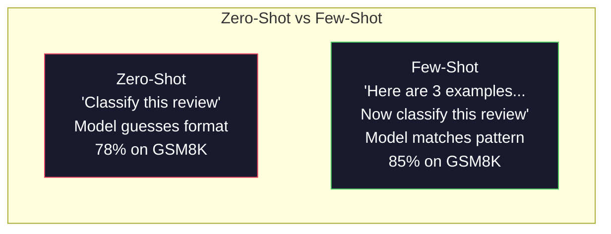
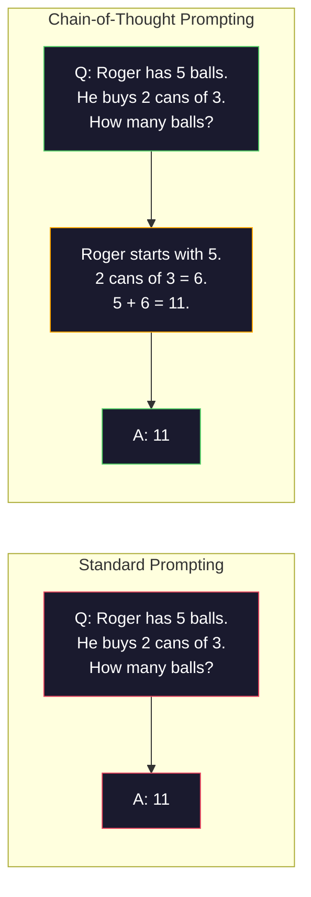
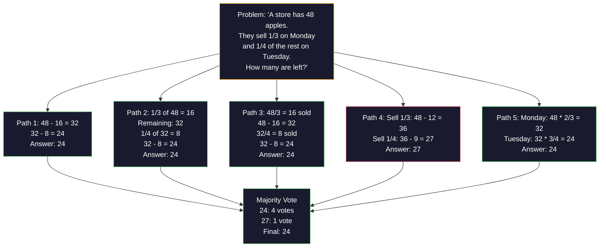
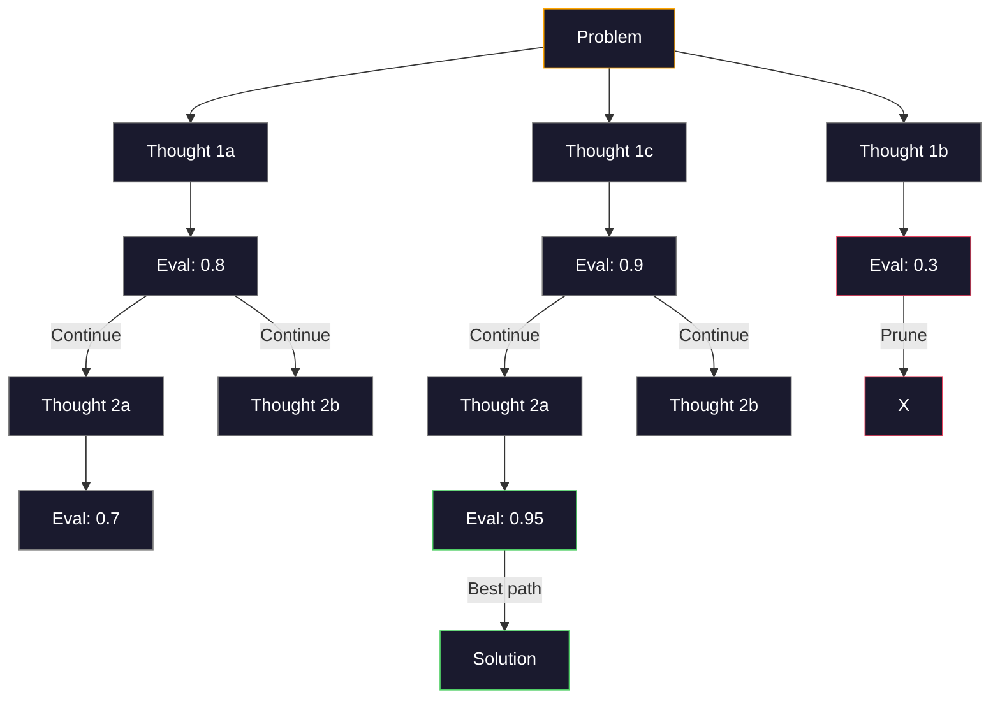

# कुछ शॉट, सोच की श्रृंखला, सोच के पेड़  कुछ नमूना सुझाव  सोच के पेड़

> एक मॉडल को यह बताने के लिए कि क्या करना है, यह प्रेरित करना है। इसे सोचने का तरीका दिखाना इंजीनियरिंग है। एक ही मॉडल, एक ही कार्य, एक ही डेटा पर 78% और 91% सटीकता के बीच का अंतर एक बेहतर मॉडल नहीं है। यह एक बेहतर तर्क रणनीति है।

> **【中文解读】**告诉模型"做什么"是提示, दिखाना"如何思考"才是工程―― 78% से 91% तक सटीकता दर में वृद्धि बेहतर मॉडल पर नहीं, बल्कि बेहतर विचारधारा पर आधारित है                                                                                                                                                                                                                                         

> **【拓展：推理策略→AI Agent】**CoT/ToT/ReAct आधुनिक एआई एजेंट के विचार के आधार हैं।

>  **【前置】**学本节前 कृपया पहले समझेंः चरण 11·01(प्रोम्प्ट इंजीनियरिंग)  सिस्टम प्रॉम्प्ट, भूमिका, प्रतिबंध आदि को समझने का बुनियादी मॉडल──本节是其延伸,要求你已经能写出结构化 प्रॉम्प्ट──本节将用于OpenAI/Anthropic SDK──

**Type:** Build | **类型:** 构建
**Languages:** Python | **语言:** Python
**Prerequisites:** Lesson 11.01 (Prompt Engineering) | **前置知识:** Phase 11 · 01 (提示工程)
**Time:** ~45 minutes | **时间:** ~45 分钟

## सीखने के लक्ष्य

- कुछ शॉट्स के लिए अनुरोध को लागू करें जो कार्य सटीकता को अधिकतम करने के लिए उदाहरण प्रदर्शनों का चयन और स्वरूपण करके
  विकल्प और प्रारूपण उदाहरण प्रदर्शन के माध्यम से कम नमूना सुझाव, अधिकतम कार्य सटीकता दर को प्राप्त करने के लिए
- गणित शब्द समस्या जैसे बहु-चरण समस्याओं पर सटीकता में सुधार के लिए सोच श्रृंखला (CoT) तर्क का उपयोग करें
  应用链式思维 (CoT) कई चरणों के प्रश्नों जैसे गणित अनुप्रयोग प्रश्नों में सुधार के लिए सुझाव
- एक विचार-वृक्ष का निर्माण करें जो कई तर्क पथों की खोज करता है और सबसे अच्छा चुनता है
  构建思维树提示,探索多条推理路径并选择最佳路径
- मानक बेंचमार्क पर शून्य शॉट बनाम कुछ शॉट बनाम CoT से सटीकता में सुधार को मापें
  मानक आधार पर माप शून्य नमूना बनाम कम नमूना बनाम सीओटी की सटीकता दर में वृद्धि

> **【中文解读】**इस वर्ग का उद्देश्य: कुछ-शॉट (उदाहरण के रूप में, शीघ्र में) और सोच श्रृंखला (Chain of Thought) को सीखना है।


## समस्या  समस्या परिचय

आप एक गणित ट्यूटोरियल ऐप बनाते हैं. आपका प्रॉम्प्ट कहता हैः "इस शब्द समस्या को हल करें". जीपीटी-5 जीएसएम 8 के पर 94% समय सही करता है, मानक ग्रेड स्कूल गणित बेंचमार्क। आप सोचते हैं कि आप पहले से ही शिखर पर हैं। आप नहीं करते हैं  सोच श्रृंखला अभी भी 3-4 अंक जोड़ता है।

> आप एक गणित सलाहकार अनुप्रयोग का निर्माण करते हैं। आपका सुझाव है कि: "इस अनुप्रयोग समस्या को हल करें। "GPT-5 पर सटीकता दर 94% है।

पांच शब्द जोड़ें - "चलो कदम से कदम सोचें" - और सटीकता 91% तक बढ़ जाती है। कुछ काम किए गए उदाहरण जोड़ें और यह 95% तक पहुंच जाता है। एक ही मॉडल। एक ही तापमान। एक ही एपीआई लागत। एकमात्र अंतर यह है कि आपने मॉडल को खरोंच पेपर दिया है।

> 加上五个词"आइये कदम से कदम सोचें" सटीकता दर 91% तक कूदती है कुछ हल किए गए उदाहरणों के साथ 95% तक पहुंचती है

यह हैक नहीं है. यह तर्क कैसे काम करता है. मनुष्य एक मानसिक छलांग में बहु-चरण समस्याओं को हल नहीं करते हैं। न ही ट्रांसफार्मर करते हैं। जब आप एक मॉडल को मध्यवर्ती टोकन उत्पन्न करने के लिए मजबूर करते हैं, तो ये टोकन अगले टोकन के संदर्भ का हिस्सा बन जाते हैं। प्रत्येक तर्क चरण अगले को खिलाता है। मॉडल सचमुच उत्तर के लिए अपना रास्ता गणना करता है।

> यह एक विचार है। यह विचार का काम करने का तरीका है। मनुष्य एक बार में कई चरणों के प्रश्नों को पूरा नहीं करेगा। ट्रांसफार्मर भी नहीं करेगा। जब आप मध्य टोकन उत्पन्न करने के लिए एक मॉडल को मजबूर करते हैं, तो ये टोकन अगले टोकन के उपरोक्त अवतरण का हिस्सा बन जाते हैं। प्रत्येक विचार चरण अगले चरण के लिए जानकारी प्रदान करता है। मॉडल वास्तव में गणना के माध्यम से उत्तर प्राप्त करता है।

>  **【类比】**बिना CoT 像让人"心算 17 × 24" अधिकांश लोग गलत या卡住── उपयोग CoT 像给一张草稿纸:"17 × 24 = 17 × 20 + 17 × 4 = 340 + 68 = 408" कदम कदम लिखने के लिए नीचे जाएगा गलत नहीं होगा──LLM

> ️ **【易错点】**कुछ-शॉट/CoT के 3 个坑:(1) **示例数量错误**0-शॉट CoT加 "चलो कदम से कदम सोचें" 就足,再加 3-5 个少拍示例能再 2-5 点;超过8 个示例性价比下降(快速太长、成本上) 2) **示例顺序敏感** तीन उदाहरणों के अनुसार A,B,C 排和 C,B,A 排, सटीकता दर 5-10% भिन्न है; "सबसे संबंधित उदाहरण" को अंतिम में रखना आवश्यक है ((((3) **CoT 不适用于简单任务**"आज के कई अंक? "加 CoT 反而让模型出错;CoT केवल कई चरणों पर विचार करना गणित、逻辑、规划) प्रभावी

लेकिन "चरण-चरण सोचें" शुरुआत है, अंत नहीं। क्या होगा अगर आप पांच तर्क पथों का नमूना लेते हैं और बहुमत का वोट लेते हैं? क्या होगा यदि आप मॉडल को संभावनाओं के पेड़ का पता लगाने देते हैं, मूल्यांकन और शाखाओं को काटते हैं? क्या होगा यदि आप तर्क को उपकरण के उपयोग के साथ जोड़ते हैं? ये परिकल्पना नहीं हैं। ये मापने वाले सुधारों के साथ प्रकाशित तकनीकें हैं, और आप उन्हें सभी का निर्माण करेंगे इस पाठ में।

> लेकिन "चरण-चरण विचार" केवल शुरुआत है, अंत नहीं। यदि आप विचार के पांच मार्गों का चयन करते हैं और फिर बहुमत का मतदान करते हैं तो क्या होगा? यदि आप मॉडल को एक संभावना के पेड़ का पता लगाने देते हैं, तो क्या होगा? यदि आप विचार और उपकरण का उपयोग करते हैं तो क्या होगा? ये परिकल्पनाएं नहीं हैं। ये प्रकाशित हैं, मात्रात्मक रूप से सुधार तकनीक, आप इस कक्षा में इन सभी तकनीकों का निर्माण करेंगे।

## अवधारणा का मूल अवधारणा

> **【中文解读】**कम-शॉट सीखने (Few-shot) और सोच-विचार (Chain-of-Thought, CoT) शीघ्र इंजीनियरिंग की दो प्रमुख तकनीकें हैं।

> **【拓展：CoT 的推理提升效果】**Google 2022 के पेपर से पता चलता है कि गणित पर विचार करने के लिए, CoT PaLM 540B की सटीकता दर को 17% से बढ़ाकर 56% कर देगा।

> 🤔 **【困惑】**प्रश्नः 2026 साल में मूल जीवन के विचार के मॉडल को Claude Extended Thinking、o3) 都自带 CoT 了, क्या मुझे भी हाथ से लिखने की आवश्यकता है "चरण-दर-चरण सोचें" ? A: नहीं जरूरत है, लेकिन एक शर्त हैः(1) उपयोग करने के लिए मूल जीवन के विचार के मॉडल का समर्थन करेंClaude 4.5+、GPT-5、o3、DeepSeek-R1 आदि;(2) 任务 वास्तव में सुझाव की आवश्यकता है सरल विभाजन 任务原生思考反而拖慢──对老模型GPT-4、Claude 3) या ओपन स्रोत मॉडलLlama 3) 仍然需要手写 CoT──判断: यदि मॉडल है`reasoning_effort`या `thinking`参数, इसका उपयोग करें; अन्यथा शीघ्र प्रयोग करें。


### शून्य शॉट बनाम कुछ शॉटः जब उदाहरण निर्देशों को हराते हैं

शून्य-शॉट प्रलोभन मॉडल को एक कार्य देता है और कुछ और नहीं। कुछ-शॉट प्रलोभन उसे पहले उदाहरण देता है।

> 零样本提示只给模型一个任务,不加其他内容――少样本提示则先给模型一个任务,不加其他内容――

वेई और अन्य (2022) ने 8 बेंचमार्क के माध्यम से यह मापा। भावना वर्गीकरण जैसे सरल कार्यों के लिए, शून्य-शॉट और कुछ-शॉट एक दूसरे के 2% के भीतर किए गए। बहु-चरण अंकगणित और प्रतीकात्मक तर्क जैसे जटिल कार्यों के लिए, कुछ-शॉट ने 10-25% की सटीकता में सुधार किया।

> Wei 等人 2022) ने 8 आधारभूत मानदंडों पर इस बात का माप किया है। सरल कार्यों जैसे कि भावनात्मक वर्गों, शून्य नमूना और छोटे नमूने के प्रदर्शन में अंतर 2% के भीतर है।

अंतर्ज्ञानः उदाहरण संपीड़ित निर्देश हैं। आप आउटपुट प्रारूप का वर्णन करने के बजाय, इसे दिखाते हैं। तर्क प्रक्रिया की व्याख्या करने के बजाय, आप इसे प्रदर्शित करते हैं। मॉडल पैटर्न उदाहरणों पर अधिक विश्वसनीय रूप से मेल खाता है। यह अमूर्त निर्देशों की व्याख्या करता है।

> 直觉: उदाहरण संपीड़न का निर्देश है। इसका वर्णन आउटपुट प्रारूप के साथ, इसे सीधे प्रदर्शित नहीं करता है। इसका व्याख्या करने की प्रक्रिया के साथ, इसे सीधे प्रदर्शित नहीं करता है। मॉडल के लिए उदाहरण के मॉडल के अनुकूलन को स्पष्ट करने के लिए अमूर्त निर्देश से अधिक विश्वसनीय है।



**When few-shot wins:**प्रारूप-संवेदनशील कार्य, वर्गीकरण, संरचित निकासी, डोमेन-विशिष्ट जारगोन, कोई भी कार्य जहां मॉडल को एक विशिष्ट पैटर्न से मेल खाने की आवश्यकता होती है।

> **少样本胜出的场景**: स्वरूप संवेदनशील कार्य, वर्ग, संरचनात्मक उत्थान, क्षेत्र विशिष्ट शब्द, किसी भी मॉडल को विशिष्ट मॉडल के साथ मेल खाने की आवश्यकता है।

**When zero-shot wins:**सरल तथ्यात्मक प्रश्न, रचनात्मक कार्य जहां उदाहरण रचनात्मकता को सीमित करते हैं, कार्य जहां अच्छे उदाहरण ढूंढना अच्छे निर्देश लिखने से कठिन है।

> **零样本胜出的场景**: सरल तथ्यगत प्रश्न, उदाहरण सृजनशीलता को सीमित करने वाले रचनात्मक कार्यों को प्रस्तुत करते हैं, अच्छे उदाहरणों की खोज करते हैं, जो अच्छे निर्देशों को लिखने से अधिक कठिन हैं।

### उदाहरण चयनः समान बेट्स यादृच्छिक

सभी उदाहरण समान नहीं हैं। लक्ष्य इनपुट के समान उदाहरणों का चयन वर्गीकरण कार्यों पर यादृच्छिक चयन से 5-15% बेहतर प्रदर्शन करता है (लिउ एट अल, 2022) । तीन सिद्धांतः

> सभी उदाहरण समान नहीं हैं। लक्ष्य के साथ समान उदाहरणों में वर्गीकृत कार्यों पर 5-15% से अधिक का चयन करना है।

1. **Semantic similarity**: एम्बेडिंग स्पेस में इनपुट के सबसे निकट उदाहरण चुनें
   **语义相似性**: चयन में सबसे निकटतम प्रवेश के उदाहरण में प्रवेश अंतरिक्ष
2. **Label diversity**: अपने उदाहरणों में सभी आउटपुट श्रेणियों को कवर
   **标签多样性**: उदाहरण में सभी आउटपुट वर्गों को कवर करें
3. **Difficulty matching**: लक्ष्य समस्या की जटिलता के स्तर से मेल खाता है
   **难度匹配**: मिलान लक्ष्य समस्या की जटिलता श्रेणी

अधिकांश कार्यों के लिए उदाहरणों की इष्टतम संख्या 3-5 है। 3 के नीचे, मॉडल में पैटर्न निकालने के लिए पर्याप्त संकेत नहीं है। 5 के ऊपर, आप घटते रिटर्न और संदर्भ विंडो टोकन को मारते हैं। कई लेबल के साथ वर्गीकरण के लिए, प्रत्येक लेबल के लिए एक उदाहरण का उपयोग करें।

> अधिकांश कार्यों के सर्वोत्तम उदाहरणों की संख्या 3-5 ⋅ से कम है, मॉडल में पर्याप्त संकेत नहीं हैं, मॉडल में 5 से अधिक हैं, सीमांत लाभ में वृद्धि और कमी और व्यय नीचे दिए गए विंडो टोकन पर हैं।

### सोच श्रृंखलाः मॉडल देना स्क्रैच पेपर

Google Brain में Wei et al. (2022) द्वारा विचार श्रृंखला (CoT) प्रलोभन शुरू किया गया था। विचार सरल हैः केवल उत्तर के लिए मॉडल से पूछने के बजाय, उसे पहले अपने तर्क चरणों को दिखाने के लिए कहें।

> 链式思维(CoT) सुझाव Google Brain के Wei 等人 2022) द्वारा पेश किया गया है।



यह यांत्रिक रूप से क्यों काम करता है? प्रत्येक टोकन जो एक ट्रांसफार्मर उत्पन्न करता है, अगले टोकन के लिए संदर्भ बन जाता है। बिना CoT के, मॉडल को एक एकल फॉरवर्ड पास की छिपी हुई स्थिति में सभी तर्क को संपीड़ित करना चाहिए। CoT के साथ, मॉडल टोकन के रूप में मध्यवर्ती गणना को बाहरी करता है। प्रत्येक तर्क टोकन प्रभावी गणना गहराई का विस्तार करता है।

> क्यों यह तंत्र पर प्रभावी है?ट्रांसफॉर्मर उत्पन्न प्रत्येक टोकन अगले टोकन के ऊपर नीचे होते हैं। बिना CoT, मॉडल को सभी तर्क को एक बार पूर्ववर्ती प्रसार की छिपी हुई स्थिति में संपीड़ित करना होगा।

**GSM8K benchmarks (grade-school math, 8.5K problems):**

| Model | Zero-Shot | Zero-Shot CoT | Few-Shot CoT |
|-------|-----------|---------------|--------------|
| GPT-4o | 78% | 91% | 95% |
| GPT-5 | 94% | 97% | 98% |
| o4-mini (reasoning) | 97% | — | — |
| Claude Opus 4.7 | 93% | 97% | 98% |
| Gemini 3 Pro | 92% | 96% | 98% |
| Llama 4 70B | 80% | 89% | 94% |
| DeepSeek-V3.1 | 89% | 94% | 96% |

**Note on reasoning models.**ओपनएआई के ओ-सीरीज (ओ3, ओ4-मिनी) और डीपसेक-आर1 जैसे मॉडल अपने उत्तर जारी करने से पहले आंतरिक रूप से विचार श्रृंखला चलाते हैं। तर्क मॉडल में "चलो कदम से कदम सोचें" जोड़ना अधिमानतः और कभी-कभी प्रतिकूल होता है।

> **关于推理模型的说明。** OpenAI की o 系列 ((o3、o4-mini) और DeepSeek-R1 जैसे मॉडल आउटपुट उत्तर से पहले आंतरिक रूप से चल रहे हैं।

कोट के दो स्वादः

> CoT के दो रूप हैंः

**Zero-shot CoT**कोजिमा एट अल. (2022) ने दिखाया कि यह एकल वाक्य अंकगणित, सामान्य ज्ञान और प्रतीकात्मक तर्क कार्यों में सटीकता में सुधार करता है।

> **零样本 CoT**:在提示末尾添加"आओ कदम से कदम सोचें"――不需要示例──Kojima 等人(2022) यह वाक्य बताता है कि यह शब्द गणितीय、常识和符号推理任务 पर सटीकता दर में वृद्धि कर सकता है──

**Few-shot CoT**शून्य शॉट CoT से अधिक प्रभावी क्योंकि मॉडल आपको अपेक्षित तर्क प्रारूप को देखता है।

> **少样本 CoT**: सुझावात्मक चरणों के उदाहरण प्रदान करना। शून्य नमूना से अधिक प्रभावी, क्योंकि मॉडल आपके अपेक्षित सटीक सुझावात्मक प्रारूप को देखता है।

**When CoT hurts**: सरल तथ्यात्मक याद ("फ्रांस की राजधानी क्या है?"), एकल-चरण वर्गीकरण, ऐसे कार्य जहां सटीकता से अधिक गति महत्वपूर्ण है। CoT प्रति क्वेरी तर्क सामान्य लागत के 50-200 टोकन जोड़ता है। उच्च-प्रभाव, कम जटिलता वाले कार्यों के लिए, यह व्यर्थ लागत है।

> **CoT 何时有害**: simple facts recall("फ्रांस का सबसे बड़ा क्या है?") ✓ ✓ ✓ ✓ ✓ ✓ ✓ ✓ ✓ ✓ ✓ ✓ ✓ ✓ ✓ ✓ ✓ ✓ ✓ ✓ ✓ ✓ ✓ ✓ ✓ ✓ ✓ ✓ ✓ ✓ ✓ ✓ ✓ ✓ ✓ ✓ ✓ ✓ ✓ ✓ ✓ ✓ ✓ ✓ ✓ ✓ ✓ ✓ ✓ ✓ ✓ ✓ ✓ ✓ ✓ ✓ ✓ ✓ ✓ ✓ ✓ ✓ ✓ ✓ ✓ ✓ ✓ ✓ ✓ ✓ ✓ ✓ ✓ ✓ ✓ ✓ ✓ ✓ ✓ ✓ ✓ ✓ ✓ ✓ ✓ ✓ ✓ ✓ ✓ ✓ ✓ ✓ ✓ ✓ ✓ ✓ ✓ ✓ ✓ ✓ ✓ ✓ ✓ ✓ ✓ ✓ ✓ ✓ ✓ ✓ ✓ ✓ ✓ ✓ ✓ ✓ ✓ ✓ ✓ ✓ ✓ ✓ ✓ ✓ ✓ ✓ ✓ ✓ ✓ ✓ ✓ ✓ ✓ ✓ ✓ ✓ ✓ ✓ ✓ ✓ ✓ ✓ ✓ ✓ ✓ ✓ ✓ ✓ ✓ ✓ ✓ ✓ ✓ ✓ ✓ ✓ ✓ ✓ ✓ ✓ ✓ ✓ ✓ ✓ ✓ ✓ ✓ ✓ ✓ ✓ ✓ ✓ ✓ ✓ ✓ ✓ ✓ ✓ ✓ ✓ ✓ ✓ ✓ ✓ ✓ ✓ ✓ ✓ ✓ ✓ ✓ ✓ ✓ ✓ ✓ ✓ ✓ ✓ ✓ ✓ ✓ ✓ ✓ ✓ ✓ ✓ ✓ ✓ ✓ ✓ ✓ ✓ ✓ ✓ ✓ ✓ ✓ ✓ ✓ ✓ ✓ ✓ ✓ ✓ ✓ ✓ ✓ ✓ ✓ ✓ ✓ ✓ ✓ ✓

### आत्म-समन्वय: कई लोगों का नमूना लें, एक बार वोट दें

वांग और सहयोगियों (2023) ने आत्म-समर्पण की शुरुआत की। अंतर्दृष्टिः एक एकल CoT पथ में तर्क त्रुटियां हो सकती हैं। लेकिन यदि आप N स्वतंत्र तर्क पथों का नमूना लेते हैं (तापमान > 0 का उपयोग करते हुए) और अंतिम उत्तर पर बहुमत का वोट लेते हैं, तो त्रुटियां रद्द हो जाती हैं।

> वांग 等人(2023) ने स्वसंगति को पेश किया है।洞察:单条 CoT 路径可能包含推理错误── लेकिन यदि आप N 条独立的推理路径 (N) का प्रयोग करते हैं, तो तापमान > 0) और अंतिम उत्तर के लिए बहुमत मतदान करते हैं, तो त्रुटि एक दूसरे का विरोध करेगी──



आत्म-समरूपता ने मूल पॉलम 540 बी प्रयोगों पर N=40 के साथ GSM8K सटीकता को 56.5% (एकल CoT) से 74.4% तक बढ़ाया। जीपीटी-5 पर सुधार छोटा है (97% से 98%) क्योंकि आधार सटीकता पहले से ही संतृप्त है। तकनीक 60-85% बेस कोट सटीकता वाले मॉडल पर सबसे ज्यादा चमकती है -- एक मीठा बिंदु जहां एकल पथ त्रुटियां अक्सर होती हैं लेकिन व्यवस्थित नहीं होती हैं। तर्क मॉडल (ओ-सीरीज, R1) के लिए आत्म-समंजस्य अंतर्निहित आंतरिक नमूनाकरण द्वारा समाहित किया जाता है।

> जीपीटी-5 में बहुत कम सुधार हुआ है। यह तकनीक 60-85% के मॉडल पर सबसे अच्छा प्रदर्शन करती है। यह एकतरफा त्रुटिपूर्ण लेकिन गैर-व्यवस्थित क्षेत्र है।

N नमूने का मतलब है Nx एपीआई लागत और विलंबता। व्यवहार में, N=5 अधिकांश लाभ को पकड़ता है। N=3 एक सार्थक वोट के लिए न्यूनतम है। N > 10 में अधिकांश कार्यों के लिए घटती हुई रिटर्न होती है।

> 权衡:N 个样本意味着N 倍的API 成本和延迟―― व्यवहार में,N=5 占据了大部分收益――N=3 是有意义的投票的最低要求――N >10 对于大多数任务的边际收益递减――

### विचार का वृक्षः शाखाओं की खोज

याओ एट एल्स (2023) ने ट्री ऑफ थिंक (ToT) पेश किया। जहां CoT एक रैखिक तर्क पथ का अनुसरण करता है, तो ToT आगे बढ़ने से पहले कई शाखाओं का पता लगाता है और मूल्यांकन करता है जो सबसे अधिक आशाजनक हैं।

> याओ 等人(2023) ने विचारवृक्ष (思维树) ️ को एक लाइन पर विचार करने के लिए एक मार्ग पर आगे बढ़े, जबकि ToT ️ कई शाखाओं का पता लगाने और आगे बढ़ने से पहले मूल्यांकन करने के लिए सबसे अधिक संभावनाएं हैं️



TOT में तीन घटक हैंः

> इसमें तीन घटक हैंः

1. **Thought generation**: कई उम्मीदवारों को अगले चरणों में उत्पन्न
   **思维生成**: अनेक उम्मीदवारों का उत्पन्न होना
2. **State evaluation**: प्रत्येक उम्मीदवार को स्कोर (एलएलएम स्वयं का मूल्यांकनकर्ता के रूप में उपयोग कर सकते हैं)
   **状态评估**: लिए प्रत्येक उम्मीदवार打分(आप स्वयं मूल्यांकनकर्ता के रूप में LLM का उपयोग कर सकते हैं)
3. **Search algorithm**: बीएफएस या डीएफएस पेड़ के माध्यम से, कम स्कोर वाली शाखाओं को काटने
   **搜索算法**बीएफएस या डीएफएस के माध्यम से, नीचे से नीचे तक

24 के खेल के कार्य पर (गणितीय उपयोग करके 24 बनाने के लिए 4 संख्याओं को मिलाएं), मानक प्रलोभन के साथ GPT-4 7.3% समस्याओं को हल करता है। CoT के साथ, 4.0% (CoT वास्तव में यहां चोट करता है क्योंकि खोज स्थान व्यापक है) । ToT के साथ, 74%.

> 24 任务 के खेल में, GPT-4 का उपयोग 7.3% का प्रश्न हल करने के लिए किया जाता है।

ToT महंगा है। पेड़ में प्रत्येक नोड को LLM कॉल की आवश्यकता होती है। शाखा कारक 3 और गहराई 3 के साथ एक पेड़ को 39 LLM कॉल की आवश्यकता होती है। इसका उपयोग केवल उन समस्याओं के लिए करें जहां खोज स्थान बड़ा है लेकिन मूल्यांकन योग्य है - योजना, पहेली हल करना, प्रतिबंधों के साथ रचनात्मक समस्या समाधान।

> वृक्ष के प्रत्येक खंड को एक बार LLM का उपयोग करने की आवश्यकता होती है। एक शाखा कारक 3 के लिए 3 गहराई के लिए 3 वृक्षों को 39 बार LLM का उपयोग करने की आवश्यकता होती है। केवल खोज स्थान के बड़े लेकिन मूल्यांकन योग्य प्रश्नों पर उपयोग करना।

### प्रतिक्रियाः सोच + कार्य

याओ एट अल. (2022) ने तर्क के निशानों को कार्यों के साथ जोड़ा। मॉडल सोच (विकल्पना उत्पन्न करना) और कार्य (उपकरणों को कॉल करना, खोज करना, कंप्यूटिंग) के बीच बदलता है।

> याओ 等人(2022) को विचार रस् र र र र र र र र र र र र र र र र र र र र र र र र र र र र र र र र र र र र र र र र र र र र र र र र र र र र र र र र र र र र र र र र र र र र र र र र र र र र र र र र र र र र र र र र र र र र र र र र र र र र र र र र र र र र र र र र र र र र र र र र र र र र र र र र र र र र र र र र र र र र र र र र र र र र र र र र र र र र र र र र र र र र र र र र र र र र र र र र र र र र र र र र र र र र र र र र र र र र र र र र र र र र र र र र र र र र र र र र र र र र र र र र र र र र र र र र र र र र र र र र र र र र र र र र र र र र र र र र र र र र र र र र र र र र र र र र र र र र र र र र र र र र र र र र र र र र र र र र र र र र र र र र र र र र र र र र र र र र र र र र र र र र र र र र र र र र र र र र र र र र र र र र र र र र र र र र र र र र र र र र र र र र र र र र र र र र र र र र र र र र र र र र र र र र र र र र र र र र र र र र र र र र र र र र र र र र र र र र र र र र र र र र र र र र र र र र र र र र र र र र र र र र र र र र र र र र र र र र र र र र र र र र र र र र र र र र र र र र र र र र र र र र र र र र र र र र र र र र र र

```mermaid
graph LR
    Q["Question:\nWhat is the\npopulation of the\ncountry where\nthe Eiffel Tower\nis located?"]
    T1["Thought: I need to\nfind which country\nhas the Eiffel Tower"]
    A1["Action: search\n'Eiffel Tower location'"]
    O1["Observation:\nParis, France"]
    T2["Thought: Now I need\nFrance's population"]
    A2["Action: search\n'France population 2024'"]
    O2["Observation:\n68.4 million"]
    T3["Thought: I have\nthe answer"]
    F["Answer:\n68.4 million"]

    Q --> T1 --> A1 --> O1 --> T2 --> A2 --> O2 --> T3 --> F

    style Q fill:#1a1a2e,stroke:#ffa500,color:#fff
    style T1 fill:#1a1a2e,stroke:#51cf66,color:#fff
    style A1 fill:#1a1a2e,stroke:#e94560,color:#fff
    style O1 fill:#1a1a2e,stroke:#808080,color:#fff
    style T2 fill:#1a1a2e,stroke:#51cf66,color:#fff
    style A2 fill:#1a1a2e,stroke:#e94560,color:#fff
    style O2 fill:#1a1a2e,stroke:#808080,color:#fff
    style T3 fill:#1a1a2e,stroke:#51cf66,color:#fff
    style F fill:#1a1a2e,stroke:#51cf66,color:#fff
```



ReAct ज्ञान-गहन कार्यों पर शुद्ध CoT से बेहतर प्रदर्शन करता है क्योंकि यह वास्तविक डेटा पर अपना तर्क आधारित कर सकता है। HotpotQA (मल्टी-हॉप प्रश्न उत्तर) पर, GPT-4 के साथ ReAct अकेले CoT के लिए 35.1% सटीक मैच बनाम 29.4% प्राप्त करता है। वास्तविक शक्ति यह है कि तर्क त्रुटियों को अवलोकन द्वारा सुधार दिया जाता है - मॉडल अपने योजना को मध्य निष्पादन में अपडेट कर सकता है।

> ReAct ज्ञान घनी प्रकार के कार्यों में शुद्ध CoT से बेहतर है, क्योंकि यह वास्तविक डेटा पर आधारित तर्क दे सकता है। HotpotQA में, ReAct GPT-4 के साथ 35.1% की सटीक मिलान दर तक पहुंचता है, जबकि शुद्ध CoT 29.4% है। वास्तविक शक्ति तर्क में गलतियों को देखने के माध्यम से सुधारने के लिए है। मॉडल को निष्पादन प्रक्रिया में अद्यतन किया जा सकता है।

ReAct आधुनिक AI एजेंटों की नींव है। प्रत्येक एजेंट फ्रेमवर्क (LangChain, CrewAI, AutoGen) विचार-क्रिया-निरीक्षण लूप के कुछ प्रकार को लागू करता है। आप चरण 14 में पूर्ण एजेंट बनाएंगे। यह सबक प्रलोभन पैटर्न को कवर करता है।

> ReAct आधुनिक AI एजेंट का आधार है। प्रत्येक एजेंट 框架 (लंबे श्रृंखला, क्रूएआई, ऑटोजेन) ने एक प्रकार के विचार-क्रिया-निरीक्षण चक्र के परिवर्तन को प्राप्त किया है।

### संरचित प्रमोटिंगः एक्सएमएल टैग, डेलिमिटर, हेडर

जैसे-जैसे प्रॉम्प्ट जटिल होते जाते हैं, संरचना मॉडल को भ्रमित करने से रोकती है। तीन दृष्टिकोणः

>  जब सुझाव जटिल हो जाते हैं, तो संरचना मॉडल को विभिन्न भागों में मिश्रण से रोक सकती हैः

**XML tags**(क्लाउड के साथ सबसे अच्छा काम करता है, हर जगह ठोस):
```
<context>
You are reviewing a pull request.
The codebase uses TypeScript and React.
</context>

<task>
Review the following diff for bugs, security issues, and style violations.
</task>

<diff>
{diff_content}
</diff>

<output_format>
List each issue with: file, line, severity (critical/warning/info), description.
</output_format>
```

**Markdown headers**(सार्वभौमिक):
```
## Role
Senior security engineer at a fintech company.

## Task
Analyze this API endpoint for vulnerabilities.

## Input
{api_code}

## Rules
- Focus on OWASP Top 10
- Rate each finding: critical, high, medium, low
- Include remediation steps
```

**Delimiters**(कम से कम लेकिन प्रभावी):
```
---INPUT---
{user_text}
---END INPUT---

---INSTRUCTIONS---
Summarize the above in 3 bullet points.
---END INSTRUCTIONS---
```

### शीघ्र श्रृंखलाः क्रमशः विघटन

कुछ कार्य एक ही प्रॉम्प्ट के लिए बहुत जटिल होते हैं। प्रॉम्प्ट चेनिंग उन्हें चरणों में तोड़ देती है, जहां एक प्रॉम्प्ट का आउटपुट अगले का इनपुट बन जाता है।

> कुछ कार्य बहुत जटिल हैं, एक एकल सुझाव के साथ पूरा नहीं किया जा सकता है।


तीन कारणों से चेनिंग एक ही प्रम्प्ट से धड़कता हैः

> 链式优于单提示 के तीन कारण हैंः

1. **Each step is simpler**: मॉडल एक केंद्रित कार्य को संभालता है बजाय सब कुछ संगम
   **每个步骤更简单**मॉडल एक केंद्रित कार्य को संभालता है, एक ही समय में सभी चीजों का सामना करने के बजाय
2. **Intermediate outputs are inspectable**: आप चरणों के बीच सत्यापित और सुधार कर सकते हैं
   **中间输出可检查**आप चरणों के बीच सत्यापन और सुधार कर सकते हैंः
3. **Different steps can use different models**: निष्कर्षण के लिए सस्ते मॉडल का उपयोग करें, तर्क के लिए एक महंगा
   **不同步骤可以使用不同模型**सस्ते मॉडल के साथ सुझाव, महंगे मॉडल के साथ सुझाव

### प्रदर्शन तुलना

| Technique | Best For | GSM8K Accuracy (GPT-5) | API Calls | Token Overhead | Complexity |
|-----------|----------|------------------------|-----------|----------------|------------|
| Zero-Shot | Simple tasks | 94% | 1 | None | Trivial |
| Few-Shot | Format matching | 96% | 1 | 200-500 tokens | Low |
| Zero-Shot CoT | Quick reasoning boost | 97% | 1 | 50-200 tokens | Trivial |
| Few-Shot CoT | Maximum single-call accuracy | 98% | 1 | 300-600 tokens | Low |
| Self-Consistency (N=5) | High-stakes reasoning | 98.5% | 5 | 5x token cost | Medium |
| Reasoning model (o4-mini) | Drop-in CoT replacement | 97% | 1 | hidden (2-10x internal) | Trivial |
| Tree-of-Thought | Search/planning problems | N/A (74% on Game of 24) | 10-40+ | 10-40x token cost | High |
| ReAct | Knowledge-grounded reasoning | N/A (35.1% on HotpotQA) | 3-10+ | Variable | High |
| Prompt Chaining | Complex multi-step tasks | 96% (pipeline) | 2-5 | 2-5x token cost | Medium |

सही तकनीक तीन कारकों पर निर्भर करती हैः सटीकता आवश्यकता, विलंबता बजट और लागत सहिष्णुता। अधिकांश उत्पादन प्रणालियों के लिए, 3-सैम्पल स्व-समरूपता रिटर्न के साथ कुछ शॉट सीओटी 90% उपयोग मामलों को कवर करता है।

> सही तकनीक तीन कारकों पर निर्भर करती हैः सटीकता दर की मांग, देरी बजट और लागत सहिष्णुता। अधिकांश उत्पादन प्रणालियों के लिए, कम नमूना सीओटी के साथ 3 नमूना स्व-अनुपालन के बाद के उपयोग के 90% को कवर कर सकता है।

## इसे बनाओ, इसे पूरा करो।
```figure
few-shot-curve
```

## इसे बनाओ

हम एक गणितीय समस्या समाधान का निर्माण करेंगे जो कुछ ही शॉट्स के लिए प्रेरित, सोच-श्रृंखला तर्क और आत्म-समर्पण मतदान को एक पाइपलाइन में जोड़ देगा। फिर हम कठिन समस्याओं के लिए विचार-वृक्ष जोड़ेंगे।

> हम एक गणितीय प्रश्न खोजकर्ता बनाएंगे, कुछ नमूना सुझाव, सोच विचार और स्व-समंजस्य मतगणना को एक धारा में इकट्ठा करेंगे।

पूर्ण कार्यान्वयन `code/advanced_prompting.py`यहाँ मुख्य घटक हैं।

>  पूर्णता में `code/advanced_prompting.py`中──以下是关键组件──

### चरण 1: कुछ शॉट उदाहरण स्टोर

पहला घटक कुछ ही उदाहरणों का प्रबंधन करता है और किसी दिए गए समस्या के लिए सबसे प्रासंगिक लोगों का चयन करता है।

> पहला घटक प्रबंधन कम नमूना उदाहरण, और दिए गए प्रश्नों के लिए सबसे संबंधित उदाहरणों का चयन करें।

```python
GSM8K_EXAMPLES = [
    {
        "question": "Janet's ducks lay 16 eggs per day. She eats three for breakfast every morning and bakes muffins for her friends every day with four. She sells every egg at the farmers' market for $2. How much does she make every day at the farmers' market?",
        "reasoning": "Janet's ducks lay 16 eggs per day. She eats 3 and bakes 4, using 3 + 4 = 7 eggs. So she has 16 - 7 = 9 eggs left. She sells each for $2, so she makes 9 * 2 = $18 per day.",
        "answer": "18"
    },
    ...
]
```

प्रत्येक उदाहरण में तीन भाग होते हैंः प्रश्न, तर्क श्रृंखला और अंतिम उत्तर। तर्क श्रृंखला वह है जो एक नियमित कुछ-शॉट उदाहरण को एक CoT कुछ-शॉट उदाहरण में बदल देती है।

> प्रत्येक उदाहरण में तीन भाग होते हैंः प्रश्न, सुझाव श्रृंखला और अंतिम उत्तर।

### चरण 2: विचार श्रृंखला का त्वरित निर्माण

प्रॉम्प्ट बिल्डर सिस्टम संदेश, तर्क श्रृंखलाओं के साथ कुछ शॉट उदाहरणों और लक्ष्य प्रश्न को एक एकल प्रॉम्प्ट में इकट्ठा करता है।

> 提示 बिल्डर सिस्टम संदेश ✓ ले जाने के लिए सुझाव श्रृंखला के छोटे उदाहरण उदाहरण और लक्ष्य प्रश्न को एक एकल सुझाव में संकलित करें

```python
def build_cot_prompt(question, examples, num_examples=3):
    system = (
        "You are a math problem solver. "
        "For each problem, show your step-by-step reasoning, "
        "then give the final numerical answer on the last line "
        "in the format: 'The answer is [number]'."
    )

    example_text = ""
    for ex in examples[:num_examples]:
        example_text += f"Q: {ex['question']}\n"
        example_text += f"A: {ex['reasoning']} The answer is {ex['answer']}.\n\n"

    user = f"{example_text}Q: {question}\nA:"
    return system, user
```

प्रारूप प्रतिबंध ("जवाब [संख्या] है") महत्वपूर्ण है। इसके बिना, आत्म-समरूपता नमूने के बीच उत्तरों को निकालने और तुलना नहीं कर सकती है।

> 格式约束("उत्तर [संख्या] है")至关重要──没有它,自一致性无法在不同样本之间提取和比较答案──

### चरण 3: स्व-समन्वित मतदान

N तर्क पथ का नमूना लें और बहुमत का उत्तर लें।

> 采样 N 条推理路径,取多数答案──

```python
def self_consistency_solve(question, examples, client, model, n_samples=5):
    system, user = build_cot_prompt(question, examples)

    answers = []
    reasonings = []
    for _ in range(n_samples):
        response = client.chat.completions.create(
            model=model,
            messages=[
                {"role": "system", "content": system},
                {"role": "user", "content": user}
            ],
            temperature=0.7
        )
        text = response.choices[0].message.content
        reasonings.append(text)
        answer = extract_answer(text)
        if answer is not None:
            answers.append(answer)

    vote_counts = Counter(answers)
    best_answer = vote_counts.most_common(1)[0][0] if vote_counts else None
    confidence = vote_counts[best_answer] / len(answers) if best_answer else 0

    return best_answer, confidence, reasonings, vote_counts
```

तापमान 0.7 महत्वपूर्ण है. तापमान 0.0 पर, सभी N नमूने समान होंगे, उद्देश्य को हरा देंगे। आपको विभिन्न तर्क पथों के लिए पर्याप्त यादृच्छिकता की आवश्यकता है लेकिन इतना नहीं कि मॉडल गिबर्श पैदा करता है।

> तापमान 0.7  बहुत महत्वपूर्ण है  तापमान 0.0  में, सभी N 个样本都会相同,失去意义── आपको विभिन्न प्रकार के विचार करने के लिए पर्याप्त आकस्मिकता की आवश्यकता होती है, लेकिन यह बहुत अधिक नहीं हो सकता है कि मॉडल विकृत हो जाए 

### चरण 4: विचार के पेड़ का समाधान

ऐसी समस्याओं के लिए जहां रैखिक तर्क विफल रहता है, तोटी कई दृष्टिकोणों की खोज करता है और यह आकलन करता है कि कौन सा दिशा सबसे अधिक आशाजनक है।

> इस विषय पर विचार करने में असफलता के बारे में, विभिन्न तरीकों का पता लगाने और यह आकलन करने के लिए कि किस दिशा में सबसे अधिक संभावनाएं हैं।

```python
def tree_of_thought_solve(question, client, model, breadth=3, depth=3):
    thoughts = generate_initial_thoughts(question, client, model, breadth)
    scored = [(t, evaluate_thought(t, question, client, model)) for t in thoughts]
    scored.sort(key=lambda x: x[1], reverse=True)

    for current_depth in range(1, depth):
        next_thoughts = []
        for thought, score in scored[:2]:
            extensions = extend_thought(thought, question, client, model, breadth)
            for ext in extensions:
                ext_score = evaluate_thought(ext, question, client, model)
                next_thoughts.append((ext, ext_score))
        scored = sorted(next_thoughts, key=lambda x: x[1], reverse=True)

    best_thought = scored[0][0] if scored else ""
    return extract_answer(best_thought), best_thought
```

मूल्यांकनकर्ता स्वयं एक LLM कॉल है. आप मॉडल से पूछते हैंः "0.0 से 1.0 के पैमाने पर, समस्या को हल करने के लिए यह तर्क पथ कितना आशाजनक है? यह ToT की मुख्य अंतर्दृष्टि है - मॉडल अपने स्वयं के आंशिक समाधान का मूल्यांकन करता है।

> 评估器本身就是一个LLM调用――你问模型:"0.0 से 1.0 के दायरे में, यह विचार पथ समस्या को हल करने के लिए कैसे?

### चरण 5: पूर्ण पाइपलाइन

पाइपलाइन में सभी तकनीकें एक बढ़ते युद्ध के साथ जोड़ दी गई हैं।

> 流水线结合所有技术与升级策略──

```python
def solve_with_escalation(question, examples, client, model):
    system, user = build_cot_prompt(question, examples)
    single_response = call_llm(client, model, system, user, temperature=0.0)
    single_answer = extract_answer(single_response)

    sc_answer, confidence, _, _ = self_consistency_solve(
        question, examples, client, model, n_samples=5
    )

    if confidence >= 0.8:
        return sc_answer, "self_consistency", confidence

    tot_answer, _ = tree_of_thought_solve(question, client, model)
    return tot_answer, "tree_of_thought", None
```

एस्केलेशन लॉजिकः सबसे पहले सस्ते (सिंगल CoT) की कोशिश करें. यदि आत्म-समर्पण विश्वास 0.8 से नीचे है (5 नमूनों में से 4 से कम सहमत), ToT पर चढ़ें. यह लागत और सटीकता को संतुलित करता है - अधिकांश समस्याओं को सस्ते में हल किया जाता है, कठिन समस्याओं को अधिक गणना मिलती है।

> 升级逻辑:先尝试廉价的(单次 CoT) 如果自一致性信任度低于0.8(5 नमूने में से 4 个一致) से कम),则升级到ToT── यह लागत और सटीकता दरों का संतुलन बनाता है अधिकांश समस्याएं कम लागत से हल होती हैं, समस्याएं अधिक गणना संसाधन प्राप्त करना कठिन है

## इसे फ्रेमवर्क के साथ लागू करें

### टेम्पलेट-ड्राइव कुछ शॉट संकेत

लैंगचेन शीघ्र टेम्पलेट्स और आउटपुट पार्सिंग के लिए अंतर्निहित समर्थन प्रदान करता है जो कुछ शॉट और CoT पैटर्न को सरल बनाता हैः

> LangChain के लिए सरलता कम नमूना और CoT मोड प्रदान करें सुझाव मॉडल और आउटपुट समाधान में समर्थनः

```python
from langchain_core.prompts import FewShotPromptTemplate, PromptTemplate
from langchain_openai import ChatOpenAI

example_prompt = PromptTemplate(
    input_variables=["question", "reasoning", "answer"],
    template="Q: {question}\nA: {reasoning} The answer is {answer}."
)

few_shot_prompt = FewShotPromptTemplate(
    examples=examples,
    example_prompt=example_prompt,
    suffix="Q: {input}\nA: Let's think step by step.",
    input_variables=["input"]
)

llm = ChatOpenAI(model="gpt-4o", temperature=0.7)
chain = few_shot_prompt | llm
result = chain.invoke({"input": "If a train travels 120 km in 2 hours..."})
```

लैंगचेन में भी है `ExampleSelector`अर्थिक समानता चयन के लिए वर्गः

> लैंगचेन भी है`ExampleSelector`类用于语义相似性选择:

```python
from langchain_core.example_selectors import SemanticSimilarityExampleSelector
from langchain_openai import OpenAIEmbeddings

selector = SemanticSimilarityExampleSelector.from_examples(
    examples,
    OpenAIEmbeddings(),
    k=3
)
```

### संकलित संकेत

DSPy प्रलोभन रणनीतियों को अनुकूलन योग्य मॉड्यूल के रूप में व्यवहार करता है। हाथ से कॉट प्रलोभन बनाने के बजाय, आप एक हस्ताक्षर को परिभाषित करते हैं और DSPy को प्रलोभन को अनुकूलित करने देते हैंः

> DSPy 优化提示策略视为可优化模块――你定义一个签名,让 DSPy 优化提示,而不是手工编写 CoT 提示:

```python
import dspy

dspy.configure(lm=dspy.LM("openai/gpt-4o", temperature=0.7))

class MathSolver(dspy.Module):
    def __init__(self):
        self.solve = dspy.ChainOfThought("question -> answer")

    def forward(self, question):
        return self.solve(question=question)

solver = MathSolver()
result = solver(question="Janet's ducks lay 16 eggs per day...")
```

डीएसपीई `ChainOfThought`स्वचालित रूप से तर्क के निशान जोड़ता है। `dspy.majority`आत्म-समन्वयता को लागू करता हैः

> डीएसपीई `ChainOfThought`स्वयंचलित रूप से जोड़ना`dspy.majority`实现自一致性:

```python
result = dspy.majority(
    [solver(question=q) for _ in range(5)],
    field="answer"
)
```

### तुलनाः स्क्रैच बनाम फ्रेमवर्क

| Feature | From-Scratch (this lesson) | LangChain | DSPy |
|---------|--------------------------|-----------|------|
| Control over prompt format | Full | Template-based | Automatic |
| Self-consistency | Manual voting | Manual | Built-in (`dspy.majority`) |
| Example selection | Custom logic | `ExampleSelector` | `dspy.BootstrapFewShot` |
| Tree-of-Thought | Custom tree search | Community chains | Not built-in |
| Prompt optimization | Manual iteration | Manual | Automatic compilation |
| Best for | Learning, custom pipelines | Standard workflows | Research, optimization |

## इसे भेजें उत्पाद

इस पाठ में दो कलाकृतियां हैं।

> इस वर्ग में दो उत्पाद उत्पन्न होते हैं।

**1. Reasoning Chain Prompt**(`outputs/prompt-reasoning-chain.md`): स्व-समन्वित के साथ कुछ शॉट CoT के लिए उत्पादन के लिए तैयार एक प्रम्प्ट टेम्पलेट। अपने उदाहरणों और समस्या डोमेन में प्लग करें।

> **1. 推理链提示**(`outputs/prompt-reasoning-chain.md`): एक उत्पादन already तैयार का छोटा नमूना CoT 配合自一致性提示模板──插入您的示例和问题领域即可使用──

**2. CoT Pattern Selection Skill**(`outputs/skill-cot-patterns.md`): कार्य प्रकार, सटीकता आवश्यकताओं और लागत बाधाओं के आधार पर सही तर्क तकनीक चुनने के लिए एक निर्णय ढांचा।

> **2. CoT 模式选择技能**(`outputs/skill-cot-patterns.md`): कार्य प्रकार के आधार पर सटीकता दर आवश्यकता और लागत के संबंध में सही ढंग से विचार करने की तकनीक के निर्णय लेने के ढांचे का चयन करें।

## अभ्यास विषय

1. **Measure the gap**: 10 GSM8K समस्याओं को लें. शून्य-शॉट, कुछ-शॉट, शून्य-शॉट CoT, और कुछ-शॉट CoT के साथ प्रत्येक को हल करें. प्रत्येक के लिए सटीकता रिकॉर्ड करें. कौन सी तकनीक आपके मॉडल पर सबसे बड़ा उठाने देती है?
   **测量差距**:Take 10 ways GSM8K 题目── Using零样本、少样本、零样本 CoT 和少样本 CoT 分别求解──记录每种方法的准确率──哪种技术给你的模型带来最大提升?

2. **Example selection experiment**: एक ही 10 समस्याओं के लिए, यादृच्छिक उदाहरण चयन बनाम हाथ से चुने गए समान उदाहरणों की तुलना करें। सटीकता अंतर मापें। उदाहरण की गुणवत्ता का क्या महत्व है?
   **示例选择实验**: समान 10 पथ विषयों के लिए, तुलना करें जैसे कि उदाहरण चयन और हाथ से चयन के समान उदाहरणों में।

3. **Self-consistency cost curve**: 20 GSM8K समस्याओं पर N=1, 3, 5, 7, 10 के साथ आत्म-समर्पण चलाएं। प्लॉट सटीकता बनाम लागत (कुल टोकन) । आपके मॉडल के लिए वक्र का घुटना कहां है?
   **自一致性成本曲线**: 20 मार्गों पर GSM8K 题目 पर N=1、3、5、7、10 运行自一致性──绘制准确率 vs 成本(总代币)图──आपके मॉडल का拐点在哪里?

4. **Build a ReAct loop**: पाइपलाइन को एक कैलकुलेटर टूल के साथ बढ़ाएं. जब मॉडल एक गणितीय अभिव्यक्ति उत्पन्न करता है, तो इसे पायथन के साथ निष्पादित करें `eval()`(सैंडबॉक्स में) और परिणाम वापस खिलाएं। मापें कि क्या उपकरण-आधारित तर्क शुद्ध CoT से बेहतर प्रदर्शन करता है।
   **构建 ReAct 循环**: using calculator tool expand flowwaterline── जब मॉडल गणितीय अभिव्यक्ति उत्पन्न करता है, तो पायथन का उपयोग करें `eval()`(में सा बॉक्स में) निष्पादन एवं परिणाम विपरीत ── माप उपकरण सहायक का अनुमान शुद्ध कोट से बेहतर है या नहीं ──

5. **ToT for creative tasks**: रचनात्मक लेखन कार्य के लिए विचार के पेड़ के समाधान को अनुकूलित करेंः "एक 6 शब्द की कहानी लिखें जो मजाकिया और दुखद दोनों हो।" एलएलएम का उपयोग मूल्यांकनकर्ता के रूप में करें। क्या शाखाओं की खोज एकल शॉट पीढ़ी की तुलना में बेहतर रचनात्मक परिणाम देती है?
   **ToT 用于创意任务**:将将思维树求解器适应创意写作任务:"एक दिलचस्प और दुखद छह शब्द कहानी लिखें"",एलएलएम का उपयोग मूल्यांकन यंत्र के रूप में करें।

## कीवर्ड्स  शब्द खोज तालिका

| Term | What people say | What it actually means | 中文释义 |
|------|----------------|----------------------|---------|
| Few-shot prompting | "Give it some examples" / "给些示例" | Including input-output demonstrations in the prompt to anchor the model's output format and behavior | 少样本提示：在提示中包含输入/输出演示，锚定模型的输出格式和行为 |
| Chain-of-Thought | "Make it think step by step" / "让它一步步想" | Eliciting intermediate reasoning tokens that extend the model's effective computation before producing a final answer | 链式思维：引出中间推理 token，在产生最终答案之前扩展模型的有效计算 |
| Self-Consistency | "Run it multiple times" / "多跑几次" | Sampling N diverse reasoning paths at temperature > 0 and selecting the most common final answer by majority vote | 自一致性：在 temperature > 0 下采样 N 条多样推理路径，通过多数投票选择最常见的最终答案 |
| Tree-of-Thought | "Let it explore options" / "让它探索选项" | Structured search over reasoning branches where each partial solution is evaluated and only promising paths are expanded | 思维树：对推理分支进行结构化搜索，评估每个部分解，只扩展有前景的路径 |
| ReAct | "Thinking + tool use" / "思考+工具使用" | Interleaving reasoning traces with external actions (search, compute, API calls) in a Thought-Action-Observation loop | ReAct：在 Thought-Action-Observation 循环中交替推理轨迹与外部行动 |
| Prompt chaining | "Break it into steps" / "分成几步" | Decomposing a complex task into sequential prompts where each output feeds the next input | 提示链：将复杂任务分解为顺序提示，每个输出作为下一个输入 |
| Zero-shot CoT | "Just add 'think step by step'" / "加一句'一步步想'" | Appending a reasoning trigger phrase to a prompt without any examples, relying on the model's latent reasoning capability | 零样本 CoT：在提示末尾添加推理触发短语，不使用任何示例，依赖模型的潜在推理能力 |

## आगे पढ़ना 延伸閱讀

- [Chain-of-Thought Prompting Elicits Reasoning in Large Language Models](https://arxiv.org/abs/2201.11903)-- Wei et al. 2022। Google Brain से मूल CoT पेपर। मुख्य परिणामों के लिए खंड 2-3 पढ़ें।
  वी 等人 2022──Google Brain का मूल CoT 论文──阅读第 2-3 节获取核心结果──
- [Self-Consistency Improves Chain of Thought Reasoning in Language Models](https://arxiv.org/abs/2203.11171)-- वांग और सहयोगियों 2023. आत्म-समंजस्य पत्र. तालिका 1 में आप सभी संख्याओं की जरूरत है.
  वांग 等人 2023──自一致性论文──表 1 包含你需要的所有数据──
- [Tree of Thoughts: Deliberate Problem Solving with Large Language Models](https://arxiv.org/abs/2305.10601)- याओ और सहयोगियों 2023. TOT पेपर. 24 के खेल के परिणाम सेक्शन 4 में है.
  याओ 等人 2023──思维树论文──第4节的24 के खेल 结果是亮点──
- [ReAct: Synergizing Reasoning and Acting in Language Models](https://arxiv.org/abs/2210.03629)-- याओ और सहयोगियों। 2022। आधुनिक एआई एजेंटों की नींव। धारा 3 विचार-कार्य-निरीक्षण लूप की व्याख्या करती है।
  याओ 等人 2022──现代AI Agent 的基础──第 3 节解释了思维-行动-观察循环──
- [Large Language Models are Zero-Shot Reasoners](https://arxiv.org/abs/2205.11916)-- कोजिमा et al. 2022। "चलो कदम से कदम सोचें" पेपर. यह कितना सरल है के लिए आश्चर्यजनक रूप से प्रभावी.
  कोजिमा 等人 2022──"आओ कदम से कदम सोचें" 论文──如此简单却出奇地有效──
- [DSPy: Compiling Declarative Language Model Calls into Self-Improving Pipelines](https://arxiv.org/abs/2310.03714)-- Khattab et al. 2023. एक संकलन समस्या के रूप में प्रलोभन को व्यवहार करता है. पढ़ें यदि आप मैनुअल प्रलोभन इंजीनियरिंग से परे जाना चाहते हैं.
  Khattab 等人 2023──将提示视为编译问题── यदि आप सोच रहे हैं तो इसे पढ़ना चाहिए──
- [OpenAI — Reasoning models guide](https://platform.openai.com/docs/guides/reasoning)-- विक्रेता मार्गदर्शन पर जब सोच श्रृंखला एक आंतरिक, मूल्य प्रति टोकन "कारण" मोड बन जाता है एक शीघ्र स्तर की चाल के खिलाफ।
  OpenAI 关于推理模型的指南:链式思维何时成为内部的, टोकन 计费的"推理"模式而不是提示级技巧──
- [Lightman et al., "Let's Verify Step by Step" (2023)](https://arxiv.org/abs/2305.20050)-- प्रक्रिया पुरस्कार मॉडल (पीआरएम) जो एक श्रृंखला के प्रत्येक चरण को दर्जा देते हैं; तर्क निगरानी संकेत जो केवल परिणाम-उत्पाद पुरस्कारों में सफल होता है।
  过程奖励模型 (PRM), श्रृंखला के प्रत्येक चरण पर मूल्यांकन; केवल परिणामों से परे पुरस्कार के अनुशंसा पर्यवेक्षण संकेतनों को देखना।
- [Snell et al., "Scaling LLM Test-Time Compute Optimally" (2024)](https://arxiv.org/abs/2408.03314)-- CoT लंबाई, आत्म-समरूपता नमूना लेने, और MCTS का व्यवस्थित अध्ययन; जहां "चरण-दर-चरण सोचें" होता है जब सटीकता लटान्टी से अधिक मायने रखती है।
  सीओटी 长度, स्व-अनुपालन नमूना और एमसीटीएस के प्रणाली अध्ययन के लिए; जब सटीकता दर में देरी से अधिक महत्वपूर्ण होता है, तो "चरण-चरण विचार" के विकास की दिशा।
