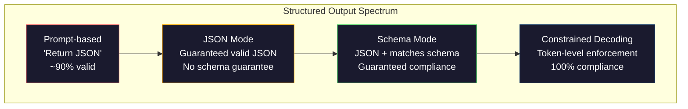
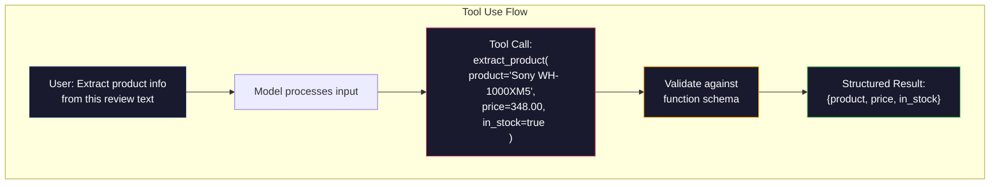

# संरचित आउटपुटः JSON, स्कीम सत्यापन, प्रतिबंधित डिकोडिंग

> आपका LLM एक स्ट्रिंग लौटाता है. आपके आवेदन को JSON की आवश्यकता है. उस अंतर ने किसी भी मॉडल भ्रम की तुलना में अधिक उत्पादन प्रणालियों को दुर्घटनाग्रस्त कर दिया है. संरचित आउटपुट प्राकृतिक भाषा और टाइप किए गए डेटा के बीच पुल है. इसे सही करें और आपका LLM एक विश्वसनीय एपीआई बन जाता है. इसे गलत करें और आप 3 बजे रेजेक्स के साथ मुक्त पाठ को पार्स कर रहे हैं।

> **【中文解读】**LLM  लौटने के लिए स्ट्रिंग, लेकिन आवेदन JSON की आवश्यकता है। संरचनात्मक आउटपुट प्राकृतिक भाषा और वर्गीकरण डेटा के बीच एक पुल है, जो "चैट मशीन" से "कौशल एपीआई" के लिए विकसित हुआ है।

> **【拓展：结构化输出→AI应用开发】** संरचनात्मक आउटपुट  फ़ंक्शन कॉलिंग RAG 管道 DATA提取等 AI  अनुप्रयोगों का आधार OpenAI `response_format`、 मानव संसाधन का उपयोग 、 प्रशिक्षक 库 इस क्षेत्र के मुख्य उपकरण हैं ‖

>  **【前置】**学本节前कृपया पहले掌握:(1) चरण 10·01-05(LLM 基础)  समझ टोकन 生成;(2) JSON योजना 基础`type``properties``required`);(3) पायथन `pydantic`库或 `dataclasses`本节用Pydantic做验证── यदि आप JSON Schema को नहीं समझते हैं, तो पहले jsonschema.org का 5 मिनट का ट्यूटोरियल देखें──

**Type:** Build | **类型:** 构建
**Languages:** Python | **语言:** Python
**Prerequisites:** Phase 10, Lessons 01-05 (LLMs from Scratch) | **前置知识:** Phase 10 · 01-05 (从零构建 LLM)
**Time:** ~90 minutes | **时间:** ~90 分钟
**Related:**चरण 5 · 20 (संरचित आउटपुट और प्रतिबंधित डिकोडिंग) डिकोडर-स्तर सिद्धांत (FSM/CFG लॉजिट प्रोसेसर, रूपरेखा, XGrammar) को कवर करता है। यह पाठ उत्पादन एसडीके सतह (OpenAI `response_format` पहले चरण 5 पढ़िए · 20 यदि आप समझना चाहते हैं कि एपीआई के नीचे क्या हो रहा है।**相关:**चरण 5 · 20 (struktur化输出与约束解码) 讲解码器级理论(FSM/CFG लॉजिट 处理器、概要、XGrammar)`response_format`、 मानव संसाधन उपयोग、 प्रशिक्षक) 想了解API 底下发生什么第一读阶段5 · 20──

## सीखने के लक्ष्य

- OpenAI और Anthropic API पैरामीटर का उपयोग करके JSON मोड और स्कीमा-सीमित आउटपुट लागू करें
  उपयोग OpenAI और मानव एपीआई 参数 JSON 模式 और Schema 约束 आउटपुट को लागू करने के लिए
- एक पायदान्टिक सत्यापन परत का निर्माण करें जो गलत LLM आउटपुट और त्रुटि प्रतिक्रिया के साथ पुनः प्रयासों को अस्वीकार करता है
  构建 Pydantic 验证层, rejectformatic error of LLM 输出并通过错误反重试
- समझाएं कि कैसे प्रतिबंधित डिकोडिंग प्रसंस्करण के बिना टोकन स्तर पर मान्य JSON को मजबूर करता है
  解释约束解码 कैसे टोकन 级强制生成有效 JSON, बिना प्रसंस्करण के
- मजबूत निष्कर्षण प्रमाणीकरण डिजाइन करें जो अविष्कृत पाठ को विश्वसनीय रूप से टाइप किए गए डेटा संरचनाओं में परिवर्तित करते हैं
  设计鲁棒的提取提示, विश्वसनीय रूप से गैर-संरचित ग्रंथ को वर्गीकृत डेटा संरचना में परिवर्तित किया जाएगा

> **【中文解读】**इस वर्ग का उद्देश्य: LLM को संरचनात्मक डेटा (JSON、XML、表格) ]] आउटपुट करने में सक्षम बनाना।


## समस्या  समस्या परिचय

आप एक LLM से पूछते हैंः "इस पाठ से उत्पाद का नाम, कीमत और उपलब्धता निकालें।" वह जवाब देता हैः

> आप LLM से पूछेंः "इस आलेख से उत्पाद का नाम, मूल्य और स्टॉक स्टेटस प्राप्त करेंः"

यह एक पूरी तरह से सही उत्तर है. यह आपके आवेदन के लिए भी पूरी तरह से बेकार है. आपकी सूची प्रणाली की जरूरत है।`{"product": "Sony WH-1000XM5", "price": 348.00, "in_stock": true}`. आपको विशिष्ट कुंजी, विशिष्ट प्रकार और विशिष्ट मूल्य प्रतिबंधों के साथ एक JSON वस्तु की आवश्यकता है. आपको एक वाक्य की आवश्यकता नहीं है.

> यह एक पूरी तरह से सही उत्तर है. लेकिन यह आपके अनुप्रयोग के लिए बिल्कुल भी उपयोगी नहीं है.`{"product": "Sony WH-1000XM5", "price": 348.00, "in_stock": true}` आप एक विशिष्ट कुंजी, विशिष्ट प्रकार और विशिष्ट मूल्य के साथ एक JSON वस्तु की आवश्यकता है आप एक वाक्य की आवश्यकता नहीं है

सरल समाधानः अपने प्रॉम्प्ट में "JSON में जवाब दें" जोड़ें। यह 90% समय काम करता है। अन्य 10% मॉडल JSON को मार्कडाउन कोड बाड़ों में लपेटता है, या "यहां JSON हैः" जैसे एक प्रस्तावना जोड़ता है, या वाक्यरचनात्मक रूप से अमान्य JSON का उत्पादन करता है क्योंकि यह एक ब्रैकेट को जल्दी बंद करता है। आपका JSON पार्सर दुर्घटनाग्रस्त हो गया। आपका पाइपलाइन टूट जाता है. आप try/except जोड़ते हैं और एक retry loop. पुनः प्रयास कभी-कभी अलग-अलग डेटा उत्पन्न करता है। अब आपके पास एक पार्सिंग समस्या के शीर्ष पर एक स्थिरता समस्या है।

>  सरल समाधान: आपके सुझाव में "JSON का उपयोग करके प्रतिक्रिया" को जोड़ें। यह 90% के मामले में मान्य है। शेष 10% के समय, मॉडल JSON को मार्कडाउन कोड ब्लॉक में पैक करेगा, या "यह JSON:" जैसे ओपनशीट है, या क्योंकि पूर्व बंद संकेतक के कारण भाषागत विधि के साथ निष्क्रिय JSON उत्पन्न होगी। आपका JSON पॉल्यूसर टूट गया है। आपका प्रवाह टूट गया है। आप try/except 和重试循环 को जोड़ते हैं। पुनः परीक्षण कभी-कभी अलग डेटा उत्पन्न करता है। अब आप पॉल्यूशन के मुद्दे पर एक बार फिर से एक संगतता समस्या है।

यह एक त्वरित इंजीनियरिंग समस्या नहीं है। यह एक डिकोडिंग समस्या है। मॉडल बाएं से दाएं टोकन उत्पन्न करता है। प्रत्येक स्थिति में, यह 100K + विकल्पों की शब्दावली से सबसे अधिक संभावना वाला अगला टोकन चुनता है। उन विकल्पों में से अधिकांश किसी भी स्थिति में अमान्य JSON उत्पन्न करेंगे। यदि मॉडल अभी जारी किया गया है `{"price":`, अगले टोकन एक अंक होना चाहिए, एक उद्धरण (स्ट्रिंग के लिए), `null`,`true`,`false`बिना किसी प्रतिबंध के, मॉडल एक पूरी तरह से उचित अंग्रेजी शब्द चुन सकता है जो वाक्य रचना में विनाशकारी रूप से गलत है।

> यह सुझाव इंजीनियरिंग समस्या नहीं है। यह कोड हल करने की समस्या है। मॉडल बाएं से दाएं तक टोकन उत्पन्न करता है। प्रत्येक स्थान पर, यह 100,000+ विकल्पों के शब्दावली से सबसे संभावित अगले टोकन का चयन करता है। इनमें से अधिकांश विकल्प किसी भी दिए गए स्थान पर निष्क्रिय JSON उत्पन्न करेंगे। यदि मॉडल अभी आउटपुट किया गया है।`{"price":`, अगला एक टोकन 必须是数字、引号(字符串 के लिए उपयोग किया जाता है) 、`null``true``false`या नकारात्मक संख्या। अन्य कुछ भी निष्क्रिय उत्पन्न होगा। बिना किसी प्रतिबंध के शब्द, मॉडल एक पूरी तरह से उचित अंग्रेजी शब्द चुन सकता है, लेकिन भाषा में आपदाजनक त्रुटि है।

>  **【类比】** बोलने के लिए आधे समय तक संभव है कि आप किसी अन्य शब्द का प्रयोग कर सकते हैं, परिणाम भाषा विधि त्रुटि है।

> ️ **【易错点】**结构化输出 3 个坑:(1) **Schema 字段过多** 20 से अधिक 个字段模型记不住,会漏字段或填错;修复:拆成嵌套对象,每层不超过5个字段――(2) **要求 LLM 输出"创造性"字段但又强 Schema**उदाहरण के लिए "उत्पन्न रचनात्मक शीर्षक" संयोजन `title: str`, मॉडल द्वारा योजना 约束后变得保守;修复:用 `temperature=0.9`+ योजना 中加 `min_length: 10`留余地──(3) **没用 Pydantic 验证** सीधे `json.loads()`一字符串里有数字("348") पर बने स्ट्र और न कि फ्लोट; Pydantic स्वचालित मजबूर प्रकार के साथ रूपांतरण

## अवधारणा का मूल अवधारणा

> **【中文解读】**结构化输出是让LLM 生成 JSON、XML等格式的可控输出──关键技术:函数调用(Function Calling)让模型输出预定义的 JSON schema,JSON मोड 强制模型生成合法 JSON,约束解码(सीमित डिकोडिंग) 在代币级别保证输出格式──

> 🤔 **【困惑】**प्रश्नः OpenAI का `response_format={"type": "json_object"}`和 `response_format={"type": "json_schema", ...}`क्या अंतर है? एः पूर्ववर्ती "JSON मोड" है जो कानूनी JSON आउटपुट की गारंटी देता है, लेकिन यह नहीं है कि यह एक निश्चित खंड है।`json_schema`模式──

> **【拓展：结构化输出的工程实践】**OpenAI के संरचित आउटपुट(2024) गारंटी मॉडल आउटपुट कठोर रूप से फिट दिए गए JSON योजना, विश्वसनीयता से लगभग 90% 提升到100%── प्रशिक्षक 库(पायथन) स्वचालित रूप से Pydantic 模型 को JSON योजना में परिवर्तित करेगा और परीक्षण आउटपुट करेगा── यह LLM 集成到生产系统的关键技术──


### संरचित आउटपुट स्पेक्ट्रम

संरचनात्मक आउटपुट नियंत्रण के चार स्तर हैं, प्रत्येक पिछले से अधिक विश्वसनीय है।

>  संरचनात्मक आउटपुट नियंत्रण में चार स्तर हैं, प्रत्येक पिछले एक की तुलना में अधिक विश्वसनीय है।



**Prompt-based**("वैध JSON में जवाब दें"): कोई निष्पादन नहीं। मॉडल आमतौर पर अनुपालन करता है लेकिन कभी-कभी नहीं। विश्वसनीयताः ~ 90%. विफलता मोडः मार्कडाउन बाड़, प्रस्तावना पाठ, ट्रंक आउटपुट, गलत संरचना।

> **基于提示**("उपयोग प्रभावी JSON 回复"): कोई अनिवार्य निष्पादन नहीं है। मॉडल आमतौर पर पालन किया जाता है, लेकिन कभी कभी नहीं किया जाता है।

**JSON mode**: एपीआई आउटपुट मान्य JSON है की गारंटी देता है।`response_format: { type: "json_object" }`यह संभव है. आउटपुट त्रुटि के बिना विश्लेषण करेगा. लेकिन यह आपके अपेक्षित योजना से मेल नहीं खा सकता है - अतिरिक्त कुंजी, गलत प्रकार, गायब क्षेत्रों.

> **JSON 模式**:एपीआई गारंटी आउटपुट प्रभावी है JSON──OpenAI के `response_format: { type: "json_object" }` इस फ़ंक्शन को सक्षम करें── आउटपुट त्रुटि रहित हल किया जा सकता है── लेकिन यह आपके अपेक्षित स्कीम अधिशेष कीवर्ड त्रुटि प्रकार अनुपलब्ध के खण्ड के अनुरूप नहीं हो सकता है।

**Schema mode**2026 में, प्रत्येक प्रमुख प्रदाता इसे मूल रूप से समर्थन करता हैः ओपनएआई के `response_format: { type: "json_schema", json_schema: {...} }`(अधिकतर `tool_choice="required"`), एंट्रोपिक के उपकरण का उपयोग `input_schema`, और जुड़वां के `response_schema`+ `response_mime_type: "application/json"`. आउटपुट में आपके द्वारा निर्दिष्ट कुंजी, प्रकार और प्रतिबंध हैं।

> **Schema 模式**:API  JSON Schema स्वीकार नहीं करता और आउटपुट मैच को सुनिश्चित करता है।`response_format: { type: "json_schema" }`、 मानव के साथ`input_schema`                                                                                                                                                                                                                                                              `response_schema`输出具有你指定精确键、类型和约束──

**Constrained decoding**: उत्पन्न के दौरान प्रत्येक टोकन स्थिति पर, डिकोडर उन सभी टोकन को छिपाता है जो अमान्य आउटपुट उत्पन्न करेंगे। यदि स्कीमा में एक संख्या की आवश्यकता होती है और मॉडल एक अक्षर जारी करने के लिए तैयार है, तो वह टोकन शून्य संभावना पर सेट किया जाता है। मॉडल केवल टोकन उत्पन्न कर सकता है जो वैध आउटपुट का कारण बनता है। यह है कि OpenAI के संरचित आउटपुट मोड और लाइब्रेरी जैसे रूपरेखा और मार्गदर्शन हुड के तहत लागू करते हैं।

> **约束解码**: उत्पन्न प्रक्रिया में प्रत्येक टोकन स्थिति में, डिसीडर सभी को निष्क्रिय आउटपुट टोकन उत्पन्न करेगा। यदि स्कीम िकमा करता है कि डिजिटल और मॉडल अक्षरों को आउटपुट करेगा, तो उस टोकन की संभावना शून्य पर सेट की जाएगी। मॉडल केवल प्रभावी आउटपुट टोकन को उत्पन्न कर सकता है।

### JSON स्कीमः अनुबंध भाषा

JSON Schema यह है कि आप मॉडल (या सत्यापन परत) को कैसे बताते हैं कि आउटपुट का क्या आकार होना चाहिए। प्रत्येक प्रमुख संरचित आउटपुट सिस्टम इसका उपयोग करता है।

> JSON Schema is you tell the model (या सत्यापन स्तर) आउटपुट को किस तरह से होना चाहिए। प्रत्येक मुख्य संरचनात्मक आउटपुट सिस्टम इसका उपयोग करता है।

```json
{
  "type": "object",
  "properties": {
    "product": { "type": "string" },
    "price": { "type": "number", "minimum": 0 },
    "in_stock": { "type": "boolean" },
    "categories": {
      "type": "array",
      "items": { "type": "string" }
    }
  },
  "required": ["product", "price", "in_stock"]
}
```

इस योजना में कहा गया हैः आउटपुट एक स्ट्रिंग के साथ एक वस्तु होना चाहिए `product`, एक गैर-नकारात्मक संख्या `price`, एक बुलियन `in_stock`, और स्ट्रिंग की एक वैकल्पिक सरणी `categories`. जो भी आउटपुट मेल नहीं खाता उसे अस्वीकार कर दिया जाता है.

> इस योजना का वर्णनः आउटपुट एक वस्तु होना चाहिए, जिसमें वर्ण हैं`product`、非负数字 `price`≈ मूल्य`in_stock`和可选的字符串数组 `categories`️ किसी भी असंगत आउटपुट को अस्वीकार कर दिया जाएगा

योजनाओं में कठिन मामलों को संभालते हैंः घोंसले हुए वस्तुओं, टाइप किए गए आइटम वाले सरणी, एनयूम (एक स्ट्रिंग को विशिष्ट मानों तक सीमित करें), पैटर्न मिलान (स्ट्रिंग पर रेगेक्स) और संयोजक (एक-ऑफ, किसी भी, बहुरूप आउटपुट के लिए सभी-ऑफ) ।

> Schema 处理复杂情况:嵌套对象、带类型项的数组、枚举(将字符串约束为特定值) 模式匹配(字符串上正则表达式) और组合器(oneOf、anyOf、allOf उपयोग多态输出) ⋅

### पाइडान्टिक पैटर्न

पायथन में, आप JSON स्कीमा को हाथ से नहीं लिखते हैं। आप एक पायदानटिक मॉडल को परिभाषित करते हैं और यह आपके लिए स्कीमा उत्पन्न करता है।

> Python में, आप JSON Schema को हाथ से लिखने की जरूरत नहीं है. आप एक Pydantic  मॉडल को परिभाषित करते हैं, यह आपके लिए स्कीम उत्पन्न करेगा.

```python
from pydantic import BaseModel

class Product(BaseModel):
    product: str
    price: float
    in_stock: bool
    categories: list[str] = []
```

यह उपरोक्त के समान JSON योजना का उत्पादन करता है। इंस्ट्रक्टर लाइब्रेरी (और OpenAI के SDK) सीधे पायदान्टिक मॉडल स्वीकार करते हैंः मॉडल वर्ग पास करें, एक सत्यापित उदाहरण वापस प्राप्त करें। यदि एलएलएम आउटपुट मेल नहीं खाता है, तो इंस्ट्रक्टर स्वचालित रूप से पुनः प्रयास करता है।

> यह उपरोक्त के समान JSON Schema के साथ उत्पन्न होगा। इंस्ट्रक्टर 库(और OpenAI के SDK) सीधे Pydantic 模型:传入模型类,返回验证过的实例―― यदि LLM 输出不匹配, इंस्ट्रक्टर会自动重试――

### फ़ंक्शन कॉल / टूल का उपयोग

एक ही समस्या के लिए एक वैकल्पिक इंटरफ़ेस। मॉडल से सीधे JSON उत्पन्न करने के लिए पूछने के बजाय, आप टाइप किए गए पैरामीटर के साथ "उपकरण" (फंक्शन) को परिभाषित करते हैं। मॉडल संरचित तर्कों के साथ एक फ़ंक्शन कॉल आउटपुट करता है। ओपनएआई इसे "फ़ंक्शन कॉल" कहता है। मानव जाति इसे "उपकरण उपयोग" कहता है। परिणाम समान हैः संरचित डेटा।

> 解决同一问题的替代接口──不是要求模型直接产生 JSON,而是定义带类型参数的"工具" (函数)──模型输出带有结构化参数的函数调用──OpenAI 称之为"函数调用"",人类学 称之为"工具使用"──结果相同:结构化数据──



उपकरण का उपयोग तब पसंद किया जाता है जब मॉडल को यह चुनना होता है कि किस फ़ंक्शन को कॉल करना है, न कि केवल पैरामीटर भरना। यदि आपके पास 10 अलग-अलग निष्कर्षण योजनाएं हैं और मॉडल को इनपुट के आधार पर सही एक चुनना चाहिए, तो उपकरण का उपयोग आपको स्कीमा चयन और संरचित आउटपुट दोनों देता है।

> जब मॉडल को चुनना होगा कि कौन सा फ़ंक्शन उपयोग करना है, न कि केवल तत्व भरना, प्राथमिक चयन उपकरण का उपयोग करना है। यदि आपके पास 10 अलग-अलग निकासी योजनाएं हैं और मॉडल को सही चयन करने के आधार पर उपयोग करना होगा, तो उपकरण का उपयोग करें। साथ ही स्कीमा चयन और संरचनात्मक आउटपुट प्रदान करें।

### आम विफलता मोड

यहां तक कि योजना के कार्यान्वयन के साथ, संरचित आउटपुट सूक्ष्म तरीकों से विफल हो सकते हैं।

> यहां तक कि अगर कोई योजना ज़रूरी निष्पादन है, तो संरचनात्मक आउटपुट भी सूक्ष्म तरीके से विफल हो सकता है।

**Hallucinated values**: आउटपुट योजना से मेल खाता है लेकिन आविष्कार डेटा शामिल है। मॉडल उत्पन्न करता है `{"price": 299.99}`जब पाठ कहता है $348. स्कीम सत्यापन यह नहीं पकड़ सकता है - प्रकार सही है, मूल्य गलत है.

> **幻觉值**: आउटपुट मैच स्कीम लेकिन इसमें फर्जी डेटा शामिल है।`{"price": 299.99}` योजना 验证无法捕获这个问题类型正确,值错误

**Enum confusion**: आप एक क्षेत्र को सीमित करते हैं `["in_stock", "out_of_stock", "preorder"]`. मॉडल आउटपुट `"available"`-- अर्थशास्त्र में सही, लेकिन अनुमति सेट में नहीं. अच्छा प्रतिबंधित डिकोडिंग इससे बचाता है. प्रॉम्प्ट आधारित दृष्टिकोण नहीं करते.

> **枚举混淆**:你将字段约束为 `["in_stock", "out_of_stock", "preorder"]`模型输出 `"available"`语义上正确, लेकिन अनुमत संग्रह में नहीं है।

**Nested object depth**: गहरे घोंसले वाले योजनाओं (4+ स्तर) में अधिक त्रुटियां होती हैं। घोंसले के प्रत्येक स्तर एक और स्थान है जहां मॉडल संरचना का ट्रैक खो सकता है।

> **嵌套对象深度**: गहरे स्तर के嵌套 की योजना ((4+ 层) अधिक त्रुटियां उत्पन्न करें। प्रत्येक स्तर के嵌套 में मॉडल हो सकता है संरचना खोने का पता लगाने के लिए एक और स्थान है।

**Array length**: मॉडल में एक सरणी में बहुत अधिक या बहुत कम आइटम उत्पन्न हो सकते हैं। योजनाओं का समर्थन `minItems`और `maxItems`लेकिन सभी प्रदाताओं को उन्हें डिकोडिंग स्तर पर लागू नहीं करना चाहिए।

> **数组长度**मॉडल: मॉडल में बहुत अधिक या बहुत कम तत्व उत्पन्न हो सकते हैं।`minItems`和 `maxItems`लेकिन सभी प्रदाता कोड के स्तर पर अनिवार्य नहीं हैं।

**Optional field omission**: मॉडल उन फ़ील्ड को छोड़ देता है जो तकनीकी रूप से वैकल्पिक हैं लेकिन आपके उपयोग के मामले के लिए अर्थशास्त्र रूप से महत्वपूर्ण हैं। उन्हें योजना में आवश्यक के रूप में सेट करें भले ही कभी-कभी डेटा गायब हो जाए - मॉडल को उत्पन्न करने के लिए मजबूर करें`null`स्पष्ट रूप से।

> **可选字段遗漏**उदाहरण: मॉडल तकनीकी रूप से चयन योग्य है, लेकिन आपके उपयोग के मामले के लिए महत्वपूर्ण है।`null`

## इसे बनाओ, इसे पूरा करो।
```figure
mx-schema-funnel
```

## इसे बनाओ

### चरण 1: JSON योजना सत्यापितकर्ता

एक सत्यापनकर्ता को खरोंच से बनाएं जो जांचता है कि क्या एक पायथन ऑब्जेक्ट JSON स्कीम से मेल खाता है। यह अनुपालन की पुष्टि करने के लिए आउटपुट पक्ष पर चलता है।

> 零构建验证器 से, Python को जांचें कि क्या वस्तु JSON Schema से मेल खाती है।

```python
import json

def validate_schema(data, schema):
    errors = []
    _validate(data, schema, "", errors)
    return errors

def _validate(data, schema, path, errors):
    schema_type = schema.get("type")

    if schema_type == "object":
        if not isinstance(data, dict):
            errors.append(f"{path}: expected object, got {type(data).__name__}")
            return
        for key in schema.get("required", []):
            if key not in data:
                errors.append(f"{path}.{key}: required field missing")
        properties = schema.get("properties", {})
        for key, value in data.items():
            if key in properties:
                _validate(value, properties[key], f"{path}.{key}", errors)

    elif schema_type == "array":
        if not isinstance(data, list):
            errors.append(f"{path}: expected array, got {type(data).__name__}")
            return
        min_items = schema.get("minItems", 0)
        max_items = schema.get("maxItems", float("inf"))
        if len(data) < min_items:
            errors.append(f"{path}: array has {len(data)} items, minimum is {min_items}")
        if len(data) > max_items:
            errors.append(f"{path}: array has {len(data)} items, maximum is {max_items}")
        items_schema = schema.get("items", {})
        for i, item in enumerate(data):
            _validate(item, items_schema, f"{path}[{i}]", errors)

    elif schema_type == "string":
        if not isinstance(data, str):
            errors.append(f"{path}: expected string, got {type(data).__name__}")
            return
        enum_values = schema.get("enum")
        if enum_values and data not in enum_values:
            errors.append(f"{path}: '{data}' not in allowed values {enum_values}")

    elif schema_type == "number":
        if not isinstance(data, (int, float)):
            errors.append(f"{path}: expected number, got {type(data).__name__}")
            return
        minimum = schema.get("minimum")
        maximum = schema.get("maximum")
        if minimum is not None and data < minimum:
            errors.append(f"{path}: {data} is less than minimum {minimum}")
        if maximum is not None and data > maximum:
            errors.append(f"{path}: {data} is greater than maximum {maximum}")

    elif schema_type == "boolean":
        if not isinstance(data, bool):
            errors.append(f"{path}: expected boolean, got {type(data).__name__}")

    elif schema_type == "integer":
        if not isinstance(data, int) or isinstance(data, bool):
            errors.append(f"{path}: expected integer, got {type(data).__name__}")
```

### चरण 2: पाइडान्टिक-स्टाइल मॉडल से योजना तक

एक न्यूनतम वर्ग से योजना कनवर्टर बनाएं। एक पायथन वर्ग को परिभाषित करें और स्वचालित रूप से इसका JSON योजना उत्पन्न करें।

> 构建最小类到方案 转换器──定义 Python 类, स्वचालित रूप से उत्पन्न इसकी JSON Schema──

```python
class SchemaField:
    def __init__(self, field_type, required=True, default=None, enum=None, minimum=None, maximum=None):
        self.field_type = field_type
        self.required = required
        self.default = default
        self.enum = enum
        self.minimum = minimum
        self.maximum = maximum

def python_type_to_schema(field):
    type_map = {
        str: "string",
        int: "integer",
        float: "number",
        bool: "boolean",
    }

    schema = {}

    if field.field_type in type_map:
        schema["type"] = type_map[field.field_type]
    elif field.field_type == list:
        schema["type"] = "array"
        schema["items"] = {"type": "string"}
    elif isinstance(field.field_type, dict):
        schema = field.field_type

    if field.enum:
        schema["enum"] = field.enum
    if field.minimum is not None:
        schema["minimum"] = field.minimum
    if field.maximum is not None:
        schema["maximum"] = field.maximum

    return schema

def model_to_schema(name, fields):
    properties = {}
    required = []

    for field_name, field in fields.items():
        properties[field_name] = python_type_to_schema(field)
        if field.required:
            required.append(field_name)

    return {
        "type": "object",
        "properties": properties,
        "required": required,
    }
```

### चरण 3: प्रतिबंधित टोकन फ़िल्टर

सीमित डिकोडिंग का अनुकरण करें। आंशिक JSON स्ट्रिंग और एक स्कीमा को देखते हुए, निर्धारित करें कि वर्तमान स्थिति में कौन से टोकन श्रेणियां मान्य हैं।

> 模拟约束解码──给定部分 JSON 字符串和方案, निर्धारित करें कि वर्तमान स्थिति में कौन से टोकन 类别有效──

```python
def next_valid_tokens(partial_json, schema):
    stripped = partial_json.strip()

    if not stripped:
        return ["{"]

    try:
        json.loads(stripped)
        return ["<EOS>"]
    except json.JSONDecodeError:
        pass

    last_char = stripped[-1] if stripped else ""

    if last_char == "{":
        return ['"', "}"]
    elif last_char == '"':
        if stripped.endswith('":'):
            return ['"', "0-9", "true", "false", "null", "[", "{"]
        return ["a-z", '"']
    elif last_char == ":":
        return [" ", '"', "0-9", "true", "false", "null", "[", "{"]
    elif last_char == ",":
        return [" ", '"', "{", "["]
    elif last_char in "0123456789":
        return ["0-9", ".", ",", "}", "]"]
    elif last_char == "}":
        return [",", "}", "]", "<EOS>"]
    elif last_char == "]":
        return [",", "}", "<EOS>"]
    elif last_char == "[":
        return ['"', "0-9", "true", "false", "null", "{", "[", "]"]
    else:
        return ["any"]

def demonstrate_constrained_decoding():
    partial_states = [
        '',
        '{',
        '{"product"',
        '{"product":',
        '{"product": "Sony"',
        '{"product": "Sony",',
        '{"product": "Sony", "price":',
        '{"product": "Sony", "price": 348',
        '{"product": "Sony", "price": 348}',
    ]

    print(f"{'Partial JSON':<45} {'Valid Next Tokens'}")
    print("-" * 80)
    for state in partial_states:
        valid = next_valid_tokens(state, {})
        display = state if state else "(empty)"
        print(f"{display:<45} {valid}")
```

### चरण 4: निष्कर्षण पाइपलाइन

सब कुछ एक निष्कर्षण पाइपलाइन में जोड़ेंः एक योजना को परिभाषित करें, एक एलएलएम का अनुकरण करें जो संरचित आउटपुट का उत्पादन करता है, आउटपुट को मान्य करें, और पुनः प्रयासों को संभालें।

>                                                                                                                                                                                                                                                               

```python
def simulate_llm_extraction(text, schema, attempt=0):
    if "headphones" in text.lower() or "sony" in text.lower():
        if attempt == 0:
            return '{"product": "Sony WH-1000XM5", "price": 348.00, "in_stock": true, "categories": ["audio", "headphones"]}'
        return '{"product": "Sony WH-1000XM5", "price": 348.00, "in_stock": true}'

    if "laptop" in text.lower():
        return '{"product": "MacBook Pro 16", "price": 2499.00, "in_stock": false, "categories": ["computers"]}'

    return '{"product": "Unknown", "price": 0, "in_stock": false}'

def extract_with_retry(text, schema, max_retries=3):
    for attempt in range(max_retries):
        raw = simulate_llm_extraction(text, schema, attempt)

        try:
            data = json.loads(raw)
        except json.JSONDecodeError as e:
            print(f"  Attempt {attempt + 1}: JSON parse error -- {e}")
            continue

        errors = validate_schema(data, schema)
        if not errors:
            return data

        print(f"  Attempt {attempt + 1}: Schema validation errors -- {errors}")

    return None

product_schema = {
    "type": "object",
    "properties": {
        "product": {"type": "string"},
        "price": {"type": "number", "minimum": 0},
        "in_stock": {"type": "boolean"},
        "categories": {"type": "array", "items": {"type": "string"}},
    },
    "required": ["product", "price", "in_stock"],
}
```

### चरण 5: पूरी पाइपलाइन चलाएं

> 步骤 5:运行完整流水线──

```python
def run_demo():
    print("=" * 60)
    print("  Structured Output Pipeline Demo")
    print("=" * 60)

    print("\n--- Schema Definition ---")
    product_fields = {
        "product": SchemaField(str),
        "price": SchemaField(float, minimum=0),
        "in_stock": SchemaField(bool),
        "categories": SchemaField(list, required=False),
    }
    generated_schema = model_to_schema("Product", product_fields)
    print(json.dumps(generated_schema, indent=2))

    print("\n--- Schema Validation ---")
    test_cases = [
        ({"product": "Test", "price": 10.0, "in_stock": True}, "Valid object"),
        ({"product": "Test", "price": -5.0, "in_stock": True}, "Negative price"),
        ({"product": "Test", "in_stock": True}, "Missing price"),
        ({"product": "Test", "price": "ten", "in_stock": True}, "String as price"),
        ("not an object", "String instead of object"),
    ]

    for data, label in test_cases:
        errors = validate_schema(data, product_schema)
        status = "PASS" if not errors else f"FAIL: {errors}"
        print(f"  {label}: {status}")

    print("\n--- Constrained Decoding Simulation ---")
    demonstrate_constrained_decoding()

    print("\n--- Extraction Pipeline ---")
    texts = [
        "The Sony WH-1000XM5 headphones are priced at $348 and currently available.",
        "The new MacBook Pro 16-inch laptop costs $2499 but is sold out.",
        "This is a random sentence with no product info.",
    ]

    for text in texts:
        print(f"\n  Input: {text[:60]}...")
        result = extract_with_retry(text, product_schema)
        if result:
            print(f"  Output: {json.dumps(result)}")
        else:
            print(f"  Output: FAILED after retries")
```

## इसे फ्रेमवर्क के साथ लागू करें

### OpenAI संरचित आउटपुट

> ओपनएआई  संरचनात्मक आउटपुट

```python
# from openai import OpenAI
# from pydantic import BaseModel
#
# client = OpenAI()
#
# class Product(BaseModel):
#     product: str
#     price: float
#     in_stock: bool
#
# response = client.beta.chat.completions.parse(
#     model="gpt-5-mini",
#     messages=[
#         {"role": "system", "content": "Extract product information."},
#         {"role": "user", "content": "Sony WH-1000XM5, $348, in stock"},
#     ],
#     response_format=Product,
# )
#
# product = response.choices[0].message.parsed
# print(product.product, product.price, product.in_stock)
```

OpenAI के संरचित आउटपुट मोड में आंतरिक रूप से प्रतिबंधित डिकोडिंग का उपयोग किया जाता है। मॉडल द्वारा उत्पन्न किए जाने वाले प्रत्येक टोकन को पाइदान्टिक योजना से मेल खाने वाले आउटपुट का उत्पादन करने की गारंटी है। कोई पुनः प्रयास की आवश्यकता नहीं है। कोई सत्यापन की आवश्यकता नहीं है। प्रतिबंध को डिकोडिंग प्रक्रिया में बेक किया जाता है।

> OpenAI का संरचनात्मक आउटपुट मोड आंतरिक रूप से उपयोग में है। मॉडल उत्पन्न प्रत्येक टोकन का पदान्तिक योजना के आउटपुट के अनुरूप होने का आश्वासन देता है।

### मानव संसाधन उपकरण का उपयोग

> मानव जाति 工具使用──

```python
# import anthropic
#
# client = anthropic.Anthropic()
#
# response = client.messages.create(
#     model="claude-opus-4-7",
#     max_tokens=1024,
#     tools=[{
#         "name": "extract_product",
#         "description": "Extract product information from text",
#         "input_schema": {
#             "type": "object",
#             "properties": {
#                 "product": {"type": "string"},
#                 "price": {"type": "number"},
#                 "in_stock": {"type": "boolean"},
#             },
#             "required": ["product", "price", "in_stock"],
#         },
#     }],
#     messages=[{"role": "user", "content": "Extract: Sony WH-1000XM5, $348, in stock"}],
# )
```

एंथ्रोपिक उपकरण के उपयोग के माध्यम से संरचित आउटपुट प्राप्त करता है। मॉडल इनपुट_स्कीम से मेल खाने वाले संरचित तर्कों के साथ एक उपकरण कॉल जारी करता है। समान परिणाम, अलग एपीआई सतह।

> मानव  माध्यम से उपकरण उपयोग 实现结构化输出──模型发出一个工具调用,其结构化参数匹配 input_schema──结果相同,API 接口不同──

### प्रशिक्षक पुस्तकालय

> प्रशिक्षक 库――

```python
# pip install instructor
# import instructor
# from openai import OpenAI
# from pydantic import BaseModel
#
# client = instructor.from_openai(OpenAI())
#
# class Product(BaseModel):
#     product: str
#     price: float
#     in_stock: bool
#
# product = client.chat.completions.create(
#     model="gpt-5-mini",
#     response_model=Product,
#     messages=[{"role": "user", "content": "Sony WH-1000XM5, $348, in stock"}],
# )
```

इंस्ट्रक्टर किसी भी एलएलएम क्लाइंट को लपेटता है और सत्यापन के साथ स्वचालित पुनः प्रयास जोड़ता है। यदि पहला प्रयास सत्यापन में विफल रहता है, तो यह संदर्भ के रूप में मॉडल को त्रुटियों को वापस भेजता है और आउटपुट को ठीक करने के लिए कहता है। यह केवल ओपनएआई के साथ काम नहीं करता है।

> प्रशिक्षक  पैकेज किसी भी LLM  ग्राहक  में नहीं जोड़ा गया है सत्यापन के साथ स्वचालित पुनः परीक्षण। यदि पहला परीक्षण विफल हो गया है, तो यह त्रुटि के रूप में ऊपर नीचे भेजा गया मॉडल और आवश्यकता है कि संशोधन आउटपुट।

## इसे भेजें उत्पाद

यह सबक हमें फल देता है`outputs/prompt-structured-extractor.md`-- एक पुनः प्रयोज्य प्रॉम्प्ट टेम्पलेट जो किसी भी पाठ से संरचित डेटा निकालेगा जो एक स्कीमा परिभाषा दी गई है। इसे एक JSON स्कीमा और असंगठित पाठ खिलाएं, और यह मान्य JSON लौटाता है।

> 本课产生 `outputs/prompt-structured-extractor.md` एक पुनः प्रयोज्य सुझाव ढाँचा, एक निर्धारित योजना  परिभाषा, किसी भी पाठ में से संरचनात्मक डेटा  से प्राप्त करें  JSON योजना और गैर-संरचनात्मक पाठ में प्रक्षेपित करें, यह सत्यापित JSON  को वापस लौटाता है

यह भी उत्पादन करता है `outputs/skill-structured-outputs.md`-- आपके प्रदाता, विश्वसनीयता आवश्यकताओं और योजना जटिलता के आधार पर सही संरचित आउटपुट रणनीति चुनने के लिए एक निर्णय ढांचा।

> यह भी उत्पन्न होता है`outputs/skill-structured-outputs.md` एक निर्णय ढांचा, आपके प्रदाता के आधार पर विश्वसनीयता आवश्यकताओं और योजना  जटिलता सही संरचनात्मक आउटपुट रणनीति चुनें

## अभ्यास विषय

1. समर्थन करने के लिए स्कीम सत्यापनकर्ता का विस्तार करें `oneOf`(डेटा कई योजनाओं में से एक से बिल्कुल मेल खाने चाहिए) यह बहुरूप आउटपुट को संभालता है - उदाहरण के लिए, एक क्षेत्र जो या तो एक हो सकता है`Product`या `Service`विभिन्न आकारों के वस्तुओं।
    विस्तार योजना  प्रमाणिकरण `oneOf`(डेटा को कई योजनाओं में से एक के साथ मेल करना चाहिए)  यह कई प्रकार के आउटपुट को संसाधित करता है।`Product`या `Service`वस्तुओं को

2. एक "स्केमा डिफर" उपकरण बनाएं जो दो योजनाओं की तुलना करता है और ब्रेक परिवर्तनों (आवश्यक क्षेत्रों को हटा दिया गया, प्रकार बदल दिए गए) को गैर-ब्रेकिंग परिवर्तनों (जोड़े गए वैकल्पिक क्षेत्र, ढील दिए गए प्रतिबंध) के खिलाफ पहचानता है। यह उत्पादन में आपके निष्कर्षण योजनाओं को संस्करणित करने के लिए आवश्यक है।
    एक "स्कीमा अंतर" उपकरण बनाएं, दो स्कीमाओं की तुलना करें और विनाशकारी परिवर्तनों को पहचानें (आवश्यक तत्वों को हटाने, परिवर्तन के प्रकार) और विनाशकारी परिवर्तनों को जोड़ने के लिए)

3. एक अधिक यथार्थवादी प्रतिबंधित डिकोडिंग सिम्युलेटर लागू करें। एक JSON योजना और 100 टोकन (अक्षर, अंकों, विरामचिह्न, कीवर्ड) की शब्दावली को देखते हुए, प्रत्येक स्थिति में अमान्य टोकन को छिपाने के लिए पीढ़ी के माध्यम से कदम से कदम चलाएं। प्रत्येक चरण में शब्दावली का प्रतिशत कितना मान्य है, इसका माप करें।
   实现 एक अधिक वास्तविक बंधन解码模拟器──给定 JSON Schema 和 100 个符号的词表, चरणबद्ध रूप से उत्पन्न, प्रत्येक स्थान पर छिपे हुए निष्क्रिय टोकन── माप प्रत्येक चरण के लिए शब्द表 के प्रभावी प्रतिशत──

4. एक निष्कर्षण मूल्यांकन सूट बनाएं। 50 उत्पाद विवरण बनाएँ जो हाथ से लेबल किए गए JSON आउटपुट के साथ हैं। अपने निष्कर्षण पाइपलाइन को सभी 50 पर चलाएं और सटीक मैच, क्षेत्र स्तर की सटीकता और प्रकार अनुपालन मापें। पहचानें कि कौन से फ़ील्ड सही ढंग से निष्कर्षण करने के लिए सबसे कठिन हैं।
    एक                                                                                                                                                                                                                                                              

5. अपने निष्कर्षण पाइपलाइन में "विश्वास स्कोर" जोड़ें। प्रत्येक निष्कर्षित क्षेत्र के लिए, अनुमान लगाएं कि मॉडल कितना आश्वस्त है (टोकन संभावनाओं के आधार पर, या निष्कर्षण को 3 बार चलाकर और स्थिरता को मापकर) । मानव समीक्षा के लिए कम-विश्वास वाले क्षेत्रों को चिह्नित करें।
   提取流水线添加"विश्वास度评分"── प्रत्येक विश्वास के खंड पर, अनुमानित मॉडल की विश्वासता基于 टोकन 概率或运行 3次提取测量一致性──标记低信度字段供人工审查

## कीवर्ड्स  शब्द खोज तालिका

| Term | What people say | What it actually means | 中文释义 |
|------|----------------|----------------------|---------|
| JSON mode | "Returns JSON" / "返回 JSON" | API flag that guarantees syntactically valid JSON output, but does not enforce any particular schema | JSON 模式：API 标志，保证语法有效的 JSON 输出，但不强制执行特定 schema |
| Structured output | "Typed JSON" / "类型化 JSON" | Output that matches a specific JSON Schema with correct keys, types, and constraints | 结构化输出：匹配特定 JSON Schema 的输出，具有正确的键、类型和约束 |
| Constrained decoding | "Guided generation" / "引导生成" | At each token position, mask out tokens that would produce invalid output -- guarantees 100% schema compliance | 约束解码：在每个 token 位置屏蔽会产生无效输出的 token，保证 100% schema 合规 |
| JSON Schema | "A JSON template" / "JSON 模板" | A declarative language for describing the structure, types, and constraints of JSON data (used by OpenAPI, JSON Forms, etc.) | JSON Schema：描述 JSON 数据结构、类型和约束的声明式语言 |
| Pydantic | "Python dataclasses+" / "Python 数据类+" | Python library that defines data models with type validation, used by FastAPI and Instructor to generate JSON Schemas | Pydantic：定义带类型验证数据模型的 Python 库，用于生成 JSON Schema |
| Function calling | "Tool use" / "工具使用" | LLM outputs a structured function invocation (name + typed arguments) instead of free text -- OpenAI and Anthropic both support this | 函数调用：LLM 输出结构化的函数调用（名称+类型化参数），而非自由文本 |
| Instructor | "Pydantic for LLMs" / "LLM 的 Pydantic" | Python library that wraps LLM clients to return validated Pydantic instances, with automatic retry on validation failure | Instructor：包装 LLM 客户端返回验证过的 Pydantic 实例的 Python 库 |
| Token masking | "Filtering the vocabulary" / "过滤词表" | Setting specific token probabilities to zero during generation so the model cannot produce them | Token 屏蔽：在生成过程中将特定 token 概率设为零 |
| Schema compliance | "Matches the shape" / "匹配形状" | The output has every required field, correct types, values within constraints, and no extra disallowed fields | Schema 合规：输出具有每个必需字段、正确类型、约束内的值 |
| Retry loop | "Try again until it works" / "重试直到成功" | Send validation errors back to the model and ask it to fix the output -- Instructor does this automatically, up to a configurable max | 重试循环：将验证错误发回模型并要求修复输出 |

## आगे पढ़ना 延伸閱讀

- [OpenAI Structured Outputs Guide](https://platform.openai.com/docs/guides/structured-outputs)-- OpenAI API में JSON स्कीम आधारित प्रतिबंधित डिकोडिंग के लिए आधिकारिक दस्तावेज
  OpenAI API में JSON योजना के आधार पर आधिकारिक दस्तावेज
- [Willard & Louf, 2023 -- "Efficient Guided Generation for Large Language Models"](https://arxiv.org/abs/2307.09702)-- रेखाचित्र पेपर, वर्णन कैसे टोकन स्तर की बाधाओं के लिए अंत राज्य मशीनों में JSON योजनाओं को संकलित करने के लिए
  विवरण 论文, वर्णन कैसे होगा JSON Schema 编译为有限状态机实现 टोकन 级约束
- [Instructor documentation](https://python.useinstructor.com/)-- पदान्टिक सत्यापन और पुनः प्रयासों के साथ किसी भी LLM से संरचित आउटपुट प्राप्त करने के लिए मानक पुस्तकालय
  किसी भी LLM से प्राप्त करने के साथ Pydantic 验证和重试的结构化输出标准库
- [Anthropic Tool Use Guide](https://docs.anthropic.com/en/docs/tool-use)-- कैसे क्लाउड JSON Schema input_schema के साथ उपकरण के उपयोग के माध्यम से संरचित आउटपुट को लागू करता है
  क्लाउड कैसे JSON Schema input_schema के साथ उपकरण का उपयोग 实现结构化输出
- [JSON Schema specification](https://json-schema.org/)-- प्रत्येक प्रमुख संरचित आउटपुट प्रणाली द्वारा उपयोग की जाने वाली स्कीमा भाषा के लिए पूर्ण विनिर्देश
  प्रत्येक प्रमुख संरचनात्मक आउटपुट प्रणाली के उपयोग की योजना भाषा के पूर्ण विनियम
- [Outlines library](https://github.com/outlines-dev/outlines)-- रिजेक्स और जेएसओएन योजना का उपयोग करके सीमित राज्य मशीनों के लिए संकलित ओपन-सोर्स सीमित पीढ़ी
  उपयोग करें सही नियम और JSON Schema  कंपाउंडेशन के लिए सीमित स्थिति मशीन के ओपन सोर्स बंधन उत्पन्न
- [Dong et al., "XGrammar: Flexible and Efficient Structured Generation Engine for Large Language Models" (MLSys 2025)](https://arxiv.org/abs/2411.15100)-- वर्तमान अत्याधुनिक व्याकरण इंजन; पुश-डाउन ऑटोमोटन संकलन जो टोकन को ~ 100 एनएस / टोकन पर कवर करता है।
  वर्तमान में सबसे उन्नत भाषा भाषा इंजन; नीचे चलाएँ स्वचालित रूप से संपादन, लगभग 100 ns/token की गति से टोकन को प्रतिरक्षित करने के लिए
- [Beurer-Kellner et al., "Prompting Is Programming: A Query Language for Large Language Models" (LMQL)](https://arxiv.org/abs/2212.06094)-- LMQL कागज फ्रेमिंग प्रकार और मूल्य प्रतिबंधों के साथ क्वेरी भाषा के रूप में प्रतिबंधित डिकोडिंग।
  लिंक्ड कोड को प्रकार और मान लिंक्ड प्रश्न भाषा के LMQL लेख के रूप में ढांचे में बदलना
- [Microsoft Guidance (framework docs)](https://github.com/guidance-ai/guidance)-- टेम्पलेट-चालित सीमित पीढ़ी; विक्रेता-अज्ञानी रूपरेखा और XGrammar के पूरक।
  模板驱动的约束生成;आवरण 和 XGrammar के आपूर्तिकर्ता
