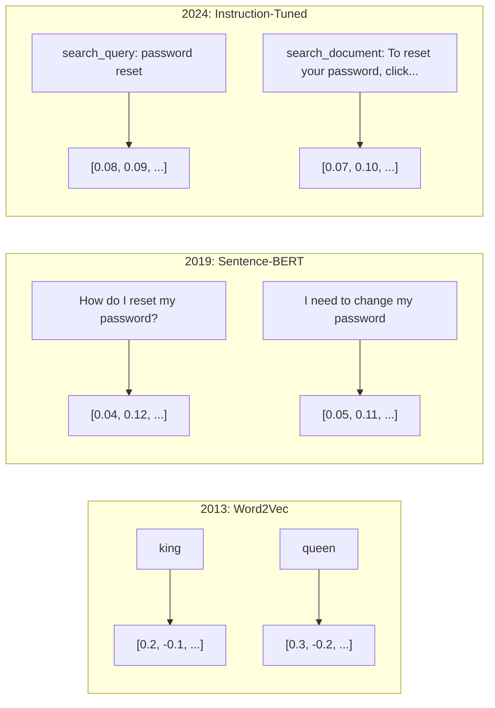
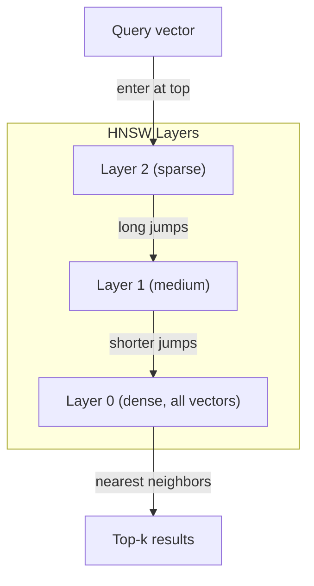

# एम्बेड और वेक्टर प्रतिनिधित्व

> पाठ अलग है. गणित निरंतर है. जब भी आप एलएलएम से "समान" दस्तावेज खोजने, अर्थों की तुलना करने या कीवर्ड से परे खोज करने के लिए कहते हैं, तो आप इन दो दुनियाओं के बीच एक पुल पर भरोसा कर रहे हैं। यह पुल एक एम्बेडिंग है। यदि आप एम्बेडिंग को नहीं समझते हैं, तो आप आधुनिक एआई को नहीं समझते हैं। आप बस इसका उपयोग करते हैं।

> **【中文解读】**文本是离散的,数学是连续的.嵌入 (嵌入) 嵌入 (嵌入) 嵌入 (嵌入) 嵌入 (嵌入) 嵌入 (嵌入) 嵌入 (嵌入) 嵌入 (嵌入) 嵌入 (嵌入) 嵌入 (嵌入) 嵌入 (嵌入) 嵌入 (嵌入) 嵌入 (嵌入) 嵌入 (嵌入) 嵌入 (嵌入) 嵌入 (嵌入) 嵌入 (嵌入) 嵌入 (嵌入) 嵌入 (嵌入) 嵌入 (嵌入) 嵌入 (嵌入) 嵌入 (嵌入) 嵌入 (嵌入) 嵌入 (嵌入) 嵌入 (嵌入) 嵌入 (嵌入) 嵌入 (嵌入) 嵌入 (嵌入) 嵌入 (嵌入) 嵌入) 嵌入 (嵌入) 嵌入 (嵌入) 嵌入) 嵌入 (嵌入) 嵌入 (嵌入) 嵌入) 嵌入 (嵌入) 嵌入) 嵌入 (嵌入) 嵌入) 嵌入 (嵌入) 嵌入 (嵌入) 嵌入) 嵌入 (嵌入) 嵌入) 嵌入 (嵌入) 嵌入 (嵌入) 嵌入) 嵌入 (嵌入) 嵌入 (嵌入) 嵌入) 嵌入 (嵌入) 嵌入 (嵌入) 嵌入 (嵌入) 嵌入) 嵌入 (嵌入) 嵌入 (嵌入) 嵌入 (嵌入) 嵌入 (嵌入) 嵌入) 嵌入 (嵌入) 嵌入 (嵌入) 嵌入 (嵌入) 嵌入 (嵌入) 嵌入 (嵌入) 嵌入 (嵌入) 嵌入 (嵌入) 嵌入 (嵌入) 嵌入 ( (嵌入) 嵌入) 嵌入 ( ( ( ( ( (嵌) 嵌入) 嵌) 嵌入) 嵌入)

> **【拓展：嵌入→RAG与搜索】**嵌入就是RAG (RAG) प्रणाली की मूलभूत संरचना है। 文本转向量后存入向量数据库,余弦相似性 के माध्यम से语义搜索 को प्राप्त करना, यह सभी आधुनिक एआई 搜索和推系统 की मूल तकनीक है।

>  **【前置】**学本节前 कृपया पहले सीखेः(1) पायथन 基础(numpy 向量运算、字典、列表推导);(2) 高中向量数学点积、角、模长(不知道这些先看 阶段 01·02 वेक्टर मैट्रिक्स);(3) 阶段 05·03(Word Embeddings Word2Vec) 会讲词嵌入基础,本节是其延伸到句子/文档级──本节会用到`numpy``scikit-learn`、可选 `chromadb`या `qdrant`

**Type:** Build | **类型:** 构建
**Languages:** Python | **语言:** Python
**Prerequisites:** Phase 11, Lesson 01 (Prompt Engineering) | **前置知识:** Phase 11 · 01 (提示工程)
**Time:** ~75 minutes | **时间:** ~75 分钟
**Related:**चरण 5 · 22 (इम्बेडिंग मॉडल गहरी गोता) घने बनाम दुर्लभ बनाम मल्टी-वेक्टर, मैट्रियोस्का ट्रंक्शन और प्रति अक्ष मॉडल चयन को कवर करता है। यह पाठ उत्पादन पाइपलाइन (वेक्टर डीबी, एचएनएसडब्ल्यू, समानता गणित) पर केंद्रित है। मॉडल चुनने से पहले चरण 5 · 22 पढ़ें।**相关:**चरण 5 · 22 (嵌入模型深度解析) 涵盖密/稀疏/多向量、Matryoshka 截断和分轴模型选择。本课聚焦生产管线(向量库、HNSW、相似度数学)。选模型前先读

## सीखने के लक्ष्य

- एपीआई प्रदाताओं और ओपन-सोर्स मॉडल का उपयोग करके पाठ एम्बेडमेंट उत्पन्न करें, और उनके बीच कॉसिन समानता की गणना करें
  एपीआई प्रदाता और ओपन सोर्स मॉडल का उपयोग करके पाठ एम्बेड उत्पन्न करें, और उनके बीच शेष स्ट्रिंग समानता की गणना करें
- व्याख्या करें कि एम्बेड किए गए शब्द संग्रह असंगतता समस्या का समाधान क्यों करते हैं जो कीवर्ड खोज का सामना नहीं कर सकती है
  explicit क्यों सम्मिलित हो सकता है हल कीवर्ड खोज अपर्याप्त का समाधान कीवर्ड असंगतता समस्या
- एक अर्थपूर्ण खोज सूचकांक बनाएं जो सटीक कीवर्ड मैच के बजाय अर्थ द्वारा दस्तावेज प्राप्त करता है
  构建一个语义搜索索引,按意义而非精确关键词匹配搜索文档
- रिट्रीवल बेंचमार्क (precision@k, recall) का उपयोग करके एम्बेडिंग गुणवत्ता का मूल्यांकन करें और अपने कार्य के लिए सही एम्बेडिंग मॉडल चुनें
  उपयोग जाँच आधार (precision@k、recall) मूल्यांकन में डाला गया गुणवत्ता,并为任务选择合适的嵌入模型

> **【中文解读】**इस वर्ग का उद्देश्यः पाठ में सम्मिलित होने के सिद्धांतों और अनुप्रयोगों को समझना। पाठ को वेक्टर में परिवर्तित करने के लिए, पाठ को वेक्टर स्थान में दूरी से अधिक निकट बनाने के लिए पाठ को सम्मिलित करना। यह शब्द खोज, आरएजी, संवर्धन आदि कार्यों का आधार है।


## समस्या  समस्या परिचय

आपके पास 10,000 सपोर्ट टिकट हैं. एक ग्राहक लिखता है "मेरा भुगतान नहीं हुआ।" आपको इसी तरह के पिछले टिकट खोजने की आवश्यकता है। कीवर्ड खोज "भुगतान" और "गैर-गैर-गैर-गैर-गैर-गैर-गैर-गैर-गैर-गैर-गैर-गैर-गैर-गैर-गैर-गैर-गैर-गैर-गैर-गैर-गैर-गैर-गैर-गैर-गैर-गैर-गैर-गैर-गैर-गैर-गैर-गैर-गैर-गैर-गैर-गैर-गैर-गैर-गैर-गैर-गैर-गैर-गैर-गैर-गैर-गैर-गैर-गैर-गैर-गैर-गैर-गैर-गैर-गैर-गैर-गैर-गैर-गैर-गैर-गैर-गैर-गैर-गैर-गैर-गैर-गैर-गैर-गैर-गैर-गैर-गैर-गैर-गैर-गैर-गैर-गैर-गैर-गैर-गैर-गैर-गैर-गैर-गैर-गैर-गैर-गैर-गैर-गैर-गैर-गैर-गैर-गैर-गैर-गैर-गैर-गैर-गैर-गैर-गैर-गैर-गैर-गैर-गैर-गैर-गैर-गैर-गैर-गैर-गैर-गैर-गैर-गैर-गैर-गैर-गैर-गैर-गैर-गैर-गैर-गैर-गैर-गैर-गैर-गैर-गैर-गैर-गैर-गैर-गैर-गैर-गैर-गैर-गैर-गैर-गैर-गैर-गैर-गैर-गैर-गैर-गैर-गैर-गैर-गैर-गैर-गैर-गैर-गैर-गैर-गैर-गैर-गैर-गैर-गैर-गैर-गैर-ग

> आप के पास 10,000 张工单,客户写道"我的付款没有成功"―― आपको इसी तरह के过往工单,类似的过往工单,类似的过往工单,类似的过往工单,类似的过往工单,类似的过往工单,类似的过往工单,类似的过往工单,类似的过往工单,类似的过往工单,类似的过往工单,类似的过往工单,类似的过往工单,类似的过往工单,类似的过往工单,类似的过往工单,类似的过往工单,类似的过往工单,类似的过往工单,类似的过往工单,类似的过往工单,类似的过往工单,类似的过往工单,类似的过往工单,没有过往工单,但错过了"交易失败"",收费被拒"和"账费错误"",这些工单描述完全相同的问题,只是使用完全不同的词――

यह शब्द संग्रह असंगतता समस्या है। मानव भाषा में एक ही बात कहने के दर्जनों तरीके हैं। कीवर्ड खोज प्रत्येक शब्द को एक स्वतंत्र प्रतीक के रूप में बिना अर्थ के व्यवहार करती है। यह नहीं जान सकती कि "अस्वीकृत" और "से नहीं गुजरता" एक ही अवधारणा का संदर्भ देते हैं।

> यह शब्द शब्द असंगतता का मुद्दा है। मानव भाषा में एक ही बात व्यक्त करने के कई तरीके हैं। प्रत्येक शब्द को एक ही अवधारणा के रूप में देखा जाएगा।

>  **【类比】**关键词搜索像用"按拼音查字典""水果"和"果"是两条目,相互找不到.嵌入像"按含义分类""水果""果实""果"都被放入"可食用植物产品"这个语义盒里,能跨语言、跨表达方式匹配──这就是为什么ChatGPT 能理解你的提议即使你打错字或用罕见说法──

आपको एक पाठ का प्रतिनिधित्व करने की आवश्यकता है जहां अर्थ, वर्तनी नहीं, समानता निर्धारित करता है। आपको "मेरे भुगतान को नहीं किया गया" और "लेनदेन को अस्वीकार कर दिया गया था" को एक साथ रखने का एक तरीका चाहिए, कुछ गणितीय स्थान में, "मेरे भुगतान समय पर आया" को दूर धक्का देते हुए शब्द "भुगतान" साझा करने के बावजूद।

> आपको एक विधि की आवश्यकता है, जिसमें एक अर्थ के बजाय एक शब्द का अर्थ निर्धारित करना समान है। आपको एक विधि की आवश्यकता है, जिसमें "मेरे भुगतान सफल नहीं हुए" और "व्यापार अस्वीकार कर दिया गया" को एक निश्चित गणितीय स्थान में एक दूसरे के करीब रखा जाएगा।

यह प्रतिनिधित्व एक सम्मिलन है।

> यह एक प्रकार का इम्बेड है।

## अवधारणा का मूल अवधारणा

> **【中文解读】**嵌入 (嵌入) पाठ को उच्च आयाम में परिवर्तित करेगा, जिससे कि भाषाई समान पाठ को 量空间 में दूरी से अधिक निकट बनाया जाए। 嵌入 (嵌入) RAG,语义搜索,聚类,分类等等 कार्यों के आधार पर किया जाएगा।

> **【拓展：嵌入模型的演进】**嵌入模型 Word2Vec/GloVe से (静态词嵌入) BERT तक (上下文嵌入) तक (जैसे BGE、E5、GTE) ∼ OpenAI के पाठ-एम्बेडिंग-3-बड़े MTEB 基准 पर लगभग 64 分 तक पहुंचते हैं।


### एक इम्प्लोडिंग क्या है?

एक एम्बेडिंग एक घने वेक्टर है जो फ्लोटिंग-पॉइंट नंबरों का प्रतिनिधित्व करता है जो पाठ के अर्थ का प्रतिनिधित्व करता है। "घनता" शब्द मायने रखता है - प्रत्येक आयाम में जानकारी होती है, दुर्लभ प्रतिनिधित्वों (बैग-ऑफ-वर्ड, TF-IDF) के विपरीत जहां अधिकांश आयाम शून्य होते हैं।

> 嵌入是表示文本含义的浮点数密向量──"密" बहुत महत्वपूर्ण प्रत्येक आयाम में जानकारी है,不像稀疏表示(词袋、TF-IDF) इनमें से अधिकांश आयाम शून्य──

" बिल्ली गद्दे पर बैठी" कुछ ऐसा हो जाता है जैसे `[0.023, -0.041, 0.087, ..., 0.012]`... 768 से 3072 संख्याओं की एक सूची मॉडल के आधार पर। ये संख्याएं अर्थ को एन्कोड करती हैं। आप उन्हें सीधे नहीं जांचते। आप उन्हें तुलना करते हैं।

> " बिल्ली बैठती है 子上" बन जाता है जैसे `[0.023, -0.041, 0.087, ..., 0.012]`                                                                                                                                                                                                                                                              

### Word2Vec का सफलता

2013 में, टोमस मिकोलोव और Google के सहयोगियों ने वर्ड 2 वीईसी प्रकाशित किया। मूल अंतर्दृष्टिः अपने पड़ोसियों (या पड़ोसियों से एक शब्द) से एक शब्द की भविष्यवाणी करने के लिए एक तंत्रिका नेटवर्क को प्रशिक्षित करें, और छिपे हुए परत वजन सार्थक वेक्टर प्रतिनिधित्व बन जाते हैं।

> 2013 में, टॉमस मिकोलोव और उनके Google सहकर्मियों ने वर्ड2वीसी प्रकाशित किया।

प्रसिद्ध परिणामः

> 著名结果:

```
king - man + woman = queen
```

शब्द एम्बेडिंग पर वेक्टर अंकगणित अर्थिक संबंधों को कैप्चर करता है। "पुरुष" से "महिला" की दिशा "राजा" से "रानी" की दिशा के समान है। यह वह क्षण था जब क्षेत्र को एहसास हुआ कि ज्यामिति अर्थ को कोडित कर सकती है।

> 词嵌的量算术能捕捉语义关系――"पुरुष" से "स्त्री" के दिशा लगभग "राजा" से "रानी" के दिशा के बराबर है―― यह क्षेत्र है कि क्या कोड किया जा सकता है अर्थों के समय――

>  **【类比】**量空间的方向就是"含义维度"── जैसे किसी एक दिशा में "性别" को कोडित करना (पुरुष, स्त्री, राजा, रानी, चाची), किसी अन्य दिशा में "时态" को कोडित करना (समय की स्थिति) walked, went), किसी अन्य दिशा में "复数" को कोडित करना (第三个方向编码) cats, dogs) 

Word2Vec ने 300 आयामी वेक्टर उत्पन्न किए। प्रत्येक शब्द को संदर्भ के बावजूद एक वेक्टर मिला। "नदी के किनारे" में "बैंक" और "बैंक खाता" में एक ही एम्बेडिंग थी। इस सीमा ने अगले दशक के शोध को चलाया।

> Word2Vec  उत्पन्न 300 维向量── प्रत्येक शब्द चाहे ऊपर नीचे कैसे हो एक 量──"河岸" (नदी के किनारे) और "बैंक खाता" (बैंक खाता) में "बैंक"  समान अंतर्निहित है── यह प्रतिबंध अगले दशक के शोध को प्रेरित करता है──

### शब्दों से वाक्य तक

वर्ड एम्बेडमेंट्स एकल टोकन का प्रतिनिधित्व करते हैं। उत्पादन प्रणालियों को पूरे वाक्य, पैराग्राफ या दस्तावेजों को एम्बेड करने की आवश्यकता होती है। चार दृष्टिकोण सामने आएः

> 词嵌入表示单个代币――生产系统需要嵌入整个句子、段落或文档―― चार प्रकार के तरीके सामने आएः

**Averaging**: वाक्य में सभी शब्द वेक्टरों का औसत लें. सस्ता, खोया, संक्षिप्त पाठ के लिए आश्चर्यजनक रूप से सभ्य। शब्द क्रम पूरी तरह से खो देता है - "कुत्ता आदमी को काटता है" और "मानव कुत्ते को काटता है" समान एम्बेडेड मिलता है।

> **平均法**:取句中所有词向量的平均值──廉价──有损,对短文文效果出奇地好──完全丢失词序"狗咬人"和"人咬狗"得到相同的嵌入──

**CLS token**: ट्रांसफार्मर मॉडल (BERT, 2018) एक विशेष [CLS] टोकन एम्बेडिंग का उत्पादन करते हैं जो पूरे इनपुट का प्रतिनिधित्व करता है। औसत से बेहतर है लेकिन [CLS] टोकन को अगले वाक्य की भविष्यवाणी के लिए प्रशिक्षित किया गया था, न कि समानता।

> **CLS token**:Transformer 模型(BERT, 2018) एक विशेष [CLS] टोकन 嵌入 输出 输入 को इंगित करने के लिए 嵌入 嵌入 嵌入 输入 को इंगित करने के लिए 嵌入 嵌入 嵌入 输入 嵌入 输入 嵌入 输入 输入 嵌入 输入 输入 输入 输入 输入 输入 输入 输入 输入 输入 输入 输入 输入 输入 输入 输入 输入 输入 输入 输入 输入 输入 输入 输入 输入 输入 输入 输入 输入 输入 输入 输入 输入 输入 输入 输入 输出 输入 输入 输入 输入 输入 输入 输入 输入 输入 输入 输入 输入 输入 输入 输入 输入 输入 输入 输入 输入 输入 输入 输入 输入 输入 输入 输入 输入 输入 输入 输入 输入 输入 输入 输入 输入 输入 输入 输入 输入 输入 输入 输入 输入 输入 输入 输入 输入 输入 输入 输入 输入 输入 输入 输入 输入 输入 输入 输入 输入 输入 输入 输入 输 输 输 输 输 输 输 输 输 输 输 输 输 输 输 输 输 输 输 输 输 输 输 输 输 输 输 输 输 输 输 输 输 输 输 输 输 输 输 输 输 输 输 输 输 输 输 输                                

**Contrastive learning**: मॉडल को स्पष्ट रूप से समान जोड़े को एक साथ और असमान जोड़े को अलग करने के लिए प्रशिक्षित करें। Sentence-BERT (Reimers & Gurevych, 2019) ने इस दृष्टिकोण का उपयोग किया और आधुनिक एम्बेडिंग मॉडल का आधार बन गया। "मैं अपना पासवर्ड कैसे रीसेट करता हूं? " और "मुझे अपना पासवर्ड बदलना चाहिए", मॉडल सीखता है कि इनमे लगभग समान वेक्टर होना चाहिए।

> **对比学习**: स्पष्ट प्रशिक्षण मॉडल होगा समान करने के लिए ला近、不相似 करने के लिए推远──Sentence-BERT(Reimers & Gurevych, 2019) इस तरह के दृष्टिकोण को अपनाया, आधुनिक एम्बेडेड मॉडल के आधार बन गया।

**Instruction-tuned embeddings**: नवीनतम दृष्टिकोण। E5 और GTE जैसे मॉडल एक कार्य पूर्वावलोकन ("search_query:", "search_document:") स्वीकार करते हैं जो मॉडल को बताता है कि किस प्रकार का एम्बेडिंग उत्पन्न करना है। यह एक मॉडल को कई कार्यों को पूरा करने की अनुमति देता है।

> **指令微调嵌入**: नवीनतम विधि──E5 和 GTE 等模型接受任务前("search_query:"、"search_document:"), बताएं कि मॉडल को किस तरह की इम्बेडेंस उत्पन्न करनी है── यह एक मॉडल की सेवा कई प्रकार के कार्यों को करने के लिए अनुमति देता है──



### आधुनिक एम्बेडिंग मॉडल

बाजार में उत्पादन-ग्रेड विकल्पों के एक मुट्ठी भर में सेट किया गया है (MTEB स्कोर 2026 की शुरुआत में, MTEB v2):

> बाजार में कुछ उत्पादन श्रेणी विकल्पों के लिए भारी है।

| Model | Provider | Dimensions | MTEB | Context | Cost / 1M tokens |
|-------|----------|-----------|------|---------|------------------|
| Gemini Embedding 2 | Google | 3072 (Matryoshka) | 67.7 (retrieval) | 8192 | $0.15 |
| embed-v4 | Cohere | 1024 (Matryoshka) | 65.2 | 128K | $0.12 |
| voyage-4 | Voyage AI | 1024/2048 (Matryoshka) | 66.8 | 32K | $0.12 |
| text-embedding-3-large | OpenAI | 3072 (Matryoshka) | 64.6 | 8192 | $0.13 |
| text-embedding-3-small | OpenAI | 1536 (Matryoshka) | 62.3 | 8192 | $0.02 |
| BGE-M3 | BAAI | 1024 (dense+sparse+ColBERT) | 63.0 multilingual | 8192 | Open-weight |
| Qwen3-Embedding | Alibaba | 4096 (Matryoshka) | 66.9 | 32K | Open-weight |
| Nomic-embed-v2 | Nomic | 768 (Matryoshka) | 63.1 | 8192 | Open-weight |

MTEB (मॉसिव टेक्स्ट एम्बेडिंग बेंचमार्क) v2 में 100+ कार्य शामिल हैं जो रिट्रीवल, वर्गीकरण, क्लस्टरिंग, री रैंकिंग और सारांश में शामिल हैं। अधिक उच्च बेहतर है। 2026 तक, अधिकांश अक्षों पर खुले वजन वाले मॉडल (Qwen3-Embedding, BGE-M3) बंद होस्ट किए गए मॉडल से मेल खाते हैं या उन्हें हरा देते हैं। मिथुन एम्बेडिंग 2 शुद्ध पुनर्प्राप्ति का नेतृत्व करता है; यात्रा / सहवास विशिष्ट डोमेन (वित्त, कानून, कोड) का नेतृत्व करता है। प्रतिबद्धता करने से पहले अपने स्वयं के प्रश्नों पर हमेशा बेंचमार्क करें।

> MTEB(मॉसिव टेक्स्ट एम्बेडिंग बेंचमार्क) v2  कवर检索分类、聚类、重排和摘要等 100+ 个任务──分数越高越好── 2026 वर्ष तक, खुला स्रोत权重模型(Qwen3-Embedding、BGE-M3) 大多数维度上匹配或超越闭源托管模型──Gemini Embedding 2 在纯检索上领先;Voyage/Cohere 在特定领域;;金融、法律、代码)领先──承诺之前必在自己的查询上做基准测试──

### समानता मेट्रिक्स

दो एम्बेडिंग वेक्टरों को देखते हुए, यह मापने के तीन तरीके हैं कि वे कितने समान हैंः

>  दो इम्बेड वेक्टरों को दिए जाने पर, उनकी समानता को मापने के तीन तरीके हैंः

**Cosine similarity**: दो वेक्टरों के बीच कोण का कोसिन। -1 (उपरोक्त) से 1 (समान दिशा) तक। परिमाण को अनदेखा करता है - 10 शब्द वाक्य और 500 शब्द के दस्तावेज़ को 1.0 स्कोर कर सकते हैं यदि वे एक ही दिशा में इंगित करते हैं। यह उपयोग के मामलों के 90% के लिए डिफ़ॉल्ट है।

> **余弦相似度**: दो आयामों के बीच के कोणों के अतिरिक्त弦 मूल्य। दायरा -1(相反) से 1(同向) ∼ अनदेखी आयाम10 词句和500 词文档 यदि समान दिशा में इंगित किया जाए तो 1.0── यह 90% 场景 का默认选择

> 🤔 **【困惑】**प्रश्नः क्यों अधिकांश परिदृश्यों में अतिरिक्त स्ट्रिंग समानता का उपयोग किया जाता है और न कि ओके दूरी? एः चूंकि एम्बेडेड स्ट्रिंग के "लंबाई" (महानता) आमतौर पर कोई अर्थ नहीं होता है।

```
cosine_sim(a, b) = dot(a, b) / (||a|| * ||b||)
```

**Dot product**: दो वेक्टरों का कच्चा आंतरिक उत्पाद। वेक्टरों को सामान्यीकृत करने पर कॉसिन की समानता के समान (इकाई लंबाई) । गणना करने के लिए तेज़। ओपनएआई के एम्बेडमेंट सामान्यीकृत हैं, इसलिए डॉट उत्पाद और कॉसिन एक ही रैंकिंग देते हैं।

> **点积**: दो वेक्टरों की मूल इनपुट── जब वेक्टर को एकीकरण (उच्चता) किया जाता है तो यह एक ही रेटिंग देता है।

```
dot(a, b) = sum(a_i * b_i)
```

**Euclidean (L2) distance**: वेक्टर स्थान में सीधी रेखा की दूरी। छोटा = अधिक समान। परिमाण अंतर के प्रति संवेदनशील। उपयोग करें जब अंतरिक्ष में पूर्ण स्थिति महत्वपूर्ण है, न कि केवल दिशा।

> **欧氏（L2）距离**:                                                                                                                                                                                                                                                               

```
L2(a, b) = sqrt(sum((a_i - b_i)^2))
```

किस समय उपयोग किया जाएः

> किस समय किस प्रकार के होते हैंः

| Metric | Use when | Avoid when |
|--------|----------|------------|
| Cosine similarity / 余弦相似度 | Comparing texts of different lengths; most retrieval tasks / 比较不同长度文本；大多数检索任务 | Magnitude carries information / 幅度携带信息 |
| Dot product / 点积 | Embeddings are already normalized; maximum speed / 嵌入已归一化；最大化速度 | Vectors have varying magnitudes / 向量幅度不同 |
| Euclidean distance / 欧氏距离 | Clustering; spatial nearest-neighbor problems / 聚类；空间近邻问题 | Comparing documents of wildly different lengths / 比较长度悬殊的文档 |

### वेक्टर डेटाबेस और HNSW

एक क्रूर बल समानता खोज प्रत्येक संग्रहीत वेक्टर के साथ क्वेरी की तुलना करता है. 1536 आयामों के साथ 1 मिलियन वेक्टर पर, यह प्रति क्वेरी 1.5 बिलियन गुणा-जोड़ा संचालन है। बहुत धीमा।

> 暴力 समानता खोज प्रत्येक भंडारण के वेटमेंट की तुलना में पूछताछ करेगी ∙ 100 मिलियन वेटमेंट ∙ 1536 维 के मामले में, प्रत्येक पूछताछ के लिए 15 अरब गुना अधिक गणना की आवश्यकता होगी ∙ बहुत धीमी ∙

वेक्टर डेटाबेस इसे Approximate Nearest Neighbor (ANN) एल्गोरिदम के साथ हल करते हैं। प्रमुख एल्गोरिदम HNSW (हियरार्मिकल नेविगेबल स्मॉल वर्ल्ड) हैः

> ️️️️️️️️️️️️️️️️️️️️️️️️️️️️️️️️️️️️️️️️️️️️️️️️️️️️️️️️️️️️️️️️️️️️️️️️️️️️️️️️️️️️️️️️️️️️️️️️️️️️️️️️️️️️️️️️️️️️️️️️️️️️️️️️️️️️️️️️️️️️️️️️️️️️️️️️️️️️️️️️️️️️️️️️️️️️️️️️️️️️️️️️️️️️️️️️️️️️️️️️️️️️️️️️️️️️️️️️️️️️️️️️️️️️️️️️️️️️️️️️️️️️️️️️️️️️️️️️️️️️️️️️️️️️️️️️️️️️️️️️️️️️️️️️️️️️️️️️️️️️️️️️️️️️️️️️️️️️️️️️️️️️️️️️️️️️️️️️️️️️️️️️️️️️️️️️️️️️️️️️️️️️️️️️️️️️️️️️️️️️️️️️️️️️️️️️️️️️️️️️️️️️️️️️️️️️️️️️️️️️️️️️️️️️️️️️️️️️️️️️️️️️️️️️️️️️️️️️️️️️️️️️️️️️️️️️️️️️️️️️️️️️️️️️️️️️️️️️️️️️️️️️️️️️

1. वेक्टरों के एक बहु-परत ग्राफ बनाएं
   निर्माण के आकार का बहुस्तरीय चित्र
2. शीर्ष परतें दुर्लभ हैं - दूरस्थ समूहों के बीच लंबी दूरी की कनेक्शन
                                                                                                                                                                                                                                                                 
3. नीचे की परतें घनी हैं - निकटवर्ती वेक्टरों के बीच बारीक-अमल कनेक्शन
   密近向量 के बीच की सूक्ष्मता कनेक्शन
4. खोज शीर्ष परत से शुरू होती है, लालच से परिष्कृत करने के लिए नीचे जाती है
    खोज शीर्ष से शुरू, लालच नीचे करने के लिए परिष्कृत
5. O(log n) समय में O(n के बजाय लगभग शीर्ष-k परिणाम देता है
   में O(log n) 而非 O(n) 时间内返回近似 शीर्ष-के 结果

HNSW बड़ी गति के लिए एक छोटी सटीकता हानि (आमतौर पर 95-99% याद) का व्यापार करता है। 10 मिलियन वेक्टर पर, क्रूर बल सेकंड लेता है। HNSW मिलीसेकंड लेता है।

> एचएनएसडब्ल्यू में कम सटीकता हानि (आमतौर पर 95-99% की पुनः प्राप्ति दर) के बदले में भारी गति बढ़ जाती है।

>  **【类比】**HNSW 像地图搜索:"全国地图"只画大城市(顶层稀疏),"省地图"只画大城市(顶层稀疏),"省地图"只画县城(中层),"街道地图"只画每建筑物(底层密) ⋅当找"北京大学"时,先在全国层跳到北京(一次大跳),再在省层跳到海区(中跳),最后在街道层找到具体位置(小跳) ⋅比一一楼挨个查查快几个数级级.



> ️ **【易错点】**HNSW के 3 个坑:(1) **召回率随参数变化**`ef_construction`太低(< 100) से 图结构质量差,召回率 गिरकर 70% नीचे; उत्पादन सुझाव 200-500──(2) **删除代价高**HNSW है图结构, हटाने节点会破坏连接,多数实现是"软删除" (बहुत से लोग इसे हटाने के लिए सहमत हैं) 标记为已删除),需要定期重建──(3) **过滤性能差**पहले से बड़े पैमाने पर खोज पुनः प्राप्त होगी भारी मात्रा में असंगत परिणाम; समाधानः Qdrant के फ़िल्टर्ड खोज या Pinecone के दुर्लभ-घनता हाइब्रिड के साथ, पहले पुनः खोज।

उत्पादन विकल्पः

> उत्पादन श्रेणी विकल्पः

| Database | Type | Best for | Max scale |
|----------|------|----------|-----------|
| Pinecone | Managed SaaS / 托管 SaaS | Zero-ops production / 零运维生产 | Billions / 十亿级 |
| Weaviate | Open source / 开源 | Self-hosted, hybrid search / 自托管、混合搜索 | 100M+ / 一亿+ |
| Qdrant | Open source / 开源 | High performance, filtering / 高性能、过滤 | 100M+ / 一亿+ |
| ChromaDB | Embedded / 嵌入式 | Prototyping, local dev / 原型、本地开发 | 1M / 百万 |
| pgvector | Postgres extension / Postgres 扩展 | Already using Postgres / 已在用 Postgres | 10M / 千万 |
| FAISS | Library / 库 | In-process, research / 进程内、研究 | 1B+ / 十亿+ |

### टुकड़े टुकड़े करने की रणनीति

दस्तावेज एक ही वेक्टर के रूप में एम्बेड करने के लिए बहुत लंबे हैं. एक 50 पृष्ठों का पीडीएफ दर्जनों विषयों को कवर करता है -- इसका एम्बेडमेंट हर चीज का औसत बन जाता है, कुछ भी विशिष्ट नहीं के समान। आप दस्तावेजों को टुकड़ों में विभाजित करते हैं और प्रत्येक को एम्बेड करते हैं।

> 文档太长,不能作为单向量嵌入──50页 PDF 涵盖几十个主题其嵌入成所有内容的平均,与任何具体内容都不相似──你需要将文档分成块,分别嵌入每块──

**Fixed-size chunking**: M-token ओवरलैप के साथ प्रत्येक N टोकन को विभाजित करें. सरल और पूर्वानुमान योग्य। जब दस्तावेजों की कोई स्पष्ट संरचना नहीं होती है तो यह अच्छी तरह से काम करता है। 50 टोकन ओवरलैप के साथ 512 टोकन का एक टुकड़ाः 1 टोकन 0-511, 2 टोकन 462-973 है।

> **固定大小分块**: प्रत्येक N 个 टोकन 拆分一次,带 M 个 टोकन 重叠──简单可预测──文档无清结构时效果好──512 टोकन 分块加50 टोकन 重叠:块 1 是 टोकन 0-511,块 2 是 टोकन 462-973──

**Sentence-based chunking**एक वाक्य को एक वाक्य में विभाजित करके वाक्य को एक वाक्य में विभाजित करें, जब तक कि आप एक वाक्य की सीमा तक नहीं पहुंच जाते। प्रत्येक टुकड़ा कम से कम एक पूर्ण वाक्य है। निश्चित आकार से बेहतर है क्योंकि आप कभी भी एक विचार को आधे में नहीं काटते हैं।

> **基于句子的分块**: में वाक्यों की सीमा में विभाजित,分组句子 तक टोकन तक पहुँचने तक ऊपर की सीमा। प्रत्येक खंड में कम से कम एक पूर्ण वाक्य है।

**Recursive chunking**: सबसे बड़ी सीमा पर पहले विभाजित करने का प्रयास करें (खंड के शीर्षकों) । अगर अभी भी बहुत बड़ा है, पैराग्राफ सीमाओं का प्रयास करें। फिर वाक्य सीमाओं का प्रयास करें। फिर वर्ण सीमाएं। यह लैंगचेन का है `RecursiveCharacterTextSplitter`और यह मिश्रित प्रारूप के शरीर के लिए अच्छी तरह से काम करता है.

> **递归分块**पहले सबसे बड़ी सीमा में (पहले सबसे बड़ी सीमा में)`RecursiveCharacterTextSplitter`, मिश्रित प्रारूप भाषा सामग्री के लिए अच्छा प्रभाव

**Semantic chunking**: प्रत्येक वाक्य को एम्बेड करें, फिर ऐसे लगातार वाक्य समूह करें जिनकी एम्बेडिंग समान होती है। जब एम्बेडिंग समानता एक सीमा से नीचे गिर जाती है, तो एक नया टुकड़ा शुरू करें। महंगा (प्रत्येक वाक्य को व्यक्तिगत रूप से एम्बेड करना आवश्यक है) लेकिन सबसे सुसंगत टुकड़े उत्पन्न करता है।

> **语义分块**: प्रत्येक वाक्य में इम्बेड करें, फिर समान निरंतर वाक्य विभाजन में इम्बेड करें।

| Strategy | Complexity | Quality | Best for |
|----------|-----------|---------|----------|
| Fixed-size / 固定大小 | Low / 低 | Decent / 尚可 | Unstructured text, logs / 非结构化文本、日志 |
| Sentence-based / 基于句子 | Low / 低 | Good / 好 | Articles, emails / 文章、邮件 |
| Recursive / 递归 | Medium / 中 | Good / 好 | Markdown, HTML, mixed docs / Markdown、HTML、混合文档 |
| Semantic / 语义 | High / 高 | Best / 最佳 | Critical retrieval quality / 关键检索质量 |

अधिकांश प्रणालियों के लिए मीठा बिंदुः 256-512 टोकन टुकड़े 50 टोकन ओवरलैप के साथ।

> 大多数系统的最佳点:256-512 टोकन 块加 50 टोकन 重叠──

> ️ **【易错点】**分块的3 个实战坑:**块太大**(<1024 टोकन) 嵌入被稀释, प्रत्येक块都"既像A 又像B",检索精度暴跌;-गुम्मट नियम:不超过模型最大输入的 1/4──(2) **块太小**(< 64 टोकन) 上下文丢失, "它"指代的前文消失了,嵌入成无意义的噪音──(3) **重叠设为 0** सीमा के बीच की कुंजी वाक्य काट दी गई है, जैसे"... 不要──**删除**इस फ़ाइल को दो खंडों में काट दिया जा सकता है, "हटाए गए फ़ाइलों" की खोज में मिल नहीं पा रहा है।

### द्वि-संकेतक बनाम क्रॉस-संकेतक

एक द्वि-संकेतक स्वतंत्र रूप से क्वेरी और दस्तावेजों को एम्बेड करता है, फिर वेक्टरों की तुलना करता है. तेजी से - आप क्वेरी को एक बार एम्बेड करते हैं और पूर्व-कंप्यूटेड दस्तावेज़ एम्बेड के साथ तुलना करते हैं. यह आप पुनर्प्राप्ति के लिए उपयोग करते हैं।

> 双编码器独立嵌入查询和文件,然后比较向量──快速你只嵌入查询一次,与预计算的文件嵌入比较──这是查询时使用的方案──

क्रॉस-एन्कोडर एक एकल इनपुट के रूप में क्वेरी और एक दस्तावेज़ लेता है और प्रासंगिकता स्कोर आउटपुट करता है। धीमा - यह पूरे मॉडल के माध्यम से प्रत्येक क्वेरी-डॉक्यूमेंट जोड़ी को संसाधित करता है। लेकिन बहुत अधिक सटीक क्योंकि यह एक साथ क्वेरी और दस्तावेज़ टोकन पर भाग ले सकता है।

> 交叉编码器 एक एकल इनपुट, आउटपुट संबंधितता अंक के रूप में जांच और दस्तावेज़ को संसाधित करेगा। धीमी गति से यह प्रत्येक जांच-लेख के लिए पूर्ण मॉडल के माध्यम से संसाधित करता है।

उत्पादन पैटर्नः द्वि-संकेतक शीर्ष 100 उम्मीदवारों को प्राप्त करता है, क्रॉस-संकेतक उन्हें शीर्ष 10 में वापस रखता है। यह पुनर्प्राप्त करने-फिर-श्रेणी पाइपलाइन है।

> उत्पादन मोड: द्वि编码器检索前-100候选人,交叉编码器重排为前-10──

> ️ **【易错点】**प्रदर्शन आपदाः सीधे क्रॉस-एन्कोडर के साथ जांच करना ∙∙ 1 मिलियन दस्तावेज का मतलब है कि प्रत्येक जांच के लिए 100 मिलियन बार पूर्ण ट्रांसफार्मर आगे गुजरना ∙ एक ही जांच में कुछ सेकंड या कुछ मिनट लगते हैं ∙**永远用 Bi-Encoder 召回 + Cross-Encoder 重排**◊ क्रॉस-एन्कोडर केवल शीर्ष-100 उम्मीदवारों के लिए 100 बार, मिलीसेकंड के स्तर पर पूरा किया गया।


रेंकिंग मॉडलः कोहरे रेंक 3.5 ($ 2 प्रति 1000 क्वेरी), बीजीई-रेंकर-वी2 (मुक्त, ओपन सोर्स), जिना रेंकर वी2 (मुक्त, ओपन सोर्स) ।

> 重排模型:Cohere Rerank 3.5( प्रति 1000 查询 $2) ✓ BGE-रेनकर-v2(免费、开源) ✓ जिना Reranker v2(免费、开源) ✓

### मैट्रियोशका एम्बेड

पारंपरिक एम्बेडेड सब कुछ या कुछ नहीं हैं. 1536 आयामी वेक्टर 1536 फ्लोट का उपयोग करता है. आप 256 आयामों तक बिना फिर से प्रशिक्षण के ट्रंक नहीं कर सकते हैं।

> 传统嵌入不此即彼的──1536 维向量使用 1536 个浮点数──不重训就无法截断到 256 维──

> 🤔 **【困惑】**प्रश्नः मैट्रियोस्का 嵌入的"截断"是什么意思?为什么要做? A: 类比俄罗斯套娃 (Matryoshka doll) 大套娃里套小套娃,前 256 维是"最重要的含义" (बहुत महत्वपूर्ण अर्थ) 小套娃),加到768 维是"中等细节",加到1536 维是"完整精细含义" (बहुत बड़ा套娃) 模型训练时被强制让前 N 维也能工作──**收益**: भंडारण省 6 倍(1536→256),检索快 6 倍,精度只掉1-3 个点──RAG 系统常用 256 维存向量 + 1536 维重排,兼顾速度和精度──

मैट्रियोस्का प्रतिनिधित्व सीखने (कुसुपति और सहयोगियों, 2022) इस समस्या को ठीक करता है। मॉडल को प्रशिक्षित किया गया है ताकि पहले N आयाम सबसे महत्वपूर्ण जानकारी को कैप्चर करें, जैसे कि एक रूसी गुड़िया गुड़िया। 1536 डी मैट्रियोस्का एम्बेडिंग को 256 आयामों तक काटने से कुछ सटीकता कम हो जाती है लेकिन कार्यात्मक बनी रहती है।

> मैत्रिओष्का ️️️️️️️️️️️️️️️️️️️️️️️️️️️️️️️️️️️️️️️️️️️️️️️️️️️️️️️️️️️️️️️️️️️️️️️️️️️️️️️️️️️️️️️️️️️️️️️️️️️️️️️️️️️️️️️️️️️️️️️️️️️️️️️️️️️️️️️️️️️️️️️️️️️️️️️️️️️️️️️️️️️️️️️️️️️️️️️️️️️️️️️️️️️️️️️️️️️️️️️️️️️️️️️️️️️️️️️️️️️️️️️️️️️️️️️️️️️️️️️️️️️️️️️️️️️️️️️️️️️️️️️️️️️️️️️️️️️️️️️️️️️️️️️️️️️️️️️️️️️️️️️️️️️️️️️️️️️️️️️️️️️️️️️️️️️️️️️️️️️️️️️️️️️️️️️️️️️️️️️️️️️️️️️️️️️️️️️️️️️️️️️️️️️️️️️️️️️️️️️️️️️️️️️️️️️️️️️️️️️️️️️️️️️️️️️️️️️️️️️️️️️️️️️️️️️️️️️️️️️️️️️️️️️️️️️️️️️️️️️️️️️️️️️️️️️️️️️️️️️️️️

OpenAI के पाठ-एम्बेडिंग-3-छोटे और पाठ-एम्बेडिंग-3-बड़े समर्थन Matryoshka truncation के माध्यम से `dimensions`पैरामीटर. 1536 के बजाय 256 आयामों का अनुरोध करने से भंडारण 6 गुना कम हो जाता है, MTEB बेंचमार्क पर लगभग 3-5% सटीकता का नुकसान होता है।

> OpenAI का पाठ-एम्बेडिंग-3-छोटा 和 पाठ-एम्बेडिंग-3-बड़ा 通过`dimensions`参数支持Matryoshka 截断―― अनुरोध 256 维而不是 1536 维将储存减少6倍, MTEB 基准上损失约3-5% 精度――

### द्विआधारी मात्रा

एक 1536 आयामी एम्बेडिंग float32 के रूप में संग्रहीत 6,144 बाइट्स का उपयोग करता है. 10 मिलियन दस्तावेजों द्वारा गुणाः 61 GB केवल वेक्टर के लिए।

> 1536 维嵌入以 float32  भंडारण उपयोग 6,144 字节── गुणा करके 1000 मिलियन

द्विआधारी क्वांटिज़ेशन प्रत्येक फ्लोट को एक एकल बिट में परिवर्तित करता हैः सकारात्मक मान 1 बन जाते हैं, नकारात्मक मान 0 बन जाते हैं। भंडारण 6,144 बाइट से 192 बाइट्स तक गिर जाता है - 32 गुना कम। समानता हैमिंग दूरी (अलग बिट्स की गिनती) का उपयोग करके गणना की जाती है, जो सीपीयू एक निर्देश में कर सकते हैं।

> द्विमूल्यकरण प्रत्येक अवयव बिंदु संख्या को एकल बिट में परिवर्तित करेगाः सही मूल्य परिवर्तन 1, नकारात्मक मूल्य परिवर्तन 0;; भंडारण 6,144 字节 से घटकर 192 字节32 倍 संपीड़न。 समानता के साथ ज्ञात दूरी ((( गणना भिन्न बिटक संख्या) गणना, CPU 单条命令即可完成──

सटीकता हिट पुनर्प्राप्ति याद करने पर लगभग 5-10% है। सामान्य पैटर्नः लाखों वेक्टरों पर पहले पास खोज के लिए द्विआधारी क्वांटिज़ेशन, फिर पूर्ण-सटीक वेक्टरों के साथ शीर्ष-1000 को फिर से स्कोर करें। यह आपको 32 गुना कम मेमोरी पर 95%+ पूर्ण-सटीक सटीकता देता है।

> 检索召回率精度损失大约5-10%──常见模式: द्वि-मूल्य量化 के साथ मिलियन वेक्टरों की एक बार खोज करें, फिर शीर्ष-1000重排 पर पूर्ण सटीकता वेक्टरों के साथ पूर्ण सटीकता खोज करें── यह आपको 32 गुना कम内存 में 95%+ की पूर्ण सटीकता प्राप्त करने देता है──

## इसे बनाओ, इसे पूरा करो।
```figure
cosine-similarity
```

## इसे बनाओ

हम खरोंच से एक अर्थपूर्ण खोज इंजन बनाया. कोई वेक्टर डेटाबेस नहीं. कोई बाहरी एम्बेडिंग एपीआई. गणित के लिए numpy के साथ शुद्ध पायथन.

> हम शून्य से भाषा खोज इंजन का निर्माण शुरू करते हैं।

### चरण 1: पाठ को टुकड़े टुकड़े करना

```python
def chunk_text(text, chunk_size=200, overlap=50):
    words = text.split()
    chunks = []
    start = 0
    while start < len(words):
        end = start + chunk_size
        chunk = " ".join(words[start:end])
        chunks.append(chunk)
        start += chunk_size - overlap
    return chunks


def chunk_by_sentences(text, max_chunk_tokens=200):
    sentences = text.replace("\n", " ").split(".")
    sentences = [s.strip() + "." for s in sentences if s.strip()]
    chunks = []
    current_chunk = []
    current_length = 0
    for sentence in sentences:
        sentence_length = len(sentence.split())
        if current_length + sentence_length > max_chunk_tokens and current_chunk:
            chunks.append(" ".join(current_chunk))
            current_chunk = []
            current_length = 0
        current_chunk.append(sentence)
        current_length += sentence_length
    if current_chunk:
        chunks.append(" ".join(current_chunk))
    return chunks
```

### चरण 2: खरोंच से अंतर्निहित निर्माण

हम L2 सामान्यीकरण के साथ TF-IDF का उपयोग करके एक सरल घने एम्बेडिंग लागू करते हैं। यह एक तंत्रिका एम्बेडिंग नहीं है, लेकिन यह एक ही अनुबंध का पालन करता हैः पाठ में, फिक्स्ड-साइज़ वेक्टर आउट, समान पाठ समान वेक्टर उत्पन्न करते हैं।

> हम L2 归结的TF-IDF 带带带使用实现简单的密嵌入──这不是神经网络嵌入,但遵循相同的契约:文本进,固定大小向量出,相似文本产生相似向量──

```python
import math
import numpy as np
from collections import Counter

class SimpleEmbedder:
    def __init__(self):
        self.vocab = []
        self.idf = []
        self.word_to_idx = {}

    def fit(self, documents):
        vocab_set = set()
        for doc in documents:
            vocab_set.update(doc.lower().split())
        self.vocab = sorted(vocab_set)
        self.word_to_idx = {w: i for i, w in enumerate(self.vocab)}
        n = len(documents)
        self.idf = np.zeros(len(self.vocab))
        for i, word in enumerate(self.vocab):
            doc_count = sum(1 for doc in documents if word in doc.lower().split())
            self.idf[i] = math.log((n + 1) / (doc_count + 1)) + 1

    def embed(self, text):
        words = text.lower().split()
        count = Counter(words)
        total = len(words) if words else 1
        vec = np.zeros(len(self.vocab))
        for word, freq in count.items():
            if word in self.word_to_idx:
                tf = freq / total
                vec[self.word_to_idx[word]] = tf * self.idf[self.word_to_idx[word]]
        norm = np.linalg.norm(vec)
        if norm > 0:
            vec = vec / norm
        return vec
```

### चरण 3: समानता कार्य

```python
def cosine_similarity(a, b):
    dot = np.dot(a, b)
    norm_a = np.linalg.norm(a)
    norm_b = np.linalg.norm(b)
    if norm_a == 0 or norm_b == 0:
        return 0.0
    return float(dot / (norm_a * norm_b))


def dot_product(a, b):
    return float(np.dot(a, b))


def euclidean_distance(a, b):
    return float(np.linalg.norm(a - b))
```

### चरण 4: ब्रूट-फोर्स सर्च के साथ वेक्टर इंडेक्स

```python
class VectorIndex:
    def __init__(self):
        self.vectors = []
        self.texts = []
        self.metadata = []

    def add(self, vector, text, meta=None):
        self.vectors.append(vector)
        self.texts.append(text)
        self.metadata.append(meta or {})

    def search(self, query_vector, top_k=5, metric="cosine"):
        scores = []
        for i, vec in enumerate(self.vectors):
            if metric == "cosine":
                score = cosine_similarity(query_vector, vec)
            elif metric == "dot":
                score = dot_product(query_vector, vec)
            elif metric == "euclidean":
                score = -euclidean_distance(query_vector, vec)
            else:
                raise ValueError(f"Unknown metric: {metric}")
            scores.append((i, score))
        scores.sort(key=lambda x: x[1], reverse=True)
        results = []
        for idx, score in scores[:top_k]:
            results.append({
                "text": self.texts[idx],
                "score": score,
                "metadata": self.metadata[idx],
                "index": idx
            })
        return results

    def size(self):
        return len(self.vectors)
```

### चरण 5: अर्थपूर्ण खोज इंजन

```python
class SemanticSearchEngine:
    def __init__(self, chunk_size=200, overlap=50):
        self.embedder = SimpleEmbedder()
        self.index = VectorIndex()
        self.chunk_size = chunk_size
        self.overlap = overlap

    def index_documents(self, documents, source_names=None):
        all_chunks = []
        all_sources = []
        for i, doc in enumerate(documents):
            chunks = chunk_text(doc, self.chunk_size, self.overlap)
            all_chunks.extend(chunks)
            name = source_names[i] if source_names else f"doc_{i}"
            all_sources.extend([name] * len(chunks))
        self.embedder.fit(all_chunks)
        for chunk, source in zip(all_chunks, all_sources):
            vec = self.embedder.embed(chunk)
            self.index.add(vec, chunk, {"source": source})
        return len(all_chunks)

    def search(self, query, top_k=5, metric="cosine"):
        query_vec = self.embedder.embed(query)
        return self.index.search(query_vec, top_k, metric)

    def search_with_scores(self, query, top_k=5):
        results = self.search(query, top_k)
        return [
            {
                "text": r["text"][:200],
                "source": r["metadata"].get("source", "unknown"),
                "score": round(r["score"], 4)
            }
            for r in results
        ]
```

### चरण 6: समानता के माप की तुलना करना

```python
def compare_metrics(engine, query, top_k=3):
    results = {}
    for metric in ["cosine", "dot", "euclidean"]:
        hits = engine.search(query, top_k=top_k, metric=metric)
        results[metric] = [
            {"score": round(h["score"], 4), "preview": h["text"][:80]}
            for h in hits
        ]
    return results
```

## इसे फ्रेमवर्क के साथ लागू करें

एक उत्पादन एम्बेडिंग एपीआई के साथ, वास्तुकला समान रहता है. केवल एम्बेडर बदलता हैः

> उपयोग उत्पादन स्तर एम्बेड एपीआई 时, संरचना पूरी तरह से एक ही है। केवल एम्बेडर परिवर्तनः

```python
from openai import OpenAI

client = OpenAI()

def openai_embed(texts, model="text-embedding-3-small", dimensions=None):
    kwargs = {"model": model, "input": texts}
    if dimensions:
        kwargs["dimensions"] = dimensions
    response = client.embeddings.create(**kwargs)
    return [item.embedding for item in response.data]
```

ओपनएआई के साथ मैट्रियोशका ट्रंक - एक ही मॉडल, कम आयाम, कम भंडारणः

> OpenAI के Matryoshka का उपयोग करें 截断同一模型,更少维度,更低存储:

```python
full = openai_embed(["semantic search query"], dimensions=1536)
compact = openai_embed(["semantic search query"], dimensions=256)
```

256-डी वेक्टर में 6 गुना कम स्टोरेज होता है. 10 मिलियन दस्तावेजों के लिए, यह 10 GB बनाम 61 GB है. मानक बेंचमार्क पर सटीकता हानि लगभग 3-5% है।

> 256 维向量 उपयोग 6 倍 कम भंडारण ⋅ प्रति 1000 मिलियन दस्तावेज़, यह 10 GB बनाम 61 GB ⋅ मानक आधार पर सटीकता हानि लगभग 3-5% ⋅ है।

कोहरे के साथ रैंक बदलने के लिएः

> प्रयोग Cohere 重排:

```python
import cohere

co = cohere.ClientV2()

results = co.rerank(
    model="rerank-v3.5",
    query="What is the refund policy?",
    documents=["Full refund within 30 days...", "No refunds after 90 days..."],
    top_n=3
)
```

एपीआई निर्भरता के बिना स्थानीय एम्बेड के लिएः

> स्थानीय रूप से एम्बेड, कोई एपीआई नहीं निर्भर करता हैः

```python
from sentence_transformers import SentenceTransformer

model = SentenceTransformer("BAAI/bge-small-en-v1.5")
embeddings = model.encode(["semantic search query", "another document"])
```

हमारे निर्माण से वेक्टर इंडेक्स वर्ग इनमें से किसी के साथ काम करता है. एम्बेडिंग समारोह स्विच, खोज तर्क बनाए रखें.

> हम निर्माण के वेक्टर इंडेक्स 类可与上述任意方案配合──换嵌入函数,保留搜索逻辑──

## इसे भेजें उत्पाद

इस पाठ से उत्पन्न होता हैः
- `outputs/prompt-embedding-advisor.md`-- विशिष्ट उपयोग मामलों के लिए एम्बेडिंग मॉडल और रणनीतियों का चयन करने के लिए एक संकेत
  选择嵌入模型和策略 (विशेष परिदृश्यों के लिए) के सुझाव
- `outputs/skill-embedding-patterns.md`-- एक कौशल जो एजेंटों को सिखाता है कि उत्पादन में प्रभावी ढंग से एम्बेड का उपयोग कैसे करें
  प्रशिक्षक  कैसे उत्पादन में प्रभावी ढंग से उपयोग करने के लिए एम्बेड कौशल

## अभ्यास विषय

1. **Metric comparison**: कॉसिन समानता, डॉट प्रॉडक्ट और यूक्लिडियन दूरी का उपयोग करके नमूना दस्तावेजों के साथ एक ही 5 प्रश्नों को चलाएं। प्रत्येक के लिए शीर्ष 3 परिणाम रिकॉर्ड करें। किस प्रश्न के लिए माप असहमत हैं? क्यों?
   **指标比较**: नमूना दस्तावेज के लिए अतिरिक्त स्ट्रिंग समानता, बिंदु और यू से दूरी के साथ 5 प्रश्नों का भी संचालन किया गया।

2. **Chunk size experiment**: 50, 100, 200 और 500 शब्दों के टुकड़े आकार के साथ नमूना दस्तावेजों का सूचकांक बनाएं। प्रत्येक के लिए 5 क्वेरी चलाएं और शीर्ष-1 समानता स्कोर रिकॉर्ड करें। टुकड़े के आकार और निकासी की गुणवत्ता के बीच संबंध का पता लगाएं। उस बिंदु को ढूंढें जहां बड़े टुकड़े चोट लगने लगते हैं।
   **分块大小实验**: 50、100、200、500 शब्द के ब्लॉक बड़े सूचकांक नमूना दस्तावेज。 प्रत्येक प्रकार के 5 प्रश्न, रिकॉर्ड शीर्ष-1 समानता की संख्या── ब्लॉक आकार और जांच की गुणवत्ता के संबंध को रेखांकित करना── ब्लॉक के लिए खतरनाक प्रारंभिक बिंदुओं का पता लगाना──

3. **Matryoshka simulation**: एक सरल एम्बेडर बनाएं जो 500 डी वेक्टर उत्पन्न करता है। 50, 100, 200, और 500 आयामों तक ट्रंक करें। मापें कि प्रत्येक ट्रंकिंग पर पुनर्प्राप्तिकरण याद कैसे घटता है। यह वास्तविक प्रशिक्षण ट्रिक की आवश्यकता के बिना मैट्रियोस्का व्यवहार का अनुकरण करता है।
   **Matryoshka 模拟**: निर्माण 500 维 के सरल एम्बेडर का उत्पादन करें। ∞ काटना 50、100、200、500 ∞ का उपयोग करके प्रत्येक काटना के लिए परीक्षण करें।

4. **Binary quantization**: खोज इंजन से एम्बेडमेंट लें, उन्हें बाइनरी में परिवर्तित करें (1 यदि सकारात्मक, 0 यदि नकारात्मक), और हैमिंग दूरी खोज लागू करें। पूर्ण-सटीक कॉसिन समानता के साथ शीर्ष 10 परिणामों की तुलना करें। ओवरलैप प्रतिशत मापें।
   **二值量化**:取搜索引擎中的嵌入,转为二进制(正为1,负为0),实现汉明距离搜索──对比前十 结果与全精度余弦相似度──测量重叠百分比──

5. **Sentence-based chunking**: फिक्स्ड साइज के चश्मा को `chunk_by_sentences`. . वही प्रश्न करें और प्राप्ति स्कोर की तुलना करें. क्या वाक्य सीमाओं का सम्मान परिणामों में सुधार करता है?
   **基于句子的分块**:                                                                                                                                                                                                                                                               `chunk_by_sentences`◊ समान जांच, तुलनात्मक जांच की संख्या ◊ सम्मानजनक वाक्य सीमा क्या परिणाम में सुधार हुआ है?

## कीवर्ड्स  शब्द खोज तालिका

| Term | What people say | What it actually means | 中文释义 |
|------|----------------|----------------------|---------|
| Embedding | "Text to numbers" | A dense vector where geometric proximity encodes semantic similarity | 嵌入：稠密向量，几何邻近编码语义相似度 |
| Word2Vec | "The OG embedding" | 2013 model that learned word vectors by predicting context words; proved vector arithmetic encodes meaning | Word2Vec：2013 年模型，通过预测上下文词学习词向量；证明向量算术编码含义 |
| Cosine similarity | "How similar are two vectors" | Cosine of the angle between vectors; 1 = identical direction, 0 = orthogonal, -1 = opposite | 余弦相似度：向量夹角余弦；1=同向，0=正交，-1=反向 |
| HNSW | "Fast vector search" | Hierarchical Navigable Small World graph -- multi-layer structure enabling O(log n) approximate nearest neighbor search | HNSW：层次可导航小世界图——多层结构实现 O(log n) 近似最近邻搜索 |
| Bi-encoder | "Embed separately, compare fast" | Encodes query and document independently into vectors; enables pre-computation and fast retrieval | 双编码器：独立编码查询和文档为向量；允许预计算和快速检索 |
| Cross-encoder | "Slow but accurate reranker" | Processes query-document pair jointly through the full model; higher accuracy, no pre-computation | 交叉编码器：联合处理查询-文档对；更高精度，无法预计算 |
| Matryoshka embeddings | "Truncatable vectors" | Embeddings trained so the first N dimensions capture the most important information, enabling variable-size storage | Matryoshka 嵌入：训练使前 N 维捕获最重要信息，支持变维存储 |
| Binary quantization | "1-bit embeddings" | Converting float vectors to binary (sign bit only) for 32x storage reduction with Hamming distance search | 二值量化：将浮点向量转为二进制（仅符号位）实现 32 倍存储压缩配汉明距离搜索 |
| Chunking | "Split docs for embedding" | Breaking documents into 256-512 token segments so each can be independently embedded and retrieved | 分块：将文档拆分为 256-512 token 段以便独立嵌入和检索 |
| Vector database | "Search engine for embeddings" | Data store optimized for storing vectors and performing approximate nearest neighbor search at scale | 向量数据库：为存储向量和大规模近似最近邻搜索优化的数据存储 |
| Contrastive learning | "Train by comparison" | Training approach that pushes similar pair embeddings together and dissimilar pair embeddings apart | 对比学习：将相似对嵌入拉近、不相似对推远的训练方法 |
| MTEB | "The embedding benchmark" | Massive Text Embedding Benchmark -- 56 datasets across 8 tasks; standard for comparing embedding models | MTEB：大规模文本嵌入基准——8 任务 56 数据集；比较嵌入模型的标准 |

## आगे पढ़ना 延伸閱讀

- Mikolov et al., "वेक्टर स्पेस में वर्ड प्रतिनिधित्व का कुशल अनुमान" (2013) -- Word2Vec पेपर जिसने राजा-रानी समानता के साथ एम्बेडिंग क्रांति शुरू की
  Mikolov 等, "वेक्टर स्पेस में शब्द प्रतिनिधित्व का कुशल अनुमान" (2013)  खोलने में嵌入 क्रांतिकारी Word2Vec 论文, प्रस्तावित राजा-रानी 类比
- रीमर और गुरेविच, "सेंटेंस-BERT: सिएमिस BERT-नेटवर्क का उपयोग करके वाक्य एम्बेडिंग" (2019) -- वाक्य-स्तर की समानता के लिए द्वि-संकेतक को कैसे प्रशिक्षित करें, आधुनिक एम्बेडिंग मॉडल की नींव
  रीमर और गुरेविच, "सेंटेंस-BERT" (२०१९)
- कुसुपति और अन्य, "मैत्र्योश्का प्रतिनिधित्व सीखने" (2022) -- वैरिएबल-डिमेंशन एम्बेडिंग के पीछे की तकनीक जिसे ओपनएआई ने टेक्स्ट एम्बेडिंग के लिए अपनाया-3
  कुसुपति 等, "मैत्रियोष्का प्रतिनिधित्व शिक्षण" ([[2022) 变维嵌入后后后的技术,OpenAI 在文本嵌入-3 中采用
- मालकोव और यशूनिन, "एफ़िशिएंट एंड रॉबस्ट नेविगेबल स्माल वर्ल्ड ग्राफ्स का उपयोग करके निकटतम पड़ोसी का उपयोग करना" (2018) -- एचएनएसडब्ल्यू पेपर, अधिकांश उत्पादन वेक्टर खोज के पीछे एल्गोरिथ्म
  मालकोव और यशूनिन, "एचएनएसडब्ल्यू"(2018) एचएनएसडब्ल्यू 论文, अधिकांश उत्पादन तरक्की खोज के पीछे के एल्गोरिथ्म
- OpenAI एम्बेडिंग गाइड (platform.openai.com/docs/guides/embeddings) -- मैट्रियोस्का आयाम घटाने सहित पाठ-एम्बेडिंग-3 मॉडल के लिए व्यावहारिक संदर्भ
  OpenAI 嵌入指南文字-嵌入-3 模型的实用参考, जिसमें मैट्रियोस्का 降维 शामिल है
- MTEB Leaderboard (huggingface.co/spaces/mteb/leaderboard) -- सभी एम्बेडिंग मॉडल की तुलना करने वाला लाइव बेंचमार्क विभिन्न कार्यों और भाषाओं में
  MTEB 排行榜跨任务和语言比较 सभी एम्बेड मॉडल का वास्तविक समय आधार
- [Muennighoff et al., "MTEB: Massive Text Embedding Benchmark" (EACL 2023)](https://arxiv.org/abs/2210.07316)-- 8 कार्य श्रेणियों (वर्गीकरण, समूह, जोड़ी वर्गीकरण, पुनर्व्यवस्थापन, पुनर्प्राप्ती, एसटीएस, सारांश, बीट टेक्स्ट माइनिंग) को परिभाषित करने वाला बेंचमार्क जो रैंकिंग बोर्ड रिपोर्ट करता है; किसी भी एकल एमटीईबी स्कोर पर भरोसा करने से पहले पढ़ें।
  Muennighoff 等, "MTEB"(EACL 2023)  परिभाषित 8 个任务类别(分类、聚类、对分类、重排、检索、STS、摘要、双语文本挖掘) के基准;信任任何单一MTEB 分数前必读──
- [Sentence Transformers documentation](https://www.sbert.net/)-- bi-encoder बनाम क्रॉस-encoder के लिए कैनोनिक संदर्भ, सामूहिकरण रणनीतियों, और सेवन-विभाजित-बंद-स्टोर RAG पाइपलाइन इस सबक को लागू करता है।
  वाक्य ट्रांसफार्मर 文档双编码器 vs 交叉编码器、池化策略和本课实现的摄取-拆分-嵌入-存储RAG 管线的权威参考──
