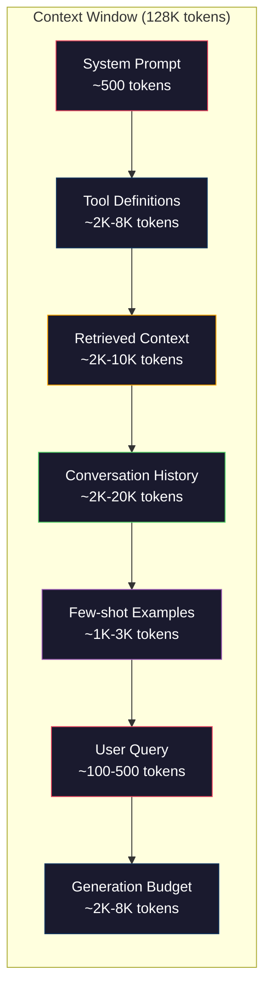
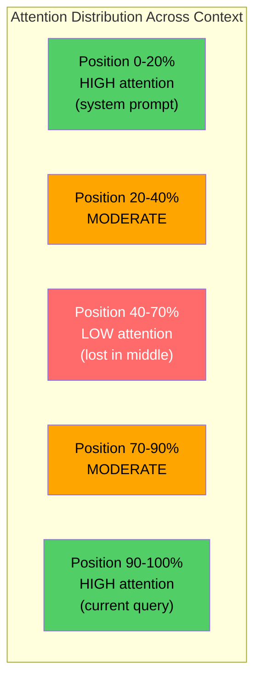
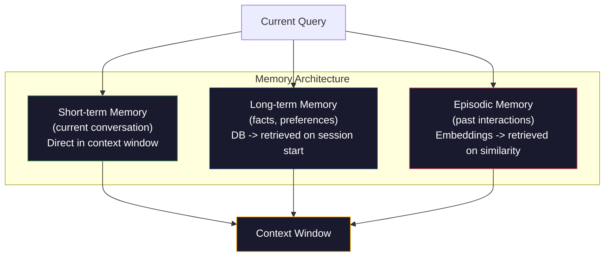

# संदर्भ इंजीनियरिंगः विंडोज, बजट, मेमोरी और पुनर्प्राप्ति

> प्रॉम्प्ट इंजीनियरिंग एक उपसमूह है। संदर्भ इंजीनियरिंग पूरे खेल है। एक प्रॉम्प्ट एक स्ट्रिंग है जिसे आप टाइप करते हैं। संदर्भ वह सब कुछ है जो मॉडल की खिड़की में जाता हैः सिस्टम निर्देश, निकाले गए दस्तावेज़, उपकरण परिभाषाएं, वार्तालाप इतिहास, कुछ शॉट उदाहरण और प्रॉम्प्ट स्वयं। 2026 में सर्वश्रेष्ठ एआई इंजीनियर संदर्भ इंजीनियर हैं। वे तय करते हैं कि क्या अंदर जाता है, क्या बाहर रहता है, और किस क्रम में।

> **【中文解读】**提示工程只是上下文工程的子集──上下文工程管理模型窗口中的一切内容系统指令、检查文档、工具定义、对话历史等──2026 के सर्वश्रेष्ठ एआई 工程师就是上下文工程师──

> **【拓展：上下文工程→Claude生态】**क्लाउड के एमसीपी प्रोटोकॉल मूल रूप से उपरोक्त परियोजना के मानकों को प्राप्त करने के लिए एक एकीकृत प्रोटोकॉल प्रबंधन मॉडल के माध्यम से उपकरण, संसाधन और सुझाव मॉडल के लिए उपलब्ध है।

>  **【前置】**学本节前 कृपया पहले समझेंः(1) चरण 11·01-02(प्रोम्प्ट इंजीनियरिंग、कुछ शॉट कॉट);(2) चरण 11·04(इम्बेडिंग्स) और चरण 11·06(RAG)  समझ检索 कैसे प्राप्त करें文档;(3) टोकन 概念本节重度讨论 टोकन 预算── यदि आप "200K संदर्भ विंडो" को नहीं जानते हैं तो पहले देखें चरण 10──

**Type:** Build | **类型:** 构建
**Languages:** Python | **语言:** Python
**Prerequisites:** Phase 10 (LLMs from Scratch), Phase 11 Lesson 01-02 | **前置知识:** Phase 10（从零理解 LLM）、Phase 11 Lesson 01-02
**Time:** ~90 minutes | **时间:** ~90 分钟
**Related:**चरण 11 · 15 (प्रॉम्प्ट कैशिंग)  कैश-अनुकूल लेआउट संदर्भ इंजीनियरिंग का विस्तार है. चरण 5 · 28 (लंबे संदर्भ मूल्यांकन) NIAH / RULER के साथ मध्य में खोए हुए को मापने के लिए। **相关:**चरण 11 · 15 (提示缓存) 缓存友好布局是上下文工程的延伸──Phase 5 · 28 (长上下文评估)介绍 NIAH/RULER 测量"中间丢失" किस प्रकार का उपयोग किया जाता है

## सीखने के लक्ष्य

- सभी संदर्भ विंडो घटकों (सिस्टम प्रॉम्प्ट, उपकरण, इतिहास, प्राप्त डॉक्स, पीढ़ी हेडरूम) पर टोकन बजट की गणना करें
  跨所有上下文窗口组件(系统提示、工具、历史、检索文档、生成余量) गणना टोकन  बजट
- संदर्भ खिड़की प्रबंधन रणनीतियों को लागू करेंः वार्तालाप इतिहास के लिए ट्रंक, सारांश और स्लाइडिंग खिड़की
  实现上下文窗口管理策略:截断、摘要、滑动窗口管理对话历史
- सबसे प्रासंगिक जानकारी पर मॉडल का ध्यान अधिकतम करने के लिए संदर्भ घटकों को प्राथमिकता दें और क्रमबद्ध करें
  पहले श्रेणीबद्ध उपरोक्त घटक के अनुसार, सबसे प्रासंगिक जानकारी पर ध्यान केंद्रित करने के लिए अधिकतम मॉडल
- एक संदर्भ असेंबलर बनाएँ जो क्वेरी प्रकार और उपलब्ध विंडो स्थान के आधार पर टोकन को गतिशील रूप से आवंटित करता है
   निर्माण के आधार पर पूछताछ प्रकार और उपलब्ध खिड़की अंतरिक्ष गतिशील वितरण टोकन के ऊपर नीचे संरचना

> **【中文解读】**इस वर्ग का उद्देश्य: शीघ्र इंजीनियरिंग, व्यवस्थित प्रबंधन से परे मॉडल पर नीचे की सभी जानकारी में प्रवेश करना है।


## समस्या  समस्या परिचय

क्लाउड ओपस 4.7 में 200K टोकन विंडो है (1M बीटा में) GPT-5 में 400K है Gemini 3 Pro में 2M है Llama 4 का दावा है 10M. ये संख्याएं जब तक आप उन्हें भरते हैं तब तक भारी लगती हैं।

> क्लाउड ओपस 4.7 में 200K टोकन हैं  विंडोज(बीटा  संस्करण 1M)  जीपीटी-5 में 400K  जेमिनी 3 प्रो में 2M  ये संख्याएं बहुत बड़ी लगती हैं, जब तक आप उन्हें भरते हैं 

यहां एक कोडिंग सहायक के लिए एक वास्तविक टूटना है। सिस्टम प्रॉम्प्टः 500 टोकन। 50 टूल के लिए टूल परिभाषाएंः 8,000 टोकन। निकाला गया दस्तावेजः 4,000 टोकन। वार्तालाप इतिहास (10 वारी): 6,000 टोकन। वर्तमान उपयोगकर्ता क्वेरीः 200 टोकन। पीढ़ी बजट (अधिकतम आउटपुट): 4,000 टोकन। कुलः 22,700 टोकन। जो 128K विंडो का केवल 18% है।

> यह एक प्रोग्रामिंग सहायक का वास्तविक विश्लेषण है। सिस्टम सुझावः500 टोकन──50 个工具定义:8,000 टोकन──检索文档:4,000 टोकन──对话历史(10轮):6,000 टोकन──当前查询:200 टोकन──生成预算:4,000 टोकन──总计:22,700 टोकन── यह 128K 窗口 का केवल 18% है──

>  **【类比】**上下文窗口像书桌面200K टोकन 听起来很大,但放上"教科书(系统提示) "+"参考书(恢复文件) "+"草稿纸(历史) "+"计算器(工具) "就快满了──**Lost in the Middle**现象像寻找东西: पुस्तक मेज पर कुछ से भरा हुआ होने पर, सबसे आसानी से अनदेखा किया जाता है मध्य में ढेर के  आप केवल ध्यान दें टेबल के उद्घाटन के लिए  हाल के बाद) और अंत में  हाथ के बाद) 

> ️ **【易错点】**上下文管理的 3 个坑:(1) **历史无限增长** वार्ता越长 इतिहास 越大,最终撞窗口;修复:用总结(每 N 轮缩成摘要) या स्लाइडिंग विंडो((只保留近期 K 轮 + 第一轮) 』)**工具定义重复发送** प्रति बार调用都把 50 个工具方案 全发一遍;修复: शीघ्र कैशिंग के साथ(Phase 11·15),Claude / OpenAI 都支持,省 90% लागत──(3) **检索文档全塞**召回50 个块 全塞 prompt 模型迷失;修复:top-5 高质量块 + क्रॉस-एन्कोडर 重排──

लेकिन ध्यान संदर्भ की लंबाई के साथ रैखिक रूप से नहीं स्केल होता है। संदर्भ के 128K टोकन वाले मॉडल वनिला ट्रांसफार्मर में क्वाड्रैटिक ध्यान लागत (O(n^2) का भुगतान करते हैं, हालांकि अधिकांश उत्पादन मॉडल कुशल ध्यान संस्करणों का उपयोग करते हैं। और इससे भी महत्वपूर्ण बात यह है कि पुनर्प्राप्ति की सटीकता कम होती है। "शेयस्टैक में सुई" परीक्षण से पता चलता है कि मॉडल लंबे संदर्भों के बीच में रखी गई जानकारी खोजने के लिए संघर्ष करते हैं। लियू एट अल द्वारा किए गए शोध (2023) ने दिखाया कि LLM लंबे संदर्भों की शुरुआत और अंत में लगभग सही सटीकता के साथ जानकारी प्राप्त करते हैं, लेकिन बीच में रखे गए जानकारी के लिए सटीकता 10-20% कम होती है (संदर्भ की स्थिति 40-70%) । यह "मध्य में खोया" प्रभाव मॉडल के अनुसार भिन्न होता है लेकिन सभी वर्तमान वास्तुकला को प्रभावित करता है।

> लेकिन ध्यान नीचे की लंबाई के साथ नहीं होगा लाइनर विस्तार। इससे भी महत्वपूर्ण बात यह है कि जांच सटीकता दर में कमी आएगी। "大海捞针" परीक्षण से पता चलता है कि मॉडल को खोजने में मुश्किल है जो जानकारी को ऊपर की नीचे की मध्य स्थिति में रखा गया है।

व्यावहारिक सबकः 200K टोकन उपलब्ध होने का मतलब यह नहीं है कि 200K टोकन का उपयोग करना प्रभावी है। एक सावधानीपूर्वक क्यूरेट 10K टोकन संदर्भ अक्सर एक डंप किए गए 100K टोकन संदर्भ से बेहतर प्रदर्शन करता है। संदर्भ इंजीनियरिंग संदर्भ विंडो के भीतर संकेत-गिरफ्तार अनुपात को अधिकतम करने का अनुशासन है।

> 实际教训: 200K टोकन उपलब्ध है उपयोग का मतलब 200K टोकन का उपयोग नहीं है प्रभावी है।

आप खिड़की में जो भी टोकन डालते हैं वह एक टोकन को हटा देता है जो अधिक प्रासंगिक जानकारी ले सकता है। हर अनावश्यक उपकरण परिभाषा, हर पुराने बातचीत के मोड़, हर टुकड़ा जो उत्तर नहीं देता है - प्रत्येक एक मॉडल को थोड़ा बदतर बनाता है कार्य पर।

> आप खिड़की में जो भी टोकन डालते हैं, वह एक टोकन से अधिक संबंधित जानकारी ले जाने के लिए बाहर निकल जाता है। प्रत्येक अनावश्यक उपकरण की परिभाषा, प्रत्येक कालान्तर वार्तालाप, प्रत्येक प्रश्न का उत्तर नहीं देने वाले प्रश्न का परीक्षण करने वाले पाठ ब्लॉक। प्रत्येक मॉडल को कार्य में थोड़ा भिन्नता पैदा करता है।

## अवधारणा का मूल अवधारणा

> **【中文解读】**ऊपर नीचे की विंडो में सभी जानकारी का प्रबंधन करना है: जांच परिणाम, वार्ता इतिहास, उपकरण आउटपुट, सिस्टम निर्देश आदि।

> **【拓展：上下文窗口的有效利用】**GPT-4o में 128K टोकन है ऊपर नीचे की खिड़की, लेकिन अध्ययनों से पता चलता है कि मॉडल मध्य स्थान पर जानकारी पर ध्यान केंद्रित करता है।


### संदर्भ विंडो एक दुर्लभ संसाधन है

संदर्भ विंडो को रैम के रूप में सोचें, डिस्क नहीं। यह तेज़ और सीधे सुलभ है, लेकिन सीमित है। आप सब कुछ फिट नहीं कर सकते। आपको चुनना होगा।

> इसे रैम के रूप में सोचें, डिस्क नहीं।



प्रत्येक घटक अंतरिक्ष के लिए प्रतिस्पर्धा करता है। अधिक टूल परिभाषाओं को जोड़ने से वार्तालाप इतिहास के लिए कम स्थान होता है। अधिक निकाले गए संदर्भ को जोड़ने से कुछ शॉट उदाहरणों के लिए कम स्थान होता है। संदर्भ इंजीनियरिंग कार्य प्रदर्शन को अधिकतम करने के लिए इस बजट को आवंटित करने की कला है।

> प्रत्येक घटक में एक-एक स्थान का अधिग्रहण होता है। इसके अतिरिक्त, अधिक उपकरण परिभाषित होते हैं, जिसका अर्थ है कि वार्तालाप के लिए ऐतिहासिक स्थान कम होता है।

### बीच में खोया

संदर्भ इंजीनियरिंग में सबसे महत्वपूर्ण अनुभवजन्य निष्कर्ष। मॉडल संदर्भ की शुरुआत और अंत में जानकारी को बेहतर ध्यान देते हैं। बीच में जानकारी कम ध्यान स्कोर प्राप्त करती है और अनदेखी होने की अधिक संभावना होती है।

> उपरोक्त में सबसे महत्वपूर्ण व्यावहारिक खोजों में से एक है। उपरोक्त में उपरोक्त के आरंभ और अंत में जानकारी पर ध्यान देने का मॉडल बेहतर है। मध्य स्थान पर जानकारी कम ध्यान देने योग्य होती है, इसे आसानी से अनदेखा किया जाता है।

लीउ एट अल. (2023) ने इस पर व्यवस्थित रूप से परीक्षण किया। उन्होंने विभिन्न स्थानों पर 20 असंबंधित दस्तावेजों के बीच एक प्रासंगिक दस्तावेज रखा और उत्तर की सटीकता मापी। जब प्रासंगिक दस्तावेज पहला या अंतिम था, तो सटीकता 85-90% थी। जब यह मध्य में था (स्थिति 10 में से 20), सटीकता 60-70% तक गिर गई।

> ल्यू 等人 () ने इस घटना का व्यवस्थित परीक्षण किया है। उन्होंने संबंधित दस्तावेजों को 20 个不相关文档 के बीच विभिन्न स्थानों पर रखा है, मापने के लिए उत्तर सटीकता दर।

इसका सीधा इंजीनियरिंग प्रभाव हैः

> इसका सीधा अर्थ हैः

- सबसे महत्वपूर्ण जानकारी को पहले रखें (सिस्टम शीघ्र, महत्वपूर्ण निर्देश)
  सबसे महत्वपूर्ण जानकारी को सबसे पहले पर रखना (प्रणाली सुझाव, महत्वपूर्ण निर्देश)
- वर्तमान क्वेरी और सबसे प्रासंगिक संदर्भ को अंतिम स्थान पर रखें (हाल के पूर्वाग्रह मदद करता है)
  वर्तमान पूछताछ और सबसे संबंधित ऊपर नीचे दिए गए अंतिम (अंतिम)
- संदर्भ के मध्य को निम्नतम प्राथमिकता वाले क्षेत्र के रूप में व्यवहार करें
  निम्न मध्य को निम्नतम प्राथमिकता वाले क्षेत्र के रूप में देखना
- यदि आपको बीच में जानकारी शामिल करनी है, तो अंत में कुंजी बिंदु को दोहराएं
  यदि बीच में सूचना डालना है, तो अंत में दोहराएँ



### संदर्भ घटक

**System prompt**: व्यक्तित्व, प्रतिबंध और व्यवहार नियम निर्धारित करता है। यह पहले जाता है और बारी-बारी से निरंतर रहता है। क्लाउड कोड अपने सिस्टम प्रॉम्प्ट के लिए लगभग 6,000 टोकन का उपयोग करता है जिसमें टूल परिभाषाएं और व्यवहार निर्देश शामिल हैं। इसे कसकर रखें। सिस्टम प्रॉम्प्ट में प्रत्येक शब्द को प्रत्येक एपीआई कॉल पर दोहराया जाता है।

> **系统提示**: सेट करने के लिए व्यक्ति, बाध्यता और व्यवहार नियम, सबसे पहले और सबसे आगे और सबसे आगे के चरणों में लगातार परिवर्तन करते हुए, क्लाउड कोड का सिस्टम संदेश, लगभग 6,000 टोकन, जिसमें उपकरण परिभाषा और व्यवहार निर्देश शामिल हैं, और इसे बनाए रखने के लिए।

**Tool definitions**: प्रत्येक उपकरण 50-200 टोकन जोड़ता है (नाम, विवरण, पैरामीटर योजना) । 150 टोकन पर 50 उपकरण प्रत्येक किसी भी बातचीत से पहले 7,500 टोकन है। गतिशील उपकरण चयन - केवल वर्तमान क्वेरी के लिए प्रासंगिक उपकरण सहित - इसे 60-80% कम कर सकते हैं।

> **工具定义**: प्रत्येक उपकरण 50-200 टोकन (नाम, विवरण, पैरामीटर योजना) ◦ 50 工具 प्रति 150 टोकन, यानी 7,500 टोकन  वार्तालाप शुरू होने से पहले ही उपयोग में थे ◦ गतिशील उपकरण चयन  केवल वर्तमान पूछताछ से संबंधित उपकरण  60 से 80% तक कम हो सकता है ◦

**Retrieved context**: वेक्टर डेटाबेस से दस्तावेज, खोज परिणाम, फ़ाइल सामग्री. प्राप्त की गुणवत्ता सीधे प्रतिक्रिया की गुणवत्ता को निर्धारित करती है. खराब प्राप्त करना कोई प्राप्त करने से भी बदतर है - यह खिड़की को शोर से भर देता है और सक्रिय रूप से मॉडल को भ्रामक बनाता है।

> **检索上下文**: से आयाम डेटाबेस के दस्तावेज़, खोज परिणाम, फ़ाइल सामग्री से प्राप्त है।

**Conversation history**एक 50 टर्न वार्तालाप 200 टोकन प्रति टर्न के साथ इतिहास के 10,000 टोकन है। अधिकांश वर्तमान क्वेरी के लिए प्रासंगिक नहीं है।

> **对话历史**सभी पहले के उपयोगकर्ता संदेश और सहायक प्रतिक्रियाएँ। बातचीत की लंबाई में वृद्धि हुई है।

**Few-shot examples**इनपुट/आउटपुट जोड़े जो वांछित व्यवहार को प्रदर्शित करते हैं। दो से तीन अच्छी तरह से चुने गए उदाहरण अक्सर निर्देशों के हजारों टोकन से अधिक आउटपुट गुणवत्ता में सुधार करते हैं। लेकिन वे स्थान की लागत करते हैं।

> **少样本示例**उदाहरण: प्रदर्शन अपेक्षित व्यवहारों के इनपुट/आउटपुट के लिए 2-3  ध्यान से चुनी गई उदाहरणों में अक्सर हजारों टोकन के आदेशों से अधिक उत्पादन गुणवत्ता को बढ़ाया जा सकता है, लेकिन वे स्थान का उपभोग करते हैं

**Generation budget**यदि आप क्षमता के लिए खिड़की भरते हैं, तो मॉडल के पास जवाब देने के लिए कोई जगह नहीं है। उत्पादन के लिए कम से कम 2,000-4,000 टोकन आरक्षित करें।

> **生成预算**: लिए मॉडल प्रतिक्रिया प्रतिधारण टोकन── यदि खिड़की भर जाएगी, तो मॉडल में कोई जवाब देने की जगह नहीं है── कम से कम 2,000-4,000 टोकन उत्पन्न करने के लिए बनाए रखें──

### संदर्भ संपीड़न रणनीतियाँ

**History summarization**: इसके बजाय सभी पिछले टर्न को शाब्दिक रखें, आवधिक रूप से बातचीत का सारांश दें। "हमने X पर चर्चा की, Y का फैसला किया, और उपयोगकर्ता Z चाहता है" 100 टोकन में 10 टर्न की जगह लेता है जो 2,000 टोकन ले गया। जब इतिहास एक सीमा से अधिक हो तो सारांश चलाएं (उदाहरण के लिए, 5,000 टोकन) ।

> **历史摘要**:而非逐字保留所有前序轮次,定期总结对话──"हमने X पर चर्चा की, निर्णय लिया Y, उपयोगकर्ता चाहता है Z"100 टोकन के साथ 替代 10 轮 2,000 टोकन──当历史超过值(如 5,000 टोकन)时运行摘要──

**Relevance filtering**यदि आपने 10 टुकड़े निकाले हैं लेकिन केवल 3 ही प्रासंगिक हैं, तो बाकी 7 को फेंक दें। 10 मध्यम से अधिक प्रासंगिक टुकड़ों की तुलना में 3 उच्च प्रासंगिक टुकड़े बेहतर हैं।

> **相关性过滤**: प्रत्येक जांच दस्तावेज को वर्तमान जांच के साथ विभाजित करें, कम से कम मूल्य के लिए छोड़ दें।

**Tool pruning**: उपयोगकर्ता के क्वेरी इरादे को वर्गीकृत करें और केवल उस इरादे से संबंधित उपकरण शामिल करें। एक कोड प्रश्न को कैलेंडर उपकरणों की आवश्यकता नहीं है। एक शेड्यूलिंग प्रश्न को फ़ाइल सिस्टम उपकरणों की आवश्यकता नहीं है। यह उपकरण परिभाषाओं को 8,000 टोकन से 1,000 तक कम कर सकता है।

> **工具裁剪**: वर्ग उपयोगकर्ता पूछताछ इरादा, केवल इस इरादे से संबंधित उपकरण शामिल हैं। कोड समस्या को इतिहास उपकरण की आवश्यकता नहीं है।

**Recursive summarization**एक 50 पृष्ठ का दस्तावेज 500 टोकन का एक डाइजेस्ट बन जाता है जो प्रमुख बिंदुओं को कैप्चर करता है।

> **递归摘要**:: पर超长文档,分阶段总结──先总结每节,再总结摘要──50 页文档变成500 टोकन के सारांश,捕获关键点──

### स्मृति प्रणाली

संदर्भ इंजीनियरिंग तीन समय क्षितिज पर फैली हुई है।

> 上下文工程跨越三时间尺度──

**Short-term memory**: वर्तमान बातचीत. संदर्भ विंडो में सीधे संग्रहीत. प्रत्येक मोड़ के साथ बढ़ता है. संक्षेप और ट्रंक द्वारा प्रबंधित.

> **短期记忆**: वर्तमान वार्तालाप── सीधे भंडारण में उपरोक्त निम्न पृष्ठों के साथ-साथ प्रत्येक चरण में वृद्धि── संक्षेप और कटौती प्रबंधन के माध्यम से──

**Long-term memory**: तथ्य और वरीयताओं जो बातचीत के दौरान बनी रहती हैं। "उपयोगकर्ता टाइपस्क्रिप्ट पसंद करता है।" "प्रोजेक्ट पोस्टग्रेएसक्यूएल का उपयोग करता है।" एक डेटाबेस में संग्रहीत, सत्र शुरू होने पर प्राप्त किया जाता है। क्लाउड कोड इसे क्लाउड.एमडी फ़ाइलों में संग्रहीत करता है। चैटजीपीटी इसे अपनी मेमोरी सुविधा में संग्रहीत करता है।

> **长期记忆**:跨对话持久的事实和偏好──"उपयोगकर्ता प्राथमिकता टाइपस्क्रिप्ट──"" परियोजना PostgreSQL──" डाटाबेस में संग्रहीत, बैठक शुरू करते समय जांच──Claude Code 存在 CLAUDE.md 文件──ChatGPT 存在其内存 功能──

**Episodic memory**: विशिष्ट अतीत बातचीत जो प्रासंगिक हो सकती है। "पिछले मंगलवार को, हमने लेखक मॉड्यूल में एक समान समस्या डिबग की।" एम्बेड के रूप में संग्रहीत, जब वर्तमान बातचीत पिछले एपिसोड से मेल खाती है, तब पुनर्प्राप्त किया जाता है।

> **情景记忆**:可能相关的特定过去交互──"上周二我们在作者 模块调试过类似问题──" भंडारण के लिए एम्बेड, वर्तमान वार्तालाप मैच过去情景时检索──"



### गतिशील संदर्भ विधानसभा

मुख्य अंतर्दृष्टिः विभिन्न क्वेरी को अलग-अलग संदर्भ की आवश्यकता होती है। एक स्थिर प्रणाली प्रॉम्प्ट + स्थिर उपकरण + स्थिर इतिहास व्यर्थ है। सबसे अच्छी प्रणालियों को गतिशील रूप से क्वेरी प्रति संदर्भ इकट्ठा करना होता है।

> 关键洞察: विभिन्न पूछताछ आवश्यकताएं भिन्न हैं 静态系统提示 + 静态工具 + 静态历史是浪费―― सर्वोत्तम प्रणाली पर पूछताछ动态组装上下文――

1. क्वेरी इरादे को वर्गीकृत करें
   श्रेणी पूछताछ
2. प्रासंगिक उपकरण चुनें (सभी उपकरण नहीं)
   选择相关工具(不是全部工具)
3. प्रासंगिक दस्तावेज प्राप्त करें (निरपेक्ष सेट नहीं)
   检索相关文档(नहीं स्थिर集合)
4. प्रासंगिक इतिहास मोड़ शामिल करें (सभी इतिहास नहीं)
   包含相关历史轮次(不是全部历史)
5. कुछ शॉट उदाहरण जो कार्य प्रकार से मेल खाते जोड़ें
   कार्य प्रकार के अनुरूप छोटे नमूने के उदाहरण जोड़े
6. महत्वपूर्ण पहले, महत्वपूर्ण अंतिम, मध्य में वैकल्पिक
   按重要性排序:关键在前、重要在后、可选在中间

यह एक अच्छा एआई अनुप्रयोग को एक महान से अलग करता है। मॉडल एक ही है। संदर्भ अंतर है।

> यह अंतर है उत्कृष्ट एआई अनुप्रयोग और उत्कृष्ट एआई अनुप्रयोग की कुंजी। मॉडल एक ही है।

## इसे बनाओ, इसे पूरा करो।
```figure
lost-in-the-middle
```

## इसे बनाओ

### चरण 1: टोकन काउंटर

आप जो नहीं माप सकते हैं उसे बजट नहीं कर सकते। एक सरल टोकन काउंटर बनाएं (वाइटस्पेस विभाजन का उपयोग करके अनुमान, क्योंकि सटीक गणना टोकनराइज़र पर निर्भर करती है) ।

> आप अमूर्त चीजों के लिए बजट नहीं बना सकते हैं। सरल टोकन कैलकुलेटर का निर्माण करें।

```python
import json
import numpy as np
from collections import OrderedDict

def count_tokens(text):
    if not text:
        return 0
    return int(len(text.split()) * 1.3)

def count_tokens_json(obj):
    return count_tokens(json.dumps(obj))
```

### चरण 2: संदर्भ बजट प्रबंधक

मूल अमूर्तता. एक बजट प्रबंधक ट्रैक करता है कि प्रत्येक घटक कितने टोकन का उपयोग करता है और सीमाओं को लागू करता है।

> 核心抽象── बजट प्रबंधक प्रत्येक घटक का उपयोग करने के लिए कितना टोकन का उपयोग करता है और इसे सीमित करता है──

```python
class ContextBudget:
    def __init__(self, max_tokens=128000, generation_reserve=4000):
        self.max_tokens = max_tokens
        self.generation_reserve = generation_reserve
        self.available = max_tokens - generation_reserve
        self.allocations = OrderedDict()

    def allocate(self, component, content, max_tokens=None):
        tokens = count_tokens(content)
        if max_tokens and tokens > max_tokens:
            words = content.split()
            target_words = int(max_tokens / 1.3)
            content = " ".join(words[:target_words])
            tokens = count_tokens(content)

        used = sum(self.allocations.values())
        if used + tokens > self.available:
            allowed = self.available - used
            if allowed <= 0:
                return None, 0
            words = content.split()
            target_words = int(allowed / 1.3)
            content = " ".join(words[:target_words])
            tokens = count_tokens(content)

        self.allocations[component] = tokens
        return content, tokens

    def remaining(self):
        used = sum(self.allocations.values())
        return self.available - used

    def utilization(self):
        used = sum(self.allocations.values())
        return used / self.max_tokens

    def report(self):
        total_used = sum(self.allocations.values())
        lines = []
        lines.append(f"Context Budget Report ({self.max_tokens:,} token window)")
        lines.append("-" * 50)
        for component, tokens in self.allocations.items():
            pct = tokens / self.max_tokens * 100
            bar = "#" * int(pct / 2)
            lines.append(f"  {component:<25} {tokens:>6} tokens ({pct:>5.1f}%) {bar}")
        lines.append("-" * 50)
        lines.append(f"  {'Used':<25} {total_used:>6} tokens ({total_used/self.max_tokens*100:.1f}%)")
        lines.append(f"  {'Generation reserve':<25} {self.generation_reserve:>6} tokens")
        lines.append(f"  {'Remaining':<25} {self.remaining():>6} tokens")
        return "\n".join(lines)
```

### चरण 3: मध्य में खोया हुआ पुनर्गठन

पुनर्गठन रणनीति को लागू करेंः सबसे महत्वपूर्ण वस्तुएं पहले और अंतिम, कम महत्वपूर्ण वस्तुएं बीच में होती हैं।

> 实现重排策略: सबसे महत्वपूर्ण项目放最前和最后, सबसे महत्वपूर्ण项目放中──

```python
def reorder_lost_in_middle(items, scores):
    paired = sorted(zip(scores, items), reverse=True)
    sorted_items = [item for _, item in paired]

    if len(sorted_items) <= 2:
        return sorted_items

    first_half = sorted_items[::2]
    second_half = sorted_items[1::2]
    second_half.reverse()

    return first_half + second_half

def score_relevance(query, documents):
    query_words = set(query.lower().split())
    scores = []
    for doc in documents:
        doc_words = set(doc.lower().split())
        if not query_words:
            scores.append(0.0)
            continue
        overlap = len(query_words & doc_words) / len(query_words)
        scores.append(round(overlap, 3))
    return scores
```

### चरण 4: वार्तालाप इतिहास कंप्रेसर

पुराने बातचीत का सारांश टोकन बजट वापस लेने के लिए बदल जाता है।

> 总结旧对话轮次以收回 टोकन 预算。

```python
class ConversationManager:
    def __init__(self, max_history_tokens=5000):
        self.turns = []
        self.summaries = []
        self.max_history_tokens = max_history_tokens

    def add_turn(self, role, content):
        self.turns.append({"role": role, "content": content})
        self._compress_if_needed()

    def _compress_if_needed(self):
        total = sum(count_tokens(t["content"]) for t in self.turns)
        if total <= self.max_history_tokens:
            return

        while total > self.max_history_tokens and len(self.turns) > 4:
            old_turns = self.turns[:2]
            summary = self._summarize_turns(old_turns)
            self.summaries.append(summary)
            self.turns = self.turns[2:]
            total = sum(count_tokens(t["content"]) for t in self.turns)

    def _summarize_turns(self, turns):
        parts = []
        for t in turns:
            content = t["content"]
            if len(content) > 100:
                content = content[:100] + "..."
            parts.append(f"{t['role']}: {content}")
        return "Previous: " + " | ".join(parts)

    def get_context(self):
        parts = []
        if self.summaries:
            parts.append("[Conversation Summary]")
            for s in self.summaries:
                parts.append(s)
        parts.append("[Recent Conversation]")
        for t in self.turns:
            parts.append(f"{t['role']}: {t['content']}")
        return "\n".join(parts)

    def token_count(self):
        return count_tokens(self.get_context())
```

### चरण 5: गतिशील उपकरण चयनकर्ता

केवल वर्तमान क्वेरी के लिए प्रासंगिक उपकरण शामिल करें. अभिप्राय वर्गीकृत, फिर फ़िल्टर.

> केवल वर्तमान पूछताछ से संबंधित उपकरण शामिल हैं।

```python
TOOL_REGISTRY = {
    "read_file": {
        "description": "Read contents of a file",
        "tokens": 120,
        "categories": ["code", "files"],
    },
    "write_file": {
        "description": "Write content to a file",
        "tokens": 150,
        "categories": ["code", "files"],
    },
    "search_code": {
        "description": "Search for patterns in codebase",
        "tokens": 130,
        "categories": ["code"],
    },
    "run_command": {
        "description": "Execute a shell command",
        "tokens": 140,
        "categories": ["code", "system"],
    },
    "create_calendar_event": {
        "description": "Create a new calendar event",
        "tokens": 180,
        "categories": ["calendar"],
    },
    "list_emails": {
        "description": "List recent emails",
        "tokens": 160,
        "categories": ["email"],
    },
    "send_email": {
        "description": "Send an email message",
        "tokens": 200,
        "categories": ["email"],
    },
    "web_search": {
        "description": "Search the web for information",
        "tokens": 140,
        "categories": ["research"],
    },
    "query_database": {
        "description": "Run a SQL query on the database",
        "tokens": 170,
        "categories": ["code", "data"],
    },
    "generate_chart": {
        "description": "Generate a chart from data",
        "tokens": 190,
        "categories": ["data", "visualization"],
    },
}

def classify_intent(query):
    query_lower = query.lower()

    intent_keywords = {
        "code": ["code", "function", "bug", "error", "file", "implement", "refactor", "debug", "test"],
        "calendar": ["meeting", "schedule", "calendar", "appointment", "event"],
        "email": ["email", "mail", "send", "inbox", "message"],
        "research": ["search", "find", "what is", "how does", "explain", "look up"],
        "data": ["data", "query", "database", "chart", "graph", "analytics", "sql"],
    }

    scores = {}
    for intent, keywords in intent_keywords.items():
        score = sum(1 for kw in keywords if kw in query_lower)
        if score > 0:
            scores[intent] = score

    if not scores:
        return ["code"]

    max_score = max(scores.values())
    return [intent for intent, score in scores.items() if score >= max_score * 0.5]

def select_tools(query, token_budget=2000):
    intents = classify_intent(query)
    relevant = {}
    total_tokens = 0

    for name, tool in TOOL_REGISTRY.items():
        if any(cat in intents for cat in tool["categories"]):
            if total_tokens + tool["tokens"] <= token_budget:
                relevant[name] = tool
                total_tokens += tool["tokens"]

    return relevant, total_tokens
```

### चरण 6: पूर्ण संदर्भ विधानसभा पाइपलाइन

सब कुछ एक साथ तार. एक क्वेरी को देखते हुए, गतिशील रूप से इष्टतम संदर्भ इकट्ठा करें.

> सब कुछ जोड़ें, पूछताछ करें, गतिशीलता को तैयार करें

```python
class ContextEngine:
    def __init__(self, max_tokens=128000, generation_reserve=4000):
        self.budget = ContextBudget(max_tokens, generation_reserve)
        self.conversation = ConversationManager(max_history_tokens=5000)
        self.system_prompt = (
            "You are a helpful AI assistant. You have access to tools for "
            "code editing, file management, web search, and data analysis. "
            "Use the appropriate tools for each task. Be concise and accurate."
        )
        self.knowledge_base = [
            "Python 3.12 introduced type parameter syntax for generic classes using bracket notation.",
            "The project uses PostgreSQL 16 with pgvector for embedding storage.",
            "Authentication is handled by Supabase Auth with JWT tokens.",
            "The frontend is built with Next.js 15 using the App Router.",
            "API rate limits are set to 100 requests per minute per user.",
            "The deployment pipeline uses GitHub Actions with Docker multi-stage builds.",
            "Test coverage must be above 80% for all new modules.",
            "The codebase follows the repository pattern for data access.",
        ]

    def assemble(self, query):
        self.budget = ContextBudget(self.budget.max_tokens, self.budget.generation_reserve)

        system_content, _ = self.budget.allocate("system_prompt", self.system_prompt, max_tokens=1000)

        tools, tool_tokens = select_tools(query, token_budget=2000)
        tool_text = json.dumps(list(tools.keys()))
        tool_content, _ = self.budget.allocate("tools", tool_text, max_tokens=2000)

        relevance = score_relevance(query, self.knowledge_base)
        threshold = 0.1
        relevant_docs = [
            doc for doc, score in zip(self.knowledge_base, relevance)
            if score >= threshold
        ]

        if relevant_docs:
            doc_scores = [s for s in relevance if s >= threshold]
            reordered = reorder_lost_in_middle(relevant_docs, doc_scores)
            doc_text = "\n".join(reordered)
            doc_content, _ = self.budget.allocate("retrieved_context", doc_text, max_tokens=3000)

        history_text = self.conversation.get_context()
        if history_text.strip():
            history_content, _ = self.budget.allocate("conversation_history", history_text, max_tokens=5000)

        query_content, _ = self.budget.allocate("user_query", query, max_tokens=500)

        return self.budget

    def chat(self, query):
        self.conversation.add_turn("user", query)
        budget = self.assemble(query)
        response = f"[Response to: {query[:50]}...]"
        self.conversation.add_turn("assistant", response)
        return budget


def run_demo():
    print("=" * 60)
    print("  Context Engineering Pipeline Demo")
    print("=" * 60)

    engine = ContextEngine(max_tokens=128000, generation_reserve=4000)

    print("\n--- Query 1: Code task ---")
    budget = engine.chat("Fix the bug in the authentication module where JWT tokens expire too early")
    print(budget.report())

    print("\n--- Query 2: Research task ---")
    budget = engine.chat("What is the best approach for implementing vector search in PostgreSQL?")
    print(budget.report())

    print("\n--- Query 3: After conversation history builds up ---")
    for i in range(8):
        engine.conversation.add_turn("user", f"Follow-up question number {i+1} about the implementation details of the system")
        engine.conversation.add_turn("assistant", f"Here is the response to follow-up {i+1} with technical details about the architecture")

    budget = engine.chat("Now implement the changes we discussed")
    print(budget.report())

    print("\n--- Tool Selection Examples ---")
    test_queries = [
        "Fix the bug in auth.py",
        "Schedule a meeting with the team for Tuesday",
        "Show me the database query performance stats",
        "Search for best practices on error handling",
    ]

    for q in test_queries:
        tools, tokens = select_tools(q)
        intents = classify_intent(q)
        print(f"\n  Query: {q}")
        print(f"  Intents: {intents}")
        print(f"  Tools: {list(tools.keys())} ({tokens} tokens)")

    print("\n--- Lost-in-the-Middle Reordering ---")
    docs = ["Doc A (most relevant)", "Doc B (somewhat relevant)", "Doc C (least relevant)",
            "Doc D (relevant)", "Doc E (moderately relevant)"]
    scores = [0.95, 0.60, 0.20, 0.80, 0.50]
    reordered = reorder_lost_in_middle(docs, scores)
    print(f"  Original order: {docs}")
    print(f"  Scores:         {scores}")
    print(f"  Reordered:      {reordered}")
    print(f"  (Most relevant at start and end, least relevant in middle)")
```

## इसे फ्रेमवर्क के साथ लागू करें

### हर्नस-मैनेज्ड संदर्भ

क्लाउड कोड एक परतों वाले दृष्टिकोण के साथ संदर्भ का प्रबंधन करता है। सिस्टम प्रॉम्प्ट में व्यवहार नियम और उपकरण परिभाषाएं (~ 6K टोकन) शामिल हैं। जब आप एक फ़ाइल खोलते हैं, तो इसकी सामग्री संदर्भ के रूप में इंजेक्ट की जाती है। जब आप खोज करते हैं, तो परिणाम जोड़े जाते हैं। पुराने वार्तालाप वक्रों का सारांश दिया जाता है। CLAUDE.md दीर्घकालिक स्मृति प्रदान करता है जो सत्रों में बनी रहती है।

> क्लाउड कोड उपयोग विभक्त स्तरीय विधि प्रबंधन पर नीचे दिए गए हैं। सिस्टम सुझावों में व्यवहार नियम और उपकरण परिभाषा शामिल हैं।

मुख्य इंजीनियरिंग निर्णयः क्लाउड कोड आपके पूरे कोडबेस को संदर्भ में नहीं छोड़ता है। यह मांग पर प्रासंगिक फ़ाइलों को पुनर्प्राप्त करता है। यह व्यवहार में संदर्भ इंजीनियरिंग है।

> 关键工程决策:क्लाउड कोड ने पूरे कोड库 को नीचे में नहीं डाला।

### कर्सर का गतिशील संदर्भ लोड
### गतिशील संदर्भ लोड

कर्सर आपके पूरे कोडबेस को एम्बेडमेंट में इंडेक्स करता है। जब आप एक क्वेरी टाइप करते हैं, तो वेक्टर समानता का उपयोग करके सबसे प्रासंगिक फ़ाइलें और कोड ब्लॉक प्राप्त करता है। केवल वे टुकड़े संदर्भ विंडो में जाते हैं। 500K लाइन कोडबेस को 5-10 सबसे प्रासंगिक कोड ब्लॉक में संपीड़ित किया जाता है।

> cursor पूरे कोडबेस सूचकांक को एम्बेड करेगा। इनपुट क्वेरी के दौरान, वेटमेंट समरूपता का उपयोग करके सबसे संबंधित फ़ाइलों और कोडब्लॉक की खोज करेगा। केवल ये टुकड़े उपरोक्त विंडो में प्रवेश करेंगे।

यह पैटर्न हैः सब कुछ एम्बेड करें, मांग पर प्राप्त करें, केवल वही शामिल करें जो मायने रखता है।

> यही है मोडः सब कुछ में सम्मिलित, आवश्यक पर जांच, केवल महत्वपूर्ण शामिल है.

### चैटजीपीटी मेमोरी
### दीर्घकालिक स्मृति सहायक

ChatGPT उपयोगकर्ता वरीयताओं और तथ्यों को दीर्घकालिक स्मृति के रूप में संग्रहीत करता है। प्रत्येक वार्तालाप शुरू होने पर, प्रासंगिक यादें निकाली जाती हैं और सिस्टम प्रॉम्प्ट में शामिल की जाती हैं। "उपयोगकर्ता पायथन को पसंद करता है" 5 टोकन खर्च करता है लेकिन वार्तालापों के दौरान दोहराए गए निर्देशों के सैकड़ों टोकन को बचाता है।

> ChatGPT उपयोगकर्ता वरीयताओं और तथ्यों को दीर्घकालिक स्मृति के लिए संग्रहीत करेगा। प्रत्येक वार्तालाप की शुरुआत में, संबंधित स्मृति का पता लगाया जाता है और सिस्टम टिप्स में शामिल होता है। "उपयोगकर्ता वरीयता पायथन" 5 टोकन का उपभोग करता है, लेकिन वार्तालाप के माध्यम से सौ टोकन का पुनः आदेश बचाता है।

### RAG को संदर्भ इंजीनियरिंग के रूप में

रिट्रीवल-एगमेंटेड जनरेशन संदर्भ इंजीनियरिंग औपचारिक है। मॉडल के वजन (प्रशिक्षण) या सिस्टम प्रॉम्प्ट (स्थिर संदर्भ) में ज्ञान भरने के बजाय, आप क्वेरी के समय प्रासंगिक दस्तावेज प्राप्त करते हैं और उन्हें संदर्भ विंडो में इंजेक्ट करते हैं। पूरे RAG पाइपलाइन - टुकड़े टुकड़े करना, एम्बेडिंग करना, निकालना, पुनः रैंक करना - एक समस्या को हल करने के लिए मौजूद हैः संदर्भ विंडो में सही जानकारी डालना।

> 检索增强生成是上下文工程的形式化──不把知识塞进模型权重 (训练) 或系统提示 (系统提示) ),而在查询时检索相关文档并注入下文窗口──整个RAG管线分块、嵌入、检索、重排存在就是为了解决一个问题:把正确信息放入上下文窗口──

## इसे भेजें उत्पाद

यह सबक हमें फल देता है`outputs/prompt-context-optimizer.md`-- एक पुनः प्रयोज्य संकेत जो संदर्भ विधानसभा रणनीति का ऑडिट करता है और अनुकूलन की सिफारिश करता है। इसे अपने सिस्टम संकेत, उपकरण की संख्या, औसत इतिहास की लंबाई और पुनर्प्राप्ति रणनीति को खिलाता है, और यह टोकन अपशिष्ट की पहचान करता है और सुधार का सुझाव देता है।

> 本课产 出 `outputs/prompt-context-optimizer.md` लेखापरीक्षा पर निम्नलिखित संरचना रणनीति  सुधार करने के लिए दोहराया जा सकता सुझावों का सुझाव देना  प्रणाली सुझावों  उपकरण संख्या  औसत इतिहास लंबाई और जांच रणनीति  इसे देने के लिए, यह पहचान टोकन 浪费并建议改进──

यह भी उत्पादन करता है `outputs/skill-context-engineering.md`-- कार्य प्रकार, संदर्भ विंडो आकार और विलंबता बजट के आधार पर संदर्भ विधानसभा पाइपलाइन डिजाइन करने के लिए एक निर्णय ढांचा।

> समकालीन उत्पादन`outputs/skill-context-engineering.md` कार्य प्रकार  उपर्युक्त विंडो आकार और देरी बजट डिजाइन पर नीचे उपयोजन पाइपलाइन के निर्णय ढांचे पर आधारित 

## अभ्यास विषय

1. ContextBudget वर्ग में एक "टोकन अपशिष्ट डिटेक्टर" जोड़ें। इसने बजट के 30% से अधिक का उपयोग करने वाले घटकों को चिह्नित करना चाहिए और प्रत्येक घटक प्रकार के लिए विशिष्ट संपीड़न रणनीतियों का सुझाव देना चाहिए (इतिहास का सारांश, कटाई उपकरण, दस्तावेज़ों को पुनः रैंक करना) ।
   给 ContextBudget 添加"टोकन 浪费检测器"──应标记使用超过30% 预算组件,并建议针对每个组件类型的压缩策略(摘要历史、剪裁工具、重排文档)

2. प्राप्त संदर्भ के लिए अर्थिक प्रतिलिपिकरण लागू करें। यदि दो प्राप्त किए गए दस्तावेज़ 80% से अधिक समान हैं (शब्दों के ओवरलैप या उनके एम्बेडेड की कॉसिन समानता के कारण), केवल उच्च स्कोर वाले को रखें। मापें कि यह कितना टोकन बजट पुनर्प्राप्त करता है।
   实现检索上下文的语义去重── यदि दो जांच दस्तावेज 80% से अधिक समान हैं, तो केवल अधिक से अधिक का अनुपात रखें।

3. एक "सामग्री रिप्ले" उपकरण बनाएं। एक वार्तालाप प्रतिलेख दिए जाने पर, इसे ContextEngine के माध्यम से पुनः चलाएं और कल्पना करें कि बजट आवंटन कैसे बदलता है। समय के साथ प्रत्येक घटक के लिए टोकन उपयोग का प्लॉट करें। उस वक्र की पहचान करें जहां संदर्भ संपीड़ित होना शुरू होता है।
   构建"上下文回放"工具──给定对话转录,通过 ContextEngine 回放并可视化预算分配如何轮次变化──绘制每组件随时间的符号使用──识别上下文开始被压缩的轮次──

4. प्राथमिकता आधारित टूल चयनकर्ता लागू करें। बाइनरी शामिल/नहीं करने के बजाय, प्रत्येक टूल को वर्तमान क्वेरी के लिए प्रासंगिकता स्कोर असाइन करें। टूल बजट समाप्त होने तक प्रासंगिकता क्रम में टूल शामिल करें। शामिल 5, 10, 20 और 50 टूल के साथ कार्य प्रदर्शन की तुलना करें।
    प्राथमिकता आधारित उपकरण चयनकर्ता ️ न कि दोहरे समाहित/ बहिष्कृत, बल्कि प्रत्येक उपकरण को वर्तमान पूछताछ के संबंध में क्रमबद्धता से विभाजित करना ️ संबंधितता से घटकर उपकरण को समाहित करना ️ उपकरण बजट समाप्त होने तक उपकरण को समाहित करना ️ तुलना में 5、10、20、50  उपकरण के समय कार्य प्रदर्शन शामिल करना ️

5. एक बहु-रणनीति संदर्भ कंप्रेसर बनाएं। तीन संपीड़न रणनीतियों (ट्रंक, सारांश, कुंजी वाक्य निकालना) को लागू करें और उन्हें 20 दस्तावेजों के सेट पर बेंचमार्क करें। संपीड़न अनुपात और सूचना भंडारण के बीच व्यापार को मापें (क्या संपीड़ित संस्करण में अभी भी क्वेरी का उत्तर है?
   构建多策略上下文压缩机. 实现三种压缩策略. 截断,摘要,关键句提取) 20 दस्तावेज संग्रह में基准测试. 测量压缩率和信息保留权衡.

## कीवर्ड्स  शब्द खोज तालिका

| Term | What people say | What it actually means | 中文释义 |
|------|----------------|----------------------|---------|
| Context window | "How much the model can read" | The maximum number of tokens (input + output) the model processes in a single forward pass -- 400K for GPT-5, 200K (1M beta) for Claude Opus 4.7, 2M for Gemini 3 Pro | 上下文窗口：模型单次前向传播处理的最大 token 数（输入+输出）|
| Context engineering | "Advanced prompt engineering" | The discipline of deciding what goes into the context window, in what order, and at what priority -- encompasses retrieval, compression, tool selection, and memory management | 上下文工程：决定什么进入上下文窗口、什么顺序、什么优先级的学科——包含检索、压缩、工具选择、记忆管理 |
| Lost-in-the-middle | "Models forget stuff in the middle" | Empirical finding that LLMs attend better to the beginning and end of context, with 10-20% accuracy drop for information placed in the middle | 中间丢失：LLM 对上下文开头和结尾注意力更好的实证发现；中间位置准确率下降 10-20% |
| Token budget | "How many tokens you have left" | An explicit allocation of context window capacity across components (system prompt, tools, history, retrieval, generation) with per-component limits | token 预算：跨组件的上下文窗口容量显式分配（系统提示、工具、历史、检索、生成）带每组件限制 |
| Dynamic context | "Loading stuff on the fly" | Assembling the context window differently for each query based on intent classification, relevant tool selection, and retrieval results | 动态上下文：基于意图分类、相关工具选择和检索结果，为每个查询不同地组装上下文窗口 |
| History summarization | "Compressing the conversation" | Replacing verbatim old conversation turns with a concise summary, reducing token cost while preserving key information | 历史摘要：用简洁摘要替代逐字旧对话轮次，减少 token 成本同时保留关键信息 |
| Tool pruning | "Only including relevant tools" | Classifying query intent and only including tool definitions that match, reducing tool token cost by 60-80% | 工具裁剪：分类查询意图只包含匹配的工具定义，减少工具 token 成本 60-80% |
| Long-term memory | "Remembering across sessions" | Facts and preferences stored in a database and retrieved at session start -- CLAUDE.md, ChatGPT Memory, and similar systems | 长期记忆：跨会话存储在数据库并在会话开始时检索的事实和偏好——CLAUDE.md、ChatGPT Memory 等 |
| Episodic memory | "Remembering specific past events" | Past interactions stored as embeddings and retrieved when the current query is similar to a past conversation | 情景记忆：作为嵌入存储的过去交互，当前查询相似时检索 |
| Generation budget | "Room for the answer" | Tokens reserved for the model's output -- if the context fills the window completely, the model has no room to respond | 生成预算：为模型输出保留的 token——若上下文填满窗口，模型没有空间响应 |

## आगे पढ़ना 延伸閱讀

- [Liu et al., 2023 -- "Lost in the Middle: How Language Models Use Long Contexts"](https://arxiv.org/abs/2307.03172)-- स्थिति-निर्भर ध्यान पर अंतिम अध्ययन, जो दिखाता है कि मॉडल लंबी संदर्भों के बीच में जानकारी के साथ संघर्ष करते हैं
  लियू 等, "मिडिल में खोई हुई" (२०२३)  स्थिति संबंधित ध्यान के अधिकार अध्ययन, दिखाता है कि मॉडल को संभालना मुश्किल है长上下文中间的信息
- [Anthropic's Contextual Retrieval blog post](https://www.anthropic.com/news/contextual-retrieval)-- कैसे मानव संदर्भ के बारे में जागरूक टुकड़े निकालने के दृष्टिकोण, 49% द्वारा निकालने विफलता को कम
  मानव जाति 上下文检索博客 मानव जाति  कैसे व्यवहार करें
- [Simon Willison's "Context Engineering"](https://simonwillison.net/2025/Jun/27/context-engineering/)-- ब्लॉग पोस्ट जो अनुशासन का नाम और इसे शीघ्र इंजीनियरिंग से अलग किया
  साइमन विलिसन का "सामग्री इंजीनियरिंग" इस विषय को अलग नहीं करता है
- [LangChain documentation on RAG](https://python.langchain.com/docs/tutorials/rag/)-- संदर्भ इंजीनियरिंग पैटर्न के रूप में पुनर्प्राप्ति-वृद्धि पीढ़ी का व्यावहारिक कार्यान्वयन
  LangChain RAG 文档 को ऊपर नीचे परियोजना मोड के व्यावहारिक कार्यान्वयन के रूप में खोज और वृद्धि उत्पन्न करेगा
- [Greg Kamradt's Needle in a Haystack test](https://github.com/gkamradt/LLMTest_NeedleInAHaystack)-- बेंचमार्क जो सभी प्रमुख मॉडल में स्थिति-निर्भर निकासी विफलताओं का पता चला
  ग्रेग काम्राट का महासागर捞针测试 सभी प्रमुख मॉडल स्थानों से संबंधित जांच विफलता के आधार
- [Pope et al., "Efficiently Scaling Transformer Inference" (2022)](https://arxiv.org/abs/2211.05102)-- क्यों संदर्भ लंबाई मेमोरी और विलंबता ड्राइव, और कैसे KV कैश, MQA, और GQA बजट गणना को बदलते हैं।
  Pope等,"प्रभावी रूप से स्केलिंग ट्रांसफार्मर इन्फरेंस" (२०२२) 为何上下文长度驱动内存和延迟,以及 KV cache、MQA、GQA 如何改变预算计算──
- [Agrawal et al., "SARATHI: Efficient LLM Inference by Piggybacking Decodes with Chunked Prefills" (2023)](https://arxiv.org/abs/2308.16369)-- दो चरणों का निष्कर्ष जो लंबे समय तक TTFT में महंगे लेकिन TPOT में सस्ते बनाते हैं; संदर्भ पैकिंग के पीछे मूल सत्य।
  अग्रवाल 等, "साराठी" (साराठी) 推理两阶段使长提示在TTFT上昂贵但TPOT上便宜;上下文打包权衡背后的真相──
- [Ainslie et al., "GQA: Training Generalized Multi-Query Transformer Models from Multi-Head Checkpoints" (EMNLP 2023)](https://arxiv.org/abs/2305.13245)-- समूह-प्रश्न ध्यान कागज जो उत्पादन डिकोडर में गुणवत्ता हानि के बिना 8X KV स्मृति काटने।
  एंसली 等, "GQA" (EMNLP 2023) 分组查询注意力论文, उत्पादन में KV का भंडारण 8 गुना कम हो जाएगा और गुणवत्ता में कोई कमी नहीं होगी।
