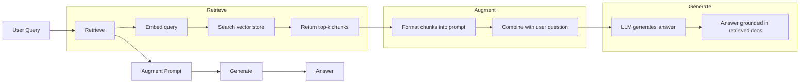
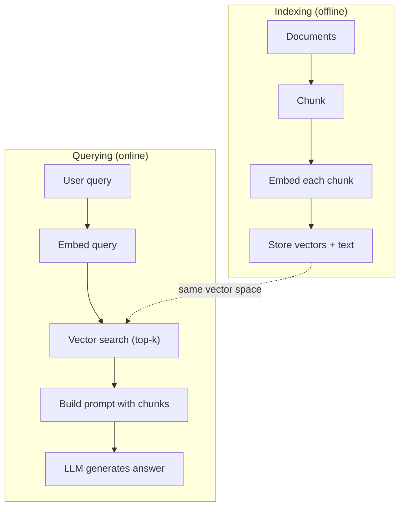

# RAG (पुनर्प्राप्त-वृद्धि पीढ़ी) 检索增强生成

> आपका LLM प्रशिक्षण कटऑफ तक सब कुछ जानता है। यह आपकी कंपनी के दस्तावेजों, आपके कोडबेस, या पिछले सप्ताह के बैठक नोटों के बारे में कुछ नहीं जानता है। RAG प्रासंगिक दस्तावेजों को प्राप्त करके और उन्हें प्रॉम्प्ट में भरकर हल करता है। यह उत्पादन एआई में सबसे अधिक तैनात पैटर्न है। यदि आप इस पाठ्यक्रम से एक चीज बनाते हैं, तो एक RAG पाइपलाइन बनाते हैं।

> **【中文解读】**LLM केवल जानता है प्रशिक्षण截止日期前的信息──RAG 检查通过相关文档并注入提示来弥补知识缺口── यह उत्पादन环境部署 में सबसे व्यापक एआई 模式 यदि आप केवल एक चीज सीखते हैं, तो就学RAG──

> **【拓展：RAG→企业AI应用】**आरएजी उद्यम में एआई की पहली पसंद हैः ज्ञान पुस्तकालय प्रश्नों के उत्तर, अनुबंध समीक्षा, तकनीकी दस्तावेज सहायक, वित्तीय अनुसंधान रिपोर्ट विश्लेषण आदि परिदृश्य आरएजी के ट्यूबों पर निर्भर करते हैं।

>  **【前置】**学本节前请先掌握:(1) चरण 11·04(Embeddings) 理解向量空间、相似度、HNSW;(2) चरण 05·23(Chunking Strategies) 理解文档切分;(3) चरण 10(LLM खरोंच से) 理解 शीघ्र 如何影响生成──本节会用到 `chromadb`या `faiss``langchain`या `llamaindex`

**Type:** Build | **类型:** 构建
**Languages:** Python | **语言:** Python
**Prerequisites:** Phase 10 (LLMs from Scratch), Phase 11 Lessons 01-05 | **前置知识:** Phase 10（从零理解 LLM）、Phase 11 Lesson 01-05
**Time:** ~90 minutes | **时间:** ~90 分钟
**Related:**चरण 5 · 23 (RAG के लिए Chunking Strategies) के लिए छह Chunking एल्गोरिदम और जब प्रत्येक जीतता है. चरण 5 · 22 (इम्बेडिंग मॉडल गहरी गोता) के लिए एम्बेडर का चयन करने के लिए. चरण 11 · 07 (उन्नत RAG) के लिए हाइब्रिड खोज, पुनः रैंक और क्वेरी परिवर्तन.**相关:**चरण 5 · 23(RAG 分块策略) परिचय छह प्रकार के分块算法及各自适用场景――चरण 5 · 22(嵌入模型深度解析) परिचय कैसे चयन करें嵌入器――चरण 11 · 07(高级 RAG) परिचय मिश्रित खोज、重排和查询转换──

## सीखने के लक्ष्य

- एक पूर्ण आरएजी पाइपलाइन बनाएंः दस्तावेज़ लोड करना, टुकड़े करना, एम्बेडिंग करना, वेक्टर स्टोरेज करना, निकालना और उत्पन्न करना
  构建完整RAG管线:文档加载、分块、嵌入、向量存储、检索、生成
- सही अनुक्रमण के साथ वेक्टर डेटाबेस (ChromaDB, FAISS, या Pinecone) का उपयोग करके अर्थपूर्ण खोज लागू करें
  उपयोग करेंः आकार डेटाबेस (ChromaDB, FAISS या Pinecone)
- समझाना कि ज्ञान आधारित अनुप्रयोगों के लिए RAG को बारीकी से समायोजित करने से क्यों अधिक पसंद किया जाता है (लागत, ताजापन, श्रेय)
  解释为什么知识接地应用更好于RAG而非微调(成本、新鲜度、归因)
- आरएजी गुणवत्ता का मूल्यांकन रिकवरी मेट्रिक्स (सटीकता, याद) और उत्पादन मेट्रिक्स (निष्ठा, प्रासंगिकता) का उपयोग करके करना
  उपयोग जाँच संकेत (उच्चतम सटीकता, याद) और उत्पादन संकेत (उच्चतम विश्वसनीयता, प्रासंगिकता)

> **【中文解读】**इस वर्ग का उद्देश्य: पूर्ण आरएजी को प्राप्त करना (Rag) (Rag) (Rag) (Rag) (Rag) (Rag) (Rag) (Rag) (Rag) (Rag) (Rag) (Rag) (Rag) (Rag) (Rag) (Rag) (Rag) (Rag) (Rag) (Rag) (Rag) (Rag) (Rag) (Rag) (Rag) (Rag) (Rag) (Rag) (Rag) (Rag) (Rag) (Rag) (Rag) (Rag) (Rag) (Rag) (Rag) (Rag) (Rag) (Rag) (Rag) (Rag) (Rag) (Rag) (Rag) (Rag) (Rag) (Rag) (Rag) (Rag) (Rag) (Rag) (Rag) (Rag) (Rag) (Rag) (Rag) (Rag) (Rag) (Rag) (Rag) (Rag) (Rag) (Rag) (Rag) (Rag) (Rag) (Rag) (Rag) (Rag) (Rag) (Rag) (Rag) (Rag) (Rag) (Rag) (Rag) (Rag) (Rag) (Rag) (Rag) (Rag) (Rag) (Rag) (Rag) (Rag) (Rag) (Rag) (Rag) (Rag) (Rag) (Rag) (Rag) (Rag) (Rag) (Rag) (Rag) (Rag) (Rag) (Rag) (Rag) (Rag) (Rag) (Rag) (Rag) (Rag) (Rag) (Rag) (Rag) (Rag) (Rag) (Rag) (Rag) (Rag) (Rag) (Rag) (Rag) (Rag) (Rag) (Rag) (R) (Rag) (R) (Rag) (Rag)


## समस्या  समस्या परिचय

आप अपनी कंपनी के लिए एक चैटबॉट बनाते हैं। एक ग्राहक पूछता है "उद्यम योजनाओं के लिए धनवापसी नीति क्या है?" एलएलएम विशिष्ट सास धनवापसी नीतियों के बारे में एक सामान्य उत्तर के साथ जवाब देता है। वास्तविक नीति, 200 पृष्ठों की आंतरिक विकी में दफन, कहता है कि उद्यम ग्राहकों को प्रो-रेटेड धनवापसी के साथ 60 दिन का खिड़का मिलता है। एलएलएम ने इस दस्तावेज़ को कभी नहीं देखा है। यह नहीं जान सकता कि यह किस पर प्रशिक्षित नहीं किया गया था।

> आप कंपनी के लिए एक चैट मशीन का निर्माण करते हैं। ग्राहक पूछते हैं कि "उद्यमी संस्करण की वापसी नीति क्या है? "LLM ने विशिष्ट SaaS वापसी नीति के बारे में सामान्य उत्तर दिया। वास्तविक नीति 200 पृष्ठों के आंतरिक विकी में निहित है, जो कहता है कि उद्यम ग्राहक के पास 60 विंडो अवधि है और अनुपात में वापसी है।

फाइन ट्यूनिंग एक समाधान है. एलएलएम लें, इसे अपने आंतरिक दस्तावेजों पर प्रशिक्षित करें, और अद्यतन मॉडल को तैनात करें। यह काम करता है लेकिन गंभीर समस्याएं हैं। फाइन ट्यूनिंग की लागत गणना में हजारों डॉलर है। एक दस्तावेज़ बदलने के तुरंत बाद मॉडल अप्रचलित हो जाता है। आपके पास यह जानने का कोई तरीका नहीं है कि मॉडल किस स्रोत से आया था। और यदि कंपनी अगले महीने एक और उत्पाद लाइन प्राप्त करती है, तो आप फिर से ठीक-ठीक करते हैं।

> 微调 एक समाधान है। लेकिन微调 को हजारों डॉलर की गणना लागत की आवश्यकता होती है।

आरएजी दूसरा समाधान है। मॉडल को छूने से बचना। जब कोई प्रश्न आता है, तो अपने दस्तावेज़ भंडार में प्रासंगिक अंशों की खोज करें, उन्हें प्रश्न से पहले के संकेत पत्र में पेस्ट करें, और मॉडल को संदर्भ के रूप में उन अंशों का उपयोग करके उत्तर देने दें। दस्तावेज़ भंडार को मिनटों में अपडेट किया जा सकता है। आप देख सकते हैं कि कौन से दस्तावेज ठीक से बरामद किए गए थे। मॉडल स्वयं कभी नहीं बदलता है। यही कारण है कि आरएजी उत्पादन में प्रमुख पैटर्न हैः यह सस्ता, ताजा, अधिक लेखा परीक्षा योग्य है, और किसी भी एलएलएम के साथ काम करता है।

> RAG एक और समाधान है। मॉडल को स्थिर रखें। जब समस्या आती है, तो अपने दस्तावेज़ संग्रह में संबंधित अनुभागों को खोजें, उन्हें सुझावों में प्रश्न के सामने चिपकाएं, मॉडल को इन अनुभागों का उपयोग ऊपर नीचे के रूप में उत्तर देने दें। यही कारण है कि RAG उत्पादन में मुख्यधारा का मॉडल हैः अधिक सस्ता, अद्यतन, अधिक लेखा परीक्षा, किसी भी LLM के लिए उपयुक्त है।

>  **【类比】**RAG 像开卷考试: छात्र (LLM) ने सभी वर्ग本背下来 (Fine-Tuning) नहीं, बल्कि एक笔记本 (笔记本) लेकर (Lessons) प्रवेश किया।

## अवधारणा का मूल अवधारणा

> **【中文解读】**RAG(Retrieval-Augmented Generation,检索增强生成) बाहरी ज्ञान भंडार को LLM 结合: user questions to from vector database search related documents to will search results inject prompt to LLM 基于检索结果生成答案──RAG 解决了 LLM के ज्ञान समय प्रभावशीलता और कल्पना संबंधी समस्या──

> **【拓展：RAG 的生产实践】**典型RAG管线:文档切分(chunking) तक嵌入生成 तक向量存储(Pinecone/Weaviate/Chroma) तक相似度检索 तक重排序(रेंकिंग) तक注入 prompt。LlamaIndex 和 LangChain सबसे लोकप्रिय RAG 框架。मेटा के अध्ययन से पता चलता है कि RAG में ज्ञान घनी प्रकार के कार्यों पर सटीकता दर में 30-50% की वृद्धि होगी。


### आरएजी पैटर्न

पूरे पैटर्न चार चरणों में फिट बैठता हैः

>  संपूर्ण मोड  चार चरण:



क्वेरी -> रिट्रीव -> बढ़ाना प्रॉम्प्ट -> जेनरेट करें. प्रत्येक RAG सिस्टम इस पैटर्न का पालन करता है। उत्पादन RAG सिस्टम के बीच अंतर प्रत्येक चरण के विवरण में हैः आप कैसे टुकड़े करते हैं, कैसे आप एम्बेड करते हैं, कैसे आप खोज करते हैं, और कैसे आप प्रॉम्प्ट का निर्माण करते हैं।

> 查询 -> 检索 -> 增强提示 -> 生成── प्रत्येक RAG 系统都遵循这个模式──生产 RAG 系统的差异在每个步骤的细节:如何分块──如何嵌入──如何搜索──如何构建提示──

> 🤔 **【困惑】**Q: क्यों सीधे पूरे दस्तावेज़ को जल्दी से भरने में नहीं? अब क्लाउड के पास 200K ऊपर नीचे विंडो, इसे नीचे रखो? A: तीन कारणः(1) **精度下降** अध्ययन दिखाता है कि जैसे कि मध्य में खो गया, लियू और अन्य 2023),LLM में लम्बे समय तक निम्न में मध्य सामग्री को वापस लेने की क्षमता में उल्लेखनीय गिरावट आई है, जो 32K से अधिक है 后准确率 में 20%+ गिरावट;**成本爆炸**200K टोकन 输入约 $3/查询，而 RAG 检索 top-5 块只占 2K tokens（$0.03);(3) **响应慢**长 शीघ्र 推理延迟数倍于短 शीघ्र。RAG 用精准检索换全量加载。

### क्यों RAG ठीक-ठाक से बेहतर है

| Concern | Fine-tuning | RAG |
|---------|------------|-----|
| Cost / 成本 | $1,000-$100,000+ per training run / 每训练 1K-100K+ 美元 | $0.01-$0.10 per query (embedding + LLM) / 每查询 0.01-0.10 美元 |
| Freshness / 新鲜度 | Stale until retrained / 重训前都过时 | Updated in minutes by re-indexing docs / 重新索引文档即可在几分钟内更新 |
| Auditability / 可审计性 | Cannot trace answer to source / 无法追溯答案来源 | Can show exact retrieved passages / 可显示精确检索段落 |
| Hallucination / 幻觉 | Still hallucinates freely / 仍自由幻觉 | Grounded in retrieved documents / 基于检索文档接地 |
| Data privacy / 数据隐私 | Training data baked into weights / 训练数据固化在权重中 | Documents stay in your vector store / 文档留在你的向量存储中 |

ठीक-ठीक समायोजन मॉडल के वजन को स्थायी रूप से बदलता है। RAG मॉडल के संदर्भ को अस्थायी रूप से बदलता है। अधिकांश अनुप्रयोगों के लिए, अस्थायी संदर्भ वह है जो आप चाहते हैं।

> 微调永久改变模型权重──RAG 临时改变模型上下文── अधिकांश अनुप्रयोगों के लिए,临时上下文就是你要的──

एक मामला जहां ठीक-ठीक ट्यूनिंग जीतता हैः जब आपको मॉडल को एक विशिष्ट शैली, स्वर या तर्क पैटर्न को अपनाने की आवश्यकता होती है जिसे अकेले आग्रह के माध्यम से प्राप्त नहीं किया जा सकता है। तथ्यगत ज्ञान प्राप्त करने के लिए, आरएजी हर बार जीतता है।

> 微调胜出的唯一情况: जब आपको मॉडल को विशिष्ट शैली, भाषा या विचार के मॉडल का उपयोग करने की आवश्यकता होती है, तो यह केवल टिप्स द्वारा प्राप्त नहीं किया जा सकता है।

> ️ **【易错点】**RAG 落地 के 3 个常见坑:**切分粒度错误**块太大(> 1024 टोकन)嵌入被稀释召回不到,块太小(< 64 टोकन)丢失上下文;起点:256-512 टोकन + 50 重叠──(2) **没做 query 改写** उपयोगकर्ता पूछता है "यह कैसे उपयोग किया जाता है?" 指代不明,向量库找不到;修复:先用LLM 把问题改写成包含上下文的完整查询──(3) **只看召回率不看准确率**Top-10 召回90% लेकिन केवल 3 条相关, मॉडल द्वारा शोर परेशान दृश्य;加交叉编码重排到前3 高质量块──

### मॉडल को सम्मिलित करना

एक एम्बेडिंग मॉडल पाठ को घने वेक्टर में परिवर्तित करता है। इसी तरह के पाठ इस उच्च आयामी स्थान में एक दूसरे के करीब वाले वेक्टर उत्पन्न करते हैं। "मैं अपना पासवर्ड कैसे रीसेट करूं?" और "मुझे अपना पासवर्ड बदलना है" कुछ शब्दों को साझा करने के बावजूद लगभग समान वेक्टर उत्पन्न करते हैं। " बिल्ली मैट पर बैठी" एक बहुत अलग वेक्टर उत्पन्न करती है।

> 嵌入型文本将文本转换为密向量── इसी प्रकार के文本 इस उच्चतम अंतरिक्ष में निकटतम विवर्तन उत्पन्न करते हैं──"密码 कैसे पुनर्स्थापित करें? " तथा" मुझे पासवर्ड में संशोधन करने की आवश्यकता है"

आम एम्बेडिंग मॉडल (2026 लाइनअप  पूर्ण विश्लेषण के लिए चरण 5 · 22 देखें):

> 常见嵌入模型(2026年阵容完整分析见Phase 5 · 22):

| Model | Dimensions | Provider | Notes |
|-------|-----------|----------|-------|
| text-embedding-3-small | 1536 (Matryoshka) | OpenAI | Best price/performance for most use cases / 大多数场景最佳性价比 |
| text-embedding-3-large | 3072 (Matryoshka) | OpenAI | Higher accuracy, truncatable to 256/512/1024 / 更高精度，可截断到 256/512/1024 |
| Gemini Embedding 2 | 3072 (Matryoshka) | Google | Top MTEB retrieval; 8K context / 顶级 MTEB 检索；8K 上下文 |
| voyage-4 | 1024/2048 (Matryoshka) | Voyage AI | Domain variants (code, finance, law) / 领域变体（代码、金融、法律）|
| Cohere embed-v4 | 1024 (Matryoshka) | Cohere | Strong multilingual, 128K context / 强多语言，128K 上下文 |
| BGE-M3 | 1024 (dense + sparse + ColBERT) | BAAI (open-weight) | Three views from one model / 一个模型三种视图 |
| Qwen3-Embedding | 4096 (Matryoshka) | Alibaba (open-weight) | Top open-weight retrieval score / 顶级开源权重检索分数 |
| all-MiniLM-L6-v2 | 384 | Open-weight (Sentence Transformers) | Prototyping baseline / 原型基线 |

इस पाठ के लिए, हम TF-IDF का उपयोग करके अपना स्वयं का सरल एम्बेडिंग बनाते हैं. यह इसलिए नहीं है क्योंकि TF-IDF उत्पादन प्रणालियों का उपयोग करता है, बल्कि इसलिए है क्योंकि यह अवधारणा को ठोस बनाता हैः पाठ अंदर जाता है, एक वेक्टर बाहर आता है, समान पाठ समान वेक्टर उत्पन्न करते हैं।

> इस वर्ग में हम TF-IDF का उपयोग करके अपनी सरल सम्मिलन का निर्माण करते हैं। यह इसलिए नहीं है क्योंकि TF-IDF उत्पादन प्रणाली के लिए उपयोग किया जाता है, बल्कि इसलिए है क्योंकि यह अवधारणाओं को विशिष्ट बनाता हैः पाठ में प्रवेश, पाठ में बाहर, समान पाठ में समान प्रवाह उत्पन्न होता है।

### वेक्टर समानता

दो वेक्टरों को देखते हुए, आप समानता को कैसे मापते हैं? तीन विकल्पः

>  दो आयामों को निर्धारित करने के लिए, समानता का माप कैसे करें?

**Cosine similarity**: दो वेक्टरों के बीच कोण का कोसिन। -1 (उपरोक्त) से 1 (समान) तक। परिमाण को अनदेखा करता है, केवल दिशा की परवाह करता है। यह RAG के लिए डिफ़ॉल्ट है।

> **余弦相似度**: दो तरंगों के 角 के余弦── सीमा -1(相反) से 1( समान)──忽略幅度, केवल关心方向── यह RAG का默认选择──

```
cosine_sim(a, b) = dot(a, b) / (||a|| * ||b||)
```

**Dot product**बड़े वेक्टरों को उच्च स्कोर मिलता है। जब परिमाण में जानकारी होती है तो उपयोगी होता है (लंबे दस्तावेज अधिक प्रासंगिक हो सकते हैं) ।

> **点积**:原始内积──较大向量更高分──幅度携带信息时有用(较长文档可能更相关) 

```
dot(a, b) = sum(a_i * b_i)
```

**L2 (Euclidean) distance**: वेक्टर स्थान में सीधी रेखा की दूरी। छोटी दूरी = अधिक समान। परिमाण अंतर के प्रति संवेदनशील।

> **L2（欧氏）距离**: द्रव्यमान अंतरिक्ष में सीधी रेखा दूरी  दूरी से  छोटे से  समान  आयाम अंतर से  संवेदनशील 

```
L2(a, b) = sqrt(sum((a_i - b_i)^2))
```

कॉसिन समानता मानक है. यह विभिन्न लंबाई के दस्तावेजों को gracefully संभालता है क्योंकि यह परिमाण द्वारा सामान्यीकरण करता है. जब कोई कहता है "वेक्टर खोज", वे लगभग हमेशा मतलब कॉसिन समानता.

> 余弦相似度是标准――它优雅处理不同长度文档,因为它按幅度归结―― जब कोई कहता है "向量搜索", लगभग हमेशा 余弦相似度 को संदर्भित करता है।

### टुकड़े टुकड़े करने की रणनीति

दस्तावेज़ एक ही वेक्टर के रूप में एम्बेड करने के लिए बहुत लंबे हैं. 50 पृष्ठों का पीडीएफ एक भयानक एम्बेडिंग का उत्पादन कर सकता है क्योंकि इसमें दर्जनों विषय शामिल हैं। इसके बजाय, आप दस्तावेजों को टुकड़ों में विभाजित करते हैं और प्रत्येक टुकड़े को अलग से एम्बेड करते हैं।

> 文档太长,不能作为单向量嵌入──50页 PDF可能产生糟糕的嵌入, क्योंकि इसमें कई विषय शामिल हैं──相反, आप文档分断成块,分别嵌入每块──

**Fixed-size chunking**एक 512 टोकन टुकड़ा 50 टोकन ओवरलैप के साथ का मतलब है कि टुकड़ा 1 टोकन 0-511, टुकड़ा 2 टोकन 462-973 है, और इतने पर है। ओवरलैप सुनिश्चित करता है कि आप एक वाक्य को एक दुर्भाग्यपूर्ण सीमा पर विभाजित नहीं करते हैं।

> **固定大小分块**: प्रत्येक N टोकन  तोड़ एक बार 简单可预测──512 टोकन 块加 50 टोकन 重叠意味着块 1 है टोकन 0-511,块 2 है टोकन 462-973, इस प्रकार का सुझाव──重叠 सुनिश्चित करें कि आप दुर्भाग्यपूर्ण परिपक्वता की सीमा में नहीं तोड़ेंगे 

**Semantic chunking**अनुच्छेद, अनुभाग या मार्कडाउन हेडर। प्रत्येक टुकड़ा अर्थ की एक सुसंगत इकाई है। इसे लागू करने के लिए अधिक जटिल है लेकिन बेहतर पुनर्प्राप्ति का उत्पादन करता है।

> **语义分块**:在自然边界分拆──段落、章节或Markdown 标题── प्रत्येक खंड एक连贯的意义单元──实现更复杂而产生更好检索──

**Recursive chunking**: सबसे पहले सबसे बड़ी सीमा पर विभाजित करने का प्रयास करें (भाग के शीर्षक) यदि कोई खंड अभी भी बहुत बड़ा है, तो पैराग्राफ सीमाओं पर विभाजित करें। यदि कोई पैराग्राफ अभी भी बहुत बड़ा है, तो वाक्य सीमाओं पर विभाजित करें। यह लैंगचेन रिकर्सिव कैरेक्टरटेक्स्ट स्प्लिटर दृष्टिकोण है और यह व्यवहार में अच्छा काम करता है।

> **递归分块**:先在最大边界(章节标题) तोड़ तोड़णं──若节仍太大,在段落边界拆分──若段落仍太大,在句子边界拆分──这是长链复发性字符文字分割方法,实践中效果好──

टुकड़े का आकार लोगों की सोच से अधिक मायने रखता हैः

> 块大小 लोगों के विचार से अधिक महत्वपूर्णः

- बहुत छोटे (64-128 टोकन): प्रत्येक टुकड़े में संदर्भ की कमी है। "यह पिछले तिमाही में 15% बढ़ गया" का अर्थ कुछ भी नहीं है जब तक कि "यह" का क्या अर्थ है, यह नहीं जानता।
  太小(64-128 टोकन): प्रति ब्लॉक अभाव上下文──"上季度增长 15%"在不知道"它"指代什么时无意义──
- बहुत बड़ा (2048+ टोकन): प्रत्येक टुकड़ा कई विषयों को कवर करता है, प्रासंगिकता को पतला करता है। जब आप राजस्व डेटा की खोज करते हैं, तो आपको एक टुकड़ा मिलता है जो राजस्व के बारे में 10% है और कर्मचारियों के बारे में 90% है।
  太大(2048+ टोकन): प्रत्येक ब्लॉक में कई विषय शामिल हैं, दुर्लभ释相关性── खोज राजस्व डेटा प्राप्त करते समय 10%  राजस्व के बारे में 90%  About human head's block──
- Sweet spot (256-512 tokens): पर्याप्त संदर्भ जो आत्मनिर्भर हो, पर्याप्त रूप से प्रासंगिक हो।
                                                                                                                                                                                                                                                                

अधिकांश उत्पादन आरएजी सिस्टम 256-512 टोकन टुकड़े का उपयोग करते हैं जिनमें 50 टोकन ओवरलैप होते हैं। एंथ्रोपिक के आरएजी दिशानिर्देश इस रेंज की सिफारिश करते हैं।

> 大多数生产 RAG 系统使用256-512 टोकन 块加50 टोकन 重叠──人类的RAG 指南推这个范围──

### वेक्टर डेटाबेस

एक बार जब आपके पास एम्बेड होते हैं, तो आपको उन्हें स्टोर करने और खोजने के लिए कहीं की आवश्यकता होती है।

> एक बार एम्बेड होने के बाद, आप उन्हें स्टोर करने और खोज करने के लिए कहीं की जरूरत हैः

| Database | Type | Best for |
|----------|------|----------|
| FAISS | Library (in-process) / 库（进程内）| Prototyping, small to medium datasets / 原型、中小数据集 |
| Chroma | Lightweight DB / 轻量 DB | Local development, small deployments / 本地开发、小型部署 |
| Pinecone | Managed service / 托管服务 | Production without ops overhead / 无运维开销的生产 |
| Weaviate | Open source DB / 开源 DB | Self-hosted production / 自托管生产 |
| pgvector | Postgres extension / Postgres 扩展 | Already using Postgres / 已在用 Postgres |
| Qdrant | Open source DB / 开源 DB | High-performance self-hosted / 高性能自托管 |

इस पाठ के लिए, हम एक सरल इन-मेमोरी वेक्टर स्टोर बनाते हैं। यह सूची में वेक्टरों को संग्रहीत करता है और क्रूर-फोर्स कॉसिन समानता खोज करता है। यह एक सपाट सूचकांक के साथ FAISS के बराबर है। यह धीमा होने से पहले शायद 100,000 वेक्टरों तक स्केल करता है। उत्पादन प्रणालियों को मिलीसेकंड में लाखों वेक्टरों की खोज करने के लिए एचएनएसडब्ल्यू जैसे करीबी पड़ोसी (एएनएन) एल्गोरिदम का उपयोग किया जाता है।

> इस वर्ग में हम सरल इनमेमोरी वेक्टर स्टोरेज का निर्माण करते हैं। यह वेक्टर सूची में संग्रहीत होता है और हिंसक अतिरिक्त स्ट्रिंग समानता खोज करता है। यह फ्लैट सूचकांक के साथ FAISS के बराबर है। यह लगभग 100,000 वेक्टर तक फैलता है और धीमा होता है। उत्पादन प्रणाली निकटतम पड़ोसी (ANN) एल्गोरिदम जैसे HNSW द्वारा मिलीसेकंड में मिलियन वेक्टर खोजती है।

### पूरी पाइपलाइन



अनुक्रमणिका चरण प्रत्येक दस्तावेज़ (या जब दस्तावेज़ अद्यतन) पर एक बार चलता है। क्वेरी चरण प्रत्येक उपयोगकर्ता अनुरोध पर चलता है। उत्पादन में, अनुक्रमणिका घंटों में लाखों दस्तावेजों को संसाधित कर सकती है। क्वेरी को एक सेकंड से कम समय में जवाब देना चाहिए।

> 索引阶段每文档运行一次 (或文档更新时) ◊查询阶段每用户请求运行一次――生产中,索引可能数小时处理百万文档――查询必须在1秒内响应――

### वास्तविक संख्याएँ

अधिकांश उत्पादन आरएजी सिस्टम इन मापदंडों का उपयोग करते हैंः

> अधिकांश उत्पादन RAG  प्रणाली इन तत्वों के साथः

- **k = 5 to 10**प्रति क्वेरी प्राप्त टुकड़े
  हर जांच जांच 5-10 ब्लॉक
- **Chunk size = 256 to 512 tokens**50 टोकन के साथ ओवरलैप
  块大小 256-512 टोकन प्लस 50 टोकन 重叠
- **Context budget**: प्रति क्वेरी प्राप्त सामग्री के 2,500-5,000 टोकन
  上下文 बजट: प्रति पूछताछ 2,500-5,000 टोकन 检索内容
- **Total prompt**: ~ 8,000-16,000 टोकन (सिस्टम प्रॉम्प्ट + निकाले गए टुकड़े + वार्तालाप इतिहास + उपयोगकर्ता क्वेरी)
  总提示: लगभग 8,000-16,000 टोकन(系统提示 + 检索块 + 对话历史 + 用户查询)
- **Embedding dimension**: 384-3072 मॉडल के अनुसार
  嵌入维度:384-3072  निर्भर मॉडल पर
- **Indexing throughput**: एपीआई एम्बेडेड के साथ प्रति सेकंड 100-1,000 दस्तावेज़
  索引吞吐量: उपयोग एपीआई 嵌入 प्रति सेकंड 100-1,000 文档
- **Query latency**: 50-200ms के लिए पुनर्प्राप्ति, 500-3000ms के लिए पीढ़ी
  查询延迟:检索 50-200ms, उत्पन्न 500-3000ms

## इसे बनाओ, इसे पूरा करो।
```figure
rag-chunking
```

## इसे बनाओ

### चरण 1: दस्तावेज़ों को टुकड़े टुकड़े करना

```python
def chunk_text(text, chunk_size=200, overlap=50):
    words = text.split()
    chunks = []
    start = 0
    while start < len(words):
        end = start + chunk_size
        chunk = " ".join(words[start:end])
        chunks.append(chunk)
        start += chunk_size - overlap
    return chunks
```

### चरण 2: TF-IDF एम्बेड

हम एक सरल एम्बेडिंग फ़ंक्शन बनाते हैं। TF-IDF (Term Frequency-Inverse Document Frequency) एक तंत्रिका एम्बेडिंग नहीं है, लेकिन यह पाठ को वेक्टरों में एक ऐसे तरीके से परिवर्तित करता है जो शब्द महत्व को कैप्चर करता है। एक दस्तावेज़ में लगातार शब्द उच्च TF प्राप्त करते हैं। कॉर्पस में दुर्लभ शब्द उच्च IDF प्राप्त करते हैं। उत्पाद एक वेक्टर देता है जहां महत्वपूर्ण, विशिष्ट शब्द उच्च मूल्य रखते हैं।

> हम सरल सम्मिलन फ़ंक्शन का निर्माण करते हैं। TF-IDF (शब्द-अधिक-विरोधी दस्तावेज़ आवृत्ति) न कि तंत्रिका सम्मिलन है, लेकिन यह शब्दों की महत्व को पकड़ने के तरीके से पाठ को वेक्टर में परिवर्तित करेगा।

> 🤔 **【困惑】**प्रश्नः टीएफ-आईडीएफ के साथ वास्तविक तंत्रिका एम्बेड किए बिना शिक्षण क्यों होता है?**零依赖**本节纯पायथन 标准库教学,不要求你注册 API或下模型;(2) **可读**TF-IDF का गणित सरल है कि यह ब्लैकबोर्ड पर लिखा जा सकता है, यह समझ में आता है कि तंत्रिकाएं ब्लैक बॉक्स में हैं;(3) **教学聚焦**本节核心是 RAG 流程(chunk→embed→retrieve→prompt→generate),嵌入器换掉流程不变──**生产环境务必换神经嵌入**TF-IDF 不理解语义, "付款失败" और "扣款不成功" TF-IDF 下完全不匹配, लेकिन तंत्रिकाएं इनका अर्थ एक ही है।

```python
import math
from collections import Counter

def build_vocabulary(documents):
    vocab = set()
    for doc in documents:
        vocab.update(doc.lower().split())
    return sorted(vocab)

def compute_tf(text, vocab):
    words = text.lower().split()
    count = Counter(words)
    total = len(words)
    return [count.get(word, 0) / total for word in vocab]

def compute_idf(documents, vocab):
    n = len(documents)
    idf = []
    for word in vocab:
        doc_count = sum(1 for doc in documents if word in doc.lower().split())
        idf.append(math.log((n + 1) / (doc_count + 1)) + 1)
    return idf

def tfidf_embed(text, vocab, idf):
    tf = compute_tf(text, vocab)
    return [t * i for t, i in zip(tf, idf)]
```

### चरण 3: कॉसिन समानता खोजें

```python
def cosine_similarity(a, b):
    dot = sum(x * y for x, y in zip(a, b))
    norm_a = math.sqrt(sum(x * x for x in a))
    norm_b = math.sqrt(sum(x * x for x in b))
    if norm_a == 0 or norm_b == 0:
        return 0.0
    return dot / (norm_a * norm_b)

def search(query_embedding, stored_embeddings, top_k=5):
    scores = []
    for i, emb in enumerate(stored_embeddings):
        sim = cosine_similarity(query_embedding, emb)
        scores.append((i, sim))
    scores.sort(key=lambda x: x[1], reverse=True)
    return scores[:top_k]
```

### चरण 4: शीघ्र निर्माण

यह वह जगह है जहां RAG में "बढ़ता" होता है। प्राप्त टुकड़ों को लें, उन्हें एक प्रॉम्प्ट में प्रारूपित करें, और प्रदान की गई संदर्भ के आधार पर उत्तर देने के लिए LLM से पूछें।

> यह आरएजी में "增强" होने की जगह है।

> ️ **【易错点】**शीघ्र 模板的 3 个坑:(1) **没说"基于上下文回答"**模型会调用自己的参数知识回答(产生幻觉),把 "केवल निम्नलिखित संदर्भ पर आधारित उत्तर"加到 शीघ्र 最前;(2) **没给"不知道就说不知道"的退路**模型宁可盲编也不承认无能为力,必须显式写"यदि संदर्भ में उत्तर नहीं है, तो कहें 'मेरे पास पर्याप्त जानकारी नहीं है'";(3) **没要求引用来源** उत्तर अनुसूचित है, लेखापरीक्षा विफल है;修复:要求模型在答案末尾加 `[Source N]`标记,让用户能点开看原文.

```python
def build_rag_prompt(query, retrieved_chunks):
    context = "\n\n---\n\n".join(
        f"[Source {i+1}]\n{chunk}"
        for i, chunk in enumerate(retrieved_chunks)
    )
    return f"""Answer the question based ONLY on the following context.
If the context doesn't contain enough information, say "I don't have enough information to answer that."

Context:
{context}

Question: {query}

Answer:"""
```

### चरण 5: पूर्ण आरएजी पाइपलाइन

```python
class RAGPipeline:
    def __init__(self):
        self.chunks = []
        self.embeddings = []
        self.vocab = []
        self.idf = []

    def index(self, documents):
        all_chunks = []
        for doc in documents:
            all_chunks.extend(chunk_text(doc))
        self.chunks = all_chunks
        self.vocab = build_vocabulary(all_chunks)
        self.idf = compute_idf(all_chunks, self.vocab)
        self.embeddings = [
            tfidf_embed(chunk, self.vocab, self.idf)
            for chunk in all_chunks
        ]

    def query(self, question, top_k=5):
        query_emb = tfidf_embed(question, self.vocab, self.idf)
        results = search(query_emb, self.embeddings, top_k)
        retrieved = [(self.chunks[i], score) for i, score in results]
        prompt = build_rag_prompt(
            question, [chunk for chunk, _ in retrieved]
        )
        return prompt, retrieved
```

### चरण 6: पीढ़ी (अनुकरण)

उत्पादन में, यह है जहां आप LLM एपीआई कहते हैं. इस पाठ के लिए, हम पुनर्प्राप्त संदर्भ से सबसे प्रासंगिक वाक्य निकालने से पीढ़ी का अनुकरण.

> इस कोर्स में हम सबसे अधिक प्रासंगिक वाक्यों को चेकआउट से नीचे से उठाकर तैयार करते हैं।

```python
def simple_generate(prompt, retrieved_chunks):
    query_words = set(prompt.lower().split("question:")[-1].split())
    best_sentence = ""
    best_score = 0
    for chunk in retrieved_chunks:
        for sentence in chunk.split("."):
            sentence = sentence.strip()
            if not sentence:
                continue
            words = set(sentence.lower().split())
            overlap = len(query_words & words)
            if overlap > best_score:
                best_score = overlap
                best_sentence = sentence
    return best_sentence if best_sentence else "I don't have enough information."
```

## इसे फ्रेमवर्क के साथ लागू करें

एक वास्तविक एम्बेडिंग मॉडल और LLM के साथ, कोड मुश्किल से बदलता हैः

> वास्तविक एम्बेड मॉडल और LLM, कोड लगभग अपरिवर्तितः

```python
from openai import OpenAI

client = OpenAI()

def embed(text):
    response = client.embeddings.create(
        model="text-embedding-3-small",
        input=text
    )
    return response.data[0].embedding

def generate(prompt):
    response = client.chat.completions.create(
        model="gpt-4o-mini",
        messages=[{"role": "user", "content": prompt}],
        temperature=0
    )
    return response.choices[0].message.content
```

या मानव के साथः

> या मानव के साथः

```python
import anthropic

client = anthropic.Anthropic()

def generate(prompt):
    response = client.messages.create(
        model="claude-sonnet-5",
        max_tokens=1024,
        messages=[{"role": "user", "content": prompt}]
    )
    return response.content[0].text
```

पाइपलाइन एक ही है. एम्बेडिंग फ़ंक्शन को स्विच करें. जनरेशन फ़ंक्शन को स्विच करें. निकालने का तर्क, टुकड़ा करना, शीघ्र निर्माण - सभी समान हैं चाहे आप किस मॉडल का उपयोग करें।

> 管线相同──替换嵌入函数──替换生成函数──检索逻辑、分块、提示构造无论用哪些模型都完全相同──

पैमाने पर वेक्टर भंडारण के लिए, क्रूर बल खोज को उचित वेक्टर डेटाबेस से प्रतिस्थापित करेंः

>  बड़े पैमाने पर वेटमेंट स्टोरेज के लिए, उपयुक्त वेटमेंट डेटाबेस के साथ बदला हिंसा खोजः

```python
import chromadb

client = chromadb.Client()
collection = client.create_collection("my_docs")

collection.add(
    documents=chunks,
    ids=[f"chunk_{i}" for i in range(len(chunks))]
)

results = collection.query(
    query_texts=["What is the refund policy?"],
    n_results=5
)
```

क्रोमा आंतरिक रूप से एम्बेडिंग को संभालता है (यह डिफ़ॉल्ट रूप से ऑल-मिनीएलएम-एल 6-वी 2 का उपयोग करता है) और स्थानीय डेटाबेस में वेक्टरों को संग्रहीत करता है। एक ही पैटर्न, अलग नल।

> Chroma 内部处理嵌入式 (默认使用全-MiniLM-L6-v2)并将向量存在本地数据库──相同模式,不同管道──

## इसे भेजें उत्पाद

इस पाठ से उत्पन्न होता हैः
- `outputs/prompt-rag-architect.md`-- विशिष्ट उपयोग मामलों के लिए आरएजी प्रणालियों के डिजाइन के लिए एक संकेत
  विशिष्ट उपयोग के लिए RAG 系统 के सुझाव डिजाइन
- `outputs/skill-rag-pipeline.md`-- एक कौशल जो एजेंटों को सिखाता है कि कैसे निर्माण और डीबग RAG पाइपलाइन
  प्रशिक्षक  कैसे निर्माण और调试 RAG 管线 के कौशल

## अभ्यास विषय

1. TF-IDF एम्बेडमेंट को सरल शब्द-बैक-ऑफ-वर्ड दृष्टिकोण (बाइनरीः 1 यदि शब्द मौजूद है, 0 यदि नहीं) के साथ प्रतिस्थापित करें। नमूना दस्तावेजों पर निकासी की गुणवत्ता की तुलना करें। TF-IDF को बेहतर प्रदर्शन करना चाहिए क्योंकि यह दुर्लभ शब्दों का वजन अधिक है।
   प्रयोग सरल शब्द के लिए प्रयोग किया जाता है, क्योंकि यह दुर्लभ शब्दों को अधिक वजन देता है।

2. टुकड़े के आकारों के साथ प्रयोग करेंः एक ही दस्तावेज़ सेट पर 50, 100, 200, और 500 शब्दों का प्रयास करें। प्रत्येक आकार के लिए, समान 5 प्रश्न चलाएं और गणना करें कि शीर्ष 3 में कितने संबंधित टुकड़े लौटते हैं। उस मीठे बिंदु को ढूंढें जहां पुनर्प्राप्ति गुणवत्ता चरम पर है।
   实验块大小: एक ही दस्तावेज़ संग्रह पर 50、100、200、500 शब्द प्रयास करें। प्रत्येक बड़े काम में 5 प्रश्न पूछे जाते हैं।

3. प्रत्येक टुकड़े में मेटाडेटा जोड़ें (स्रोत दस्तावेज़ नाम, टुकड़े की स्थिति) स्रोत श्रेय शामिल करने के लिए प्रॉम्प्ट टेम्पलेट को संशोधित करें ताकि LLM इसके स्रोतों का उल्लेख करे।
   给每块添加元数据(源文档名、块位置) 修改提示模板包含源归因,让LLM 引用其来源──

4. एक सरल मूल्यांकन करेंः 10 प्रश्न-उत्तर जोड़े दिए जाने पर, प्रत्येक प्रश्न को आरएजी पाइपलाइन के माध्यम से चलाएं, और मापें कि प्राप्त टुकड़ों का प्रतिशत उत्तर में कितना है। यह k पर पुनर्प्राप्तिकरण याद है।
   实现简单评估:给定10个问答对,将每一个问题通过RAG管线运行,测量检索块中包含答案的百分比――这是检索 recall@k。

5. बातचीत के लिए जागरूक आरएजी पाइपलाइन बनाएंः पिछले 3 एक्सचेंजों का इतिहास बनाए रखें और उन्हें प्राप्त टुकड़ों के साथ प्रॉम्प्ट में शामिल करें। मूल्य निर्धारण के बारे में पूछने के बाद "उद्यम के बारे में क्या? " जैसे अनुवर्ती प्रश्नों के साथ परीक्षण करें।
   构建对话感知 RAG 管线:维护最近3次交换历史,与检索块一起包含在提示中──使用跟进问题如"企业版呢?"(询问定价后)测试──

## कीवर्ड्स  शब्द खोज तालिका

| Term | What people say | What it actually means | 中文释义 |
|------|----------------|----------------------|---------|
| RAG | "AI that reads your docs" | Retrieve relevant documents, paste them into the prompt, and generate an answer grounded in those documents | RAG：检索相关文档、粘贴进提示、基于这些文档生成接地答案 |
| Embedding | "Convert text to numbers" | A dense vector representation of text where similar meanings produce similar vectors | 嵌入：文本的稠密向量表示，相似含义产生相似向量 |
| Vector database | "Search engine for AI" | A data store optimized for storing vectors and finding the nearest neighbors by similarity | 向量数据库：为存储向量和按相似度找近邻优化的数据存储 |
| Chunking | "Split docs into pieces" | Breaking documents into smaller segments (typically 256-512 tokens) so each can be embedded and retrieved independently | 分块：将文档拆为更小段（通常 256-512 token）以便独立嵌入和检索 |
| Cosine similarity | "How similar are two vectors" | The cosine of the angle between two vectors; 1 = identical direction, 0 = orthogonal, -1 = opposite | 余弦相似度：两向量夹角余弦；1=同向，0=正交，-1=反向 |
| Top-k retrieval | "Get the k best matches" | Return the k most similar chunks to the query from the vector store | Top-k 检索：从向量存储返回与查询最相似的 k 个块 |
| Context window | "How much text the LLM can see" | The maximum number of tokens the LLM can process in a single request; retrieved chunks must fit within this | 上下文窗口：LLM 单次请求能处理的最大 token 数；检索块必须放得下 |
| Augmented generation | "Answer using given context" | Generating a response using retrieved documents as context rather than relying solely on trained knowledge | 增强生成：用检索文档作为上下文生成响应，而非仅依赖训练知识 |
| TF-IDF | "Word importance scoring" | Term Frequency times Inverse Document Frequency; weights words by how distinctive they are within a corpus | TF-IDF：词频乘逆文档频率；按词在语料库中的独特性加权 |
| Indexing | "Preparing docs for search" | The offline process of chunking, embedding, and storing documents so they can be searched at query time | 索引：分块、嵌入、存储文档的离线过程，以便查询时搜索 |

## आगे पढ़ना 延伸閱讀

- लुईस एट एल., "ज्ञान-गहन एनएलपी कार्यों के लिए पुनर्प्राप्त-बढ़ती पीढ़ी" (2020) -- फेसबुक एआई रिसर्च से मूल आरएजी पेपर जिसने पुनर्प्राप्त-फिर-जनित पैटर्न को औपचारिक रूप दिया
  लुईस 等, "ज्ञान-गहन एनएलपी कार्यों के लिए पुनर्प्राप्ति-उन्नत पीढ़ी" (Retrieval-Augmented Generation for Knowledge-Intensive NLP Tasks)
- मानव जाति के आरएजी दस्तावेज (docs.anthropic.com) - टुकड़े के आकार, शीघ्र निर्माण और मूल्यांकन के लिए व्यावहारिक दिशा-निर्देश
  मानववादी आरएजी 文档块大小、提示构建和评估的实用指南
- पाइनकोन लर्निंग सेंटर, "आरएजी क्या है?" -- उत्पादन विचार के साथ आरएजी पाइपलाइन की स्पष्ट दृश्य व्याख्याएं
  पाइनकोन शिक्षण केंद्र RAG 管线的清晰可视化解释, उत्पादन योग्यता सहित
- वाक्य-BERT: Reimers & Gurevych (2019) -- सभी-MiniLM एम्बेडिंग मॉडल के पीछे का पेपर, जो बताता है कि अर्थिक समानता के लिए द्वि-संकेतक को कैसे प्रशिक्षित किया जाए
  वाक्य-BERT: Reimers & Gurevych(2019)all-MiniLM 嵌入模型背后的论文, प्रदर्शन कैसे लिए语义相似度 प्रशिक्षण द्वि编码器
- [Karpukhin et al., "Dense Passage Retrieval for Open-Domain Question Answering" (EMNLP 2020)](https://arxiv.org/abs/2004.04906)-- डीपीआर पेपर जो साबित किया घने द्वि-संकेतक निकालने BM25 पर खुले डोमेन QA और सेट पैटर्न के लिए आधुनिक RAG निकालने.
  कार्पुकिन 等, "डीपीआर"(EMNLP 2020)  प्रमाण密双编码器检索在开放域 QA 上胜过 BM25 的 DPR 论文,设定了现代RAG 检索器的模式──
- [LlamaIndex High-Level Concepts](https://docs.llamaindex.ai/en/stable/getting_started/concepts.html)-- RAG पाइपलाइन बनाने के दौरान जानने के लिए मुख्य अवधारणाएंः डेटा लोडर, नोड पार्सर, सूचकांक, रिट्रीवर, प्रतिक्रिया संश्लेषक।
  LlamaIndex उच्च श्रेणी अवधारणा निर्माण RAG 管线需要知的主要概念: डेटा लोडर、节点解析器、索引、检索器、响应合成器──
- [LangChain RAG tutorial](https://python.langchain.com/docs/tutorials/rag/)-- विपरीत स्वाद के संग्राहक; श्रृंखला-के-runnables दृश्य एक ही प्राप्त-फिर-जनित पैटर्न।
  LangChain RAG शिक्षण विभिन्न प्रकार के संयोजक; समान पहले जांच के बाद उत्पन्न मॉडल के लिए एक संचालित श्रृंखला दृश्य
