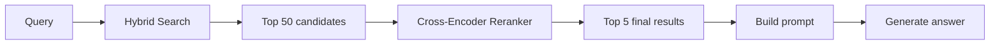
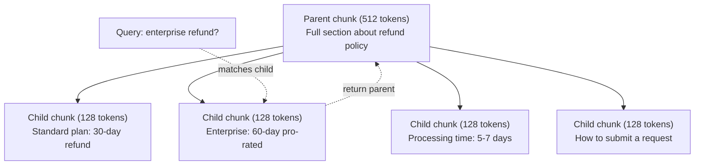
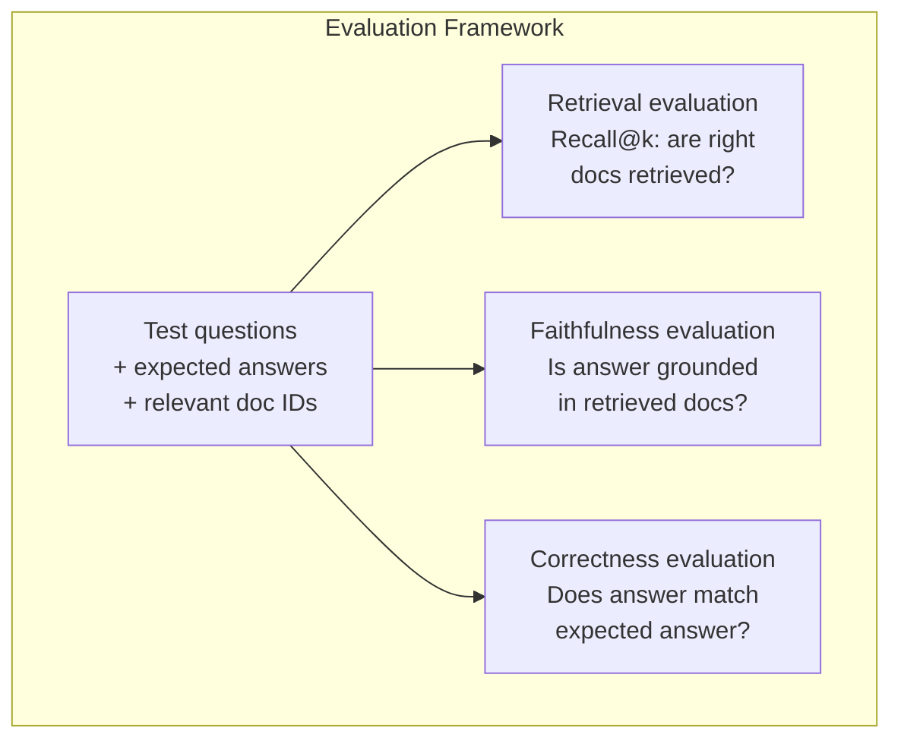

# उन्नत RAG (चुनकिंग, रैंकिंग, हाइब्रिड खोज)  उच्च श्रेणी RAG:分块、重排序和混合搜索

> मूल RAG शीर्ष-के सबसे समान टुकड़ों को प्राप्त करता है। यह सरल प्रश्नों के लिए काम करता है। यह मल्टी-हॉप तर्क, अस्पष्ट प्रश्नों और बड़े कॉर्पो के लिए टूट जाता है। उन्नत RAG 10 दस्तावेजों पर काम करने वाले डेमो और 10 मिलियन पर काम करने वाले सिस्टम के बीच अंतर है।

> **【中文解读】**基础 RAG 检索 top-k 相似块, सरल प्रश्नों के लिए उपयुक्त है। लेकिन कई तर्कों में फूट पड़ती है।

> **【拓展：高级RAG→金融场景】**金融研报分析需要多跳推理 (跨文档关联数据),混合搜索 (混合搜索) (混合搜索) (混合搜索) (混合搜索) (混合搜索) (混合搜索) (混合搜索) (混合搜索) (混合搜索) (混合搜索) (混合搜索) (混合搜索) (混合搜索) (混合搜索) (混合搜索) (混合搜索) (混合搜索) (混合搜索) (混合搜索) (混合搜索) (混合搜索) (混合搜索) (混合搜索) (混合搜索) (混合搜索) (混合搜索) (混合搜索) (混合搜索) (混合搜索) (混合搜索) (混合搜索) (混合搜索) (混合搜索) (混合搜索) (混合搜索) ().

>  **【前置】**学本节前 कृपया पहले समझेंःPhase 11·06(RAG)  समझना आधार RAG 流程。本节是其进阶,假设你已经能写出 chunk→embed→retrieve→prompt→generate 的最小可用RAG──会用 `chromadb``rank_bm25``sentence-transformers`या `cohere`एपीआई को पुनः रैंक करें

**Type:** Build | **类型:** 构建
**Languages:** Python | **语言:** Python
**Prerequisites:** Phase 11, Lesson 06 (RAG) | **前置知识:** Phase 11 · 06 (RAG)
**Time:** ~90 minutes | **时间:** ~90 分钟
**Related:**चरण 5 · 23 (RAG के लिए Chunking Strategies) सभी छह Chunking एल्गोरिदम को कवर करता है  पुनरावर्ती, अर्थपूर्ण, वाक्य, माता-पिता दस्तावेज़, देर से Chunking, संदर्भिक पुनर्प्राप्ति  वेक्टरा / मानव मानकों के साथ। यह पाठ शीर्ष पर बना हैः हाइब्रिड खोज, पुनः रैंक, क्वेरी परिवर्तन। ➡**相关:**चरण 5 · 23(RAG 分块策略) को कवर करना सभी छह अलग-अलग अलग-अलग ब्लॉक एल्गोरिदम归归、语义、句子、父文档、晚分块、上下文检索含 भेक्टर/人类基准──本课在其上构建:混合搜索、重排、查询转换──

## सीखने के लक्ष्य

- दस्तावेज संरचना और संदर्भ को संरक्षित करने के लिए उन्नत टुकड़े टुकड़े करने की रणनीतियों (सिमेंटिक, पुनरावर्ती, माता-पिता-बच्चा) को लागू करना
  实现保留文档结构和上下文的高级分块策略 (शब्द义、递归、父子)
- एक हाइब्रिड खोज पाइपलाइन का निर्माण करें जो बीएम 25 कीवर्ड को अर्थिक वेक्टर खोज और क्रॉस-एन्कोडर रीरैंकर के साथ मिलाता है
  构建结合 BM25 关键词匹配、语义向量搜索和交叉编码器重排器的混合搜索管线
- अस्पष्ट या जटिल प्रश्नों पर पुनर्प्राप्ती में सुधार के लिए क्वेरी परिवर्तन तकनीक (HyDE, मल्टी-क्वेरी, स्टेप-बैक) लागू करें
  应用查询转换技术(HyDE、多查询、step-back) सुधारित模糊 या जटिल समस्याओं का पता लगाना
- सामान्य RAG विफलताओं का निदान और समाधानः गलत टुकड़ा निकाला गया, संदर्भ में नहीं उत्तर, बहु-हॉप तर्क टूटना
  诊断和修复常见 RAG 失败:检索错块、答案不上下文中、多跳推理崩

> **【中文解读】**इस वर्ग का उद्देश्यः उच्च आरएजी  तकनीक  जांच पुनः लेखन 混合 जांच  पुनः क्रमबद्ध  स्व अनुकूलन जांच 多跳推理── ये तकनीकें समाधान के आधार पर आरएजी  जटिल जांच पर सीमाओं को समझना 

>  **【类比】**基础 RAG 像新手图书管理员你说"营收",他按字面找带"营收"的书──高级 RAG 像资深管理员:(1) **Query 改写**आप कहते हैं "营收",他翻译成"上一季度财报中的收入数字"再找;(2) **混合搜索**既翻主题目录 (语义)又翻关键词索引 (BM25) ,两边结果合并;**重排**召回100本后,仔细看每本摘要排序挑出最相关的5本(क्रॉस-एन्कोडर) 

> ️ **【易错点】**उच्च श्रेणी RAG के 3 个坑:(1) **HyDE 用错场景**HyDE(LLM को पूर्व उत्पन्न करने के लिए फ्यूज्युसेएट जवाब पुनः उपयोग उत्तर जांच)**重排模型选错** द्वि-संकेतक के साथ क्रॉस-संकेतक रैंकर (जैसे BGE-M3) स्वंय重排自己), वास्तविक क्रॉस-संकेतक की सटीकता वृद्धि नहीं मिली; विशेष BGE-renaker-v2、Cohere Rerank──)**混合搜索没归一化**BM25 分数 0-30,向量相似度 0-1, सीधे相加向量永远被淹没; परस्पर रैंक संलयन (RRF) या मिन-मैक्स 归一化──

> 🤔 **【困惑】**प्रश्नः 多跳推理该让模型做还是检查做? A: 检查做. 让模型在快速里推理,每跳检查一次,把上一跳结果作为下一跳查询的输入. उदाहरण:"哪个团队满意度升高最大?"→先检查"所有团队满意度分数"→让模型比较→得出"A 团队"→再检查"A 团队详细"――一跳一次检查,避免一次性塞所有可能相关文档──


## समस्या  समस्या परिचय

आप पाठ 06 में एक बुनियादी RAG पाइपलाइन बनाया है. यह एक छोटे से corpus पर सीधे प्रश्नों के लिए काम करता है. अब इन कोशिश करेंः

> आप कक्षा 06 में एक आधारभूत आरएजी 流水线 का निर्माण करते हैं। यह छोटे भाषी भंडार पर सीधे मुद्दे पर प्रभावी है।

**Ambiguous query**"पिछली तिमाही में राजस्व क्या था? " अर्थशास्त्र खोज राजस्व रणनीति, राजस्व अनुमानों और राजस्व वृद्धि पर सीएफओ के विचारों के बारे में टुकड़े देता है। सभी अर्थशास्त्र में "राजस्व" शब्द के समान हैं। कोई भी वास्तविक संख्या नहीं है। सही टुकड़ा कहता है "$47.2M in Q3 2025" but uses the word "earnings" instead of "revenue." The embedding model thinks "revenue strategy" is closer to the query than "Q3 earnings were $47.2M. "

> **模糊查询**:"पिछले तिमाही में राजस्व कितना है?" शब्द खोज में राजस्व रणनीति, राजस्व पूर्वानुमान और राजस्व वृद्धि पर सीएफओ के विचार के बारे में एक टुकड़ा आया है।

**Multi-hop question**: "कौन सी टीम में ग्राहक संतुष्टि स्कोर में सबसे अधिक सुधार हुआ है?" इसके लिए प्रत्येक टीम के लिए संतुष्टि स्कोर ढूंढना, उनकी तुलना करना और अधिकतम की पहचान करना आवश्यक है। कोई भी टुकड़ा उत्तर नहीं रखता है। जानकारी टीम रिपोर्टों में बिखरी हुई है।

> **多跳问题**:"कौन सी टीम का ग्राहक संतुष्टि रेटिंग सबसे ज्यादा बढ़ता है? " इसके लिए प्रत्येक टीम का संतुष्टि रेटिंग ढूंढना, उनकी तुलना करना, और अधिकतम मूल्य को पहचानना आवश्यक है।

**Large corpus problem**आपके पास 2 मिलियन टुकड़े हैं। सही उत्तर टुकड़े # 1,847,293 में है। आपका शीर्ष 5 निकालना टुकड़े # 14, # 89,201, # 1,200,000, # 44, और # 901,333 खींचता है। एम्बेडिंग स्थान में बंद है, लेकिन कोई भी उत्तर नहीं है। इस पैमाने पर, निकटतम पड़ोसी खोज पर्याप्त त्रुटि पेश करती है कि प्रासंगिक परिणाम शीर्ष-के से बाहर धकेल दिए जाते हैं।

> **大型语料库问题**: आपके पास 2 मिलियन से अधिक सेगमेंट हैं। सही उत्तर 1,847,293 सेगमेंट में है। आपके शीर्ष 5 सेगमेंटों में से कुछ अन्य सेगमेंटों को बाहर निकाला गया है। इस पैमाने पर, निकटतम पड़ोसी खोजों में पर्याप्त त्रुटि हुई है।

मूल RAG विफल रहता है क्योंकि वेक्टर समानता प्रासंगिकता के समान नहीं है। एक टुकड़ा उत्तर देने के लिए उपयोगी होने के बिना एक प्रश्न के समान अर्थपूर्ण रूप से हो सकता है। उन्नत आरएजी चार तकनीकों के साथ इस मुद्दे को संबोधित करता हैः हाइब्रिड खोज (कीवर्ड मिलान जोड़ें), पुनः रैंक (उम्मीदवारों को अधिक सावधानी से स्कोर करें), क्वेरी परिवर्तन (खोज से पहले क्वेरी को ठीक करें), और बेहतर चश्मांकन (सही ग्रेनेलरी में पुनर्प्राप्त करें) ।

> 基础 RAG 失败是因为向量相似度不等于相关性──高级 RAG 用四种技术解决:混合搜索(添加关键词匹配)、重排序(更仔细评分候选人)、查询转换(搜索前修复查询) 和更好的分块(以正确的粒度检查)──

## अवधारणा का मूल अवधारणा

> **【中文解读】**उच्च श्रेणी RAG 技术解决基础 RAG की सीमाएँ:查询重写将模糊问题转转为精确查询) 混合检索(向量 + 关键词) 重排序(क्रॉस-एन्कोडर 精排) 自适应检索(判断是否需要检索) 多跳推理(分解复杂问题为多次检索) 

> **【拓展：高级 RAG 的工业应用】**उत्पादन स्तर RAG  प्रणाली में आमतौर पर शामिल हैंः पूछताछ intetuo分类 तक पूछताछ विस्तार/ पुनः लिखना तक मिश्रित जांच(BM25 + 向量) तक क्रॉस-एन्कोडर तक पुनः क्रमबद्ध करने तक ऊपर नीचे नीचे संपीड़ित करने तक उत्तर उत्पन्न करने के लिए + 引用标注。Notion AI、Perplexity आदि उत्पादों ने उन्नत RAG 技术── स्व-RAG 让模型自己决定何时检索──


### हाइब्रिड खोजः अर्थ + कीवर्ड

अर्थपूर्ण खोज (वेक्टर समानता) अर्थ को समझने में अच्छा है। "मैं अपनी सदस्यता कैसे रद्द करूं?" "आपकी योजना को समाप्त करने के लिए कदम" से मेल खाता है, भले ही वे कोई शब्द साझा नहीं करते हैं। लेकिन यह सटीक मेल नहीं खाता है। "त्रुटि कोड E-4021" "E-4021" युक्त एक टुकड़े से मेल नहीं खा सकता है यदि एम्बेडिंग मॉडल इसे शोर के रूप में मानता है।

> 语义搜索(向量相似度) 如何取消订阅?匹配"终止计划的步骤"虽然不共享单词──但它错过精确匹配──"错误码 E-4021"可能不匹配包含"E-4021"的块,如果嵌入模型将视为噪音──

Keyword search (BM25) इसके विपरीत है. यह सटीक मैचों में उत्कृष्ट है. "E-4021" एकदम सही है. लेकिन "मेरी सदस्यता रद्द करें" शून्य परिणाम देता है यदि दस्तावेज़ कहता है "अपनी योजना समाप्त करें।"

> 关键词搜索(BM25)相反──它擅长精确匹配──"E-4021"完美匹配──但"取消我的订阅"如果文档说"终止你的计划"则返回零结果──

हाइब्रिड खोज दोनों चलाता है, फिर परिणामों को मिलाता है।

> 混合搜索同时运行两者,然后合并结果──

**BM25**(बेस्ट मैचिंग 25) मानक खोजशब्द खोज एल्गोरिथ्म है। यह 1990 के दशक से खोज इंजन की रीढ़ की हड्डी रही है। सूत्रः

> **BM25**(Best Matching 25) है मानक कीवर्ड खोज एल्गोरिदम। 1990 के दशक से ही यह खोज इंजन का आधार है।

```
BM25(q, d) = sum over terms t in q:
    IDF(t) * (tf(t,d) * (k1 + 1)) / (tf(t,d) + k1 * (1 - b + b * |d| / avgdl))
```

जहां tf(t,d) दस्तावेज़ d में t की आवृत्ति है, IDF(t) दस्तावेज़ आवृत्ति का विपरीत है, ➡d यह दस्तावेज़ लंबाई है, avgdl औसत दस्तावेज़ लंबाई है, k1 आवृत्ति संतृत्ति को नियंत्रित करता है (पूर्वनिर्धारित 1.2), और b लंबाई सामान्यीकरण (पूर्वनिर्धारित 0.75) को नियंत्रित करता है।

> उनमें से tf(t,d) है t 在文档 d 中的词频,IDF(t) है逆文档频率,

सामान्य शब्दों मेंः BM25 दस्तावेजों को उच्चतर स्कोर करता है जब वे क्वेरी शब्द (विशेष रूप से दुर्लभ) होते हैं, लेकिन दोहराए गए शब्दों के लिए घटते रिटर्न के साथ। "राजस्व" शब्द के साथ एक दस्तावेज 50 गुना अधिक प्रासंगिक नहीं है।

> 简而言之:BM25 给包含查询词 (विशेष रूप से दुर्लभ शब्द) के दस्तावेज अधिक उच्च分, लेकिन重复词有递减收益──包含"收入"50 बार के दस्तावेज में केवल एक बार के 50 गुना से संबंधित नहीं हैं──

### पारस्परिक रैंक फ्यूजन (आरआरएफ)

आपके पास दो रैंक सूची हैंः वेक्टर खोज से एक, BM25 से एक। आप उन्हें कैसे जोड़ते हैं? पारस्परिक रैंक फ्यूजन मानक दृष्टिकोण है।

> आप दो क्रमबद्ध सूची हैः एक से आया है द्रव्यमान खोज, एक से आया है BM25.

```
RRF_score(d) = sum over rankings R:
    1 / (k + rank_R(d))
```

जहां k एक स्थिर (आमतौर पर 60) है जो शीर्ष रैंक वाले परिणाम को हावी होने से रोकता है।

> इनमें से k है सामान्य संख्या (आमतौर पर 60), क्रमशः प्रथम स्थान पर आने से रोकने के लिए।

वेक्टर खोज में #1 और BM25 में #5 पर रैंक किया गया एक दस्तावेज़ प्राप्त करता हैः 1/(60+1) + 1/(60+5) = 0.0164 + 0.0154 = 0.0318

वेक्टर खोज में #3 और BM25 में #2 स्थान पर एक दस्तावेज़ प्राप्त करता हैः 1/(60+3) + 1/(60+2) = 0.0159 + 0.0161 = 0.0320

> में तरक्की खोज排名第一、BM25 排名第五的文档得:1/(60+1) + 1/(60+5) = 0.0164 + 0.0154 = 0.0318。 में तरक्की खोज排名第三、BM25 排名第二的文档得:1/(60+3) + 1/(60+2) = 0.0159 + 0.0161 = 0.0320。

RRF स्वाभाविक रूप से दोनों संकेतों को संतुलित करता है। दोनों सूचियों में उच्च रैंक वाला एक दस्तावेज़ सबसे अच्छा स्कोर प्राप्त करता है। एक दस्तावेज़ जो एक सूची में #1 रैंक करता है लेकिन दूसरे से अनुपस्थित है, उसे मध्यम स्कोर मिलता है। यह मजबूत है क्योंकि यह रैंक का उपयोग करता है, कच्चे स्कोर नहीं, इसलिए दोनों प्रणालियों के बीच स्कोर वितरण में अंतर मायने नहीं रखता है।

> आरआरएफ प्राकृतिक संतुलन दो संकेतों में से एक है। दो सूचियों में से प्रत्येक में उच्चतम अंक प्राप्त होता है। एक सूची में प्रथम स्थान पर है, लेकिन दूसरी सूची में अनुपस्थित दस्तावेजों में मध्य अंक प्राप्त होता है। यह बहुत स्थिर है, क्योंकि यह रैंकिंग के साथ मूल अंक नहीं है, इसलिए दो प्रणालियों के अंक वितरण में अंतर महत्वपूर्ण नहीं है।

### रैंक बदलना

रिट्रीवल (वेक्टर, कीवर्ड या हाइब्रिड हो) तेज़ लेकिन अस्पष्ट है। यह द्वि-एन्कोडर का उपयोग करता हैः क्वेरी और प्रत्येक दस्तावेज़ को स्वतंत्र रूप से एम्बेड किया जाता है, फिर तुलना की जाती है। एम्बेडमेंट को एक बार गणना की जाती है और कैश किया जाता है। यह लाखों दस्तावेजों तक स्केल करता है।

> 检索(无论向量、关键词还是混合)快但不精确──它使用双编码器:查询和每个文档独立嵌入,然后比较──嵌入计算一次并缓存──这可扩展到百万文档──

रैंकिंग क्रॉस-एन्कोडर का उपयोग करती हैः क्वेरी और एक उम्मीदवार दस्तावेज़ को एक मॉडल में एक साथ खिलाया जाता है जो प्रासंगिकता स्कोर का उत्पादन करता है। मॉडल दोनों पाठों को एक साथ देखता है और उनके बीच बारीक- बारीक बातचीत को कैप्चर कर सकता है। एक क्रॉस-एन्कोडर यह समझ सकता है कि "Q3 में कमाई क्या थी? "एक टुकड़े के लिए बहुत प्रासंगिक है जिसमें "Q3 में $ 47.2M" है, भले ही एक द्वि-एन्कोडर कनेक्शन को याद कर दिया गया हो।

> क्वेज के साथ पारस्परिक संपादकः क्वेज और उम्मीदवार दस्तावेज़ एक साथ एक आउटपुट संबंधितता अनुपात के मॉडल में प्रवेश करें। मॉडल एक साथ दो खंडों को देखता है, जो उनके बीच की बारीकियों को पकड़ सकता है। पारस्परिक संपादक "Q3  लाभ कितना है? " को समझ सकता है।

व्यापारः क्रॉस-एन्कोडर द्वि-एन्कोडर की तुलना में 100-1000 गुना धीमी होती है क्योंकि वे क्वेरी-दस्तावेज जोड़े को संयुक्त रूप से संसाधित करते हैं। आप एक मिलियन दस्तावेजों के लिए क्रॉस-एन्कोडर स्कोर की पूर्व-गणना नहीं कर सकते। समाधानः एक बड़ा उम्मीदवार सेट (हाइब्रिड खोज से शीर्ष-50) प्राप्त करें, फिर अंतिम शीर्ष-5 प्राप्त करने के लिए क्रॉस-एन्कोडर के साथ फिर से रैंक करें।

> 权衡:交叉编码器 दोहरे编码器 से 100-1000 गुना धीमा है, क्योंकि यह संयुक्त प्रसंस्करण पूछताछ-लेख पर. . .



सामान्य पुनर्गठन मॉडल (2026 लाइनअप):

> 常见重排模型(2026 साल阵容):

- Cohere Rerank 3.5: प्रबंधित एपीआई, बहुभाषी, मिश्रित कॉर्पो पर सर्वश्रेष्ठ रिकॉल लाभ
  托管 API、多语言、混合语料 पर अधिकतम पुनः लाभ
- यात्रा पुनः रैंक-2.5: प्रबंधित एपीआई, होस्ट किए गए विकल्पों में सबसे कम विलंबता
  托管 API、托管选项 में न्यूनतम देरी
- Jina-Reranker-v2 बहुभाषीः ओपन-वेट, 100+ भाषाएं
  开源权重、100+ 语言
- bge-reanker-v2-m3: खुले वजन, मजबूत बेसलाइन
  开源权重、强基线
- क्रॉस-एन्कोडर/ms-marco-MiniLM-L-6-v2: ओपन-वेट, प्रोटोटाइप के लिए CPU पर चलता है
  开源权重、可在CPU上运行原型
- ColBERTv2 / Jina-ColBERT-v2: देर से बातचीत बहु-वेक्टर रेनकर  O(टोकन) नहीं O(डॉक्स) स्कोरिंग समय पर
  后期交互多向量重排器评分时 O(टोकन) और न कि O(डॉक्स)

### क्वेरी परिवर्तन

कभी-कभी समस्या पुनर्प्राप्ति नहीं है बल्कि स्वयं प्रश्न है। "नई नीति परिवर्तन के बारे में यह क्या था?" एक भयानक खोज प्रश्न है। इसमें कोई विशिष्ट शब्द नहीं हैं। एम्बेडिंग अस्पष्ट है। कोई भी पुनर्प्राप्ति प्रणाली इससे सही दस्तावेज नहीं पा सकती है।

> कभी-कभी प्रश्न नहीं होता है, बल्कि स्वयं प्रश्न में होता है। "नई नीति में परिवर्तन की यह चीज क्या है? " यह एक बुरा खोज प्रश्न है। इसमें कोई विशिष्ट शब्द नहीं है।

**Query rewriting**एक LLM इस प्रकार कर सकता हैः

> **查询重写**:将用户查询重述为更好的搜索查询――LLM 可做这件事:

```
User: "What was that thing about the new policy change?"
Rewritten: "Recent policy changes and updates"
```

**HyDE (Hypothetical Document Embeddings)**: प्रश्न के साथ खोज करने के बजाय, एक परिकल्पनात्मक उत्तर उत्पन्न करें, इसे एम्बेड करें, और समान वास्तविक दस्तावेजों की खोज करें।

> **HyDE（假设文档嵌入）**: पूछताछ खोज की आवश्यकता नहीं है, बल्कि परिकल्पना उत्तर उत्पन्न, इसे एम्बेड, खोज समान वास्तविक दस्तावेज

```
Query: "What is the refund policy for enterprise?"
Hypothetical answer: "Enterprise customers are eligible for a full refund
within 60 days of purchase. Refunds are pro-rated based on the remaining
subscription period and processed within 5-7 business days."
```

कल्पनात्मक उत्तर को एम्बेड करें और इसके समान वास्तविक दस्तावेजों की खोज करें। अंतर्ज्ञानः कल्पनात्मक उत्तर वास्तविक उत्तर के लिए अंतरिक्ष को एम्बेड करने में मूल प्रश्न की तुलना में अधिक निकट रहता है। प्रश्नों और उत्तरों की अलग-अलग भाषाई संरचनाएं हैं। कल्पनात्मक उत्तर उत्पन्न करके, आप एम्बेड में "प्रश्न स्थान" और "उत्तर स्थान" के बीच अंतर को पुल बनाते हैं।

> 嵌入假设答案并搜索与它相似的真实文档──直觉:假设答案在嵌入空间中比原始问题更接近真题──问题和答案有不同的语言结构──通过生成假设答案,你弥合嵌入中的"问题空间"和"答案空间" के अंतर──

HyDE पुनर्प्राप्ति से पहले एक LLM कॉल जोड़ता है। यह 500-2000ms द्वारा विलंबता बढ़ाता है। जब कच्चे क्वेरी पर पुनर्प्राप्ति की गुणवत्ता खराब होती है तो यह इसके लायक है।

> HyDE में एक बार LLM 调用 यह 500-2000ms 延迟 बढ़ गया।

### माता-पिता-बच्चा के बीच घनघोरता

मानक टुकड़े टुकड़े करने से एक समझौता हो जाता हैः सटीक निकासी के लिए छोटे टुकड़े, पर्याप्त संदर्भ के लिए बड़े टुकड़े। माता-पिता-बच्चे के टुकड़े करने से यह समझौता समाप्त हो जाता है।

> 标准分块强制权衡:小块精确检索,大块足够上下文──父子分块消除这个权衡──

जब एक छोटा सा टुकड़ा निकाला जाता है, तो प्रॉम्प्ट के लिए अपना मूल टुकड़ा (512 टोकन) लौटाएं। छोटा टुकड़ा क्वेरी से सटीक रूप से मेल खाता है। मूल टुकड़ा LLM के लिए एक अच्छा उत्तर उत्पन्न करने के लिए पर्याप्त संदर्भ प्रदान करता है।

> 索引小块(128 टोकन) जाँच के लिए उपयोग किया जाता है──检索到小块时,返回其父块(512 टोकन) टिप्पणियाँ हेतु──小块精确匹配查询──父块提供足够上下文让LLM 生成好答案──



"इंटरप्राइज रिफंड?" क्वेरी सही ढंग से बच्चे भाग C2 से मेल खाती है। लेकिन प्रॉम्प्ट पूर्ण माता-पिता भाग P प्राप्त करता है, जिसमें प्रसंस्करण समय और सबमिशन प्रक्रिया के बारे में आसपास के संदर्भ शामिल हैं।

> 查询"企业退款?" सटीक अनुरूपता खंड C2―― लेकिन सुझाव प्राप्त पूर्ण पृष्ठ P, जिसमें प्रसंस्करण समय और प्रस्तावित आदान-प्रदान प्रक्रिया के बारे में निम्नलिखित जानकारी शामिल है।

### मेटाडेटा फ़िल्टरिंग

वेक्टर सर्च करने से पहले, मेटाडेटा के अनुसार कॉर्पस को फ़िल्टर करेंः तिथि, स्रोत, श्रेणी, लेखक, भाषा। यह खोज स्थान को कम करता है और अप्रासंगिक परिणामों को रोकता है।

> में运行量搜索前, according to元数据过语料库:日期、来源、类别、作者、语言── यह खोज स्थान को छोटा करता है और इससे संबंधित परिणामों को रोकता है──

"पिछले महीने सुरक्षा नीति में क्या बदलाव हुआ है?" केवल सुरक्षा श्रेणी में पिछले 30 दिनों के दस्तावेजों की खोज करनी चाहिए। मेटाडेटा फ़िल्टरिंग के बिना, आप पूरे कॉर्पस की खोज करते हैं और एक 2 साल पुराना सुरक्षा दस्तावेज प्राप्त कर सकते हैं जो अर्थिक रूप से समान होता है।

> "पिछले महीने की सुरक्षा रणनीति में क्या बदलाव हुआ है? " केवल पिछले 30 दिनों की सुरक्षा श्रेणी के दस्तावेजों को खोजें।

उत्पादन आरएजी सिस्टम प्रत्येक टुकड़े के साथ मेटाडेटा संग्रहीत करते हैंः स्रोत दस्तावेज़, निर्माण तिथि, श्रेणी, लेखक, संस्करण। वेक्टर डेटाबेस समानता खोज से पहले मेटाडेटा द्वारा पूर्व-फिल्टरिंग का समर्थन करते हैं, जो पैमाने पर प्रदर्शन के लिए महत्वपूर्ण है।

> उत्पादन RAG  प्रणाली प्रत्येक ब्लॉक के बगल में स्टोरेज डेटा की एक श्रृंखला हैः स्रोत दस्तावेज, निर्माण तिथि, श्रेणी, लेखक, संस्करण, और डेटाबेस की एक श्रृंखला।

### मूल्यांकन

आपने एक RAG प्रणाली बनाई है. आप कैसे जानते हैं कि यह काम करता है? तीन मापः

> आपने RAG सिस्टम बनाया है। यह कैसे पता चलेगा कि यह काम करता है?

**Retrieval relevance (Recall@k)**प्रश्न संख्या 47 में है, क्या भाग 47 शीर्ष 5 में दिखाई देता है?

> **检索相关性（Recall@k）**प्रश्नः एक समूह के साथ ज्ञात संबंधित दस्तावेजों के परीक्षण प्रश्नों के लिए, संबंधित दस्तावेजों के शीर्ष-क परिणामों में उत्पन्न होने का प्रतिशत कितना है? यदि किसी प्रश्न का उत्तर 47 वें ब्लॉक में है, तो क्या 47 वें ब्लॉक शीर्ष-5 में दिखाई देगा?

**Faithfulness**यदि प्राप्त टुकड़ों में "60 दिन की वापसी विंडो" और मॉडल में "90 दिन की वापसी विंडो" लिखा है, तो यह एक निष्ठा विफलता है। मॉडल सही संदर्भ होने के बावजूद भ्रम में है।

> **忠实度**यदि जांच ब्लॉक कहता है "60 天退款窗口" और मॉडल कहता है "90 天退款窗口", तो यह वफादारी विफल है।

**Answer correctness**यह अंत-से-अंत मीट्रिक है। यह पुनर्प्राप्ति गुणवत्ता और उत्पादन गुणवत्ता को जोड़ता है।

> **答案正确性**: उत्पन्न उत्तर क्या अपेक्षित उत्तर से मेल खाता है? यह अंत से अंत तक का संकेत है। यह जांच गुणवत्ता और उत्पन्न गुणवत्ता को जोड़ता है।

एक सरल निष्ठा जांचः उत्पन्न उत्तर में प्रत्येक दावे को लें और सत्यापित करें कि यह प्राप्त टुकड़ों में (सारांश में) दिखाई देता है। यदि उत्तर में किसी भी प्राप्त टुकड़े में नहीं एक तथ्य होता है, तो यह संभवतः भ्रम है।

> 简单忠实检查:取生成答案中的每一个声明,验证它(实质上) जांच块中出现了──如果答案包含在任何检查块中的事实中,它很可能幻觉──



## इसे बनाओ, इसे पूरा करो।
```figure
agentic-rag-loop
```

## इसे बनाओ

### चरण 1: BM25 कार्यान्वयन

```python
import math
from collections import Counter

class BM25:
    def __init__(self, k1=1.2, b=0.75):
        self.k1 = k1
        self.b = b
        self.docs = []
        self.doc_lengths = []
        self.avg_dl = 0
        self.doc_freqs = {}
        self.n_docs = 0

    def index(self, documents):
        self.docs = documents
        self.n_docs = len(documents)
        self.doc_lengths = []
        self.doc_freqs = {}

        for doc in documents:
            words = doc.lower().split()
            self.doc_lengths.append(len(words))
            unique_words = set(words)
            for word in unique_words:
                self.doc_freqs[word] = self.doc_freqs.get(word, 0) + 1

        self.avg_dl = sum(self.doc_lengths) / self.n_docs if self.n_docs else 1

    def score(self, query, doc_idx):
        query_words = query.lower().split()
        doc_words = self.docs[doc_idx].lower().split()
        doc_len = self.doc_lengths[doc_idx]
        word_counts = Counter(doc_words)
        score = 0.0

        for term in query_words:
            if term not in word_counts:
                continue
            tf = word_counts[term]
            df = self.doc_freqs.get(term, 0)
            idf = math.log((self.n_docs - df + 0.5) / (df + 0.5) + 1)
            numerator = tf * (self.k1 + 1)
            denominator = tf + self.k1 * (1 - self.b + self.b * doc_len / self.avg_dl)
            score += idf * numerator / denominator

        return score

    def search(self, query, top_k=10):
        scores = [(i, self.score(query, i)) for i in range(self.n_docs)]
        scores.sort(key=lambda x: x[1], reverse=True)
        return scores[:top_k]
```

### चरण 2: पारस्परिक रैंक विलय

```python
def reciprocal_rank_fusion(ranked_lists, k=60):
    scores = {}
    for ranked_list in ranked_lists:
        for rank, (doc_id, _) in enumerate(ranked_list):
            if doc_id not in scores:
                scores[doc_id] = 0.0
            scores[doc_id] += 1.0 / (k + rank + 1)
    fused = sorted(scores.items(), key=lambda x: x[1], reverse=True)
    return fused
```

### चरण 3: हाइब्रिड खोज पाइपलाइन

```python
def hybrid_search(query, chunks, vector_embeddings, vocab, idf, bm25_index, top_k=5, fusion_k=60):
    query_emb = tfidf_embed(query, vocab, idf)
    vector_results = search(query_emb, vector_embeddings, top_k=top_k * 3)
    bm25_results = bm25_index.search(query, top_k=top_k * 3)
    fused = reciprocal_rank_fusion([vector_results, bm25_results], k=fusion_k)
    return fused[:top_k]
```

### चरण 4: सरल रीरैंक

उत्पादन में, आप एक क्रॉस-एन्कोडर मॉडल का उपयोग करेंगे। यहाँ हम एक रीरेंकर बनाते हैं जो शब्द ओवरलैप, शब्द महत्व और वाक्यांश मिलान का उपयोग करके क्वेरी-दस्तावेज प्रासंगिकता को स्कोर करता है।

> 生产中你会使用交叉编码器模型──这里我们构建词重叠、词重要性和短语匹配的重排器──

```python
def rerank(query, candidates, chunks):
    query_words = set(query.lower().split())
    stop_words = {"the", "a", "an", "is", "are", "was", "were", "what", "how",
                  "why", "when", "where", "do", "does", "for", "of", "in", "to",
                  "and", "or", "on", "at", "by", "it", "its", "this", "that",
                  "with", "from", "be", "has", "have", "had", "not", "but"}
    query_terms = query_words - stop_words

    scored = []
    for doc_id, initial_score in candidates:
        chunk = chunks[doc_id].lower()
        chunk_words = set(chunk.split())

        term_overlap = len(query_terms & chunk_words)

        query_bigrams = set()
        q_list = [w for w in query.lower().split() if w not in stop_words]
        for i in range(len(q_list) - 1):
            query_bigrams.add(q_list[i] + " " + q_list[i + 1])
        bigram_matches = sum(1 for bg in query_bigrams if bg in chunk)

        position_boost = 0
        for term in query_terms:
            pos = chunk.find(term)
            if pos != -1 and pos < len(chunk) // 3:
                position_boost += 0.5

        rerank_score = (
            term_overlap * 1.0
            + bigram_matches * 2.0
            + position_boost
            + initial_score * 5.0
        )
        scored.append((doc_id, rerank_score))

    scored.sort(key=lambda x: x[1], reverse=True)
    return scored
```

### चरण 5: हाइडे (अनुमानित दस्तावेज़ एम्बेड)

```python
def hyde_generate_hypothesis(query):
    templates = {
        "what": "The answer to '{query}' is as follows: Based on our documentation, {topic} involves specific policies and procedures that define how the process works.",
        "how": "To address '{query}': The process involves several steps. First, you need to initiate the request. Then, the system processes it according to the defined rules.",
        "default": "Regarding '{query}': Our records indicate specific details and policies related to this topic that provide a comprehensive answer."
    }
    query_lower = query.lower()
    if query_lower.startswith("what"):
        template = templates["what"]
    elif query_lower.startswith("how"):
        template = templates["how"]
    else:
        template = templates["default"]

    topic_words = [w for w in query.lower().split()
                   if w not in {"what", "is", "the", "how", "do", "does", "a", "an",
                                "for", "of", "to", "in", "on", "at", "by", "and", "or"}]
    topic = " ".join(topic_words) if topic_words else "this topic"

    return template.format(query=query, topic=topic)


def hyde_search(query, chunks, vector_embeddings, vocab, idf, top_k=5):
    hypothesis = hyde_generate_hypothesis(query)
    hypothesis_emb = tfidf_embed(hypothesis, vocab, idf)
    results = search(hypothesis_emb, vector_embeddings, top_k)
    return results, hypothesis
```

### चरण 6: माता-पिता-बच्चा के बीच घनघोरता

```python
def create_parent_child_chunks(text, parent_size=200, child_size=50):
    words = text.split()
    parents = []
    children = []
    child_to_parent = {}

    parent_idx = 0
    start = 0
    while start < len(words):
        parent_end = min(start + parent_size, len(words))
        parent_text = " ".join(words[start:parent_end])
        parents.append(parent_text)

        child_start = start
        while child_start < parent_end:
            child_end = min(child_start + child_size, parent_end)
            child_text = " ".join(words[child_start:child_end])
            child_idx = len(children)
            children.append(child_text)
            child_to_parent[child_idx] = parent_idx
            child_start += child_size

        parent_idx += 1
        start += parent_size

    return parents, children, child_to_parent
```

### चरण 7: वफादारी का मूल्यांकन

```python
def evaluate_faithfulness(answer, retrieved_chunks):
    answer_sentences = [s.strip() for s in answer.split(".") if len(s.strip()) > 10]
    if not answer_sentences:
        return 1.0, []

    grounded = 0
    ungrounded = []
    context = " ".join(retrieved_chunks).lower()

    for sentence in answer_sentences:
        words = set(sentence.lower().split())
        stop_words = {"the", "a", "an", "is", "are", "was", "were", "and", "or",
                      "to", "of", "in", "for", "on", "at", "by", "it", "this", "that"}
        content_words = words - stop_words
        if not content_words:
            grounded += 1
            continue

        matched = sum(1 for w in content_words if w in context)
        ratio = matched / len(content_words) if content_words else 0

        if ratio >= 0.5:
            grounded += 1
        else:
            ungrounded.append(sentence)

    score = grounded / len(answer_sentences) if answer_sentences else 1.0
    return score, ungrounded


def evaluate_retrieval_recall(queries_with_relevant, retrieval_fn, k=5):
    total_recall = 0.0
    results = []

    for query, relevant_indices in queries_with_relevant:
        retrieved = retrieval_fn(query, k)
        retrieved_indices = set(idx for idx, _ in retrieved)
        relevant_set = set(relevant_indices)
        hits = len(retrieved_indices & relevant_set)
        recall = hits / len(relevant_set) if relevant_set else 1.0
        total_recall += recall
        results.append({
            "query": query,
            "recall": recall,
            "hits": hits,
            "total_relevant": len(relevant_set)
        })

    avg_recall = total_recall / len(queries_with_relevant) if queries_with_relevant else 0
    return avg_recall, results
```

## इसे फ्रेमवर्क के साथ लागू करें

एक असली क्रॉस-कोडर के साथ पुनर्गठन के लिएः

> उपयोग करें वास्तविक交叉编码器重排:

```python
from sentence_transformers import CrossEncoder

reranker = CrossEncoder("cross-encoder/ms-marco-MiniLM-L-6-v2")

def rerank_with_cross_encoder(query, candidates, chunks, top_k=5):
    pairs = [(query, chunks[doc_id]) for doc_id, _ in candidates]
    scores = reranker.predict(pairs)
    scored = list(zip([doc_id for doc_id, _ in candidates], scores))
    scored.sort(key=lambda x: x[1], reverse=True)
    return scored[:top_k]
```

कोहरे के प्रबंधित रेंकर के साथः

> उपयोग कोहरे के प्रबंधन重排器:

```python
import cohere

co = cohere.Client()

def rerank_with_cohere(query, candidates, chunks, top_k=5):
    docs = [chunks[doc_id] for doc_id, _ in candidates]
    response = co.rerank(
        model="rerank-english-v3.0",
        query=query,
        documents=docs,
        top_n=top_k
    )
    return [(candidates[r.index][0], r.relevance_score) for r in response.results]
```

वास्तविक LLM के साथ HyDE के लिएः

> प्रयोग वास्तविक LLM करने के लिए HyDE:

```python
import anthropic

client = anthropic.Anthropic()

def hyde_with_llm(query):
    response = client.messages.create(
        model="claude-sonnet-5",
        max_tokens=256,
        messages=[{
            "role": "user",
            "content": f"Write a short paragraph that would be a good answer to this question. Do not say you don't know. Just write what the answer would look like.\n\nQuestion: {query}"
        }]
    )
    return response.content[0].text
```

Weaviate के साथ उत्पादन हाइब्रिड खोज के लिएः

> प्रयोग Weaviate बनाने उत्पादन मिश्रित खोजः

```python
import weaviate

client = weaviate.connect_to_local()

collection = client.collections.get("Documents")
response = collection.query.hybrid(
    query="enterprise refund policy",
    alpha=0.5,
    limit=10
)
```

अल्फा पैरामीटर संतुलन को नियंत्रित करता हैः 0.0 = शुद्ध कीवर्ड (BM25), 1.0 = शुद्ध वेक्टर, 0.5 = समान वजन। अधिकांश उत्पादन प्रणालियों में 0.3 और 0.7 के बीच अल्फा का उपयोग किया जाता है।

> अल्फा 参数 नियंत्रण संतुलन:0.0= शुद्ध महत्वपूर्ण शब्द(BM25),1.0= शुद्ध तरंग,0.5= समान वज़न── अधिकांश उत्पादन प्रणाली अल्फा  0.3 से 0.7  के बीच में उपयोग करती है──

## इसे भेजें उत्पाद

इस पाठ से उत्पन्न होता हैः
- `outputs/prompt-advanced-rag-debugger.md`-- आरएजी गुणवत्ता संबंधी समस्याओं का निदान और समाधान करने के लिए एक संकेत
  诊断和修复 RAG 质量问题提示
- `outputs/skill-advanced-rag.md`-- हाइब्रिड खोज और पुनः रैंकिंग के साथ उत्पादन-ग्रेड आरएजी बनाने के लिए एक कौशल
  ् ् ् ् ् ् ् ् ् ् ् ् ् ् ् ् ् ् ् ् ् ् ् ् ् ् ् ् ् ् ् ् ् ् ् ् ् ् ् ् ् ् ् ् ् ् ् ् ् ् ् ् ् ् ् ् ् ् ् ् ् ् ् ् ् ् ् ् ् ् ् ् ् ् ् ् ् ् ् ् ् ् ् ् ् ् ् ् ् ् ् ् ् ् ् ् ् ् ् ् ् ् ् ् ् ् ् ् ् ् ् ् ् ् ् ् ् ् ् ् ् ् ् ् ् ् ् ् ् ् ् ् ् ् ् ् ् ् ् ् ् ् ् ् ् ् ् ् ् ् ् ् ् ् ् ् ् ् ् ् ् ् ् ् ् ् ् ् ् ् ् ् ् ् ् ् ् ् ् ् ् ् ् ् ् ् ् ् ् ् ् ् ् ् ् ् ् ् ् ् ् ् ् ् ् ् ् ् ् ् ् ् ् ् ् ् ् ् ् ् ् ् ् ् ् ् ् ् ् ् ् ् ् ् ् ् ् ् ् ् ् ् ् ् ् ् ् ् ् ् ् ् ् ् ्

## अभ्यास विषय

1. नमूना दस्तावेजों पर BM25 बनाम वेक्टर खोज बनाम हाइब्रिड खोज की तुलना करें। 5 परीक्षण प्रश्नों में से प्रत्येक के लिए, रिकॉर्ड करें कि कौन सा दृष्टिकोण स्थिति # 1 में सबसे प्रासंगिक टुकड़ा लौटाता है। हाइब्रिड खोज को कम से कम 5 में से 3 पर जीत हासिल करनी चाहिए।
   नमूना दस्तावेजों में तुलना BM25 बनाम 向量搜索 बनाम 混合搜索── 5 परीक्षण पूछताछों के लिए, रिकॉर्ड करें कि किस विधि ने # 1 स्थान पर सबसे संबंधित ब्लॉक को लौटाया── मिश्रित खोज कम से कम 3/5 में जीत हासिल की जानी चाहिए──

2. मेटाडेटा फ़िल्टर लागू करें. प्रत्येक दस्तावेज़ (सुरक्षा, बिलिंग, एपीआई, उत्पाद) में एक "श्रेणी" फ़ील्ड जोड़ें। वेक्टर खोज चलाने से पहले, केवल संबंधित श्रेणी में टुकड़े फ़िल्टर करें। "क्या एन्क्रिप्शन का उपयोग किया जाता है?" के साथ परीक्षण करें और सत्यापित करें कि यह केवल सुरक्षा-श्रेणी टुकड़े खोजता है।
   实现元数据过器──给每个文档加"category"字段(सुरक्षा、बिलिंग、api、उत्पाद)──运行向量搜索前,过块到相关类别──用"使用什么加密?"测试,验证它只搜索安全 类别块──

3. पाठ 06 से सरल उत्पन्न फ़ंक्शन का उपयोग करके एक पूर्ण हाइडीई पाइपलाइन बनाएं। सभी 5 परीक्षण क्वेरी पर प्रत्यक्ष क्वेरी खोज और हाइडीई खोज के बीच पुनर्प्राप्ति गुणवत्ता (शीर्ष-3 प्रासंगिकता) की तुलना करें। हाइडीई को अस्पष्ट क्वेरी के लिए परिणामों में सुधार करना चाहिए।
   प्रयोग करें पाठ 06 का सरल उत्पन्न फ़ंक्शन पूर्ण हाइडे 管线构建── तुलना करें प्रत्यक्ष पूछताछ खोज और हाइडे 搜索 में 5 测试查询 पर जांच गुणवत्ता(शीर्ष-3 相关性)── हाइडे 改进模糊查询的结果──

4. नमूना दस्तावेजों पर माता-पिता-बच्चे के टुकड़े करने की रणनीति को लागू करें। child_size=30 और parent_size=100 का उपयोग करें। बच्चे के टुकड़ों के साथ खोजें लेकिन प्रॉम्प्ट में माता-पिता के टुकड़े लौटाएं। मानक टुकड़े करने के लिए उत्पन्न उत्तरों की तुलना chunk_size=50 से करें।
   उदाहरण के लिए, उदाहरण के लिए, उदाहरण के लिए, उदाहरण के लिए, उदाहरण के लिए, उदाहरण के लिए, उदाहरण के लिए, उदाहरण के लिए, उदाहरण के लिए, उदाहरण के लिए, उदाहरण के लिए, उदाहरण के लिए, उदाहरण के लिए, उदाहरण के लिए, उदाहरण के लिए, उदाहरण के लिए, उदाहरण के लिए, उदाहरण के लिए, उदाहरण के लिए, उदाहरण के लिए, उदाहरण के लिए, उदाहरण के लिए, उदाहरण के लिए, उदाहरण के लिए, उदाहरण के लिए, उदाहरण के लिए, उदाहरण के लिए, उदाहरण के लिए, उदाहरण के लिए, उदाहरण के लिए, उदाहरण के लिए, उदाहरण के लिए, उदाहरण के लिए, उदाहरण के लिए, उदाहरण के लिए, उदाहरण के लिए, उदाहरण के लिए, उदाहरण के लिए, उदाहरण के लिए, उदाहरण के लिए, उदाहरण के लिए, उदाहरण के लिए, उदाहरण के लिए, उदाहरण के लिए, उदाहरण के लिए, उदाहरण के लिए, उदाहरण के लिए, उदाहरण के लिए, उदाहरण के लिए, उदाहरण के लिए, उदाहरण के लिए, उदाहरण के लिए, उदाहरण के लिए, उदाहरण के लिए, उदाहरण के लिए, उदाहरण के लिए, उदाहरण के लिए, उदाहरण के लिए, उदाहरण के लिए, उदाहरण के लिए, उदाहरण के लिए, उदाहरण के लिए, उदाहरण के लिए, उदाहरण के लिए, उदाहरण के लिए, उदाहरण के लिए, उदाहरण के लिए, उदाहरण के लिए, उदाहरण के लिए, उदाहरणः

5. एक मूल्यांकन डेटासेट बनाएंः ज्ञात उत्तर टुकड़ों के साथ 10 प्रश्न। (ए) केवल वेक्टर खोज के लिए Recall@3, Recall@5, और Recall@10 मापें, (बी) केवल BM25, (सी) हाइब्रिड खोज, (डी) हाइब्रिड + पुनः रैंकिंग। परिणामों का सार बनाएं और पहचानें कि पुनर् रैंकिंग सबसे अधिक कहां मदद करती है।
   创建评估数据集:10 个带已知答案块问题──为 (a) 仅向量搜索、((b) 仅 BM25、((c) 混合搜索、((d) 混合 + 重排测量 Recall@3、Recall@5、Recall@10──绘制结果并识别重排在哪里帮助最大──

## कीवर्ड्स  शब्द खोज तालिका

| Term | What people say | What it actually means | 中文释义 |
|------|----------------|----------------------|---------|
| BM25 | "Keyword search" | A probabilistic ranking algorithm that scores documents by term frequency, inverse document frequency, and document length normalization | BM25：按词频、逆文档频率和文档长度归一化给文档评分的概率排序算法 |
| Hybrid search | "Best of both worlds" | Running semantic (vector) and keyword (BM25) search in parallel, then merging results with rank fusion | 混合搜索：并行运行语义（向量）和关键词（BM25）搜索，然后用排名融合合并结果 |
| Reciprocal Rank Fusion | "Merge ranked lists" | Combining multiple ranked lists by summing 1/(k + rank) for each document across all lists | 倒数排名融合：通过对每个文档在所有列表中求和 1/(k + rank) 合并多个排序列表 |
| Reranking | "Second pass scoring" | Using a more expensive cross-encoder model to re-score a candidate set from initial retrieval | 重排：用更昂贵的交叉编码器模型对初始检索的候选集重新评分 |
| Cross-encoder | "Joint query-document model" | A model that takes a query and document as a single input, producing a relevance score; more accurate than bi-encoders but too slow for full corpus search | 交叉编码器：将查询和文档作为单一输入的模型，输出相关性分数；比双编码器精确但太慢无法全语料搜索 |
| Bi-encoder | "Independent embedding model" | A model that embeds queries and documents independently; fast because embeddings are precomputed, but less accurate than cross-encoders | 双编码器：独立嵌入查询和文档的模型；快因为嵌入预计算，但比交叉编码器精度低 |
| HyDE | "Search with a fake answer" | Generate a hypothetical answer to the query, embed it, and search for real documents similar to it | HyDE：生成查询的假设答案，嵌入它，搜索相似真实文档 |
| Parent-child chunking | "Small search, big context" | Index small chunks for precise retrieval but return the larger parent chunk to provide sufficient context | 父子分块：索引小块精确检索但返回较大父块提供足够上下文 |
| Metadata filtering | "Narrow before searching" | Filtering documents by attributes (date, source, category) before running vector search to reduce the search space | 元数据过滤：运行向量搜索前按属性（日期、来源、类别）过滤文档以缩小搜索空间 |
| Faithfulness | "Did it stay grounded" | Whether the generated answer is supported by the retrieved documents, as opposed to hallucinated from the model's training data | 忠实度：生成的答案是否被检索文档支持，而非从模型训练数据幻觉 |

## आगे पढ़ना 延伸閱讀

- रॉबर्टसन और सारगोसा, "द प्रोबाइलिस्टिक रिलेवेंस फ्रेमवर्कः BM25 एंड बियॉन्ड" (2009) - BM25 के लिए अंतिम संदर्भ, सूत्र के पीछे संभावनावादी नींव की व्याख्या
  रॉबर्टसन और सारगोसा, "प्रोबलिस्टिक प्रासंगिकता फ्रेमवर्कः BM25 और परे" (2009)
- कॉर्मक और अन्य, "रिस्पोकल रैंक फ्यूजन कॉन्डोर्सेट और व्यक्तिगत रैंक सीखने के तरीकों से बेहतर प्रदर्शन करता है" (2009) -- मूल आरआरएफ पेपर यह दिखाता है कि यह अधिक जटिल फ्यूजन विधियों को हराता है
  Cormack आदि, "रिस्पोकल रैंक फ्यूजन..." (2009) RRF 原始论文, इसे हराकर दिखाएं अधिक जटिल फ्यूजन विधि
- Gao et al., "प्रासंगिकता लेबल के बिना सटीक शून्य-शॉट घने पुनर्प्राप्ति" (2022) -- HyDE पेपर जो दिखाता है कि परिकल्पना दस्तावेज़ एम्बेडमेंट किसी भी प्रशिक्षण डेटा के बिना पुनर्प्राप्ति में सुधार करते हैं
  Gao 等,"सटीक शून्य शॉट घन निकासी..."(2022) HyDE 论文, प्रदर्शन假设文档嵌入无需训练数据即可改进检索
- Nogueira & Cho, "BERT के साथ पासज री-रैंकिंग" (2019) -- दिखाया क्रॉस-एन्कोडर री-रैंकिंग BM25 के शीर्ष पर महत्वपूर्ण रूप से पुनर्प्राप्ति गुणवत्ता में सुधार करता है
  Nogueira & Cho, "BERT के साथ पासज री-रैंकिंग"(2019)  प्रदर्शन में BM25 之上的交叉编码器重排显著改善检索质量
- [Khattab et al., "DSPy: Compiling Declarative Language Model Calls into Self-Improving Pipelines" (2023)](https://arxiv.org/abs/2310.03714)-- शीघ्र निर्माण और वजन चयन को पुनर्प्राप्ति पाइपलाइनों पर अनुकूलन समस्या के रूप में व्यवहार करता है; इसे "प्रोग्राम एलएलएम" के बजाय "प्रॉम्प्ट एलएलएम" के लिए पढ़ें।
  खट्टब 等, "डीएसपी" (DSPy) 
- [Edge et al., "From Local to Global: A Graph RAG Approach to Query-Focused Summarization" (Microsoft Research 2024)](https://arxiv.org/abs/2404.16130)-- ग्राफ्राग पेपरः इकाई-संबंध निष्कर्षण + क्वेरी-केंद्रित सारांश के लिए लीडेन समुदाय का पता लगाना; वैश्विक बनाम स्थानीय पुनर्प्राप्ति अंतर।
  एज等,"स्थानीय से वैश्विक तकः एक ग्राफ RAG दृष्टिकोण..."(Microsoft Research 2024)GraphRAG 论文:实体关系抽取 + लीडेन 社区检测用于查询聚焦摘摘要;全局 vs 局部检索的区别──
- [Asai et al., "Self-RAG: Learning to Retrieve, Generate, and Critique through Self-Reflection" (ICLR 2024)](https://arxiv.org/abs/2310.11511)-- प्रतिबिंब टोकन के साथ आत्म-मूल्यांकन आरएजी; स्थैतिक पुनर्प्राप्त करने के बाद उत्पन्न एजेंटिक सीमा से परे।
  Asai 等, "स्व-RAG" ((ICLR 2024) 带反思代币 的自评RAG;静态先检索后生成之外的智能体前沿──
- [LangChain Query Construction blog](https://blog.langchain.dev/query-construction/)-- प्राकृतिक भाषा के प्रश्नों को संरचित डेटाबेस प्रश्नों (टेक्स्ट-टू-एसक्यूएल, साइफर) में कैसे अनुवादित किया जाए।
  LangChain 查询构建博客如何将自然语言查询翻译为结构化数据库查询(Text-to-SQL、Cypher) के रूप में पूर्व检索步骤──
