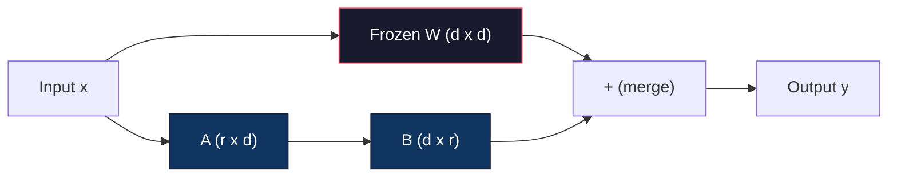
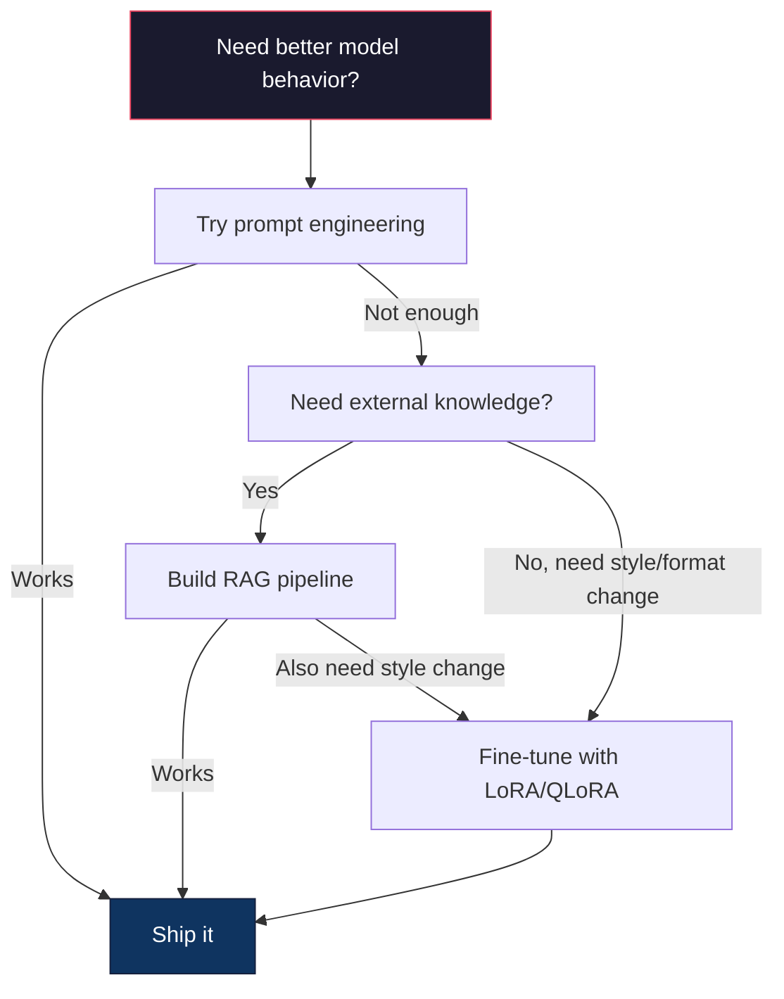

# लोरा और क्यूलोरा के साथ ठीक से ट्यून करना

> 7B मॉडल के लिए पूर्ण ठीक-ठाक करने के लिए 56GB VRAM की आवश्यकता होती है. आपके पास यह नहीं है. अधिकांश कंपनियों में भी नहीं है. लोरा आपको एक ही मॉडल को 6GB में ठीक-ठाक करने की अनुमति देता है, पैरामीटर के 1% से कम का प्रशिक्षण देकर। यह समझौता नहीं है - यह अधिकांश कार्यों पर पूर्ण ठीक-ठाक गुणवत्ता से मेल खाता है। पूरी ओपन-सोर्स ठीक-ठाक पारिस्थितिकी तंत्र इस एक चाल पर चलता है।

> **【中文解读】**कुल मात्रा में सूक्ष्म समायोजन 7B मॉडल 56GB की आवश्यकता होती है। लोरा केवल 1% के पैरामीटर से कम का अभ्यास करता है। 6GB की सूक्ष्म समायोजन पूरी तरह से पूरी हो सकती है, और गुणवत्ता में कोई पूर्ण मात्रा में सूक्ष्म समायोजन नहीं है।

> **【拓展：LoRA微调→定制大模型】**लोरा उद्यम अनुकूलन बड़े मॉडल की मूल तकनीक हैः कम क्षेत्र डेटा सूक्ष्म आधार मॉडल के साथ, विशेष क्षमता प्राप्त करना (जैसे वित्तीय विश्लेषण, कानून अनुशंसा, कोड उत्पादन आदि) ।

>  **【前置】**学本节前कृपया पहले हावी हो जाओः(1) चरण 10·06(इंस्ट्रक्शन ट्यूनिंग SFT)  समझ监督微调的基本流程;(2) 线性代数基础矩阵乘法、秩、SVD 分解(看 चरण 01·11 SVD);(3) PyTorch 基础`nn.Linear``backward()``optimizer.step()`;(4) गले लगाना`transformers`库的基本用法──本节会用 `peft`和 `trl`库――

**Type:** Build | **类型:** 构建
**Languages:** Python | **语言:** Python
**Prerequisites:** Phase 10, Lesson 06 (Instruction Tuning / SFT) | **前置知识:** Phase 10 · 06（指令微调/SFT）
**Time:** ~75 minutes | **时间:** ~75 分钟
**Related:**चरण 10 स्क्रैच से SFT / DPO लूप को कवर करता है। यह पाठ उन लोगों को 2026 PEFT टूलकिट में प्लग करता है (PEFT, TRL, Unsloth, Axolotl, LLaMA-factory) ।**相关:**चरण 10 से शून्य व्याख्या SFT/DPO 循环──本课将其接入2026 साल के PEFT 工具链(PEFT、TRL、Unsloth、Axolotl、LLaMA-Factory)

## सीखने के लक्ष्य

- एक पूर्व प्रशिक्षित मॉडल की ध्यान परतों में निम्न श्रेणी के एडाप्टर मैट्रिक्स (ए और बी) इंजेक्ट करके LoRA लागू करें
  ️️️️️️️️️️️️️️️️️️️️️️️️️️️️️️️️️️️️️️️️️️️️️️️️️️️️️️️️️️️️️️️️️️️️️️️️️️️️️️️️️️️️️️️️️️️️️️️️️️️️️️️️️️️️️️️️️️️️️️️️️️️️️️️️️️️️️️️️️️️️️️️️️️️️️️️️️️️️️️️️️️️️️️️️️️️️️️️️️️️️️️️️️️️️️️️️️️️️️️️️️️️️️️️️️️️️️️️️️️️️️️️️️️️️️️️️️️️️️️️️️️️️️️️️️️️️️️️️️️️️️️️️️️️️️️️️️️️️️️️️️️️️️️️️️️️️️️️️️️️️️️️️️️️️️️️️️️️️️️️️️️️️️️️️️️️️️️️️️️️️️️️️️️️️️️️️️️️️️️️️️️️️️️️️️️️️️️️️️️️️️️️️️️️️️️️️️️️️️️️️️️️️️️️️️️️️️️️️️️️️️️️️️️️️️️️️️️️️️️️️️️️️️️️️️️️️️️️️️️️️️️️️️️️️️️️️️️️️️️️️️️️️️️️️️️️️️️️️️️️️️️️️️️️️
- LoRA बनाम पूर्ण सूक्ष्म-ट्यूनिंग की पैरामीटर बचत की गणना करेंः d_model आयामों के साथ रैंक r d2 के बजाय 2*r*d पैरामीटर को ट्रेन करता है
  计算 LoRA vs 全量微调的参数节省:秩 r 配 d_model 维度训练 2*r*d 参数而不是 d^2
- उपभोक्ता जीपीयू मेमोरी में फिट होने के लिए QLoRA (4-बिट क्वांटिज़्ड बेस + LoRA एडाप्टर) का उपयोग करके एक मॉडल को ठीक से समायोजित करें
  QLoRA प्रयोग करें(4-बिट 量化基础模型 + LoRA 适配器) माइक्रो调模型以适应消费级 GPU内存
- लोर्र वजन को तैनाती के लिए मूल मॉडल में वापस मिलाएं और एडाप्टर के साथ और बिना अनुमानित गति की तुलना करें
  लोरा 权重合并回基础模型 को तैनाती के लिए उपयोग करना, और तुलनात्मक/अपरियुक्त डिवाइस की अनुशंसा गति

> **【中文解读】**本课标目标: लोरा/क्यूलोरा के प्रयोग से 参数高效微调── लोरा 仅训练低排分解矩阵 (百万级参数),而非全参数 (数十亿), जिससे微调成本 90%+降低


## समस्या  समस्या परिचय

आप एक आधार मॉडल है. Llama 3 8B. आप चाहते हैं कि यह आपकी कंपनी की आवाज में ग्राहक सहायता टिकट का जवाब देने के लिए है. SFT जवाब है. लेकिन SFT एक लागत समस्या है.

> आप एक बुनियादी मॉडल है. लामा 3 8B. आप इसे अपनी कंपनी की भाषा का उपयोग करना चाहते हैं.

पूर्ण ठीक-ठाक मॉडल में प्रत्येक पैरामीटर को अपडेट करता है। Llama 3 8B में 8 बिलियन पैरामीटर हैं। fp16 में, प्रत्येक पैरामीटर में 2 बाइट्स लगते हैं। वजन को लोड करने के लिए यह 16GB है। प्रशिक्षण के दौरान, आपको एडम के लिए ग्रेडिएंट (16GB), ऑप्टिमाइज़र राज्यों (32GB गति + भिन्नता के लिए) और सक्रियण की भी आवश्यकता होती है। कुलः एक एकल 8B मॉडल के लिए लगभग 56GB VRAM।

> कुल तत्वों में प्रत्येक तत्व को अद्यतन किया गया है। प्रत्येक तत्व को 80 बिलियन तत्वों में शामिल किया गया है।

एक A100 80GB शायद ही इस फिट बैठता है. दो A100s लागत .$3-4/hour on cloud providers. Training for 3 epochs on 50,000 examples takes 6-10 hours. That's $30-40 प्रति प्रयोग. हाइपरपरपैरामीटर सही पाने के लिए 10 प्रयोग चलाओ और आप कुछ भी तैनात करने से पहले $400 खर्च किया है.

> एक张A100 80GB 勉强能装下──两张A100 在云上每小时 $3-4。在 50,000 个样本上训练 3 个 epoch 需要 6-10 小时。每次实验 $30-40

एक और गहरी समस्या भी है. पूर्ण ठीक-ठाक मॉडल के हर वजन को संशोधित करता है. यदि आप ग्राहक सहायता डेटा पर ठीक-ठाक करते हैं, तो आप मॉडल की सामान्य क्षमताओं को कम कर सकते हैं। इसे आपदा भूलना कहा जाता है. मॉडल आपके कार्य में बेहतर हो जाता है और बाकी सब कुछ में बदतर हो जाता है।

> एक और गहरी समस्या है। मॉडल में प्रत्येक भार को पूर्ण पैरामीटर में संशोधित करना। यदि आप ग्राहक डेटा पर संशोधित करते हैं, तो यह मॉडल की सामान्य क्षमता को कम कर सकता है। इसे आपदाजनक भूल कहा जाता है।

आपको एक ऐसी विधि की आवश्यकता है जो कम मापदंडों को प्रशिक्षित करे, कम मेमोरी का उपयोग करे, और मॉडल के मौजूदा ज्ञान को नष्ट न करे।

> आपको कम तत्वों का प्रशिक्षण करने की आवश्यकता है, कम स्मृति का उपयोग करें, और मौजूदा ज्ञान के तरीकों को नष्ट न करें।

>  **【类比】**पूर्ण लघु调像"把整本教科书重写一遍"每个字符(参数) 都改,工作量大还容易改变原来对内容的错误(灾难性遗忘) ⋅ LORA 像"在教科书的页边贴贴贴"原文(W) 结不动,你只在边上贴小纸条(A×B矩阵) 写新注释──最终输出 = 原文 + 便利贴──换任务时,撕旧便利贴贴新即可,原文保留──

## अवधारणा का मूल अवधारणा

> **【中文解读】**लोरा (Lower-Rank Adaptation) 结原始权重,仅训练低秩分解矩阵 (Low-Rank Adaptation) 结原始权重,仅训练低秩分解矩阵 (A*B), 将训练参数从数十亿降至数百万――QLoRA 进一步量化基础模型到4-bit,在单张消费级 GPU上微调大模型――

> **【拓展：LoRA 的工程实践】**LoRA के क्रम (रैंक) आमतौर पर 8-64 पर सेट किया जाता है, Q/V 投影矩阵效果最好──QLoRA(4-बिट 基础模型 + LoRA) आपको एक ही चॅंक्स RTX 4090 上微调 Llama-3-8B──HuggingFace PEFT库 让 LoRA 微调几行代码即可实现──LoRA का लागत लगभग संपूर्ण参数微调 के 1/10, और प्रभाव करीब──

> 🤔 **【困惑】**Q: QLoRA क्या है? और LoRA 区别? A: QLoRA = क्वांटिज़ेड LoRA── बेस मॉडल 4 बिट 量化(NF4) भंडारण, LoRA 适配器用 bf16 训练── इस प्रकार Llama-3-8B का 16GB 权重压缩到4GB,加上 LoRA 训练开销(约100MB), कुल 6GB 显存就能微调单张 RTX 4090 / 3090 即可──代价: प्रशिक्षण गति शुद्ध LoRA 慢约30%(因为要边反量化边缘向前),但成本可控──


### लोरा: निम्न श्रेणी के अनुकूलन

एडवर्ड हु और माइक्रोसॉफ्ट के सहयोगियों ने जून 2021 में लोरा प्रकाशित किया। पेपर की अंतर्दृष्टिः ठीक-ट्यूनिंग के दौरान वजन अपडेट में कम आंतरिक रैंक होती है। आपको 4096x4096 वजन मैट्रिक्स में सभी 16.7 मिलियन मापदंडों को अपडेट करने की आवश्यकता नहीं है। अद्यतन में उपयोगी जानकारी 16 या 32 रैंक के मैट्रिक्स द्वारा कैप्चर की जा सकती है।

> एडवर्ड हु और माइक्रोसॉफ्ट के साथ-साथ जून 2021 में प्रकाशित LoRA──论文洞察:微调期间权重更新具有低内在排列──你不需要更新 4096x4096 权重矩阵中全部1670万参数──更新中的有用信息可被排列 16或32 的矩阵捕获──

> 🤔 **【困惑】**Q: क्यों कम क्रम में रेंज में ताज़ा जानकारी प्राप्त कर सकते हैं? A: अनुभवजन्य अवलोकनAghajanyan आदि(2020) पाया पूर्व प्रशिक्षण मॉडल का वजन अपडेटΔW में आंतरिक आयाम) पर बहुत कम है, आमतौर पर केवल कुछ सौ से कुछ हजार维 पर एक नया कार्य सीखने में सक्षम है।

यहाँ गणित है. एक मानक रैखिक परत गणना करता हैः

> गणित निम्नानुसार हैः

```
y = Wx
```

जहां W एक d_out x d_in मैट्रिक्स है. 4096x4096 ध्यान प्रक्षेपण के लिए, यह 16,777,216 पैरामीटर है.

> इनमें से W है d_out x d_in 矩阵. 4096x4096 के लिए ध्यान शक्ति परिक्षण, यह 16,777,216 个参数.

लोरा W को जमे हुए और एक निम्न श्रेणी का विघटन जोड़ता हैः

> लोरा 结 W 并添加低序分解:

> ️ **【易错点】**लोरा 微调的 3 个坑:(1) **秩 r 设太大**r=64 起步就太大,参数接近全量微调,省显存优势消失;起点 r=8 अथवा r=16,效果不够再加倍──(2) **target_modules 选错** केवल `q_proj`अतिरिक्त लोरा 效果有限, मानक प्रथा है `["q_proj", "v_proj", "k_proj", "o_proj"]`इसके अतिरिक्त, अधिक उत्तेजना MLP के लिए जोड़ा जा सकता है `gate_proj`/`up_proj`/`down_proj`(3) **学习率没调高**LoRA 参数 है नई आरंभिक, आवश्यकता पूर्व प्रशिक्षण वजन से अधिक lr; विशिष्ट lr=1e-4 से 3e-4 तक

```
y = Wx + BAx
```

जहां B (d_out x r) और A (r x d_in) है। रैंक r d से बहुत छोटा है - आमतौर पर 8, 16 या 32.

> इनमें B है (d_out x r),A है (r x d_in)  क्रमबद्ध r 比 d 小得多通常 8、16 या 32。

4096x4096 परत पर r=16 के लिएः
- मूल मापदंडः 4096 x 4096 = 16,777,216
- लोरा पैरामीटरः (4096 x 16) + (16 x 4096) = 65,536 + 65,536 = 131,072
- कटौती: 131,072 / 16,777,216 = 0.78%

>  4096x4096 层 पर r=16 के लिएः
> - मूल तत्व:4096 x 4096 = 16,777,216
> - LoRA 参数:(4096 x 16) + (16 x 4096) = 65,536 + 65,536 = 131,072
> - 减少:131,072 / 16,777,216 = 0.78%

आप 0.78% मापदंडों का प्रशिक्षण कर रहे हैं और 95-100% गुणवत्ता प्राप्त कर रहे हैं।

> आप प्रशिक्षण 0.78% के लिए गुण प्राप्त करते हैं, 95-100% की गुणवत्ता प्राप्त करते हैं।



A को एक यादृच्छिक गौशियन के साथ आरंभ किया जाता है. B को शून्य से आरंभ किया जाता है. इसका मतलब है कि लोरा योगदान शून्य से शुरू होता है - मॉडल अपने मूल व्यवहार से प्रशिक्षण शुरू करता है और धीरे-धीरे अनुकूलन सीखता है।

> A 用随机高斯初始化──B初始化为零── इसका अर्थ है LoRA 贡献从零开始模型从原始行为开始训练,逐渐学习适应──

### स्केलिंग फैक्टरः अल्फा

लोरा एक स्केलिंग कारक अल्फा पेश करता है जो नियंत्रित करता है कि निम्न श्रेणी के अपडेट आउटपुट को कितना प्रभावित करता हैः

> लोरा संकुचित कारक अल्फा, नियंत्रण निम्न क्रम अद्यतन पर आउटपुट प्रभाव की डिग्री शुरूः

```
y = Wx + (alpha / r) * BAx
```

जब अल्फा = आर, स्केलिंग 1x है। जब अल्फा = 2r (सामान्य डिफ़ॉल्ट), स्केलिंग 2x है। यह हाइपरपैरामीटर मूल सीखने की दर से स्वतंत्र रूप से LoRA पथ की सीखने की दर को नियंत्रित करता है।

> जब अल्फा = r, संकुचित 1x──当 अल्फा = 2r(常见默认), संकुचित 2x── यह सुपरपरमाउंट बुनियादी सीखने की दर से स्वतंत्र है नियंत्रण लोरा 路径 के सीखने की दर──

व्यावहारिक मार्गदर्शनः
- अल्फा = 2 * रैंक एक आम सामुदायिक सम्मेलन है (मूल पेपर में प्रयोग किया गया अल्फा = रैंक अधिकांश प्रयोगों में)
  अल्फा = 2 * रैंक = रैंक = सामान्य समुदाय के लिए
- अल्फा = रैंक 1x स्केलिंग देता है, संरक्षित लेकिन स्थिर
  अल्फा = रैंक 给 1x 缩放,保守但稳定
- उच्च अल्फा का अर्थ है प्रति चरण बड़े अपडेट, जो अभिसरण को गति दे सकता है या अस्थिरता पैदा कर सकता है
   उच्च अल्फा अर्थ प्रत्येक कदम अधिक अद्यतन, हो सकता है तेजी से प्राप्त करने या अस्थिरता के कारण

### लोरा को कहाँ लागू किया जाए

एक ट्रांसफार्मर में कई रैखिक परतें होती हैं. आपको उन सभी में लोरा जोड़ने की आवश्यकता नहीं है। मूल पेपर ने विभिन्न संयोजनों का परीक्षण कियाः

> ट्रांसफार्मर में कई लाइनर लेयर हैं। आपको सभी को अतिरिक्त लोरा देने की आवश्यकता नहीं है।

| Target Layers | Trainable Params (7B) | Quality |
|--------------|----------------------|---------|
| q_proj only / 仅 q_proj | 4.7M | Good / 好 |
| q_proj + v_proj | 9.4M | Better / 更好 |
| q_proj + k_proj + v_proj + o_proj | 18.9M | Best for attention / 注意力最佳 |
| All linear (attention + MLP) / 所有线性层 | 37.7M | Marginal gain, 2x params / 边际收益、2 倍参数 |

अधिकांश कार्यों के लिए मीठा बिंदुः q_proj + v_proj। यह स्वयं ध्यान में क्वेरी और मूल्य अनुमानों को लक्षित करता है, जो नियंत्रित करते हैं कि मॉडल क्या देखता है और यह क्या जानकारी निकालता है। एमएलपी परतों को जोड़ना कोड जेनरेशन जैसे जटिल कार्यों में मदद करता है लेकिन सरल कार्यों पर घटते रिटर्न के लिए पैरामीटर की गिनती को दोगुना करता है।

> अधिकांश कार्य का सर्वोत्तम बिंदु:q_proj + v_proj── यह स्व-विचार और मूल्य परिकल्पना के लिए है, नियंत्रण मॉडल ध्यान क्या है, क्या जानकारी प्राप्त करना है।

### रैंक चयन

रैंक r अनुकूलन की अभिव्यक्तिशीलता को नियंत्रित करता हैः

> 秩 r 控制适应 के प्रदर्शन क्षमताः

| Rank | Trainable Params (per layer) | Best For |
|------|---------------------------|----------|
| 4 | 32,768 | Simple classification, sentiment / 简单分类、情感 |
| 8 | 65,536 | Single-domain Q&A, summarization / 单领域问答、摘要 |
| 16 | 131,072 | Multi-domain tasks, instruction following / 多领域任务、指令遵循 |
| 32 | 262,144 | Complex reasoning, code generation / 复杂推理、代码生成 |
| 64 | 524,288 | Diminishing returns for most tasks / 大多数任务回报递减 |
| 128 | 1,048,576 | Rarely justified / 很少合理 |

ह्यू और अन्य ने दिखाया कि r=4 पहले से ही सरल कार्यों के लिए अनुकूलन के अधिकांश को कैप्चर करता है। r=8 और r=16 व्यवहार में सबसे आम विकल्प हैं। r=64 से परे जाना शायद ही कभी गुणवत्ता में सुधार करता है और लोरा के मेमोरी लाभ को खोना शुरू कर देता है।

> Hu 等人 दिखाता है कि r=4 已捕获简单任务的大部分适应──实践中 r=8 和 r=16 已成为最常见的选择──超过 r=64 很少改善质量且开始失去LoRA的内存优势──

### QLoRA: 4-बिट क्वांटिज़ेशन + लोरा

वाशिंगटन विश्वविद्यालय के टिम डेटमर और उनके सहयोगियों ने मई 2023 में QLoRA प्रकाशित किया। विचारः स्थिर आधार मॉडल को 4-बिट सटीकता तक क्वांटिफाई करें, फिर ऊपर fp16 में LoRA एडाप्टर संलग्न करें।

> टिम डेटमर और वाशिंगटन विश्वविद्यालय के सहकर्मी ने मई 2023 में QLoRA प्रकाशित किया।

यह स्मृति समीकरण को नाटकीय रूप से बदलता हैः

> इसने बहुत बड़ा बदलाव किया है

| Method | Weight Memory (7B) | Training Memory (7B) | GPU Required |
|--------|-------------------|---------------------|-------------|
| Full fine-tune (fp16) | 14GB | ~56GB | 1x A100 80GB |
| LoRA (fp16 base) | 14GB | ~18GB | 1x A100 40GB |
| QLoRA (4-bit base) | 3.5GB | ~6GB | 1x RTX 3090 24GB |

QLoRA तीन तकनीकी योगदान देता हैः

> QLoRA ने तीन तकनीकी योगदान किएः

**NF4 (Normal Float 4-bit)**: न्यूरल नेटवर्क के वजन के लिए विशेष रूप से डिज़ाइन किया गया एक नया डेटा प्रकार। न्यूरल नेटवर्क के वजन लगभग सामान्य वितरण का पालन करते हैं। एनएफ 4 अपने 16 क्वांटिज़ेशन स्तरों को मानक सामान्य वितरण के क्वांटिल पर रखता है। यह सामान्य रूप से वितरित डेटा के लिए सूचना-सैद्धांतिक रूप से अनुकूल है। यह समान 4-बिट क्वांटिज़ेशन (INT4) या मानक Float4 से कम जानकारी खोता है।

> **NF4（Normal Float 4-bit）**: न्यूरल नेटवर्क के लिए विशेष रूप से डिजाइन किए गए नए डेटा प्रकारों में से एक है। न्यूरल नेटवर्क के अधिकारों का एक महत्वपूर्ण हिस्सा है कि वे सामान्य सामान्य वितरण के लिए 16 मात्राओं के स्तरों को निर्धारित करते हैं। यह सामान्य वितरण डेटा के लिए सबसे अच्छा है।

**Double quantization**: क्वांटिज़ेशन स्थिरांक स्वयं मेमोरी लेते हैं. 64 वजन के प्रत्येक ब्लॉक को fp32 स्केल कारक (4 बाइट्स) की आवश्यकता होती है। 7B मॉडल के लिए, यह अतिरिक्त 0.4GB है। डबल क्वांटिज़ेशन इन स्थिरांक को fp8 में क्वांटिज करता है, ओवरहेड को 0.1GB तक कम करता है। छोटा है लेकिन यह जोड़ता है।

> **双重量化**:आकृतिगत वज़न खुद ही内存 को संचयित करते हैं। प्रत्येक 64 权重块需要 fp32 缩放因子(4 字节) ⋅ 7B 模型,那额外0.4GB──双重量化将这些常量化到fp8,将开销降至0.1GB──小但累积──

**Paged optimizers**प्रशिक्षण के दौरान, ऑप्टिमाइज़र स्टेटस (आदम की गति और भिन्नता) लंबे अनुक्रमों पर GPU मेमोरी से अधिक हो सकती है। पेज ऑप्टिमाइज़र स्वचालित रूप से NVIDIA की एकीकृत मेमोरी का उपयोग करके GPU मेमोरी समाप्त होने पर CPU RAM में ऑप्टिमाइज़र स्टेटस को पेज करते हैं, और जब आवश्यक हो तो उन्हें वापस पेज करते हैं। यह कुछ आउटपुट की कीमत पर OOM क्रैश को रोकता है।

> **分页优化器**प्रशिक्षण के दौरान, लंबे क्रम में अनुकूलक की स्थिति (आदम 动量和方差) GPU के अंदर से अधिक हो सकती है।

### गुणवत्ता का प्रश्न

क्या पैरामीटर को कम करना या आधार को मात्राबद्ध करना गुणवत्ता को नुकसान पहुंचाता है?

> 減量化基因是否损害质量?多篇论文结果:

| Method | MMLU (5-shot) | MT-Bench | HumanEval |
|--------|--------------|----------|-----------|
| Full fine-tune (Llama 2 7B) / 全量微调 | 48.3 | 6.72 | 14.6 |
| LoRA r=16 | 47.9 | 6.68 | 14.0 |
| QLoRA r=16 (NF4) | 47.5 | 6.61 | 13.4 |
| QLoRA r=64 (NF4) | 48.1 | 6.70 | 14.2 |

आर = 16 पर लोरा अधिकांश बेंचमार्क पर पूर्ण ठीक-ठाक के 1% के भीतर है। आर = 16 पर क्यूलोरा एक प्रतिशत का एक और अंश खो देता है। आर = 64 पर क्यूलोरा अनिवार्य रूप से 90% कम मेमोरी का उपयोग करते हुए पूर्ण ठीक-ठाक से मेल खाता है।

> r=16 का लोरा अधिकांश आधारभूत तत्वों पर पूर्ण मात्रा के साथ 1% के अंतर से और अंदर-अंदर-र=16 का लोरा फिर से शून्य बिंदुओं के कुछ सौ बिंदुओं के नुकसान से।

### वास्तविक दुनिया की लागत

50,000 नमूनों (3 कालखंडों) पर ल्लामा 3 8B को ठीक से समायोजित किया गयाः

> में 50,000 नमूना पर微调 लामा 3 8B(3 个时代):

| Method | GPU | Time | Cost |
|--------|-----|------|------|
| Full fine-tune / 全量微调 | 2x A100 80GB | 8 hours | ~$32 |
| LoRA r=16 | 1x A100 40GB | 4 hours | ~$8 |
| QLoRA r=16 | 1x RTX 4090 24GB | 6 hours | ~$5 |
| QLoRA r=16 (Unsloth) | 1x RTX 4090 24GB | 2.5 hours | ~$2 |
| QLoRA r=16 | 1x T4 16GB | 12 hours | ~$4 |

एक एकल उपभोक्ता जीपीयू पर क्यूलोरा की लागत एक दोपहर के भोजन से कम है। यही कारण है कि 2023 में ओपन-वेट फाइन-ट्यूनिंग समुदाय विस्फोट हुआ और 2026 में डिफ़ॉल्ट रूप से क्यूलोरा को नीचे के प्रत्येक प्रशिक्षण ढांचे में भेज दिया गया।

> 单张消费级 GPU 上的QLoRA 成本不到一顿午餐──这是2023 में ओपन सोर्सवेट微调社区爆发的原因,也是2026 में सभी प्रशिक्षण ढांचे द्वारा QLoRA को默认搭载的原因──

### 2026 पीईएफटी स्टैक

| Framework | What it is | Pick when |
|-----------|-----------|-----------|
| **Hugging Face PEFT** | The canonical LoRA/QLoRA/DoRA/IA3 library / 标准 LoRA/QLoRA/DoRA/IA3 库 | You want raw control and your training loop is already on `transformers.Trainer` / 想要原始控制且训练循环已在 `transformers.Trainer` 上 |
| **TRL** | HF's reinforcement-from-feedback trainers (SFT, DPO, GRPO, PPO, ORPO) / HF 反馈强化学习训练器 | You need DPO/GRPO after SFT; built on top of PEFT / SFT 后需要 DPO/GRPO；构建于 PEFT 之上 |
| **Unsloth** | Triton-kernel rewrite of the forward/backward pass / 前向/反向传播的 Triton 内核重写 | You want 2-5x speedup + half the VRAM with no accuracy loss; Llama/Mistral/Qwen family / 想要 2-5 倍加速 + 一半 VRAM 无精度损失；Llama/Mistral/Qwen 家族 |
| **Axolotl** | YAML-config wrapper over PEFT + TRL + DeepSpeed + Unsloth / PEFT + TRL + DeepSpeed + Unsloth 的 YAML 配置封装 | You want reproducible, version-controlled training runs / 想要可重现、版本控制的训练运行 |
| **LLaMA-Factory** | GUI/CLI/API over PEFT + TRL / PEFT + TRL 的 GUI/CLI/API | You want zero-code fine-tuning; 100+ model families supported / 想要零代码微调；支持 100+ 模型家族 |
| **torchtune** | Native PyTorch recipes, no `transformers` dep / 原生 PyTorch 配方，无 `transformers` 依赖 | You want minimal deps and your org already standardizes on PyTorch / 想要最小依赖且组织已标准化于 PyTorch |

अंगूठे का नियमः अनुसंधान उपयोग या एक बार प्रयोग → पीईएफटी। पुनरावर्ती उत्पादन पाइपलाइन → अनलॉथ नाखून सक्षम के साथ Axolotl। थ्रोवे प्रोटोटाइपिंग → LLaMA-फैक्टरी।

> 经验法则:研究或一次性实验 → PEFT──可重复生产管线 → 启用 Unsloth 内核的 Axolotl──抛弃式原型 → LLaMA-Factory──

### एडाप्टर को मिलाएं

प्रशिक्षण के बाद, आपके पास दो चीजें हैंः जमे हुए बेस मॉडल और एक छोटा लोरा एडाप्टर (आमतौर पर 10-100 एमबी) । आप या तोः

>  प्रशिक्षण के बाद आपके पास दो चीजें हैंः 结的基础模型和小的 LoRA 适配器(आमतौर पर 10-100MB) 

1. **Keep them separate**: बेस मॉडल लोड करें, शीर्ष पर एडाप्टर लोड करें। विभिन्न कार्यों के लिए स्विच एडाप्टर। इस तरह आप एक बेस मॉडल से कई बारीक-ट्यून वैरिएंट की सेवा करते हैं।

   **保持分离**: लोड आधार मॉडल, ऊपर लोड एडाप्टर।

2. **Merge them permanently**: गणना W' = W + (alpha/r) * BA और एक नए पूर्ण मॉडल के रूप में परिणाम सहेजें. विलय मॉडल मूल के समान आकार है. कोई निष्कर्ष ओवरहेड नहीं है. कोई एडाप्टर प्रबंधित करने के लिए नहीं है.

   **永久合并**: गणना W' = W + (alpha/r) * BA 并将结果保存为新完整模型──合并后模型与原始相同大小──无推理开销──无适配器需管理──

कई कार्यों (ग्राहक सहायता एडाप्टर, कोड एडाप्टर, अनुवाद एडाप्टर) को पूरा करने के लिए, उन्हें अलग रखें। एक ही विशेष मॉडल को तैनात करने के लिए, एकजुट करें।

> 服务多个任务(客服适配器、代码适配器、翻译适配器) 保持分离──部署单一专用模型则合并──

कई एडाप्टरों को जोड़ने के लिए उन्नत विलय तकनीकेंः

> 组合多个适配器的高级合并技术:

- **TIES-Merging**(यादाव और सहयोगियों 2023): छोटे परिमाण के मापदंडों को ट्रिम करता है, संकेत संघर्षों को हल करता है, फिर विलय करता है। एडाप्टरों के बीच हस्तक्षेप को कम करता है।
  修剪小幅度参数, हल符号冲突, फिर合并──减少适配器间干扰──
- **DARE**(यू एट अल. 2023): विलय से पहले एडाप्टर पैरामीटर को यादृच्छिक रूप से गिरा देता है और शेष को फिर से स्केल करता है। क्षमताओं को जोड़ने में आश्चर्यजनक रूप से प्रभावी।
  合并前随机丢弃适配器参数并重新缩放其余参数──组合能力效果惊──
- **Task arithmetic**एक "कोड" एडाप्टर और एक "गणित" एडाप्टर को जोड़ने से अक्सर दोनों में एक अच्छा मॉडल उत्पन्न होता है।
  简单加或减适配器权重. "代码"适配器 और "数学"适配器 अक्सर दोनों ही अच्छे मॉडल उत्पन्न होते हैं।

### जब ठीक-ठाक नहीं करना चाहिए

ठीक-ठीक ट्यूनिंग तीसरा विकल्प है, पहला नहीं।

> 微调是第三选项,不是第一选项

**First: prompt engineering.**एक बेहतर सिस्टम प्रॉम्प्ट लिखें. कुछ शॉट उदाहरण जोड़ें. विचार श्रृंखला का उपयोग करें. यह कुछ भी नहीं लागत है और मिनट लेता है. यदि प्रॉम्प्टिंग आपको 80% तक पहुंचता है, तो आपको शायद ठीक से ट्यून करने की आवश्यकता नहीं है।

> **第一：提示工程。**写更好的系统提示――加少样本示例――用思维链――这零成本――几分钟―― यदि提示能完成80% ,你可能不需要微调――

**Second: RAG.**यदि मॉडल को आपके विशिष्ट डेटा (दस्तावेज़, ज्ञान आधार, उत्पाद सूची) के बारे में जानने की आवश्यकता है, तो इसे वजन में बेकिंग से अधिक सस्ता और अधिक बनाए रखा जा सकता है। पाठ 06 देखें।

> **第二：RAG。**यदि मॉडल को आपके विशिष्ट डेटा को जानने की आवश्यकता है, तो जांच करना अधिक सस्ता है।

**Third: fine-tuning.**जब आपको मॉडल की आवश्यकता हो तो इसका उपयोग एक विशिष्ट शैली, प्रारूप या तर्क पैटर्न को अपनाने के लिए करें जो प्रॉम्प्टिंग के माध्यम से प्राप्त नहीं किया जा सकता है। जब आपको एक सुसंगत संरचित आउटपुट की आवश्यकता हो। जब आपको एक बड़े मॉडल को एक छोटे से अलग करने की आवश्यकता हो। जब विलंबता मायने रखती है और आप कुछ शॉट प्रॉम्प्टिंग से अतिरिक्त टोकन का भुगतान नहीं कर सकते हैं।

> **第三：微调。**जब आपको मॉडल को विशिष्ट शैली, प्रारूप या अनुशंसा मोड के साथ अपनाने की आवश्यकता होती है (जब आपको एक समान संरचनात्मक आउटपुट की आवश्यकता होती है) तो उपयोग करें।



## इसे बनाओ, इसे पूरा करो।
```figure
lora-params
```

## इसे बनाओ

हम शुद्ध PyTorch में LoRA को खरोंच से लागू करते हैं कोई पुस्तकालय नहीं कोई जादू नहीं आप LoRA परत बना सकते हैं, इसे एक मॉडल में इंजेक्ट कर सकते हैं, इसे प्रशिक्षित कर सकते हैं, और वजन को वापस मिला सकते हैं।

> हम शुद्ध पिटॉर्च से शून्य से लोरा को प्राप्त करने के लिए उपयोग करते हैं।

### चरण 1: लोरा परत

```python
import torch
import torch.nn as nn
import math

class LoRALayer(nn.Module):
    def __init__(self, in_features, out_features, rank=8, alpha=16):
        super().__init__()
        self.rank = rank
        self.alpha = alpha
        self.scaling = alpha / rank

        self.A = nn.Parameter(torch.randn(in_features, rank) * (1 / math.sqrt(rank)))
        self.B = nn.Parameter(torch.zeros(rank, out_features))

    def forward(self, x):
        return (x @ self.A @ self.B) * self.scaling
```

A को स्केल किए गए यादृच्छिक मानों के साथ आरंभ किया जाता है। B को शून्य पर आरंभ किया जाता है। उत्पाद BA शून्य से शुरू होता है, इसलिए मॉडल अपने मूल व्यवहार से शुरू होता है।

> A उपयोग संक्षिप्त के साथ प्रारम्भिक मूल्य। B प्रारम्भिकता के रूप में शून्य से गुणा करने के लिए शुरू किया गया है।

### चरण 2: लोरा-वाप्पे हुए रैखिक परत

```python
class LinearWithLoRA(nn.Module):
    def __init__(self, linear, rank=8, alpha=16):
        super().__init__()
        self.linear = linear
        self.lora = LoRALayer(
            linear.in_features, linear.out_features, rank, alpha
        )

        for param in self.linear.parameters():
            param.requires_grad = False

    def forward(self, x):
        return self.linear(x) + self.lora(x)
```

मूल रैखिक परत को जमे रखा गया है। केवल लोरा पैरामीटर (ए और बी) प्रशिक्षित किए जा सकते हैं।

> मूलभूत 线性层被结──只有 LoRA 参数(A 和 B) 可训练──

### चरण 3: एक मॉडल में लोरा इंजेक्ट करें

```python
def inject_lora(model, target_modules, rank=8, alpha=16):
    for param in model.parameters():
        param.requires_grad = False

    lora_layers = {}
    for name, module in model.named_modules():
        if isinstance(module, nn.Linear):
            if any(t in name for t in target_modules):
                parent_name = ".".join(name.split(".")[:-1])
                child_name = name.split(".")[-1]
                parent = dict(model.named_modules())[parent_name]
                lora_linear = LinearWithLoRA(module, rank, alpha)
                setattr(parent, child_name, lora_linear)
                lora_layers[name] = lora_linear
    return lora_layers
```

सबसे पहले, मॉडल में प्रत्येक पैरामीटर को फ्रीज करें। फिर मॉडल ट्री पर जाएं, अपने लक्ष्य नामों से मेल खाने वाली रैखिक परतें खोजें, और उन्हें लोरा-पैक किए गए संस्करणों से बदलें। लोरा ए और बी मैट्रिक्स पूरे मॉडल में एकमात्र प्रशिक्षित पैरामीटर हैं।

> 结模型中所有的参数──然后遍历模型树,找到匹配目标名称的线性层, लोरा 包装版本 के साथ उन्हें प्रतिस्थापित करें──LoRA A 和 B矩阵是整个模型中唯一的训练可的参数──

### चरण 4: पैरामीटर गिनें

```python
def count_parameters(model):
    total = sum(p.numel() for p in model.parameters())
    trainable = sum(p.numel() for p in model.parameters() if p.requires_grad)
    frozen = total - trainable
    return {
        "total": total,
        "trainable": trainable,
        "frozen": frozen,
        "trainable_pct": 100 * trainable / total if total > 0 else 0
    }
```

### चरण 5: वजन को वापस मिलाएं

```python
def merge_lora_weights(model):
    for name, module in model.named_modules():
        if isinstance(module, LinearWithLoRA):
            with torch.no_grad():
                merged = (
                    module.lora.A @ module.lora.B
                ) * module.lora.scaling
                module.linear.weight.data += merged.T
            parent_name = ".".join(name.split(".")[:-1])
            child_name = name.split(".")[-1]
            if parent_name:
                parent = dict(model.named_modules())[parent_name]
            else:
                parent = model
            setattr(parent, child_name, module.linear)
```

एकीकरण के बाद, लोरा परतें गायब हो गई हैं मॉडल मूल के समान आकार है वजन में बेक अनुकूलन के साथ। कोई निष्कर्ष ओवरहेड नहीं।

> 合并后 LoRA 层消失──模型与原始大小相同,适应烤进权重──无推理开销──

### चरण 6: अनुकरण QLoRA मात्रा

```python
def quantize_to_nf4(tensor, block_size=64):
    blocks = tensor.reshape(-1, block_size)
    scales = blocks.abs().max(dim=1, keepdim=True).values / 7.0
    scales = torch.clamp(scales, min=1e-8)
    quantized = torch.round(blocks / scales).clamp(-8, 7).to(torch.int8)
    return quantized, scales

def dequantize_from_nf4(quantized, scales, original_shape):
    dequantized = quantized.float() * scales
    return dequantized.reshape(original_shape)
```

यह 64 के ब्लॉक के भीतर 16 अलग-अलग स्तरों में वजन को मैप करके 4-बिट क्वांटिज़ेशन का अनुकरण करता है। उत्पादन QLoRA GPU पर वास्तविक NF4 के लिए बिट्स एंड बाइट्स लाइब्रेरी का उपयोग करता है।

> इस प्रकार 64 个块 के 16 个分离级别模拟4 बिट 量化――生产 QLoRA 通过将权重映射到64 个块的 16 个分离级别模拟4 बिट 量化――生产 QLoRA 通过使用位数和字节库在 GPU 上做真正的NF4――

### चरण 7: प्रशिक्षण लूप

```python
def train_lora(model, data, epochs=5, lr=1e-3, batch_size=4):
    optimizer = torch.optim.AdamW(
        [p for p in model.parameters() if p.requires_grad], lr=lr
    )
    criterion = nn.MSELoss()

    losses = []
    for epoch in range(epochs):
        epoch_loss = 0.0
        n_batches = 0
        indices = torch.randperm(len(data["inputs"]))

        for i in range(0, len(indices), batch_size):
            batch_idx = indices[i:i + batch_size]
            x = data["inputs"][batch_idx]
            y = data["targets"][batch_idx]

            output = model(x)
            loss = criterion(output, y)

            optimizer.zero_grad()
            loss.backward()
            optimizer.step()

            epoch_loss += loss.item()
            n_batches += 1

        avg_loss = epoch_loss / n_batches
        losses.append(avg_loss)

    return losses
```

### चरण 8: पूर्ण डेमो

```python
def demo():
    torch.manual_seed(42)
    d_model = 256
    n_classes = 10

    model = nn.Sequential(
        nn.Linear(d_model, 512),
        nn.ReLU(),
        nn.Linear(512, 512),
        nn.ReLU(),
        nn.Linear(512, n_classes),
    )

    n_samples = 500
    x = torch.randn(n_samples, d_model)
    y = torch.randint(0, n_classes, (n_samples,))
    y_onehot = torch.zeros(n_samples, n_classes).scatter_(1, y.unsqueeze(1), 1.0)

    data = {"inputs": x, "targets": y_onehot}

    params_before = count_parameters(model)

    lora_layers = inject_lora(
        model, target_modules=["0", "2"], rank=8, alpha=16
    )

    params_after = count_parameters(model)

    losses = train_lora(model, data, epochs=20, lr=1e-3)

    merge_lora_weights(model)
    params_merged = count_parameters(model)

    return {
        "params_before": params_before,
        "params_after": params_after,
        "params_merged": params_merged,
        "losses": losses,
    }
```

डेमो एक छोटा मॉडल बनाता है, लोरा को दो परतों में इंजेक्ट करता है, इसे प्रशिक्षित करता है, और वजन को वापस मिलाता है। पैरामीटर गिनती पूर्ण प्रशिक्षित से ~ 1% को घट जाती है जो लोरा प्रशिक्षण के दौरान प्रशिक्षित होती है, फिर विलय के बाद मूल वास्तुकला में लौटती है।

> 演示 创建小模型、注入 LoRA到两层、训练它、合并权重回去──参数计数从全可训练降至LoRA 训练期间约1%可训练,然后合并后返回原始结构──

## इसे फ्रेमवर्क के साथ लागू करें

गले लगाने वाले चेहरे पारिस्थितिकी तंत्र के साथ, एक वास्तविक मॉडल पर लोरा लगभग 20 पंक्तियों को लेता हैः

> गले लगाना चेहरा 生态, वास्तविक मॉडल पर लोरा केवल 20 के बारे में आवश्यकता हैः

```python
from transformers import AutoModelForCausalLM, AutoTokenizer
from peft import LoraConfig, get_peft_model, TaskType

model = AutoModelForCausalLM.from_pretrained("meta-llama/Llama-3.1-8B")
tokenizer = AutoTokenizer.from_pretrained("meta-llama/Llama-3.1-8B")

lora_config = LoraConfig(
    task_type=TaskType.CAUSAL_LM,
    r=16,
    lora_alpha=32,
    lora_dropout=0.05,
    target_modules=["q_proj", "v_proj"],
)

model = get_peft_model(model, lora_config)
model.print_trainable_parameters()
```

QLoRA के लिए, बिट्सएंडबाइट्स क्वांटिज़ेशन जोड़ेंः

> QLoRA के लिए, बिट्स और बाइट्स 量化 जोड़ा गयाः

```python
from transformers import BitsAndBytesConfig

bnb_config = BitsAndBytesConfig(
    load_in_4bit=True,
    bnb_4bit_quant_type="nf4",
    bnb_4bit_compute_dtype=torch.bfloat16,
    bnb_4bit_use_double_quant=True,
)

model = AutoModelForCausalLM.from_pretrained(
    "meta-llama/Llama-3.1-8B",
    quantization_config=bnb_config,
    device_map="auto",
)

model = get_peft_model(model, lora_config)
```

यही है. एक ही प्रशिक्षण लूप. एक ही डेटा पाइपलाइन. बेस मॉडल अब 4 बिट में रहता है, LoRA एडाप्टर FP16 में ट्रेन, और पूरी बात 6GB में फिट बैठता है.

गले लगाने वाले चेहरे के प्रशिक्षक के साथ प्रशिक्षण के लिएः

```python
from transformers import TrainingArguments, Trainer
from datasets import load_dataset

dataset = load_dataset("tatsu-lab/alpaca", split="train[:5000]")

training_args = TrainingArguments(
    output_dir="./lora-llama",
    num_train_epochs=3,
    per_device_train_batch_size=4,
    gradient_accumulation_steps=4,
    learning_rate=2e-4,
    fp16=True,
    logging_steps=10,
    save_strategy="epoch",
    optim="paged_adamw_8bit",
)

trainer = Trainer(
    model=model,
    args=training_args,
    train_dataset=dataset,
)

trainer.train()

model.save_pretrained("./lora-adapter")
```

सहेजे गए एडाप्टर 10-100MB है. मूल मॉडल को छुआ नहीं जाता है. आप पूरे मॉडल को पुनः वितरित किए बिना Hugging Face Hub पर एडाप्टर साझा कर सकते हैं।

## इसे भेजें उत्पाद

इस पाठ से उत्पन्न होता हैः
- `outputs/prompt-lora-advisor.md`-- एक संकेत जो आपको अपने विशिष्ट कार्य के लिए लोरा रैंक, लक्ष्य मॉड्यूल और हाइपरपैरामीटर का निर्णय लेने में मदद करता है
- `outputs/skill-fine-tuning-guide.md`-- एक कौशल है कि एजेंटों को निर्णय के पेड़ सिखाता है जब और कैसे ठीक करने के लिए

## अभ्यास विषय

1. **Rank ablation study.**रैंक 2, 4, 8, 16, 32 और 64 के साथ डेमो चलाएं। अंतिम हानि बनाम रैंक प्लॉट करें। घटते रिटर्न का बिंदु ढूंढें जहां रैंक को दोगुना करने से नुकसान आधी नहीं होता है। 256-अवसर सुविधाओं पर एक सरल वर्गीकरण कार्य के लिए, यह लगभग आर = 8-16 होना चाहिए।

2. **Target module comparison.**केवल परत "0", केवल परत "2", केवल परत "4", और सभी तीनों को लक्षित करने के लिए इंजेक्ट_लोरा को संशोधित करें। प्रत्येक संस्करण को 20 युगों के लिए प्रशिक्षित करें। अभिसरण गति और अंतिम हानि की तुलना करें। यह सभी रैखिक परतों के खिलाफ q_proj बनाम v_proj को लक्षित करने के वास्तविक निर्णय को दर्शाता है।

3. **Quantization error analysis.**प्रशिक्षित मॉडल के वजन मैट्रिक्स को क्वांटिज़_टू_एनएफ4 / डिक्वांटिज़_फॉर_एनएफ4 से पहले और बाद में लें। औसत वर्ग त्रुटि, अधिकतम पूर्ण त्रुटि और मूल और पुनर्निर्माण किए गए वजन के बीच संबंध की गणना करें। 32, 64, 128 और 256 के ब्लॉक_साइज मानों के साथ प्रयोग करें।

4. **Multi-adapter serving.**दो लोरा एडाप्टर को डेटा के विभिन्न उपसमूहों (इंडेक्स बनाम विषम सूचकांक) पर प्रशिक्षित करें। दोनों एडाप्टरों को सहेजें। एक बार बेस मॉडल को लोड करें, फिर एडाप्टरों को स्वैप करें और सत्यापित करें कि प्रत्येक एक ही इनपुट पर अलग-अलग आउटपुट उत्पन्न करता है। यह है कि उत्पादन प्रणाली एक आधार से कई बारीक-बारी से ट्यून किए गए मॉडल की सेवा कैसे करती है।

5. **Merge vs. unmerged inference.**उसी 100 इनपुट पर merge_lora_weights से पहले और बाद में LoRA मॉडल के आउटपुट की तुलना करें। जांचें कि आउटपुट समान हैं (फ्लोटिंग-पॉइंट टॉलरेंस 1e-5 के भीतर) । फिर दोनों के लिए बेंचमार्क निष्कर्ष की गति - विलय थोड़ा तेज़ होना चाहिए क्योंकि यह दो के बजाय एक मैट्रिक्स गुणा है।

## कीवर्ड्स  शब्द खोज तालिका

| Term | What people say | What it actually means | 中文释义 |
|------|----------------|----------------------|---------|
| LoRA | "Efficient fine-tuning" | Low-Rank Adaptation: freeze base weights, train two small matrices A and B whose product approximates the full weight update | |
| QLoRA | "Fine-tune on a laptop" | Quantized LoRA: load the base model in 4-bit NF4, train LoRA adapters in fp16 on top, enabling 7B fine-tuning in 6GB VRAM | |
| Rank (r) | "How much the model can learn" | The inner dimension of the A and B matrices; controls expressiveness vs. parameter count | |
| Alpha | "LoRA learning rate" | Scaling factor applied to the LoRA output; alpha/r scales the adaptation's contribution to the final output | |
| NF4 | "4-bit quantization" | Normal Float 4: a 4-bit data type with quantization levels at normal distribution quantiles, optimal for neural network weights | |
| Adapter | "The small trained part" | The LoRA A and B matrices saved as a separate file (10-100MB), loadable on top of any copy of the base model | |
| Target modules | "Which layers to LoRA" | The specific linear layers (q_proj, v_proj, etc.) where LoRA adapters are injected | |
| Merging | "Bake it in" | Computing W + (alpha/r) * BA and replacing the original weight, eliminating the adapter overhead at inference | |
| Paged optimizers | "Don't OOM during training" | Offloading optimizer states (Adam momentum, variance) to CPU when GPU memory is exhausted | |
| Catastrophic forgetting | "Fine-tuning broke everything else" | When updating all weights causes the model to lose previously learned capabilities | |

## आगे पढ़ना 延伸閱讀

- हु और अन्य, "लोराः लार्ज लैंग्वेज मॉडल का निम्न-रैंक अनुकूलन" (2021) -- निम्न-रैंक विघटन विधि की शुरुआत करने वाला मूल पेपर, जीपीटी-3 175 बी पर परीक्षण किया गया, जिसमें 4 की तरह निम्न रैंक है
- Dettmers et al., "QLoRA: क्वांटिज़ेड लैंग्वेज मॉडल का कुशल फाइनट्यूनिंग" (2023) -- NF4, डबल क्वांटिज़ेशन और पेजड ऑप्टिमाइज़र पेश करता है, जो एक एकल 48GB GPU पर 65B फाइनट्यूनिंग को सक्षम बनाता है
- PEFT पुस्तकालय प्रलेखन (huggingface.co/docs/peft) - Hugging Face पारिस्थितिकी तंत्र में LoRA, QLoRA और अन्य पैरामीटर-कुशल तरीकों के लिए मानक पुस्तकालय
- यादव और अन्य, "टीआईईएस-मर्जिंगः मर्ज मॉडलों में हस्तक्षेप को हल करना" (2023) -- गुणवत्ता में गिरावट के बिना कई लोरा एडाप्टरों को जोड़ने की तकनीक
- [Rafailov et al., "Direct Preference Optimization: Your Language Model is Secretly a Reward Model" (NeurIPS 2023)](https://arxiv.org/abs/2305.18290)-- डीपीओ व्युत्पन्न; प्राथमिकता-ट्यूनिंग चरण जो एसएफटी के बाद आता है, कोई इनाम मॉडल की आवश्यकता नहीं है।
- [TRL documentation](https://huggingface.co/docs/trl/)-- आधिकारिक संदर्भ के लिए `SFTTrainer`,`DPOTrainer`,`KTOTrainer`, और PEFT/bitsandbytes/Unsloth के साथ एकीकरण सतह।
- [Unsloth documentation](https://docs.unsloth.ai/)-- विलय कर्नेल जो बारीक-ट्यूनिंग आउटपुट को दोगुना करते हैं और मेमोरी को आधा करते हैं; TRL के तहत प्रदर्शन परत।
- [Axolotl documentation](https://axolotl-ai-cloud.github.io/axolotl/)-- YAML-कॉन्फिगर बहु-GPU SFT/DPO/QLoRA ट्रेनर; हस्तलिखित स्क्रिप्ट के लिए कॉन्फिग-ए-कोड विकल्प।
