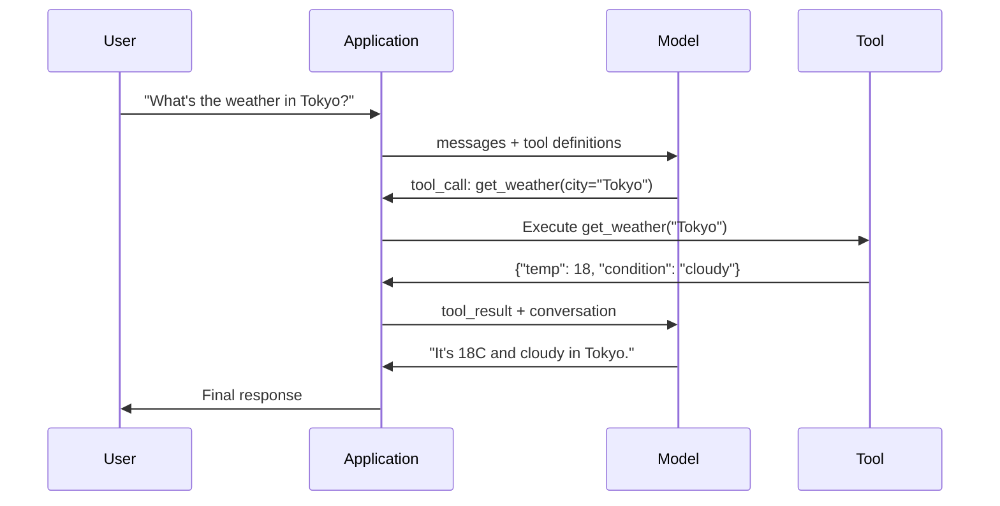

# फ़ंक्शन कॉलिंग और टूल उपयोग करें फ़ंक्शन调用与工具使用

> एलएलएम कुछ नहीं कर सकते। वे पाठ उत्पन्न करते हैं। यह पूरी क्षमता है। वे मौसम की जांच नहीं कर सकते, डेटाबेस से क्वेरी नहीं कर सकते, ईमेल नहीं भेज सकते, कोड नहीं चला सकते, या फ़ाइल नहीं पढ़ सकते। हर "AI एजेंट" जिसे आपने कभी देखा है वह एक LLM है जो JSON उत्पन्न करता है जो कहता है कि किस फ़ंक्शन को कॉल करना है -- और फिर आपका कोड वास्तव में इसे कॉल करता है। मॉडल मस्तिष्क है। उपकरण हाथ हैं। कार्य कॉल तंत्रिका तंत्र उन्हें जोड़ता है।

> **【中文解读】**LLM केवल पाठ उत्पन्न कर सकता है। फ़ंक्शन调用让模型输出结构化 JSON 指定要调用函数, द्वारा कोड实际执行──模型是脑,工具是双手, फ़ंक्शन调用是连接它们的神经系统──

> **【拓展：Function Calling→MCP与Agent】**फ़ंक्शन कॉलिंग एआई एजेंट का मूल तंत्र है, एमसीपी प्रोटोकॉल ने इस आधार पर उपकरण विवरण और विनियमन प्रक्रिया को मानक बनाया है, क्लाउड के आधार प्रोटोकॉल है।

>  **【前置】**学本节前请先掌握:(1) चरण 11·01(प्रॉम्प्ट इंजीनियरिंग) 理解 LLM 如何处理 शीघ्र;(2) चरण 11·03( संरचित आउटपुट) 理解 JSON Schema,本节重度依赖;(3) पायथन 字典、JSON 序列化、try/except 异常处理──如果不会写 JSON Schema,先看 jsonschema 库文档本节不会从头讲──

**Type:** Build | **类型:** 构建
**Languages:** Python | **语言:** Python
**Prerequisites:** Phase 11 Lesson 03 (Structured Outputs) | **前置知识:** Phase 11 · 03 (结构化输出)
**Time:** ~75 minutes | **时间:** ~75 分钟
**Related:**चरण 11 · 14 (मॉडल कॉन्टेक्स्ट प्रोटोकॉल)  जब एक उपकरण मेजबानों के बीच साझा किया जाता है, तो इनलाइन फ़ंक्शन कॉल से एमसीपी सर्वर तक स्नातक करें। यह पाठ इनलाइन मामले को कवर करता है; एमसीपी प्रोटोकॉल मामले को कवर करता है।**相关:**चरण 11 · 14 (模型上下文协议)  जब उपकरण को मुख्य मंच साझा करने की आवश्यकता होती है, तो आंतरिक फ़ंक्शन से उन्नयन को MCP 服务器 हेतु调用──本课讲内联场景;MCP 讲协议场景──

## सीखने के लक्ष्य

- फ़ंक्शन कॉल लूप को लागू करेंः टूल स्कीम परिभाषित करें, मॉडल के टूल-कॉल JSON का विश्लेषण करें, फ़ंक्शन निष्पादित करें और परिणाम वापस करें
  实现 फ़ंक्शन调用循环: परिभाषित उपकरण योजना、解析模型的工具调用 JSON、执行 फ़ंक्शन并返回结果
- स्पष्ट विवरण और टाइप किए गए पैरामीटर के साथ डिजाइन उपकरण योजनाएं जिन्हें मॉडल विश्वसनीय रूप से कॉल कर सकता है
  डिजाइन के लिए स्पष्ट विवरण और वर्गीकरण तत्वों के उपकरण योजना, मॉडल को विश्वसनीय रूप से अनुकूलित करने में सक्षम बनाने के लिए
- जटिल प्रश्नों के उत्तर देने के लिए कई फ़ंक्शन कॉल को चेन करने वाले एक बहु-टर्न एजेंट लूप बनाएं
  ढ़ेरचक्र एजेंट ढ़ेरचक्र, श्रृंखला ढ़ेरचक्र का उपयोग जटिल प्रश्नों के उत्तर देने के लिए कई कार्यों का उपयोग करने के लिए
- एज केस को कॉल करने वाले हैंडल फ़ंक्शनः समानांतर उपकरण कॉल, त्रुटि प्रसार, और असीमित उपकरण लूप को रोकने
  处理函数调用边缘情况:并行工具调用、错误传播和防止无限工具循环

> **【中文解读】**इस वर्ग का उद्देश्य: फ़ंक्शन को संभालना (Funktion Calling) LLM को बाहरी उपकरण का उपयोग करने दें।


## समस्या  समस्या परिचय

आप एक चैटबॉट बनाते हैं. एक उपयोगकर्ता पूछता है, "टोक्यो में मौसम कैसा है अभी?"

> आप एक चैट मशीन का निर्माण करते हैं। उपयोगकर्ता पूछता हैः "东京现在天气怎么样?"

मॉडल जवाब देता हैः "मेरे पास वास्तविक समय मौसम डेटा तक पहुंच नहीं है, लेकिन मौसम के आधार पर, टोक्यो लगभग 15 डिग्री सेल्सियस है . . . "

> 模型回复 एक मुक्त घोषणा के साथ कल्पना उत्तर.

यह एक भ्रम है जो एक अस्वीकरण के रूप में पहना हुआ है। मॉडल मौसम नहीं जानता है। यह कभी नहीं होगा। मौसम हर घंटे बदलता है। मॉडल के प्रशिक्षण डेटा महीनों पुराना है।

> यह एक स्पष्ट रूप से जिम्मेदार ठहराने का भ्रम है। मॉडल मौसम को नहीं जानता, और कभी नहीं जानता। मौसम हर घंटे बदलता है।

सही उत्तर के लिए OpenWeatherMap API को कॉल करना आवश्यक है, वर्तमान तापमान प्राप्त करना और वास्तविक संख्या लौटा देना। मॉडल एपीआई को नहीं बुला सकता है। आपका कोड कर सकता है। लापता टुकड़ाः एक संरचित प्रोटोकॉल जो मॉडल को यह कहने देता है "मुझे इन तर्कों के साथ मौसम एपीआई को कॉल करने की आवश्यकता है" और आपके कोड को इसे निष्पादित करने देता है और परिणाम वापस फ़ीड करता है।

> सही जवाब OpenWeatherMap API को अनुकूलित करने की आवश्यकता है। मॉडल API को अनुकूलित नहीं कर सकता है, आपका कोड कर सकता है।

यह फ़ंक्शन कॉल है. मॉडल संरचनात्मक JSON आउटपुट करता है जो वर्णन करता है कि किस फ़ंक्शन को किस तर्क के साथ बुलाया जाना है। आपका आवेदन फ़ंक्शन को निष्पादित करता है। परिणाम बातचीत में वापस जाता है। मॉडल अपने अंतिम उत्तर को उत्पन्न करने के लिए परिणाम का उपयोग करता है।

> यह है फ़ंक्शन调用――模型输出结构化 JSON 描述要调用哪个函数――你的应用执行函数,结果回到对话中――

कार्य कॉल के बिना, LLM ज्ञानकोश हैं। इसके साथ, वे एजेंट बन जाते हैं।

>  कोई फ़ंक्शन नहीं, LLM  है                                                                                                                                                                                                                                                         

>  **【类比】**LLM 像一位"嘴强王者"能讲清楚任何概念,但不能动手──函调是给这位嘴强王者配一个"小弟"系统: यह कहता है"小弟,去查东京天气"→小弟照做→回来报告"18度阴天"→它转述给用户──模型从不离开王座(生成代币),但通过发号施令(JSON) 和接收战报(工具_结果),它可以调整整个外部世界──

## अवधारणा का मूल अवधारणा

> **【中文解读】**函数调用 (Function Calling) LLM को केवल पाठ के बजाय संरचनात्मक उपकरण调用 अनुरोध बनाने के लिए अनुमति दें। यह एक बाहरी उपकरण (Search, Database query, API) के माध्यम से जानकारी प्राप्त करने और निष्पादन संचालन के लिए एआई एजेंट का निर्माण करने का आधार है।

> **【拓展：函数调用与 Agent 系统】**OpenAI के फ़ंक्शन को तैनात करने के लिए 2023 में लॉन्च किया गया है, वर्तमान में इसे समर्थन और तैनात करने और तैनात करने के लिए तैनात किया गया है।


### लूप कॉल करने वाला कार्य

प्रत्येक उपकरण-उपयोग बातचीत एक ही 5-चरण लूप का पालन करती है।

> प्रत्येक उपकरण का उपयोग करते समय एक ही 5 चरण चक्र का पालन किया जाता है।



चरण 1: उपयोगकर्ता संदेश भेजता है। चरण 2: मॉडल को उपकरण परिभाषाओं के साथ संदेश प्राप्त होता है (जिसॉन योजना उपलब्ध कार्यों का वर्णन करती है) । चरण 3: पाठ के साथ प्रतिक्रिया के बजाय, मॉडल एक उपकरण कॉल आउटपुट करता है - एक संरचित JSON ऑब्जेक्ट फ़ंक्शन नाम और तर्क के साथ। चरण 4: आपका कोड फ़ंक्शन निष्पादित करता है और परिणाम को कैप्चर करता है। चरण 5: परिणाम मॉडल पर वापस जाता है, जिसके पास अब अंतिम उत्तर प्राप्त करने के लिए वास्तविक डेटा है।

> 步骤 1: उपयोगकर्ता संदेश भेजें──步骤 2: मॉडल प्राप्त संदेश तथा उपकरण परिभाषा( वर्णित उपलब्ध फ़ंक्शन की JSON योजना)  चरण 3: मॉडल पाठ पर वापस नहीं आता है, बल्कि आउटपुट उपकरण को एक संरचनात्मक JSON वस्तु पर भेजता है जिसमें फ़ंक्शन नाम और तत्व शामिल होते हैं──步骤 4: आपका कोड निष्पादित फ़ंक्शन और परिणाम प्राप्त करता है── चरण 5: परिणाम मॉडल में वापस आता है, मॉडल अब वास्तविक डेटा के साथ अंतिम उत्तर उत्पन्न करता है──

मॉडल कभी कुछ भी निष्पादित नहीं करता है यह केवल तय करता है कि क्या कॉल करना है और किस तर्क के साथ। आपका कोड निष्पादक है।

> 模型从不执行任何东西――它只决定调用什么――使用什么参数――你的代码才是执行者――

> 🤔 **【困惑】**प्रश्नः मॉडल सीधे कोड का निष्पादन क्यों नहीं करता? इस प्रकार एक कदम की बचत क्यों नहीं होती?**隔离** मॉडल में सा बॉक्स के बाहर निष्पादन होगा सुरक्षित जोखिम है  डेटाबेस को हटाने 发恶意邮件;分两步让你能在执行前校验(2) **可观测** निष्पादन में आपकी प्रक्रिया, 能加日志、限流、审计;**可移植**同一模型能驱动不同语言 (Python/JS/Go) के उपकरण संग्रह,模型本身不绑定运行时──

### उपकरण परिभाषाएँः JSON स्कीमा अनुबंध

प्रत्येक उपकरण को JSON स्कीम द्वारा परिभाषित किया जाता है जो मॉडल को बताता है कि फ़ंक्शन क्या करता है, यह किस प्रकार के तर्क लेता है, और उन तर्कों के प्रकार क्या होने चाहिए।

> प्रत्येक उपकरण को JSON Schema द्वारा परिभाषित किया जाता है, मॉडल को बताता है कि यह फ़ंक्शन क्या करना है, क्या पैरामीटर स्वीकार करना है, पैरामीटर किस प्रकार का होना चाहिए।

```json
{
  "type": "function",
  "function": {
    "name": "get_weather",
    "description": "Get current weather for a city. Returns temperature in Celsius and conditions.",
    "parameters": {
      "type": "object",
      "properties": {
        "city": {
          "type": "string",
          "description": "City name, e.g. 'Tokyo' or 'San Francisco'"
        },
        "units": {
          "type": "string",
          "enum": ["celsius", "fahrenheit"],
          "description": "Temperature units"
        }
      },
      "required": ["city"]
    }
  }
}
```

`description`"एक शहर के लिए वर्तमान मौसम प्राप्त करें। तापमान सेल्सियस और परिस्थितियों में लौटाता है।" विवरण उपकरण चयन के लिए एक संकेत है।

> `description`字段至关重要──模型读这些描述来决定何时以及如何使用工具──模糊描述如"天气获取" उत्पन्न होने वाले उपकरण चयन प्रभाव "शहर के वर्तमान मौसम, लौटने के लिए तापमान और मौसम की स्थिति प्राप्त करने" से भिन्न है──描述本身就是工具选择的提示──

> ️ **【易错点】**工具描述的 3 个坑:(1) **描述太短**"प्राप्त डेटा" का वर्णन, मॉडल分不清该使用 `get_weather`और `get_stock_price`,会乱选;修复: प्रत्येक विवरण कम से कम 30 字,写清"做什么 + 输入 + 输出"――(2) **描述互相重叠**दो औजार都写"获取信息",模型选哪个全凭运气;修复: प्रत्येक विवरण强调独特场景("获取实时天气" vs "获取历史天气")**隐藏前置条件** जैसे `delete_file(path)`需要先 `confirm()`, लेकिन वर्णन नहीं कहता, मॉडल सीधे हटाएगा;修复: इसे दो उपकरणों में विभाजित या दो उपकरणों में विभाजित कर देना।

### प्रदाता तुलना

प्रत्येक प्रमुख प्रदाता फ़ंक्शन कॉल का समर्थन करता है, लेकिन एपीआई सतह अलग है।

> प्रत्येक मुख्य प्रदाता फ़ंक्शन को समर्थन देता है, लेकिन एपीआई इंटरफ़ेस अलग-अलग होते हैं।

| Provider | API Parameter | Tool Call Format | Parallel Calls | Forced Calling |
|----------|--------------|-----------------|---------------|----------------|
| OpenAI (GPT-5, o4) | `tools` | `tool_calls[].function` | Yes (multiple per turn) | `tool_choice="required"` |
| Anthropic (Claude 4.6/4.7) | `tools` | `content[].type="tool_use"` | Yes (multiple blocks) | `tool_choice={"type":"any"}` |
| Google (Gemini 3) | `function_declarations` | `functionCall` | Yes | `function_calling_config` |
| Open-weight (Llama 4, Qwen3, DeepSeek-V3) | Native `tools` on Llama 4; Hermes or ChatML on others | Mixed | Model-dependent | Prompt-based or `tool_choice` if supported |

2026 तक तीन बंद प्रदाताओं ने लगभग समान JSON-Schema- आधारित प्रारूपों पर एक साथ इकट्ठा हो गए हैं।`tools`ओपनएआई के आकार से मेल खाने वाला फ़ील्ड। ओपन-वेट फाइनट्यून्स अभी भी भिन्न होते हैं  हर्मेस प्रारूप (नोस रिसर्च) तृतीय-पक्ष फाइनट्यून्स के लिए सबसे आम है। होस्ट के बीच साझा किए गए उपकरणों के लिए, इनलाइन फ़ंक्शन-कॉल करने पर MCP (चरण 11 · 14) को प्राथमिकता दें  सर्वर उन सभी के लिए समान है।

> 2026 तक, तीन बंद स्रोत प्रदाताओं ने लगभग एक ही JSON योजना के आधार पर प्रारूप के साथ प्रवृत्त किया है।`tools`字段匹配 OpenAI के ढांचे──开源权重微调模型仍然各异Hermes 格式──NousResearch) तीसरे पक्ष के微调中最常见的──跨主机共享工具时优先使用MCP──Phase 11 · 14)

### उपकरण विकल्पः ऑटो, आवश्यक, विशिष्ट

आप नियंत्रण जब मॉडल उपकरण का उपयोग करता है.

> आप नियंत्रण कर सकते हैं मॉडल कैसे उपयोग करें उपकरण

**Auto**(डिफ़ॉल्ट): मॉडल तय करता है कि क्या एक उपकरण को कॉल करना है या सीधे जवाब देना है. "2 + 2 क्या है?" - सीधे जवाब देता है. "वेदर क्या है?" - उपकरण को बुलाता है.
**自动（默认）**: मॉडल स्वयं निर्णय लेता है कि क्या यह एक उपकरण है या एक सीधा प्रतिक्रिया है।

**Required**उदाहरण: मॉडल को कम से कम एक उपकरण को कॉल करना चाहिए। इसका उपयोग तब करें जब आप जानते हों कि उपयोगकर्ता के इरादे को उपकरण की आवश्यकता होती है। यह मॉडल को वास्तविक डेटा की तलाश करने के बजाय अनुमान लगाने से रोकता है।
**必需**मॉडल को कम से कम एक उपकरण का उपयोग करना चाहिए।

**Specific function**: मॉडल को किसी विशेष फ़ंक्शन को कॉल करने के लिए मजबूर करें। `tool_choice={"type":"function", "function": {"name": "get_weather"}}`यह सुनिश्चित करता है कि मौसम उपकरण बुलाया जाता है, चाहे क्वेरी. रूटिंग के लिए इसका उपयोग करें - जब अपस्ट्रीम तर्क पहले से ही निर्धारित किया है कि उपकरण की जरूरत है.
**特定函数**:强制模型调用某特定函数──`tool_choice={"type":"function", "function": {"name": "get_weather"}}`सुरक्षा मौसम उपकरण का उपयोग किया जाता है, चाहे कोई भी प्रश्न हो।

### समानांतर कार्य कॉल

GPT-4o और क्लाउड एक ही बारी में कई कार्यों को कॉल कर सकते हैं। एक उपयोगकर्ता पूछता हैः "टोक्यो और न्यूयॉर्क में मौसम क्या है?" मॉडल एक ही समय में दो उपकरण कॉल आउटपुट करता हैः

> GPT-4o 和 क्लाउड एक ही राउंड में कई फ़ंक्शन को调用 कर सकते हैं।

```json
[
  {"name": "get_weather", "arguments": {"city": "Tokyo"}},
  {"name": "get_weather", "arguments": {"city": "New York"}}
]
```

आपका कोड दोनों को निष्पादित करता है (आदर्श रूप से एक साथ), दोनों परिणाम देता है, और मॉडल एक एकल प्रतिक्रिया संश्लेषित करता है। यह 2 से 1 तक घूमने-फिरने की यात्रा को कम करता है। प्रति क्वेरी 5-10 टूल कॉल वाले एजेंटों के लिए, समानांतर कॉल 60-80% तक विलंबता कम करता है।

> आप के कोड को दो प्रकार के निष्पादन (आदर्श स्थिति को निष्पादन) करने के लिए, दो परिणामों को वापस करने के लिए, मॉडल एक बार पुनः निष्पादन (एक बार पुनः निष्पादन) से एक बार पुनः निष्पादन (एक बार पुनः निष्पादन) करने के लिए, प्रति प्रश्न 5-10 बार उपकरण को निष्पादन करने के लिए आवश्यक है, और प्रति प्रश्न 60-80% देरी को कम करने के लिए।

> ️ **【易错点】**और 2 गड्ढे इस्तेमाल किए गए:**顺序依赖未声明** उपयोगकर्ता पूछता है"पहले देखें A 公司 शेयर मूल्य, फिर देखें B 公司", मॉडल可能并行调用两个 `get_price`, लेकिन आप एक पूर्व वापसी की गारंटी नहीं कर सकते;`get_price`工具的描述 写明"独立查询" के लिए, क्रमशः उपयोग की आवश्यकता होती है `compare_stocks(A, B)`单工具封装──(2) **共享状态竞争**并行调用 `increment_counter()`两次, परिणाम केवल 1 जोड़ता है;修复:工具实现里加锁,或让模型串行调用副作用工具──

### संरचनात्मक आउटपुट बनाम फ़ंक्शन कॉल

पाठ 03 में संरचित आउटपुट शामिल थे। फ़ंक्शन कॉलिंग में एक ही JSON स्कीमा मशीन का उपयोग किया जाता है, लेकिन एक अलग उद्देश्य के लिए।

> पाठ 03 讲了结构化输出――函数调用相同的JSON Schema 机制, लेकिन उद्देश्य भिन्न

**Structured outputs**उदाहरण: उत्पाद जानकारी को पाठ से निकालें जैसे कि`{name, price, in_stock}`. .
**结构化输出**: अनिवार्य मॉडल विशिष्ट रूप के अनुसार डेटा उत्पन्न करना।`{name, price, in_stock}`

**Function calling**: मॉडल एक कार्य को निष्पादित करने का इरादा घोषित करता है। आउटपुट एक मध्यवर्ती चरण है। उदाहरण: `get_weather(city="Tokyo")`-- मॉडल एक कार्रवाई का अनुरोध कर रहा है, अंतिम उत्तर नहीं पैदा कर रहा है।
**函数调用**मॉडल घोषणा किसी क्रिया का उद्देश्य निष्पादित करनाः`get_weather(city="Tokyo")` मॉडल में अनुरोध आंदोलन, नहीं उत्पन्न अंतिम उत्तर

जब आप डेटा निष्कर्षण चाहते हैं तो संरचित आउटपुट का उपयोग करें। जब आप मॉडल को बाहरी प्रणालियों के साथ बातचीत करना चाहते हैं तो फ़ंक्शन कॉल का उपयोग करें।
डेटा निकालने के समय संरचनात्मक आउटपुट का उपयोग करना।

### सुरक्षाः गैर-विमर्श योग्य नियम

फ़ंक्शन कॉलिंग सबसे खतरनाक क्षमता है जिसे आप एलएलएम दे सकते हैं। मॉडल चुनता है कि क्या निष्पादित करना है। यदि आपके टूल सेट में डेटाबेस क्वेरी शामिल हैं, तो मॉडल क्वेरी का निर्माण करता है। यदि इसमें शेल कमांड शामिल हैं, तो मॉडल उन्हें लिखता है।

> 函数调用是你赋予LLM最危险的能力──模型决定执行什么── यदि आपका टूलसेट डेटाबेस क्वेरी शामिल है, तो मॉडल क्वेरी语句── यदि इसमें शेल 命令 शामिल है, तो मॉडल लिख आदेश──

**Rule 1: Never pass model-generated SQL directly to a database.**मॉडल ड्रॉप टेबल, यूनियन इंजेक्शन या क्वेरी उत्पन्न कर सकता है और करेगा जो हर पंक्ति को वापस करता है। हमेशा पैरामीटर। हमेशा मान्य करें। हमेशा ऑपरेशन की अनुमति सूची का उपयोग करें।
**规则 1：永远不要把模型生成的 SQL 直接传给数据库。**模型会(也会) उत्पन्न DROP TABLE、UNION 注入或返回所有的查询──始终参数化──始终校验──始终使用操作白名单──

**Rule 2: Allowlist functions.**मॉडल केवल आपके द्वारा स्पष्ट रूप से परिभाषित कार्यों को कॉल कर सकता है। कभी भी एक सामान्य "नाम द्वारा किसी भी कार्य को निष्पादित करें" उपकरण न बनाएं। यदि आपके पास 50 आंतरिक कार्य हैं, तो केवल 5 को उजागर करें जो उपयोगकर्ता की आवश्यकता है।
**规则 2：函数白名单。**模型 केवल आपके स्पष्ट रूप से परिभाषित फ़ंक्शन को调用 कर सकता है। हमेशा उपयोग किए जाने वाले "नामबद्ध रूप से निष्पादित किसी भी फ़ंक्शन" उपकरण को कभी न करें। यदि 50 आंतरिक फ़ंक्शन हैं, तो केवल 5 को उजागर करें जो उपयोगकर्ता की आवश्यकता है।

**Rule 3: Validate arguments.**मॉडल शहर के नाम से गुजर सकता है `"; DROP TABLE users; --"`. निष्पादन से पहले अपेक्षित प्रकारों, सीमाओं और प्रारूपों के विरुद्ध प्रत्येक तर्क को मान्य करें।
**规则 3：校验参数。**模型可能传入 `"; DROP TABLE users; --"`作为城市名称──执行前对照期望的类型、范围和形式校验每个参数──

**Rule 4: Sanitize tool results.**यदि कोई उपकरण संवेदनशील डेटा (एपीआई कुंजी, पीआईआई, आंतरिक त्रुटियां) लौटाता है, तो इसे मॉडल पर वापस भेजने से पहले फ़िल्टर करें। मॉडल में इसका जवाब शब्दशः में शामिल किया जाएगा।
**规则 4：净化工具结果。**यदि उपकरण संवेदनशील डेटा को लौटाता है, तो नमूना पहले से ही परिणामों को शामिल करता है।

**Rule 5: Rate limit tool calls.**एक लूप में एक मॉडल उपकरण को सैकड़ों बार बुला सकता है। अधिकतम सेट करें (10-20 कॉल प्रति बातचीत उचित है) । अंतहीन लूप तोड़ें।
**规则 5：限流工具调用。**循环中的模型可能调用工具几百次──设上限(每次对话 10-20次合理)──打破无限循环──

> ️ **【易错点】**循环失控的实战案例:模型调 `get_weather("Tokyo")`→东京返回 "मौसमी"→模型"觉得不对"→再调一次→还是雨→继续调... 5 分钟烧了200次调用──修复:(1) 全局 `max_tool_calls=20`计计器,超过即终止;(2) समान तत्वों के समान उपकरण के निरंतर调调用,3 次后强制跳出;(3) चरण 15·13 के लागत राज्यपाल के साथ 监控 टोकन 消耗,超值杀开──

### त्रुटि संभाल

उपकरण विफल होते हैं. एपीआई समय समाप्त होता है. डेटाबेस गिर जाते हैं. फ़ाइलें मौजूद नहीं हैं. मॉडल को पता होना चाहिए कि उपकरण कब विफल होता है और क्यों।

> 工具会失败──API会超时──数据库会机──文件不存在──模型需要知道工具何时失败以及为什么失败──

संरचनात्मक उपकरण परिणामों के रूप में त्रुटियों को लौटाएं, अपवाद नहींः

> संरचनात्मक उपकरण के रूप में त्रुटि को वापस करने के लिए, असामान्य मत छोड़ोः

```json
{
  "error": true,
  "message": "City 'Toky' not found. Did you mean 'Tokyo'?",
  "code": "CITY_NOT_FOUND"
}
```

मॉडल इसे पढ़ता है, अपने तर्क को समायोजित करता है, और पुनः प्रयास करता है। मॉडल संरचित त्रुटि संदेशों से स्वयं को सुधारने में अच्छे हैं। वे खाली प्रतिक्रियाओं या सामान्य "कुछ गलत चला गया" त्रुटियों से ठीक होने में खराब हैं।

> 模型读这个,调整参数重试――模型擅长从结构化错误信息中自我纠正――但不擅长从空响应或泛化"出错了"错误中恢复――

> 🤔 **【困惑】**प्रश्नः क्यों नहीं सीधे छोड़ असामान्य करें ऊपर लेयर कोशिश / अपवाद  प्रसंस्करण? एः चूंकि छोड़ असामान्य एजेंट  चक्र टूट जाता है, मॉडल हमेशा नहीं देखता है कि त्रुटि यह नहीं जानता कि उपकरण विफल हो गया है, लगता है कि सफलतापूर्वक विचार जारी रखने के लिए, अंततः "幻觉答案" को आउटपुट करते हैं।`"error": true`और निर्णय अगले कदमः परिवर्तन पैरामीटर पुनः प्रयास करें, उपकरण बदलें, या वास्तव में उपयोगकर्ता को बताएं"मैं नहीं कर रहा हूँ"― यह एजेंट स्वयं को सुधारने का आधार है―

### एमसीपीः मॉडल संदर्भ प्रोटोकॉल

एमसीपी उपकरण सहकार्य के लिए एंथ्रोपिक का खुला मानक है। प्रत्येक एप्लिकेशन के बजाय अपने स्वयं के उपकरणों को परिभाषित करने के लिए, एमसीपी एक सार्वभौमिक प्रोटोकॉल प्रदान करता हैः उपकरण एमसीपी सर्वर द्वारा सेवा प्रदान किए जाते हैं, जो एमसीपी क्लाइंट (जैसे क्लाउड कोड, पाठ्यक्रम या आपके एप्लिकेशन) द्वारा खपत होते हैं।

> MCP एक मानव संसाधन के खुले मानक है, जो उपकरण के लिए उपयोग किया जाता है परस्पर संचालन। MCP 提供通用协议: उपकरण द्वारा MCP 服务器 द्वारा प्रदान किया जाता है, द्वारा MCP 客户端 (जैसे क्लाउड कोड, पाठ्यक्रम या आपका अनुप्रयोग) खपत, बजाय प्रत्येक अनुप्रयोग अपने स्वयं के परिभाषित उपकरण।

एक MCP सर्वर किसी भी संगत क्लाइंट के लिए उपकरण उजागर कर सकता है। एक Postgres MCP सर्वर किसी भी MCP संगत एजेंट डेटाबेस एक्सेस देता है। एक GitHub MCP सर्वर किसी भी एजेंट रिपॉजिटरी एक्सेस देता है। उपकरण एक बार परिभाषित किए जाते हैं, हर जगह उपयोग किए जाते हैं।

> एक MCP  सर्वर किसी भी मेजबान ग्राहक जोखिम उपकरण को प्रदान कर सकता है。 पोस्टग्रेस MCP  सर्वर किसी भी MCP  मेजबान एजेंट को डेटाबेस एक्सेस अधिकार प्रदान करता है。 GitHub MCP  सर्वर किसी भी एजेंट को प्रदान करता है  भंडारण एक्सेस अधिकार प्रदान करता है。 उपकरण परिभाषित एक बार, उपयोग करने के लिए एक जगह है。

MCP नेटवर्क को HTTP क्या है, यह कॉल करने के लिए काम करता है। यह परिवहन परत को मानकीकृत करता है ताकि उपकरण पोर्टेबल हो जाएं।

> MCP 之于函数调用,就像 HTTP 之于网络── यह मानक ट्रांसफर लेयर बनाता है, जिससे उपकरण ट्रांसपोर्ट करने योग्य हो जाते हैं──

>  **【前置】**📌 📌 📌 📌 📌 📌 📌 📌 📌 📌 📌 📌 📌 📌 📌 📌 📌 📌 📌 📌 📌 📌 📌 📌 📌 📌 📌 📌 📌 📌 📌 📌 📌 📌 📌 📌 📌 📌 📌 📌 📌 📌 📌 📌 📌 📌 📌 📌 📌 📌 📌 📌 📌 📌 📌 📌 📌 📌 📌 📌 📌 📌 📌 📌 📌 📌 📌 📌 📌 📌 📌 📌 📌 📌 📌 📌 📌 📌 📌 📌 📌 📌 📌 📌 📌 📌 📌 📌 📌 📌 📌 📌 📌 📌 📌 📌 📌 📌 📌 📌 📌 📌 📌 📌 📌 📌 📌 📌 📌 📌 📌 📌 📌 📌 📌 📌 📌 📌 📌 📌 📌 📌 📌 📌 📌 📌 📌 📌 📌 📌 📌 📌 📌 📌 📌 📌 📌 📌 📌 📌 📌 📌 📌 📌 📌 📌 📌 📌 📌 📌 📌 📌 📌 📌 📌 📌 📌 📌 📌 📌 📌 📌 📌 📌 📌 📌 📌 📌 📌 📌 📌 📌 📌 📌 📌 📌 📌 📌 📌 📌 📌 📌 📌 📌 📌 📌 📌 📌 📌 📌 📌 📌 📌 📌 📌 📌 📌 📌 📌 📌 📌 📌 📌 📌 📌 📌 📌 📌 📌 📌 📌 📌 📌 📌 📌 📌 📌 📌 📌                                    

## इसे बनाओ, इसे पूरा करो।
```figure
mx-tool-call-loop
```

## इसे बनाओ

### चरण 1: उपकरण रजिस्ट्री को परिभाषित करें

एक रजिस्ट्री बनाएं जो टूल परिभाषाओं और उनके कार्यान्वयन को संग्रहीत करता है। प्रत्येक टूल में एक JSON स्कीमा परिभाषा (जो मॉडल देखता है) और एक पायथन फ़ंक्शन (जो आपका कोड निष्पादित करता है) होता है।

> 构建注册表存储工具定义和实现── प्रत्येक工具有一个JSON Schema定义(模型看的) 和一个Python 函数(你的代码执行的)──

```python
import json
import math
import time
import hashlib


TOOL_REGISTRY = {}


def register_tool(name, description, parameters, function):
    TOOL_REGISTRY[name] = {
        "definition": {
            "type": "function",
            "function": {
                "name": name,
                "description": description,
                "parameters": parameters,
            },
        },
        "function": function,
    }
```

### चरण 2: पांच उपकरण लागू करें

एक कैलकुलेटर, मौसम खोज, वेब खोज सिम्युलेटर, फ़ाइल रीडर, और कोड रनर बनाएं।

> निर्माण कैलकुलेटर, मौसम पूछताछ, नेटवर्क खोज अनुकरणीय, फ़ाइल पाठक और कोड संचालक

```python
def calculator(expression, precision=2):
    allowed = set("0123456789+-*/.() ")
    if not all(c in allowed for c in expression):
        return {"error": True, "message": f"Invalid characters in expression: {expression}"}
    try:
        result = eval(expression, {"__builtins__": {}}, {"math": math})
        return {"result": round(float(result), precision), "expression": expression}
    except Exception as e:
        return {"error": True, "message": str(e)}


WEATHER_DB = {
    "tokyo": {"temp_c": 18, "condition": "cloudy", "humidity": 72, "wind_kph": 14},
    "new york": {"temp_c": 22, "condition": "sunny", "humidity": 45, "wind_kph": 8},
    "london": {"temp_c": 12, "condition": "rainy", "humidity": 88, "wind_kph": 22},
    "san francisco": {"temp_c": 16, "condition": "foggy", "humidity": 80, "wind_kph": 18},
    "sydney": {"temp_c": 25, "condition": "sunny", "humidity": 55, "wind_kph": 10},
}


def get_weather(city, units="celsius"):
    key = city.lower().strip()
    if key not in WEATHER_DB:
        suggestions = [c for c in WEATHER_DB if c.startswith(key[:3])]
        return {
            "error": True,
            "message": f"City '{city}' not found.",
            "suggestions": suggestions,
            "code": "CITY_NOT_FOUND",
        }
    data = WEATHER_DB[key].copy()
    if units == "fahrenheit":
        data["temp_f"] = round(data["temp_c"] * 9 / 5 + 32, 1)
        del data["temp_c"]
    data["city"] = city
    return data


SEARCH_DB = {
    "python function calling": [
        {"title": "OpenAI Function Calling Guide", "url": "https://platform.openai.com/docs/guides/function-calling", "snippet": "Learn how to connect LLMs to external tools."},
        {"title": "Anthropic Tool Use", "url": "https://docs.anthropic.com/en/docs/tool-use", "snippet": "Claude can interact with external tools and APIs."},
    ],
    "MCP protocol": [
        {"title": "Model Context Protocol", "url": "https://modelcontextprotocol.io", "snippet": "An open standard for connecting AI models to data sources."},
    ],
    "weather API": [
        {"title": "OpenWeatherMap API", "url": "https://openweathermap.org/api", "snippet": "Free weather API with current, forecast, and historical data."},
    ],
}


def web_search(query, max_results=3):
    key = query.lower().strip()
    for db_key, results in SEARCH_DB.items():
        if db_key in key or key in db_key:
            return {"query": query, "results": results[:max_results], "total": len(results)}
    return {"query": query, "results": [], "total": 0}


FILE_SYSTEM = {
    "data/config.json": '{"model": "gpt-4o", "temperature": 0.7, "max_tokens": 4096}',
    "data/users.csv": "name,email,role\nAlice,alice@example.com,admin\nBob,bob@example.com,user",
    "README.md": "# My Project\nA tool-use agent built from scratch.",
}


def read_file(path):
    if ".." in path or path.startswith("/"):
        return {"error": True, "message": "Path traversal not allowed.", "code": "FORBIDDEN"}
    if path not in FILE_SYSTEM:
        available = list(FILE_SYSTEM.keys())
        return {"error": True, "message": f"File '{path}' not found.", "available_files": available, "code": "NOT_FOUND"}
    content = FILE_SYSTEM[path]
    return {"path": path, "content": content, "size_bytes": len(content), "lines": content.count("\n") + 1}


def run_code(code, language="python"):
    if language != "python":
        return {"error": True, "message": f"Language '{language}' not supported. Only 'python' is available."}
    forbidden = ["import os", "import sys", "import subprocess", "exec(", "eval(", "__import__", "open("]
    for pattern in forbidden:
        if pattern in code:
            return {"error": True, "message": f"Forbidden operation: {pattern}", "code": "SECURITY_VIOLATION"}
    try:
        local_vars = {}
        exec(code, {"__builtins__": {"print": print, "range": range, "len": len, "str": str, "int": int, "float": float, "list": list, "dict": dict, "sum": sum, "min": min, "max": max, "abs": abs, "round": round, "sorted": sorted, "enumerate": enumerate, "zip": zip, "map": map, "filter": filter, "math": math}}, local_vars)
        result = local_vars.get("result", None)
        return {"success": True, "result": result, "variables": {k: str(v) for k, v in local_vars.items() if not k.startswith("_")}}
    except Exception as e:
        return {"error": True, "message": f"{type(e).__name__}: {e}"}
```

### चरण 3: सभी उपकरण पंजीकृत करें

> सभी उपकरण पंजीकृत करें

```python
def register_all_tools():
    register_tool(
        "calculator", "Evaluate a mathematical expression. Supports +, -, *, /, parentheses, and decimals. Returns the numeric result.",
        {"type": "object", "properties": {"expression": {"type": "string", "description": "Math expression, e.g. '(10 + 5) * 3'"}, "precision": {"type": "integer", "description": "Decimal places in result", "default": 2}}, "required": ["expression"]},
        calculator,
    )
    register_tool(
        "get_weather", "Get current weather for a city. Returns temperature, condition, humidity, and wind speed.",
        {"type": "object", "properties": {"city": {"type": "string", "description": "City name, e.g. 'Tokyo' or 'San Francisco'"}, "units": {"type": "string", "enum": ["celsius", "fahrenheit"], "description": "Temperature units, defaults to celsius"}}, "required": ["city"]},
        get_weather,
    )
    register_tool(
        "web_search", "Search the web for information. Returns a list of results with title, URL, and snippet.",
        {"type": "object", "properties": {"query": {"type": "string", "description": "Search query"}, "max_results": {"type": "integer", "description": "Maximum results to return", "default": 3}}, "required": ["query"]},
        web_search,
    )
    register_tool(
        "read_file", "Read the contents of a file. Returns the file content, size, and line count.",
        {"type": "object", "properties": {"path": {"type": "string", "description": "Relative file path, e.g. 'data/config.json'"}}, "required": ["path"]},
        read_file,
    )
    register_tool(
        "run_code", "Execute Python code in a sandboxed environment. Set a 'result' variable to return output.",
        {"type": "object", "properties": {"code": {"type": "string", "description": "Python code to execute"}, "language": {"type": "string", "enum": ["python"], "description": "Programming language"}}, "required": ["code"]},
        run_code,
    )
```

### चरण 4: कॉल लूप फ़ंक्शन बनाएं

यह मूल इंजन है. यह मॉडल का अनुकरण करता है, यह तय करता है कि किस उपकरण को कॉल करना है, उपकरण को निष्पादित करता है, और परिणाम वापस फ़ीड करता है।

> यह मूल इंजन है। यह मॉडल का अनुकरण करता है जो यह तय करता है कि किस उपकरण का उपयोग करना है।

```python
def simulate_model_decision(user_message, tools, conversation_history):
    msg = user_message.lower()

    if any(word in msg for word in ["weather", "temperature", "forecast"]):
        cities = []
        for city in WEATHER_DB:
            if city in msg:
                cities.append(city)
        if not cities:
            for word in msg.split():
                if word.capitalize() in [c.title() for c in WEATHER_DB]:
                    cities.append(word)
        if not cities:
            cities = ["tokyo"]
        calls = []
        for city in cities:
            calls.append({"name": "get_weather", "arguments": {"city": city.title()}})
        return calls

    if any(word in msg for word in ["calculate", "compute", "math", "what is", "how much"]):
        for token in msg.split():
            if any(c in token for c in "+-*/"):
                return [{"name": "calculator", "arguments": {"expression": token}}]
        if "+" in msg or "-" in msg or "*" in msg or "/" in msg:
            expr = "".join(c for c in msg if c in "0123456789+-*/.() ")
            if expr.strip():
                return [{"name": "calculator", "arguments": {"expression": expr.strip()}}]
        return [{"name": "calculator", "arguments": {"expression": "0"}}]

    if any(word in msg for word in ["search", "find", "look up", "google"]):
        query = msg.replace("search for", "").replace("look up", "").replace("find", "").strip()
        return [{"name": "web_search", "arguments": {"query": query}}]

    if any(word in msg for word in ["read", "file", "open", "cat", "show"]):
        for path in FILE_SYSTEM:
            if path.split("/")[-1].split(".")[0] in msg:
                return [{"name": "read_file", "arguments": {"path": path}}]
        return [{"name": "read_file", "arguments": {"path": "README.md"}}]

    if any(word in msg for word in ["run", "execute", "code", "python"]):
        return [{"name": "run_code", "arguments": {"code": "result = 'Hello from the sandbox!'", "language": "python"}}]

    return []


def execute_tool_call(tool_call):
    name = tool_call["name"]
    args = tool_call["arguments"]

    if name not in TOOL_REGISTRY:
        return {"error": True, "message": f"Unknown tool: {name}", "code": "UNKNOWN_TOOL"}

    tool = TOOL_REGISTRY[name]
    func = tool["function"]
    start = time.time()

    try:
        result = func(**args)
    except TypeError as e:
        result = {"error": True, "message": f"Invalid arguments: {e}"}

    elapsed_ms = round((time.time() - start) * 1000, 2)
    return {"tool": name, "result": result, "execution_time_ms": elapsed_ms}


def run_function_calling_loop(user_message, max_iterations=5):
    conversation = [{"role": "user", "content": user_message}]
    tool_definitions = [t["definition"] for t in TOOL_REGISTRY.values()]
    all_tool_results = []

    for iteration in range(max_iterations):
        tool_calls = simulate_model_decision(user_message, tool_definitions, conversation)

        if not tool_calls:
            break

        results = []
        for call in tool_calls:
            result = execute_tool_call(call)
            results.append(result)

        conversation.append({"role": "assistant", "content": None, "tool_calls": tool_calls})

        for result in results:
            conversation.append({"role": "tool", "content": json.dumps(result["result"]), "tool_name": result["tool"]})

        all_tool_results.extend(results)
        break

    return {"conversation": conversation, "tool_results": all_tool_results, "iterations": iteration + 1 if tool_calls else 0}
```

### चरण 5: तर्क की पुष्टि

एक सत्यापनकर्ता बनाएँ जो निष्पादन से पहले JSON योजना के साथ उपकरण कॉल तर्कों की जांच करता है।

> 构建校验器,在执行前对照 JSON Schema 检查工具调用参数──

```python
def validate_tool_arguments(tool_name, arguments):
    if tool_name not in TOOL_REGISTRY:
        return [f"Unknown tool: {tool_name}"]

    schema = TOOL_REGISTRY[tool_name]["definition"]["function"]["parameters"]
    errors = []

    if not isinstance(arguments, dict):
        return [f"Arguments must be an object, got {type(arguments).__name__}"]

    for required_field in schema.get("required", []):
        if required_field not in arguments:
            errors.append(f"Missing required argument: {required_field}")

    properties = schema.get("properties", {})
    for arg_name, arg_value in arguments.items():
        if arg_name not in properties:
            errors.append(f"Unknown argument: {arg_name}")
            continue

        prop_schema = properties[arg_name]
        expected_type = prop_schema.get("type")

        type_checks = {"string": str, "integer": int, "number": (int, float), "boolean": bool, "array": list, "object": dict}
        if expected_type in type_checks:
            if not isinstance(arg_value, type_checks[expected_type]):
                errors.append(f"Argument '{arg_name}': expected {expected_type}, got {type(arg_value).__name__}")

        if "enum" in prop_schema and arg_value not in prop_schema["enum"]:
            errors.append(f"Argument '{arg_name}': '{arg_value}' not in {prop_schema['enum']}")

    return errors
```

### चरण 6: डेमो चलाएं

> 运行演示──

```python
def run_demo():
    register_all_tools()

    print("=" * 60)
    print("  Function Calling & Tool Use Demo")
    print("=" * 60)

    print("\n--- Registered Tools ---")
    for name, tool in TOOL_REGISTRY.items():
        desc = tool["definition"]["function"]["description"][:60]
        params = list(tool["definition"]["function"]["parameters"].get("properties", {}).keys())
        print(f"  {name}: {desc}...")
        print(f"    params: {params}")

    print(f"\n--- Argument Validation ---")
    validation_tests = [
        ("get_weather", {"city": "Tokyo"}, "Valid call"),
        ("get_weather", {}, "Missing required arg"),
        ("get_weather", {"city": "Tokyo", "units": "kelvin"}, "Invalid enum value"),
        ("calculator", {"expression": 123}, "Wrong type (int for string)"),
        ("unknown_tool", {"x": 1}, "Unknown tool"),
    ]
    for tool_name, args, label in validation_tests:
        errors = validate_tool_arguments(tool_name, args)
        status = "VALID" if not errors else f"ERRORS: {errors}"
        print(f"  {label}: {status}")

    print(f"\n--- Tool Execution ---")
    direct_tests = [
        {"name": "calculator", "arguments": {"expression": "(10 + 5) * 3 / 2"}},
        {"name": "get_weather", "arguments": {"city": "Tokyo"}},
        {"name": "get_weather", "arguments": {"city": "Mars"}},
        {"name": "web_search", "arguments": {"query": "python function calling"}},
        {"name": "read_file", "arguments": {"path": "data/config.json"}},
        {"name": "read_file", "arguments": {"path": "../etc/passwd"}},
        {"name": "run_code", "arguments": {"code": "result = sum(range(1, 101))"}},
        {"name": "run_code", "arguments": {"code": "import os; os.system('rm -rf /')"}},
    ]
    for call in direct_tests:
        result = execute_tool_call(call)
        print(f"\n  {call['name']}({json.dumps(call['arguments'])})")
        print(f"    -> {json.dumps(result['result'], indent=None)[:100]}")
        print(f"    time: {result['execution_time_ms']}ms")

    print(f"\n--- Full Function Calling Loop ---")
    test_queries = [
        "What's the weather in Tokyo?",
        "Calculate (100 + 250) * 0.15",
        "Search for MCP protocol",
        "Read the config file",
        "Run some Python code",
        "Tell me a joke",
    ]
    for query in test_queries:
        print(f"\n  User: {query}")
        result = run_function_calling_loop(query)
        if result["tool_results"]:
            for tr in result["tool_results"]:
                print(f"    Tool: {tr['tool']} ({tr['execution_time_ms']}ms)")
                print(f"    Result: {json.dumps(tr['result'], indent=None)[:90]}")
        else:
            print(f"    [No tool called -- direct response]")
        print(f"    Iterations: {result['iterations']}")

    print(f"\n--- Parallel Tool Calls ---")
    multi_city_query = "What's the weather in tokyo and london?"
    print(f"  User: {multi_city_query}")
    result = run_function_calling_loop(multi_city_query)
    print(f"  Tool calls made: {len(result['tool_results'])}")
    for tr in result["tool_results"]:
        city = tr["result"].get("city", "unknown")
        temp = tr["result"].get("temp_c", "N/A")
        print(f"    {city}: {temp}C, {tr['result'].get('condition', 'N/A')}")

    print(f"\n--- Security Checks ---")
    security_tests = [
        ("read_file", {"path": "../../etc/passwd"}),
        ("run_code", {"code": "import subprocess; subprocess.run(['ls'])"}),
        ("calculator", {"expression": "__import__('os').system('ls')"}),
    ]
    for tool_name, args in security_tests:
        result = execute_tool_call({"name": tool_name, "arguments": args})
        blocked = result["result"].get("error", False)
        print(f"  {tool_name}({list(args.values())[0][:40]}): {'BLOCKED' if blocked else 'ALLOWED'}")
```

## इसे फ्रेमवर्क के साथ लागू करें

### OpenAI फ़ंक्शन कॉल

> OpenAI 函数调用──

```python
# from openai import OpenAI
#
# client = OpenAI()
#
# tools = [{
#     "type": "function",
#     "function": {
#         "name": "get_weather",
#         "description": "Get current weather for a city",
#         "parameters": {
#             "type": "object",
#             "properties": {
#                 "city": {"type": "string"},
#                 "units": {"type": "string", "enum": ["celsius", "fahrenheit"]}
#             },
#             "required": ["city"]
#         }
#     }
# }]
#
# response = client.chat.completions.create(
#     model="gpt-4o",
#     messages=[{"role": "user", "content": "Weather in Tokyo?"}],
#     tools=tools,
#     tool_choice="auto",
# )
#
# tool_call = response.choices[0].message.tool_calls[0]
# args = json.loads(tool_call.function.arguments)
# result = get_weather(**args)
#
# final = client.chat.completions.create(
#     model="gpt-4o",
#     messages=[
#         {"role": "user", "content": "Weather in Tokyo?"},
#         response.choices[0].message,
#         {"role": "tool", "tool_call_id": tool_call.id, "content": json.dumps(result)},
#     ],
# )
# print(final.choices[0].message.content)
```

OpenAI उपकरण कॉल वापस करता है `response.choices[0].message.tool_calls`. प्रत्येक कॉल में एक है `id`आप परिणाम वापस करने के लिए शामिल करना चाहिए. मॉडल कॉल के परिणामों से मेल करने के लिए इस आईडी का उपयोग करता है. GPT-4o एक ही प्रतिक्रिया में कई उपकरण कॉल वापस कर सकते हैं - दोहराएं और उन्हें सभी निष्पादित.

> OpenAI को उपकरण के रूप में उपयोग करें`response.choices[0].message.tool_calls`返回── प्रत्येक调用有 `id`, परिणामों को वापस करने के लिए, यह शामिल होना चाहिए। मॉडल इस आईडी का उपयोग करें। परिणामों को उपयोग के लिए अनुकूलित करें।

### मानव संसाधन उपकरण का उपयोग

> मानव जाति 工具使用──

```python
# import anthropic
#
# client = anthropic.Anthropic()
#
# response = client.messages.create(
#     model="claude-sonnet-5",
#     max_tokens=1024,
#     tools=[{
#         "name": "get_weather",
#         "description": "Get current weather for a city",
#         "input_schema": {
#             "type": "object",
#             "properties": {
#                 "city": {"type": "string"},
#                 "units": {"type": "string", "enum": ["celsius", "fahrenheit"]}
#             },
#             "required": ["city"]
#         }
#     }],
#     messages=[{"role": "user", "content": "Weather in Tokyo?"}],
# )
#
# tool_block = next(b for b in response.content if b.type == "tool_use")
# result = get_weather(**tool_block.input)
#
# final = client.messages.create(
#     model="claude-sonnet-5",
#     max_tokens=1024,
#     tools=[...],
#     messages=[
#         {"role": "user", "content": "Weather in Tokyo?"},
#         {"role": "assistant", "content": response.content},
#         {"role": "user", "content": [{"type": "tool_result", "tool_use_id": tool_block.id, "content": json.dumps(result)}]},
#     ],
# )
```

एंथ्रोपिक सामग्री ब्लॉक के रूप में उपकरण कॉल वापस करता है `type: "tool_use"`. उपकरण परिणाम के साथ एक उपयोगकर्ता संदेश में जाता है `type: "tool_result"`. मुख्य अंतर ध्यान दें: मानव उपयोग `input_schema`उपकरण पैरामीटर परिभाषाओं के लिए, जबकि OpenAI का उपयोग करता है `parameters`. .

> मानव रूप में उपयोग करने के लिए उपकरण`type: "tool_use"`सामग्री का टुकड़ा वापस लौटाएँ।`type: "tool_result"`█████████████████████████████████████████████████████████████████████████████████████████████████████████████████████████████████████████████████████████████████████████████████████████████████████████████████████████████████████████████████████████████████████████████████████████████████████████████████████████████████████████████████████████████████████████████████████████████████████████████████████████████████████████████████████████████████████████████████████████████████████████████████████████████`input_schema`定义工具参数,OpenAI उपयोग `parameters`

### एमसीपी एकीकरण

> एमसीपी 集成──

```python
# MCP servers expose tools over a standardized protocol.
# Any MCP-compatible client can discover and call these tools.
#
# Example: connecting to a Postgres MCP server
#
# from mcp import ClientSession, StdioServerParameters
# from mcp.client.stdio import stdio_client
#
# server_params = StdioServerParameters(
#     command="npx",
#     args=["-y", "@modelcontextprotocol/server-postgres", "postgresql://localhost/mydb"],
# )
#
# async with stdio_client(server_params) as (read, write):
#     async with ClientSession(read, write) as session:
#         await session.initialize()
#         tools = await session.list_tools()
#         result = await session.call_tool("query", {"sql": "SELECT count(*) FROM users"})
```

MCP उपकरण कार्यान्वयन को उपकरण खपत से अलग करता है। पोस्टग्रेस सर्वर SQL जानता है। GitHub सर्वर एपीआई जानता है। आपका एजेंट केवल उपकरण का पता लगाता है और कॉल करता है - प्रत्येक एकीकरण के लिए इसके लिए प्रदाता-विशिष्ट कोड की आवश्यकता नहीं है।

> MCP 解了工具实现和工具消费──Postgres 服务器懂 SQL──GitHub 服务器懂 API──आपका एजेंट केवल उपकरण खोजने और उसका उपयोग करने की आवश्यकता है不需要为每集写提供商特定代码──

## इसे भेजें उत्पाद

यह सबक हमें फल देता है`outputs/prompt-tool-designer.md`-- उपकरण परिभाषाओं को डिजाइन करने के लिए एक पुनः प्रयोज्य प्रॉम्प्ट टेम्पलेट। आप एक उपकरण क्या करना चाहते हैं का विवरण दें, और यह विवरण, प्रकार और प्रतिबंधों के साथ पूर्ण JSON योजना परिभाषा का उत्पादन करता है।

> 本课产 出 `outputs/prompt-tool-designer.md` डिजाइन उपकरण परिभाषित का दोहराया जा सकता सुझाव模板── इसे उपकरण क्या करने का विवरण दें, यह पूर्ण JSON योजना 定义(含描述、类型和约束)──

यह भी उत्पादन करता है `outputs/skill-function-calling-patterns.md`-- उत्पादन में फ़ंक्शन कॉल को लागू करने के लिए एक निर्णय ढांचा, जिसमें उपकरण डिजाइन, त्रुटि प्रबंधन, सुरक्षा और प्रदाता-विशिष्ट पैटर्न शामिल हैं।

> और उत्पादन`outputs/skill-function-calling-patterns.md` उत्पादन वातावरण कार्यान्वयन फ़ंक्शन调用 निर्णय ढांचा, कवर उपकरण डिजाइन, त्रुटि प्रसंस्करण, सुरक्षा और प्रदाता विशिष्ट मोड

## अभ्यास विषय

1. **Add a 6th tool: database query.**मेमोरी मे टेबल के साथ एक सिमुलेटेड एसक्यूएल टूल को लागू करें। टूल एक तालिका नाम और फ़िल्टर शर्तों को स्वीकार करता है (क्रू एसक्यूएल नहीं) । सत्यापित करें कि तालिका नाम एक अनुमतियों सूची में है और फ़िल्टर ऑपरेटरों को सीमित किया गया है `=`,`>`,`<`,`>=`,`<=`. JSON के रूप में मिलान पंक्तियों को लौटाएं.
   **添加第 6 个工具：数据库查询。**उपयोग करें इनमे से एक SQL 工具──工具 स्वीकार करें表名和过条件(नहीं मूल SQL)──校验表名在白名单中、过操作符限定为`=``>``<``>=``<=` लौट लौट जुड़ा JSON

2. **Implement retry with error feedback.**जब कोई टूल कॉल विफल हो जाता है (उदाहरण के लिए, शहर नहीं मिला है), तो त्रुटि संदेश को मॉडल निर्णय फ़ंक्शन में वापस भेजें और उसे अपने तर्क को सुधारने दें। प्रत्येक कॉल में कितनी पुनः प्रयास किए जाते हैं, उसका ट्रैक करें। प्रत्येक टूल कॉल के लिए अधिकतम 3 पुनः प्रयास सेट करें।
   **实现带错误反馈的重试。**जब उपकरण调用失败 (如找不到城市) करते समय, गलत जानकारी को मॉडल निर्णय फ़ंक्शन को वापस भेजें ताकि यह सही पैरामीटर हो।

3. **Build a multi-step agent.**कुछ प्रश्नों के लिए चेनिंग टूल कॉल की आवश्यकता होती हैः "कॉन्फिग फ़ाइल पढ़ें और मुझे बताएं कि कौन सा मॉडल कॉन्फ़िगर किया गया है, फिर उस मॉडल की कीमतों के लिए वेब पर खोजें।" एक लूप लागू करें जो तब तक चलता है जब तक मॉडल निर्णय नहीं लेता है कि और अधिक उपकरणों की आवश्यकता नहीं है, संचित परिणामों को प्रत्येक निर्णय चरण में पारित करना। अंतहीन लूप को रोकने के लिए 10 पुनरावृत्ति तक सीमित करें।
   **构建多步 agent。**कुछ पूछताछों को श्रृंखलाबद्ध रूप से विनियमन उपकरण की आवश्यकता होती हैः "पढ़ें विनियमन फ़ाइलें मुझे बताएं कि किस मॉडल को विनियोजित किया गया है, फिर इस मॉडल की निर्धारण मूल्य को ऑनलाइन खोजें।

4. **Measure tool selection accuracy.**अपेक्षित टूल नामों के साथ 30 परीक्षण क्वेरी बनाएं। अपने निर्णय फ़ंक्शन को सभी 30 पर चलाएं और मापें कि सही टूल का चयन करने का कितना प्रतिशत समय है। उपकरण के बीच कौन से क्वेरी सबसे अधिक भ्रम पैदा करती है।
   **测量工具选择准确率。**30 带预期工具名的测试查询── सभी 30 运行决策函数, माप चयन पर उपकरण के प्रतिशत हेतु  पहचानें कि कौन से प्रश्न सबसे आसानी से混工具──

5. **Implement tool call caching.**यदि 60 सेकंड के भीतर एक ही उपकरण को समान तर्कों के साथ बुलाया जाता है, तो पुनः निष्पादित करने के बजाय कैश किए गए परिणाम को लौटाएं।`(tool_name, frozenset(args.items()))`20 सवालों के साथ बातचीत के दौरान कैश हिट दरों को मापें।
   **实现工具调用缓存。**60 सेकंड के भीतर यदि एक ही उपकरण एक ही पैरामीटर के साथ उपयोग किया जाता है, तो पुनः निष्पादन के बजाय कैश परिणाम लौटाएं।`(tool_name, frozenset(args.items()))`⇒ ⇒ ⇒ ⇒ ⇒ ⇒ ⇒ ⇒ ⇒ ⇒ ⇒ ⇒ ⇒ ⇒ ⇒ ⇒ ⇒ ⇒ ⇒ ⇒ ⇒ ⇒ ⇒ ⇒ ⇒ ⇒ ⇒ ⇒ ⇒ ⇒ ⇒ ⇒ ⇒ ⇒ ⇒ ⇒ ⇒ ⇒ ⇒ ⇒ ⇒ ⇒ ⇒ ⇒ ⇒ ⇒ ⇒ ⇒ ⇒ ⇒ ⇒ ⇒ ⇒ ⇒ ⇒ ⇒ ⇒ ⇒ ⇒ ⇒ ⇒ ⇒ ⇒ ⇒ ⇒ ⇒ ⇒ ⇒ ⇒ ⇒ ⇒ ⇒ ⇒ ⇒ ⇒ ⇒ ⇒ ⇒ ⇒ ⇒ ⇒ ⇒ ⇒ ⇒ ⇒ ⇒ ⇒ ⇒ ⇒ ⇒ ⇒ ⇒ ⇒ ⇒ ⇒ ⇒ ⇒ ⇒ ⇒ ⇒ ⇒ ⇒ ⇒ ⇒ ⇒ ⇒   ⇒ ⇒ ⇒   ⇒    ⇒ ⇒    ⇒          ⇒       ⇒            ⇒      ⇒                                                                                                                                                                                                                                           

## कीवर्ड्स  शब्द खोज तालिका

| Term | What people say | What it actually means | 中文释义 |
|------|----------------|----------------------|---------|
| Function calling | "Tool use" | The model outputs structured JSON describing a function to invoke with specific arguments -- your code executes it, not the model | 函数调用：模型输出结构化 JSON 描述要调用的函数及参数——你的代码执行，而非模型 |
| Tool definition | "Function schema" | A JSON Schema object describing a tool's name, purpose, parameters, and types -- the model reads this to decide when and how to use the tool | 工具定义：JSON Schema 描述工具名、用途、参数和类型——模型读它决定何时如何使用 |
| Tool choice | "Calling mode" | Controls whether the model must call a tool (required), may call a tool (auto), or must call a specific tool (named) | 工具选择：控制模型必须调用（required）、可以调用（auto）或必须调用特定工具（named） |
| Parallel calling | "Multi-tool" | The model outputs multiple tool calls in a single turn, reducing round trips -- GPT-4o and Claude both support this | 并行调用：模型单轮内输出多个工具调用，减少往返——GPT-4o 和 Claude 都支持 |
| Tool result | "Function output" | The return value from executing a tool, sent back to the model as a message so it can use real data in its response | 工具结果：执行工具的返回值，作为消息送回模型，让其在回复中使用真实数据 |
| Argument validation | "Input checking" | Verifying that model-generated arguments match the expected types, ranges, and constraints before executing the tool | 参数校验：执行前验证模型生成的参数是否匹配期望的类型、范围和约束 |
| MCP | "Tool protocol" | Model Context Protocol -- Anthropic's open standard for exposing tools via servers that any compatible client can discover and call | MCP：模型上下文协议——Anthropic 开放标准，通过服务器暴露工具，任何兼容客户端可发现和调用 |
| Agent loop | "ReAct loop" | The iterative cycle of model-decides-tool, code-executes-tool, result-feeds-back until the model has enough information to respond | Agent 循环：模型决定-代码执行-结果反馈的迭代循环，直到模型有足够信息回复 |
| Tool poisoning | "Prompt injection via tools" | An attack where tool results contain instructions that manipulate the model's behavior -- sanitize all tool outputs | 工具投毒：工具结果含操纵模型行为的指令的攻击——净化所有工具输出 |
| Rate limiting | "Call budget" | Setting a maximum number of tool calls per conversation to prevent infinite loops and runaway API costs | 限流：设每次对话工具调用上限，防无限循环和失控 API 成本 |

## आगे पढ़ना 延伸閱讀

- [OpenAI Function Calling Guide](https://platform.openai.com/docs/guides/function-calling)-- जीपीटी-4o के साथ उपकरण के उपयोग के लिए अंतिम संदर्भ, जिसमें समानांतर कॉल, मजबूर कॉल और संरचित तर्क शामिल हैं
  OpenAI  फ़ंक्शन调用指南GPT-4o 工具使用权威参考,含并行调用、强制调用和结构化参数
- [Anthropic Tool Use Guide](https://docs.anthropic.com/en/docs/tool-use)-- क्लाउड के उपकरण उपयोग कार्यान्वयन के साथ input_schema, बहु-उपकरण प्रतिक्रियाओं, और उपकरण_चयन विन्यास
  मानव 工具使用指南Claude 工具使用实现, समाहित इनपुट_स्केम、多工具响应和工具_चुनाव 配置
- [Model Context Protocol Specification](https://modelcontextprotocol.io)-- सर्वर/क्लाइंट आर्किटेक्चर के साथ एआई अनुप्रयोगों के बीच उपकरण सहकार्य के लिए खुला मानक
  模型上下文协议规范AI 应用间工具互操作的开放标准, सर्व्हर/客户端架构 को अपनाना
- [Schick et al., 2023 -- "Toolformer: Language Models Can Teach Themselves to Use Tools"](https://arxiv.org/abs/2302.04761)-- बाहरी उपकरणों को कब और कैसे बुलाया जाए, इसके लिए एलएलएम को प्रशिक्षण देने पर आधारभूत पेपर
  शिक 等 2023 "टूलफॉर्मर" प्रशिक्षण LLM निर्णय कैसे बाहरी उपकरणों का उपयोग करने के लिए बुनियादी शोध
- [Patil et al., 2023 -- "Gorilla: Large Language Model Connected with Massive APIs"](https://arxiv.org/abs/2305.15334)-- हलुसिनाशन कम करने के साथ 1,645 एपीआई पर सटीक एपीआई कॉल के लिए LLM को ठीक से समायोजित करना
  Patil 等 2023 "गोरिल्ला"微调 LLM में 1645  API 上准调并减少幻觉
- [Berkeley Function Calling Leaderboard](https://gorilla.cs.berkeley.edu/leaderboard.html)-- वास्तविक समय बेंचमार्क की तुलना GPT-4o, क्लाउड, मिथुन, और खुले मॉडल में सटीकता कॉल फ़ंक्शन
  伯克利 फ़ंक्शन调用排行榜 तुलना GPT-4o、Claude、Gemini 和 ओपन सोर्स मॉडल फ़ंक्शन调用准确率的实时基准
- [Yao et al., "ReAct: Synergizing Reasoning and Acting in Language Models" (ICLR 2023)](https://arxiv.org/abs/2210.03629)-- विचार-क्रिया-निरीक्षण लूप जो प्रत्येक उपकरण कॉल के आसपास बाहरी एजेंट लूप है; जहां यह सबक समाप्त होता है, चरण 14 शुरू होता है।
  यॉ等 "ReAct" (ICLR 2023)  विचार-क्रिया-observation चक्र,  प्रत्येक उपकरण को बाहरी स्तर के एजेंट  चक्र में तैनात करना;本课结束处,Phase 14 接力──
- [Anthropic — Building effective agents (Dec 2024)](https://www.anthropic.com/research/building-effective-agents)-- पांच संरचनात्मक पैटर्न (प्रोम्प्ट चेनिंग, रूटिंग, समानांतर, ऑर्केस्ट्रेटर-वर्कर, मूल्यांकनकर्ता-अनुकूलनकर्ता) एकल उपकरण उपयोग आदिम से बनाया गया।
  मानविकी 构建有效代理 (2024 साल 12 月)                                                                                                                                                                                                                                                       
