# संचार प्रोटोकॉल

> एक ही भाषा नहीं बोलने वाले एजेंट एक टीम नहीं हैं, वे एक अजनबी हैं जो खाली जगह में चिल्ला रहे हैं।

> **【中文解读】**इस खंड में कई एजेंटों के बीच सूचना विनिमय के मानक तरीके के बारे में बताया गया है।

> **【拓展：communication protocols→具体应用】**现代多 एजेंट 通信协议 के तीन स्तर: 1) 传输层A2A (HTTP+JSON)  MCP (JSON-RPC) 、gRPC; 2) 语义层एजेंट कार्ड 描述能力,任务描述意图; 3) 协调层发言人选择、投票、协商──2026 वर्ष के अभ्यास से पता चलता है कि संचार समझौते का चयन मुख्य रूप से देरी आवश्यकताओं और क्या अंतर संगठन सहयोग की आवश्यकता पर निर्भर करता है।


**Type:** Build | **类型:** 构建
**Languages:** TypeScript | **语言:** TypeScript
**Prerequisites:** Phase 14 (Agent Engineering), Lesson 16.01 (Why Multi-Agent) | **前置知识:** Phase 14 (Agent 工程), Lesson 16.01 (为什么需要多 Agent)
**Time:** ~120 minutes | **时间:** ~120 分钟

>  **【前置】**学本节前कृपया पहले समझेंःचरण 14(एजेंट 工程基础) चरण 16·01-02(多 एजेंट 动机与FIPA 历史) चरण 13(MCP 协议) 本节动手实现多 एजेंट 通信选协议应按延迟和协作范围权衡──
>  **【类比】**多 एजेंट 通信 = "团队沟通工具"──HTTP+JSON(A2A) = 邮件(异步、跨组织);JSON-RPC(MCP) = Slack(工具调用);gRPC = 内部电话(低延迟、强类型)──选错协议 = 团队效率灾难──

## सीखने के लक्ष्य

- एमसीपी उपकरण खोज और आवंटन को लागू करें ताकि एजेंट बाहरी सर्वर द्वारा उजागर किए गए उपकरणों का उपयोग कर सकें
  中文翻译: MCP 工具发现和调用实现, एजेंट 能够使用外部服务器暴露的工具
- एक ए 2 ए एजेंट कार्ड और कार्य अंत बिंदु बनाएं जो एक एजेंट को HTTP के माध्यम से काम को दूसरे पर सौंपने की अनुमति देता है
  中文翻译: निर्माण A2A एजेंट 卡片和任务端点, अनुमति एक एजेंट 通过 HTTP向另一个代理委派工作
- MCP (उपकरण पहुंच), A2A (एजेंट-टू-एजेंट), ACP (उद्यमी लेखा परीक्षा) और ANP (विकेन्द्रीकृत विश्वास) की तुलना करें और बताएं कि कौन सा प्रोटोकॉल किस समस्या को हल करता है
  中文翻译:比较 MCP(工具访问) 、A2A(एजेंट से एजेंट) 、ACP(企业审计) और ANP(去中心化信任),解释哪个协议解决哪个问题
- एक प्रणाली में कई प्रोटोकॉल को एक साथ वायर करें जहां एजेंट MCP के माध्यम से उपकरण खोजते हैं और A2A के माध्यम से कार्य सौंपते हैं
  中文翻译:在单一系统中连接多个协议,एजेंट 通过MCP 发现工具并通过A2A 委派任务

## समस्या  समस्या परिचय

आप अपने सिस्टम को कई एजेंटों में विभाजित करते हैं एक शोधकर्ता, एक कोडर, एक समीक्षक वे अपने व्यक्तिगत काम में महान हैं लेकिन अब आपको उनकी जरूरत है कि वे वास्तव में एक दूसरे से बात करें।

> आप सिस्टम को कई एजेंटों में विभाजित करेंगेः एक शोधकर्ता, एक कोडिंग मशीन, एक रिव्यूर। वे अपने-अपने कार्यों में उत्कृष्ट प्रदर्शन करते हैं। लेकिन अब आपको उन्हें वास्तव में एक-दूसरे के साथ संवाद करने की आवश्यकता है।

आपका पहला प्रयास स्पष्ट हैः स्ट्रिंग्स को पास करें। शोधकर्ता पाठ का एक ब्लाब लौटाता है, कोडर इसे वैसे भी पार्स करता है जैसे वह कर सकता है। यह तब तक काम करता है जब तक कोडर एक शोध सारांश को गलत तरीके से नहीं समझता है, या दो एजेंट एक दूसरे के लिए इंतजार कर रहे हैं, या आपको सहयोग करने के लिए विभिन्न टीमों द्वारा बनाए गए एजेंटों की आवश्यकता होती है। अचानक "बस स्ट्रिंग्स पास करें" टूट जाता है।

> आपका पहला प्रयास स्पष्ट हैः संचरण स्ट्रिंग्स। शोधकर्ता एक पाठ ब्लॉक पर लौटता है, एडिटर इसे यथासंभव हल करता है। यह एक एडिटर में गलतफहमी है।

यह संचार प्रोटोकॉल की समस्या है. एजेंटों के साथ सूचना का आदान-प्रदान करने के लिए साझा अनुबंध के बिना, मल्टी-एजेंट सिस्टम नाजुक, अडिट करने योग्य और आपके द्वारा व्यक्तिगत रूप से लिखे गए कुछ एजेंटों से परे पैमाने पर नहीं हो सकते हैं।

> यह संचार समझौते का मुद्दा है। एजेंट के बिना सूचना के आदान-प्रदान के लिए साझा समझौता, बहु एजेंट प्रणाली कमजोर है, अक्षम्य है, और आपके द्वारा लिखित अल्पसंख्यक एजेंटों के बाहर विस्तार नहीं कर सकती है।

एआई पारिस्थितिकी तंत्र ने चार प्रोटोकॉल के साथ प्रतिक्रिया दी है, प्रत्येक समस्या का एक अलग स्लाइस हल करता हैः

- **MCP**उपकरण तक पहुँच के लिए
  中文翻译:**MCP**उपयोग करने के लिए उपकरण
- **A2A**एजेंट-एजेंट सहयोग के लिए
  中文翻译:**A2A**एजेंट 间协作 के लिए उपयोग किया जाता है
- **ACP**उद्यम लेखा परीक्षा के लिए
  中文翻译:**ACP**उद्यम लेखांकन के लिए
- **ANP**विकेन्द्रीकृत पहचान और विश्वास के लिए
  中文翻译:**ANP**उन्मुखता और विश्वास के लिए

यह सबक गहराई से जाता है. आप प्रत्येक विनिर्देश से वास्तविक तार प्रारूपों को पढ़ेंगे, काम करने वाले कार्यान्वयन का निर्माण करेंगे, और सभी चार को एक एकीकृत प्रणाली में जोड़ेंगे।

> इस विषय में आप प्रत्येक नियम के वास्तविक लाइन प्रारूप को पढ़ेंगे, निर्माण योग्य कार्यान्वयन को प्राप्त करेंगे, और सभी चार प्रोटोकॉल को एक एकीकृत प्रणाली में जोड़ा जाएगा।

## अवधारणा का मूल अवधारणा

### प्रोटोकॉल परिदृश्य

इन चार प्रोटोकॉल को एक स्तर के रूप में सोचें, प्रत्येक एक अलग प्रश्न को संबोधित करता हैः

> इन चार समझौतों को अलग-अलग स्तरों पर देखना, प्रत्येक समस्या का समाधान करनाः

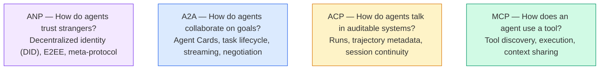

वे प्रतियोगी नहीं हैं, वे अलग-अलग स्तरों पर अलग-अलग समस्याएं हल करते हैं।

>  वे प्रतिस्पर्धा नहीं हैं वे विभिन्न स्तरों पर विभिन्न समस्याओं का समाधान करते हैं

एक वास्तविक उत्पादन प्रणाली में कई प्रोटोकॉल एक साथ उपयोग किए जाते हैंः अपने संगठन के भीतर के उपकरणों के लिए एमसीपी, एजेंट सहयोग के लिए ए 2 ए, अनुपालन के लिए एसीपी शैली के ट्रैक्टरी लॉगिंग, क्रॉस-ऑर्ग पहचान के लिए एएनपी। एक को चुनना और इसके माध्यम से सब कुछ मजबूर करना चिंता के कारण उन्हें मिलावने से एक बदतर प्रणाली का उत्पादन करता है।

> वास्तविक उत्पादन प्रणाली संयोजन कई प्रोटोकॉल का उपयोग करता हैः एमसीपी संगठन के भीतर के उपकरणों के लिए उपयोग करता है A2A एजेंट के लिए उपयोग करता है सहयोग ACP 风格 के लिए उपयोग किया जाता है अनुपालन ANP के लिए क्रॉस-ऑर्गनाइजेशन के रूप में उपयोग किया जाता है।

### एमसीपी (पुनर्बिन्यास)

एमसीपी चरण 13 में गहराई से कवर किया गया है। त्वरित पुनरावृत्तिः एमसीपी मानकीकृत करता है कि एलएलएम बाहरी उपकरणों और डेटा स्रोतों से कैसे जुड़ता है। यह एक **client-server**प्रोटोकॉल जहां एजेंट (क्लाइंट) सर्वर द्वारा उजागर किए गए उपकरणों की खोज और कॉल करता है।

> एमसीपी में चरण 13 में गहन व्याख्याएं हैं।**客户端-服务器**协议,Agent(客户端) ने पाया और सर्वर एक्सपोजर के उपकरण को调调

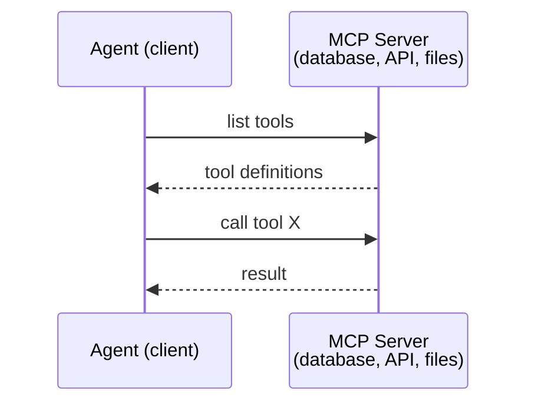

एमसीपी **agent-to-tool**यह एजेंटों को एक दूसरे के साथ बात करने में मदद नहीं करता है।

> एमसीपी**Agent 到工具** यह एजेंट  के बीच एक दूसरे के संचार में मदद नहीं कर सकता

ऊर्ध्वाधर/ क्षैतिज विभाजन साफ हैः एमसीपी ऊर्ध्वाधर तार (एजेंट उपकरण/डेटा तक पहुंचता है); ए 2 ए क्षैतिज तार (एजेंट समकक्ष एजेंट तक पहुंचता है) है। उत्पादन प्रणालियों को दोनों की आवश्यकता होती है।

> 垂直/水平分离清晰:MCP है垂直线;A2A है水平线;A2A है水平线;A2A है水平线;A2A है क्षैतिज लाइन;A2A है क्षैतिज लाइन;A2A है क्षैतिज लाइन;A2A है क्षैतिज लाइन;A2A है क्षैतिज लाइन;A2A है क्षैतिज लाइन;A2A है क्षैतिज लाइन;A2A है क्षैतिज लाइन;A2A है क्षैतिज लाइन;A2A है क्षैतिज लाइन;A2A है क्षैतिज लाइन;A2A है क्षैतिज लाइन;A2A है क्षैतिज लाइन;A2A है क्षैतिज लाइन;A2A है क्षैतिज लाइन;A2A है क्षैतिज लाइन;A2A है क्षैतिज लाइन;A2A है क्षैतिज लाइन;A2A है क्षैतिज लाइन;A2A है क्षैतिज लाइन;A2A है क्षैतिज लाइन;A2A है क्षैतिज लाइन;A2A है क्षैतिज लाइन;A2A है;A2A है;A2A है;A2A है;A2A है;A है;A2A है;A2A है;A है;A2A है;

### ए2ए (एजेंट2एजेंट प्रोटोकॉल)

**Created by:**गूगल (अब लिनक्स फाउंडेशन के तहत `lf.a2a.v1`)
**Spec version:**1.0.0
**Problem:**स्वायत्त एजेंट कैसे सहयोग करते हैं, बातचीत करते हैं और एक दूसरे को कार्य सौंपते हैं?

> **创建者：**गूगल(现由 लिनक्स फाउंडेशन 管理为 `lf.a2a.v1`)
> **规范版本：**1.0.0
> **问题：**स्वतंत्रा एजेंट  कैसे सहयोग  परामर्श और एक दूसरे को कार्य सौंपें?

A2A के लिए प्रोटोकॉल है**peer-to-peer agent collaboration**. जहां एमसीपी एक एजेंट को उपकरण से जोड़ता है, ए2ए एक एजेंट को अन्य एजेंटों से जोड़ता है। प्रत्येक एजेंट एक **Agent Card**एक प्रसिद्ध यूआरएल पर, और अन्य एजेंटों को पता लगाने, बातचीत करने और उसे कार्य सौंपने के लिए।

> A2A है**点对点 Agent 协作**协议──MCP 连接代理到工具,A2A 连接代理到其他代理── प्रत्येक एजेंट में ज्ञात URL 发布一个 **Agent 卡片**, अन्य एजेंटों को पता लगाया जा सकता है, परामर्श किया जा सकता है और उनके लिए कार्यकारी कार्य सौंपे जा सकते हैं।

#### ए 2 ए कैसे काम करता है

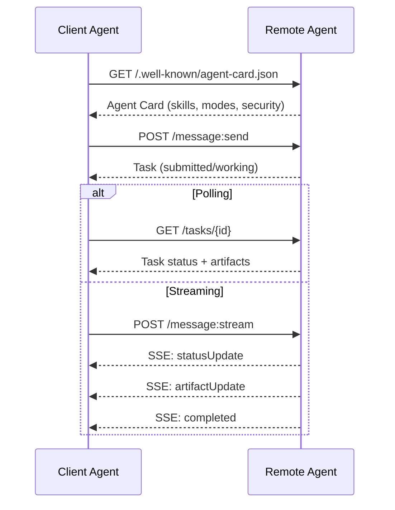

#### असली एजेंट कार्ड

यह है कि एक ए 2 ए एजेंट कार्ड वास्तव में जंगली में कैसा दिखता है.`GET /.well-known/agent-card.json`:

```json
{
  "name": "Research Agent",
  "description": "Searches documentation and summarizes findings",
  "version": "1.0.0",
  "supportedInterfaces": [
    {
      "url": "https://research-agent.example.com/a2a/v1",
      "protocolBinding": "JSONRPC",
      "protocolVersion": "1.0"
    },
    {
      "url": "https://research-agent.example.com/a2a/rest",
      "protocolBinding": "HTTP+JSON",
      "protocolVersion": "1.0"
    }
  ],
  "provider": {
    "organization": "Your Company",
    "url": "https://example.com"
  },
  "capabilities": {
    "streaming": true,
    "pushNotifications": false
  },
  "defaultInputModes": ["text/plain", "application/json"],
  "defaultOutputModes": ["text/plain", "application/json"],
  "skills": [
    {
      "id": "web-research",
      "name": "Web Research",
      "description": "Searches the web and synthesizes findings",
      "tags": ["research", "search", "summarization"],
      "examples": ["Research the latest changes in React 19"]
    },
    {
      "id": "doc-analysis",
      "name": "Documentation Analysis",
      "description": "Reads and analyzes technical documentation",
      "tags": ["docs", "analysis"],
      "inputModes": ["text/plain", "application/pdf"],
      "outputModes": ["application/json"]
    }
  ],
  "securitySchemes": {
    "bearer": {
      "httpAuthSecurityScheme": {
        "scheme": "Bearer",
        "bearerFormat": "JWT"
      }
    }
  },
  "security": [{ "bearer": [] }]
}
```

ध्यान देने योग्य महत्वपूर्ण बातेंः
- **Skills**एक ग्राहक एजेंट इस तरह से तय करता है कि क्या यह रिमोट एजेंट अपने अनुरोध को संभाल सकता है।
  中文翻译:**技能**यह वह काम है जो एजेंट कर सकता है। प्रत्येक में आईडी, टैग और समर्थन है। इनपुट/आउटपुट MIME प्रकार।
- **supportedInterfaces**एक एकल एजेंट JSON-RPC, REST, और gRPC एक साथ बोल सकता है।
  中文翻译:**supportedInterfaces**列出多个协议绑定──单个代理可以同时使用JSON-RPC、REST和gRPC──
- **Security**ग्राहक को एक भी अनुरोध करने से पहले ही पता है कि उसे किस लेखक की आवश्यकता है।
  中文翻译:**安全性**अंदर ही अंदर कार्ड में रखा गया है। ग्राहक को एक अनुरोध करने से पहले ही पता चल जाता है कि उसे क्या प्रमाणन चाहिए।

#### कार्य जीवन चक्र

कार्य ए 2 ए में काम की मूल इकाई हैं। वे परिभाषित राज्यों के माध्यम से चलते हैंः

> 任务是 A2A में केंद्रीय कार्य इकाईएँ हैं। वे परिभाषित स्थिति के बीच परिवर्तित होती हैंः

स्टेट मशीन A2A को सरल RPC से अलग करती है। एक कार्य को पोज (इनपुट-आवश्यक), रिज़्यूम (क्लाइंट इनपुट प्रदान करता है), विफल हो सकता है, या रद्द कर दिया जा सकता है। क्लाइंट को ब्लॉक करने की आवश्यकता नहीं है; यह सर्वेक्षण करता है या अपडेट के लिए सदस्यता लेता है।

> 状态机是 A2A से सरल RPC के अंतरों में से एक है। 任务可以暂停 (Input-required) 恢复 (Recover) 客户端提供输入) 失败或取消.

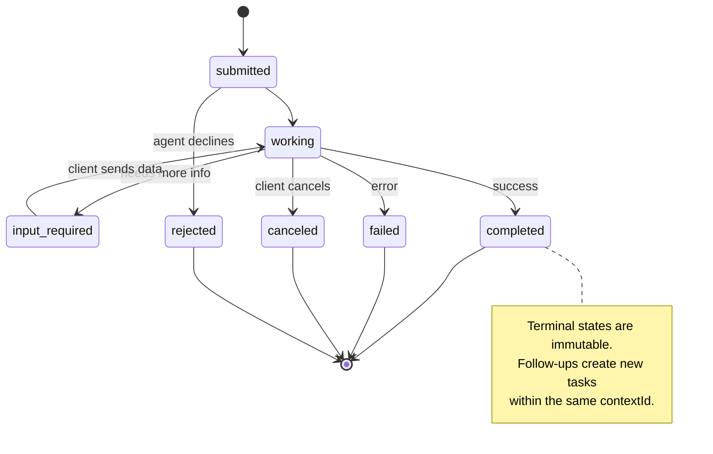

सभी 8 राज्यों (विशिष्टता भी परिभाषित करती है `UNSPECIFIED`एक प्रहरी के रूप में, यहाँ छोड़ा गया):

> सभी 8 个状态 规范也定义了 `UNSPECIFIED`作为哨兵,此处省略):

| State | Terminal? | Meaning / 含义 |
|---|---|---|
| `TASK_STATE_SUBMITTED` | No | Acknowledged, not yet processing / 已确认，尚未处理 |
| `TASK_STATE_WORKING` | No | Actively being processed / 正在处理 |
| `TASK_STATE_INPUT_REQUIRED` | No | Agent needs more info from client / Agent 需要客户端更多信息 |
| `TASK_STATE_AUTH_REQUIRED` | No | Authentication needed / 需要认证 |
| `TASK_STATE_COMPLETED` | Yes | Finished successfully / 成功完成 |
| `TASK_STATE_FAILED` | Yes | Finished with error / 出错完成 |
| `TASK_STATE_CANCELED` | Yes | Canceled before completion / 完成前取消 |
| `TASK_STATE_REJECTED` | Yes | Agent declined the task / Agent 拒绝任务 |

टर्मिनल स्टेट (पूर्ण, विफल, रद्द, अस्वीकृत) अपरिवर्तनीय हैं  एक बार एक कार्य एक तक पहुंच गया है, आगे के अपडेट की अनुमति नहीं है। अनुवर्ती कार्य उसी में एक नया कार्य बनाना चाहिए `contextId`सत्र की निरंतरता बनाए रखने के लिए।

> 终态 (समाप्त, असफल, रद्द, अस्वीकार) अपरिवर्तनीय है  एक बार जब कार्य समाप्ति स्थिति पर पहुंच जाता है, तो आगे के अद्यतन की अनुमति नहीं मिलती है `contextId`बैठक की निरंतरता बनाए रखने के लिए नए कार्य का निर्माण करना।

एक बार जब कोई कार्य एक टर्मिनल स्थिति तक पहुंच जाता है, तो यह अपरिवर्तनीय होता है। कोई और संदेश नहीं। अनुवर्ती उसी के भीतर एक नया कार्य बनाता है।`contextId`. .

> एक बार जब कोई कार्य समाप्त हो जाता है, तो यह अपरिवर्तनीय होता है।`contextId`नए कार्य का निर्माण करना

#### तार प्रारूप

A2A JSON-RPC 2.0 का उपयोग करता है। यहाँ एक असली संदेश विनिमय कैसा दिखता हैः

**Client sends a task:**
```json
{
  "jsonrpc": "2.0",
  "id": 1,
  "method": "SendMessage",
  "params": {
    "message": {
      "messageId": "msg-001",
      "role": "ROLE_USER",
      "parts": [{ "text": "Research React 19 compiler features" }]
    },
    "configuration": {
      "acceptedOutputModes": ["text/plain", "application/json"],
      "historyLength": 10
    }
  }
}
```

**Agent responds with a task:**
```json
{
  "jsonrpc": "2.0",
  "id": 1,
  "result": {
    "task": {
      "id": "task-abc-123",
      "contextId": "ctx-xyz-789",
      "status": {
        "state": "TASK_STATE_COMPLETED",
        "timestamp": "2026-03-27T10:30:00Z"
      },
      "artifacts": [
        {
          "artifactId": "art-001",
          "name": "research-results",
          "parts": [{
            "data": {
              "findings": [
                "React 19 compiler auto-memoizes components",
                "No more manual useMemo/useCallback needed",
                "Compiler runs at build time, not runtime"
              ]
            },
            "mediaType": "application/json"
          }]
        }
      ]
    }
  }
}
```

**Streaming via SSE:**
```text
POST /message:stream HTTP/1.1
Content-Type: application/json
A2A-Version: 1.0

data: {"task":{"id":"task-123","status":{"state":"TASK_STATE_WORKING"}}}

data: {"statusUpdate":{"taskId":"task-123","status":{"state":"TASK_STATE_WORKING","message":{"role":"ROLE_AGENT","parts":[{"text":"Searching documentation..."}]}}}}

data: {"artifactUpdate":{"taskId":"task-123","artifact":{"artifactId":"art-1","parts":[{"text":"partial findings..."}]},"append":true,"lastChunk":false}}

data: {"statusUpdate":{"taskId":"task-123","status":{"state":"TASK_STATE_COMPLETED"}}}
```

### एसीपी (एजेंट संचार प्रोटोकॉल)

**Created by:**आईबीएम / बीआईएआई
**Spec version:**0.2.0 (OpenAPI 3.1.1)
**Status:**लिनक्स फाउंडेशन के तहत A2A में विलय
**Problem:**एजेंट पूर्ण लेखा परीक्षा, सत्र निरंतरता और ट्रैकिंग ट्रैक के साथ कैसे संवाद करते हैं?

> **创建者：**आईबीएम / बीआईएआई
> **规范版本：**0.2.0 (OpenAPI 3.1.1)
> **状态：**लिनुक्स फाउंडेशन के A2A में संबद्ध है
> **问题：**एजेंट पूर्ण रूप से लेखा परीक्षणीय बैठक निरंतरता और ट्रैक ट्रैकिंग के मामले में कैसे संवाद करता है?

ACP **enterprise protocol**. कई सारांशों के विपरीत, एसीपी करता है **not**यह एक सरल REST / JSON एपीआई है OpenAPI के माध्यम से परिभाषित. जो इसे विशेष बनाता है यह है**TrajectoryMetadata**: प्रत्येक एजेंट प्रतिक्रिया तर्क चरणों और उपकरण कॉल जो इसे उत्पन्न की एक विस्तृत लॉग ले जा सकता है।

> ACP**企业协议** कई संक्षिप्त कथनों के विपरीत,एसीपी **不**JSON-LD का उपयोग करें। यह एक सरल REST/JSON API है जो OpenAPI द्वारा परिभाषित है। इसकी विशेषता यह है कि**TrajectoryMetadata**: प्रत्येक एजेंट 响应 सब कुछ ले जा सकते हैं इसके उत्पन्न होने के लिए सुझाव कदम और उपकरण调用详细日志──

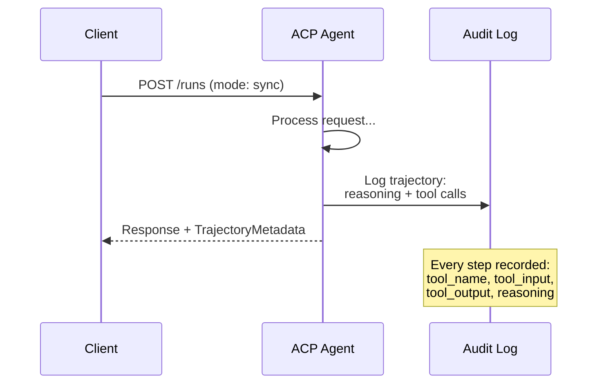

#### एसीपी में एजेंट डिस्कवरी

ACP चार खोज पद्धतियों को परिभाषित करता हैः

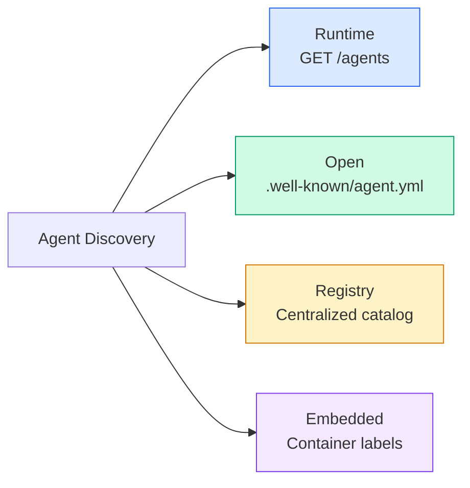

**AgentManifest**ए 2 ए के एजेंट कार्ड से सरल हैः

> **AgentManifest**A2A के एजेंट कार्ड से अधिक सरलः

```json
{
  "name": "summarizer",
  "description": "Summarizes documents with source citations",
  "input_content_types": ["text/plain", "application/pdf"],
  "output_content_types": ["text/plain", "application/json"],
  "metadata": {
    "tags": ["summarization", "RAG"],
    "framework": "BeeAI",
    "capabilities": [
      {
        "name": "Document Summarization",
        "description": "Condenses long documents into key points"
      }
    ],
    "recommended_models": ["llama3.3:70b-instruct-fp16"],
    "license": "Apache-2.0",
    "programming_language": "Python"
  }
}
```

कोई प्रोटोकॉल बंधन (एकल REST API), कोई सुरक्षा योजनाएं (सर्वर स्तर पर स्थानांतरित), कोई कौशल सूची (क्षमताएं फ्लैट मेटाडेटा हैं) नहीं। व्यापारः तैनाती में आसान, कम आत्म-वर्णन।

> 没有协议绑定(单一 REST API) 没有安全方案(委托给服务器级别) 没有技能列表(能力是平元数据) 权衡:部署更简单,自描述性较差──

#### जीवन चक्र चलाएँ

एसीपी "कार्य" के बजाय "रन्स" का उपयोग करता है। एक रन तीन मोड के साथ एक एजेंट निष्पादन हैः

> ACP "Runs" का प्रयोग "Tasks" के बजाय करते हैं।

| Mode | Behavior |
|---|---|
| `sync` | Blocking. Response contains the complete result. |
| `async` | Returns 202 immediately. Poll `GET /runs/{id}` for status. |
| `stream` | SSE stream. Events fire as the agent works. |

> # एक मॉडल # व्यवहार #
> ♪ ♪ मैं हूँ ♪
> `sync`                                                                                                                                                                                                                                                              
> `async` तुरंत वापस 202                                                                                                                                                                                                                                                             `GET /runs/{id}`स्थिति प्राप्त करें.
> `stream` एसई 流 घटना  एजेंट 工作触发

मोड विकल्प उपयोगकर्ता अनुभव आवश्यकताओं के लिए मानचित्रः तेजी से क्वेरी के लिए समक्रमण, पृष्ठभूमि कार्यों के लिए असिनक्रॉन, उपयोगकर्ता प्रगति संकेतकों की आवश्यकता के लिए लंबे समय तक चलने वाले कार्यों के लिए स्ट्रीम।

> 模式 चयन मैपिंग उपयोगकर्ता अनुभव आवश्यकताओं तकः त्वरित पूछताछ के लिए उपयोग किया जाता है, जैसे कि बाद के काम के लिए उपयोग किया जाता है, प्रवाह उपयोग किया जाता है उपयोगकर्ता को प्रगति के लिए निर्देश करना चाहता है के लिए उपयोग किया जाता है

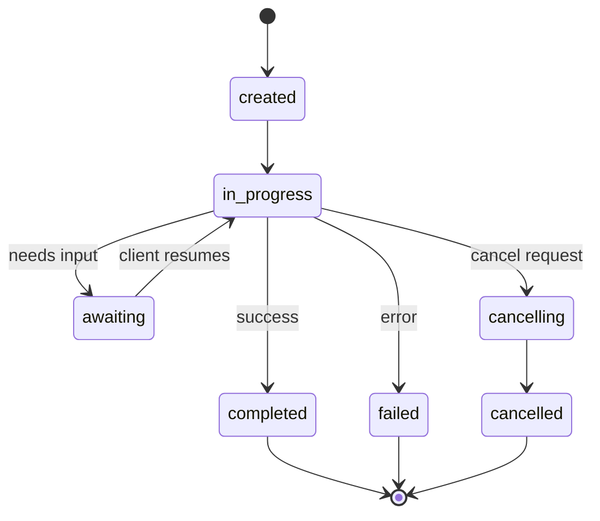

#### ट्रैकटोरियममेटाडेटा (ऑडिट ट्रेल)

यह एसीपी का मुख्य भेद है। प्रत्येक संदेश भाग में मेटाडेटा हो सकता है जो एजेंट ने क्या किया है, इसका सटीक रूप से पता चलता हैः

```json
{
  "role": "agent/researcher",
  "parts": [
    {
      "content_type": "text/plain",
      "content": "The weather in San Francisco is 72F and sunny.",
      "metadata": {
        "kind": "trajectory",
        "message": "I need to check the weather for this location",
        "tool_name": "weather_api",
        "tool_input": { "location": "San Francisco, CA" },
        "tool_output": { "temperature": 72, "condition": "sunny" }
      }
    }
  ]
}
```

नियामक उद्योगों के लिए यह सोना है। प्रत्येक उत्तर तर्क की एक सिद्ध श्रृंखला के साथ आता हैः किस उपकरण को बुलाया गया था, किस इनपुट का उपयोग किया गया था, किस आउटपुट को प्राप्त किया गया था। कोई ब्लैक बॉक्स नहीं।

>  अनुशासित उद्योग के लिए, यह एक अमूल्य खजाना है प्रत्येक उत्तर में एक सिद्ध तर्क श्रृंखला होती हैः किस उपकरण का उपयोग किया गया, किस प्रकार का इनपुट किया गया, किस प्रकार का आउटपुट प्राप्त किया गया, कोई ब्लैक बॉक्स नहीं है

बैंकों, स्वास्थ्य सेवा और सरकारी तैनाती के लिए इस तरह की लेखापरीक्षा की आवश्यकता होती है। एसीपी के ट्रैकटोरिया मेटाडेटा उन वातावरणों में एलएलएम एजेंटों को स्वीकार्य बनाता है। इसके बिना, नियामक तैनाती को अस्वीकार करते हैं।

> ∙ बैंकिंग, चिकित्सा एवं सरकारी विभागों को इस प्रकार की लेखापरीक्षा की आवश्यकता है।

ACP भी समर्थन करता है **CitationMetadata**स्रोत श्रेणियों के लिएः

> ACP और समर्थन**CitationMetadata**उपयोग के लिए स्रोत श्रेणियाँः

```json
{
  "kind": "citation",
  "start_index": 0,
  "end_index": 47,
  "url": "https://weather.gov/sf",
  "title": "NWS San Francisco Forecast"
}
```

### एएनपी (एजेंट नेटवर्क प्रोटोकॉल)

**Created by:**ओपन सोर्स समुदाय (गौवेई चांग द्वारा स्थापित)
**Repo:** [github.com/agent-network-protocol/AgentNetworkProtocol](https://github.com/agent-network-protocol/AgentNetworkProtocol)
**Problem:**विभिन्न संगठनों के एजेंट बिना किसी केंद्रीय प्राधिकरण के एक दूसरे पर कैसे भरोसा करते हैं?

> **创建者：**开源社区(由高伟长创立)
> **代码库：** [github.com/agent-network-protocol/AgentNetworkProtocol](https://github.com/agent-network-protocol/AgentNetworkProtocol)
> **问题：**बिना किसी केंद्रीय प्राधिकरण के एक दूसरे पर भरोसा कैसे कर सकते हैं?

एएनपी **decentralized identity protocol**. यह W3C विकेंद्रीकृत पहचानकर्ताओं (DIDs) और अंत-से-अंत एन्क्रिप्शन का उपयोग करके विश्वास का निर्माण करता है। ए 2 ए के विपरीत जहां आप ज्ञात एंडपॉइंट के माध्यम से एजेंटों की खोज करते हैं, एएनपी एजेंटों को अपनी पहचान को क्रिप्टोग्राफिक रूप से साबित करने देता है।

> एएनपी**去中心化身份协议**यह W3C का उपयोग करता है ️ ️ ️ ️ ️ ️ ️ ️ ️ ️ ️ ️ ️ ️ ️ ️ ️ ️ ️ ️ ️ ️ ️ ️ ️ ️ ️ ️ ️ ️ ️ ️ ️ ️ ️ ️ ️ ️ ️ ️ ️ ️ ️ ️ ️ ️ ️ ️ ️ ️ ️ ️ ️ ️ ️ ️ ️ ️ ️ ️ ️ ️ ️ ️ ️ ️ ️ ️ ️ ️ ️ ️ ️ ️ ️ ️ ️ ️ ️ ️ ️ ️ ️ ️ ️ ️ ️ ️ ️ ️ ️ ️ ️ ️ ️ ️ ️ ️ ️ ️ ️ ️ ️ ️ ️ ️ ️ ️ ️ ️ ️ ️ ️ ️ ️ ️ ️ ️ ️ ️ ️ ️ ️ ️ ️ ️ ️ ️ ️ ️ ️ ️ ️ ️ ️ ️ ️ ️ ️ ️ ️ ️ ️ ️ ️ ️ ️ ️ ️ ️ ️ ️ ️ ️ ️ ️ ️ ️ ️ ️ ️ ️ ️ ️ ️ ️ 

एएनपी में तीन परतें हैंः

> एएनपी में तीन स्तर हैंः

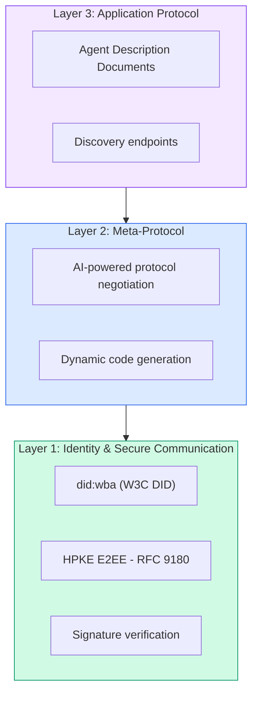

#### डीआईडी दस्तावेज (वास्तविक संरचना)

एएनपी एक कस्टम डीआईडी विधि का उपयोग करता है जिसे कहा जाता है `did:wba`(वेब आधारित एजेंट)`did:wba:example.com:user:alice`निर्णय लेता है `https://example.com/user/alice/did.json`:

```json
{
  "@context": [
    "https://www.w3.org/ns/did/v1",
    "https://w3id.org/security/suites/jws-2020/v1",
    "https://w3id.org/security/suites/secp256k1-2019/v1"
  ],
  "id": "did:wba:example.com:user:alice",
  "verificationMethod": [
    {
      "id": "did:wba:example.com:user:alice#key-1",
      "type": "EcdsaSecp256k1VerificationKey2019",
      "controller": "did:wba:example.com:user:alice",
      "publicKeyJwk": {
        "crv": "secp256k1",
        "x": "NtngWpJUr-rlNNbs0u-Aa8e16OwSJu6UiFf0Rdo1oJ4",
        "y": "qN1jKupJlFsPFc1UkWinqljv4YE0mq_Ickwnjgasvmo",
        "kty": "EC"
      }
    },
    {
      "id": "did:wba:example.com:user:alice#key-x25519-1",
      "type": "X25519KeyAgreementKey2019",
      "controller": "did:wba:example.com:user:alice",
      "publicKeyMultibase": "z9hFgmPVfmBZwRvFEyniQDBkz9LmV7gDEqytWyGZLmDXE"
    }
  ],
  "authentication": [
    "did:wba:example.com:user:alice#key-1"
  ],
  "keyAgreement": [
    "did:wba:example.com:user:alice#key-x25519-1"
  ],
  "humanAuthorization": [
    "did:wba:example.com:user:alice#key-1"
  ],
  "service": [
    {
      "id": "did:wba:example.com:user:alice#agent-description",
      "type": "AgentDescription",
      "serviceEndpoint": "https://example.com/agents/alice/ad.json"
    }
  ]
}
```

ध्यान देने योग्य महत्वपूर्ण बातेंः
- **Key separation**हस्ताक्षर कुंजी (secp256k1) एन्क्रिप्शन कुंजी (X25519) से अलग है।
  中文翻译:**密钥分离**️️️️️️️️️️️️️️️️️️️️️️️️️️️️️️️️️️️️️️️️️️️️️️️️️️️️️️️️️️️️️️️️️️️️️️️️️️️️️️️️️️️️️️️️️️️️️️️️️️️️️️️️️️️️️️️️️️️️️️️️️️️️️️️️️️️️️️️️️️️️️️️️️️️️️️️️️️️️️️️️️️️️️️️️️️️️️️️️️️️️️️️️️️️️️️️️️️️️️️️️️️️️️️️️️️️️️️️️️️️️️️️️️️️️️️️️️️️️️️️️️️️️️️️️️️️️️️️️️️️️️️️️️️️️️️️️️️️️️️️️️️️️️️️️️️️️️️️️️️️️️️️️️️️️️️️️️️️️️️️️️️️️️️️️️️️️️️️️️️️️️️️️️️️️️️️️️️️️️️️️️️️️️️️️️️️️️️️️️️️️️️️️️️️️️️️️️️️️️️️️️️️️️️️️️️️️️️️️️️️️️️️️️️️️️️️️️️️️️️️️️️️️️️️️️️️️️️️️️️️️️️️️️️️️️️️️️️️️️️️️️️️️️️️️️️️️️️️️️️️️️️️️️️️️
- **`humanAuthorization`**इन कुंजी को उपयोग करने से पहले स्पष्ट मानव अनुमोदन (बायोमेट्रिक, पासवर्ड, एचएसएम) की आवश्यकता होती है। धन हस्तांतरण जैसे उच्च जोखिम वाले संचालन इस मार्ग से गुजरते हैं।
  中文翻译:**`humanAuthorization`**एएनपी के लिए ये कुंजी विशिष्ट हैं। इन कुंजी को उपयोग से पहले ही स्पष्ट रूप से मानव अनुमोदन की आवश्यकता है।
- **`keyAgreement`**HPKE अंत-से-अंत एन्क्रिप्शन (RFC 9180) के लिए कुंजी का उपयोग किया जाता है।
  中文翻译:**`keyAgreement`**密钥用于HPKE 端到端加密(RFC 9180) 👇
- **service**एजेंट विवरण दस्तावेज के लिए अनुभाग लिंक।
  中文翻译:**service**部分链接到 एजेंट 描述文档──

कुंजी विभाजन पैटर्न वास्तविक दुनिया क्रिप्टो सिस्टम की आवश्यकता है लेकिन जेएसओएन प्रोटोकॉल अक्सर छोड़ देते हैं। एएनपी इसे लागू करता है क्योंकि क्रॉस-ऑर्गनाइजेशन एजेंट पैसे, अनुबंधों और पीआईआई को संभालते हैं।

>  कुंजी विभाजन मोड वास्तविक क्रिप्टो सिस्टम द्वारा आवश्यक है, लेकिन JSON प्रोटोकॉल अक्सर कूद जाता है।

#### एएनपी में विश्वास कैसे काम करता है

एएनपी करता है **not**विश्वास के वेब या अनुमोदन ग्राफ का उपयोग करें। विश्वास द्विपक्षीय है और प्रति बातचीत सत्यापित किया जाता हैः

> एएनपी **不**प्रयोग信任网络或背书图──信任是双边的,每次交互都会验证:

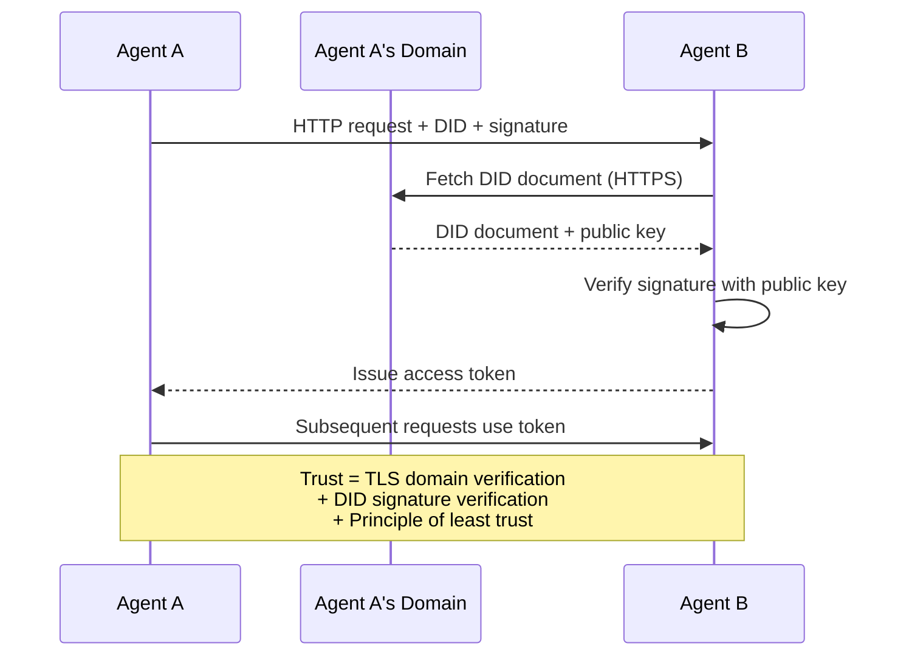

विश्वास तीन स्रोतों से आता हैः
1. **Domain-level TLS**डीआईडी दस्तावेज़ होस्ट की पुष्टि करता है
   中文翻译:**域级 TLS**验证 DID 文档主机
2. **DID cryptographic signatures**एजेंट की पहचान सत्यापित करें
   中文翻译:**DID 加密签名**验证 एजेंट की पहचान
3. **Principle of least trust**केवल न्यूनतम अनुमति देता है
   中文翻译:**最小信任原则**् ् ् ् ् ् ् ् ् ् ् ् ् ् ् ् ् ् ् ् ् ् ् ् ् ् ् ् ् ् ् ् ् ् ् ् ् ् ् ् ् ् ् ् ् ् ् ् ् ् ् ् ् ् ् ् ् ् ् ् ् ् ् ् ् ् ् ् ् ् ् ् ् ् ् ् ् ् ् ् ् ् ् ् ् ् ् ् ् ् ् ् ् ् ् ् ् ् ् ् ् ् ् ् ् ् ् ् ् ् ् ् ् ् ् ् ् ् ् ् ् ् ् ् ् ् ् ् ् ् ् ् ् ् ् ् ् ् ् ् ् ् ् ् ् ् ् ् ् ् ् ् ् ् ् ् ् ् ् ् ् ् ् ् ् ् ् ् ् ् ् ् ् ् ् ् ् ् ् ् ् ् ् ् ् ् ् ् ् ् ् ् ् ् ् ् ् ् ् ् ् ् ् ् ् ् ् ् ् ् ् ् ् ् ् ् ् ् ् ् ् ् ् ् ् ् ् ् ् ् ् ् ् ् ् ् ् ् ् ् ् ् ् ् ् ् ् ् ् ् ् ् ् ् ्

तीन स्रोतों के डिजाइन से विफलता के एकल बिंदुओं से बचा जाता है। अकेले TLS अपर्याप्त है (सत्यापित प्रमाणपत्र वाले कोई भी DID को होस्ट कर सकता है) । अकेले DID अपर्याप्त है (एक चुराई हुई कुंजी पहचान को नकली करती है) । न्यूनतम विश्वसनीयता प्राधिकरण के साथ संयुक्त, आपको केंद्रीय प्राधिकरण के बिना गहन रक्षा मिलती है।

> 三源设计避免了单点故障──只有 TLS 不足──任何有证书的人都可以托管 DID)──只有 DID 不足──被盗密钥伪造身份──与最小信任授权结合,你获得纵深防御而无需中央权力──

कोई गपशप आधारित विश्वास प्रचार या पेज रैंक स्कोर नहीं है. आप प्रत्येक एजेंट को सीधे अपने डीआईडी के माध्यम से सत्यापित करते हैं.

> 没有基于八的信任传播或 PageRank 评分──你直接通过 DID 验证每个代理──

#### मेटा प्रोटोकॉल वार्ता

यह एएनपी की सबसे नवीन विशेषता है जब दो एजेंट अलग-अलग पारिस्थितिकी तंत्र से मिलते हैं, उन्हें पूर्व-समझी हुई डेटा प्रारूपों की आवश्यकता नहीं होती है। वे प्राकृतिक भाषा में बातचीत करते हैंः

> यह एएनपी का नवीनतम कार्य है। जब दो एजेंट अलग-अलग पारिस्थितिकी तंत्र से आते हैं, तो उन्हें पूर्व निर्धारित डेटा प्रारूप की आवश्यकता नहीं होती है।

```json
{
  "action": "protocolNegotiation",
  "sequenceId": 0,
  "candidateProtocols": "I can communicate using:\n1. JSON-RPC with hotel booking schema\n2. REST with OpenAPI 3.1 spec\n3. Natural language over HTTP",
  "modificationSummary": "Initial proposal",
  "status": "negotiating"
}
```

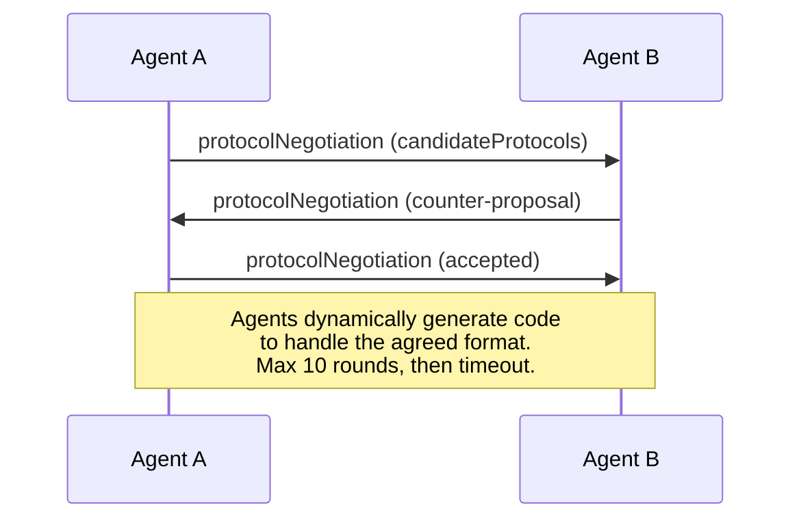

एजेंट एक प्रारूप पर सहमत होने तक आगे और पीछे (मैक्स 10 राउंड) जाते हैं, फिर इसे संभालने के लिए गतिशील रूप से कोड उत्पन्न करते हैं। स्थिति मानः `negotiating`,`rejected`,`accepted`,`timeout`. .

> एजेंट वापस चर्चा करने के लिए आओ (अधिकतम 10 राउंड) जब तक कि प्रारूप पर सहमति नहीं हो जाती, तब गतिशील कोड उत्पन्न करने के लिए इसे संसाधित करें।`negotiating`(协商中)`rejected`(नकार)`accepted`(स्वीकार)`timeout`(超时) 

इसका मतलब है कि दो एजेंट जो पहले कभी एक दूसरे को नहीं देखे हैं, बिना किसी साझा योजना को पूर्व परिभाषित किए संवाद करने का तरीका समझ सकते हैं।

> इसका मतलब है कि दो अभेद्य एजेंट बिना किसी पूर्वनिर्धारित साझाकरण मोड के संचार का तरीका ढूंढ सकते हैं।

विजनः एक खुला एजेंट वेब जहां कोई भी एजेंट किसी अन्य एजेंट के साथ बात कर सकता है, बिना किसी पूर्व एकीकरण कार्य के। क्या यह खिलौना डेमो से परे पैमाने पर है एक खुला 2026 सवाल है। बैकअप हमेशा "ए 2 ए का उपयोग करें और योजनाओं पर पूर्व-समझें।"

> 愿景: ओपन एजेंट 网络 में कोई भी एजेंट किसी भी अन्य एजेंट के साथ अस्थायी बातचीत कर सकता है, बिना पूर्वकालिक एकीकरण कार्य की आवश्यकता नहीं है। यह 2026 के लिए खुले प्रश्न है।

### तुलना (संदिग्ध)

| | MCP | A2A | ACP | ANP |
|---|---|---|---|---|
| **Created by** | Anthropic | Google / Linux Foundation | IBM / BeeAI | Community |
| **Spec format** | JSON-RPC | JSON-RPC / REST / gRPC | OpenAPI 3.1 (REST) | JSON-RPC |
| **Primary use** | Agent to Tool | Agent to Agent | Agent to Agent | Agent to Agent |
| **Discovery** | Tool listing | `/.well-known/agent-card.json` | `GET /agents`, `/.well-known/agent.yml` | `/.well-known/agent-descriptions`, DID service endpoints |
| **Identity** | Implicit (local) | Security schemes (OAuth, mTLS) | Server-level | W3C DID (`did:wba`) with E2EE |
| **Audit trail** | N/A | Basic (task history) | TrajectoryMetadata (tool calls, reasoning) | Not formally specified |
| **State machine** | N/A | 9 task states | 7 run states | N/A |
| **Streaming** | N/A | SSE | SSE | Transport-agnostic |
| **Unique feature** | Tool schemas | Agent Cards + Skills | Trajectory audit trail | Meta-protocol negotiation |
| **Best for** | Tools & data | Dynamic collaboration | Regulated industries | Cross-org trust |
| **Status** | Stable | Stable (v1.0) | Merging into A2A | Active development |

### कैसे वे एक साथ काम करते हैं

एक यथार्थवादी उद्यम प्रणाली में कई प्रकार के प्रोटोकॉल होते हैंः

> ये समझौते परस्पर नहीं हैं। एक वास्तविक उद्यम प्रणाली कई समझौतों का उपयोग करती हैः

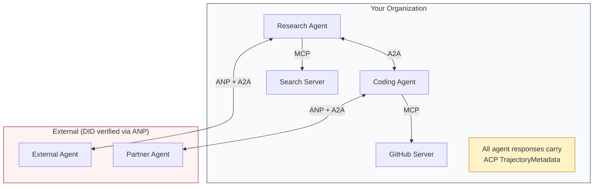

- **MCP**प्रत्येक एजेंट को उसके उपकरण से जोड़ता है
  中文翻译:**MCP**प्रत्येक एजेंट को अपने उपकरण से जोड़ना
- **A2A**एजेंटों के बीच सहयोग (आंतरिक और बाहरी) को संभालता है
  中文翻译:**A2A**处理 एजेंट 之间协作(内部和外部)
- **ACP**लेखापरीक्षा के लिए ट्रैकटोरिया मेटाडेटा में प्रतिक्रियाओं को लपेटता है
  中文翻译:**ACP**लेखापरीक्षा को प्राप्त करने के लिए डेटा पैकेजिंग प्रतिक्रिया का उपयोग करें
- **ANP**आप नियंत्रण नहीं कर रहे एजेंटों के लिए पहचान सत्यापन प्रदान करता है
  中文翻译:**ANP**आप नियंत्रण नहीं कर रहे एजेंट  पहचान प्रमाण पत्र प्रदान

## इसे बनाओ, इसे पूरा करो।
```figure
swarm-message-bus
```

## इसे बनाओ

### चरण 1: मुख्य संदेश प्रकार

प्रत्येक बहु एजेंट प्रणाली संदेश प्रारूप के साथ शुरू होता है. हम प्रकारों को परिभाषित करते हैं जो वास्तविक प्रोटोकॉल का उपयोग करते हैं के लिए मैप करते हैंः

> प्रत्येक एजेंट  सिस्टम  सभी संदेश प्रारूप से शुरू होते हैं। हमने वास्तविक प्रोटोकॉल के उपयोग के लिए मानचित्रण के प्रकार को परिभाषित किया हैः

```typescript
import crypto from "node:crypto";

type MessageRole = "user" | "agent";

type MessagePart =
  | { kind: "text"; text: string }
  | { kind: "data"; data: unknown; mediaType: string }
  | { kind: "file"; name: string; url: string; mediaType: string };

type TrajectoryEntry = {
  reasoning: string;
  toolName?: string;
  toolInput?: unknown;
  toolOutput?: unknown;
  timestamp: number;
};

type AgentMessage = {
  id: string;
  role: MessageRole;
  parts: MessagePart[];
  trajectory?: TrajectoryEntry[];
  replyTo?: string;
  timestamp: number;
};

function createMessage(
  role: MessageRole,
  parts: MessagePart[],
  replyTo?: string
): AgentMessage {
  return {
    id: crypto.randomUUID(),
    role,
    parts,
    replyTo,
    timestamp: Date.now(),
  };
}

function textMessage(role: MessageRole, text: string): AgentMessage {
  return createMessage(role, [{ kind: "text", text }]);
}
```

ध्यान दें: `MessagePart`यह मल्टीमोडल (टेक्स्ट, संरचित डेटा, फाइलें) है, जैसे वास्तविक A2A और ACP विनिर्देश। `TrajectoryEntry`इस प्रकार, एसीपी के ट्रैकटोरियामेटाडेटा से मेल खाने वाली तर्क श्रृंखला को कैप्चर करता है।

> ध्यान दें:`MessagePart`                                                                                                                                                                                                                                                              `TrajectoryEntry` पकड़ने के लिए संकेतक, संगत एसीपी के ट्रैक्टोरियामेटाडेटा

### चरण 2: ए2ए एजेंट कार्ड और रजिस्ट्री

वास्तविक A2A विनिर्देशों से मेल खाने वाले एजेंट खोज का निर्माण करेंः

> 构建匹配真实A2A 规范的代理 发现:

```typescript
type Skill = {
  id: string;
  name: string;
  description: string;
  tags: string[];
  inputModes: string[];
  outputModes: string[];
};

type AgentCard = {
  name: string;
  description: string;
  version: string;
  url: string;
  capabilities: {
    streaming: boolean;
    pushNotifications: boolean;
  };
  defaultInputModes: string[];
  defaultOutputModes: string[];
  skills: Skill[];
};

class AgentRegistry {
  private cards: Map<string, AgentCard> = new Map();

  register(card: AgentCard) {
    this.cards.set(card.name, card);
  }

  discoverBySkillTag(tag: string): AgentCard[] {
    return [...this.cards.values()].filter((card) =>
      card.skills.some((skill) => skill.tags.includes(tag))
    );
  }

  discoverByInputMode(mimeType: string): AgentCard[] {
    return [...this.cards.values()].filter(
      (card) =>
        card.defaultInputModes.includes(mimeType) ||
        card.skills.some((skill) => skill.inputModes.includes(mimeType))
    );
  }

  resolve(name: string): AgentCard | undefined {
    return this.cards.get(name);
  }

  listAll(): AgentCard[] {
    return [...this.cards.values()];
  }
}
```

यह एक साधारण नाम-से-क्षमता मानचित्र से काफी अधिक समृद्ध है. आप कौशल टैग द्वारा एजेंटों की खोज कर सकते हैं, इनपुट MIME प्रकारों द्वारा, या नाम से, बस वास्तविक A2A विनिर्देश समर्थन की तरह.

> यह सरल नाम से क्षमता मानचित्रण तक बहुत अधिक समृद्ध है। आप कौशल टैग के माध्यम से MIME प्रकार या नाम खोज एजेंट, जैसे कि वास्तविक A2A 规范支持 के माध्यम से कर सकते हैं।

### चरण 3: ए 2 ए कार्य जीवन चक्र

पूर्ण कार्य राज्य मशीन का निर्माण करेंः

> 构建完整的任务状态机:

```typescript
type TaskState =
  | "submitted"
  | "working"
  | "input-required"
  | "auth-required"
  | "completed"
  | "failed"
  | "canceled"
  | "rejected";

const TERMINAL_STATES: TaskState[] = [
  "completed",
  "failed",
  "canceled",
  "rejected",
];

type TaskStatus = {
  state: TaskState;
  message?: AgentMessage;
  timestamp: number;
};

type Artifact = {
  id: string;
  name: string;
  parts: MessagePart[];
};

type Task = {
  id: string;
  contextId: string;
  status: TaskStatus;
  artifacts: Artifact[];
  history: AgentMessage[];
};

type TaskEvent =
  | { kind: "statusUpdate"; taskId: string; status: TaskStatus }
  | {
      kind: "artifactUpdate";
      taskId: string;
      artifact: Artifact;
      append: boolean;
      lastChunk: boolean;
    };

type TaskHandler = (
  task: Task,
  message: AgentMessage
) => AsyncGenerator<TaskEvent>;

class TaskManager {
  private tasks: Map<string, Task> = new Map();
  private handlers: Map<string, TaskHandler> = new Map();
  private listeners: Map<string, ((event: TaskEvent) => void)[]> = new Map();

  registerHandler(agentName: string, handler: TaskHandler) {
    this.handlers.set(agentName, handler);
  }

  subscribe(taskId: string, listener: (event: TaskEvent) => void) {
    const existing = this.listeners.get(taskId) ?? [];
    existing.push(listener);
    this.listeners.set(taskId, existing);
  }

  async sendMessage(
    agentName: string,
    message: AgentMessage,
    contextId?: string
  ): Promise<Task> {
    const handler = this.handlers.get(agentName);
    if (!handler) {
      const task = this.createTask(contextId);
      task.status = {
        state: "rejected",
        timestamp: Date.now(),
        message: textMessage("agent", `No handler for ${agentName}`),
      };
      return task;
    }

    const task = this.createTask(contextId);
    task.history.push(message);
    task.status = { state: "submitted", timestamp: Date.now() };

    this.processTask(task, handler, message).catch((err) => {
      task.status = {
        state: "failed",
        timestamp: Date.now(),
        message: textMessage("agent", String(err)),
      };
    });
    return task;
  }

  getTask(taskId: string): Task | undefined {
    return this.tasks.get(taskId);
  }

  cancelTask(taskId: string): boolean {
    const task = this.tasks.get(taskId);
    if (!task || TERMINAL_STATES.includes(task.status.state)) return false;
    task.status = { state: "canceled", timestamp: Date.now() };
    this.emit(taskId, {
      kind: "statusUpdate",
      taskId,
      status: task.status,
    });
    return true;
  }

  private createTask(contextId?: string): Task {
    const task: Task = {
      id: crypto.randomUUID(),
      contextId: contextId ?? crypto.randomUUID(),
      status: { state: "submitted", timestamp: Date.now() },
      artifacts: [],
      history: [],
    };
    this.tasks.set(task.id, task);
    return task;
  }

  private async processTask(
    task: Task,
    handler: TaskHandler,
    message: AgentMessage
  ) {
    task.status = { state: "working", timestamp: Date.now() };
    this.emit(task.id, {
      kind: "statusUpdate",
      taskId: task.id,
      status: task.status,
    });

    try {
      for await (const event of handler(task, message)) {
        if (TERMINAL_STATES.includes(task.status.state)) break;

        if (event.kind === "statusUpdate") {
          task.status = event.status;
        }
        if (event.kind === "artifactUpdate") {
          const existing = task.artifacts.find(
            (a) => a.id === event.artifact.id
          );
          if (existing && event.append) {
            existing.parts.push(...event.artifact.parts);
          } else {
            task.artifacts.push(event.artifact);
          }
        }
        this.emit(task.id, event);
      }
    } catch (err) {
      task.status = {
        state: "failed",
        timestamp: Date.now(),
        message: textMessage("agent", String(err)),
      };
      this.emit(task.id, {
        kind: "statusUpdate",
        taskId: task.id,
        status: task.status,
      });
    }
  }

  private emit(taskId: string, event: TaskEvent) {
    for (const listener of this.listeners.get(taskId) ?? []) {
      listener(event);
    }
  }
}
```

यह वास्तविक A2A कार्य जीवन चक्र को लागू करता हैः प्रस्तुत, काम, इनपुट-आवश्यक, टर्मिनल राज्य। हैंडलर असिनक्रोनस जनरेटर हैं जो SSE स्ट्रीमिंग मॉडल से मेल खाने वाली घटनाओं (स्थिति अपडेट और आर्टिफैक्ट टुकड़े) का उत्पादन करते हैं।

> यह वास्तविक A2A कार्य जीवन चक्र को प्राप्त करता हैः प्रस्तुत किया गया, काम करना, इनपुट-आवश्यक, अंतिम स्थिति।

### चरण 4: एसीपी-शैली लेखा परीक्षा पथ

ट्रैकिंग ट्रैकिंग के साथ संचार को शामिल करेंः

> उपयोग करने के लिए ट्रैकिंग पैकेजिंग संचारः

```typescript
type AuditEntry = {
  runId: string;
  agentName: string;
  input: AgentMessage[];
  output: AgentMessage[];
  trajectory: TrajectoryEntry[];
  status: "created" | "in-progress" | "completed" | "failed" | "awaiting";
  startedAt: number;
  completedAt?: number;
  sessionId?: string;
};

class AuditableRunner {
  private log: AuditEntry[] = [];
  private handlers: Map<
    string,
    (input: AgentMessage[]) => Promise<{
      output: AgentMessage[];
      trajectory: TrajectoryEntry[];
    }>
  > = new Map();

  registerAgent(
    name: string,
    handler: (input: AgentMessage[]) => Promise<{
      output: AgentMessage[];
      trajectory: TrajectoryEntry[];
    }>
  ) {
    this.handlers.set(name, handler);
  }

  async run(
    agentName: string,
    input: AgentMessage[],
    sessionId?: string
  ): Promise<AuditEntry> {
    const entry: AuditEntry = {
      runId: crypto.randomUUID(),
      agentName,
      input: structuredClone(input),
      output: [],
      trajectory: [],
      status: "created",
      startedAt: Date.now(),
      sessionId,
    };
    this.log.push(entry);

    const handler = this.handlers.get(agentName);
    if (!handler) {
      entry.status = "failed";
      return entry;
    }

    entry.status = "in-progress";
    try {
      const result = await handler(input);
      entry.output = structuredClone(result.output);
      entry.trajectory = structuredClone(result.trajectory);
      entry.status = "completed";
      entry.completedAt = Date.now();
    } catch (err) {
      entry.status = "failed";
      entry.trajectory.push({
        reasoning: `Error: ${String(err)}`,
        timestamp: Date.now(),
      });
      entry.completedAt = Date.now();
    }
    return entry;
  }

  getFullAuditLog(): AuditEntry[] {
    return structuredClone(this.log);
  }

  getAuditLogForAgent(agentName: string): AuditEntry[] {
    return structuredClone(
      this.log.filter((e) => e.agentName === agentName)
    );
  }

  getAuditLogForSession(sessionId: string): AuditEntry[] {
    return structuredClone(
      this.log.filter((e) => e.sessionId === sessionId)
    );
  }

  getTrajectoryForRun(runId: string): TrajectoryEntry[] {
    const entry = this.log.find((e) => e.runId === runId);
    return entry ? structuredClone(entry.trajectory) : [];
  }
}
```

प्रत्येक एजेंट निष्पादन एक पूर्ण लेखांकन प्रविष्टि उत्पन्न करता हैः क्या आया, क्या बाहर आया, और उपकरण कॉल और तर्क चरणों के बीच के पूर्ण प्रक्षेपवक्र। आप एजेंट द्वारा, सत्र द्वारा या व्यक्तिगत रन द्वारा पूछ सकते हैं।

> प्रत्येक एजेंट के निष्पादन के दौरान एक पूर्ण लेखापरीक्षा अनुसूची उत्पन्न होती हैः क्या किया गया है, क्या किया गया है, और उपकरण के उपयोग और अनुशंसा के चरणों के बीच का पूरा लेनदेन।

### चरण 5: एएनपी-शैली पहचान सत्यापन

डीआईडी आधारित पहचान और सत्यापन का निर्माण करेंः

> डिआईडी पर आधारित पहचान एवं सत्यापन:

```typescript
type VerificationMethod = {
  id: string;
  type: string;
  controller: string;
  publicKeyDer: string;
};

type DIDDocument = {
  id: string;
  verificationMethod: VerificationMethod[];
  authentication: string[];
  keyAgreement: string[];
  humanAuthorization: string[];
  service: { id: string; type: string; serviceEndpoint: string }[];
};

type AgentIdentity = {
  did: string;
  document: DIDDocument;
  privateKey: crypto.KeyObject;
  publicKey: crypto.KeyObject;
};

class IdentityRegistry {
  private documents: Map<string, DIDDocument> = new Map();

  publish(doc: DIDDocument) {
    this.documents.set(doc.id, doc);
  }

  resolve(did: string): DIDDocument | undefined {
    return this.documents.get(did);
  }

  verify(did: string, signature: string, payload: string): boolean {
    const doc = this.documents.get(did);
    if (!doc) return false;

    const authKeyIds = doc.authentication;
    const authKeys = doc.verificationMethod.filter((vm) =>
      authKeyIds.includes(vm.id)
    );

    for (const key of authKeys) {
      const publicKey = crypto.createPublicKey({
        key: Buffer.from(key.publicKeyDer, "base64"),
        format: "der",
        type: "spki",
      });
      const isValid = crypto.verify(
        null,
        Buffer.from(payload),
        publicKey,
        Buffer.from(signature, "hex")
      );
      if (isValid) return true;
    }
    return false;
  }

  requiresHumanAuth(did: string, operationKeyId: string): boolean {
    const doc = this.documents.get(did);
    if (!doc) return false;
    return doc.humanAuthorization.includes(operationKeyId);
  }
}

function createIdentity(domain: string, agentName: string): AgentIdentity {
  const did = `did:wba:${domain}:agent:${agentName}`;
  const { publicKey, privateKey } = crypto.generateKeyPairSync("ed25519");

  const publicKeyDer = publicKey
    .export({ format: "der", type: "spki" })
    .toString("base64");

  const keyId = `${did}#key-1`;
  const encKeyId = `${did}#key-x25519-1`;

  const document: DIDDocument = {
    id: did,
    verificationMethod: [
      {
        id: keyId,
        type: "Ed25519VerificationKey2020",
        controller: did,
        publicKeyDer,
      },
      {
        id: encKeyId,
        type: "X25519KeyAgreementKey2019",
        controller: did,
        publicKeyDer,
      },
    ],
    authentication: [keyId],
    keyAgreement: [encKeyId],
    humanAuthorization: [],
    service: [
      {
        id: `${did}#agent-description`,
        type: "AgentDescription",
        serviceEndpoint: `https://${domain}/agents/${agentName}/ad.json`,
      },
    ],
  };

  return { did, document, privateKey, publicKey };
}

function signPayload(identity: AgentIdentity, payload: string): string {
  return crypto
    .sign(null, Buffer.from(payload), identity.privateKey)
    .toString("hex");
}
```

यह वास्तविक एएनपी पहचान मॉडल को दर्शाता हैः एजेंटों के पास अलग-अलग प्रमाणीकरण, कुंजी समझौते और मानव प्राधिकरण कुंजी के साथ डीआईडी दस्तावेज हैं।`IdentityRegistry`डीआईडी रिज़ॉल्यूशन का अनुकरण करता है (उत्पादन में यह एजेंट के डोमेन पर HTTP लाती है) ।

> यह वास्तविक एएनपी के पहचान मॉडल को दर्शाता हैः एजेंट के पास स्वतंत्र प्रमाणपत्र, कुंजी प्रोटोकॉल और कृत्रिम रूप से अधिकृत कुंजी के साथ डीआईडी दस्तावेज हैं।`IdentityRegistry`模拟 DID 解析 (उत्पादन वातावरण में, यह एजेंट के डोमेन के HTTP 获取) ]]

### चरण 6: प्रोटोकॉल गेटवे

सभी चार प्रोटोकॉल को एक एकीकृत प्रणाली में जोड़ेंः

> सभी चार प्रोटोकॉल एक एकीकृत प्रणाली से जुड़े होंगेः

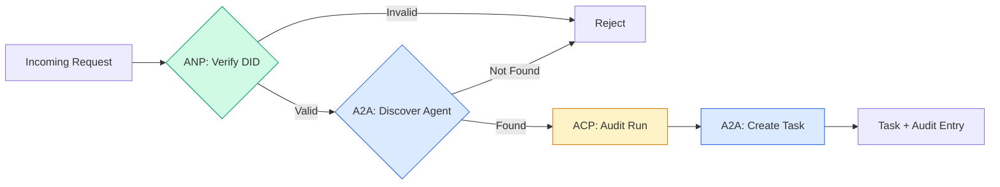

```typescript
class ProtocolGateway {
  private registry: AgentRegistry;
  private taskManager: TaskManager;
  private auditRunner: AuditableRunner;
  private identityRegistry: IdentityRegistry;

  constructor(
    registry: AgentRegistry,
    taskManager: TaskManager,
    auditRunner: AuditableRunner,
    identityRegistry: IdentityRegistry
  ) {
    this.registry = registry;
    this.taskManager = taskManager;
    this.auditRunner = auditRunner;
    this.identityRegistry = identityRegistry;
  }

  async delegateTask(
    fromDid: string,
    signature: string,
    targetAgent: string,
    message: AgentMessage,
    sessionId?: string
  ): Promise<{ task: Task; audit: AuditEntry } | { error: string }> {
    if (!this.identityRegistry.verify(fromDid, signature, message.id)) {
      return { error: "Identity verification failed" };
    }

    const card = this.registry.resolve(targetAgent);
    if (!card) {
      return { error: `Agent ${targetAgent} not found in registry` };
    }

    const audit = await this.auditRunner.run(
      targetAgent,
      [message],
      sessionId
    );
    const task = await this.taskManager.sendMessage(targetAgent, message);

    return { task, audit };
  }

  discoverAndDelegate(
    fromDid: string,
    signature: string,
    skillTag: string,
    message: AgentMessage
  ): Promise<{ task: Task; audit: AuditEntry } | { error: string }> {
    const candidates = this.registry.discoverBySkillTag(skillTag);
    if (candidates.length === 0) {
      return Promise.resolve({
        error: `No agents found with skill tag: ${skillTag}`,
      });
    }
    return this.delegateTask(
      fromDid,
      signature,
      candidates[0].name,
      message
    );
  }
}
```

गेटवे एक कॉल में चार चीजें करता हैः
1. **ANP**: DID हस्ताक्षर के माध्यम से कॉल करने वाले की पहचान सत्यापित करता है
   中文翻译:**ANP**:DID के माध्यम से 签名验证调用者身份
2. **A2A**: लक्ष्य एजेंट की खोज करता है और क्षमताओं की जांच करता है
   中文翻译:**A2A**: पहचान लक्ष्य एजेंट और जांच क्षमता
3. **ACP**: ट्रैकटोरियल के साथ एक लेखा परीक्षा पथ में निष्पादन को लपेटता है
   中文翻译:**ACP**: रेल्वे लेखापरीक्षण अनुगमन संकुल निष्पादन
4. **A2A**: पूर्ण जीवन चक्र ट्रैकिंग के साथ एक कार्य बनाता है
   中文翻译:**A2A**: पूर्ण जीवन चक्र का पालन करने के लिए एक मिशन का निर्माण

### चरण 7: इसे एक साथ जोड़ें

```typescript
async function protocolDemo() {
  const registry = new AgentRegistry();
  registry.register({
    name: "researcher",
    description: "Searches and summarizes findings",
    version: "1.0.0",
    url: "https://researcher.local/a2a/v1",
    capabilities: { streaming: true, pushNotifications: false },
    defaultInputModes: ["text/plain"],
    defaultOutputModes: ["text/plain", "application/json"],
    skills: [
      {
        id: "web-research",
        name: "Web Research",
        description: "Searches the web",
        tags: ["research", "search", "summarization"],
        inputModes: ["text/plain"],
        outputModes: ["application/json"],
      },
    ],
  });
  registry.register({
    name: "coder",
    description: "Writes code from specs",
    version: "1.0.0",
    url: "https://coder.local/a2a/v1",
    capabilities: { streaming: false, pushNotifications: false },
    defaultInputModes: ["text/plain", "application/json"],
    defaultOutputModes: ["text/plain"],
    skills: [
      {
        id: "code-gen",
        name: "Code Generation",
        description: "Generates code",
        tags: ["coding", "generation"],
        inputModes: ["text/plain", "application/json"],
        outputModes: ["text/plain"],
      },
    ],
  });

  const taskManager = new TaskManager();
  const auditRunner = new AuditableRunner();

  const researchTrajectory: TrajectoryEntry[] = [];

  taskManager.registerHandler(
    "researcher",
    async function* (task, message) {
      yield {
        kind: "statusUpdate" as const,
        taskId: task.id,
        status: { state: "working" as const, timestamp: Date.now() },
      };

      researchTrajectory.push({
        reasoning: "Searching for React 19 documentation",
        toolName: "web_search",
        toolInput: { query: "React 19 compiler features" },
        toolOutput: {
          results: ["react.dev/blog/react-19", "github.com/react/react"],
        },
        timestamp: Date.now(),
      });

      researchTrajectory.push({
        reasoning: "Extracting key findings from search results",
        toolName: "doc_analysis",
        toolInput: { url: "react.dev/blog/react-19" },
        toolOutput: {
          summary:
            "React 19 compiler auto-memoizes, no manual useMemo needed",
        },
        timestamp: Date.now(),
      });

      yield {
        kind: "artifactUpdate" as const,
        taskId: task.id,
        artifact: {
          id: crypto.randomUUID(),
          name: "research-results",
          parts: [
            {
              kind: "data" as const,
              data: {
                findings: [
                  "React 19 compiler auto-memoizes components",
                  "No more manual useMemo/useCallback needed",
                  "Compiler runs at build time, not runtime",
                ],
                sources: ["react.dev/blog/react-19"],
              },
              mediaType: "application/json",
            },
          ],
        },
        append: false,
        lastChunk: true,
      };

      yield {
        kind: "statusUpdate" as const,
        taskId: task.id,
        status: { state: "completed" as const, timestamp: Date.now() },
      };
    }
  );

  auditRunner.registerAgent("researcher", async () => ({
    output: [
      textMessage("agent", "React 19 compiler auto-memoizes components"),
    ],
    trajectory: researchTrajectory,
  }));

  const identityRegistry = new IdentityRegistry();

  const coderIdentity = createIdentity("coder.local", "coder");
  const researcherIdentity = createIdentity("researcher.local", "researcher");

  identityRegistry.publish(coderIdentity.document);
  identityRegistry.publish(researcherIdentity.document);

  const gateway = new ProtocolGateway(
    registry,
    taskManager,
    auditRunner,
    identityRegistry
  );

  console.log("=== Protocol Demo ===\n");

  console.log("1. Agent Discovery (A2A)");
  const researchAgents = registry.discoverBySkillTag("research");
  console.log(
    `   Found ${researchAgents.length} agent(s):`,
    researchAgents.map((a) => a.name)
  );

  console.log("\n2. Identity Verification (ANP)");
  const message = textMessage("user", "Research React 19 compiler features");
  const signature = signPayload(coderIdentity, message.id);
  const verified = identityRegistry.verify(
    coderIdentity.did,
    signature,
    message.id
  );
  console.log(`   Coder DID: ${coderIdentity.did}`);
  console.log(`   Signature verified: ${verified}`);

  console.log("\n3. Task Delegation (A2A + ACP + ANP)");
  const result = await gateway.delegateTask(
    coderIdentity.did,
    signature,
    "researcher",
    message,
    "session-001"
  );

  if ("error" in result) {
    console.log(`   Error: ${result.error}`);
    return;
  }

  console.log(`   Task ID: ${result.task.id}`);
  console.log(`   Task state: ${result.task.status.state}`);
  console.log(`   Artifacts: ${result.task.artifacts.length}`);

  console.log("\n4. Audit Trail (ACP)");
  console.log(`   Run ID: ${result.audit.runId}`);
  console.log(`   Status: ${result.audit.status}`);
  console.log(`   Trajectory steps: ${result.audit.trajectory.length}`);
  for (const step of result.audit.trajectory) {
    console.log(`     - ${step.reasoning}`);
    if (step.toolName) {
      console.log(`       Tool: ${step.toolName}`);
    }
  }

  console.log("\n5. Full Audit Log");
  const fullLog = auditRunner.getFullAuditLog();
  console.log(`   Total runs: ${fullLog.length}`);
  for (const entry of fullLog) {
    const duration = entry.completedAt
      ? `${entry.completedAt - entry.startedAt}ms`
      : "in-progress";
    console.log(`   ${entry.agentName}: ${entry.status} (${duration})`);
  }
}

protocolDemo().catch((err) => {
  console.error("Protocol demo failed:", err);
  process.exitCode = 1;
});
```

## क्या गलत हो रहा है

प्रोटोकॉल खुश पथ को हल करते हैं।

> 协议 ने सामान्य मार्ग को हल किया। निम्नलिखित उत्पादन में उत्पन्न समस्याएं हैंः

**Schema drift.**एजेंट ए एक एजेंट कार्ड विज्ञापन प्रकाशित करता है `application/json`आउटपुट. लेकिन JSON योजना संस्करणों के बीच बदलता है. एजेंट बी पुराने प्रारूप को विश्लेषण करता है और कचरा प्राप्त करता है. फिक्सः संस्करण अपने कौशल और आउटपुट योजनाओं. ए 2 ए विनिर्देश समर्थन करता है `version`एजेंट कार्ड्स पर इस कारण से.

> **模式漂移。**एजेंट ए  एक घोषणा जारी `application/json`输出 एजेंट 卡片──但 JSON 模式在版本之间发生变化──Agent B 解析旧格式并获得垃圾数据──修复:版本化你的技能和输出模式──A2A 规范为此支持 `version`

**State machine violations.**एक एजेंट हैंडल एक `completed`घटना, फिर अधिक कलाकृतियों को उत्पन्न करने की कोशिश करता है। कार्य अपरिवर्तनीय है। आपका कोड चुपचाप अद्यतन छोड़ देता है या फेंक देता है। ठीकः उत्पन्न करने से पहले टर्मिनल स्थिति की जांच करें। `TaskManager`उपरोक्त के साथ यह लागू करता है `break`टर्मिनल राज्यों के बाद।

> **状态机违规。**एजेंट  प्रसंस्करण प्रक्रिया उत्पन्न `completed`事件, फिर try to produce more workpieces── task is unchangeable── आपका कोड चुपचाप अपडेट या उतार-चढ़ाव छोड़ देगा──修复:`TaskManager`通过终态后的 `break`इसे अनिवार्य रूप से निष्पादित करना।

**Trust resolution failures.**एजेंट ए एजेंट बी के डीआईडी की पुष्टि करने की कोशिश करता है, लेकिन एजेंट बी का डोमेन डाउन है। डीआईडी दस्तावेज़ नहीं लाया जा सकता है। क्या आप खोलने में विफल रहते हैं (अनवीरीफाई किए गए एजेंटों को स्वीकार करते हैं) या बंद करने में विफल रहते हैं (सब कुछ अस्वीकार करते हैं)? एएनपी कम से कम विश्वास के सिद्धांत के साथ बंद करने में विफल रहने की सिफारिश करता है।

> **信任解析失败。**एजेंट ए 试试验证 एजेंट बी का DID, लेकिन एजेंट बी का डोमेन नाम 机已──DID 文档无法获取──你是开放失败 (आप खुली हुई हैं)

**Trajectory bloat.**एसीपी ट्रैक्टरी लॉगिंग शक्तिशाली है लेकिन महंगा है। एक जटिल एजेंट जो प्रति रन 200 टूल कॉल करता है, विशाल ऑडिट प्रविष्टियां उत्पन्न करता है। फिक्सः कॉन्फ़िगर करने योग्य वर्बोसिटी स्तरों पर लॉग ट्रैक्टरी। अनुपालन के लिए टूल नाम और आईओ रिकॉर्ड करें, गैर-नियामक कार्यभार के लिए तर्क चरणों को छोड़ दें।

> **轨迹膨胀。**ACP 轨迹日志 कार्यक्षमता मजबूत लेकिन लागत महंगी है। एक जटिल एजेंट प्रत्येक परिचालन के लिए 200 बार उपकरण नियोजन के लिए बड़ी संख्या में लेखा परीक्षा की धाराएं उत्पन्न करता है।

**Discovery thundering herd.**50 एजेंट सभी पूछताछ `GET /agents`स्टार्टअप पर एक साथ. ठीकः TTL के साथ कैश एजेंट कार्ड, स्टेजिंग डिस्कवरी अंतराल, या मतदान के बजाय पुश आधारित पंजीकरण का उपयोग करें।

> **发现惊群。**50 एजेंटों ने एक ही समय में पूछताछ शुरू की।`GET /agents`◊修复: TTL 缓存 एजेंट 卡片,交错发现间隔, या उपयोग पर आधारित प्रदत्त पंजीकरण और न कि轮询

## इसे फ्रेमवर्क के साथ लागू करें

### वास्तविक कार्यान्वयन

**A2A**सबसे परिपक्व है. गूगल की [official spec](https://github.com/google/A2A)यदि आपके एजेंटों को गतिशील खोज और सहयोग की आवश्यकता है, तो यहां से शुरू करें।

> **A2A**यह गूगल का सबसे परिपक्व है।[官方规范](https://github.com/google/A2A)Linux Foundation में डाउन ओपन सोर्स है। वहाँ पायथन और टाइपस्क्रिप्ट एसडीके है। यदि आपके एजेंट को गतिशील खोज और सहयोग की आवश्यकता है, तो यहां से शुरू करें।

**ACP**आईबीएम के [BeeAI project](https://github.com/i-am-bee/acp)एसीपी (trajectory logging, run life cycle) का उपयोग करें, भले ही आप ए 2 ए का उपयोग परिवहन के रूप में करें।

> **ACP**A2A से IBM के साथ संबद्ध है।[BeeAI 项目](https://github.com/i-am-bee/acp)एसीपी  के रूप में आरईएसटी  के लिए प्राथमिकता वाले विकल्प का निर्माण किया गया है, लेकिन 轨迹元数据 अवधारणा A2A पारिस्थितिकी तंत्र में अवशोषित हो रही है

**ANP**यह सबसे प्रयोगात्मक है।[community repo](https://github.com/agent-network-protocol/AgentNetworkProtocol)एक पायथन एसडीके (एजेंट कनेक्ट) है। मेटा-प्रोटोकॉल बातचीत अवधारणा वास्तव में नया है। क्रॉस-संगठन एजेंट तैनाती के लिए देखने लायक है।

> **ANP**यह सबसे प्रयोगात्मक है।[社区仓库](https://github.com/agent-network-protocol/AgentNetworkProtocol)एक पायथन एसडीके है (AgentConnect) 元协议协商概念确实新──值得跨组织 एजेंट 部署关注──

**MCP**यदि आप एजेंटों को उपकरण का उपयोग करना चाहते हैं, तो एमसीपी मानक है।

> **MCP**已在第13阶段中涵盖── यदि आप एजेंट को उपयोग करने के लिए उपकरण बनाना चाहते हैं, तो एमसीपी मानक है──

### सही प्रोटोकॉल चुनना

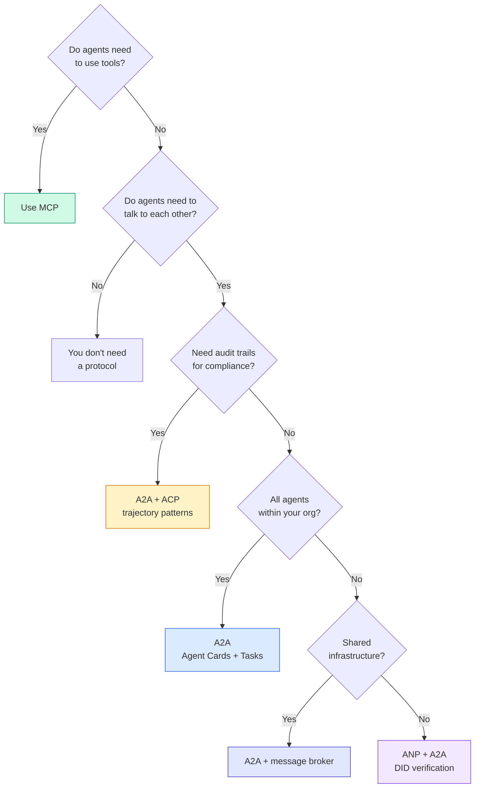

## इसे भेजें उत्पाद

इस पाठ से उत्पन्न होता हैः
- `code/main.ts`-- चार प्रोटोकॉल पैटर्नों का पूर्ण कार्यान्वयन
  中文翻译:`code/main.ts` सभी चार प्रकार के समझौता मोड का पूर्ण कार्यान्वयन
- `outputs/prompt-protocol-selector.md`-- एक संकेत जो आपको अपने सिस्टम के लिए प्रोटोकॉल चुनने में मदद करता है
  中文翻译:`outputs/prompt-protocol-selector.md`  मदद आप के लिए प्रणाली चयन समझौता का सुझाव

## अभ्यास विषय

1. **Multi-hop task delegation.**`TaskManager`एक एजेंट हैंडलर अन्य एजेंटों को सबटास्क सौंप सकता है। शोधकर्ता को एक कार्य प्राप्त होता है, दो विशेषज्ञ एजेंटों को सबटास्क "खोज" और "संक्षेप" देता है, दोनों को पूरा होने की प्रतीक्षा करता है, फिर परिणामों को अपने स्वयं के कलाकृतियों में मिलाता है।
   中文翻译:**多跳任务委派。**扩展 `TaskManager`, ताकि एजेंट  प्रसंस्करण प्रक्रिया अन्य एजेंट 委派子任务──研究员 प्राप्ति任务,将"搜索"和"总结"子任务委派给两个专家 एजेंट,等待两者完成,然后合并结果──

2. **Streaming audit trail.** को संशोधित करें`AuditableRunner`पूर्ण परिणाम की प्रतीक्षा करने के बजाय, yield `AuditEntry`वास्तविक समय में अद्यतन के रूप में प्रक्षेपवक्र प्रविष्टियों को जोड़ा जाता है. एक async जनरेटर का उपयोग जो ऑडिट स्नैपशॉट उत्पन्न करता है।
   中文翻译:**流式审计跟踪。**修改 `AuditableRunner`इस प्रकार, यह पूर्ण परिणाम की प्रतीक्षा नहीं करता है, बल्कि वास्तविकता में उत्पन्न होने वाले अतिरिक्त लेनदेन की ओर जाता है।`AuditEntry`更新── उपयोग करना उत्पन्न करना审计快照的异步生成器──

3. **DID rotation.** में कुंजी घूर्णन जोड़ें`IdentityRegistry`एक एजेंट को एक अद्यतन कुंजी के साथ एक नया डीआईडी दस्तावेज़ प्रकाशित करने में सक्षम होना चाहिए जबकि एक `previousDid`प्रमाणिकरणकर्ता को एक समय अवधि के दौरान वर्तमान और पूर्व कुंजी दोनों से हस्ताक्षर स्वीकार करना चाहिए।
   中文翻译:**DID 轮换。**`IdentityRegistry`添加密钥轮换──एजेंट 应能够发布带有更新密钥的新DID 文档,同时维护 `previousDid`引用── प्रमाणीकरणकर्ता को व्यापक अवधि के भीतर वर्तमान तथा पूर्व की चाबी के हस्ताक्षर स्वीकार करना चाहिए──

4. **Protocol negotiation.**एएनपी के मेटा प्रोटोकॉल अवधारणा को लागू करें। दो एजेंटों का आदान-प्रदान करें।`protocolNegotiation`उम्मीदवार प्रारूपों के साथ संदेश (जैसे, "मैं JSON-RPC बोल सकता हूं" बनाम "मैं REST पसंद करता हूं") अधिकतम 3 राउंड के बाद, वे एक प्रारूप या टाइमआउट पर सहमत होते हैं। सहमत प्रारूप निर्धारित करता है कि कौन सा `TaskManager`या `AuditableRunner`वे उपयोग करते हैं.
   中文翻译:**协议协商。**实现 ANP के元协议概念── दो एजेंट  आदान-प्रदान带有候选人格式 `protocolNegotiation`消息((जैसे"मैं कह सकता हूँ JSON-RPC" बनाम"我更喜欢 REST")

5. **Rate-limited discovery.**एक जोड़ें `RateLimitedRegistry`एक wrapper जो एक कॉन्फ़िगर करने योग्य TTL के साथ एजेंट कार्ड खोजों को कैश करता है और प्रति एजेंट प्रति सेकंड खोज प्रश्नों को सीमित करता है। स्टार्टअप पर एक दूसरे को खोजने वाले 100 एजेंटों के एक थंडर झुंड का अनुकरण करें और अंतर को मापें।
   中文翻译:**限速发现。**添加一个 `RateLimitedRegistry`पैकअप, विन्यास योग्य TTL  कैशिंग एजेंट  कार्ड खोज,并限制每秒每位 एजेंट 发现查询──模拟100 एजेंट 启动时互相发现的惊群效应并测量差异──

## कीवर्ड्स  शब्द खोज तालिका

| Term | What people say | What it actually means |
|------|----------------|----------------------|
| MCP | "The protocol for AI tools" / "AI 工具协议" | A client-server protocol for agents to discover and use tools. Agent-to-tool, not agent-to-agent. / 用于 Agent 发现和使用工具的客户端-服务器协议。Agent 到工具，不是 Agent 到 Agent。 |
| A2A | "Google's agent protocol" / "Google 的 Agent 协议" | A peer-to-peer protocol for agent collaboration under the Linux Foundation. Discovery via Agent Cards, 9-state task lifecycle, streaming via SSE. Supports JSON-RPC, REST, and gRPC bindings. / Linux Foundation 下的 Agent 协作点对点协议。通过 Agent 卡片发现，9 状态任务生命周期，SSE 流。支持 JSON-RPC、REST 和 gRPC 绑定。 |
| ACP | "Enterprise agent messaging" / "企业 Agent 消息" | IBM/BeeAI's REST API for agent runs with TrajectoryMetadata: every response carries the full chain of reasoning and tool calls. Merging into A2A. / IBM/BeeAI 的 Agent 运行 REST API，带轨迹元数据：每个响应携带完整的推理链和工具调用。正在合并到 A2A。 |
| ANP | "Decentralized agent identity" / "去中心化 Agent 身份" | A community protocol using `did:wba` (DID) for cryptographic identity, HPKE for E2EE, and AI-powered meta-protocol negotiation for agents that have never seen each other. / 使用 `did:wba` (DID) 进行加密身份、HPKE 进行端到端加密、AI 驱动的元协议协商的社区协议。 |
| Agent Card / Agent 卡片 | "An agent's business card" / "Agent 的名片" | A JSON document at `/.well-known/agent-card.json` describing skills, supported MIME types, security schemes, and protocol bindings. / 描述技能、支持的 MIME 类型、安全方案和协议绑定的 JSON 文档。 |
| DID | "Decentralized ID" / "去中心化 ID" | W3C standard for cryptographically verifiable identities hosted on the agent's own domain. ANP uses `did:wba` method. / W3C 标准，用于托管在 Agent 自己域上的加密可验证身份。ANP 使用 `did:wba` 方法。 |
| TrajectoryMetadata / 轨迹元数据 | "The audit receipt" / "审计收据" | ACP's mechanism for attaching reasoning steps, tool calls, and their inputs/outputs to every agent response. / ACP 的机制，将推理步骤、工具调用及其输入/输出附加到每个 Agent 响应。 |
| Meta-protocol / 元协议 | "Agents negotiating how to talk" / "Agent 协商如何对话" | ANP's approach where agents use natural language to dynamically agree on data formats, then generate code to handle them. / ANP 的方法，Agent 使用自然语言动态就数据格式达成一致，然后生成代码处理。 |
| Task / 任务 | "A unit of work" / "工作单元" | A2A's stateful object tracking work from submission through completion. Immutable once terminal. / A2A 的有状态对象，跟踪从提交到完成的工作。一旦终态则不可变。 |

## आगे पढ़ना 延伸閱讀

- [Google A2A specification](https://github.com/google/A2A)-- आधिकारिक विनिर्देश और SDKs (v1.0.0, लिनक्स फाउंडेशन)
  中文翻译:Google A2A 规范  官方规范和 SDK(v1.0.0, लिनक्स फाउंडेशन)
- [IBM/BeeAI ACP specification](https://github.com/i-am-bee/acp)-- एजेंट रन और ट्रैकटोरिया मेटाडेटा के लिए ओपनएपीआई 3.1 विनिर्देश
  中文翻译:IBM/BeeAI ACP 规范  एजेंट 运行和轨迹元数据的 OpenAPI 3.1 规范
- [Agent Network Protocol](https://github.com/agent-network-protocol/AgentNetworkProtocol)-- डीआईडी आधारित पहचान, ई2ईई, मेटा प्रोटोकॉल बातचीत
  中文翻译:एजेंट नेटवर्क प्रोटोकॉल  基于 DID的身份、端到端加密、元协议协商
- [Model Context Protocol docs](https://modelcontextprotocol.io/)-- एंथ्रोपिक के एमसीपी विनिर्देश (चरण 13 में शामिल)
  中文翻译:Model Context Protocol 文档  मानव के एमसीपी 规范(在第13 चरण 中涵盖)
- [W3C Decentralized Identifiers](https://www.w3.org/TR/did-core/)-- एएनपी के आधार पर पहचान मानक
  中文翻译:W3C 去中心化标识符  支 ANP 的身份标准
- [RFC 9180 (HPKE)](https://www.rfc-editor.org/rfc/rfc9180)-- एनएपी E2EE के लिए उपयोग की जाने वाली एन्क्रिप्शन योजना
  中文翻译:RFC 9180 (HPKE)  ANP उपयोग किया जाता है के लिए अंत से अंत तक ग्रिड
- [FIPA Agent Communication Language](http://www.fipa.org/specs/fipa00061/SC00061G.html)-- आधुनिक एजेंट प्रोटोकॉल के लिए अकादमिक अग्रदूत
  中文翻译:FIPA एजेंट 通信语言  现代 एजेंट 协议的学术前身
