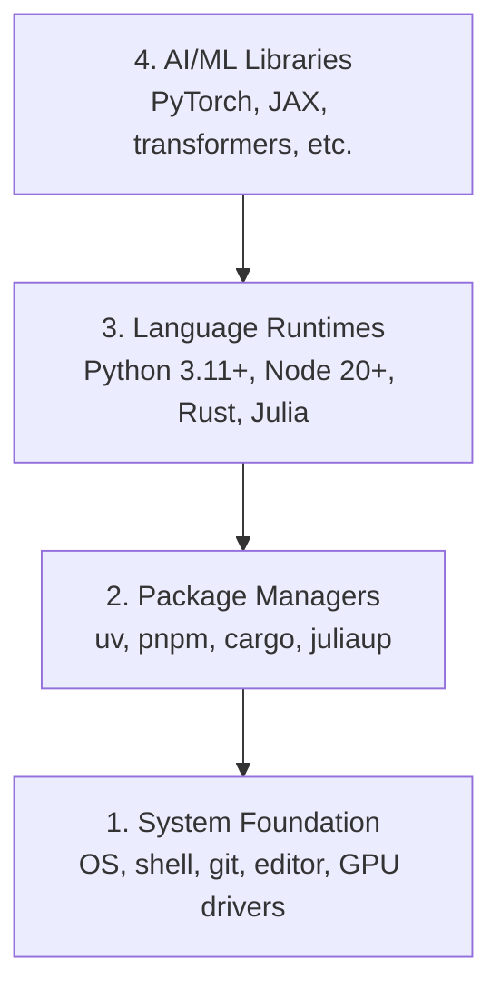

# Desenvolver Ambiente Desenvolver Ambiente Construir

> As tuas ferramentas moldam o teu pensamento.

> **【中文解读】**Seu instrumento forma seu pensamento  uma vez por todas, um trabalho e uma vida. Este capítulo é o ponto de partida de todo o curso: você vai construir um conjunto completo de ambiente de desenvolvimento de engenharia artificial (AI) Python, Node.js, Rust 工具链), e verificar se a GPU acelera ou não.

**Type:** Build | **类型:** 构建
**Languages:** Python, Node.js, Rust | **语言:** Python, Node.js, Rust
**Prerequisites:** None | **前置知识:** 无
**Time:** ~45 minutes | **时间:** ~45 分钟

## Objetivos de aprendizagem

- Configure Python 3.11+, Node.js 20+, e Rust toolchains a partir do zero
  Tradução do inglês: From零搭建 Python 3.11+、Node.js 20+ 和 Rust 工具链
- Configurar ambientes virtuais e gerenciadores de pacotes para construções reprodutíveis
  Tradução do inglês para tradução do inglês para tradução do inglês para tradução do inglês para tradução do inglês para tradução do inglês para tradução do inglês para tradução do inglês para tradução do inglês para tradução do inglês para tradução do inglês para tradução do inglês para tradução do inglês para tradução do inglês para tradução do inglês para o inglês para tradução do inglês para o inglês para tradução do inglês para o inglês para tradução do inglês para o inglês para tradução do inglês para o inglês para o inglês para o inglês para tradução do inglês para o inglês para o inglês para o inglês para o inglês para o inglês para o inglês para o inglês para o inglês para o inglês para o inglês para o inglês para o inglês
- Verificar o acesso da GPU com CUDA/MPS e executar uma operação de tensor de teste
  Tradução do inglês para inglês:
- Compreender a pilha de quatro camadas: sistema, pacotes, tempos de execução, bibliotecas de IA
  Tradução do inglês para tradução inglesa: entender quatro níveis de tecnologia: sistemas层、包管理器层、语言运行时层、AI库层

## O problema .

Você está prestes a aprender engenharia de IA em mais de 500 aulas usando Python, TypeScript, Rust e Julia. Se o seu ambiente for quebrado, cada aulas se torna uma luta contra ferramentas em vez de aprender.

> Você vai passar por mais de 500 aulas para aprender desenvolvimento de engenharia artificial, envolvendo Python, TypeScript, Rust e Julia. Se o seu ambiente tiver problemas, cada aulas se transformarão em ferramentas para lutar, em vez de em aprendizagem.

A maioria das pessoas esquece a configuração do ambiente, depois passa horas a depurar erros de importação, conflitos de versões e drivers de CUDA faltantes.

> A maioria das pessoas saltou o ambiente construído. Depois passaram algumas horas a tentar importar erros, conflitos e ausências.

> **【中文解读】**
> 环境问题是你遇到"import error""",version conflict""",找不到 CUDA"等报错的根本原因──与其每次上课都修环境,不如一次性搭好──

## O conceito central.

Um ambiente de engenharia de IA tem quatro camadas:

> O ambiente de engenharia artificial tem quatro níveis:



Instalamos de baixo para cima. Cada camada depende da que está abaixo dela.

> Nós estamos instalados de baixo para cima. Cada camada depende de uma camada abaixo.

> **【中文解读】**
> O ambiente de engenharia de IA é de quatro camadas: o mais baixo é o sistema operacional e o motor, o mais alto é o gerenciador de pacotes, o mais alto é o Python Torch, transformadores, etc.

> **【拓展：为什么需要 uv 而不是 pip？】**
> Uv é um Python 包管理器 Rust 写的, velocidade 快 10-100 vezes maior que pip, também pode gerenciar automaticamente um ambiente virtual. Em projetos de IA reais, você pode manter vários projetos simultaneamente dependentes, como um com PyTorch 2.1, outro com 2.4), Uv 能让环境隔离变得非常简单.
```figure
s0-env-stack
```

## Construí-lo.

> **【中文解读】**Os seguintes passos seguem a ordem de "desde baixo até cima" para instalar quatro níveis de ferramentas── cada passo pode ser copiado diretamente e colado até o terminal executado── se você usa o Windows, recomendamos usar o WSL2 (Windows Subsistema para Linux) para obter o Linux 环境──

### Passo 1: Fundamento do Sistema.

Verifique o seu sistema e instale o básico.

> Verifique o seu sistema e instale ferramentas básicas.

```bash
# macOS
xcode-select --install
brew install git curl wget

# Ubuntu/Debian
sudo apt update && sudo apt install -y build-essential git curl wget

# Windows (use WSL2)
wsl --install -d Ubuntu-24.04
```

### Passo 2: Python com uv.

Usamos`uv`É 10-100 vezes mais rápido do que o pip e lida automaticamente com ambientes virtuais.

> Nós usamos`uv`É 10-100 vezes mais rápido do que o pip, e pode gerenciar automaticamente o ambiente virtual.

> **【拓展：Python 版本选择】** Python 3.12                                                                                                                                                                                                                                                             `python install`会自动下载和管理 Python 版本, já não é necessário pyenv.

```bash
curl -LsSf https://astral.sh/uv/install.sh | sh

uv python install 3.12

uv venv
source .venv/bin/activate  # or .venv\Scripts\activate on Windows

uv pip install numpy matplotlib jupyter
```

Verificar:

> 验证安装:

```python
import sys
print(f"Python {sys.version}")

import numpy as np
print(f"NumPy {np.__version__}")
a = np.array([1, 2, 3])
print(f"Vector: {a}, dot product with itself: {np.dot(a, a)}")
```

### Passo 3: Node.js com pnpm.

> **【中文解读】**Node.js é um ambiente de execução do TypeScript.

Para aulas de TypeScript (agentes, servidores MCP, aplicativos web).

> Utilizado em TypeScript  cursos(Agente、MCP  servidor、Web  aplicação)

```bash
curl -fsSL https://fnm.vercel.app/install | bash
fnm install 22
fnm use 22

npm install -g pnpm

node -e "console.log('Node', process.version)"
```

**macOS / Apple Silicon (M1/M2/M3/M4):**Se o instalador parar com `Error: Cannot install under Rosetta 2 in ARM default prefix (/opt/homebrew)`O seu terminal está a funcionar sob a Rosetta 2 (`arch`impressões digitais`i386`Instalhar o arm64 forçador fnm, acoplar-o ao seu shell, e depois reiniciar os comandos acima de`fnm install 22`- Não .

> **苹果芯片 Mac 用户注意**Se instalando o sistema de correio`Error: Cannot install under Rosetta 2 in ARM default prefix (/opt/homebrew)`, explicem o seu terminal operando em Rosetta 2`arch`                                                                                                                                                                                                                                                                                                                                                                                                                                                                                                                             `i386`), enquanto Homebrew é original arm64  版本──此时强制使用 arm64 安装 fnm 并写入 shell 配置,然后从 `fnm install 22`Começa a correr novamente.

```bash
arch -arm64 brew install fnm
echo 'eval "$(fnm env --use-on-cd)"' >> ~/.zshrc
source ~/.zshrc
```

### Passo 4: Rust.

Para aulas críticas ao desempenho (inferência, sistemas).

> Utilizando cursos sensíveis ao desempenho (referências de optimização, programação de sistemas)

> **【中文解读】**Rust utiliza a parte sensível ao desempenho deste curso, como o cálculo de otimização (Fase 12) e sistema autónomo (Fase 15-17): Rust é Rust 官方安装器, cargo é Rust 包管理器+构建工具 (Rust 版本的管+制造器)

```bash
curl --proto '=https' --tlsv1.2 -sSf https://sh.rustup.rs | sh

rustc --version
cargo --version
```

### Passo 5: Julia (opcional)

Para aulas de matemática pesadas onde a Julia brilha.

> É uma boa aula de matemática.

```bash
curl -fsSL https://install.julialang.org | sh

julia -e 'println("Julia ", VERSION)'
```

### Passo 6: Configuração de GPU (se você tem um)

**NVIDIA (Linux / Windows):**

> **【中文解读】**NVIDIA 显卡先用 `nvidia-smi`确认驱动正常,再安装 CUDA 版 PyTorch;果芯片 Mac 没有 CUDA 属正常现象直接装默认版 PyTorch(内置 MPS/Metal 后端)即可,不要传 `--index-url .../cuXXX`(As rodas só suportam Linux/Windows, já não conseguiram)

```bash
nvidia-smi

# Install PyTorch with CUDA
uv pip install torch torchvision torchaudio --index-url https://download.pytorch.org/whl/cu124
```

**macOS / Apple Silicon (M1/M2/M3/M4):**Não há CUDA num Mac que seja esperado, nem um fracasso.**not**Passagem .`--index-url .../cuXXX`(aquelas rodas são apenas Linux / Windows, então a instalação falha). Instale a construção simples, que inclui o backend da GPU MPS (Metal) da Apple:

> **macOS / 苹果芯片（M1/M2/M3/M4）**Não há problema. É um comportamento esperado.`--index-url .../cuXXX`(Aquelas rodas  Linux / Windows,传传传了安装会失败)。安装默认版本即可, é内置的果的MPS(Metal) GPU 后端:

```bash
uv pip install torch torchvision torchaudio
```

Verificar (funciona em qualquer plataforma):

> 验证(任意平台通用):

```python
import torch
print(f"CUDA available: {torch.cuda.is_available()}")           # False on macOS — expected
print(f"MPS available:  {torch.backends.mps.is_available()}")   # True on Apple Silicon
if torch.cuda.is_available():
    print(f"GPU: {torch.cuda.get_device_name(0)}")
```

Não há GPU? Não há problema. A maioria das aulas funciona em CPU. Para aulas pesadas de treinamento, use Google Colab ou GPUs em nuvem.

> 没有GPU?没关系── a maior parte dos cursos pode ser executada na CPU── a maior parte dos cursos pode ser executada com o Google Colab ou o GPU cloud-end──

> **【拓展：GPU vs CPU 性能对比】**訓練 GPT-2 small(117M 参数):CPU 约7 天,单块 RTX 3090 约3 小时,A100 约40 分钟──推理阶段差距略小但仍然显著──本课程大部分课程可用CPU 跑,只有10阶段(从零训练LLM)等少数课程建议使用GPU──

> **【拓展：GPU 在 AI 中的作用】**
> GPU (GPU) é indispensável na IA, porque pode executar milhares de milhões de simples cálculos simultaneamente.

### Passo 7: Verifique a rota que quer começar.

Execute todos os comandos nesta lição a partir da raiz do repositório, o diretório que
contém `README.md`E ...`phases/`O pré-voo verifica apenas o que você precisa
O sistema de aprendizagem é um sistema de aprendizagem que permite que um aprendiz
Uma resposta clara em vez de um muro de advertências.

> Todas as ordens desta aula estão no Registro de Depósito`README.md`和 `phases/`O programa de ensino de ensino superior é um programa de ensino superior que permite aos alunos a perceberem uma conclusão clara, e não uma advertência completa.

Comece a sequência completa de iniciantes:

> Iniciar a sequência completa de iniciantes:

```bash
python3 phases/00-setup-and-tooling/01-dev-environment/code/verify.py --route beginner
```

Ou verifique apenas a rota que quiser:

> Ou apenas verifique o que você quer aprender:

```bash
python3 phases/00-setup-and-tooling/01-dev-environment/code/verify.py --route ml-foundations
python3 phases/00-setup-and-tooling/01-dev-environment/code/verify.py --route llm-engineering
python3 phases/00-setup-and-tooling/01-dev-environment/code/verify.py --route agents
python3 phases/00-setup-and-tooling/01-dev-environment/code/verify.py --route mcp
python3 phases/00-setup-and-tooling/01-dev-environment/code/verify.py --route agent-skills
python3 phases/00-setup-and-tooling/01-dev-environment/code/verify.py --route certification
```

Adicionar`--show-later`Quando quiser o mesmo pré-voo para inspecionar ferramentas opcionais
Uma ferramenta posterior que falte nunca bloqueia a
rota selecionada.

>  fazer a pré-exame ao mesmo tempo que a exame posterior curso será usado para ferramentas opcionais e dependência, adicionado `--show-later`                                                                                                                                                                                                                                                              

Cada verificação necessária falhada inclui o caminho detectado ou o erro de importação e um
As habilidades dos agentes e as rotas de certificação também mostram
verifica manualmente o host porque um script Python não pode provar que um host de IA tem
Descobriu uma habilidade ou que o seu escopo de habilidade escolhido é escritível.

> Cada teste necessário falhado é acompanhado de um caminho ou erro de importação, bem como um pedido de reparação preciso.

Quando o pré-voio iniciante passa, ele imprime a primeira lição correta:

> Quando os iniciantes pre-examinam, o script irá imprimir o primeiro curso executável:

```text
Ready to start Beginner course.
Next: python3 phases/01-math-foundations/01-linear-algebra-intuition/code/vectors.py
```

> **【中文解读】**预检脚本是"按路线最小环境"落地:初学者只需要Python和Git,ml-foundations 再加 NumPy,agentes/mcp 路线连 Node 都可以先不装用到再装.Windows 用户把命令里 `python3`- Não .`python`É o que se passa.

## Usa-o usando um guia.

> **【中文解读】**A primeira é a primeira edição da série de jogos de jogos de jogos de jogos de jogos de jogos de jogos de jogos de jogos de jogos de jogos de jogos de jogos de jogos de jogos de jogos de jogos de jogos de jogos de jogos de jogos de jogos de jogos de jogos de jogos de jogos de jogos de jogos de jogos de jogos de jogos de jogos de jogos de jogos de jogos de jogos de jogos de jogos de jogos de jogos de jogos de jogos de jogos de jogos de jogos de jogos de jogos de jogos de jogos de jogos de jogos de jogos de jogos de jogos de jogos de jogos de jogos de jogos de jogos de jogos de jogos de jogos de jogos de jogos de jogos de jogos de jogos de jogos de jogos de jogos de jogos de jogos de jogos de jogos de jogos de jogos de jogos de jogos de jogos de jogos de jogos de jogos de jogos de jogos de jogos de jogos de jogos de jogos de jogos de jogos de jogos de jogos de jogos de jogos de jogos de jogos de jogos de jogos de jogos de jogos de jogos de jogos de jogos de jogos de jogos de jogos de jogos de jogos de jogos de jogos de jogos de jogos de jogos de jogos de jogos de jogos de jogos de jogos de jogos de jogos de jogos de jogos de jogos de jogos de jogos de jogos de jogos de jogos de jogos de jogos de jogos de jogos de jogos de jogos de jogos de jogos de jogos de jogos de jogos de jogos de jogos de jogos de jogos de jogos de jogos de jogos de jogos de jogos de jogos de jogos de jogos de jogos de jogos de jogos de jogos de jogos de jogos de jogos de jogos de jogos de jogos de jogos de jogos de jogos de jogos de jogos de jogos de jogos de jogos de jogos de jogos de jogos de jogos de jogos de jogos de jogos de jogos de jogos de jogos de jogos de jogos de jogos de jogos de jogos de jogos de jogos de .

O seu ambiente está pronto para iniciar a rota que você verificou.
Quando uma lição pede por eles em vez de bloquear a sua primeira lição no todo
Aqui está o que você vai usar em todo o currículo:

> Seu ambiente já pode começar a explorar a linha que você examinou. Ferramentas posteriores, etc. até o tempo de reinstalação do curso, não deixe toda a tecnologia impedi-lo.

| Language | Used In | Package Manager |
|----------|---------|-----------------|
| Python | Phases 1-12 (ML, DL, NLP, Vision, Audio, LLMs) | uv |
| TypeScript | Phases 13-17 (Tools, Agents, Swarms, Infra) | pnpm |
| Rust | Phases 12, 15-17 (Performance-critical systems) | cargo |
| Julia | Phase 1 (Math foundations) | Pkg |

| 语言 | 用在哪些阶段 | 包管理器 |
|------|------------|---------|
| Python | 阶段 1-12（ML、DL、NLP、视觉、音频、LLM） | uv |
| TypeScript | 阶段 13-17（工具、Agent、集群、基础设施） | pnpm |
| Rust | 阶段 12, 15-17（高性能系统） | cargo |
| Julia | 阶段 1（数学基础） | Pkg |

## Envia-o . Produto .

> **【拓展：环境检查 Prompt】** `outputs/prompt-env-check.md`É um prompt que pode ser usado diretamente por uma AI, para ajudá-lo a diagnosticar problemas ambientais.

Esta lição produz um script de verificação que qualquer um pode executar para verificar a sua configuração.

> Esta aula produz um manual de verificação, que qualquer um pode usar para verificar sua configuração ambiental.

Veja .`outputs/prompt-env-check.md`para um prompt que ajuda os assistentes de IA a diagnosticar problemas ambientais.

> 参见 `outputs/prompt-env-check.md`, que contém um auxílio AI assistente diagnóstico de problemas ambientais imediato.

## Exercícios.

1. Execute o script de verificação e corrija quaisquer falhas
   运行验证脚本并修复所有失败检查项
2. Criar um ambiente virtual Python para este curso e instalar PyTorch
   Para este curso criar Python  ambiente virtual e instalar PyTorch
3. Escreva um "olá ao mundo" em todas as quatro línguas e execute cada uma
   Usar quatro idiomas para escrever um "olá mundo" e funcionar
