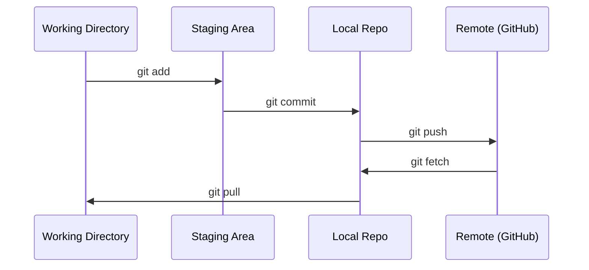

# Git & Collaboração

> Cada experimento, modelo, lição que construímos aqui são rastreados.
> O controle de versão não é opcional. Cada experiência, cada modelo, cada aula, será acompanhado.

**Type:** Learn | **类型:** 学习
**Languages:** -- | **语言:** 无
**Prerequisites:** Phase 0, Lesson 01 | **前置知识:** Phase 0, 第 01 课
**Time:** ~30 minutes | **时间:** ~30 分钟

## Objetivos de aprendizagem

- Configure a identidade git e use o fluxo de trabalho diário de adicionar, comprometer e empurrar
  Navio de informação, controle de adição, compromisso, empurro de flux de trabalho diário
- Criar e fundir ramos para experimentos isolados sem quebrar o principal
  Tradução do chinês: criar e juntar os componentes, realizar experiências de separação sem destruir os componentes principais
- Escreva um`.gitignore`que exclui os pontos de controlo de modelo e os grandes ficheiros binários
  Tradução: 编写`.gitignore`文件,排除模型检查点和大文件
- Navegue no histórico de compromissos com `git log`compreender a evolução do projeto
  Tradução:`git log`浏览提交历史,了解项目演进过程

> **【中文解读】**
> Git é uma ferramenta de controle de versão, usada para rastrear cada modificação do código. Em projetos de IA, você irá frequentemente alterar os parâmetros e código do modelo durante a experiência.

> **【拓展：Git 在 AI 工程中的角色】**A IA 工程和传统软件开发不同每次实验(超参数调整、数据集变更) são uma "versão"──Use Git 追踪实验意味着:`git diff`Descobre o que mudar;`git revert`O processo de colaboração do grupo de grandes modelos (como Hugging Face) é totalmente baseado no Git.

## O problema .

Você está prestes a escrever centenas de arquivos de código em 20 fases, sem controle de versão, perderá trabalho, quebrará coisas que não pode desfechar e não terá forma de colaborar com os outros.

> Você vai escrever centenas de documentos de código em 20 fases. Sem controle de versão, você vai perder o resultado do trabalho.

Git é a ferramenta. GitHub é onde o código vive. Esta lição cobre o que você precisa para este curso e nada mais.

> O Git é um instrumento, o GitHub é um lugar de gestão de código.

> **【中文解读】**
> Você vai escrever algumas centenas de documentos de código, sem controle de versão = 随时可能失去工作成果、无法回归、无法协作──Git 解决的就是这个问题──

## O conceito central.



Três coisas para lembrar:
1. Salvar frequentemente (`git commit`)
2. Empurrar para remoto (`git push`)
3. O ramo de experiências (`git checkout -b experiment`)

> Há três coisas que temos de lembrar:
> 1. 经常保存(`git commit`)
> 2. 推送到远程(`git push`)
> 3. Usando o meu corpo para fazer experiências.`git checkout -b experiment`)

> **【中文解读】**
> Gito de código aberto: http://www.gito.com.br/index.php?title=http://www.gito.com.br/index.php?title=http://www.gito.com.br/index.php?title=http://www.gito.com.br/index.php?title=http://www.gito.com.br/index.php?title=http://www.gito.com.br/index.php?title=http://www.gito.com.br/index.php?title=http://www.gito.com.br/index.php?title=http://www.gito.com.br/index.php?title=http://www.gito.com/index.php?title=http?title=http?title=http?t=http?title=http?t=http?t=http?t=http?t=http?t=http?t=http?t=http?t=http?t=http?t=t=t=t=t=t=t=t=t=t=t=t=t=t=t=t=t=t=t=t=t=t=t=t=t=t=t=t=t=t=t=t=t=t=t=t=t=t=t=t=t=t=t=t=t=t=t=t=t=t=t=t=t=t=t=t=t=t=t=t=t=t=t=t=t=t=t=t=t=t=t=t=t=t=t=t=t=t=t=t=t=t=t=t=t=t=t=t=t=t=t=t=t=t=t=t=t=t=t=t=t=t=t=t=t=t=t=t=t=t=t=t=t=t=t=t=t=t=

> **【拓展：分支策略与 AI 实验】**AI  projetos sugerir "cada experiência uma branca" estratégia:`experiment/lr-0.001`- Não.`experiment/add-dropout`Assim, cada vez que o código do experimento muda, ele é isolado, o experimento falha, elimina diretamente o componente, o sucesso é combinado.`v1.0-baseline`), facilita a implementação, quando é preciso especificar a versão do código.

## Construí-lo e realizei-o.
```figure
s0-commit-dag
```

## Construí-lo

### Passo 1: Configurar git

> 第1步: Configuração Git

```bash
git config --global user.name "Your Name"
git config --global user.email "you@example.com"
```

### Passo 2: O fluxo de trabalho diário.

```bash
git status                              # 查看哪些文件有改动
git add file.py                         # 把改动加入暂存区
git commit -m "Add perceptron implementation"  # 提交到本地仓库
git push origin main                    # 推送到 GitHub 远程仓库
```

### Passo 3: A ramificação para experimentos.

```bash
git checkout -b experiment/new-optimizer  # 创建并切换到新分支

# ... make changes, commit ...  # 在新分支上修改和提交，不影响主分支

git checkout main                         # 切回主分支
git merge experiment/new-optimizer        # 把实验分支的改动合并到主分支
```

### Passo 4: Trabalhar com este repo do curso.

> **【拓展：Fork vs Clone】**Se quiser manter o seu progresso de aprendizagem sem afetar a armazenagem original, use `fork`(em GitHub 上操作) em vez de clone direto. Depois você tem sua própria cópia completa, pode freely submeter.

Não pode empurrar para o próprio repo do curso  apenas os mantenedores têm acesso a escrever. Forque-o no GitHub primeiro (o botão Forque, em cima à direita) assim `origin`Pontos em sua própria cópia:

```bash
git clone https://github.com/YOUR-USERNAME/ai-engineering-from-scratch.git
cd ai-engineering-from-scratch

git checkout -b my-progress
# work through lessons, commit your code
git push origin my-progress
```

## Usa-o usando um guia.

> **【拓展：.gitignore 在 AI 项目中至关重要】**AI  projetos gerar um grande número de não deve ser submetido`.pt`- Não.`.safetensors`Cota de 10 GB) ≈ training日志、 dados`__pycache__`- Não.`.venv`Uma boa.`.gitignore`能防止你意外把10GB的模型文件推到 GitHub── 推使用`gitignore.io`生成 Python/ML 项目的模板──

Para este curso, precisam exactamente destes comandos:

> Neste curso, só precisas destas ordens:

| Command | When |
|---------|------|
| `git clone` | Get the course repo |
| `git add` + `git commit` | Save your work |
| `git push` | Back it up to GitHub |
| `git checkout -b` | Try something without breaking main |
| `git log --oneline` | See what you've done |

| 命令 | 什么时候用 |
|------|-----------|
| `git clone` | 下载课程仓库 |
| `git add` + `git commit` | 保存你的工作 |
| `git push` | 备份到 GitHub |
| `git checkout -b` | 安全地尝试新想法 |
| `git log --oneline` | 查看你做了什么 |

Não precisas de rebases, de pistas ou submodules para este curso.

> Assim, o curso não precisa de base ou submodules.

## Exercícios.

1. Clone este repo, crie um ramo chamado `my-progress`, fazer um arquivo, cometer, empurrá-lo
   克隆仓库,创建 `my-progress`分支, 新建文件, submeter e enviar
1. Forque este repo, clone o seu fork, crie um ramo chamado `my-progress`, fazer um arquivo, cometer, empurrá-lo
2. Criar um`.gitignore`que exclui os modelos de ficheiros de checkpoint (`.pt`- Não .`.pth`- Não .`.safetensors`)
                                                                                                                                                                                                                                                                                                                                                                                                                                                                                                                                `.gitignore`文件,排除模型检查点文件
3. Veja o histórico de compromissos deste repo com `git log --oneline`E ler como as lições foram adicionadas
   - Não .`git log --oneline`查看提交历史, entender como o curso é construído gradualmente

## Termos-chave .

> **【中文解读】**Compromissos (comitados) = 项目快照,Ráfico (Rácio) = 独立开发线,Merge (Merger) = Colocar (em) = 分支改动合回来,Remote (Remote) = 仓库副本 (副本) do GitHub (em)

| Term | What people say | What it actually means |
|------|----------------|----------------------|
| Commit | "Saving" | A snapshot of your entire project at a point in time |
| Branch | "A copy" | A pointer to a commit that moves forward as you work |
| Merge | "Combining code" | Taking changes from one branch and applying them to another |
| Remote | "The cloud" | A copy of your repo hosted somewhere else (GitHub, GitLab) |

| 术语 | 俗称 | 实际含义 |
|------|------|---------|
| Commit | "保存" | 项目在某一时刻的完整快照 |
| Branch | "副本" | 指向某个提交的可移动指针，随工作向前推进 |
| Merge | "合并代码" | 将一个分支的改动应用到另一个分支 |
| Remote | "云端" | 托管在其他地方的仓库副本（如 GitHub、GitLab） |
