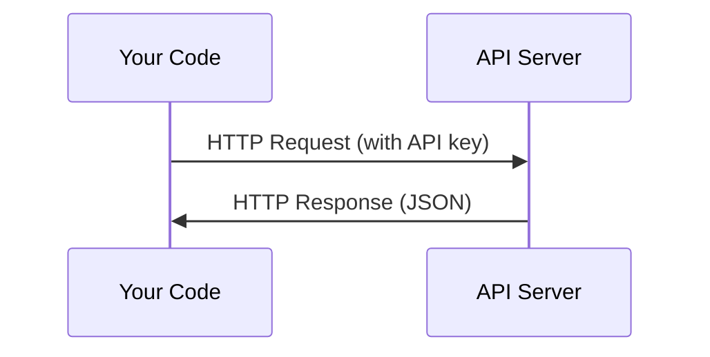

# API e Chaves . API e gerenciamento de chaves .

> Todas as API de IA funcionam da mesma forma: enviar uma solicitação, obter uma resposta. Os detalhes mudam, o padrão não.
> Todas as APIs de trabalho são as mesmas: enviar solicitações, obter respostas.

**Type:** Build | **类型:** 构建
**Languages:** Python, TypeScript | **语言:** Python, TypeScript
**Prerequisites:** Phase 0, Lesson 01 | **前置知识:** Phase 0, 第 01 课
**Time:** ~30 minutes | **时间:** ~30 分钟

## Objetivos de aprendizagem

- Armazenar as chaves API com segurança usando variáveis do ambiente e `.env`Arquivos
  Tradução do inglês:`.env`文件安全存储 API 密钥
- Faça uma chamada de API LLM usando tanto o SDK Anthropic Python quanto o HTTP bruto
  中文翻译: usar Anthropic Python SDK 和原始 HTTP 两种方式调用 LLM API
- Compare formatos de solicitação/resposta HTTP baseados em SDK e crus para depuração
  Tradução do idioma japonês:对比 SDK 和原始 HTTP 的请求/响应格式,以便调试
- Identificar e lidar com erros comuns da API, incluindo limites de autenticação e taxa
  Chinese Translation: identificando e processando erros de API, incluindo problemas de certificação e limitação

> **【中文解读】**
> Todos os métodos de trabalho da API da AI são os mesmos: enviar solicitações, obter respostas, ajudar a gerenciar a segurança da API, a utilizar a API LLM, bem como entender a diferença entre o SDK e a HTTP original.

## O problema .

A partir da Fase 11, você vai chamar APIs LLM (Antropic, OpenAI, Google). Na Fase 13-16 você vai construir agentes que usam essas APIs em loops. Você precisa saber como as chaves API funcionam, como armazená-las com segurança, e como fazer sua primeira chamada API.

> A partir da fase 11                                                                                                                                                                                                                                                                                                                                                                                                                                                                                                                         

> **【中文解读】**
> A partir da fase 11                                                                                                                                                                                                                                                                                                                                                                                                                                                                                                                         

## O conceito central.



Cada chamada de API tem:
1. Um endpoint (URL)
2. Uma chave API (autenticação)
3. Um organismo de solicitação (o que desejar)
4. Um corpo de resposta (o que você retorna)

> Cada API 调用 contém quatro elementos:
> 1. 端点(URL)
> 2. API 密钥(身份认证)
> 3. Peço-lhe o que queres.
> 4. 响应体(返回什么)

> **【中文解读】**
> Cada API 调用 contém quatro elementos:端点 URL、API 密钥(身份认证) 请求体(你想要什么) 响应体(返回什么) ⋅ Comprender este modelo, todas as API da AI são iguais。

> **【拓展：API 在 AI Agent 中的角色】**
> O ciclo central do Agente de IA é: construir o argumento → 调用 LLM API → 解析响应 → 执行动作 → 再次调用 API──掌握 API 调用是构建代理的第一步──
```figure
s0-secret-inject
```

## Construí-lo

## Construí-lo e realizei-o.

> **【拓展：API 密钥安全的铁律】**绝不把API key 硬编码在代码里──一旦推到 GitHub,爬虫会在几秒内发现并滥用你的密钥(真实例: alguém escreveu uma chave OpenAI no código, em algumas horas foi brochado上千美元)──使用`.env`文件 + `python-dotenv`O sistema operacional

### Passo 1: Guarde as chaves da API de forma segura .

Nunca coloque chaves API em código. Use variáveis ambientais.

> 永遠不要把API 密钥写在代码里. 永远不要把API 密钥写在代码里. 永远不要把API 密钥写在代码里.

```bash
export ANTHROPIC_API_KEY="sk-ant-..."  # 设置环境变量（密钥永远不要写在代码里！）
export OPENAI_API_KEY="sk-..."
```

Ou usar um`.env`arquivo (ajustar `.gitignore`):

> Ou usar `.env`文件(记得添加到 `.gitignore`):

```
ANTHROPIC_API_KEY=sk-ant-...  # .env 文件（确保加入 .gitignore）
OPENAI_API_KEY=sk-...
```

### Passo 2: Primeira chamada de API (Python)

```python
import os

import anthropic

client = anthropic.Anthropic()  # 自动从环境变量读取密钥

MODEL = os.environ.get("LLM_MODEL", "claude-sonnet-5")

response = client.messages.create(
    model="claude-sonnet-4-20250514",  # 指定模型
    max_tokens=256,  # 最大输出长度
    messages=[{"role": "user", "content": "What is a neural network in one sentence?"}]  # 用户消息
    model=MODEL,
    max_tokens=256,
    messages=[{"role": "user", "content": "What is a neural network in one sentence?"}]
)

print(response.content[0].text)  # 打印模型回复
```

### Passo 3: Primeira chamada de API (TypeScript)

> **【拓展：Token 计费机制】**O programa de formação de professores de ensino superior é um programa de formação de professores de ensino superior .$3/百万输入 token、$15/million输出 token──一英文单词约1.3 个 token,一个中文字约2-3 个 token──`max_tokens=256`Significa que o modelo mais output 256 tokens (cerca de 200 palavras em inglês) ―control `max_tokens`É um dos principais meios de economia de custos.
`LLM_MODEL`seleciona o id do modelo Anthropic, e o padrão é o alias Sonnet não datado. Outros provedores (OpenAI, Google e outros) seguem o mesmo padrão de uma chave mais um id do modelo, mas cada um tem seu próprio SDK, endpoint e esquema de solicitação / resposta.

### Passo 3: Primeira chamada de API (TypeScript)

```typescript
import Anthropic from "@anthropic-ai/sdk";

const client = new Anthropic();

const MODEL = process.env.LLM_MODEL ?? "claude-sonnet-5";

const response = await client.messages.create({
  model: MODEL,
  max_tokens: 256,
  messages: [{ role: "user", content: "What is a neural network in one sentence?" }],
});

console.log(response.content[0].text);
```

### Passo 4: HTTP bruto (sem SDK)

```python
import os
import urllib.request
import json

url = "https://api.anthropic.com/v1/messages"  # API 端点
headers = {
    "Content-Type": "application/json",  # 请求格式为 JSON
    "x-api-key": os.environ["ANTHROPIC_API_KEY"],  # 从环境变量读取密钥
    "anthropic-version": "2023-06-01",  # API 版本号
}
body = json.dumps({
    "model": "claude-sonnet-4-20250514",  # 模型名称
    "max_tokens": 256,  # 最大输出 token 数
    "model": os.environ.get("LLM_MODEL", "claude-sonnet-5"),
    "max_tokens": 256,
    "messages": [{"role": "user", "content": "What is a neural network in one sentence?"}],
}).encode()

req = urllib.request.Request(url, data=body, headers=headers, method="POST")  # 构造 POST 请求
with urllib.request.urlopen(req) as resp:
    result = json.loads(resp.read())  # 解析 JSON 响应
    print(result["content"][0]["text"])  # 提取并打印回复文本
```

Isto é o que os SDKs fazem sob o capô. Entender a chamada HTTP crua ajuda ao depurar.

> É o que o SDK faz na parte inferior.

> **【中文解读】**
> O SDK  apenas embalagem de solicitações HTTP. Compreender o HTTP original 调用 pode ajudá-lo a fazer o API 问题、处理错误、甚至在 SDK 不支持的语言中调用 API.

## Usa-o usando um guia.

> **【中文解读】**现在不需要注册所有API──Fase 4-10 用 Hugging Face(免费),Fase 11-16 需要人类或OpenAI──等课程用到时再注册即可──

Para este curso:

> É um programa de ensino.

| API | When you need it | Free tier |
|-----|-----------------|-----------|
| Anthropic (Claude) | Phases 11-16 (agents, tools) | $5 credit on signup |
| OpenAI | Phase 11 (comparison) | $5 credit on signup |
| Hugging Face | Phases 4-10 (models, datasets) | Free |

| API | 何时需要 | 免费额度 |
|-----|---------|---------|
| Anthropic (Claude) | 阶段 11-16（Agent、工具） | 注册送 $5 额度 |
| OpenAI | 阶段 11（对比实验） | 注册送 $5 额度 |
| Hugging Face | 阶段 4-10（模型、数据集） | 免费 |

Não precisas de todos agora, arranja-os quando a lição precisar.

> Você não precisa agora de registrar todas as API... e outros cursos usados até que o tempo seja redefinido.

## Envia-o . Produto .

> **【拓展：429 限流处理】**调用 LLM API 时最常见的错误是429 Rate Limit──处理方式:指数退避重试(等 1s → 2s → 4s → 8s)──Antropic SDK 内置自动重试,但理解原理很重要在实际代理系统中,你可能需要自己实现限流逻辑来控制成本和避免被封锁──

Esta lição produz:
- `outputs/prompt-api-troubleshooter.md`- diagnóstico de erros comuns na API

> 本课产出:
> - `outputs/prompt-api-troubleshooter.md`- 诊断常见 API 错误的提示

## Exercícios.

1. Obtenha uma chave de API Anthropic e faça sua primeira chamada de API
   Get Antropic API 密钥, completar sua primeira API 调用
2. Tente a versão HTTP crua e compare o formato de resposta com a versão SDK
   尝试原始 HTTP 方式调用, em relação ao formato de resposta do SDK 方式
3. Usar intencionalmente uma chave de API errada e ler a mensagem de erro
   Por isso, não é preciso usar o código de código de código de código de código.

## Termos-chave .

| Term | What people say | What it actually means |
|------|----------------|----------------------|
| API key | "Password for the API" | A unique string that identifies your account and authorizes requests |
| Rate limit | "They're throttling me" | Maximum requests per minute/hour to prevent abuse and ensure fair usage |
| Token | "A word" (in API context) | A billing unit: input and output tokens are counted and charged separately |
| Streaming | "Real-time responses" | Getting the response word by word instead of waiting for the full response |

| 术语 | 俗称 | 实际含义 |
|------|------|---------|
| API key | "API 密码" | 标识你账户并授权请求的唯一字符串 |
| Rate limit | "被限流了" | 每分钟/小时的请求上限，防止滥用 |
| Token | "词"（API 语境） | 计费单位：输入和输出 token 分别计费 |
| Streaming | "实时响应" | 逐词返回响应，而非等待完整响应 |
