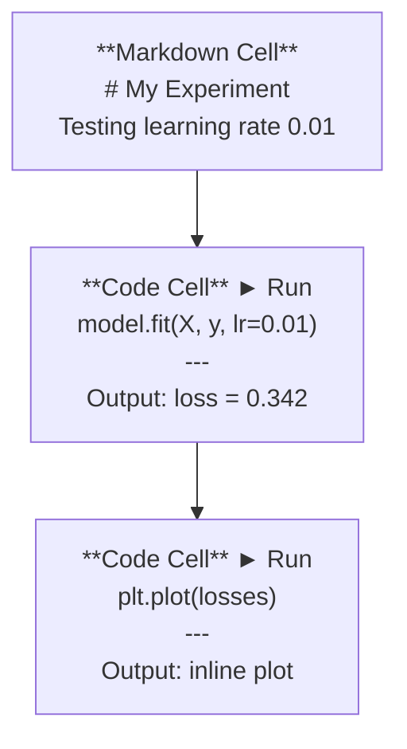
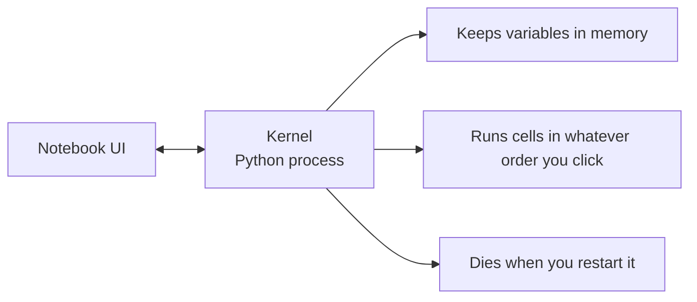

# Júpiter Notas Júpiter                                                                                                                                                                                                                                                                                                                                                                                                                                                                                                                      

> Os portáteis são o banco de laboratório da engenharia da IA.
> O notebook é uma plataforma de experimentação de engenharia artificial.

**Type:** Build | **类型:** 构建
**Languages:** Python | **语言:** Python
**Prerequisites:** Phase 0, Lesson 01 | **前置知识:** Phase 0, 第 01 课
**Time:** ~30 minutes | **时间:** ~30 分钟

## Objetivos de aprendizagem

- Instalar e lançar o JupyterLab, o Jupyter Notebook ou o VS Code com a extensão Jupyter
  中文翻译:安装并启动 JupyterLab、Jupyter Notebook 或带 Jupyter 扩展的 VS Code
- Usar comandos mágicos (`%timeit`- Não .`%%time`- Não .`%matplotlib inline`) para comparar e visualizar em linha
  Tradução do inglês:`%timeit`- Não.`%%time`- Não.`%matplotlib inline`) realizar testes de base e visualização interna
- Distinguir quando usar notebooks versus scripts e aplicar o fluxo de trabalho "explorar em notebooks, enviar em scripts"
  Tradução do inglês para inglês: distinguir quando usar o bloco de notas, quando usar o bloco de notas, praticar o "coloco de notas explorar"", scripting in deployment"
- Identificar e evitar as armadilhas comuns dos portáteis: execução fora de ordem, estado oculto e vazamentos de memória
  Chinese: 识别并避免笔记本常见陷:乱序执行、隐藏状态和内存泄漏

> **【中文解读】**
> O Júpiter Notebook é uma "laboratório de trabalho" de engenheiros de IA. Você pode experimentar o código em cada fase.`.py`脚本中部署── Não é o que se passa?

## O problema .

Todos os artigos de IA, tutoriais e competições de Kaggle usam notebooks Jupyter. Eles permitem executar código em pedaços, ver as saídas em linha, misturar código com explicações e iterar rapidamente. Se você tentar aprender IA sem notebooks, você está fazendo tarefas matemáticas sem papéis de arranhão.

> Quase todos os artigos DATA DATA DATA DATA DATA DATA DATA DATA DATA DATA DATA DATA DATA DATA DATA DATA DATA DATA DATA DATA DATA DATA DATA DATA DATA DATA DATA DATA DATA DATA DATA DATA DATA DATA DATA DATA DATA DATA DATA DATA DATA DATA DATA DATA DATA DATA DATA DATA DATA DATA DATA DATA DATA DATA DATA DATA DATA DATA DATA DATA DATA DATA DATA DATA DATA DATA DATA DATA DATA DATA DATA DATA DATA DATA DATA DATA DATA DATA DATA DATA DATA DATA DATA DATA DATA DATA DATA DATA DATA DATA DATA DATA DATA DATA DATA DATA DATA DATA DATA DATA DATA DATA DATA DATA DATA DATA DATA DATA DATA DATA DATA DATA DATA DATA DATA DATA DATA DATA DATA DATA DATA DATA DATA DATA DATA DATA DATA DATA DATA DATA DATA DATA DATA DATA DATA DATA DATA DATA DATA DATA DATA DATA DATA DATA DATA DATA DATA DATA DATA DATA DATA DATA DATA DATA DATA DATA DATA DATA DATA DATA DATA DATA DATA DATA DATA DATA DATA DATA DATA DATA DATA DATA DATA DATA DATA DATA DATA DATA DATA DATA DATA DATA DATA DATA DATA DATA DATA DATA DATA DATA DATA DATA DATA DATA DATA DATA DATA DATA DATA DATA DATA DATA DATA DATA DATA DATA DATA DATA DATA DATA DATA DATA DATA DATA DATA DATA DATA DATA DATA DATA DATA DATA DATA DATA DATA DATA DATA DATA DATA DATA DATA DATA DATA DATA DATA DATA DATA DATA DATA DATA DATA DATA DATA DATA DATA DATA DATA DATA DATA DATA DATA DATA 

Mas os cadernos têm armadilhas reais. As pessoas usam-nos para tudo, incluindo coisas em que são péssimas. Saber quando usar um cadastro e quando usar um script vai salvá-lo de debugging pesadelos mais tarde.

> Mas o bloco de notas também tem uma verdadeira armadilha. As pessoas usam-no para fazer tudo, incluindo coisas que não é bom. Saber quando usar o bloco de notas, quando usar o bloco de notas, pode libertar-te de um sonho de última geração.

> **【中文解读】**
> O notebook é uma ferramenta padrão no campo da IA, quase todos os artigos e jogos são usados por ele. Mas também tem uma armadilha: execução desordenada, estado oculto, vazamento de memória.

## O conceito central.

Um caderno é uma lista de células. Cada célula é código ou texto.

> 笔记本由一系列"单元格"组成, cada um dos elementos é um código, um texto, ou um texto.



O kernel é um processo Python que funciona em segundo plano. Quando você executa uma célula, ele envia o código para o kernel, que o executa e envia o resultado de volta. Todas as células compartilham o mesmo kernel, então as variáveis persistem entre as células.

> O kernel é um processo Python que funciona no segundo plano. Quando você executa um single, o código é enviado para o kernel e executado, o resultado é retorno. Todos os single-eng partilham o mesmo kernel, portanto, as variações entre os single-engs permanecem permanentes.



Essa parte de "qualquer ordem que você clique" é tanto o superpoder quanto a arma de pé.

> "Pase tu clicaste em executar o seu pedido" é uma parte de super-capacidade, mas também de grande potência.
```figure
s0-cell-order
```

## Construí-lo

> **【中文解读】**
> Notebook é composto por vários "单元格" (células), cada um deles pode ser codificado ou marcado. Todos os componentes podem ser compartilhados com um mesmo Kernel.

## Construí-lo.

> **【拓展：Jupyter 在 AI 行业中的地位】**Quase todos os artigos de IA DATA são de formato de notebook de Jupyter │Kaggle 比赛方案、Hugging Face示例、PyTorch os cursos são todos usados por ele。Google Colab`.ipynb`练习──

### Passo 1: Escolha a sua interface.

Três opções, um formato:

> 三种界面选择, igual formato de documento:

| Interface | Install | Best for |
|-----------|---------|----------|
| JupyterLab | `pip install jupyterlab` then `jupyter lab` | Full IDE experience, multiple tabs, file browser, terminal |
| Jupyter Notebook | `pip install notebook` then `jupyter notebook` | Simple, lightweight, one notebook at a time |
| VS Code | Install "Jupyter" extension | Already in your editor, git integration, debugging |

| 界面 | 安装方式 | 最适合 |
|------|---------|--------|
| JupyterLab | `pip install jupyterlab` 后运行 `jupyter lab` | 完整 IDE 体验、多标签、文件浏览器 |
| Jupyter Notebook | `pip install notebook` 后运行 `jupyter notebook` | 简洁轻量、一次一个笔记本 |
| VS Code | 安装 "Jupyter" 扩展 | 集成在编辑器中、Git 整合、可调试 |

Todos os três leram e escreveram o mesmo .`.ipynb`O JupyterLab é o mais comum no trabalho de IA.

> Três interfaces de texto iguais.`.ipynb`文件格式──选你喜欢的即可──JupyterLab 在 AI 工作中最常见──

```bash
pip install jupyterlab
jupyter lab
```

### Passo 2: atalhos de teclado que importam.

- Obras em dois modos.`Escape`para o modo de comando (barra azul à esquerda), `Enter`para o modo de edição (barra verde).

> Você está em dois modos de operar.`Escape`进入命令模式(左侧蓝色条),按 `Enter`进入编辑模式(绿色条) 』

**Command mode (most used):**

> **命令模式（最常用的）：**

| Key | Action |
|-----|--------|
| `Shift+Enter` | Run cell, move to next |
| `A` | Insert cell above |
| `B` | Insert cell below |
| `DD` | Delete cell |
| `M` | Convert to markdown |
| `Y` | Convert to code |
| `Z` | Undo cell operation |
| `Ctrl+Shift+H` | Show all shortcuts |

**Edit mode:**

> **编辑模式：**

| Key | Action |
|-----|--------|
| `Tab` | Autocomplete |
| `Shift+Tab` | Show function signature |
| `Ctrl+/` | Toggle comment |

`Shift+Enter`É o que vais usar mil vezes por dia.

> `Shift+Enter`É que você usa mil vezes por dia.

### Passo 3: tipos de células.

**Code cells**executar Python e mostrar a saída:

> **代码单元格**运行 Python 并显示输出:

```python
import numpy as np
data = np.random.randn(1000)
data.mean(), data.std()
```

Output: `(0.0032, 0.9987)`

**Markdown cells**O que você está fazendo e porquê.`$E = mc^2$`), tabelas e imagens.

> **Markdown 单元格**染格式化文本── Use-os para registrar o que você está fazendo e porquê──支持标题、粗体、斜体、LaTeX 数学公式(`$E = mc^2$`)、表格和图片──

### Passo 4: Comandos mágicos.

Estes não são Python, são comandos específicos de Jupyter que começam com`%`(Mágico de Linha) ou `%%`(Mágia celular).

> Não são Python.`%`(行魔术) ou `%%`(单元格魔术) Abílio de Jupiters  专用命令──

**Time your code:**

> **计时你的代码：**

```python
%timeit np.random.randn(10000)  # 多次运行取平均，适合微基准测试
```

Output: `45.2 us +/- 1.3 us per loop`

```python
%%time  # 单次运行，测量总耗时，适合训练耗时测试
model.fit(X_train, y_train, epochs=10)
```

Output: `Wall time: 2.34 s`

`%timeit`executa o código muitas vezes e medias. `%%time`- É só uma vez.`%timeit`para microbemarcações, `%%time`para corridas de treinamento.

> `%timeit`Dois anos de funcionamento em média.`%%time`Apenas executar uma vez.`%timeit`, treinar , usar`%%time`- Não.

**Enable inline plots:**

> **启用内嵌图表：**

```python
%matplotlib inline  # 让图表直接显示在笔记本中
```

Todos .`plt.plot()`ou `plt.show()`Agora, o renderizado está no bloco.

> Depois de cada um .`plt.plot()`Ou `plt.show()`"Todos os homens estão a fazer o que eles querem".

**Install packages without leaving the notebook:**

> **不离开笔记本就能安装包：**

```python
!pip install scikit-learn  # ! 前缀可以在笔记本中执行 shell 命令
```

O `!`O prefixo executa qualquer comando de shell.

> `!`Posso executar qualquer ordem de arma.

**Check environment variables:**

> **检查环境变量：**

```python
%env CUDA_VISIBLE_DEVICES  # 查看环境变量
```

### Passo 5: Exibir a saída rica em linha.

> **【拓展：Notebook 是最佳 AI 实验记录工具】**Notebook Colocar o código, a saída, o gráfico, a integração de fórmulas em um documento, formou um "recordamento de experiências" completo. Em estudos de IA, isso significa que outras pessoas podem replicar diretamente suas experiências.

Os portáteis exibem automaticamente a última expressão numa célula.

> O bloco de notas mostra automaticamente a última expressão no bloco, mas você pode controlar:

```python
import pandas as pd

df = pd.DataFrame({
    "model": ["Linear", "Random Forest", "Neural Net"],
    "accuracy": [0.72, 0.89, 0.94],
    "training_time": [0.1, 2.3, 45.6]
})
df
```

Isto representa uma tabela HTML formatada, não um depósito de texto.

> Isso inclui um formato HTML formatizado, em vez de texto de saída.

```python
import matplotlib.pyplot as plt

plt.figure(figsize=(8, 4))
plt.plot([1, 2, 3, 4], [1, 4, 2, 3])
plt.title("Inline Plot")
plt.show()
```

O gráfico aparece logo abaixo da célula. É por isso que os portáteis dominam o trabalho da IA.

> O gráfico mostra diretamente no formato de um único elemento. É por isso que o notebook ocupa o lugar dominante no trabalho da IA.

Para imagens:

> 对于图片:

```python
from IPython.display import Image, display
display(Image(filename="architecture.png"))
```

### Passo 6: Google Colab.

Colab é um notebook Jupyter gratuito na nuvem. Ele dá-lhe uma GPU, bibliotecas pré-instaladas e integração com o Google Drive.

> Colab é o computador de computador de computador de computador de computador de computador de computador de computador de computador de computador de computador de computador de computador de computador de computador de computador de computador de computador de computador de computador de computador de computador de computador de computador de computador de computador de computador de computador de computador de computador de computador de computador de computador de computador de computador de computador de computador de computador de computador de computador de computador de computador de computador de computador de computador de computador de computador de computador de computador de computador de computador de computador de computador de computador de computador de computador de computador de computador de computador de computador de computador de computador de computador de computador de computador de computador de computador de computador de computador de computador de computador de computador de computador de computador de computador de computador de computador de computador de computador de computador de computador de computador de computador de computador de computador de computador de computador de computador de computador de computador de computador de computador de computador de computador de computador de computador de computador de computador de computador de computador de computador de computador de computador de computador de computador de computador de computador de computador de computador de computador de computador de computador de computador de computador de computador de computador de computador de computador de computador de computador de computador de computador de computador de computador de computador de computador de computador de computador de computador de computador de computador de computador de computador de computador de computador de computador de computador de computador de computador de computador de computador de computador de computador de computador de computador de computador de computador de computador de computador de computador de computador de computador de computador de computador de computador de computador de computador de computador de computador de computador de computador de computador de computador de computador de computador de computador de computador de computador de computador

1. Vai para o[colab.research.google.com](https://colab.research.google.com)
2. Faça o upload .`.ipynb`arquivo deste curso
3. Tempo de execução > Mudança de tipo de tempo de execução > T4 GPU (gratuito)

Colab diferenças de Jupyter local:

> Colab e Jupiters:

- Arquivos não persistem entre sessões (salva para Drive ou download)
  Tradução do inglês:文件不会在会话间持久保存 (needs to save to Drive or download)
- Pre-instalado: numpy, pandas, matplotlib, tocha, tensorflow, sklearn
  Tradução do português: pré-instalação de numpy, pandas, matplotlib, torcha, tensorflow, sklearn
- `from google.colab import files`para fazer upload/download de arquivos
  Tradução:`from google.colab import files`Utilizado para upload/download dossiê
- `from google.colab import drive; drive.mount('/content/drive')`para armazenamento persistente
  Tradução:`from google.colab import drive; drive.mount('/content/drive')`Utilizado para armazenamento duradouro
- Tempo de interrupção das sessões após 90 minutos de inatividade (nível livre)
  Tradução do inglês:空 90 分钟后会话超时(免费版)

## Usa-o usando um guia.

### Livros de notas vs Escrito: Quando usar qual?

| Use notebooks for | Use scripts for |
|-------------------|-----------------|
| Exploring a dataset | Training pipelines |
| Prototyping a model | Reusable utilities |
| Visualizing results | Anything with `if __name__` |
| Explaining your work | Code that runs on a schedule |
| Quick experiments | Production code |
| Course exercises | Packages and libraries |

| 用 Notebook | 用脚本 |
|-----------|-------|
| 探索数据集 | 训练管线 |
| 原型开发模型 | 可复用的工具函数 |
| 可视化结果 | 带 `if __name__` 的正式代码 |
| 解释你的工作 | 定时运行的代码 |
| 快速实验 | 生产环境代码 |
| 课程练习 | 包和库 |

A regra:**explore in notebooks, ship in scripts**- Não .

> 黄金法则:**在笔记本中探索，在脚本中部署**- Não.

> **【中文解读】**
> 黄金法则:**在 Notebook 中探索，在脚本中部署**❖ Primeiro em Notebook 里实验思想,验证可行后再将代码迁移到 `.py`- Não.

Um fluxo de trabalho comum em IA:
1. Explorar dados em um caderno
2. O protótipo do seu modelo no caderno
3. Quando funcionar, mude o código para `.py`Arquivos
4. Importar esses .`.py`Arquivos de volta para o caderno para mais experimentos

> A.I.
> 1. Em nota no explorar dados
> 2. Em seu livro de notas
> 3. Após a validação, o código será transferido para`.py`文件
> 4. - Não .`.py`文件导入笔记本 realizar experiências adicionais

### Tranpas comuns.

> **【拓展：Notebook 反模式】**Três notas mais comuns Anticerque: 1) 乱序执行 Você salta em uma célula, outra pessoa corre de cabeça; 2) 隐藏状态 Você removeu uma célula, mas a variação que ela cria está ainda na memória; 3) 内存泄漏加载 4GB 数据集、训练模型、再加载另一个,内存不断增长──解法:定期`Kernel > Restart & Run All`, ou em exercício .`del model; gc.collect()`释放内存── Não é o que se passa?

**Out-of-order execution.**Você executa a célula 5, depois a célula 2, depois a célula 7. O portátil funciona na sua máquina, mas quebra quando alguém o executa de cima para baixo.

> **乱序执行。**Você primeiro corre o 5o single, depois corre o 2o, depois o 7o. O seu notebook pode ser usado em seu aparelho, mas alguém saiu errado do primeiro ao último.

**Hidden state.**Você exclui uma célula, mas a variável criada ainda está na memória. O notebook parece limpo, mas depende de uma célula fantasma. Correção: reinicie o kernel regularmente.

> **隐藏状态。**Você remove um único elemento, mas a variação que ele cria está ainda na memória.

**Memory leaks.**Carregar um conjunto de dados de 4 GB, treinar um modelo, carregar outro conjunto de dados. Nada é liberado.`del variable_name`E ...`gc.collect()`, ou reiniciar o núcleo.

> **内存泄漏。**Carregar 4GB de dados, treinamento de modelos, recarregar outro conjunto de dados, memória continua crescendo sem ser liberada.`del variable_name`和 `gc.collect()`, ou reiniciar o Kernel.

## Envia-o . Produto .

> **【拓展：从 Notebook 到生产代码】**✓ ✓ ✓ ✓ ✓ ✓ ✓ ✓ ✓ ✓ ✓ ✓ ✓ ✓ ✓ ✓ ✓ ✓ ✓ ✓ ✓ ✓ ✓ ✓ ✓ ✓ ✓ ✓ ✓ ✓ ✓ ✓ ✓ ✓ ✓ ✓ ✓ ✓ ✓ ✓ ✓ ✓ ✓ ✓ ✓ ✓ ✓ ✓ ✓ ✓ ✓ ✓ ✓ ✓ ✓ ✓ ✓ ✓ ✓ ✓ ✓ ✓ ✓ ✓ ✓ ✓ ✓ ✓ ✓ ✓ ✓ ✓ ✓ ✓ ✓ ✓ ✓ ✓ ✓ ✓ ✓ ✓ ✓ ✓ ✓ ✓ ✓ ✓ ✓ ✓ ✓ ✓ ✓ ✓ ✓ ✓ ✓ ✓ ✓ ✓ ✓ ✓ ✓ ✓ ✓ ✓ ✓ ✓ ✓ ✓ ✓ ✓ ✓ ✓ ✓ ✓ ✓ ✓ ✓ ✓ ✓ ✓ ✓ ✓ ✓ ✓ ✓ ✓ ✓ ✓ ✓ ✓ ✓ ✓ ✓ ✓ ✓ ✓ ✓ ✓ ✓ ✓ ✓ ✓ ✓ ✓ ✓ ✓ ✓ ✓ ✓ ✓ ✓ ✓ ✓ ✓ ✓ ✓ ✓ ✓ ✓ ✓ ✓ ✓ ✓ ✓ ✓ ✓ ✓ ✓ ✓ ✓ ✓ ✓ ✓ ✓ ✓ ✓ ✓ ✓ ✓ ✓ ✓ `.py`模块 → 编写测试 → 部署。Notebook é "草稿纸", não é "最终产品"。养成习惯:`.py`No documento, o livro de notas apenas se conserva a sua utilização e visibilização.

Esta lição produz:
- `outputs/prompt-notebook-helper.md`para depurar problemas de blocos de notas

> 本课产出:
> - `outputs/prompt-notebook-helper.md`Usado para调试笔记本问题

## Exercícios.

1. Abra o JupyterLab, crie um caderno e use `%timeit`Para comparar compreensão de lista vs numpy para criar uma matriz de 100.000 números aleatórios
   打开 JupyterLab, criar o seu próprio bloco de notas, usar `%timeit`Comparado com a lista de propulsão e NumPy gerar 100 mil números aleatórios velocidade
2. Crie um bloco de notas com marcas e células de código que carreguem um CSV, exijam uma estrutura de dados e trazem um gráfico. Em seguida, execute Kernel > Restart & Run All para verificar que funciona de cima para baixo
    criar contém Markdown 和代码单元格的笔记本, carregar CSV、 mostrar DataFrame、 desenho, então"reiniciar并全部运行" verificação sequência correta
3. Tome o código de `code/notebook_tips.py`, colar em um notebook Colab, e executá-lo com uma GPU livre
   - Não .`code/notebook_tips.py`O código é colado para Colab 笔记本中, usando GPU gratuito 运行

## Termos-chave .

| Term | What people say | What it actually means |
|------|----------------|----------------------|
| Kernel | "The thing running my code" | A separate Python process that executes cells and keeps variables in memory |
| Cell | "A code block" | An independently runnable unit in a notebook, either code or markdown |
| Magic command | "Jupyter tricks" | Special commands prefixed with `%` or `%%` that control the notebook environment |
| `.ipynb` | "Notebook file" | A JSON file containing cells, outputs, and metadata. Stands for IPython Notebook |

| 术语 | 俗称 | 实际含义 |
|------|------|---------|
| Kernel | "运行代码的那个东西" | 独立的 Python 进程，执行单元格并维护变量状态 |
| Cell | "代码块" | 笔记本中可独立运行的单元，可以是代码或 Markdown |
| Magic command | "Jupyter 魔法" | 以 `%` 或 `%%` 开头的特殊命令，控制笔记本环境 |
| `.ipynb` | "笔记本文件" | 包含单元格、输出和元数据的 JSON 文件 |

## Mais leitura 延伸阅读

- [JupyterLab Docs](https://jupyterlab.readthedocs.io/)para o conjunto completo de características
  中文翻译:JupyterLab 完整功能文档
- [Google Colab FAQ](https://research.google.com/colaboratory/faq.html)para os limites e características específicos do Colab
  Chinese Language Translation:Google Colab 常见问题与限制说明
- [28 Jupyter Notebook Tips](https://www.dataquest.io/blog/jupyter-notebook-tips-tricks-shortcuts/)para atalhos de utilizador de energia
  中文翻译:28 个 Jupyter Notebook 高级技巧
