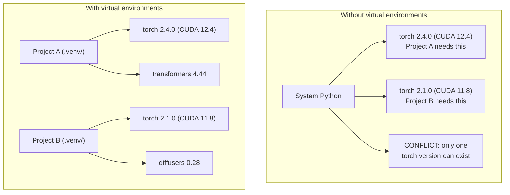

# Python Ambientes . Python

> O inferno da dependência é real, os ambientes virtuais são a cura.
> Dependendo do inferno é a existência real.

**Type:** Build | **类型:** 构建
**Languages:** Shell | **语言:** Shell
**Prerequisites:** Phase 0, Lesson 01 | **前置知识:** Phase 0, 第 01 课
**Time:** ~30 minutes | **时间:** ~30 分钟

## Objetivos de aprendizagem

- Criar ambientes virtuais isolados usando `uv`- Não .`venv`, ou `conda`
  Tradução:`uv`- Não.`venv`Ou `conda`创建隔离的虚拟环境
- Escreva um`pyproject.toml`com grupos de dependência opcionais e gerar arquivos de bloqueio para reprodução
  Tradução do inglês: 编写带可选依赖组的`pyproject.toml`, gerar um ficheiro de bloqueio  assegurar a reprodução
- Diagnóstico e correção de armadilhas comuns: instalações globais, mistura de pip/conda, desajustes na versão CUDA
  中文翻译:诊断并修复常见问题:全局安装、pip/conda 混用、CUDA 版本不匹配
- Implementar uma estratégia de ambiente por fase para projectos com dependências conflitantes
  Tradução do inglês para Chinês:                                                                                                                                                                                                                                                           

> **【中文解读】**
> Python  projeto dependência conflito é um dos problemas mais comuns no desenvolvimento de IA. Este projeto requer PyTorch 2.4, que o projeto requer 2.1  instalação global só pode ter uma versão.

## O problema .

Você instala PyTorch 2.4 para um projeto de ajuste fino. Na próxima semana, um projeto diferente precisa de PyTorch 2.1 porque sua construção CUDA está fixa. Você atualiza globalmente, e o primeiro projeto se rompe. Você rebaixar, e o segundo se rompe.

> Você instalou PyTorch 2.4 para um projeto de micro-mudanças.

Isto é um inferno de dependência.

> É isso que acontece frequentemente no trabalho da AI/ML, porque:

- PyTorch, JAX e TensorFlow enviam cada um seus próprios enlaces CUDA
  中文翻译:PyTorch、JAX 和 TensorFlow Various带 CUDA 绑定
- Libraerias de modelos pin versões específicas do framework
  Tradução do inglês para tradução do inglês
- Um mundo inteiro`pip install`O que foi antes
  Tradução do português:`pip install`会覆盖之前安装的任何版本 会覆盖之前安装的任何版本 会覆盖之前安装的任何版本 会覆盖之前安装的任何版本 会覆盖之前安装的任何版本 会覆盖之前安装的任何版本 会覆盖之前安装的任何版本 会覆盖之前安装的任何版本 会覆盖之前安装的任何版本 会覆盖之前安装的任何版本 会覆盖之前安装的任何版本 会覆盖之前安装的任何版本 会覆盖之前安装的任何版本 会覆盖之前安装的任何版本 会覆盖之前安装的任何版本 会覆盖之前安装的任何版本 会覆盖之前安装的任何版本 会覆盖之前安装的任何版本 会覆盖之前安装的任何版本 会覆盖之前安装的任何版本 会覆盖之前安装的任何版本 会覆盖之前安装的任何版本 会覆盖之前安装的任何版本
- As construtores CUDA 11.8 não funcionam com drivers CUDA 12.x (e vice-versa)
  Tradução do inglês:CUDA 11.8 构建在CUDA 12.x 驱动上不工作(反之亦然)

A solução: cada projeto tem o seu próprio ambiente isolado com os seus próprios pacotes.

> Solução: cada projecto tem seu próprio ambiente de isolamento, possui um conjunto de dependências independentes.

> **【中文解读】**
> "Dependência de terra" é uma característica comum no projeto de IA, pois PyTorch/JAX/TensorFlow é um projeto separado de um ambiente virtual.

## O conceito central.

> **【中文解读】**O gráfico abaixo mostra a diferença entre um ambiente virtual e um ambiente virtual: sem um ambiente virtual, o sistema Python só pode instalar uma versão do PyTorch, projetos entre si em conflito; há um ambiente virtual, cada projeto tem dependência independente, não interfere em outro.



## Construí-lo e realizei-o.

> **【拓展：uv vs pip vs conda — 该选哪个？】**(1) **uv**(推):Rust 写的,比 pip 快 10-100 倍, automaticamente gerir ambiente virtual,一行命令搞定 `uv venv && uv pip install`△(2) **venv**Python está instalado, não precisa de instalação, mas a velocidade é lenta e funciona pouco.**conda**O programa de desenvolvimento de tecnologia artificial (AI) é uma das principais estratégias de desenvolvimento de tecnologia artificial (AI) para o ano de 2026.
```figure
s0-env-isolation
```

## Construí-lo

### Opção 1: uv venv (recomendado)

`uv`É o gerenciador de pacotes Python mais rápido (10-100 vezes mais rápido do que pip).

> `uv`É o mais rápido Python 包管理器 ((比 pip 快 10-100 倍) ⋅ é um instrumento para processar o ambiente virtual ⋅ Python 版本和依解析⋅

```bash
curl -LsSf https://astral.sh/uv/install.sh | sh

uv python install 3.12

cd your-project
uv venv
source .venv/bin/activate
```

Instalação de pacotes:

> - Não.

```bash
uv pip install torch numpy
```

Criar um projeto com `pyproject.toml`em um passo:

> Uma fase de criação`pyproject.toml`Projecto:

```bash
uv init my-ai-project
cd my-ai-project
uv add torch numpy matplotlib
```

### Opção 2: venv (construído) 选项2:venv(Python 内置)

> **【中文解读】**venv é um Python auto-comportado ferramenta de ambiente virtual, não precisa de instalação adicional. Mas em comparação com uv, não gerencia automaticamente a versão Python, nem gerará um arquivo de bloqueio.

Se não conseguir instalar `uv`, naves Python com `venv`- Não .

> Se não conseguires instalar .`uv`,Python Automaton`venv`- Não .

```bash
python3 -m venv .venv
source .venv/bin/activate  # Linux/macOS
.venv\Scripts\activate     # Windows

pip install torch numpy
```

Mais lento que `uv`, mas funciona em todos os lugares onde Python está instalado.

> - Não .`uv`Lento, mas em qualquer lugar instalado em Python, tudo pode ser usado.

### Opção 3: conda (quando precisar)

Conda gerencia dependências não Python como kits de ferramentas CUDA, cuDNN e bibliotecas C. Use-o quando:

> Conda 管理非 Python depende, como CUDA 工具包、cuDNN 和 C 库──在以下情况使用:

- Você precisa de uma versão específica do kit de ferramentas CUDA sem instalar em todo o sistema
  Tradução do inglês para tradução do inglês:
- Você está em um cluster compartilhado onde não pode instalar pacotes do sistema
  Tradução do inglês:
- As instruções de instalação de uma biblioteca dizem "utilizar conda"
  Tradução do inglês para "User conda"

```bash
# Install miniconda (not the full Anaconda)
curl -LsSf https://repo.anaconda.com/miniconda/Miniconda3-latest-Linux-x86_64.sh -o miniconda.sh
bash miniconda.sh -b

conda create -n myproject python=3.12
conda activate myproject

conda install pytorch torchvision torchaudio pytorch-cuda=12.4 -c pytorch -c nvidia
```

Uma regra: se utilizar conda para um ambiente, use conda para todos os pacotes nesse ambiente.`pip install`O condomínio de condomínio causa conflitos de dependência que são dolorosos de depurar.

> Uma regra: se usar conda  gestão ambiente, use conda  gestão do ambiente`pip install`O resultado será difícil de controlar a dependência de conflitos.

### Para este curso: Estratégia por fase

Pode-se criar um ambiente para todo o curso. Não. Diferentes fases precisam de dependências diferentes (às vezes conflitantes).

> Você pode criar um ambiente para todo o curso. Não faça isso. Diferentes fases precisam de diferentes (por vezes conflito).

Estratégia:

> 策略:

```
ai-engineering-from-scratch/
├── .venv/                    <-- shared lightweight env for phases 0-3
├── phases/
│   ├── 04-neural-networks/
│   │   └── .venv/            <-- PyTorch env
│   ├── 05-cnns/
│   │   └── .venv/            <-- same PyTorch env (symlink or shared)
│   ├── 08-transformers/
│   │   └── .venv/            <-- might need different transformer versions
│   └── 11-llm-apis/
│       └── .venv/            <-- API SDKs, no torch needed
```

O roteiro em `code/env_setup.sh`cria o ambiente de base para este curso.

> `code/env_setup.sh`O Centro de Escritos irá criar a base do ambiente do curso.

## Pyproject.toml Basics. pyproject.toml base

> **【拓展：pyproject.toml 是现代 Python 项目的标准配置】**Substituiu a tradição.`setup.py`和 `requirements.txt` Uma documentação define o projeto: dados, dependências, ferramentas de desenvolvimento, configuração, utilização de grupos de dependência opcionais para a aprendizagem de dependências`[train]`) e a sua dependência`[serve]`), evitar a instalação de GPUs inessíveis no ambiente de produção.

Todo projeto Python deve ter um`pyproject.toml`Substitui-o .`setup.py`- Não .`setup.cfg`, e `requirements.txt`num único ficheiro.

> Cada Python Project deve ter`pyproject.toml`- Ele foi substituído por um documento.`setup.py`- Não.`setup.cfg`和 `requirements.txt`- Não.

```toml
[project]
name = "ai-engineering-from-scratch"
version = "0.1.0"
requires-python = ">=3.11"
dependencies = [
    "numpy>=1.26",
    "matplotlib>=3.8",
    "jupyter>=1.0",
    "scikit-learn>=1.4",
]

[project.optional-dependencies]
torch = ["torch>=2.3", "torchvision>=0.18"]
llm = ["anthropic>=0.39", "openai>=1.50"]
```

Então instale:

> Então, instale:

```bash
uv pip install -e ".[torch]"    # base + PyTorch
uv pip install -e ".[llm]"     # base + LLM SDKs
uv pip install -e ".[torch,llm]" # everything
```

## Ficha de bloqueio

Um arquivo de bloqueio fixa todas as dependências (incluindo as transitivas) em versões exatas. Isto garante reproducibilidade: qualquer pessoa que instala do arquivo de bloqueio recebe exatamente os mesmos pacotes.

> O arquivo de bloqueio será bloqueado até a versão precisa. Isso garante a repetibilidade: qualquer pessoa do arquivo de bloqueio pode obter o mesmo pacote.

```bash
# uv generates uv.lock automatically when using uv add
uv add numpy

# pip-tools approach
uv pip compile pyproject.toml -o requirements.lock
uv pip install -r requirements.lock
```

Quando alguém clona o repo, instalam do ficheiro e obtêm versões idênticas.

> Quando alguém instalou o arquivo de bloqueio, eles instalaram e obtiveram a mesma versão.

## Erros comuns .

> **【中文解读】**Python 环境管理中最常见的 5 个错误:(1) 整局安装(用 `pip install`Não está em ambiente virtual; 2) mistura pip e conda; 3) esquece de ativar ambiente virtual; 4) coloque`.venv`O texto foi enviado para o git; (5) CUDA 版本不匹配──以下逐个讲解和修复方法──

### 1. Instalação global

```bash
pip install torch  # BAD: installs to system Python

source .venv/bin/activate
pip install torch  # GOOD: installs to virtual environment
```

Verifique onde vão as suas embalagens:

> 检查你的包装在哪里:

```bash
which python       # should show .venv/bin/python, not /usr/bin/python
which pip           # should show .venv/bin/pip
```

### 2. Mistura de pip e conda

```bash
conda create -n myenv python=3.12
conda activate myenv
conda install pytorch -c pytorch
pip install some-other-package   # BAD: can break conda's dependency tracking
conda install some-other-package # GOOD: let conda manage everything
```

Se for necessário utilizar pip dentro do conda (alguns pacotes são apenas de pip), instale primeiro todos os pacotes de conda, e depois os pacotes de pip duram.

> Se é necessário usar um pip na conda, primeiro instale todos os conda e depois reinstala todo o pip.

### 3. Esquecer de ativar

```bash
python train.py           # uses system Python, missing packages
source .venv/bin/activate
python train.py           # uses project Python, packages found
```

O prompt de shell deve mostrar o nome do ambiente:

> Seu shell 提示符应该显示环境名称:

```
(.venv) $ python train.py
```

### 4. Compromissando .venv a git

```bash
echo ".venv/" >> .gitignore
```

Os ambientes virtuais são de 200MB a 2GB.`pyproject.toml`E o ficheiro de fechamento em vez disso.

> O ambiente virtual tem 200MB-2GB. São locais, não podem ser transferidos entre máquinas.`pyproject.toml`E o arquivo de fechamento.

### 5. A versão de CUDA não corresponde.

> **【拓展：CUDA 版本地狱】**PyTorch Cada versão está ligada a uma determinada CUDA  versão(como PyTorch 2.4 → CUDA 12.4) ~~`nvidia-smi`确认驱动版本,再去 [pytorch.org](https://pytorch.org)- Não, não.`uv pip install torch --index-url URL`指定 CUDA 版本──

```bash
nvidia-smi                # shows driver CUDA version (e.g., 12.4)
python -c "import torch; print(torch.version.cuda)"  # shows PyTorch CUDA version

# These must be compatible.
# PyTorch CUDA version must be <= driver CUDA version.
```

## Usa-o usando um guia.

> **【中文解读】**Esta é a estratégia de recomendação do curso: cada fase  criar um ambiente virtual`.venv-phase04`), para evitar conflitos de dependência em diferentes fases.

Execute o script de configuração para criar o ambiente do curso:

> 运行安装脚本 criar um ambiente de aula:

```bash
bash phases/00-setup-and-tooling/06-python-environments/code/env_setup.sh
```

Isto cria um`.venv`na raiz repo com dependências de núcleo instaladas e verificadas.

> Isto vai criar um em um catálogo de armazenamento.`.venv`,并安装和验证核心依赖──

## Exercícios.

1. Corra .`env_setup.sh`e verificar todos os cheques passar
   运行环境安装脚本, confirmar todas as inspeções
2. Crie um segundo ambiente virtual, instale uma versão diferente de numpy nele e confirme que os dois ambientes são isolados
   Criar um segundo ambiente virtual, instalar diferentes versões de NumPy, confirmar dois ambientes isolados
3. Escreva um`pyproject.toml`para um projeto que necessita tanto do PyTorch quanto do SDK Anthropic
   Para um mesmo tempo, precisamos de PyTorch e Antropic SDK para projetos de redação.`pyproject.toml`
4. Instale um pacote globalmente de forma deliberada (sem ativar um venv), note onde ele vai, e depois desinstala-lo
   Por isso, instale um pacote em toda a área, observe o que está instalado e depois descarregue.

## Termos-chave .

| Term | What people say | What it actually means |
|------|----------------|----------------------|
| Virtual environment | "A venv" | An isolated directory containing a Python interpreter and packages, separate from the system Python |
| Lockfile | "Pinned dependencies" | A file listing every package and its exact version, guaranteeing identical installs across machines |
| pyproject.toml | "The new setup.py" | The standard Python project configuration file, replacing setup.py/setup.cfg/requirements.txt |
| Transitive dependency | "A dependency of a dependency" | Package B depends on C; if you install A which depends on B, C is a transitive dependency of A |
| CUDA mismatch | "My GPU isn't working" | PyTorch was compiled for a different CUDA version than what your GPU driver supports |

| 术语 | 俗称 | 实际含义 |
|------|------|---------|
| Virtual environment | "venv" | 包含独立 Python 解释器和包的隔离目录 |
| Lockfile | "锁定依赖" | 记录每个包精确版本的文件，确保跨机器安装一致 |
| pyproject.toml | "新版 setup.py" | Python 项目标准配置文件，替代 setup.py 和 requirements.txt |
| Transitive dependency | "依赖的依赖" | A 依赖 B，B 依赖 C，C 就是 A 的传递依赖 |
| CUDA mismatch | "GPU 不工作" | PyTorch 编译时的 CUDA 版本与 GPU 驱动不匹配 |
