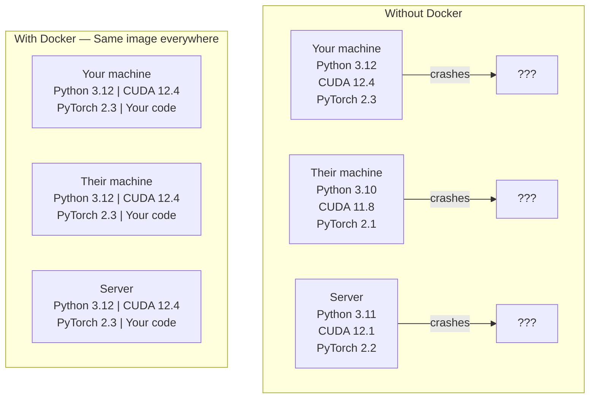

# Docker para AI  Docker para Container AI  Aplicações

> Os contêineres fazem do "trabalho na minha máquina" uma coisa do passado.
> O "contenedor" faz com que "meu aparelho possa correr" se torne um dos temas da história.

**Type:** Build | **类型:** 构建
**Languages:** Docker | **语言:** Docker
**Prerequisites:** Phase 0, Lessons 01 and 03 | **前置知识:** Phase 0, 第 01 课和第 03 课
**Time:** ~60 minutes | **时间:** ~60 分钟

## Objetivos de aprendizagem

- Construa uma imagem docker habilitada para GPU com bibliotecas CUDA, PyTorch e AI a partir de um arquivo docker
  Docker 镜像, contendo CUDA、PyTorch 和 AI 库
- Montar diretórios host como volumes para persistir modelos, conjuntos de dados e código em todas as reconstruções de contêineres
  Tradução em chinês: hang load host registros for卷, em container reconstrução após manter modelo、 dados e código persistência
- Configurar o Kit de Ferramentas NVIDIA Container para expor GPUs dentro de recipientes
  Tradução do inglês para tradução do inglês: Configure NVIDIA Container Toolkit, в контейнере expos GPU
- Orquestra aplicações de IA multi-serviço (servidor de inferência + banco de dados vetorial) usando Docker Compose
  中文翻译:使用 Docker Compose 编排多服务 AI 应用(推理服务器 + 向量数据库)

> **【中文解读】**
> Docker coloca o código, o tempo de execução, a biblioteca e os instrumentos do sistema em um "conteedor", garantindo que os resultados de execução em qualquer máquina sejam concordantes.

## O problema .

Você treinou um modelo no seu laptop com PyTorch 2.3, CUDA 12.4 e Python 3.12. Seu colega tem PyTorch 2.1, CUDA 11.8 e Python 3.10.

> Você está usando PyTorch 2.3 ̊CUDA 12.4 ̊Python 3.12 ̊ em seu computador de computador. Você está usando um modelo.

Os projetos de IA são pesadelos de dependência. Uma pilha típica inclui Python, PyTorch, drivers CUDA, cuDNN, bibliotecas C de nível de sistema e pacotes especializados como flash-attn que precisam de versões exatas de compilador. Docker enche tudo isso em uma única imagem que é executada de forma idêntica em todos os lugares.

> Os projetos de IA são dependentes de um gerenciamento de sonhos. Tecnologias típicas incluem Python, Python, Python, Python, Python, Python, Python, Python, Python, Python, Python, Python, Python, Python, Python, Python, Python, Python, Python, Python, Python, Python, Python, Python, Python, Python, Python, Python, Python, Python, Python, Python, Python, Python, Python, Python, Python, Python, Python, Python, Python, Python, Python, Python, Python, Python, Python, Python, Python, Python, Python, Python, Python, Python, Python, Python, Python, Python, Python, Python, Python, Python, Python, Python, Python, Python, Python, Python, Python, Python, Python, Python, Python, Python, Python, Python, Python, Python, Python, Python, Python, Python, Python, Python, Python, Python, Python, Python, Python, Python, Python, Python, Python, Python, Python, Python, Python, Python, Python, Python, Python, Python, Python, Python, Python, Python, Python, Python, Python, Python, etc.

> **【中文解读】**
> AI projeto é um dos tipos de projeto mais necessários do Docker. CUDA  версия не兼容、PyTorch  версия конфликт、cuDNN 缺失

## O conceito central.

> **【拓展：Docker 在 AI 中的三大用途】**(1) **环境一致性**O modelo de um bom treinamento em seu próprio computador, quando implantado no servidor não é informado por causa de versões diferentes da biblioteca;**GPU 隔离**:多人共享一台 GPU 服务器, cada pessoa um recipiente inter inter interfere;(3) **一键部署**- Não .`docker run`Uma linha de comando para iniciar um serviço completo de IA (model + API + 前端), sem necessidade de configuração manual.

O Docker enrola o seu código, tempo de execução, bibliotecas e ferramentas do sistema em uma unidade isolada chamada contêiner. Pense nisso como uma máquina virtual leve, exceto que compartilha o kernel do sistema operacional hospedeiro em vez de executar o seu próprio, por isso começa em segundos em vez de minutos.

> Docker irá enrolar seu código, tempo de execução, biblioteca e ferramentas do sistema em uma unidade isolada chamada "container". Pode ser imaginado como uma máquina virtual de classe leve, mas que compartilha o núcleo interno do sistema operacional do hospedeiro em vez de executar seu próprio núcleo interno, então o início leva apenas alguns segundos em vez de alguns minutos.



### Porque é que os projetos de IA precisam do Docker mais do que a maioria ?

> **【中文解读】**AI  projetos dependentes especial profunda:Python → PyTorch → CUDA → cuDNN → sistema nível C 库。 Qualquer uma versão incompatível vai levar ao treinamento colapso ou conclusões resultados não coincidentes。Docker Colocar todos os níveis de um espelho, garantir que "meu aparelho pode correr" se torne "em qualquer lugar pode correr"。

1. **GPU drivers are fragile.**O código CUDA 12.4 não é executado no CUDA 11.8. Docker isola o kit de ferramentas CUDA dentro do recipiente enquanto compartilha o driver de GPU hospedeiro através do kit de ferramentas NVIDIA Container.

> 1. **GPU 驱动很脆弱。**O código do CUDA 12.4 não pode ser executado no CUDA 11.8  Docker  através do NVIDIA Container Toolkit  CUDA  Toolkit                                                                                                                                                                                                                                                                                                                                                                                                                                                                                       

2. **Model weights are large.**Um modelo de parâmetro 7B é de 14 GB em fp16. Você não quer baixá-lo novamente toda vez que reconstruir.

> 2. **模型权重很大。**7B 参数的模型在fp16 下有14GB──你不想每次重建容器都重新下载──Docker卷让你从主机挂载模型目录──

3. **Multi-service architectures are common.**Uma aplicação de IA real não é apenas um script Python. É um servidor de inferência, um banco de dados vetorial para RAG, talvez uma frontend web. Docker Compose orquestra tudo isso com um comando.

> 3. **多服务架构很常见。**A verdadeira aplicação de IA não é apenas um Python script. Ele contém um servidor de análise, RAG e uma base de dados, possivelmente Web.

### Vocabulário chave

| Term | What it means |
|------|---------------|
| Image | A read-only template. Your recipe. Built from a Dockerfile. |
| Container | A running instance of an image. Your kitchen. |
| Dockerfile | Instructions to build an image. Layer by layer. |
| Volume | Persistent storage that survives container restarts. |
| docker-compose | A tool for defining multi-container applications in YAML. |

| 术语 | 含义 |
|------|------|
| Image（镜像） | 只读模板，相当于菜谱。由 Dockerfile 构建。 |
| Container（容器） | 镜像的运行实例，相当于厨房。 |
| Dockerfile | 构建镜像的指令文件，逐层定义。 |
| Volume（卷） | 持久化存储，容器重启后数据不丢失。 |
| docker-compose | 用 YAML 定义多容器应用的编排工具。 |

### Padrões comuns de recipientes em IA.

> **【拓展：AI 部署的标准模式】**O modelo de armazenamento de IA é:**训练容器**挂载数据集目录, training完完输出模型权重;(2) **推理容器**加载模型权重, fornecer REST API;(3) **Jupyter 容器** pré-construção de todos os arquivos 环境──Hugging Face、NVIDIA NGC  forneceu uma grande quantidade de pré-construção de imagens baseadas em IA──

```
Dev Container
  Full toolkit. Editor support. Jupyter. Debugging tools.
  Used during development and experimentation.

Training Container
  Minimal. Just the training script and dependencies.
  Runs on GPU clusters. No editor, no Jupyter.

Inference Container
  Optimized for serving. Small image. Fast cold start.
  Runs behind a load balancer in production.
```

## Construí-lo e realizei-o.
```figure
s0-image-layers
```

## Construí-lo

### Passo 1: Instale o Docker

```bash
# macOS
brew install --cask docker
open /Applications/Docker.app

# Ubuntu
curl -fsSL https://get.docker.com | sh
sudo usermod -aG docker $USER
# Log out and back in for group change to take effect
```

Verificar:

> 验证安装:

```bash
docker --version
docker run hello-world
```

### Passo 2: Instale o Kit de Ferramentas de Container NVIDIA (Linux com GPU NVIDIA)

Os usuários do macOS e do Windows (WSL2) podem ignorar isso; o Docker Desktop lida com a GPU de forma diferente nessas plataformas.

> Isso permite que o Container do Docker possa acessar sua GPU;. macOS e Windows (WSL2) os usuários podem saltar por este passo; o Docker Desktop em estas plataformas pode processar a GPU diretamente de uma maneira diferente.

```bash
distribution=$(. /etc/os-release;echo $ID$VERSION_ID)
curl -fsSL https://nvidia.github.io/libnvidia-container/gpgkey | sudo gpg --dearmor -o /usr/share/keyrings/nvidia-container-toolkit-keyring.gpg
curl -s -L https://nvidia.github.io/libnvidia-container/$distribution/libnvidia-container.list | \
    sed 's#deb https://#deb [signed-by=/usr/share/keyrings/nvidia-container-toolkit-keyring.gpg] https://#g' | \
    sudo tee /etc/apt/sources.list.d/nvidia-container-toolkit.list

sudo apt-get update
sudo apt-get install -y nvidia-container-toolkit
sudo nvidia-ctk runtime configure --runtime=docker
sudo systemctl restart docker
```

Teste de acesso de GPU dentro de um recipiente:

> 测试容器内 GPU 访问:

```bash
docker run --rm --gpus all nvidia/cuda:12.4.1-base-ubuntu22.04 nvidia-smi
```

Se vires as informações da GPU, o kit de ferramentas está a funcionar.

> Se puder ver a informação da GPU, explica que o trabalho do kit de ferramentas é normal.

### Passo 3: Entender imagens básicas.

> **【中文解读】**基础镜像是Dockerfile的起点──AI 项目推使用NVIDIA 官方的CUDA 镜像(`nvidia/cuda:12.4.0-devel-ubuntu22.04`) ou PyTorch 官方镜像(`pytorch/pytorch:2.4.0-cuda12.4`), eles pre-configuraram CUDA 运行时和深度学习库──选错基础镜像会导致 GPUs indispensáveis──

Escolher a imagem base certa economiza horas de depuração.

> 选择正确的基础镜像能节省几个小时的调试时间──

```
nvidia/cuda:12.4.1-devel-ubuntu22.04
  Full CUDA toolkit. Compilers included.
  Use for: building packages that need nvcc (flash-attn, bitsandbytes)
  Size: ~4 GB

nvidia/cuda:12.4.1-runtime-ubuntu22.04
  CUDA runtime only. No compilers.
  Use for: running pre-built code
  Size: ~1.5 GB

pytorch/pytorch:2.6.0-cuda12.4-cudnn9-runtime
  PyTorch pre-installed on top of CUDA.
  Use for: skipping the PyTorch install step
  Size: ~6 GB

python:3.12-slim
  No CUDA. CPU only.
  Use for: inference on CPU, lightweight tools
  Size: ~150 MB
```

### Passo 4: Escrever um arquivo docker para desenvolvimento de IA

Aqui está o arquivo do Docker .`code/Dockerfile`- Passe por ela .

> É isso .`code/Dockerfile`O arquivo do Docker.

```dockerfile
FROM nvidia/cuda:12.4.1-devel-ubuntu22.04

ENV DEBIAN_FRONTEND=noninteractive
ENV PYTHONUNBUFFERED=1

RUN apt-get update && apt-get install -y --no-install-recommends \
    software-properties-common \
    git \
    curl \
    build-essential \
    && add-apt-repository -y ppa:deadsnakes/ppa \
    && apt-get update && apt-get install -y --no-install-recommends \
    python3.12 \
    python3.12-venv \
    python3.12-dev \
    && rm -rf /var/lib/apt/lists/*

RUN update-alternatives --install /usr/bin/python python /usr/bin/python3.12 1

RUN curl -sSL https://raw.githubusercontent.com/pypa/get-pip/3b73145063be545b649ad9ca83ea8da5fc915a4f/public/get-pip.py -o /tmp/get-pip.py \
    && echo "a341e1a43e38001c551a1508a73ff23636a11970b61d901d9a1cad2a18f57055  /tmp/get-pip.py" | sha256sum -c - \
    && python /tmp/get-pip.py \
    && rm /tmp/get-pip.py \
    && update-alternatives --install /usr/bin/pip pip /usr/local/bin/pip3.12 1

RUN python -m pip install --no-cache-dir --upgrade pip setuptools wheel

RUN python -m pip install --no-cache-dir \
    torch==2.6.0+cu124 \
    torchvision==0.21.0+cu124 \
    torchaudio==2.6.0+cu124 \
    --index-url https://download.pytorch.org/whl/cu124

RUN python -m pip install --no-cache-dir \
    numpy \
    pandas \
    scikit-learn \
    matplotlib \
    jupyter \
    transformers \
    datasets \
    accelerate \
    safetensors

WORKDIR /workspace

VOLUME ["/workspace", "/models"]

EXPOSE 8888

CMD ["python"]
```

Construí-lo:

> 构建镜像:

```bash
docker build -t ai-dev -f phases/00-setup-and-tooling/07-docker-for-ai/code/Dockerfile .
```

Isto leva um tempo na primeira vez (descarregando imagem base CUDA + PyTorch). edificações subsequentes usam camadas em cache.

> 首次构建需要一些时间(下载 CUDA 基础镜像 + PyTorch) ⋅后续构建会使用缓存的层──

- É o que é ?

> 运行容器:

```bash
docker run --rm -it --gpus all \
    -v $(pwd):/workspace \
    -v ~/models:/models \
    ai-dev python -c "import torch; print(f'PyTorch {torch.__version__}, CUDA: {torch.cuda.is_available()}')"
```

Exercer Jupyter dentro do recipiente:

> Em contêiner:

```bash
docker run --rm -it --gpus all \
    -v $(pwd):/workspace \
    -v ~/models:/models \
    -p 8888:8888 \
    ai-dev jupyter notebook --ip=0.0.0.0 --port=8888 --no-browser --allow-root
```

### Passo 5: Montes de volume para dados e modelos

As montagens de volume são críticas para o trabalho da IA. Sem elas, os downloads do modelo de 14 GB desaparecem quando o recipiente parou.

> Não há eles, o modelo de 14 GB que você baixou desaparecerá quando o recipiente parar.

```bash
# Mount your code
-v $(pwd):/workspace

# Mount a shared models directory
-v ~/models:/models

# Mount datasets
-v ~/datasets:/data
```

Dentro do seu roteiro de treinamento, carrega do caminho montado:

> Em seu livro de treinamento, de

```python
from transformers import AutoModel

model = AutoModel.from_pretrained("/models/llama-7b")
```

O modelo vive no seu sistema de arquivos host. Reconstruir o recipiente tantas vezes quanto quiser sem fazer o download novamente.

> 模型存储在宿主文件系统中. Você pode reconstruir o recipiente de qualquer maneira, sem necessidade de re-descarregá-lo.

### Passo 6: Docker Compose para aplicativos de IA multi-serviço

Uma aplicação RAG real precisa de um servidor de inferência e um banco de dados vetorial.

> Real RAG  aplicação precisa de servido e de dados de velocidades.

Veja .`code/docker-compose.yml`- Não .

```yaml
services:
  ai-dev:
    build:
      context: .
      dockerfile: Dockerfile
    deploy:
      resources:
        reservations:
          devices:
            - driver: nvidia
              count: all
              capabilities: [gpu]
    volumes:
      - ../../../:/workspace
      - ~/models:/models
      - ~/datasets:/data
    ports:
      - "8888:8888"
    stdin_open: true
    tty: true
    command: jupyter notebook --ip=0.0.0.0 --port=8888 --no-browser --allow-root

  qdrant:
    image: qdrant/qdrant:v1.12.5
    ports:
      - "6333:6333"
      - "6334:6334"
    volumes:
      - qdrant_data:/qdrant/storage

volumes:
  qdrant_data:
```

Começa tudo:

> 启动所有服务:

```bash
cd phases/00-setup-and-tooling/07-docker-for-ai/code
docker compose up -d
```

Agora o seu contêiner de desenvolvimento de IA pode chegar à base de dados de vetores em `http://qdrant:6333`O Docker Compose cria uma rede compartilhada automaticamente.

> Agora, a IA desenvolve um recipiente que pode ser usado como serviço.`http://qdrant:6333`访问量数据库──Docker Compose 自动创建共享网络──

Teste a conexão a partir do interior do recipiente de IA:

> Desde AI 容器内部测试连接:

```python
from qdrant_client import QdrantClient

client = QdrantClient(host="qdrant", port=6333)
print(client.get_collections())
```

Pára de tudo .

> 停止所有服务:

```bash
docker compose down
```

Adicionar`-v`para excluir também o volume de qdrant:

> - Não .`-v`Como é que o que aconteceu?

```bash
docker compose down -v
```

### Passo 7: Comandações do Docker úteis para o trabalho de IA

> 第7步:AI 工作中常用Docker 命令

```bash
# List running containers
docker ps

# List all images and their sizes
docker images

# Remove unused images (reclaim disk space)
docker system prune -a

# Check GPU usage inside a running container
docker exec -it <container_id> nvidia-smi

# Copy a file from container to host
docker cp <container_id>:/workspace/results.csv ./results.csv

# View container logs
docker logs -f <container_id>
```

## Usa-o usando um guia.

> **【拓展：Docker vs Conda 选择指南】**简单项目用Conda/uv 即可;需要部署或多人协作时使用Docker。 经验法则: Se você disser "meu máquina pode correr", indique que você deve usar Docker 了── △ A maior parte do curso não precisa de Docker, mas a Fase 17 (Infrastructure and Production Deployment) será amplamente utilizada──

Agora temos um ambiente de desenvolvimento de IA reprodutivel.

> Agora você tem um ambiente de desenvolvimento de IA reprodutivo.

- Utilização`docker compose up`para iniciar seu ambiente de desenvolvimento e banco de dados vetorial juntos
  Tradução:`docker compose up`Simultaneamente, inicia-se o desenvolvimento de uma base de dados ambiental e de veículos
- Coloque seu código, modelos e dados em volumes para que nada se perca entre as reconstruções
  Tradução do inglês para tradução do inglês:将代码、模型和数据挂载为卷,重建后不会丢失
- Quando uma lição requer um novo pacote Python, adicione-o ao arquivo Docker e reconstruir
  Quando o curso precisa de um novo Python 包时, adicionar ao Dockerfile e reconstruir
- Compartilhe o seu ficheiro com os colegas, eles têm o mesmo ambiente.
  Compartilhar o Dockerfile com os seus amigos, eles obtêm o mesmo ambiente.

### Não há GPU?

Remova o `--gpus all`O contêiner ainda funciona para a aprendizagem baseada na CPU. PyTorch detecta a ausência de CUDA e retorna automaticamente para a CPU.

> 移除 `--gpus all`标志和 NVIDIA deploy 配置块──容器 ainda pode ser usado em cursos baseados em CPU──PyTorch 会自动检测 CUDA 不存在并回归到CPU──

## Exercícios.

1. Construir o arquivo do Docker e executar `python -c "import torch; print(torch.__version__)"`dentro do recipiente
   Construir Docker 镜像, em contêiner 运行 PyTorch 验证
2. Inicie a pilha de composição docker e verifique se o Qdrant é acessível a partir do recipiente de IA em `http://qdrant:6333/collections`
   Início docker-composer ,验证 Qdrant 向量数据库可访问
3. Adicionar`flask`Para o arquivo do Docker, reconstruir e executar um servidor API simples no porto 5000.`-p 5000:5000`
   Em Dockerfile, adicione frasco, reconstruir imagem, executar API  servidor
4. Messa o tamanho da imagem com `docker images`Tente mudar a imagem de base de`devel`- Não .`runtime`e comparar os tamanhos
   Measurement mirror size, em relação ao devel e runtime  Base mirror size difference

## Termos-chave .

| Term | What people say | What it actually means |
|------|----------------|----------------------|
| Container | "Lightweight VM" | An isolated process using the host kernel, with its own filesystem and network |
| Image layer | "Cached step" | Each Dockerfile instruction creates a layer. Unchanged layers are cached, so rebuilds are fast. |
| NVIDIA Container Toolkit | "GPU in Docker" | A runtime hook that exposes host GPUs to containers via `--gpus` flag |
| Volume mount | "Shared folder" | A directory on the host mapped into the container. Changes persist after the container stops. |
| Base image | "Starting point" | The `FROM` image your Dockerfile builds on top of. Determines what is pre-installed. |

| 术语 | 俗称 | 实际含义 |
|------|------|---------|
| Container | "轻量虚拟机" | 使用宿主内核的隔离进程，拥有独立文件系统和网络 |
| Image layer | "缓存层" | 每条 Dockerfile 指令创建一层，未修改的层会被缓存 |
| NVIDIA Container Toolkit | "Docker 中的 GPU" | 通过 `--gpus` 标志将宿主 GPU 暴露给容器的运行时钩子 |
| Volume mount | "共享文件夹" | 宿主目录映射到容器内，容器停止后数据保留 |
| Base image | "起点" | Dockerfile 的 FROM 镜像，决定了预装内容 |
