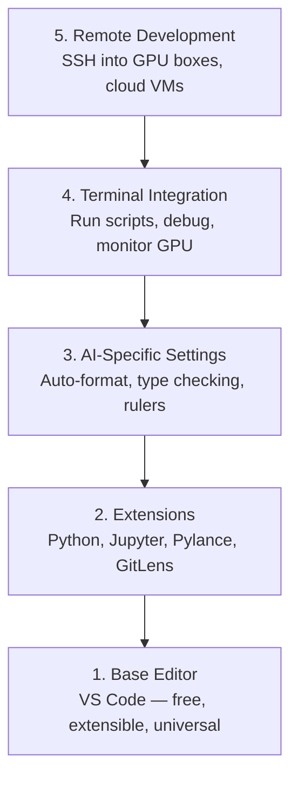

# Configuração do editor

> O editor é o seu co-piloto, configure-o uma vez para não te atrapalhar e começar a puxar o peso.
> O editor é o teu vice-condutor. Configure uma vez, deixe que não se preocupe, mas realmente desempenhe o papel.

**Type:** Build | **类型:** 构建
**Languages:** -- | **语言:** 无
**Prerequisites:** Phase 0, Lesson 01 | **前置知识:** Phase 0, 第 01 课
**Time:** ~20 minutes | **时间:** ~20 分钟

## Objetivos de aprendizagem

- Instalar VS Code com extensões essenciais para Python, Jupyter, linting e SSH remoto
  Chinese: 拼音:安装 VS Code 及 Python、Jupyter、代码检查和远程 SSH等必备扩展
- Configurar o formato-on-save, a verificação de tipo e o rolamento de saída do notebook para fluxos de trabalho de IA
  Tradução do inglês para inglês: configurar guardar                                                                                                                                                                                                                                                                                                                                                                                                                                                                                                                 
- Configure Remote SSH para editar e depurar o código em máquinas remotas de GPU como se fossem locais
  Tradução do inglês para inglês: Setup Remote SSH, como edit editores
- Avaliação das alternativas de editor (Cursor, Windsurf, Neovim) e suas compensações para o trabalho de IA
  中文翻译:评估编辑器替代方案 ((Cursor、Windsurf、Neovim) e suas vantagens no trabalho em AI 工作中优劣

> **【中文解读】**
> 编辑器是你写代码的主力工具──本章帮你配置 VS Code 用于 AI 开发:Python 支持、Jupyter 集成、远程SSH 连接GPU 服务器──配置一次,受益整个课程──

## O problema .

Você passará milhares de horas dentro do editor a escrever Python, executar notebooks, depurar os loops de treinamento e inserir SSH nas caixas da GPU. Um editor mal configurado transforma cada sessão em atrito: sem autocompleto, sem sugestões de tipo, sem erros de linha, formatagem manual e um fluxo de trabalho terminal desajeitado.

> Você vai gastar milhares de horas no editor para escrever Python, executar Notebook, fazer o ciclo de treinamento, conectar o servidor de GPU, etc. Uma configuração inadequada fará com que cada edição se torne um sofrimento: sem complemento automático, sem tipo de sugestão, sem erros de sugestão, com formato manual, sem um fluxo de trabalho final bem-sucedido.

A configuração correta leva 20 minutos, mas saltar custa 20 minutos por dia.

> A configuração precisa de 20 minutos. Salto a configuração vai fazer-te perder mais 20 minutos por dia.

> **【中文解读】**
> Configurar um editor só leva 20 minutos, mas não configurar vai fazer você perder mais de 20 minutos por dia.

## O conceito central.

Uma configuração de editor de engenharia de IA precisa de cinco coisas:

> AI 工程编辑器 necessita de cinco níveis de configuração:



> **【中文解读】**
> AI  desenvolvimento editor necessita de cinco níveis de configuração: base editor →  amplitude plugins → AI  especializado configuração →  terminal integrado →  desenvolvimento de distância.
```figure
s0-lsp-roundtrip
```

## Construí-lo

## Construí-lo e realizei-o.

> **【拓展：VS Code 为什么是 AI 开发的首选编辑器】**O código VS ocupa o domínio da IA no desenvolvimento: 1) 免费且轻量; 2) Jupyter Notebook 原生支持; 3) Remote SSH 直接连接 GPU 服务器编辑代码; 4) Python/Jupyter/Python Debugger 扩展生态完善; 5) AI 辅助编程扩展(Copilot、Cline、Continue) Openbox即用──Cursor 和 Windsurf é baseada em uma versão 增强版, também vale a pena tentar.

### Passo 1: Instale o código VS.

VS Code é o editor recomendado. É gratuito, funciona em todos os sistemas operacionais, tem suporte a notebook Jupyter de primeira classe, e o ecossistema de extensão cobre tudo o que você precisa para o trabalho de IA.

> VS Code é um editor de sugestão. É gratuito, através da plataforma, e tem um notebook de Jupyter de qualidade.

Descarregue-o de [code.visualstudio.com](https://code.visualstudio.com/)- Não .

> De[code.visualstudio.com](https://code.visualstudio.com/)Desça.

Verifique a partir do terminal:

> Em final de verificação:

```bash
code --version
```

Se`code`Não está disponível no macOS, abre VS Code, pressione `Cmd+Shift+P`, digite "Comando de shell", e selecione "Instalou o comando 'código' no PATH".

> Se macOS 上找不到 `code`Ordenação, abre VS Código, press `Cmd+Shift+P`,输入 "Shell Command", seleccionar "Install 'code' command em PATH"。

### Passo 2: Instale extensões essenciais.

> **【中文解读】**AI 开发必备的 VS Code 扩展:Python(调试+Lint) Jupyter(在编辑器运行 Notebook) Pylance(智能补全和类型检查) ✓GitLens(查看代码历史) ⋅ Instalação 后在设置中开启"保存时格式化", 从此不用手动整理代码──

Abre o terminal integrado em Código VS (`` Ctrl+``` em todas as plataformas) e instalar as extensões que são importantes para o trabalho da IA:

> 打开 VS Code 的集成终端(`Ctrl+`` `Ou `` Cmd+```), instalação de AI 工作所需的关键扩展:

```bash
code --install-extension ms-python.python
code --install-extension ms-python.vscode-pylance
code --install-extension ms-toolsai.jupyter
code --install-extension eamodio.gitlens
code --install-extension ms-vscode-remote.remote-ssh
code --install-extension ms-python.debugpy
code --install-extension ms-python.black-formatter
code --install-extension charliermarsh.ruff
```

O que cada um faz:

> Cada um dos efeitos de expansão:

| Extension | Why |
|-----------|-----|
| Python | Language support, virtual env detection, run/debug |
| Pylance | Fast type checking, autocomplete, import resolution |
| Jupyter | Run notebooks inside VS Code, variable explorer |
| GitLens | See who changed what, inline git blame |
| Remote SSH | Open a folder on a remote GPU box as if it were local |
| Debugpy | Step-through debugging for Python |
| Black Formatter | Auto-format on save, consistent style |
| Ruff | Fast linting, catches common mistakes |

O arquivo .`code/.vscode/extensions.json`Quando você abrir a pasta do projeto, o VS Code irá pedir-lhe para instalar.

> 本课中 `code/.vscode/extensions.json`Quando você abrir o arquivo do projeto, o código VS irá lhe pedir a instalação.

### Passo 3: Configurar as configurações

Copie as configurações de `code/.vscode/settings.json`Neste curso, ou aplicá-los manualmente através de`Settings > Open Settings (JSON)`- Não .

> Do que é que é que é?`code/.vscode/settings.json`复制设置, ou através `Settings > Open Settings (JSON)`Aplicação manual.

As configurações-chave para o trabalho da IA:

> Configuração de AI 工作的关键设置:

```jsonc
{
    "python.analysis.typeCheckingMode": "basic",
    "editor.formatOnSave": true,
    "editor.rulers": [88, 120],
    "notebook.output.scrolling": true,
    "files.autoSave": "afterDelay"
}
```

Por que é importante:

> Por que estas configurações são importantes:

- **Type checking on basic**Capta tipos de argumento errados antes de executar. Economiza tempo de depuração em tensor de forma desajustes e parâmetros de API errados.
  Tradução:**基础类型检查**O tempo de ensaio de um parâmetro de API errado é de aproximadamente 2 horas.
- **Format on save**Nunca mais pense na formatação.
  Tradução:**保存时格式化**Não é preciso pensar em formalização.
- **Rulers at 88 and 120**O marcador 120 mostra quando as linhas de documentos e comentários estão ficando muito longas.
  Tradução:**88 和 120 标尺**O que é que é o "Negro" ?
- **Notebook output scrolling**Os circuitos de treinamento imprimem milhares de linhas.
  Tradução:**Notebook 输出滚动**Não se rola, sai o painel.
- **Auto-save**O seu script de treinamento irá executar código obsoleto.
  Tradução:**自动保存**Você vai esquecer de guardar.

### Passo 4: Integração do terminal

O terminal integrado do VS Code é onde você executa scripts de treinamento, monitora GPUs e gerencia ambientes.

> O terminal integrado do VS Code é o local onde você opera o treinamento de guião, monitoramento de GPU e gestão de ambiente.

Configure-o corretamente:

> Estação de configuração:

```jsonc
{
    "terminal.integrated.defaultProfile.osx": "zsh",
    "terminal.integrated.defaultProfile.linux": "bash",
    "terminal.integrated.fontSize": 13,
    "terminal.integrated.scrollback": 10000
}
```

Cortar de olhos úteis:

> 常用快捷键:

| Action | macOS | Linux/Windows |
|--------|-------|---------------|
| Toggle terminal | `` Ctrl+` `` | `` Ctrl+` `` |
| New terminal | `` Ctrl+Shift+` `` | `` Ctrl+Shift+` `` |
| Split terminal | `Cmd+\` | `Ctrl+Shift+5` |

Os terminais divididos são úteis: um para executar o seu script, outro para monitorar a GPU com `nvidia-smi -l 1`ou `watch -n 1 nvidia-smi`- Não .

> O terminal é muito útil: um script de execução, um us `nvidia-smi -l 1`Ou `watch -n 1 nvidia-smi`- Supervisão de GPU.

### Passo 5: Desenvolvimento remoto (SSH em GPU Boxes)

> **【拓展：Remote SSH 是 AI 开发的杀手级功能】**A maioria das pessoas não tem GPU local, precisa de SSH para GPU remoto  servidor treinamento modelo。 O código de VS Remote SSH  expansão permite que você como editor local arquivos editar código remoto auto-reemplenho, reformulação、 terminal todo disponível。 Isso significa que você pode desenvolver em um pequeno livro, em um longo A100 上练──

Esta é a extensão mais importante para o trabalho de IA. Você executará treinamento em máquinas remotas (VMs em nuvem, servidores de laboratório, Lambda, Vast.ai).

> É a maior expansão do trabalho da IA. Você vai trabalhar em máquinas de distância.

Configuração:

> 设置步骤:

1. Instale a extensão SSH remota (feita na etapa 2).
2. Pressão `Ctrl+Shift+P`(ou `Cmd+Shift+P`), o tipo "Remote-SSH: Conectar-se ao host".
3. Entrem .`user@your-gpu-box-ip`- Não .
4. O VS Code instala automaticamente o seu componente de servidor na máquina remota.

> 1. Instalação de SSH remoto 扩展(已在步骤 2 完成)
> 2. 按 `Ctrl+Shift+P`(ou `Cmd+Shift+P`),输入 "Remote-SSH: Conectar-se ao host"―
> 3. 输入 `user@your-gpu-box-ip`- Não.
> 4. VS Código Automático instalar seu servidor componente em máquinas remotas

Para acesso sem senha, configure chaves SSH:

> Para realizar acesso sem senha, configure SSH 密钥:

```bash
ssh-keygen -t ed25519 -C "your-email@example.com"
ssh-copy-id user@your-gpu-box-ip
```

Adicionar o host para `~/.ssh/config`Para conveniência:

> Para facilitar a sua viagem, o principal será o`~/.ssh/config`- Não .

```
Host gpu-box
    HostName 203.0.113.50
    User ubuntu
    IdentityFile ~/.ssh/id_ed25519
    ForwardAgent yes
```

Agora .`Remote-SSH: Connect to Host > gpu-box`liga-se instantaneamente.

> Agora , agora .`Remote-SSH: Connect to Host > gpu-box`É possível ligar-se instantaneamente.

## Alternativas alternativas

> **【拓展：AI 增强编辑器对比】**Cursor (baseado em VS Code, internação AI  programming assistant, $ 20/月) e Windsurf (Codeium 出品,免费层可用) são os principais benefícios de 2024-2026 anos de ascensão de AI nativos editores.

### Cursor

[cursor.com](https://cursor.com)é um fork VS Code com geração de código de IA incorporada. Ele usa o mesmo ecossistema de extensão e formato de configurações. Se você usar Cursor, tudo nesta lição ainda se aplica. Importa o mesmo `settings.json`E ...`extensions.json`- Não .

> [cursor.com](https://cursor.com)É um código de inteligência artificial embutido gerado por VS Code 分支──它使用相同的扩展态态和设置格式──如果你使用Cursor,所有内容仍然适用──导入相同`settings.json`和 `extensions.json`É o que se passa.

### Windsurf

[windsurf.com](https://windsurf.com)A mesma história: as mesmas extensões, o mesmo formato de configurações, o mesmo suporte de Remote SSH.

> [windsurf.com](https://windsurf.com)É outro AI  prioritário VS Código 分支── igual: igual expansão、 igual configuração formato、 igual Remote SSH 支持──

### Vim/Neovim

Se você já usa Vim ou Neovim e é produtivo nele, fique lá. A configuração mínima para o trabalho da AI Python:

> Se você já está usando Vim ou Neovim e a eficiência não está errada, continue usando o Python.

- **pyright**ou **pylsp**para controlo de tipo (via instalação manual ou de maçonaria)
  Tradução:**pyright**Ou **pylsp**Usado para tipo de inspecção (em inglês)
- **nvim-lspconfig**para integração de servidores de linguagem
  Tradução:**nvim-lspconfig**Utilizado em linguagem
- **jupyter-vim**ou **molten-nvim**para execução de tipo notebook
  Tradução:**jupyter-vim**Ou **molten-nvim**Usado para executar como Notebook
- **telescope.nvim**para a pesquisa de arquivos/símbolos
  Tradução:**telescope.nvim**Usado para o arquivo / código de busca
- **none-ls.nvim**com preto e ruff para formatagem/limpação
  Tradução:**none-ls.nvim**配合 preto e ruff Usado para formatar/lint

Se você ainda não usa o Vim, não comece agora. A curva de aprendizagem irá competir com o aprendizado de engenharia de IA. Use o código VS.

> Se ainda não usaste o Vim, agora não comece.

## Usa-o usando um guia.

> **【中文解读】** Configuração:VS Code + Python + Jupyter + Remote SSH。 Se usar GPU de distância  servidor, Remote SSH é necessário。

Com esta configuração, o seu fluxo de trabalho diário parece:

> Com esta configuração, o seu trabalho diário é o seguinte:

1. Abra a pasta do projeto no VS Code (ou conecte através do Remote SSH a uma caixa de GPU).
   中文翻译: 在 VS Code 中打开项目文件(或通过远程SSH 连接到GPU 服务器) 』
2. Escreva Python no editor com autocompleto, sugestões de digitação e erros de linha.
   Tradução do inglês: In editor, edit Python, enjoy automatically filling in, type tips and in-line err err err err err err err err err err tips.
3. Execute os portáteis do Jupyter em linha com a extensão do Jupyter.
   中文翻译:使用Jupyter 扩展内嵌运行 Notebook。
4. Usar o terminal integrado para os scripts de formação,`uv pip install`, e monitoramento de GPU.
   Tradução do inglês: Using集成终端运行训练脚本,`uv pip install`E o GPU controla-o.
5. Revisar as alterações com GitLens antes de se comprometer.
   中文翻译:提交前用 GitLens 检查变更。

## Exercícios.

1. Instalar o código VS e todas as extensões listadas na etapa 2
   Instalação VS Código 和步骤 2 中列出的所有扩展
2. Copie o `settings.json`A partir desta lição, para a configuração do código VS
   O que é isso?`settings.json` Copy to your VS Código  Configuração
3. Abra um arquivo Python e verifique se Pylance mostra dicas de tipo e formatos em preto no save
   打开一个Python文件,验证Pylance 显示类型提示、Black 保存时自动格式化
4. Se você tem acesso a uma máquina remota, configure Remote SSH e abra uma pasta nela
   Se tiver um aparelho remoto, configure Remote SSH e abra arquivos remotos

## Termos-chave .

| Term | What people say | What it actually means |
|------|----------------|----------------------|
| LSP | "Autocomplete engine" | Language Server Protocol: a standard for editors to get type info, completions, and diagnostics from a language-specific server |
| Pylance | "The Python plugin" | Microsoft's Python language server using Pyright for type checking and IntelliSense |
| Remote SSH | "Working on the server" | VS Code extension that runs a lightweight server on a remote machine and streams the UI to your local editor |
| Format on save | "Auto-prettier" | The editor runs a formatter (Black, Ruff) every time you save, so code style is always consistent |

| 术语 | 俗称 | 实际含义 |
|------|------|---------|
| LSP | "自动补全引擎" | 语言服务器协议：编辑器获取类型信息、补全和诊断的标准 |
| Pylance | "Python 插件" | 微软的 Python 语言服务器，提供类型检查和智能提示 |
| Remote SSH | "在服务器上开发" | VS Code 在远程机器上运行轻量服务器，将 UI 传输到本地编辑器 |
| Format on save | "保存时自动格式化" | 每次保存时自动运行格式化工具，保持代码风格一致 |
