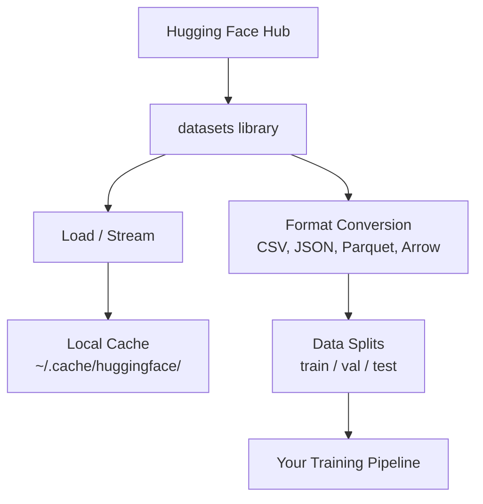

# Gerenciamento de dados Gerenciamento de dados

> Os dados são o combustível, e a forma como os gerenciamos determina a velocidade.
> Os dados são combustível. A forma como o gostas determina se consegues correr mais rápido.

**Type:** Build | **类型:** 构建
**Language:**O Python .**语言:**Python
**Prerequisites:** Phase 0, Lesson 01 | **前置知识:** Phase 0, 第 01 课
**Time:** ~45 minutes | **时间:** ~45 分钟

## Objetivos de aprendizagem

- Carregar, fluir e cache conjuntos de dados usando o abraço Face `datasets`biblioteca
  中文翻译:使用 Abraçando o rosto `datasets`库加载、流式处理和缓存数据集
- Converte entre os formatos CSV, JSON, Parquet e Arrow e explique suas compensações
  Tradução do inglês para tradução do inglês: entre CSV、JSON、Parquet 和 Arrow 格式,并解释各自优点
- Criar divisões de treinamento/validação/teste reprodutíveis com sementes aleatórias fixas
  Tradução do inglês para tradução do inglês: using fixed as机种创建可复现的训练/验证/测试集拆分
- Gerenciar arquivos de modelos e conjuntos de dados grandes usando `.gitignore`, Git LFS ou DVC
  Tradução:`.gitignore`、Git LFS ou DVC   管理大型模型和数据文件

> **【中文解读】**
> O Data é o combustível da IA.`datasets`库加载、缓存、转换和拆分数据集── dominar o gerenciamento de dados é a premissa de iniciar a experiência de aprendizagem de máquina―

## O problema .

Todos os projetos de IA começam com dados. Você precisa encontrar conjuntos de dados, baixá-los, converter entre formatos, dividir-los para treinamento e avaliação, e versá-los para que as experiências sejam reprodutíveis. Fazer isso manualmente a cada vez é lento e propenso a erros. Você precisa de um fluxo de trabalho repetível.

> Cada projeto de IA começa com dados. Você precisa encontrar um conjunto de dados, baixar, transformar formatos, dividir em conjuntos de treinamento e avaliação, e realizar gerenciamento de versões para garantir a repetição do experimento.

> **【中文解读】**
> Cada projeto de IA começa com dados. Você precisa baixar conjuntos de dados, transformar formatos, separar conjuntos de treinamento/verificação/teste, e gerenciar versões para garantir a experiência repetivel.

> **【拓展：Hugging Face 在 AI 生态中的地位】**
> Hugging Face é um "GitHub" no campo da IA, que gerencia centenas de milhares de conjuntos de dados e modelos de treinamento prévio.`datasets`O banco de dados é um instrumento padrão para carregamento e processamento de dados, semelhante a Panda, mas especializado em AI  optimização, apoiando o fluxo de carregamento de grandes conjuntos de dados.

## O conceito central.



O rosto abraçador`datasets`A biblioteca é a forma padrão de carregar dados para trabalho de IA.

> Abraçando o rosto`datasets`O arquivo é o método padrão de carregamento de dados por IA.

> **【中文解读】**
> Abraçando o rosto`datasets`É um padrão de fato de carregamento de dados da AI. Ele processa automaticamente o download, o cache, o formato de conversão e o carregamento de dados. Você não precisa de gerenciar manualmente os arquivos de dados, a biblioteca irá ajudá-lo a completar todos os trabalhos básicos.

> **【拓展：数据格式对训练速度的影响】**
> No trabalho real da IA, o formato de dados afeta diretamente a eficiência do treinamento. O formato de parquete é de 60 a 80%, a velocidade de leitura é de 5-10 vezes maior do que o formato de parquete.

## Construí-lo e realizei-o.
```figure
s0-data-pipeline
```

## Construí-lo

### Passo 1: Instale a biblioteca de conjuntos de dados

```bash
pip install datasets huggingface_hub  # 安装 Hugging Face 数据集库和模型仓库工具
```

### Passo 2: Carregar um conjunto de dados

```python
from datasets import load_dataset

dataset = load_dataset("imdb")  # 加载 IMDB 电影评论数据集（首次下载，之后从缓存读取）
dataset = load_dataset("stanfordnlp/imdb")
print(dataset)
print(dataset["train"][0])  # 查看训练集第一条样本
```

Isto descarrega o conjunto de dados de revisão de filmes do IMDB. Após o primeiro download, ele carrega do cache em `~/.cache/huggingface/datasets/`- Não .

> Esta será a primeira download da IMDB.`~/.cache/huggingface/datasets/`De um arquivo de dados.

### Passo 3: Transmissão de grandes conjuntos de dados

Alguns conjuntos de dados são grandes demais para caber no disco.

> Alguns conjuntos de dados são muito grandes para não ser totalmente baixados para o disco magnético.

```python
dataset = load_dataset("wikimedia/wikipedia", "20220301.en", split="train", streaming=True)  # 流式加载：不下载完整数据集

for i, example in enumerate(dataset):
    print(example["title"])  # 逐条处理，内存占用恒定
    if i >= 4:
        break
```

O streaming dá-te um `IterableDataset`O uso de memória permanece constante independentemente do tamanho do conjunto de dados.

> 流式加载 回复 `IterableDataset` Você por linha processar os dados alcançados.

> **【拓展：流式加载在大模型训练中的应用】**
> 流式加载是训练大语言模型的关键技术――Common Crawl 数据集集约250TB,不可能全部下载到本地――GPT-4 训练数据通过流式方式从分布式存储中加载,每秒处理数十万条文本――Hugging Face 的`streaming=True`Os parâmetros permitem que você use o mesmo método para processar grandes conjuntos de dados, mesmo que apenas um notebook de 8GB de memória interna também possa processar dados de nível TB.

### Passo 4: Formatos de conjuntos de dados

O `datasets`A biblioteca usa a seta Apache sob o capô. Você pode converter para outros formatos dependendo do que seu pipeline precisa.

> `datasets`Base de arquivos usando Apache Arrow. Você pode converter para outros formatos.

```python
dataset = load_dataset("stanfordnlp/imdb", split="train")

dataset.to_csv("imdb_train.csv")  # 导出为 CSV 格式（通用但体积大）
dataset.to_json("imdb_train.json")  # 导出为 JSON 格式（适合 API 交换）
dataset.to_parquet("imdb_train.parquet")  # 导出为 Parquet 格式（压缩率高、读取快）
```

Comparador de formato:

> 格式对比:

| Format | Size | Read Speed | Best For |
|--------|------|-----------|----------|
| CSV | Large | Slow | Human readability, spreadsheets |
| JSON | Large | Slow | APIs, nested data |
| Parquet | Small | Fast | Analytics, columnar queries |
| Arrow | Small | Fastest | In-memory processing (what `datasets` uses internally) |

| 格式 | 体积 | 读取速度 | 最适合 |
|------|------|---------|--------|
| CSV | 大 | 慢 | 人类阅读、电子表格 |
| JSON | 大 | 慢 | API、嵌套数据 |
| Parquet | 小 | 快 | 分析查询、列式存储 |
| Arrow | 小 | 最快 | 内存中处理（datasets 库内部使用） |

Para o trabalho de IA, o Parquet é o melhor formato de armazenamento. Arrow é o que você trabalha na memória. CSV e JSON são para intercâmbio.

> Para o trabalho da IA, o Parquet é o melhor formato de armazenamento. Arrow é o formato usado na memória.

### Passo 5: Divisão de dados

> **【中文解读】**
> O processo de separação de dados é um princípio básico do aprendizado de máquina. O processo de aprendizagem é um processo de aprendizagem, de verificação, de avaliação, de avaliação, de avaliação.

Cada projeto de ML precisa de três divisões:

> Cada projeto de MLM precisa de três partes:

- **Train**O modelo aprende disso (normalmente 80%)
  Tradução:**训练集**Modelo de aprendizagem:
- **Validation**• Verificar os progressos durante o treino (normalmente 10%)
  Tradução:**验证集**: Inspecção de progressos no processo de treinamento (normalmente 10%)
- **Test**: Avaliação final após a formação (normalmente 10%)
  Tradução:**测试集**A avaliação final após o treino (normalmente 10%)

Alguns conjuntos de dados são pré-divididos, quando não são, dividi-os tu mesmo.

> Alguns conjuntos de dados já estão previamente divididos. Se não, você precisa se dividir:

```python
dataset = load_dataset("stanfordnlp/imdb", split="train")

split = dataset.train_test_split(test_size=0.2, seed=42)  # 80% 训练+验证，20% 测试
train_val = split["train"].train_test_split(test_size=0.125, seed=42)  # 从 80% 中取 12.5% 作为验证集

train_ds = train_val["train"]  # 最终：70% 训练集
val_ds = train_val["test"]  # 最终：10% 验证集
test_ds = split["test"]  # 最终：20% 测试集

print(f"Train: {len(train_ds)}, Val: {len(val_ds)}, Test: {len(test_ds)}")
```

Sempre fique uma semente para a reprodução.

> É necessário definir sementes para garantir a repetibilidade.

### Passo 6: Modelos de download e cache

Os modelos são arquivos grandes.`huggingface_hub`As bibliotecas controlam o download e o armazenamento em cache.

> O modelo é um grande documento.`huggingface_hub`库负责下载和缓存──

```python
from huggingface_hub import hf_hub_download, snapshot_download

model_path = hf_hub_download(  # 下载单个文件
    repo_id="sentence-transformers/all-MiniLM-L6-v2",
    filename="config.json"
)
print(f"Cached at: {model_path}")

model_dir = snapshot_download("sentence-transformers/all-MiniLM-L6-v2")  # 下载整个模型仓库
print(f"Full model at: {model_dir}")
```

> **【拓展：模型缓存机制】**
> O mecanismo de armazenamento do Hugging Face é muito inteligente .`~/.cache/huggingface/hub/`, posterior carga directamente para leitura do local de armazenamento. Uma LLM comum como Llama-2-7B cerca de 14 GB, a primeira download leva alguns minutos, depois segundo grau de carga. Em cenários empresariais, um modelo de armazenamento compartilhado por equipe pode economizar centenas de GB de downloads repetidos.

Modelos em cache para `~/.cache/huggingface/hub/`Uma vez baixados, carregam-se instantaneamente nas corridas subsequentes.

> 模型缓存到 `~/.cache/huggingface/hub/` 下载一次后,后续运行秒级加载──

### Passo 7: Manusear arquivos grandes

> **【中文解读】**
> AI 模型文件动数 GB(GPT-2 约500MB,Llama-2-70B 约140GB), não pode ser usado em ordinário 管理;;`.gitignore`O programa de desenvolvimento de um modelo de desenvolvimento de equipamentos de desenvolvimento de equipamentos de desenvolvimento de equipamentos de desenvolvimento de equipamentos de desenvolvimento de equipamentos de desenvolvimento de equipamentos de desenvolvimento de equipamentos de desenvolvimento de equipamentos de desenvolvimento de equipamentos de desenvolvimento de equipamentos de desenvolvimento de equipamentos de desenvolvimento de equipamentos de desenvolvimento de equipamentos de desenvolvimento de equipamentos de desenvolvimento de equipamentos de desenvolvimento de desenvolvimento de equipamentos de desenvolvimento de desenvolvimento de equipamentos de desenvolvimento de desenvolvimento de equipamentos de desenvolvimento de desenvolvimento de equipamentos de desenvolvimento de desenvolvimento de equipamentos de desenvolvimento de desenvolvimento de equipamentos de desenvolvimento de desenvolvimento de equipamentos de desenvolvimento de desenvolvimento de equipamentos de desenvolvimento de desenvolvimento de equipamentos de desenvolvimento de desenvolvimento de desenvolvimento de equipamentos de desenvolvimento de desenvolvimento de desenvolvimento de equipamentos de desenvolvimento de desenvolvimento de desenvolvimento de equipamentos de desenvolvimento de desenvolvimento de desenvolvimento de equipamentos de desenvolvimento de desenvolvimento de desenvolvimento de desenvolvimento de equipamentos de desenvolvimento de desenvolvimento de desenvolvimento de desenvolvimento de desenvolvimento de desenvolvimento de desenvolvimento de desenvolvimento de desenvolvimento de desenvolvimento de desenvolvimento de desenvolvimento de desenvolvimento de desenvolvimento de desenvolvimento de desenvolvimento de desenvolvimento de desenvolvimento de desenvolvimento de desenvolvimento de desenvolvimento de desenvolvimento de desenvolvimento de desenvolvimento de desenvolvimento de desenvolvimento de desenvolvimento de desenvolvimento de desenvolvimento de desenvolvimento de desenvolvimento de desenvolvimento de desenvolvimento de desenvolvimento de desenvolvimento de desenvolvimento de desenvolvimento de desenvolvimento de desenvolvimento de desenvolvimento de desenvolvimento de desenvolvimento de desenvolvimento de desenvolvimento de desenvolvimento de desenvolvimento de desenvolvimento de desenvolvimento de desenvolvimento de desenvolvimento de desenvolvimento de desenvolvimento de desenvolvimento de desenvolvimento de desenvolvimento de desenvolvimento de desenvolvimento de desenvolvimento de desenvolvimento de desenvolvimento de desenvolvimento de desenvolvimento de desenvolvimento de desenvolvimento de desenvolvimento de desenvolvimento de desenvolvimento de desenvolvimento de desenvolvimento de desenvolvimento de desenvolvimento de desenvolvimento de desenvolvimento de desenvolvimento de desenvolvimento de desenvolvimento de desenvolvimento de desenvolvimento de desenvolvimento de desenvolvimento de desenvolvimento de desenvolvimento de desenvolvimento de desenvolvimento de desenvolvimento de desenvolvimento de desenvolvimento de desenvolvimento de desenvolvimento de desenvolvimento de desenvolvimento de desenvolvimento de desenvolvimento de desenvolvimento de desenvolvimento de desenvolvimento de desenvolvimento de desenvolvimento de desenvolvimento de desenvolvimento de desenvolvimento de desenvolvimento de desenvolvimento de desenvolvimento de desenvolvimento de desenvolvimento de desenvolvimento de desenvolvimento de desenvolvimento de desenvolvimento de desenvolvimento de desenvolvimento de desenvolvimento de desenvolvimento de desenvolvimento de desenvolvimento de desenvolvimento de desenvolvimento de desenvolvimento de desenvolvimento de desenvolvimento de desenvolvimento de desenvolvimento de desenvolvimento de desenvolvimento de desenvolvimento de desenvolvimento de desenvolvimento de desenvolvimento de desenvolvimento de desenvolvimento de desenvolvimento de desenvolvimento de desenvolvimento de desenvolvimento de desenvolvimento de desenvolvimento de desenvolvimento de desenvolvimento de desenvolvimento de desenvolvimento de desenvolvimento de desenvolvimento de desenvolvimento de desenvolvimento de desenvolvimento de desenvolvimento de desenvolvimento de desenvolvimento de desenvolvimento de desenvolvimento de desenvolvimento de desenvolvimento de desenvolvimento de desenvolvimento de desenvolvimento de desenvolvimento de desenvolvimento de desenvolvimento

Os modelos de peso e grandes conjuntos de dados não devem entrar em git.

> 模型权重和大型数据集不应放入 git──三种选择:

**Option A: .gitignore (simplest)**

> **选项 A：.gitignore（最简单）**

```
*.bin
*.safetensors
*.pt
*.onnx
data/*.parquet
data/*.csv
models/
```

**Option B: Git LFS (track large files in git)**

> **选项 B：Git LFS（在 git 中追踪大文件）**

```bash
git lfs install
git lfs track "*.bin"
git lfs track "*.safetensors"
git add .gitattributes
```

O Git LFS armazena os indicadores no seu repo e os arquivos reais em um servidor separado. GitHub dá-lhe 1 GB gratuitamente.

> Git LFS em armazém em indice de armazenamento, armazém de arquivos real em servidor individual. GitHub fornece 1 GB de espaço gratuito.

**Option C: DVC (data version control)**

> **选项 C：DVC（数据版本控制）**

```bash
pip install dvc
dvc init
dvc add data/training_set.parquet
git add data/training_set.parquet.dvc data/.gitignore
git commit -m "Track training data with DVC"
```

DVC cria pequenos`.dvc`Os dados vivem em S3, GCS ou outro backend de armazenamento remoto.

> DVC 创建小的 `.dvc`文件指向你的数据── dados em si armazenados em S3、GCS ou em outros armazéns remotos.

> **【拓展：工业级数据版本管理】**
> No Google e Meta, gerenciamento de versões de dados é mais complexo do que gerenciamento de versões de código. Uma experiência de sistema recomendado pode envolver dezenas de conjuntos de dados, bilhões de amostras.

| Approach | Complexity | Best For |
|----------|-----------|----------|
| .gitignore | Low | Personal projects, downloaded data you can re-fetch |
| Git LFS | Medium | Teams sharing model weights via git |
| DVC | High | Reproducible experiments, large datasets, teams |

| 方案 | 复杂度 | 最适合 |
|------|--------|--------|
| .gitignore | 低 | 个人项目、可重新下载的数据 |
| Git LFS | 中 | 通过 git 共享模型权重的团队 |
| DVC | 高 | 需要严格复现的实验、大数据集、团队协作 |

Para este curso,`.gitignore`Use DVC quando precisar de reproduzir experiências exatas em máquinas.

> 本课程用 `.gitignore`Já chega. Quando você precisa de trans-máquinas, reutilizar DVC.

### Passo 8: padrões de armazenamento

> **【中文解读】**
> O arquivo de dados pode ser usado para armazenar dados em vários dispositivos.

**Local storage**funciona para conjuntos de dados com menos de 10 GB. O cache HF lida com isso automaticamente.

> **本地存储** Aplica-se a cerca de 10 GB em dados abaixo.

**Cloud storage**é para qualquer coisa maior ou compartilhada entre máquinas:

> **云存储**Para uso de grandes conjuntos de dados ou necessidade de partilha entre máquinas:

```python
import os

local_path = os.path.expanduser("~/.cache/huggingface/datasets/")

# s3_path = "s3://my-bucket/datasets/"
# gcs_path = "gs://my-bucket/datasets/"
```

DVC integra-se diretamente com S3 e GCS:

> DVC 直接与 S3 和 GCS 集成:

```bash
dvc remote add -d myremote s3://my-bucket/dvc-store
dvc push
```

Para este curso, o armazenamento local é suficiente.

> O armazenamento local no curso é suficiente. Quando você está em um exemplo de GPU remoto, você só precisa de armazenamento em nuvem.

## Dados utilizados neste curso

| Dataset | Lessons | Size | What It Teaches |
|---------|---------|------|----------------|
| IMDB | Tokenization, classification | 84 MB | Text classification basics |
| WikiText | Language modeling | 181 MB | Next-token prediction |
| SQuAD | QA systems | 35 MB | Question answering, spans |
| Common Crawl (subset) | Embeddings | Varies | Large-scale text processing |
| MNIST | Vision basics | 21 MB | Image classification fundamentals |
| COCO (subset) | Multimodal | Varies | Image-text pairs |

| 数据集 | 涉及课程 | 体积 | 教你什么 |
|--------|---------|------|---------|
| IMDB | 分词、分类 | 84 MB | 文本分类基础 |
| WikiText | 语言建模 | 181 MB | 下一个 token 预测 |
| SQuAD | 问答系统 | 35 MB | 问答与区间选择 |
| Common Crawl（子集） | 嵌入 | 不定 | 大规模文本处理 |
| MNIST | 视觉基础 | 21 MB | 图像分类入门 |
| COCO（子集） | 多模态 | 不定 | 图像-文本对 |

Não é preciso fazer download de todas estas coisas agora, cada lição especifica o que é necessário.

> Você não precisa agora de baixar todos esses conjuntos de dados. Cada aula explicará o que precisa.

## Use-o com o framework implementado.

> **【中文解读】**
> 实践环节:运行 `data_utils.py`验证所有数据管理功能正常工作── Este script irá automaticamente baixar um pequeno conjunto de dados、 fazer formato de transformação、 separar treinamento/验证/测试集, e imprimir resumo de informação── garantir que o seu ambiente de configuração seja correto e depois entrar no curso seguinte──

Execute o script de utilidade para verificar que tudo funciona:

> 运行工具脚本验证一切正常:

```bash
python code/data_utils.py
```

Este descarrega um pequeno conjunto de dados, converte-o, divide-o e imprime um resumo.

> Isto vai baixar um pequeno conjunto de dados, transformar formato, separar e imprimir resumos.

## Envia-o . Produto .

Esta lição produz:
- `code/data_utils.py`- Utilidade de carregamento e armazenamento em cache de dados reutilizáveis
- `outputs/prompt-data-helper.md`- de forma rápida para encontrar o conjunto de dados adequado para uma tarefa

> 本课产出:
> - `code/data_utils.py`- Ferramentas de carregamento e armazenamento de dados de recorrente
> - `outputs/prompt-data-helper.md`- Usado para procurar o conjunto de dados adequado

## Exercícios.

1. Carregar o `glue`conjunto de dados com o `mrpc`Configurar e inspecionar os primeiros 5 exemplos
   Carrega`glue`Número de dados`mrpc`配置,查看前 5 条数据
2. Transmitir o `c4`conjunto de dados e contar quantos exemplos você pode processar em 10 segundos
   - Não .`c4`Número de dados, estatística 10 segundos
3. Converte um conjunto de dados para Parquet e compare o tamanho do arquivo para CSV
   Transformar o conjunto de dados em formato de parquet, em comparação com o tamanho dos arquivos CSV
4. Criar uma divisão de trens/val/teste 70/15/15 com uma semente fixa e verificar os tamanhos
   Utilize fixas sementes de sementes criar 70/15/15

## Termos-chave .

| Term | What people say | What it actually means |
|------|----------------|----------------------|
| Dataset split | "Training data" | A named subset (train/val/test) used at different stages of the ML lifecycle |
| Streaming | "Load it lazily" | Processing data row by row from a remote source without downloading the full dataset |
| Parquet | "Compressed CSV" | A columnar file format optimized for analytical queries and storage efficiency |
| Arrow | "Fast dataframe" | An in-memory columnar format used internally by the datasets library for zero-copy reads |
| Git LFS | "Git for big files" | An extension that stores large files outside the git repo while keeping pointers in version control |
| DVC | "Git for data" | A version control system for datasets and models that integrates with cloud storage |
| Cache | "Already downloaded" | A local copy of previously fetched data, stored at ~/.cache/huggingface/ by default |

| 术语 | 俗称 | 实际含义 |
|------|------|---------|
| Dataset split | "训练数据" | 数据集的命名子集（训练/验证/测试），用于 ML 生命周期的不同阶段 |
| Streaming | "懒加载" | 逐行处理远程数据，不下载完整数据集 |
| Parquet | "压缩 CSV" | 为分析查询和存储效率优化的列式文件格式 |
| Arrow | "快速数据帧" | datasets 库内部使用的内存列式格式，支持零拷贝读取 |
| Git LFS | "大文件 Git" | 将大文件存储在 git 仓库之外的扩展 |
| DVC | "数据版控" | 数据集和模型的版本控制系统，集成云存储 |
| Cache | "已下载" | 默认存储在 ~/.cache/huggingface/ 的本地缓存 |
