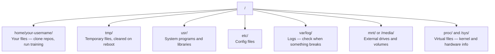

# Linux para AI  Linux base  AI engenheiro necessário)

> A maior parte da IA funciona no Linux.
> A maioria da IA funciona no Linux. Você precisa dominar o conhecimento suficiente, não só para ficar em Linux.

**Type:** Learn | **类型:** 学习
**Languages:** -- | **语言:** 无
**Prerequisites:** Phase 0, Lesson 01 | **前置知识:** Phase 0, 第 01 课
**Time:** ~30 minutes | **时间:** ~30 分钟

## Objetivos de aprendizagem

- Navegue no sistema de arquivos Linux e execute operações de arquivos essenciais a partir da linha de comando
  Tradução em chinês: in Linux 文件系统中导航, de comando para executar operações básicas de documentos
- Gerenciar permissões de arquivo com `chmod`E ...`chown`Para resolver os erros "Permissão negada"
  Tradução:`chmod`和 `chown`管理文件权限, resolver "Permissão negada" erro
- Instalar pacotes de sistema com `apt`e configurar uma caixa de GPU nova para o trabalho de IA
  Tradução:`apt`Instalação de sistemas, para novo GPU  servidor configuração de IA  ambiente de trabalho
- Identificar diferenças entre macOS e Linux que geralmente atrapalham os desenvolvedores que trabalham em máquinas remotas
  Chinese Translation: Identificação de macOS                                                                                                                                                                                                                                                                                                                                                                                                                                                                                                                      

> **【中文解读】**
> A maioria da AI                                                                                                                                                                                                                                                                                                                                                                                                                                                                                                                          

## O problema .

Desenvolve-se no macOS ou no Windows. Mas no momento em que você entra numa caixa de GPU em nuvem, aluga uma instância Lambda, ou roda uma máquina EC2, você entra no Ubuntu. O terminal é a sua única interface. Não há Finder, não há Explorer, não há interface gráfica. Se não conseguir navegar pelo sistema de arquivos, instalar pacotes e gerenciar processos a partir da linha de comando, fica preso a pagar por horas de GPU inativas enquanto procura no Google "como deslizar um arquivo no Linux".

> Você está no macOS ou Windows para desenvolver. Mas uma vez que você SSH para o servidor de GPU em nuvem, alugar Lambda, exemplo ou iniciar EC2 máquina, você já entrou em Ubuntu. O terminal é sua única interface. Sem Finder, sem Explorer, sem GUI. Se você não pode sair do comando de sistema de roteiro de arquivos, instalação e processo de gestão, você só pode pagar por GPU em tempo de transmissão para pesquisar "como resolver arquivos em Linux".

Este é um guia de sobrevivência. cobre exatamente o que você precisa para operar em uma máquina Linux remota para o trabalho da IA. Nada mais.

> Este é um guia de sobrevivência. Só abrange os conhecimentos necessários para realizar o trabalho de IA em máquinas Linux remotas.

> **【中文解读】**
> Você costuma usar macOS ou Windows  desenvolvido, mas um SSH até a nuvem GPU  servidor já entrou no Linux mundo ⋅ não há gerenciador de arquivos, apenas o terminal ⋅ é um guia de vida Linux ⋅ apenas ensinar conhecimento suficiente ⋅

## Arquivo de sistema de configuração

O Linux organiza tudo sob uma única raiz .`/`Não há .`C:\`ou `/Volumes`Os diretórios que realmente tocarão:

> O Linux vai organizar todo o conteúdo em um único catálogo .`/`Não há nada.`C:\`Ou `/Volumes`你实际会接触的目录:

> **【中文解读】**
> Linux 文件系统是单树状结构,根目录是 `/`- Não.`/home/用户名/`(简写 `~`O seu cadastro de trabalho é o seu.`/tmp/`O meu trabalho é de fazer o que eu quero.`/var/log/`存日志,出问题时必查──`/mnt/`                                                                                                                                                                                                                                                              



O seu diretório de casa é`~`ou `/home/your-username`Quase tudo o que fazemos acontece aqui.

> O seu principal catálogo é:`~`Ou `/home/your-username`Quase todas as operações estão a ser realizadas.

## Comandos essenciais.

Estes são os 15 comandos que cobrem 95% do que você fará em uma caixa de GPU remota.

> Estes 15 comandos cobrem 95% do seu funcionamento no servidor de GPU remoto.

> **【中文解读】**
> Você só precisa dominar cerca de 15 comandos para poder completar 95% do trabalho em um servidor Linux remoto. Esses comandos são divididos em quatro categorias:导航: pwd,ls,cd,文件操作: cp,mv,rm,mkdir,查看文件: cat,head,tail,grep,search,find,grep -r,r,r,r,r,r,r,r,r,r,r,r,r,r,r,r,r,r,r,r,r,r,r,r,r,r,r,r,r,r,r,r,r,r,r,r,r,r,r,r,r,r,r,r,r,r,r,r,r,r,r,r,r,r,r,r,r,r,r,r,r,r,r,r,r,r,r,r,r,r,r,r,r,r,r,r,r,r,r,r,r,r,r,r,r,r,r,r,r,r,r,r,r,r,r,r,r,r,r,r,r,r,r,r,r,r,r,r,r,r,r,r,r,r,r,r,r,r,r,r,r,r,r,r,r,r,r,r

### Movendo-se em torno .

```bash
pwd                         # Where am I?  当前在哪个目录？
ls                          # What's here?  列出当前目录内容
ls -la                      # What's here, including hidden files with details?  详细列出所有文件（含隐藏文件）
cd /path/to/dir             # Go there  切换到指定目录
cd ~                        # Go home  回到主目录
cd ..                       # Go up one level  返回上一级目录
```

### Arquivos e directórios

```bash
mkdir my-project            # Create a directory  创建目录
mkdir -p a/b/c              # Create nested directories in one shot  递归创建多级目录

cp file.txt backup.txt      # Copy a file  复制文件
cp -r src/ src-backup/      # Copy a directory (recursive)  递归复制目录

mv old.txt new.txt          # Rename a file  重命名文件
mv file.txt /tmp/           # Move a file  移动文件

rm file.txt                 # Delete a file (no trash, it's gone)  删除文件（无法恢复！）
rm -rf my-dir/              # Delete a directory and everything inside  递归删除目录（危险操作！）
```

`rm -rf`Não há desfecho, verifique o caminho antes de entrar.

> `rm -rf`Não há retirada.

### Lendo Arquivos .

```bash
cat file.txt                # Print entire file  打印整个文件内容
head -20 file.txt           # First 20 lines  查看前 20 行
tail -20 file.txt           # Last 20 lines  查看后 20 行
tail -f log.txt             # Follow a log file in real time (Ctrl+C to stop)  实时跟踪日志文件
less file.txt               # Scroll through a file (q to quit)  分页浏览文件
```

### Buscando Buscando e procurando

```bash
grep "error" training.log           # Find lines containing "error"  搜索包含 "error" 的行
grep -r "learning_rate" .           # Search all files in current directory  递归搜索所有文件
grep -i "cuda" config.yaml          # Case-insensitive search  不区分大小写搜索

find . -name "*.py"                 # Find all Python files under current dir  查找所有 Python 文件
find . -name "*.ckpt" -size +1G     # Find checkpoint files larger than 1GB  查找大于 1GB 的检查点文件
```

## Permissões .

Todos os arquivos no Linux têm um proprietário e bits de permissão. Você vai encontrar isto quando os scripts não executam ou você não pode escrever para um diretório.

> Cada arquivo no Linux tem um lugar de proprietário e de autorização. Quando o script não pode ser executado ou não pode ser escrito para o catálogo, você encontra este problema.

> **【中文解读】**
> Linux 权限分为三组:文件所有者 (文件所有者) 、同组用户 (用户) 、其他用户 (用户) 、其他用户 (用户) 、每组有读 (读) 、写 (写) 、执行 (执行) 、 x) 三种权限──`chmod +x`让脚本可执行,`chmod 644`Configuração de documentos para os proprietários.`chmod`Ou `sudo`- Resolve.

```bash
ls -l train.py
# -rwxr-xr-- 1 user group 2048 Mar 19 10:00 train.py
#  ^^^             owner permissions: read, write, execute
#     ^^^          group permissions: read, execute
#        ^^        everyone else: read only
```

Correções comuns:

> 常见修复方法:

```bash
chmod +x train.sh           # Make a script executable  让脚本可执行
chmod 755 deploy.sh         # Owner: full, others: read+execute  所有者全部权限，其他人可读可执行
chmod 644 config.yaml       # Owner: read+write, others: read only  所有者可读写，其他人只读

chown user:group file.txt   # Change who owns a file (needs sudo)  修改文件所有者（需要 sudo）
```

Quando algo diz "Permissão negada", é quase sempre uma questão de permissões.`chmod +x`ou `sudo`Vai resolver a maioria dos casos.

> Quando surge a "permissão negada", quase sempre há uma questão de direitos.`chmod +x`Ou `sudo`能 resolver a maioria das situações.

## Gerenciamento de pacotes (apt) 包管理

Utilizações do Ubuntu`apt`É assim que instalas software de nível de sistema.

> Ubuntu 使用 `apt`É assim que se instala o software.

```bash
sudo apt update             # Refresh the package list (always do this first)  更新软件包列表（首先执行）
sudo apt install -y htop    # Install a package (-y skips confirmation)  安装软件包（-y 跳过确认）
sudo apt install -y build-essential  # C compiler, make, etc. Needed by many Python packages  C 编译器和构建工具
sudo apt install -y tmux    # Terminal multiplexer (keep sessions alive after disconnect)  终端复用器

apt list --installed        # What's installed?  查看已安装的软件包
sudo apt remove htop        # Uninstall  卸载软件包
```

> **【中文解读】**
> `apt`É o gerenciador de pacote do Ubuntu.`apt update`- Não.`build-essential`提供 C 编译器, 很多 Python 包(如numpy、torch) precisa de ele para compilarar。`tmux`É um instrumento essencial para manter uma conversa à distância.

> **【拓展：新 GPU 服务器的初始化清单】**
> Depois de conseguir um novo servidor de GPU, normalmente é necessário executar:`apt update && apt install -y build-essential git curl wget tmux htop unzip python3-venv` Depois de instalar o NVIDIA 驱动和 CUDA Toolkit, reinstalar conda/uv──AWS EC2 Deep Learning AMI 已预装大部分工具, mas Lambda Labs 和 Vast.ai exemplos geralmente precisam de inicialização manual──

Pacotes comuns que você vai instalar em uma caixa de GPU nova:

> Nova GPU  servidor geralmente será instalado em pacote:

```bash
sudo apt update && sudo apt install -y \
    build-essential \
    git \
    curl \
    wget \
    tmux \
    htop \
    unzip \
    python3-venv
```

## Usuários e sudo. Usuários e melhorias de permissão.

Normalmente, você está ligado como usuário regular. Algumas operações precisam de acesso root (admin).

> Você normalmente é usuário comum. Algumas operações exigem o roteiro.

```bash
whoami                      # What user am I?  查看当前用户名
sudo command                # Run a single command as root  以 root 权限执行命令
sudo su                     # Become root (exit to go back, use sparingly)  切换为 root 用户（谨慎使用）
```

> **【中文解读】**
> Linux tem um nível de direitos rigoroso. O usuário comum só pode operar seus próprios arquivos, o nível de operação do sistema é necessário.`sudo`(superusuário faz)  O melhor prática é apenas usar quando necessário `sudo`Não seja usado por muito tempo para evitar erros de eliminação de arquivos do sistema.

Em instâncias de GPU em nuvem, você é normalmente o único usuário e já tem acesso ao sudo. Não execute tudo como root. Use sudo apenas quando necessário.

> Em um exemplo de GPU no cloud, você é normalmente o único usuário e já tem o sudo. Não use o sudo apenas quando necessário.

## Processos e sistemas.

Quando o teu treinamento está pendurado, ou precisas de verificar o que está a correr:

> Quando o treinamento está em curso ou você precisa de verificar o processo em andamento:

```bash
htop                        # Interactive process viewer (q to quit)  交互式进程查看器
ps aux | grep python        # Find running Python processes  查找 Python 进程
kill 12345                  # Gracefully stop process with PID 12345  优雅终止进程
kill -9 12345               # Force kill (use when graceful doesn't work)  强制终止进程
nvidia-smi                  # GPU processes and memory usage  查看 GPU 进程和显存
```

> **【中文解读】**
> Quando treinar, usar.`htop`Veja qual é o processo que ocupa os recursos, use`kill`终止失控的进程── O processo é um processo de "acabar a perder o controlo".`kill -9`É obrigatório, só em comum.`kill`无效时使用──`nvidia-smi`É um comando central da gestão de processos da GPU, capaz de ver quais processos estão usando a GPU, ocupando quantidade de armazenamento.

sistemad gerencia serviços (daemons de fundo). Você vai usá-lo se executar servidores de inferência:

> sistemad 管理服务 (后台守护进程) ⋅ Se você executar o sistema, você usará o sistema:

```bash
sudo systemctl start nginx          # Start a service  启动服务
sudo systemctl stop nginx           # Stop it  停止服务
sudo systemctl restart nginx        # Restart it  重启服务
sudo systemctl status nginx         # Check if it's running  查看服务状态
sudo systemctl enable nginx         # Start automatically on boot  设置开机自启
```

## Espaço em disco

As caixas de GPU muitas vezes têm espaço limitado no disco.

> O espaço no disco do servidor GPU geralmente é limitado.

```bash
df -h                       # Disk usage for all mounted drives  查看所有磁盘使用情况
df -h /home                 # Disk usage for /home specifically  查看 /home 分区使用情况

du -sh *                    # Size of each item in current directory  查看当前目录各项大小
du -sh ~/.cache             # Size of your cache (pip, huggingface models land here)  缓存目录大小
du -sh /data/checkpoints/   # Check how big your checkpoints are  检查检查点文件大小

# Find the biggest space hogs  找出最大的空间占用
du -h --max-depth=1 / 2>/dev/null | sort -hr | head -20
```

> **【中文解读】**
> O espaço no disco do servidor de GPU  frequentemente não é suficiente.`df -h`查看整体磁盘使用,用 `du -sh *`找到具体哪个目录占占空间最多── regularmente limpar `~/.cache/huggingface/`E os antigos documentos de inspecção.

Salvadores de espaço comuns:

> 常见的空间清理方法:

```bash
# Clear pip cache  清理 pip 缓存
pip cache purge

# Clear apt cache  清理 apt 缓存
sudo apt clean

# Remove old checkpoints you don't need  删除不需要的旧检查点
rm -rf checkpoints/epoch_01/ checkpoints/epoch_02/
```

## Rede de operações

Você vai baixar modelos, transferir arquivos e acessar APIs a partir da linha de comando.

> Você vai fazer download de um modelo de comando, de um arquivo de transmissão e de uma API de configuração.

```bash
# Download files  下载文件
wget https://example.com/model.bin                   # Download a file  下载文件
curl -O https://example.com/data.tar.gz              # Same thing with curl  用 curl 下载
curl -s https://api.example.com/health | python3 -m json.tool  # Hit an API, pretty-print JSON  调用 API 并格式化输出

# Transfer files between machines  在机器间传输文件
scp model.bin user@remote:/data/                     # Copy file to remote machine  复制文件到远程机器
scp user@remote:/data/results.csv .                  # Copy file from remote to local  从远程复制到本地
scp -r user@remote:/data/checkpoints/ ./local-dir/   # Copy directory  复制整个目录

# Sync directories (faster than scp for large transfers, resumes on failure)  同步目录（比 scp 快，支持断点续传）
rsync -avz --progress ./data/ user@remote:/data/
rsync -avz --progress user@remote:/results/ ./results/
```

> **【中文解读】**
> O comando da rede é um instrumento diário de engenheiros de IA.`wget`和 `curl`Baixe o modelo e o conjunto de dados.`scp`Em locais e distantes.`rsync`É a primeira opção de grande transferência de dados.

> **【拓展：rsync 在 AI 工作流中的关键作用】**
> Quando você está no AWS p4d  exemplo($32.77/小时) no treinamento de um LLM, precisa transferir 50GB de checkpoint para o seu local.

Utilização`rsync`- Não .`scp`Ele só transfere bytes alterados e lida com conexões interrompidas.

>                                                                                                                                                                                                                                                                                                                                                                                                                                                                                                                              `rsync`Não é`scp`                                                                                                                                                                                                                                                              

## Mantém as sessões vivas.

Quando você entra num dispositivo remoto, fechar o seu laptop mata a sua corrida de treinamento.

> Quando você chegar ao servidor remoto, feche o computador.

```bash
tmux new -s train           # Start a new session named "train"  创建名为 "train" 的新会话
# ... start your training, then:
# Ctrl+B, then D            # Detach (training keeps running)  分离会话（训练继续运行）

tmux ls                     # List sessions  列出所有会话
tmux attach -t train        # Reattach to session  重新连接到会话

# Inside tmux:  tmux 内操作：
# Ctrl+B, then %            # Split pane vertically  垂直分割面板
# Ctrl+B, then "            # Split pane horizontally  水平分割面板
# Ctrl+B, then arrow keys   # Switch between panes  切换面板
```

> **【中文解读】**
> Tmux é um dispositivo de segurança de treinamento de GPU remoto. Não há nenhum dispositivo de treinamento.`Ctrl+B, D`Separar, treinar no segundo andar continuar.`tmux attach`重新连接──长时间训练任务必须用tmux──

Sempre trabalha longos treinamentos dentro de um "tmux".

> 长时间训练任务务必在tmux 中运行――务必如此――

> **【拓展：Linux 在 AI 基础设施中的统治地位】**
> A maioria das equipes de inteligência artificial (AI) em todo o mundo são equipadas com Linux. A maioria das equipes de inteligência artificial (AI) são equipadas com Linux.

## WSL2 para usuários de Windows

> **【中文解读】**
> WSL2  Deixar os usuários do Windows obterem um verdadeiro Linux  ambiente, não precisa de dois sistemas, GPU direto já suportado  apenas precisa ser instalado no lado do Windows  NVIDIA  driven, WSL2 dentro de um sistema operacional CUDA──Windows 文件在 WSL2 中通过 `/mnt/c/Users/用户名/`访问── é a melhor solução para os usuários de Windows aprenderem Linux e desenvolver IA──

Se estiveres no Windows, o WSL2 dá-te um ambiente Linux real sem dual-booting.

> Se você usar o Windows, o WSL2 无需双系统就能给你真正的Linux 环境──

```bash
# In PowerShell (admin)
wsl --install -d Ubuntu-24.04

# After restart, open Ubuntu from Start menu
sudo apt update && sudo apt upgrade -y
```

O WSL2 executa um kernel Linux real. Tudo nesta lição funciona dentro dele. Os seus arquivos do Windows estão em`/mnt/c/Users/YourName/`do interior da WSL.

> WSL2 运行真正的Linux内核──本课的所有内容都可在其中使用──Windows 文件在 WSL内通过 `/mnt/c/Users/YourName/`访问。

A GPU passa através de funciona com drivers NVIDIA instalados no lado do Windows. Instale o driver NVIDIA do Windows (não o Linux), e CUDA estará disponível dentro do WSL2.

> GPU direto através de Windows 侧安装的NVIDIA 驱动工作──安装 Windows 版 NVIDIA 驱动(不是Linux 版),CUDA 就能在 WSL2 内使用──

> **【拓展：WSL2 GPU 支持的实际表现】**
> A GPU direta do WSL2 tem um desempenho próximo ao Linux original, o PyTorch e o TensorFlow podem funcionar normalmente com CUDA.`nvidia-smi`Pode ver a GPU do Windows.`/mnt/c/`) Com relação ao WSL2 original生文件系统慢 3-5 倍.`~/`Atualmente, obtemos o melhor desempenho.

## MacOS para Linux

Coisas que te vão tropeçar se estiveres a vir do macOS:

> Se mudares de macOS, estas coisas vão fazer-te cair no buraco:

| macOS | Linux | Notes |
|-------|-------|-------|
| `brew install` | `sudo apt install` | Different package names sometimes. `brew install htop` vs `sudo apt install htop` works the same, but `brew install readline` vs `sudo apt install libreadline-dev` does not. |
| `open file.txt` | `xdg-open file.txt` | But you won't have a GUI on a remote box. Use `cat` or `less`. |
| `pbcopy` / `pbpaste` | Not available | Pipe to/from clipboard doesn't exist over SSH. |
| `~/.zshrc` | `~/.bashrc` | macOS defaults to zsh. Most Linux servers use bash. |
| `/opt/homebrew/` | `/usr/bin/`, `/usr/local/bin/` | Binaries live in different places. |
| `sed -i '' 's/a/b/' file` | `sed -i 's/a/b/' file` | macOS sed needs an empty string after `-i`. Linux does not. |
| Case-insensitive filesystem | Case-sensitive filesystem | `Model.py` and `model.py` are two different files on Linux. |
| Line endings `\n` | Line endings `\n` | Same. But Windows uses `\r\n`, which breaks bash scripts. Run `dos2unix` to fix. |

| macOS | Linux | 注意事项 |
|------|------|---------|
| `brew install` | `sudo apt install` | 包名有时不同，如 readline vs libreadline-dev |
| `open file.txt` | `xdg-open file.txt` | 远程服务器无 GUI，用 `cat` 或 `less` |
| `pbcopy` / `pbpaste` | 不可用 | SSH 下无法操作剪贴板 |
| `~/.zshrc` | `~/.bashrc` | macOS 默认 zsh，Linux 服务器多用 bash |
| `/opt/homebrew/` | `/usr/bin/`, `/usr/local/bin/` | 可执行文件路径不同 |
| `sed -i '' 's/a/b/' file` | `sed -i 's/a/b/' file` | macOS sed 的 `-i` 后需要空字符串 |
| 大小写不敏感 | 大小写敏感 | `Model.py` 和 `model.py` 是两个不同文件 |
| 换行符 `\n` | 换行符 `\n` | 相同，但 Windows 的 `\r\n` 会破坏 bash 脚本 |

## Cartão de referência rápido.

```
Navigation:     pwd, ls, cd, find
Files:          cp, mv, rm, mkdir, cat, head, tail, less
Search:         grep, find
Permissions:    chmod, chown, sudo
Packages:       apt update, apt install
Processes:      htop, ps, kill, nvidia-smi
Services:       systemctl start/stop/restart/status
Disk:           df -h, du -sh
Network:        curl, wget, scp, rsync
Sessions:       tmux new/attach/detach
```

## Exercícios.
```figure
s0-process-fork
```

## Exercícios

1. SSH em qualquer máquina Linux (ou abrir WSL2) e navegar para o seu diretório de casa. Crie uma pasta de projeto, crie três arquivos vazios dentro dele com `touch`, então lista-os com `ls -la`- Não .
   SSH para Linux 机器, criar projetos e documentos vazios, us `ls -la`列出
2. Instalação`htop`com apt, execute-o e identifique qual processo está a usar mais memória.
   Use apt instal htop, encontrar o maior número de processos de memória
3. Comece uma sessão de tmux, corre.`sleep 300`dentro dele, desligar, fazer uma lista de sessões e religar.
   创建 tmux 会话,运行睡眠 命令,分离后重新连接
4. Utilização`df -h`para verificar o espaço disponível no disco, em seguida, use `du -sh ~/.cache/*`Para encontrar o que ocupa espaço no teu cache.
   Chequear espaço em disco, encontrar o maior conteúdo do espaço ocupado no cache
5. Transferir um arquivo de sua máquina local para um remoto usando `scp`, então faça a mesma transferência com `rsync`e comparar a experiência.
   Usar scp e rsync, diferentes transferências de documentos, em relação a dois métodos
