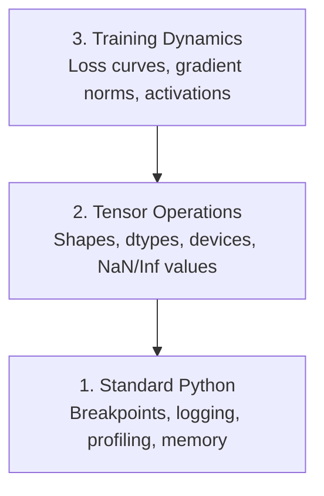

# Descarga e Profilação 调试与性能分析

> Os piores bugs da IA não caem, treinam silenciosamente no lixo e relatam uma bela curva de perdas.
> Os piores bugs da IA não deixam o processo cair. Eles treinam silenciosamente em dados de lixo e depois relatam uma bela perda.

**Type:** Build | **类型:** 构建
**Language:**O Python .**语言:**Python
**Prerequisites:** Lesson 1 (Dev Environment), basic PyTorch familiarity | **前置知识:** 第 1 课（开发环境），基本 PyTorch 知识
**Time:** ~60 minutes | **时间:** ~60 分钟

## Objetivos de aprendizagem

- Use condicional `breakpoint()`E ...`debug_print`para inspecionar as formas, os tipos e os valores de tensor NaN no meio do treino
  Tradução do português:`breakpoint()`和 `debug_print`No processo de treinamento, verifique a forma de quantidade de dados, o tipo de dados e o valor NaN
- Loops de treinamento de perfil com `cProfile`- Não .`line_profiler`, e `tracemalloc`para encontrar gargalos de engarrafamento
  Tradução:`cProfile`- Não.`line_profiler`和 `tracemalloc`分析训练循环, encontrar botelhas de desempenho
- Detectar bugs comuns da IA: desajustes de forma, perda de NaN, vazamento de dados e tensores de dispositivo errado
  Chinese Translation:检测常见 AI bug:形状不匹配、NaN perda、 data leakage和设备错误
- Configure TensorBoard para visualizar curvas de perda, histogramas de peso e distribuições de gradientes
  Chinese: Set TensorBoard 可视化损失 曲线、权重直方图和梯度分布

> **【中文解读】**
> O bug do código de IA é diferente do código comum: não vai quebrar o relatório de erro, mas sim treinar silenciosamente com erros de dados para um modelo inútil.

> **【拓展：AI 调试为什么特别难？】**
> O bug do desenvolvimento da Web tradicional geralmente tem erros claros. Mas o bug da IA é "Silent Failure" o modelo treina em dados errados 8 horas, perda parece normal, mas no final o previsão é lixo. Causas comuns:

## O problema .

O código da IA falha de forma diferente do código normal. Um aplicativo web cai com um rastreamento de pilha. Um ciclo de treinamento mal configurado funciona por 8 horas, queima $ 200 em tempo de GPU e produz um modelo que prevê a média de cada entrada. O código nunca errou. O bug foi um tensor no dispositivo errado, um esquecido.`.detach()`, ou rótulos que vazam para as características.

> O modo de falha do código de IA é diferente do código comum. A aplicação da Web vai cair e dar um monte de seguimento. Um ciclo de treinamento de configuração errada é executado por 8 horas.`.detach()`O que é que se passa?

Precisas de ferramentas de depuração que captam estas falhas silenciosas antes que desperdicem o teu tempo e computação.

> Precisas de poder capturá-los antes de perder tempo e poder matemático.

> **【中文解读】**
> A IA 调试最难的地方在"静默失败": código não relata erro, mas o resultado do treinamento é completamente errado.`.detach()`O que é que é o problema? O que é que é o problema?

## O conceito central.

A desativação da IA opera em três níveis:

> A IA 调试 em três níveis:



A maioria das pessoas salta para o nível 3 (olhando para TensorBoard). Mas 80% dos bugs da IA vivem nos níveis 1 e 2.

> A maioria das pessoas salta diretamente para a 3a camada, mas 80% dos bugs da IA existem na 1a e 2a camadas.

> **【中文解读】**
> A IA 调试分为三个层次:第一层是标准Python 调试(断点、日志、内存分析);第二层是张量操作检查(形状、数据类型、设备、NaN 值);第三层是训练动态观察(loss 曲线、梯度分布、激活值) . A maioria das pessoas olha diretamente para TensorBoard, mas 80% dos bugs na verdade estão nos dois primeiros níveis.

## Construí-lo e realizei-o.
```figure
s0-flame-hot
```

## Construí-lo

### Parte 1: Desembaçamento de impressão (Sim, funciona)

Para o código tensor, uma instrução de impressão direcionada é melhor do que passar por um depurador porque você precisa ver formas, tipos e intervalos de valores de uma só vez.

> 印调试常被轻视──但不应如此──对于张量代码, uma frase de impressão específica é mais eficaz do que um teste gradual, porque você precisa ver simultaneamente a forma, o tipo de dados e o valor do alcance──

```python
def debug_print(name, tensor):
    print(f"{name}: shape={tensor.shape}, dtype={tensor.dtype}, "
          f"device={tensor.device}, "  # 张量在 CPU 还是 GPU 上？
          f"min={tensor.min().item():.4f}, max={tensor.max().item():.4f}, "
          f"mean={tensor.mean().item():.4f}, "
          f"has_nan={tensor.isnan().any().item()}")  # 检测是否有 NaN 值
```

Liga-nos depois de cada operação suspeita, e quando o bug for encontrado, remova as impressões digitais.

> Em cada operação de dúvida, depois de sua utilização, encontra o bug, depois de seu eliminação.

### Parte 2: Python Debugger (pdb e ponto de ruptura)

O depurador embuído é subestimado para o trabalho da IA.`breakpoint()`Entrem no seu ciclo de treinamento e inspecionem os tensores de forma interativa.

> O interior do módulo foi subestimado no trabalho da IA.`breakpoint()`, pode interagem em chequear a quantidade de

> **【中文解读】**
> `breakpoint()`É a melhor maneira de fazer um corte de condições. Em um ciclo de treinamento, se você coloca condições de arranque, como perda ou aumento de peso, o processo só pode parar em tempos anormais.`p`命令检查张量形、值范围和梯度──

```python
def training_step(model, batch, criterion, optimizer):
    inputs, labels = batch
    outputs = model(inputs)
    loss = criterion(outputs, labels)

    if loss.item() > 100 or torch.isnan(loss):  # loss 异常大或为 NaN 时触发断点
        breakpoint()  # 进入交互式调试器

    loss.backward()
    optimizer.step()
```

Quando o depurador o deixa entrar, comandos úteis:

> 调试器激活后, ordens de uso habitual:

- `p outputs.shape`para verificar as formas
  Tradução:`p outputs.shape`检查形状
- `p loss.item()`Para ver o valor da perda
  Tradução:`p loss.item()`查看 perda  valor
- `p torch.isnan(outputs).sum()`para contar os NAN
  Tradução:`p torch.isnan(outputs).sum()`统计 NaN 个数
- `p model.fc1.weight.grad`para verificar os gradientes
  Tradução:`p model.fc1.weight.grad`检查梯度
- `c`Continuar,`q`para desistir
  Tradução:`c`Continuar,`q` Retiro

Isto é depuração condicional, só se pára quando algo parece errado, para uma corrida de treinamento de 10.000 passos, isso importa.

> É uma condição de teste. Só se pode parar quando surgem anomalias. Para um treino de 10.000 passos, é muito importante.

### Parte 3: Logging Python

Substitua as instruções de impressão por registos quando o seu depuração excede uma verificação rápida.

> Quando o teste ultrapassa o alcance do teste rápido, use 日志 substituir o texto em papel.

```python
import logging

logging.basicConfig(
    level=logging.INFO,
    format="%(asctime)s [%(levelname)s] %(message)s",  # 带时间戳和级别的格式
    handlers=[
        logging.FileHandler("training.log"),  # 输出到文件
        logging.StreamHandler()  # 同时输出到终端
    ]
)
logger = logging.getLogger(__name__)

logger.info("Starting training: lr=%.4f, batch_size=%d", lr, batch_size)
logger.warning("Loss spike detected: %.4f at step %d", loss.item(), step)  # 警告级别
logger.error("NaN loss at step %d, stopping", step)  # 错误级别
```

> **【中文解读】**
> O livro é um livro de ficção, mas não é um livro de ficção.

A registrosagem dá-lhe marcas de tempo, níveis de gravidade e saída de arquivo. Quando uma execução de treinamento falha às 3 da manhã, você quer um arquivo de registro, não uma saída terminal que deslize a tela.

> Quando você entra em treino às 3h da manhã, você precisa de um diário, não de um extremo de saída do ecrã.

### Parte 4: Seções de Código de Tempo

Saber onde vai o tempo é o primeiro passo para a otimização.

> Saber o tempo que passa é o primeiro passo para melhorar.

```python
import time

class Timer:
    def __init__(self, name=""):
        self.name = name

    def __enter__(self):
        self.start = time.perf_counter()  # 高精度计时器
        return self

    def __exit__(self, *args):
        elapsed = time.perf_counter() - self.start
        print(f"[{self.name}] {elapsed:.4f}s")  # 打印耗时

with Timer("data loading"):  # 计时数据加载
    batch = next(dataloader_iter)

with Timer("forward pass"):  # 计时前向传播
    outputs = model(batch)

with Timer("backward pass"):  # 计时反向传播
    loss.backward()
```

A conclusão comum é que a carga de dados demora 60% do tempo de formação.`num_workers > 0`no seu DataLoader, não numa GPU mais rápida.

> 常见发现: Dataloads ocupam 60% do tempo de treinamento.`num_workers > 0`Em vez de comprar GPU mais rápido...

> **【中文解读】**
> O primeiro passo para melhorar a performance é encontrar a garrafa.`Timer`O mais comum é que o tempo de treinamento de 60% é feito com dados. A solução não é comprar uma GPU mais cara, mas a configuração do DataLoader.`num_workers > 0`- Não.

> **【拓展：数据加载瓶颈是 AI 训练的头号性能杀手】**
> Na indústria, a principal razão para a taxa de utilização de GPUs ser inferior a 80% é que a carga de dados é muito lenta, a GPUs em outros dados.`num_workers`(normalmente, por 4 a 8)`pin_memory=True`加速 CPU-GPU 传输、使用 `prefetch_factor`Preço de dados: Google utilizou um fluxo de dados especial para garantir que o TPU não tenha necessidade de outros dados.

### Parte 5: cProfil e line_profil

Quando precisar de mais do que temporizadores manuais:

> Quando o tempo de movimentação não é suficiente:

```bash
python -m cProfile -s cumtime train.py  # 按累计时间排序的性能分析
```

Isto mostra cada chamada de função ordenada por tempo cumulativo.

> Esta se aplica a uma ordem de tempo acumulado, mostrando cada função de admissão.

```bash
pip install line_profiler
```

```python
@profile  # line_profiler 装饰器，逐行统计耗时
def train_step(model, data, target):
    output = model(data)
    loss = F.cross_entropy(output, target)
    loss.backward()
    return loss

# Run with: kernprof -l -v train.py  运行逐行性能分析
```

### Parte 6: Profilagem da memória

> **【中文解读】**
> Análise de memória: CPU e GPU`tracemalloc`找到分配最内存的代码行,GPU usados `torch.cuda.memory_summary()`查看显存使用──OOM(Out of Memory) é um dos erros mais comuns em treinos de IA, primeiro reduzir o tamanho do lote, depois tentar treinar com precisão misturada──

#### Memória de CPU com tracemalloc

```python
import tracemalloc

tracemalloc.start()  # 开始跟踪内存分配

# your code here
model = build_model()
data = load_dataset()

snapshot = tracemalloc.take_snapshot()  # 拍摄内存快照
top_stats = snapshot.statistics("lineno")  # 按代码行统计内存
for stat in top_stats[:10]:
    print(stat)
```

#### Memória de CPU com memória_profil

```bash
pip install memory_profiler
```

```python
from memory_profiler import profile

@profile  # 逐行分析内存使用
def load_data():
    raw = read_csv("data.csv")       # watch memory jump here  观察内存跳变
    processed = preprocess(raw)       # and here  数据预处理也会增加内存
    return processed
```

Corra com `python -m memory_profiler your_script.py`para ver o uso de memória linha por linha.

> 运行 `python -m memory_profiler your_script.py`查看逐行内存使用──

#### Memória GPU com PyTorch

```python
import torch

if torch.cuda.is_available():
    print(torch.cuda.memory_summary())  # GPU 显存完整报告

    print(f"Allocated: {torch.cuda.memory_allocated() / 1e9:.2f} GB")  # 已分配的显存
    print(f"Cached: {torch.cuda.memory_reserved() / 1e9:.2f} GB")  # 缓存的显存
```

Quando você tocar OOM (Out of Memory):

> Quando você se encontra com falta de memória:

1. Reduzir o tamanho do lote (primeira coisa a tentar, sempre)
   中文翻译:减小 batch size (de forma que você não tenha um grande número de batches)
2. Utilização`torch.cuda.empty_cache()`para liberar a memória em cache
   Tradução:`torch.cuda.empty_cache()`释放缓存内存
3. Utilização`del tensor`seguida por `torch.cuda.empty_cache()`para grandes intermediários
   Tradução do inglês para tradução do inglês para tradução do inglês para tradução do inglês para tradução do inglês para tradução do inglês para tradução do inglês para tradução do inglês para tradução do inglês para o inglês para tradução do inglês para o inglês para tradução do inglês para o inglês para tradução do inglês para o inglês para o inglês`del tensor`- Não .`torch.cuda.empty_cache()`
4. Utilize precisão mista (`torch.cuda.amp`) para reduzir ao meio o uso de memória
   中文翻译:使用混合精度`torch.cuda.amp`) redução da utilização do
5. Utilize o ponto de controlo de gradientes para modelos muito profundos
   Tradução do inglês para tradução do inglês para tradução do inglês para tradução do inglês para tradução do inglês para tradução do inglês para tradução do inglês para tradução do inglês para tradução do inglês para tradução do inglês para tradução do inglês para tradução do inglês para tradução do inglês para tradução do inglês para tradução do inglês para o inglês para tradução do inglês para o inglês para tradução do inglês para o inglês para tradução do inglês para o inglês para o inglês para tradução do inglês para o inglês para o inglês para grego para grego

### Parte 7: Bugs comuns de IA e como pegá-los

> **【中文解读】**
> É a parte mais prática do capítulo. Quatro tipos de bugs mais comuns da IA: forma não correspondente (tensor) forma não)  NaN loss (numero de explosão) DATA LEAKE (data leakage)  Training set and test set have overlap)  Equipment error (CPU e GPU 混用) 

#### Desconformidade de forma

O bug mais frequente. Um tensor tem forma.`[batch, features]`Quando o modelo espera`[batch, channels, height, width]`- Não .

> O bug mais comum é o 张量形`[batch, features]`Mas espera-se que o modelo`[batch, channels, height, width]`- Não.

```python
def check_shapes(model, sample_input):
    print(f"Input: {sample_input.shape}")  # 打印输入形状
    hooks = []

    def make_hook(name):
        def hook(module, inp, out):
            in_shape = inp[0].shape if isinstance(inp, tuple) else inp.shape
            out_shape = out.shape if hasattr(out, "shape") else type(out)
            print(f"  {name}: {in_shape} -> {out_shape}")  # 打印每层的输入输出形状
        return hook

    for name, module in model.named_modules():
        hooks.append(module.register_forward_hook(make_hook(name)))  # 注册钩子函数

    with torch.no_grad():  # 不计算梯度，仅检查形状
        model(sample_input)

    for h in hooks:
        h.remove()  # 清理钩子
```

Exerça isto uma vez com um lote de amostra.

> Usar um lote de amostra 运行一次──它会映射模型中的每一个形状变化──

#### Perda de N

A perda de NaN significa algo explodido.

> A perda significa que algo explodiu.

> **【拓展：NaN 在大模型训练中的灾难性影响】**
> No treinamento de LLM, NaN uma vez que aparece no gradiente, já vai através de uma disseminação reversa de todos os parâmetros, levando ao modelo inteiro irrecuperável. GPT-3  Treinamento refere-se no artigo, eles usam o gradiente cortar (cortando gradiente) e a taxa de aprendizagem pré-calor (aquecimento) para prevenir NaN. Uma vez que o teste chega ao NaN, a prática habitual é voltar para o ponto de verificação mais recente e recomeçar, em vez de tentar reiniciar.

- Taxa de aprendizagem muito alta
  Tradução do inglês: learn rate too high
- Divisão por zero em perda aduaneira
  Tradução do inglês: Self-definition loss 中除以零
- Registro de número zero ou negativo
  Tradução do inglês para grego:对零或负数取对数
- Gradientes explosivos em NNR
  Tradução do português:RNN 中的梯度爆炸

```python
def detect_nan(model, loss, step):
    if torch.isnan(loss):  # 检测 loss 是否为 NaN
        print(f"NaN loss at step {step}")
        for name, param in model.named_parameters():
            if param.grad is not None:
                if torch.isnan(param.grad).any():  # 检测梯度中的 NaN
                    print(f"  NaN gradient in {name}")
                if torch.isinf(param.grad).any():  # 检测梯度中的 Inf
                    print(f"  Inf gradient in {name}")
        return True
    return False
```

#### Fugas de dados

O teu modelo tem 99% de precisão no teste.

> Seu modelo em testes recebeu 99% de precisão.

```python
def check_data_leakage(train_set, test_set, id_column="id"):
    train_ids = set(train_set[id_column].tolist())  # 训练集 ID 集合
    test_ids = set(test_set[id_column].tolist())  # 测试集 ID 集合
    overlap = train_ids & test_ids  # 取交集
    if overlap:
        print(f"DATA LEAKAGE: {len(overlap)} samples in both train and test")  # 发现重叠！
        return True
    return False
```

Verifique também se há vazamento temporal: usando dados futuros para prever o passado.

> Também temos que verificar a fuga de tempo: Usando futuros dados pré-prevéculos do passado.

#### Dispositivo errado

Tensores em diferentes dispositivos (CPU vs GPU) causam erros de execução. Mas às vezes um tensor permanece silenciosamente na CPU enquanto tudo o resto está na GPU, e o treinamento funciona lentamente.

> Diferentes quantidades de CPU em relação à GPU podem causar erros de execução. Mas, às vezes, uma quantidade de CPU permanece na GPU, enquanto outras estão na GPU, o treinamento é lento.

```python
def check_devices(model, *tensors):
    model_device = next(model.parameters()).device  # 获取模型所在设备
    print(f"Model device: {model_device}")
    for i, t in enumerate(tensors):
        if t.device != model_device:  # 检查张量和模型是否在同一设备
            print(f"  WARNING: tensor {i} on {t.device}, model on {model_device}")
```

### Parte 8: Fundamentos do TensorBoard

TensorBoard mostra-lhe o que acontece dentro do treino ao longo do tempo.

> TensorBoard  demonstração das alterações que ocorrem no processo de treinamento.

```bash
pip install tensorboard  # 安装 TensorBoard
```

```python
from torch.utils.tensorboard import SummaryWriter

writer = SummaryWriter("runs/experiment_1")  # 创建日志写入器

for step in range(num_steps):
    loss = train_step(model, batch)

    writer.add_scalar("loss/train", loss.item(), step)  # 记录训练 loss
    writer.add_scalar("lr", optimizer.param_groups[0]["lr"], step)  # 记录学习率

    if step % 100 == 0:
        for name, param in model.named_parameters():
            writer.add_histogram(f"weights/{name}", param, step)  # 记录权重分布
            if param.grad is not None:
                writer.add_histogram(f"grads/{name}", param.grad, step)  # 记录梯度分布

writer.close()
```

Lança:

> Incêntrizar TensorBoard:

```bash
tensorboard --logdir=runs  # 启动 TensorBoard 可视化服务
```

O que procurar:

> Observação:

- **Loss not decreasing**: Taxa de aprendizagem muito baixa ou problema de arquitetura de modelo
  Tradução:**Loss 不降**: taxa de aprendizagem muito baixa, ou problemas com a estrutura do modelo
- **Loss oscillating wildly**: Taxa de aprendizagem demasiado elevada
  Tradução:**Loss 剧烈震荡**: taxa de aprendizagem muito alta
- **Loss goes to NaN**: Instabilidade numérica (ver secção NaN acima)
  Tradução:**Loss 变 NaN**: Número de valores estáveis (NN 部分)
- **Train loss decreasing, val loss increasing**: Super-ajustamento
  Tradução:**训练 loss 降但验证 loss 升**- Não, não.
- **Weight histograms collapsing to zero**: Gradientes desaparecendo
  Tradução:**权重直方图趋零**- Desaparecer
- **Gradient histograms exploding**: Precisa de cortes de gradiente
  Tradução:**梯度直方图爆炸**- Não, não.

> **【中文解读】**
> TensorBoard é um instrumento padrão de treinamento visível.

> **【拓展：Weights & Biases 与 TensorBoard 的对比】**
> TensorBoard é um ferramenta de visualização de treinamento de Google, adequada para indivíduos e pequenas equipes. Pesos e Biases (W&B) é uma ferramenta comercial, que aumenta a experiência em relação à comparação, a colaboração em equipe, a pesquisa de superparâmetros, etc. Em OpenAI, Anthropic, etc., W&B é uma plataforma padrão de rastreamento de experimentos. Uma experiência de grande porte tipicamente rastreia milhares de indicadores: perda, taxa de aprendizagem, gradiente, distribuição de peso em cada nível, taxa de utilização de GPU, etc. Estes dados ajudam os engenheiros a encontrar os melhores superparâmetros em centenas de experiências.

### Parte 9: Debugger de código VS

Para depuração interativa, configure o código VS com um `launch.json`- Não .

> 对于交互式调试, us us `launch.json`配置 VS Código:

```json
{
    "version": "0.2.0",
    "configurations": [
        {
            "name": "Debug Training",
            "type": "debugpy",
            "request": "launch",
            "program": "${file}",  // 调试当前打开的文件
            "console": "integratedTerminal",  // 使用集成终端
            "justMyCode": false  // 允许调试第三方库代码
        }
    ]
}
```

Configure pontos de ruptura clicando no canal. Use o painel de variáveis para inspecionar as propriedades do tensor. O Console de depuração permite executar expressões arbitrárias do Python no meio da execução.

> Clique no número de configuração de ponto de partida. Use variable board check张量属性.

Útil para passar por canais de pré-processamento de dados onde você quer ver cada transformação.

>  Aplica-se a um processo de análise de dados, ver os resultados de cada alteração.

## Use-o com o framework implementado.

> **【中文解读】**
> 實践中的调试工作流分五步: treinamento preuso `check_shapes`验证维度;前 10 步用 `debug_print`检查张量值; training中使用TensorBoard 监控;出问题时使用 `breakpoint()`交互调试; performance bottle utilizando cronometradores e memória analisadores para localizar.

Aqui está o fluxo de trabalho de depuração que capta a maioria dos bugs da IA:

> Aqui estão os fluxos de trabalho que podem capturar a maioria dos bugs da IA:

1. **Before training**- Correr .`check_shapes`Verificar que as dimensões de entrada e saída correspondem às expectativas.
   Tradução:**训练前**:用样本批发 运行 `check_shapes`,verificar se a importância da exportação e da exportação estão em conformidade com a previsão.
2. **First 10 steps**Utilização: `debug_print`Confirme que nada é NaN e os valores estão em intervalos razoáveis.
   Tradução:**前 10 步**• para perda, produção e utilização de`debug_print`, confirmam que não existe valor NaN 且在合理范围──
3. **During training**: Perda de registro, taxa de aprendizagem e normas de gradiente. Use TensorBoard para visualização.
   Tradução:**训练中**O que é um dos principais aspectos da aprendizagem?
4. **When something breaks**- Deixe cair .`breakpoint()`Inspeccionar os tensores de forma interativa.
   Tradução:**出问题时**:                                                                                                                                                                                                                                                                                                                                                                                                                                                                                                                             `breakpoint()`,交互式检查张量──
5. **For performance**Tempo de carregamento de dados versus avanço versus passagem para trás. Memória de perfil se estiver perto de OOM.
   Tradução:**性能优化**Se estiver perto da OOM, realizar uma análise de memória.

## Envia-o . Produto .

Execute o script de depuração do kit de ferramentas:

> 运行调试工具脚本:

```bash
python phases/00-setup-and-tooling/12-debugging-and-profiling/code/debug_tools.py
```

Veja .`outputs/prompt-debug-ai-code.md`para um prompt que ajuda a diagnosticar bugs específicos da IA.

> 参见 `outputs/prompt-debug-ai-code.md`, que contém ajuda para diagnosticar AI  específica de bugs prompt.

## Exercícios.

1. Corra .`debug_tools.py`Modifique o modelo de manobra para introduzir um NaN (indicação: divide por zero na passagem para a frente) e observe o detector pegá-lo.
   运行调试工具脚本, Modificar modelo introduzir NaN, observar como o testeiro captar
2. Profila um ciclo de treinamento com `cProfile`e identificar a função mais lenta.
   Use cProfile  Análise de ciclo de treinamento, encontrar a função mais lenta
3. Utilização`tracemalloc`para encontrar qual linha no seu pipeline de carga de dados atribui a maior memória.
   Usar tracemalloc  encontrar dados carga de tubos de que linha distribuído mais memória
4. Configure o TensorBoard para uma simples formação e identifique se o modelo está em excesso.
   settings TensorBoard  monitor training process, judge whether the model is over suited
5. Utilização`breakpoint()`Exercício de inspecção de formas tensores, dispositivos e valores de gradiente a partir do prompt debugger.
   Em um ciclo de treinamento, o uso de ponto de ruptura (brake point) é utilizado para a verificação de quantidade de quantidades de forma, equipamento e valor de gradiente.
