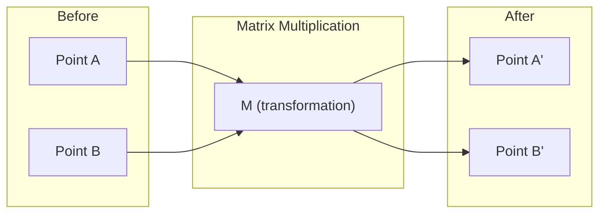
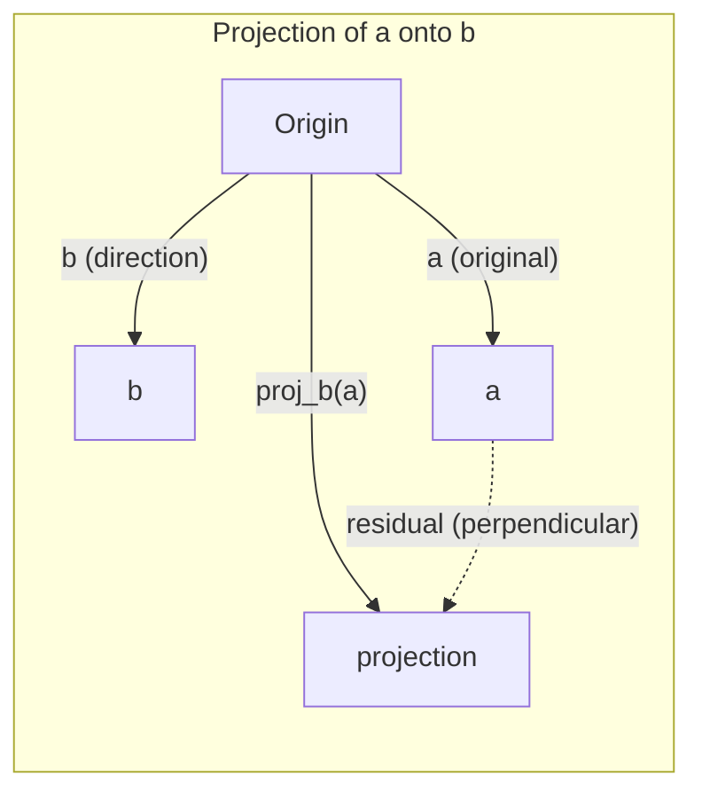

# Intuição de álgebra linear
# 线性代数直觉

> Todos os modelos de IA são apenas matemáticas de matriz usando um chapéu elegante.
> Cada modelo de IA é, em essência, um conjunto de operações usando um vestido de roupa sofisticado.

**Type:** Learn | **类型:** 学习 | **Languages:** Python, Julia | **语言:** Python, Julia | **Prerequisites:** Phase 0 | **前置知识:** Phase 0 | **Time:** ~60 minutes | **时间:** ~60 分钟

## Objetivos de aprendizagem

- Implementar operações de vetores e matrizes (adição, produto de pontos, multiplicação de matrizes) a partir do zero no Python
  Do zero realçar o volume e a matriz de operações (a)
- Explique geometricamente o que o produto de pontos, a projeção e o processo de Gram-Schmidt fazem
  Desde o ponto de vista de explicação do ponto de acumulação, projeção, significado do processo de Gram-Schmidt
- Determine a independência linear, a classificação e a base de um conjunto de vetores usando a redução de filas
  Usagem de um sistema de cálculo
- Conecte conceitos de álgebra linear às suas aplicações de IA: embalagens, pontuações de atenção e LoRA
  **将线性代数概念与 AI 应用对接：词嵌入、注意力分数、LoRA 微调**

## O problema é porque é que temos de aprender isto ?

Abre qualquer documento de ML. Na primeira página, verá vetores, matrizes, produtos de pontos e transformações. Sem a intuição de álgebra linear, estes são apenas símbolos. Com ele, você pode ver o que uma rede neural está realmente fazendo - movendo pontos no espaço.

Não é preciso ser matemático, é preciso ver o que estas operações significam geométricamente, e depois codificá-las.

> **【中文解读】**翻开任何一篇机器学习论文,第一页就会出现向量、矩阵、点积、变化──没有线性代数直觉,这些只是符号──有直觉,你就能"看穿"神经网络在做什么在空间中的移动点位置──你不需要成为数学家,只需要理解这些操作的几何含义,然后自己写代码实现──

## O conceito central.

### Vectores são pontos (e direções)

Um vetor é apenas uma lista de números. Mas esses números significam algo - são coordenadas no espaço.

**2D vector [3, 2]:**

| x | y | Point |
|---|---|-------|
| 3 | 2 | The vector points from origin (0,0) to (3, 2) on the plane |

O vetor tem magnitude sqrt ((3^2 + 2^2) = sqrt ((13) e aponta para cima e para a direita.

Na IA, vetores representam tudo:
- Uma palavra → um vetor de 768 números (seu "significado" em espaço de inserção)
- Uma imagem → um vetor de milhões de valores de pixels
- Um usuário → um vetor de preferências

> **【中文解读】**向量就是一组数字, representa um坐标 no espaço.`[3, 2]`Indicar o arco de um ponto de origem (0,0) para (3,2):
>
> **【拓展：向量在 AI 中的化身】**
> - **词嵌入 (Word Embedding)**Cada palavra se torna 768 维向量── "Rei" e "Rainha" têm um volume muito próximo, pois é um significado relacionado── é o que significa o Word2Vec、BERT、GPT.
> - **图片特征**O CNN é, em essência, em compressão gradual desse movimento.
> - **用户画像**Recomendação: Sistema de classificação de seu histórico de compra/visão em um volume preferencial, e depois encontrar o volume de mercadorias mais similar recomendado para você.

### Matrizes são transformações.

Uma matriz transforma um vetor em outro. Pode girar, escalar, esticar ou projetar.



Na IA, as matrizes são o modelo:
- Pesos de rede neural → matrizes que transformam entrada em saída
- Pontos de atenção → matrizes que decidem no que se concentrar
- Embedings → matrizes que mapeam palavras para vetores

> **【中文解读】**矩阵就是一个"变换规则": introduzir um êxodo, emitir outro êxodo.
>
> **【拓展：神经网络就是矩阵乘法的嵌套】**
> O nível de rede`output = W × input + bias`
> - W 是权重矩阵 (W)
> - entrada é input em volume ((上一层的输出)
> - Uma rede de três níveis é uma ligação de três vezes.
> - O GPT-3 tem 1750 bilhões de parâmetros, é apenas algumas centenas de matrizes gigantes.
> - **训练**= Usando a escala abaixo para ajustar os números destas matrizes

### O ponto Medidas de Produto Similaridade .

O produto de pontos de dois vetores diz-lhe o quão semelhantes são.

```
a · b = a₁×b₁ + a₂×b₂ + ... + aₙ×bₙ

Same direction:      a · b > 0  (similar)
Perpendicular:       a · b = 0  (unrelated)
Opposite direction:  a · b < 0  (dissimilar)
```

É literalmente assim que os motores de busca, os sistemas de recomendação e o RAG funcionam: encontram vetores com produtos de pontos altos.

> **【中文解读】**ponto积 = 对应分量相乘后求和──结果 > 0 方向相似,= 0 垂直无关,< 0 方向相反──
>
> **【拓展：点积是 AI 最核心的数学操作】**
> 1. **Transformer Attention**- Não .`Attention(Q,K,V) = softmax(Q·K^T / √d)·V`
>    - Q(question) 和 K(键) 的点积 = "Eu deveria preocupar-me mais com esta palavra"
>    - É o mecanismo central de todos os grandes modelos.
> 2. **RAG 检索**: transformar o problema do usuário em volume, e todos os arquivos em volume fazer ponto acumulação, encontrar os documentos mais relacionados
> 3. **推荐系统**: preferência do usuário · 商品特征向量 = 推分数
> 4. **余弦相似度**= 归一化后的点积,`cos(a,b) = a·b / (|a|×|b|)`, valor域 [-1, 1]
>    "Bí"欧氏距离"更好:只看方向不看长度, "喜欢"和"非常喜欢"语义相似

### Independência Linear não tem relação sexual.

Os vetores são linearmente independentes se nenhum vetor no conjunto pode ser escrito como uma combinação dos outros. Se v1, v2, v3 são independentes, eles abrangem um espaço 3D. Se um é uma combinação dos outros, eles apenas abrangem um plano.

Por que é importante para a IA: a matriz de características deve ter colunas linearmente independentes. Se duas características estão perfeitamente correlacionadas (linearmente dependentes), o modelo não pode distinguir os seus efeitos. Isso causa multicolinariedade na regressão - a matriz de peso se torna instável, e pequenas mudanças de entrada produz oscilações selvagens de saída.

**Concrete example:**

```
v1 = [1, 0, 0]
v2 = [0, 1, 0]
v3 = [2, 1, 0]   # v3 = 2*v1 + v2
```

V1 e v2 são independentes - nem é um múltiplo escalar ou combinação do outro. Mas v3 = 2 * v1 + v2, então {v1, v2, v3} é um conjunto dependente. Estes três vetores estão todos no plano xy. Não importa como você os combina, você não pode chegar a [0, 0, 1]. Você tem três vetores, mas apenas duas dimensões de liberdade.

Em um conjunto de dados: se feature_3 = 2*feature_1 + feature_2, adicionar feature_3 dá ao modelo zero novas informações. Pior, torna as equações normais singulares - não há solução única para os pesos.

> **【中文解读】**Uma série de volumes "linear não está ligada" = 没有任何一个能被其他向量出.
>
> Exemplo:`[1,0,0]`- Não .`[0,1,0]`- Não .`[0,0,1]`相互独立 ✓
>     `[1,0,0]`- Não .`[0,1,0]`- Não .`[2,1,0]`Não é independente.
>
> **【拓展：多重共线性问题】**
> Em dados financeiros, é muito comum: por exemplo, "preço da casa em dólares" e "preço da casa em moeda do país" são totalmente ligados,
> Além disso, colocar o modelo em um modelo pode causar um peso pouco estável.

### Base e Classe.

Uma base é um conjunto mínimo de vetores linearmente independentes que abrangem todo o espaço.

A base padrão para o espaço 3D é {[1,0,0], [0,1,0], [0,0,1]}. Mas quaisquer três vetores independentes em 3D formam uma base válida.

Rango de uma matriz = número de colunas linearmente independentes = número de linhas linearmente independentes. Se rank < min(linhas, cols), a matriz é deficiente em rank.
- O sistema tem infinitamente muitas soluções (ou nenhuma)
- Informações perdidas na transformação
- A matriz não pode ser invertida

| Situation | Rank | What it means for ML |
|-----------|------|---------------------|
| Full rank (rank = min(m, n)) | Maximum possible | Unique least-squares solution exists. Model is well-conditioned. |
| Rank deficient (rank < min(m, n)) | Below maximum | Features are redundant. Infinitely many weight solutions. Regularization needed. |
| Rank 1 | 1 | Every column is a scaled copy of one vector. All data lies on a line. |
| Near rank-deficient (small singular values) | Numerically low | Matrix is ill-conditioned. Tiny input noise causes large output changes. Use SVD truncation or ridge regression. |

> **【中文解读】**
> - **基 (Basis)**: descrever um espaço necessário do menor volume.
> - **秩 (Rank)**:矩阵中真正独立的列数 (或行数)
>
> O que é que é isso?
> Não é o que eu quero.
> O modelo está estável.
> # Há um pouco de excesso # # há muitas soluções, preciso de normalização #
> Os dados estão quase todos ligados. Todas as informações estão numa direcção.
>
> **【拓展：LoRA —— 秩在 AI 中最惊艳的应用】**
> LoRA(Low-Rank Adaptação)
> - O peso do peso original é de 4096×4096 (parâmetro de 1600 milhões)
> - 微调时,权重更新 ΔW 实际上是"低排"的(a verdadeira mudança só ocorre em algumas direções)
> - LoRA colocar ΔW dividido em duas pequenas matrizes A ((4096×16) e B ((16×4096)
> - 参数 de 1600.000 → 130.000, reduzido **99%**Mas os efeitos quase não diminuem.
> - É um exemplo de um conceito de "秩" que se transforma diretamente em realidade.

### Projeção Projeção

Vêctor de projecção **a**sobre o vetor **b**dá a componente de **a**na direcção de **b**- Não .

```
proj_b(a) = (a dot b / b dot b) * b
```

O residual (a - proj_b(a)) é perpendicular a b. Esta decomposição ortogonal é a base do ajuste de mínimos quadrados.

A projecção está em todo o ML:
- Regressão linear minimiza a distância das observações para o espaço coluna - a solução é uma projeção
- A PCA projeta dados nas direções da variância máxima
- A atenção em transformadores calcula projeções de consultas em chaves



**Example:**A) A posição de referência do produto

Proj_b(a) = (3*1 + 4*0) / (1*1 + 0*0) * [1, 0] = 3 * [1, 0] = [3, 0]

A projeção deixa cair o componente y. Isto é a redução de dimensionalidade na sua forma mais simples - jogar fora as direções que não nos importam.

> **【中文解读】**投影 = 向量在某方向上的"影子"──
> `a=[3,4]`投影到x 轴 `[1,0]`上 = `[3,0]`E depois de tudo, é só jogar a parte.
> 残差 = 原向量 - 投影 = `[0,4]`, , , , , , , , , , , , , , , , , , , , , , , , , , , , , , , , , , , , , , , , , , , , , , , , , , , , , , , , , , , , , , , , , , , , , , , , , , , , , , , , , , , , , , , , , , , , , , , , , , , , , , , , , , , , , , , , , , , , , , , , , , , , , , , , , , , , , , , , , , , , , , , , , , , , , , , , , , , , , , , , , , , , , , , , , , , , , , , , , , , , , , , , , , , , , , , , , , , , , , , , , , , , , , , , , , , , , , , , , , , , , , , , , , , , , , , , , , , , , , , , , , , , , , , , , , , , , , , , , , , , , , , , , , , , , , , , , , , , , , , , , , , , , , , , , , , , , , , , , , , , , , , , , , , , , , , , , , , , , , , , , , , , , , , , , , , , , , , , , , , , , , , , , , , , , , , , , , , , , , , , , , , , , , , , , , , , , , , , , , , , , , , , , , , , , , , , , , , , , , , , , , , , , , , , , , , , , , , , , , , , , , , , , , , , , , , , , , , , , , , , , , , , , , , , , , , , , , , , , , , , , , , , , , , , , , , , , , , , , , , , , , , , , , , , , , , , , , , , , , , , , , , , , , , , , ,
>
> **【拓展：投影与降维的关系】**
> 投影是最简单的降维抛掉不关心的方向──PCA
> Não lança direções fixas, mas encontra automaticamente a direção de "máxima diferença" para projetar.
> Colocar 1000 dimensiones de dados em projeção para 50 dimensiones, mantendo 95% da informação acima.

### O processo Gram-Schmidt está a ser transformado.

Converter qualquer conjunto de vetores independentes em uma base ortonormal. Ortonormal significa que cada vetor tem comprimento 1 e cada par é perpendicular.

O algoritmo:
1. Pegue o primeiro vetor, normalize-o
2. Pegue o segundo vetor, subtraga sua projeção para o primeiro, normalize
3. Tome o terceiro vetor, subtraia suas projeções para todos os vetores anteriores, normalize
4. Repita para vetores restantes

```
Input:  v1, v2, v3, ... (linearly independent)

u1 = v1 / |v1|

w2 = v2 - (v2 dot u1) * u1
u2 = w2 / |w2|

w3 = v3 - (v3 dot u1) * u1 - (v3 dot u2) * u2
u3 = w3 / |w3|

Output: u1, u2, u3, ... (orthonormal basis)
```

É assim que a decomposição QR funciona internamente. Q é a base ortonormal, R capta os coeficientes de projeção.
- Solução de sistemas lineares (mais estáveis do que a eliminação gaussiana)
- Calculação de valores próprios (algoritmo de RQ)
- Regressão dos mínimos quadrados (método numérico padrão)

> **【中文解读】**Colocar qualquer grupo de volumes em "vertical + longitud = 1" de padrões de normalização.
>
> 直觉: cada novo movimento primeiro é reduzido em "重合部分" da direção já existente, apenas retém o novo sentido, reintegrado.
> Como se cada bloco tivesse uma nova direção, sem a duplicação anterior.
>
> **【拓展：为什么"正交"这么重要？】**
> Se houver "combinação" entre as dimensões de base, os erros de cálculo aumentam.
> QR 分解(Gram-Schmidt's矩阵形式) é uma pedra fundamental para calcular o valor numérico:
> - NumPy 解方程 解方程 解方程 解方程 解方程 解方程 解方程 解方程 解方程 解方程 解方程 解方程 解方程 解方程 解方程 解方程 解方程 解方程 解方程 解方程 解方程 解方程 解方程 解方程 解方程 解方程 解方程 解方程 解方程 解方程 解方程 解方程 解方程 解方程 解方程 解方程 解方程 解方程 解方程 解方程 解方程 解方程 解方程 解方程 解方程 解方程 解方程 解方程 解方程 解 解方程 解方程 解方程 解 解方程 解方程 解 解方程 解 解方程 解方程 解 解方程 解 解方程 解 解方程 解 解方程 解 解 解方程 解 解方程 解 解方程 解 解 方程 解 方方程 解 解 方方方程 方程 解 解 方方方方方程 解 方程 解 方方方程 解 方方程 解 方方方方程 解 方方程 解
> - Características do algoritmo QR 代
> - Último segundo número de valores de regresso

## Construí-lo e realizei-o.
```figure
eigen-directions
```

## Construí-lo

### Passo 1: Vectores do zero (Python)

```python
class Vector:
    def __init__(self, components):
        self.components = list(components)
        self.dim = len(self.components)

    def __add__(self, other):
        return Vector([a + b for a, b in zip(self.components, other.components)])

    def __sub__(self, other):
        return Vector([a - b for a, b in zip(self.components, other.components)])

    def dot(self, other):
        # 点积：对应分量相乘后求和。AI 中最核心的相似度度量。
        return sum(a * b for a, b in zip(self.components, other.components))

    def magnitude(self):
        return sum(x**2 for x in self.components) ** 0.5

    def normalize(self):
        # 归一化：缩放到长度1。归一化后点积=余弦相似度。
        mag = self.magnitude()
        return Vector([x / mag for x in self.components])

    def cosine_similarity(self, other):
        # 余弦相似度：只看方向不看长度，值域[-1,1]
        return self.dot(other) / (self.magnitude() * other.magnitude())

    def __repr__(self):
        return f"Vector({self.components})"


a = Vector([1, 2, 3])
b = Vector([4, 5, 6])

print(f"a + b = {a + b}")
print(f"a · b = {a.dot(b)}")
print(f"|a| = {a.magnitude():.4f}")
print(f"cosine similarity = {a.cosine_similarity(b):.4f}")
```

### Passo 2: Matrizes do zero (Python)

```python
class Matrix:
    def __init__(self, rows):
        self.rows = [list(row) for row in rows]
        self.shape = (len(self.rows), len(self.rows[0]))

    def __matmul__(self, other):
        # 矩阵乘法 = 神经网络一层的前向传播
        if isinstance(other, Vector):
            return Vector([
                sum(self.rows[i][j] * other.components[j] for j in range(self.shape[1]))
                for i in range(self.shape[0])
            ])
        rows = []
        for i in range(self.shape[0]):
            row = []
            for j in range(other.shape[1]):
                row.append(sum(
                    self.rows[i][k] * other.rows[k][j]
                    for k in range(self.shape[1])
                ))
            rows.append(row)
        return Matrix(rows)

    def transpose(self):
        return Matrix([
            [self.rows[j][i] for j in range(self.shape[0])]
            for i in range(self.shape[1])
        ])

    def __repr__(self):
        return f"Matrix({self.rows})"


rotation_90 = Matrix([[0, -1], [1, 0]])
point = Vector([3, 1])

rotated = rotation_90 @ point
print(f"Original: {point}")
print(f"Rotated 90°: {rotated}")
```

### Passo 3: Por que isto importa para a IA.

```python
import random

random.seed(42)
weights = Matrix([[random.gauss(0, 0.1) for _ in range(3)] for _ in range(2)])
input_vector = Vector([1.0, 0.5, -0.3])

output = weights @ input_vector
print(f"Input (3D): {input_vector}")
print(f"Output (2D): {output}")
print("This is what a neural network layer does -- matrix multiplication.")
# 矩阵乘法：3维输入 → 2维输出。这就是神经网络一层的全部计算。
# 一个真正的网络就是把很多这样的层串起来，每层都有一个权重矩阵。
```

### Passo 4: versão Julia.

```julia
a = [1.0, 2.0, 3.0]
b = [4.0, 5.0, 6.0]

println("a + b = ", a + b)
println("a · b = ", a ⋅ b)       # Julia supports unicode operators
println("|a| = ", √(a ⋅ a))
println("cosine = ", (a ⋅ b) / (√(a ⋅ a) * √(b ⋅ b)))

# Matrix-vector multiplication
W = [0.1 -0.2 0.3; 0.4 0.5 -0.1]
x = [1.0, 0.5, -0.3]
println("Wx = ", W * x)
println("This is a neural network layer.")
```

### Passo 5: Independência linear e projeção a partir do zero (Python)

```python
def is_linearly_independent(vectors):
    # 高斯消元法：把向量排成矩阵，化简，看秩是否等于向量个数
    n = len(vectors)
    dim = len(vectors[0].components)
    mat = Matrix([v.components[:] for v in vectors])
    rows = [row[:] for row in mat.rows]
    rank = 0
    for col in range(dim):
        pivot = None
        for row in range(rank, len(rows)):
            if abs(rows[row][col]) > 1e-10:
                pivot = row
                break
        if pivot is None:
            continue
        rows[rank], rows[pivot] = rows[pivot], rows[rank]
        scale = rows[rank][col]
        rows[rank] = [x / scale for x in rows[rank]]
        for row in range(len(rows)):
            if row != rank and abs(rows[row][col]) > 1e-10:
                factor = rows[row][col]
                rows[row] = [rows[row][j] - factor * rows[rank][j] for j in range(dim)]
        rank += 1
    return rank == n


def project(a, b):
    # 投影：a 在 b 方向上的"影子"
    scalar = a.dot(b) / b.dot(b)
    return Vector([scalar * x for x in b.components])


def gram_schmidt(vectors):
    # 正交化：每个向量减去在已有方向上的投影，只保留新方向
    orthonormal = []
    for v in vectors:
        w = v
        for u in orthonormal:
            proj = project(w, u)
            w = w - proj
        if w.magnitude() < 1e-10:
            continue
        orthonormal.append(w.normalize())
    return orthonormal


v1 = Vector([1, 0, 0])
v2 = Vector([1, 1, 0])
v3 = Vector([1, 1, 1])
basis = gram_schmidt([v1, v2, v3])
for i, u in enumerate(basis):
    print(f"u{i+1} = {u}")
    print(f"  |u{i+1}| = {u.magnitude():.6f}")

print(f"u1 · u2 = {basis[0].dot(basis[1]):.6f}")
print(f"u1 · u3 = {basis[0].dot(basis[2]):.6f}")
print(f"u2 · u3 = {basis[1].dot(basis[2]):.6f}")
```

## Usa-o com a estrutura para a realização da maneira que vais usar na guerra real)

Agora a mesma coisa com o NumPy -- o que realmente usará na prática:
Agora, com o NumPy, fazemos o que fazemos.

```python
import numpy as np

a = np.array([1, 2, 3], dtype=float)
b = np.array([4, 5, 6], dtype=float)

print(f"a + b = {a + b}")
print(f"a · b = {np.dot(a, b)}")
print(f"|a| = {np.linalg.norm(a):.4f}")
print(f"cosine = {np.dot(a, b) / (np.linalg.norm(a) * np.linalg.norm(b)):.4f}")

W = np.random.randn(2, 3) * 0.1
x = np.array([1.0, 0.5, -0.3])
print(f"Wx = {W @ x}")
```

### Rank, Projeção e QR com NumPy 秩、投影和QR 分解

```python
import numpy as np

A = np.array([[1, 2], [2, 4]])
print(f"Rank: {np.linalg.matrix_rank(A)}")  # 秩=1，第2行是第1行的2倍

a = np.array([3, 4])
b = np.array([1, 0])
proj = (np.dot(a, b) / np.dot(b, b)) * b
print(f"Projection of {a} onto {b}: {proj}")

Q, R = np.linalg.qr(np.random.randn(3, 3))  # QR 分解 = Gram-Schmidt 的矩阵形式
print(f"Q is orthogonal: {np.allclose(Q @ Q.T, np.eye(3))}")  # Q 正交
print(f"R is upper triangular: {np.allclose(R, np.triu(R))}")  # R 上三角
```

### PyTorch -- Tensores são vetores com Autodiff

```python
import torch

x = torch.randn(3, requires_grad=True)  # 3维向量，开启自动求导
y = torch.tensor([1.0, 0.0, 0.0])

similarity = torch.dot(x, y)  # 点积
similarity.backward()          # 自动求导！

print(f"x = {x.data}")
print(f"y = {y.data}")
print(f"dot product = {similarity.item():.4f}")
print(f"d(dot)/dx = {x.grad}")  # 梯度 = y 本身，因为 d(x·y)/dx = y
```

> **【拓展：自动求导的魔法】**
> PyTorch `backward()`Automaticamente calculado a gradiente d ((x·y) / dx = y。
> O treinamento de rede de neurônios = 反复做:
> 1. 前向传播 (fazer uma série de passagens)
> 2. 计算损失 (título)
> 3. Contrário à divulgação`backward()`Automática de cada gravidade)
> 4. 更新权重(梯度下降)
> § 2o-3o passo depende totalmente da "autotráfica", enquanto a base matemática da autotráfica é a lei da cadeia.

O gradiente do produto de pontos em relação a x é apenas y. PyTorch calculou isso automaticamente. Toda operação em uma rede neural é construída a partir de operações como esta - multiplicadores de matriz, produtos de pontos, projeções - e auto-difusão rastreia gradientes através de todos eles.

Construiste do zero o que o NumPy faz numa linha.
Você acabou de realizar o que NumPy fez desde o zero. Agora sabe o que aconteceu no fundo.

## Envia-o . Produto .

Esta lição produz:
- `outputs/prompt-linear-algebra-tutor.md`-- um aviso para os assistentes de IA para ensinar álgebra linear através da intuição geométrica

## Conexões Conceptos

Tudo nesta lição está ligado a partes específicas da IA moderna:
Esta aula tem um conceito que se refere diretamente a um componente da IA moderna:

| Concept 概念 | Where it shows up 在 AI 中的位置 |
|---------|------------------|
| Dot product 点积 | Attention scores in transformers, cosine similarity in RAG / Transformer 的注意力分数、RAG 的余弦相似度 |
| Matrix multiply 矩阵乘法 | Every neural network layer, every linear transformation / 神经网络的每一层 |
| Linear independence 线性无关 | Feature selection, avoiding multicollinearity / 特征选择、避免多重共线性 |
| Rank 秩 | Determining if a system is solvable, LoRA (low-rank adaptation) / 方程可解性判断、LoRA 微调 |
| Projection 投影 | Linear regression (projecting onto column space), PCA / 线性回归、PCA 降维 |
| Gram-Schmidt / QR | Numerical solvers, eigenvalue computation / 数值求解器、特征值计算 |
| Orthonormal basis 正交基 | Stable numerical computation, whitening transforms / 数值稳定计算、白化变换 |

A LoRA merece uma menção especial. Ele sintoniza os modelos de linguagem grandes, decomponendo as atualizações de peso em matrizes de baixo nível. Em vez de atualizar uma matriz de peso 4096x4096 (16M parâmetros), a LoRA atualiza duas matrizes de tamanho 4096x16 e 16x4096 (131K parâmetros). A restrição de classificação 16 significa que o LoRA assume que a atualização de peso vive num subespaço 16 dimensiones do espaço completo de 4096 dimensiones. É álgebra linear a fazer trabalho real.

> **【中文解读】LoRA 特别值得一提。**Ele disse que o processo de micro-realização do grande modelo é dividido em quadros de baixo nível.
> Originally to update 4096×4096 de peso de matrizes ((16 milhões de parentes),
> LoRA apenas actualiza 4096×16 e 16×4096 两个小矩阵
> "秩=16" significa: o poder de actualizar realmente ocorre apenas em 16 direções, e não em um espaço completo de 4096 dimensões.
> É a aplicação mais lucrativa do factor linear na IA que permite que o sistema de visualização comum também possa micro-modular o modelo.

## Exercícios.

1. Implementação `Vector.angle_between(other)`que retorna o ângulo em graus entre dois vetores
   **实现计算两向量夹角的方法（返回角度）**
2. Criar uma matriz de escala 2D que dobra a coordenada x e triplica a coordenada y, em seguida, aplicá-la ao vetor [1, 1]
   **创建一个 2D 缩放矩阵（x坐标翻倍，y坐标三倍），应用到向量 [1, 1]**
3. Dados 5 vetores aleatórios semelhantes a palavras (dimensão 50), encontrar os dois mais semelhantes usando similaridade cosínica
   **给定5个随机50维"词向量"，用余弦相似度找最相似的2个**
4. Verifique se a saída de Gram-Schmidt é verdadeiramente ortônormal: verifique se cada par tem produto ponto 0 e cada vetor tem magnitude 1
   **验证 Gram-Schmidt 输出确实正交：任意两个点积=0，每个长度=1**
5. Crie uma matriz 3x3 com o rango 2. Verifique usando o `rank()`Então, explique que objeto geométrico as colunas abrangem.
   **构造一个秩为2的3×3矩阵，验证秩，解释它的列向量张成什么几何体（答案：一个平面）**
6. Projete o vetor [1, 2, 3] para [1, 1, 1].
   **把 [1,2,3] 投影到 [1,1,1] 上，几何含义是什么？（答案：在对角线方向上的分量）**

## Termos-chave .

| Term 英文 | What people say 常见误解 | What it actually means 准确含义 |
|------|----------------|----------------------|
| Vector 向量 | "An arrow 一根箭头" | A list of numbers representing a point or direction in n-dimensional space / n维空间中的点或方向 |
| Matrix 矩阵 | "A table of numbers 一堆数字" | A transformation that maps vectors from one space to another / 把向量从一个空间映射到另一个空间的变换 |
| Dot product 点积 | "Multiply and sum 乘完加起来" | A measure of how aligned two vectors are -- the core of similarity search / 衡量对齐程度——相似度搜索的核心 |
| Embedding 嵌入 | "Some AI magic AI魔法" | A vector that represents the meaning of something (word, image, user) / 表示事物"意义"的向量 |
| Linear independence 线性无关 | "They don't overlap 不重叠" | No vector in the set can be written as a combination of the others / 没有向量能用其他向量凑出来 |
| Rank 秩 | "How many dimensions 几个维度" | The number of linearly independent columns (or rows) in a matrix / 独立列（行）的数量 |
| Projection 投影 | "The shadow 影子" | The component of one vector in the direction of another / 一个向量在另一个方向上的分量 |
| Basis 基 | "The coordinate axes 坐标轴" | A minimal set of independent vectors that span the space / 张成整个空间的最少独立向量 |
| Orthonormal 正交归一 | "Perpendicular unit vectors 垂直单位向量" | Vectors that are mutually perpendicular and each have length 1 / 互相垂直且长度各为1 |
