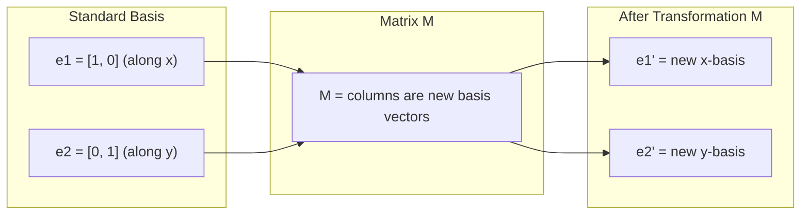
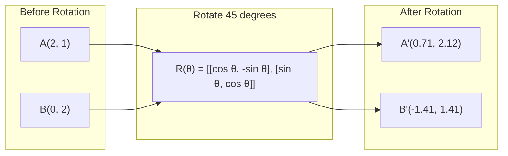
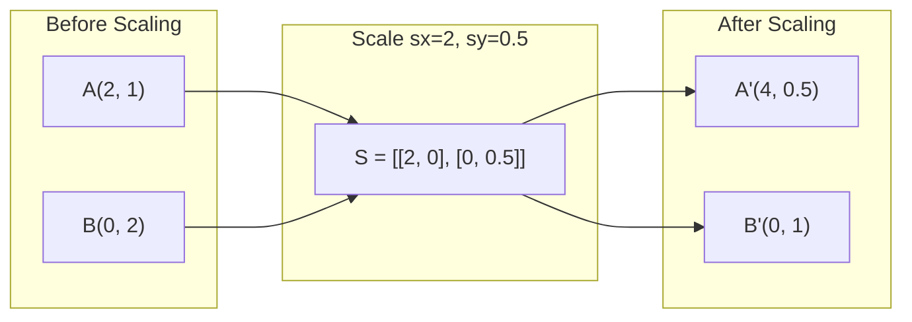
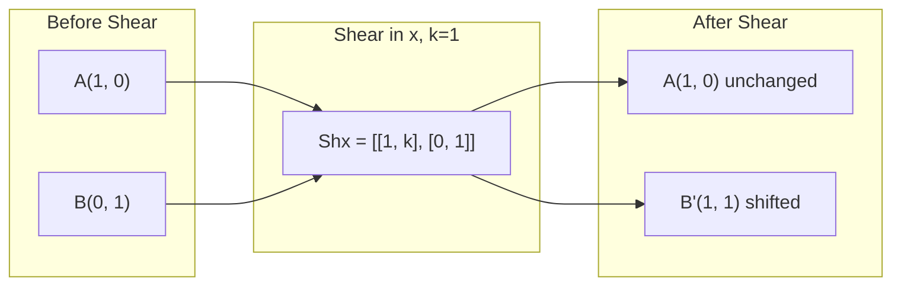
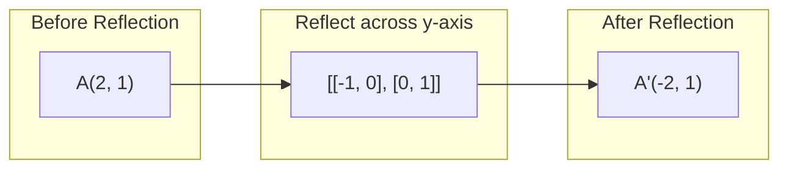
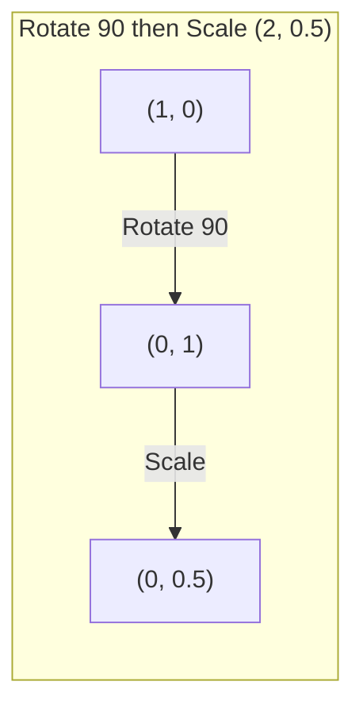
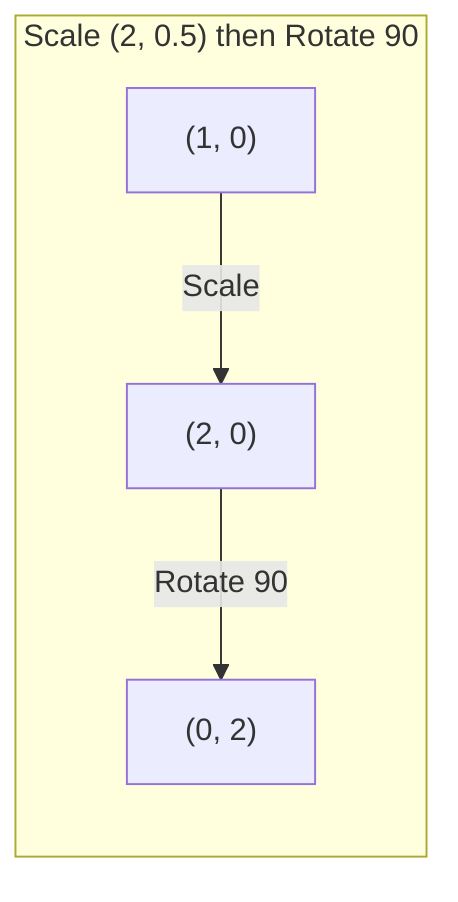

# Transformações Matriz.

> Uma matriz é uma máquina que remodela o espaço. Aprenda o que faz a cada ponto, e você entende toda a transformação.

> A matriz é uma máquina de "espaço de reformulação". Entender o seu papel em cada ponto, compreende toda a mudança.

**Type:** Build | **类型:** 动手
**Languages:** Python, Julia | **语言:** Python, Julia
**Prerequisites:** Phase 1, Lessons 01-02 (Linear Algebra Intuition, Vectors & Matrices Operations) | **前置知识:** Phase 1, Lessons 01-02（线性代数直觉、向量与矩阵运算）
**Time:** ~75 minutes | **时间:** ~75 分钟

## Objetivos de aprendizagem

- Construir matrizes de rotação, escalagem, corte e reflecção e aplicá-las a pontos 2D e 3D
  Construção de rotação, enrolamento, corte, reflecção e aplicação de pontos 2D e 3D
- Compõem múltiplas transformações por multiplicação de matriz e verifiquem que a ordem importa
  通过矩阵乘法组合多变,验证顺序的重要性
- Compute valores próprios e vetores próprios de matrizes 2x2 a partir da equação característica
  Calculação do valor de características e da quantidade de características da matriz de 2x2
- Explique por que os valores próprios determinam as direções do PCA, a estabilidade do RNN e o comportamento de agrupamento espectral
  解释特征值为何决定 PCA 方向、RNN 稳定性和谱聚类行为

> **【中文解读】**
> A matriz é a mudança do espaço, a rotação, a encolhimento, a corte, a transformação. Após entender o significado geométrico da matriz, a PCA, a RNN, a estabilidade, a coleção de espectros, estes conceitos se tornaram intuitivos.

> **【拓展：特征值/特征向量在 AI 中的位置】**
> - **PCA（主成分分析）** encontrar a trajetória da matriz de data compartilha, é a direção máxima da data compartilha.
> - **RNN 稳定性**Se o valor absoluto do peso da matriz for superior a 1, o índice de gradiência aumentará; menor do que 1 diminuirá para zero.
> - **谱聚类**: Utilize a trajetória de características da matriz de Tulapras para fazer aglutinação, em comparação com K-Means mais adequada a dados não-esféricos.

## O problema é o problema da introdução

> **【中文解读】**O PCA diz que "encontrar os traços de um conjunto de matrizes", o modelo de estabilidade diz que "verificar se o valor de um conjunto de matrizes é menor que 1", o dados aumentam diz que "a rotatividade" é necessária para entender as mudanças geográficas da matriz no espaço.

## O conceito central.

> **【拓展：Transformer 中的矩阵变换】**Cada atenção do transformador está em fazer mudanças em uma matriz: Q=W_q·x, K=W_k·x, V=W_v·x, entre as quais W_q/W_k/W_v é um processo de mudança de matriz que pode ser aprendido. O processo de treinamento do modelo é o processo de aprendizagem automática da "melhor mudança".

### Transformações como matrizes

Cada transformação linear em 2D pode ser escrita como uma matriz 2x2. A matriz diz-lhe exatamente onde os vetores base [1, 0] e [0, 1] terminam. Tudo o resto segue.

> Cada mudança de linha no espaço pode ser escrita em uma 2x2 矩阵──矩阵告诉你基向量 [1, 0] 和 [0, 1] 变到了哪里, 剩余一切由此决定──

> 矩阵的列就是变换后的基向量──如果矩阵第一列是 [2, 0],说明 e1=[1,0] 被映射到 [2,0](沿 x 轴拉伸 2 倍)──



### Rotatividade

Uma rotação 2D por ângulo theta mantém as distâncias e ângulos intactos.

> Os dois dimensões de rotação mantêm a distância e o ângulo inalterados, movendo-se em cada ponto ao longo do arco de círculo.

> 旋转矩阵 R(θ) = [[cosθ, -sinθ], [sinθ, cosθ]]。θ 为正表示逆时针旋转。R^T = R^(-1),转置即逆旋转。



Em 3D, você gira em torno de um eixo.

> Em três dimensões, você gira em torno de um eixo. Cada eixo tem sua própria rotatividade.

```
Rz(theta) = | cos  -sin  0 |     Rotate around z-axis
            | sin   cos  0 |     (x-y plane spins, z stays)
            |  0     0   1 |

Rx(theta) = | 1   0     0    |   Rotate around x-axis
            | 0  cos  -sin   |   (y-z plane spins, x stays)
            | 0  sin   cos   |

Ry(theta) = |  cos  0  sin |     Rotate around y-axis
            |   0   1   0  |     (x-z plane spins, y stays)
            | -sin  0  cos |
```

### Escalada

O estiramento de escala é feito ou comprimido ao longo de cada eixo de forma independente.

> 缩放沿每个轴独立地拉伸或压缩──

> 缩放矩阵 S = [[sx, 0], [0, sy]]―sx、sy pode ser diferente──



### Tesouro

A corte inclinou um eixo mantendo o outro fixo, transformando retângulos em paralelogramas.

> 切切使一轴倾斜而保持另一轴固定,将矩形变成平行四边形.

> 剪切保持面积不变(行列式=1) ・・・ Imagine a 克牌向一边推:底牌不动,顶牌平移──



Matrizes de corte:
- `Shx = [[1, k], [0, 1]]`mudanças x por k * y
- `Shy = [[1, 0], [k, 1]]`mudanças de y por k * x

> 剪切矩阵:`Shx`沿 y 偏移 x(x 新 = x + k*y),`Shy`沿 x 偏移 y(y 新 = y + k*x) 』

### Reflexão

Os pontos de reflexo refletem pontos através de um eixo ou linha.

> Reflexão será ponto sobre um eixo ou linha fazer imagem.

> Refleção alterando direção (~1~1~) mas mantendo a distância.



Matriz de reflecção:
- Refletir através do eixo y: `[[-1, 0], [0, 1]]`
- Refletir através do eixo x: `[[1, 0], [0, -1]]`

> Sobre o eixo de reflexo`[[-1, 0], [0, 1]]`, sobre o reflexo x 轴 `[[1, 0], [0, -1]]`- Não.

### Composição: transformações de cadeia

Aplicar a transformação A e depois B é o mesmo que multiplicar suas matrizes: `result = B @ A @ point`A ordem é importante. A rotação da escala dá resultados diferentes da escala da rotação.

> Primeiro fazer mudança A, depois fazer mudança B é igual a multiplicar a matriz deles:`result = B @ A @ point`◊ A ordem é importante  O resultado da primeira rotação é diferente do resultado da primeira rotação 

> É por isso que a sequência de não-pito de PyTorch é aplicada de forma rigorosa nos módulos, e a sequência de matrizes multiplicadas é aplicada em reversa em transmissão automática.



Composto: `S @ R = [[0, -2], [0.5, 0]]`

> 先旋转 90° 再缩放 (2, 0.5): de (1,0) → 旋转后 (0,1) → 缩放后 (0, 0.5)──组合矩阵 S @ R = [[0, -2], [0,5, 0]]──



Composto: `R @ S = [[0, -0.5], [2, 0]]`

> Antes de acentuar (2, 0,5) Recorrido 90°: de (1,0) → 缩放后 (2, 0) → 旋转后 (0, 2) ――组合矩阵 R @ S = [[0, -0,5], [2, 0]],与上完全不同──

Multiplicação de matriz não é commutativa.

> 结果不同──矩阵乘法不满足交换律这就是为什么变压器注意力中 Q、K、V 的相乘顺序至关重要──

### Valores próprios e vetores próprios

A maioria dos vetores muda de direção quando uma matriz os atinge. Os vetores próprios são especiais: a matriz apenas os escala, nunca os gira. O fator de escala é o valor próprio.

> A maioria dos vectores é alterada por uma matriz, mas depois de mudar de direção.

> 几何直觉: característico de um movimento é a direção de um movimento em um movimento.

```
A @ v = lambda * v

v is the eigenvector (direction that survives)
lambda is the eigenvalue (how much it stretches)

Example: A = | 2  1 |
             | 1  2 |

Eigenvector [1, 1] with eigenvalue 3:
  A @ [1,1] = [3, 3] = 3 * [1, 1]     (same direction, scaled by 3)

Eigenvector [1, -1] with eigenvalue 1:
  A @ [1,-1] = [1, -1] = 1 * [1, -1]  (same direction, unchanged)
```

A matriz estende o espaço por 3x ao longo de [1, 1] e mantém [1, -1] inalterado.

> O rectângulo ao longo do [1, 1] direção é 3 vezes maior, mantendo o [1, -1] direção invariavel. Todas as outras direções são uma combinação destas duas direções.

### Composição própria

Se uma matriz tiver n vetores próprios linearmente independentes, ela pode ser decomposta:

> Se a matriz tiver n 个线性无关特征向量, pode ser dividida em A = V D V−1──

> Tráfico de desintegração geométrica: transformar qualquer alteração em desintegração para "rotar em rotas de rotas de rotas de rotas de rotas de rotas de rotas de rotas de rotas de rotas de rotas de rotas de rotas de rotas de rotas de rotas de rotas de rotas de rotas de rotas de rotas de rotas de rotas de rotas de rotas de rotas de rotas de rotas de rotas de rotas de rotas de rotas de rotas de rotas de rotas de rotas de rotas de rotas de rotas de rotas de rotas de rotas de rotas de rotas de rotas de rotas de rotas de rotas de rotas de rotas de rotas de rotas de rotas de rotas de rotas de rotas de rotas de rotas de rotas de rotas de rotas de rotas de rotas de rotas de rotas de rotas de rotas de rotas de rotas de rotas de rotas de rotas de rotas de rotas de rotas de rotas de rotas de rotas de rotas de rotas de rotas de rotas de rotas de rotas de rotas de rotas de rotas de rotas de rotas de rotas de rotas de rotas de rotas de rotas de rotas de rotas de rotas de rotas de rotas de rotas de rotas de rotas de rotas de rotas de rotas de rotas de rotas de rotas de rotas de rotas de rotas de rotas de rotas de rotas de rotas de rotas de rotas de rotas de rotas de rotas de rotas de rotas de rotas de rotas de rotas de rotas de rotas de rotas de rotas de rotas de rotas de rotas de rotas de rotas de rotas de rotas de rotas de rotas de rotas de rotas de rotas de rotas de rotas de rotas de rotas de rotas de rotas de rotas de rotas de rotas de rotas de rotas de rotas de rotas de rotas de rotas de rotas de rotas.

```
A = V @ D @ V^(-1)

V = matrix whose columns are eigenvectors
D = diagonal matrix of eigenvalues
V^(-1) = inverse of V

This says: rotate into eigenvector coordinates, scale along each axis, rotate back.
```

> Isto significa: girar para o sistema de rotatividade, em cada eixo de encolhimento, voltar a girar.

### Por que os valores próprios importam

**PCA.**Os vetores próprios da matriz de covariância são os componentes principais. Os valores próprios dizem-lhe quanta variância cada componente capta.

> **PCA（主成分分析）。**O valor da característica da matriz de diferença é o componente principal, o valor da característica diz-lhe quanto diferença de cada componente principal foi capturada.

**Stability.**Em redes recorrentes e sistemas dinâmicos, os valores próprios com magnitude > 1 causam explosões de saídas.

> **稳定性。**Em redes e sistemas de energia circular, o valor de característica absolutamente > 1 causa a explosão de saída,< 1 causa a desaparição.

**Spectral methods.**As redes neurais de gráficos usam os valores próprios da matriz adjacente. O agrupamento espectral usa os valores próprios do laplaciano. Os próprios vetores revelam a estrutura do gráfico.

> **谱方法。**图神经网络使用邻属矩阵的特征值,谱聚类使用拉普拉斯矩阵的特征值――特征向量揭示图的结构──

### Determinante como fator de escalagem de volume

O determinante de uma matriz de transformação diz-lhe o quanto ele escala área (2D) ou volume (3D).

> A linha de mudança de matriz diz-lhe que é reduzida em 2D ou 3D.

> det=0 é "catastrophe"矩阵把空间压缩到低维(如 2D → 1D 线), informação perdida,矩阵不可逆── quando iniciação da rede nervosa é necessário evitar que o peso da矩阵 se aproxime de estranhos──

```
det = 1:   area preserved (rotation)
det = 2:   area doubled
det = 0:   space crushed to lower dimension (singular)
det = -1:  area preserved but orientation flipped (reflection)

| det(Rotation) | = 1        (always)
| det(Scale sx, sy) | = sx * sy
| det(Shear) | = 1           (area preserved)
| det(Reflection) | = -1     (orientation flipped)
```

> 行列式含义:det=1 保面积(旋转);det=2 面积翻倍;det=0 空间崩缩到低维(奇异,矩阵不可逆);det=-1 保面积但翻转方向(反射) ・・・

## Construí-lo e realizei-o.
```figure
matrix-transform
```

## Construí-lo

### Passo 1: Matriz de transformação a partir do zero (Python)

> 第1步: desde zero realizando mudança de matrizes

> Desde zero, a rotação é reduzida, cortada, reproduzida, todas as mudanças são 2x2 em uma mesma matriz.

```python
import math

def rotation_2d(theta):
    c, s = math.cos(theta), math.sin(theta)
    return [[c, -s], [s, c]]

def scaling_2d(sx, sy):
    return [[sx, 0], [0, sy]]

def shearing_2d(kx, ky):
    return [[1, kx], [ky, 1]]

def reflection_x():
    return [[1, 0], [0, -1]]

def reflection_y():
    return [[-1, 0], [0, 1]]

def mat_vec_mul(matrix, vector):
    return [
        sum(matrix[i][j] * vector[j] for j in range(len(vector)))
        for i in range(len(matrix))
    ]

def mat_mul(a, b):
    rows_a, cols_b = len(a), len(b[0])
    cols_a = len(a[0])
    return [
        [sum(a[i][k] * b[k][j] for k in range(cols_a)) for j in range(cols_b)]
        for i in range(rows_a)
    ]

point = [1.0, 0.0]
angle = math.pi / 4

rotated = mat_vec_mul(rotation_2d(angle), point)
print(f"Rotate (1,0) by 45 deg: ({rotated[0]:.4f}, {rotated[1]:.4f})")

scaled = mat_vec_mul(scaling_2d(2, 3), [1.0, 1.0])
print(f"Scale (1,1) by (2,3): ({scaled[0]:.1f}, {scaled[1]:.1f})")

sheared = mat_vec_mul(shearing_2d(1, 0), [1.0, 1.0])
print(f"Shear (1,1) kx=1: ({sheared[0]:.1f}, {sheared[1]:.1f})")

reflected = mat_vec_mul(reflection_y(), [2.0, 1.0])
print(f"Reflect (2,1) across y: ({reflected[0]:.1f}, {reflected[1]:.1f})")
```

### Passo 2: Composição das transformações

> 第2步: mudanças de composição

> 验证矩阵乘法不可交换:先旋转90° 再缩放 (2, 0.5) e先缩放再旋转 obtiveram resultados completamente diferentes.

```python
R = rotation_2d(math.pi / 2)
S = scaling_2d(2, 0.5)

rotate_then_scale = mat_mul(S, R)
scale_then_rotate = mat_mul(R, S)

point = [1.0, 0.0]
result1 = mat_vec_mul(rotate_then_scale, point)
result2 = mat_vec_mul(scale_then_rotate, point)

print(f"Rotate 90 then scale: ({result1[0]:.2f}, {result1[1]:.2f})")
print(f"Scale then rotate 90: ({result2[0]:.2f}, {result2[1]:.2f})")
print(f"Same? {result1 == result2}")
```

> 验证: Primeiro giro depois de aglutinar, o resultado é diferente do primeiro aglutinar após o giro.

### Passo 3: Valores próprios a partir do zero (2x2)

> 第3步: do valor de caracteres de cálculo zero

> 2x2 矩阵的特征值通过解二次方程 λ2 - trace·λ + det = 0 得到, em que trace=a+d,det=ad-bc──特征向量通过 (A - λI) v = 0 求解──

Para uma matriz 2x2 `[[a, b], [c, d]]`, os valores próprios resolvem a equação característica: `lambda^2 - (a+d)*lambda + (ad - bc) = 0`- Não .

> Para 2x2 矩阵 `[[a, b], [c, d]]`,特征值满足特征方程 λ2 - (a+d)λ + (ad-bc) = 0──其中 (a+d) 是迹(trace),(ad-bc) 是行列式──

```python
def eigenvalues_2x2(matrix):
    a, b = matrix[0]
    c, d = matrix[1]
    trace = a + d
    det = a * d - b * c
    discriminant = trace ** 2 - 4 * det
    if discriminant < 0:
        real = trace / 2
        imag = (-discriminant) ** 0.5 / 2
        return (complex(real, imag), complex(real, -imag))
    sqrt_disc = discriminant ** 0.5
    return ((trace + sqrt_disc) / 2, (trace - sqrt_disc) / 2)

def eigenvector_2x2(matrix, eigenvalue):
    a, b = matrix[0]
    c, d = matrix[1]
    if abs(b) > 1e-10:
        v = [b, eigenvalue - a]
    elif abs(c) > 1e-10:
        v = [eigenvalue - d, c]
    else:
        if abs(a - eigenvalue) < 1e-10:
            v = [1, 0]
        else:
            v = [0, 1]
    mag = (v[0] ** 2 + v[1] ** 2) ** 0.5
    return [v[0] / mag, v[1] / mag]

A = [[2, 1], [1, 2]]
vals = eigenvalues_2x2(A)
print(f"Matrix: {A}")
print(f"Eigenvalues: {vals[0]:.4f}, {vals[1]:.4f}")

for val in vals:
    vec = eigenvector_2x2(A, val)
    result = mat_vec_mul(A, vec)
    scaled = [val * vec[0], val * vec[1]]
    print(f"  lambda={val:.1f}, v={[round(x,4) for x in vec]}")
    print(f"    A@v = {[round(x,4) for x in result]}")
    print(f"    l*v = {[round(x,4) for x in scaled]}")
```

> 验证 A=[[2,1],[1,2]] 的特征值是3 和 1,对应特征向量 [1,1]/√2 和 [1,-1]/√2。验证 A@v = λ×v 成立。

### Passo 4: Determinante como fator de escala de volume

> 第4步:行列式 como um fator de volume

```python
def det_2x2(matrix):
    return matrix[0][0] * matrix[1][1] - matrix[0][1] * matrix[1][0]

print(f"det(rotation 45) = {det_2x2(rotation_2d(math.pi/4)):.4f}")
print(f"det(scale 2,3)   = {det_2x2(scaling_2d(2, 3)):.1f}")
print(f"det(shear kx=1)  = {det_2x2(shearing_2d(1, 0)):.1f}")
print(f"det(reflect y)   = {det_2x2(reflection_y()):.1f}")

singular = [[1, 2], [2, 4]]
print(f"det(singular)     = {det_2x2(singular):.1f}")
print("Singular: columns are proportional, space collapses to a line.")
```

> Exemplo de uma linha de rotas estranha: [1, 2], [2, 4]] de rotas são 0, pois duas rotas são proporcionais.

## Use-o com o framework implementado.

O NumPy lida com tudo isto com rotinas otimizadas.

> NumPy utiliza o processo de tratamento de todos estes processos.

> NumPy `np.linalg.eig`和 `np.linalg.det`底层调用 LAPACK(C/Fortran 写的线性代数库),比手写 Python 快 100-1000 倍──

```python
import numpy as np

theta = np.pi / 4
R = np.array([[np.cos(theta), -np.sin(theta)],
              [np.sin(theta),  np.cos(theta)]])

point = np.array([1.0, 0.0])
print(f"Rotate (1,0) by 45 deg: {R @ point}")

S = np.diag([2.0, 3.0])
composed = S @ R
print(f"Scale(2,3) after Rotate(45): {composed @ point}")

A = np.array([[2, 1], [1, 2]], dtype=float)
eigenvalues, eigenvectors = np.linalg.eig(A)
print(f"\nEigenvalues: {eigenvalues}")
print(f"Eigenvectors (columns):\n{eigenvectors}")

for i in range(len(eigenvalues)):
    v = eigenvectors[:, i]
    lam = eigenvalues[i]
    print(f"  A @ v{i} = {A @ v}, lambda * v{i} = {lam * v}")

print(f"\ndet(R) = {np.linalg.det(R):.4f}")
print(f"det(S) = {np.linalg.det(S):.1f}")

B = np.array([[3, 1], [0, 2]], dtype=float)
vals, vecs = np.linalg.eig(B)
D = np.diag(vals)
V = vecs
reconstructed = V @ D @ np.linalg.inv(V)
print(f"\nEigendecomposition A = V @ D @ V^-1:")
print(f"Original:\n{B}")
print(f"Reconstructed:\n{reconstructed}")
```

> Features decomposição verificativo:A = V @ D @ V−1 应能完美重建原矩阵── isto prova que qualquer rectângulo de angularidade pode ser decomposto em "rotar → encolher → 旋回来" 三步──

### Rotatividade 3D com NumPy

```python
def rotation_3d_z(theta):
    c, s = np.cos(theta), np.sin(theta)
    return np.array([[c, -s, 0], [s, c, 0], [0, 0, 1]])

def rotation_3d_x(theta):
    c, s = np.cos(theta), np.sin(theta)
    return np.array([[1, 0, 0], [0, c, -s], [0, s, c]])

point_3d = np.array([1.0, 0.0, 0.0])
rotated_z = rotation_3d_z(np.pi / 2) @ point_3d
rotated_x = rotation_3d_x(np.pi / 2) @ point_3d

print(f"\n3D point: {point_3d}")
print(f"Rotate 90 around z: {np.round(rotated_z, 4)}")
print(f"Rotate 90 around x: {np.round(rotated_x, 4)}")
```

> NumPy  Realizar 3D  rotatória: circunvalentes axios e circunvalentes x axios de cada um têm 3x3  rotatória independente  3D  gráficos 机器人学 计算机视觉都依赖这些矩阵 

## Envia-o . Produto .

Esta lição constrói a base geométrica para PCA (Fase 2) e análise de peso da rede neural. O código de valor próprio / eigenvector construído aqui é o mesmo algoritmo que alimenta a redução de dimensionalidade, agrupamento espectral e análise de estabilidade em sistemas de produção ML.

> Esta aula construiu a geografia da PCA (Fase 2) e da análise de peso de rede neural.

> O código pode ser usado diretamente para entender PCA, grupos de grupos de grupos de grupos de grupos de grupos de grupos de grupos de grupos de grupos de grupos de grupos de grupos de grupos de grupos de grupos de grupos de grupos de grupos de grupos de grupos de grupos de grupos de grupos de grupos de grupos de grupos de grupos de grupos de grupos de grupos de grupos de grupos de grupos de grupos de grupos de grupos de grupos de grupos de grupos de grupos de grupos de grupos de grupos de grupos de grupos de grupos de grupos de grupos de grupos de grupos de grupos de grupos de grupos de grupos de grupos de grupos de grupos de grupos de grupos de grupos de grupos de grupos de grupos de grupos de grupos de grupos de grupos de grupos de grupos de grupos de grupos de grupos de grupos de grupos de grupos de grupos de grupos de grupos de grupos de grupos de grupos de grupos de grupos de grupos de grupos de grupos de grupos de grupos de grupos de grupos de grupos de grupos de grupos de grupos de grupos de grupos de grupos de grupos de grupos de grupos de grupos de grupos de grupos de grupos de grupos de grupos de grupos de grupos de grupos de grupos de grupos de grupos de grupos de grupos de grupos de grupos de grupos de grupos de grupos de grupos de grupos de grupos de grupos de grupos de grupos de grupos de grupos de grupos de grupos de grupos de grupos de grupos de grupos de grupos de grupos de grupos de grupos de grupos de grupos de grupos de grupos de grupos de grupos de grupos de grupos de grupos de grupos de grupos de grupos de grupos de grupos de grupos de grupos de grupos de grupos de grupos de grupos de grupos de grupos de grupos de grupos de grupos de grupos de grupos de grupos de grupos de grupos de grupos de grupos de grupos de grupos de grupos de grupos de grupos de grupos de grupos de grupos de grupos de grupos de grupos de grupos de grupos de grupos de grupos de grupos de grupos de grupos de grupos de grupos de grupos de grupos de grupos de grupos de grupos de grupos de grupos de grupos de grupos de grupos de grupos de grupos de grupos de grupos de grupos de grupos de grupos de grupos de grupos de grupos de grupos de grupos de grupos de grupos de grupos de grupos de grupos de grupos de grupos de grupos de grupos de grupos de grupos de grupos de grupos de grupos de grupos de grupos de grupos de grupos de grupos de grupos de grupos de grupos de grupos de grupos de grupos de grupos de grupos de grupos de grupos de grupos de grupos de grupos de grupos de grupos de grupos de grupos de grupos de

## Exercícios.

1. Aplique rotação, escala e corte em uma unidade quadrada (curvas em [0,0], [1,0], [1,1], [0,1]). Imprima os cantos transformados para cada um. Verifique se a rotação preserva as distâncias entre os cantos.
   Para a unidade de forma quadrada ((角在 [0,0]、[1,0]、[1,1]、[0,1]) aplicada rotação、 encolhimento、剪切──印印每变后的角──验证旋转保持角之间距离不变──

2. Encontre os valores próprios da matriz [[4, 2], [1, 3]] manualmente usando a equação característica.
   Hand工用特征方程求矩阵的特征值 [[4, 2], [1, 3]] , então use de zero realizações de funções e NumPy 验证。

3. Crie uma composição de três transformações (rotação de 30 graus, escala por [1,5, 0,8], corte com kx=0,3) e aplique-a a 8 pontos dispostos em um círculo. Imprima antes e depois das coordenadas.
   组合三个变换(旋转 30°、缩放 [1.5, 0.8]、剪切 kx=0.3), aplicada a 8 个点在圆上──印前后坐标──计算组合矩阵的行列式,验证它等于各自行列式的乘积──

## Termos-chave .

| Term | What people say | What it actually means |
|------|----------------|----------------------|
| Rotation matrix | "Spins things" | An orthogonal matrix that moves points along circular arcs while preserving distances and angles. Determinant is always 1. |
| Scaling matrix | "Makes things bigger" | A diagonal matrix that stretches or compresses independently along each axis. Determinant is the product of scale factors. |
| Shearing matrix | "Slants things" | A matrix that shifts one coordinate proportionally to another, turning rectangles into parallelograms. Determinant is 1. |
| Reflection | "Mirrors things" | A matrix that flips space across an axis or plane. Determinant is -1. |
| Composition | "Do two things" | Multiplying transformation matrices to chain operations. Order matters: B @ A means apply A first, then B. |
| Eigenvector | "Special direction" | A direction that the matrix only scales, never rotates. The transformation's fingerprint. |
| Eigenvalue | "How much it stretches" | The scalar factor by which the matrix scales its eigenvector. Can be negative (flip) or complex (rotation). |
| Eigendecomposition | "Break the matrix apart" | Writing a matrix as V @ D @ V^(-1), separating it into its fundamental scaling directions and magnitudes. |
| Determinant | "A single number from a matrix" | The factor by which the transformation scales area (2D) or volume (3D). Zero means the transformation is irreversible. |
| Characteristic equation | "Where eigenvalues come from" | det(A - lambda * I) = 0. The polynomial whose roots are the eigenvalues. |

> 术语速查:Rotation matrix(旋矩阵,正交,行列式=1) √ Escalação matriz(缩矩阵,对角) √ Shearing(剪切,矩形→平行四边形) √ Refleção(反射,行列式=-1) √ Compoison(组合,B@A 表示先 A 后 B) √ Eigenvector(特征向量,只缩放不值旋转的方向) √ Eigenvalue(特征,缩放倍数,可为负负或复数) √ Eigencomposition √ √ √ 分解 A=VDV−1) √ Determinante行列式,面积/体积放因子,0 = 奇异) √ Caracteristic equation √ √ √ √ √ √ √ √ √ √ √ √ √ √ √ √ √ √ √ √ √ √ √ √ √ √ √ √ √ √ √ √ √ √ √ √ √ √ √ √ √ √ √ √ √ √ √ √ √ √ √ √ √ √ √ √ √ √ √ √ √ √ √ √ √ √ √ √ √ √ √ √ √ √ √ √ √ √ √ √ √ √ √ √ √ √ √ √ √ √ √ √ √ √ √ √ √ √ √ √ √ √ √ √ √ √ √ √ √ √ √ √ √ √ √ √ √ √ √ √ √ √ √ √ √ √ √ √ √ √ √ √ √ √ √ √ √ √ √ √ √ √ √ √ √ √ √ √ √ √ √ √ √ √ √ √ √ √ √ √ √ √

## Mais leitura 延伸阅读

- [3Blue1Brown: Linear Transformations](https://www.3blue1brown.com/lessons/linear-transformations)-- intuição visual para como matrizes remodelar espaço
- [3Blue1Brown: Eigenvectors and Eigenvalues](https://www.3blue1brown.com/lessons/eigenvalues)- a melhor explicação visual do que os vetores próprios significam geométricamente
- [MIT 18.06 Lecture 21: Eigenvalues and Eigenvectors](https://ocw.mit.edu/courses/18-06-linear-algebra-spring-2010/)- O tratamento clássico de Gilbert Strang.
