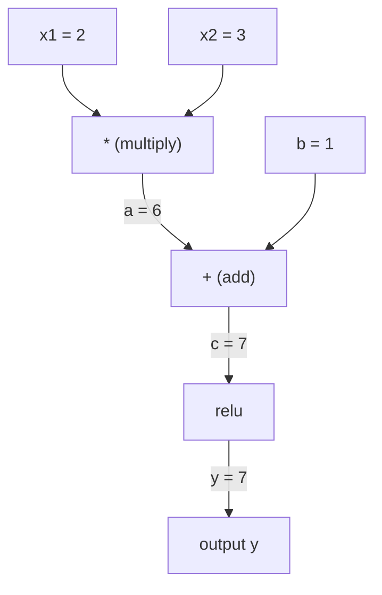
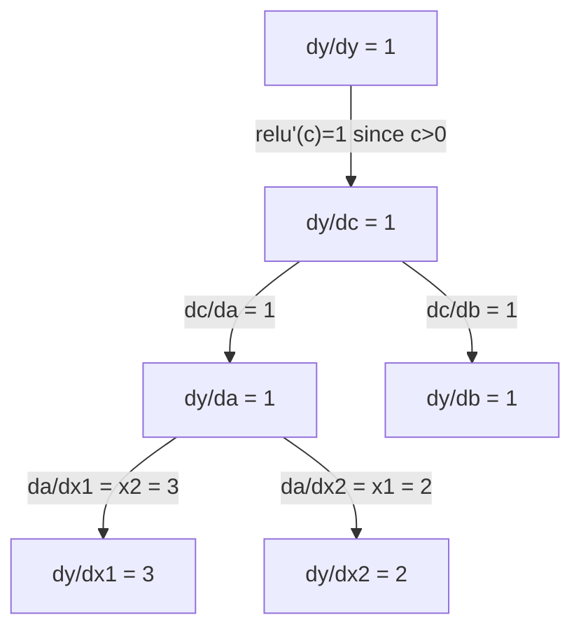

# Regra da cadeia e diferenciação automática .

> A regra da cadeia é o motor por trás de todas as redes neurais que aprendem.

**Type:** Build | **类型:** 动手
**Language:**O Python .**语言:**Python
**Prerequisites:** Phase 1, Lesson 04 (Derivatives & Gradients) | **前置知识:** Phase 1, Lesson 04（导数与梯度）
**Time:** ~90 minutes | **时间:** ~90 分钟

## Objetivos de aprendizagem

- Construir um motor de autogrado mínimo (classe de valor) que registre operações e computa gradientes através de auto-difusão de modo inverso
  构建最小化 autograd 引擎(Value 类),记录运算并通过反向模式自动微分计算梯度
- Implementar passagens para frente e para trás através de um gráfico de cálculo usando o tipo topológico
  Usando a ordem de distribuição para a realização do cálculo
- Construir e treinar um perceptron de várias camadas no XOR usando apenas o motor de autograd do zero
  Construir e treinar máquinas sensíveis de várias camadas em XOR usando apenas um motor de autograd implementado a partir de zero
- Verificar a correcção do auto-diff usando a verificação de gradientes contra diferenças finitas numéricas
  Utilizando um número limitado de diferenças para fazer um teste de gradiente, verificar a autenticidade do autodiff

> **【中文解读】**
> 链式法则是"导数怎么算的函数套函数"──神经网络就是几百个函数嵌套在一起:矩阵乘法→加偏置→激活函数→再矩阵乘法→Softmax→交叉──链式法则让你从最后层开始,层次往返计算每个参数的梯度这是反向传播──

> **【拓展：链式法则 → 反向传播 → PyTorch autograd】**
> 链式法则是反向传播 (→ "Lei de Chain")                                                                                                                                                                                                                                                      `autograd`、TensorFlow ≈`GradientTape`Todos os modelos são executados automaticamente com um modelo de inversão, que segue automaticamente o gráfico de cálculo, e depois calcula todos os gradientes usando o método de cadeia.

## O problema é o problema da introdução

Você pode calcular derivadas de funções simples. Mas uma rede neural não é uma função simples. É centenas de funções compostas juntas: multiplicar matriz, adicionar viés, aplicar ativação, multiplicar matriz novamente, softmax, perda de entropia cruzada. A saída é uma função de uma função de uma função.

> Você pode calcular a direção de funções simples. Mas a rede neuronal não é uma função simples. É uma composição de centenas de funções: matrizes multiplicadas, adicionadas, ativadas, re-matriculadas, softmax, transferência, perda.

Para treinar a rede, é necessário o gradiente da perda em relação a cada peso individual. Fazer isso à mão é impossível para milhões de parâmetros. Fazer numérica (diferências finitas) é muito lento.

> Para treinar a rede, você precisa perder para cada peso de gradiente.

A regra da cadeia dá-lhe a matemática. A diferenciação automática dá-lhe o algoritmo. Juntos eles permitem-lhe calcular gradientes exatos através de composições arbitrárias de funções em tempo proporcionais a uma única passagem para a frente.

> A lei da cadeia dá matemática, a forma automática de fazer a diferença dá algoritmo. A combinação de ambos permite que você calcule a precisão da gradiência da função de qualquer composição em tempo equivalente ao de uma única fase anterior.

É assim que PyTorch, TensorFlow e JAX funcionam.

> É assim que funciona o PyTorch、TensorFlow 和 JAX. Você vai construir uma versão micro do zero.

> **【中文解读】**神经网络 = 函数的函数的函数──链式法则让你逐层解复合函数的导数:dL/dw = dL/d_out × d_out/d_hidden × d_hidden/d_w──自动求导把这个过程自动化PyTorch的`backward()`Uma linha de código para determinar a gradiência de milhões de parâmetros.

## O conceito central.

> **【拓展：自动求导是深度学习的引擎】**PyTorch `loss.backward()`Utilizando o método de busca automática contra-direção: de saída para volta, por nível aplicado cadeia de regras.`backward()`Uma vez que podemos calcular a gradiência de todos os parâmetros, sem orientação automática, a aprendizagem profunda é impossível de processar um modelo tão grande.

### A Regra da Cadeia

Se`y = f(g(x))`, a derivada de `y`Relativamente a`x`é:

> Se `y = f(g(x))`,y para x é:

```
dy/dx = dy/dg * dg/dx = f'(g(x)) * g'(x)
```

Multiplicar os derivados ao longo da cadeia. Cada elo contribui com a sua derivada local.

> 沿链路乘导数―― cada passo contribui com seu local

Exemplo: `y = sin(x^2)`

```
g(x) = x^2       g'(x) = 2x
f(g) = sin(g)     f'(g) = cos(g)

dy/dx = cos(x^2) * 2x
```

> Demonstração: y = sin(x2);;;;;;;;;;;;;;;;;;;;;;;;;;;;;;;;;;;;;;;;;;;;;;;;;;;;;;;;;;;;;;;;;;;;;;;;;;;;;;;;;;;;;;;;;;;;;;;;;;;;;;;;;;;;;;;;;;;;;;;;;;;;;;;;;;;;;;;;;;;;;;;;;;;;;;;;;;;;;;;;;;;;;;;;;;;;;;;;;;;;;;;;;;;;;;;;;;;;;;;;;;;;;;;;;;;;;;;;;;;;;;;;;;;;;;;;;;;;;;;;;;;;;;;;;;;;;;;;;;;;;;;;;;;;;;;;;;;;;;;;;;;;;;;;;;;;;;;;;;;;;;;;;;;;;;;;;;;;;;;;;;;;;;;;;;;;;;;;;;;;;;;;;;;;;;;;;;;;;;;;;;;;;;;;;;;;;;;;;;;;;;;;;;;;;;;;;;;;;;;;;;;;;;;;;;;;;;;;;;;;;;;;;;;;;;;;;;;;;;;;;;;;;;;;;;;;;;;;;;;;;;;;;;;;;;;;;;;;;;;;;;;;;;;;;;;;;;;;;;;;;

Para composições mais profundas, a cadeia se estende:

```
y = f(g(h(x)))

dy/dx = f'(g(h(x))) * g'(h(x)) * h'(x)
```

> 更深的复合:y = f(g(h(x))),导数为 f'(g(h(x))) × g'(h(x)) × h'(x),每多一层就多乘一项。

Cada camada numa rede neural é um elo nesta cadeia.

> Cada camada da rede neuronal é um elemento desta cadeia.

### Gráficos computacionais

Um gráfico computacional torna a regra da cadeia visual. Cada operação se torna um nó. Dados fluem para frente através do gráfico.

> 計算圖讓鎖式法则可視化── cada operação se transforma num node, os dados se movem para frente, a gradiência para trás se movem──

> 計算圖是 PyTorch autograd 的底层抽象:节点是运算,前向时存储中值,反向时计算局部梯度──

**Forward pass (compute values):**



**Backward pass (compute gradients):**



A passagem para trás aplica a regra da cadeia em cada nó, propagando gradientes da saída para as entradas.

> O método de transmissão em cada ponto da aplicação da cadeia de dados, vai ser o gradiente da saída para a entrada.

### Modo Avançado vs Modo Reverso

Há duas maneiras de aplicar a regra da cadeia através de um gráfico.

> 通过计算图应用链式法则有两种方式──

**Forward mode**O sistema de cálculo de uma base de dados é um sistema de cálculo de dados.`dx/dx = 1`E se propaga através de cada operação. bom quando você tem poucas entradas e muitas saídas.

> **前向模式**Desde o input para o forward`dx/dx = 1`Não através de cada operação de disseminação.

```
Forward mode: seed dx/dx = 1, propagate forward

  x = 2       (dx/dx = 1)
  a = x^2     (da/dx = 2x = 4)
  y = sin(a)  (dy/dx = cos(a) * da/dx = cos(4) * 4 = -2.615)
```

**Reverse mode**Começa na saída e puxa os gradientes para trás.`dy/dy = 1`E se propaga através de cada operação de forma inversa. bom quando você tem muitas entradas e poucas saídas.

> **反向模式**Desde o output começa para o retorno de escala.`dy/dy = 1`E vice-versa através de cada operação. Quando a entrada é maior, a saída é menor.

```
Reverse mode: seed dy/dy = 1, propagate backward

  y = sin(a)  (dy/dy = 1)
  a = x^2     (dy/da = cos(a) = cos(4) = -0.654)
  x = 2       (dy/dx = dy/da * da/dx = -0.654 * 4 = -2.615)
```

As redes neurais têm milhões de entradas (pesos) e uma saída (perda). O modo inverso calcula todos os gradientes em um passo para trás. É por isso que a propagação para trás usa o modo inverso.

> A rede nervosa tem milhões de entradas e perdas. O método de transmissão é capaz de calcular todas as dimensões.

| Mode | Seed | Direction | Best when |
|------|------|-----------|-----------|
| Forward | `dx_i/dx_i = 1` | Input to output | Few inputs, many outputs |
| Reverse | `dy/dy = 1` | Output to input | Many inputs, few outputs (neural nets) |

> 两种模式对比:前向模式种子 dx/dx = 1,输入到输出,适合少输入多输出;反向模式种子 dy/dy = 1,输出到输入,适合多输入少输出(

### Dual Numbers para Modo Avançado

O modo de avanço pode ser implementado de forma elegante com números duplos.`a + b*epsilon`onde`epsilon^2 = 0`- Não .

> O modelo de direção pode ser realizado com forma de forma ideal em relação a um número de pares.`a + b*ε`, entre os `ε² = 0`- Não.

```
Dual number: (value, derivative)

(2, 1) means: value is 2, derivative w.r.t. x is 1

Arithmetic rules:
  (a, a') + (b, b') = (a+b, a'+b')
  (a, a') * (b, b') = (a*b, a'*b + a*b')
  sin(a, a')         = (sin(a), cos(a)*a')
```

> Para o número de vezes: (((valor, 导数) ;; regras de cálculo:加法对应分量相加;乘法用积的求导法则;sin 用链式法则;;把输入的导数种子设为1,导数会自动通过每个运算传播;;

Seem a variável de entrada com derivada 1. A derivada se propaga automaticamente através de cada operação.

> Colocar a quantidade de input para 1, a quantidade de input será automaticamente transmitida por cada cálculo.

### Construindo um motor Autograd

Um motor autograd precisa de três coisas:

1. **Value wrapping.**Envolva cada número num objeto que armazene seu valor e gradiente.
2. **Graph recording.**Cada operação registra as suas entradas e a função de gradiente local.
3. **Backward pass.**A classificação topológica do gráfico, depois caminhando-o ao contrário, aplicando a regra da cadeia em cada nó.

> Autograd Motor precisa de três coisas: 1.**数值包装**: transformar cada número em objeto de valor e gradiente de armazenamento; 2. **图记录**A função de graduação de cada operação é registada por função de graduação de entrada e local.**反向传播**A lei de ordem, reversa e em cada ponto aplicada.

É exatamente isso que PyTorch é.`autograd`- Não, não.`torch.Tensor`classe envolve valores, registra operações quando `requires_grad=True`, e calcula gradientes quando você chama`.backward()`- Não .

> É o PyTorch.`autograd`Fazer coisas.`torch.Tensor`包装数值,当 `requires_grad=True`时记录操作,调用 `.backward()`时计算梯度──

### Como funciona a PyTorch Autograd sob o capuz

Quando escrever código PyTorch:

```python
x = torch.tensor(2.0, requires_grad=True)
y = x ** 2 + 3 * x + 1
y.backward()
print(x.grad)  # 7.0 = 2*x + 3 = 2*2 + 3
```

> Quando você escrever PyTorch 代码时:x 设 requer_grad=True,运算自动记录,调用倒向() 后 x.grad 自动算出梯度 7.0。

PyTorch internamente:

1. Cria um `Tensor`nó para `x`com`requires_grad=True`
2. Cada operação (`**`- Não .`*`- Não .`+`) cria um novo nó e registra a função retrógrada
3. `y.backward()`desencadeia auto-desvio de modo inverso através do gráfico gravado
4. Cada nó é `grad_fn`computa gradientes locais e os passa para nós-mãe
5. Os gradientes se acumulam em `.grad`Atributos por adição (não substituição)

> PyTorch 内部:1) 为 x 创建电节点;2) 每运算(**、*、+)创建新节点并记录反向函数;3) y.backward() 触发反向自动微分;4) Cada节点的 grad_fn 计算局部梯度并传给父节点;5) 梯度通过加法累积到 .grad 属性(不是替代) △

O gráfico é dinâmico (definido por execução). Um novo gráfico é construído em cada passagem avançada. É por isso que PyTorch suporta o fluxo de controle (se / outros, loop) dentro dos modelos.

> 計算圖是動态的 (defina-por-loop) ⋅ ⋅ ⋅ ⋅ ⋅ ⋅ ⋅ ⋅ ⋅ ⋅ ⋅ ⋅ ⋅ ⋅ ⋅ ⋅ ⋅ ⋅ ⋅ ⋅ ⋅ ⋅ ⋅ ⋅ ⋅ ⋅ ⋅ ⋅ ⋅ ⋅ ⋅ ⋅ ⋅ ⋅ ⋅ ⋅ ⋅ ⋅ ⋅ ⋅ ⋅ ⋅ ⋅ ⋅ ⋅ ⋅ ⋅ ⋅ ⋅ ⋅ ⋅ ⋅ ⋅ ⋅ ⋅ ⋅ ⋅ ⋅ ⋅ ⋅ ⋅ ⋅ ⋅ ⋅ ⋅ ⋅ ⋅ ⋅ ⋅ ⋅ ⋅ ⋅ ⋅ ⋅ ⋅ ⋅ ⋅ ⋅ ⋅ ⋅ ⋅ ⋅ ⋅ ⋅ ⋅ ⋅ ⋅ ⋅ ⋅ ⋅ ⋅ ⋅ ⋅ ⋅ ⋅ ⋅ ⋅ ⋅ ⋅ ⋅ ⋅ ⋅ ⋅ ⋅ ⋅ ⋅ ⋅ ⋅ ⋅ ⋅ ⋅ ⋅ ⋅ ⋅ ⋅ ⋅ ⋅ ⋅ ⋅ ⋅ ⋅ ⋅ ⋅ ⋅ ⋅ ⋅ ⋅ ⋅ ⋅ ⋅ ⋅ ⋅ ⋅ ⋅ ⋅ ⋅ ⋅ ⋅ ⋅ ⋅ ⋅ ⋅ ⋅ ⋅ ⋅ ⋅ ⋅ ⋅ ⋅ ⋅ ⋅ ⋅ ⋅ ⋅ ⋅                                                                                                                                                                                         

## Construí-lo e realizei-o.
```figure
chain-rule
```

## Construí-lo

### Passo 1: A classe de valor

```python
class Value:
    def __init__(self, data, children=(), op=''):
        self.data = data
        self.grad = 0.0
        self._backward = lambda: None
        self._prev = set(children)
        self._op = op

    def __repr__(self):
        return f"Value(data={self.data:.4f}, grad={self.grad:.4f})"
```

> Valor 类是自格级的核心数据结构──每个 Valor 存储数值、梯度、反向函数闭包和子节点指针──

Todos .`Value`armazena os dados numéricos, o seu gradiente (início zero), uma função retrógrada e aponta para os nós menores que o produziram.

> Cada um .`Value`存储数值、梯度(初始为零) 、反向函数和产生它的子节点指针──

### Passo 2: Operações aritméticas com rastreamento de gradientes

```python
    def __add__(self, other):
        other = other if isinstance(other, Value) else Value(other)
        out = Value(self.data + other.data, (self, other), '+')
        def _backward():
            self.grad += out.grad
            other.grad += out.grad
        out._backward = _backward
        return out

    def __mul__(self, other):
        other = other if isinstance(other, Value) else Value(other)
        out = Value(self.data * other.data, (self, other), '*')
        def _backward():
            self.grad += other.data * out.grad
            other.grad += self.data * out.grad
        out._backward = _backward
        return out

    def relu(self):
        out = Value(max(0, self.data), (self,), 'relu')
        def _backward():
            self.grad += (1.0 if out.data > 0 else 0.0) * out.grad
        out._backward = _backward
        return out
```

Cada operação cria um fechamento que sabe como calcular gradientes locais e multiplicar pelo gradiente ascendente (`out.grad`O `+=`Tratam o caso em que um valor é utilizado em múltiplas operações.

> Cada operação cria um conjunto, sabe como calcular a escala local e multiplicar a escala de viagem.`+=`处理一个值被多操作使用的情况 (título de um valor utilizado por várias operações) 

> 关键设计:加法的反向是1(梯度直接传给两个输入),乘法的反向是另一个操作数(链式法则:d(a*b)/da = b)。relu 的反向是0或1(取决于前向是否激活)。

### Passo 3: Passagem para trás

```python
    def backward(self):
        topo = []
        visited = set()
        def build_topo(v):
            if v not in visited:
                visited.add(v)
                for child in v._prev:
                    build_topo(child)
                topo.append(v)
        build_topo(self)

        self.grad = 1.0
        for v in reversed(topo):
            v._backward()
```

A classificação topológica garante que o gradiente de cada nó seja completamente calculado antes de se propagar para seus filhos.

> 拓排序 拓排序 拓排序 拓排序 拓排序 拓排序 拓排序 拓排序 拓排序 拓排序 拓排序 拓排序 拓排序 拓排序 拓排序 拓排序 拓排序 拓排序 拓排序 拓排序 拓排序 拓排序 拓排序 拓排序 拓排序 拓排序 拓排序 拓排序 拓排序 拓排序 拓排序 拓排序 拓排序 拓排序 拓排序 拓排序 拓排序 拓排序 拓排序 拓排序 拓排序 拓排序 拓排序 排序 排序 排序 排序 排序 排序 排序 排序 排序 排序 排序 排序 排序 排序 排序 排序 排序 排序 排序 排序 排 排 排 排 排 排 排 排 排 排 排 排 排 排 排 排 排 排 排 排 排 排 排 排 排 排 排 排 排 排 排 排 排 排 排 排 排 排 排 排 排 排 排 排 排 排 排 排 排 排 排 排 排 排 排 排 排 排 排 排 排 排 排 排 排 排 排 排 排 排 排 排 排 排 排 排 排 排 排 排 排 排 排 排 排 排 排 排 排 排 排 排 排 排 排 排 排 排 排 排 排 排 排 排 排 排 排 排 排 排 排 排 排 排 排 排 排 

> atrás (algorithm: primeiro com a regressão a construir a ordem (e cada ponto aparece em todos os dependentes depois), novamente com a regressão da ordem (e assim por diante)

### Passo 4: Mais operações para um motor completo

A classe de valor básica lida com adição, multiplicação e relú. Um motor autograd real precisa de mais. Aqui estão as operações que você precisa para construir redes neurais:

> Base Valor 类只支持加加、乘、relu── Um verdadeiro motor autograd  motor precisa de mais operação:

```python
    def __neg__(self):
        return self * -1

    def __sub__(self, other):
        return self + (-other)

    def __radd__(self, other):
        return self + other

    def __rmul__(self, other):
        return self * other

    def __rsub__(self, other):
        return other + (-self)

    def __pow__(self, n):
        out = Value(self.data ** n, (self,), f'**{n}')
        def _backward():
            self.grad += n * (self.data ** (n - 1)) * out.grad
        out._backward = _backward
        return out

    def __truediv__(self, other):
        return self * (other ** -1) if isinstance(other, Value) else self * (Value(other) ** -1)

    def exp(self):
        import math
        e = math.exp(self.data)
        out = Value(e, (self,), 'exp')
        def _backward():
            self.grad += e * out.grad
        out._backward = _backward
        return out

    def log(self):
        import math
        out = Value(math.log(self.data), (self,), 'log')
        def _backward():
            self.grad += (1.0 / self.data) * out.grad
        out._backward = _backward
        return out

    def tanh(self):
        import math
        t = math.tanh(self.data)
        out = Value(t, (self,), 'tanh')
        def _backward():
            self.grad += (1 - t ** 2) * out.grad
        out._backward = _backward
        return out
```

**Why each operation matters:**

| Operation | Backward rule | Used in |
|-----------|--------------|---------|
| `__sub__` | Reuses add + neg | Loss computation (pred - target) |
| `__pow__` | n * x^(n-1) | Polynomial activations, MSE (error^2) |
| `__truediv__` | Reuses mul + pow(-1) | Normalization, learning rate scaling |
| `exp` | exp(x) * upstream | Softmax, log-likelihood |
| `log` | (1/x) * upstream | Cross-entropy loss, log probabilities |
| `tanh` | (1 - tanh^2) * upstream | Classic activation function |

> Diferentes regras de operação: reduzir o número de vezes usando o número de vezes + 0; reduzir o número de vezes usando o número de vezes + 0; reduzir o número de vezes usando o número de vezes + 0; reduzir o número de vezes usando o número de vezes + 0; reduzir o número de vezes usando o número de vezes + 0; reduzir o número de vezes usando o número de vezes + 0; reduzir o número de vezes usando o número de vezes + 0; reduzir o número de vezes usando o número de vezes + 0; reduzir o número de vezes usando o número de vezes + 0; reduzir o número de vezes usando o número de vezes + 0; reduzir o número de vezes usando o número de vezes + 0; reduzir o número de vezes usando o número de vezes + 0; reduzir o número de vezes usando o número de vezes + 0; reduzir o número de vezes usando o número de vezes + 0; reduzir o número de vezes usando o número de vezes + 0; reduzir o número de vezes usando o número de vezes + 0;

A parte inteligente:`__sub__`E ...`__truediv__`Os gradientes corretos são obtidos gratuitamente porque a regra da cadeia se compõe através das operações subjacentes adição/mul/pow.

> O que é que é?`__sub__`和 `__truediv__` através de uma definição de operação já existente, portanto, a gradiência através da lei da cadeia é automaticamente correta é a força do conjunto.

### Passo 5: Mini MLP a partir do zero

Com uma classe de Valores completa, podes construir uma rede neural sem PyTorch, sem NumPy, apenas valores e a regra da cadeia.

> Com um Valor completo, você pode construir uma rede de neurônios. Não precisa de PyTorch. Não precisa de NumPy.

```python
import random

class Neuron:
    def __init__(self, n_inputs):
        self.w = [Value(random.uniform(-1, 1)) for _ in range(n_inputs)]
        self.b = Value(0.0)

    def __call__(self, x):
        act = sum((wi * xi for wi, xi in zip(self.w, x)), self.b)
        return act.tanh()

    def parameters(self):
        return self.w + [self.b]

class Layer:
    def __init__(self, n_inputs, n_outputs):
        self.neurons = [Neuron(n_inputs) for _ in range(n_outputs)]

    def __call__(self, x):
        return [n(x) for n in self.neurons]

    def parameters(self):
        return [p for n in self.neurons for p in n.parameters()]

class MLP:
    def __init__(self, sizes):
        self.layers = [Layer(sizes[i], sizes[i+1]) for i in range(len(sizes)-1)]

    def __call__(self, x):
        for layer in self.layers:
            x = layer(x)
        return x[0] if len(x) == 1 else x

    def parameters(self):
        return [p for layer in self.layers for p in layer.parameters()]
```

A.`Neuron`Computação`tanh(w1*x1 + w2*x2 + ... + b)`- A.`Layer`É uma lista de neurônios.`MLP`Cada peso é um`Value`, por isso chamando`loss.backward()`Propaga gradientes a todos os parâmetros.

> Um .`Neuron`计算 `tanh(w1*x1 + w2*x2 + ... + b)`Uma.`Layer`É um dos principais.`MLP`Cada um tem o seu peso.`Value`, para que o uso`loss.backward()`Vai espalhar a gradiência para cada parâmetro.

**Training on XOR:**

> **在 XOR 上训练**O XOR é um problema clássico de separação não linear, que não pode ser resolvido por uma única camada de inteligência, mas que deve ser usado por um nível oculto.

```python
random.seed(42)
model = MLP([2, 4, 1])  # 2 inputs, 4 hidden neurons, 1 output

xs = [[0, 0], [0, 1], [1, 0], [1, 1]]
ys = [-1, 1, 1, -1]  # XOR pattern (using -1/1 for tanh)

for step in range(100):
    preds = [model(x) for x in xs]
    loss = sum((p - y) ** 2 for p, y in zip(preds, ys))

    for p in model.parameters():
        p.grad = 0.0
    loss.backward()

    lr = 0.05
    for p in model.parameters():
        p.data -= lr * p.grad

    if step % 20 == 0:
        print(f"step {step:3d}  loss = {loss.data:.4f}")

print("\nPredictions after training:")
for x, y in zip(xs, ys):
    print(f"  input={x}  target={y:2d}  pred={model(x).data:6.3f}")
```

Isto é microgrado. Um ciclo completo de treinamento de rede neural em Python puro com diferenciação automática.

> É o microgrado. O ciclo de treinamento completo de redes neurais e a micro-partição automática realizadas em Python são realizadas em uma escala maior.

>                                                                                                                                                                                                                                                               

### Passo 6: Verificação gradual

Como saber se o seu auto-difiguração é correta? Compare-o com derivadas numéricas.

> Como saber se o seu auto-drive é verdadeiro?

```python
def gradient_check(build_expr, x_val, h=1e-7):
    x = Value(x_val)
    y = build_expr(x)
    y.backward()
    autodiff_grad = x.grad

    y_plus = build_expr(Value(x_val + h)).data
    y_minus = build_expr(Value(x_val - h)).data
    numerical_grad = (y_plus - y_minus) / (2 * h)

    diff = abs(autodiff_grad - numerical_grad)
    return autodiff_grad, numerical_grad, diff
```

Teste-o numa expressão complexa:

```python
def expr(x):
    return (x ** 3 + x * 2 + 1).tanh()

ad, num, diff = gradient_check(expr, 0.5)
print(f"Autodiff:  {ad:.8f}")
print(f"Numerical: {num:.8f}")
print(f"Difference: {diff:.2e}")
# Difference should be < 1e-5
```

> 测试复杂表达式:(x3 + 2x + 1) 的 tanh 在 x=0.5 处的梯度──autodiff 和数值导数 的差异应 < 1e-5,验证反向传播实现正确──

A verificação de gradientes é essencial ao implementar novas operações. Se o seu pass para trás tiver um bug, a verificação numérica o apanha.

> O teste de gradiente é indispensável na implementação de novas operações. Se o erro de propagação contrária ocorrer, o teste de valor numérico pode ser encontrado.

**When to use gradient checking:**

| Situation | Do gradient check? |
|-----------|-------------------|
| Adding a new operation to your autograd | Yes, always |
| Debugging a training loop that won't converge | Yes, check gradients first |
| Production training | No, too slow (2x forward passes per parameter) |
| Unit tests for autograd code | Yes, automate it |

> 何时使用梯度检查:给 autograd 加新操作(永远要);调试不收的训练循环(先查梯度);生产训练(不要,太慢);autograd 单元测试(自动化)

### Passo 7: Verificar contra o cálculo manual

```python
x1 = Value(2.0)
x2 = Value(3.0)
a = x1 * x2          # a = 6.0
b = a + Value(1.0)    # b = 7.0
y = b.relu()          # y = 7.0

y.backward()

print(f"y = {y.data}")          # 7.0
print(f"dy/dx1 = {x1.grad}")   # 3.0 (= x2)
print(f"dy/dx2 = {x2.grad}")   # 2.0 (= x1)
```

> 手动验证:y = relu(x1*x2 + 1), pois x1*x2 + 1 = 7 > 0,relu é igual e igual映射──dy/dx1 = x2 = 3,dy/dx2 = x1 = 2──引擎计算结果完全匹配──

Verificação manual: `y = relu(x1*x2 + 1)`Desde que ...`x1*x2 + 1 = 7 > 0`Relu é identidade.
`dy/dx1 = x2 = 3`- Não .`dy/dx2 = x1 = 2`O motor coincide.

## Use-o com o framework implementado.

### Verificar contra PyTorch

> Com PyTorch em comparação com testes: com tocha, escrever gravemente expressão similar, em comparação com resultados de gradiência.

```python
import torch

x1 = torch.tensor(2.0, requires_grad=True)
x2 = torch.tensor(3.0, requires_grad=True)
a = x1 * x2
b = a + 1.0
y = torch.relu(b)
y.backward()

print(f"PyTorch dy/dx1 = {x1.grad.item()}")  # 3.0
print(f"PyTorch dy/dx2 = {x2.grad.item()}")  # 2.0
```

O motor calcula o mesmo resultado que o PyTorch porque a matemática é a mesma: auto-difusão de modo inverso através da regra da cadeia.

> O seu motor e a PyTorch calcularam os mesmos resultados, porque a matemática é a mesma: através da lei da cadeia, o modelo de inversão automática é reduzido.

## Envia-o . Produto .

Esta lição produz:
- `outputs/skill-autodiff.md`-- uma habilidade para construir e depurar sistemas autograd
- `code/autodiff.py`- um motor de auto-grada mínimo que você pode estender

> 本课产出: Construir e modificar autograd 系统的技能文档 + 可扩展的最小 autograd 引擎代码──

A classe de valor construída aqui é a base para o ciclo de treinamento da rede neural na Fase 3.

> O valor da classe construída é a base do ciclo de treinamento da Fase 3 da rede neuronal.

### Uma expressão mais complexa

```python
a = Value(2.0)
b = Value(-3.0)
c = Value(10.0)
f = (a * b + c).relu()  # relu(2*(-3) + 10) = relu(4) = 4

f.backward()
print(f"df/da = {a.grad}")  # -3.0 (= b)
print(f"df/db = {b.grad}")  #  2.0 (= a)
print(f"df/dc = {c.grad}")  #  1.0
```

> 更复杂的表达式:relu(a*b + c) 在 a=2, b=-3, c=10 处, resulta é relu(4) = 4。df/da = b = -3,df/db = a = 2,df/dc = 1。

## Exercícios.

1. Adicionar`__pow__`para a classe Valor para que você possa calcular `x ** n`Verifica isso .`d/dx(x^3)`- Não .`x=2`- É igual .`12.0`- Não .
   给 Value 类添加 `__pow__`, deixe-te poder calcular`x ** n`❖ O teste `d/dx(x^3)`Em`x=2`É o mesmo que`12.0`- Não.

2. Adicionar`tanh`Como uma função de ativação.`tanh'(0) = 1`E ...`tanh'(2) = 0.0707`- Não.
   添加 `tanh`激活函数──验证 `tanh'(0) = 1`- Não .`tanh'(2) ≈ 0.0707`- Não.

3. Construa um gráfico de cálculo para um único neurônio: `y = relu(w1*x1 + w2*x2 + b)`Calcule os cinco gradientes e verifique contra a PyTorch.
   Para um único neurônio construir cálculo gráfico:`y = relu(w1*x1 + w2*x2 + b)`△ calcular todos os cinco gradientes并与 PyTorch 验证──

4. Implementar o auto-difuso em modo avançado usando números duplos.`Dual`A classe e verificar que dá as mesmas derivadas que o motor de modo inverso.
   Utilize para realizar o número de vezes para o modelo de direção automática.`Dual`O que é que ele faz com que o seu motor de modulação inversa dê o mesmo número de direção.

## Termos-chave .

| Term | What people say | What it actually means |
|------|----------------|----------------------|
| Chain rule | "Multiply the derivatives" | The derivative of composed functions equals the product of each function's local derivative, evaluated at the right point |
| Computational graph | "The network diagram" | A directed acyclic graph where nodes are operations and edges carry values (forward) or gradients (backward) |
| Forward mode | "Push derivatives forward" | Autodiff that propagates derivatives from inputs to outputs. One pass per input variable. |
| Reverse mode | "Backpropagation" | Autodiff that propagates gradients from outputs to inputs. One pass per output variable. |
| Autograd | "Automatic gradients" | A system that records operations on values, builds a graph, and computes exact gradients via the chain rule |
| Dual numbers | "Value plus derivative" | Numbers of the form a + b*epsilon (epsilon^2 = 0) that carry derivative information through arithmetic |
| Topological sort | "Dependency order" | Ordering graph nodes so every node comes after all its dependencies. Required for correct gradient propagation. |
| Gradient accumulation | "Add, don't replace" | When a value feeds into multiple operations, its gradient is the sum of all incoming gradient contributions |
| Dynamic graph | "Define by run" | A computation graph rebuilt on every forward pass, allowing Python control flow inside models (PyTorch style) |
| Gradient checking | "Numerical verification" | Comparing autodiff gradients against numerical finite-difference gradients to verify correctness. Essential for debugging. |
| MLP | "Multi-layer perceptron" | A neural network with one or more hidden layers of neurons. Each neuron computes a weighted sum plus bias, then applies an activation function. |
| Neuron | "Weighted sum + activation" | The basic unit: output = activation(w1*x1 + w2*x2 + ... + b). The weights and bias are learnable parameters. |

> 术语速查:Chain rule (→ "Relação de cadeia", "Fração de cadeia", "Fração de função complexa") ∆ Grafo computacional (→ "Gráfico de cálculo", "Gráfico de cálculo", "Gráfico de cálculo para o ponto de acesso") ∆ Forward mode (→ "Gráfico de entrada para saída para saída para saída para saída") ∆ Reverso mode (→ "Gráfico de saída para entrada para saída para saída para saída para saída para saída para saída para saída) ∆ Autograd (→ "Gráfico de saída para saída para saída para saída para saída para saída para saída para saída para saída para saída para saída para saída para saída para saída) ∆ Autograd (→ "Gráfico de saída para saída para saída para saída para saída para saída para saída para saída para saída para saída para saída para saída para saída para saída para saída para saída para saída para saída para saída para saída para saída) ∆ Autograd (→ "Gráfico de saída para saída para saída para saída para saída para saída para saída para saída para saída para saída para saída para saída para saída para saída para saída para saída para saída) ∆ Autograd (→ "Gráfico de saída para saída para saída para saída para saída para saída para saída para saída para saída para saída para saída para saída para saída para saída para saída para saída para saída para saída para saída para saída para saída para saída para saída) ∆ Autograd (→ "Gráfico de saída para saída para saída para saída para saída para saída para saída para saída para saída para saída para saída para saída para saída para saída para saída para saída para saída para saída para saída para saída para saída para saída para saída para saída para saída para saída para saída para saída para saída para saída) ∆ Autograd (→ "Gráfico de saída para saída para saída para saída para saída para saída para saída para saída para saída para saída para saída para saída para saída para saída para saída para saída para saída para saída para saída para saída para saída para saída para saída para saída para saída para saída para saída para saída para saída para saída para saída para saída para saída para saída para saída para saída para saída para saída para saída para saída para saída para saída para saída para saída para saída para saída para saída para saída para saída para saída para saída para saída para

## Mais leitura 延伸阅读

- [3Blue1Brown: Backpropagation calculus](https://www.youtube.com/watch?v=tIeHLnjs5U8)-- explicação visual da regra da cadeia em redes neurais
- [PyTorch Autograd mechanics](https://pytorch.org/docs/stable/notes/autograd.html)- Como funciona o sistema real
- [Baydin et al., Automatic Differentiation in Machine Learning: a Survey](https://arxiv.org/abs/1502.05767)-- referência abrangente
