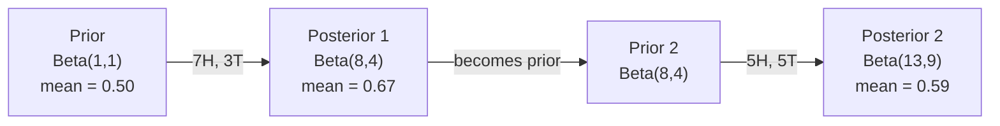

# Teorema de Bayes.

> A probabilidade é o que se espera, o teorema de Bayes é o que se aprende.
> A probabilidade depende das suas expectativas.

**Type:** Build | **类型:** 动手
**Language:**O Python .**语言:**Python
**Prerequisites:** Phase 1, Lesson 06 (Probability Fundamentals) | **前置知识:** Phase 1, Lesson 06（概率基础）
**Time:** ~75 minutes | **时间:** ~75 分钟

## Objetivos de aprendizagem

- Aplicar o teorema de Bayes para calcular probabilidades posteriores a partir de antecedentes, probabilidades e evidências
- Construir um classificador de texto Bayes ingênuo a partir do zero com Laplace suavizamento e log-space computação
- Comparar estimativas MLE e MAP e explicar como o MAP corresponde à regularização L2
- Implementar atualizações Bayesianas sequenciais usando antecedentes conjugados beta-binomial para testes A/B

> **【中文解读】**
> 贝叶斯定理的核心思想: Use new evidence update your belief──先验概率──你原本的猜测 (你原本的猜测) × 似然 (似然) 证据出现的概率) = 后验概率──更新后的猜测──本章还从零构建简单贝叶斯文本分类器──

> **【拓展：贝叶斯在 AI 中的位置】**
> - **朴素贝叶斯分类器**O que é que é o "classical algorithm"?`GaussianNB`- Não .`MultinomialNB`- Não.
> - **贝叶斯优化**O que é que é o que é o que é o que é o que é o que é o que é o que é o que é o que é o que é o que é o que é o que é o que é o que é o que é o que é o que é o que é o que é o que é o que é o que é o que é o que é o que é o que é o que é o que é o que é o que é o que é o que é o que é o que é o que é o que é o que é?
> - **MAP 与正则化**O MAP é igual ao L2 e é "prevenção de sobre-adaptado" sob o ponto de vista de Bayes.

## O problema é o problema da introdução

> **【中文解读】**Uma análise médica taxa de precisão de 99%, você avalia positivo, a probabilidade de doença real é quanto? intuitivamente diz 99%, mas com o cálculo de Beyes é possível apenas 50% porque primeiro deve considerar "precursão probabilidade" (a probabilidade de doença é muito baixa) 

## O conceito central.

> **【拓展：贝叶斯思维是 AI 的核心范式】**                                                                                                                                                                                                                                                                                                                                                                                                                                                                                                                             `P(假设|证据) = P(证据|假设) × P(假设) / P(证据)`Está em todas as partes:**朴素贝叶斯分类器**O que é que é o "carregamento de lixo"?**贝叶斯优化**O que é um método de alta eficiência?**MAP = L2 正则化**A maior avaliação posterior é igual ao valor acrescentado de L2 penas, explicando, do ponto de vista de Bayes, por que a normalização pode ser adaptada;**贝叶斯神经网络**Output uncertainity estimation, saber "I don't know"

A maioria das pessoas diz 99%. A resposta real depende de quão rara é a doença. Se 1 em cada 10.000 pessoas a têm, um resultado positivo só dá a você cerca de 1% de chance de ficar doente. Os outros 99% de resultados positivos são falsos alarmes de pessoas saudáveis.

> A maioria das pessoas diz que 99%. A resposta verdadeira depende da doença com que há muitas raridades. Se um em cada mil pessoas sofre, o resultado positivo dá apenas cerca de 1% da probabilidade de doença.

Esta não é uma pergunta de truque. É teorema de Bayes. Todo filtro de spam, todo diagnóstico médico, todo modelo de aprendizagem automática que quantifica a incerteza usa este raciocínio exato. Começa com uma crença. Veja evidências. Atualiza.

> Não é um processo de mudança de cérebro. É a teoria de Bayes. Cada filtro de lixo, cada diagnóstico médico, cada modelo de MLM de quantificação de incerteza, usa o mesmo:

Se construir sistemas de inteligência artificial sem entender isso, interpretará mal as saídas do modelo, estabelecerá prazos ruins e enviará previsões exageradas.

> Se não entender isso sobre a construção de sistemas de inteligência artificial, você vai erradicar o modelo de saída, definir o valor errado, emitir previsões de confiança exagerada.

## O conceito central.

### Da probabilidade conjunta para Bayes

Já sabe da lição 06 que a probabilidade condicional é:

> Você já aprendeu em 6o curso probabilidade de condição:

```
P(A|B) = P(A and B) / P(B)
```

E simetricamente:

```
P(B|A) = P(A and B) / P(A)
```

Ambas as expressões compartilham o mesmo numerador: P(A e B).

> ∆os expressos compartilham as mesmas moléculas: P A e B.

```
P(A and B) = P(A|B) * P(B) = P(B|A) * P(A)

Therefore:

P(A|B) = P(B|A) * P(A) / P(B)
```

É o teorema de Bayes, quatro quantidades, uma equação.

> É o teorema de Bayes.

### As quatro partes

| Part | Name | What it means |
|------|------|---------------|
| P(A\|B) | Posterior / 后验 | Your updated belief about A after seeing evidence B / 看到证据 B 后对 A 的更新信念 |
| P(B\|A) | Likelihood / 似然 | How probable the evidence B is if A is true / 如果 A 为真，证据 B 出现的概率 |
| P(A) | Prior / 先验 | Your belief about A before seeing any evidence / 看到任何证据前对 A 的信念 |
| P(B) | Evidence / 证据 | Total probability of seeing B under all possibilities / 在所有可能情况下看到 B 的总概率 |

O termo prova P ((B) atua como um normalizer.

> 证据项 P(B) 作为归一化因子──可以用全概率公式展开:

```
P(B) = P(B|A) * P(A) + P(B|not A) * P(not A)
```

### Exemplo de teste médico

Uma doença afeta 1 em cada 10.000 pessoas. O teste é 99% preciso (aparece em 99% dos doentes, dá falsos resultados em 1% das vezes).

> Uma doença afeta mil pessoas.

```
P(sick)          = 0.0001     (prior: disease is rare)
P(positive|sick) = 0.99       (likelihood: test catches it)
P(positive|healthy) = 0.01    (false positive rate)

P(positive) = P(positive|sick) * P(sick) + P(positive|healthy) * P(healthy)
            = 0.99 * 0.0001 + 0.01 * 0.9999
            = 0.000099 + 0.009999
            = 0.010098

P(sick|positive) = P(positive|sick) * P(sick) / P(positive)
                 = 0.99 * 0.0001 / 0.010098
                 = 0.0098
                 = 0.98%
```

Quando uma condição é rara, mesmo os testes precisos produzem em sua maioria falsos positivos.

> Não é de 1%. A probabilidade de exame precoce é predominante. Quando a doença é rara, mesmo os exames precisos também produzem um falso positivo.

### Exemplo de filtro de spam

Recebe um e-mail com a palavra "loteria". É spam?

> Você recebeu um e-mail contendo "loteria" ?

```
P(spam)                = 0.3      (30% of email is spam)
P("lottery"|spam)      = 0.05     (5% of spam emails contain "lottery")
P("lottery"|not spam)  = 0.001    (0.1% of legitimate emails contain "lottery")

P("lottery") = 0.05 * 0.3 + 0.001 * 0.7
             = 0.015 + 0.0007
             = 0.0157

P(spam|"lottery") = 0.05 * 0.3 / 0.0157
                  = 0.955
                  = 95.5%
```

Uma palavra muda a probabilidade de 30% para 95,5%. Um verdadeiro filtro de spam aplica Bayes em centenas de palavras simultaneamente.

> Uma palavra vai ter uma probabilidade de 30% 推到95.5%── real lixo filtrador simultâneo através de centenas de palavras aplicadas 贝叶斯──

### Bayes ingênuo: suposição de independência

Naive Bayes estende isso a múltiplas características assumindo que todas as características são condicionalmente independentes dada a classe:

> O simples Bayes estenderá-se a várias características, supondo que todas as características sejam independentes umas das outras sob condições de uma determinada classe:

```
P(class | feature_1, feature_2, ..., feature_n)
  = P(class) * P(feature_1|class) * P(feature_2|class) * ... * P(feature_n|class)
    / P(feature_1, feature_2, ..., feature_n)
```

A parte "ingênua" é a suposição de independência. No texto, ocorrências de palavras não são independentes ("Novo" e "York" estão correlacionados). Mas a suposição funciona surpreendentemente bem na prática porque o classificador só precisa classificar classes, não produzir probabilidades calibradas.

> A parte "pônica" é uma suposição de independência. No texto, o aparecimento de palavras não é independente.

Como o denominador é o mesmo para todas as classes, você pode ignorá-lo e apenas comparar os numeradores:

> Como a分母 é igual a todas as classes, pode ser saltada, apenas comparar moléculas:

```
score(class) = P(class) * product of P(feature_i | class)
```

Escolha a classe com a maior pontuação.

> 选择得分最高的类别──

### Estimação máxima de probabilidade (MLE)

Como obtém P "feature " (classe de características) dos dados de treinamento?

> Como obter o P                                                                                                                                                                                                                                                             

```
P("free"|spam) = (number of spam emails containing "free") / (total spam emails)
```

Este é MLE: escolha os valores de parâmetros que tornam os dados observados mais prováveis. Você está maximizando a função de probabilidade, que para contagens discretas se reduz à frequência relativa.

> É o MLE (máxima probabilidade de cálculo): selecionar para que os dados de observação sejam os mais possíveis para aparecer.

O problema é que se uma palavra nunca aparece no spam durante o treinamento, a MLE dá-lhe probabilidade zero. Uma palavra invisível mata todo o produto.

>  problema: Se uma palavra nunca apareceu no lixo durante o treinamento, MLE  dá-lhe probabilidade de zero.  Uma palavra não vista vai destruir toda a multiplicidade. 

```
P(word|class) = (count(word, class) + 1) / (total_words_in_class + vocabulary_size)
```

Adicionar 1 a cada contagem garante que nenhuma probabilidade seja nunca zero.

> Dá a cada número mais um para garantir que a probabilidade nunca seja zero.

### MAP (Maksimal a posteriori)

O MLE pergunta: quais os parâmetros que maximizam os parâmetros de dados P?

> MLE 问: Qual é o maior número de parametros de dados?

O MAP pergunta: quais os parâmetros maximizam os parâmetros P ((data)?

> MAP 问: que parametros fazem P parametros em dados) max?

Pelo teorema de Bayes:

> De acordo com a teoria de Bayes:

```
P(parameters|data) proportional to P(data|parameters) * P(parameters)
```

MAP adiciona um prévio sobre os próprios parâmetros. Se você acredita que os parâmetros devem ser pequenos, você codifica isso como um prévio que penaliza valores grandes. Isso é idêntico à regularização de L2 no ML. A penalidade "redonda" na regressão de cresta é literalmente um prévio gaussiano nos pesos.

> MAP em parametros adiciona um prejuízo. Se você acha que o parametros devem ser menores, use o prejuízo de grande valor.

| Estimation | Optimizes | ML equivalent |
|------------|-----------|---------------|
| MLE | P(data\|params) | Unregularized training / 无正则化训练 |
| MAP | P(data\|params) * P(params) | L2 / L1 regularization / L2/L1 正则化 |

### Bayesian vs frequentist: a diferença prática

Os frequentistas consideram os parâmetros como algo fixo desconhecido, perguntando: "Se eu repetisse esta experiência muitas vezes, o que aconteceria?"

> 频率学派将参数视为固定的未知量―― eles perguntam:" Se eu repetir esta experiência muitas vezes, o que acontecerá?"

Os bayesianos tratam os parâmetros como distribuições.

> Os professores da Beioes School consideram os parâmetros como distribuídos. Eles perguntam: "De acordo com o que observei, qual é a minha crença sobre os parâmetros?"

Para a construção de sistemas ML, a diferença prática:

> Para a construção de sistemas de inteligência artificial, a diferença real é:

| Aspect | Frequentist | Bayesian |
|--------|-------------|----------|
| Output | Point estimate / 点估计 | Distribution over values / 值的分布 |
| Uncertainty | Confidence intervals (about procedure) / 置信区间（关于过程） | Credible intervals (about parameter) / 可信区间（关于参数） |
| Small data | Can overfit / 可能过拟合 | Prior acts as regularization / 先验充当正则化 |
| Computation | Usually faster / 通常更快 | Often requires sampling (MCMC) / 通常需要采样（MCMC） |

A maioria dos métodos de produção de MLM é frequentista (SGD, estimativas de pontos). Os métodos bayesianos brilham quando é necessária incerteza calibrada (decisões médicas, sistemas críticos para a segurança) ou quando os dados são escassos (aprendizagem em poucas tentativas, arranque a frio).

> A maioria da produção de ML é frequência de aprendizagem (sgd 点估算) ⋅ quando você precisa de um nível de incerteza (sgd 点估算) ⋅ quando você precisa de um nível de incerteza (sgd ⋅ ⋅ ⋅ ⋅ ⋅ ⋅ ⋅ ⋅ ⋅ ⋅ ⋅ ⋅ ⋅ ⋅ ⋅ ⋅ ⋅ ⋅ ⋅ ⋅ ⋅ ⋅ ⋅ ⋅ ⋅ ⋅ ⋅ ⋅ ⋅ ⋅ ⋅ ⋅ ⋅ ⋅ ⋅ ⋅ ⋅ ⋅ ⋅ ⋅ ⋅ ⋅ ⋅ ⋅ ⋅ ⋅ ⋅ ⋅ ⋅ ⋅ ⋅ ⋅ ⋅ ⋅ ⋅ ⋅ ⋅ ⋅ ⋅ ⋅ ⋅ ⋅ ⋅ ⋅ ⋅ ⋅ ⋅ ⋅ ⋅ ⋅ ⋅ ⋅ ⋅ ⋅ ⋅ ⋅ ⋅ ⋅ ⋅ ⋅ ⋅ ⋅ ⋅ ⋅ ⋅ ⋅ ⋅ ⋅ ⋅ ⋅ ⋅ ⋅ ⋅ ⋅ ⋅ ⋅ ⋅ ⋅ ⋅ ⋅ ⋅ ⋅ ⋅ ⋅ ⋅ ⋅ ⋅ ⋅ ⋅ ⋅ ⋅ ⋅ ⋅ ⋅ ⋅ ⋅ ⋅ ⋅ ⋅ ⋅ ⋅ ⋅ ⋅ ⋅ ⋅ ⋅ ⋅ ⋅ ⋅ ⋅ ⋅ ⋅ ⋅ ⋅ ⋅ ⋅ ⋅ ⋅ ⋅ ⋅ ⋅ ⋅ ⋅ ⋅ ⋅                                                                                                                                                                   

### Por que o pensamento bayesiano importa para a ML

A conexão é mais profunda do que a analogia:

> Este tipo de ligação é mais profunda:

**Priors are regularization.**Um prévio gaussiano em pesos é a regularização L2. Um prévio de Laplace é L1. Toda vez que você adiciona um termo de regularização, você está fazendo uma declaração bayesiana sobre quais valores de parâmetros você espera.

> **先验就是正则化。**O prejuízo de peso é L2 normalização, o prejuízo de rapra é L1. Cada vez que você adicionar um prejuízo, é fazer uma declaração de Bayes sobre o valor esperado dos parâmetros.

**Posteriors are uncertainty.**Uma única probabilidade prevista não diz nada sobre o quão confiante o modelo é nessa estimativa.

> **后验就是不确定性。**单个预测概率 não pode dizer-lhe que o modelo tem muita confiança nessa estimativa.

**Bayes updates are online learning.**O posterior de hoje torna-se o anterior de amanhã, quando o seu modelo vê novos dados, ele atualiza suas crenças gradualmente em vez de reestruturar a partir do zero.

> **贝叶斯更新就是在线学习。**O que acontece hoje torna-se o que acontece amanhã. Quando o modelo vê novos dados, ele aumenta a sua crença, não a sua formação.

**Model comparison is Bayesian.**O critério Bayesian de informação (BIC), a probabilidade marginal e os fatores Bayes usam o raciocínio Bayesian para escolher entre modelos sem sobreajuste.

> **模型比较是贝叶斯的。**贝叶斯信息准则 (BIC) 边际似然和贝叶斯因子都使用贝叶斯推理来选择模型之间而不会导致过合.

## Construí-lo e realizei-o.
```figure
bayes-update
```

## Construí-lo

### Passo 1: Função do teorema de Bayes

```python
def bayes(prior, likelihood, false_positive_rate):
    evidence = likelihood * prior + false_positive_rate * (1 - prior)
    posterior = likelihood * prior / evidence
    return posterior

result = bayes(prior=0.0001, likelihood=0.99, false_positive_rate=0.01)
print(f"P(sick|positive) = {result:.4f}")
```

### Passo 2: Classificador Bayes Ingênuo

```python
import math
from collections import defaultdict

class NaiveBayes:
    def __init__(self, smoothing=1.0):
        self.smoothing = smoothing
        self.class_counts = defaultdict(int)
        self.word_counts = defaultdict(lambda: defaultdict(int))
        self.class_word_totals = defaultdict(int)
        self.vocab = set()

    def train(self, documents, labels):
        for doc, label in zip(documents, labels):
            self.class_counts[label] += 1
            words = doc.lower().split()
            for word in words:
                self.word_counts[label][word] += 1
                self.class_word_totals[label] += 1
                self.vocab.add(word)

    def predict(self, document):
        words = document.lower().split()
        total_docs = sum(self.class_counts.values())
        vocab_size = len(self.vocab)
        best_class = None
        best_score = float("-inf")
        for cls in self.class_counts:
            score = math.log(self.class_counts[cls] / total_docs)
            for word in words:
                count = self.word_counts[cls].get(word, 0)
                total = self.class_word_totals[cls]
                score += math.log((count + self.smoothing) / (total + self.smoothing * vocab_size))
            if score > best_score:
                best_score = score
                best_class = cls
        return best_class
```

As probabilidades de registro impedem o fluxo inferior. Multiplicar muitas probabilidades pequenas produz números muito pequenos para um ponto flutuante.

> Para evitar a probabilidade numérica de deslizar. Muitas pequenas probabilidades multiplicadas geram números muito pequenos para o número de pontos de deslixo.

### Passo 3: Treinar dados de spam

```python
train_docs = [
    "win free money now",
    "free lottery ticket winner",
    "claim your prize today free",
    "urgent offer free cash",
    "congratulations you won free",
    "meeting tomorrow at noon",
    "project update attached",
    "can we schedule a call",
    "quarterly report review",
    "lunch on thursday sounds good",
    "team standup notes attached",
    "please review the pull request",
]

train_labels = [
    "spam", "spam", "spam", "spam", "spam",
    "ham", "ham", "ham", "ham", "ham", "ham", "ham",
]

classifier = NaiveBayes()
classifier.train(train_docs, train_labels)

test_messages = [
    "free money waiting for you",
    "meeting rescheduled to friday",
    "you won a free prize",
    "please review the attached report",
]

for msg in test_messages:
    print(f"  '{msg}' -> {classifier.predict(msg)}")
```

### Passo 4: Inspeccionar as probabilidades aprendidas

```python
def show_top_words(classifier, cls, n=5):
    vocab_size = len(classifier.vocab)
    total = classifier.class_word_totals[cls]
    probs = {}
    for word in classifier.vocab:
        count = classifier.word_counts[cls].get(word, 0)
        probs[word] = (count + classifier.smoothing) / (total + classifier.smoothing * vocab_size)
    sorted_words = sorted(probs.items(), key=lambda x: x[1], reverse=True)
    for word, prob in sorted_words[:n]:
        print(f"    {word}: {prob:.4f}")

print("\nTop spam words:")
show_top_words(classifier, "spam")
print("\nTop ham words:")
show_top_words(classifier, "ham")
```

## Use-o com o framework implementado.

Navio-aprendizagem de esculturas, pronto para produção implementações Bayes ingênuos:

> O Scikit-learn  forneceu uma simples realização da produção já disponível:

```python
from sklearn.feature_extraction.text import CountVectorizer
from sklearn.naive_bayes import MultinomialNB
from sklearn.metrics import classification_report

vectorizer = CountVectorizer()
X_train = vectorizer.fit_transform(train_docs)
clf = MultinomialNB()
clf.fit(X_train, train_labels)

X_test = vectorizer.transform(test_messages)
predictions = clf.predict(X_test)
for msg, pred in zip(test_messages, predictions):
    print(f"  '{msg}' -> {pred}")
```

O CountVectorizer lida com a tokenização e a construção de vocabulário. MultinomialNB lida com o suavização e as probabilidades de registro internamente. A sua versão do zero faz a mesma coisa em 40 linhas.

> Assim como o algoritmo. CountVectorizer  processar palavras e palavras construção, Multimônimo NB  interno processar planeamento e probabilidade de números.

## Envia-o . Produto .

A classe NaiveBayes construída aqui demonstra o conjunto completo: tokenization, estimativa de probabilidade com suavização Laplace, previsão de log-space.`code/bayes.py`funciona de ponta a ponta sem dependências além da biblioteca padrão do Python.

> Aqui construído NaiveBayes classe apresenta o processo completo:分词、带拉普拉斯平滑的概率估算、对数空间预测──`code/bayes.py`O código central é executado de ponta a ponta, sem necessidade de Python 標準庫外的依赖──

### Precessos conjuntos

Quando o anterior e posterior pertencem à mesma família de distribuições, o anterior é chamado de "conjugado". Isso torna a atualização de Bayesian algébrica limpa - você obtém um posterior fechado sem integração numérica.

> Quando o preconceito e o posterior pertencem à mesma distribuição, o preconceito é chamado de "comunidade".

| Likelihood | Conjugate Prior | Posterior | Example |
|-----------|----------------|-----------|---------|
| Bernoulli | Beta(a, b) | Beta(a + successes, b + failures) | Coin flip bias estimation / 抛硬币偏差估计 |
| Normal (known variance) | Normal(mu_0, sigma_0) | Normal(weighted mean, smaller variance) | Sensor calibration / 传感器校准 |
| Poisson | Gamma(a, b) | Gamma(a + sum of counts, b + n) | Modeling arrival rates / 建模到达率 |
| Multinomial | Dirichlet(alpha) | Dirichlet(alpha + counts) | Topic modeling, language models / 主题建模，语言模型 |

Por que isso importa: sem antecedentes conjugados, você precisa de amostragem Monte Carlo ou inferência variável para aproximar o posterior.

> Por que é importante: não há um preconceito comum, você precisa de um modelo de cálculo ou de uma dedução de variação para um posterior processo próximo.

A distribuição Beta é o conjugado anterior mais comum na prática. Beta(a, b) representa a sua crença sobre um parâmetro de probabilidade. A média é a/(a+b). Quanto maior a +b, mais concentrada (confiante) a distribuição.

> Beta 分布是实践中最常用的共先验──Beta, b) Expressa sua crença em relação a um parâmetro de probabilidade── 平均值是 a/(a+b)──a+b 越大,分布越集中(越自信)──

Casos especiais do Beta anterior:
- Beta ((1, 1) = uniforme. Você não tem opinião sobre o parâmetro.
  Tradução do inglês:均分布,你对参数没有任何看法──
- Beta ((10, 10) = pico em 0,5. Você acredita fortemente que o parâmetro está perto de 0,5.
  No entanto, o número de pontos de referência é muito maior do que o número de pontos de referência.
- Beta(1, 10) = distorcido em direção a 0. Você acredita que o parâmetro é pequeno.
  Tradução do inglês:

A regra da atualização é simples:

> 更新规则极其简单:

```
Prior:     Beta(a, b)
Data:      s successes, f failures
Posterior: Beta(a + s, b + f)
```

Sem integrals, sem amostragem, só adição.

> Não há necessidade de extração, não há necessidade de extração.

### Atualização Bayesiana Sequencial

A inferência Bayesiana é naturalmente sequencial. O posterior de hoje se torna o anterior de amanhã. É assim que os sistemas reais aprendem incrementalmente sem reprocessar todos os dados históricos.

> O teorema de Bayes é natural e coerente. O passado de hoje se transforma em o futuro de amanhã. É assim que o sistema real aprende em maior quantidade sem reaprender todos os dados históricos.

Exemplo concreto: estimar se uma moeda é justa.

> 具体例:估计一枚硬币是否公平──

**Day 1: No data yet.**
Comece com Beta ((1, 1) -- um prior uniforme.
- Medida anterior: 0,5
- O Prior é plano em [0, 1]

> **第 1 天：还没有数据。**Desde Beta ((1, 1) 开始均先验, você não tem pré-设观点。

**Day 2: Observe 7 heads, 3 tails.**
Posterior = Beta(1 + 7, 1 + 3) = Beta(8, 4)
- Medida posterior: 8/12 = 0,667
- Evidências sugerem que a moeda é tendenciosa em direção às cabeças

> **第 2 天：观察到 7 次正面，3 次反面。**后验 = Beta(8, 4), média de 0,667, evidências sugerem que a moeda está em direção à direção correcta.

**Day 3: Observe 5 more heads, 5 more tails.**
Use o posterior de ontem como o anterior de hoje.
Posterior = Beta(8 + 5, 4 + 5) = Beta(13, 9)
- Medida posterior: 13/22 = 0,591
- Os novos dados equilibrados retiraram a estimativa para 0,5.

> **第 3 天：又观察 5 次正面，5 次反面。**Utilize o passado de ontem como o passado de hoje. O passado = Beta (Beta) 13, 9), média de 0,591 e o novo valor de equilíbrio será estimado em 0,5 e o novo valor será estimado em 0,591.



A ordem das observações não importa. Beta(1,1) atualizado com todas as 12 cabeças e 8 caudas ao mesmo tempo dá Beta(13, 9) - o mesmo resultado. Atualização sequencial e atualização de lote são matematicamente equivalentes. Mas atualização sequencial permite que você tome decisões em cada etapa sem armazenar dados brutos.

> 观测顺序无关紧要――Beta(1,1) 一次性用全部12次正面和8次反面更新得到Beta(13, 9)  结果相同──序贯更新和批量更新在数学上等价──但序贯更新让你可以在每步做决策而无需存储原始数据──

Esta é a base da aprendizagem on-line em sistemas de produção ML. Tompons sampling para bandidos, sistemas de recomendação incremental e detectores de anomalia de streaming todos usam este padrão.

> É a base da produção de aprendizagem online em sistemas de ML. Para o uso de problemas de jogo, Thompson 采采样增量推系统和流式异常检测器都使用这种模式.

### Conexão com testes A/B

Os testes A/B são inferências Bayesianas disfarçadas.

> A/B 测试就是伪装的贝叶斯推──

Configuração: você está testando duas cores de botões: variante A (azul) e variante B (verde). Você quer saber qual deles recebe mais cliques.

> 设置:你在测试两种按颜色──变体 A(蓝色) 和变体 B(绿色)──你想知道哪个获得更多点击──

O teste Bayesian A/B:

> 贝叶斯 A/B 测试步骤:

1. **Prior.**Comece com Beta ((1, 1) para ambas as variantes.
2. **Data.**A variante A: 50 cliques em cada 1000 visualizações. A variante B: 65 cliques em cada 1000 visualizações.
3. **Posteriors.**
   - A: Beta(1 + 50, 1 + 950) = Beta(51, 951).
   - B: Beta(1 + 65, 1 + 935) = Beta(66, 936).
4. **Decision.**Calcule P ((B > A) -- a probabilidade de que a taxa de conversão verdadeira de B é maior do que A.

Computação P ((B > A) analítica é difícil. Mas Monte Carlo torna trivial:

> 解析计算 P(B > A) 很难.

```
1. Draw 100,000 samples from Beta(51, 951)  -> samples_A
2. Draw 100,000 samples from Beta(66, 936)  -> samples_B
3. P(B > A) = fraction of samples where B > A
```

Se P(B > A) > 0,95, você envia a variante B. Se estiver entre 0,05 e 0,95, você continua a coletar dados. Se P(B > A) < 0,05, você envia a variante A.

> Se P(B > A) > 0,95, publicar o B. Se entre 0,05 e 0,95, continuar a coletar dados.

Vantagens em relação aos testes A/B frequentistas:
- Você recebe uma declaração de probabilidade direta: "há uma chance de 97% B é melhor"
  Chinese Translation: você obtém uma probabilidade direta: "B melhor probabilidade é 97%"
- Não há confusão de p-valor, não há cobertura de "falha em rejeitar a hipótese nula".
  Não há mistura de p  值, não há mistura de "未能拒绝零假设"
- Pode verificar os resultados a qualquer momento sem aumentar as taxas falsas positivas (sem "problema de olho")
  Tradução do chinês: você pode ver o resultado a qualquer momento sem aumentar a taxa de falsidade (não há "偷看问题")
- Pode incorporar conhecimentos prévios (por exemplo, testes anteriores sugerem taxas de conversão geralmente de 3-8%)
  Tradução em chinês: você pode se integrar em experiências anteriores.

| Aspect | Frequentist A/B | Bayesian A/B |
|--------|----------------|--------------|
| Output | p-value / p 值 | P(B > A) |
| Interpretation | "How surprising is this data if A=B?" / "如果 A=B，数据有多令人惊讶？" | "How likely is B better than A?" / "B 比 A 好的可能性有多大？" |
| Early stopping | Inflates false positives / 会增加假阳性 | Safe at any point (given a well-chosen prior and correctly specified model) / 随时安全（假设先验选择合理且模型正确） |
| Prior knowledge | Not used / 不使用 | Encoded as Beta prior / 编码为 Beta 先验 |
| Decision rule | p < 0.05 | P(B > A) > threshold / P(B > A) > 阈值 |

## Exercícios.

1. **Multiple tests.**Um paciente tem positivo duas vezes em testes independentes (ambos 99% de precisão, prevalência de doença 1 em 10.000).

2. **Smoothing impact.**Execute o classificador de spam com valores de suavizamento de 0.01, 0.1, 1.0 e 10.0. Como as probabilidades de palavra superior mudam? O que acontece com suavizamento=0 e uma palavra que aparece apenas em presunto?

3. **Add features.**Extenda a classe NaiveBayes para também usar o comprimento da mensagem (curto/longo) como um recurso ao lado da contagem de palavras. Estima P(short dizer spam) e P(short dizerham) a partir dos dados de treinamento e dobrá-lo na pontuação de previsão.

4. **MAP by hand.**Dados os dados observados (7 cabeças em 10 lançamentos de moeda), calcular a estimativa MAP do viés usando um Beta(2,2) anterior.

## Termos-chave .

| Term | What people say | What it actually means |
|------|----------------|----------------------|
| Prior | "My initial guess" / "我的初始猜测" | P(hypothesis) before observing evidence. In ML: the regularization term. / 观测证据前的 P(hypothesis)。在 ML 中：正则化项。 |
| Likelihood | "How well the data fits" / "数据拟合得好不好" | P(evidence\|hypothesis). How probable the observed data is under a specific hypothesis. / 在特定假设下观测数据的概率。 |
| Posterior | "My updated belief" / "我的更新信念" | P(hypothesis\|evidence). The prior multiplied by the likelihood, then normalized. / 先验乘以似然再归一化。 |
| Evidence | "The normalizing constant" / "归一化常数" | P(data) across all hypotheses. Ensures the posterior sums to 1. / 所有假设下 P(data) 的总和，确保后验求和为 1。 |
| Naive Bayes | "That simple text classifier" / "那个简单的文本分类器" | A classifier that assumes features are independent given the class. Works well despite the false assumption. / 假设特征在给定类别下独立的分类器，尽管假设不成立但效果很好。 |
| Laplace smoothing | "Add-one smoothing" / "加一平滑" | Adding a small count to every feature to prevent zero probabilities from unseen data. / 给每个特征加一个小计数以防止未见数据的零概率。 |
| MLE | "Just use the frequencies" / "直接用频率" | Choose parameters that maximize P(data\|parameters). No prior. Can overfit with small data. / 选择使 P(data\|parameters) 最大的参数。无先验，小数据可能过拟合。 |
| MAP | "MLE with a prior" / "带先验的 MLE" | Choose parameters that maximize P(data\|parameters) * P(parameters). Equivalent to regularized MLE. / 选择使 P(data\|parameters) * P(parameters) 最大的参数，等价于正则化 MLE。 |
| Log-probability | "Work in log space" / "在对数空间计算" | Using log(P) instead of P to avoid floating-point underflow when multiplying many small numbers. / 用 log(P) 代替 P，避免许多小数相乘时的浮点下溢。 |
| False positive | "A wrong alarm" / "错误警报" | The test says positive, but the true state is negative. Drives the base rate fallacy. / 检测为阳性但实际为阴性，是基本比率谬误的根源。 |

## Mais leitura 延伸阅读

- [3Blue1Brown: Bayes' theorem](https://www.youtube.com/watch?v=HZGCoVF3YvM)- explicação visual com o exemplo do ensaio médico
- [Stanford CS229: Generative Learning Algorithms](https://cs229.stanford.edu/notes2022fall/cs229-notes2.pdf)- Bayes ingênuo e a sua ligação a modelos discriminatórios
- [Think Bayes](https://greenteapress.com/wp/think-bayes/)- Livro livre, estatísticas bayesianas com código Python
- [scikit-learn Naive Bayes](https://scikit-learn.org/stable/modules/naive_bayes.html)- implementações de produção e quando utilizar cada variante
