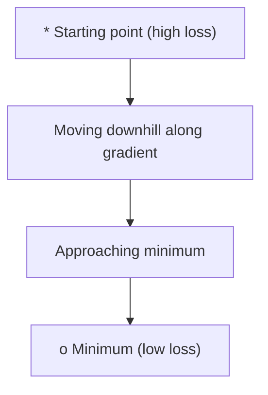
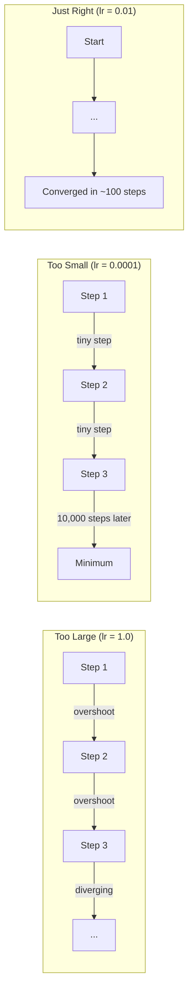
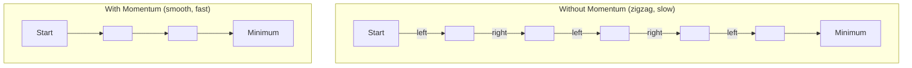
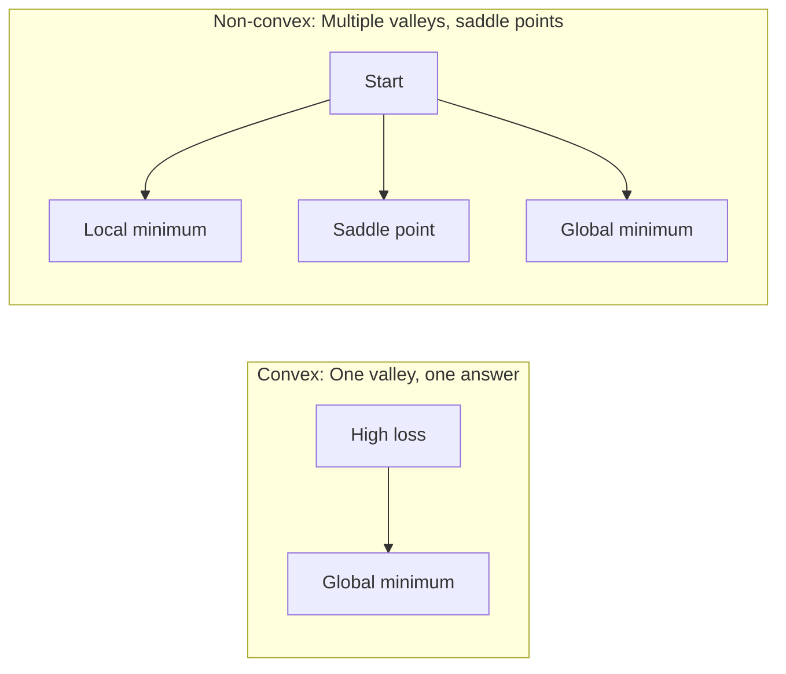
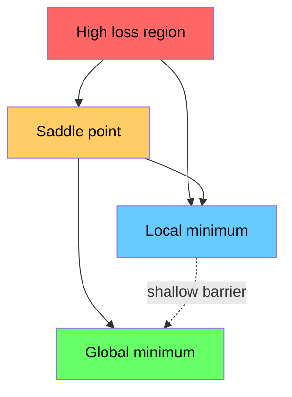

# Optimização .

> Treinar uma rede neural não é mais do que encontrar o fundo de um vale.
> O treinamento de redes neurológicas é encontrar o ponto mais baixo do vale.

**Type:** Build | **类型:** 动手
**Language:**O Python .**语言:**Python
**Prerequisites:** Phase 1, Lessons 04-05 (Derivatives, Gradients) | **前置知识:** Phase 1, Lessons 04-05 (Derivatives, Gradients)
**Time:** ~75 minutes | **时间:** ~75 分钟

## Objetivos de aprendizagem

- Implementar descida de gradiente de vainilha, SGD com impulso, e Adam a partir do zero
  A partir de zero, a redução do nível inicial, a redução do volume de movimentos, a SGD e o Adam  optimizador
- Compare a convergência do optimizador na função Rosenbrock e explique por que Adam adapta as taxas de aprendizagem por peso
  Em Rosenbrock  função comparar a capacidade de optimizador, explicar por que Adão para cada peso auto-adaptação taxa de aprendizagem
- Distinguir as paisagens de perdas convexas das não convexas e explicar o papel dos pontos de sela em dimensões elevadas
  区分凸与非凸损曲面,解释高维空间中点的作用
- Configurar os horários de aprendizagem (desintegração de etapas, cocinas, aquecimento) para a estabilidade do treinamento
  配置学习率调度(步衰减、余弦退火、预热) para garantir a estabilidade do treinamento

> **【中文解读】**
> 訓練神經网络就是"尋找山谷最低点"── 損失函数 diz-te que há muitos erros no presente, gradiência diz-te em que direção pode fazer o erro menor, otimizador decide como você vai── 本章从零实现 SGD、Momentum 和 AdamPyTorch

> **【拓展：优化器在 AI 中的位置】**
> - **SGD**O "ancestral" de todos os "otimizadores"
> - **Adam**Otimizador mais popular atualmente, taxa de aprendizagem de auto-adaptação + 动量, quase se tornou uma escolha de preferência.
> - **学习率调度**O treinamento inicial usa o grande passo, o rápido aproximamento do melhor, o último usa o pequeno passo, o ajustamento do cozinho e o aquecimento são os padrões de configuração do treinamento do transformador.

## O problema é o problema da introdução

Você tem uma função de perda. Ele diz-lhe o quão errado seu modelo é. Você tem gradientes. Eles dizem-lhe em que direção a perda piora. Agora você precisa de uma estratégia para caminhar para baixo.

> Você tem uma função de perda, que diz que o modelo tem uma diferença muito grande. Você tem uma gradiência, que diz que a direção para fazer a perda maior. Agora você precisa de uma estratégia para o fundo do vale.

A abordagem ingênua é simples: mover-se em direcção oposta ao gradiente. Escala o passo por algum número chamado taxa de aprendizagem. Repito. - Não. Isto é descida de gradiente, e funciona. Mas "trabalhos" tem algumas precauções. Uma taxa de aprendizagem muito alta e você ultrapassar o vale inteiramente, saltando entre paredes. É muito pequeno e você corre para a resposta através de milhares de passos desnecessários. Apetece-se a um ponto de sela e deixa de se mover, mesmo que não tenha encontrado um mínimo.

> O método é simples: ao longo da escala em direção contrária, o passo longo é controlado pela taxa de aprendizagem. Continuamente repetindo. É o que significa que a escala é baixa. Mas o "válido" é condicional: a taxa de aprendizagem é muito grande, você saltará pelo fundo do vale entre as duas paredes e vai voltar a tremer.

Cada optimizador no aprendizado profundo é uma resposta à mesma pergunta: como chegar ao fundo do vale mais rápido e de forma mais confiável?

> Cada ferramenta de otimização no aprendizado de profundidade responde à mesma pergunta: como chegar mais rápido e confiável ao fundo do vale?

> **【中文解读】**Você tem uma função de perda (You have a loss function) e um gradiente (You have a loss function) (You have a loss function) (You have a loss function) (You have a loss function) (You have a loss function) (You have a loss function) (You have a loss function) (You have a loss function) (You have a loss function) (You have a loss function) (You have a loss function) (You have a loss function) (You have a loss function) (You have a loss function) (You have a loss function) (You have a loss function) (You have a loss function) (You have a loss function) (You have a loss function) (You have a loss function) (You have a loss function) (You have a loss function) (You have a loss function) (You have a loss function) (You have a loss function) (You have a loss function) (You have a loss function) (You have a loss function) (You have a loss function) (You have a loss function) (You have a loss function) (You have a loss function) (You have a loss function) (You have a loss function) (You have a loss of a loss) (You have a loss of a loss) (You have a loss) (You have a loss) (You have a loss) (You have a loss) (You have a loss) (You have a) (You have a) (You have a) (You have a) (You have a) (You have a) (You have a) (You have a) (You have a) (You have a) (You have a) (You have a) (You have a) (You have a) (You have a) (You have a) (You have a) (You have a) (You have a) (You have a) (You have a) (You have a) (You) (You) (You) (You) (You) (You) (You) (You) (You) (You) (You) (You) (You) (You) (You) (You) (You) (You) (You) (You) (You) (You) (You) (You) (You) (You) (You) (You) (You) (You) (You) (You)

## O conceito central.

### O que é otimização? O que é otimização?

Otimizar é encontrar os valores de entrada que minimizam (ou maximizam) uma função. Na aprendizagem de máquina, a função é a perda. As entradas são os pesos do modelo. O treinamento é a otimização.

> 优化就是找到使函数最小化 (或最大化) 的输入值──在机器学习中,函数是损失函数,输入是模型权重──训练就是优化──

```
minimize L(w) where:
  L = loss function
  w = model weights (could be millions of parameters)
```

> **【拓展：优化是机器学习的引擎】**O processo de treinamento do GPT-4 é: usando uma função de perda de 1,8 bilhão de parâmetros, através de Adam 优化器代调整参数, para que a previsão seja cada vez mais precisa.`w = w - lr * gradient`- Não.

### Descenso gradual (vanilha) 梯度下降 (tempo de descida)

Otimizador mais simples: calcular o gradiente da perda em relação a cada peso. mover cada peso na direção oposta do seu gradiente. Escala o passo pela taxa de aprendizagem.

> Otimizador mais simples: cálculo de perda de peso em cada escala, movimentação em direção oposta, progresso de controle de taxa de aprendizagem.

```
w = w - lr * gradient
```

É o algoritmo inteiro.

> É o algoritmo perfeito.

> **【中文解读】**梯度下降: cálculo da perda de peso para cada escala de peso, em direção oposta, passo a passo, passo a passo pelo controle da taxa de aprendizagem.`w = w - lr * gradient`, um caminho completo.



### Taxa de aprendizagem: o hiperparâmetro mais importante

A taxa de aprendizagem controla o tamanho dos passos.

> O aprendizagem controla o progresso, decide tudo.



Não há fórmula para a taxa de aprendizagem certa. Você encontra por experimento. pontos de partida comuns: 0,001 para Adam, 0,01 para SGD com impulso.

> Não há um formulário que possa dizer-te a taxa de aprendizagem correta. Só podes experimentar.

> **【拓展：学习率选择的实践指南】**O nível de aprendizagem é o mais difícil de ajustar. O nível de aprendizagem é de 0,001 ⋅ 0,001 ⋅ 0,001 ⋅ 0,001 ⋅ 0,001 ⋅ 0,001 ⋅ 0,001 ⋅ 0,001 ⋅ 0,001 ⋅ 0,001 ⋅ 0,001 ⋅ 0,001 ⋅ 0,001 ⋅ 0,001 ⋅ 0,001 ⋅ 0,001 ⋅ 0,001 ⋅ 0,001 ⋅ 0,001 ⋅ 0,001 ⋅ 0,001 ⋅ 0,001 ⋅ 0,001 ⋅ 0,001 ⋅ 0,001 ⋅ 0,001 ⋅ 0,001 ⋅ 0,001 ⋅ 0,001 ⋅ 0,001 ⋅ 0,001 ⋅ 0,001 ⋅ 0,001 ⋅ 0,001 ⋅ 0,001 ⋅ 0,001 ⋅ 0,001 ⋅ 0,001 ⋅ 0,001 ⋅ 0,001 ⋅ 0,001 ⋅ 0,001 ⋅ 0,001 ⋅ 0,001 ⋅ 0,001 ⋅ 0,001 ⋅ 0,001 ⋅ 0,001 ⋅ 0,002 ⋅ 1 ⋅ 1 ⋅ 1 ⋅ 1 ⋅ 1 ⋅ 1 ⋅ 1 ⋅ 1 ⋅ 1 ⋅ 1 ⋅ 1 ⋅ 1 ⋅ 1 ⋅ 1 ⋅ 1 ⋅ 1 ⋅ 1 ⋅ 1 ⋅ 1 ⋅ 1 ⋅ 1 ⋅ 1 ⋅ 1 ⋅ 1 ⋅ 1 ⋅ 1 ⋅ 1 ⋅ 1 ⋅ 1 ⋅ 1 ⋅ 1 ⋅ 1 ⋅ 1 ⋅ 1 ⋅ 1 ⋅ 1 ⋅ 1 ⋅ 1 ⋅ 1 ⋅ 1 ⋅ 1 ⋅ 1 ⋅ 1 ⋅ 1 ⋅ 1 ⋅ 1 ⋅ 1 ⋅ 1 ⋅ 1 ⋅ 1 ⋅ 1 ⋅ 1 ⋅ 1 ⋅ 1 ⋅ 1 ⋅ 1 ⋅ 1 ⋅ 1 ⋅ 1 ⋅ 1 ⋅ 1 ⋅ 1 ⋅ 1 ⋅ 1 ⋅ 1 ⋅ 1 ⋅ 1 ⋅ 1 ⋅ 1 ⋅ 1   ⋅ 1 ⋅ 1   ⋅ 1     ⋅ 1               ⋅

### SGD vs. lote vs. mini lote . SGD vs. lote total vs. lote pequeno .

A descida do gradiente de vanilla calcula a descida do conjunto de dados inteiro antes de dar um passo.

> A gradiência inicial desce com todo o dados calculados antes de dar um passo.

A descida do gradiente estocástico (SGD) calcula o gradiente em uma única amostra aleatória e passa imediatamente.

> 随机梯度下降 (SGD) 随机梯度下降 (SGD) 随机梯度下降 (SGD) 随机梯度下降) 随机梯度下降 (SGD) 随机梯度下降 (SGD) 随机梯度下降 (SGD) 随机梯度下降) 随机梯度后立即更新──噪音大但快──

A descida do gradiente de mini-parcela divide a diferença. Calcule o gradiente em um pequeno lote (32, 64, 128, 256 amostras), e depois siga.

> Programa: usando um pequeno lote de dados (32、64、128、256 个样本) calculação de um gradiente posterior à actualização.

| Variant | Batch size | Gradient quality | Speed per step | Noise |
|---------|-----------|-----------------|---------------|-------|
| Batch GD / 全批量 | Entire dataset | Exact / 精确 | Slow / 慢 | None / 无 |
| SGD / 随机 | 1 sample | Very noisy / 噪声大 | Fast / 快 | High / 高 |
| Mini-batch / 小批量 | 32-256 | Good estimate / 好的估计 | Balanced / 均衡 | Moderate / 中等 |

O ruído no SGD e no mini-batch não é um bug, ajuda a escapar dos mínimos locais superficiais e dos pontos de sela.

> O SGD e o ruído no volume não são bugs, ele ajuda a escapar do nível inferior local de valor mínimo e pontos.

> **【中文解读】**Três tipos de cálculo de gradientes: 1) Batalha total com todos os dados calculados uma vez, está pronta, mas lenta; 2) SGD 随机 com uma data calculada, rápida, mas ruído grande; 3) Small batch折中方案, com 32/64/256 条数据──

### Impulso: a bola rola para baixo da colina

A descida do gradiente de vanilla só olha para o gradiente atual. Se o gradiente zigzag (comum em vales estreitos), o progresso é lento.

> Se a gradiência for apresentada em um pequeno vale, o progresso será lento.

```
v = beta * v + gradient
w = w - lr * v
```

A analogia: uma bola que rola para baixo, não para e reinicia a cada golpe, mas aumenta a velocidade em direções consistentes e amortece as oscilações.

> 类比: bola de montanha para baixo. Não se reinicia em cada ponta.



`beta`O beta mais alto significa mais impulso, caminhos mais suaves, mas uma resposta mais lenta às mudanças de direção.

> `beta`(normalmente 0,9) controle reter muito histórico. Beta mais alta significa maior movimento, mais plano caminho, mas a resposta à mudança de direção é mais lenta.

> **【拓展：动量在深度学习中的效果】**动量法让优化"记住" anterior direção, como o rol rol down mountain坡 积累动能. 优处:`torch.optim.SGD(lr=0.1, momentum=0.9)`O momento = 0,9 é a configuração habitual.

### Adam: Taxa de aprendizagem adaptativa Adam: Taxa de aprendizagem adaptativa

Os diferentes pesos precisam de diferentes taxas de aprendizagem. Um peso que raramente recebe grandes gradientes deve dar passos maiores quando finalmente o fizer. Um peso que recebe grandes gradientes constantemente deve dar passos menores.

> Diferentes pesos exigem diferentes taxas de aprendizagem. Poucos pesos de alta escala devem ser maiores, mas os pesos de alta escala devem ser menores.

Adam (Estimação de Momento Adaptativo) rastreia duas coisas por peso:
  Adam (Self-adaptation) para cada peso seguido duas quantidades:

1. Primeiro momento (m): média corrente de gradientes (como momento)
   一阶矩 (m): gradiente de movimento média
2. Segundo momento (v): média corrente de gradientes quadrados (magnitude de gradiente)
   Segundo grau (v): gradiência quadrada de movimento média

```
m = beta1 * m + (1 - beta1) * gradient
v = beta2 * v + (1 - beta2) * gradient^2

m_hat = m / (1 - beta1^t)    bias correction
v_hat = v / (1 - beta2^t)    bias correction

w = w - lr * m_hat / (sqrt(v_hat) + epsilon)
```

A divisão por `sqrt(v_hat)`Os pesos com grandes gradientes são divididos por um grande número (pequeno passo efetivo). Os pesos com pequenos gradientes são divididos por um pequeno número (grande passo efetivo). Cada peso tem sua própria taxa de aprendizagem adaptativa.

> Além de`sqrt(v_hat)`É um importante ponto de vista. Cada um dos grandes grupos tem o seu próprio ritmo de aprendizagem.

Hiperparametros padrão: `lr=0.001, beta1=0.9, beta2=0.999, epsilon=1e-8`Estas configurações funcionam bem para a maioria dos problemas.

> 默认超参数:`lr=0.001, beta1=0.9, beta2=0.999, epsilon=1e-8` Estes valores-preceptos são válidos para a maioria dos problemas

> **【中文解读】**Adam = Momentum + Auto-adaptation learning rate── é usado para cada parâmetro manter a "velocidade" independente, de acordo com a gradiência histórica.`torch.optim.Adam(lr=0.001)`Quase é uma escolha.

### A taxa de aprendizagem está em dia.

Uma taxa de aprendizagem fixa é um compromisso. No início do treino, você quer grandes passos para fazer progressos rápidos. No final do treino, você quer pequenos passos para ajustar-se perto do mínimo.

> A taxa de aprendizagem fixa é um esquema de desvio.

Horários comuns:
  常见调度方式:

| Schedule / 调度方式 | Formula / 公式 | Use case / 使用场景 |
|----------|---------|----------|
| Step decay / 步衰减 | lr = lr * factor every N epochs | Simple, manual control / 简单手动控制 |
| Exponential decay / 指数衰减 | lr = lr_0 * decay^t | Smooth reduction / 平滑递减 |
| Cosine annealing / 余弦退火 | lr = lr_min + 0.5 * (lr_max - lr_min) * (1 + cos(pi * t / T)) | Transformers, modern training / Transformer、现代训练 |
| Warmup + decay / 预热+衰减 | Linear ramp up, then decay | Large models, prevents early instability / 大模型，防止早期不稳定 |

### Convexo vs não-convexo .

Uma função convexa tem um mínimo. descida gradiente sempre encontra.`f(x) = x^2`é convexa.

> 凸函数 apenas um mínimo valor, gradiência baixa 总能找到──像 `f(x) = x^2`Essa segunda função é de conga.

As funções de perda de rede neural não são convexas.

> A função de perda da rede neural não é de grande dimensão, há vários pontos de valor mínimo em locais e regiões planas.



Na prática, os mínimos locais em redes neurais de alta dimensão raramente são um problema. A maioria dos mínimos locais tem valores de perda próximos ao mínimo global. Os pontos de sela (flatos em algumas direções, curvos em outras) são o verdadeiro obstáculo.

> Na prática, o mínimo local de um sistema nervoso de alta densidade é muito pouco problemático. A perda da maioria dos mínimos locais é próxima ao mínimo local.

> **【拓展：神经网络的损失曲面为什么是非凸的】**A função de perda de regresso linear é de forma simbólica (só um ponto mínimo, deve ser encontrado), mas a função de perda de rede neural tem inúmeros pontos mínimos e pontos mínimos locais no espaço paramétrico de 100 milhões de dimensões.

### Perda de visualização de paisagem Perda de visualização de paisagem

A perda é uma função de todos os pesos. Para um modelo com 1 milhão de pesos, a paisagem de perda vive em 1.000,001 dimensões. Nós visualizamos escolhendo duas direções aleatórias no espaço de peso e traçando a perda ao longo dessas direções, produzindo uma superfície 2D.

> 损失是所有权重的函数―― para há 100 000 modelos de peso, a perda de curvas existe em 1.000,001 dimensiones de espaço―― nós, através de escolher duas direções arbitrárias no espaço de peso, dessas direções desenhamos a perda para visualizar, obtemos uma curva 2D―



Os mínimos nítidos geralmente geralmente não são bem geralmente utilizados, mas os mínimos planos geralmente são bem geralmente geralmente geralmente geralmente geralmente geralmente geralmente geralmente geralmente geralmente geralmente geralmente geralmente geralmente geralmente geralmente geralmente geralmente geralmente geralmente geralmente geralmente geralmente geralmente geralmente geralmente geralmente geralmente geralmente geralmente geralmente geralmente geralmente geralmente geralmente geralmente geralmente geralmente geralmente geralmente geralmente geralmente geralmente geralmente geralmente geralmente geralmente geralmente geralmente geralmente geralmente geralmente geralmente geralmente geralmente geralmente geralmente geralmente geralmente geralmente geralmente geralmente geralmente geralmente geralmente geralmente geralmente geralmente geralmente geralmente geralmente geralmente geralmente geralmente geralmente geralmente geralmente geralmente geralmente geralmente geralmente geralmente geralmente geralmente geralmente geralmente geralmente geralmente geralmente geralmente geralmente geralmente geralmente geralmente geralmente geralmente geralmente geralmente geralmente geralmente geralmente geralmente geralmente geralmente geralmente geralmente geralmente geralmente geralmente geralmente geralmente geralmente geralmente geralmente geralmente geralmente geralmente geralmente geralmente geralmente geralmente geralmente geralmente geralmente geralmente geralmente geralmente geralmente geralmente geralmente geralmente geralmente geralmente geralmente geralmente geralmente geralmente geralmente geralmente geralmente geralmente geralmente geralmente geralmente geralmente geralmente geralmente geralmente geralmente geralmente geralmente geralmente geralmente geralmente geralmente geralmente geralmente geralmente geralmente geralmente geralmente geralmente geralmente geralmente geralmente geralmente geralmente geralmente geralmente geralmente geralmente geralmente geralmente geralmente geralmente geralmente geralmente geralmente geralmente geralmente geralmente geralmente geralmente geralmente geralmente geralmente geralmente geralmente geralmente geralmente geralmente geralmente geralmente geralmente geralmente geralmente geralmente geralmente geralmente geralmente geralmente geralmente geralmente geralmente geralmente geralmente geralmente geralmente ger ger ger ger ger ger ger ger ger ger ger ger ger ger ger ger ger ger ger ger ger ger ger ger ger ger ger ger ger ger ger ger ger ger ger ger ger ger ger ger ger ger ger ger ger ger ger ger ger ger ger ger ger ger ger ger ger ger ger ger ger ger ger ger ger ger ger ger ger

> O mínimo de potência de generalização de uma ponta é o mínimo de potência de generalização de uma ponta. Esta é uma das razões pelas quais a SGD com impulso é frequentemente superior a Adam na precisão do teste final: o seu ruído impede a queda no mínimo de ponta.
```figure
gradient-descent
```

## Construí-lo

## Construí-lo e realizei-o.

### Passo 1: Definir uma função de teste.

A função Rosenbrock é um padrão clássico de otimização. Seu mínimo é (1, 1) dentro de um vale curvo estreito que é fácil de encontrar, mas difícil de seguir.

> A função Rosenbrock é o clássico base de optimização. O seu valor mínimo é (1, 1), localizado em um vale de curvas muito difícil de encontrar, mas difícil de seguir.

```
f(x, y) = (1 - x)^2 + 100 * (y - x^2)^2
```

```python
def rosenbrock(params):
    x, y = params
    return (1 - x) ** 2 + 100 * (y - x ** 2) ** 2

def rosenbrock_gradient(params):
    x, y = params
    df_dx = -2 * (1 - x) + 200 * (y - x ** 2) * (-2 * x)
    df_dy = 200 * (y - x ** 2)
    return [df_dx, df_dy]
```

### Passo 2: Descenso do gradiente de vainilha.

```python
class GradientDescent:
    def __init__(self, lr=0.001):
        self.lr = lr

    def step(self, params, grads):
        return [p - self.lr * g for p, g in zip(params, grads)]
```

### Passo 3: SGD com impulso.

```python
class SGDMomentum:
    def __init__(self, lr=0.001, momentum=0.9):
        self.lr = lr
        self.momentum = momentum
        self.velocity = None

    def step(self, params, grads):
        if self.velocity is None:
            self.velocity = [0.0] * len(params)
        self.velocity = [
            self.momentum * v + g
            for v, g in zip(self.velocity, grads)
        ]
        return [p - self.lr * v for p, v in zip(params, self.velocity)]
```

### Passo 4: Adam.

```python
class Adam:
    def __init__(self, lr=0.001, beta1=0.9, beta2=0.999, epsilon=1e-8):
        self.lr = lr
        self.beta1 = beta1
        self.beta2 = beta2
        self.epsilon = epsilon
        self.m = None
        self.v = None
        self.t = 0

    def step(self, params, grads):
        if self.m is None:
            self.m = [0.0] * len(params)
            self.v = [0.0] * len(params)

        self.t += 1

        self.m = [
            self.beta1 * m + (1 - self.beta1) * g
            for m, g in zip(self.m, grads)
        ]
        self.v = [
            self.beta2 * v + (1 - self.beta2) * g ** 2
            for v, g in zip(self.v, grads)
        ]

        m_hat = [m / (1 - self.beta1 ** self.t) for m in self.m]
        v_hat = [v / (1 - self.beta2 ** self.t) for v in self.v]

        return [
            p - self.lr * mh / (vh ** 0.5 + self.epsilon)
            for p, mh, vh in zip(params, m_hat, v_hat)
        ]
```

### Passo 5: Correr e comparar.

```python
def optimize(optimizer, func, grad_func, start, steps=5000):
    params = list(start)
    history = [params[:]]
    for _ in range(steps):
        grads = grad_func(params)
        params = optimizer.step(params, grads)
        history.append(params[:])
    return history

start = [-1.0, 1.0]

gd_history = optimize(GradientDescent(lr=0.0005), rosenbrock, rosenbrock_gradient, start)
sgd_history = optimize(SGDMomentum(lr=0.0001, momentum=0.9), rosenbrock, rosenbrock_gradient, start)
adam_history = optimize(Adam(lr=0.01), rosenbrock, rosenbrock_gradient, start)

for name, history in [("GD", gd_history), ("SGD+M", sgd_history), ("Adam", adam_history)]:
    final = history[-1]
    loss = rosenbrock(final)
    print(f"{name:6s} -> x={final[0]:.6f}, y={final[1]:.6f}, loss={loss:.8f}")
```

A produção esperada: Adam converge mais rápido. SGD com impulso segue um caminho mais suave.

> 预期输出:Adam 收最快,SGD com impulso 路径更平滑,GD inicial em estreito vale progresso lento。

## Use-o com o framework implementado.

Na prática, use o PyTorch ou o JAX optimizers. Eles lidam com grupos de parâmetros, declínio de peso, corte de gradiente e aceleração da GPU.

> Na prática, utilizam o PyTorch ou o JAX.

> **【中文解读】**PyTorch 中优化器的标准使用法:`optimizer = torch.optim.Adam(model.parameters(), lr=0.001)`, e depois no ciclo de treinamento .`optimizer.zero_grad()`→ `loss.backward()`→ `optimizer.step()`O código é o ciclo central do treinamento de aprendizagem profunda.

```python
import torch

model = torch.nn.Linear(784, 10)

sgd = torch.optim.SGD(model.parameters(), lr=0.01, momentum=0.9)
adam = torch.optim.Adam(model.parameters(), lr=0.001)
adamw = torch.optim.AdamW(model.parameters(), lr=0.001, weight_decay=0.01)

scheduler = torch.optim.lr_scheduler.CosineAnnealingLR(adam, T_max=100)
```

Regras de execução:
  经验法则:

- Comece com o Adam (lr=0.001). Funciona para a maioria dos problemas sem sintonização.
  Desde Adam (lr=0.001) 开始,无需调参即可解决大多数问题──
- Passe para SGD com impulso (lr=0,01, impulso=0,9) quando precisar da melhor precisão final e pode pagar mais sintonização.
  Quando é necessário a melhor precisão final e pode suportar mais modificações, muda para SGD com impulso.
- Use AdamW (Adam com decomposição de peso descoplada) para transformadores.
  Transformador 模型使用亚当W(带解权重衰减的亚当)
- Sempre utilizar um cronograma de taxa de aprendizagem para a formação que dura mais do que algumas épocas.
                                                                                                                                                                                                                                                                
- Se o treino for instável, reduzir a taxa de aprendizagem.
   treino estável  redução da taxa de aprendizagem,  treino muito lento  aumento da taxa de aprendizagem universitária

## Envia-o . Produto .

Esta lição produz uma indicação para escolher o óptimo.`outputs/prompt-optimizer-guide.md`- Não .

> O curso é elaborado em um seleção de opções de opções de opções de opções de opções de opções de opções de opções de opções de opções de opções de opções de opções de opções de opções de opções de opções de opções de opções de opções de opções de opções de opções de opções de opções de opções de opções de opções de opções de opções de opções de opções de opções de opções de opções de opções de opções de opções de opções de opções de opções de opções de opções de opções de opções de opções de opções de opções de opções de opções de opções de opções de opções de opções de opções de opções de opções de opções de opções de opções de opções de opções de opções de opções de opções de opções de opções de opções de opções de opções de opções de opções de opções de opções de opções de opções de opções de opções de opções de opções de opções de opções de opções de opções de opções de opções de opções de opções de opções de opções de opções de opções de opções de opções de opções de opções de opções de opções de opções de opções de opções de opções de opções de opções de opções de opções de opções de opções de opções de opções de opções de opções de opções de opções de opções de opções de opções de opções de opções de opções de opções de opções de opções de opções de opções de opções de opções de opções de opções de opções de opções de opções de opções de opções de opções de opções de opções de opções de opções de opções de opções de opções de opções de opções de opções de opções de opções de opções de opções de opções de opções de opções de opções de opções.`outputs/prompt-optimizer-guide.md`- Não.

As classes de optimizadores construídas aqui reaparecem na Fase 3 quando treinamos uma rede neural a partir do zero.

> O tipo de optimizador construído aqui vai aparecer novamente na Fase 3 da rede neural de treinamento zero.

## Exercícios.

1. **Learning rate sweep.**Execute descida de gradiente de vainilha na função Rosenbrock com taxas de aprendizagem [0.0001, 0.0005, 0.001, 0.005, 0.01].
   **学习率扫描。**Use diferentes taxas de aprendizagem [0.0001, 0.0005, 0.001, 0.005, 0.01] em função de Rosenbrock 运行原始梯度下降──印印每学习率 5000 步后的最终损失──找到仍能收的最大学习率──

2. **Momentum comparison.**Execute SGD com valores de momento [0,0, 0,5, 0,9, 0,99] na função Rosenbrock.
   **动量比较。**Utilize diferentes valores mobiliários [0,0, 0,5, 0,9, 0,99] Em Rosenbrock  função opera SGD ⋅ acompanhar cada passo de perda ⋅ qual é o valor mobiliário recebido mais rápido? qual será o resultado?

3. **Saddle point escape.**Defina a função `f(x, y) = x^2 - y^2`Comparar como a vanilha GD, SGD com o momento, e Adam se comportam.
   **鞍点逃逸。**定义函数  função definida`f(x, y) = x^2 - y^2`(原点处有点) ――从 (0.01, 0.01) 开始──Compare GD、SGD original com momentum 和 Adam's behavior──哪个能逃出点?

4. **Implement learning rate decay.**Adicionar um cronograma de decomposição exponencial para a classe GradientDescent: `lr = lr_0 * 0.999^step`Comparar a convergência com e sem decadência na função Rosenbrock.
   **实现学习率衰减。**Em GradientDescent 类中添加指数衰减调度:`lr = lr_0 * 0.999^step` Comparar a situação de receção sem diminuir na função de Rosenbrock

## Termos-chave .

| Term / 术语 | What people say | What it actually means / 实际含义 |
|------|----------------|----------------------|
| Gradient descent / 梯度下降 | "Go downhill" | Update weights by subtracting the gradient scaled by the learning rate. The most basic optimizer. / 用学习率缩放梯度后从权重中减去，更新权重。最基础的优化器。 |
| Learning rate / 学习率 | "Step size" | A scalar that controls how far each update moves the weights. Too large causes divergence. Too small wastes compute. / 控制每次更新移动多远的标量。太大导致发散，太小浪费算力。 |
| Momentum / 动量 | "Keep rolling" | Accumulate past gradients into a velocity vector. Dampens oscillations and accelerates movement through consistent directions. / 将历史梯度累积到速度向量中。抑制震荡，在一致方向上加速。 |
| SGD / 随机梯度下降 | "Random sampling" | Stochastic gradient descent. Compute gradient on a random subset instead of the full dataset. Almost always means mini-batch SGD in practice. / 随机梯度下降。在随机子集上计算梯度。实践中几乎都指小批量 SGD。 |
| Mini-batch / 小批量 | "A chunk of data" | A small subset of training data (32-256 samples) used to estimate the gradient. Balances speed and gradient accuracy. / 训练数据的小子集（32-256 个样本），用于估计梯度。平衡速度和梯度精度。 |
| Adam / Adam 优化器 | "The default optimizer" | Adaptive Moment Estimation. Tracks per-weight running averages of gradients and squared gradients to give each weight its own learning rate. / 自适应矩估计。跟踪每个权重的梯度和平方梯度的移动平均，为每个权重提供独立的学习率。 |
| Bias correction / 偏差校正 | "Fix the cold start" | Adam's first and second moments are initialized to zero. Bias correction divides by (1 - beta^t) to compensate during early steps. / Adam 的一阶和二阶矩初始化为零。偏差校正除以 (1 - beta^t) 来补偿早期步骤。 |
| Learning rate schedule / 学习率调度 | "Change lr over time" | A function that adjusts the learning rate during training. Large steps early, small steps late. / 训练过程中调整学习率的函数。早期大步，后期小步。 |
| Convex function / 凸函数 | "One valley" | A function where any local minimum is the global minimum. Gradient descent always finds it. Neural network losses are not convex. / 任何局部最小值都是全局最小值的函数。梯度下降总能找到。神经网络损失不是凸的。 |
| Saddle point / 鞍点 | "Flat but not a minimum" | A point where the gradient is zero but it is a minimum in some directions and a maximum in others. Common in high dimensions. / 梯度为零但在某些方向是最小值、某些方向是最大值的点。在高维中常见。 |
| Loss landscape / 损失曲面 | "The terrain" | The loss function plotted over weight space. Visualized by slicing along two random directions. / 在权重空间上绘制的损失函数。通过沿两个随机方向切片来可视化。 |
| Convergence / 收敛 | "Getting there" | The optimizer has reached a point where further steps do not meaningfully reduce the loss. / 优化器已到达一个点，进一步步进不会显著降低损失。 |

## Mais leitura 延伸阅读

- [Sebastian Ruder: An overview of gradient descent optimization algorithms](https://ruder.io/optimizing-gradient-descent/)- uma pesquisa abrangente de todos os principais optimistas
  梯度下降优化算法综述, abrangendo totalmente todos os principais optimizadores
- [Why Momentum Really Works (Distill)](https://distill.pub/2017/momentum/)- visualização interativa da dinâmica de impulso
  Por que a interação de movimentos é eficaz, a interação de movimentos é visível
- [Adam: A Method for Stochastic Optimization (Kingma & Ba, 2014)](https://arxiv.org/abs/1412.6980)- o papel original de Adam, legível e curto
  Adam 原始论文, 可读且简短
- [Visualizing the Loss Landscape of Neural Nets (Li et al., 2018)](https://arxiv.org/abs/1712.09913)- o papel que mostrou mínimos nítidos versus planos
   mostrar trabalhos de ponta e plano mínimo
