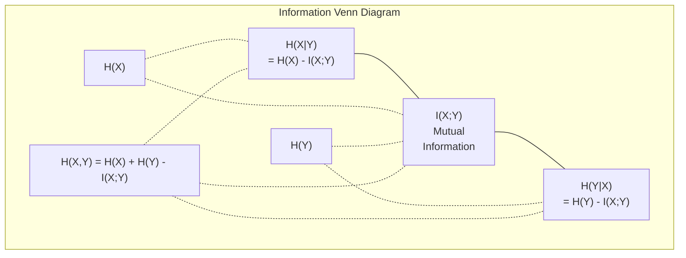

# Teoria da informação .

> A teoria da informação mede a surpresa.
> 信息论衡惊喜程度──损失函数建立在它──

**Type:** Learn | **类型:** 学习
**Language:**O Python .**语言:**Python
**Prerequisites:** Phase 1, Lesson 06 (Probability) | **前置知识:** Phase 1, Lesson 06 (Probability)
**Time:** ~60 minutes | **时间:** ~60 分钟

## Objetivos de aprendizagem

- Compute a entropia, a entropia cruzada e a divergência KL a partir do zero e explique sua relação
  Desde zero cálculo 、交叉  e KL 散度, explicar a relação entre eles
- Derivar por que minimizar a perda de entropia cruzada é equivalente a maximizar a probabilidade de log
  推导为什么最小化交叉损失等价于最大化对数似然
- Calcular informações mútuas entre características e um alvo para classificar a importância das características
                                                                                                                                                                                                                                                                                                                                                                                                                                                                                                                               
- Explique a perplexidade como o tamanho do vocabulário eficaz que um modelo de linguagem escolhe entre
  解释困惑度作为语言模型选择的有效词汇量

> **【中文解读】**
> 信息论衡量"惊喜程度"越不可能发生的事件,包含的信息量越大──交叉损失函数、KL 散度、困惑度(perplexity)这些概念统一在信息论的框架下──

> **【拓展：信息论在 AI 中的位置】**
> - **交叉熵损失**: 所有分类模型和语言模型的标准损失函数 (conhecimento padrão)`CrossEntropyLoss`)。
> - **KL 散度**O objetivo de treinamento do modelo de recompensa no RLHF é:
> - **困惑度(Perplexity)**语言模型的评价标准,越低越好,表示模型对下一个词的预测越确定──

## O problema é o problema da introdução

> **【中文解读】**Você está a treinar o modelo de classe .`CrossEntropyLoss()`, em linguagem modelo de trabalho vê "perplexidade", em VAE 蒸、RLHF encontrada KL 散度── estes não são conceitos independentes são conceitos de origem da informação, apenas mudou de capos diferentes── compreender a informação, já pode ver através de estes conceitos a essência de ligação──

## O conceito central.

> **【拓展：Shannon 与信息论的诞生】**Em 1948 Claude Shannon publicou a teoria matemática da comunicação, propondo um quadro de medida de informação com bits. 80 anos depois, esse quadro tornou-se a pedra angular da IA:交叉 é a função de perda de todas as categorias e modelos de linguagem, KL 散度 é a meta de formação do modelo (VAE 散散模型), informação é um instrumento de seleção de características.

### Conteúdo de informação (surpresa) 信息量(惊喜度)

Quando algo improvável acontece, ele carrega mais informações.

> Quando algo impossível acontece, ele traz mais informações.

O conteúdo de informação de um evento com probabilidade p é:
  概率为 p 的事件的信息量为:

```
I(x) = -log(p(x))
```

Usando o log base 2 dá bits, usando o log natural dá nats, a mesma ideia, unidades diferentes.
  Utilize em 2 por baixo de números obtêm bits), use natural de números obtêm netos.

```
Event              Probability    Surprise (bits)
Fair coin heads    0.5            1.0
Rolling a 6        0.167          2.58
1-in-1000 event    0.001          9.97
Certain event      1.0            0.0
```

Alguns eventos não contêm informação, já sabias que acontecerão.
> E é que os eventos trazem informação.

### Entropia (Sorpresa média)

Entropia é a surpresa esperada em todos os resultados possíveis de uma distribuição.
> 是分布中所有可能结果的期望惊喜―― é a expectativa de surpresa de todos os resultados possíveis da distribuição.

```
H(P) = -sum( p(x) * log(p(x)) )  for all x
```

Uma moeda justa tem entropia máxima para uma variável binária: 1 bit. Uma moeda tendenciosa (99% de cabeças) tem entropia baixa: 0,08 bits. Você já sabe o que vai acontecer, então cada virada diz-lhe quase nada.
> O valor de moeda livre em relação às variações de 2 divisões é de 1 bits. O valor de moeda livre em relação às variações de 2 divisões é de 1 bits.

```
Fair coin:    H = -(0.5 * log2(0.5) + 0.5 * log2(0.5)) = 1.0 bit
Biased coin:  H = -(0.99 * log2(0.99) + 0.01 * log2(0.01)) = 0.08 bits
```

A entropia mede a incerteza irredutível numa distribuição.
>  Não pode ser reduzida a incerteza na distribuição de medidas.

### Cross-Entropy (A Função de Perda que Você Usa Todos os Dias)

A entropia cruzada mede a surpresa média quando se usa a distribuição Q para codificar eventos que realmente vêm da distribuição P.
> 交叉 medir a utilização de distribuição Q 编码 实际来自布 P 的事件时的平均惊喜度──

```
H(P, Q) = -sum( p(x) * log(q(x)) )  for all x
```

P é a distribuição verdadeira (as etiquetas). Q é a previsão do seu modelo. Se Q coincide perfeitamente com P, a entropia cruzada é igual à entropia. Qualquer desajuste a torna maior.
> P é a distribuição real, Q é a previsão do modelo. Se Q é a perfeita correspondência P, o交叉 é igual a── qualquer não correspondência fará com que seja maior──

Na classificação, P é um vetor de um só calor (a classe verdadeira tem probabilidade 1, tudo o resto 0).
> Em分类中, P é um-quente 向量(真实类概率为 1,其余为 0) ;;

```
H(P, Q) = -log(q(true_class))
```

Isso é toda a fórmula de perda de entropia cruzada para classificação. Maximizar a probabilidade prevista da classe correta.
> É o que significa que a taxa de perda é igual a uma taxa de perda de uma taxa de taxa de taxa de taxa de taxa de taxa de taxa de taxa de taxa de taxa de taxa de taxa de taxa de taxa de taxa de taxa de taxa de taxa de taxa de taxa de taxa de taxa de taxa de taxa de taxa de taxa de taxa de taxa de taxa de taxa de taxa de taxa de taxa de taxa de taxa de taxa de taxa de taxa de taxa de taxa de taxa de taxa de taxa de taxa de taxa de taxa de taxa de taxa de taxa de taxa de taxa de taxa de taxa de taxa de taxa de taxa de taxa de taxa de taxa de taxa de taxa de taxa de taxa de taxa de taxa de taxa de taxa de taxa de taxa de taxa de taxa de taxa de taxa de taxa de taxa de taxa de taxa de taxa de taxa de taxa de taxa de taxa de taxa de taxa de taxa de taxa de taxa de taxa de taxa de taxa de taxa de taxa de taxa de taxa de taxa de taxa de taxa de taxa de taxa de taxa de taxa de taxa de taxa de taxa de taxa de taxa de taxa de taxa de taxa de taxa de taxa de taxa de taxa de taxa de taxa de taxa de taxa de taxa de taxa de taxa de taxa de taxa de taxa de taxa de taxa de taxa de taxa de taxa de taxa de taxa de taxa de taxa de taxa de taxa de taxa de taxa de taxa de taxa de taxa de taxa de taxa de taxa de taxa de taxa de taxa de taxa de taxa de taxa de taxa de taxa de taxa de taxa de taxa de taxa de taxa de taxa de taxa de taxa de taxa de taxa de taxa de taxa de taxa de taxa de taxa de taxa de taxa de taxa de taxa de taxa de taxa de taxa de taxa de taxa de taxa de taxa de taxa de taxa de taxa de taxa de taxa de taxa de taxa de taxa de taxa de taxa de taxa de taxa de taxa de taxa de taxa de taxa de taxa de taxa de taxa de taxa de taxa de taxa de taxa de taxa de taxa de taxa de taxa de taxa de taxa de taxa de taxa de taxa de taxa de taxa de taxa de taxa de taxa de taxa de taxa de taxa de taxa de taxa de taxa de taxa de taxa de taxa de taxa de taxa de taxa de taxa de taxa de taxa de taxa de taxa de taxa de taxa de taxa de taxa de taxa de taxa de taxa de taxa de taxa de taxa de taxa de taxa de taxa de taxa de taxa de taxa de

### KL Divergência (Distança entre Distribuições)

A divergência KL mede a quantidade de surpresa extra que você obtém usando Q em vez de P.
> KL 散度度衡量使用 Q 代替 P 时多出的惊喜度──

```
D_KL(P || Q) = sum( p(x) * log(p(x) / q(x)) )  for all x
             = H(P, Q) - H(P)
```

A entropia cruzada é entropia mais divergência KL. Como a entropia da distribuição verdadeira é constante durante o treinamento, minimizar a entropia cruzada é o mesmo que minimizar a divergência KL. Você está empurrando a distribuição do seu modelo para a distribuição verdadeira.
> 交叉 =  + KL 散度──Devido à distribuição real do processo de treinamento  é constante, minimizar o交叉 é igual a minimizar KL 散度── você está em direção à distribuição real do modelo──

A divergência KL não é simétrica: D_KL(P ∫ Q) != D_KL(Q ∫ P). Não é uma métrica de distância verdadeira.
> KL 散度不对称:D_KL  P_  Q) != DKL  Q                                                                                                                                                                                                                                                 

### Informações mútuas .

A informação mútua mede o quanto saber uma variável diz-lhe sobre outra.
> 互信息衡知道一个变量后能告诉你关于另一个变量多少信息──

```
I(X; Y) = H(X) - H(X|Y)
        = H(X) + H(Y) - H(X, Y)
```

Se X e Y são independentes, a informação mútua é zero. Saber um não diz nada sobre o outro. Se eles estão perfeitamente correlacionados, a informação mútua é igual à entropia de qualquer uma das variáveis.
> Se X e Y são independentes, a informação é zero. Se um não pode dizer-lhe qualquer informação sobre o outro, se é completamente relacionado, a informação é igual a qualquer variação.

Na seleção de características, uma alta informação mútua entre uma característica e o alvo significa que a característica é útil.
> Na seleção de características, a alta interação entre características e objetivos significa que as características são úteis.

### Entropia condicional.

H(Y de X) mede a quantidade de incerteza que permanece sobre Y após a observação de X.
> H                                                                                                                                                                                                                                                                                                                                                                                                                                                                                                                             

```
H(Y|X) = H(X,Y) - H(X)
```

Dois extremos:
  两个极端:

- Se X determina completamente Y, então H(Y ≠X) = 0. Conhecer X elimina toda a incerteza sobre Y. Exemplo: X = temperatura em Celsius, Y = temperatura em Fahrenheit.
  Se X  totalmente decidir Y, então H                                                                                                                                                                                                                                                                                                                                                                                                                                                                                                                     
- Se X não lhe diz nada sobre Y, então H(YX não) = H(Y). Saber X não reduz sua incerteza em tudo.
  Se X para Y                                                                                                                                                                                                                                                                                                                                                                                                                                                                                                                          

A entropia condicional é sempre não negativa e nunca excede H(Y):
> 条件始终非负且不超过 H(Y):

```
0 <= H(Y|X) <= H(Y)
```

Em aprendizado de máquina, a entropia condicional aparece em árvores de decisão. Em cada divisão, o algoritmo escolhe a característica X que minimiza H(Y X) - a característica que remove a maior incerteza sobre o rótulo Y.
> Em aprendizado de máquina, as condições aparecem na árvore de decisão. Em cada divisão, o algoritmo seleciona H  Y  X) o menor traço X é o mais capaz de eliminar o rótulo Y características incertezas.

### Entropia conjunta.

H ((X,Y) é a entropia da distribuição conjunta de X e Y juntos.
> H(X,Y) é X 和 Y 联合分布的──

```
H(X,Y) = -sum sum p(x,y) * log(p(x,y))   for all x, y
```

Propriedade chave:
  关键性质:

```
H(X,Y) <= H(X) + H(Y)
```

A igualdade é válida quando X e Y são independentes. Se eles compartilham informações, a entropia conjunta é menor que a soma de entropias individuais. A entropia "missente" é exatamente a informação mútua.
> Quando X e Y são independentes, se eles compartilham informações, os "falta" são apenas informações mútuas.



As relações:
  Relação:

- H(X,Y) = H(X) + H(Y que seja X) = H(Y) + H(X que seja)
- O valor de um valor de um valor de um valor de um valor de um valor de um valor de um valor de um valor de um valor de um valor de um valor de um valor de um valor de um valor de um valor de um valor de um valor de um valor de um valor de um valor de um valor de um valor de um valor de um valor de um valor de um valor de um valor de um valor de um valor de um valor de um valor de um valor de um valor de um valor de um valor de um valor de um valor de um valor de um valor de um valor de um valor de um valor de um valor de um valor de um valor de um valor de um valor de um valor de um valor de um valor de um valor de um valor de um valor de um valor de um valor de um valor de um valor de um valor de um valor de um valor de um valor de um valor de um valor de um valor de um valor de um valor de um valor de um valor de um valor de um valor de um valor de um valor de um valor de um valor de um valor de um valor de um valor de um valor de um valor de um valor de um valor de um valor de um valor de um valor de um valor de um valor de um valor de um valor de um valor de um valor de um valor de um valor de um valor de um valor de um valor de um valor de um valor de um valor de um valor de um valor de um valor de um valor de um valor de um valor de um valor de um valor de um valor de um valor de um valor de um valor de um valor de um valor de um valor de um valor de um valor de um valor de um valor de um valor de um valor de um valor de um valor de um valor de um valor de um valor de um valor de um valor de um valor de um valor de um valor de um valor de um valor de um valor de um valor de um valor de um valor de um valor de um valor de um valor de valor de valor de valor de um valor de valor de um valor de valor de valor de valor de um valor de valor de um valor de valor de valor de valor de valor de valor de valor de valor de valor de valor de valor de valor de valor de valor de valor de valor de valor de valor de valor de valor de valor de valor de valor de valor de valor de valor de valor de valor de valor de valor de valor de valor de valor de valor
- H(X,Y) = H(X) + H(Y) - I(X;Y)

### Informações mútuas (Deep Dive) 互信息(深入理解)

Informação mútua I  X; Y) quantifica o quanto o conhecimento de uma variável reduz a incerteza sobre a outra.
> 互信息 I(X;Y) 量化知道一变量后对另一变量不确定性的减少量──

```
I(X;Y) = H(X) - H(X|Y)
       = H(Y) - H(Y|X)
       = H(X) + H(Y) - H(X,Y)
       = sum sum p(x,y) * log(p(x,y) / (p(x) * p(y)))
```

Propriedades:
  Sexualidade:

- I ((X;Y) >= 0 sempre. Você nunca perde informações observando algo.
  I  X; Y) >= 0 始终成立── observar coisas nunca perderá informação──
- I ((X;Y) = 0 se e apenas se X e Y são independentes.
  I(X;Y) = 0 quando e apenas quando X 和 Y 独立。
- I(X;Y) = I(Y;X). É simétrico, ao contrário da divergência KL.
  I(X;Y) = I(Y;X)。 é em homologamento, diferente do KL 散度。
- I ((X;X) = H ((X). Uma variável compartilha todas as suas informações consigo mesma.
  I(X;X) = H(X)。变量与自身共享所有信息──

**Mutual information for feature selection.**Em ML, você quer recursos que sejam informativos sobre o alvo.
> **互信息用于特征选择。**No aprendizado de máquina, você precisa de traços de quantidade de informação para o objetivo.

1. Para cada característica X_i, calcular I(X_i; Y) onde Y é a variável alvo.
   Para cada característica X_i, calcular I(X_i; Y), entre elas Y é o objetivo de variação.
2. Características de classificação por pontuação MI.
   按MI 得分排序特征──
3. Mantém as características de cima.
   Não me deixe.

Isto funciona para qualquer relação entre característica e alvo -- linear, não linear, monótono ou não. A correlação só capta relações lineares.
> Isto se aplica a qualquer relação entre características e objetivos: linear, não linear, monomóvel ou não-monomóvel. A correlação só pode captar relações lineares, a informação pode captar tudo.

| Method / 方法 | Detects / 检测 | Computational cost / 计算成本 | Handles categorical? / 处理类别型？ |
|--------|---------|-------------------|---------------------|
| Pearson correlation / 皮尔逊相关 | Linear relationships / 线性关系 | O(n) | No / 否 |
| Spearman correlation / 斯皮尔曼相关 | Monotonic relationships / 单调关系 | O(n log n) | No / 否 |
| Mutual information / 互信息 | Any statistical dependency / 任何统计依赖 | O(n log n) with binning | Yes / 是 |

### Etiqueta: "Smoothing e Cross-Entropy"

A classificação padrão usa alvos duros: [0, 0, 1, 0]. A classe verdadeira recebe probabilidade 1, tudo o resto recebe 0.
> 标准分类使用硬目标:[0, 0, 1, 0]──真实类概率为 1,其余为 0──标签平滑将其替换为软目标:

```
soft_target = (1 - epsilon) * hard_target + epsilon / num_classes
```

Com epsilon = 0,1 e 4 classes:
  Quando epsilon = 0,1 且有 4 个类别时:

- Alvo duro: [0, 0, 1, 0]
- Alvo suave: [0,025, 0,025, 0,925, 0,025]

De uma perspectiva da teoria da informação, o suavizamento de rótulos aumenta a entropia da distribuição de alvos. Alvos rígidos com um só calor têm entropia 0 - não há incerteza. Alvos moles têm entropia positiva.
> Do ponto de vista da informação, o tag "plain" aumentou a distribuição de objetivos.

Por que isso ajuda:
  Por que é que isso ajuda ?

- Impede que o modelo conduza logits para valores extremos (seria necessário logits infinitos para combinar perfeitamente um alvo de uma única temperatura em entropia cruzada)
  防止模型将 logits 推到极端值 推到极端值 防止模型将 logits 推到极端值 推到极端值 推到极端值 防止模型将 logits 推到极端值 推到极端值 推到极端值 推到极端值 推到极端值 推到极端值 推到极端值 推到极端值 推到极端值 推到极端值 推到极端值 推到极端值 推到极端值 推到极端值 推到极端值 推到极端值 推到极端值 推到极端值 推到极端值 推到极端值 推到极端值 推到极端值 推到极端值 推到极端值 推到极端值 推到极端值 推到极端值 推到
- A atuação como regularização: o modelo não pode ser 100% confiante
  Como normalização: modelo não pode 100% auto-confiança
- Melhora a calibração: as probabilidades previstas refletem melhor a verdadeira incerteza
  改善校准:预测概率 melhor reflectir a realidade incerteza
- Reduz a diferença entre o treinamento e o comportamento de inferência
   Reduzir a diferença entre o exercício e o comportamento de avaliação

A perda de entropia cruzada com o suavização da etiqueta torna-se:
> 带标签平滑的交叉损失为:

```
L = (1 - epsilon) * CE(hard_target, prediction) + epsilon * H_uniform(prediction)
```

O segundo termo penaliza previsões que estão longe de ser uniformes -- uma regularização direta da confiança.
> O segundo é a regulamentação direta da confiança em relação à previsão de distribuição de distância média.

### Por que a entropia cruzada é a perda de classificação

Três perspectivas, a mesma conclusão.
> Três perspectivas, com um final.

**Information theory view.**A entropia cruzada mede quantos bits você desperdiça usando a distribuição do modelo em vez da distribuição real. Minimizando isso, o modelo torna-se o codificador mais eficiente da realidade.
> **信息论视角。**交叉 medir o uso de distribuição de modelos em vez da distribuição real desperdiçou muito bits── minimizar torna seu modelo o mais eficaz codificador real──

**Maximum likelihood view.**Para amostras de formação N com classes verdadeiras y_i:
> **最大似然视角。**对于 N 个训练样本,真实类别为 y_i:

```
Likelihood     = product( q(y_i) )
Log-likelihood = sum( log(q(y_i)) )
Negative log-likelihood = -sum( log(q(y_i)) )
```

Minimizar a entropia cruzada = maximizar a probabilidade dos dados de treinamento sob o seu modelo.
> A última linha é a de um trânsito.

**Gradient view.**O gradiente de entropia cruzada em relação às logitas é simples (previsto - verdadeiro). limpo, estável e rápido de calcular.
> **梯度视角。**交叉对logits的梯度就是 (predicted - true) ――简洁、稳定、计算快速──这就是为什么它与软max 完美搭配──

### Bits vs Nats.

A única diferença é a base do log.
> A única diferença é o número inferior do número.

```
log base 2   -> bits      (information theory tradition / 信息论传统)
log base e   -> nats      (machine learning convention / 机器学习惯例)
log base 10  -> hartleys  (rarely used / 很少使用)
```

1 nat = 1/ln(2) bits = 1,4427 bits. PyTorch e TensorFlow usam log natural (nats) por padrão.
> 1 nat = 1/ln(2) bits = 1,4427 bits。PyTorch 和 TensorFlow 默认使用自然对数(nats)。

### Perplexidade.

A perplexidade é o exponencial da entropia cruzada.
> A confusão é um índice de intersecção. Diz-lhe que o modelo é um tipo de probabilidade de escolha entre os dois.

```
Perplexity = 2^H(P,Q)   (if using bits / 使用 bits 时)
Perplexity = e^H(P,Q)   (if using nats / 使用 nats 时)
```

Um modelo de linguagem com perplexidade 50 é, em média, tão confuso como se tivesse que escolher uniformemente entre 50 tokens possíveis.
> 困惑度为 50 的语言模型,平均而言就像在 50 个可能的下一个词中均选择一样困惑──越低越好──

O GPT-2 alcançou uma perplexidade de ~30 em referências comuns.
> GPT-2 alcançou ~30 confusões no básico comum.

## Construí-lo e realizei-o.
```figure
entropy-kl
```

## Construí-lo

### Passo 1: Conteúdo de informação e entropia.

```python
import math

def information_content(p, base=2):
    if p <= 0 or p > 1:
        return float('inf') if p <= 0 else 0.0
    return -math.log(p) / math.log(base)

def entropy(probs, base=2):
    return sum(
        p * information_content(p, base)
        for p in probs if p > 0
    )

fair_coin = [0.5, 0.5]
biased_coin = [0.99, 0.01]
fair_die = [1/6] * 6

print(f"Fair coin entropy:   {entropy(fair_coin):.4f} bits")
print(f"Biased coin entropy: {entropy(biased_coin):.4f} bits")
print(f"Fair die entropy:    {entropy(fair_die):.4f} bits")
```

### Passo 2: Entropia cruzada e divergência KL.

```python
def cross_entropy(p, q, base=2):
    total = 0.0
    for pi, qi in zip(p, q):
        if pi > 0:
            if qi <= 0:
                return float('inf')
            total += pi * (-math.log(qi) / math.log(base))
    return total

def kl_divergence(p, q, base=2):
    return cross_entropy(p, q, base) - entropy(p, base)

true_dist = [0.7, 0.2, 0.1]
good_model = [0.6, 0.25, 0.15]
bad_model = [0.1, 0.1, 0.8]

print(f"Entropy of true dist:     {entropy(true_dist):.4f} bits")
print(f"CE (good model):          {cross_entropy(true_dist, good_model):.4f} bits")
print(f"CE (bad model):           {cross_entropy(true_dist, bad_model):.4f} bits")
print(f"KL divergence (good):     {kl_divergence(true_dist, good_model):.4f} bits")
print(f"KL divergence (bad):      {kl_divergence(true_dist, bad_model):.4f} bits")
```

### Passo 3: Entropia cruzada como perda de classificação.

```python
def softmax(logits):
    max_logit = max(logits)
    exps = [math.exp(z - max_logit) for z in logits]
    total = sum(exps)
    return [e / total for e in exps]

def cross_entropy_loss(true_class, logits):
    probs = softmax(logits)
    return -math.log(probs[true_class])

logits = [2.0, 1.0, 0.1]
true_class = 0

probs = softmax(logits)
loss = cross_entropy_loss(true_class, logits)

print(f"Logits:      {logits}")
print(f"Softmax:     {[f'{p:.4f}' for p in probs]}")
print(f"True class:  {true_class}")
print(f"Loss:        {loss:.4f} nats")
print(f"Perplexity:  {math.exp(loss):.2f}")
```

### Passo 4: A entropia cruzada é igual à probabilidade de log negativo.

```python
import random

random.seed(42)

n_samples = 1000
n_classes = 3
true_labels = [random.randint(0, n_classes - 1) for _ in range(n_samples)]
model_logits = [[random.gauss(0, 1) for _ in range(n_classes)] for _ in range(n_samples)]

ce_loss = sum(
    cross_entropy_loss(label, logits)
    for label, logits in zip(true_labels, model_logits)
) / n_samples

nll = -sum(
    math.log(softmax(logits)[label])
    for label, logits in zip(true_labels, model_logits)
) / n_samples

print(f"Cross-entropy loss:      {ce_loss:.6f}")
print(f"Negative log-likelihood: {nll:.6f}")
print(f"Difference:              {abs(ce_loss - nll):.2e}")
```

### Passo 5: Informação mútua.

```python
def mutual_information(joint_probs, base=2):
    rows = len(joint_probs)
    cols = len(joint_probs[0])

    margin_x = [sum(joint_probs[i][j] for j in range(cols)) for i in range(rows)]
    margin_y = [sum(joint_probs[i][j] for i in range(rows)) for j in range(cols)]

    mi = 0.0
    for i in range(rows):
        for j in range(cols):
            pxy = joint_probs[i][j]
            if pxy > 0:
                mi += pxy * math.log(pxy / (margin_x[i] * margin_y[j])) / math.log(base)
    return mi

independent = [[0.25, 0.25], [0.25, 0.25]]
dependent = [[0.45, 0.05], [0.05, 0.45]]

print(f"MI (independent): {mutual_information(independent):.4f} bits")
print(f"MI (dependent):   {mutual_information(dependent):.4f} bits")
```

## Use-o com o framework implementado.

Os mesmos conceitos que usam o NumPy, a forma como os usará na prática:
> Utilize NumPy 实现 o mesmo conceito, este é o seu modo de uso na prática:

```python
import numpy as np

def np_entropy(p):
    p = np.asarray(p, dtype=float)
    mask = p > 0
    result = np.zeros_like(p)
    result[mask] = p[mask] * np.log(p[mask])
    return -result.sum()

def np_cross_entropy(p, q):
    p, q = np.asarray(p, dtype=float), np.asarray(q, dtype=float)
    mask = p > 0
    return -(p[mask] * np.log(q[mask])).sum()

def np_kl_divergence(p, q):
    return np_cross_entropy(p, q) - np_entropy(p)

true = np.array([0.7, 0.2, 0.1])
pred = np.array([0.6, 0.25, 0.15])
print(f"Entropy:    {np_entropy(true):.4f} nats")
print(f"Cross-ent:  {np_cross_entropy(true, pred):.4f} nats")
print(f"KL div:     {np_kl_divergence(true, pred):.4f} nats")
```

Construiste a partir do nada o que ?`torch.nn.CrossEntropyLoss()`Agora sabe por que a perda diminui durante o treinamento: a distribuição prevista do seu modelo está a aproximar-se da distribuição real, medida em nats de informações desperdiçadas.
> Construíste-o a partir do zero.`torch.nn.CrossEntropyLoss()`                                                                                                                                                                                                                                                              

## Exercícios.

1. Calcule a entropia do alfabeto inglês assumindo uma distribuição uniforme (26 letras).
   假设均分布计算英文字母表(26 个字母) 的──然后使用实际字母频率估计──哪个更高?为什么?

2. Um modelo produz logits [5,0, 2.0, 0.5] para uma amostra com classe verdadeira 1. Calcule a perda de entropia cruzada à mão, em seguida, verifique com o seu `cross_entropy_loss`Qual logite daria perda zero?
   模型对真实类别为 1 的样本输出逻辑 [5.0, 2.0, 0.5]──手算交叉损失,然后用你的函数验证──什么逻辑会给出零损失?

3. Mostre que a divergência KL não é simétrica. Escolha duas distribuições P e Q e calcula D_K_K  Q) e DL  Q  P). Explique por que elas diferem.
   证明 KL 散度不对称──选择两个分布 P 和 Q,计算 D_KL(P 含 Q) 和 D_KL(Q 含 P)──解释为什么它们不同──

4. Construir uma função que calcula a perplexidade para uma sequência de previsões de tokens. Dada uma lista de pares (true_token_index, predicted_logits), retorne a perplexidade da sequência.
   Construir um token de cálculo  pré-conhecimento  confuso sequência  confuso sequência  confuso sequência  confuso sequência  confuso sequência  confuso sequência  confuso sequência  confuso sequência  confuso sequência  confuso sequência  confuso sequência  confuso sequência  confuso sequência  confuso sequência  confuso sequência  confuso sequência  confuso sequência  confuso sequência  confuso sequência  confuso sequência  confuso sequência  confuso sequência  confuso sequência  confuso sequência  confuso sequência  confuso sequência  confuso sequência  confuso sequência  confuso sequência  confuso sequência  confuso sequência  confuso sequência  confuso sequência  confuso sequência  confuso sequência  confuso sequência

## Termos-chave .

| Term / 术语 | What people say | What it actually means / 实际含义 |
|------|----------------|----------------------|
| Information content / 信息量 | "Surprise" | The number of bits (or nats) needed to encode an event: -log(p) / 编码事件所需的比特数（或奈特数）：-log(p) |
| Entropy / 熵 | "Randomness" | The average surprise across all outcomes of a distribution. Measures irreducible uncertainty. / 分布中所有结果的平均惊喜度。衡量不可约减的不确定性。 |
| Cross-entropy / 交叉熵 | "The loss function" | Average surprise when using model distribution Q to encode events from true distribution P. / 使用模型分布 Q 编码来自真实分布 P 的事件时的平均惊喜度。 |
| KL divergence / KL 散度 | "Distance between distributions" | Extra bits wasted by using Q instead of P. Equals cross-entropy minus entropy. Not symmetric. / 使用 Q 代替 P 浪费的额外比特。等于交叉熵减熵。不对称。 |
| Mutual information / 互信息 | "How related are X and Y" | Reduction in uncertainty about X from knowing Y. Zero means independent. / 知道 Y 后关于 X 不确定性的减少。零意味着独立。 |
| Softmax | "Turn logits into probabilities" | Exponentiate and normalize. Maps any real-valued vector to a valid probability distribution. / 指数化并归一化。将任意实值向量映射为有效概率分布。 |
| Perplexity / 困惑度 | "How confused the model is" | Exponential of cross-entropy. The effective vocabulary size the model is choosing from at each step. / 交叉熵的指数。模型每一步选择时的有效词汇量。 |
| Bits / 比特 | "Shannon's unit" | Information measured with log base 2. One bit resolves one fair coin flip. / 用以 2 为底的对数衡量的信息。一比特解决一次公平抛硬币。 |
| Nats / 奈特 | "ML's unit" | Information measured with natural log. Used by PyTorch and TensorFlow by default. / 用自然对数衡量的信息。PyTorch 和 TensorFlow 默认使用。 |
| Negative log-likelihood / 负对数似然 | "NLL loss" | Identical to cross-entropy loss for one-hot labels. Minimizing it maximizes the probability of correct predictions. / 对 one-hot 标签等价于交叉熵损失。最小化它等于最大化正确预测的概率。 |

## Mais leitura 延伸阅读

- [Shannon 1948: A Mathematical Theory of Communication](https://people.math.harvard.edu/~ctm/home/text/others/shannon/entropy/entropy.pdf)- o papel original, ainda legível
  Origem do artigo
- [Visual Information Theory (Chris Olah)](https://colah.github.io/posts/2015-09-Visual-Information/)- melhor explicação visual da entropia e da divergência KL
   e KL 散度 melhor visibilização explicação
- [PyTorch CrossEntropyLoss docs](https://pytorch.org/docs/stable/generated/torch.nn.CrossEntropyLoss.html)- como o quadro implementa o que acaba de construir
  框架 como implementar o conteúdo que você está construindo
