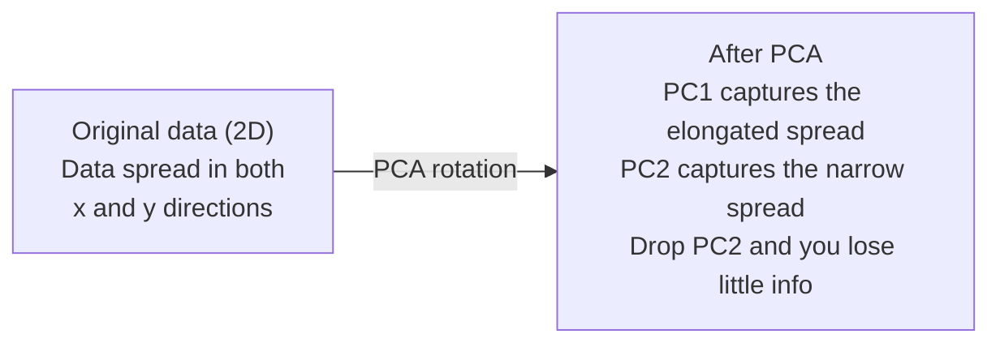

# Dimensionalização Reduzir.

> Os dados de alta dimensão têm estrutura.
> Há uma estrutura de dados altos.

**Type:** Build | **类型:** 动手
**Language:**O Python .**语言:**Python
**Prerequisites:** Phase 1, Lessons 01 (Linear Algebra Intuition), 02 (Vectors, Matrices & Operations), 03 (Eigenvalues & Eigenvectors), 06 (Probability & Distributions) | **前置知识:** Phase 1, Lessons 01-03, 06
**Time:** ~90 minutes | **时间:** ~90 分钟

## Objetivos de aprendizagem

- Implementar PCA a partir do zero: dados centrais, calcular a matriz de covariância, composição própria e projeto
  Desde zero, a PCA: datacentrização, cálculo de quadros de diferença, características de valor decompostas, projeção
- Utilize o coeficiente de variância explicado e o método de cotovelo para escolher o número de componentes principais
  Utilizando a interpretação de diferença e do lado direito escolher o número de componentes principais
- Comparar PCA, t-SNE e UMAP para visualizar os dígitos MNIST em 2D e explicar suas compensações
  Comparar PCA、t-SNE e UMAP em MNIST Manual Digital 2D
- Aplicar PCA do kernel com um kernel RBF para separar estruturas de dados não lineares que o PCA padrão não pode lidar
   aplicativo  RBF  núcleo de PCA nuclear  separação de padrão PCA  não-linear estrutura de dados processáveis

> **【中文解读】**
> O PCA é o método mais clássico de redução de dados, T-SNE e UMAP, adequado à visualização de dados não lineares.

> **【拓展：降维在 AI 中的位置】**
> - **PCA**: sklearn `PCA`, estándares de processamento de dados pré-processamento, também compreender a melhor prática de descomposição de características de valor.
> - **t-SNE/UMAP**O artigo é publicado em 15 de julho de 2015 e é publicado em 15 de julho de 2015.
> - **推荐系统**O que é que é o que é o que é o que é o que é o que é o que é o que é o que é o que é o que é o que é o que é o que é o que é o que é o que é o que é o que é o que é o que é o que é o que é o que é o que é o que é o que é o que é o que é o que é o que é o que é o que é o que é o que é.

## O problema é o problema da introdução

> **【中文解读】**784 维的手写数字数据(28×28 像素) não pode ser visualizado, nem pode ser intuitivamente compreendido. Mas a maior parte deles é redundante.

Talvez sejam valores de pixels de dígitos manuscritos, talvez seja nível de expressão genética, talvez seja sinal de comportamento do usuário, não se pode visualizar 784 dimensões, não se pode traçar, nem pensar neles.
> Talvez seja o valor de imagem numérica escrita à mão, talvez seja o nível de expressão genética, talvez seja o sinal de comportamento do usuário. Você não pode visualizar 784 dimensões, não pode desenhar, nem sequer imaginar.

Mas a maioria dessas características 784 são redundantes. A informação real vive em uma superfície muito menor. Uma "7" manuscrita não precisa de 784 números independentes para descrevê-la.
> Mas a maior parte dessas 784 características são redundantes. A informação realmente útil existe em uma superfície menor.

A redução de dimensões encontra a superfície menor, toma os dados 784 e comprime-os para 2, 10 ou 50 dimensões, mantendo a estrutura que importa.
> 降维找到那个更小的面──它将784 维数据压缩到2、10 或50 维,同时保留有意义的结构──

## O conceito central.

> **【拓展：PCA 与 LoRA 的数学联系】**PCA encontra a maior diferença de dados em direção a essa principal componente, que é a mesma ideia central do LoRA: o peso de actualização de dados de ΔW é concentrado em algumas direções.

### A maldição da dimensão.

Os espaços de alta dimensão não são intuitivos.
> O espaço elevado viola a percepção. Com o aumento da dimensão, surgem três coisas.

**Distance becomes meaningless.**Em dimensões altas, a distância entre dois pontos aleatórios converge para o mesmo valor. Se cada ponto é aproximadamente a mesma distância de todos os outros pontos, a busca do vizinho mais próximo deixa de funcionar.
> **距离变得无意义。**Em alta altura, a distância entre qualquer dois pontos aleatórios se aproxima do mesmo valor. Se cada ponto até todos os outros pontos estiverem a uma distância quase igual, a pesquisa próxima falhará.

```
Dimension    Avg distance ratio (max/min between random points)
2            ~5.0
10           ~1.8
100          ~1.2
1000         ~1.02
```

**Volume concentrates in corners.**Um hipercubo unitário em dimensões d tem curvas 2^d. Em 100 dimensões, quase todo o volume está nos curvas, longe do centro.
> **体积集中在角落。**D 维单位超立方体有2个角. Em 100 维中, quase todos os volumetos estão em um canto, longe do centro.

**You need exponentially more data.**Para manter a mesma densidade de amostras em um espaço, passar de 2D para 20D significa que você precisa de 10×18 vezes mais dados. Você nunca tem o suficiente. Dimensões reduzidas traz a densidade de dados de volta para algo viável.
> **需要指数级更多的数据。**De 2D a 20D, para manter a mesma densidade de amostra, é necessário 10^18 vezes mais dados.

### PCA: encontrar as direções que importam

A análise de componentes principais (PCA) encontra os eixos ao longo dos quais os seus dados variam mais.
> A análise de componentes principais (PCA) encontra o maior eixo de variação de dados.

O algoritmo:
  算法步骤:

```
1. Center the data        (subtract the mean from each feature) / 数据中心化
2. Compute covariance     (how features move together) / 计算协方差
3. Eigendecomposition     (find the principal directions) / 特征值分解
4. Sort by eigenvalue     (biggest variance first) / 按特征值排序
5. Project               (keep top k eigenvectors, drop the rest) / 投影
```

Por que a própria composição? A matriz de covariância é simétrica e semidefinida positiva. Seus próprios vetores são direções ortogonais no espaço de características. Os valores próprios dizem-lhe quanta variância cada direção capta. O próprio vetor com os maiores pontos de valor próprio ao longo da direção da variância máxima.
> Por que usar o valor de divisão de características? A matriz de divisão de características é chamada de semi-definida. O seu valor de características é o sentido de divisão de características no espaço de características. O valor de características diz-lhe em cada direção quanto diferença de características é capturada. O maior valor de características é o valor de divisão de características.



- **Before PCA:**A nuvem de dados está espalhada diagonalmente em ambos os eixos x e y
  **PCA 前：**dados nu em direção em direção transversal x e y 轴
- **After PCA:**O sistema de coordenadas é rotado de modo que o PC1 se alinhe com a direcção da variância máxima (espandimento prolongado) e o PC2 se alinhe com a direcção da variância mínima (espandimento estreito).
  **PCA 后：**坐标系旋转,PC1 para a maior direção de diferença,PC2 para a menor direção de diferença
- **Dimensionality reduction:**Deixando o PC2 projetar os dados para o PC1, perdendo muito pouca informação
  **降维：**Deixe o PC2 projetar os dados para o PC1, perdendo pouca informação.

### Relação de variância explicada

Cada componente principal capta uma fração da variância total.
> Cada componente principal é parte do total de diferença de captura.

```
Component    Eigenvalue    Explained ratio    Cumulative
PC1          4.73          0.473              0.473
PC2          2.51          0.251              0.724
PC3          1.12          0.112              0.836
PC4          0.89          0.089              0.925
...
```

Quando a variância explicada acumulativa atinge 0,95, você sabe que muitos componentes capturam 95% das informações.
> Quando a diferença de explicação acumulada atinge 0,95, estes componentes capturam 95% da informação.

### Escolher o número de componentes   escolher o número de componentes

Três estratégias:
  Três estratégias:

1. **Threshold.**Mantenha componentes suficientes para explicar 90-95% da variação.
   **阈值法。**Manter um ingrediente suficiente para explicar a diferença entre 90 e 95%.
2. **Elbow method.**A trama explicou a variação por componente.
   **肘部法则。**绘制每个成分的解释方差,寻找急剧下降点──
3. **Downstream performance.**Use o PCA como pré-processamento, varre o k e mede a precisão do seu modelo.
   **下游性能。**Use o PCA como pré-processamento.

### Preservação dos bairros.

A Integração de Vezinho Stocástico Distribuído (t-SNE) é projetada para visualização.
> t-SNE 专为可视化设计──它将高维数据映射到2D((或3D), ao mesmo tempo em que mantém quais pontos se aproximam uns dos outros──

A intuição: no espaço original, calcular uma distribuição de probabilidade sobre pares de pontos com base em suas distâncias. pontos próximos obtêm alta probabilidade. pontos distantes obtêm baixa probabilidade. Então, encontrar um arranjo 2D onde a mesma distribuição de probabilidade ocorre. pontos que eram vizinhos em 784 dimensões permanecem vizinhos em 2D.
> 直觉: no espaço primitivo, baseada na distribuição de probabilidade entre pontos calculados à distância.

Propriedades-chave do t-SNE:
  Características principais do t-SNE:

- Não linear, pode desenrolar variedades complexas que a PCA não pode.
  Não linear. Pode desenvolver PCA.
- As corridas diferentes produzem layouts diferentes.
  随机性── diferentes operações produzem diferentes arranjos──
- O parâmetro de perplexidade controla quantos vizinhos devem ser considerados (intervalo típico: 5-50).
  Perplexidade 参数控制考虑多少邻居 (conclusão)
- As distâncias entre os aglomerados na saída não são significativas.
  output entre as classes não significam nada.
- Lenta em grandes conjuntos de dados.
  O que é que é o que é o que é o que é o que é o que é o que é o que é o que é o que é o que é o que é o que é o que é o que é o que é o que é o que é o que é o que é o que é o que é o que é o que é o que é o que é o que é o que é o que é o que é o que é o que é o que é?

### UMAP: mais rápido, melhor estrutura global.

A aproximação e projeção de manifusão uniforme (UMAP) funciona de forma semelhante à t-SNE, mas com duas vantagens:
> UmAP é semelhante ao t-SNE, mas tem duas vantagens:

- Ele usa gráficos aproximados do vizinho mais próximo em vez de calcular todas as distâncias em pares.
  Mais rápido: utilizar o mapa de proximidade mais próximo do que o cálculo de distância.
- Melhor estrutura global: as posições relativas dos clusters na produção tendem a ser mais significativas do que na t-SNE.
  Melhor estrutura geral. Output em concentração de classes em relação à posição do t-SNE.

UMAP constrói um gráfico ponderado em espaço de alta dimensão (a "representação topológica confusa") e, em seguida, encontra um layout de baixa dimensão que preserva este gráfico o melhor possível.
> UMAP em alto espaço construir mais gráficos (模糊拓表示), e depois encontrar o máximo possível para manter o plano de baixo nível.

Parâmetros-chave:
  关键参数:

- `n_neighbors`A definição de um sistema de construção local é mais ampla, mas não é necessária para a definição de um sistema de construção local.
  `n_neighbors`O valor de um vizinho é muito maior que o valor de um vizinho.
- `min_dist`Os valores inferiores criam aglomerados mais densos.
  `min_dist`Output: densidade do ponto central de concentração.

### Quando usar qual ? Qual é o método ?

| Method / 方法 | Use case / 使用场景 | Preserves / 保留 | Speed / 速度 |
|--------|----------|-----------|-------|
| PCA | Preprocessing before training / 训练前预处理 | Global variance / 全局方差 | Fast (exact), works on millions of samples / 快速（精确），支持百万级样本 |
| PCA | Quick exploratory visualization / 快速探索性可视化 | Linear structure / 线性结构 | Fast / 快 |
| t-SNE | Publication-quality 2D plots / 发表级 2D 图 | Local neighborhoods / 局部邻域 | Slow (< 10k samples ideal) / 慢（<1万样本最佳） |
| UMAP | 2D visualization at scale / 大规模 2D 可视化 | Local + some global structure / 局部+部分全局结构 | Medium (handles millions) / 中等（支持百万级） |
| PCA | Feature reduction for models / 模型特征降维 | Variance-ranked features / 方差排序特征 | Fast / 快 |
| t-SNE / UMAP | Understanding cluster structure / 理解聚类结构 | Cluster separation / 聚类分离 | Medium to slow / 中等到慢 |

Regra geral: utilizar PCA para pré-processamento e compressão de dados.
> 經驗法则:PCA Usado para pré-processamento e compressão de dados.

### PCA nuclear.

O PCA padrão encontra subespaços lineares. Ele gira o seu sistema de coordenadas e deixa cair eixos. Mas e se os dados estiverem em um variável não linear? Um círculo em 2D não pode ser separado por nenhuma linha.
> 標準PCA 找线性子空间── mas se os dados estiverem em forma de fluxo não-linear?2D os círculos no meio não podem ser separados de qualquer linha direta──標準PCA 无能为力──

O PCA do núcleo aplica o PCA em um espaço de características de alta dimensão induzido por uma função do núcleo, sem calcular explicitamente as coordenadas nesse espaço.
> A PCA nuclear é aplicada no espaço de alta densidade induzida pela função nuclear, não explicitamente calculada a localização nesse espaço.

O algoritmo:
  算法步骤:

1. Calcule a matriz do kernel K onde K_ij = k(x_i, x_j)
   计算核矩阵 K, em que K_ij = k(x_i, x_j)
2. Centrar a matriz do kernel no espaço de recursos
   Em característico espaço em centro
3. Eigendecompose a matriz do kernel centrado
   Para a matrizes nucleares de desintegração de valores
4. Os vetores próprios superiores (escalados por 1/sqrt(eigenvalue)) são as projeções
   顶部特征向量(缩放 1/sqrt(特征值)) é para projeção

Funções comuns do kernel:
  常见核函数:

| Kernel / 核函数 | Formula / 公式 | Good for / 适用于 |
|--------|---------|----------|
| RBF (Gaussian) | exp(-gamma * \|\|x - y\|\|^2) | Most nonlinear data, smooth manifolds / 大多数非线性数据，光滑流形 |
| Polynomial / 多项式 | (x . y + c)^d | Polynomial relationships / 多项式关系 |
| Sigmoid | tanh(alpha * x . y + c) | Neural network-like mappings / 类神经网络映射 |

Quando utilizar PCA do kernel versus PCA padrão:
  核 PCA vs 标准 PCA 的使用场景:

| Criterion / 标准 | Standard PCA / 标准 PCA | Kernel PCA / 核 PCA |
|-----------|-------------|------------|
| Data structure / 数据结构 | Linear subspace / 线性子空间 | Nonlinear manifold / 非线性流形 |
| Speed / 速度 | O(min(n^2 d, d^2 n)) | O(n^2 d + n^3) |
| Interpretability / 可解释性 | Components are linear combinations of features / 成分是特征的线性组合 | Components lack direct feature interpretation / 成分缺乏直接特征解释 |
| Scalability / 可扩展性 | Works on millions of samples / 支持百万级样本 | Kernel matrix is n x n, memory-limited / 核矩阵为 n x n，受内存限制 |
| Reconstruction / 重建 | Direct inverse transform / 直接逆变换 | Requires pre-image approximation / 需要预图像近似 |

O exemplo clássico: círculos concêntricos em 2D. Dois anéis de pontos, um dentro do outro. PCA padrão projeta ambos na mesma linha - inútil para classificação. PCA kernel com um kernel RBF mapeia o círculo interno e o círculo externo em diferentes regiões, tornando-os linearmente separáveis.
> 经典例:2D 同心圆──两圈点,一圈在另一圈中──标准PCA将两者投影到同一线上对分类无用──带RBF 核PCA将内圈和外圈映射到不同区域,使其线性可分──

### Erro de reconstrução. Erro de reconstrução.

Comprei 784 dimensões para 50.
> Como é que o seu efeito de redução?

Meter o erro de reconstrução:
  测量重建误差:

1. Dados do projeto para dimensões k: X_reduzido = X @ W_k
   A projeção de dados para k 维
2. Reconstruir: X_hat = X_reduzido @ W_k^T
   Câmara
3. MSE de cálculo: média (X - X_hat) ^2)
   计算 MSE

Para PCA, o erro de reconstrução tem uma relação clara com a variância explicada:
> Para a PCA, a reconstituição de erros e a interpretação têm uma relação simples:

```
Reconstruction error = sum of eigenvalues NOT included
Total variance = sum of ALL eigenvalues
Fraction lost = (sum of dropped eigenvalues) / (sum of all eigenvalues)
```

A relação de variância explicada para cada componente é:
> Cada componente é explicado de forma diferente:

```
explained_ratio_k = eigenvalue_k / sum(all eigenvalues)
```

A traçação da variância explicada acumulativa contra o número de componentes dá-lhe a curva "cotovelo".
> 図集 図集 図集 図集 図集 図集 図集 図集 図集 図集 図集 図集 図集 図集 図集 図集 図集 図集 図集 図集 図集 図集 図集 図集 図集 図集 図集 図集 図集 図集 図集 図集 図集 図集 図集 図集 図集 図集 図集 図集 図集 図集 図集 図集 図集 図集 図集 図集 図集 図集 図集 図集 図集 図集 図集 図集 図集 図集 図集 図集 図集 図集 図集 図集 図集 図集 図集 図集 図集 図集 図集 図集 図集 図集 図集 図集 図集 図集 図集 図集 図集 図 図 図 図 図 図 図 図 図 図 図 図 図 図 図 図 図 図 図 図 図 図 図 図 図 図 図 図 図 図 図 図 図 図 図 図 図 図 図 図 図 図 図 図 図 図 図 図 図 図 図 図 図 図 図 図 図 図 図 図 図 図 図 図 図 図 図 図 図 図 図 図 図 図 図 図 図 図 図 図 図 図 図 図 図 図 図 図 図 図 図 図 図 図 図 図 図 図 図 図 図 図 図 図 図 図 図 図 図 図 図 図 図 図 図 図 図 図 図 図 図 図    図 図 図   図 図 図 図  図 

- A curva se aplata (retorno em diminuição) / 曲线变平(收益递减)
- A variância acumulada cruza o seu limiar (geralmente 0,90 ou 0,95) / 累积方差超值
- Plateaus de desempenho de tarefas descendentes / 下游 desempenho de tarefas alcançar plataforma期

O erro de reconstrução é útil além da escolha de k. Você pode usá-lo para a detecção de anomalias: amostras com alto erro de reconstrução são anormais que não se encaixam no subspaço aprendido. Esta é a base da detecção de anomalias baseada em PCA em sistemas de produção.
> O erro de construção não é apenas usado para selecionar k. Você também pode ser usado para exames anormais: o modelo de erro de construção não é conforme com o valor anormal do espaço de aprendizagem.

## Construí-lo e realizei-o.
```figure
pca-axes
```

## Construí-lo

> **【中文解读】**A seguir, o processo completo de implementação do PCA é zero: datacentrização → 协方差矩阵 → Features value decompress → 投影── em seguida, em dados do MNIST, em relação ao PCA、t-SNE、UMAP.

### Passo 1: PCA a partir do zero.

```python
import numpy as np

class PCA:
    def __init__(self, n_components):
        self.n_components = n_components
        self.components = None
        self.mean = None
        self.eigenvalues = None
        self.explained_variance_ratio_ = None

    def fit(self, X):
        self.mean = np.mean(X, axis=0)
        X_centered = X - self.mean

        cov_matrix = np.cov(X_centered, rowvar=False)

        eigenvalues, eigenvectors = np.linalg.eigh(cov_matrix)

        sorted_idx = np.argsort(eigenvalues)[::-1]
        eigenvalues = eigenvalues[sorted_idx]
        eigenvectors = eigenvectors[:, sorted_idx]

        self.components = eigenvectors[:, :self.n_components].T
        self.eigenvalues = eigenvalues[:self.n_components]
        total_var = np.sum(eigenvalues)
        self.explained_variance_ratio_ = self.eigenvalues / total_var

        return self

    def transform(self, X):
        X_centered = X - self.mean
        return X_centered @ self.components.T

    def fit_transform(self, X):
        self.fit(X)
        return self.transform(X)
```

### Passo 2: Teste em dados sintéticos.

```python
np.random.seed(42)
n_samples = 500

t = np.random.uniform(0, 2 * np.pi, n_samples)
x1 = 3 * np.cos(t) + np.random.normal(0, 0.2, n_samples)
x2 = 3 * np.sin(t) + np.random.normal(0, 0.2, n_samples)
x3 = 0.5 * x1 + 0.3 * x2 + np.random.normal(0, 0.1, n_samples)

X_synthetic = np.column_stack([x1, x2, x3])

pca = PCA(n_components=2)
X_reduced = pca.fit_transform(X_synthetic)

print(f"Original shape: {X_synthetic.shape}")
print(f"Reduced shape:  {X_reduced.shape}")
print(f"Explained variance ratios: {pca.explained_variance_ratio_}")
print(f"Total variance captured: {sum(pca.explained_variance_ratio_):.4f}")
```

### Passo 3: Números do MNIST em 2D.

```python
from sklearn.datasets import fetch_openml

mnist = fetch_openml("mnist_784", version=1, as_frame=False, parser="auto")
X_mnist = mnist.data[:5000].astype(float)
y_mnist = mnist.target[:5000].astype(int)

pca_mnist = PCA(n_components=50)
X_pca50 = pca_mnist.fit_transform(X_mnist)
print(f"50 components capture {sum(pca_mnist.explained_variance_ratio_):.2%} of variance")

pca_2d = PCA(n_components=2)
X_pca2d = pca_2d.fit_transform(X_mnist)
print(f"2 components capture {sum(pca_2d.explained_variance_ratio_):.2%} of variance")
```

### Passo 4: Comparar com o sklearn.

```python
from sklearn.decomposition import PCA as SklearnPCA
from sklearn.manifold import TSNE

sklearn_pca = SklearnPCA(n_components=2)
X_sklearn_pca = sklearn_pca.fit_transform(X_mnist)

print(f"\nOur PCA explained variance:     {pca_2d.explained_variance_ratio_}")
print(f"Sklearn PCA explained variance: {sklearn_pca.explained_variance_ratio_}")

diff = np.abs(np.abs(X_pca2d) - np.abs(X_sklearn_pca))
print(f"Max absolute difference: {diff.max():.10f}")

tsne = TSNE(n_components=2, perplexity=30, random_state=42)
X_tsne = tsne.fit_transform(X_mnist)
print(f"\nt-SNE output shape: {X_tsne.shape}")
```

### Passo 5: Comparar UMAP.

```python
try:
    from umap import UMAP

    reducer = UMAP(n_components=2, n_neighbors=15, min_dist=0.1, random_state=42)
    X_umap = reducer.fit_transform(X_mnist)
    print(f"UMAP output shape: {X_umap.shape}")
except ImportError:
    print("Install umap-learn: pip install umap-learn")
```

## Use-o com o framework implementado.

> **【拓展：t-SNE vs UMAP 选哪个？】**t-SNE: método clássico, manter um local de proximidade, adaptar-se ao encontro de dados em uma estrutura de aglomeração.

A PCA como pré-processamento antes de um classificador:
> Para PCA como pré-processamento de divisão:

```python
from sklearn.decomposition import PCA as SklearnPCA
from sklearn.linear_model import LogisticRegression
from sklearn.model_selection import train_test_split
from sklearn.metrics import accuracy_score

X_train, X_test, y_train, y_test = train_test_split(
    X_mnist, y_mnist, test_size=0.2, random_state=42
)

results = {}
for k in [10, 30, 50, 100, 200]:
    pca_k = SklearnPCA(n_components=k)
    X_tr = pca_k.fit_transform(X_train)
    X_te = pca_k.transform(X_test)

    clf = LogisticRegression(max_iter=1000, random_state=42)
    clf.fit(X_tr, y_train)
    acc = accuracy_score(y_test, clf.predict(X_te))
    var_captured = sum(pca_k.explained_variance_ratio_)
    results[k] = (acc, var_captured)
    print(f"k={k:>3d}  accuracy={acc:.4f}  variance={var_captured:.4f}")
```

O plano de desempenho muito antes das dimensões 784.
> O desempenho é muito inferior a 784 W quando você alcança o período da plataforma.

## Envia-o . Produto .

Esta lição produz:
> 本课程产出:

- `outputs/skill-dimensionality-reduction.md`- habilidade para escolher a técnica de redução de dimensões adequada para uma determinada tarefa
  Um documento de habilidades para um determinado trabalho

## Exercícios.

1. Modificar a classe PCA para suportar `inverse_transform`. Reconstruir os dígitos MNIST a partir de 10, 50 e 200 componentes. Imprimir o erro de reconstrução (diferença média quadrada do original) para cada um.
   Modificar PCA 类以支持 `inverse_transform`△ Usar 10、50 和 200 个成分重建 MNIST 数字──印每一个重建错误──

2. Exerça t-SNE no mesmo subconjunto MNIST com valores de perplexidade de 5, 30 e 100. Descreva como a saída muda.
   Utilize perplexity 值 5、30 和 100 在相同的 MNIST 子集上运行 t-SNE──描述输出变化──为什么 perplexity 影响聚类密度?

3. Tomar um conjunto de dados com 50 características onde apenas 5 são informativas (gerar um com `sklearn.datasets.make_classification`) Aplicar PCA e verificar se a curva de variância explicada identifica corretamente que os dados são efetivamente 5D.
   Tome um com 50 características, mas apenas 5 conjuntos de dados úteis. Aplique PCA, verifique se a curva de interpretação da diferença de divisão é correta.

## Termos-chave .

| Term / 术语 | What people say | What it actually means / 实际含义 |
|------|----------------|----------------------|
| Curse of dimensionality / 维度灾难 | "Too many features" | Distances, volumes, and data density all behave counterintuitively as dimensions grow. Models need exponentially more data to compensate. / 随维度增长，距离、体积和数据密度都反直觉。模型需要指数级更多数据来补偿。 |
| PCA / 主成分分析 | "Reduce dimensions" | Rotate your coordinate system so the axes align with the directions of maximum variance, then drop the low-variance axes. / 旋转坐标系使轴对齐最大方差方向，然后丢弃低方差轴。 |
| Principal component / 主成分 | "An important direction" | An eigenvector of the covariance matrix. The direction in feature space along which the data varies most. / 协方差矩阵的特征向量。特征空间中数据变化最大的方向。 |
| Explained variance ratio / 解释方差比 | "How much info this component has" | The fraction of total variance captured by one principal component. Sum the top k ratios to see how much k components preserve. / 一个主成分捕获的总方差比例。累加前 k 个比率看 k 个成分保留了多少。 |
| Covariance matrix / 协方差矩阵 | "How features correlate" | A symmetric matrix where entry (i,j) measures how feature i and feature j move together. Diagonal entries are individual variances. / 对称矩阵，第 (i,j) 项衡量特征 i 和 j 如何共同变化。对角项是各自方差。 |
| t-SNE | "That cluster plot" | A nonlinear method that maps high-dimensional data to 2D by preserving pairwise neighborhood probabilities. Good for visualization, not for preprocessing. / 非线性方法，通过保留成对邻域概率将高维数据映射到 2D。适合可视化，不适合预处理。 |
| UMAP | "Faster t-SNE" | A nonlinear method based on topological data analysis. Preserves both local and some global structure. Scales better than t-SNE. / 基于拓扑数据分析的非线性方法。保留局部和部分全局结构。扩展性优于 t-SNE。 |
| Perplexity / 困惑度 | "A t-SNE knob" | Controls the effective number of neighbors each point considers. Low perplexity focuses on very local structure. High perplexity captures broader patterns. / 控制每个点考虑的有效邻居数。低困惑度关注局部结构，高困惑度捕获更广模式。 |
| Manifold / 流形 | "The surface the data lives on" | A lower-dimensional surface embedded in a higher-dimensional space. A sheet of paper crumpled in 3D is a 2D manifold. / 嵌入高维空间的低维曲面。揉成团的纸是 2D 流形。 |

## Mais leitura 延伸阅读

- [A Tutorial on Principal Component Analysis](https://arxiv.org/abs/1404.1100)(Shlens) - derivação clara do PCA a partir do zero
  PCA 清晰推导
- [How to Use t-SNE Effectively](https://distill.pub/2016/misread-tsne/)(Wattenberg et al.) - guia interativo sobre as armadilhas e as opções de parâmetros do t-SNE
  t-SNE 使用指南,交互式展示参数选择和陷
- [UMAP documentation](https://umap-learn.readthedocs.io/)- orientações teóricas e práticas dos autores do UMAP
  UMAP  teoria与实践指南
