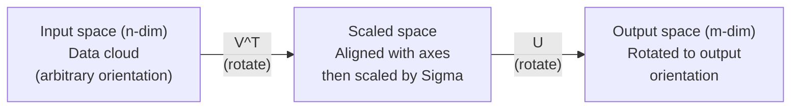
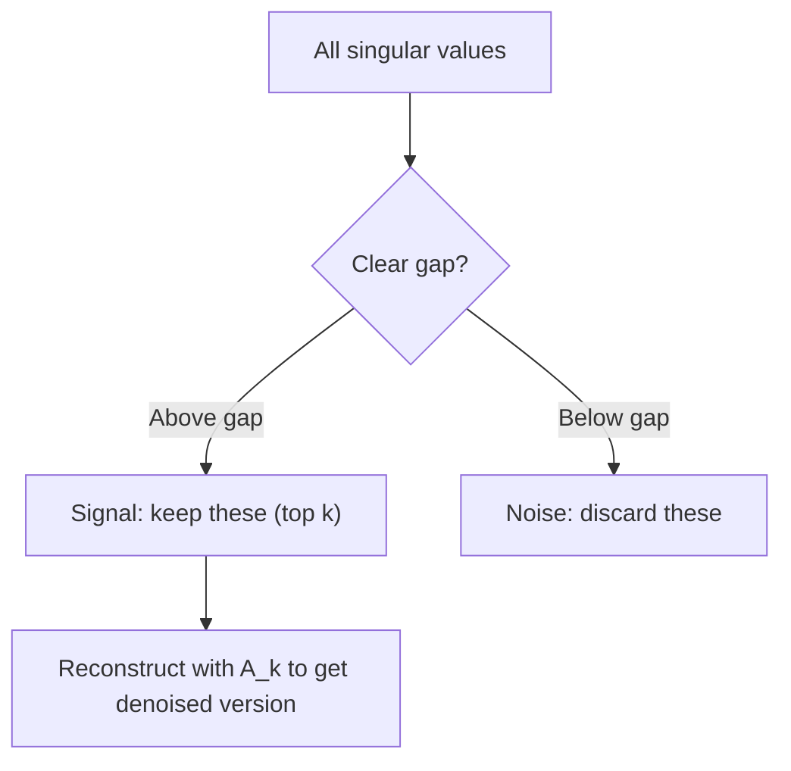

# Decompositividade de Valores Singulares .

> O SVD é a faca do exército suíço da álgebra linear.
> O SVD é a "máquina de guerra" do algoritmo linear. Cada rectângulo tem uma.

**Type:** Build | **类型:** 动手
**Languages:** Python, Julia | **语言:** Python, Julia
**Prerequisites:** Phase 1, Lessons 01 (Linear Algebra Intuition), 02 (Vectors & Matrices Operations), 03 (Matrix Transformations) | **前置知识:** Phase 1, Lessons 01-03
**Time:** ~120 minutes | **时间:** ~120 分钟

## Objetivos de aprendizagem

- Implementar SVD através da iteração de potência e explicar o significado geométrico de U, Sigma e V^T
  代实现 SVD, explicar U、Sigma 和 V^T
- Aplicar SVD truncado para compressão de imagem e medir a relação de compressão versus erro de reconstrução
   aplicação de corte SVD  realização de compressão de imagem, compressão de medida em relação a erro de reconstrução
- Compute o pseudoinverso Moore-Penrose através de SVD para resolver sistemas de mínimos quadrados sobredeterminados
   através de SVD  calcular Moore-Penrose  pseudo-reversal para buscar solução super-determinado mínimo sistema de duplicação
- Conectar SVD a PCA, sistemas de recomendação (fatores latentes) e Análise Semântica Latente na PNL
  A SVD e PCA ̇ ̇ ̇ ̇ ̇ ̇ ̇ ̇ ̇ ̇ ̇ ̇ ̇ ̇ ̇ ̇ ̇ ̇ ̇ ̇ ̇ ̇ ̇ ̇ ̇ ̇ ̇ ̇ ̇ ̇ ̇ ̇ ̇ ̇ ̇ ̇ ̇ ̇ ̇ ̇ ̇ ̇ ̇ ̇ ̇ ̇ ̇ ̇ ̇ ̇ ̇ ̇ ̇ ̇ ̇ ̇ ̇ ̇ ̇ ̇ ̇ ̇ ̇ ̇ ̇ ̇ ̇ ̇ ̇ ̇ ̇ ̇ ̇ ̇ ̇ ̇ ̇ ̇ ̇ ̇ ̇ ̇ ̇ ̇ ̇ ̇ ̇ ̇ ̇ ̇ ̇ ̇ ̇ ̇ ̇ ̇ ̇ ̇ ̇ ̇ ̇ ̇ ̇ ̇ ̇ ̇ ̇ ̇ ̇ ̇ ̇ ̇ ̇ ̇ ̇ ̇ ̇ ̇ ̇ ̇ ̇ ̇ ̇ ̇ ̇ ̇ ̇ ̇ ̇ ̇ ̇ ̇ ̇ ̇ ̇ ̇ ̇ ̇ ̇ ̇ ̇ ̇ ̇ ̇ ̇ ̇ ̇ ̇ ̇ ̇ ̇ ̇ ̇ ̇ ̇ ̇ ̇ ̇ ̇ ̇ ̇ ̇ ̇ ̇ ̇ ̇ ̇ ̇ ̇ ̇ ̇ ̇ ̇ ̇ ̇ ̇ ̇ ̇ ̇ ̇ ̇ ̇ ̇ ̇ ̇ ̇ ̇   ̇ ̇      ̇     ̇      ̇     ̇           ̇      ̇ ̇     ̇                                                                       

> **【中文解读】**
> SVD é um número linear de "Russische Kriegsmaschine" Qualquer matriz pode ser dividida em U * Sigma * V^T── cortar SVD pode ser comprimido imagem, usuário-filme avaliações matriz SVD pode ser encontrado escondido o núcleo do sistema, documentário-facho frequência matriz SVD pode ser encontrado o tópico (LSA)──

> **【拓展：SVD 在 AI 中的位置】**
> - **推荐系统**O resultado da competição é o SVD de SVD.
> - **图像压缩**截断 SVD apenas retém o máximo de alguns valores estranhos, podendo usar muito pouco de dados de imagens recém-presentes.
> - **LSA (潜在语义分析)**O primeiro método de modelo de tópicos em NLP, foi desenvolvido para o estudo de tópicos de texto.

## O problema é o problema da introdução

> **【中文解读】**Você tem uma matriz de 1000×2000 (possivelmente é um usuário-filme, vídeo, vídeo, vídeo, vídeo) ⋅ caracteres de divisão só se aplicam a quadras, SVD é válido para qualquer forma, qualquer ordem de matrizes são válidos.

Talvez seja uma tabela de frequências de um documento, talvez seja o valor de pixels de uma imagem, você precisa comprimi-la, denosá-la, encontrar uma estrutura oculta nela ou resolver um sistema de mínimos quadrados com ela. A composição de Eigende funciona apenas em matrizes quadradas. Mesmo assim, ela requer que a matriz tenha um conjunto completo de vetores próprios linearmente independentes.
> Talvez seja o usuário-filme avaliações, talvez seja o documento-paquência, talvez seja imagem imagem. Você precisa comprimir-lo, desviar o ruído, descobrir a estrutura oculta, ou usá-lo para resolver o mínimo de duas vezes.

O SVD funciona em qualquer matriz, qualquer forma, qualquer grau, nenhuma condição, decompõe a matriz em três fatores que revelam a geometria do que a matriz faz ao espaço. É a fatorização mais geral e mais útil em toda a álgebra linear.
> SVD é aplicável a qualquer matriz. Qualquer forma, qualquer arranjo, qualquer incondição. Ele divide a matriz em três fatores, revelando o que a matriz fez ao espaço. É a mais comum, a mais útil, de todos os números de linha.

## O conceito central.

> **【拓展：SVD 是 LoRA 的数学根基】**LoRA 微调的核心假设:权重更新矩阵 ΔW 是低排的──SVD 告诉我们, qualquer矩阵 pode ser dividido em U·Σ·V^T, em que Σ 中的奇异值按大小排列──LoRA apenas reserva o máximo de k 个奇异值对应的分量 (((即级-k 近似),参数 de mn 减少到 k  m + n) ─这是SVD 理论到应用的直接转变──

### O que o SVD faz geométricamente

Cada matriz, independentemente da forma, realiza três operações em sequência: rotação, escala, rotação.
> Cada rectângulo, independentemente da forma, é executado em ordem de três operações: rotação, encolhimento, rotação.

```
A = U * Sigma * V^T

      m x n     m x m    m x n    n x n
     (any)    (rotate)  (scale)  (rotate)
```

Dado qualquer matriz A, o SVD a contabiliza em:
> 给定任意矩阵 A,SVD将其分解为:

- V^T gira vetores no espaço de entrada (n-dimensional)
  V^T в输入空间 (n 维) 中旋转向量
- Escalas de sigma ao longo de cada eixo (estiradas ou compressadas)
  Sigma 沿每个轴缩放 (拉伸或压缩)
- U rota o resultado no espaço de saída (m-dimensional)
  U 将结果旋转到输出空间 (m 维)



Pensem assim. Você entrega a SVD uma matriz. Ela diz: "Esta matriz pega uma esfera de entradas, primeiro a gira por V^T, depois a estende em um elipsoide por Sigma, depois gira o elipsoide por U". Os valores singulares são os comprimentos dos eixos do elipsoide.
> Imagine: você entregou a matriz para a SVD, diz-lhe:" Esta matriz recebe um conjunto de entradas de esferas, primeiro gira com V^T, reutiliza Sigma 拉伸成球, reutiliza U 旋球──"O valor estranho é a comprimento de cada eixo da bola──"

### A completa decomposição.

Para uma matriz A com forma m x n:

```
A = U * Sigma * V^T

where:
  U     is m x m, orthogonal (U^T U = I)
  Sigma is m x n, diagonal (singular values on the diagonal)
  V     is n x n, orthogonal (V^T V = I)

The singular values sigma_1 >= sigma_2 >= ... >= sigma_r > 0
where r = rank(A)
```

As colunas de U são chamadas de vetores singulares esquerdo. As colunas de V são chamadas de vetores singulares direitos. As entradas diagonais de Sigma são chamadas de valores singulares. Eles são sempre não negativos e convencionalmente classificados em ordem decrescente.
> U de linha é chamada de linha de direita, V de linha de direita, e os elementos de linha de direita de sigma são chamados de linha de direita.

### Vêctores singulares esquerdo, valores singulares, vectores singulares direito.

Cada componente do SVD tem um significado geométrico distinto.
> Cada divisão do SVD tem um significado geométrico único.

**Right singular vectors (columns of V):**Estes formam uma base ortonormal para o espaço de entrada (R^n). São as direções no espaço de entrada que a matriz mapeia para direções ortogonais no espaço de saída.
> **右奇异向量（V 的列）：**构成输入空间 (R^n) 的正交基──它们是输入空间中的矩阵映射到输出空间正交方向的方向──

**Singular values (diagonal of Sigma):**Estes são os fatores de escala. o i-o valor singular diz-lhe o quanto a matriz estende vetores ao longo do i-o direito vector singular. um valor singular de zero significa que a matriz esmagou essa direção inteiramente.
> **奇异值（Sigma 的对角线）：**缩放因子──第1 个奇异值告诉你矩阵沿第1 个右奇异向量方向拉伸多少──奇异值为零 significa que a矩阵 está completamente pressionada nessa direção──

**Left singular vectors (columns of U):**Estes formam uma base ortonormal para o espaço de saída (R^m). O i-o vector singular esquerdo é a direção no espaço de saída onde o i-o vector singular direito atinge (após escalar).
> **左奇异向量（U 的列）：**构成输出空间 (R^m) 的正交基──第 i 个左奇异向量是第 i个右奇异向量(缩放后) 落在输出空间中的方向──

A relação entre eles:
> Relações entre elas:

```
A * v_i = sigma_i * u_i

The matrix A takes the i-th right singular vector v_i,
scales it by sigma_i, and maps it to the i-th left singular vector u_i.
```

Isto dá-lhe uma imagem coordenada por coordenada do que qualquer matriz faz.
> Isto fornece-lhe uma imagem por rotatividade de qualquer matriz.

### Forma de produto externo

O SVD pode ser escrito como uma soma de matrizes de grau 1:
> SVD pode ser escrito em "Riching-1"

```
A = sigma_1 * u_1 * v_1^T + sigma_2 * u_2 * v_2^T + ... + sigma_r * u_r * v_r^T

Each term sigma_i * u_i * v_i^T is a rank-1 matrix (an outer product).
The full matrix is the sum of r such matrices, where r is the rank.
```

Esta forma é a base da aproximação de baixo grau. Cada termo adiciona uma camada de estrutura. O primeiro termo capta o padrão único mais importante. O segundo capta o próximo mais importante. E assim por diante. Truncando essa soma dá-lhe a melhor aproximação possível em qualquer grau dado.
> Esta forma é baseada em um baixo nível de aproximação. Cada um acrescenta uma estrutura. O primeiro capta o modelo mais importante, o segundo capta o segundo mais importante, segundo esse tipo de recomendação.

```
Rank-1 approx:    A_1 = sigma_1 * u_1 * v_1^T
                  (captures the dominant pattern)

Rank-2 approx:    A_2 = sigma_1 * u_1 * v_1^T + sigma_2 * u_2 * v_2^T
                  (captures the two most important patterns)

Rank-k approx:    A_k = sum of top k terms
                  (optimal by the Eckart-Young theorem)
```

### Relação com a própria composição e a relação com os valores de degradação.

Os valores singulares e vetores de A vêm diretamente dos valores próprios e vetores próprios de A^T A e A^T.
> SVD e características valor de desagregação profundamente relacionados.

```
A^T A = V * Sigma^T * U^T * U * Sigma * V^T
      = V * Sigma^T * Sigma * V^T
      = V * D * V^T

where D = Sigma^T * Sigma is a diagonal matrix with sigma_i^2 on the diagonal.

So:
- The right singular vectors (V) are eigenvectors of A^T A
- The singular values squared (sigma_i^2) are eigenvalues of A^T A

Similarly:
A A^T = U * Sigma * V^T * V * Sigma^T * U^T
      = U * Sigma * Sigma^T * U^T

So:
- The left singular vectors (U) are eigenvectors of A A^T
- The eigenvalues of A A^T are also sigma_i^2
```

Esta conexão diz-te três coisas:
> Este contacto diz-te três coisas:

1. Os valores singulares são sempre reais e não negativos (são raízes quadradas de valores próprios de uma matriz semidefinida positiva).
   O valor estranho sempre é real e não negativo.
2. Você poderia calcular SVD através da própria composição de A^T A, mas isso quadrata o número da condição e perde a precisão numérica.
   Pode ser calculado através de A^T A de características de valor de desintegração SVD, mas isso significa que a quantidade de condições quadradas, perda de quantidade de valor é preciso.
3. Quando A é quadrado e semidefinido positivo simétrico, SVD e composição própria são a mesma coisa.
   Quando A é um quadrado e se refere a um tempo determinado, SVD e o valor característico são um factor.

### SVD truncado: aproximação de baixo grau .

O teorema de Eckart-Young-Mirsky afirma que a melhor aproximação de rango k a A (em ambos os Frobenius e norma espectral) é obtida mantendo apenas os valores singulares superiores k e seus vetores correspondentes:
> Eckart-Young-Mirsky 定理指出,A 的最佳秩-k 近似 (在 Frobenius 和谱范数下) 通过只保留前 k 个奇异值及其对应向量获得:

```
A_k = U_k * Sigma_k * V_k^T

where:
  U_k     is m x k  (first k columns of U)
  Sigma_k is k x k  (top-left k x k block of Sigma)
  V_k     is n x k  (first k columns of V)

Approximation error = sigma_{k+1}  (in spectral norm)
                    = sqrt(sigma_{k+1}^2 + ... + sigma_r^2)  (in Frobenius norm)
```

Esta não é apenas uma aproximação "boa". É provavelmente a melhor aproximação possível de grau k. Nenhuma outra matriz de grau k é mais próxima de A.
> Não é apenas uma "bom" aproximação. É a melhor aproximação possível. Não há outra linha de aproximação que a A.

| Component | Relative magnitude | Kept in rank-3 approx? / 保留在秩-3 近似中？ |
|-----------|-------------------|------------------------|
| sigma_1 | Largest / 最大 | Yes / 是 |
| sigma_2 | Large / 大 | Yes / 是 |
| sigma_3 | Medium-large / 中大 | Yes / 是 |
| sigma_4 | Medium / 中 | No (error) / 否（误差） |
| sigma_5 | Medium-small / 中小 | No (error) / 否（误差） |
| sigma_6 | Small / 小 | No (error) / 否（误差） |
| sigma_7 | Very small / 很小 | No (error) / 否（误差） |
| sigma_8 | Tiny / 极小 | No (error) / 否（误差） |

Mantenha o top 3: A_3 capta os três maiores valores singulares. erro = valores restantes (sigma_4 até sigma_8).

Se os valores singulares se desmoronam rapidamente, um pequeno k captura a maior parte da matriz.
> Se o valor estranho diminuir rapidamente, o menor da K consegue capturar a maior parte da matriz.

### Compressão de imagem com SVD

Uma imagem em escala de cinza é uma matriz de intensidades de píxeles. Uma imagem de 800x600 tem 480.000 valores.
> A imagem de intensidade de grau é uma imagem de intensidade de imagem de 800x600 com 480.000 valores.

```
Original image: 800 x 600 = 480,000 values

SVD with rank k:
  U_k:      800 x k values
  Sigma_k:  k values
  V_k:      600 x k values
  Total:    k * (800 + 600 + 1) = k * 1401 values

  k=10:   14,010 values   (2.9% of original)
  k=50:   70,050 values  (14.6% of original)
  k=100: 140,100 values  (29.2% of original)

  The compression ratio improves as k gets smaller,
  but visual quality degrades.
```

A principal ideia: imagens naturais têm valores singulares que se decompõem rapidamente. Os primeiros valores singulares capturam a estrutura ampla (formas, gradientes). Os últimos capturam detalhes finos e ruído. Truncando na posição 50 geralmente produz uma imagem que parece quase idêntica ao original, enquanto usa 85% menos armazenamento.
> 关键洞见: O valor estranho da imagem natural diminui rapidamente.

### SVD para sistemas de recomendação.

O Prêmio Netflix tornou isto famoso.
> Netflix 竞赛使之出名──你有一个大部分条目缺失的用户-电影评分矩阵── você tem uma grande quantidade de artigos que faltam.

```
             Movie1  Movie2  Movie3  Movie4  Movie5
  User1      [  5      ?       3       ?       1  ]
  User2      [  ?      4       ?       2       ?  ]
  User3      [  3      ?       5       ?       ?  ]
  User4      [  ?      ?       ?       4       3  ]

  ? = unknown rating
```

A ideia: esta matriz de classificações tem baixa classificação. Os usuários não têm gostos completamente independentes. Há um punhado de fatores latentes (ação vs drama, velho vs novo, cerebral vs visceral) que explicam a maioria das preferências.
> 核心思想:评分矩阵是低排的──用户的品味并非完全独立──存在少数隐因子──动作 vs 文艺、老片 vs 新片) (Existe uma minoria de factores que podem explicar a maior parte das preferências──)

O SVD na matriz de classificação (enchida) decompõe-a em:
> Para o ((reempleno) de) avaliação de matrizes fazer SVD

- U: perfis de usuários no espaço de fatores latentes / 隐因子空间中的用户画像
- Sigma: importância de cada fator latente / Importância de cada Hid因子
- V^T: perfis de cinema no espaço de fatores latentes / 隐因子空间中的电影画像

A classificação prevista de um usuário para um filme é o produto de pontos do seu perfil de usuário com o perfil do filme (pega por valores singulares). A aproximação de baixo nível preenche as entradas faltantes.
> O usuário avalia o seu perfil de imagem e o seu perfil de imagem de filme.

### SVD em PNL: Análise Semântica Latente.

A Análise Semântica Latente (LSA), também chamada de Índice Semântico Latente (LSI), aplica o SVD a uma matriz de documento de termo.
> 潜在语义分析 (LSA) 应用于词文档矩阵──

```
             Doc1   Doc2   Doc3   Doc4
  "cat"      [  3      0      1      0  ]
  "dog"      [  2      0      0      1  ]
  "fish"     [  0      4      1      0  ]
  "pet"      [  1      1      1      1  ]
  "ocean"    [  0      3      0      0  ]

After SVD with rank k=2:

  Each document becomes a point in 2D "concept space."
  Each term becomes a point in the same 2D space.
  Documents about similar topics cluster together.
  Terms with similar meanings cluster together.
```

O LSA foi um dos primeiros métodos bem-sucedidos para capturar semântica semelhança a partir de texto bruto. Funciona porque termos sinônimos tendem a aparecer em documentos semelhantes, então o SVD os agrupa nas mesmas dimensões latentes.
> A LSA é uma das primeiras formas de sucesso de captura de semelhança de significado do texto original. É eficaz porque os semelhanças de significado costumam aparecer em documentos semelhantes.

### SVD para redução de ruído.

Os dados ruidosos têm o sinal concentrado nos valores singulares superiores e o ruído espalhado por todos os valores singulares.
> No volume de dados, o sinal é concentrado no valor de extrema extrema superior, o ruído é distribuído no valor de extrema extrema superior.



A SVD é uma forma de separar o sinal do ruído.
> É usado para processamento de sinais, medição científica e limpeza de dados. Desde que você tenha uma matriz de contaminação por ruído, a corte de SVD é um método de separação de sinais e ruído de princípio.

### Pseudo-inversos através do SVD

O Moore-Penrose pseudoinverso A+ generaliza a inversão de matriz para matrizes não quadradas e singulares.
> Moore-Penrose 伪逆 A+ 将矩阵求逆推广到非方阵和奇异矩阵――SVD 使计算变得简单――

```
If A = U * Sigma * V^T, then:

A+ = V * Sigma+ * U^T

where Sigma+ is formed by:
  1. Transpose Sigma (swap rows and columns)
  2. Replace each non-zero diagonal entry sigma_i with 1/sigma_i
  3. Leave zeros as zeros
```

Se Ax = b não tem solução exata (sistema sobredeterminado), então x = A + b é a solução de menor quadrado (minimiza o AX - b)
> 伪逆求解最小二乘解问题──若 Ax = b 没有精确解(超定系统),则 x = A+ b 是最小二乘解──

### Vantagens de estabilidade numérica

Computação da própria composição de A^T A quadrado os valores singulares (valores próprios de A^T A são sigma_i^2).
> 計算 A^T A 的特征值分解会平方奇异值,平方条件数,放大数值差──

Os algoritmos modernos de SVD (bi-diagonalização Golub-Kahan) trabalham diretamente em A, nunca formando A^T A. É por isso que você deve sempre preferir `np.linalg.svd(A)`- Não .`np.linalg.eig(A.T @ A)`- Não .
> 现代 SVD 算法直接对 A 操作, não forma A^T A. É por isso que deve ser sempre usado.`np.linalg.svd(A)`Não é`np.linalg.eig(A.T @ A)`- Não.

### Conexão com PCA

O PCA é SVD em dados centrados.
> O PCA é o SVD para dados centralizados. Não é uma comparação, é um cálculo completamente igual.

```
Given data matrix X (n_samples x n_features), centered (mean subtracted):

Covariance matrix: C = (1/(n-1)) * X^T X

PCA finds eigenvectors of C. But:

  X = U * Sigma * V^T    (SVD of X)

  X^T X = V * Sigma^2 * V^T

  C = (1/(n-1)) * V * Sigma^2 * V^T

So the principal components are exactly the right singular vectors V.
The explained variance for each component is sigma_i^2 / (n-1).

In sklearn, PCA is implemented using SVD, not eigendecomposition.
It is faster and more numerically stable.
```

Isto significa que tudo o que você aprendeu sobre a redução de dimensionalidade na lição 10 é SVD sob o capô.
> Isto significa que na lição 10 aprendemos que a base de redução de conteúdo é SVD.

## Construí-lo e realizei-o.
```figure
svd-rank-reconstruction
```

## Construí-lo

### Passo 1: SVD do zero usando iteração de potência.

A ideia: para encontrar o maior valor singular e seus vetores, use a iteração de potência em A^T A (ou A A^T).
> Pensa: Usando a 代在 A^T A 上找最大奇异值及其向量, então encolher a矩阵, reappear encontrar o próximo奇异值──

```python
import numpy as np

def power_iteration(M, num_iters=100):
    n = M.shape[1]
    v = np.random.randn(n)
    v = v / np.linalg.norm(v)

    for _ in range(num_iters):
        Mv = M @ v
        v = Mv / np.linalg.norm(Mv)

    eigenvalue = v @ M @ v
    return eigenvalue, v

def svd_from_scratch(A, k=None):
    m, n = A.shape
    if k is None:
        k = min(m, n)

    sigmas = []
    us = []
    vs = []

    A_residual = A.copy().astype(float)

    for _ in range(k):
        AtA = A_residual.T @ A_residual
        eigenvalue, v = power_iteration(AtA, num_iters=200)

        if eigenvalue < 1e-10:
            break

        sigma = np.sqrt(eigenvalue)
        u = A_residual @ v / sigma

        sigmas.append(sigma)
        us.append(u)
        vs.append(v)

        A_residual = A_residual - sigma * np.outer(u, v)

    U = np.column_stack(us) if us else np.empty((m, 0))
    S = np.array(sigmas)
    V = np.column_stack(vs) if vs else np.empty((n, 0))

    return U, S, V
```

### Passo 2: Teste e compare com NumPy.

```python
np.random.seed(42)
A = np.random.randn(5, 4)

U_ours, S_ours, V_ours = svd_from_scratch(A)
U_np, S_np, Vt_np = np.linalg.svd(A, full_matrices=False)

print("Our singular values:", np.round(S_ours, 4))
print("NumPy singular values:", np.round(S_np, 4))

A_reconstructed = U_ours @ np.diag(S_ours) @ V_ours.T
print(f"Reconstruction error: {np.linalg.norm(A - A_reconstructed):.8f}")
```

### Passo 3: Demo de compressão de imagem.

```python
def compress_image_svd(image_matrix, k):
    U, S, Vt = np.linalg.svd(image_matrix, full_matrices=False)
    compressed = U[:, :k] @ np.diag(S[:k]) @ Vt[:k, :]
    return compressed

image = np.random.seed(42)
rows, cols = 200, 300
image = np.random.randn(rows, cols)

for k in [1, 5, 10, 20, 50]:
    compressed = compress_image_svd(image, k)
    error = np.linalg.norm(image - compressed) / np.linalg.norm(image)
    original_size = rows * cols
    compressed_size = k * (rows + cols + 1)
    ratio = compressed_size / original_size
    print(f"k={k:>3d}  error={error:.4f}  storage={ratio:.1%}")
```

### Passo 4: Redução de ruído.

```python
np.random.seed(42)
clean = np.outer(np.sin(np.linspace(0, 4*np.pi, 100)),
                 np.cos(np.linspace(0, 2*np.pi, 80)))
noise = 0.3 * np.random.randn(100, 80)
noisy = clean + noise

U, S, Vt = np.linalg.svd(noisy, full_matrices=False)
denoised = U[:, :5] @ np.diag(S[:5]) @ Vt[:5, :]

print(f"Noisy error:    {np.linalg.norm(noisy - clean):.4f}")
print(f"Denoised error: {np.linalg.norm(denoised - clean):.4f}")
print(f"Improvement:    {(1 - np.linalg.norm(denoised - clean) / np.linalg.norm(noisy - clean)):.1%}")
```

### Passo 5: Pseudoinverso.

```python
A = np.array([[1, 1], [2, 1], [3, 1]], dtype=float)
b = np.array([3, 5, 6], dtype=float)

U, S, Vt = np.linalg.svd(A, full_matrices=False)
S_inv = np.diag(1.0 / S)
A_pinv = Vt.T @ S_inv @ U.T

x_svd = A_pinv @ b
x_lstsq = np.linalg.lstsq(A, b, rcond=None)[0]
x_pinv = np.linalg.pinv(A) @ b

print(f"SVD pseudoinverse solution:  {x_svd}")
print(f"np.linalg.lstsq solution:   {x_lstsq}")
print(f"np.linalg.pinv solution:    {x_pinv}")
```

## Use-o com o framework implementado.

Demos de trabalho completos estão em funcionamento .`code/svd.py`. Exerça-o para ver a SVD aplicada à compressão de imagem, sistemas de recomendação, análise semântica latente e redução de ruído.
> 完整可运行的演示在 `code/svd.py`O SVD é utilizado para compressão de imagem, sistema de recomendação, análise de significados e redução de ruído.

```bash
python svd.py
```

A versão Julia em `code/svd.jl`demonstra os mesmos conceitos usando a língua nativa de Julia `svd()`função e `LinearAlgebra`- O pacote.
> `code/svd.jl`中的Julia 版本使用Julia 原生 `svd()`函数和  função`LinearAlgebra`包演示相同概念──

```bash
julia svd.jl
```

## Envia-o . Produto .

Esta lição produz:
> 本课程产出:

- `outputs/skill-svd.md`- uma habilidade para saber quando e como aplicar o SVD em projectos reais
  Um documento sobre o que e como aplicar o SVD em projetos reais

## Exercícios.

1. Implemente o SVD completo a partir do zero sem usar iteração de potência. Em vez disso, calcule a própria composição de A^T A para obter V e os valores singulares, em seguida, calcule U = A V Sigma^{-1}. Compare a precisão numérica com a sua versão de iteração de potência e com NumPy.
   Não usar代从零实现完整SVD──改为计算A^T A 的特征值分解来获得V 和奇异值,然后计算U = A V Sigma^{-1}──比较数值精度──

2. Carregue uma imagem em escala de cinza real (ou converta-a em escala de cinza). Compresse-a nas fileiras 1, 5, 10, 25, 50, 100. Para cada fileira, calcule a relação de compressão e o erro relativo. Encontre a fileira onde a imagem se torna visualmente aceitável.
   Carregar uma imagem de graça real. Compreender 1、5、10、25、50、100 

3. Crie um pequeno sistema de recomendações. Crie uma matriz de classificações de filmes de usuários 10x8 com algumas entradas conhecidas. Encha entradas faltantes com meios de linha. Compute SVD e reconstruir uma aproximação de nível-3. Use a matriz reconstruída para prever as classificações faltantes.
   构建一个小型推系统――创建 10x8 用户-电影评分矩阵――用行平均值填满缺失条目――计算 SVD 并重建排-3 近似――用重建矩阵预测缺失评分――

4. Crie uma matriz de 100x50 documentos com 3 tópicos sintéticos. Cada tópico tem 5 termos associados. Adicione ruído. Aplique SVD e verifique que os 3 principais valores singulares são muito maiores do que os outros. Projete documentos no espaço latente 3D e verifique que os documentos do mesmo grupo de tópicos juntos.
                                                                                                                                                                                                                                                                                                                                                                                                                                                                                                                                

5. Gerar uma matriz de baixo nível limpa (rango 3, tamanho 50x40) e adicionar ruído gaussiano em diferentes níveis (sigma = 0,1, 0,5, 1,0, 2.0). Para cada nível de ruído, encontrar a classificação de truncamento ideal varrendo k de 1 a 40 e medindo o erro de reconstrução contra a matriz limpa.
   Produção de um nível de ruído elevado em cada nível de ruído, através de um exame, encontrando o melhor nível de ruído.

## Termos-chave .

| Term / 术语 | What people say | What it actually means / 实际含义 |
|------|----------------|----------------------|
| SVD / 奇异值分解 | "Factor any matrix" | Decompose A into U Sigma V^T where U and V are orthogonal and Sigma is diagonal with non-negative entries. Works for any matrix of any shape. / 将 A 分解为 U Sigma V^T，U 和 V 正交，Sigma 对角非负。适用于任何形状的矩阵。 |
| Singular value / 奇异值 | "How important this component is" | The i-th diagonal entry of Sigma. Measures how much the matrix stretches along the i-th principal direction. / Sigma 的第 i 个对角线元素。衡量矩阵沿第 i 主方向的拉伸程度。 |
| Left singular vector / 左奇异向量 | "Output direction" | A column of U. The direction in output space that the i-th right singular vector maps to. / U 的列。第 i 个右奇异向量映射到的输出空间方向。 |
| Right singular vector / 右奇异向量 | "Input direction" | A column of V. The direction in input space that the matrix maps to the i-th left singular vector. / V 的列。矩阵映射到第 i 个左奇异向量的输入空间方向。 |
| Truncated SVD / 截断 SVD | "Low-rank approximation" | Keep only the top k singular values and their vectors. Produces the provably best rank-k approximation (Eckart-Young theorem). / 只保留前 k 个奇异值及其向量。产生可证明的最佳秩-k 近似。 |
| Rank / 秩 | "True dimensionality" | The number of non-zero singular values. Tells you how many independent directions the matrix actually uses. / 非零奇异值的数量。告诉你矩阵实际使用多少独立方向。 |
| Pseudoinverse / 伪逆 | "Generalized inverse" | V Sigma+ U^T. Inverts non-zero singular values, leaves zeros as zeros. Solves least-squares for non-square or singular matrices. / V Sigma+ U^T。反转非零奇异值，零保持不变。 |
| Condition number / 条件数 | "How sensitive to errors" | sigma_max / sigma_min. A large condition number means small input changes cause large output changes. / sigma_max / sigma_min。条件数大意味着小的输入变化引起大的输出变化。 |
| Latent factor / 隐因子 | "Hidden variable" | A dimension in the low-rank space discovered by SVD. In recommendations, a genre preference. In NLP, a topic. / SVD 发现的低秩空间中的维度。推荐中是类型偏好，NLP 中是主题。 |
| Frobenius norm / Frobenius 范数 | "Total matrix size" | Square root of the sum of squared entries. Equals sqrt of sum of squared singular values. / 所有元素平方和的平方根。等于奇异值平方和的平方根。 |
| Eckart-Young theorem / Eckart-Young 定理 | "SVD gives the best compression" | For any target rank k, the truncated SVD minimizes the approximation error over all possible rank-k matrices. / 对任意目标秩 k，截断 SVD 在所有可能的秩-k 矩阵中最小化近似误差。 |
| Power iteration / 幂迭代 | "Find the biggest eigenvector" | Repeatedly multiply a random vector by the matrix and normalize. Converges to the largest eigenvector. / 反复将随机向量乘以矩阵并归一化。收敛到最大特征向量。 |

## Mais leitura 延伸阅读

- [Gilbert Strang: Linear Algebra and Its Applications, Chapter 7](https://math.mit.edu/~gs/linearalgebra/)- tratamento completo da SVD com aplicações
  Processamento e aplicação completo do SVD
- [3Blue1Brown: But what is the SVD?](https://www.youtube.com/watch?v=vSczTbgc8Rc)- Intuição geométrica para SVD
  SVD's几何直觉
- [We Recommend a Singular Value Decomposition](https://www.ams.org/publicoutreach/feature-column/fcarc-svd)- visão geral acessível da Sociedade Americana de Matemática
  A partir da SVD da AMS
- [Netflix Prize and Matrix Factorization](https://sifter.org/~simon/journal/20061211.html)- O post original do blog de Simon Funk sobre SVD para recomendações
  Simon Funk  Sobre o SVD 推的原始博客
- [Latent Semantic Analysis](https://en.wikipedia.org/wiki/Latent_semantic_analysis)- a aplicação original da PNL do SVD
  SVD em NLP
- [Numerical Linear Algebra by Trefethen and Bau](https://people.maths.ox.ac.uk/trefethen/text.html)- o padrão de ouro para a compreensão dos algoritmos de SVD
  Compreender o SVD 算法的黄金标准
