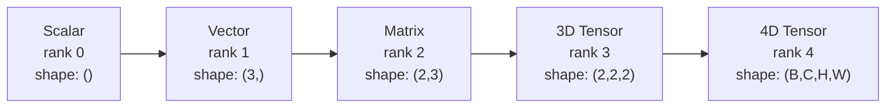
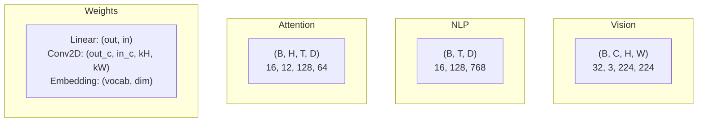
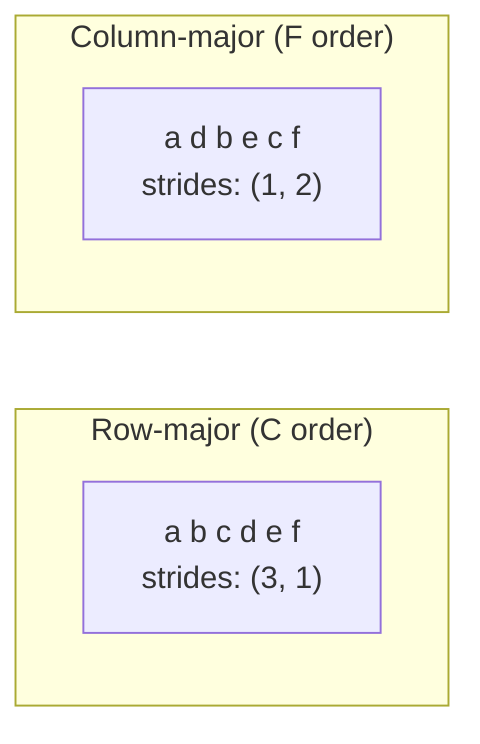
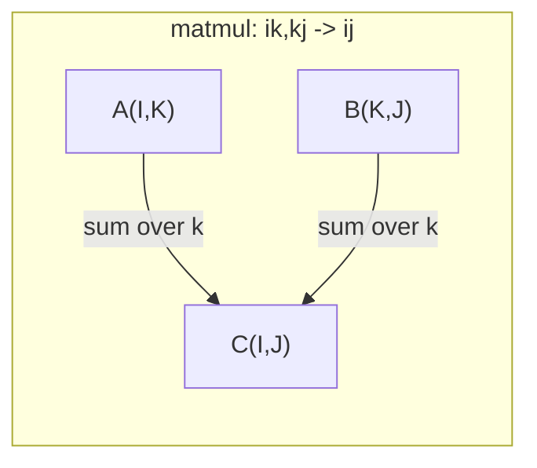

# Operações tensoras .

> Tensores são a linguagem comum entre dados e aprendizagem profunda.
> 张量是数据和深度学习的通用语言―― cada imagem, cada frase, cada gradiente é movido através de张量――

**Type:** Build | **类型:** 动手
**Language:**O Python .**语言:**Python
**Prerequisites:** Phase 1, Lessons 01 (Linear Algebra Intuition), 02 (Vectors, Matrices & Operations) | **前置知识:** Phase 1, Lessons 01-02
**Time:** ~90 minutes | **时间:** ~90 分钟

## Objetivos de aprendizagem

- Implementar uma classe de tensor com formas, passos, remodelação, transposição e operações de elementos desde zero
  A partir do zero, a realização de formas, progressos, reformulações, transformações e quantidades de elementos operacionais
- Aplicar regras de radiodifusão para operar em tensores de diferentes formas sem copiar dados
   aplicativo 广播规则  aplicando-se a quantidade de dados de diferentes formas sem necessidade de cópia
- Escreva expressões de einsum para produtos de pontos, multiplicidades de matriz, produtos externos e operações em lote
   redação de um sumo expresso de realização de pontos √ , matrizes multiplicadas √ , extração e operação de massa
- Rastrear as formas exatas do tensor através de cada passo de atenção multi-cabeça
  Seguir a atenção de cada passo da forma precisa de quantidade de

> **【中文解读】**
> 张量是数据和深度学习的通用语言──向量是张量,矩阵是二维张量,RGB 图像是三维张量──本章从零实现张量类,理解形状、步长、广播和 einsum──Transformer 多头注意力中 Q/K/V 都是四维张量,理解张量形状是调试的关键──

## O problema é o problema da introdução

> **【中文解读】**Construíste um Transformador, e depois de tudo.`RuntimeError: shapes cannot be multiplied (32x768 and 512x768)` Forma  erro é o bug mais comum no aprendizado profundo. Transformador há várias de forma / transposar / transmissão  operação                                                                                                                                                                                                                                                                                                                                                                                                                                                                                             

## O conceito central.

> **【拓展：张量 shape 是 AI 工程师的日常】**调试神经网络 90% do tempo em tratamento forma 问题──关键工具:`print(tensor.shape)`- Não.`.reshape()`O que é o "Combustão"?`.transpose()`转置,`.unsqueeze()`增加维度──PyTorch's einsum(`torch.einsum('bhd,bhd->bh', q, k)`) com Einstein 求和约定一行搞定复杂张量运算, é o transformador 实现的利器──

### O que é um tensor?

Um tensor é uma matriz multidimensional de números com um tipo de dados uniforme.**rank**(ou **order**Cada dimensão é uma**axis**- O .**shape**é um tuple que enumera o tamanho ao longo de cada eixo.
> 张量是具有统一数据类型的多维数组──维数是**秩**(ou**阶**), cada dimensão é um**轴**- Não .**形状**É um conjunto de grandes e grandes componentes.



Elementos totais = produto de todos os tamanhos.`(2, 3, 4)`- É o que se passa .`2 * 3 * 4 = 24`elementos.
> 总元素数 = 所有维度大小的乘积――形状 `(2, 3, 4)`包含 `2 * 3 * 4 = 24`个元素──

### Formas tensoras em aprendizado profundo

Diferentes tipos de dados mapeam para formas tensor específicas por convenção.
> Diferentes tipos de dados são habitualmente mapeados em forma de quantidade específica.



PyTorch usa NCHW (canal-first). TensorFlow é padrão para NHWC (canal-last). layouts incompatíveis causam desacelerações ou erros silenciosos.
> PyTorch utiliza NCHW(通道在前),TensorFlow 默认 NHWC(通道在后) ・・・布局不匹配会导致隐性减速或错误──

### Como funciona o layout da memória

Uma matriz 2D na memória é uma sequência 1D de bytes. **Strides**Diz-lhe quantos elementos saltar para mover um passo ao longo de cada eixo.
> 2D 数组内存中是1D 字节序列──**步长**Diz-te quantos elementos precisam ser saltados em cada passo que se move.



Transpose não move dados, mas troca os passos, fazendo o tensor**non-contiguous**Os elementos de uma linha não estão mais adjacentes na memória.
> 转置不移动数据──它交换步长,使张量**不连续** Elementos de uma linha já não estão próximos na memória.

### Regras de transmissão.

A transmissão permite que você opere em tensores de diferentes formas sem copiar dados. Alinear formas a partir da direita. Duas dimensões são compatíveis quando são iguais ou uma é 1.
> 广播让你对形的不同张量操作而无需复制数据―― de direita para forma齐―― de duas dimensões, etc. ou uma delas para 1 时兼容―― de menor dimensão no lado esquerdo preencher 1――

```
Tensor A:     (8, 1, 6, 1)
Tensor B:        (7, 1, 5)
Padded B:     (1, 7, 1, 5)
Result:       (8, 7, 6, 5)
```

### Einsum: a operação tensor universal.

A somação de Einstein marca cada eixo com uma letra. Os eixos na entrada, mas não a saída são somados. Os eixos em ambos são mantidos.
> Einstein 求和字母标记每个轴──在输入中但不在输出中轴被求和──两者都有轴保留──



Padrões-chave: `i,i->`(produto ponto / 点积), `i,j->ij`(produto externo / 外积), `ii->`(trace / 迹), `ij->ji`(transposar / 转置), `bij,bjk->bik`(batch matmul / 批量矩阵乘法), `bhtd,bhsd->bhts`(Pontos de atenção / Attention).

## Construí-lo e realizei-o.
```figure
tensor-broadcast
```

## Construí-lo

O código vive em`code/tensors.py`Cada passo refere-se à aplicação.
> - Não .`code/tensors.py`Em cada passo, todos os outros fazem referência a essa realização.

### Passo 1: armazenamento de tensão e passos.

Um tensor armazena uma lista plana de números mais metadados de forma.
> 张量存储一个平的数字列表加上形状元数据──步长告诉索引逻辑如何将多维索引映射到平位置──

```python
class Tensor:
    def __init__(self, data, shape=None):
        if isinstance(data, (list, tuple)):
            self._data, self._shape = self._flatten_nested(data)
        elif isinstance(data, np.ndarray):
            self._data = data.flatten().tolist()
            self._shape = tuple(data.shape)
        else:
            self._data = [data]
            self._shape = ()

        if shape is not None:
            total = reduce(lambda a, b: a * b, shape, 1)
            if total != len(self._data):
                raise ValueError(
                    f"Cannot reshape {len(self._data)} elements into shape {shape}"
                )
            self._shape = tuple(shape)

        self._strides = self._compute_strides(self._shape)

    @staticmethod
    def _compute_strides(shape):
        if len(shape) == 0:
            return ()
        strides = [1] * len(shape)
        for i in range(len(shape) - 2, -1, -1):
            strides[i] = strides[i + 1] * shape[i + 1]
        return tuple(strides)
```

Para a forma`(3, 4)`, os passos são`(4, 1)`-- saltar 4 elementos para avançar uma linha, saltar 1 elemento para avançar uma coluna.
> 对于形状 `(3, 4)`,步长为 `(4, 1)` Predecessor saltou 4 elementos, Predecessor saltou 1 elemento.

### Passo 2: Refazer, apertar, desapertar.

Redescabe a forma sem mudar a ordem dos elementos. O número total de elementos deve permanecer o mesmo.`-1`para uma dimensão para inferir o seu tamanho.
> Redesignação  alteração de forma não alteração de ordem de elementos ∙∙ ∙ ∙ ∙ ∙ ∙ ∙ ∙ ∙ ∙ ∙ ∙ ∙ ∙ ∙ ∙ ∙ ∙ ∙ ∙ ∙ ∙ ∙ ∙ ∙ ∙ ∙ ∙ ∙ ∙ ∙ ∙ ∙ ∙ ∙ ∙ ∙ ∙ ∙ ∙ ∙ ∙ ∙ ∙ ∙ ∙ ∙ ∙ ∙ ∙ ∙ ∙ ∙ ∙ ∙ `-1`Autotemotemotemotemotemotemotemotemotemotemotemotemotemotemotemotemotemotemotemotemotemotemotemotemotemotemotemotemotemotemotemotemotemotemotemotemotemotemotemotemotemotemotemotemotemotemotemotemotemotemotemotemotemotemotemotemotemotemotemotemotemotemotemotemotemotemotemotemotemotemotemotemotemotemotemotemotemotemotemotemotemotemotemotemotemotemotemotemotemotemotemotemotem

```python
t = Tensor(list(range(12)), shape=(2, 6))
r = t.reshape((3, 4))
r = t.reshape((-1, 3))
```

Squeeze remove eixos de tamanho 1. Uncpress inserir um. Uncpressing é fundamental para a transmissão - um vector de viés`(D,)`adicionado a um lote `(B, T, D)`necessidades de não comprimir para `(1, 1, D)`- Não .
> Squeeze 移除大小为 1 的轴,Squeeze 插入一个──Squeeze 插入一个──Squeeze 插入一个──Squeeze 插入一个──Squeeze 插入一个──Squeeze 插入一个──Squeeze 插入一个──Squeeze 插入一个──Squeeze 插入一个──Squeeze 插入一个──Squeeze 插入一个──Squeeze 插入一个──Squeeze 插入一个──Squeeze 插入一个──Squeeze 插入一个──Squeeze 插入一个──Squeeze 插入一个──Squeeze 插入一个──Squeeze 插入一个──Squeeze 插入一个──Squeeze 插入一个──Squeeze 插入一个──Squeeze 插入一个──Squeeze 插入一个──Squeeze 插入一个──Squeeze 插入一个`(D,)`Adição a lote `(B, T, D)`É preciso desprimir até`(1, 1, D)`- Não.

```python
t = Tensor(list(range(6)), shape=(1, 3, 1, 2))
s = t.squeeze()
v = Tensor([1, 2, 3])
u = v.unsqueeze(0)
```

### Passo 3: Transpor e permutar.

Transpose swaps dois eixos, permutando todos os eixos, assim é como se converte entre NCHW e NHWC.
> Transponha 交换两个轴──Permute 重排所有轴── é a forma de transferir entre NCHW e NHWC──

```python
mat = Tensor(list(range(6)), shape=(2, 3))
tr = mat.transpose(0, 1)

t4d = Tensor(list(range(24)), shape=(1, 2, 3, 4))
perm = t4d.permute((0, 2, 3, 1))
```

Depois de transpor ou permuta, o tensor não é contíguo na memória.`view`falhas em tensores não contiguais -- uso `reshape`ou ligar`.contiguous()`Primeiro, o meu.
> 转置或排列后,张量在内存中不连续──PyTorch 中 `view`Em inconstantânea                                                                                                                                                                                                                                                                                                                                                                                                                                                                                                                        `reshape`Ou primeiro`.contiguous()`- Não.

### Passo 4: Operações e reduções por elementos.

Opções de elementos (aditar, multiplicar, subtrair) aplicam-se de forma independente a cada elemento e preservam a forma.
> 逐元素操作 (加、乘、减) independente aplicada a cada elemento e manter forma.

```python
a = Tensor([[1, 2], [3, 4]])
b = Tensor([[10, 20], [30, 40]])
c = a + b
d = a * 2
s = a.sum(axis=0)
```

Uma média global de agrupamento em uma CNN: `(B, C, H, W).mean(axis=[2, 3])`produz `(B, C)`. Sequência média de agregação em PNL: `(B, T, D).mean(axis=1)`produz `(B, D)`- Não .
> CNN 中全局平均池化:`(B, C, H, W).mean(axis=[2, 3])` produzir `(B, C)` PNLP:`(B, T, D).mean(axis=1)` produzir `(B, D)`- Não.

### Passo 5: Transmissão com NumPy.

O `demo_broadcasting_numpy()`função em `tensors.py`mostra os padrões do núcleo.
> `tensors.py`Em meio`demo_broadcasting_numpy()`Função mostrou o modelo central.

```python
activations = np.random.randn(4, 3)
bias = np.array([0.1, 0.2, 0.3])
result = activations + bias

images = np.random.randn(2, 3, 4, 4)
scale = np.array([0.5, 1.0, 1.5]).reshape(1, 3, 1, 1)
result = images * scale

a = np.array([1, 2, 3]).reshape(-1, 1)
b = np.array([10, 20, 30, 40]).reshape(1, -1)
outer = a * b
```

Distância em pares através da radiodifusão: remodelação `(M, 2)`- Não .`(M, 1, 2)`E ...`(N, 2)`- Não .`(1, N, 2)`, subtrair, quadrado, somar ao longo do último eixo, tomar raiz quadrada. Resultado: `(M, N)`- Não .
> 通过广播计算成对距离:将 `(M, 2)`Gravatura`(M, 1, 2)`- Não .`(N, 2)`Gravatura`(1, N, 2)`,相减、平方、沿最后轴求和、取平方根── resultados:`(M, N)`- Não.

### Passo 6: Operações de Einsum.

O `demo_einsum()`E ...`demo_einsum_gallery()`Funções que atravessam todos os padrões comuns.
> `demo_einsum()`和 `demo_einsum_gallery()`Função demonstrou cada tipo de padrão comum.

```python
a = np.array([1.0, 2.0, 3.0])
b = np.array([4.0, 5.0, 6.0])
dot = np.einsum("i,i->", a, b)

A = np.array([[1, 2], [3, 4], [5, 6]], dtype=float)
B = np.array([[7, 8, 9], [10, 11, 12]], dtype=float)
matmul = np.einsum("ik,kj->ij", A, B)

batch_A = np.random.randn(4, 3, 5)
batch_B = np.random.randn(4, 5, 2)
batch_mm = np.einsum("bij,bjk->bik", batch_A, batch_B)
```

O custo computacional de uma contracção é o produto de todos os tamanhos dos índices (conservados e somados).`bij,bjk->bik`com B=32, I=128, J=64, K=128: `32 * 128 * 64 * 128 = 33,554,432`multiplicadores adicionais.
> O custo de cálculo de contração é a multiplicidade de todos os índices de grande dimensão (reserva e procura e de)

### Passo 7: Mecanismo de atenção através do einsum.

O `demo_attention_einsum()`A função implementa atenção de várias cabeças de ponta a ponta.
> `demo_attention_einsum()`Função de um ponto a outro para realizar uma atenção múltipla.

```python
B, H, T, D = 2, 4, 8, 16
E = H * D

X = np.random.randn(B, T, E)
W_q = np.random.randn(E, E) * 0.02

Q = np.einsum("bte,ek->btk", X, W_q)
Q = Q.reshape(B, T, H, D).transpose(0, 2, 1, 3)

scores = np.einsum("bhtd,bhsd->bhts", Q, K) / np.sqrt(D)
weights = softmax(scores, axis=-1)
attn_output = np.einsum("bhts,bhsd->bhtd", weights, V)

concat = attn_output.transpose(0, 2, 1, 3).reshape(B, T, E)
output = np.einsum("bte,ek->btk", concat, W_o)
```

Cada passo é uma operação tensora: projeção (matmul via einsum), divisão de cabeça (reformar + transpor), pontuações de atenção (batch matmul via einsum), soma ponderada (batch matmul via einsum), fusão de cabeça (transpor + reformar), projeção de saída (matmul via einsum).
> Cada passo é uma quantidade de operações: projeção (e) = massa (e) = massa (e) = massa (e) = massa (e) = massa (e) = massa (e) = massa (e) = massa (e) = massa (e) = massa (e) = massa (e) = massa (e) = massa (e) = massa (e) = massa (e) = massa (e) = massa (e) = massa (e) = massa (e) = massa (e) = massa (e) = massa (e) = massa (e) = massa (e) = massa (e) = massa (e) = massa (e) = massa (e) = massa (e) = massa (e) = massa (e) = massa (e) = massa (e) = massa (e) = massa (e) = massa (e) = massa (e) = massa (e) = massa (e) = massa (e) = massa (e) = massa (e) = massa (e) = massa (e) = massa (e) = massa (e) = massa (e) = massa (e) = massa (e) = massa (e) = massa (e) = massa (e) = massa) = massa (e) = massa (e) = massa (e) = = = = = = = = = = = = = = = = = = = = = = = = = = = = = = = = = = = = = = = = = = = = = = = = = = = = = = = = = = = = = = = = = = = = = = = = = = = = = = = = = = = = = = = = = = = = = = = = = = = = = = = = = = = = = = = = = = = = = = = = = = = = = = = = = = = = = = = = = = = = = = = = = = = = = = = = = = = = = = = = = = = = = = = = = = = = = = = = = = = = = = = = = = = = = = = = = = = = = = = = = = = = = = = = = = = = = = = = = =

## Use-o com o framework implementado.

### Scratch vs NumPy

| Operation / 操作 | Scratch (Tensor class) | NumPy |
|---|---|---|
| Create / 创建 | `Tensor([[1,2],[3,4]])` | `np.array([[1,2],[3,4]])` |
| Reshape / 重塑 | `t.reshape((3,4))` | `a.reshape(3,4)` |
| Transpose / 转置 | `t.transpose(0,1)` | `a.T` or `a.transpose(0,1)` |
| Squeeze / 压缩 | `t.squeeze(0)` | `np.squeeze(a, 0)` |
| Sum / 求和 | `t.sum(axis=0)` | `a.sum(axis=0)` |
| Einsum | N/A | `np.einsum("ij,jk->ik", a, b)` |

### Scratch vs PyTorch

```python
import torch

t = torch.tensor([[1, 2, 3], [4, 5, 6]], dtype=torch.float32)
t.shape
t.stride()
t.is_contiguous()

t.reshape(3, 2)
t.unsqueeze(0)
t.transpose(0, 1)
t.transpose(0, 1).contiguous()

torch.einsum("ik,kj->ij", A, B)
```

PyTorch adiciona autograd, suporte a GPU e kernels BLAS otimizados. A semântica de forma é idêntica. Se você entender a versão de arranque, os erros de forma PyTorch tornam-se legíveis.
> PyTorch  aumentou a micro-partição automática GPU  suportar e optimizar BLAS 内核──形状语义完全相同──理解手写版本后,PyTorch 形状错误变得可读──

### Cada camada de rede neural é uma operação tensorial.

| Operation / 操作 | Tensor Form / 张量形式 | Einsum |
|---|---|---|
| Linear layer / 线性层 | `Y = X @ W.T + b` | `"bd,od->bo"` + bias |
| Attention QKV | `Q = X @ W_q` | `"btd,dh->bth"` |
| Attention scores / 注意力分数 | `Q @ K.T / sqrt(d)` | `"bhtd,bhsd->bhts"` |
| Attention output / 注意力输出 | `softmax(scores) @ V` | `"bhts,bhsd->bhtd"` |
| Batch norm / 批归一化 | `(X - mu) / sigma * gamma` | element-wise + broadcast |
| Softmax | `exp(x) / sum(exp(x))` | element-wise + reduction |

## Envia-o . Produto .

Esta lição produz duas instruções reutilizáveis:
> Este curso é elaborado em duas palavras de sugestão:

1. **`outputs/prompt-tensor-shapes.md`**- Um pedido sistemático para depurar as desatividade de forma do tensor.
   Uma forma de volume não correspondente

2. **`outputs/prompt-tensor-debugger.md`**- Um pedido de depuração passo a passo que você pega em qualquer assistente de IA quando um erro de forma está bloqueando você.
   Uma frase de instrução de admissão, em forma de erro de bloqueio, se pega em qualquer assistente de IA.

## Exercícios.

1. **Easy -- Reshape round-trip.**Tome um tensor de forma .`(2, 3, 4)`- Refaça-o para o normal .`(6, 4)`, depois para `(24,)`, e depois de volta para `(2, 3, 4)`A ordem dos elementos de verificação é preservada em cada etapa, através da impressão dos dados planos.
   **简单 -- 重塑往返。**取形形 `(2, 3, 4)`张量,重塑为 `(6, 4)`, re-`(24,)`, voltar a voltar .`(2, 3, 4)`❖ O processo de verificação continua em constante evolução.

2. **Medium -- Implement broadcasting.**Extender o `Tensor`classe com um `broadcast_to(shape)`método que amplia dimensões de tamanho 1 para corresponder a uma forma-alvo.`_elementwise_op`A transmissão automática antes de ser operada.`(3, 1)`E ...`(1, 4)`produção `(3, 4)`- Não .
   **中等 -- 实现广播。**Em`Tensor`类中添加                                                                                                                                                                                                                                                                                                                                                                                                                                                                                                                         `broadcast_to(shape)`- Não, não.`_elementwise_op`Autótica de comunicação.`(3, 1)`和 `(1, 4)` produzir `(3, 4)`- Não.

3. **Hard -- Build einsum from scratch.**Implementar um sistema básico `einsum(subscripts, *tensors)`função que lida pelo menos com: produto ponto (`i,i->`), multiplicar matriz (`ij,jk->ik`), produto externo (`i,j->ij`), e transponder (`ij->ji`O resultado é comparado com o resultado de um estudo de um estudo de um estudo de um estudo de um estudo de um estudo de um estudo de um estudo de um estudo de um estudo de um estudo de um estudo de um estudo de um estudo de um estudo de um estudo de um estudo de um estudo de um estudo de um estudo de um estudo de um estudo de um estudo de um estudo de um estudo de um estudo de um estudo de um estudo de um estudo de um estudo de um estudo de um estudo de um estudo de um estudo de um estudo de um estudo de um estudo de um estudo de um estudo de um estudo de um estudo de um estudo de um estudo de um estudo de um estudo de um estudo de um estudo de um estudo de um estudo de um estudo de um estudo de um estudo de um estudo de um estudo de um estudo de um estudo de um estudo de um estudo de um estudo de um estudo de um estudo de um estudo de um estudo de um estudo de um estudo de um estudo de um estudo de um estudo de um estudo de um estudo de um estudo de um estudo de um estudo de um estudo de um estudo de um estudo de um estudo de um estudo de um estudo de um estudo de um estudo de um estudo de um estudo de um estudo de um estudo de um estudo de um estudo de um estudo de um estudo de um estudo de um estudo de um estudo de um estudo de um estudo de um estudo de um estudo de um estudo de um estudo de um estudo de um estudo de um estudo de um estudo de um estudo de um estudo de um estudo de um estudo de um estudo de um estudo de um estudo de um estudo de um estudo de um estudo de um estudo de um estudo de um estudo de um estudo de um estudo de um estudo de um estudo de um estudo de um estudo de um estudo de um estudo de um estudo de um estudo de um estudo de um estudo de um estudo de um estudo de um estudo de um estudo de um estudo de um estudo de um estudo de um estudo de um estudo de um estudo de um estudo de um estudo de um estudo de um estudo de um estudo de um estudo de um estudo de um estudo de um estudo de um estudo de um estudo de um estudo de um estudo de um estudo de um estudo de um estudo de um estudo de um sobre sobre sobre sobre sobre sobre sobre sobre o assunto.`np.einsum`- Não .
   **困难 -- 从零构建 einsum。**实现基本的 `einsum`函数处理点积、矩阵乘法、外积和转置──解析下标字符串,识别缩索引,遍历所有索引组合──

4. **Hard -- Attention shape tracker.**Escreva uma função que leva `batch_size`- Não .`seq_len`- Não .`embed_dim`, e `num_heads`como entradas e impressões a forma exata em cada passo da atenção multi-cabeça.
   **困难 -- 注意力形状追踪器。**编写函数,输入 `batch_size`- Não.`seq_len`- Não.`embed_dim`和 `num_heads`, imprimir várias notas de cada passo de forma precisa.

## Termos-chave .

| Term / 术语 | What people say | What it actually means / 实际含义 |
|---|---|---|
| Tensor / 张量 | "A matrix but more dimensions" | A multi-dimensional array with uniform type and defined shape, strides, and operations / 具有统一类型和定义的形状、步长、操作的多维数组 |
| Rank / 秩 | "The number of dimensions" | The number of axes. A matrix has rank 2, not rank equal to its matrix rank / 轴的数量。矩阵的秩为 2 |
| Shape / 形状 | "The size of the tensor" | A tuple listing the size along each axis. `(2, 3)` means 2 rows, 3 columns / 列出各轴大小的元组 |
| Stride / 步长 | "How memory is laid out" | The number of elements to skip to advance one position along each axis / 沿每个轴前进一个位置要跳过的元素数 |
| Broadcasting / 广播 | "It just works when shapes differ" | A strict set of rules: align from right, dimensions must be equal or one must be 1 / 严格规则：从右对齐，维度必须相等或一个为 1 |
| Contiguous / 连续 | "The tensor is normal" | Elements stored sequentially in memory with no gaps / 元素在内存中顺序存储无间隙 |
| Einsum | "A fancy way to write matmul" | A general notation that expresses any tensor contraction, outer product, trace, or transpose in one line / 通用表示法，一行表达任何张量收缩、外积、迹或转置 |
| View / 视图 | "Same as reshape" | A tensor sharing the same memory buffer but with different shape/stride metadata. Fails on non-contiguous data / 共享内存缓冲区但形状/步长元数据不同的张量 |
| Contraction / 收缩 | "Summing over an index" | The general operation where a shared index between tensors is multiplied and summed / 共享索引被乘和求和的通用操作 |
| NCHW / NHWC | "PyTorch vs TensorFlow format" | Memory layout conventions for image tensors / 图像张量的内存布局约定 |

## Mais leitura 延伸阅读

- [NumPy Broadcasting](https://numpy.org/doc/stable/user/basics.broadcasting.html)-- As regras canônicas com exemplos visuais
  NumPy 广播规则与可视化示例
- [PyTorch Tensor Views](https://pytorch.org/docs/stable/tensor_view.html)- Quando as visualizações funcionam e quando copiam
  PyTorch 视图何时工作何时复制
- [einops](https://github.com/arogozhnikov/einops)- Uma biblioteca que torna a remodelação de tensores legível e segura
  让张量重塑可读且安全的库
- [The Illustrated Transformer](https://jalammar.github.io/illustrated-transformer/)-- Visualiza as formas tensoriais fluindo através da atenção
  Forma de quantidade de volume de movimento no centro da atenção visual
- [Einstein Summation in NumPy](https://numpy.org/doc/stable/reference/generated/numpy.einsum.html)-- Documentação completa do einsum com exemplos
  Número de números  completo arquivo e exemplos
