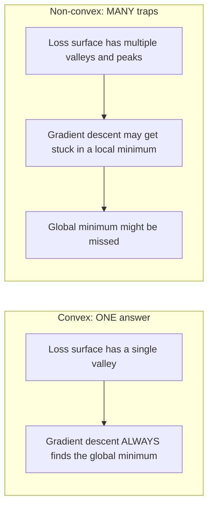
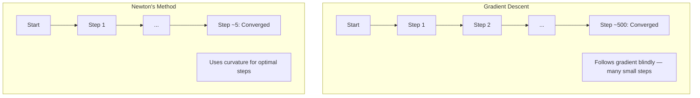
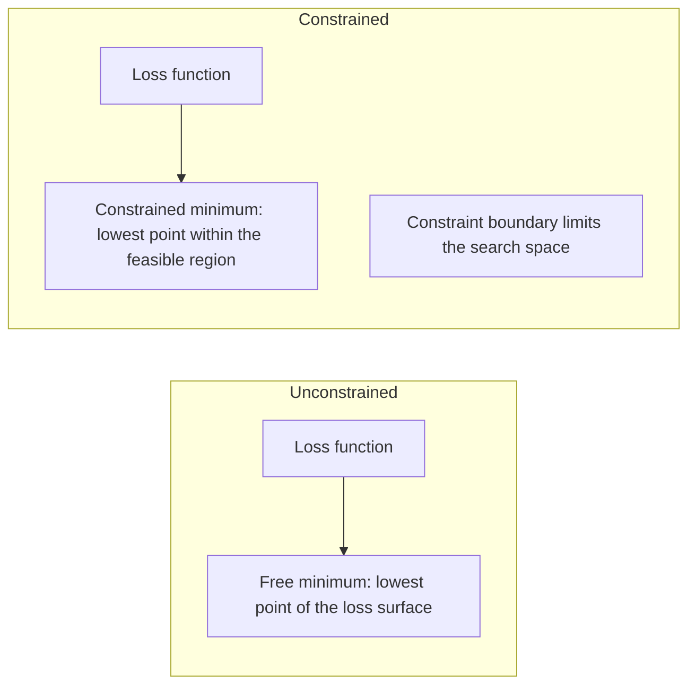
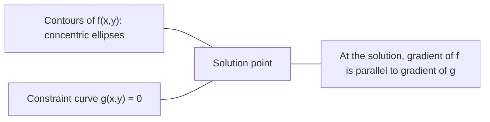

# Optimização convexa

> Os problemas convexos têm um vale, as redes neurais têm milhões, e saber a diferença importa.
> O problema da contagem é apenas um.

**Type:** Build | **类型:** 动手
**Language:**O Python .**语言:**Python
**Prerequisites:** Phase 1, Lessons 04 (Calculus for ML), 08 (Optimization) | **前置知识:** Phase 1, 第 04 课（微积分）、第 08 课（优化）
**Time:** ~90 minutes | **时间:** ~90 分钟

## Objetivos de aprendizagem

- Teste se uma função é convexa usando a definição, a segunda derivada e os critérios de Hessian
  Utilize definição、二阶导数和 Hessian 判据测试函数是否为凸函数
- Implementar o método de Newton e comparar sua convergência quadrática contra a descida de gradiente
  实现牛顿法 (Método de Newton)并比较其二次收与梯度下降
- Resolver problemas de otimização restritos usando multiplicadores de Lagrange e interpretar condições KKT
  Utilize拉格朗日乘子(Lagrange Multiplicators) 求解约束优化问题,解释 KKT 条件
- Explicar por que as paisagens de perda de rede neural não são convexas, mas a SGD ainda encontra boas soluções
  Explica por que a perda de rede neuronal não é tão grave, mas a SGD ainda consegue encontrar uma boa solução.


> **【中文解读】**
> A função de contagem é apenas um vale ((o melhor de todo o lado), o regresso linear é o melhor do contagem, por isso é preciso ter o melhor de todo o lado.

## O problema é o problema da introdução

A lição 08 ensinou-lhe descida de gradiente, impulso e Adão. Esses optimistas caminham descendo em qualquer superfície. Mas eles não têm garantias.

> No capítulo 8, você pode aprender a descer em qualquer superfície, mas não tem garantias de que a descer em qualquer superfície pode ser um erro de menor valor local, ou de um ponto de sela, ou de uma onda permanente.

Mas muitos problemas no aprendizado de máquina são convexos. Regressão linear, regressão logística, SVMs, LASSO, regressão de crista. Para estes, existe algo mais forte: otimização com garantias matemáticas. Um problema convexo tem exatamente um vale. Qualquer algoritmo que caminhe para baixo vai atingir o mínimo global. Não é necessário reiniciar. Não há horários de taxa de aprendizagem. Não há oração.

> Mas muitas das questões do aprendizado de máquina são de contagem. O regresso linear, o regresso lógico, o regresso SVM, o LASSO, o regresso. Para estas, há coisas mais fortes: otimizar com garantias matemáticas.

Compreender a convexidade faz três coisas. Primeiro, ele diz quando o seu problema é fácil (convexo) versus difícil (não convexo). Segundo, ele lhe dá ferramentas mais rápidas como o método de Newton para problemas convexos. Terceiro, ele explica conceitos que aparecem em todo o ML: regularização como restrição, dualidade em SVMs, e por que o aprendizado profundo funciona apesar de violar todas as propriedades agradáveis que a convexidade lhe dá.

> Compreender a conexão tem três funções. Primeiro, ele diz-lhe o problema quando é fácil (ou difícil) (não conexão). Segundo, ele fornece ferramentas mais rápidas para a conexão, como a lei de Newton.

## O conceito central.

> **【中文解读】**
> A forma da função de contagem é como uma taça, mas a SGD ainda pode encontrar uma boa solução na prática.

> **【拓展：凸优化在工业中的实际规模】**
> O sistema de classificação de anúncios do Google usa a lógica de grande escala de regresso (concentramento), processando bilhões de solicitações diárias. O SVM é amplamente utilizado em pesquisas de pessoas (Viola-Jones) e em textos (Groubi CPLEX) pode ser usado em poucos minutos para resolver um problema de planejamento de milhões de variações.

### Sete convexos

Um conjunto S é convexo se, para quaisquer dois pontos em S, o segmento de linha entre eles também se encontra inteiramente em S.

> Se o conjunto S está em qualquer linha entre dois pontos, então S é um conjunto de convexações.

| Convex sets | Not convex |
|---|---|
| **Rectangle**: any two points inside can be connected by a line segment that stays inside | **Star/crescent shape**: a line between two interior points can pass outside the set |
| **Triangle**: same property holds for all interior points | **Donut/annulus**: the hole means some line segments leave the set |
| The line segment between any two points stays within the set | The line segment between some pairs of points exits the set |

Teste formal: para qualquer ponto x, y em S e qualquer t em [0, 1], o ponto tx + (1-t) y também está em S.

> 形式化测试: For S 中的任意点 x、y 和 [0, 1] 中的任意 t,点 tx + (1-t) y 也在 S 中。

Exemplos de conjuntos convexos:
- Uma linha, um plano, todos os R^n
  Uma linha reta, um plano, toda a R^n
- Uma bola (círculo, esfera, hiperesfera)
  Uma bola (ou um círculo)
- Um espaço de meia-fase: {x: a^T x <= b}
  半空间: {x: a^T x <= b}
- A intersecção de qualquer número de conjuntos convexos
  任意数凸集的交交交

Exemplos de conjuntos não convexos:
- Um donut (annulus)
  环面( circun circun)
- A união de dois círculos desarticulados
  两个不相交交的并集
- Qualquer conjunto com um "dent" ou "buraco"
  Qualquer conjunto de "caídas" ou "buracos"

### Funções convexas

Uma função f é convexa se o seu domínio é um conjunto convexo e para qualquer dois pontos x, y no seu domínio e qualquer t em [0, 1]:

> Se a função f define um domínio de contagem, e para o campo de definição, qualquer dois pontos x、y 和 [0, 1] de qualquer t:

```
f(tx + (1-t)y) <= t*f(x) + (1-t)*f(y)
```

Geometricamente: o segmento de linha entre quaisquer dois pontos no gráfico fica acima ou no gráfico.

> 几何上: linha entre qualquer dois pontos do quadro está situada acima do quadro ou no quadro.

| Property | Convex function | Non-convex function |
|---|---|---|
| **Line segment test** | The line between any two points on the graph lies **above or on** the curve | The line between some points on the graph dips **below** the curve |
| **Shape** | Single bowl/valley curving upward | Multiple peaks and valleys with mixed curvature |
| **Local minima** | Every local minimum is the global minimum | Multiple local minima may exist at different heights |

Funções convexas comuns:
- f ((x) = x^2 (parabola)
  抛物线
- f(x) = ↓x (valor absoluto)
   Valor absoluto
- f(x) = e^x (exponencial)
  Fungção de número
- f(x) = max(0, x) (ReLU, embora linear em pedaços)
  ReLU( embora分段线性)
- f(x) = -log(x) para x > 0 (log negativo)
  负对数
- Qualquer função linear f ((x) = a^T x + b (tanto convexa quanto côncava)
  任何线性函数 ((既是凸的也是的)

### Teste de convexidade

Três testes práticos, do mais fácil ao mais rigoroso.

> Três tipos de testes práticos, do mais simples ao mais rigoroso.

**Test 1: Second derivative test (1D).**Se f'(x) >= 0 para todos os x, então f é convexa.

> **测试 1：二阶导数测试（一维）。**Se para todos os x tiver f'(x) >= 0, então f é de contagem.

- F'''(x) = 2 >= 0.
- f''(x) = x^3: f''(x) = 6x. Negativo para x < 0. Não é convexo.
- F''(x) = e^x: f''(x) = e^x > 0.

**Test 2: Hessian test (multivariate).**Se a matriz hessiana H ((x) é semidefinita positiva para todos os x, então f é convexa.

> **测试 2：Hessian 测试（多变量）。**Se Hessian 矩阵 H(x) para todos os x são semi-regulares, então f é de contagem.

**Test 3: Definition test.**Verifique a desigualdade f ((tx + (1-t) y) <= t * f ((x) + (1-t) * f ((y) diretamente. Útil para funções onde as derivadas são difíceis de calcular.

> **测试 3：定义测试。**直接检查不等式 f(tx + (1-t) y) <= t*f(x) + (1-t) *f(y)。适用于导数难以计算的函数。

### Por que a convexidade é importante

O teorema central da otimização convexa:

**For a convex function, every local minimum is a global minimum.**

> **对于凸函数，每个局部最小值都是全局最小值。**

O algoritmo é garantido para convergir para a solução ideal.

> Isso significa que a descida da gradiência não será atrapada. Qualquer caminho de descida vai para a mesma resposta.

> **【中文解读】**
> É a teoria central da optimização de camadas: o valor mínimo de cada local da função camada é o valor mínimo de toda a área. Isto significa que a redução da gradiência nunca vai estar no local de "muito melhor".



Consequências:
- Não é preciso reiniciar aleatoriamente
  Não precisa de reiniciar
- Não é necessário um ritmo de aprendizagem sofisticado
  Não precisa de uma modulação de taxa de aprendizagem complexa
- É possível verificar a convergência (a taxa depende das propriedades da função)
  Pode provar a receita (a taxa depende da função)
- A solução é única (até regiões planas)
  解是唯一的 (excluindo a área plana)

### Convexo vs não convexo em ML

| Problem | Convex? | Why |
|---------|---------|-----|
| Linear regression (MSE) | Yes | Loss is quadratic in weights |
| Logistic regression | Yes | Log-loss is convex in weights |
| SVM (hinge loss) | Yes | Maximum of linear functions |
| LASSO (L1 regression) | Yes | Sum of convex functions is convex |
| Ridge regression (L2) | Yes | Quadratic + quadratic = convex |
| Neural network (any loss) | No | Nonlinear activations create non-convex landscape |
| k-means clustering | No | Discrete assignment step |
| Matrix factorization | No | Product of unknowns |

Os modelos lineares com perdas convexas são convexas.

> O modelo linear com perda de contagem é de contagem. Uma vez que você adiciona uma camada oculta de ativar não linear, a contagem é quebrada.

### A Matriz Hessiana

O Hessiano de uma função f: R^n -> R é a matriz n x n de derivadas parciais de segunda.

> 函数 f: R^n -> R de Hessian 矩阵 H é n x n de segunda fase de orientação do矩阵。

```
H[i][j] = d^2 f / (dx_i dx_j)
```

Para f ((x, y) = x^2 + 3xy + y^2:

```
df/dx = 2x + 3y       d^2f/dx^2 = 2      d^2f/dxdy = 3
df/dy = 3x + 2y       d^2f/dydx = 3      d^2f/dy^2 = 2

H = [ 2  3 ]
    [ 3  2 ]
```

O Hessiano fala-lhe sobre a curvatura:
- Valores próprios todos positivos: a função curva para cima em todas as direções (convexa nesse ponto)
  Features value full for correct: função está em cada direção
- Valores próprios todos negativos: curvas para baixo em todas as direções (concavo, um local máximo)
  Features value full为负: cada direção está em direção a baixo (máximo valor da parte)
- Sinais mistos: ponto de sela (curvas para cima em algumas direções, para baixo em outras)
  混合符号:点( certos direções para cima, outros direções para baixo)
- Valor próprio zero: plano nessa direcção (degenerado)
  零特征值:该方向平坦(退化)

Para a convexidade, o Hessiano deve ser semidefinito positivo (todos os valores próprios >= 0) em todos os lugares, não apenas em um ponto.

> Para a contagem, o Hessiano deve ser em qualquer lugar semelhante a um valor semelhante.

### Método de Newton

A descida gradiente usa informações de primeira ordem (o gradiente). O método de Newton usa informações de segunda ordem (o Hessiano).

> 梯度下降使用一阶信息(梯度) ・・・牛顿法使用二阶信息(Hessian) ・・・ é em ponto atual adequado a uma segunda aproximação, então salta diretamente para o valor mínimo dessa segunda função。

```
Update rule:
  x_new = x - H^(-1) * gradient

Compare to gradient descent:
  x_new = x - lr * gradient
```

O método de Newton substitui a taxa de aprendizagem escalar pelo Hessiano inverso.

> 牛顿法用逆ヘッシアン 替代标量学习率──这根据局部曲率自动调整步长和方向──

> **【拓展：牛顿法在现代 ML 中的实际使用】**
> Embora o método de Newton não seja praticado em aprendizagem profunda, mas ainda é o principal método de aprendizagem clássica.



Benefícios:
- Convergência quadrática próxima ao mínimo (quadrados de erro em cada passo)
  Em segundo recebimento por erro de cada passo
- Não há taxa de aprendizagem para sintonizar
  无需调节学习率
- Invariante de escala (funciona independentemente de como você parâmetre o problema)
  尺度不变 (qualquer que seja a dimensão do problema, tudo pode funcionar)

Desvantagens:
- O cálculo do Hessian custa O  n^2) memória e O  n^3) para inverter
  計算 Hessian 需要 O(n^2) 内存和 O(n^3) 求逆
- Para uma rede neural com 1 milhão de pesos, isto é, 10^12 entradas e 10^18 operações
  Para 100 mil pesos de rede neuronal, é 10 a 12 elementos e 10 a 18 vezes de operação.
- Não prático para aprendizagem profunda
  Não é adequado para aprendizagem profunda

### Optimização limitada

Optimização sem restrições: minimizar f ((x) sobre todos os x.
Otimizamento restrito: minimizar f ((x) sujeito a restrições.

> 无约束优化: 在所有 x 上最小化 f(x) ・・・约束优化: 在约束条件下最小化 f(x) ・・・

Os problemas reais têm limitações. Você quer minimizar os custos, mas o seu orçamento é limitado. Você quer minimizar os erros, mas a sua complexidade do modelo é limitada.

> O problema real é que há limitações. Você quer minimizar os custos, mas o orçamento é limitado.



### Multiplicadores de lagrança

O método dos multiplicadores de Lagrange converte um problema restrito em um sem restrições.

> 拉格朗日乘子法将约束问题转变为无约束问题.

Problema: minimizar f ((x) sujeito a g ((x) = 0.

Solução: introduzir uma nova variável (o lambda do multiplicador de Lagrange) e resolver o problema sem restrições:

```
L(x, lambda) = f(x) + lambda * g(x)
```

Na solução, o gradiente de L é zero:

```
dL/dx = df/dx + lambda * dg/dx = 0
dL/dlambda = g(x) = 0
```

Intuição geométrica: no mínimo restrito, o gradiente de f deve ser paralelo ao gradiente da restrição g. Se não forem paralelas, você pode se mover ao longo da superfície da restrição e reduzir f ainda mais.

> 几何直觉: em um ponto de menor valor do bloco, a gradiência de f deve ser igual à gradiência de g do bloco. Se não for igual, você pode mover-se ao longo do bloco e reduzir ainda mais f.



Exemplo: minimizar f ((x,y) = x^2 + y^2 sujeito a x + y = 1.

```
L = x^2 + y^2 + lambda(x + y - 1)

dL/dx = 2x + lambda = 0  =>  x = -lambda/2
dL/dy = 2y + lambda = 0  =>  y = -lambda/2
dL/dlambda = x + y - 1 = 0

From first two: x = y
Substituting: 2x = 1, so x = y = 0.5, lambda = -1
```

O ponto mais próximo da linha x + y = 1 à origem é (0,5, 0,5).

> Linea directa x + y = 1 上离原点最近的点是 (0.5, 0.5)。

### Condições da KKT

As condições Karush-Kuhn-Tucker estendem os multiplicadores de Lagrange a restrições de desigualdade.

> KKT 条件(Karush-Kuhn-Tucker Conditions) vai拉格朗日乘子推广到不等式约束──

Problema: minimizar f  x) sujeito a g  i  x) <= 0 para i = 1, ..., m.

As condições de KKT (necessárias para a otimização):

```
1. Stationarity:    df/dx + sum(lambda_i * dg_i/dx) = 0
2. Primal feasibility:  g_i(x) <= 0  for all i
3. Dual feasibility:    lambda_i >= 0  for all i
4. Complementary slackness:  lambda_i * g_i(x) = 0  for all i
```

A lenteza complementar é a principal noção: ou a restrição é ativa (g_i = 0, a solução fica na fronteira) ou o multiplicador é zero (a restrição não importa).

> 互补松性(Complementary Slackness) 是关键洞察:要么约束是活跃的(g_i = 0,解在边界上),要么乘子为零(约束不重要)  不影响解的约束其 lambda = 0。

As condições KKT são fundamentais para os SVM. Os vetores de apoio são os pontos de dados onde a restrição é ativa (lambda > 0).

> KKT 条件是 SVM's核心──支持向量──Support Vectors)就是约束活的那些数据点──lambda > 0)──所有其他数据点的 lambda = 0,不影响决策边界──

> **【中文解读】**
> A condição KKT é a versão mais popular do jogo de jogo de jogo de jogo de jogo de jogo de jogo de jogo de jogo de jogo de jogo de jogo de jogo de jogo de jogo de jogo de jogo de jogo de jogo de jogo de jogo de jogo de jogo de jogo de jogo de jogo de jogo de jogo de jogo de jogo de jogo de jogo de jogo de jogo de jogo de jogo de jogo de jogo de jogo de jogo de jogo de jogo de jogo de jogo de jogo de jogo de jogo de jogo de jogo de jogo de jogo de jogo de jogo de jogo de jogo de jogo de jogo de jogo de jogo de jogo de jogo de jogo de jogo de jogo de jogo de jogo de jogo de jogo de jogo de jogo de jogo de jogo de jogo de jogo de jogo de jogo de jogo de jogo de jogo de jogo de jogo de jogo de jogo de jogo de jogo de jogo de jogo de jogo de jogo de jogo de jogo de jogo de jogo de jogo de jogo de jogo de jogo de jogo de jogo de jogo de jogo de jogo de jogo de jogo de jogo de jogo de jogo de jogo de jogo de jogo de jogo de jogo de jogo de jogo de jogo de jogo de jogo de jogo de jogo de jogo de jogo de jogo de jogo de jogo de jogo de jogo de jogo de jogo de jogo de jogo de jogo de jogo de jogo de jogo de jogo de jogo de jogo de jogo de jogo de jogo de jogo de jogo de jogo de jogo de jogo de jogo de jogo de jogo de jogo de jogo de jogo de jogo de jogo de jogo de jogo de jogo de jogo de jogo de jogo de jogo de jogo de jogo de jogo de jogo de jogo de jogo de jogo de jogo de jogo de jogo de jogo de jogo de jogo de jogo de jogo de jogo de jogo de jogo de jogo de jogo de jogo de jogo de jogo de jogo de jogo de jogo de jogo de jogo de jogo de jogo de jogo de jogo de jogo de jogo de jogo de jogo de jogo de jogo de jogo de jogo de jogo de jogo de jogo de jogo de jogo de jogo de jogo de jogo de jogo de jogo de jogo de jogo de jogo de jogo de jogo de jogo de jogo de jogo de jogo de jogo de jogo de jogo de jogo de jogo de jogo de jogo de jogo de jogo de jogo de jogo de jogo de jogo de jogo de jogo de jogo de jogo de jogo de jogo de jogo de jogo de jogo de jogo de jogo de jogo de jogo de jogo de jogo de jogo de jogo de

### Regularização como otimização limitada

A regularização L1 e L2 não são truques arbitrários, são problemas de otimização limitada disfarçados.

> L1 e L2 não são técnicas arbitrárias.

**L2 regularization (Ridge):**

```
minimize  Loss(w)  subject to  ||w||^2 <= t

Equivalent unconstrained form:
minimize  Loss(w) + lambda * ||w||^2
```

A restrição de desvio em desvio <= t define uma bola (círculo em 2D, esfera 3D).

> 约束 约束 约束 约束 约束 约束 约束 约束 约束 约束 约束 约束 约束 约束 约束 约束 约束 约束 约束 约束 约束 约束 约束 约束 约束 约束 约束 约束 约束 约束 约束 约束 约束 约束 约束 约束 约束 约束 约束 约束 约束 约束 约束 约束 约束 约束 约束 约束 约束 约束 约束 约束 约束 约束 约束 约束 约束 约束 约束 约束 约束 约束 约束 约束 约束 约束 约 约 约 约 约 约 约 约 约 约 约 约 约 约 约 约 约 约 约 约 约 约 约 约 约 约 约 约 约 约 约 约 约 约 约 约 约 约 约 约 约 约 约 约                                                                                                                                                                                                                                

**L1 regularization (LASSO):**

```
minimize  Loss(w)  subject to  ||w||_1 <= t

Equivalent unconstrained form:
minimize  Loss(w) + lambda * ||w||_1
```

A restrição de que não é necessário <= t define um diamante (quadrado rotativo em 2D).

> 约束 约束 约束 约束 约束 约束 约束 约束 约束 约束 约束 约束 约束 约束 约束 约束 约束 约束 约束 约束 约束 约束 约束 约束 约束 约束 约束 约束 约束 约束 约束 约束 约束 约束 约束 约束 约束 约束 约束 约束 约束 约束 约束 约束 约束 约束 约束 约束 约束 约束 约束 约束 约束 约束 约束 约束 约束 约束 约束 约束 约束 约束 约束 约束 约束 约束 约束 约束 约束 约束 约束 约束 约束 约束 约束 约束 约束 约束 约束 约束 约 约 约 约 约 约 约 约 约 约 约 约 约 约 约 约 约 约 约 约 约 约 约 约 约 约 约 约 约 约 约 约 约 约 约 约 约 约 约 约 约 约 约 约 约 约 约 约 约 约 约 约 约 约 约 约 约 约 约 约 约 约 约 约 约 约 约 约 约 约 约 约 约                                                                                                                            

| Property | L2 constraint (circle) | L1 constraint (diamond) |
|---|---|---|
| **Constraint shape** | Circle (sphere in higher dims) | Diamond (rotated square in 2D) |
| **Where loss contour touches** | Smooth boundary — any point on the circle | Corner — aligned with an axis |
| **Solution behavior** | Weights are small but nonzero | Some weights are exactly zero (sparse) |
| **Result** | Weight shrinkage | Feature selection |

Isso explica por que L1 produz modelos escassos (seleção de características) enquanto L2 apenas reduz os pesos. O diamante tem cantos alinhados com eixos. Os contornos de perda são mais propensos a tocar um canto, definindo um ou mais pesos exatamente a zero.

> Isso explica por que L1  produz um modelo raro ([[tráfico de seleção]]) e L2 apenas se encolhe o peso.

> **【拓展：L1 正则化与 L2 正则化的几何直觉】**
> L1 é um conjunto de formas que se tornam quadradas em 2D, L2 é um conjunto de formas que se tornam redondas. O seu canto fica no eixo do estádio, por isso é mais fácil encontrar o canto. Isso significa que alguns pesos são definidos como zero. É por isso que o LASSO pode fazer seleção de características automaticamente.

### Dualismo

Cada problema de otimização restrita (o primário) tem um problema companheiro (o duplo). Para os problemas convexos, o primário e o duplo têm o mesmo valor ideal.

> Cada problema de otimização de um conjunto de problemas tem um problema de acompanhamento.

A função dupla de Lagrange:

```
Primal: minimize f(x) subject to g(x) <= 0
Lagrangian: L(x, lambda) = f(x) + lambda * g(x)
Dual function: d(lambda) = min_x L(x, lambda)
Dual problem: maximize d(lambda) subject to lambda >= 0
```

Por que a dualidade é importante:
- O problema duplo é às vezes mais fácil de resolver do que o problema primário.
  Para problemas ocasionais, às vezes, é mais fácil de resolver do que o original.
- Os SVM são resolvidos em sua forma dupla, onde o problema depende de produtos de pontos entre pontos de dados (activação do truque do kernel)
  SVM em forma de procura de solução, o problema depende apenas de pontos entre pontos de dados (para poder usar técnicas nucleares)
- O duplo fornece um limite inferior do óptimo primário, útil para verificar a qualidade da solução
  Para que o valor ideal original seja fornecido, para a qualidade de teste de solução

Para os SVM especificamente:

```
Primal: find w, b that maximize the margin 2/||w|| subject to
        y_i(w^T x_i + b) >= 1 for all i

Dual:   maximize sum(alpha_i) - 0.5 * sum_ij(alpha_i * alpha_j * y_i * y_j * x_i^T x_j)
        subject to alpha_i >= 0 and sum(alpha_i * y_i) = 0

The dual only involves dot products x_i^T x_j.
Replace x_i^T x_j with K(x_i, x_j) to get the kernel trick.
```

### Por que o aprendizado profundo funciona apesar da não-convexidade

As funções de perda de rede neural são muito não convexas. Por todas as medidas clássicas, otimizá-las deve falhar. No entanto, a descida do gradiente estocástico encontra boas soluções de forma confiável. Vários fatores explicam isso.

> A função de perda de rede nervosa é extremamente não-confundida. De acordo com a teoria clássica, a optimização deve falhar.

**Most local minima are good enough.**Em espaços de alta dimensão, pontos críticos aleatórios (onde o gradiente é zero) são em grande parte pontos de sela, não mínimos locais. Os poucos mínimos locais que existem tendem a ter valores de perda próximos ao mínimo global. Ficar preso em um mínimo local terrível é extremamente improvável quando o espaço de parâmetros tem milhões de dimensões.

> **大多数局部最小值都足够好。**Em alto espaço, os pontos de limite (ascendentes) são a maioria pontos, e não o mínimo local. O mínimo local de perdas de um pequeno número de pontos de perdas geralmente se aproxima do mínimo local. Quando o espaço de parâmetros tem milhões de pontos, é quase impossível ficar preso no mínimo local de um lugar ruim.

**Saddle points, not local minima, are the real obstacle.**Em uma função com n parâmetros, um ponto de sela tem uma mistura de direções de curvatura positiva e negativa. Para um ponto crítico aleatório em dimensões altas, a probabilidade de todos os n valores próprios serem positivos (mínimo local) é aproximadamente 2 ^ - n. Quase todos os pontos críticos são pontos de sela.

> **鞍点而非局部最小值才是真正的障碍。**Em funções de n 个参数, 点 possui direção de curvatura negativa positiva de mistura. Em relação aos pontos de curvatura random em alto nível, a probabilidade de todos os n 个特征值都为正 (n) 局部最小值) é de aproximadamente 2^(-n) ⋅ quase todos os pontos de curvatura são 点──SGD.

**Overparameterization smooths the landscape.**As redes com mais parâmetros do que os exemplos de treinamento têm superfícies de perda mais suaves e conectadas.

> **过参数化（Overparameterization）使损失面更平滑。**参数多于训练样本网络具有更平滑,更连接的损失面;; 较宽的网络具有更少的坏局部最小值;; Isso é contrário ao intuito, mas concorda na experiência;;

**Loss landscape structure:**

| Property | Low-dimensional space | High-dimensional space |
|---|---|---|
| **Landscape** | Many isolated peaks and valleys | Smoothly connected valleys |
| **Minima** | Many isolated local minima | Few bad local minima; most are near-optimal |
| **Navigation** | Hard to find global minimum | Many paths lead to good solutions |
| **Critical points** | Mix of local minima and saddle points | Overwhelmingly saddle points, not local minima |

**Stochastic noise acts as implicit regularization.**O SGD de mini-batch adiciona ruído que impede o estabelecimento em mínimos nítidos. mínimos nítidos superfiquem; mínimos planos generalizam. O ruído favorece a otimização em direção a regiões planas da paisagem de perda.

> **随机噪声充当隐式正则化。**Mini-batch SGD  adição de ruído para evitar a queda em extremo menor valor .

> **【中文解读】**
> O sucesso do aprendizado profundo parece violar a teoria da optimização de camadas: as funções não camadas devem ser muito difíceis de optimizar, mas o SGD funciona muito bem. Há três razões: primeiro, quase todos os pontos críticos no espaço alto são valores mínimos locais, e não locais; segundo, a hiperparametrização faz com que a perda facial seja mais lisa; terceiro, o ruído do SGD é um tipo de regularização oculta, ajudando a escapar de valores extremamente pequenos, encontrando soluções mais simples e generalizadas.

### Métodos de segunda ordem na prática

O método de Newton puro é impraticável para grandes modelos. Várias aproximações tornam a informação de segunda ordem útil.

> A prática de Newton em relação a um grande modelo não é prática.

**L-BFGS (Limited-memory BFGS):**Aproxima o Hessiano inverso usando as últimas diferenças de gradiente m. Requer memória O(mn em vez de O(n^2). Funciona bem para problemas com até ~ 10.000 parâmetros.

> **L-BFGS：**Utilize recent m 个梯度差近似逆 Hessian。需要 O(mn) 内存而不是 O(n^2)。 é usado para mais de 10.000 个参数问题──用于经典 ML(逻辑归归、CRF)

**Natural gradient:**Utiliza a matriz de informação Fisher (esperado Hessian da probabilidade de log) em vez do Hessian padrão. Isso explica a geometria das distribuições de probabilidade. K-FAC (Curvatura aproximada de Cronécker-Fatorado) aproxima a matriz Fisher como um produto de Cronécker, tornando-a prática para redes neurais.

> **自然梯度（Natural Gradient）：**Utilize Fisher 信息矩阵 (Hessian) (em grego: Hessian) (em grego: Hessian) (em grego: Hessian) (em grego: Hessian) (em grego: Hessian) (em grego: Hessian) (em grego: Hessian) (em grego: Hessian) (em grego: Hessian) (em grego: Hessian) (em grego: Hessian) (em grego: Hessian) (em grego: Hessian) (em grego: Hessian) (em grego: Hessian) (em grego: Hessian) (em grego: Hessian) (em: Hessian) (em: Hessian) (em: Hessian) (em grego: Hessian) (em: Hessian) (em: Hessian) (em: Hessian) (em: Hessian) (em: Hessian) (em: Hessian) (em: Hessian) (em: Hessian) (em: Hessian) (em: Hessian) (em: Hessian) (em: Hessian) (em: Hessian) (em: Hessian) (em: Hessian) (em: Hessian) (em: Hessian) (em: Hessian) (em: Hessian) (em: Hessian) (em: Hessian) (em: Hessian) (en: Hessian) (en: K-F: K-F: K-F: K-FAC: K-F: K-F: K-F: K-F: K-F: K-F: K-F: K-F: K-F: K-F: K-F: K-F: K-F: K-F: K-F: K-F: K-F: K-F: K-F: K-F: K-F: K-F: K-F: K-F: K-F:

**Hessian-free optimization:**Utiliza gradiente conjugado para resolver Hx = g sem nunca formar H. Só requer produtos de vetor Hessiano, que podem ser calculados em tempo O ((n) através de diferenciação automática.

> **无 Hessian 优化：**Utilize 共梯度求解 Hx = g 而无需形成 H──只需要Hessian-向量乘积,可通过自动微分在 O n) 时间内计算──

**Diagonal approximations:**O segundo momento de Adam é uma aproximação diagonal da diagonal de Hessian. AdaHessian estende isso usando elementos diagonais de Hessian reais através do estimador de Hutchinson.

> **对角近似：**A segunda fase de Adão é a aproximação hessiana de um ângulo de linha. Ada Hessian  Hutchinson  estimador usando o elemento hessiano real para um ângulo de linha para se expandir.

| Method | Memory | Per-step cost | When to use |
|--------|--------|--------------|-------------|
| Gradient descent | O(n) | O(n) | Baseline, large models |
| Newton's method | O(n^2) | O(n^3) | Small convex problems |
| L-BFGS | O(mn) | O(mn) | Medium convex problems |
| Adam | O(n) | O(n) | Deep learning default |
| K-FAC | O(n) | O(n) per layer | Research, large-batch training |

## Construí-lo e realizei-o.
```figure
convex-vs-nonconvex
```

## Construí-lo

### Passo 1: Verificador de convexidade

Construir uma função que teste a convexidade empiricamente por meio de pontos de amostragem e verificação da definição.

> Construir uma função, através de uma análise de pontos e de uma definição experimental de testes de camadas.

```python
import random
import math

def check_convexity(f, dim, bounds=(-5, 5), samples=1000):
    violations = 0
    for _ in range(samples):
        x = [random.uniform(*bounds) for _ in range(dim)]  # 随机采样点 x
        y = [random.uniform(*bounds) for _ in range(dim)]  # 随机采样点 y
        t = random.uniform(0, 1)                            # 随机混合系数
        mid = [t * xi + (1 - t) * yi for xi, yi in zip(x, y)]  # 凸组合 tx + (1-t)y
        lhs = f(mid)                                        # f(凸组合)
        rhs = t * f(x) + (1 - t) * f(y)                    # tf(x) + (1-t)f(y)
        if lhs > rhs + 1e-10:                               # 违反凸性不等式
            violations += 1
    return violations == 0, violations
```

### Passo 2: Método de Newton para 2D

Implemente o método de Newton usando um Hessiano explícito.

> Utilização de Hessian expresso 实现牛顿法── comparado com a taxa de receção de gradiente descendente──

```python
def newtons_method(f, grad_f, hessian_f, x0, steps=50, tol=1e-12):
    x = list(x0)
    history = [x[:]]
    for _ in range(steps):
        g = grad_f(x)
        H = hessian_f(x)
        det = H[0][0] * H[1][1] - H[0][1] * H[1][0]
        if abs(det) < 1e-15:
            break
        H_inv = [
            [H[1][1] / det, -H[0][1] / det],
            [-H[1][0] / det, H[0][0] / det],
        ]
        dx = [
            H_inv[0][0] * g[0] + H_inv[0][1] * g[1],
            H_inv[1][0] * g[0] + H_inv[1][1] * g[1],
        ]
        x = [x[0] - dx[0], x[1] - dx[1]]
        history.append(x[:])
        if sum(gi ** 2 for gi in g) < tol:
            break
    return history
```

### Passo 3: Solvente do multiplicador de lagrança

Resolver a otimização limitada usando a descida de gradiente no Lagrangiano.

> Utilize gradiente de função de Lagrange em redução de solução de um sistema de optimização.

```python
def lagrange_solve(f_grad, g_val, g_grad, x0, lr=0.01,
                   lr_lambda=0.01, steps=5000):
    x = list(x0)
    lam = 0.0
    history = []
    for _ in range(steps):
        fg = f_grad(x)
        gv = g_val(x)
        gg = g_grad(x)
        x = [
            xi - lr * (fgi + lam * ggi)
            for xi, fgi, ggi in zip(x, fg, gg)
        ]
        lam = lam + lr_lambda * gv
        history.append((x[:], lam, gv))
    return history
```

### Passo 4: Comparar o primeiro e o segundo

Execute a descida do gradiente e o método de Newton na mesma função quadrática.

```python
def quadratic(x):
    return 5 * x[0] ** 2 + x[1] ** 2

def quadratic_grad(x):
    return [10 * x[0], 2 * x[1]]

def quadratic_hessian(x):
    return [[10, 0], [0, 2]]
```

O método de Newton converge em 1 passo (é exato para quadrática). A descida gradual levará centenas de passos porque os valores próprios do Hessiano diferem por um fator de 5, criando um vale alongado.

> O Newton vai receber em 1 passo a 2a função é preciso. A redução da gradiência requer 100 passos, pois a diferença entre os valores de características do Hessian 5 vezes, formando um pequeno vale.

## Use-o com o framework implementado.

A análise da convexidade aplica-se directamente na escolha de modelos e solventes ML.

> 凸性分析在选择ML 模型和求解器当直接适用──

Para problemas convexos (regressão logística, SVM, LASSO):
- Utilize solventes dedicados (liblinear, CVXPY, scipy.optimize.minimize com method='L-BFGS-B')
  Utilize especial para resolver
- Esperem uma solução global única
  期望唯一的全局解
- Os métodos de segunda ordem são práticos e rápidos
  2o Caso de método prático e rápido

Para problemas não convexos (redes neurais):
- Utilize métodos de primeira ordem (SGD, Adam)
  Utilize um método de primeira fase
- Aceitar que a solução depende da inicialização e aleatoriedade
                                                                                                                                                                                                                                                                                                                                                                                                                                                                                                                               
- Usar o excesso de parametrização, ruído e horários de taxa de aprendizagem como regularização implícita
  Utilizando a parâmetrosidade, ruído e a regulação da taxa de aprendizagem como forma de normalização
- Não perca tempo à procura do mínimo global.
  Não perca tempo procurando o mínimo da área inteira. Um bom local é o mínimo suficiente.

```python
from scipy.optimize import minimize

result = minimize(
    fun=lambda w: sum((y - X @ w) ** 2) + 0.1 * sum(w ** 2),
    x0=np.zeros(d),
    method='L-BFGS-B',
    jac=lambda w: -2 * X.T @ (y - X @ w) + 0.2 * w,
)
```

Para SVMs, a dupla formulação permite usar o truque do núcleo:

> Para SVM, para forma ocasional, podes usar o Nuclear Techniques (Trick do Núcleo):

```python
from sklearn.svm import SVC

svm = SVC(kernel='rbf', C=1.0)
svm.fit(X_train, y_train)
print(f"Support vectors: {svm.n_support_}")
```

## Exercícios.

1. **Convexity gallery.**Teste estas funções para convexidade usando o comprovador: f(x) = x^4, f(x) = sin(x), f(x,y) = x^2 + y^2, f(x,y) = x*y, f(x) = max(x, 0). Explique por que cada resultado faz sentido.

2. **Newton vs gradient descent race.**Execute ambos os métodos em f ((x,y) = 50*x^2 + y^2 a partir do ponto de partida (10, 10). Quantas etapas cada um precisa para alcançar a perda < 1e-10? O que acontece com a descida de gradiente quando o número de condição (ratio do maior ao menor valor próprio hessiano) aumenta?

3. **Lagrange multiplier geometry.**Minimizar f ((x,y) = (x-3) ^ 2 + (y-3) ^ 2 sujeito a x + 2y = 4. Verificar a solução verificando que o gradiente de f é paralelo ao gradiente de g na solução.

4. **Regularization constraint.**Implementar a otimização com restrição L1: minimizar (x-3)^2 + (y-2)^2 sujeito a ≠x ≠x ≠y ≠ <= 1. Mostre que a solução tem uma coordenada igual a zero (sparidade da restrição de diamante).

5. **Hessian eigenvalue analysis.**Calcule o Hessiano da função Rosenbrock em (1,1) e em (-1,1). Calcule os valores próprios em ambos os pontos. O que os valores próprios lhe dizem sobre a curvatura no mínimo versus longe dele?

## Termos-chave .

| Term | What it means |
|------|---------------|
| Convex set | A set where the line segment between any two points in the set stays inside the set |
| Convex function | A function where the line between any two points on its graph lies above or on the graph. Equivalently, Hessian is positive semidefinite everywhere |
| Local minimum | A point lower than all nearby points. For convex functions, every local minimum is the global minimum |
| Global minimum | The lowest point of a function over its entire domain |
| Hessian matrix | The matrix of all second partial derivatives. Encodes curvature information |
| Positive semidefinite | A matrix whose eigenvalues are all non-negative. The multidimensional analogue of "second derivative >= 0" |
| Condition number | Ratio of largest to smallest eigenvalue of the Hessian. High condition number means elongated valleys and slow gradient descent |
| Newton's method | Second-order optimizer that uses the inverse Hessian to determine step direction and size. Quadratic convergence near the minimum |
| Lagrange multiplier | A variable introduced to convert a constrained optimization problem into an unconstrained one |
| KKT conditions | Necessary conditions for optimality with inequality constraints. Generalize Lagrange multipliers |
| Complementary slackness | At the solution, either a constraint is active or its multiplier is zero. Never both nonzero |
| Duality | Every constrained problem has a companion dual problem. For convex problems, both have the same optimal value |
| Strong duality | Primal and dual optimal values are equal. Holds for convex problems satisfying Slater's condition |
| L-BFGS | Approximate second-order method that stores the last m gradient differences instead of the full Hessian |
| Saddle point | A point where the gradient is zero but it is a minimum in some directions and a maximum in others |
| Overparameterization | Using more parameters than training examples. Smooths the loss landscape and reduces bad local minima |

## Mais leitura 延伸阅读

- [Boyd & Vandenberghe: Convex Optimization](https://web.stanford.edu/~boyd/cvxbook/)- o livro-texto padrão, disponível gratuitamente na Internet
- [Bottou, Curtis, Nocedal: Optimization Methods for Large-Scale Machine Learning (2018)](https://arxiv.org/abs/1606.04838)- ponte teoria da otimização convexa e prática de aprendizagem profunda
- [Choromanska et al.: The Loss Surfaces of Multilayer Networks (2015)](https://arxiv.org/abs/1412.0233)- porque as redes neurais não convexas não são tão ruins como parecem
- [Nocedal & Wright: Numerical Optimization](https://link.springer.com/book/10.1007/978-0-387-40065-5)- referência abrangente do método de Newton, L-BFGS, e otimização limitada
