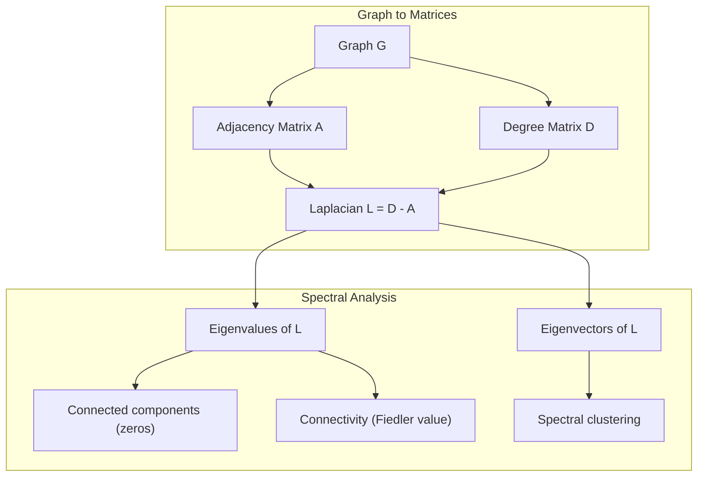
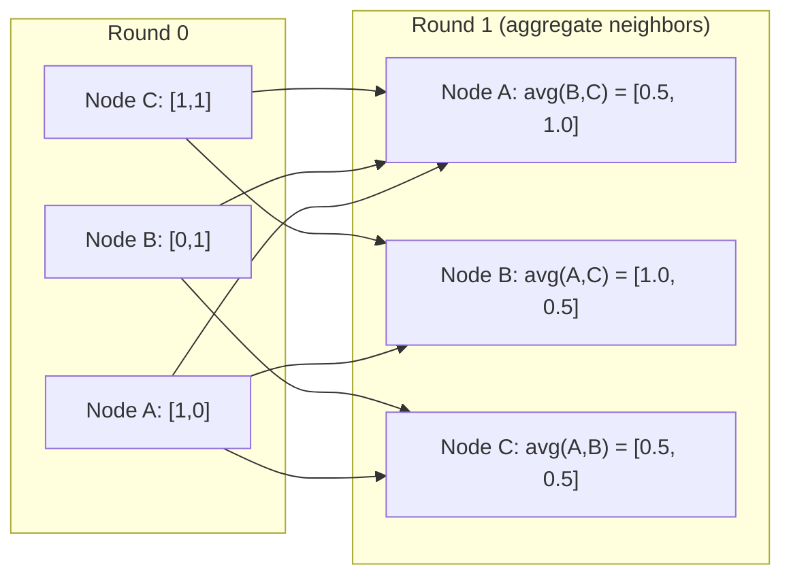

# Teoria de gráficos para aprendizado de máquina

> Os gráficos são a estrutura de dados das relações. Se os dados têm conexões, você precisa de teoria de gráficos.
> Se os seus dados estão conectados, você precisa de um quadro.

**Type:** Build | **类型:** 动手
**Language:**O Python .**语言:**Python
**Prerequisites:** Phase 1, Lessons 01-03 (linear algebra, matrices) | **前置知识:** Phase 1, 第 01-03 课（线性代数、矩阵）
**Time:** ~90 minutes | **时间:** ~90 分钟

## Objetivos de aprendizagem

- Construir uma classe de gráfico com representações de matriz/lista adjacentes e implementar transmissões BFS e DFS
  Construir com matriz/lista de representação de gráficos, implementar BFS e DFS
- Compute o gráfico Laplacian e use seus próprios valores para detectar componentes conectados e nós do cluster
  計算图拉普拉斯矩阵(Graph Laplacian)并使用其特征值检测连通分量和聚类节点
- Implementar uma rodada de mensagem de estilo GNN passando como uma matriz de adjacência normalizada multiplicação
  实现一轮 GNN 风格的消息传递归归归归归归归归归归邻矩阵乘法
- Aplicar agrupamento espectral para particionar um gráfico usando o vetor Fiedler
  应用谱聚类(Spectral Clustering) usando Fiedler 向量划分图


> **【中文解读】**
> As redes sociais, as estruturas moleculares e os gráficos de conhecimento são gráficos. A mensagem transmitida pelo GNN é, em essência, uma massa de matrizes vizinhas.

## O problema é o problema da introdução

Redes sociais, moléculas, bases de conhecimento, redes de citações, mapas de estrada - são todos gráficos. A ML tradicional trata os dados como tabelas planas. Cada linha é independente. Cada característica é uma coluna. Mas quando a estrutura das conexões importa, as tabelas falham.

> 社交网络、分子、知識库、引文网络、道路图都是图 (图)  (图) )  (传统ML将数据视为平表格──每行独立──每列是一个特征──但当连接结构很重要时,表格就失效了──

Considerem uma rede social. Você quer prever que produto um usuário vai comprar. Seu histórico de compra importa. Mas o histórico de compra de seus amigos importa mais. As conexões carregam sinal.

> 考虑社交网络――你想预测用户会买什么产品――他们的购买历史很重要――但他们朋友的购买历史更重要――连接带信号――

Ou, se pensarmos numa molécula, queremos prever se ela se liga a uma proteína. Os átomos são importantes, mas o que realmente importa é como os átomos estão ligados uns aos outros. A estrutura é os dados.

> Ou pensar em moléculas. Você pensa prever se ela é ligada a proteínas.

Graph Neural Networks (GNNs) são a área de mais rápido crescimento na aprendizagem profunda. Eles impulsionam a descoberta de drogas, recomendação social, detecção de fraude e raciocínio gráfico de conhecimento.

> 图神经网络 (GNN) é o campo de crescimento mais rápido do aprendizado profundo.

Precisas de quatro coisas:
1. Uma maneira de representar gráficos como matrizes (para que você possa multiplicá-los)
   将图表示为矩阵的方法 (), assim podemos fazer矩阵乘法)
2. Algoritmos de travessia para explorar a estrutura do gráfico
   Explorar o algoritmo de estrutura
3. O Laplacian - a matriz mais importante na teoria dos gráficos espectrais
   A matriça de Lapras é a matriça mais importante da teoria do desenho.
4. Passagem de mensagens - a operação que faz com que GNNs funcionem
   消息传递使 GNN 工作的操作

## O conceito central.

> **【中文解读】**
> 图是关系的数据结构──社会网络中人是节点、关注是边; moléculas nucleares nucleares nucleares nucleares nucleares nucleares nucleares nucleares nucleares nucleares nucleares nucleares nucleares nucleares nucleares nucleares nucleares nucleares nucleares nucleares nucleares nucleares nucleares nucleares nucleares nucleares nucleares nucleares nucleares nucleares nucleares nucleares nucleares nucleares nucleares nucleares nucleares nucleares nucleares nucleares nucleares nucleares nucleares nucleares nucleares nucleares nucleares nucleares nucleares nucleares nucleares nucleares nucleares nucleares nucleares nucleares nucleares nucleares nucleares nucleares nucleares nucleares nucleares nucleares nucleares nucleares nucleares nucleares nucleares nucleares nucleares nucleares nucleares nucleares nucleares nucleares nucleares nucleares nucleares nucleares nucleares nucleares nucleares nucleares nucleares nucleares nucleares nucleares nucleares nucleares nucleares nucleares nucleares nucleares nucleares nucleares nucleares nucleares nucleares nucleares nucleares nucleares nucleares nucleares nucleares nucleares nucleares nucleares nucleares nucleares nucleares nucleares nucleares nucleares nucleares nucleares nucleares nucleares nucleares nucleares nucleares nucleares nucleares nucleares nucleares nucleares nucleares nucleares nucleares nucleares nucleares nucleares nucleares nucleares nucleares nucleares nucleares nucleares nucleares nucleares nucleares nucleares nucleares nucleares nucleares nucleares nucleares nucleares nucleares nucleares nucleares nucleares nucleares nucleares nucleares nucleares nucleares nucleares nucleares nucleares nucleares nucleares nucleares nucleares nucleares nucleares nucleares nucleares nucleares nucleares nucleares nucleares nucleares nucleares nucleares nucleares nucleares nucleares nucleares nucleares nucleares nucleares nucleares nucleares nucleares nucleares nucleares nucleares nucleares nucleares nucleares nucleares nucleares nucleares nucleares nucleares nucleares nucleares nucleares nucleares nucleares nucleares nucleares nucleares nucleares nucleares nucleares nucleares nucleares nucleares nucleares nucleares nucleares nucleares nucleares nucleares nucleares nucleares nucleares nucleares nucleares nucleares nucleares nucleares nucleares nucleares nucleares nucleares nucleares nucleares nucleares nucleares nucleares nucleares nucleares nucleares nucleares nucleares nucleares nucleares nucleares nucleares nucleares nucle

> **【拓展：图神经网络在药物发现中的突破】**
> O AlphaFold2 (2020) da DeepMind, com gráficos de pré-protecção de proteínas 3D, resolveu o problema de dobra de proteínas de 50 anos do mundo da biologia. Ele colocou o resíduo de ácido amónico em um mapa de pontos, o resíduo de relações espaciais em um mapa. No concurso CASP14, o GDT médio do AlphaFold2 alcançou 92,4 ((满分 100), muito acima do segundo lugar 25 分.

### Gráficos: nós e bordas

Um gráfico G = (V, E) consiste em vértices (nodos) V e bordas E. Cada bordo conecta dois nós.

> 图 G = (V, E) 由顶点(节点) V 和边 E 组成──每条边连接两个节点──

**Directed vs undirected.**Em um gráfico não direcionado, o limite (u, v) significa que u se conecta a v E v se conecta a u. Em um gráfico direcionado (digrafo), o limite (u, v) significa que u aponta para v, mas não necessariamente o contrário.

> **有向与无向。**Em um quadro sem sentido,边 (u, v) significa u 连接 v 且 v 连接 u── em um quadro sem sentido,边 (u, v) significa u 指向 v, mas invers向不一定成立──

**Weighted vs unweighted.**Em um gráfico não ponderado, existem bordas ou não. Em um gráfico ponderado, cada bordas tem um peso numérico - uma distância, um custo, uma força.

> **加权与无权。**Em gráficos sem direitos, existem ou não existem. Em gráficos de direitos adicionais, cada lado tem um valor numérico de peso, distância, custo, força.

| Graph type | Example |
|-----------|---------|
| Undirected, unweighted | Facebook friendship network |
| Directed, unweighted | Twitter follow network |
| Undirected, weighted | Road map (distances) |
| Directed, weighted | Web page links (PageRank scores) |

### A Matriz de Adjacência

A matriz de adjacência A é a representação do núcleo. Para um gráfico com n nós:

> 邻接矩阵(Adjacency Matrix) A é o núcleo de representação── para 有 n 个节点的图:

```
A[i][j] = 1    if there is an edge from node i to node j
A[i][j] = 0    otherwise
```

Para gráficos não direcionados, A é simétrico: A[i][j] = A[j][i]. Para gráficos ponderados, A[i][j] = peso da borda (i, j).

> 对于无向图,A 是对称的:A[i][j] = A[j][i]。对加权图,A[i][j] = 边 (i, j) 的权重──

**Example -- a triangle:**

```
Nodes: 0, 1, 2
Edges: (0,1), (1,2), (0,2)

A = [[0, 1, 1],
     [1, 0, 1],
     [1, 1, 0]]
```

A matriz de adjacência é a entrada para cada GNN. As operações de matriz em A correspondem às operações no gráfico.

> O número de matrizes de cada GNN é o número de entrada de cada GNN.

> **【中文解读】**
> 邻近矩阵是图的"数字化表示"──A[i][j]=1 表示节点 i 和 j 之间有边缘──奇之处:A^2 的元素A^2[i][j]恰好等于从 i到 j 长度为 2 的路径数──GNN de mensagem transmisión Bessal é A 乘以特征矩阵每个节点聚邻近的信息──

### Graduação

O grau de um nó é o número de bordas conectadas a ele. Para gráficos direcionados, você tem grau (edges entering) e grau (edges going out).

> 节点的度(Degree) é conectado a seu lado número。 para com direção, com entrada (In-degree, entry) e saída (out-degree, out out of) 边 (out of) ◦

A matriz de graus D é diagonal:

> 度矩阵(Degree Matrix) D é对角矩阵:

```
D[i][i] = degree of node i
D[i][j] = 0    for i != j
```

Para o exemplo triangular: D = diag(2, 2, 2) porque cada nó se conecta a outros dois.

Graus diz-lhe sobre a importância do nó. Graus alto = nó de hub. A distribuição de graus de uma rede revela sua estrutura. Redes sociais seguem leis de potência (poucos hubs, muitos nós de folha). Graus aleatórios têm graus distribuídos por Poisson.

> 库告诉你节点重要性──高度 = 枢纽节点──网络的度分布揭示其结构──社交网络遵循律──少数枢纽,大量叶节点──随机图的度服从泊松分布──

### BFS e DFS

Os dois algoritmos fundamentais de travesso de gráficos.

> 两种基本图遍历算法──两种都需要──

**Breadth-First Search (BFS):**Explore todos os vizinhos primeiro, depois os vizinhos dos vizinhos.

> **广度优先搜索（BFS）：**Primeiro explorar todos os vizinhos, depois ser vizinhos de vizinhos.

```
BFS from node 0:
  Visit 0
  Queue: [1, 2]        (neighbors of 0)
  Visit 1
  Queue: [2, 3]        (add neighbors of 1)
  Visit 2
  Queue: [3]           (neighbors of 2 already visited)
  Visit 3
  Queue: []            (done)
```

O BFS encontra os caminhos mais curtos em gráficos não ponderados. A distância do início a qualquer nó é igual ao nível BFS no qual esse nó é descoberto pela primeira vez.

> BFS encontra o caminho mais curto no gráfico sem direitos. A distância de qualquer ponto de partida para qualquer ponto é igual ao nível BFS quando esse ponto foi descoberto pela primeira vez. É por isso que BFS usa o número de distâncias de salto em redes sociais.

**Depth-First Search (DFS):**- Vai o mais fundo possível antes de voltar atrás.

> **深度优先搜索（DFS）：**尽可能深入再回溯──使用(后进先出) ou递归──

```
DFS from node 0:
  Visit 0
  Stack: [1, 2]        (neighbors of 0)
  Visit 2               (pop from stack)
  Stack: [1, 3]         (add neighbors of 2)
  Visit 3               (pop from stack)
  Stack: [1]
  Visit 1               (pop from stack)
  Stack: []             (done)
```

O DFS é útil para:
- Encontrar componentes conectados (exercer DFS a partir de nós não visitados)
  寻找连通分量(从未访问节点运行 DFS)
- Detecção de ciclo (borda traseira na árvore DFS)
  环检测(DFS 树中的后向边)
- Classificação topológica (ordem de finalização inversa do DFS)
  拓排序(DFS 完成顺序的逆序)

| Algorithm | Data structure | Finds | Use case |
|-----------|---------------|-------|----------|
| BFS | Queue | Shortest paths | Social network distance, knowledge graph traversal |
| DFS | Stack | Components, cycles | Connectivity, topological sort |

### O gráfico laplaciano

L = D - A. A matriz mais importante na teoria dos gráficos espectrais.

> L = D - A。 a maior matrição da teoria do repertório。

Para o triângulo:

```
D = [[2, 0, 0],    A = [[0, 1, 1],    L = [[2, -1, -1],
     [0, 2, 0],         [1, 0, 1],         [-1, 2, -1],
     [0, 0, 2]]         [1, 1, 0]]         [-1, -1,  2]]
```

O Laplaciano tem propriedades notáveis:

> A matriz de rapra tem características extraordinárias:

1. **L is positive semi-definite.**Todos os valores próprios são >= 0.

> 1. **L 是半正定的。**Todos os valores de características >= 0:

2. **The number of zero eigenvalues equals the number of connected components.**Um gráfico conectado tem exatamente um valor próprio zero. Um gráfico com 3 componentes desconectados tem três valores próprios zero.

> 2. **零特征值的个数等于连通分量的个数。**连通图恰好有一个零特征值.

3. **The smallest non-zero eigenvalue (Fiedler value) measures connectivity.**Um grande valor Fiedler significa que o gráfico está bem conectado. Um pequeno valor Fiedler significa que o gráfico tem um ponto fraco - um gargalo de engarrafamento.

> 3. **最小非零特征值（Fiedler 值）衡量连通性。**Fiedler 值大意味着图连接良好──Fiedler 值小意味着图有弱点瓶──

4. **The eigenvector of the Fiedler value (Fiedler vector) reveals the best split.**Os nós com valores positivos vão para um grupo, os nós com valores negativos vão para o outro.

> 4. **Fiedler 值对应的特征向量（Fiedler 向量）揭示最佳划分。**O ponto de valor normal é um grupo, o valor negativo é outro grupo.

> **【中文解读】**
> 图拉普拉斯 L = D - A é a matriz mais importante da teoria do gráfico de matrizes. Sua quatro características principais são: 1) 半正定; 2) 零特征值个数 = 连通分量个数; 3) 最小非零特征值 (Fiedler 值) medir 连通性越大越紧密; 4) O número negativo do número de matrizes será automaticamente dividido em dois.



### Propriedades Espectrais

Os valores próprios da matriz adjacente e do laplaciano revelam propriedades estruturais sem qualquer travessia.

> O valor das características da matriz vizinha e da matriz de rapra não precisa ser repetido para revelar a natureza estrutural.

**Spectral clustering**funciona assim:
1. Calcule o Laplacian L
   计算拉普拉斯矩阵 L
2. Encontre os k menores vetores próprios de L (salte o primeiro, que é todos-one para gráficos conectados)
   找到 L's k 个最小特征向量(跳过第一个,连通图中它是全 1向量)
3. Use esses vetores próprios como novas coordenadas para cada nó
   Usar estes traços como um novo segmento de cada ponto
4. Execute k-media nessas coordenadas
   Em estas sessões, o que significa

Os próprios vetores de L codificam as funções "mais suaves" no gráfico. Os nós que estão bem conectados obtêm valores próprios semelhantes. Os nós separados por um gargalo de engarrafamento obtêm valores diferentes. Os próprios vetores naturalmente separam aglomerados.

> Por que é eficaz? O eixo de traço de L codifica a função "mais lisa" no gráfico. Um bom nó de ligação obtém um eixo de traço semelhante.

**Random walk connection.**O laplaciano normalizado se relaciona com caminhadas aleatórias no gráfico. A distribuição estática de uma caminhada aleatória é proporcional ao grau de nó. O tempo de mistura (a rapidez com que a caminhada converge) depende da lacuna espectral.

> **随机游走联系。**                                                                                                                                                                                                                                                              

### Mensagem de passagem

A operação central das redes neurais gráficas. Cada nó coleta mensagens de seus vizinhos, as agrega e atualiza seu próprio estado.

> 图神经网络的核心操作── cada node recolhe notícias dos vizinhos, aglutina-as, e actualiza seu próprio estado──

```
h_v^(k+1) = UPDATE(h_v^(k), AGGREGATE({h_u^(k) : u in neighbors(v)}))
```

Na forma mais simples, AGGREGATE = média e UPDATE = transformação linear + ativação:

```
h_v^(k+1) = sigma(W * mean({h_u^(k) : u in neighbors(v)}))
```

Esta é a multiplicação de matriz disfarçada. Se H é a matriz de todas as características do nó e A é a matriz adjacente:

```
H^(k+1) = sigma(A_norm * H^(k) * W)
```

onde A_norm é a matriz de adjacência normalizada (cada linha soma a 1).

Uma rodada de mensagem permite que cada nó "veja" seus vizinhos imediatos. Duas rodadas permitem que veja vizinhos de vizinhos.

> **【拓展：消息传递与 GNN 架构演进】**
> GCN (Kipf & Welling, 2017) é o mais simples de todos os dados GNN: cada nível faz uma vez a integração de vizinhos em quadros de quadros de quadros + linear mudança. GAT (Veličković et al., 2018)  introduzir um mecanismo de atenção para o desenvolvimento de vizinhos em quadros (Hamilton et al., 2017)  Supporting the adoption of neighbors to process large scale images.



### Conceptos e aplicações de ML

| Concept | ML Application |
|---------|---------------|
| Adjacency matrix | GNN input representation |
| Graph Laplacian | Spectral clustering, community detection |
| BFS/DFS | Knowledge graph traversal, path finding |
| Degree distribution | Node importance, feature engineering |
| Message passing | GNN layers (GCN, GAT, GraphSAGE) |
| Eigenvalues of L | Community detection, graph partitioning |
| Spectral clustering | Unsupervised node grouping |
| PageRank | Node importance, web search |

> 概念与 ML 应用对照:邻接矩阵(GNN 输入表示) 图拉普拉斯(谱聚类、社区检测) 、BFS/DFS(知识图谱遍历、路径查找) 度分布(节点重要性、特征工程) 、消息传递(GNN 层 GCN/GAT/GraphSAGE) 、L 的特征值(社区检测聚图、划分) 、谱类(无监督节点分组) 、PageRank(节点重要性、Web 搜索) ⋅

## Construí-lo e realizei-o.
```figure
graph-degree-distribution
```

## Construí-lo

### Passo 1: Classe de gráfico a partir do zero

```python
class Graph:
    def __init__(self, n_nodes, directed=False):
        self.n = n_nodes
        self.directed = directed
        self.adj = {i: {} for i in range(n_nodes)}

    def add_edge(self, u, v, weight=1.0):
        self.adj[u][v] = weight
        if not self.directed:
            self.adj[v][u] = weight

    def neighbors(self, node):
        return list(self.adj[node].keys())

    def degree(self, node):
        return len(self.adj[node])

    def adjacency_matrix(self):
        import numpy as np
        A = np.zeros((self.n, self.n))
        for u in range(self.n):
            for v, w in self.adj[u].items():
                A[u][v] = w
        return A

    def degree_matrix(self):
        import numpy as np
        D = np.zeros((self.n, self.n))
        for i in range(self.n):
            D[i][i] = self.degree(i)
        return D

    def laplacian(self):
        return self.degree_matrix() - self.adjacency_matrix()
```

A lista de adjacências (`self.adj`A conversão de matriz adjacente utiliza o numpy porque todas as operações espectrais precisam dele.

> 邻接表`self.adj`O sistema de armazenamento de dados é um sistema de armazenamento de dados de dados de dados de dados de dados de dados de dados de dados de dados de dados de dados de dados de dados de dados de dados de dados de dados de dados de dados de dados de dados de dados de dados de dados de dados de dados de dados de dados de dados de dados de dados de dados de dados de dados de dados de dados de dados de dados de dados de dados de dados de dados de dados de dados de dados de dados de dados de dados de dados de dados de dados de dados de dados de dados de dados de dados de dados de dados de dados de dados de dados de dados de dados de dados de dados de dados de dados de dados de dados de dados de dados de dados de dados de dados de dados de dados de dados de dados de dados de dados de dados de dados de dados de dados de dados de dados de dados de dados de dados de dados de dados de dados de dados de dados de dados de dados de dados de dados de dados de dados de dados de dados de dados de dados de dados de dados de dados de dados de dados de dados de dados de dados de dados de dados de dados de dados de dados de dados de dados de dados de dados de dados de dados de dados de dados de dados de dados de dados de dados de dados de dados de dados de dados de dados de dados de dados de dados de dados de dados de dados de dados de dados de dados de dados de dados de dados de dados de dados de dados de dados de dados de dados de dados de dados de dados de dados de dados de dados de dados de dados de dados de dados de dados de dados de dados de dados de dados de dados de dados de dados de dados de dados de dados de dados de dados de dados de dados de dados de dados de dados de dados de dados de dados de dados de dados de dados de dados de dados de dados de dados de dados de dados de dados de dados de dados de dados de dados de dados de dados de dados de dados de dados de dados de dados de dados de dados de dados de dados de dados de dados de dados de dados de dados de dados de dados de dados de dados de dados de dados de dados de dados de dados de dados de dados de dados de dados de dados de dados de dados de dados de dados de dados de dados de dados de dados de dados de dados de dados de dados de dados de dados de dados de dados de dados de dados de dados de dados de

### Passo 2: BFS e DFS

```python
from collections import deque

def bfs(graph, start):
    visited = set()
    order = []
    distances = {}
    queue = deque([(start, 0)])                     # BFS 用队列：先进先出
    visited.add(start)
    while queue:
        node, dist = queue.popleft()                # 取出队列头部的节点
        order.append(node)
        distances[node] = dist                      # 距离 = BFS 层级（最短路径）
        for neighbor in graph.neighbors(node):
            if neighbor not in visited:
                visited.add(neighbor)
                queue.append((neighbor, dist + 1))  # 邻居距离 +1
    return order, distances


def dfs(graph, start):
    visited = set()
    order = []
    stack = [start]
    while stack:
        node = stack.pop()
        if node in visited:
            continue
        visited.add(node)
        order.append(node)
        for neighbor in reversed(graph.neighbors(node)):
            if neighbor not in visited:
                stack.append(neighbor)
    return order
```

O BFS usa um deque (fila de dois extremos) para O(1) pop-left. O DFS usa uma lista como uma pilha. Ambos visitam cada nó exatamente uma vez - O(V + E) tempo.

> BFS Use deque(双端队列) implementar O(1) popleft;DFS Use list 当──两者都恰好访问每个节点一次时间复杂度 O(V+E)。

### Passo 3: Componentes conectados e valores próprios laplacianos

```python
def connected_components(graph):
    visited = set()
    components = []
    for node in range(graph.n):
        if node not in visited:
            order, _ = bfs(graph, node)
            visited.update(order)
            components.append(order)
    return components


def laplacian_eigenvalues(graph):
    import numpy as np
    L = graph.laplacian()
    eigenvalues = np.linalg.eigvalsh(L)
    return eigenvalues
```

`eigvalsh`é para matrizes simétricas - o Laplacian é sempre simétrico para gráficos não direcionados. Retorna valores próprios em ordem ascendente. Conte os zeros para encontrar o número de componentes conectados.

> `eigvalsh`Em termos de matrizes, a matrizes de raprazes são em geral matrizes.

### Passo 4: Agrupamento espectral

```python
def spectral_clustering(graph, k=2):
    import numpy as np
    L = graph.laplacian()                           # 计算图拉普拉斯矩阵 L = D - A
    eigenvalues, eigenvectors = np.linalg.eigh(L)   # 特征分解（对称矩阵用 eigh）
    features = eigenvectors[:, 1:k+1]               # 取第 2 到 k+1 个特征向量（跳过第一个全 1 向量）

    labels = np.zeros(graph.n, dtype=int)
    for i in range(graph.n):
        if features[i, 0] >= 0:                     # Fiedler 向量 >= 0 → 簇 A
            labels[i] = 0
        else:                                       # Fiedler 向量 < 0 → 簇 B
            labels[i] = 1
    return labels
```

Para k=2, o signo do vetor Fiedler divide o gráfico em dois aglomerados. Para k>2, você executaria k-media nos primeiros k vetores próprios (excluindo o vetor próprio trivial de todos os).

> k=2 时,Fiedler 向量的符号把图分成两──k>2 时,在前 k 个特征向量上跑 k-means (跳过平凡的全1特征向量) ⋅

### Passo 5: Passagem de mensagem

```python
def message_passing(graph, features, weight_matrix):
    import numpy as np
    A = graph.adjacency_matrix()
    row_sums = A.sum(axis=1, keepdims=True)
    row_sums[row_sums == 0] = 1
    A_norm = A / row_sums
    aggregated = A_norm @ features
    output = aggregated @ weight_matrix
    return output
```

Esta é uma rodada de mensagem GNN passando. As novas características de cada nó são a média ponderada das características de seus vizinhos, transformada pela matriz de peso.

> É uma rodada de transmissão de notícias do GNN.

## Use-o com o framework implementado.

Com networkx e numpy, as mesmas operações são de linha única:

> Usando redex e numpy, o mesmo operação é uma linha de código:

```python
import networkx as nx
import numpy as np

G = nx.karate_club_graph()

A = nx.adjacency_matrix(G).toarray()
L = nx.laplacian_matrix(G).toarray()

eigenvalues = np.linalg.eigvalsh(L.astype(float))
print(f"Smallest eigenvalues: {eigenvalues[:5]}")
print(f"Connected components: {nx.number_connected_components(G)}")

communities = nx.community.greedy_modularity_communities(G)
print(f"Communities found: {len(communities)}")

pr = nx.pagerank(G)
top_nodes = sorted(pr.items(), key=lambda x: x[1], reverse=True)[:5]
print(f"Top 5 PageRank nodes: {top_nodes}")
```

networkx lida com gráficos de qualquer tamanho com backends C otimizados. Use-o na produção. Use a sua implementação do zero para entender o que ele faz.

> redex utilizou o C 后端 de tratamento de qualquer grandeza de imagem.

### Análise espectral de nómpia

```python
import numpy as np

A = np.array([
    [0, 1, 1, 0, 0],
    [1, 0, 1, 0, 0],
    [1, 1, 0, 1, 0],
    [0, 0, 1, 0, 1],
    [0, 0, 0, 1, 0]
])

D = np.diag(A.sum(axis=1))
L = D - A

eigenvalues, eigenvectors = np.linalg.eigh(L)
print(f"Eigenvalues: {np.round(eigenvalues, 4)}")
print(f"Fiedler value: {eigenvalues[1]:.4f}")
print(f"Fiedler vector: {np.round(eigenvectors[:, 1], 4)}")

fiedler = eigenvectors[:, 1]
group_a = np.where(fiedler >= 0)[0]
group_b = np.where(fiedler < 0)[0]
print(f"Cluster A: {group_a}")
print(f"Cluster B: {group_b}")
```

O vetor Fiedler faz o trabalho pesado. entradas positivas em um grupo, negativas no outro. Não é necessária otimização iterativa - apenas uma própria composição.

## Envia-o . Produto .

Esta lição produz:
- `outputs/skill-graph-analysis.md`-- uma referência de habilidade para analisar dados estruturados em gráficos

## Conexões Conceptos

| Concept | Where it shows up |
|---------|------------------|
| Adjacency matrix | GCN, GAT, GraphSAGE input |
| Laplacian | Spectral clustering, ChebNet filters |
| BFS | Knowledge graph traversal, shortest path queries |
| Message passing | Every GNN layer, neural message passing |
| Spectral gap | Graph connectivity, mixing time of random walks |
| Degree distribution | Power-law networks, node feature engineering |
| Connected components | Preprocessing, handling disconnected graphs |
| PageRank | Node importance ranking, attention initialization |

GNNs merecem menção especial. A operação de convolução do gráfico em GCN (Kipf & Welling, 2017) usa a matriz de adjacência com loops auto adicionados, A_hat = A + I:

```text
H^(l+1) = sigma(D_hat^(-1/2) * A_hat * D_hat^(-1/2) * H^(l) * W^(l))
```

onde A_hat = A + I (adjacência mais auto-loops) e D_hat é a matriz de graus de A_hat. Os circuitos autônomos asseguram que cada nó inclui suas próprias características durante a agregação. Esta é exatamente a mensagem que passa com normalização simétrica. D_hat^(-1/2) * A_hat * D_hat^(-1/2) é a matriz de adjacência normalizada. O Laplaciano aparece porque esta normalização está relacionada a L_sym = I - D^(-1/2) * A * D^(-1/2). Entender o Laplaciano significa entender por que funcionam as GCN.

> GNN 值得特别说明──GCN(Kipf & Welling, 2017) 图卷积用加了自环的邻属矩阵 A_hat = A + I:H^(l+1) = σ(D_hat^(-1/2) A_hat D_hat^(-1/2) H^(l) W^(l))──自环让每个节点聚合时包含自身特征──这就是对称归结的消息传递──理解拉普拉斯阵 =理解GCN 为何有效──

## Exercícios.

1. **Implement PageRank from scratch.**Comece com pontuações uniformes. Em cada etapa: pontuação ((v) = (1-d) /n + d * soma (((pontuação ((u) /out_degree ((u)))) para todos os u apontando para v. Use d = 0,85. Corra até a convergência (mudança < 1e-6). Teste em um pequeno gráfico web.

2. **Find communities using spectral clustering.**Crie um gráfico com dois aglomerados claramente separados (por exemplo, duas cliques conectadas por uma única borda). Execute aglomeração espectral e verifique se encontra a divisão certa. O que acontece quando você adiciona mais bordas cruzadas?

3. **Implement Dijkstra's algorithm**Para os caminhos mais curtos em gráficos ponderados, compare os resultados com BFS no mesmo gráfico com pesos uniformes.

4. **Build a 2-layer message passing network.**Aplique mensagem passando duas vezes com matrizes de peso diferentes. Mostre que após 2 rodadas, cada nó tem informações de sua vizinhança de 2 saltos.

5. **Analyze a real-world graph.**Use o gráfico do Clube de Karate (34 nós, 78 bordas). Compute distribuição de graus, valores próprios laplacianos e agrupamento espectral. Compare o resultado do agrupamento espectral com a divisão de verdade do solo conhecida.

## Termos-chave .

| Term | What people say | What it actually means |
|------|----------------|----------------------|
| Graph | "Nodes and edges" | A mathematical structure G=(V,E) encoding pairwise relationships |
| Adjacency matrix | "The connection table" | An n x n matrix where A[i][j] = 1 if nodes i and j are connected |
| Degree | "How connected a node is" | The number of edges touching a node |
| Laplacian | "D minus A" | L = D - A, the matrix whose eigenvalues reveal graph structure |
| Fiedler value | "The algebraic connectivity" | The smallest non-zero eigenvalue of L, measuring how well-connected the graph is |
| BFS | "Level-by-level search" | Traversal that visits all neighbors before going deeper, finds shortest paths |
| DFS | "Go deep first" | Traversal that follows one path to its end before backtracking |
| Message passing | "Nodes talk to neighbors" | Each node aggregates information from its neighbors, the core of GNNs |
| Spectral clustering | "Cluster by eigenvectors" | Partition a graph using eigenvectors of its Laplacian |
| Connected component | "A separate piece" | A maximal subgraph where every node can reach every other node |

> 术语速查:Graph(图 G=(V,E))、Adjacency matrix(邻接矩阵 A[i][j]=1 表示 i、j 连接)、Degree(度,节点连接的边数)、Laplacian(拉普拉斯 L=D-A)、Fiedler value(最小非零特征值,代数连通性)、BFS(广度优先,按层遍历)、DFS depth度 priority,走到底再回溯)、Message passing(消息传递,GNN 核心)、Spectral clustering using拉普拉斯特征向量聚类)、Connected component(连通量)、

## Mais leitura 延伸阅读

- **Kipf & Welling (2017)**-- "Classificação semi-supervisada com redes de convolução gráfica". O artigo que lançou as GNNs modernas. Mostra que as convoluções espetais dos gráficos simplificam a passagem de mensagens.
- **Spielman (2012)**- Notas de aula sobre "Teoria do Gráfico Espectrálico". A introdução definitiva aos Laplacianos, as lacunas espectrais e a partição do gráfico.
- **Hamilton (2020)**-- "Ler de representação gráfica". Livro que abrange GNNs desde os fundamentos até as aplicações.
- **Bronstein et al. (2021)**-- "A aprendizagem geométrica profunda: Grades, Grupos, Gráficos, Geodésicas e Medidores". O documento de enquadramento unificador.
- **Veličković et al. (2018)**-- "Graph Attention Networks". Estende a mensagem que passa com mecanismos de atenção.
