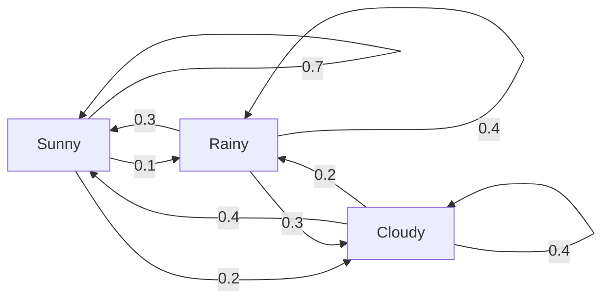
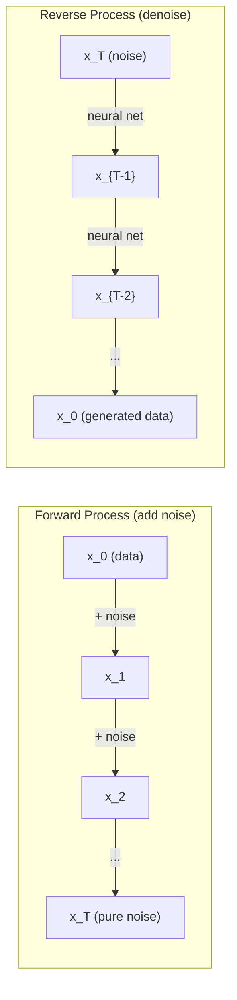

# Processos estocásticos.

> A matemática por trás de caminhadas aleatórias, cadeias de Markov e modelos de difusão.
> Há uma estrutura de randomization.

**Type:** Learn | **类型:** 学习
**Language:**O Python .**语言:**Python
**Prerequisites:** Phase 1, Lessons 06-07 (probability, Bayes) | **前置知识:** Phase 1, 第 06-07 课（概率、贝叶斯）
**Time:** ~75 minutes | **时间:** ~75 分钟

## Objetivos de aprendizagem

- Simulação de caminhadas aleatórias 1D e 2D e verificação da escala de deslocamento
  模拟一维和二维随机游走,验证位移的 √n 缩放规律
- Construir um simulador de cadeia Markov e calcular sua distribuição estacionária através de sua própria composição
  Construção de cadeia de modelo de Markov, através de características de descomposição calculada distribuição plana
- Implementar a dinâmica MCMC e Langevin Metropolis-Hastings para a amostragem das distribuições-alvo
  实现 Metropolis-Hastings MCMC 和 Langevin 动力学, de
- Conecte o processo de difusão para a frente ao movimento de Brownian e explique como o processo inverso gera dados
  Para relacionar o processo de expansão para frente com o movimento de browning, explicar como o processo de expansão para frente gera dados


> **【中文解读】**
> O processo de expansão é um processo de desenvolvimento de um movimento de browning, o processo de contradição é a geração de ruído.

## O problema é o problema da introdução

Muitos sistemas de IA envolvem aleatoriedade que evolui ao longo do tempo, não aleatoriedade estática -- aleatoriedade estruturada e seqüencial onde cada passo depende do que aconteceu antes.

> Muitos sistemas de IA envolvem a aleatoriedade de evolução ao longo do tempo. Não é aleatoriedade estática, mas sim aleatoriedade estruturada e sequencial.

Os modelos de linguagem geram tokens um a cada vez. Cada token depende do contexto anterior. O modelo produz uma distribuição de probabilidade, amostras a partir dele, e segue em frente. Isso é um processo estocástico.

> 语言模型逐个生成 token──每个 token 根据之前的上下文──模型输出一个概率分布,从中采样,然后继续──这是随机过程──

Os modelos de difusão adicionam ruído a uma imagem passo a passo até que ela se torne pura estática. Em seguida, eles invertam o processo, denonciando passo a passo até que uma nova imagem emerge. O processo para a frente é uma cadeia de Markov. O processo inverso é uma cadeia de Markov aprendida correndo para trás.

> O modelo de expansão gradualmente aumenta o ruído da imagem até se tornar puro estático. Depois, o processo de reversão, gradualmente, o ruído até que surja uma nova imagem.

Os agentes de aprendizagem de reforço tomam ações em um ambiente. Cada ação leva a um novo estado com alguma probabilidade. O agente segue uma política aleatória em um mundo aleatório.

> 强化学习智能体在环境中执行动作── cada movimento com uma certa probabilidade leva a um novo estado──智能体在随机世界中遵循随机策略──整个系统是马尔可夫的决策过程──MDP)──

A amostragem MCMC - a espinha dorsal da inferência Bayesiana - constrói uma cadeia de Markov cuja distribuição estática é a posterior da qual queremos amostragem.

> MCMC 采采贝叶斯推理的基石构建一个马尔可夫链,它的平稳分布就是你想从中采的后验分布.

Todas estas construem-se sobre quatro ideias fundamentais:
1. Caminhos aleatórios - o processo estocástico mais simples
2. Cadens de Markov -- aleatoriedade estruturada com uma matriz de transição
3. Dinâmica de Langevin - descida de gradiente com ruído
4. Metropolis-Hastings - amostragem de qualquer distribuição

> Todos estes são construídos em quatro conceitos básicos: 1. 随机游走最简单随机过程; 2. 马尔可夫链带转移矩阵的结构化随机性; 3. Langevin 动力学带噪声的梯度下降; 4.

## O conceito central.

### Caminhos aleatórios

Comece na posição 0. Em cada passo, lance uma moeda justa. cabeças: mover-se à direita (+1). caudas: mover-se à esquerda (-1).

> Desde a posição 0 开始── cada passo lançar uma moeda justa──正面:向右 (+1)──反面:向左 (-1)──

Após n passos, a sua posição é a soma de n valores aleatórios +/-1. A posição esperada é 0 (o andar é imparcial). Mas a distância esperada da origem aumenta como sqrt(n).

> N 步后, a sua posição é n 个随机 ±1 值的求和――期望位置为 0(游走无偏), mas a distância da expectativa do ponto de origem é de √n 增长――

Isto é contra-intuitivo. A caminhada é justa - não deriva em qualquer direção. Mas ao longo do tempo, vai andando mais e mais longe do lugar onde começou. O desvio padrão após n passos é sqrt(n).

> Este tem um ponto anti-direção. O movimento é justo. As duas direções não se deslocam, mas com o tempo, ele se desloca e vai a mais longe.

```
Step 0:  Position = 0
Step 1:  Position = +1 or -1
Step 2:  Position = +2, 0, or -2
...
Step 100: Expected distance from origin ~ 10 (sqrt(100))
Step 10000: Expected distance from origin ~ 100 (sqrt(10000))
```

**In 2D**A mesma escala de quadrado é aplicada à distância da origem. O caminho rastreia um padrão de tipo fractal.

> **二维情况下**, , , , , , , , , , , , , , , , , , , , , , , , , , , , , , , , , , , , , , , , , , , , , , , , , , , , , , , , , , , , , , , , , , , , , , , , , , , , , , , , , , , , , , , , , , , , , , , , , , , , , , , , , , , , , , , , , , , , , , , , , , , , , , , , , , , , , , , , , , , , , , , , , , , , , , , , , , , , , , , , , , , , , , , , , , , , , , , , , , , , , , , , , , , , , , , , , , , , , , , , , , , , , , , , , , , , , , , , , , , , , , , , , , , , , , , , , , , , , , , , , , , , , , , , , , , , , , , , , , , , , , , , , , , , , , , , , , , , , , , , , , , , , , , , , , , , , , , , , , , , , , , , , , , , , , , , , , , , , , , , , , , , , , , , , , , , , , , , , , , , , , , , , , , , , , , , , , , , , , , , , , , , , , , , , , , , , , , , , , , , , , , , , , , , , , , , , , , , , , , , , , , , , , , , , , , , , , , , , , , , , , , , , , , , , , , , , , , , , , , , , , , , , , , , , , , , , , , , , , , , , , , , , , , , , , , , , , , , , , , , , , , , , , , , , , , , , , , , , , , , , , , , , , , , , ,

**Why sqrt(n)?**Cada passo é +1 ou -1 com probabilidade igual. Depois de n passos, a posição S_n = X_1 + X_2 + ... + X_n onde cada X_i é +/-1. A variância de cada passo é 1, e os passos são independentes, então Var(S_n) = n. Desvio padrão = sqrt(n. Pelo teorema de limite central, S_n / sqrt(n) converge para uma distribuição normal padrão.

> **为什么是 √n？**Cada passo diferença é 1, passo e passo independente, então Var(S_n) = n, padrão diferença = √n。由中心极限定理,S_n/√n 收到标准正态分布。

Esta escala de n (squared) aparece em todos os lugares do ML. SGD escala de ruído como 1/squared.

> √n 缩放在 ML 中无处不在──SGD 噪音按1/√(batch_size) 缩放,嵌入维度按√d 缩放──平方根是独立随机叠加的标志──

**Connection to Brownian motion.**Faça um passeio aleatório com tamanho de passo 1/sqrt(n) e n passos por unidade de tempo. À medida que n vai para o infinito, o passeio converge para o movimento browniano B(t) - um processo contínuo de tempo onde B(t) é normalmente distribuído com média 0 e variância t.

> **与布朗运动的联系。**取步长 1/√n、每单位时间 n 步的随机游走──当 n → ∞ 时,游走收到布朗运动 B(t) 一个连续时间过程,B(t) ~ N(0, t) ・・・

O movimento browniano é a base matemática da difusão. Modela o balanço aleatório de partículas num fluido, as flutuações dos preços das ações e - crucialmente - o processo de ruído nos modelos de difusão.

> O movimento de Brown é a base matemática do modelo de expansão. Ele descreve o movimento de assonância das partículas no fluxo, as variações do preço das ações, bem como o processo de ruído no modelo de expansão.

**Gambler's ruin.**Um caminhador aleatório que começa na posição k, com barreiras de absorção em 0 e N. Qual a probabilidade de chegar a N antes de 0? Para um caminhador justo: P(reach N) = k/N. Isso é surpreendentemente simples e elegante. Ele se conecta à teoria dos martingales - o caminhador aleatório justo é um martingale (valor futuro esperado = valor atual).

> **赌徒破产问题。**A probabilidade de um movimento de 0 e de um movimento de 0 é igual a 0 e não igual a 0.

### Cadeias de Markov

Uma cadeia de Markov é um sistema que faz transições entre estados de acordo com probabilidades fixas.

> A cadeia de Markov é um sistema de transferência entre estados de probabilidade fixa.

```
P(X_{t+1} = j | X_t = i, X_{t-1} = ...) = P(X_{t+1} = j | X_t = i)
```

Isto é a propriedade Markov. Significa que você pode descrever toda a dinâmica com uma matriz de transição P:

> É o que significa que você pode usar a matriça de transferência P para descrever toda a dinâmica.

```
P[i][j] = probability of going from state i to state j
```

Cada linha de P soma a 1 (você deve ir para algum lugar).

> P's cada linha e para 1 (((tuve que ir a algum lugar)

**Example -- Weather:**

> **示例——天气：**

```
States: Sunny (0), Rainy (1), Cloudy (2)

P = [[0.7, 0.1, 0.2],    (if sunny: 70% sunny, 10% rainy, 20% cloudy)
     [0.3, 0.4, 0.3],    (if rainy: 30% sunny, 40% rainy, 30% cloudy)
     [0.4, 0.2, 0.4]]    (if cloudy: 40% sunny, 20% rainy, 40% cloudy)
```

Comece em qualquer estado. Após muitas transições, a distribuição de estados converge para a distribuição estacionária pi, onde pi * P = pi. Este é o vetor próprio esquerdo de P com valor próprio 1.

> A partir de um estado arbitrário, após uma mudança suficiente, a distribuição de estado recebe para uma distribuição plana π, satisfazendo π·P = π── é o valor de traço de P para 1 de traço esquerdo.

Para a cadeia meteorológica, a distribuição estacionária pode ser [0,53, 0,18, 0,29] - a longo prazo, é ensolarado 53% do tempo, independentemente do estado de partida.
Para a cadeia meteorológica, a distribuição estática é [0,55, 0,18, 0,27] - a longo prazo, é ensolarado 55% do tempo, independentemente do estado de partida.

> Para a cadeia meteorológica, a distribuição estável é possível [0,53, 0,18, 0,29] Longterm come see 53% of time晴天, não está relacionado com o estado de início.



**Computing the stationary distribution.**Há duas abordagens:

1. **Power method**Multiplicar qualquer distribuição inicial por P repetidamente.
2. **Eigenvalue method**: encontrar o vetor próprio esquerdo de P com o valor próprio 1.

> **计算平稳分布。**两种方法:1. **幂法**Reprodução: Reprodução: Reprodução: Reprodução: Reprodução: Reprodução: Reprodução: Reprodução: Reprodução: Reprodução: Reprodução: Reprodução: Reprodução: Reprodução: Reprodução: Reprodução: Reprodução: Reprodução: Reprodução: Reprodução: Reprodução: Reprodução: Reprodução: Reprodução: Reprodução: Reprodução: Reprodução: Reprodução: Reprodução: Reprodução: Reprodução: Reprodução: Reprodução: Reprodução: Reprodução: Reprodução: Reprodução: Reprodução: Reprodução: Reprodução: Reprodução: Reprodução: Reprodução: Reprodução: Reprodução: Reprodução: Reprodução: Reprodução: Reprodução: Reprodução: Reprodução: Reprodução: Reprodução: Reprodução: Reprodução: Reprodução: Reprodução: Reprodução: Reprodução: Reprodução: Reprodução: Reprodução: Reprodução: Reprodução: Reprodução: Reprodução: Reprodução: Reprodução: Reprodução: Reprodução: Reprodução: Reprodução: Reprodução: Reprodução: Reprodução: Reprodução: Reprodução: Reprodução: Reprodução: Reprodução: Reprodução: Reprodução: Reprodução: Reprodução: Reprodução: Reprodução: Reprodução: Reprodução: Reprodução: Reprodução: Reprodução: Reprodução: Reprodução: Reprodução: Reprodução: Reprodução: Reprodução: Reproducion**特征值法**: Obter P de um valor de traço esquerdo de 1 (ou seja, P^T de um valor de traço direito de 1)

Ambas as abordagens exigem que a cadeia satisfaça as condições de convergência.

> 两种方法都要求链满足收条件――

**Convergence conditions.**Uma cadeia de Markov converge para uma distribuição estacionária única se for:
- **Irreducible**Todos os estados são acessíveis a partir de todos os outros estados
- **Aperiodic**: a cadeia não funciona com um período fixo

> **收敛条件。**A cadeia de distribuição de marcos recebe uma distribuição única e estável:**不可约**(cada estado pode chegar a outro);**非周期**(Caden não será em ciclo de ciclo fixo)

A maioria das cadeias que encontram no ML satisfazem ambas as condições.

> A maioria das cadeias que encontram no ML satisfazem estas duas condições.

**Absorbing states.**Um estado é absorvente se, uma vez que você o entra, você nunca sai (P[i][i] = 1). Absorção de cadeias de Markov modela processos com estados terminais - um jogo que termina, um cliente que treme, uma sequência de token que atinge o token final do texto.

> **吸收状态。**Uma vez que entrou em estado de "nunca se deixa" (P[i][i]=1)── absorver o processo de "construção de um sistema de dados" (P[i][i]=1)                                                                                                                                                                                                                                       

**Mixing time.**Quantos passos até que a cadeia esteja "quase" à distribuição estacionária? Formalmente, o número de passos até que a distância total de variação da estacionariedade cai abaixo de algum limiar. Mistura rápida = poucos passos necessários. O espaço espectral de P (1 menos o segundo maior valor próprio) controla o tempo de mistura.

> **混合时间。**链"接近"平稳分布需要多少步骤? 链"接近"平稳分布需要多少步步? 链"接近"平稳分布需要多少步? 链"接近"平稳分布需要多少步? 形式上,是与平稳分布的总变差距降至值以下的步数──快混合 = 步数少──谱间隙(1 -第二大特征值) 控制混合时间:间隙越大,混合越快──

### Conexão com modelos de linguagem

A geração de tokens em um modelo de linguagem é aproximadamente um processo de Markov. Dada a situação atual, o modelo produz uma distribuição sobre o próximo token.

> 语言模型的代币 生成近似是一个马尔可夫的过程――给定当前上下文,模型输出下一个代币的概率分布――温度 控制分布的尖度:

```
P(token_i) = exp(logit_i / temperature) / sum(exp(logit_j / temperature))
```

- Temperatura = 1,0: distribuição padrão
- Temperatura < 1,0: mais nítida (mais determinista)
- Temperatura > 1,0: mais plana (mais aleatória)
- Temperatura -> 0: argmax (com ganância)

> Temperatura = 1.0 標準分布;<1.0 更尖(更确定性);>1.0 更平坦(更随机);→0 退化为 argmax(贪心解码)

A amostragem top-k truncates para os tokens de maior probabilidade k. A amostragem top-p (núcleo) truncates para o menor conjunto de tokens cuja probabilidade acumulada excede p. Ambos modificam as probabilidades de transição de Markov.

> Top-k 采样保留概率最高的 k 个代币;Top-p(核采样) manter acumulação概率超过 p 的最小代币集合──都修改了马可夫转移概率──

### Movimento brownista

O limite de tempo contínuo do passeio aleatório. A posição B ((t) tem três propriedades:
1. B(0) = 0
2. B(t) - B(s) é normalmente distribuído com média 0 e variância t - s (para t > s)
3. Os incrementos em intervalos não sobrepostos são independentes

> 布朗运动是随机游走的连续时间极限──B(t) 有三条性质:B(0) =0;B(t) -B(s) ~ N(0, t-s); não sobreposição de zonas entre zonas

O movimento browniano é contínuo, mas em nenhum lugar diferenciável, ele balança em todas as escalas.

> O movimento de Brown continua, mas é indispensável.

Na simulação discreta, aproximamos o movimento de Brownian por:

```
B(t + dt) = B(t) + sqrt(dt) * z,    where z ~ N(0, 1)
```

A escala sqrt(dt) é importante. Ela vem do teorema limite central aplicado a caminhadas aleatórias.

> 离散仿真中用 B(t+dt) = B(t) + √dt × z 近似布朗运动(z ~ N(0,1)) √dt 缩放很关键,源自随机游走的中心极限定理。

### Dinâmica de Langevin

A descida gradiente encontra o mínimo de uma função. A dinâmica de Langevin encontra a distribuição de probabilidade proporcional a exp ((-U ((x) / T), onde U é uma função de energia e T é temperatura.

> 梯度下降找函数最小值──Langevin 动力学找概率分布  exp(-U(x) /T), em que U é a função de energia, T é a temperatura──

```
x_{t+1} = x_t - dt * gradient(U(x_t)) + sqrt(2 * T * dt) * z_t
```

Duas forças agem sobre a partícula:
1. **Gradient force**(-dt * gradiente(U)): empurra em direcção a energia baixa (como descida de gradiente)
2. **Random force**(sqrt(2*T*dt) * z): empurra em direções aleatórias (exploração)

> 两种力作用在粒子上:1. **梯度力**推向低能量 (a energia é baixa) **随机力**推向随机方向 () 

A temperatura T = 0, é uma descida de gradiente pura. A temperatura alta, é quase um passeio aleatório. A temperatura certa, a partícula explora a paisagem energética e passa mais tempo em regiões de baixa energia.

> A temperatura T=0 时是纯梯度下降──高温时近似随机游走──合适的温度下, as partículas exploram a paisagem energética e permanecem na região de baixa energia por mais tempo──

**Connection to diffusion models.**O processo avançado de um modelo de difusão é:

```
x_t = sqrt(alpha_t) * x_{t-1} + sqrt(1 - alpha_t) * noise
```

Esta é uma cadeia de Markov que gradualmente mistura os dados com ruído.

> 扩散模型的前向过程:x_t = √α_t × x_{t-1} + √(1-α_t) × ruído。 é um processo gradual de mistura de ruído de chains de carros, suficientemente muitos passos depois x_T 变为纯高斯噪音。

O processo inverso - passando do ruído de volta aos dados - é também uma cadeia de Markov, mas as probabilidades de transição são aprendidas por uma rede neural. A rede aprende a prever o ruído que foi adicionado em cada passo, e depois subtrai-o.

> O processo reverso do ruído para os dados é também uma cadeia de dados, mas a probabilidade de transferência é determinada pelo aprendizado de redes neurais.



### MCMC: Markov Chain Monte Carlo

Às vezes, você precisa tomar uma amostra de uma distribuição p ((x) que você pode avaliar (até uma constante) mas não pode tomar uma amostra diretamente. posteriores Bayesianos são o exemplo clássico - você sabe a probabilidade vezes o anterior, mas a constante de normalização é intratavel.

> Às vezes você precisa de um que pode ser calculado (mas falta para uma constante de integração) mas não pode ser directamente adotado distribuição p (x) em uma mesma forma.

**Metropolis-Hastings**Construi uma cadeia de Markov cuja distribuição estática é p ((x):

1. Comece em alguma posição x
2. Proporcionar uma nova posição x' de uma distribuição de proposta Q(x'
3. Relação de aceitação de cálculo: a(x') * Q(x (x) = (x) = (x) = (x) = (x) = (x) = (x) = (x) = (x) = (x) = (x) = (x) = (x) = (x) = (x) = (x) = (x) = (x) = (x) = (x) = (x) = (x) = (x) = (x) = (x) = (x) = (x) = (x) = (x) = (x) = (x) = (x) = (x) = (x) = (x) = (x) = (x) = (x) = (x) = (x) = (x) = (x) = (x) = (x) = (x) = (x) = (x) = (x) = (x) = (x) = (x) = (x) = (x) = (x) = (x) = (x) = (x) = (x) = (x) = (x) = (x) = = (x) = = = (x) = = = = (x) = = = = = = = = = = = = = = = = = = = = = = = = = = = = = = = = = = = = = = = = = = = = = = = = = = = = = = = = = = = = = = = = = = = = = = = = = = = = = = = = = = = = = = = = = = = = = = = = = = = = = = = = = = = = = = = = = = = = = = = = = = = = = = = = = = = = = = = = = = = = = = = = = = = = = = = = = = = = = = = = = = = = = = = = = = = = = = = = = = = = = = = = = = = = = = = = = = = = = = = = = = = = = = = = = = = = = = = = = = = = = = = = = = = = = = = =
4. Aceite x' com probabilidade min ((1, a).
5. Repito. - Não.

> **Metropolis-Hastings**构建一个平稳分布为 p(x) 的马尔可夫链:1) 从某点 x 出发;2) 从提议分布 Q(x'还x) 提出新位置 x';3) 计算接受率 a = p(x') Q(x'x') /(p(x) Q(x'x'x));4) 以概率 min(1,a) 接受,否则停留;5) 重复.

Se Q é simétrico, por exemplo, Q(x' ( ( ( ( () ), = Q(x (x) = N, sigma^2)), a relação se simplifica para a = p(x') / p(x. Você só precisa da relação de probabilidades - as constantes normalizantes cancelam.

> Se Q para a definição (como o G), a taxa de aceitação simplificada para a = p (x) / p (x) ⋅, a probabilidade de redução de uma constante é automática, esta é a razão pela qual o MCMC para a experiência posterior é tão útil.

A cadeia é garantida a convergência para p ((x) em condições suaves. Mas a convergência pode ser lenta se a proposta for pequena demais (marcha aleatória) ou grande demais (alta rejeição).

> Em condições de temperatura e baixo teor de segurança, a receita pode ser muito lenta, mas a receita pode ser muito lenta.

**Why it works.**O índice de aceitação garante o equilíbrio detalhado: a probabilidade de estar em x e se mover para x' é igual à probabilidade de estar em x' e se mover para x. O equilíbrio detalhado implica que p(x) é a distribuição estacionária da cadeia.

> **为什么有效**A taxa de aceitação garante a probabilidade de um equilíbrio preciso de x a x' igual à probabilidade de um equilíbrio preciso de x a x'.

**Practical considerations:**
- **Burn-in**A cadeia precisa de tempo para chegar à distribuição estacionária a partir do seu ponto de partida.
- **Thinning**A redução da autocorrelação.
- **Multiple chains**Se convergem para a mesma distribuição, há evidências de convergência.
- **Acceptance rate**Para as propostas gaussianas em dimensões d, a taxa de aceitação ideal é de cerca de 23% (Roberts & Rosenthal, 2001).

> - Não, não.**Burn-in**丢弃前 N 个样本(链需要时间到达平稳分布);**Thinning**Cada um dos tipos de comportamento é um pouco mais baixo;**Multiple chains**Se o recebimento for distribuído, há provas de recebimento;**Acceptance rate**O melhor índice de aceitação do VK é de cerca de 23% (tão alto = quase não movido, muito baixo = total rejeição)

### Processos estocásticos em IA

| Process | AI Application |
|---------|---------------|
| Random walk | Exploration in RL, Node2Vec embeddings |
| Markov chain | Text generation, MCMC sampling |
| Brownian motion | Diffusion models (forward process) |
| Langevin dynamics | Score-based generative models, SGLD |
| Markov decision process | Reinforcement learning |
| Metropolis-Hastings | Bayesian inference, posterior sampling |

> 随机过程在 AI 中的应用:随机游走:RL 探索、Node2Vec 嵌入) 、马尔可夫链 (文本生成、MCMC) 、布朗运动 (布朗运动) 、扩散模型前向) 、Langevin 动力学 (Score-based 模型、SGLD) 、马尔可夫决策过程 (强化学习) 、Metropolis-Hastings (Metropoles-Hastings) 、贝叶斯推理、后验采样) 、

## Construí-lo e realizei-o.
```figure
random-walk-diffusion
```

## Construí-lo

### Passo 1: Simulador de caminhada aleatória

> 第1步:随机游走模拟器──1D Usado em 4 direções

```python
import numpy as np

def random_walk_1d(n_steps, seed=None):
    rng = np.random.RandomState(seed)
    steps = rng.choice([-1, 1], size=n_steps)
    positions = np.concatenate([[0], np.cumsum(steps)])
    return positions


def random_walk_2d(n_steps, seed=None):
    rng = np.random.RandomState(seed)
    directions = rng.choice(4, size=n_steps)
    dx = np.zeros(n_steps)
    dy = np.zeros(n_steps)
    dx[directions == 0] = 1   # right
    dx[directions == 1] = -1  # left
    dy[directions == 2] = 1   # up
    dy[directions == 3] = -1  # down
    x = np.concatenate([[0], np.cumsum(dx)])
    y = np.concatenate([[0], np.cumsum(dy)])
    return x, y
```

A caminhada 1D armazena somas cumulativas. Cada passo é +1 ou -1. Depois de n passos, a posição é a soma. A variância cresce linearmente com n, então o desvio padrão cresce como sqrt(n).

> Uma dimensão de movimento de armazenamento + e − − − − − − − − − − − − − − − − − − − − − − − − − − − − − − − − − − − − − − − − − − − − − − − − − − − − − − − − − − − − − − − − − − − − − − − − − − − − − − − − − − − − − − − − − − − − − − − − − − − − − − − − − − − − − − − − − − − − − − − − − − − − − − − − − − − − − − − − − − − − − − − − − − − − − − − − − − − − − − − − − − − − − − − − − − − − − − − − − − − − − − − − − − − − − − − − − − − − − − − − − − − − − − − − − − − − − − − − − − − − − − − − − − − − − − − − − − − − − − − − − − − − − − − − − − − − − − − − − − − − − − − − − − − − − − − − − − − − − − − − − − − − − − − − − − − − − − − − − − − − − − − − − − − − − − − − − − − − − − − − − − − − − − − − − − − − − − − − − − − − − − − − − − − − − − − − − − − − − − − − − − − − − − − − − − − − − − − − − − − − − − − − − − − − − − − − − − − − − − − − − − − − − − − − − − − − − − − − − − − − − − − − − − − − − − − − − − − − − − − − − − − − − − − − − − − − − − − − − − − − − − − − − − − − − − − − − − − − − − − − − − − − − − − − − − − − − − − − − − −

### Passo 2: Cadeia de Markov

> 第2步:马尔可夫链――step() 按转移概率选下一状态;simulate() 跑多步生成轨迹;stationary_distribution() 用特征分解求平稳分布──

```python
class MarkovChain:
    def __init__(self, transition_matrix, state_names=None):
        self.P = np.array(transition_matrix, dtype=float)
        self.n_states = len(self.P)
        self.state_names = state_names or [str(i) for i in range(self.n_states)]

    def step(self, current_state, rng=None):
        if rng is None:
            rng = np.random.RandomState()
        probs = self.P[current_state]
        return rng.choice(self.n_states, p=probs)

    def simulate(self, start_state, n_steps, seed=None):
        rng = np.random.RandomState(seed)
        states = [start_state]
        current = start_state
        for _ in range(n_steps):
            current = self.step(current, rng)
            states.append(current)
        return states

    def stationary_distribution(self):
        eigenvalues, eigenvectors = np.linalg.eig(self.P.T)
        idx = np.argmin(np.abs(eigenvalues - 1.0))
        stationary = np.real(eigenvectors[:, idx])
        stationary = stationary / stationary.sum()
        return np.abs(stationary)
```

A distribuição estacionária é o próprio vetor esquerdo de P com o valor próprio 1. Encontramo-lo computação de próprios vetores de P^T (transposando virou os próprios vetores esquerdo em vetores próprios direito).

> A distribuição estática é o valor de traço esquerdo de P em 1 de traço esquerdo.

### Passo 3: Dinâmica de Langevin

> 第3步:Langevin 动力学──梯度下降 + 高斯噪声 = explorar energia paisagem并采样──

```python
def langevin_dynamics(grad_U, x0, dt, temperature, n_steps, seed=None):
    rng = np.random.RandomState(seed)
    x = np.array(x0, dtype=float)
    trajectory = [x.copy()]
    for _ in range(n_steps):
        noise = rng.randn(*x.shape)
        x = x - dt * grad_U(x) + np.sqrt(2 * temperature * dt) * noise
        trajectory.append(x.copy())
    return np.array(trajectory)
```

O gradiente empurra x em direção a energia baixa. O ruído impede que ele fique preso. No equilíbrio, a distribuição das amostras é proporcional à exp ((-U ((x) / temperatura).

> 梯度把 x 推向低能量区, ruído evitar empenhar-se em local △平衡时样本分布  exp(-U(x) / temperatura) △

### Passo 4: Metrópole-Hastings

> 第4步:Metropolis-Hastings MCMC── 从目标分布(无需归归化常数)采用样式经典算法──

```python
def metropolis_hastings(target_log_prob, proposal_std, x0, n_samples, seed=None):
    rng = np.random.RandomState(seed)
    x = np.array(x0, dtype=float)
    samples = [x.copy()]
    accepted = 0
    for _ in range(n_samples - 1):
        x_proposed = x + rng.randn(*x.shape) * proposal_std
        log_ratio = target_log_prob(x_proposed) - target_log_prob(x)
        if np.log(rng.rand()) < log_ratio:
            x = x_proposed
            accepted += 1
        samples.append(x.copy())
    acceptance_rate = accepted / (n_samples - 1)
    return np.array(samples), acceptance_rate
```

O algoritmo propõe um novo ponto, verifica se ele tem maior probabilidade (ou aceita com probabilidade proporcional à proporção), e repete.

> 算法流程:提议新点 → 检查概率是否更高 (或按比例接受)→ 重复.

## Use-o com o framework implementado.

Na prática, usamos bibliotecas estabelecidas para esses algoritmos, mas entender a mecânica é importante para o depósito e sintonização.

> Na prática, você usa uma biblioteca madura para implementar esses algoritmos.

```python
import numpy as np

rng = np.random.RandomState(42)
walk = np.cumsum(rng.choice([-1, 1], size=10000))
print(f"Final position: {walk[-1]}")
print(f"Expected distance: {np.sqrt(10000):.1f}")
print(f"Actual distance: {abs(walk[-1])}")
```

> NumPy 实现随机游走:一行代码生成 10000 步 ±1 随机游走,验证实际距离与理论值 √10000 = 100 接近──

### Numpy para matrizes de transição

```python
import numpy as np

P = np.array([[0.7, 0.1, 0.2],
              [0.3, 0.4, 0.3],
              [0.4, 0.2, 0.4]])

distribution = np.array([1.0, 0.0, 0.0])
for _ in range(100):
    distribution = distribution @ P

print(f"Stationary distribution: {np.round(distribution, 4)}")
```

> NumPy 处理转移矩阵: de [1,0,0] 出发,反复左乘 P 100 次, automático recepção 到平稳分布──这是PageRank等算法的核心──

Multiplicar a distribuição inicial por P repetidamente. Após enough iterações, converge para a distribuição estacionária independentemente de onde você começou. Este é o método de potência para encontrar o próprio vetor esquerdo dominante.

> O que é que se quer é a principal forma de traçar a onda de traços.

### Conexões a estruturas reais

- **PyTorch diffusion:**O `DDPMScheduler`Em cara abraçada .`diffusers`Implementa as cadeias Markov para a frente e para trás
- **NumPyro / PyMC:**Usar MCMC (NUTS sampleler, que melhora em Metropolis-Hastings) para inferência bayesiana
- **Gymnasium (RL):**A função de etapa do ambiente define um processo de decisão de Markov

> Com relação ao quadro real:`diffusers`O DDPMS agendador  realizou a linha de frente/a frente do modelo de expansão de Markov; NumPyro/PyMC usando NUTS 采样器 (versão melhorada de Metropolis-Hastings) fazer sugestões de base; Função de passo do ginásio define o processo de decisão de Markov;;

### Verificação da convergência da cadeia de Markov

```python
import numpy as np

P = np.array([[0.9, 0.1], [0.3, 0.7]])

eigenvalues = np.linalg.eigvals(P)
spectral_gap = 1 - sorted(np.abs(eigenvalues))[-2]
print(f"Eigenvalues: {eigenvalues}")
print(f"Spectral gap: {spectral_gap:.4f}")
print(f"Approximate mixing time: {1/spectral_gap:.1f} steps")
```

A lacuna espectral diz-nos quão rapidamente a cadeia esquece o seu estado inicial. Uma lacuna de 0,2 significa cerca de 5 passos para misturar. Uma lacuna de 0,01 significa cerca de 100 passos. Verifique sempre isso antes de executar simulações longas - um cálculo de resíduos de cadeia de mistura lenta.

> 谱隙告诉你链多快忘初始状态――0.2 间隙大约需要5步混合;0.01 大约需要100步――运行长仿真前总要检查这个慢混合的链浪费算力――

## Envia-o . Produto .

Esta lição produz:
- `outputs/prompt-stochastic-process-advisor.md`-- um prompt que ajuda a identificar qual estrutura de processo estocástico se aplica a um determinado problema

> O curso de formação em ciências da informação e da informação é formado por um conjunto de cursos de ciências da informação e da informação.

## Conexões Conceptos

| Concept | Where it shows up |
|---------|------------------|
| Random walk | Node2Vec graph embeddings, exploration in RL |
| Markov chain | Token generation in LLMs, MCMC sampling |
| Brownian motion | Forward diffusion process in DDPM, SDE-based models |
| Langevin dynamics | Score-based generative models, stochastic gradient Langevin dynamics (SGLD) |
| Stationary distribution | MCMC convergence target, PageRank |
| Metropolis-Hastings | Bayesian posterior sampling, simulated annealing |
| Temperature | LLM sampling, Boltzmann exploration in RL, simulated annealing |
| Mixing time | Convergence speed of MCMC, spectral gap analysis |
| Absorbing state | End-of-sequence token, terminal states in RL |
| Detailed balance | Correctness guarantee for MCMC samplers |

> 概念关联:随机游走(Node2Vec、RL 探索)、马尔可夫链(LLM token 生成、MCMC)、布朗运动)、DDPM 前向过程)、Langevin 动力学(Score-based 模型、SGLD)、平稳分布(MCMC 收目标、PageRank)、Metropolis-Hastings(贝叶斯后验、模拟退火)、Temperatura(LLM 采样、Boltzmann 探索)、Mixing time(MCMC 收速度)、Absorbing state(序列结束、RL 终止状态)、Detailed balance证(MCMC 采样器的正确性保证)、

Os modelos de difusão merecem atenção especial. DDPM (Ho et al., 2020) define uma cadeia Markov avançada:

```
q(x_t | x_{t-1}) = N(x_t; sqrt(1-beta_t) * x_{t-1}, beta_t * I)
```

O processo inverso é parametrizado por uma rede neural que prevê o ruído:

```
p_theta(x_{t-1} | x_t) = N(x_{t-1}; mu_theta(x_t, t), sigma_t^2 * I)
```

Cada passo da geração é um passo numa cadeia de Markov aprendida.

A SGLD (Stochastic Gradient Langevin Dynamics) combina a descida de gradiente de mini-batch com o ruído de Langevin. Em vez de calcular o gradiente completo, usa uma estimativa estocástica e adiciona ruído calibrado. À medida que a taxa de aprendizagem declina, a SGLD passa da otimização para a amostragem -- obtemos amostras posteriores Bayesianas aproximadamente de graça. Esta é uma das formas mais simples de obter estimativas de incerteza de uma rede neural.

A principal ideia sobre todas estas conexões: os processos estocásticos não são apenas ferramentas teóricas. São os mecanismos computacionais dentro dos sistemas modernos de IA. Quando ajustes a temperatura de um LLM, estás a ajustar uma cadeia de Markov. Quando você treina um modelo de difusão, você está aprendendo a reverter um processo de movimento browniano. Quando executamos a inferência Bayesiana, estamos construindo uma cadeia que converge para o posterior.

>  através de todos estes vínculos                                                                                                                                                                                                                                                           

## Exercícios.

1. **Simulate 1000 random walks of 10000 steps.**Descreva a distribuição das posições finais. Verifique que é aproximadamente gaussiano com média 0 e desvio padrão sqrt ((10000) = 100.

2. **Build a text generator using a Markov chain.**Treinar em um pequeno corpus: para cada palavra, contar transições para a próxima palavra. Construir a matriz de transição. Gerar novas frases através da amostragem da cadeia.

3. **Implement simulated annealing**Em primeiro lugar, a utilização de Metropolis-Hastings. Comece a uma temperatura elevada (aceite quase tudo) e descolhe gradualmente (aceite apenas melhorias).

4. **Compare Langevin dynamics at different temperatures.**Amostra de um potencial de poço duplo U(x) = (x^2 - 1)^2. Em baixa temperatura, as amostras se agrupam em um poço. Em alta temperatura, elas se espalham por ambos.

5. **Implement the forward diffusion process.**Comece com um sinal 1D (por exemplo, uma onda sinusal). Adicione ruído progressivamente em mais de 100 passos com um cronograma de ruído linear. Mostre como o sinal se degrada para ruído puro. Em seguida, implemente um denoizador simples que inverte o processo (mesmo um ingênuo que apenas subtrai o ruído estimado).

## Termos-chave .

| Term | What people say | What it actually means |
|------|----------------|----------------------|
| Random walk | "Coin-flip movement" | A process where position changes by random increments at each step |
| Markov property | "Memoryless" | The future depends only on the present state, not on the history |
| Transition matrix | "The probability table" | P[i][j] = probability of moving from state i to state j |
| Stationary distribution | "The long-run average" | The distribution pi where pi*P = pi -- the chain's equilibrium |
| Brownian motion | "Random jiggling" | The continuous-time limit of a random walk, B(t) ~ N(0, t) |
| Langevin dynamics | "Gradient descent with noise" | Update rule that combines deterministic gradient and random perturbation |
| MCMC | "Walking toward the target" | Constructing a Markov chain whose stationary distribution is the one you want |
| Metropolis-Hastings | "Propose and accept/reject" | MCMC algorithm that uses acceptance ratios to ensure convergence |
| Temperature | "The randomness knob" | Parameter controlling the tradeoff between exploration and exploitation |
| Diffusion process | "Noise in, noise out" | Forward: gradually add noise. Reverse: gradually remove it. Generates data. |

> 术语速查:Random walk (随机游走) ‧Markov propriedade ((无记忆性) ‧Transition matrix (转移矩阵) ‧P[i][j]) ‧Estacionário distribuição (Brownian motion) ‧布朗运动 (布朗运动) ‧B (t) ~N (t) ‧0,t)) ‧Langevin dinâmica (带噪声的梯度下降) ‧MCMC (MCMC) ‧Construção (平稳分布) ‧Már可夫链 (马尔可夫链) ‧Metrópole-Hastings (Metropoles) ‧Temperatura (提议-接受/拒绝) ‧MCM 算法) ‧Explorar/利用平衡参数 (MC) ‧Diffusion process ((前加噪数、反向去噪声生成数据) ‧

## Mais leitura 延伸阅读

- **Ho, Jain, Abbeel (2020)**O artigo do DDPM que lançou a revolução do modelo de difusão.
- **Song & Ermon (2019)**-- "Modelagem gerativa estimando gradientes da distribuição de dados".
- **Roberts & Rosenthal (2004)**"Cadenas Markovs do espaço e algoritmos MCMC". A teoria por trás de quando e porquê o MCMC funciona.
- **Norris (1997)**"Cadenas de Markov". O livro padrão, abrange convergência, distribuições estacionárias e tempos de batimento.
- **Welling & Teh (2011)**"Aprendizagem Bayesiana através da Dinâmica de Langevin Gradiente Estocástico". Combina SGD com Dinâmica de Langevin para inferência Bayesiana escalável.
