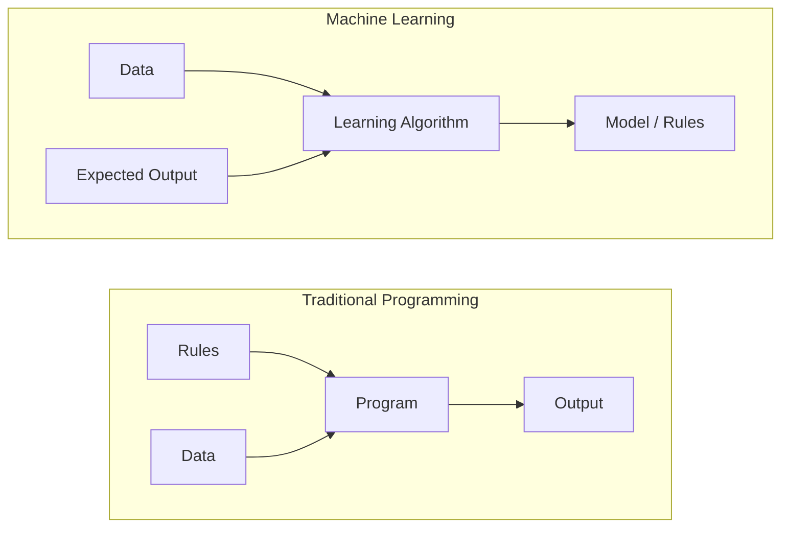
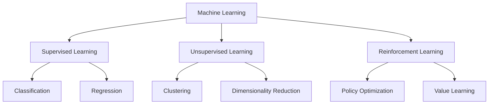
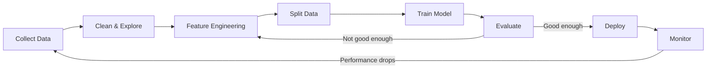
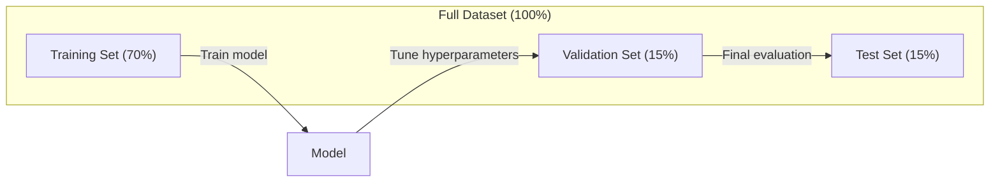
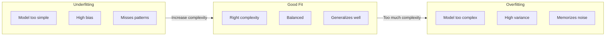
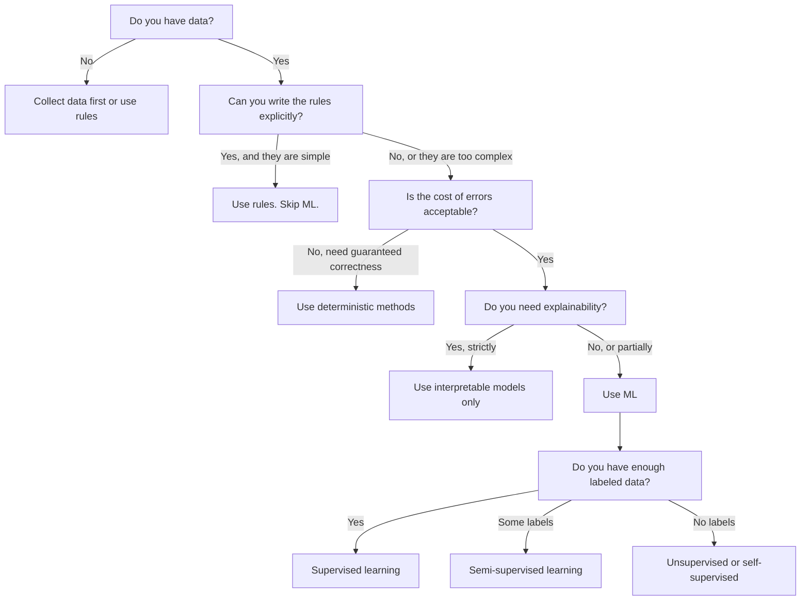

# O que é aprendizado automático
# O que é aprendizado de máquina


> A aprendizagem automática está a ensinar os computadores a encontrar padrões em dados em vez de escrever regras à mão.

> A aprendizagem de máquina é ensinar o computador a encontrar regras de dados, em vez de por regras de redação artificial.

**Type:** Learn | **类型：** 学习
**Languages:** Python
**Prerequisites:** Phase 1 (Math Foundations) | **前置知识：** Phase 1（数学基础）
**Time:** ~45 minutes | **时间：** 约 45 分钟

## Objetivos de aprendizagem

- Explique a diferença entre aprendizagem supervisionada, não supervisionada e reforço e identifique qual tipo se aplica a um determinado problema
  解释监督学习、无监督学习和强化学习之间的区别,并判断给给定问题适用于哪种类型的问题
- Implementar um classificador centróide mais próximo a partir do zero e avaliá-lo em relação a uma linha de base aleatória
  A partir do zero, a avaliação comparativa da classificação de qualidade e da base de dados
- Distinguir entre as tarefas de classificação e regressão e selecionar a função de perda adequada para cada
  区分分类和归归任务, para cada tarefa escolher a função de perda adequada
- Avaliação de se um determinado problema empresarial é adequado para a ML ou melhor resolvido com regras deterministas
   avaliar se um problema de negócio é adequado para a solução de problemas de gestão ou melhor para a definição de regras


> **【中文解读】**
> 机器学习是让计算机从数据中自动学习规则,而不是靠人工编写规则――监督学习 (监督学习) 无监督学习 (监督学习) 无监督学习 (监督学习) 强化学习 (强化学习) 奖励信号) 是三大范式――对应 sklearn 中各类估计者──

> **【拓展：机器学习范式的产业应用】**
> GPT-4 Utilize Self-Supervision Learning(pre测下一个代币) em cerca de 13 milhões de tokens 上训练;BERT Utilize掩码语言建模在 Wikipedia + BookCorpus 上预训;AlphaGo Utilize强化学习通过自我对对超越人类围棋冠军。

## O problema é o problema da introdução

Se você quiser criar um filtro de spam. A abordagem tradicional: sentar-se e escrever centenas de regras. "Se o e-mail contém 'DONOS GRATIS', marque-o como spam. Se tem mais de 3 marcas de exclamação, marque-o como spam". Você passa semanas escrevendo regras. Então os spammers mudam sua redação. Suas regras quebram. Você escreve mais regras. O ciclo nunca termina.

> Você quer construir um filtro de lixo. O método tradicional é sentar-se e escrever cem regras. "Se o e-mail contém 'DONOS GRATIS', marque-o como lixo. Se for mais de três, marque-o como lixo. " Você passou algumas semanas a escrever regras.

O aprendizado de máquina inverte isso. Em vez de escrever regras, você dá ao computador milhares de e-mails rotulados ("spam" ou "não spam") e deixa que ele descubra as regras por conta própria. O computador encontra padrões que você nunca teria pensado. Quando os spammers mudam de tática, você se retraina em novos dados em vez de reescrever código.

> O aprendizado de máquina revolucionou esse modo. Você não escreve regras, mas dá ao computador milhares de correio marcado. Deixe-o encontrar regras. O computador pode descobrir um modelo que você nunca imaginou. Quando o emissor de correio de lixo muda sua estratégia, você só precisa se re-treinar em novos dados, em vez de reescrever o código.

Esta mudança das "regras de programação" para "aprender a partir de dados" é o núcleo do aprendizado de máquina.

> A transição das "regras de programação" para "de dados para aprendizagem" é o núcleo do aprendizado de máquina.

> **【中文解读】**
> O programação tradicional é "pessoas escrever regras, máquina executar"; o aprendizado de máquina é "pessoas dar dados, máquinas descobrir regras" e, por exemplo, o filtro de lixo: o método tradicional precisa de manualmente manter centenas de regras, enquanto o método de ML precisa apenas fornecer uma grande quantidade de marcas de correio, o modelo automaticamente aprende a determinar o modo de usar. Quando a estratégia de lixo muda, é necessário apenas re-treinar e não reescrever o código.

> **【拓展：垃圾邮件过滤的演进】**
> O Gmail de lixo filtrador processou cerca de 3 bilhões de emails por dia, taxa de precisão superior a 99,9%.

## O conceito central.

### Aprender com dados, não com regras

A programação tradicional e a aprendizagem automática resolvem problemas em direções opostas.

> A tradição de programação e aprendizagem de máquina são os mesmos que a de resolver problemas.



Programação tradicional: você escreve as regras. O programa as aplica aos dados para produzir saída.

> 傳統編程:你编寫規則──程序将规则应用于数据以产生输出──

Aprendizagem automática: fornece dados e resultados esperados. O algoritmo descobre as regras.

> 机器学习:你提供数据和期望输出―― algoritmo automático de descoberta regras―

O "modelo" que resulta do treinamento é as regras, codificadas como números (pesos, parâmetros).

> O "modelo" produzido pelo treinamento é a regra em si, codificado em forma numérica, em peso e parametros. Pode ser generalizado a partir de amostras já vistas, para fazer previsões sobre novos dados nunca vistos.

> **【中文解读】**
> 传统编程与机器学习的本质区别:传统编程输入"规则+数据"得到"输出";机器学习输入"数据+期望输出"得到"模型 (规则) ⋅模型本质上就是使用数字编码的规则 (权重和参数) 的规则 (重权和参数),它能对从未见过的新数据做预测――这是"泛化"AI 系统最核心能力――

### Os três tipos de aprendizado de máquina



**Supervised Learning**O modelo aprende a mapear entradas para saídas.
- "Aqui estão 10 mil fotos com rótulos de gato ou cão.
- "Aqui estão as características e os preços da casa.

> **监督学习**Você tem entrada-saída para...
> - "Há 10.000 张 marcado fotos de gatos ou cães.
> - "Here are housing features and price. Preço de pré-conceito da escola. "

**Unsupervised Learning**O modelo encontra estrutura por si só.
- "Aqui estão 10 mil histórias de compras dos clientes.
- "Aqui estão 1.000 pontos de dados dimensionados, reduzindo-os a 2 dimensões, mantendo a estrutura".

> **无监督学习**Você só tem entrada, não há etiqueta.
> - "Há 10.000 clientes que compraram o seu registro.
> - "Há há 1.000 pontos de dados de dimensão.

**Reinforcement Learning**O agente adota uma estratégia (política) para maximizar a recompensa total.
- "Jogue este jogo. +1 para ganhar, -1 para perder.
- "Controlem este braço robótico. +1 para pegar o objeto, -0,01 por cada segundo desperdiçado".

> **强化学习**O sistema inteligente é um sistema de gestão de dados que permite a criação de um sistema de gestão de dados.
> - "Jogar este jogo... vencer +1, perder -1... encontrar uma estratégia"...
> - "controlar este braço mecânico... "fez-se com êxito em capturar o objeto +1, por desperdício de um segundo -0,01".""

A maioria do que você vai construir na prática usa aprendizagem supervisionada. A aprendizagem não supervisionada é comum para pré-processamento e exploração.

> Na prática, a maior parte dos sistemas que você constrói usa o controle de aprendizagem.

> **【拓展：三种范式在真实系统中的分工】**
> Netflix 推系统同时使用三种范式:协同过(无监督聚类用户群) 监督学习(预测用户对电影的评分 1-5 星) 强化学习(A/B 测试选择最优推策略) ;;Tesla Autopilot 使用监督学习(目标检测) + 强化学习(路径规划) ;;Stable Diffusion 训练涉及自监督(图像文本对学习 CLIP) + 监督微调;;

### Além dos Três Grandes

As três categorias acima são limpas, mas a ML do mundo real muitas vezes borra as linhas.

> Os três tipos acima são muito claros, mas o mundo real de ML 往往模糊了这些界限.

**Semi-supervised learning**O que é um sistema de medicação que usa um pequeno conjunto de dados etiquetados e um grande conjunto de dados não etiquetados.

> **半监督学习**Usar uma pequena quantidade de dados de marcação e uma grande quantidade de dados não marcados. Você pode ter 100 imagens médicas marcas e 100.000 imagens não marcas.

- **Label propagation:**Construir um gráfico que conecte pontos de dados semelhantes.
  **标签传播：**Construir uma ligação semelhante a um ponto de dados.
- **Pseudo-labeling:**Treinar um modelo com os dados rotulados, usá-lo para prever os rótulos para dados não rotulados, depois retrainar em tudo.
  **伪标签：**Em um modelo de treinamento em dados de marcas, use-o para prever os dados de marcas não marcados, e depois re-treinar em todos os dados. O modelo gerará seu próprio conjunto de treinamentos.
- **Consistency regularization:**O modelo deve dar a mesma previsão para uma entrada e uma versão ligeiramente perturbada dessa entrada.
  **一致性正则化：**O modelo deve dar a mesma previsão para as entradas e suas versões de perturbação leve.

**Self-supervised learning**O modelo cria a sua própria tarefa de previsão a partir da estrutura dos dados.

> **自监督学习**A partir do próprio dados criar um monitoramento de sinais. Não é necessário um etiquetado artificial.

- **Masked language modeling (BERT):**Esconde 15% das palavras numa frase, treine o modelo a prever as palavras que faltam.
  **掩码语言建模（BERT）：**15% das palavras em palavras de "cobertura" são de origem original.
- **Contrastive learning (SimCLR):**Tome uma imagem, crie duas versões aumentadas e treine o modelo a reconhecer que vieram da mesma imagem enquanto as distingue das versões aumentadas de outras imagens.
  **对比学习（SimCLR）：**取一张图像, create two enhanced versions── training model identifique-as a partir da mesma imagem, simultaneamente distinguindo-as das outras versões de reforço da imagem──
- **Next-token prediction (GPT):**Previnha a próxima palavra dada a todas as palavras anteriores.
  **下一 token 预测（GPT）：**给定前面所有词,预测下一个词―― cada texto em seu arquivo é um exemplo de treinamento――

> **【拓展：自监督学习如何驱动大模型革命】**
> Os dados de treinamento do GPT-4 são de cerca de 13 bilhões de tokens, se se basear em marcas artificiais, isso é completamente impossível.

Estas não são categorias separadas das três grandes. São estratégias que combinam ideias supervisionadas e não supervisionadas. A aprendizagem auto-supervisionada é tecnicamente supervisionada (o modelo prevê algo), mas os rótulos são gerados automaticamente, não por humanos.

> Não são novas categorias separadas das três grandes categorias. São estratégias combinadas com a supervisão e o pensamento sem supervisão.

### Classificação vs Regressão

Estas são as duas principais tarefas de aprendizagem supervisionada.

> É uma das duas principais tarefas de supervisão.

| Aspect | Classification | Regression |
|--------|---------------|------------|
| Output | Discrete categories | Continuous numbers |
| Example | "Is this email spam?" | "What will the house price be?" |
| Output space | {cat, dog, bird} | Any real number |
| Loss function | Cross-entropy, accuracy | Mean squared error, MAE |
| Decision | Boundaries between classes | A curve that fits the data |

| 方面 | 分类 | 回归 |
|------|------|------|
| 输出 | 离散类别 | 连续数值 |
| 示例 | "这封邮件是垃圾邮件吗？" | "房价会是多少？" |
| 输出空间 | {猫, 狗, 鸟} | 任意实数 |
| 损失函数 | 交叉熵、准确率 | 均方误差、MAE |
| 决策方式 | 类别之间的边界 | 拟合数据的曲线 |

A classificação responde a "qual categoria?" a regressão responde a "quanta?"

> 分类回答"哪个类别?" 回归回答"多少?"

Alguns problemas podem ser enquadrados de qualquer maneira. Predicionar se uma ação sobe ou cai é classificação.

> Algumas questões podem ser resolvidas de duas maneiras.

> **【中文解读】**
> O segmento e o regresso são duas tarefas básicas da supervisão do aprendizado. O segmento de previsão de divisão de classes é o segmento de dados de dados de dados de dados de dados de dados de dados de dados de dados de dados de dados de dados de dados de dados de dados de dados de dados de dados de dados de dados de dados de dados de dados de dados de dados de dados de dados de dados de dados de dados de dados de dados de dados de dados de dados de dados de dados de dados de dados de dados de dados de dados de dados de dados de dados de dados de dados de dados de dados de dados de dados de dados de dados de dados de dados de dados de dados de dados de dados de dados de dados de dados de dados de dados de dados de dados de dados de dados de dados de dados de dados de dados de dados de dados de dados de dados de dados de dados de dados de dados de dados de dados de dados de dados de dados de dados de dados de dados de dados de dados de dados de dados de dados de dados de dados de dados de dados de dados de dados de dados de dados de dados de dados de dados de dados de dados de dados de dados de dados de dados de dados de dados de dados de dados de dados de dados de dados de dados de dados de dados de dados de dados de dados de dados de dados de dados de dados de dados de dados de dados de dados de dados de dados de dados de dados de dados de dados de dados de dados de dados de dados de dados de dados de dados de dados de dados de dados de dados de dados de dados de dados de dados de dados de dados de dados de dados de dados de dados de dados de dados de dados de dados de dados de dados de dados de dados de dados de dados de dados de dados de dados de dados de dados de dados de dados de dados de dados de dados de dados de dados de dados de dados de dados de dados de dados de dados de dados de dados de dados de dados de dados de dados de dados de dados de dados de dados de dados de dados de dados de dados de dados de dados de dados de dados de dados de dados de dados de dados de dados de dados de dados de dados de dados de dados de dados de dados de dados de dados de dados de dados de dados de dados de dados de dados de dados de dados de dados de dados de dados de dados de dados de dados de dados de dados de dados de dados de dados de

### O fluxo de trabalho do ML

Todos os projetos de aprendizado de máquina seguem o mesmo pipeline, independentemente do algoritmo.

> Cada projeto de aprendizagem de máquina segue o mesmo processo, independentemente do algoritmo usado.



**Collect Data**A maior quantidade de dados é quase sempre melhor, mas a qualidade é mais importante do que a quantidade.

> **收集数据**Obter dados originais é quase sempre melhor, mas a qualidade é mais importante do que a quantidade.

**Clean & Explore**A análise de dados e de dados é feita através de um processo de análise de dados e de dados.

> **清洗与探索**O processo de tratamento de falhas de valor, eliminação de repetições, distribuição de visualização, descoberta de anomalias, geralmente representa entre 60 e 80% do tempo total do projeto.

**Feature Engineering**Transformar dados brutos em recursos que o modelo pode usar. Transformar datas em dias da semana. Normalizar colunas numéricas. Encodar variáveis categorias. Boas características importam mais do que algoritmos fanáticos.

> **特征工程**O código de dados é mais importante do que o algoritmo de um fenômeno.

**Split Data**A formação do modelo é baseada em dados de formação, os hiperparametros são ajustados em dados de validação e os resultados finais são relatados em dados de teste.

> **划分数据**O modelo é dividido em treinamento, você pode ajustar os superparâmetros nos dados de teste, você pode relatar o desempenho final nos dados de teste.

**Train Model**O algoritmo ajusta os parâmetros internos para minimizar uma função de perda.

> **训练模型**O algoritmo pode ser usado para reduzir os perdas de dados.

**Evaluate**Se o desempenho não for aceitável, volte e experimente diferentes características, algoritmos ou hiperparâmetros.

> **评估**Se o desempenho for inaceitável, tente diferentes características, algoritmos ou superparâmetros.

**Deploy**: Colocar o modelo em produção, onde ele faz previsões sobre novos dados.

> **部署**O modelo será colocado no ambiente de produção, para fazer previsão de novos dados.

**Monitor**A distribuição de dados muda (drift de dados) e os modelos degradam. Quando o desempenho cai, retrain.

> **监控**A partir de agora, o modelo será mais rápido e mais rápido.

### Treinamento, validação e testes divididos

Este é o conceito mais importante que os iniciantes cometem errado. Você deve avaliar o seu modelo com dados que nunca viu durante o treinamento.

> É o conceito mais importante de erro mais fácil para os iniciantes. Você deve avaliar o modelo com dados nunca vistos durante a formação.



| Split | Purpose | When used | Typical size |
|-------|---------|-----------|-------------|
| Training | Model learns from this data | During training | 60-80% |
| Validation | Tune hyperparameters, compare models | After each training run | 10-20% |
| Test | Final unbiased performance estimate | Once, at the very end | 10-20% |

| 划分 | 用途 | 使用时机 | 典型比例 |
|------|------|---------|---------|
| 训练集 | 模型从中学习 | 训练期间 | 60-80% |
| 验证集 | 调节超参数，比较模型 | 每次训练后 | 10-20% |
| 测试集 | 最终无偏性能估计 | 最后仅使用一次 | 10-20% |

O conjunto de testes é sagrado. Você olha para ele exatamente uma vez. Se você continuar ajustando seu modelo com base no desempenho do teste, você está treinando efetivamente no conjunto de testes e seus números relatados não têm significado.

> O teste é sagrado. Você só pode vê-lo uma vez. Se você continuar a treinar no teste, os números do seu relatório não têm sentido.

> **【中文解读】**
> O segmentação de dados é um dos erros mais fáceis de cometer no ML. O conjunto de treinamentos é usado para aprender parâmetros, o conjunto de testes é usado para ajustar parâmetros e modelos de seleção, o conjunto de testes é usado apenas para avaliação final. Se o conjunto de testes for ajustado repetidamente, é como se o modelo fosse "escrutado", o valor de desempenho do modelo é totalmente inadequado.

Para pequenos conjuntos de dados, use a validação cruzada k-fold: divida os dados em k partes, treine em partes k-1, valida na parte restante, gire e obtenha resultados médios.

> Para o pequeno conjunto de dados, usar o teste de divisão de dados em k                                                                                                                                                                                                                                                                                                                                                                                                                                                                                                             

### O super-ajustamento vs. o sub-ajustamento



**Underfitting**O modelo é muito simples para capturar os padrões nos dados. Uma linha reta tentando encaixar uma relação curva. O erro de treinamento é alto. O erro de teste é alto.

> **欠拟合**Modelo muito simples, não pode ser capturado em dados.

**Overfitting**O modelo é muito complexo e memorizará os dados do treinamento, incluindo o ruído. Uma curva de movimento que passa por todos os pontos de treinamento, mas falha em novos dados. O erro do treinamento é baixo. O erro do teste é alto.

> **过拟合**O modelo é muito complexo, lembre-se do ruído dos dados de treinamento. Uma linha de movimento atravessa cada ponto de treinamento, mas o desempenho nos novos dados é muito ruim.

**Good fit**O modelo capta padrões reais sem memorizar ruído.

> **良好拟合**O modelo captura o modelo real sem se lembrar do ruído.

> **【中文解读】**
> 欠拟合 = 模型太简单,连训练数据中的规律都没有学到;过拟合 = 模型太复杂,把训练数据中的噪音都记得,遇到新数据就就"露"―― um bom modelo apresenta um bom desempenho em todos os conjuntos de treinamento e de teste―― julgamento: se a taxa de precisão do treinamento é muito alta do que a taxa de precisão da verificação, é o sinal típico de sobre-ajustação――

Sinais de sobreajuste:
- A precisão do treinamento é muito maior do que a precisão da validação
                                                                                                                                                                                                                                                                
- O modelo tem um bom desempenho em dados de formação, mas mal em dados novos
  O modelo se apresenta bem nos dados de treinamento, mas não se apresenta bem nos novos dados
- A adição de mais dados de formação melhora o desempenho (o modelo era memorizar, não aprender)
  增加训练数据能提升性能 (aumento de treinamento de dados pode melhorar o desempenho do modelo)

> 过拟合的迹象:

Fixas para sobre-equipamento:
- Obtenha mais dados de treinamento
  Get more training dados
- Reduzir a complexidade do modelo (menos parâmetros, arquitetura mais simples)
  降低模型复杂度 ((menos parâmetros 更多简单的架构)
- Regularização (adjunto a penalidade para pesos grandes)
  (Ao contrário, não é o que eu quero dizer).
- Desistência (descentralização aleatória de neurônios durante o treino)
  Desistir de treino (trenagem)
- Paragem precoce (parar o treinamento quando o erro de validação começar a aumentar)
  (Quando o erro de teste começa a subir, o treinamento começa a parar)

> 过拟合的修复方法:

Reparadores para subconjuntos:
- Usar um modelo mais complexo
  Utilize modelos mais complexos
- Adicionar mais recursos
  添加更多特征
- Reduzir a regularização
                                                                                                                                                                                                                                                                                                                                                                                                                                                                                                                               
- Trem mais tempo
  訓練更长时间 訓練更长时间

> 欠拟合的修复方法:

### O desvio de variações

Este é o quadro matemático por trás do sobreajuste e do subajuste.

> É o quadro matemático por trás do exagero e do desagrado.

**Bias**O modelo linear tem um alto viés quando a relação verdadeira é não linear.

> **偏差**Quando a relação real é não-linear, o modelo linear tem uma alta diferença.

**Variance**O modelo com alta variação dá previsões muito diferentes quando treinado em diferentes subconjuntos de dados.

> **方差**Os modelos de alta diferença em diferentes conjuntos de dados fornecem previsões muito diferentes durante o treinamento.

| Model complexity | Bias | Variance | Result |
|-----------------|------|----------|--------|
| Too low (linear model for curved data) | High | Low | Underfitting |
| Just right | Medium | Medium | Good generalization |
| Too high (degree-20 polynomial for 10 points) | Low | High | Overfitting |

| 模型复杂度 | 偏差 | 方差 | 结果 |
|-----------|------|------|------|
| 太低（用线性模型拟合弯曲数据） | 高 | 低 | 欠拟合 |
| 恰好 | 中 | 中 | 良好泛化 |
| 太高（10 个点用 20 次多项式） | 低 | 高 | 过拟合 |

Erro total = Bias^2 + Variância + Ruído irredutível

> 总误差 = 偏差^2 + 方差 + 不可约噪音

Não se pode reduzir o ruído irredutível (é aleatoriedade nos próprios dados).

> Você não pode reduzir o ruído incontrolável. É o próprio dados.

### Não há teorema do almoço livre

Não há um único algoritmo que funcione melhor para cada problema. Um algoritmo que funciona bem em uma classe de problemas vai funcionar mal em outra. É por isso que os cientistas de dados tentam múltiplos algoritmos e comparam os resultados.

> Não há um único algoritmo que possa funcionar melhor em todos os problemas. Algoritmos que funcionam bem em uma classe de problemas funcionam muito mal em outra classe de problemas. É por isso que os cientistas de dados tentam vários algoritmos e comparam resultados.

> **【拓展：没有免费午餐定理的实践意义】**
> Este teorema nos diz: Kaggle  competição campeão quase nunca apenas com um algoritmo, mas com um método integrado ((XGBoost + LightGBM + 神经网络) 融合多个模型.

Na prática, a escolha depende de:
- Quantos dados você tem
  Tens muitos dados
- Quantas características há
  Há muitas características
- Se a relação é linear ou não linear
  Relação é linear ou não linear
- Se você precisa de interpretação
  É necessário explicar
- Quanto computação você pode pagar
  Você pode suportar quanto custo de cálculo

> Na prática, a escolha depende de:

### Quando não usar aprendizado de máquina

A ML é poderosa, mas nem sempre a ferramenta certa.

> ML é muito forte, mas nem sempre é um instrumento correto. Antes de usar o modelo, pergunte-se se realmente precisa dele.

**Do not use ML when:**

> **以下情况不要使用 ML：**

- **Rules are simple and well-defined.**Calculo fiscal, algoritmos de classificação, conversões de unidades. Se você pode escrever a lógica em algumas declarações de se, um modelo adiciona complexidade sem benefício.
  **规则简单且明确。**税费计算、排序算法、单位转换―― se você puder usar alguns se 语句写完逻辑, o modelo só aumentará a complexidade sem nenhum benefício―
- **You have no data or very little data.**O ML precisa de exemplos para aprender. Com 10 pontos de dados, não se pode treinar nada significativo.
  **没有数据或数据极少。**ML  necessita de aprender a partir de amostras. Apenas 10 pontos de dados, você não pode treinar qualquer coisa significativa.
- **The cost of being wrong is catastrophic and you need guaranteed correctness.**Calculo médico da dose, controle do reator nuclear, verificação criptográfica. modelos ML são probabilísticos. às vezes eles vão ser errados. Se "às vezes errado" é inaceitável, use métodos deterministas.
  **错误的代价是灾难性的且需要保证正确性。**Dozeo de cálculo ██ Reactor de controle ██ ██ ██ ██ ██ ███ ███ █████████████████████████████████████████████████████████████████████████████████████████████████████████████████████████████████████████████████████████████████████████████████████████████████████████████████████████████████████████████████████████████████████████████████████████████████████████████████████████████████████████████████████████████████████████████████████████████████████████████████████████████████████████████████████████████████████████████████████████
- **A lookup table or heuristic solves the problem.**Se um limiar ou tabela simples cobrir 99% dos casos, a adição de ML aumenta o custo de manutenção sem melhorias significativas.
  **查找表或启发式规则就能解决问题。**Se um simples valor ou um modelo puder cobrir 99% das situações, a ML adicional apenas aumentará os custos de manutenção sem melhorias substanciais.
- **You cannot explain the decision and explainability is required.**As indústrias reguladas (empréstimos, seguros, justiça penal) às vezes exigem que cada decisão seja totalmente explicável.
  **无法解释决策但需要可解释性。**Recebendo uma análise de dados, a empresa pode ser considerada como uma empresa de investimento.
- **The problem changes faster than you can retrain.**Se as regras mudarem diariamente e a reformulação demorar uma semana, o modelo é sempre antiquado.
  **问题变化的速度快于重训练速度。**Se as regras mudam diariamente e o re-treinamento requer uma semana, o modelo é sempre obsoleto.

Use este gráfico de fluxo de decisão:

> Utilize o seguinte processo de decisão:



## Construí-lo e realizei-o.
```figure
f3-learning-boundary
```

## Construí-lo

O código está em `code/ml_intro.py`Implementa um classificador centróide mais próximo do zero, o algoritmo ML mais simples possível.

> `code/ml_intro.py`O código central realizou o classificador de qualidade mais recente do zero, que é o mais simples algoritmo ML. Ele demonstra o pensamento central: aprender a partir de dados e então fazer previsões sobre novos dados.

> **【中文解读】**
> Recent质心分类器 é o mais simples algoritmo de ML: treinamento quando calcular o centro de cada classe (average value), pré-estimando quando um novo modelo será distribuído para o centro mais próximo. Embora simples, mas mostra completamente o processo central de ML: fitness (data learning) → prediction (data prediction)  evaluate (data prediction)  base line (base line) ).

### Passo 1: Classificador de centróides mais próximo a partir de zero

O classificador centróide mais próximo calcula o centro (médio) de cada classe nos dados de treinamento. Para prever, atribui cada novo ponto à classe cujo centro é mais próximo.

> Recent Quality Sector Computing Training Data de cada categoria de dados (%)

```python
class NearestCentroid:
    def fit(self, X, y):
        self.classes = np.unique(y)  # 获取所有唯一类别标签
        self.centroids = np.array([
            X[y == c].mean(axis=0) for c in self.classes  # 计算每个类别的质心（均值向量）
        ])

    def predict(self, X):
        distances = np.array([
            np.sqrt(((X - c) ** 2).sum(axis=1))  # 计算每个样本到各质心的欧氏距离
            for c in self.centroids
        ])
        return self.classes[distances.argmin(axis=0)]  # 返回距离最近的质心对应的类别
```

O Fit calcula dois meios, o Predict calcula distâncias, não há descida de gradiente, nenhuma iteração, nenhum hiperparâmetro.

> É o que se passa com o algoritmo.

### Passo 2: Treinar dados sintéticos

Nós geramos um conjunto de dados de classificação 2D com duas classes que se sobrepõem ligeiramente.

> Nós geramos um conjunto de dados de duas categorias de 2D sobrepostas.

```python
rng = np.random.RandomState(42)  # 设置随机种子以保证可复现
X_class0 = rng.randn(100, 2) + np.array([1.0, 1.0])  # 类别 0 的数据：中心在 (1,1) 附近
X_class1 = rng.randn(100, 2) + np.array([-1.0, -1.0])  # 类别 1 的数据：中心在 (-1,-1) 附近
X = np.vstack([X_class0, X_class1])  # 合并所有特征数据
y = np.array([0] * 100 + [1] * 100)  # 创建对应的标签数组
```

### Passo 3: Comparar com um ponto de partida

Cada modelo ML deve ser comparado com uma linha de base trivial. Aqui, a linha de base prevê uma classe aleatória. Se o seu modelo ML não vence adivinhações aleatórias, algo está errado.

> Cada modelo de ML deve ser comparado com uma simples linha de base. Se o seu modelo de ML estiver ligado a uma linha de base, há problemas.

```python
baseline_preds = rng.choice([0, 1], size=len(y_test))  # 随机猜测作为基线
baseline_acc = np.mean(baseline_preds == y_test)  # 计算基线准确率
```

O classificador centróide deve ter uma precisão de 90% ou mais neste conjunto de dados limpo.

> O sistema de classificação de qualidade neste conjunto de dados deve alcançar uma precisão de 90% ou mais.

### Por que isso importa

O classificador centróide mais próximo é trivialmente simples. Não tem hiperparâmetros, nenhuma iteração, nenhuma descida de gradiente.

> Não tem superparâmetros, não tem 代, não tem gradiente de descida, mas captura o modelo básico da ML:

1. **Learn**Uma representação dos dados de formação (os centroides)
   **学习**訓練数据的表示(质心)
2. **Predict**sobre novos dados utilizando essa representação (distância mais próxima)
   Usage该表示对新数据**预测**(distância mais recente)
3. **Evaluate**contra uma linha de base (divinhação aleatória)
   Com base em que você está fazendo**评估**

Todos os algoritmos de ML, desde a regressão logística até transformadores, seguem este mesmo padrão de três passos. A representação fica mais complexa, mas o fluxo de trabalho permanece o mesmo.

> De regresso lógico ao Transformador, cada algoritmo de ML segue o mesmo modelo de três etapas.

### Passo 4: O que o Classificador Centroid não pode fazer

O classificador centróide mais próximo assume que cada classe forma uma única mancha.

> Recent质心分类器假设每个类形成一个单一的团块――它画出线性决策边界―― Em os seguintes casos, vai falhar:

- As classes têm múltiplos aglomerados (por exemplo, o dígito "1" pode ser escrito de várias maneiras diferentes)
  类别有多个 (por exemplo, o número "1" pode ter várias formas de escrever)
- O limite de decisão não é linear (por exemplo, uma classe envolve outra)
   decisão limite não linear (por exemplo, uma categoria em torno de outra categoria)
- As características têm escalas muito diferentes (a distância é dominada pela característica de maior escala)
  Diferença de tamanho das características é grande (distância dominada pelas características de tamanho máximo)

Estas limitações motivam todos os outros algoritmos que você aprenderá. Os vizinhos mais próximos de K lidam com múltiplos aglomerados. As árvores de decisão lidam com limites não lineares. A escalagem de características corrige o problema de escala. Cada lição se baseia nas limitações do anterior.

> Estas limitações impulsionaram cada outro algoritmo que você vai aprender.

## Use-o com o framework implementado.

sklearn fornece `NearestCentroid`e geradores de dados sintéticos:

> - Não .`NearestCentroid`E gerador de dados sintéticos:

```python
from sklearn.neighbors import NearestCentroid
from sklearn.datasets import make_classification
from sklearn.model_selection import train_test_split

# 生成 500 个样本、2 个特征的合成分类数据集
X, y = make_classification(
    n_samples=500, n_features=2, n_redundant=0,
    n_clusters_per_class=1, random_state=42
)
# 按 70/30 比例划分训练集和测试集
X_train, X_test, y_train, y_test = train_test_split(X, y, test_size=0.3)

# 创建最近质心分类器并训练
clf = NearestCentroid()
clf.fit(X_train, y_train)
# 在测试集上评估准确率
print(f"Accuracy: {clf.score(X_test, y_test):.3f}")
```

## Envia-o . Produto .

Esta lição produz`outputs/prompt-ml-problem-framer.md`- um prompt que transforma problemas de negócios vagues em tarefas de inteligência artificial concretas. Dê uma descrição do problema ("queremos reduzir o churn" ou "previr a demanda para o próximo trimestre") e ele identifica o tipo de aprendizagem, define o objetivo de previsão, lista características dos candidatos, escolhe uma métrica de sucesso, estabelece uma linha de base e sinaliza armadilhas como vazamento de dados ou desequilíbrio de classe. Use-o no início de qualquer projeto de ML para evitar construir a coisa errada.

> 本课产 出 `outputs/prompt-ml-problem-framer.md` Um problema de negócio que vai se tornar confuso se transforma em um sugestão de tarefa específica de ML. Dá-lhe uma descrição do problema. "Queremos reduzir a perda de clientes" ou "prevê-lo na próxima quinta-feira"), ele irá identificar o tipo de aprendizagem, definir o objetivo de previsão, listar os recursos para o sucesso, criar uma linha de base, e marcar vazamentos de dados ou desequilíbrios de categorias, etc.

## Termos-chave .

| Term | What people say | What it actually means |
|------|----------------|----------------------|
| Model | "The AI" | A mathematical function with learnable parameters that maps inputs to outputs |
| Training | "Teaching the AI" | Running an optimization algorithm to adjust model parameters so predictions match known outputs |
| Feature | "An input column" | A measurable property of the data that the model uses to make predictions |
| Label | "The answer" | The known output for a training example, used to compute the error signal |
| Hyperparameter | "A setting you tweak" | A parameter set before training that controls the learning process (learning rate, number of layers) |
| Loss function | "How wrong the model is" | A function that measures the gap between predicted and actual outputs, which training tries to minimize |
| Overfitting | "It memorized the test" | The model learned training-specific noise instead of general patterns, so it fails on new data |
| Underfitting | "It didn't learn anything" | The model is too simple to capture the real patterns in the data |
| Generalization | "It works on new data" | The model's ability to make accurate predictions on data it was not trained on |
| Cross-validation | "Testing on different chunks" | Repeatedly splitting data into train/test folds and averaging results, giving a more robust performance estimate |
| Regularization | "Keeping weights small" | Adding a penalty term to the loss function that discourages overly complex models |
| Data drift | "The world changed" | The statistical distribution of incoming data shifts over time, debegrading model performance |

| 术语 | 俗称 | 实际含义 |
|------|------|---------|
| Model / 模型 | "AI" | 一个具有可学习参数的数学函数，将输入映射到输出 |
| Training / 训练 | "教 AI" | 运行优化算法调整模型参数，使预测匹配已知输出 |
| Feature / 特征 | "输入列" | 数据中模型用于做预测的可测量属性 |
| Label / 标签 | "答案" | 训练样本的已知输出，用于计算误差信号 |
| Hyperparameter / 超参数 | "你调的设置" | 训练前设置的参数，控制学习过程（学习率、层数） |
| Loss function / 损失函数 | "模型有多错" | 衡量预测与实际输出差距的函数，训练试图最小化它 |
| Overfitting / 过拟合 | "它记住了测试集" | 模型学习了训练数据的噪声而非通用模式，在新数据上失效 |
| Underfitting / 欠拟合 | "它什么都没学到" | 模型太简单，无法捕捉数据中的真实模式 |
| Generalization / 泛化 | "在新数据上有效" | 模型对未训练数据做出准确预测的能力 |
| Cross-validation / 交叉验证 | "在不同块上测试" | 反复将数据划分为训练/测试折并平均结果，给出更稳健的性能估计 |
| Regularization / 正则化 | "保持权重小" | 在损失函数中添加惩罚项，阻止过于复杂的模型 |
| Data drift / 数据漂移 | "世界变了" | 输入数据的统计分布随时间变化，导致模型性能下降 |

## Exercícios.

1. Tome qualquer conjunto de dados (por exemplo, Iris, Titanic). Divida-o 70/15/15 em trem/validação/teste. Explique por que não deve ajustar os hiperparâmetros no conjunto de teste.
   1. 取任意数据集(如Iris、Titanic) 』按 70/15/15 划分为训练/验证/测试集──解释为什么不应在测试集上调节超参数──
2. Lembre-se de três problemas reais: para cada um, identifique se é uma classificação, regressão ou agrupamento, e se é supervisionado ou não.
   2. 列出三个现实世界问题―― para cada problema, julgar que é分类、归归还是聚类, bem como que é supervisão ou não supervisão学习――
3. Um modelo obtém 99% de precisão nos dados de treinamento, mas 60% nos dados de teste.
   3. Um modelo obteve 99% de precisão nos dados de treinamento, mas apenas 60% nos dados de teste.

## Mais leitura 延伸阅读

- [An Introduction to Statistical Learning](https://www.statlearning.com/)- livro de texto gratuito que abrange todos os métodos clássicos de ML com exemplos práticos
  [An Introduction to Statistical Learning](https://www.statlearning.com/)- 免费教材, usando exemplos práticos abrangendo todos os métodos clássicos de aprendizagem
- [Google's Machine Learning Crash Course](https://developers.google.com/machine-learning/crash-course)- introdução visual concisa aos conceitos de ML
  [Google's Machine Learning Crash Course](https://developers.google.com/machine-learning/crash-course)- 简明的 ML 概念可视化介绍
- [Scikit-learn User Guide](https://scikit-learn.org/stable/user_guide.html)- a referência prática para a implementação de ML em Python
  [Scikit-learn User Guide](https://scikit-learn.org/stable/user_guide.html)- Python  implementar ML
