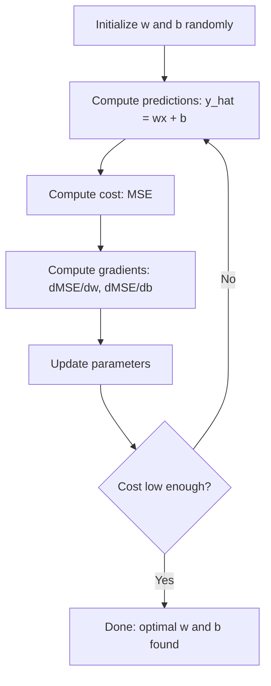

# Regressão linear
# 线性回归


> A regressão linear traça a melhor linha reta através dos seus dados. É o "mundo de olá" do aprendizado de máquina.

> 线性回归穿越你的数据画出最佳直线── é um "Hello World" de aprendizado de máquina.

**Type:** Build | **类型：** 构建
**Languages:** Python
**Prerequisites:** Phase 1 (Linear Algebra, Calculus, Optimization), Phase 2 Lesson 1 | **前置知识：** Phase 1（线性代数、微积分、优化），Phase 2 第 1 课
**Time:** ~90 minutes | **时间：** 约 90 分钟

## Objetivos de aprendizagem

- Derivar as regras de atualização de descida de gradiente para o erro quadrado médio e implementar regressão linear a partir do zero
  推导平均差差的梯度下降更新规则并从零实现线性回归 推导平均差的梯度下降更新规则并从零实现线性回归
- Comparar a descida de gradiente e a equação normal em termos de complexidade computacional e quando usar cada
  Comparar a complexidade de cálculo da gradiência e da redução de equilíbrio regular, a julgar quando usar cada um deles
- Construir um modelo de regressão linear múltipla com padronização de características e interpretar os pesos aprendidos
  构建带特征标准化多线性归归模型并解释学习到的权重
- Explique como a regressão de Ridge (regularizar L2) impede o sobreajuste por penalização de pesos grandes
  Explicação Ridge Retorno L2 正则化) Como passar por punição


> **【中文解读】**
> O regresso linear é o modelo de previsão mais simples usando um linear (ou superplano) de dados adequados. É também a rede neural mais simples: uma rede sem camadas ocultas, sem funções ativadas.

> **【拓展：线性回归在真实 AI 系统中的角色】**
> Embora "aprendizagem profunda" seja mais conhecida, o regresso linear continua a ser um dos modelos mais usados na indústria. O Google usa muito o regresso linear na análise de testes A/B para estimar o efeito de consequência. O Uber usa o regresso linear para fazer previsão de demanda. O modelo Fama-francês de três factores é o regresso linear multifacetado.

## O problema é o problema da introdução

Você tem dados: tamanhos de casas e seus preços de venda. Você quer prever o preço de uma casa nova dada o seu tamanho. Você pode olhar para ele em um gráfico de disperso, mas você precisa de uma fórmula. Você precisa de uma linha que melhor se encaixa nos dados para que você possa conectar qualquer tamanho e obter uma previsão de preço.

> Você tem dados: área da casa e preço de venda correspondente. Você pode prever o preço de uma casa nova. Você pode prever o preço de uma casa nova.

A regressão linear dá-lhe essa linha. O mais importante, ela introduz todo o ciclo de treinamento de ML: definir um modelo, definir uma função de custo, otimizar os parâmetros. Todo algoritmo ML segue esse mesmo padrão. Dominar aqui com o caso mais simples, e você vai reconhecê-lo em todos os lugares.

> O regresso linear fornece essa linha. Mais importante, introduz todo o ciclo de treinamento de ML: definir modelos, definir funções de preço, otimizar parâmetros. Cada algoritmo de ML segue o mesmo modelo.

Não se trata apenas de problemas simples. A regressão linear é usada em sistemas de produção para previsão de demanda, análise de testes A/B, modelagem financeira e como linha de base para cada tarefa de regressão.

> Isto não é apenas para questões simples. A regressão linear é usada no sistema de produção para a previsão de demanda, análise de testes A/B, construção financeira, bem como como como uma linha de base para cada tarefa de regressão.

> **【中文解读】**
> O regresso linear não é apenas um conhecimento de entrada, mas também um resumo do ciclo de treinamento de aprendizagem de máquina: define o modelo → define a função de perda → optimize os parâmetros. Com o exemplo mais simples, você pode entender de regresso lógico a todos os algoritmos da rede neuronal.

## O conceito central.

### O Modelo

A regressão linear assume uma relação linear entre entrada (x) e saída (y):

> 线性归归假设 线性关系 entre entrada (x) e saída (y):

```
y = wx + b
```

- `w`(peso/inclinação): quanto a y muda quando x aumenta em 1
  `w`(权重/斜率):x 增加 1 时 y 变化多少
- `b`(bias/intercepção): o valor de y quando x = 0
  `b`(偏置/截距): quando x = 0 时 y 的值

Para entradas múltiplas (funções), este se estende a:

> 对于多个输入(特征), ampliar为:

```
y = w1*x1 + w2*x2 + ... + wn*xn + b
```

Ou em forma vetorial: `y = w^T * x + b`

> Ou usando o formato de:`y = w^T * x + b`

O objetivo: encontrar os valores de w e b que tornem o y previsto o mais próximo possível do y real em todos os exemplos de treinamento.

> 目標: encontrar o valor de w 和 b, fazer todos os treinos de prova de pré-estimação de y 尽可能接近实际的 y ⋅

> **【中文解读】**
> O modelo de regresso é muito intuitivo:`y = wx + b`,w é inclinada (权重), b é cortada (偏置)`y = w1*x1 + w2*x2 + ... + wn*xn + b`O objetivo do treinamento é encontrar o melhor w e b, para minimizar a diferença entre o valor de previsão e o valor real.

### A função custo (erro quadrado médio)

Como medir "o mais próximo possível"? Você precisa de um único número que capte o quão errados suas previsões são. A escolha mais comum é o erro médio quadrado (MSE):

> Você precisa de um que possa capturar um único valor numérico de um grau de erro de previsão.

```
MSE = (1/n) * sum((y_predicted - y_actual)^2)
```

Por que quadrado? Duas razões. Primeiro, penaliza erros grandes mais do que pequenos erros (um erro de 10 é 100 vezes pior do que um erro de 1, não 10x). Segundo, a função quadrada é lisa e diferenciável em todos os lugares, o que torna a otimização direta.

> Por que usar o quadrado? duas razões. Primeiro, ele é mais pesado para o grande erro do que para o pequeno erro.

A função custo cria uma superfície. Para um único peso w e bias b, a superfície MSE parece uma tigela (um paraboloide convexo).

> Para um único peso e um posicionamento b, o MSE 曲面 looks like a bowl (ou seja, parece ser um recipiente de peso) △ O fundo do recipiente é o MSE.

### Descenso gradual

A descida gradual encontra o fundo da tigela, fazendo passos para baixo.

> A escada desce através de um passo para encontrar o fundo da tigela.



Os gradientes dizem duas coisas: qual a direção para mover cada parâmetro e quanto mover.

> A gradiência diz duas coisas: cada parâmetro deve mover-se em que direção e quanto deve mover-se.

Para MSE com y_hat = wx + b:

> 对于 MSE 且 y_hat = wx + b:

```
dMSE/dw = (2/n) * sum((y_hat - y) * x)
dMSE/db = (2/n) * sum(y_hat - y)
```

A regra de actualização:

> 更新规则:

```
w = w - learning_rate * dMSE/dw
b = b - learning_rate * dMSE/db
```

A taxa de aprendizagem controla o tamanho do passo. Muito grande: você ultrapassa o mínimo e diverge. Muito pequeno: o treinamento leva para sempre. Valores iniciais típicos: 0,01, 0,001 ou 0,0001.

> O nível de aprendizagem é muito alto: você vai saltar acima do valor mínimo e se dispersar.

> **【中文解读】**
> 梯度下降 é o algoritmo de otimização mais central do aprendizado de máquina. Sua intuição é simples: ficar em cima da montanha, caminhar em direção ao mais baixo da montanha, repetir até chegar ao fundo da montanha.

> **【拓展：梯度下降在现代 AI 中的演进】**
> O treinamento do GPT-4 usa o AdamW 优化器(Adam + 权重衰减), é uma variação de alta baixa de gradiente. A taxa de aprendizagem de 0 开始预热到峰值,然后余弦退火下降.

### A Equação Normal (Solução de Forma Fechada)

Para regressão linear especificamente, há uma fórmula direta que dá os pesos ótimos sem qualquer iteração:

>  Especialmente para o regresso linear, há uma fórmula direta que não precisa de ser usada para dar o máximo de peso:

```
w = (X^T * X)^(-1) * X^T * y
```

Isso inverte uma matriz para resolver para w em um passo. Funciona perfeitamente para pequenos conjuntos de dados. Para grandes conjuntos de dados (milhões de linhas ou milhares de características), a descida de gradiente é preferida porque a inversão da matriz é O(n^3) no número de características.

> É muito eficaz para pequenos conjuntos de dados. Para grandes conjuntos de dados, a gradiência é melhor, pois a matriz de busca é muito mais elevada.

> **【拓展：正规方程 vs 梯度下降的选择】**
> A complexidade do tempo do equácio regular é O (n^3) (n é o número de características), quando as características ultrapassam os milhares de vezes calculadas extremamente lentamente. O modelo de aprendizagem profunda tem bilhões de parâmetros, que só podem ser usados com gradientes abaixo.

### Regressão Linear Multipla

Com múltiplas características, o modelo se torna:

> Há vários traços, o modelo é transformado em:

```
y = w1*x1 + w2*x2 + ... + wn*xn + b
```

Tudo funciona da mesma forma: MSE é a função de custo, descida de gradiente atualiza todos os pesos simultaneamente. A única diferença é que você está montando um hiperplano em vez de uma linha.

> Todos os princípios são os mesmos: a EMS é a função de preço, a gradiência baixa ao mesmo tempo que a actualização de todos os direitos. A única diferença é que você está se adaptando a um superplano e não a uma linha reta.

A escalação de características importa aqui. Se uma característica varia de 0 a 1 e outra varia de 0 a 1.000.000, a descida de gradiente vai ter dificuldade porque a superfície de custo se alongua.

> A redução de características é importante aqui. Se um dos recursos for 0 a 1, o outro for 0 a 1.000.000, a redução de gradientes será difícil, pois a redução de preços será prolongada.

> **【中文解读】**
> Em regresso linear, a redução de características é essencial. Se a diferença de nível de características for grande, como a dimensão 500-3000 versus o número de quartos 1-5), a redução de gradientes da função de perda da divisão será gravemente aumentada, levando a receção a ser lenta ou mesmo incrível.

### Regressão polinômica

E se a relação não for linear? Você ainda pode usar regressão linear criando características polinômias:

> Se a relação não for linear, você pode continuar a usar a retorno linear através da criação de vários recursos:

```
y = w1*x + w2*x^2 + w3*x^3 + b
```

Isto ainda é regressão "linear" porque o modelo é linear nos pesos (w1, w2, w3).

> Este ainda é um regresso "linear", porque o modelo está em peso (w1, w2, w3) acima é linear. Você apenas usa as características não lineares de x.

Polinômios de grau superior podem caber curvas mais complexas, mas correm o risco de sobreajustar. Um polinômio de grau 10 passará por todos os pontos de um conjunto de dados de 10 pontos, mas prevê mal sobre novos dados.

> Um multicolor elevado pode se adaptar a curvas mais complexas, mas tem o risco de se adaptar. Um multicolor 10 vezes atravessa cada ponto de 10 conjuntos de dados, mas a previsão em novos dados é muito ruim.

### R-Correção quadrada

O MSE diz-lhe o quão errado você está, mas o número depende da escala de y. R-quadrado (R^2) dá uma medida independente da escala:

> O MSE  diz-te quanto foi errado, mas esse número depende da quantidade de y. R-quadrado (R^2)  dá uma quantidade não relacionada com a quantidade:

```
R^2 = 1 - (sum of squared residuals) / (sum of squared deviations from mean)
    = 1 - SS_res / SS_tot
```

- R^2 = 1,0: previsões perfeitas
  R^2 = 1,0:完美预测
- R^2 = 0,0: o modelo não é melhor do que prever a média cada vez
  R^2 = 0,0: modelo não compara a média de previsão boa
- R^2 < 0,0: o modelo é pior do que prever a média
  R^2 < 0,0: modelo比预测均值还差

### Previsão de regularização (regressão de Ridge)

Quando você tem muitos recursos, o modelo pode overfit atribuindo grandes pesos.

> Quando você tem muitas características, o modelo pode passar por dar grande peso para se adaptar.

```
Cost = MSE + lambda * sum(w_i^2)
```

O termo penalidade desencoraja grandes pesos. O lambda hiperparâmetro controla a troca: lambda mais alta significa pesos menores e mais regularização. Isto é abordado em profundidade em uma lição posterior.

> 惩罚项阻止权重过大──超参数 lambda 控制权衡:lambda 越大意味着权重越小、正则化越强── isso será profundamente discutido no curso seguinte── agora só é necessário entender a sua existência e efeito──

> **【中文解读】**
> Ridge Regression (Ridge Regression) L2 Normalamento) através de adição de peso quadrado e de punição em função de perda para prevenir o sobreajuste.

## Construí-lo e realizei-o.
```figure
linear-regression-fit
```

## Construí-lo

### Passo 1: Gerenciar dados de amostra

```python
import random
import math

random.seed(42)  # 设置随机种子以确保结果可复现

TRUE_W = 3.0  # 真实斜率（权重）
TRUE_B = 7.0  # 真实截距（偏置）
N_SAMPLES = 100  # 样本数量

X = [random.uniform(0, 10) for _ in range(N_SAMPLES)]  # 生成 0-10 之间的随机特征值
y = [TRUE_W * x + TRUE_B + random.gauss(0, 2.0) for x in X]  # 真实关系 + 高斯噪声

print(f"Generated {N_SAMPLES} samples")
print(f"True relationship: y = {TRUE_W}x + {TRUE_B} (+ noise)")
print(f"First 5 points: {[(round(X[i], 2), round(y[i], 2)) for i in range(5)]}")
```

### Passo 2: Regressão linear a partir do zero com descida de gradiente

```python
class LinearRegression:
    def __init__(self, learning_rate=0.01):
        self.w = 0.0  # 权重初始化为 0
        self.b = 0.0  # 偏置初始化为 0
        self.lr = learning_rate  # 学习率控制梯度下降步长
        self.cost_history = []  # 记录每轮的损失值

    def predict(self, X):
        return [self.w * x + self.b for x in X]  # y_hat = wx + b

    def compute_cost(self, X, y):
        predictions = self.predict(X)
        n = len(y)
        # 计算 MSE：均方误差
        cost = sum((pred - actual) ** 2 for pred, actual in zip(predictions, y)) / n
        return cost

    def compute_gradients(self, X, y):
        predictions = self.predict(X)
        n = len(y)
        # 对 w 的偏导数
        dw = (2 / n) * sum((pred - actual) * x for pred, actual, x in zip(predictions, y, X))
        # 对 b 的偏导数
        db = (2 / n) * sum(pred - actual for pred, actual in zip(predictions, y))
        return dw, db

    def fit(self, X, y, epochs=1000, print_every=200):
        for epoch in range(epochs):
            dw, db = self.compute_gradients(X, y)  # 计算梯度
            self.w -= self.lr * dw  # 沿梯度反方向更新权重
            self.b -= self.lr * db  # 沿梯度反方向更新偏置
            cost = self.compute_cost(X, y)
            self.cost_history.append(cost)
            if epoch % print_every == 0:
                print(f"  Epoch {epoch:4d} | Cost: {cost:.4f} | w: {self.w:.4f} | b: {self.b:.4f}")
        return self

    def r_squared(self, X, y):
        predictions = self.predict(X)
        y_mean = sum(y) / len(y)
        ss_res = sum((actual - pred) ** 2 for actual, pred in zip(y, predictions))  # 残差平方和
        ss_tot = sum((actual - y_mean) ** 2 for actual in y)  # 总变差
        return 1 - (ss_res / ss_tot)  # R² = 1 - SS_res/SS_tot


print("=== Training Linear Regression (Gradient Descent) ===")
model = LinearRegression(learning_rate=0.005)
model.fit(X, y, epochs=1000, print_every=200)
print(f"\nLearned: y = {model.w:.4f}x + {model.b:.4f}")
print(f"True:    y = {TRUE_W}x + {TRUE_B}")
print(f"R-squared: {model.r_squared(X, y):.4f}")
```

### Passo 3: Equação normal (solução de forma fechada)

```python
class LinearRegressionNormal:
    def __init__(self):
        self.w = 0.0  # 斜率
        self.b = 0.0  # 截距

    def fit(self, X, y):
        n = len(X)
        x_mean = sum(X) / n  # 计算 x 的均值
        y_mean = sum(y) / n  # 计算 y 的均值
        # 协方差 / 方差 = 最优斜率
        numerator = sum((X[i] - x_mean) * (y[i] - y_mean) for i in range(n))
        denominator = sum((X[i] - x_mean) ** 2 for i in range(n))
        self.w = numerator / denominator
        # 截距 = y 均值 - 斜率 * x 均值
        self.b = y_mean - self.w * x_mean
        return self

    def predict(self, X):
        return [self.w * x + self.b for x in X]

    def r_squared(self, X, y):
        predictions = self.predict(X)
        y_mean = sum(y) / len(y)
        ss_res = sum((actual - pred) ** 2 for actual, pred in zip(y, predictions))
        ss_tot = sum((actual - y_mean) ** 2 for actual in y)
        return 1 - (ss_res / ss_tot)


print("\n=== Normal Equation (Closed-Form) ===")
model_normal = LinearRegressionNormal()
model_normal.fit(X, y)
print(f"Learned: y = {model_normal.w:.4f}x + {model_normal.b:.4f}")
print(f"R-squared: {model_normal.r_squared(X, y):.4f}")
```

### Passo 4: Regressão linear múltipla

```python
class MultipleLinearRegression:
    def __init__(self, n_features, learning_rate=0.01):
        self.weights = [0.0] * n_features
        self.bias = 0.0
        self.lr = learning_rate
        self.cost_history = []

    def predict_single(self, x):
        return sum(w * xi for w, xi in zip(self.weights, x)) + self.bias

    def predict(self, X):
        return [self.predict_single(x) for x in X]

    def compute_cost(self, X, y):
        predictions = self.predict(X)
        n = len(y)
        return sum((pred - actual) ** 2 for pred, actual in zip(predictions, y)) / n

    def fit(self, X, y, epochs=1000, print_every=200):
        n = len(y)
        n_features = len(X[0])
        for epoch in range(epochs):
            predictions = self.predict(X)
            errors = [pred - actual for pred, actual in zip(predictions, y)]
            for j in range(n_features):
                grad = (2 / n) * sum(errors[i] * X[i][j] for i in range(n))
                self.weights[j] -= self.lr * grad
            grad_b = (2 / n) * sum(errors)
            self.bias -= self.lr * grad_b
            cost = self.compute_cost(X, y)
            self.cost_history.append(cost)
            if epoch % print_every == 0:
                print(f"  Epoch {epoch:4d} | Cost: {cost:.4f}")
        return self

    def r_squared(self, X, y):
        predictions = self.predict(X)
        y_mean = sum(y) / len(y)
        ss_res = sum((actual - pred) ** 2 for actual, pred in zip(y, predictions))
        ss_tot = sum((actual - y_mean) ** 2 for actual in y)
        return 1 - (ss_res / ss_tot)


random.seed(42)
N = 100
X_multi = []
y_multi = []
for _ in range(N):
    size = random.uniform(500, 3000)
    bedrooms = random.randint(1, 5)
    age = random.uniform(0, 50)
    price = 50 * size + 10000 * bedrooms - 1000 * age + 50000 + random.gauss(0, 20000)
    X_multi.append([size, bedrooms, age])
    y_multi.append(price)


def standardize(X):
    n_features = len(X[0])
    means = [sum(X[i][j] for i in range(len(X))) / len(X) for j in range(n_features)]
    stds = []
    for j in range(n_features):
        variance = sum((X[i][j] - means[j]) ** 2 for i in range(len(X))) / len(X)
        stds.append(variance ** 0.5)
    X_scaled = []
    for i in range(len(X)):
        row = [(X[i][j] - means[j]) / stds[j] if stds[j] > 0 else 0 for j in range(n_features)]
        X_scaled.append(row)
    return X_scaled, means, stds


y_mean_val = sum(y_multi) / len(y_multi)
y_std_val = (sum((yi - y_mean_val) ** 2 for yi in y_multi) / len(y_multi)) ** 0.5
y_scaled = [(yi - y_mean_val) / y_std_val for yi in y_multi]

X_scaled, x_means, x_stds = standardize(X_multi)

print("\n=== Multiple Linear Regression (3 features) ===")
print("Features: house size, bedrooms, age")
multi_model = MultipleLinearRegression(n_features=3, learning_rate=0.01)
multi_model.fit(X_scaled, y_scaled, epochs=1000, print_every=200)

print(f"\nWeights (standardized): {[round(w, 4) for w in multi_model.weights]}")
print(f"Bias (standardized): {multi_model.bias:.4f}")
print(f"R-squared: {multi_model.r_squared(X_scaled, y_scaled):.4f}")
```

### Passo 5: Regressão polinômica

```python
class PolynomialRegression:
    def __init__(self, degree, learning_rate=0.01):
        self.degree = degree
        self.weights = [0.0] * degree
        self.bias = 0.0
        self.lr = learning_rate

    def make_features(self, X):
        return [[x ** (d + 1) for d in range(self.degree)] for x in X]

    def predict(self, X):
        features = self.make_features(X)
        return [sum(w * f for w, f in zip(self.weights, row)) + self.bias for row in features]

    def fit(self, X, y, epochs=1000, print_every=200):
        features = self.make_features(X)
        n = len(y)
        for epoch in range(epochs):
            predictions = [sum(w * f for w, f in zip(self.weights, row)) + self.bias for row in features]
            errors = [pred - actual for pred, actual in zip(predictions, y)]
            for j in range(self.degree):
                grad = (2 / n) * sum(errors[i] * features[i][j] for i in range(n))
                self.weights[j] -= self.lr * grad
            grad_b = (2 / n) * sum(errors)
            self.bias -= self.lr * grad_b
            if epoch % print_every == 0:
                cost = sum(e ** 2 for e in errors) / n
                print(f"  Epoch {epoch:4d} | Cost: {cost:.6f}")
        return self

    def r_squared(self, X, y):
        predictions = self.predict(X)
        y_mean = sum(y) / len(y)
        ss_res = sum((actual - pred) ** 2 for actual, pred in zip(y, predictions))
        ss_tot = sum((actual - y_mean) ** 2 for actual in y)
        return 1 - (ss_res / ss_tot)


random.seed(42)
X_poly = [x / 10.0 for x in range(0, 50)]
y_poly = [0.5 * x ** 2 - 2 * x + 3 + random.gauss(0, 1.0) for x in X_poly]

x_max = max(abs(x) for x in X_poly)
X_poly_norm = [x / x_max for x in X_poly]
y_poly_mean = sum(y_poly) / len(y_poly)
y_poly_std = (sum((yi - y_poly_mean) ** 2 for yi in y_poly) / len(y_poly)) ** 0.5
y_poly_norm = [(yi - y_poly_mean) / y_poly_std for yi in y_poly]

print("\n=== Polynomial Regression (degree 2 vs degree 5) ===")
print("True relationship: y = 0.5x^2 - 2x + 3")

print("\nDegree 2:")
poly2 = PolynomialRegression(degree=2, learning_rate=0.1)
poly2.fit(X_poly_norm, y_poly_norm, epochs=2000, print_every=500)
print(f"  R-squared: {poly2.r_squared(X_poly_norm, y_poly_norm):.4f}")

print("\nDegree 5:")
poly5 = PolynomialRegression(degree=5, learning_rate=0.1)
poly5.fit(X_poly_norm, y_poly_norm, epochs=2000, print_every=500)
print(f"  R-squared: {poly5.r_squared(X_poly_norm, y_poly_norm):.4f}")

print("\nDegree 2 fits the true curve well. Degree 5 fits training data slightly better")
print("but risks overfitting on new data.")
```

### Passo 6: Regressão de escala (regularizar L2)

```python
class RidgeRegression:
    def __init__(self, n_features, learning_rate=0.01, alpha=1.0):
        self.weights = [0.0] * n_features
        self.bias = 0.0
        self.lr = learning_rate
        self.alpha = alpha

    def predict_single(self, x):
        return sum(w * xi for w, xi in zip(self.weights, x)) + self.bias

    def predict(self, X):
        return [self.predict_single(x) for x in X]

    def fit(self, X, y, epochs=1000, print_every=200):
        n = len(y)
        n_features = len(X[0])
        for epoch in range(epochs):
            predictions = self.predict(X)
            errors = [pred - actual for pred, actual in zip(predictions, y)]
            mse = sum(e ** 2 for e in errors) / n
            reg_term = self.alpha * sum(w ** 2 for w in self.weights)
            cost = mse + reg_term
            for j in range(n_features):
                grad = (2 / n) * sum(errors[i] * X[i][j] for i in range(n))
                grad += 2 * self.alpha * self.weights[j]
                self.weights[j] -= self.lr * grad
            grad_b = (2 / n) * sum(errors)
            self.bias -= self.lr * grad_b
            if epoch % print_every == 0:
                print(f"  Epoch {epoch:4d} | Cost: {cost:.4f} | L2 penalty: {reg_term:.4f}")
        return self


print("\n=== Ridge Regression (L2 Regularization) ===")
print("Same data as multiple regression, with alpha=0.1")
ridge = RidgeRegression(n_features=3, learning_rate=0.01, alpha=0.1)
ridge.fit(X_scaled, y_scaled, epochs=1000, print_every=200)
print(f"\nRidge weights: {[round(w, 4) for w in ridge.weights]}")
print(f"Plain weights: {[round(w, 4) for w in multi_model.weights]}")
print("Ridge weights are smaller (shrunk toward zero) due to the L2 penalty.")
```

## Use-o com o framework implementado.

Agora a mesma coisa com o scikit-learn, que é o que você vai realmente usar na produção.

> Agora, com o aprendizado de pequeno porte, você pode realizar a mesma função, é o instrumento que você usa na produção.

```python
from sklearn.linear_model import LinearRegression as SklearnLR
from sklearn.linear_model import Ridge
from sklearn.preprocessing import PolynomialFeatures, StandardScaler
from sklearn.model_selection import train_test_split
from sklearn.metrics import mean_squared_error, r2_score
import numpy as np

# 生成与从零实现相同的数据
np.random.seed(42)
X_sk = np.random.uniform(0, 10, (100, 1))
y_sk = 3.0 * X_sk.squeeze() + 7.0 + np.random.normal(0, 2.0, 100)

# 划分训练集和测试集（80/20）
X_train, X_test, y_train, y_test = train_test_split(X_sk, y_sk, test_size=0.2, random_state=42)

# 线性回归
lr = SklearnLR()
lr.fit(X_train, y_train)
y_pred = lr.predict(X_test)

print("=== Scikit-learn Linear Regression ===")
print(f"Coefficient (w): {lr.coef_[0]:.4f}")
print(f"Intercept (b): {lr.intercept_:.4f}")
print(f"R-squared (test): {r2_score(y_test, y_pred):.4f}")
print(f"MSE (test): {mean_squared_error(y_test, y_pred):.4f}")

# 多项式回归（degree=2）
poly = PolynomialFeatures(degree=2, include_bias=False)
X_poly_sk = poly.fit_transform(X_train)  # 生成 x, x² 特征
X_poly_test = poly.transform(X_test)

lr_poly = SklearnLR()
lr_poly.fit(X_poly_sk, y_train)
print(f"\nPolynomial degree 2 R-squared: {r2_score(y_test, lr_poly.predict(X_poly_test)):.4f}")

# 标准化后使用 Ridge 回归
scaler = StandardScaler()
X_train_scaled = scaler.fit_transform(X_train)  # 在训练集上拟合并转换
X_test_scaled = scaler.transform(X_test)  # 在测试集上只转换

ridge = Ridge(alpha=1.0)  # alpha 即正则化强度 lambda
ridge.fit(X_train_scaled, y_train)
print(f"Ridge R-squared: {r2_score(y_test, ridge.predict(X_test_scaled)):.4f}")
print(f"Ridge coefficient: {ridge.coef_[0]:.4f}")
```

A sua implementação desde o zero e a scikit-learn produzem os mesmos resultados. A diferença: scikit-learn lida com casos de borda, estabilidade numérica e otimização de desempenho. Use a biblioteca para produção. Use a versão do zero para entender o que está acontecendo.

> A diferença é que o aprendizado de zero produz os mesmos resultados. A diferença é que o aprendizado de zero lida com a situação de fronteira, a estabilidade numérica e a optimização de desempenho.

## Envia-o . Produto .

Esta lição produz:
- `outputs/skill-regression.md`- habilidade para escolher a abordagem de regressão correta com base no problema

> 本课产出:
> - `outputs/skill-regression.md`- Uma habilidade de escolha de método de regresso

## Exercícios.

1. Implementar descida de gradiente de lote, descida de gradiente estocástico (SGD) e descida de gradiente de mini lote. Compare a velocidade de convergência no mesmo conjunto de dados. Qual converge mais rápido? Qual tem a curva de custo mais suave?
   1. 实现批量梯度下降,随机梯度下降 (SGD) 和小批量梯度下降.                                                                                                                                                                                                                                                 
2. Gerar dados a partir de uma função cúbica (y = ax^3 + bx^2 + cx + d + ruído). Polinômios de graus 1, 3 e 10. Compare treinamento R^2 e teste R^2.
   2. De três vezes função (y = ax^3 + bx^2 + cx + d + ruído) 生成数据──拟合 1、3 和 10 次多项式──比较训练 R^2 和测试 R^2──几次多项式时过拟合变得明显?
3. Implementar a regressão de Lasso (regularização L1: penalidade * soma alfa em direção = i i i i i i i i)). Treinar os dados de habitação de várias características. Comparar quais pesos vão para zero vs Ridge. Por que L1 produz soluções escassas enquanto L2 não?
   3. 实现 Lasso 回归(L1 正则化:penalty * alpha sum *(((((((((((((((((((((((((((((((((((((((((((((((((((((((((((((((((((((((((((((((((((((((((((((((((((((((((((((((((((((((((((((((((((((((((((((((((((((((((((((((((((((((((((((((((((((((((((((((((((((((((((((((((((((((((((((((((((((((((((((((((((((((((((((((((((((((((((((((((((((((((((((((((((((((((((((((((((((((((((((((((((((((((((((((((((((((((((((((((((((((((((((((((((((((((((((((((((((((((((((((((((((((((((((((((((((((((((((((((((((((((((((((((((((((((((((((((((((((((((((((((((((((((((

## Termos-chave .

| Term | What people say | What it actually means |
|------|----------------|----------------------|
| Linear regression | "Draw a line through data" | Find weight w and bias b that minimize the sum of squared differences between wx+b and actual y values |
| Cost function | "How bad the model is" | A function that maps model parameters to a single number measuring prediction error, which optimization minimizes |
| Mean squared error | "Average of squared errors" | (1/n) * sum of (predicted - actual)^2, penalizing large errors disproportionately |
| Gradient descent | "Walk downhill" | Iteratively adjust parameters in the direction that reduces the cost function, using partial derivatives |
| Learning rate | "Step size" | A scalar that controls how much parameters change per gradient descent step |
| Normal equation | "Solve it directly" | The closed-form solution w = (X^T X)^-1 X^T y that gives optimal weights without iteration |
| R-squared | "How good the fit is" | The fraction of variance in y explained by the model, ranging from negative infinity to 1.0 |
| Feature scaling | "Make features comparable" | Transforming features to similar ranges (e.g., zero mean, unit variance) so gradient descent converges faster |
| Regularization | "Penalize complexity" | Adding a term to the cost function that shrinks weights, preventing overfitting |
| Ridge regression | "L2 regularization" | Linear regression with a penalty of lambda * sum(w_i^2) added to MSE |
| Polynomial regression | "Fitting curves with linear math" | Linear regression on polynomial features (x, x^2, x^3, ...), still linear in the weights |
| Overfitting | "Memorizing training data" | Using a model so complex that it fits noise in training data and fails on new data |

## Mais leitura 延伸阅读

- [An Introduction to Statistical Learning (ISLR)](https://www.statlearning.com/)-- PDF gratuito, os capítulos 3 e 6 cobrem regressão linear e regularização com exemplos práticos de R
  [An Introduction to Statistical Learning (ISLR)](https://www.statlearning.com/)-- 免费教材, 第3章和第6章用实际R示例涵盖线性归归和正规化
- [The Elements of Statistical Learning (ESL)](https://hastie.su.domains/ElemStatLearn/)-- PDF gratuito, o companheiro mais matemático da ISLR com tratamento mais profundo da cresta e lasso
  [The Elements of Statistical Learning (ESL)](https://hastie.su.domains/ElemStatLearn/)-- 免费教材,ISLR的数学版,对对山脊和拉索有更深入处理
- [Stanford CS229 Lecture Notes on Linear Regression](https://cs229.stanford.edu/main_notes.pdf)-- As notas de Andrew Ng derivando a equação normal e descida de gradiente dos primeiros princípios
  [Stanford CS229 Lecture Notes on Linear Regression](https://cs229.stanford.edu/main_notes.pdf)-- Andrew Ng's Notas do Primeiro Princípio de Direção da Lei de Equilíbrio e de Descenso
- [scikit-learn LinearRegression documentation](https://scikit-learn.org/stable/modules/linear_model.html)-- referência prática para LinearRegression, Ridge, Lasso e ElasticNet com exemplos de código
  [scikit-learn LinearRegression documentation](https://scikit-learn.org/stable/modules/linear_model.html)-- LinearRegression、Ridge、Lasso 和 ElasticNet
