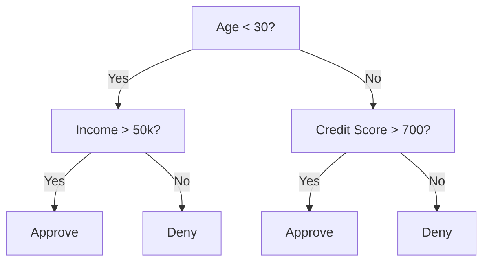
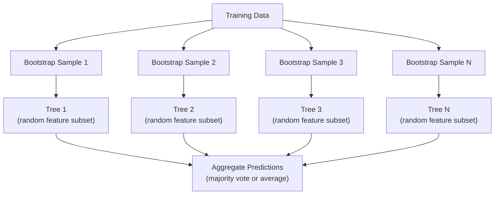

# Árvores de decisão e florestas aleatórias
# 决策树与随机森林


> Uma árvore de decisão é apenas um fluxo, mas uma floresta delas é uma das ferramentas mais poderosas do ML.

> Uma árvore de decisão é um plano de processo, mas uma floresta composta por elas é uma das ferramentas mais poderosas da aprendizagem de máquina.

**Type:** Build | **类型：** 构建
**Language:**O Python .**语言：**Python
**Prerequisites:** Phase 1 (Lessons 09 Information Theory, 06 Probability) | **前置知识：** Phase 1（第 9 课信息论、第 6 课概率论）
**Time:** ~90 minutes | **时间：** 约 90 分钟

## Objetivos de aprendizagem

- Implementar cálculos de impureza de Gini, entropia e ganho de informações para encontrar as divisões ótimas da árvore de decisão
   realçar a Gini não pureza  e a informação aumentam a calcular, encontrar o melhor ponto de decisão
- Construir um classificador de árvore de decisão a partir do zero com controles pré-titular (profundeza máxima, amostras mínimas)
  De zero construção com controle prévio de cortes de ramificação (máxima profundidade, menor número de amostras)
- Construir uma floresta aleatória usando amostragem de bootstrap e randomization de recursos, e explicar por que reduz a variância
  Utilize Bootstrap 采样和特征随机化构建随机森林,并解释为什么它可以降低方差
- Comparar a importância da característica MDI com a importância da permutação e identificar quando a MDI é tendenciosa
  Comparar a importância das características e a importância da substituição da MDI, identificar a diferença entre as características e a importância da MDI


> **【中文解读】**
> 决策树通过 if-else 规则分割数据,随机森林是多个决策树的投票组合――sklearn 金融风控医疗诊断中随机森林是基线模型――

> **【拓展：树模型在 Kaggle 和工业界的主导地位】**
> Em competição de dados estruturados, cerca de 70% dos programas de ganho usam gradiente de aumento de árvore (XGBoost/LightGBM/CatBoost) ⋅ no domínio financeiro, avaliações de crédito ⋅ FICO %) variação de decisão amplamente utilizada; bancos anti-fraude sistemas regularmente usam como linha de base as florestas; no diagnóstico médico, as florestas são usadas para previsão de risco de reinserção em hospitais ⋅ Modelo de árvore pode automaticamente tratar os tipos de mistura características e explicação, o que é difícil de fazer em rede nervosa.

## O problema é o problema da introdução

Você tem dados tabulares. As linhas são amostras, as colunas são características, e há uma coluna-alvo que você quer prever. Você pode jogar uma rede neural para ela. Mas para dados tabulares, os modelos baseados em árvores (árvores de decisão, florestas aleatórias, árvores aumentadas de gradiente) superam consistentemente a aprendizagem profunda. As competições de Kaggle em dados estruturados são dominadas pelo XGBoost e LightGBM, não por transformadores.

> Você tem dados de forma gráfica. O caminho é um exemplo, um traço, também há um objetivo que você quer prever. Você pode processar com a rede neural. Mas para os dados de forma gráfica, um modelo de árvore (incluindo um árvore de decisão, um árvore de aumento de gradiente, um árvore de mudança de temperatura) sempre é melhor do que o aprendizado em profundidade.

Por que? As árvores lidam com tipos de características mistos (números e categorias) sem pré-processamento. Eles lidam com relações não lineares sem engenharia de características. Eles são interpretáveis: você pode olhar para a árvore e ver exatamente por que uma previsão foi feita. E florestas aleatórias, que médiamente muitas árvores, são altamente resistentes a sobreajustes em conjuntos de dados de tamanho moderado.

> Por que? Modelos de árvores não precisam de pré-processamento em relação ao tipo de características mistas (numerário e classe) ⋅ não precisam de características em relação ao tratamento de relações não lineares ⋅ eles podem ser explicados: você pode ver árvores e entender com certeza por que fazer uma previsão ⋅ e, como a floresta atravessa muitas árvores, a super-adaptação de conjuntos de dados de média dimensão tem uma forte resistência ⋅

Esta lição constrói árvores de decisão a partir do zero usando divisão recursiva, depois constrói uma floresta aleatória no topo. Você implementará a matemática por trás dos critérios de divisão (impuridade de Gini, entropia, ganho de informações) e entenderá por que um conjunto de aprendizes fracos se torna um forte.

> Este curso começa com o uso de zero para regressar à divisão construindo uma árvore de decisão, e depois, construindo um bosque de divisão, você vai realizar a matemática por trás da divisão (Gini não é pureza, 、 aumento da informação), e compreender por que um grupo de aprendizagem fraca pode se tornar um aprendizagem forte.

> **【中文解读】**
> Para o tipo de dados, os modelos de árvores são geralmente melhores do que os de aprendizagem profunda.

## O conceito central.

### O que faz uma árvore de decisão

Uma árvore de decisão divide o espaço de características em regiões retangulares, fazendo uma sequência de perguntas sim/não.

> 决策树通过一系列非问题将特征空间分为矩形区域――



Cada nó interno testa uma característica contra um limiar. Cada nó de folha faz uma previsão. Para classificar um novo ponto de dados, você começa na raiz e segue os ramos até chegar a uma folha.

> Cada ponto interno comparará um traço com o valor. Cada ponto de folha faz uma previsão.

A árvore é construída de cima para baixo escolhendo, em cada nó, a característica e o limiar que melhor separam os dados.

> Os árvores se construem de cima para baixo, em cada ponto, escolhendo as características e valores mais diferenciadas dos dados.

### Critérios de separação: medição da impureza

Em cada nó, temos um conjunto de amostras. Queremos dividir-los para que os nódulos infantis resultantes sejam o mais "puro" possível, o que significa que cada criança contém principalmente uma classe.

> Em cada ponto, temos um conjunto de amostras. Queremos dividir-as para que os pontos sejam o mais "puro" possível.

**Gini impurity**Messa a probabilidade de uma amostra escolhida aleatoriamente ser classificada erroneamente se for rotulada de acordo com a distribuição de classes nesse nó.

> **Gini 不纯度**Measurando uma amostra de seleção aleatória se, segundo a distribuição de categorias do ponto, for marcada, é erroneamente classificada a probabilidade de serem classificadas.

```
Gini(S) = 1 - sum(p_k^2)

where p_k is the proportion of class k in set S.
```

Para um nó puro (todos uma classe), Gini = 0. Para uma divisão binária com classes 50/50, Gini = 0.5.

> Para puro ponto, Gini = 0, Gini = 0,5...

```
Example: 6 cats, 4 dogs

Gini = 1 - (0.6^2 + 0.4^2) = 1 - (0.36 + 0.16) = 0.48
```

**Entropy**Método de avaliação de dados e de dados de um nó.

> **熵**衡量节点中的信息内容 (confusión) ⋅ já discutida na fase 1 课中.

```
Entropy(S) = -sum(p_k * log2(p_k))
```

Para um nó puro, entropia = 0. Para uma divisão binária 50/50, entropia = 1.0.

> 对于纯节点, = 0──对于 50/50 的二元分离, = 1.0──越低越好──

```
Example: 6 cats, 4 dogs

Entropy = -(0.6 * log2(0.6) + 0.4 * log2(0.4))
        = -(0.6 * -0.737 + 0.4 * -1.322)
        = 0.442 + 0.529
        = 0.971 bits
```

**Information gain**é a redução da impureza (entropia ou Gini) após a separação.

> **信息增益**É a redução da divisão após a impureza.

```
IG(S, feature, threshold) = Impurity(S) - weighted_avg(Impurity(S_left), Impurity(S_right))

where the weights are the proportions of samples in each child.
```

O algoritmo ganancioso em cada nó: tente todas as características e todos os limites possíveis. Escolha o par (função, limite) que maximiza o ganho de informações.

> Algoritmo de Gripso de cada Nótulo: tentar cada característica e cada valor possível.

> **【中文解读】**
> O algoritmo de GAPPYTE em cada ponto seleciona o maior aumento de informações sobre a divisão. Embora o GAPPYTE não garanta que a melhor das coisas seja NP-difícil, em prática é muito bom.

### Como funciona a separação

Para um conjunto de dados com n características e m amostras no nó corrente:

> 对于有 n 个特征和 m 个样本的当前节点:

1. Para cada característica j (j = 1 a n):
   Para cada característica j ((j = 1 até n):
   - Classificar as amostras por característica j
     按特征 j对样本排序
   - Tente cada ponto médio entre valores distintos consecutivos como um limiar
     尝试对相邻不同值的中点作为值
   - Calcular o ganho de informação para cada limiar
     计算每个值的信息增益
2. Selecionar a característica e o limiar com o maior ganho de informações
   选择信息增益 增益 增益 增益 增益 增益 增益 增益 增益 增益 增益 增益 增益 增益 增益 增益 增益 增益 增益 增益 增益 增益 增益 增益 增益 增益 增益 增益 增益 增益 增 增 增 增 增 增 增 增 增 增 增 增 增 增 增 增 增 增 增 增 增 增 增 增 增 增 增 增 增 增 增 增 增 增 增 增 增 增 增 增 增 增 增 增 增 增 增 增 增 增 增 增 增 增 增 增 增 增 增 增 增 增 增 增 增 增 增 增 增 增 增 增 增 增 增 增 增 增 增 增 增 增 增 增 增 增 增 增 增 增 增 增 增 增 增 增 增 增 增 增 增 增 增 增 增 增 增 增 增 增 增 增 增 增 增 增 增 增 增 增 增 增 增 增 增 增 增 增 增 增 增 增 增 增 增 增 增 增 增 增 增 增 增 增 增 增 增 增 增 增 增 增 增 增 增 增 增 增 增 增 增 增 增 增 增 增 增 增 增 增 增 增 增 增 增 增 增 增 增 增 增 增 增 增 增 增 增 增 增 增 增 增 增 增 增 增 增 增 增 增 增 增 增 增 增 增 增 增 增
3. Dividir os dados em esquerda (ponto <= função) e direita (ponto > função)
   A partir daí, os dados serão divididos em três partes:
4. Recurso em cada criança
   Para cada ponto de entrega

Esta abordagem gananciosa não garante a árvore globalmente ideal. Encontrar a árvore ideal é NP-difícil. Mas a divisão gananciosa funciona bem na prática.

> Este método não garante a melhor árvore da região inteira. Encontrar a melhor árvore é NP-difícil.

### Condições de parada

Sem condições de parada, a árvore cresce até que cada folha seja pura (uma amostra por folha).

> Sem condições de parada, o árvore continuou a crescer até que cada ponto da folha fosse puro.

**Pre-pruning**para a árvore antes de crescer completamente:
- Profundeza máxima: parar de se dividir quando a árvore atingir uma profundidade definida
  Maxima profundidade: quando a árvore atinge uma profundidade determinada, a separação termina.
- Práticas de análise de dados e de dados
  Número mínimo de amostras: Se um ponto for menor que k 个样本, então parar
- Ganhamento mínimo de informações: parar se a melhor divisão melhorar a impureza em menos de um limiar
  Última informação sobre o aumento: se a melhor divisão melhorar não a pureza abaixo do valor, então parar
- Núcleos de folhas máximos: limite o número total de folhas
  Número máximo de pontos: limite Número total de pontos

**Post-pruning**cresce a árvore cheia, depois a corta de volta:
- A redução de custos e complexidade (usada pela scikit-learn): adiciona uma penalidade proporcional ao número de folhas.
  代价复杂度剪枝(scikit-learn 使用): adição com pontos de folha em número de correção de punição;; aumento de punição get get menor árvore
- Reduzir a poda de erros: remover uma subárvore se o erro de validação não aumentar
  减差剪枝: Se o erro de verificação não aumentar, então remove o árvore

A pré-titulação é mais simples e mais rápida. A pós-titulação geralmente produz melhores árvores porque não impede prematuramente as divisões que podem levar a novas divisões úteis.

> 预剪枝更简单更快――后剪枝通常产生更好的树,因为它不会过早停止可能带来有用后分节――

### Árvores de decisão para regressão

Para regressão, a previsão de folha é a média dos valores-alvo nessa folha.

> Para o regresso, a previsão de um ponto de partida é o valor médio do valor-alvo do ponto de partida.

**Variance reduction**Substitui o ganho de informações:

> **方差减少**替代了信息增益:

```
VR(S, feature, threshold) = Var(S) - weighted_avg(Var(S_left), Var(S_right))
```

Escolha a divisão que reduz a variância mais. A árvore divide o espaço de entrada em regiões e prevê uma constante (a média) em cada região.

> 选择方差减少最多的分离――树将输入空间分为区域,在每个区域预测一个常数 (平均值) ⋅

### Florestas aleatórias: o poder dos conjuntos

Uma única árvore de decisão é de alta variação. Pequenas mudanças nos dados podem produzir árvores completamente diferentes.

> As pequenas variações dos dados geram árvores completamente diferentes.



Duas fontes de aleatoriedade tornam as árvores diversas:

> As duas fontes aleatórias que diversificam as árvores:

**Bagging (bootstrap aggregating):**Cada árvore é treinada em uma amostra de bootstrap, uma amostra aleatória com substituição dos dados de treinamento. Cerca de 63% das amostras originais aparecem em cada bootstrap (o resto são amostras fora do saco que podem ser usadas para validação).

> **Bagging（Bootstrap 聚合）**Cada árvore é treinada em um modelo de bootstrap, isto é, em dados de treinamento, há um sample random de sorteio de sorteio. Cerca de 63% das amostras originais estão presentes em cada bootstrap.

**Feature randomization:**Em cada divisão, apenas um subconjunto aleatório de características é considerado. Para classificação, o padrão é sqrt(n_features). Para regressão, n_features/3. Isso impede que todas as árvores se dividam na mesma característica dominante.

> **特征随机化**Em cada divisão, apenas considere as características do conjunto de árvores.

A principal ideia: a média de muitas árvores descorreladas reduz a variância sem aumentar o viés. Cada árvore individual pode ser mediocre.

> 核心洞察: média de muitas árvores relacionadas pode reduzir a diferença de tamanho e não aumentar a diferença de tamanho.

> **【中文解读】**
> Os dois mecanismos de randomizamento são: 1) Bagging cada árvore com um sample de extração de extração de extração de extração de extração de extração de extração de extração de extração de extração de extração de extração de extração de extração de extração de extração de extração de extração de extração de extração de extração de extração de extração de extração de extração de extração de extração de extração de extração de extração de extração de extração de extração de extração de extração de extração de extração de extração de extração de extração de extração de extração de extração de extração de extração de extração de extração de extração de extração de extração de extração de extração de extração de extração de extração de extração de extração de extração de extração de extração de extração de extração de extração de extração de extração de extração de extração de extração de extração de extração de extração de extração de extração de extração de extração de extração de extração de extração de extração de extração de extração de extração de extração de extração de extração de extração de extração de extração de extração de extração de extração de extração de extração de extração de extração de extração de extração de extração de extração de extração de extração de extração de extração de extração de extração de extração de extração de extração de extração de extração de extração de extração de extração de extração de extração de extração de extração de extração de extração de extração de extração de extração de extração de extração de extração de extração de extração de extração de extração de extração de extração de extração de extração de extração de extração de extração de extração de extração de extração de extração de extração de extração de extração de extração de extração de extração de extração de extração de extração de extração de extração de extração de extração de extração de extração de extração de extração de extração de extração de extração de extração de extração de extração de extra

> **【拓展：随机森林 vs 梯度提升树】**
> 随机森林是并行训练 (随机森林是并行训练) 随机森林是并行训练 (随机森林是并行训练) 随机森林是并行训练 (随机森林是并行训练) 随机森林是并行训练 (随机森林是并行训练) 随机森林是并行训练 (随机森林是并行训练) 随机森林是并行训练 (随机森林是并行训练) 随机森林是并行训练 (随机森林是并行训练) 随机森林是并行训练 (随机森林是并行训练) 随机森林是并行训练 (随机森林是并行训练) 随机森林是并行训练 (随机森林是并行训练) 随机森林是并行训练 (随机森林是并行训练) 随机森林是并行训练 (随机森林是并行训练) 随机森林是并行训练) 随机森林在 Kaggle 竞赛中,XGBoost aparece em cerca de 60% de prêmio 实际项目中.

### Importância das características

As florestas aleatórias fornecem naturalmente pontuações de importância das características.

> 随机森林自然提供特征重要性分数── os métodos mais comuns:

**Mean Decrease in Impurity (MDI):**Para cada característica, soma a redução total de impureza em todas as árvores e todos os nós onde essa característica é usada.

> **平均不纯度减少（MDI）**Para cada característica, é mais importante que em todas as árvores e nós que utilizam essa característica haja uma redução total de aspiração e de impureza.

```
importance(feature_j) = sum over all nodes where feature_j is used:
    (n_samples_at_node / n_total_samples) * impurity_decrease
```

Isto é rápido (computado durante o treinamento), mas tendencioso em direção a características e características de alta cardinalidade com muitos pontos de divisão possíveis.

> É muito rápido (exercício) mas há muitas características de divisão.

**Permutation importance**A alternativa é misturar os valores de uma característica e medir o quanto a precisão do modelo diminui. Mais confiável, mas mais lento.

> **置换重要性**É alternativa:打乱一个特征的值,测量模型准确率下降多少──更可靠但更慢──

> **【拓展：特征重要性的陷阱】**
> A importância das características MDI tem duas diferenças conhecidas: 1) As características de alto nível (como o ID do usuário) serão altamente avaliadas, pois há mais pontos de divisão a serem escolhidos; 2) A importância de distribuição entre as características relacionadas, fazendo com que cada uma pareça menos importante.

### Quando as árvores batem em redes neurais

As árvores e as florestas dominam as redes neurais em dados tabulares.

> Os dados sobre árvores e florestas são superiores aos da rede neurológica.

| Factor | Trees | Neural networks |
|--------|-------|----------------|
| Mixed types (numeric + categorical) | Native support | Need encoding |
| Small datasets (< 10k rows) | Work well | Overfit |
| Feature interactions | Found by splitting | Need architecture design |
| Interpretability | Full transparency | Black box |
| Training time | Minutes | Hours |
| Hyperparameter sensitivity | Low | High |

| 因素 | 树模型 | 神经网络 |
|------|-------|---------|
| 混合类型（数值 + 类别） | 原生支持 | 需要编码 |
| 小数据集（< 1 万行） | 表现良好 | 容易过拟合 |
| 特征交互 | 通过分裂自动发现 | 需要架构设计 |
| 可解释性 | 完全透明 | 黑盒 |
| 训练时间 | 分钟级 | 小时级 |
| 超参数敏感度 | 低 | 高 |

As redes neurais ganham quando os dados têm estrutura espacial ou seqüencial (imagens, texto, áudio).

> Quando os dados têm estrutura espacial ou de sequência (imagem, texto, áudio) o sistema nervoso é preferível para o modelo de árvore.

## Construí-lo e realizei-o.
```figure
decision-tree-depth
```

## Construí-lo

### Passo 1: impureza e entropia de Gini

Construir ambos os critérios de divisão a partir do zero e verificar que eles concordam sobre quais divisões são boas.

> A partir da zero construção, dois padrões de divisão, verificam que eles concordam em que ponto de divisão é bom.

```python
import math

def gini_impurity(labels):
    n = len(labels)
    if n == 0:
        return 0.0
    counts = {}
    for label in labels:
        counts[label] = counts.get(label, 0) + 1  # 统计每个类别的出现次数
    # Gini = 1 - sum(p_k^2)，衡量节点的不纯度
    return 1.0 - sum((c / n) ** 2 for c in counts.values())

def entropy(labels):
    n = len(labels)
    if n == 0:
        return 0.0
    counts = {}
    for label in labels:
        counts[label] = counts.get(label, 0) + 1
    # Entropy = -sum(p_k * log2(p_k))，信息论中的不确定性度量
    return -sum(
        (c / n) * math.log2(c / n) for c in counts.values() if c > 0
    )
```

### Passo 2: Encontre a melhor divisão

Tente cada característica e cada limiar, devolva o que tem o maior ganho de informações.

> 尝试每个特征和每个值──回复信息增益最高的一个──

```python
def information_gain(parent_labels, left_labels, right_labels, criterion="gini"):
    measure = gini_impurity if criterion == "gini" else entropy  # 选择不纯度度量
    n = len(parent_labels)
    n_left = len(left_labels)
    n_right = len(right_labels)
    if n_left == 0 or n_right == 0:
        return 0.0  # 空节点无法产生信息增益
    parent_impurity = measure(parent_labels)  # 父节点不纯度
    # 子节点加权不纯度
    child_impurity = (
        (n_left / n) * measure(left_labels) +
        (n_right / n) * measure(right_labels)
    )
    # 信息增益 = 父节点不纯度 - 子节点加权不纯度
    return parent_impurity - child_impurity
```

### Passo 3: Construir a classe DecisionTree

Divisão recorrente, previsão e rastreamento de importância de características. `_build`é o coração da árvore: ela para quando um nó é puro ou atinge um limite pré-tado, caso contrário, ela toma a melhor divisão e recorre em ambos os filhos.

> 递归分裂、预测和特征重要性追踪──

```python
import random

class DecisionTree:
    def __init__(self, max_depth=None, min_samples_split=2,
                 min_samples_leaf=1, criterion="gini",
                 max_features=None):
        self.max_depth = max_depth
        self.min_samples_split = min_samples_split
        self.min_samples_leaf = min_samples_leaf
        self.criterion = criterion
        self.max_features = max_features
        self.tree = None
        self.feature_importances_ = None

    def fit(self, X, y):
        self.n_features = len(X[0])
        self.feature_importances_ = [0.0] * self.n_features
        self.n_samples = len(X)
        self.tree = self._build(X, y, depth=0)
        total = sum(self.feature_importances_)
        if total > 0:
            self.feature_importances_ = [
                fi / total for fi in self.feature_importances_
            ]

    def predict(self, X):
        return [self._predict_one(x, self.tree) for x in X]

    def _build(self, X, y, depth):
        if len(set(y)) == 1:
            return {"leaf": True, "value": y[0]}

        if self.max_depth is not None and depth >= self.max_depth:
            return self._make_leaf(y)

        if len(y) < self.min_samples_split:
            return self._make_leaf(y)

        best_feature, best_threshold, best_gain = self._best_split(X, y)

        if best_feature is None or best_gain <= 0:
            return self._make_leaf(y)

        left_X, left_y, right_X, right_y = self._split_data(
            X, y, best_feature, best_threshold
        )

        if len(left_y) < self.min_samples_leaf or len(right_y) < self.min_samples_leaf:
            return self._make_leaf(y)

        weight = len(y) / self.n_samples
        self.feature_importances_[best_feature] += weight * best_gain

        return {
            "leaf": False,
            "feature": best_feature,
            "threshold": best_threshold,
            "left": self._build(left_X, left_y, depth + 1),
            "right": self._build(right_X, right_y, depth + 1),
        }

    def _make_leaf(self, y):
        counts = {}
        for label in y:
            counts[label] = counts.get(label, 0) + 1
        return {"leaf": True, "value": max(counts, key=counts.get)}

    def _best_split(self, X, y):
        best_feature = None
        best_threshold = None
        best_gain = -1.0

        if self.max_features == "sqrt":
            k = max(1, int(math.sqrt(self.n_features)))
            feature_indices = random.sample(range(self.n_features), k)
        elif isinstance(self.max_features, int):
            if self.max_features < 1:
                raise ValueError("max_features must be at least 1 when given as an integer")
            k = min(self.max_features, self.n_features)
            feature_indices = random.sample(range(self.n_features), k)
        else:
            feature_indices = list(range(self.n_features))

        for feature_idx in feature_indices:
            values = sorted(set(X[i][feature_idx] for i in range(len(X))))
            if len(values) <= 1:
                continue

            for i in range(len(values) - 1):
                threshold = (values[i] + values[i + 1]) / 2.0
                left_y = [y[j] for j in range(len(X)) if X[j][feature_idx] <= threshold]
                right_y = [y[j] for j in range(len(X)) if X[j][feature_idx] > threshold]

                if len(left_y) < self.min_samples_leaf or len(right_y) < self.min_samples_leaf:
                    continue

                gain = information_gain(y, left_y, right_y, self.criterion)
                if gain > best_gain:
                    best_gain = gain
                    best_feature = feature_idx
                    best_threshold = threshold

        return best_feature, best_threshold, best_gain

    def _split_data(self, X, y, feature, threshold):
        left_X, left_y, right_X, right_y = [], [], [], []
        for i in range(len(X)):
            if X[i][feature] <= threshold:
                left_X.append(X[i])
                left_y.append(y[i])
            else:
                right_X.append(X[i])
                right_y.append(y[i])
        return left_X, left_y, right_X, right_y

    def _predict_one(self, x, node):
        if node["leaf"]:
            return node["value"]
        if x[node["feature"]] <= node["threshold"]:
            return self._predict_one(x, node["left"])
        return self._predict_one(x, node["right"])
```

### Passo 4: Construir a classe RandomForest

Probelamento de bootstrap, aleatorização de recursos e votação da maioria.

> Bootstrap 采样、特征随机化和多数投票──

```python
class RandomForest:
    def __init__(self, n_trees=100, max_depth=None,
                 min_samples_split=2, max_features="sqrt",
                 criterion="gini"):
        self.n_trees = n_trees
        self.max_depth = max_depth
        self.min_samples_split = min_samples_split
        self.max_features = max_features
        self.criterion = criterion
        self.trees = []

    def fit(self, X, y):
        n = len(X)
        for _ in range(self.n_trees):
            indices = [random.randint(0, n - 1) for _ in range(n)]
            X_boot = [X[i] for i in indices]
            y_boot = [y[i] for i in indices]
            tree = DecisionTree(
                max_depth=self.max_depth,
                min_samples_split=self.min_samples_split,
                max_features=self.max_features,
                criterion=self.criterion,
            )
            tree.fit(X_boot, y_boot)
            self.trees.append(tree)

    def predict(self, X):
        all_preds = [tree.predict(X) for tree in self.trees]
        predictions = []
        for i in range(len(X)):
            votes = {}
            for preds in all_preds:
                v = preds[i]
                votes[v] = votes.get(v, 0) + 1
            predictions.append(max(votes, key=votes.get))
        return predictions
```

Veja .`code/trees.py`Para a execução completa com todos os métodos auxiliares.

> 完整实现(含所有辅助方法) 见`code/trees.py`- Não.

## Use-o com o framework implementado.

> **【中文解读】**
> A forma de criar um bosque livre de árvores é muito mais fácil de criar. Mas na prática, é necessário ter em conta que o número de árvores é de 100 a 500 vezes mais que suficiente, o tamanho de árvores que não se encaixa em tamanho suficiente.

Com a aprendizagem de escobilha, treinar uma floresta aleatória é três linhas:

> Usar um pouco de aprendizagem, treinar como floresta só precisa de três código:

```python
from sklearn.ensemble import RandomForestClassifier
from sklearn.datasets import load_iris
from sklearn.model_selection import train_test_split

X, y = load_iris(return_X_y=True)  # 加载鸢尾花数据集
X_train, X_test, y_train, y_test = train_test_split(X, y, random_state=42)  # 划分训练/测试集

rf = RandomForestClassifier(n_estimators=100, random_state=42)  # 100 棵树的随机森林
rf.fit(X_train, y_train)  # 训练
print(f"Accuracy: {rf.score(X_test, y_test):.4f}")  # 评估准确率
print(f"Feature importances: {rf.feature_importances_}")
```

Na prática, as árvores aumentadas de gradiente (XGBoost, LightGBM, CatBoost) são muitas vezes mais fortes do que as florestas aleatórias porque construem árvores sequencialmente, com cada árvore corrigindo os erros das anteriores.

> Na prática, a gradiência de aumento de árvores (XGBoost, LightGBM, CatBoost) é geralmente mais forte do que a floresta em que as árvores são construídas, pois cada árvore corrige um erro anterior.

## Envia-o . Produto .

Esta lição produz`outputs/prompt-tree-interpreter.md`-- um prompt que interpreta as divisões de árvores de decisão para as partes interessadas do negócio. Alimenta-o com a estrutura de uma árvore treinada (profundeza, características, limiares divididos, precisão) e traduz o modelo em regras de linguagem simples, classifica a importância das características, sobrepõe bandeiras ou vazamento e recomenda os próximos passos.

> 本课产 出 `outputs/prompt-tree-interpreter.md` Uma pessoa relacionada com o negócio para explicar a divisão de árvores de decisão. Introdução a uma boa estrutura de árvore (profundidade, características, divisão, valor, precisibilidade), ele vai traduzir o modelo em regras de linguagem natural, a importância de características de classificação, a marcação de sobre-aplicados ou vazamentos, recomendação, o próximo passo.

> **【中文解读】**
> O produto é um modelo de decisão rápido, que será treinado bem estrutura de árvore traduzir em regras de linguagem natural que os empresários podem entender. No controle financeiro, essa explicação é necessária para a regulação de conformidade.

## Exercícios.

1. Treinar uma árvore de decisão única em um conjunto de dados 2D com 3 classes. Traçar manualmente as divisões e desenhar os limites de decisão retangular. Compare os limites em max_depth=2 vs max_depth=10.
   1. Em 3 类 2D 数据集上训练单棵决策树――手动追踪分裂并绘制矩形决策边界――比较 max_depth=2 和 max_depth=10 的边界――

2. Implemente a divisão de redução de variância para árvores de regressão. Gerencie y = sin(x) + ruído para 200 pontos e ajuste a sua árvore de regressão. Planeje as previsões constantes da árvore contra a curva verdadeira.
   2. 实现归归树的方差减少分裂──为200个点生成 y = sin(x) + noise,拟归归树──绘制树的分段常数预测与真实曲线──

3. Construir uma floresta aleatória com 1, 5, 10, 50 e 200 árvores. Planejar a precisão de treinamento e testar a precisão versus o número de árvores. Observe que a precisão de teste planícies, mas não diminui (forestas resistem ao excesso de montagem).
   3. Diferentemente, 1、5、10、50 和 200 árvores são construídas como florestas.

4. Compare a impureza de Gini vs entropia como critérios divididos em 5 conjuntos de dados diferentes. Messa a precisão e a profundidade da árvore. Na maioria dos casos, eles produzem resultados quase idênticos. Explique por quê.
   4. Em 5 conjuntos de dados diferentes, a comparação entre a Gini e a impureza é considerada um padrão de divisão.

5. Implementar a importância da permutação. Compare-a com a importância do MDI em um conjunto de dados onde uma característica é ruído aleatório, mas tem alta cardinalidade.
   5.  Realizar a importância da substituição.  Em um conjunto de dados que contenha ruído acidental, mas com características de alto número de bases, compará-lo com a importância da MDI.

## Termos-chave .

| Term | What people say | What it actually means |
|------|----------------|----------------------|
| Decision tree | "A flowchart for predictions" | A model that partitions feature space into rectangular regions by learning a sequence of if/else splits |
| Gini impurity | "How mixed the node is" | Probability of misclassifying a random sample at a node. 0 = pure, 0.5 = maximum impurity for binary |
| Entropy | "The disorder in a node" | Information content at a node. 0 = pure, 1.0 = maximum uncertainty for binary. From information theory |
| Information gain | "How good a split is" | Reduction in impurity after a split. The greedy criterion for choosing splits |
| Pre-pruning | "Stop the tree early" | Stopping tree growth early by setting max depth, min samples, or min gain thresholds |
| Post-pruning | "Trim the tree after" | Growing the full tree, then removing subtrees that do not improve validation performance |
| Bagging | "Train on random subsets" | Bootstrap aggregating. Train each model on a different random sample with replacement |
| Random forest | "A bunch of trees" | Ensemble of decision trees, each trained on a bootstrap sample with random feature subsets at each split |
| Feature importance (MDI) | "Which features matter" | Total impurity decrease contributed by each feature, summed across all trees and nodes |
| Permutation importance | "Shuffle and check" | Accuracy drop when a feature's values are randomly shuffled. More reliable than MDI for noisy features |
| Variance reduction | "The regression version of info gain" | The regression tree analogue of information gain. Picks the split that reduces target variance the most |
| Bootstrap sample | "Random sample with repeats" | A random sample drawn with replacement from the original dataset. Same size, but with duplicates |

## Mais leitura 延伸阅读

- [Breiman: Random Forests (2001)](https://link.springer.com/article/10.1023/A:1010933404324)- O papel original da floresta aleatória
  [Breiman: Random Forests (2001)](https://link.springer.com/article/10.1023/A:1010933404324)- 随机森林原始论文
- [Grinsztajn et al.: Why do tree-based models still outperform deep learning on tabular data? (2022)](https://arxiv.org/abs/2207.08815)- uma comparação rigorosa entre árvores e redes neurais em tarefas tabuleiras
  [Grinsztajn et al.: Why do tree-based models still outperform deep learning on tabular data? (2022)](https://arxiv.org/abs/2207.08815)- Comparar rigorosamente os modelos de árvores com as redes neuronais em dados de forma
- [scikit-learn Decision Trees documentation](https://scikit-learn.org/stable/modules/tree.html)- guia prático com ferramentas de visualização
  [scikit-learn 决策树文档](https://scikit-learn.org/stable/modules/tree.html)- Orientações práticas e ferramentas de visualização
- [XGBoost: A Scalable Tree Boosting System (Chen & Guestrin, 2016)](https://arxiv.org/abs/1603.02754)- o papel de aumento de gradiente que domina o Kaggle
  [XGBoost: A Scalable Tree Boosting System (Chen & Guestrin, 2016)](https://arxiv.org/abs/1603.02754)- 统治 Kaggle 的梯度提升论文
