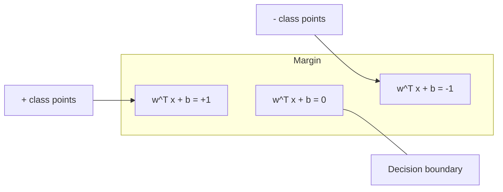
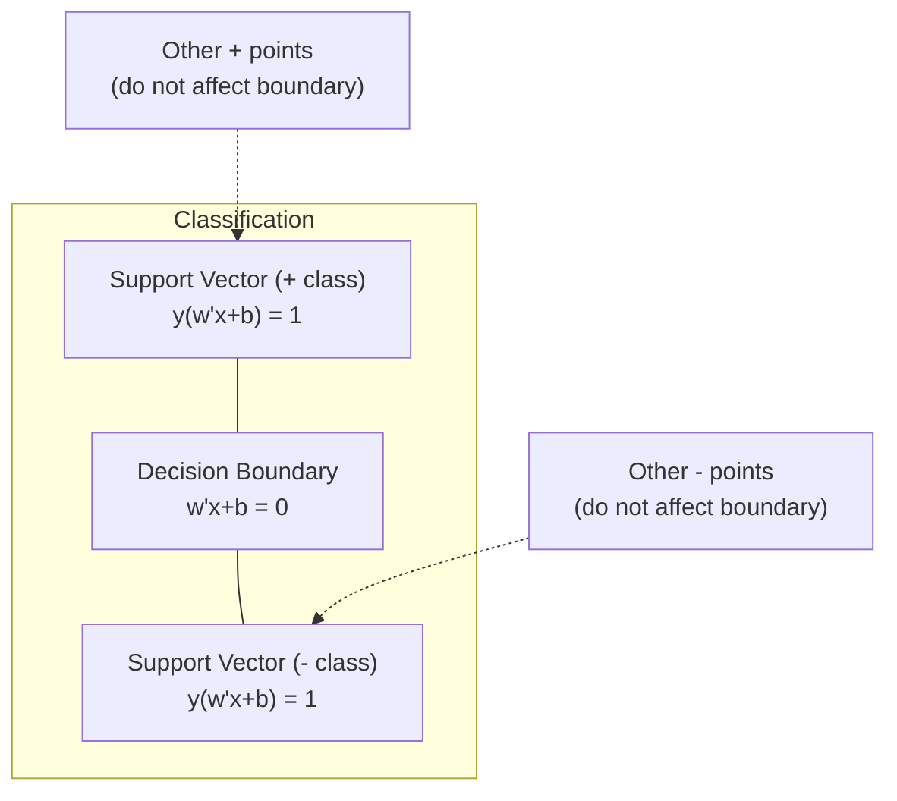
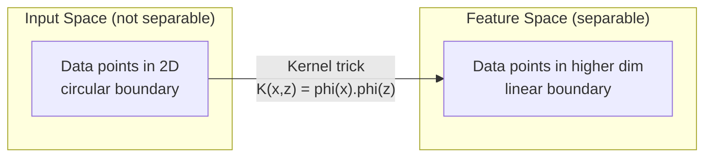

# Máquinas de apoio de vetores
# 支持向量机 (SVM)


> Encontrar a rua mais larga entre duas classes.

> Encontrar a rua mais larga entre os dois tipos.

**Type:** Build | **类型：** 构建
**Language:**O Python .**语言：**Python
**Prerequisites:** Phase 1 (Lessons 08 Optimization, 14 Norms and Distances, 18 Convex Optimization) | **前置知识：** Phase 1（第 8 课优化、第 14 课范数与距离、第 18 课凸优化）
**Time:** ~90 minutes | **时间：** 约 90 分钟

## Objetivos de aprendizagem

- Implementar um SVM linear a partir do zero usando perda de biscoitos e descida de gradiente na formulação primária
  Em forma original, a utilização de conjuntos de perda e gradiente diminuiu de zero para realizar SVM linear
- Explicar o princípio da margem máxima e identificar vetores de apoio de um modelo treinado
  解释最大间隔原理,并从训练好的模型中识别支持向量
- Comparar kernels lineares, polinômios e RBF e explicar como o truque do kernel evita mapeamento explícito em alta dimensão
  Comparar nucleo linear, multi-atomico e nucleo RBF, explicar como técnicas nucleares evitarem o desenrolar de grandes dimensões
- Avaliação da compensação controlada pelo parâmetro C entre largura de margem e erros de classificação
   avaliar o balanço entre a largura de intervalo e o erro de classificação do controlo de C 


> **【中文解读】**
> SVM 找到最大间隔的分类边界――核技巧让 SVM 在高维空间处理非线性问题直观理解就是升维后再切分――sklearn 中的 SVC/SVR──文本分类、图像识别中曾广泛使用──

> **【拓展：SVM 在深度学习时代仍然重要的场景】**
> O SVM em pequenos dados (de cem a mil amostras) continua a ser superior ao aprendizado profundo. O Google usa o SVM em linha no início do lixo.

## O problema é o problema da introdução

Você tem duas classes de pontos de dados e precisa desenhar uma linha (ou hiperplano) separando-os. infinitamente muitas linhas poderiam funcionar. Qual você deve escolher?

> Você tem dois tipos de pontos de dados, precisa desenhar uma linha (ou superplano) para separá-los.

A margem é a distância entre o limite de decisão e os pontos de dados mais próximos em cada lado. Uma margem mais ampla significa que o classificador é mais confiante e generaliza melhor os dados invisíveis.

> 间隔最大的那条──间隔是决策边界到每一侧近数据点的距离──宽的间隔意味着分类器更有信心,对未见数据的泛化能力更好──

Esta intuição leva a Support Vector Machines, um dos algoritmos mais matematicamente elegantes do ML. Os SVM eram o método de classificação dominante antes da aprendizagem profunda e continuam sendo a melhor escolha para pequenos conjuntos de dados, dados de alta dimensão e problemas em que você precisa de um modelo de princípios bem compreendido com garantias teóricas.

> Esta intuição levou a um dos algoritmos mais elegantes da matemática do MLM. O SVM foi o principal método de classificação antes da aprendizagem em profundidade, e ainda é a melhor escolha para os problemas de pequenos conjuntos de dados, grandes dados e necessidades de garantia teórica.

Os SVM se conectam diretamente à Fase 1: a otimização é convexa (Lessão 18), a margem é medida com normas (Lessão 14), e o truque do kernel explora produtos de pontos para lidar com fronteiras não lineares sem nunca computação no espaço de alta dimensão.

> O SVM e a Fase 1 estão diretamente relacionados: optimização é de constrangimento (§ 18), intervalos de quantidade de quantidades de quantidades (§ 14), técnicas nucleares utilizam pontos de processamento de fronteiras não-lineares e não precisam ser calculadas em alto espaço.

> **【中文解读】**
> O conceito central do SVM é: entre as linhas diretas de dados que podem ser separadas, escolher o ponto de maior intervalo entre os dados mais distantes.

## O conceito central.

### Classificador de margem máxima

Dados dados linearmente separaveis com rótulos y_i em {-1, +1} e vetores de características x_i, queremos um hiperplano w^T x + b = 0 que separa as classes.

> 给定标签 y_i 为 {-1, +1} 线性可分数据和特征向量 x_i, nós precisamos de uma superplano w^T x + b = 0 para separar a classe。

A distância de um ponto x_i para o hiperplano é:

> Pontos x_i até a distância do superplano são:

```
distance = |w^T x_i + b| / ||w||
```

Para um ponto corretamente classificado: y_i * (w^T x_i + b) > 0. A margem é o dobro da distância do hiperplano ao ponto mais próximo de ambos os lados.

> 对于正确分类的点:y_i * (w^T x_i + b) > 0──间隔是超平面到两侧近点距离的两倍──



O problema da otimização:

> 优化问题:

```
maximize    2 / ||w||     (the margin width)
subject to  y_i * (w^T x_i + b) >= 1  for all i
```

Igualmente (a minimizar o desempenho é mais fácil de otimizar):

> É preciso que o preço seja reduzido para o preço de venda.

```
minimize    (1/2) ||w||^2
subject to  y_i * (w^T x_i + b) >= 1  for all i
```

Este é um programa quadrático convexo. Ele tem uma solução global única. Os pontos de dados que estão exatamente nos limites da margem (onde y_i * (w^T x_i + b) = 1) são os vetores de suporte. Eles são os únicos pontos que determinam o limite de decisão. Mover ou remover qualquer ponto não-suporte-vetor, e o limite não muda.

> É um problema de planejamento de forma secundária. Ele tem uma solução única e completa. Por acaso, os pontos de dados estão localizados na fronteira de intervalo.

### Vectores de apoio: os poucos críticos



A maioria dos pontos de treinamento são irrelevantes. Somente os vetores de suporte são importantes. É por isso que os SVM são eficientes na memória no tempo de previsão: você só precisa armazenar os vetores de suporte, não todo o conjunto de treinamento.

> A maioria dos pontos de treinamento é irrelevante. Só o support vector funciona. É por isso que o SVM é altamente eficiente na previsão: você só precisa armazenar o support vector, e não o conjunto de treinamento inteiro.

O número de vetores de suporte também dá um limite no erro de generalização.

> O número de toros de apoio também dá a linha superior do erro de generalização. Com relação ao tamanho do conjunto de dados, o menor toros de apoio significa que a generalização é melhor.

### Margem suave: ruído de manipulação com o parâmetro C

Os dados reais raramente são perfeitamente separaveis. Alguns pontos podem estar no lado errado da fronteira, ou dentro da margem. A formulação de margem macia permite violações introduzindo variáveis de folga.

> Os dados reais são poucos e podem ser completamente identificados. Alguns pontos podem estar em erro de um lado da fronteira, ou em intervalos.

```
minimize    (1/2) ||w||^2 + C * sum(xi_i)
subject to  y_i * (w^T x_i + b) >= 1 - xi_i
            xi_i >= 0  for all i
```

A variável de flexibilidade xi_i mede a quantidade de violação do ponto i da margem.

> 松变量 xi_i 衡点 i 违反间隔的程度──C 控制权衡:

| C value | Behavior |
|---------|----------|
| Large C | Penalizes violations heavily. Narrow margin, fewer misclassifications. Overfits |
| Small C | Allows more violations. Wide margin, more misclassifications. Underfits |

| C 值 | 行为 |
|------|------|
| 大 C | 严重惩罚违规。窄间隔，较少误分类。易过拟合 |
| 小 C | 允许更多违规。宽间隔，较多误分类。易欠拟合 |

C é a força de regularização, invertida. C maior = menos regularização. C menor = mais regularização.

> C é a força de reversão de reversão. C é maior ou menor.

### Perda de barriga: função de perda de SVM

O SVM de margem suave pode ser reescriturado como uma otimização sem restrições:

> 软间隔 SVM pode ser reescriturado para ótimalização sem restrições:

```
minimize    (1/2) ||w||^2 + C * sum(max(0, 1 - y_i * (w^T x_i + b)))
```

O termo max(0, 1 - y_i * f(x_i)) é a perda de biscoito. É zero quando o ponto é corretamente classificado e além da margem. É linear quando o ponto está dentro da margem ou classificado erroneamente.

> 项 max(0, 1 - y_i * f(x_i)) é o ponto de perda de página.

```
Hinge loss for a single point:

loss
  |
  | \
  |  \
  |   \
  |    \
  |     \_______________
  |
  +-----|-----|-------->  y * f(x)
       0     1

Zero loss when y*f(x) >= 1 (correctly classified, outside margin).
Linear penalty when y*f(x) < 1.
```

Comparar com a perda logística (regressão logística):

> Comparar com a perda lógica de regresso:

```
Hinge:     max(0, 1 - y*f(x))          Hard cutoff at margin
Logistic:  log(1 + exp(-y*f(x)))        Smooth, never exactly zero
```

A perda de engarrafamento produz soluções escassas (apenas os vetores de suporte têm contribuição não zero). A perda logística usa todos os pontos de dados.

> 合页损失产生稀疏解(只有支持向量有非零贡献) ――Logical loss use all data points―, o que permite que o SVM economise mais na previsão―,

### Treinamento de um SVM linear com descida de gradiente

Você pode treinar um SVM linear usando descida de gradiente na perda de cartilagem mais regularização L2, sem resolver o QP restrito:

> Você pode usar o treinamento de graduação e descida no L2 normal.

```
L(w, b) = (lambda/2) * ||w||^2 + (1/n) * sum(max(0, 1 - y_i * (w^T x_i + b)))

Gradient with respect to w:
  If y_i * (w^T x_i + b) >= 1:  dL/dw = lambda * w
  If y_i * (w^T x_i + b) < 1:   dL/dw = lambda * w - y_i * x_i

Gradient with respect to b:
  If y_i * (w^T x_i + b) >= 1:  dL/db = 0
  If y_i * (w^T x_i + b) < 1:   dL/db = -y_i
```

Esta é chamada de formulação primária. Ela é executada em O ((n * d) por época, onde n é o número de amostras e d é o número de características. Para dados grandes, escassos e de alta dimensão (classificação de texto), isso é rápido.

> É chamado de forma original. O tempo de execução de cada rodada é de O (n * d), sendo n o número de amostras, d o número de características.

> **【中文解读】**
> 合页损失 (Hinge Loss) é a função de perda central do SVM: quando a amostra é correta e dividida e perdida fora do espaço, a perda é 0, caso contrário, punição linear. Diferente do que o logico regresso, a perda de página produz perda rara.

### A dupla formulação e o truque do núcleo

O duplo Lagrangiano do problema SVM (a partir da lição de fase 1, condições KKT) é:

> O problema da SVM 拉格朗日对偶 (de Fase 1 第 18 课 KKT 条件) é:

```
maximize    sum(alpha_i) - (1/2) * sum_ij(alpha_i * alpha_j * y_i * y_j * (x_i . x_j))
subject to  0 <= alpha_i <= C
            sum(alpha_i * y_i) = 0
```

O dual envolve apenas produtos de pontos x_i. x_j entre pontos de dados. Esta é a visão chave. Substitua cada produto de pontos com uma função do kernel K(x_i, x_j) e o SVM pode aprender limites não lineares sem nunca calcular explicitamente a transformação.

> Para forma ocasional, apenas envolve pontos de ponto entre os pontos de dados x_i. x_j. É um insight fundamental.

```
Linear kernel:      K(x, z) = x . z
Polynomial kernel:  K(x, z) = (x . z + c)^d
RBF (Gaussian):     K(x, z) = exp(-gamma * ||x - z||^2)
```

O kernel RBF mapeia dados em um espaço de dimensões infinitas. Os pontos que estão próximos no espaço de entrada têm valor do kernel perto de 1.

> RBF núcleo irá mapear dados para o espaço infinito.



O truque do kernel calcula o produto de pontos no espaço de alta dimensão sem nunca ir lá. Para o kernel polinômico de grau d em dimensões D, o espaço de características explícito tem dimensões O(D^d. Mas K(x, z) é calculado em tempo O(D).

> 核技巧在高维空间中计算点积而无需实际到达那里──对于 D 维中的 d 次多项式核,显式特征空间有 O  D 维──但 K  X, z   时间计算──

> **【中文解读】**
> 核技巧是SVM 最优雅的数学贡献――对偶形式只涉及数据点之间的点积 x_i · x_j,将其替换为核函数 K(x_i, x_j) 即可在高维(甚至无限维)空间中学习非线性边界,而无需显式计算高维映射──RBF 核将数据映射到无限维空间,能学习任意光滑的决策边缘──计算开销:多项式核的式特征空间有多维度,但核函数只需要多维度,但核函数只需要多维度,但核函数只需要多维度,时间――

> **【拓展：核技巧的思想在现代 AI 中的延续】**
> O conceito central do tecnculo nuclear é "computar similaridade em alto espaço e não mapear claramente" e é similar ao mecanismo de atenção do transformador.

### MPS para regressão (MPS)

O VECTOR DE SUPPORT regressão encaixa um tubo de largura epsilon em torno dos dados. Os pontos dentro do tubo têm perda zero. Os pontos fora do tubo são penalizados linearmente.

> 支持向量回归在数据周围拟合一个宽度为 epsilon的管道──管道内的点损失为零──管道外的点被线性惩罚──

```
minimize    (1/2) ||w||^2 + C * sum(xi_i + xi_i*)
subject to  y_i - (w^T x_i + b) <= epsilon + xi_i
            (w^T x_i + b) - y_i <= epsilon + xi_i*
            xi_i, xi_i* >= 0
```

O parâmetro epsilon controla a largura do tubo. tubo mais amplo = menos vetores de apoio = ajuste mais liso. tubo mais estreito = mais vetores de apoio = ajuste mais apertado.

> Epsilon parâmetros de controle de tubo largura── maior tubo amplo = menor torção de apoio = menor torção de planeamento── menor tubo amplo = menor torção de apoio = menor torção de apoio──

### Por que os SVM perderam para a aprendizagem profunda (e quando ainda ganham)

Os SVM dominaram a ML desde o final dos anos 1990 até o início dos anos 2010.

> SVM dominou o ML em 20 anos, de 90 anos ao início de 2010, por:

| Factor | SVMs | Deep learning |
|--------|------|---------------|
| Feature engineering | Requires it | Learns features |
| Scalability | O(n^2) to O(n^3) for kernel | O(n) per epoch with SGD |
| Image/text/audio | Needs handcrafted features | Learns from raw data |
| Large datasets (>100k) | Slow | Scales well |
| GPU acceleration | Limited benefit | Massive speedup |

| 因素 | SVM | 深度学习 |
|------|-----|---------|
| 特征工程 | 需要手动 | 自动学习 |
| 可扩展性 | 核方法 O(n^2) 到 O(n^3) | SGD 每轮 O(n) |
| 图像/文本/音频 | 需要手工特征 | 从原始数据学习 |
| 大数据集（>10 万） | 较慢 | 扩展性好 |
| GPU 加速 | 有限收益 | 大幅提速 |

Os SVM ainda ganham nestas situações:
- Pequenas datas (centenas a milhares de amostras)
  小数据集 ((100 a milhares de amostras)
- Dados escassos de alta dimensão (texto com características TF-IDF)
  高维稀疏数据 (F-IDF características do texto)
- Quando precise de garantias matemáticas (limite de margem)
  需要数学保证时(间隔边界)
- Quando o tempo de formação deve ser mínimo (o SVM linear é muito rápido)
  O tempo de treinamento tem de ser o mais curto.
- Classificação binária com estrutura de margem clara
  具有清晰间隔结构的二分类
- Detecção de anomalias (SVM de uma classe)
  异常检测(单类 SVM)

> SVM em circunstâncias seguintes ainda venceu:

## Construí-lo e realizei-o.
```figure
svm-margin
```

## Construí-lo

### Passo 1: perda de barras e gradiente

Calcule a perda de biscoitos para um lote e a sua gradiência.

> Base: cálculo da perda de um conjunto de dados e sua gradiência.

```python
def hinge_loss(X, y, w, b):
    n = len(X)
    total_loss = 0.0
    for i in range(n):
        margin = y[i] * (dot(w, X[i]) + b)  # 计算样本到决策边界的函数间隔
        total_loss += max(0.0, 1.0 - margin)  # 合页损失：间隔 < 1 时才有惩罚
    return total_loss / n  # 返回平均损失
```

### Passo 2: SVM linear através da descida de gradiente

Treinar minimizando a perda de biscoitos regulares.

> 通過最小化正则化合物损失訓練──無需 QP 求解器──

```python
class LinearSVM:
    def __init__(self, lr=0.001, lambda_param=0.01, n_epochs=1000):
        self.lr = lr  # 学习率
        self.lambda_param = lambda_param  # 正则化参数（对应 1/C）
        self.n_epochs = n_epochs
        self.w = None  # 权重向量
        self.b = 0.0  # 偏置

    def fit(self, X, y):
        n_features = len(X[0])
        self.w = [0.0] * n_features
        self.b = 0.0

        for epoch in range(self.n_epochs):
            for i in range(len(X)):
                margin = y[i] * (dot(self.w, X[i]) + self.b)  # 函数间隔
                if margin >= 1:
                    # 样本在间隔之外，只需正则化梯度
                    self.w = [wj - self.lr * self.lambda_param * wj
                              for wj in self.w]
                else:
                    # 样本在间隔内或被误分类，需要额外的损失梯度
                    self.w = [wj - self.lr * (self.lambda_param * wj - y[i] * X[i][j])
                              for j, wj in enumerate(self.w)]
                    self.b -= self.lr * (-y[i])

    def predict(self, X):
        return [1 if dot(self.w, x) + self.b >= 0 else -1 for x in X]  # 根据符号预测类别
```

### Passo 3: Funções do núcleo

Implementar núcleos lineares, polinômios e RBF.

> 实现线性核、多项式核和 RBF 核──

```python
def linear_kernel(x, z):
    return dot(x, z)  # 线性核：直接点积

def polynomial_kernel(x, z, degree=3, c=1.0):
    return (dot(x, z) + c) ** degree  # 多项式核：(x·z + c)^d

def rbf_kernel(x, z, gamma=0.5):
    diff = [xi - zi for xi, zi in zip(x, z)]  # 计算差向量
    return math.exp(-gamma * dot(diff, diff))  # RBF 核：exp(-γ||x-z||²)
```

### Passo 4: Identificação de margens e vetores de apoio

Após o treino, identifique quais pontos são vetores de apoio e calcule a largura da margem.

>                                                                                                                                                                                                                                                               

```python
def find_support_vectors(X, y, w, b, tol=1e-3):
    support_vectors = []
    for i in range(len(X)):
        margin = y[i] * (dot(w, X[i]) + b)
        if abs(margin - 1.0) < tol:
            support_vectors.append(i)
    return support_vectors
```

Veja .`code/svm.py`para a implementação completa com todas as demonstrações.

> 完整实现(含所有演示) See `code/svm.py`- Não.

## Use-o com o framework implementado.

> **【中文解读】**
> O sistema de dados de base de dados (SVM) é um sistema de dados de base de dados (SVM) que é utilizado para controlar a gama de dados de base de dados (RBF) em um determinado período de tempo.

Com a aprendizagem de escikit:

> Utilize scikit-learn:

```python
from sklearn.svm import SVC, LinearSVC, SVR
from sklearn.preprocessing import StandardScaler
from sklearn.pipeline import Pipeline

# 标准化 + SVM 的标准管线
clf = Pipeline([
    ("scaler", StandardScaler()),  # 标准化是 SVM 的必选项
    ("svm", SVC(kernel="rbf", C=1.0, gamma="scale")),  # RBF 核 SVM
])
clf.fit(X_train, y_train)
print(f"Accuracy: {clf.score(X_test, y_test):.4f}")
print(f"Support vectors: {clf['svm'].n_support_}")
```

Importante: sempre escalar as suas características antes de treinar um SVM. Os SVM são sensíveis às magnitudes das características porque a margem depende de que as características não escaladas distorçam a geometria.

> importante: treinar SVM                                                                                                                                                                                                                                                           

Para grandes conjuntos de dados, use `LinearSVC`(formulação primária, O ((n) por época) em vez de `SVC`(formulação dupla, O ((n^2) a O ((n^3)):

> 对于大数据集,使用 `LinearSVC`(原始形式,每轮 O ((n)) em vez de `SVC`(para forma ocasional, O(n^2) até O(n^3)):

```python
from sklearn.svm import LinearSVC

clf = Pipeline([
    ("scaler", StandardScaler()),
    ("svm", LinearSVC(C=1.0, max_iter=10000)),
])
```

## Exercícios.

1. Gerar um conjunto de dados linearmente separável em 2D. Treinar o seu LinearSVM e identificar os vetores de suporte. Verificar que os vetores de suporte são os pontos mais próximos do limite de decisão.
   1. O que é um dos principais pontos de desenvolvimento de um sistema de controle de dados de um sistema de controle de dados de um sistema de controle de dados de um sistema de controle de dados de um sistema de controle de dados de um sistema de controle de dados de um sistema de controle de dados de um sistema de controle de dados de um sistema de controle de dados de um sistema de controle de dados de um sistema de controle de dados de um sistema de controle de dados de um sistema de controle de dados de um sistema de controle de dados de um sistema de controle de dados de um sistema de controle de dados de um sistema de controle de dados de um sistema de controle de dados de um sistema de controle de dados de um sistema de controle de dados de um sistema de controle de dados de um sistema de controle de dados de dados de um sistema de controle de dados de dados de um sistema de controle de dados de dados de dados de um sistema de controle de dados de dados de dados de dados de um sistema de controle de dados de dados de dados de dados de um sistema de controle de dados de dados de dados de dados de dados de um sistema de dados de dados de dados de dados de um sistema de dados de dados de dados de um sistema de dados de dados de dados de um sistema de dados de dados de dados de um sistema de dados de dados de dados de um sistema de dados de dados de dados de um sistema de dados de dados de um sistema de dados de dados de um sistema de dados de dados de um sistema de dados de dados de dados de dados de um sistema de dados de computador de computador de computador de computador de computador de computador de computador de computador de computador de computador de computador de computador de computador de computador de computador de computador de computador de computador de computador de computador de computador de computador de computador de computador de computador de computador de computador de computador de computador de computador de computador de computador de computador de computador de computador de computador de computador de computador de computador de computador de computador de computador de computador de computador de computador de computador de computador de computador de computador de computador de computador de computador de computador de computador de computador de computador de computador de computador de computador de computador de computador de computador de computador de comput

2. Varia C de 0,001 a 1000 em um conjunto de dados barulhentos. Descreva o limite de decisão para cada valor C. Observe a transição de margem larga (sub-ajustamento) para margem estreita (over-ajustamento).
   2. Em um conjunto de dados de ruído, C varia de 0,001 para 1000.

3. Crie um conjunto de dados onde os limites das classes sejam circulares (não lineares). Mostre que um SVM linear falha. Compute a matriz do kernel RBF e mostre que as classes se tornam separáveis no espaço de recursos induzido pelo kernel.
   3.  criar um conjunto de dados de uma classe de fronteiras para o círculo ((nonlinear) ∞ mostrando a SVM linear  fracassar ∞ calcular RBF 矩阵, mostrando características induzidas pelo núcleo ∞

4. Compare perda de biscoito vs perda logística no mesmo conjunto de dados. Treinar um SVM linear e regressão logística. Contar quantos pontos de treinamento contribuem para o limite de decisão de cada modelo (vectores de suporte vs todos os pontos).
   4. Em comparação com o mesmo conjunto de dados, a perda de dados e a perda lógica foram comparadas.

5. Implementar SVR (perda insensível ao epsilon). Ajuste-o a y = sin(x) + ruído. Planeje o tubo de epsilon em torno das previsões e destaque os vetores de suporte (pontos fora do tubo).
   5. 实现 SVR(epsilon 不敏感损失) ・拟合 y = sin(x) + ruído。绘制预测周围的epsilon 管道并标记支持向量(管道外的点)。

## Termos-chave .

| Term | What it actually means |
|------|----------------------|
| Support vectors | The training points closest to the decision boundary. The only points that determine the hyperplane |
| Margin | The distance between the decision boundary and the nearest support vectors. SVMs maximize this |
| Hinge loss | max(0, 1 - y*f(x)). Zero when correctly classified and outside the margin. Linear penalty otherwise |
| C parameter | Trade-off between margin width and classification errors. Large C = narrow margin, small C = wide margin |
| Soft margin | SVM formulation that allows margin violations via slack variables. Handles non-separable data |
| Kernel trick | Computing dot products in a high-dimensional feature space without explicitly mapping to that space |
| Linear kernel | K(x, z) = x . z. Equivalent to standard dot product. For linearly separable data |
| RBF kernel | K(x, z) = exp(-gamma * \|\|x-z\|\|^2). Maps to infinite dimensions. Learns any smooth boundary |
| Polynomial kernel | K(x, z) = (x . z + c)^d. Maps to a feature space of polynomial combinations |
| Dual formulation | Reformulation of the SVM problem that depends only on dot products between data points. Enables kernels |
| SVR | Support Vector Regression. Fits an epsilon-tube around the data. Points inside the tube have zero loss |
| Slack variables | xi_i: measures how much a point violates the margin. Zero for correctly classified points outside margin |
| Maximum margin | The principle of choosing the hyperplane that maximizes the distance to the nearest points of each class |

## Mais leitura 延伸阅读

- [Vapnik: The Nature of Statistical Learning Theory (1995)](https://link.springer.com/book/10.1007/978-1-4757-3264-1)- o texto fundamental sobre os MSS e a aprendizagem estatística
  [Vapnik: The Nature of Statistical Learning Theory (1995)](https://link.springer.com/book/10.1007/978-1-4757-3264-1)- Livros fundamentais da teoria do SVM e da
- [Cortes & Vapnik: Support-vector networks (1995)](https://link.springer.com/article/10.1007/BF00994018)- o papel original do SVM
  [Cortes & Vapnik: Support-vector networks (1995)](https://link.springer.com/article/10.1007/BF00994018)- SVM 原始论文
- [Platt: Sequential Minimal Optimization (1998)](https://www.microsoft.com/en-us/research/publication/sequential-minimal-optimization-a-fast-algorithm-for-training-support-vector-machines/)- o algoritmo de gestão de dados que tornou prático o treinamento de dados de dados de dados
  [Platt: Sequential Minimal Optimization (1998)](https://www.microsoft.com/en-us/research/publication/sequential-minimal-optimization-a-fast-algorithm-for-training-support-vector-machines/)- Para tornar o treinamento de SVM prático
- [scikit-learn SVM documentation](https://scikit-learn.org/stable/modules/svm.html)- guia prático com detalhes de execução
  [scikit-learn SVM 文档](https://scikit-learn.org/stable/modules/svm.html)- 实用指南及实现细节
- [LIBSVM: A Library for Support Vector Machines](https://www.csie.ntu.edu.tw/~cjlin/libsvm/)- a biblioteca C++ por trás da maioria das implementações SVM
  [LIBSVM](https://www.csie.ntu.edu.tw/~cjlin/libsvm/)- A maioria dos SVM  implementar atrás de C++ 库
