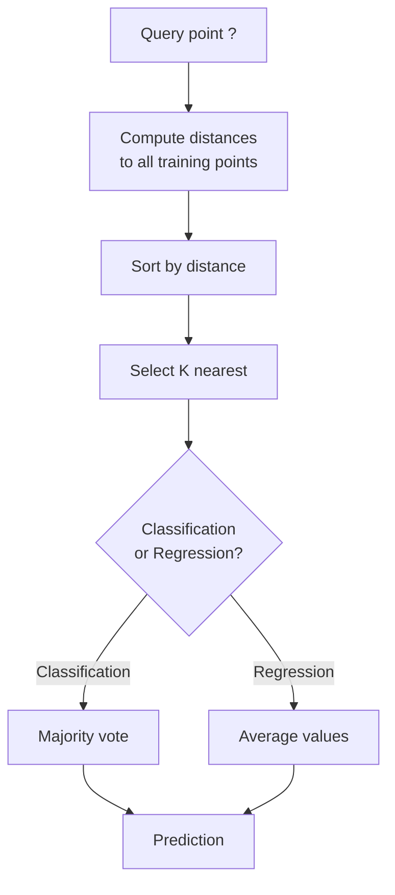
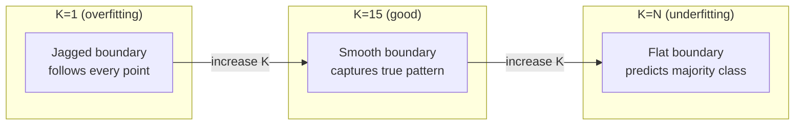
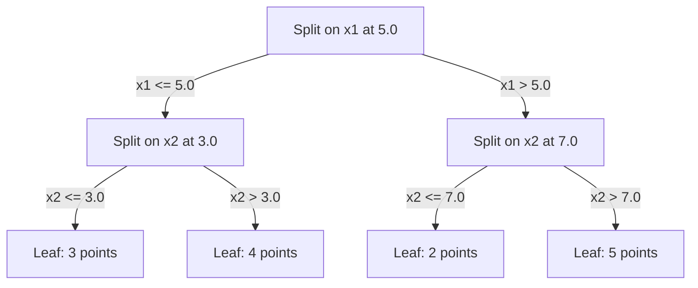

# K - Vizinhos e distâncias mais próximas
# K proximidade/distância


> Armazenar tudo, prever olhando para os vizinhos, o algoritmo mais simples que realmente funciona.

> 保存一切──预测时看邻居── o algoritmo mais simples, mas realmente eficaz──

**Type:** Build | **类型：** 构建
**Language:**O Python .**语言：**Python
**Prerequisites:** Phase 1 (Lesson 14 Norms and Distances) | **前置知识：** Phase 1（第 14 课范数与距离）
**Time:** ~90 minutes | **时间：** 约 90 分钟

## Objetivos de aprendizagem

- Implementar a classificação e a regressão KNN a partir do zero com K configurável e votação ponderada por distância
  A partir de zero, pode ser configurado K                                                                                                                                                                                                                                                                                                                                                                                                                                                                                                                    
- Comparar as métricas de distância L1, L2, cosino e Minkowski e selecionar a adequada para um determinado tipo de dados
  Comparar a medida de distância entre L1、L2、Ystrings e可夫斯基, para escolher a medida adequada para um determinado tipo de dados
- Explique a maldição da dimensionalidade e demonstre por que o KNN se degrada em espaços de alta dimensão
  Explicar a dimensão do desastre, demonstrar por que a KNN em alto nível de espaço desempenho diminuiu
- Construir uma árvore KD para pesquisa e análise eficiente do vizinho mais próximo quando superar a força bruta
  Construir um arvore de KD  fazer alta eficiência Pesquisa recente, análise


> **【中文解读】**
> O pensamento central da KNN é olhar para o seu próximo vizinho K, você pode prever o que é o seu tipo de sistema de recomendação.

> **【拓展：KNN 思想在现代 AI 中的广泛应用】**
> RAG(检索增强生成) 本质就是 KNN:将用户问题编码为向量,在向量数据库 (Pinecone、Milvus、FAISS) 中搜索 K 个最相似的文档片段,再将它们提供给 LLM 生成答──Spotify 音乐推 用近似近邻的近邻的使用;;ANN) 在数十亿首歌中找到相似的;Pinterest 图片搜索 用视觉嵌入 + KNN──KNN 的思想无处不在,只是数据结构和规模不同──

## O problema é o problema da introdução

Você tem um conjunto de dados. Um novo ponto de dados chega. Você precisa classificá-lo ou prever seu valor. Em vez de aprender parâmetros dos dados (como regressão linear ou SVMs), você apenas encontra os pontos de treinamento K mais próximos do novo ponto e deixa-os votar.

> Você tem um conjunto de dados. Um novo ponto de dados está chegando. Você precisa classificá-lo ou prever seu valor. Você não precisa aprender os parâmetros do dados, como regresso linear ou SVM, mas encontrar o K 个 treinamento mais próximo do novo ponto, deixá-los votar.

Não há fase de treinamento, não há parâmetros para aprender, não há função de perda para minimizar, você armazena todo o conjunto de treinamento e calcula as distâncias no tempo de previsão.

> É o K. Não há fase de treinamento. Não há necessidade de parâmetros de aprendizagem. Não há necessidade de função de perda de minimizar.

Parece muito simples para funcionar. Mas a KNN é surpreendentemente competitiva para muitos problemas, especialmente com conjuntos de dados pequenos e médios, e entendê-la revela profundamente conceitos fundamentais: a escolha da métrica de distância (conectando-se à lição 14 da fase 1), a maldição da dimensionalidade e a diferença entre aprendizagem preguiçosa e ansiosa.

> Parece muito simples, mas a KNN é extremamente competitiva em muitos problemas, especialmente para o pequeno conjunto de dados.

A KNN também aparece em todos os lugares na IA moderna, sob nomes diferentes. Base de dados vetoriais fazem pesquisa KNN em embebimentos. A geração aumentada de recuperação (RAG) encontra os blocos de documento mais próximos de K. Os sistemas de recomendação encontram usuários ou itens semelhantes. O algoritmo é o mesmo. A escala e as estruturas de dados são diferentes.

> A KNN está presente na IA moderna, apenas em nome diferente. A base de dados de massa está em embedida.

> **【中文解读】**
> KNN é um processo de "incerteza"  não há processo de treinamento, pré-conhecimento é apenas o cálculo de distância.

## O conceito central.

### Como funciona a KNN

Dado um conjunto de dados de pontos rotulados e um novo ponto de consulta:

>                                                                                                                                                                                                                                                                                                                                                                                                                                                                                                                              

1. Calcule a distância da consulta para cada ponto no conjunto de dados
    calcular a distância de cada ponto de consulta para o centro de dados
2. Classificação por distância
   按距离排序
3. Tome os pontos mais próximos de K
   取 K 个最近的点
4. Para classificação: voto majoritário entre os vizinhos K
   Categoria:A maioria dos vizinhos
5. Para regressão: média (ou média ponderada) dos valores dos vizinhos K
   归归任务:K 个邻居值的平均 (K 个邻居值的平均)



Não há encaixes, descida de gradiente, nenhuma época.

> É o algoritmo inteiro. Não há forma. Não há escala.

### Escolher K

K é o único hiperparâmetro.

> K é o único superparâmetro.

| K | Behavior |
|---|----------|
| K = 1 | Decision boundary follows every point. Zero training error. High variance. Overfits |
| Small K (3-5) | Sensitive to local structure. Can capture complex boundaries |
| Large K | Smoother boundaries. More robust to noise. May underfit |
| K = N | Predicts the majority class for every point. Maximum bias |

| K | 行为 |
|---|------|
| K = 1 | 决策边界跟随每个点。训练误差为零。高方差。过拟合 |
| 小 K (3-5) | 对局部结构敏感。能捕捉复杂边界 |
| 大 K | 更平滑的边界。对噪声更鲁棒。可能欠拟合 |
| K = N | 每个点都预测多数类。最大偏差 |

Um ponto de partida comum é K = sqrt(N) para um conjunto de dados de N pontos.

> 常用初始值是 K = sqrt(N)(N 为数据集大小)。二分类使用奇数 K 以避免平票。



### Metricas de distância

A função de distância define o que significa "quase". Diferentes métricas produzem vizinhos diferentes, previsões diferentes.

> A função distância define o significado de "quase". Diferentes medidas produzem diferentes vizinhos, diferentes previsões.

**L2 (Euclidean)**É o padrão.

> **L2（欧氏距离）**É um erro de escolha.

```
d(a, b) = sqrt(sum((a_i - b_i)^2))
```

Sensível à escala de características. Sempre padronize características antes de usar L2 com KNN.

> A utilização de L2 no KNN é essencial para a normalização de características.

**L1 (Manhattan)**A diferença de um ponto de vista de um ponto de vista de um ponto de vista de outro ponto é a diferença de um ponto de vista de outro ponto de vista de um ponto de vista de outro ponto de vista de um ponto de vista de outro ponto de vista de outro ponto de vista de outro ponto.

> **L1（曼哈顿距离）**Para o diferencial absoluto, é mais fácil que o L2, porque não é o diferencial quadrado.

```
d(a, b) = sum(|a_i - b_i|)
```

**Cosine distance**O que é essencial para o texto e a incorporação de dados.

> **余弦距离**∆ medir ângulos entre os volumes, ignorar a grandeza. ∆ é essencial para o texto e os dados embutidos.

```
d(a, b) = 1 - (a . b) / (||a|| * ||b||)
```

**Minkowski**generaliza L1 e L2 com o parâmetro p.

> **闵可夫斯基距离**Usando os parâmetros p                                                                                                                                                                                                                                                                                                                                                                                                                                                                                                                      

```
d(a, b) = (sum(|a_i - b_i|^p))^(1/p)

p=1: Manhattan
p=2: Euclidean
p->inf: Chebyshev (max absolute difference)
```

Qual métrica a utilizar depende dos dados:

> 选择哪种度取决于数据:

| Data type | Best metric | Why |
|-----------|------------|-----|
| Numeric features, similar scale | L2 (Euclidean) | Default, works for spatial data |
| Numeric features, outliers | L1 (Manhattan) | Robust, does not amplify large differences |
| Text embeddings | Cosine | Magnitude is noise, direction is meaning |
| High-dimensional sparse | Cosine or L1 | L2 suffers from curse of dimensionality |
| Mixed types | Custom distance | Combine metrics per feature type |

| 数据类型 | 最佳度量 | 原因 |
|---------|--------|------|
| 数值特征，量级相近 | L2（欧氏） | 默认选择，适合空间数据 |
| 数值特征，有异常值 | L1（曼哈顿） | 鲁棒，不放大大的差异 |
| 文本嵌入 | 余弦 | 大小是噪声，方向是含义 |
| 高维稀疏 | 余弦或 L1 | L2 受维度灾难影响 |
| 混合类型 | 自定义距离 | 按特征类型组合度量 |

### KNN ponderado

O KNN padrão dá o mesmo peso a todos os vizinhos K. Mas um vizinho na distância 0,1 deve importar mais do que um na distância 5.0.

> O KNN padrão atribui o mesmo peso a todos os vizinhos K, mas a distância de 0,1 vizinhos deve ser mais importante do que a distância de 5,0.

**Distance-weighted KNN**pesa cada vizinho inversamente pela distância:

> **距离加权 KNN**按距离的倒数加权每邻居:

```
weight_i = 1 / (distance_i + epsilon)

For classification: weighted vote
For regression:     weighted average = sum(w_i * y_i) / sum(w_i)
```

O epsilon impede a divisão por zero quando um ponto de consulta corresponde exatamente a um ponto de treinamento.

> Epsilon  prevenção de pontos de consulta perfeitamente correspondente

A KNN ponderada é menos sensível à escolha de K porque os vizinhos distantes contribuem muito pouco, independentemente.

> A KNN não é muito sensível à escolha de K, pois os vizinhos distantes, independentemente do valor de K, contribuem muito pouco.

### A maldição da dimensionalidade

O desempenho do KNN degrada-se em grandes dimensões.

> O desempenho de KNN em alta qualidade diminuiu. Não é uma preocupação, mas sim um fato matemático.

**Problem 1: distances converge.**À medida que a dimensionalidade aumenta, a relação entre a distância máxima e a distância mínima se aproxima de 1. Todos os pontos se tornam igualmente "longe" da consulta.

> **问题 1：距离趋同。**Com o aumento da dimensão, a relação entre a distância máxima e a distância mínima se aproxima de 1. Todos os pontos se transformam em pontos de consulta.

```
In d dimensions, for random uniform points:

d=2:    max_dist / min_dist = varies widely
d=100:  max_dist / min_dist ~ 1.01
d=1000: max_dist / min_dist ~ 1.001

When all distances are nearly equal, "nearest" is meaningless.
```

**Problem 2: volume explodes.**Para capturar os vizinhos K dentro de uma fração fixa dos dados, é necessário alargar o raio de busca para cobrir uma fração muito maior do espaço de características.

> **问题 2：体积爆炸。**Para capturar K 个邻居, em proporções fixas de dados, é necessário ampliar o meio de busca para uma maior proporção de espaço de características de cobertura.

**Problem 3: corners dominate.**Em um hipercubo unitário em dimensões d, a maior parte do volume é concentrada perto dos cantos, não no centro.

> **问题 3：角落主导。**Em d 维单位超立体, a maior parte do volume é concentrada perto do canto, e não no centro. Com o crescimento, a proporção de volume que contém os quadrados em torno de um esfera tende a ser quase zero.

Consequência prática: o KNN funciona bem até cerca de 20 a 50 características. Além disso, você precisa de redução de dimensão (PCA, UMAP, t-SNE) antes de aplicar o KNN, ou você precisa usar estruturas de pesquisa baseadas em árvores que exploram a dimensão inferior intrínseca dos dados.

> 实际后果:KNN 在约 20-50 个特征下面效果好――超过这个范围,需要在应用KNN 前进行降维(PCA、UMAP、t-SNE),或使用数据内在低维度树搜索结构──

### Árvores KD: busca rápida do vizinho mais próximo

A força bruta KNN calcula a distância da consulta a cada ponto de treinamento. Isto é O(n * d) por consulta. Para grandes conjuntos de dados, isso é muito lento.

> 暴力 KNN 计算查询点到每个训练点的距离――每次查询 O(n * d) ―― para o big data set é muito lento――

Uma árvore KD divide recursivamente o espaço ao longo de eixos de características.

> KD 树沿特征轴递归划分空间―― cada camada along a um dimensiones em centro de valores está dividida――



Para encontrar o vizinho mais próximo, atravesse a árvore até a folha que contém a consulta, depois retrocede e verifique as partições vizinhas apenas se elas puderem conter pontos mais próximos.

> Para encontrar o vizinho mais próximo, percorrer a árvore até o ponto de consulta, e depois voltar e apenas em um ponto de consulta mais próximo.

Tempo médio de consulta: O(log n) para dimensões baixas. Mas os árvores KD degradam para O(n) em dimensões altas (d > 20) porque o retrocesso elimina cada vez menos ramos.

> 低维平均查询时间:O(log n) ・・・ mas KD 树在高维(d > 20) 时退化为O(n),因为回溯消除的分支越来越少──

### Árvores de bola: melhor para dimensões moderadas

As árvores de bolas dividem os dados em hiperesferas aninhadas em vez de caixas alinhadas com eixo. Cada nó define uma bola (centro + raio) que contém todos os pontos nessa subárvore.

> O arco-bola dividirá os dados em super-esferas em conjunto e não em caixas em conjunto. Cada ponto define um arco-bola que contém o centro do arco-bola.

Vantagens em relação às árvores KD:
- Funcionam melhor em dimensões moderadas (até ~50)
  Em média, a temperatura é de 50°C.
- Manutenção de estruturas não alinhadas com eixos
  能处理 não-axial à estrutura
- Volumes mais estreitos significam que mais ramos são podados durante a busca
  Mais perto do cerco significa que a busca corta mais ramos

Tanto as árvores KD como as árvores de bolas são algoritmos exatos. Para pesquisas realmente em grande escala (milhões de pontos, centenas de dimensões), são usados métodos próximos aproximados (HNSW, IVF, quantização de produtos).

> KD 树和球树都是精确算法──对于真正的大规模搜索 (((百万点、数百维),使用近似近邻方法 (((HNSW、IVF、乘积量化)──这些在第一阶段第14课中讨论──

### Aprendizagem preguiçosa vs aprendizagem ansiosa

A KNN é um aprendiz preguiçoso: não funciona no tempo de treinamento e tudo funciona no tempo de previsão. A maioria dos outros algoritmos (regressão linear, SVM, redes neurais) são aprendizes ansiosos: eles fazem computações pesadas no tempo de treinamento para construir um modelo compacto, então as previsões são rápidas.

> KNN é um aprendiz inerte: quando se treina não faz nenhum trabalho, todos os trabalhos são feitos quando se prevê. A maioria dos outros algoritmos (linear regresso, SVM, rede de neurônios) é um aprendiz ativo: quando se treina faz grandes quantidades de cálculos, construem modelos e prevê rapidamente.

| Aspect | Lazy (KNN) | Eager (SVM, neural net) |
|--------|------------|------------------------|
| Training time | O(1) just store data | O(n * epochs) |
| Prediction time | O(n * d) per query | O(d) or O(parameters) |
| Memory at prediction | Store entire training set | Store model parameters only |
| Adapts to new data | Add points instantly | Retrain the model |
| Decision boundary | Implicit, computed on the fly | Explicit, fixed after training |

| 方面 | 懒惰学习 (KNN) | 积极学习 (SVM, 神经网络) |
|------|---------------|------------------------|
| 训练时间 | O(1) 仅存储数据 | O(n * epochs) |
| 预测时间 | 每次查询 O(n * d) | O(d) 或 O(参数) |
| 预测时内存 | 存储整个训练集 | 仅存储模型参数 |
| 适应新数据 | 即时添加点 | 重新训练模型 |
| 决策边界 | 隐式，即时计算 | 显式，训练后固定 |

Aprender preguiçoso é ideal quando:
- O conjunto de dados muda frequentemente (adicionar/retirar pontos sem reformulação)
  Número de dados (também chamado de número de dados)
- Precisas de previsões para poucas perguntas.
  Só preciso fazer uma previsão com poucas perguntas.
- Queres tempo de treino zero.
  需要零训练时间
- O conjunto de dados é pequeno o suficiente para que a busca de força bruta seja rápida
  Número de dados é pequeno, violento

> 惰学习在以下情况最理想:

### KNN para regressão

Em vez de votar em maioria, o KNN para regressão media os valores-alvo dos vizinhos K.

> A KNN regressa não a maioria dos votos, mas a média de valores de objetivos de K 个邻居.

```
prediction = (1/K) * sum(y_i for i in K nearest neighbors)

Or with distance weighting:
prediction = sum(w_i * y_i) / sum(w_i)
where w_i = 1 / distance_i
```

A regressão KNN produz previsões de constante por peça (ou suave por peça com ponderação).

> O KNN regresso produz dividendo frequência ([[0-100]]), o KNN nunca prevê 200[6].

> **【中文解读】**
> O KNN regresso é usado como um valor de previsão. O KNN regresso não pode ser exposto se o valor de objetivo de treinamento estiver entre 0-100 e nunca poderá prever 200.

> **【拓展：大规模最近邻搜索——从 KNN 到 FAISS】**
> Quando a escala de dados cresceu de milhares para bilhões de vezes, o KNN 搜索太慢──Meta 开源的FAISS 库使用乘积量化(PQ) 和倒排文件索引(IVF), realizou milênio de segundos de busca em 10 mil milhões de volumes. HNSW(分层可导航小世界图) é outro algoritmo popular, utilizado pela Elasticsearch 和 Milvus.

## Construí-lo e realizei-o.
```figure
knn-smoothness
```

## Construí-lo

### Passo 1: Funções de distância

Implementar as distâncias L1, L2, cosino e Minkowski.

> ∞ ∞ ∞ ∞ ∞ ∞ ∞ ∞ ∞ ∞ ∞ ∞ ∞ ∞ ∞ ∞ ∞ ∞ ∞ ∞ ∞ ∞ ∞ ∞ ∞ ∞ ∞ ∞ ∞ ∞ ∞ ∞ ∞ ∞ ∞ ∞ ∞ ∞ ∞ ∞ ∞ ∞ ∞ ∞ ∞ ∞ ∞ ∞ ∞ ∞ ∞ ∞ ∞ ∞ ∞ ∞ ∞ ∞ ∞ ∞ ∞ ∞ ∞ ∞ ∞ ∞ ∞ ∞ ∞ ∞ ∞ ∞ ∞ ∞ ∞ ∞ ∞ ∞ ∞ ∞ ∞ ∞ ∞ ∞ ∞ ∞ ∞ ∞ ∞ ∞ ∞ ∞ ∞ ∞ ∞ ∞ ∞ ∞ ∞ ∞ ∞ ∞ ∞ ∞ ∞ ∞ ∞ ∞ ∞ ∞ ∞ ∞ ∞ ∞ ∞ ∞ ∞ ∞ ∞ ∞ ∞ ∞ ∞ ∞ ∞ ∞ ∞ ∞ ∞ ∞ ∞ ∞ ∞ ∞ ∞ ∞ ∞ ∞ ∞ ∞ ∞ ∞ ∞ ∞ ∞ ∞ ∞ ∞ ∞ ∞ ∞ ∞ ∞ ∞ ∞ ∞ ∞ ∞ ∞ ∞ ∞ ∞ ∞ ∞ ∞ ∞ ∞ ∞ ∞ ∞ ∞ ∞ ∞ ∞ ∞ ∞ ∞ ∞ ∞ ∞ ∞ ∞ ∞ ∞ ∞ ∞ ∞ ∞ ∞ ∞ ∞ ∞ ∞ ∞ ∞ ∞ ∞ ∞ ∞ ∞ ∞ ∞ ∞ ∞ ∞ ∞ ∞ ∞ ∞ ∞ ∞ ∞ ∞ ∞ ∞ ∞ ∞ ∞ ∞ ∞ ∞ ∞ ∞ ∞ ∞ ∞ ∞ ∞ ∞ ∞ ∞ ∞ ∞ ∞ ∞ ∞ ∞ ∞ ∞ ∞ ∞ ∞ ∞ ∞ ∞ ∞ ∞ ∞ ∞ ∞ ∞ ∞ ∞ ∞ ∞

```python
import math

def l2_distance(a, b):
    return math.sqrt(sum((ai - bi) ** 2 for ai, bi in zip(a, b)))  # 欧氏距离（L2 范数）

def l1_distance(a, b):
    return sum(abs(ai - bi) for ai, bi in zip(a, b))  # 曼哈顿距离（L1 范数）

def cosine_distance(a, b):
    dot_val = sum(ai * bi for ai, bi in zip(a, b))  # 点积
    norm_a = math.sqrt(sum(ai ** 2 for ai in a))  # 向量 a 的模
    norm_b = math.sqrt(sum(bi ** 2 for bi in b))  # 向量 b 的模
    if norm_a == 0 or norm_b == 0:
        return 1.0
    return 1.0 - dot_val / (norm_a * norm_b)  # 余弦距离 = 1 - 余弦相似度

def minkowski_distance(a, b, p=2):
    if p == float('inf'):
        return max(abs(ai - bi) for ai, bi in zip(a, b))  # p=∞ 时为切比雪夫距离
    return sum(abs(ai - bi) ** p for ai, bi in zip(a, b)) ** (1 / p)  # 闵可夫斯基距离
```

### Passo 2: Classificador KNN e regressor

Construa o KNN completo com K configurável, métrica de distância e ponderação opcional de distância.

> Construção de KNN completa, suportável para a configuração K ∆ de distância de medida e de distância de opção 

```python
class KNN:
    def __init__(self, k=5, distance_fn=l2_distance, weighted=False,
                 task="classification"):
        self.k = k
        self.distance_fn = distance_fn
        self.weighted = weighted
        self.task = task
        self.X_train = None
        self.y_train = None

    def fit(self, X, y):
        self.X_train = X
        self.y_train = y

    def predict(self, X):
        return [self._predict_one(x) for x in X]
```

### Passo 3: Árvore KD para uma busca eficiente

Construir uma árvore KD a partir do zero que se divide recursivamente na mediana de cada dimensão.

> Desde zero construção KD 树, ao longo de cada dimensão do valor médio se divide.

```python
class KDTree:
    def __init__(self, X, indices=None, depth=0):
        # Recursively partition the data
        self.axis = depth % len(X[0])
        # Split on median of the current axis
        ...

    def query(self, point, k=1):
        # Traverse to leaf, then backtrack
        ...
```

Veja .`code/knn.py`Para a implementação completa com todos os métodos auxiliares e demonstrações.

> 完整实现 (incluindo todos os métodos e demonstrações de apoio) 见`code/knn.py`- Não.

### Passo 4: Escalagem de características

A KNN requer escalagem de características porque as distâncias são sensíveis às magnitudes das características.

> O KNN precisa de características reduzidas, pois a distância é sensível à escala de características.

```python
def standardize(X):
    n = len(X)
    d = len(X[0])
    means = [sum(X[i][j] for i in range(n)) / n for j in range(d)]
    stds = [
        max(1e-10, (sum((X[i][j] - means[j]) ** 2 for i in range(n)) / n) ** 0.5)
        for j in range(d)
    ]
    return [[((X[i][j] - means[j]) / stds[j]) for j in range(d)] for i in range(n)], means, stds
```

## Use-o com o framework implementado.

Com a aprendizagem de escikit:

> Utilize scikit-learn:

```python
from sklearn.neighbors import KNeighborsClassifier
from sklearn.preprocessing import StandardScaler
from sklearn.pipeline import Pipeline

clf = Pipeline([
    ("scaler", StandardScaler()),
    ("knn", KNeighborsClassifier(n_neighbors=5, metric="euclidean")),
])
clf.fit(X_train, y_train)
print(f"Accuracy: {clf.score(X_test, y_test):.4f}")
```

O Scikit-learn usa automaticamente árvores KD ou árvores de bolas quando o conjunto de dados é grande o suficiente e a dimensionalidade é baixa o suficiente.`algorithm`Parâmetro.

> Aprenda-se de forma pequena em um conjunto de dados suficientemente grande e suficientemente baixo em dimensão quando você usa automaticamente KD 树或球树.`algorithm`- Não.

Para pesquisas em grande escala do vizinho mais próximo (milhões de vetores), use FAISS, Annoy ou um banco de dados de vetores:

> 对于大规模近邻搜索 ((百万向量), use FAISS、Annoy 或向量数据库:

```python
import faiss

index = faiss.IndexFlatL2(dimension)
index.add(embeddings)
distances, indices = index.search(query_vectors, k=5)
```

> **【拓展：从 KNN 到向量数据库——AI 基础设施的演进】**
> O pensamento da KNN é o núcleo da infraestrutura moderna de IA. RAG (requisitos aumentados gerados) é usado para pesquisar documentos relacionados na base de dados de velocidades da KNN; Recomendação sistema usado para pesquisar produtos similares em centenas de milhões de velocidades; Pesquisa de imagens com embaixamento CLIP + FAISS  implementar cross-modmodelo pesquisas.

## Exercícios.

1. Implementar a classificação KNN em um conjunto de dados 2D com 3 classes. Desenhar o limite de decisão para K=1, K=5, K=15, e K=N. Observar a transição de sobre-ajustamento para infraajustamento.
   1. Em 3 tipos de dados 2D, realize KNN, classificando K=1 K=5 K=15 e K=N, e observa as transformações de transmissão de transmissão de transmissão de transmissão de transmissão.

2. Gerar 1000 pontos aleatórios em 2, 5, 10, 50, 100 e 500 dimensões. Para cada dimensão, calcular a relação da distância parista máxima à distância parista mínima.
   2. Em 2、5、10、50、100、500 dimensões, cada uma gerou 1000 pontos aleatórios. Para cada dimensão, calcula-se o máximo de forma a proporção entre a distância e a mínima de forma a proporção entre a distância.

3. Compare L1, L2 e distância cosínea para KNN em um problema de classificação de texto (use vectores TF-IDF). Qual métrica dá a melhor precisão?
   3. Em textos, em que medida é melhor a precisão de um conjunto de tensões?

4. Implementar uma árvore KD e medir tempo de consulta vs força bruta para conjuntos de dados de 1k, 10k e 100k pontos em 2D, 10D e 50D. Em que dimensão a árvore KD deixa de ser mais rápida do que a força bruta?
   4.  Realizar a pesquisa KD 树, medida 1k、10k 和 100k ponto em 2D、10D 和 50D

5. Construa um regressor KNN ponderado para y = sin(x) + ruído. Compare-o com KNN não ponderado para K = 3, 10, 30. Mostre que a ponderação produz previsões mais suaves, especialmente para grandes K.
   5. Por isso, o aumento de ruído pode ser considerado um dos maiores efeitos da produção de ruído.

## Termos-chave .

| Term | What it actually means |
|------|----------------------|
| K-nearest neighbors | Non-parametric algorithm that predicts by finding the K closest training points to a query |
| Lazy learning | No computation at training time. All work happens at prediction time. KNN is the canonical example |
| Eager learning | Heavy computation at training time to build a compact model. Most ML algorithms are eager |
| Curse of dimensionality | In high dimensions, distances converge and neighborhoods expand to cover most of the space, making KNN ineffective |
| KD-tree | Binary tree that recursively partitions space along feature axes. O(log n) queries in low dimensions |
| Ball tree | Tree of nested hyperspheres. Works better than KD-trees in moderate dimensions (up to ~50) |
| Weighted KNN | Neighbors weighted inversely by distance. Closer neighbors have more influence on the prediction |
| Feature scaling | Normalizing features to comparable ranges. Required for distance-based methods like KNN |
| Majority vote | Classification by counting which class is most common among K neighbors |
| Brute force search | Computing distance to every training point. O(n*d) per query. Exact but slow for large n |
| Approximate nearest neighbor | Algorithms (HNSW, LSH, IVF) that find approximately nearest points much faster than exact search |
| Voronoi diagram | The partition of space where each region contains all points closer to one training point than any other. K=1 KNN produces Voronoi boundaries |

## Mais leitura 延伸阅读

- [Cover & Hart: Nearest Neighbor Pattern Classification (1967)](https://ieeexplore.ieee.org/document/1053964)- o documento KNN de base que comprova que tem uma taxa de erro no máximo duas vezes superior à Bayes ideal
  [Cover & Hart: Nearest Neighbor Pattern Classification (1967)](https://ieeexplore.ieee.org/document/1053964)- prova KNN  taxa de erro maior é o dobro do melhor de Bayes
- [Friedman, Bentley, Finkel: An Algorithm for Finding Best Matches in Logarithmic Expected Time (1977)](https://dl.acm.org/doi/10.1145/355744.355745)- o papel original de árvore KD
  [Friedman, Bentley, Finkel: An Algorithm for Finding Best Matches in Logarithmic Expected Time (1977)](https://dl.acm.org/doi/10.1145/355744.355745)- KD 树原始论文
- [Beyer et al.: When Is "Nearest Neighbor" Meaningful? (1999)](https://link.springer.com/chapter/10.1007/3-540-49257-7_15)- Análise formal da maldição da dimensionalidade para o vizinho mais próximo
  [Beyer et al.: When Is "Nearest Neighbor" Meaningful? (1999)](https://link.springer.com/chapter/10.1007/3-540-49257-7_15)- Análise oficial da recente catástrofe
- [scikit-learn Nearest Neighbors documentation](https://scikit-learn.org/stable/modules/neighbors.html)- guia prático com a selecção de algoritmos
  [scikit-learn 最近邻文档](https://scikit-learn.org/stable/modules/neighbors.html)- 实用指南及算法选择
- [FAISS: A Library for Efficient Similarity Search](https://github.com/facebookresearch/faiss)- Biblioteca Meta para pesquisa de vizinhos mais próximos em escala de bilhões
  [FAISS](https://github.com/facebookresearch/faiss)- Meta de bilhões de classes de cerca de recentes vizinhos de pesquisa
