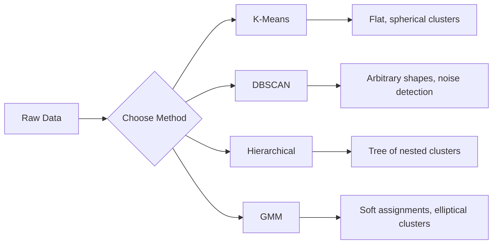

# Aprender sem supervisão
# 无监督学习


> Sem rótulos, sem professores, o algoritmo encontra estrutura por si só.

> Não há etiquetas, não há professores.

**Type:** Build | **类型：** 构建
**Languages:** Python
**Prerequisites:** Phase 1 (Norms & Distances, Probability & Distributions), Phase 2 Lessons 1-6 | **前置知识：** Phase 1（范数与距离、概率与分布），Phase 2 第 1-6 课
**Time:** ~90 minutes | **时间：** 约 90 分钟

## Objetivos de aprendizagem

- Implementar K-Means, DBSCAN e Gaussian Mix Models a partir do zero e comparar seu comportamento de agrupamento
  Desde zero realização K-Means、DBSCAN 和高斯混合模型 (GMM), comparar os comportamentos de aglutinação deles
- Avaliação da qualidade do cluster utilizando a pontuação da silueta e o método do cotovelo para selecionar o K ideal
  Utilizando o número de rotas e o método de encosto para avaliar a qualidade de concentração, escolher o melhor K
- Explicar quando o DBSCAN supera os K-Means e identificar qual algoritmo lida com aglomerados não esféricos e valores fora do horizonte
                                                                                                                                                                                                                                                                                                                                                                                                                                                                                                                               
- Construir um canal de detecção de anomalias utilizando métodos de agrupamento para marcar pontos que se desviam dos padrões normais
  Usar métodos de aglutinação para construir tubos de exame anormais, marcando pontos de desvio do modo normal


> **【中文解读】**
> 无监督学习没有标签, objetivo é encontrar a estrutura dos dados. K-Means é o mais clássico de algoritmos de aglutinação.

> **【拓展：无监督学习在真实 AI 系统中的价值】**
> O Google Photos utiliza um algoritmo de aglutinação similar ao de fotos; o recurso "descobrir" do Spotify utiliza o aglutinação de usuários; o uso de DBSCAN/Isolation Forest para detectar tráfego anormal. Em cenários sem etiquetas ou etiquetas, a aprendizagem sem supervisão é a única opção.

## O problema é o problema da introdução

Todas as aulas de ML até agora assumiram dados rotulados: "aqui está a entrada, aqui está a saída correta". No mundo real, os rótulos são caros. Um hospital tem milhões de registos de pacientes, mas ninguém tem marcado manualmente cada um com uma categoria de doença. Um site de comércio eletrônico tem milhões de sessões de usuários, mas ninguém tem segmentos de clientes etiquetados à mão. Uma equipa de segurança tem registos de rede, mas ninguém marcou todas as anomalias.

>  Cada aula anterior supõe que tenha dados marcados:"É entrada, é saída correta".""No mundo real, a marcação é cara".""Um hospital tem milhões de registros de pacientes, mas ninguém tem a mão para cada categoria de doenças marcadas".""Um site de comércio eletrônico tem milhões de sessões de usuários, mas ninguém tem a mão para marcar os clientes""""uma equipe de segurança tem um diário de rede, mas ninguém tem a mão para marcar cada anomalia".""

A aprendizagem não supervisionada encontra padrões sem que se lhe diga o que procurar. Agrupa pontos de dados semelhantes, descobre estruturas ocultas e supervisiona anomalias.

> 无监督学习在没有被告知寻找什么的情况下发现模式――它将相似的数据点分组,发现隐藏结构,揭露异常――如果监督学习是从有答案的教科书学习,无监督学习就是从原始数据中开始到模式自显现――

A questão é: sem rótulos, não se pode medir diretamente o "certo" ou o "errado".

> 关键问题:没有标签,你不能直接衡量"对"或"错"―― Você precisa de diferentes ferramentas para avaliar se a estrutura do algoritmo é significativa.

> **【中文解读】**
> O desafio central do aprendizado sem supervisão é a avaliação: sem etiquetas não pode medir diretamente o "por-erro" e precisa usar o número de rotas, o código do elbo, etc. para avaliar indiretamente a massa de um grupo de classes.

## O conceito central.

### Agrupamento: Agrupamento de coisas semelhantes

O clustering atribui cada ponto de dados a um grupo (cluster) de modo que os pontos dentro do mesmo grupo são mais semelhantes uns aos outros do que aos pontos em outros grupos.

> O grupo de dados é dividido em um grupo, o que faz com que os pontos do mesmo grupo sejam mais parecidos com os outros grupos.



### K-Means: O Cavalo de Trabalho

K-Means divide os dados em aglomerados exatamente K. Cada aglomerado tem um centróide (seu centro de massa), e cada ponto pertence ao centroide mais próximo.

> K-Means 将数据精确划分为 K 个──每个有一个质心,每个点属于最近的质心.

Algoritmo de Lloyd:

> Lloyd 算法:

1. Escolha pontos aleatórios K como centroides iniciais
   随机选择 K 个点作为初始质心
2. Asigne cada ponto de dados para o centroide mais próximo
   Distribuir cada ponto de dados para o centro de qualidade mais recente
3. Recompõe cada centróide como a média dos seus pontos atribuídos
   重新计算每个质心为其分配点的平均值
4. Repita os passos 2-3 até que as atribuições parem de mudar
   重复步骤 2-3 até que a distribuição não mude

A função objetiva (inertia) mede a distância total quadrada de cada ponto até o centroide atribuído. K-Means minimiza isso, mas só encontra um mínimo local.

> 目標函数 (慣性) mede cada ponto até a sua distribuição de qualidade de distância quadrada total. K-Means minimizes it, but only finds local minimum value.

### Escolher K

Dois métodos padrão:

> 两种标准方法:

**Elbow method:**Execute K-Means para K = 1, 2, 3, ..., n. Inércia de trama vs K. Procure o "cotovelo" onde adicionar mais aglomerados para reduzir significativamente a inércia.

> **肘部法则：**Para K = 1, 2, 3, ..., n 运行 K-Means──绘制惯性对 K 的图──寻找"肘部"增加更多不再显著减少惯性的位置──

**Silhouette score:**Para cada ponto, medir o quão semelhante é ao seu próprio aglomerado (a) versus o mais próximo outro aglomerado (b). O coeficiente de silhueta é (b - a) / max(a, b), variando de -1 (aglomerado errado) a +1 (bem aglomerado).

> **轮廓系数：**Para cada ponto, medir a similaridade (a) em relação a outras similaridades (b) ⋅ rotas ⋅ f {\displaystyle (b -a) /max\,a,b) ⋅ rotas ⋅ rotas ⋅ rotas ⋅ rotas ⋅ rotas ⋅ rotas ⋅ rotas ⋅ rotas ⋅ rotas ⋅ rotas ⋅ rotas ⋅ rotas ⋅ rotas ⋅ rotas ⋅ rotas ⋅ rotas ⋅ rotas ⋅ rotas ⋅ rotas ⋅ rotas ⋅ rotas ⋅ rotas ⋅ rotas ⋅ rotas ⋅ rotas ⋅ rotas ⋅ rotas ⋅ rotas ⋅ rotas ⋅ rotas ⋅ rotas ⋅ rotas ⋅ rotas ⋅ rotas ⋅ rotas ⋅ rotas ⋅ rotas ⋅ rotas ⋅ rotas ⋅ rotas ⋅ rotas ⋅ rotas ⋅ rotas ⋅ rotas ⋅ rotas ⋅ rotas ⋅ rotas ⋅ rotas ⋅ rotas ⋅ rotas ⋅ rotas ⋅ rotas ⋅ rotas ⋅ rotas ⋅ rotas ⋅ rotas ⋅ rotas ⋅ rotas ⋅ rotas ⋅ rotas ⋅ rotas ⋅ rotas ⋅ rotas ⋅ rotas ⋅ rotas ⋅

### DBSCAN: Clustering baseado na densidade

O K-Means assume que os aglomerados são esféricos e exige que você escolha K com antecedência.

> K-Means 假设是球形的且需要预选 K;;DBSCAN 不做这些假设──它将被发现为被稀疏区域分隔的密集区域──

Dois parâmetros:
- **eps**: o raio de um bairro
  **eps**: Quadro de área
- **min_samples**: o número mínimo de pontos necessários para formar uma região densa
  **min_samples**: Número mínimo de pontos necessários para formar uma área densamente

Três tipos de pontos:
- **Core point**: tem pelo menos min_samples points dentro de eps distância
  **核心点**: em eps  distância                                                                                                                                                                                                                                                                                                                                                                                                                                                                                                                       
- **Border point**: dentro de eps de um ponto central, mas não em si um ponto central
  **边界点**No âmbito do eps do ponto central, mas não é o ponto central.
- **Noise point**Não há núcleo nem fronteira, são excepcionais.
  **噪声点**Não é um valor de referência.

DBSCAN conecta pontos centrais que estão dentro de eps um do outro para o mesmo grupo. pontos de fronteira juntar-se ao grupo de um ponto central próximo. pontos de ruído não pertencem a nenhum grupo.

> DBSCAN irá se conectar aos mesmos pontos de núcleo dentro do âmbito de eps.

Forças: encontra aglomerados de qualquer forma, determina automaticamente o número de aglomerados, identifica valores anormais.

> 优势: detectação de formas arbitrárias, determinação automática de quantidade, identificação de valores anormais,

### Clustering hierárquico

Construi uma árvore (dendrograma) de aglomerados aninhados.

> Construir um arco-íris

Aglomerativo (de baixo para cima):

> 聚合式 ((自底上):

1. Comece com cada ponto como seu próprio aglomerado
   Começa a ser o seu próprio ponto.
2. Fundi os dois aglomerados mais próximos
   合并两个最近的
3. Repita até que apenas um grupo permaneça
   重复 Até que só resta um
4. Cortar o dendrograma no nível desejado para obter aglomerados K
   Em nível necessário, corte de árvore

A "certeza" entre os aglomerados pode ser medida como:
- **Single linkage**: distância mínima entre quaisquer dois pontos dos dois aglomerados
  **单链接**: a distância mínima entre dois pontos arbitrários
- **Complete linkage**: distância máxima entre quaisquer dois pontos
  **全链接**: a maior distância entre qualquer dois pontos
- **Average linkage**: distância média entre todos os pares
  **平均链接**A distância média de todos os pontos
- **Ward's method**: a fusão que causa o menor aumento da variância total dentro do cluster
  **Ward 方法**: Causa um aumento total de diferença de menor de

### Modelos de mistura gaussiana (GMM)

K-Means dá atribuições difíceis: cada ponto pertence a exatamente um cluster. GMM dá atribuições macias: cada ponto tem uma probabilidade de pertencer a cada cluster.

> K-Means give out hard distribution: cada ponto pertence a um ──GMM give out soft distribution: cada ponto tem uma probabilidade de cada ──

GMM assume que os dados são gerados a partir de uma mistura de distribuições de K Gaussian, cada uma com sua própria média e covariância.

> GMM 假设数据由 K 个高斯分布的混合生成, cada um com seu próprio valor médio e diferença de conexão.

- **E-step**: calcular a probabilidade de cada ponto pertencer a cada Gaussian
  **E 步**Calculação: cada ponto pertence a probabilidade de cada alta distribuição
- **M-step**A partir da data de obtenção dos dados, a data de obtenção dos dados deve ser de acordo com o método de cálculo.
  **M 步**O valor médio, o coeficiente de diferença e o peso misturado de cada alta distribuição são atualizados para maximizar a comparação de dados.

O GMM pode modelar aglomerados elípticos (não apenas esféricos como K-Means) e naturalmente lida com aglomerados sobrepostos.

> GMM 能建模圆(不只是 K-Means 的球形), naturalmente tratar sobreposição──

### Quando usar qual

| Method | Best for | Avoid when |
|--------|----------|------------|
| K-Means | Large datasets, spherical clusters, known K | Irregular shapes, outliers present |
| DBSCAN | Unknown K, arbitrary shapes, outlier detection | Varying densities, very high dimensions |
| Hierarchical | Small datasets, need dendrogram, unknown K | Large datasets (O(n^2) memory) |
| GMM | Overlapping clusters, soft assignments needed | Very large datasets, too many dimensions |

| 方法 | 最适合 | 避免使用 |
|------|--------|---------|
| K-Means | 大数据集，球形簇，已知 K | 不规则形状，有异常值 |
| DBSCAN | 未知 K，任意形状，异常检测 | 密度不均匀，极高维度 |
| 层次聚类 | 小数据集，需要树状图，未知 K | 大数据集（O(n^2) 内存） |
| GMM | 重叠簇，需要软分配 | 非常大的数据集，维度太高 |

### Detecção de anomalias com aglomeração

O agrupamento suporta naturalmente a detecção de anomalias:
- **K-Means**Os pontos distantes de qualquer centroide são anomalias .
  **K-Means**Não há nada de diferente .
- **DBSCAN**: pontos de ruído são anomalias por definição
  **DBSCAN**Noisepoint é um valor extraordinário .
- **GMM**Os pontos com baixa probabilidade em todos os Gaussianos são anomalias .
  **GMM**A probabilidade de todas as altas distribuições ser muito baixa é de um valor anormal .

> 聚类天然支持异常检测:

## Construí-lo e realizei-o.

> **【中文解读】**
> Desde zero implementação K-Means、DBSCAN 和高斯混合模型──K-Means 的三步代:随机初始化中心 → 分配每个点到最近的中心 → 重新计算中心──重复直到收──DBSCAN Desde alta densidade da região começar a expandir, automaticamente processar o ruído ponto──
```figure
kmeans-step
```

## Construí-lo

### Passo 1: K-Means do zero

```python
import math
import random


def euclidean_distance(a, b):
    return math.sqrt(sum((ai - bi) ** 2 for ai, bi in zip(a, b)))


def kmeans(data, k, max_iterations=100, seed=42):
    random.seed(seed)
    n_features = len(data[0])

    centroids = random.sample(data, k)

    for iteration in range(max_iterations):
        clusters = [[] for _ in range(k)]
        assignments = []

        for point in data:
            distances = [euclidean_distance(point, c) for c in centroids]
            nearest = distances.index(min(distances))
            clusters[nearest].append(point)
            assignments.append(nearest)

        new_centroids = []
        for cluster in clusters:
            if len(cluster) == 0:
                new_centroids.append(random.choice(data))
                continue
            centroid = [
                sum(point[j] for point in cluster) / len(cluster)
                for j in range(n_features)
            ]
            new_centroids.append(centroid)

        if all(
            euclidean_distance(old, new) < 1e-6
            for old, new in zip(centroids, new_centroids)
        ):
            print(f"  Converged at iteration {iteration + 1}")
            break

        centroids = new_centroids

    return assignments, centroids
```

### Passo 2: Método de cotovelo e pontuação de silueta

```python
def compute_inertia(data, assignments, centroids):
    total = 0.0
    for point, cluster_id in zip(data, assignments):
        total += euclidean_distance(point, centroids[cluster_id]) ** 2
    return total


def silhouette_score(data, assignments):
    n = len(data)
    if n < 2:
        return 0.0

    clusters = {}
    for i, c in enumerate(assignments):
        clusters.setdefault(c, []).append(i)

    if len(clusters) < 2:
        return 0.0

    scores = []
    for i in range(n):
        own_cluster = assignments[i]
        own_members = [j for j in clusters[own_cluster] if j != i]

        if len(own_members) == 0:
            scores.append(0.0)
            continue

        a = sum(euclidean_distance(data[i], data[j]) for j in own_members) / len(own_members)

        b = float("inf")
        for cluster_id, members in clusters.items():
            if cluster_id == own_cluster:
                continue
            avg_dist = sum(euclidean_distance(data[i], data[j]) for j in members) / len(members)
            b = min(b, avg_dist)

        if max(a, b) == 0:
            scores.append(0.0)
        else:
            scores.append((b - a) / max(a, b))

    return sum(scores) / len(scores)


def find_best_k(data, max_k=10):
    print("Elbow method:")
    inertias = []
    for k in range(1, max_k + 1):
        assignments, centroids = kmeans(data, k)
        inertia = compute_inertia(data, assignments, centroids)
        inertias.append(inertia)
        print(f"  K={k}: inertia={inertia:.2f}")

    print("\nSilhouette scores:")
    for k in range(2, max_k + 1):
        assignments, centroids = kmeans(data, k)
        score = silhouette_score(data, assignments)
        print(f"  K={k}: silhouette={score:.4f}")

    return inertias
```

### Passo 3: DBSCAN a partir do zero

```python
def dbscan(data, eps, min_samples):
    n = len(data)
    labels = [-1] * n
    cluster_id = 0

    def region_query(point_idx):
        neighbors = []
        for i in range(n):
            if euclidean_distance(data[point_idx], data[i]) <= eps:
                neighbors.append(i)
        return neighbors

    visited = [False] * n

    for i in range(n):
        if visited[i]:
            continue
        visited[i] = True

        neighbors = region_query(i)

        if len(neighbors) < min_samples:
            labels[i] = -1
            continue

        labels[i] = cluster_id
        seed_set = list(neighbors)
        seed_set.remove(i)

        j = 0
        while j < len(seed_set):
            q = seed_set[j]

            if not visited[q]:
                visited[q] = True
                q_neighbors = region_query(q)
                if len(q_neighbors) >= min_samples:
                    for nb in q_neighbors:
                        if nb not in seed_set:
                            seed_set.append(nb)

            if labels[q] == -1:
                labels[q] = cluster_id

            j += 1

        cluster_id += 1

    return labels
```

### Passo 4: Modelo de mistura gaussiana (algoritmo EM)

```python
def gmm(data, k, max_iterations=100, seed=42):
    random.seed(seed)
    n = len(data)
    d = len(data[0])

    indices = random.sample(range(n), k)
    means = [list(data[i]) for i in indices]
    variances = [1.0] * k
    weights = [1.0 / k] * k

    def gaussian_pdf(x, mean, variance):
        d = len(x)
        coeff = 1.0 / ((2 * math.pi * variance) ** (d / 2))
        exponent = -sum((xi - mi) ** 2 for xi, mi in zip(x, mean)) / (2 * variance)
        return coeff * math.exp(max(exponent, -500))

    for iteration in range(max_iterations):
        responsibilities = []
        for i in range(n):
            probs = []
            for j in range(k):
                probs.append(weights[j] * gaussian_pdf(data[i], means[j], variances[j]))
            total = sum(probs)
            if total == 0:
                total = 1e-300
            responsibilities.append([p / total for p in probs])

        old_means = [list(m) for m in means]

        for j in range(k):
            r_sum = sum(responsibilities[i][j] for i in range(n))
            if r_sum < 1e-10:
                continue

            weights[j] = r_sum / n

            for dim in range(d):
                means[j][dim] = sum(
                    responsibilities[i][j] * data[i][dim] for i in range(n)
                ) / r_sum

            variances[j] = sum(
                responsibilities[i][j]
                * sum((data[i][dim] - means[j][dim]) ** 2 for dim in range(d))
                for i in range(n)
            ) / (r_sum * d)
            variances[j] = max(variances[j], 1e-6)

        shift = sum(
            euclidean_distance(old_means[j], means[j]) for j in range(k)
        )
        if shift < 1e-6:
            print(f"  GMM converged at iteration {iteration + 1}")
            break

    assignments = []
    for i in range(n):
        assignments.append(responsibilities[i].index(max(responsibilities[i])))

    return assignments, means, weights, responsibilities
```

### Passo 5: Gerar dados de teste e executar tudo

```python
def make_blobs(centers, n_per_cluster=50, spread=0.5, seed=42):
    random.seed(seed)
    data = []
    true_labels = []
    for label, (cx, cy) in enumerate(centers):
        for _ in range(n_per_cluster):
            x = cx + random.gauss(0, spread)
            y = cy + random.gauss(0, spread)
            data.append([x, y])
            true_labels.append(label)
    return data, true_labels


def make_moons(n_samples=200, noise=0.1, seed=42):
    random.seed(seed)
    data = []
    labels = []
    n_half = n_samples // 2
    for i in range(n_half):
        angle = math.pi * i / n_half
        x = math.cos(angle) + random.gauss(0, noise)
        y = math.sin(angle) + random.gauss(0, noise)
        data.append([x, y])
        labels.append(0)
    for i in range(n_half):
        angle = math.pi * i / n_half
        x = 1 - math.cos(angle) + random.gauss(0, noise)
        y = 1 - math.sin(angle) - 0.5 + random.gauss(0, noise)
        data.append([x, y])
        labels.append(1)
    return data, labels


if __name__ == "__main__":
    centers = [[2, 2], [8, 3], [5, 8]]
    data, true_labels = make_blobs(centers, n_per_cluster=50, spread=0.8)

    print("=== K-Means on 3 blobs ===")
    assignments, centroids = kmeans(data, k=3)
    print(f"  Centroids: {[[round(c, 2) for c in cent] for cent in centroids]}")
    sil = silhouette_score(data, assignments)
    print(f"  Silhouette score: {sil:.4f}")

    print("\n=== Elbow Method ===")
    find_best_k(data, max_k=6)

    print("\n=== DBSCAN on 3 blobs ===")
    db_labels = dbscan(data, eps=1.5, min_samples=5)
    n_clusters = len(set(db_labels) - {-1})
    n_noise = db_labels.count(-1)
    print(f"  Found {n_clusters} clusters, {n_noise} noise points")

    print("\n=== GMM on 3 blobs ===")
    gmm_assignments, gmm_means, gmm_weights, _ = gmm(data, k=3)
    print(f"  Means: {[[round(m, 2) for m in mean] for mean in gmm_means]}")
    print(f"  Weights: {[round(w, 3) for w in gmm_weights]}")
    gmm_sil = silhouette_score(data, gmm_assignments)
    print(f"  Silhouette score: {gmm_sil:.4f}")

    print("\n=== DBSCAN on moons (non-spherical clusters) ===")
    moon_data, moon_labels = make_moons(n_samples=200, noise=0.1)
    moon_db = dbscan(moon_data, eps=0.3, min_samples=5)
    n_moon_clusters = len(set(moon_db) - {-1})
    n_moon_noise = moon_db.count(-1)
    print(f"  Found {n_moon_clusters} clusters, {n_moon_noise} noise points")

    print("\n=== K-Means on moons (will fail to separate) ===")
    moon_km, moon_centroids = kmeans(moon_data, k=2)
    moon_sil = silhouette_score(moon_data, moon_km)
    print(f"  Silhouette score: {moon_sil:.4f}")
    print("  K-Means splits moons poorly because they are not spherical")

    print("\n=== Anomaly detection with DBSCAN ===")
    anomaly_data = list(data)
    anomaly_data.append([20.0, 20.0])
    anomaly_data.append([-5.0, -5.0])
    anomaly_data.append([15.0, 0.0])
    anomaly_labels = dbscan(anomaly_data, eps=1.5, min_samples=5)
    anomalies = [
        anomaly_data[i]
        for i in range(len(anomaly_labels))
        if anomaly_labels[i] == -1
    ]
    print(f"  Detected {len(anomalies)} anomalies")
    for a in anomalies[-3:]:
        print(f"    Point {[round(v, 2) for v in a]}")
```

## Use-o com o framework implementado.

Com o scikit-learn, os mesmos algoritmos são de linha única:

> Usando o scikit-learn, o mesmo algoritmo só precisa de uma linha de código:

```python
from sklearn.cluster import KMeans, DBSCAN, AgglomerativeClustering
from sklearn.mixture import GaussianMixture
from sklearn.metrics import silhouette_score as sklearn_silhouette

km = KMeans(n_clusters=3, random_state=42).fit(data)  # K-Means 聚类（默认 K-Means++ 初始化）
db = DBSCAN(eps=1.5, min_samples=5).fit(data)  # DBSCAN 密度聚类（eps 为邻域半径）
agg = AgglomerativeClustering(n_clusters=3).fit(data)  # 层次聚类
gmm_model = GaussianMixture(n_components=3, random_state=42).fit(data)  # 高斯混合模型（EM 算法）
```

As versões do zero mostram exatamente o que essas bibliotecas compute. K-Means itera entre atribuir e recomputar. DBSCAN cresce aglomerados a partir de sementes densas. GMM alternar entre a expectativa e a maximização. As versões da biblioteca adicionam estabilidade numérica, inicialização mais inteligente (K-Means ++), e aceleração da GPU, mas a lógica central é a mesma.

> A partir da versão zero, você mostrou que essas bases de dados foram calculadas. K-Means entre distribuição e pesada.

## Envia-o . Produto .

Esta lição produz implementações de trabalho de K-Means, DBSCAN e GMM a partir do zero.

> Este curso é produzido a partir de zero realização K-Means、DBSCAN 和 GMM──

> **【拓展：聚类在用户分群和推荐系统中的应用】**
> O Spotify irá classificar os usuários em "grupos de gostos" para promover música Os usuários dentro de cada grupo têm hábitos de ouvir músicas semelhantes. O Airbnb usará o grupo de usuários para otimizar a classificação de pesquisa.

> **【中文解读】**
> 无监督学习的评估比监督学习更困难──轮系数衡量内密度 vs 间分离度,范围 [-1, 1],越高越好──肘部法则寻找 WCSS(内平方和)随着K 增加的"拐点"──GMM 使用EM 算法(期望最大化)交换更新分配和参数,比K-Means 更灵活(圆而非球形)

## Exercícios.

1. Implementar a inicialização K-Means++: em vez de escolher centróides aleatórios, escolha o primeiro aleatoriamente e cada centróide subsequente com probabilidade proporcional à sua distância quadrada do centroide existente mais próximo. Compare a velocidade de convergência com a inicialização aleatória.
   1. 实现 K-Means++ inicialização: não é escolher o primeiro, mas escolher o segundo, e então cada seguinte é escolher a probabilidade de que a distância quadrada da relação entre o primeiro e o segundo seja a mesma.
2. Adicione aglomeração hierárquica ao código. Implemente a ligação de Ward e produzir um dendrograma (como uma lista aninhada de fusões). Corte-o em diferentes níveis e compare com os resultados de K-Means.
   2. Para o código adicionar níveis de aglomeração de aglomeração.
3. Construir um simples pipeline de detecção de anomalias: executar DBSCAN e GMM nos mesmos dados, pontos de referência que ambos os métodos concordarem são anormais (ruído em DBSCAN, baixa probabilidade em GMM).
   3. Construir simples canais de exame anormal: em função dos mesmos dados, DBSCAN e GMM, marcam dois métodos considerados pontos de valor anormal.

## Termos-chave .

| Term | What people say | What it actually means |
|------|----------------|----------------------|
| Clustering | "Grouping similar things" | Partitioning data into subsets where within-group similarity exceeds between-group similarity, measured by a specific distance metric |
| Centroid | "The center of a cluster" | The mean of all points assigned to a cluster; used by K-Means as the cluster representative |
| Inertia | "How tight the clusters are" | Sum of squared distances from each point to its assigned centroid; lower is tighter |
| Silhouette score | "How well-separated clusters are" | For each point, (b - a) / max(a, b) where a is mean intra-cluster distance and b is mean nearest-cluster distance |
| Core point | "A point in a dense region" | A point with at least min_samples neighbors within eps distance, in DBSCAN |
| EM algorithm | "Soft K-Means" | Expectation-Maximization: iteratively compute membership probabilities (E-step) and update distribution parameters (M-step) |
| Dendrogram | "A tree of clusters" | A tree diagram showing the order and distance at which clusters were merged in hierarchical clustering |
| Anomaly | "An outlier" | A data point that does not conform to the expected pattern, identified as noise by DBSCAN or low-probability by GMM |

## Mais leitura 延伸阅读

- [Stanford CS229 - Unsupervised Learning](https://cs229.stanford.edu/notes2022fall/main_notes.pdf)- Notas de Andrew Ng sobre clustering e EM
  [Stanford CS229 - 无监督学习](https://cs229.stanford.edu/notes2022fall/main_notes.pdf)- Andrew Ng's聚类和EM 讲义
- [scikit-learn Clustering Guide](https://scikit-learn.org/stable/modules/clustering.html)- comparação prática de todos os algoritmos de agrupamento com exemplos visuais
  [scikit-learn 聚类指南](https://scikit-learn.org/stable/modules/clustering.html)- comparação prática e visível dos algoritmos de agregação
- [DBSCAN original paper (Ester et al., 1996)](https://www.aaai.org/Papers/KDD/1996/KDD96-037.pdf)- o papel que introduziu o agrupamento baseado na densidade
  [DBSCAN 原始论文 (Ester et al., 1996)](https://www.aaai.org/Papers/KDD/1996/KDD96-037.pdf)- Introdução de artigos baseados em concentrações de densidade
