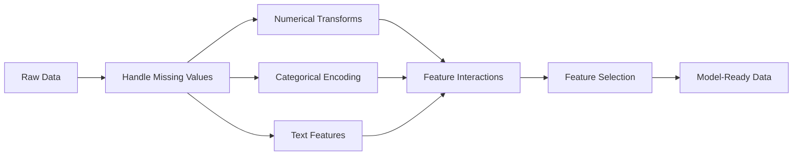

# Características de engenharia e seleção
# Características de engenharia e seleção


> Um bom recurso vale mil pontos de dados.

> Uma boa característica.

**Type:** Build | **类型：** 构建
**Languages:** Python
**Prerequisites:** Phase 1 (Statistics for ML, Linear Algebra), Phase 2 Lessons 1-7 | **前置知识：** Phase 1（统计学、线性代数），Phase 2 第 1-7 课
**Time:** ~90 minutes | **时间：** 约 90 分钟

## Objetivos de aprendizagem

- Implementar transformações numéricas (normatização, escalação mínima, transformação de log, enxaguamento) e explicar quando cada uma é adequada
  实现数值变换(标准化、Min-Max 缩放、对数变换、分箱)并解释各自的适用场景
- Construir codificação de um único tipo, etiqueta e alvo para características categóricas e identificar o risco de vazamento de dados na codificação alvo
  Construir código único ✓ Codificação de etiquetas e código-alvo, Identificação de código-alvo risco de vazamento de dados
- Construir um vectorizador TF-IDF a partir do zero e explicar por que ele supera os números de palavras brutas para classificação de texto
  Desde o zero construção TF-IDF para quantificador, explicar por que é melhor do que o original
- Aplicar a seleção de características baseada em filtros (prazo de variação, correlação, informação mútua) para reduzir a dimensionalidade
   aplicação baseada em características de seleção √ √ √ √ √ √ √ √ √ √ √ √ √ √ √ √ √ √ √ √ √ √ √ √ √ √ √ √ √ √ √ √ √ √ √ √ √ √ √ √ √ √ √ √ √ √ √ √ √ √ √ √ √ √ √ √ √ √ √ √ √ √ √ √ √ √ √ √ √ √ √ √ √ √ √ √ √ √ √ √ √ √ √ √ √ √ √ √ √ √ √ √ √ √ √ √ √ √ √ √ √ √ √ √ √ √ √ √ √ √ √ √ √ √ √ √ √ √ √ √ √ √ √ √ √ √ √ √ √ √ √ √ √ √ √ √ √ √ √ √ √ √ √ √ √ √ √ √ √ √ √ √ √ √ √ √ √ √ √ √ √ √ √ √ √ √ √ √ √ √ √ √ √ √ √ √ √ √ √ √ √ √ √ √ √ √ √ √ √ √ √ √ √ √ √ √ √ √ √ √ √ √ √ √ √ √ √ √ √ √ √ √ √ √ √ √ √ √ √ √ √ √ √ √ √ √ √ √ √ √ √ √ √ √ √ √ √ √ √ √ √ √ √ √ √ √ √ √ √ √ 


> **【中文解读】**
> O design de características é a transformação de dados originais em características que o modelo possa entender. É o passo mais demorado do ML.

> **【拓展：特征工程 vs 深度学习的自动特征学习】**
> A vantagem central do aprendizado profundo é o aprendizado automático. O aprendizado automático é um recurso de aprendizado automático. O aprendizado automático é um recurso de aprendizado automático.

## O problema é o problema da introdução

Temos um conjunto de dados, escolhemos um algoritmo, treinamo-lo, os resultados são mediocres, tentamos um algoritmo mais sofisticado, ainda assim, mediocres, passamos uma semana a ajustar os hiperparâmetros, melhorias marginais.

> Você tem um conjunto de dados. Você escolheu um algoritmo. Você treinou. Resultados são simples. Você tentou um algoritmo mais sofisticado.

Então alguém transforma os dados brutos em melhores recursos e uma regressão logística simples bate o seu conjunto de gradientes ajustados.

> Então alguém transformou os dados originais em características melhores, um simples regresso lógico derrotou o seu nível de regulação de integração.

Em ML clássico, a representação dos dados importa mais do que a escolha do algoritmo. Um modelo de preço da casa com "escena quadrada" e "número de quartos" vai bater um modelo com "endereço como uma cadeia crua" não importa o quão sofisticado o aluno é. O algoritmo só pode funcionar com o que você dá.

> Esta situação ocorre frequentemente. No ML clássico, a representação de dados é mais importante do que a escolha de algoritmos. Um modelo de preços com "espaço" e "número de quartos" vai bater com um modelo de "direito de código original", independentemente da complexidade do aprendizagem.

A engenharia de recursos é o processo de transformar dados brutos em representações que facilitam a localização de padrões para modelos. A seleção de recursos é o processo de jogar fora recursos que adicionam ruído sem adicionar sinal. Juntos, são a atividade de maior alavancagem no ML clássico.

> O design de características é o processo de transformar dados originais em modelos mais fáceis de serem descobertos pelo modelo. A seleção de características é o processo de descartar apenas características de aumento de ruído e não aumento de sinais.

> **【中文解读】**
> "Datos e características determinam a limitação superior do ML, o modelo e o algoritmo apenas se aproximam dessa limitação superior. "As boas características podem fazer com que um modelo simples vença um modelo complexo.

## O conceito central.

### O Pipeline de Características



### Características numéricas

Os números brutos raramente estão prontos para o modelo.

> Números primitivos muito poucos podem ser utilizados diretamente em modelos.

**Scaling:**Coloque características na mesma faixa para que os algoritmos baseados na distância (K-Means, KNN, SVM) tratem todas as características de forma igual. mapas de escalação de min-max para [0, 1]. mapas de padronização (z-score) para mean=0, std=1.

> **缩放：**Será colocado em um mesmo âmbito, baseado em algoritmos de distância (((K-Means、KNN、SVM) igual para tratar todos os recursos。Min-Max 缩放映射到 [0, 1]。标准化(z-score)映射到平均值=0、标准差=1。

**Log transform:**Comprime distribuições direitas (revenhos, população, conteúdo de palavras). Transforma relações multiplicativas em aditivas.

> **对数变换：**压缩右偏分布(收入、人口、词频) 』将乘法关系变为加法关系──

**Binning:**Converte valores contínuos em categorias. Útil quando a relação entre característica e objetivo é não linear, mas gradual (por exemplo, grupos etários).

> **分箱：**Será o valor continuado transformado em classe. Quando a relação entre características e objetivos é não linear, mas é útil na escalado (como grupo de idade).

**Polynomial features:**Cria termos x^2, x^3, x1*x2. permite que os modelos lineares capturem relações não lineares ao custo de mais características.

> **多项式特征：** criar x^2、x^3、x1*x2 项── fazer um modelo linear com mais características a preço de capturar relações não lineares──

### Características categorias

Os modelos precisam de números, as categorias precisam de codificação.

> 模型需要数字――类别需要编码――

**One-hot encoding:**Cria uma coluna binária para cada categoria. "color = red/blue/green" se torna três colunas: is_red, is_blue, is_green. Funciona bem para recursos de baixa cardinalidade, mas explode com muitas categorias.

> **独热编码：**Para cada categoria criar uma segunda linha. "color = vermelho/azul/verde" transformar em três categorias: é_verde, é_azul, é_verde.

**Label encoding:**Mapas de cada categoria para um número inteiro: vermelho = 0, azul = 1, verde = 2. Introduz uma ordem falsa (o modelo pode pensar verde > azul > vermelho).

> **标签编码：**Para cada classe de mapeamento, introduzir uma falsa classificação (model可能认为绿 >蓝 >红) , que se adapta apenas a um modelo de árvore dividido em valores individuais.

**Target encoding:**Substitui cada categoria pela média da variável-alvo para essa categoria. Poderosa mas perigosa: alto risco de fuga de dados. Deve ser calculada apenas a partir de dados de formação e aplicada aos dados de ensaio.

> **目标编码：**Substituir cada categoria para a média de variação de objetivos dessa categoria. Forte, mas perigoso: risco de fuga de dados.

### Características do texto

**Count vectorizer:**Conta quantas vezes cada palavra aparece num documento. "o gato sentou-se no tapete" torna-se {o: 2, gato: 1, sat: 1, em: 1, mat: 1}.

> **词频向量化：**計算每个词在文档中出现的次数──"o gato sentou no tapete" 变成 {the: 2, cat: 1, sat: 1, on: 1, mat: 1}──

**TF-IDF:**O termo frequência-inversa frequência de documento. Pese palavras por quão únicas são em documentos. palavras comuns como "o" ganham baixo peso. palavras raras e distintas ganham alto peso.

> **TF-IDF：**词频-逆文档频率──按词在文档中的唯一性加权──常见词如"the"获得低权重──稀有、有区分度的词获得高权重──

```
TF(word, doc) = count(word in doc) / total words in doc
IDF(word) = log(total docs / docs containing word)
TF-IDF = TF * IDF
```

### Valores perdidos

Os dados reais têm buracos.

> Os dados reais têm espaço em branco.

- **Drop rows:**Só quando os dados faltantes são raros e aleatórios
  **删除行：** Apenas quando falta dados raros e ocorrentes
- **Mean/median imputation:**Simples, preservam a forma de distribuição (a média é mais robusta para os valores de extrema variabilidade)
  **均值/中位数填充：**简单, manter forma distribuída (中位数对异常值更鲁棒)
- **Mode imputation:**Para características categóricas
  **众数填充：**Utilizado para caracteres de classe
- **Indicator column:**Adicione uma coluna binária "was_this_missing" antes de imputar. O fato de que os dados estão faltando pode ser informativo
  **指示列：**填充前添加二进制列"estava_este_disfunção"── dados faltantes em si podem ser informativos
- **Forward/backward fill:**Para dados de séries temporais
  **前向/后向填充：**Usado para dados de sequência de tempo

### Interação de Características

Às vezes, a relação está na combinação. "Alto" e "peso" sozinhos são menos preditivos do que "BMI = peso / altura^2". As interações de características multiplicam o espaço de características, por isso use o conhecimento de domínio para escolher os certos.

> Há uma relação entre os componentes. "Alto" e "Peso" são diferentes de "BMI = peso / altura" e "Peso" são diferentes.

### Seleção de características

Mais recursos nem sempre são melhores, pois os recursos irrelevantes adicionam ruído, aumentam o tempo de treinamento e podem causar sobreadaptação.

> 更多特征不一定好 hơn. 无关特征 增加噪音,增加训练时间并可能导致过适应.

**Filter methods (pre-model):**
- Correlação: remover características altamente correlacionadas entre si (redundantes)
  相关性:移除高度相关的特征(冗余)
- Informação mútua: medida de quanto o conhecimento de uma característica reduz a incerteza sobre o alvo
  互信息: medir saber um traço pode reduzir o objetivo quanto incerteza
- Prazo de variação: remover características que apenas variam
  方差值: Mover quase não mudam características

**Wrapper methods (model-based):**
- L1 regularização (Lasso): leva peso de características irrelevantes a zero exatamente
  L1 正则化(Lasso): vai não ser relevante
- Eliminação recorrente de características: treinar, remover características menos importantes, repetir
  递归特征消除: treinar, eliminar os traços mais insignificantes, repe repeat

**Why selection matters:**Um modelo com 10 boas características geralmente superará um modelo com 10 boas características e 90 ruidosos.

> **为什么选择很重要：**Um modelo com 10 boas características geralmente vence 10 boas características e 90 características de ruído.

## Construí-lo e realizei-o.

> **【中文解读】**
> Desde zero realizando características comuns: padronização (standardisation) 零 mean value unit squared) Min-Max 归一化 (shrinking to 0-1) 、对数变化 (number change) 处理长尾分布 (长尾分布) 分箱 (连续值离散) ⋅ cada tipo de mudança é aplicável a diferentes cenários 对数变化适合收入等右偏分布, padronização适合 KNN/SVM等距离敏感算法──
```figure
feature-scaling
```

## Construí-lo

### Passo 1: Transformações numéricas a partir do zero

```python
import math


def min_max_scale(values):
    min_val = min(values)
    max_val = max(values)
    if max_val == min_val:
        return [0.0] * len(values)
    return [(v - min_val) / (max_val - min_val) for v in values]


def standardize(values):
    n = len(values)
    mean = sum(values) / n
    variance = sum((v - mean) ** 2 for v in values) / n
    std = math.sqrt(variance) if variance > 0 else 1.0
    return [(v - mean) / std for v in values]


def log_transform(values):
    return [math.log(v + 1) for v in values]


def bin_values(values, n_bins=5):
    min_val = min(values)
    max_val = max(values)
    bin_width = (max_val - min_val) / n_bins
    if bin_width == 0:
        return [0] * len(values)
    result = []
    for v in values:
        bin_idx = int((v - min_val) / bin_width)
        bin_idx = min(bin_idx, n_bins - 1)
        result.append(bin_idx)
    return result


def polynomial_features(row, degree=2):
    n = len(row)
    result = list(row)
    if degree >= 2:
        for i in range(n):
            result.append(row[i] ** 2)
        for i in range(n):
            for j in range(i + 1, n):
                result.append(row[i] * row[j])
    return result
```

### Passo 2: codificação categórica a partir do zero

```python
def one_hot_encode(values):
    categories = sorted(set(values))
    cat_to_idx = {cat: i for i, cat in enumerate(categories)}
    n_cats = len(categories)

    encoded = []
    for v in values:
        row = [0] * n_cats
        row[cat_to_idx[v]] = 1
        encoded.append(row)

    return encoded, categories


def label_encode(values):
    categories = sorted(set(values))
    cat_to_int = {cat: i for i, cat in enumerate(categories)}
    return [cat_to_int[v] for v in values], cat_to_int


def target_encode(feature_values, target_values, smoothing=10):
    global_mean = sum(target_values) / len(target_values)

    category_stats = {}
    for feat, target in zip(feature_values, target_values):
        if feat not in category_stats:
            category_stats[feat] = {"sum": 0.0, "count": 0}
        category_stats[feat]["sum"] += target
        category_stats[feat]["count"] += 1

    encoding = {}
    for cat, stats in category_stats.items():
        cat_mean = stats["sum"] / stats["count"]
        weight = stats["count"] / (stats["count"] + smoothing)
        encoding[cat] = weight * cat_mean + (1 - weight) * global_mean

    return [encoding[v] for v in feature_values], encoding
```

### Passo 3: Características do texto a partir do zero

> O contectorizador (CountVectorizer) calcula o número de vezes que cada palavra aparece no arquivo; TF-IDF multiplica a frequência do arquivo com base na frequência do texto, reduzindo o peso do termo comum, aumentando o peso do termo raro.`TfidfVectorizer`É a produção da versão realizada.

```python
def count_vectorize(documents):
    vocab = {}
    idx = 0
    for doc in documents:
        for word in doc.lower().split():
            if word not in vocab:
                vocab[word] = idx
                idx += 1

    vectors = []
    for doc in documents:
        vec = [0] * len(vocab)
        for word in doc.lower().split():
            vec[vocab[word]] += 1
        vectors.append(vec)

    return vectors, vocab


def tfidf(documents):
    n_docs = len(documents)

    vocab = {}
    idx = 0
    for doc in documents:
        for word in doc.lower().split():
            if word not in vocab:
                vocab[word] = idx
                idx += 1

    doc_freq = {}
    for doc in documents:
        seen = set()
        for word in doc.lower().split():
            if word not in seen:
                doc_freq[word] = doc_freq.get(word, 0) + 1
                seen.add(word)

    vectors = []
    for doc in documents:
        words = doc.lower().split()
        word_count = len(words)
        tf_map = {}
        for word in words:
            tf_map[word] = tf_map.get(word, 0) + 1

        vec = [0.0] * len(vocab)
        for word, count in tf_map.items():
            tf = count / word_count
            idf = math.log(n_docs / doc_freq[word])
            vec[vocab[word]] = tf * idf
        vectors.append(vec)

    return vectors, vocab
```

### Passo 4: Imputação de valor ausente a partir do zero

> O número de dados de distribuição normal é adequado, o número de números de média é adequado a um número de números de números de números de números de números de números de números de números de números de números de números de números de números de números de números de números de números de números de números de números de números de números de números de números de números de números de números de números de números de números de números de números de números de números de números de números de números de números de números de números de números de números de números de números de números de números de números de números de números de números de números de números de números de números de números de números de números de números de números de números de números de números de números de números de números de números de números de números de números de números de números de números de números de números de números de números de números de números de números de números de números de números de números de números de números de números de números de números de números de números de números de números de números de números de números de números de números de números de números de números de números de números de números de números de números de números de números de números de números de números de números de números de números de números de números de números de números de números de números de números de números de números de números de números de números de números de números de números de números de números de números de números de números de números de números de números de números de números de números de números de números de números de números de números de números de números de números de números de números de números de números de números de números de números de números de números de números de números de números de números de números de números de números de números de números de números de números de números de números de números de números de números de números de números de números de números de números de números de números de números de números de números de números de números de números de números de números de números de números de números de números de números de números de números de números de números de números de números de números de números de números de números de números de números de números de números de números de números de números de números de números de números de números de números de números de números de números de números de números de números de números de números de números de números de números de números de números de números de números de números de números de números de números de números de números de números de números de números de números de números de números de números de números

```python
def impute_mean(values):
    present = [v for v in values if v is not None]
    if not present:
        return [0.0] * len(values), 0.0
    mean = sum(present) / len(present)
    return [v if v is not None else mean for v in values], mean


def impute_median(values):
    present = sorted(v for v in values if v is not None)
    if not present:
        return [0.0] * len(values), 0.0
    n = len(present)
    if n % 2 == 0:
        median = (present[n // 2 - 1] + present[n // 2]) / 2
    else:
        median = present[n // 2]
    return [v if v is not None else median for v in values], median


def impute_mode(values):
    present = [v for v in values if v is not None]
    if not present:
        return values, None
    counts = {}
    for v in present:
        counts[v] = counts.get(v, 0) + 1
    mode = max(counts, key=counts.get)
    return [v if v is not None else mode for v in values], mode


def add_missing_indicator(values):
    return [0 if v is not None else 1 for v in values]
```

### Passo 5: Seleção de recursos a partir do zero

> O primeiro passo é: Seleção de características. O segundo passo é: Meter relações lineares.`SelectKBest`- Não.`VarianceThreshold`É o método de produção de embalagens.

```python
def correlation(x, y):
    n = len(x)
    mean_x = sum(x) / n
    mean_y = sum(y) / n
    cov = sum((xi - mean_x) * (yi - mean_y) for xi, yi in zip(x, y)) / n
    std_x = math.sqrt(sum((xi - mean_x) ** 2 for xi in x) / n)
    std_y = math.sqrt(sum((yi - mean_y) ** 2 for yi in y) / n)
    if std_x == 0 or std_y == 0:
        return 0.0
    return cov / (std_x * std_y)


def mutual_information(feature, target, n_bins=10):
    feat_min = min(feature)
    feat_max = max(feature)
    bin_width = (feat_max - feat_min) / n_bins if feat_max != feat_min else 1.0
    feat_binned = [
        min(int((f - feat_min) / bin_width), n_bins - 1) for f in feature
    ]

    n = len(feature)
    target_classes = sorted(set(target))

    feat_bins = sorted(set(feat_binned))
    p_feat = {}
    for b in feat_bins:
        p_feat[b] = feat_binned.count(b) / n

    p_target = {}
    for t in target_classes:
        p_target[t] = target.count(t) / n

    mi = 0.0
    for b in feat_bins:
        for t in target_classes:
            joint_count = sum(
                1 for fb, tv in zip(feat_binned, target) if fb == b and tv == t
            )
            p_joint = joint_count / n
            if p_joint > 0:
                mi += p_joint * math.log(p_joint / (p_feat[b] * p_target[t]))

    return mi


def variance_threshold(features, threshold=0.01):
    n_features = len(features[0])
    n_samples = len(features)
    selected = []

    for j in range(n_features):
        col = [features[i][j] for i in range(n_samples)]
        mean = sum(col) / n_samples
        var = sum((v - mean) ** 2 for v in col) / n_samples
        if var >= threshold:
            selected.append(j)

    return selected


def remove_correlated(features, threshold=0.9):
    n_features = len(features[0])
    n_samples = len(features)

    to_remove = set()
    for i in range(n_features):
        if i in to_remove:
            continue
        col_i = [features[r][i] for r in range(n_samples)]
        for j in range(i + 1, n_features):
            if j in to_remove:
                continue
            col_j = [features[r][j] for r in range(n_samples)]
            corr = abs(correlation(col_i, col_j))
            if corr >= threshold:
                to_remove.add(j)

    return [i for i in range(n_features) if i not in to_remove]
```

### Passo 6: Projeto completo e demonstração

```python
import random


def make_housing_data(n=200, seed=42):
    random.seed(seed)
    data = []
    for _ in range(n):
        sqft = random.uniform(500, 5000)
        bedrooms = random.choice([1, 2, 3, 4, 5])
        age = random.uniform(0, 50)
        neighborhood = random.choice(["downtown", "suburbs", "rural"])
        has_pool = random.choice([True, False])

        sqft_with_missing = sqft if random.random() > 0.05 else None
        age_with_missing = age if random.random() > 0.08 else None

        price = (
            50 * sqft
            + 20000 * bedrooms
            - 1000 * age
            + (50000 if neighborhood == "downtown" else 10000 if neighborhood == "suburbs" else 0)
            + (15000 if has_pool else 0)
            + random.gauss(0, 20000)
        )

        data.append({
            "sqft": sqft_with_missing,
            "bedrooms": bedrooms,
            "age": age_with_missing,
            "neighborhood": neighborhood,
            "has_pool": has_pool,
            "price": price,
        })
    return data


if __name__ == "__main__":
    data = make_housing_data(200)

    print("=== Raw Data Sample ===")
    for row in data[:3]:
        print(f"  {row}")

    sqft_raw = [d["sqft"] for d in data]
    age_raw = [d["age"] for d in data]
    prices = [d["price"] for d in data]

    print("\n=== Missing Value Handling ===")
    sqft_missing = sum(1 for v in sqft_raw if v is None)
    age_missing = sum(1 for v in age_raw if v is None)
    print(f"  sqft missing: {sqft_missing}/{len(sqft_raw)}")
    print(f"  age missing: {age_missing}/{len(age_raw)}")

    sqft_indicator = add_missing_indicator(sqft_raw)
    age_indicator = add_missing_indicator(age_raw)
    sqft_imputed, sqft_fill = impute_median(sqft_raw)
    age_imputed, age_fill = impute_mean(age_raw)
    print(f"  sqft filled with median: {sqft_fill:.0f}")
    print(f"  age filled with mean: {age_fill:.1f}")

    print("\n=== Numerical Transforms ===")
    sqft_scaled = standardize(sqft_imputed)
    age_scaled = min_max_scale(age_imputed)
    sqft_log = log_transform(sqft_imputed)
    age_binned = bin_values(age_imputed, n_bins=5)
    print(f"  sqft standardized: mean={sum(sqft_scaled)/len(sqft_scaled):.4f}, std={math.sqrt(sum(v**2 for v in sqft_scaled)/len(sqft_scaled)):.4f}")
    print(f"  age min-max: [{min(age_scaled):.2f}, {max(age_scaled):.2f}]")
    print(f"  age bins: {sorted(set(age_binned))}")

    print("\n=== Categorical Encoding ===")
    neighborhoods = [d["neighborhood"] for d in data]

    ohe, ohe_cats = one_hot_encode(neighborhoods)
    print(f"  One-hot categories: {ohe_cats}")
    print(f"  Sample encoding: {neighborhoods[0]} -> {ohe[0]}")

    le, le_map = label_encode(neighborhoods)
    print(f"  Label encoding map: {le_map}")

    te, te_map = target_encode(neighborhoods, prices, smoothing=10)
    print(f"  Target encoding: {({k: round(v) for k, v in te_map.items()})}")

    print("\n=== Text Features ===")
    descriptions = [
        "large modern house with pool",
        "small cozy cottage near downtown",
        "spacious family home with large yard",
        "modern apartment downtown with view",
        "rustic cabin in rural area",
    ]
    cv, cv_vocab = count_vectorize(descriptions)
    print(f"  Vocabulary size: {len(cv_vocab)}")
    print(f"  Doc 0 non-zero features: {sum(1 for v in cv[0] if v > 0)}")

    tf, tf_vocab = tfidf(descriptions)
    print(f"  TF-IDF vocabulary size: {len(tf_vocab)}")
    top_words = sorted(tf_vocab.keys(), key=lambda w: tf[0][tf_vocab[w]], reverse=True)[:3]
    print(f"  Doc 0 top TF-IDF words: {top_words}")

    print("\n=== Polynomial Features ===")
    sample_row = [sqft_scaled[0], age_scaled[0]]
    poly = polynomial_features(sample_row, degree=2)
    print(f"  Input: {[round(v, 4) for v in sample_row]}")
    print(f"  Polynomial: {[round(v, 4) for v in poly]}")
    print(f"  Features: [x1, x2, x1^2, x2^2, x1*x2]")

    print("\n=== Feature Selection ===")
    feature_matrix = [
        [sqft_scaled[i], age_scaled[i], float(sqft_indicator[i]), float(age_indicator[i])]
        + ohe[i]
        for i in range(len(data))
    ]

    print(f"  Total features: {len(feature_matrix[0])}")

    surviving_var = variance_threshold(feature_matrix, threshold=0.01)
    print(f"  After variance threshold (0.01): {len(surviving_var)} features kept")

    surviving_corr = remove_correlated(feature_matrix, threshold=0.9)
    print(f"  After correlation filter (0.9): {len(surviving_corr)} features kept")

    binary_prices = [1 if p > sum(prices) / len(prices) else 0 for p in prices]
    print("\n  Mutual information with target:")
    feature_names = ["sqft", "age", "sqft_missing", "age_missing"] + [f"neigh_{c}" for c in ohe_cats]
    for j in range(len(feature_matrix[0])):
        col = [feature_matrix[i][j] for i in range(len(feature_matrix))]
        mi = mutual_information(col, binary_prices, n_bins=10)
        print(f"    {feature_names[j]}: MI={mi:.4f}")

    print("\n  Correlation with price:")
    for j in range(len(feature_matrix[0])):
        col = [feature_matrix[i][j] for i in range(len(feature_matrix))]
        corr = correlation(col, prices)
        print(f"    {feature_names[j]}: r={corr:.4f}")
```

## Use-o com o framework implementado.

> **【拓展：sklearn Pipeline 的工业级实践】**
> A ColunaTransformer + Pipeline de sklearn é a melhor prática de engenharia de características: processar separadamente as características numéricas e as características de classe, compondo uma linha de fluxo de extremo a extremo. Isso garante que os conjuntos de treinamento e de teste usem mudanças completamente iguais, evitando vazamentos de dados. Em projetos de Kaggle e de competição e indústria, a Pipeline é uma prática padrão que permite que o código seja replicável, implantável e mantido.

Com a aprendizagem de scikit, estas transformações são condutas compostos:

> Usando um pouco de aprendizagem, estas mudanças podem ser combinadas para a linha de condução:

```python
from sklearn.preprocessing import StandardScaler, OneHotEncoder, PolynomialFeatures  # 预处理变换器
from sklearn.impute import SimpleImputer  # 缺失值填充
from sklearn.feature_extraction.text import TfidfVectorizer  # 文本 TF-IDF 向量化
from sklearn.feature_selection import mutual_info_classif, VarianceThreshold  # 特征选择
from sklearn.compose import ColumnTransformer  # 按列分组处理
from sklearn.pipeline import Pipeline  # 构建端到端流水线

numeric_pipe = Pipeline([
    ("imputer", SimpleImputer(strategy="median")),
    ("scaler", StandardScaler()),
])

categorical_pipe = Pipeline([
    ("encoder", OneHotEncoder(sparse_output=False)),
])

preprocessor = ColumnTransformer([
    ("num", numeric_pipe, ["sqft", "age"]),
    ("cat", categorical_pipe, ["neighborhood"]),
])
```

As versões do zero mostram exatamente o que acontece dentro de cada transformação. As versões da biblioteca adicionam manejo de borda, suporte de matriz escassa e composição de pipeline, mas a matemática é a mesma.

> A partir da versão zero, exibimos exatamente o que aconteceu dentro de cada mudança. A versão do livro adicionou o processamento de situações de fronteira, o suporte de matrizes raras e a combinação de tubulações, mas o princípio matemático é o mesmo.

## Envia-o . Produto .

Esta lição produz:
- `outputs/prompt-feature-engineer.md`- um aviso de engenharia sistemática de características a partir de dados brutos

> 本课产出:
> - `outputs/prompt-feature-engineer.md`- um suporte de um recurso de design de sistemas de dados originais

> **【拓展：自动化特征工程——Featuretools 和 AutoML】**
> Featurtools é uma biblioteca de engenharia de características automatizadas aberta, capaz de gerar automaticamente milhares de características a partir de dados de tipo relacional (pplg, diferença de tempo, características de transferência, etc.) ◦ A síntese de características profundas de Featurtools pode ser regressada ao conjunto de características base para gerar características de nível profundo ◦ Embora o aprendizado de profundidade reduza a demanda por engenharia de características manuais, em dados de forma gráfica, a engenharia de características automáticas + o modelo de árvore continua a ser uma das mais fortes combinações ◦ Em competição, a competitividade de ferramentas AutoML ◦ como AutoGluon ◦ é muito maior em termos de engenharia de características automatizadas ◦

> **【中文解读】**
> TF-IDF ({{lang-IDF}}}}) é um método clássico de engenharia de caracteres de texto:TF 衡量词在文档中的频率,IDF 衡量词在所有文档中的稀少程度──常见词.

## Exercícios.

1. Adicione uma escala robusta (usando o intervalo mediano e interquartilo em vez de média e desvio padrão) às transformações numéricas.
   1. Em mudanças numéricas, adicione um envelhecimento de base, utilizando o intervalo e a distância de quatro pontos em vez do valor médio e da diferença padrão.
2. Implementar codificação de alvo exclusivo: para cada linha, calcular a média de alvo excluindo o próprio valor de alvo dessa linha. Mostre como isso reduz o excesso de encaixe em comparação com a codificação de alvo ingênua.
   2. 实现留一法目标编码: para cada linha, calcular excluir o valor médio do próprio objetivo do próprio código.
3. Construir um pipeline de seleção de recursos automatizado que combina o limiar de variância, filtragem de correlação e classificação de informações mútuas. Aplique-o no conjunto de dados de habitação e compare o desempenho do modelo (use uma regressão linear simples) com todas as características versus as características selecionadas.
   3. Construir características automatizadas de seleção de tubos, combinação de diferença de valor, correlação e classificação de informações entre si. Aplicado ao conjunto de dados habitacionais, comparar o uso de todas as características e desempenho do modelo de características selecionadas.

## Termos-chave .

| Term | What people say | What it actually means |
|------|----------------|----------------------|
| Feature engineering | "Making new columns" | Transforming raw data into representations that expose patterns to the model |
| Standardization | "Making it normal" | Subtracting the mean and dividing by standard deviation so the feature has mean=0 and std=1 |
| One-hot encoding | "Making dummy variables" | Creating one binary column per category, where exactly one column is 1 for each row |
| Target encoding | "Using the answer to encode" | Replacing each category with the average target value for that category, with smoothing to prevent overfitting |
| TF-IDF | "Fancy word counts" | Term Frequency times Inverse Document Frequency: words weighted by how distinctive they are across the corpus |
| Imputation | "Filling in blanks" | Replacing missing values with estimated values (mean, median, mode, or model-predicted) |
| Feature selection | "Throwing out bad columns" | Removing features that add noise or redundancy, keeping only those with signal about the target |
| Mutual information | "How much one thing tells you about another" | A measure of the reduction in uncertainty about variable Y gained by observing variable X |
| Data leakage | "Accidentally cheating" | Using information during training that would not be available at prediction time, giving falsely optimistic results |

## Mais leitura 延伸阅读

- [Feature Engineering and Selection (Max Kuhn & Kjell Johnson)](http://www.feat.engineering/)- Livro online gratuito que abrange todo o panorama da engenharia de recursos
  [Feature Engineering and Selection (Max Kuhn & Kjell Johnson)](http://www.feat.engineering/)- abrangendo os recursos do projeto
- [scikit-learn Preprocessing Guide](https://scikit-learn.org/stable/modules/preprocessing.html)- referência prática para todas as transformações padrão
  [scikit-learn 预处理指南](https://scikit-learn.org/stable/modules/preprocessing.html)- Referências práticas de todos os padrões de alteração
- [Target Encoding Done Right (Micci-Barreca, 2001)](https://dl.acm.org/doi/10.1145/507533.507538)- o papel original sobre codificação de alvo com suavização
  [Target Encoding Done Right (Micci-Barreca, 2001)](https://dl.acm.org/doi/10.1145/507533.507538)- 带平滑的目标编码原始论文
