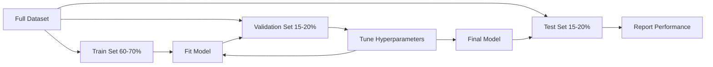

# Avaliação de modelo
# 模型评估


> Um modelo é tão bom quanto a forma como o medes.

> O bom e o mau do modelo depende de como você o mede.

**Type:** Build | **类型：** 构建
**Languages:** Python
**Prerequisites:** Phase 1 (Probability & Distributions, Statistics for ML), Phase 2 Lessons 1-8 | **前置知识：** Phase 1（概率与分布、统计学），Phase 2 第 1-8 课
**Time:** ~90 minutes | **时间：** 约 90 分钟

## Objetivos de aprendizagem

- Implementar a validação cruzada de K-fold e de K-fold estratificada a partir do zero e explicar por que a estratificação é importante para dados desequilibrados
  Desde zero realizando K 折和分层 K 折交叉验证, explicar por que as divisões de dados são importantes para os desequilíbrios
- Computação de precisão, recall, F1, AUC-ROC e métricas de regressão (MSE, RMSE, MAE, R-quadrado) a partir do zero
  Desde zero cálculo de precisão de taxa, taxa de recomposição, F1 AUC-ROC, e índice de regresso (MSE, RMSE, MAE, R-squared)
- Interpreta as curvas de aprendizagem para diagnosticar se um modelo sofre de alto viés ou alta variância
                                                                                                                                                                                                                                                                                                                                                                                                                                                                                                                               
- Identificar erros comuns de avaliação, incluindo vazamento de dados, seleção errada de métricas e contaminação do conjunto de ensaio
  Identificação de erros de avaliação de frequência, incluindo a fuga de dados, a seleção de indicadores de erro e a contaminação do conjunto de testes


> **【中文解读】**
> 模型评估回答模型到底好不好──准确率、精确率、召回率、F1、AUC-ROC é分类指标;MSE、MAE、R^2 é regresso指标──交叉验证防止过拟评估──sklearn 中的 cross_val_score/classification_report──

> **【拓展：模型评估失误导致的生产事故】**
> A avaliação insuficiente da Amazon em dados de treinamento não é uma avaliação independente, que leva à discriminação sistemática contra as mulheres candidatas, que acaba sendo forçada a fazer isso.

## O problema é o problema da introdução

Treinou um modelo, tem 95% de precisão nos seus dados.

> Você treinou um modelo. Ele obtém 95% de precisão nos seus dados.

- Talvez. - Sim. Talvez não. Se 95% dos seus dados pertencem a uma classe, um modelo que sempre prevê que a classe obtém 95% de precisão enquanto é completamente inútil. Se avaliarmos com base nos mesmos dados que treinamos, o número de 95% não tem sentido porque o modelo apenas memorizou as respostas. Se o seu conjunto de dados tiver um componente de tempo e você misturou aleatoriamente antes de dividir, o seu modelo pode estar usando dados futuros para prever o passado.

> Talvez bom, talvez ruim. Se 95% dos dados pertencem a uma categoria, sempre prevê que o modelo dessa categoria obtenha 95% de precisão, mas completamente inútil. Se você avaliar os dados treinados, 95% desse número não faz sentido, porque o modelo apenas lembra a resposta.

A avaliação de modelos é onde a maioria dos projetos de ML vai mal. A métrica errada faz um modelo ruim parecer bom. A divisão errada deixa um modelo enganar. A comparação errada faz você escolher o modelo pior. Obter a avaliação correta não é opcional. É a diferença entre um modelo que funciona na produção e um que falha no momento em que vê dados reais.

>  avaliação de modelos é onde a maioria dos projetos de ML sai erroneamente  indicador errôneo faz um modelo ruim parecer bom  classificação errônea faz um modelo enganar  comparação errada faz você escolher um modelo pior  avaliação correta não é opcional  é a diferença entre um modelo eficaz na produção e um modelo que encontra dados reais e falha

> **【中文解读】**
> 模型评估最容易犯三错误: 1) avaliar em dados de treinamento; 2) usar indicadores errados; 3) divulgar dados; 3) divulgar informações no processo de treinamento;

## O conceito central.

### Treno, validação, teste



Três divisões, três propósitos:

> Três tipos de utilização:

- **Training set**O modelo aprende com base nesses dados e vê estes exemplos durante o treinamento.
  **训练集**Modelo de aprendizagem:
- **Validation set**O modelo nunca se baseia nesses dados, mas as suas decisões são influenciadas por eles.
  **验证集**O modelo não está treinado sobre esses dados, mas suas decisões são influenciadas por ele.
- **Test set**Se olharmos para o desempenho do teste e depois voltarmos a alterar o nosso modelo, não é mais um conjunto de teste, mas um segundo conjunto de validação.
  **测试集**Se você olhar para o teste de desempenho depois de voltar para modificar o modelo, ele já não é mais um conjunto de testes.

O conjunto de testes é a garantia de que o desempenho relatado reflete como o modelo irá fazer com dados verdadeiramente invisíveis.

> O testset é a garantia de sua retenção, garantindo que o desempenho do relatório reflita o modelo em dados verdadeiramente invisíveis.

### Validação cruzada K-fold

Com pequenos conjuntos de dados, um único treno/validação divide os dados e dá estimativas ruidosas.

>  Para os pequenos conjuntos de dados, o treinamento/verificação individual divide os gastos com dados e fornece estimativas de ruído.

```mermaid
flowchart TB
    subgraph Fold1["Fold 1"]
        direction LR
        V1["Val"] --- T1a["Train"] --- T1b["Train"] --- T1c["Train"] --- T1d["Train"]
    end
    subgraph Fold2["Fold 2"]
        direction LR
        T2a["Train"] --- V2["Val"] --- T2b["Train"] --- T2c["Train"] --- T2d["Train"]
    end
    subgraph Fold3["Fold 3"]
        direction LR
        T3a["Train"] --- T3b["Train"] --- V3["Val"] --- T3c["Train"] --- T3d["Train"]
    end
    subgraph Fold4["Fold 4"]
        direction LR
        T4a["Train"] --- T4b["Train"] --- T4c["Train"] --- V4["Val"] --- T4d["Train"]
    end
    subgraph Fold5["Fold 5"]
        direction LR
        T5a["Train"] --- T5b["Train"] --- T5c["Train"] --- T5d["Train"] --- V5["Val"]
    end
    Fold1 --> R["Average scores"]
    Fold2 --> R
    Fold3 --> R
    Fold4 --> R
    Fold5 --> R
```



1. Dividir os dados em folhas de tamanho igual a K
   Dividir os dados em K 个大相等折
2. Para cada dobra, empenhe-se nas dobras K-1 e valida-se na dobra restante
   Para cada um dos fones, durante o treinamento do K-1, durante o resto do fone,
3. Mediana das pontuações de validação K
   Para K 个验证分数取平均

K=5 ou K=10 são escolhas padrão. Cada ponto de dados é usado para validação exatamente uma vez. A pontuação média é uma estimativa mais estável do que qualquer divisão única.

> K=5 ou K=10 é uma escolha padrão. Cada ponto de dados é usado para verificar uma vez.

> K=5 ou K=10 é uma escolha padrão. Cada ponto de dados é usado para verificar uma vez.

**Stratified K-fold**A distribuição de classes em cada dobra é preservada. Se o seu conjunto de dados for 70% classe A e 30% classe B, cada dobra terá aproximadamente a mesma proporção.

> **分层 K 折**Se o seu conjunto de dados for 70% A e 30% B, cada fone terá uma proporção quase igual.

> **分层 K 折**Se o conjunto de dados for 70% da categoria A e 30% da categoria B, cada fenda terá uma proporção quase igual. Isto é importante para o conjunto de dados desequilibrado, pois, quando for possível, a divisão poderá colocar todas as pequenas categorias de amostras na mesma fenda.

### Metricas de classificação

**Confusion matrix**Para classificação binária:

> **混淆矩阵**Base:

> **混淆矩阵**Base:

|  | Predicted Positive | Predicted Negative |
|--|---|---|
| Actually Positive | True Positive (TP) | False Negative (FN) |
| Actually Negative | False Positive (FP) | True Negative (TN) |

A partir desta matriz, todas as outras métricas seguem:

> A partir desta rotina, todos os outros indicadores são:

> A partir desta rotina, todos os outros indicadores são:

- **Accuracy**= (TP + TN) / (TP + TN + FP + FN). Fração de previsões corretas.
  **准确率**= (TP + TN) / (TP + TN + FP + FN)。正确预测的比例──类别不平衡时具有误导性──
- **Precision**= TP / (TP + FP). De todas as coisas previstas positivas, quantas foram realmente?
  **精确率**= TP / (TP + FP) ―― entre todas as previsões para exames reais, há quantas reais para exames reais?
- **Recall**(sensibilidade) = TP / (TP + FN). De todos os positivos reais, quantos capturamos?
  **召回率**(sensitividade) = TP / (TP + FN) ⋅ Em todos os exemplos reais, quanto capturamos?
- **F1 score**= 2 * precisão * recall / (precisão + recall).
  **F1 分数**= 2 * 精确率 * 召回率 / (精确率 + 召回率) ⋅ 精确率和召回率调和平均── 在两者中都不显占优时平衡在两者中──
- **AUC-ROC**Área sob a curva de características operacionais do receptor. Descreve a taxa positiva verdadeira vs taxa positiva falsa em vários limiares de classificação. AUC = 0,5 significa adivinhação aleatória, AUC = 1,0 significa separação perfeita.
  **AUC-ROC**:ROC 曲线下面积──在不同分类值下绘制真实率和假正率──AUC = 0,5 表示随机猜测,AUC = 1.0 表示完美区分──与值无关:它衡量模型将正样本排在负样本前面的能力,无论你选择什么截断值──

### Metricas de regressão

- **MSE**(Erro quadrado médio) = mean((y_true - y_pred) ^ 2). Penaliza erros grandes quadraticamente.
  **均方误差 (MSE)**= mean(((y_true - y_pred) ^2)。
- **RMSE**(Erro quadrado da raiz) = sqrt(MSE). As mesmas unidades que a variável alvo. É mais fácil de interpretar do que MSE.
  **均方根误差 (RMSE)**= sqrt(MSE)。 Com o mesmo valor de metação.
- **MAE**(Mediante Erro Absoluto) = média de erro (y_true - y_pred = = = = = = = = = = = = = = = = = = = = = = = = = = = = = = = = = = = = = = = = = = = = = = = = = = = = = = = = = = = = = = = = = = = = = = = = = = = = = = = = = = = = = = = = = = = = = = = = = = = = = = = = = = = = = = = = = = = = = = = = = = = = = = = = = = = = = = = = = = = = = = = = = = = = = = = = = = = = = = = = = = = = = = = = = = = = = = = = = = = = = = = = = = = = = = = = = = = = = = = = = = = = = = = = = = = = = = = = = = = = = = = = = = = = = = = = = = = = = = = = = = = = = = = = = = = = = = = = = = = = = = = = = = = = = = = = = = = = = = = = = = = = = = = = = = = = = = = = = = = = = = = = = = = = = = = = = = = = = = = = = = = = = = = = = = = = = = = = = = = = = = = = = = = = = = = = = = = = = = = = = = = = = = = = = = = = = = = = = = = = = = = = = = = = = = = = = = = = = = = = = = = = = = = = = = = = = = = = = = = = = = = = = = = = = = = = = = = = = = = = = = = = = = = = = = = = = = = = = = = = = = = = = = = = = = = = = = = = = = = = = = = = = = = =
  **平均绝对误差 (MAE)**= média de variação de valores em relação aos valores de variação de valores em relação aos valores de variação de valores em relação aos valores de variação de valores em relação aos valores de variação de valores em relação aos valores de variação de valores em relação aos valores de variação de valores em relação aos valores de variação de valores em relação aos valores de variação de valores em relação aos valores de variação de valores em relação aos valores de variação de valores em relação aos valores de variação de valores em relação aos valores de variação de variação de valores em relação aos valores de variação de variação de valores em relação aos valores de variação de variação de valores em relação aos valores de variação de variação de valores em relação aos valores de variação de variação de valores em relação aos valores de variação de variação de valores em relação aos valores de variação de variação de valores em relação aos valores de variação de variação de variação de valores em relação aos valores de variação de variação de variação de variação de valores em relação ao valor de variação de variação de variação de variação de variação de variação de variação de variação de variação de variação de variação de variação de variação de variação de variação de variação de variação de variação de variação de variação de variação de variação de variação de variação de variação de variação de variação de variação de variação de variação de variação de variação de variação de variação de variação de variação de variação de variação de variação de variação de variação de variação de variação de variação de variação de variação de variação de variação de variação de variação de variação de variação de variação de variação de variação de variação de variação de variação de variação de variação de variação de variação de variação de variação de variação de variação de variação de variação de variação de variação de variação de variação de variação de variação de variação de variação de variação de variação de variação de.
- **R-squared**= 1 - SS_res / SS_tot, onde SS_res = soma((y_true - y_pred) ^2) e SS_tot = soma(((y_true - y_mean) ^2). Fração de variância explicada pelo modelo. R^2 = 1,0 é perfeito. R^2 = 0,0 significa que o modelo não é melhor do que sempre prever a média. R^2 pode ser negativo se o modelo for pior que a média.
  **决定系数 (R-squared)**= 1 - SS_res / SS_tot, em que SS_res = soma(((y_true - y_pred) ^2), SS_tot = soma((((y_true - y_mean) ^2)。 modelo explicação de方差比例──R^2 = 1.0 完美──R^2 = 0.0 表示模型不比始终预测均值好──R^2 可以为负,如果模型比预测均值还差──

### Curvas de aprendizagem

Resultados de formação e validação de planos em função do tamanho do conjunto de formação:

> Desenhar o número de treinamento e o número de teste com a curva de grandes variações do conjunto de treinamento:

> Descrever as funções de um conjunto de treinos:

- **High bias (underfitting)**A redução da taxa de variação de dados é um problema de grande quantidade de dados.
  **高偏差（欠拟合）**O aumento de mais dados não vai ajudar. Você precisa de um modelo mais complexo.
- **High variance (overfitting)**A diferença entre os dois está grande, mas a adição de mais dados deve ajudar.
  **高方差（过拟合）**O número de pontos de treinamento é alto, mas o número de pontos de verificação é muito baixo.

### Curvas de validação

Resultados de formação e validação de gráficos em função de um hiperparâmetro:

> Desenhar a formação de divisões e de verificações de divisões com a variação de superparâmetros:

> Descrever a função de um superparâmetro como um traço de funções de treinamento e de verificação:

- Com baixa complexidade: ambas as pontuações são baixas (sub-ajustamento)
  复杂度低时:两个分数都低(欠拟合)
- Na complexidade certa: ambas as pontuações são altas e próximas
  复杂度合适时: dois分数都高且接近
- Em situações de elevada complexidade: a pontuação de formação permanece elevada, mas a pontuação de validação diminui (overfitting)
  复杂度高时: training分数保持高但验证分数下降(过拟合)

O valor óptimo do hiperparâmetro é o ponto máximo da pontuação de validação.

> O valor máximo de superparâmetro é a posição em que o número de testes atinge o valor máximo.

> O valor máximo de superparâmetro é a posição em que o número de testes atinge o valor máximo.

### Erros comuns na avaliação

**Data leakage**Exemplos: instalação de um escalador no conjunto de dados completo antes de dividir, incluindo dados futuros na previsão de séries temporais, usando uma característica derivada do alvo.

> **数据泄漏**Exemplo: em divisão previamente para um envelope de dados completos, em sequência de tempo, prevê-los contendo dados futuros, utiliza-los para traçar os seus objetivos.

**Class imbalance**O modelo que sempre prevê "legítimo" obtém 99% de precisão. Use precisão, recall, F1, ou AUC-ROC em vez disso.

> **类别不平衡**:99% das transações são legais, 1% são fraudulentas.

**Wrong metric**Otimizar a precisão quando se deve otimizar a chamada (diagnóstico médico) ou otimizar o RMSE quando os dados têm valores extremos (usar MAE em vez disso).

> **错误指标**O valor de recorrência deve ser o valor de recorrência de recorrência de recorrência de recorrência de recorrência de recorrência de recorrência de recorrência de recorrência de recorrência de recorrência de recorrência de recorrência de recorrência de recorrência de recorrência de recorrência de recorrência de recorrência de recorrência de recorrência de recorrência de recorrência de recorrência de recorrência de recorrência de recorrência de recorrência de recorrência de recorrência de recorrência de recorrência de recorrência de recorrência de recorrência de recorrência de recorrência de recorrência de recorrência de recorrência de recorrência de recorrência de recorrência de recorrência de recorrência de recorrência de recorrência de recorrência de recorrência de recorrência de recorrência de recorrência de recorrência de recorrência de recorrência de recorrência de recorrência de recorrência de recorrência de recorrência de recorrência de recorrência de recorrência de recorrência de recorrência de recorrência de recorrência de recorrência de recorrência de recorrência de recorrência de recorrência de recorrência de recorrência de recorrência de recorrência de recorrência de recorrência de recorrência de recorrência de recorrência de recorrência de recorrência de recorrência de recorrência de recorrência de recorrência de recorrência de recorrência de recorrência de recorrência de recorrência de recorrência de recorrência de recorrência de recorrência de recorrência de recorrência de recorrência de recorrência de recorrência de recorrência de recorrência de recorrência de recorrência de recorrência de recorrência de recorrência de recorrência de recorrência de recorrência de recorrência de recorrência de recorrência de recorrência de recorrência de recorrência de recorrência de recorrência de recorrência de recorrência de recorrência de recorrência de recorrência de recorrência

**Not using stratified splits**A análise de dados não equilibrados pode implicar que uma divisão aleatória coloque muito poucas amostras minoritárias no pliegue de validação, dando estimativas instáveis.

> **不使用分层划分**A análise dos dados não equilibrados, conforme o tempo for, pode incluir uma pequena quantidade de amostras, dando uma estimativa instável.

**Testing too often**A cada vez que se observa o desempenho do ensaio e se ajusta, se encaixa no conjunto de ensaio.

> **测试过于频繁**Cada vez que você vê o teste de desempenho é ajustado, você está em conformidade com o teste de conjunto.

## Construí-lo e realizei-o.

> **【中文解读】**
> Desde zero implementação de verificação de transferência (K-fold 和分层 K-fold) 分类指标(精确率、召回率、F1、AUC-ROC) 和归归指标(MSE、RMSE、MAE、R2) 交叉验证是评估模型性能的标准方法,分层 K-fold 确保每折中类比例一致,对不平衡数据至关重要――

> **【拓展：学习曲线——诊断模型问题的利器】**
> Curva de aprendizagem) desenhar erros de treinamento e erros de verificação com a tendência de mudança da quantidade de dados de treinamento, é um instrumento intuitivo para diagnosticar problemas de alto preconceito/alto preconceito.
```figure
precision-recall-threshold
```

## Construí-lo

### Passo 1: Ferro/validação/teste dividido

```python
import random
import math


def train_val_test_split(X, y, train_ratio=0.6, val_ratio=0.2, seed=42):
    random.seed(seed)
    n = len(X)
    indices = list(range(n))
    random.shuffle(indices)

    train_end = int(n * train_ratio)
    val_end = int(n * (train_ratio + val_ratio))

    train_idx = indices[:train_end]
    val_idx = indices[train_end:val_end]
    test_idx = indices[val_end:]

    X_train = [X[i] for i in train_idx]
    y_train = [y[i] for i in train_idx]
    X_val = [X[i] for i in val_idx]
    y_val = [y[i] for i in val_idx]
    X_test = [X[i] for i in test_idx]
    y_test = [y[i] for i in test_idx]

    return X_train, y_train, X_val, y_val, X_test, y_test
```

### Passo 2: Validação cruzada de K-fold e de K-fold estratificada

```python
def kfold_split(n, k=5, seed=42):
    random.seed(seed)
    indices = list(range(n))
    random.shuffle(indices)

    fold_size = n // k
    folds = []

    for i in range(k):
        start = i * fold_size
        end = start + fold_size if i < k - 1 else n
        val_idx = indices[start:end]
        train_idx = indices[:start] + indices[end:]
        folds.append((train_idx, val_idx))

    return folds


def stratified_kfold_split(y, k=5, seed=42):
    random.seed(seed)

    class_indices = {}
    for i, label in enumerate(y):
        class_indices.setdefault(label, []).append(i)

    for label in class_indices:
        random.shuffle(class_indices[label])

    folds = [{"train": [], "val": []} for _ in range(k)]

    for label, indices in class_indices.items():
        fold_size = len(indices) // k
        for i in range(k):
            start = i * fold_size
            end = start + fold_size if i < k - 1 else len(indices)
            val_part = indices[start:end]
            train_part = indices[:start] + indices[end:]
            folds[i]["val"].extend(val_part)
            folds[i]["train"].extend(train_part)

    return [(f["train"], f["val"]) for f in folds]


def cross_validate(X, y, model_fn, k=5, metric_fn=None, stratified=False):
    n = len(X)

    if stratified:
        folds = stratified_kfold_split(y, k)
    else:
        folds = kfold_split(n, k)

    scores = []
    for train_idx, val_idx in folds:
        X_train = [X[i] for i in train_idx]
        y_train = [y[i] for i in train_idx]
        X_val = [X[i] for i in val_idx]
        y_val = [y[i] for i in val_idx]

        model = model_fn()
        model.fit(X_train, y_train)
        predictions = [model.predict(x) for x in X_val]

        if metric_fn:
            score = metric_fn(y_val, predictions)
        else:
            score = sum(1 for yt, yp in zip(y_val, predictions) if yt == yp) / len(y_val)
        scores.append(score)

    return scores
```

### Passo 3: Matriz de confusão e métricas de classificação

> O terceiro passo:混矩阵和分类指标── de zero a zero a realizar TP/TN/FP/FN 计数, re-advogar a exactação, a exactação, a exactação, a exactação, a exactação, a exactação, a exactação, a exactação, a exactação, a exactação, a exactação, a exactação, a exactação, a exactação, a exactação, a exactação, a exactação, a exactação, a exactação, a exactação, a exactação, a exactação, a exactação, a exactação, a exactação, a exactação, a exactação, a exactação, a exactação, a exactação, a exactação, a exactação, a exactação, a exactação, a exactação, a exacta e a exacta.

```python
def confusion_matrix(y_true, y_pred):
    tp = sum(1 for yt, yp in zip(y_true, y_pred) if yt == 1 and yp == 1)
    tn = sum(1 for yt, yp in zip(y_true, y_pred) if yt == 0 and yp == 0)
    fp = sum(1 for yt, yp in zip(y_true, y_pred) if yt == 0 and yp == 1)
    fn = sum(1 for yt, yp in zip(y_true, y_pred) if yt == 1 and yp == 0)
    return tp, tn, fp, fn


def accuracy(y_true, y_pred):
    tp, tn, fp, fn = confusion_matrix(y_true, y_pred)
    total = tp + tn + fp + fn
    return (tp + tn) / total if total > 0 else 0.0


def precision(y_true, y_pred):
    tp, tn, fp, fn = confusion_matrix(y_true, y_pred)
    return tp / (tp + fp) if (tp + fp) > 0 else 0.0


def recall(y_true, y_pred):
    tp, tn, fp, fn = confusion_matrix(y_true, y_pred)
    return tp / (tp + fn) if (tp + fn) > 0 else 0.0


def f1_score(y_true, y_pred):
    p = precision(y_true, y_pred)
    r = recall(y_true, y_pred)
    return 2 * p * r / (p + r) if (p + r) > 0 else 0.0


def roc_curve(y_true, y_scores):
    thresholds = sorted(set(y_scores), reverse=True)
    tpr_list = []
    fpr_list = []

    total_positives = sum(y_true)
    total_negatives = len(y_true) - total_positives

    for threshold in thresholds:
        y_pred = [1 if s >= threshold else 0 for s in y_scores]
        tp = sum(1 for yt, yp in zip(y_true, y_pred) if yt == 1 and yp == 1)
        fp = sum(1 for yt, yp in zip(y_true, y_pred) if yt == 0 and yp == 1)

        tpr = tp / total_positives if total_positives > 0 else 0.0
        fpr = fp / total_negatives if total_negatives > 0 else 0.0

        tpr_list.append(tpr)
        fpr_list.append(fpr)

    return fpr_list, tpr_list, thresholds


def auc_roc(y_true, y_scores):
    fpr_list, tpr_list, _ = roc_curve(y_true, y_scores)

    pairs = sorted(zip(fpr_list, tpr_list))
    fpr_sorted = [p[0] for p in pairs]
    tpr_sorted = [p[1] for p in pairs]

    area = 0.0
    for i in range(1, len(fpr_sorted)):
        width = fpr_sorted[i] - fpr_sorted[i - 1]
        height = (tpr_sorted[i] + tpr_sorted[i - 1]) / 2
        area += width * height

    return area
```

### Passo 4: Metricas de regressão

> O MESE é um sistema de análise de dados que permite a análise de dados e de dados, que permite a análise de dados e de dados.

```python
def mse(y_true, y_pred):
    n = len(y_true)
    return sum((yt - yp) ** 2 for yt, yp in zip(y_true, y_pred)) / n


def rmse(y_true, y_pred):
    return math.sqrt(mse(y_true, y_pred))


def mae(y_true, y_pred):
    n = len(y_true)
    return sum(abs(yt - yp) for yt, yp in zip(y_true, y_pred)) / n


def r_squared(y_true, y_pred):
    mean_y = sum(y_true) / len(y_true)
    ss_res = sum((yt - yp) ** 2 for yt, yp in zip(y_true, y_pred))
    ss_tot = sum((yt - mean_y) ** 2 for yt in y_true)
    if ss_tot == 0:
        return 0.0
    return 1.0 - ss_res / ss_tot
```

### Passo 5: Curvas de aprendizagem

> 第五步:学习曲线── gradualmente aumentar o número de dados, o número de registros e o número de verificações──两条曲线都低→高偏差(欠配); training高但验证低→高方差(过拟合)── é o instrumento mais intuitivo para o diagnóstico.

```python
def learning_curve(X, y, model_fn, metric_fn, train_sizes=None, val_ratio=0.2, seed=42):
    random.seed(seed)
    n = len(X)
    indices = list(range(n))
    random.shuffle(indices)

    val_size = int(n * val_ratio)
    val_idx = indices[:val_size]
    pool_idx = indices[val_size:]

    X_val = [X[i] for i in val_idx]
    y_val = [y[i] for i in val_idx]

    if train_sizes is None:
        train_sizes = [int(len(pool_idx) * r) for r in [0.1, 0.2, 0.4, 0.6, 0.8, 1.0]]

    train_scores = []
    val_scores = []

    for size in train_sizes:
        subset = pool_idx[:size]
        X_train = [X[i] for i in subset]
        y_train = [y[i] for i in subset]

        model = model_fn()
        model.fit(X_train, y_train)

        train_pred = [model.predict(x) for x in X_train]
        val_pred = [model.predict(x) for x in X_val]

        train_scores.append(metric_fn(y_train, train_pred))
        val_scores.append(metric_fn(y_val, val_pred))

    return train_sizes, train_scores, val_scores
```

### Passo 6: Um classificador simples para testes, mais a demonstração completa

> 第六步: um simples logical regression classificador, usado para testar a avaliação do código.

```python
class SimpleLogistic:
    def __init__(self, lr=0.1, epochs=100):
        self.lr = lr
        self.epochs = epochs
        self.weights = None
        self.bias = 0.0

    def sigmoid(self, z):
        z = max(-500, min(500, z))
        return 1.0 / (1.0 + math.exp(-z))

    def fit(self, X, y):
        n_features = len(X[0])
        self.weights = [0.0] * n_features
        self.bias = 0.0

        for _ in range(self.epochs):
            for xi, yi in zip(X, y):
                z = sum(w * x for w, x in zip(self.weights, xi)) + self.bias
                pred = self.sigmoid(z)
                error = yi - pred
                for j in range(n_features):
                    self.weights[j] += self.lr * error * xi[j]
                self.bias += self.lr * error

    def predict_proba(self, x):
        z = sum(w * xi for w, xi in zip(self.weights, x)) + self.bias
        return self.sigmoid(z)

    def predict(self, x):
        return 1 if self.predict_proba(x) >= 0.5 else 0


class SimpleLinearRegression:
    def __init__(self, lr=0.001, epochs=200):
        self.lr = lr
        self.epochs = epochs
        self.weights = None
        self.bias = 0.0

    def fit(self, X, y):
        n_features = len(X[0])
        self.weights = [0.0] * n_features
        self.bias = 0.0
        n = len(X)

        for _ in range(self.epochs):
            for xi, yi in zip(X, y):
                pred = sum(w * x for w, x in zip(self.weights, xi)) + self.bias
                error = yi - pred
                for j in range(n_features):
                    self.weights[j] += self.lr * error * xi[j] / n
                self.bias += self.lr * error / n

    def predict(self, x):
        return sum(w * xi for w, xi in zip(self.weights, x)) + self.bias


def standardize(values):
    n = len(values)
    mean = sum(values) / n
    var = sum((v - mean) ** 2 for v in values) / n
    std = math.sqrt(var) if var > 0 else 1.0
    return [(v - mean) / std for v in values], mean, std


def make_classification_data(n=300, seed=42):
    random.seed(seed)
    X = []
    y = []
    for _ in range(n):
        x1 = random.gauss(0, 1)
        x2 = random.gauss(0, 1)
        label = 1 if (x1 + x2 + random.gauss(0, 0.5)) > 0 else 0
        X.append([x1, x2])
        y.append(label)
    return X, y


def make_regression_data(n=200, seed=42):
    random.seed(seed)
    X = []
    y = []
    for _ in range(n):
        x1 = random.uniform(0, 10)
        x2 = random.uniform(0, 5)
        target = 3 * x1 + 2 * x2 + random.gauss(0, 2)
        X.append([x1, x2])
        y.append(target)
    return X, y


def make_imbalanced_data(n=300, minority_ratio=0.05, seed=42):
    random.seed(seed)
    X = []
    y = []
    for _ in range(n):
        if random.random() < minority_ratio:
            x1 = random.gauss(3, 0.5)
            x2 = random.gauss(3, 0.5)
            label = 1
        else:
            x1 = random.gauss(0, 1)
            x2 = random.gauss(0, 1)
            label = 0
        X.append([x1, x2])
        y.append(label)
    return X, y


if __name__ == "__main__":
    X_clf, y_clf = make_classification_data(300)

    print("=== Train/Validation/Test Split ===")
    X_train, y_train, X_val, y_val, X_test, y_test = train_val_test_split(X_clf, y_clf)
    print(f"  Train: {len(X_train)}, Val: {len(X_val)}, Test: {len(X_test)}")
    print(f"  Train class distribution: {sum(y_train)}/{len(y_train)} positive")
    print(f"  Val class distribution: {sum(y_val)}/{len(y_val)} positive")

    # 主程序：完整演示训练/验证/测试划分、分类指标（含混淆矩阵、F1、AUC-ROC）、K 折交叉验证、回归指标（MSE/RMSE/MAE/R²）、学习曲线、不平衡数据评估。每个环节都展示具体数值，让评估方法变得具体。

    model = SimpleLogistic(lr=0.1, epochs=200)
    model.fit(X_train, y_train)

    print("\n=== Classification Metrics ===")
    y_pred = [model.predict(x) for x in X_test]
    tp, tn, fp, fn = confusion_matrix(y_test, y_pred)
    print(f"  Confusion matrix: TP={tp}, TN={tn}, FP={fp}, FN={fn}")
    print(f"  Accuracy:  {accuracy(y_test, y_pred):.4f}")
    print(f"  Precision: {precision(y_test, y_pred):.4f}")
    print(f"  Recall:    {recall(y_test, y_pred):.4f}")
    print(f"  F1 Score:  {f1_score(y_test, y_pred):.4f}")

    y_scores = [model.predict_proba(x) for x in X_test]
    auc = auc_roc(y_test, y_scores)
    print(f"  AUC-ROC:   {auc:.4f}")

    print("\n=== K-Fold Cross-Validation (K=5) ===")
    cv_scores = cross_validate(
        X_clf, y_clf,
        model_fn=lambda: SimpleLogistic(lr=0.1, epochs=200),
        k=5,
        metric_fn=accuracy,
    )
    mean_cv = sum(cv_scores) / len(cv_scores)
    std_cv = math.sqrt(sum((s - mean_cv) ** 2 for s in cv_scores) / len(cv_scores))
    print(f"  Fold scores: {[round(s, 4) for s in cv_scores]}")
    print(f"  Mean: {mean_cv:.4f} (+/- {std_cv:.4f})")

    print("\n=== Stratified K-Fold Cross-Validation (K=5) ===")
    strat_scores = cross_validate(
        X_clf, y_clf,
        model_fn=lambda: SimpleLogistic(lr=0.1, epochs=200),
        k=5,
        metric_fn=accuracy,
        stratified=True,
    )
    strat_mean = sum(strat_scores) / len(strat_scores)
    strat_std = math.sqrt(sum((s - strat_mean) ** 2 for s in strat_scores) / len(strat_scores))
    print(f"  Fold scores: {[round(s, 4) for s in strat_scores]}")
    print(f"  Mean: {strat_mean:.4f} (+/- {strat_std:.4f})")

    print("\n=== Imbalanced Data: Why Accuracy Lies ===")
    X_imb, y_imb = make_imbalanced_data(300, minority_ratio=0.05)
    positives = sum(y_imb)
    print(f"  Class distribution: {positives} positive, {len(y_imb) - positives} negative ({positives/len(y_imb)*100:.1f}% positive)")

    always_negative = [0] * len(y_imb)
    print(f"  Always-negative baseline:")
    print(f"    Accuracy:  {accuracy(y_imb, always_negative):.4f}")
    print(f"    Precision: {precision(y_imb, always_negative):.4f}")
    print(f"    Recall:    {recall(y_imb, always_negative):.4f}")
    print(f"    F1 Score:  {f1_score(y_imb, always_negative):.4f}")

    X_tr_i, y_tr_i, X_v_i, y_v_i, X_te_i, y_te_i = train_val_test_split(X_imb, y_imb)
    model_imb = SimpleLogistic(lr=0.5, epochs=500)
    model_imb.fit(X_tr_i, y_tr_i)
    y_pred_imb = [model_imb.predict(x) for x in X_te_i]
    print(f"\n  Trained model on imbalanced data:")
    print(f"    Accuracy:  {accuracy(y_te_i, y_pred_imb):.4f}")
    print(f"    Precision: {precision(y_te_i, y_pred_imb):.4f}")
    print(f"    Recall:    {recall(y_te_i, y_pred_imb):.4f}")
    print(f"    F1 Score:  {f1_score(y_te_i, y_pred_imb):.4f}")

    print("\n=== Regression Metrics ===")
    X_reg, y_reg = make_regression_data(200)

    col0 = [x[0] for x in X_reg]
    col1 = [x[1] for x in X_reg]
    col0_s, m0, s0 = standardize(col0)
    col1_s, m1, s1 = standardize(col1)
    X_reg_scaled = [[col0_s[i], col1_s[i]] for i in range(len(X_reg))]

    X_tr_r, y_tr_r, X_v_r, y_v_r, X_te_r, y_te_r = train_val_test_split(X_reg_scaled, y_reg)
    reg_model = SimpleLinearRegression(lr=0.01, epochs=500)
    reg_model.fit(X_tr_r, y_tr_r)
    y_pred_r = [reg_model.predict(x) for x in X_te_r]

    print(f"  MSE:       {mse(y_te_r, y_pred_r):.4f}")
    print(f"  RMSE:      {rmse(y_te_r, y_pred_r):.4f}")
    print(f"  MAE:       {mae(y_te_r, y_pred_r):.4f}")
    print(f"  R-squared: {r_squared(y_te_r, y_pred_r):.4f}")

    mean_baseline = [sum(y_tr_r) / len(y_tr_r)] * len(y_te_r)
    print(f"\n  Mean baseline:")
    print(f"    MSE:       {mse(y_te_r, mean_baseline):.4f}")
    print(f"    R-squared: {r_squared(y_te_r, mean_baseline):.4f}")

    print("\n=== Learning Curve ===")
    sizes, train_sc, val_sc = learning_curve(
        X_clf, y_clf,
        model_fn=lambda: SimpleLogistic(lr=0.1, epochs=200),
        metric_fn=accuracy,
    )
    print(f"  {'Size':>6} {'Train':>8} {'Val':>8}")
    for s, tr, va in zip(sizes, train_sc, val_sc):
        print(f"  {s:>6} {tr:>8.4f} {va:>8.4f}")

    print("\n=== Statistical Model Comparison ===")
    model_a_scores = cross_validate(
        X_clf, y_clf,
        model_fn=lambda: SimpleLogistic(lr=0.1, epochs=100),
        k=5, metric_fn=accuracy,
    )
    model_b_scores = cross_validate(
        X_clf, y_clf,
        model_fn=lambda: SimpleLogistic(lr=0.1, epochs=500),
        k=5, metric_fn=accuracy,
    )
    diffs = [a - b for a, b in zip(model_a_scores, model_b_scores)]
    mean_diff = sum(diffs) / len(diffs)
    std_diff = math.sqrt(sum((d - mean_diff) ** 2 for d in diffs) / len(diffs))
    t_stat = mean_diff / (std_diff / math.sqrt(len(diffs))) if std_diff > 0 else 0.0
    print(f"  Model A (100 epochs) mean: {sum(model_a_scores)/len(model_a_scores):.4f}")
    print(f"  Model B (500 epochs) mean: {sum(model_b_scores)/len(model_b_scores):.4f}")
    print(f"  Mean difference: {mean_diff:.4f}")
    print(f"  Paired t-statistic: {t_stat:.4f}")
    print(f"  (|t| > 2.78 for significance at p<0.05 with df=4)")
```

## Use-o com o framework implementado.

Com o scikit-learn, a avaliação é incorporada no fluxo de trabalho:

> Utilizando o aprendizado, avaliações estão inseridas no trabalho:

```python
from sklearn.model_selection import cross_val_score, StratifiedKFold, learning_curve
from sklearn.metrics import (
    accuracy_score, precision_score, recall_score, f1_score,
    roc_auc_score, confusion_matrix, mean_squared_error, r2_score,
)
from sklearn.linear_model import LogisticRegression

model = LogisticRegression()
scores = cross_val_score(model, X, y, cv=StratifiedKFold(5), scoring="f1")
```

As versões do zero mostram exatamente o que a validação cruzada faz (não há magia, apenas para-loops e rastreamento de índice), como cada métrica é calculada (só contando TP /FP /TN / FN), e por que a estratificação importa (preservando as proporções de classe em cada dobra).

> A partir da versão zero, a verificação de divisão foi mostrada com precisão.

## Envia-o . Produto .

Esta lição produz:
- `outputs/skill-evaluation.md`- uma competência que abrange a estratégia de avaliação dos modelos de classificação e regressão

> 本课产出:
> - `outputs/skill-evaluation.md`- abrangendo as competências de estratégia de avaliação de modelos de classificação e regresso

> **【拓展：A/B 测试——模型评估的终极标准】**
> Na indústria, os índices de avaliação offline (%) são apenas uma referência, a avaliação real é feita em A/B testes online. O Google executa mais de 10.000 testes A/B por ano para avaliar melhorias no algoritmo de pesquisa. O Netflix usa A/B testes para decidir se o algoritmo é recomendado. O Uber usa A/B testes para avaliar a estratégia de fixação de preços.

> **【中文解读】**
> ROC 曲线绘制不同值下 TPR(真率) vs FPR(假正率),AUC é a curva abaixo da face da face da face (0.5=随机,1.0=完美) ・・・AUPRC(精确率-召回率曲线下面积) em dados desequilibrados em comparação com AUC-ROC (更有信息量).

## Exercícios.

1. Implementar curvas de recall de precisão: precisão do gráfico vs recall em diferentes limiares. Calcular a precisão média (área sob a curva de PR). Comparar a curva de PR com a curva de ROC em um conjunto de dados desequilibrados e explicar quando cada uma é mais informativa.
   1. 实现精确率-召回率曲线:在不同值下绘制精确率与召回率――计算平均精确率(PR 曲线下面积)――在不平衡数据集上将PR 曲线与ROC 曲线相比较,解释各自何时有更多信息──
2. Construir um loop de validação cruzada em ninho: o loop externo avalia o desempenho do modelo, o loop interno sintoniza os hiperparâmetros.
   2. 构建嵌套交叉验证循环:外循环评估模型性能,内循环调优超参数―― use it fairly compare two models,不将验证数据泄漏到评估中――
3. Implementar um teste de permutação para comparação de modelos: misturar os rótulos, retrain e medir o desempenho. Repita 100 vezes para construir uma distribuição nula. Calcule o valor p do desempenho observado do modelo contra essa distribuição.
   3. 实现模型比较的置换检查:打乱标签,重新训练,测量性能──重复 100 times建立零分布──计算观测模型性能对这个分布的p 值──

## Termos-chave .

| Term | What people say | What it actually means |
|------|----------------|----------------------|
| Overfitting | "Memorizing the training data" | The model captures noise in the training data, performing well on training but poorly on unseen data |
| Cross-validation | "Testing on different subsets" | Systematically rotating which portion of data is used for validation, averaging results across all rotations |
| Precision | "How many predicted positives are correct" | TP / (TP + FP): the fraction of positive predictions that are actually positive |
| Recall | "How many actual positives we found" | TP / (TP + FN): the fraction of actual positives that were correctly identified |
| AUC-ROC | "How well the model separates classes" | The area under the curve of true positive rate vs false positive rate across all thresholds, from 0.5 (random) to 1.0 (perfect) |
| R-squared | "How much variance is explained" | 1 - (sum of squared residuals / total sum of squares): the fraction of target variance captured by the model |
| Data leakage | "The model cheated" | Using information during training that would not be available at prediction time, leading to optimistic evaluation |
| Learning curve | "How performance changes with more data" | A plot of training and validation scores vs training set size, revealing underfitting or overfitting |
| Stratified split | "Keeping class ratios balanced" | Splitting data so each subset has the same proportion of each class as the full dataset |

## Mais leitura 延伸阅读

- [scikit-learn Model Selection Guide](https://scikit-learn.org/stable/model_selection.html)- referência abrangente sobre validação cruzada, métricas e sintonização de hiperparâmetros
  [scikit-learn 模型选择指南](https://scikit-learn.org/stable/model_selection.html)- Referência integral de 交叉验证、指标和超参数调优
- [Beyond Accuracy: Precision and Recall (Google ML Crash Course)](https://developers.google.com/machine-learning/crash-course/classification/precision-and-recall)- explicação clara com exemplos interativos
  [Beyond Accuracy: Precision and Recall (Google ML Crash Course)](https://developers.google.com/machine-learning/crash-course/classification/precision-and-recall)- 带交互示例的清晰解释
- [A Survey of Cross-Validation Procedures (Arlot & Celisse, 2010)](https://projecteuclid.org/journals/statistics-surveys/volume-4/issue-none/A-survey-of-cross-validation-procedures-for-model-selection/10.1214/09-SS054.full)- tratamento rigoroso de quando e por que as diferentes estratégias de currículo funcionam
  [A Survey of Cross-Validation Procedures (Arlot & Celisse, 2010)](https://projecteuclid.org/journals/statistics-surveys/volume-4/issue-none/A-survey-of-cross-validation-procedures-for-model-selection/10.1214/09-SS054.full)- Estratégias de verificação de diferença
