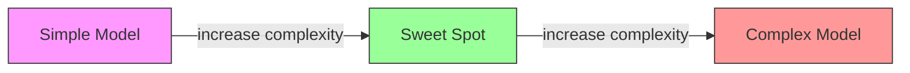
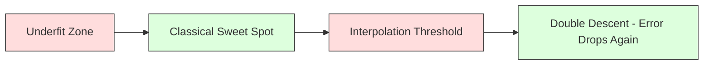
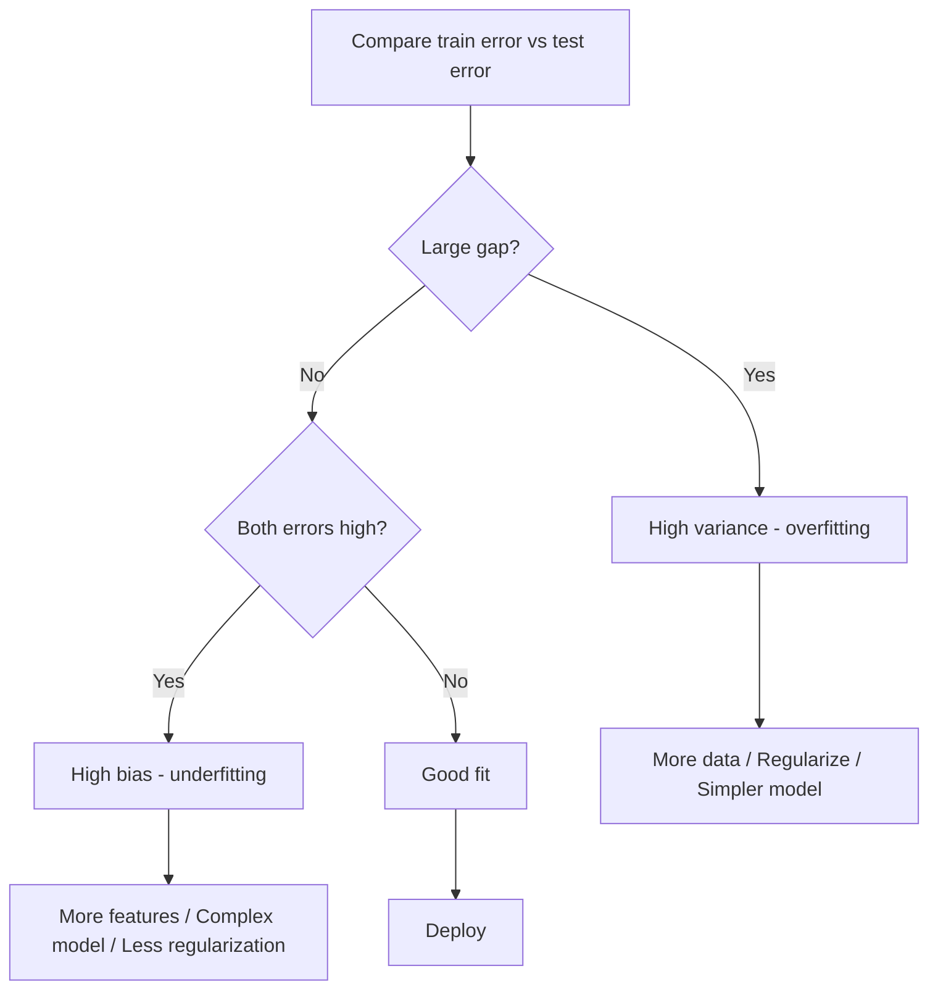
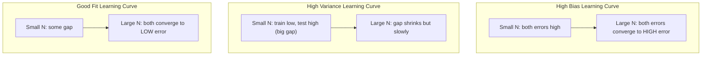
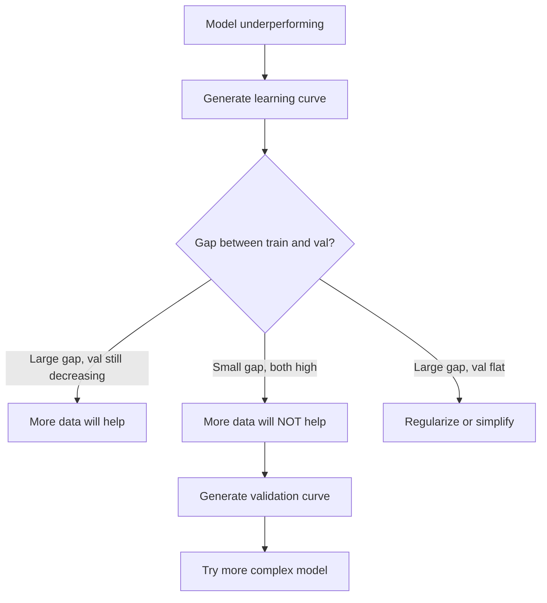

# Comércio de variações de parcialidade
# 偏差-方差权衡


> Cada erro do modelo vem de uma das três fontes: viés, variância ou ruído.

> Cada erro do modelo vem de uma das três fontes: diferença, diferença ou ruído.

**Type:** Learn | **类型：** 学习
**Language:**O Python .**语言：**Python
**Prerequisites:** Phase 2, Lessons 01-09 (ML basics, regression, classification, evaluation) | **前置知识：** Phase 2 第 1-9 课（ML 基础、回归、分类、评估）
**Time:** ~75 minutes | **时间：** 约 75 分钟

## Objetivos de aprendizagem

- Derivar a decomposição de variação de viés do erro de previsão esperado e explicar o papel do ruído irredutível
  推导期望预测 erro de desvio de diferença-diferença, explicação do papel do ruído incontrolável
- Diagnóstico de um modelo sofrendo de alto preconceito ou alta variância utilizando padrões de erro de treinamento e teste
  Utilizando o método de treinamento de erro e o método de teste de erro para diagnosticar se há um alto diferencial ou um alto diferencial
- Explique como as técnicas de regularização (L1, L2, abandono, paragem antecipada) negociam preconceito para variação
  解释正则化技术(L1、L2、Dropout、早停) Como se balanceia entre o diferencial e o diferencial
- Implementar experimentos que visualizem o tradeoff de variação de viés em modelos de crescente complexidade
                                                                                                                                                                                                                                                                                                                                                                                                                                                                                                                               


> **【中文解读】**
> 偏差(模型太简单欠拟合) vs 方差(模型太复杂过拟合) 的平衡──正则化──L1/L2)、增加数据、降低模型复杂度是常用手段──理解偏差-方差权衡是调参的理论基础──

> **【拓展：偏差-方差在深度学习中的新理解】**
> 经典理论认为增大模型会增高方差,但深度学习存在"双重下降" (double descent) fenómeno:模型超过"插值值" (双重下降) 后,测试误差反反反反反下降 (测试误差反反反反反下降). GPT-3 (GPT-3) 1750 亿参数) 远超超超训练 (Extra-over-over-over-over-over-over) 远超训练 (Extra-over-over-over-over-over-over-over-over-over-over-over-over-over-over-over-over-over-over-over-over-over-over-over-over) 

## O problema é o problema da introdução

Treinou um modelo, tem algum erro nos dados de teste.

> Você treinou um modelo. Ele tem alguns erros nos dados de teste.

Se o seu modelo for muito simples (regressão linear em um conjunto de dados curvos), ele continuará perdendo o padrão verdadeiro. Isso é viés. Se o seu modelo for muito complexo (polinômio de 20 graus em 15 pontos de dados), ele se encaixará perfeitamente nos dados de treinamento, mas dará previsões muito diferentes sobre novos dados. Isso é variância.

> Se o seu modelo for muito simples (ou muito simples) ele continuará desviado do modelo real. É o desvio. Se o seu modelo for muito complexo (ou muito complexo) ele vai ser perfeitamente adequado para o treinamento de dados, mas em novos dados ele dá previsões muito diferentes.

Não se pode minimizar ambos ao mesmo tempo para uma capacidade de modelo fixo. Empurre o viés para baixo e a variância sobe. Empurre a variância para baixo e o viés para cima. Entender este compromisso é a habilidade de diagnóstico mais útil na aprendizagem de máquina. Ele diz-lhe se deve tornar o seu modelo mais complexo ou menos complexo, se deve obter mais dados ou engenharia de melhores características, se deve regular mais ou menos.

> Para a capacidade de modelo fixa, você não pode minimizar os dois simultaneamente. Pressão baixa, diferença baixa, aumento. Pressão baixa, diferença alta. Entender que essa medida é a habilidade de diagnóstico mais útil no aprendizado de máquina.

> **【中文解读】**
> 误差 = 偏差2 + 方差 + 不可约噪声──偏差来自模型的错误假设──如用直线拟合曲线,偏差来自训练数据波动的过度敏感──诊断方法:训练误差高+测试误差高→高偏差(不适合);训练误差低+测试误差高→高方差(过适合)──对应的解决方案完全不同──

## O conceito central.

### Preconceitos: Erro sistemático

O Bias mede o quão longe a previsão média do seu modelo está do valor real. Se você treinou o mesmo modelo em muitos conjuntos de treinamento diferentes extraídos da mesma distribuição e mediou as previsões, o Bias é a lacuna entre essa média e a verdade.

> 偏差 mede a diferença entre a média de previsão do seu modelo e o valor real. Se você treinar no mesmo modelo e obter resultados de previsão média em vários conjuntos de treinamento extraídos da mesma distribuição, o偏差 é a diferença entre essa média e o valor real.

Um alto viés significa que o modelo é muito rígido para capturar o padrão real. Uma linha reta que se encaixa numa parábola sempre perderá a curva, não importa quantos dados lhe dê. Isto é incompatível.

> Alta diferença significa que o modelo é demasiado variado, não consegue capturar o modelo real.

```
High bias (underfitting):
  Model always predicts roughly the same wrong thing.
  Training error: HIGH
  Test error: HIGH
  Gap between them: SMALL
```

### Variância: Sensibilidade aos dados de formação

A variação mede o quanto as suas previsões mudam quando você treina em diferentes subconjuntos de dados.

> 方差 mede a quantidade de variações de resultados de previsão quando você treina em diferentes conjuntos de dados.

A alta variância significa que o modelo está ajustando o ruído nos dados de treinamento, não o sinal subjacente. Um polinômio de grau-20 vai atravessar todos os pontos de treinamento, mas oscila muito entre eles.

> O alto diferencial significa que o modelo está no som dos dados de treinamento adequados, e não em sinais potenciais.

```
High variance (overfitting):
  Model fits training data perfectly but fails on new data.
  Training error: LOW
  Test error: HIGH
  Gap between them: LARGE
```

### A decomposição

Para qualquer ponto x, o erro de previsão esperado sob perda quadrada se decompõe exatamente:

> Para qualquer ponto x, em perda quadrada, espera-se que o erro de previsão se decomponha precisamente em:

```
Expected Error = Bias^2 + Variance + Irreducible Noise

where:
  Bias^2   = (E[f_hat(x)] - f(x))^2
  Variance = E[(f_hat(x) - E[f_hat(x)])^2]
  Noise    = E[(y - f(x))^2]             (sigma^2)
```

- `f(x)`é a função verdadeira
  `f(x)`É verdade
- `f_hat(x)`é a previsão do seu modelo
  `f_hat(x)`É o seu modelo de pré-anúncio
- `E[...]`é a expectativa sobre diferentes conjuntos de formação
  `E[...]`É a expectativa de diferentes grupos de treinamento
- `y`é a etiqueta observada (função verdadeira mais ruído)
  `y`É um sinal de "FUNCÃO REAL"

O termo ruído é irredutível. Nenhum modelo pode fazer melhor do que sigma^2 em dados ruidosos.

> O ruído é incontrolável. Não há nenhum modelo que possa fazer melhor em dados de ruído do que o sigma.

### Complicidade do modelo vs erro



A curva clássica em forma de U:

> 经典的U 形曲线:

| Complexity | Bias | Variance | Total Error |
|-----------|------|----------|-------------|
| Too low | HIGH | LOW | HIGH (underfitting) |
| Just right | MODERATE | MODERATE | LOWEST |
| Too high | LOW | HIGH | HIGH (overfitting) |

| 复杂度 | 偏差 | 方差 | 总误差 |
|--------|------|------|--------|
| 太低 | 高 | 低 | 高（欠拟合） |
| 刚好 | 中等 | 中等 | 最低 |
| 太高 | 低 | 高 | 高（过拟合） |

### Regularização como controlo de variações biológicas

A regularização aumenta deliberadamente o viés para reduzir a variância.

> O sistema de regulação intencionalmente aumenta a diferença para reduzir a diferença de direção.

- **L2 (Ridge):**Reduz todos os pesos para zero, mantém todas as características, mas reduz a sua influência.
  **L2 (Ridge)**O poder de propriedade será redistribuído para zero, conservando todas as suas características, mas diminuindo o seu impacto.
- **L1 (Lasso):**Põe alguns pesos exatamente para zero.
  **L1 (Lasso)**O que é um "título de um livro de ficção?"
- **Dropout:**Desativa os neurônios durante o treino, faz com que as representações sejam redundantes.
  **Dropout**O que é que é o que é o que é o que é o que é o que é o que é o que é o que é o que é o que é o que é o que é o que é o que é o que é o que é o que é o que é o que é o que é o que é o que é o que é o que é o que é o que é o que é o que é o que é o que é?
- **Early stopping:**Pára de treinar antes que o modelo se ajuste completamente aos dados de treinamento.
  **早停**O modelo está totalmente adaptado ao treinamento.

A força de regularização (lambda, taxa de abandono, número de épocas) controla diretamente onde você se senta na curva de variação de viés.

> Normalmente, a intensidade de um movimento é muito maior, mas a velocidade é muito menor.

### Duas descendências: a perspectiva moderna

A teoria clássica diz: depois do ponto doce, mais complexidade sempre dói. Mas a pesquisa desde 2019 mostrou algo inesperado. Se você continuar aumentando a capacidade do modelo muito além do limiar de interpolação (onde o modelo tem parâmetros suficientes para se encaixar perfeitamente em dados de treinamento), o erro de teste pode diminuir novamente.

> 经典理论认为:经过最优点之后,更多复杂度总是有害――但自2019年以来的研究表明一些意想不到的现象―― Se você continuar a aumentar a capacidade do modelo, muito acima do valor de inserção值 (模型有足够参数完美适合训练数据), o erro de teste pode novamente diminuir――



Este fenômeno de "doble descida" explica por que redes neurais massivamente sobreparametrizadas (com muito mais parâmetros do que exemplos de treinamento) ainda se generalizam bem.

> Este fenómeno de "doble-graves descida" explica por que a grande quantidade de parâmetros de rede neural (parâmetros muito mais do que um modelo de treinamento) ainda pode ser muito bem generalizada.

Observações fundamentais sobre a dupla descida:

>  Sobre o aumento do peso:

- Acontece em modelos lineares, árvores de decisão e redes neurais
  Ela acontece em modelos de decisão e redes neuronais.
- Mais dados podem realmente prejudicar na região de interpolação (descende duplo de modo de amostra)
  Em zonas de inserção mais dados podem ser prejudiciais
- Mais épocas de formação também podem causar isso (descende duplo em sentido de época)
  更多训练时代 也可能导致它(epoch-wise 双重下降)
- A regularização suaviza o pico, mas não o elimina
  Normalmente, o nível de pico está bem, mas não podemos eliminá-lo.

Porque é que isto acontece? No limiar de interpolação, o modelo tem capacidade suficiente para caber em todos os pontos de formação. É forçado a uma solução muito específica que atravessa todos os pontos, e pequenas perturbações nos dados causam grandes mudanças no ajuste. É aqui que a variância chega ao auge. Além do limiar, o modelo tem muitas soluções possíveis que se encaixam perfeitamente nos dados. O algoritmo de aprendizagem (por exemplo, descida de gradiente com regularização implícita) tende a escolher o mais simples entre eles. Este viés implícito em direção a soluções simples é o motivo pelo qual os modelos sobreparametrizados se generalizam.

> Por que isso acontece? Em um ponto de inserção, o modelo apenas tem capacidade suficiente para se adequar a todos os pontos de treinamento. Ele é forçado a encontrar uma solução específica para cada ponto, e as pequenas perturbações dos dados podem causar grandes mudanças no seu conjunto. É o local do seu valor máximo.

| Regime | Parameters vs Samples | Behavior |
|--------|----------------------|----------|
| Underparameterized | p << n | Classical tradeoff applies |
| Interpolation threshold | p ~ n | Variance peaks, test error spikes |
| Overparameterized | p >> n | Implicit regularization kicks in, test error drops |

| 状态 | 参数 vs 样本 | 行为 |
|------|-------------|------|
| 欠参数化 | p << n | 经典权衡适用 |
| 插值阈值 | p ~ n | 方差峰值，测试误差飙升 |
| 过参数化 | p >> n | 隐式正则化起效，测试误差下降 |

Para fins práticos: se estiver a utilizar redes neurais ou grandes conjuntos de árvores, não se detenha no limiar de interpolação. Ou permaneça bem abaixo dele (com regularização explícita) ou ultrapasse-o. O pior lugar para estar é bem no limiar.

>  Operação prática: se você usar uma rede de neurônios ou uma grande integração de árvores, não fique em posição de inserção de valor ............................................................................................................................................................................................

### Diagnóstico do seu modelo



| Symptom | Diagnosis | Fix |
|---------|-----------|-----|
| High train error, high test error | Bias | More features, complex model, less regularization |
| Low train error, high test error | Variance | More data, regularization, simpler model, dropout |
| Low train error, low test error | Good fit | Ship it |
| Train error decreasing, test error increasing | Overfitting in progress | Early stopping |

| 症状 | 诊断 | 修复 |
|------|------|------|
| 训练误差高，测试误差高 | 偏差 | 更多特征、更复杂的模型、更少的正则化 |
| 训练误差低，测试误差高 | 方差 | 更多数据、正则化、更简单的模型、dropout |
| 训练误差低，测试误差低 | 好的拟合 | 发布它 |
| 训练误差下降，测试误差上升 | 正在过拟合 | 早停 |

### Estratégias Práticas

**When bias is the problem:**
- Adicionar características de polinômio ou interação
  Adicionar vários elementos ou características de intercâmbio
- Use um modelo mais flexível (ensemble de árvores em vez de linear)
  Utilize mais flexível modelo (tree集成代替线性模型)
- Reduzir a força de regularização
  减小正则化强度
- Trem mais longo (se ainda não convergido)
  訓練更长时间 (se ainda não recebeu)

**When variance is the problem:**

> **当方差是问题时：**
- Obtenha mais dados de treinamento
  Get more training dados
- Usar emboscamento (bosques aleatórios)
  Use Bagging (em inglês)
- Aumento da regularização (Lambda mais alta, maior abandono)
  增加正则化(更高的 lambda、更多 dropup)
- Seleção de características (remover características barulhentas)
  Features Selection (em inglês)
- Utilize a validação cruzada para detectá-lo precocemente
  Uso de testes de transmissão e testes de antecedência

### Métodos de Ensemble e Reduzir as Variações

Os métodos conjuntos são a ferramenta mais prática para combater a variância.

> O método de integração é o instrumento mais prático para combater a diferença.

**Bagging (Bootstrap Aggregating)**O estudo de forma geral, que tem como objetivo a análise de dados de treinamento, faz com que os modelos sejam treinados em diferentes amostras de bootstrap dos dados de treinamento, e depois medias suas previsões.

> **Bagging（Bootstrap 聚合）**Em diferentes modelos de bootstrap de treinamento, treine vários modelos, então media suas previsões. Cada modelo individual tem uma diferença de alto, mas o valor médio tem uma diferença muito menor.

Por que funciona matematicamente: se você mediar N previsões independentes, cada uma com variância sigma^2, a variância da média é sigma^2 / N. Os modelos não são verdadeiramente independentes (todos eles veem dados semelhantes), então a redução é menor que 1/N, mas ainda é substancial.

> Princípio matemático: se você tiver uma previsão média N 个独立预测, cada quadrado diferir para sigma^2, o valor médio da diferença quadrada para sigma^2 / N ⋅ modelo não é realmente independente, então a redução é menor que 1/N, mas ainda é muito visível.

**Boosting**O Boosting é um sistema de estimulação de dados que reduz o viés através da construção de modelos sequencialmente, onde cada novo modelo se concentra nos erros do conjunto até agora.

> **Boosting**通过顺序构建模型以减少偏差, cada novo modelo se concentra até agora nos erros de integração.                                                                                                                                                                                                                                                   

| Method | Primary Effect | Bias Change | Variance Change |
|--------|---------------|-------------|-----------------|
| Bagging | Reduces variance | No change | Decreases |
| Boosting | Reduces bias | Decreases | Can increase |
| Stacking | Reduces both | Depends on meta-learner | Depends on base models |
| Dropout | Implicit bagging | Slight increase | Decreases |

| 方法 | 主要效果 | 偏差变化 | 方差变化 |
|------|---------|---------|---------|
| Bagging | 减少方差 | 不变 | 下降 |
| Boosting | 减少偏差 | 下降 | 可能增加 |
| Stacking | 减少两者 | 取决于元学习器 | 取决于基模型 |
| Dropout | 隐式 Bagging | 略微增加 | 下降 |

**Practical rule:**Se o modelo base tiver uma alta variância (árvores profundas, polinômios de alto grau), use emagrecimento.

> **实践规则：**Se o seu modelo base tem alta diferença (深树、高次多项式), use Bagging。 Se o seu modelo base tiver alta diferença (浅树、简单线性模型), use Boosting。

### Curvas de aprendizagem

As curvas de aprendizagem traçam o treinamento e o erro de validação em função do tamanho do conjunto de treinamento. São a ferramenta de diagnóstico mais prática que você tem. Ao contrário de uma única comparação de treinamento/teste, as curvas de aprendizagem mostram a trajetória do seu modelo e dizem-lhe se mais dados irão ajudar.

> O Curso de Aprendizagem irá traçar erros de treinamento e erros de verificação como desenho de funções de grandes conjuntos de treinamento. Eles são os seus instrumentos de diagnóstico mais práticos. Diferente do comparativo de treinamento/teste individual, o Curso de Aprendizagem mostra o trajeto do modelo e diz-lhe se mais dados ajudam.



Como as ler:

> Como é que eu sei?

| Scenario | Training Error | Validation Error | Gap | What It Means | What to Do |
|----------|---------------|-----------------|-----|---------------|------------|
| High bias | High | High | Small | Model cannot capture the pattern | More features, complex model, less regularization |
| High variance | Low | High | Large | Model memorizes training data | More data, regularization, simpler model |
| Good fit | Moderate | Moderate | Small | Model generalizes well | Ship it |
| High variance, improving | Low | Decreasing with more data | Shrinking | Variance problem that data can fix | Collect more data |
| High bias, flat | High | High and flat | Small and flat | More data will NOT help | Change model architecture |

| 场景 | 训练误差 | 验证误差 | 间隙 | 含义 | 应对 |
|------|---------|---------|------|------|------|
| 高偏差 | 高 | 高 | 小 | 模型无法捕捉模式 | 更多特征、更复杂模型、减少正则化 |
| 高方差 | 低 | 高 | 大 | 模型记住训练数据 | 更多数据、正则化、更简单模型 |
| 好的拟合 | 中等 | 中等 | 小 | 模型泛化良好 | 发布它 |
| 高方差，正在改善 | 低 | 随数据增加而下降 | 缩小 | 数据可以解决的方差问题 | 收集更多数据 |
| 高偏差，平坦 | 高 | 高且平坦 | 小且平坦 | 更多数据不会有帮助 | 更改模型架构 |

A visão crítica: se ambas as curvas se mantiverem em plano e o espaço é pequeno, mas ambos os erros são altos, mais dados são inúteis.

> 关键洞察: Se as duas curvas tiverem tendência a ser planas e espaços menores, mas os dois erros são altos, mais dados não serão necessários.

### Como gerar curvas de aprendizagem

Há duas abordagens:

> Há duas formas:

**Approach 1: Vary training set size, fixed model.**Mantém o modelo e os hiperparâmetros constantes. Treine em subconjuntos cada vez maiores dos dados de treinamento. Mite o erro de treinamento e o erro de validação em cada tamanho. Esta é a curva padrão de aprendizagem.

> **方法 1：变化训练集大小，固定模型。**保持模型和超参数不变──在越来越大的训练数据集上训练──在每个大小下测量训练误差和验证误差──这是标准的学习曲线──

**Approach 2: Vary model complexity, fixed data.**Meter o erro de treinamento e erro de validação em cada complexidade. Esta é uma curva de validação e mostra diretamente o tradeoff de variação de viés.

> **方法 2：变化模型复杂度，固定数据。**保持数据不变──扫描复杂度参数(多项式次数、树深度、层数)──在每个复杂度下测量训练误差和验证误差──这是验证曲线,直接展示偏差-方差权衡──

As duas abordagens complementam-se: a primeira diz-lhe se mais dados ajudarão. A segunda diz-lhe se um modelo diferente ajudará.

>  dois métodos complementares. O primeiro diz-lhe se mais dados ajudam. O segundo diz-lhe se diferentes modelos ajudam. Antes de decidir o próximo passo, ambos devem funcionar.



## Construí-lo e realizei-o.

> **【中文解读】**
> 通过实验可视化偏差-方差权衡: usando diversos tipos de regresso de diferentes complexidades (grado 1→20) para se adaptar ao mesmo conjunto de dados, observar erros de treinamento e erros de teste com variação de complexidade.
```figure
bias-variance
```

## Construí-lo

O código está em `code/bias_variance.py`O que é que eu faço é fazer o experimento completo de decomposição de variação de viés.

> `code/bias_variance.py`O código central é executado por meio de um experimento completo de desvio de diferença-diferença.

### Passo 1: Gerar dados sintéticos a partir de uma função conhecida

Usamos`f(x) = sin(1.5x) + 0.5x`Conhecer a função verdadeira permite-nos calcular o viés e a variância exatos.

> Nós usamos`f(x) = sin(1.5x) + 0.5x`Há um aumento de ruído. Conhecer a função real permite-nos calcular a diferença e a diferença de parâmetros.

```python
def true_function(x):
    return np.sin(1.5 * x) + 0.5 * x

def generate_data(n_samples=30, noise_std=0.5, x_range=(-3, 3), seed=None):
    rng = np.random.RandomState(seed)
    x = rng.uniform(x_range[0], x_range[1], n_samples)
    y = true_function(x) + rng.normal(0, noise_std, n_samples)
    return x, y
```

### Passo 2: Amostração de bootstrap e ajuste de polinômio

Para cada grau polinômio, desenhamos muitos conjuntos de treinamento de bootstrap, encaixamos no polinômio e registamos previsões em uma grade de teste fixa.

> Para cada número de testes, extraímos muitos bootstrap training sets, adaptamos vários testes e registamos os testes em cada um dos testes.

```python
def fit_polynomial(x_train, y_train, degree, lam=0.0):
    X = np.column_stack([x_train ** d for d in range(degree + 1)])
    if lam > 0:
        penalty = lam * np.eye(X.shape[1])
        penalty[0, 0] = 0
        w = np.linalg.solve(X.T @ X + penalty, X.T @ y_train)
    else:
        w = np.linalg.lstsq(X, y_train, rcond=None)[0]
    return w
```

Cada amostra de arranque é tirada da mesma distribuição subjacente, mas contém pontos diferentes.

> Estamos em 200 diferentes modelos de arranque. Cada modelo de arranque é extraído da mesma distribuição de nível inferior, mas contém pontos diferentes.

### Passo 3: Computação de Bias^2, Decompositividade de Variância

Com 200 conjuntos de previsões em cada ponto de teste, podemos calcular a decomposição diretamente a partir da definição:

> Com cada teste de 200 grupos de previsão, podemos definir diretamente a partir de calcular e descompondo:

```python
mean_pred = predictions.mean(axis=0)
bias_sq = np.mean((mean_pred - y_true) ** 2)
variance = np.mean(predictions.var(axis=0))
total_error = np.mean(np.mean((predictions - y_true) ** 2, axis=1))
```

- `mean_pred`é estimada a partir de amostras de arranque
  `mean_pred`É o que eu quero dizer.
- `bias_sq`é a diferença quadrada entre a previsão média e a verdade
  `bias_sq`É a diferença quadrada entre a previsão média e o valor real
- `variance`é a espalha média das previsões entre as amostras de bootstrap
  `variance`É um bootstrap 样本间预测 de média de deslocamento
- `total_error`Deve ser aproximadamente igual a desvio^2 + variância + ruído
  `total_error`应约等于偏差^2 + variação + ruído

### Passo 4: Curvas de Aprendizagem

As curvas de aprendizagem varrem o tamanho do conjunto de treinamento mantendo a complexidade do modelo fixa.

> A aprendizagem curva é uma forma de aprendizagem de um modelo fixo, que é muito complexo e que mostra se o seu modelo está limitado por dados ou por capacidade.

```python
def demo_learning_curves():
    sizes = [10, 15, 20, 30, 50, 75, 100, 150, 200, 300]
    degree = 5

    for n in sizes:
        train_errors = []
        test_errors = []
        for seed in range(50):
            x_train, y_train = generate_data(n_samples=n, seed=seed * 100)
            w = fit_polynomial(x_train, y_train, degree)
            train_pred = predict_polynomial(x_train, w)
            train_mse = np.mean((train_pred - y_train) ** 2)
            test_pred = predict_polynomial(x_test, w)
            test_mse = np.mean((test_pred - y_test) ** 2)
            train_errors.append(train_mse)
            test_errors.append(test_mse)
        # Average over runs gives the learning curve point
```

Para um modelo de alta variância (grado 5 com pequenos dados), vê-se:

> Para o modelo de alta diferença (小数据上的 5 次多项式), você verá:
- O erro de treinamento começa baixo e aumenta à medida que mais dados tornam a memorização mais difícil
   Erros de treinamento desde o início, com mais dados, torna a memória difícil de lembrar.
- O erro de teste começa alto e diminui à medida que o modelo recebe mais sinal
  测试差从高开始,随着模型获得更多信号而下降
- A diferença diminui com mais dados
  间隙 com mais dados e diminuir

Para um modelo de alto viés (grado 1), ambos os erros convergem rapidamente para o mesmo valor elevado e mais dados não ajudam.

> Para o modelo de alta diferença (± 1 × + 1), dois erros rapidamente recebem o mesmo valor elevado, mais dados não ajudam.

### Passo 5: Esvaziamento de regularização

O código inclui também `demo_regularization_sweep()`, que fixa um polinômio de alto grau (grado 15) e varria a resistência de regularização Ridge de 0,001 a 100. Isso mostra o tradeoff de variação de viés de um ângulo diferente: em vez de variar a complexidade do modelo, variamos a resistência da restrição.

> 代码 também inclui `demo_regularization_sweep()`, fixa alta frequência de múltiplas fases ([[15 vezes) 并从0.001到100 扫描 Ridge 正则化强度──, que mostra de diferentes ângulos o peso de diferença-diferência: não alterar a complexidade do modelo, mas alterar a intensidade do bloco──.

```python
def demo_regularization_sweep():
    alphas = [0.001, 0.005, 0.01, 0.05, 0.1, 0.5, 1.0, 5.0, 10.0, 50.0, 100.0]
    for alpha in alphas:
        results = bias_variance_decomposition([15], lam=alpha)
        r = results[15]
        print(f"alpha={alpha:.3f}  bias={r['bias_sq']:.4f}  var={r['variance']:.4f}")
```

Em baixo alfa, o polinômio de grau-15 é quase sem restrições. A variância domina porque o modelo persegue ruído em cada amostra de arranque. Em alto alfa, a penalidade é tão forte que o modelo se torna efetivamente uma função quase constante.

> Em baixa alfa, o sistema de 15 vezes mais não é restrito. O modelo é dominado por diferenças, pois o modelo em cada bootstrap é dominado por ruídos. Em alta alfa, o sistema é muito forte.

Esta é a mesma curva U de vários graus polinômios, mas controlada por um botão contínuo em vez de um discreto. Na prática, a regularização é a maneira preferida de controlar o tradeoff porque permite o controle de grãos finos sem mudar o conjunto de características.

> Esta é a mesma curva U de múltiplas vezes de variação, mas é controlada por rotação continuada e não por rotação separada. Na prática, a regularização é o método preferido para controlar o peso, pois permite o controle preciso em conjunto de características sem mudança.

## Use-o com o framework implementado.

sklearn fornece `learning_curve`E ...`validation_curve`para automatizar estes diagnósticos sem escrever bucles de arranque.

> SHOP  fornecer `learning_curve`和 `validation_curve`Para automatizar estes diagnósticos, não é preciso escrever um ciclo de arranque.

### Curva de validação: complexidade do modelo de varredura

```python
from sklearn.model_selection import validation_curve
from sklearn.pipeline import make_pipeline
from sklearn.preprocessing import PolynomialFeatures
from sklearn.linear_model import Ridge

degrees = list(range(1, 16))
train_scores_all = []
val_scores_all = []

for d in degrees:
    pipe = make_pipeline(PolynomialFeatures(d), Ridge(alpha=0.01))
    train_scores, val_scores = validation_curve(
        pipe, X, y, param_name="polynomialfeatures__degree",
        param_range=[d], cv=5, scoring="neg_mean_squared_error"
    )
    train_scores_all.append(-train_scores.mean())
    val_scores_all.append(-val_scores.mean())
```

Isto dá-lhe a curva de troca de variação de viés diretamente. Onde a pontuação de validação é pior em relação à pontuação do treinamento, a variância domina. Onde ambos são ruins, o viés domina.

> Isto dá diretamente uma curva de diferença-diferência de peso.

### Curva de aprendizagem: tamanho do conjunto de treino

```python
from sklearn.model_selection import learning_curve

pipe = make_pipeline(PolynomialFeatures(5), Ridge(alpha=0.01))
train_sizes, train_scores, val_scores = learning_curve(
    pipe, X, y, train_sizes=np.linspace(0.1, 1.0, 10),
    cv=5, scoring="neg_mean_squared_error"
)
train_mse = -train_scores.mean(axis=1)
val_mse = -val_scores.mean(axis=1)
```

Plot `train_mse`E ...`val_mse`contra`train_sizes`A forma diz-te tudo sobre o teu modelo.

> - Não .`train_mse`和 `val_mse`Para o`train_sizes`O desenho... diz-te tudo sobre o modelo.

### Validação cruzada com varredura de regularização

```python
from sklearn.model_selection import cross_val_score

alphas = [0.001, 0.01, 0.1, 1.0, 10.0, 100.0]
for alpha in alphas:
    pipe = make_pipeline(PolynomialFeatures(10), Ridge(alpha=alpha))
    scores = cross_val_score(pipe, X, y, cv=5, scoring="neg_mean_squared_error")
    print(f"alpha={alpha:>7.3f}  MSE={-scores.mean():.4f} +/- {scores.std():.4f}")
```

Isto varria a força de regularização para uma complexidade de modelo fixa. Você verá o mesmo tradeoff de variação de viés: baixo alfa significa alta variância, alto alfa significa alto viés.

> Esta é a complexidade do modelo fixo, mas a sua intensidade é normal. Você verá o mesmo peso de diferença de diferença: baixo alfa significa alta diferença de diferença de diferença de diferença de diferença de diferença de diferença de diferença de diferença de diferença de diferença de diferença de diferença de diferença de diferença de diferença de diferença de diferença de diferença de diferença de diferença de diferença de diferença de diferença de diferença de diferença de diferença de diferença de diferença de diferença de diferença de diferença de diferença de diferença de diferença de diferença de diferença de diferença de diferença de diferença de diferença de diferença de diferença de diferença de diferença de diferença de diferença de diferença de diferença de diferença de diferença de diferença de diferença de diferença de diferença de diferença de diferença de diferença de diferença de diferença de diferença de diferença de diferença de diferença de diferença de diferença de diferença de diferença de diferença de diferença de diferença de diferença de diferença de diferença de diferença de diferença de diferença de diferença de diferença de diferença de diferença de diferença de diferença de diferença de diferença de diferença de diferença de diferença de diferença de diferença de diferença de diferença de diferença de diferença de diferença de diferença de diferença de diferença de diferença de diferença de diferença de diferença de diferença de diferença de diferença de diferença de diferença de diferença de diferença de diferença de diferença de diferença de diferença de diferença de diferença de diferença de diferença de diferença de diferença de diferença de diferença de diferença de diferença de diferença de diferença de diferença de diferença de diferença de diferença de diferença de diferença de diferença de diferença de diferença de diferença de diferença de diferença de diferença de diferença de diferença de diferença de diferença de diferença de diferença de diferença de diferença de diferença de diferença de diferença de diferença de diferença de diferença de diferença de diferença de diferença de diferença de diferença de diferença de diferença

### Colocando tudo em conjunto: um fluxo de trabalho completo de diagnóstico

Na prática, executamos estes diagnósticos em sequência:

> Na prática, você faz estes diagnósticos:

1. Treina o teu modelo, computa o trem e teste o erro.
   訓練你的模型──計算訓練和測試誤差──
2. Se ambos estiverem altos, tem um problema de preconceito.
   Se ambos estiverem altos, você tem um problema de diferença.
3. Se o trem for baixo, mas o teste for alto: você tem um problema de variância.
   Se o treino é baixo, mas o teste é alto: você tem problemas de diferença.
4. Gerencie uma curva de validação que varre o seu parâmetro de complexidade principal.
   O que é o melhor para você?
5. No ponto ideal, gerar uma curva de aprendizagem. Se a lacuna ainda é grande, você precisa de mais dados ou regularização.
   Em melhores pontos de gerar curvas de aprendizagem. Se o espaço ainda for grande, você precisa de mais dados ou regularização.
6. Tente Ridge/Lasso com diferentes valores alfa usando `cross_val_score`Escolha o alfa onde o erro de validação cruzada é menor.
   - Não .`cross_val_score`尝试不同 alpha 值的Ridge/Lasso──选择交叉验证误差最低的 alpha──

Isto leva 10-15 minutos de cálculo para a maioria dos conjuntos de dados tabuleiros e economiza horas de adivinhação.

> Para a maioria dos conjuntos de dados de gráficos, isso requer 10-15 minutos de cálculo, mas poupa algumas horas de adivinhação.

## Envia-o . Produto .

Esta lição produz: `outputs/prompt-model-diagnostics.md`

> 本课产出:`outputs/prompt-model-diagnostics.md`

## Exercícios.

1. Execute a decomposição com `noise_std=0`O que acontece com o termo erro irredutível? A complexidade óptima muda?
   1. - Não .`noise_std=0`(sem ruído) Operar descomposição. O que aconteceu?

2. Aumentar o tamanho do conjunto de treinamento de 30 para 300. Como isso afeta o componente de variância?
   2. O número de exercícios aumentou de 30 para 300. Como isso afetou a diferença?

3. Adicionar regularização L2 (regressão de Ridge) ao experimento. Para um polinômio de alto grau fixo (grado 15), varrer lambda de 0 para 100.
   3. Em experimento, adicione L2 (Ridge) (Ridge) (Ridge) (Ridge) (Ridge) (Ridge) (Ridge) (Ridge) (Ridge) (Ridge) (Ridge) (Ridge) (Ridge) (Ridge) (Ridge) (Ridge) (Ridge) (Ridge) (Ridge) (Ridge) (Ridge) (Ridge) (Ridge) (Ridge) (Ridge) (Ridge) (Ridge) (Ridge) (Ridge) (Ridge) (Ridge) (Ridge) (Ridge) (Ridge) (Ridge) (Ridge) (Ridge) (Ridge) (Ridge) (Ridge) (Ridge) (Ridge) (Ridge) (Ridge) (Ridge) (Ridge) (Ridge) (Ridge) (R))) (R) (R) (R) (R) (R) (R) (R) (R) (R) (R) (R) (R) (R) (R) (R) (R) (R) (R) (R) (R) (R) (R) (R) (R) (R) (R) (R) (R) (R) (R) (R) (R) (R) (R) (R) (R) (R) (R) (R) (R) (R) (R) (R) (R) (R) (R) (R) (R) (R) (R) (R) (R) (R) (R) (R) (R) (R) (R) (R) (R) (R) (R) (R) (R) (R) (R) (R) (R) (R) (R) (R) (R) (R) (R) (R) (R) (R) (R) (R) (R) (R) (R) (R) (R) (R) (R) (R) (R) (R) (R) (R) (R) (R) (R) (R) (R) (R) (R) (R) (R) (R) (R)

4. Modificar a função verdadeira de um polinômio para `sin(x)`Como é que a decomposição de variação de viés muda?
   4. A função real será transformada em`sin(x)` Diferença-diferença-diferença como se altera?

5. Implementar um simples envelope de agregação de bootstrap (bagging): treinar 10 modelos em amostras de bootstrap e previsões médias. Mostrar que isso reduz a variância sem aumentar muito o viés.
   5. 实现简单的Bootstrap 聚聚合(Bagging) packaging: em Bootstrap 样本上训练10个模型并平均预测;; demonstrar que isso reduz o diferencial de dimensão e não aumenta significativamente o diferencial de dimensão;;

> **【中文解读】**
> 偏差-方差分解的数学表达:E[((y - f_hat) ^2] = Bias^2 + Variância + sigma^2──其中 Bias^2 é um modelo sistemático de erro quadrado, Variância é um modelo de sensibilidade ao treinamento de dados, sigma^2 é um som incontrolável de dados em si mesmos── Reduzir o método de偏差: modelos mais complexos、 características melhores── Reduzir o método de diferenciação: regularizar o aumento de dados、 método de bagagem)──

> **【拓展：正则化如何在偏差和方差之间取得平衡】**
> L2 Normalisação (Ridge) através da punição de grande peso para reduzir a complexidade do modelo, é, em essência, deliberadamente introduzir alguns prejuízos para reduzir significativamente a diferença de tamanho.

## Termos-chave .

| Term | What people say | What it actually means |
|------|----------------|----------------------|
| Bias | "The model is too simple" | Systematic error from wrong assumptions. The gap between the average model prediction and truth. |
| Variance | "The model is overfitting" | Error from sensitivity to training data. How much predictions change across different training sets. |
| Irreducible error | "Noise in the data" | Error from randomness in the true data-generating process. No model can eliminate it. |
| Underfitting | "Not learning enough" | Model has high bias. It misses the real pattern even on training data. |
| Overfitting | "Memorizing the data" | Model has high variance. It fits noise in training data that does not generalize. |
| Regularization | "Constraining the model" | Adding a penalty to reduce model complexity, trading bias for lower variance. |
| Double descent | "More parameters can help" | Test error decreases again when model capacity far exceeds the interpolation threshold. |
| Model complexity | "How flexible the model is" | The capacity of a model to fit arbitrary patterns. Controlled by architecture, features, or regularization. |

## Mais leitura 延伸阅读

- [Hastie, Tibshirani, Friedman: Elements of Statistical Learning, Ch. 7](https://hastie.su.domains/ElemStatLearn/)-- o tratamento definitivo da decomposição de variação de prejuízo
  [Hastie, Tibshirani, Friedman: Elements of Statistical Learning, Ch. 7](https://hastie.su.domains/ElemStatLearn/)- 偏差-方差分解的权威论述
- [Belkin et al., Reconciling modern machine learning practice and the bias-variance trade-off (2019)](https://arxiv.org/abs/1812.11118)- o papel de descida dupla
  [Belkin et al., Reconciling modern machine learning practice and the bias-variance trade-off (2019)](https://arxiv.org/abs/1812.11118)- 双重下降论文
- [Nakkiran et al., Deep Double Descent (2019)](https://arxiv.org/abs/1912.02292)-- descida dupla por época e por amostra
  [Nakkiran et al., Deep Double Descent (2019)](https://arxiv.org/abs/1912.02292)- de época e de amostra
- [Scott Fortmann-Roe: Understanding the Bias-Variance Tradeoff](http://scott.fortmann-roe.com/docs/BiasVariance.html)- Explicação visual clara
  [Scott Fortmann-Roe: Understanding the Bias-Variance Tradeoff](http://scott.fortmann-roe.com/docs/BiasVariance.html)- Explicação de visão clara
