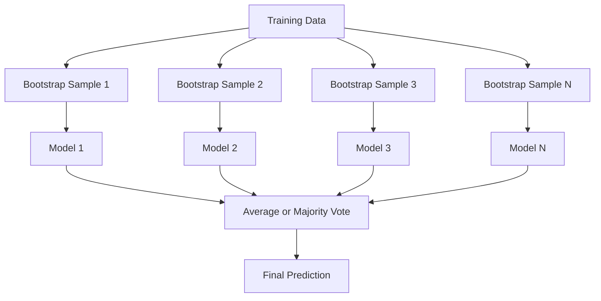
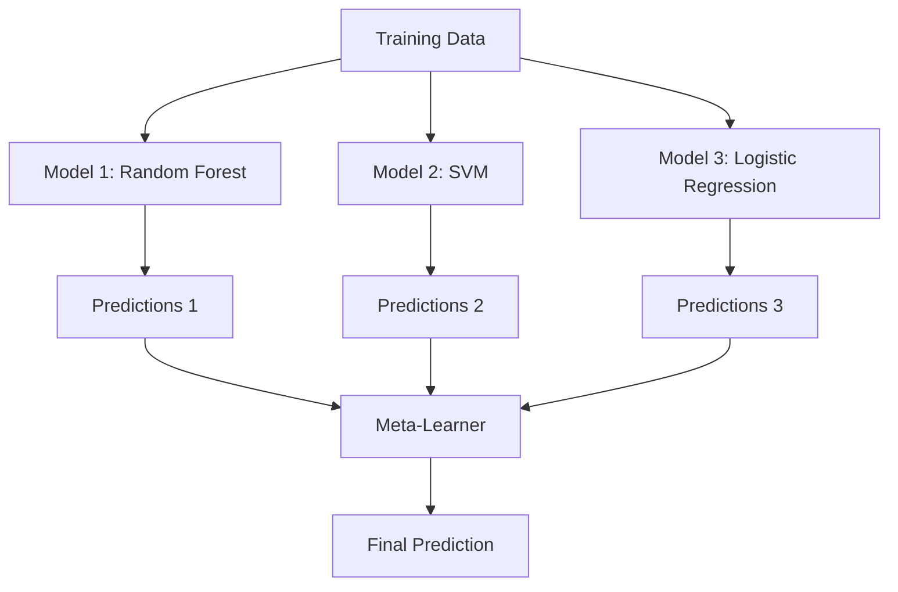

# Métodos de Ensemble
# 集成方法


> Um grupo de aprendizes fracos, combinados corretamente, se torna um aprendiz forte.

> Uma equipa de aprendizagem fraca, depois de uma equipa de aprendizagem, torna-se numa equipa de aprendizagem forte.

**Type:** Build | **类型：** 构建
**Language:**O Python .**语言：**Python
**Prerequisites:** Phase 2, Lesson 10 (Bias-Variance Tradeoff) | **前置知识：** Phase 2 第 10 课（偏差-方差权衡）
**Time:** ~120 minutes | **时间：** 约 120 分钟

## Objetivos de aprendizagem

- Implementar AdaBoost e gradiente de impulso a partir do zero e explicar como o impulso sequencial reduz o viés
  A partir de zero, a AdaBoost e a gradiência aumentam, explicando como aumentar a taxa de redução de desvios
- Construir um conjunto de sacos e demonstrar como a média de modelos descorrelados reduz a variância sem aumentar o viés
  Construir Bagging  Integrar, mostrar como reduzir a diferença de tamanho em caso de não aumentar a diferença
- Comparar a embalagem, a intensificação e a empilhamento em termos de qual componente de erro cada método visa
  Comparar Bagging, Boosting e Stacking com diferentes tipos de erros
- Avalia a diversidade do conjunto e explica por que a precisão da votação da maioria melhora com os alunos mais fracos e independentes
   avaliar a diversidade integrada, explicar por que a maioria dos votos aumenta a taxa de precisão com mais aprendizagem independente


> **【中文解读】**
> 集成方法组合多个弱模型成一个强模型――Bagging(随机森林) redução da diferença de tamanho, Boosting(XGBoost) redução da diferença de tamanho, XGBoost/LightGBM 在 Kaggle 比赛中占占据统治地位──金融风控、推系统广泛使用──

> **【拓展：集成方法在 Kaggle 和工业界的主导地位】**
> Em Kaggle  Structured Data Competition, o ranking 10 de esquemas quase 100% utilizou métodos de integração. O esquema vencedor do Netflix Prize foi a integração de 107 modelos. Na indústria, o sistema de controle de vento de pagamento utilizou XGBoost + LightGBM para a integração.

## O problema é o problema da introdução

Uma única árvore de decisão é rápida de treinar e fácil de interpretar, mas excede. Um único modelo linear se encaixa em limites complexos. Você pode passar dias projetando a arquitetura do modelo perfeito. Ou você pode combinar um monte de modelos imperfeitos e obter algo melhor do que qualquer um deles individualmente.

> 单棵决策树训练快、易解释,但会过拟应――单个线性模型在复杂边界上不适应―― você pode passar alguns dias a conceber uma estrutura de modelo perfeita, ou a reunir uma pilha de modelos imperfeitos, obtendo melhores resultados do que qualquer um dos outros――

Os métodos de montagem fazem exatamente isso. Eles são a técnica mais confiável para vencer competições Kaggle em dados tabuleiros, eles alimentam a maioria dos sistemas de produção ML, e eles ilustram o tradeoff de variação de viés em ação.

> O método de integração é o que faz isso. Eles são os vencedores da competição de dados de forma mais confiável, impulsionando a maioria dos sistemas de produção de dados, e mostram diretamente o funcionamento real da medição de diferença-diferença.

> **【中文解读】**
> Princípio central do método de integração: se vários modelos imperfeitos cometem erros diferentes, a previsão média deles será mais precisa. Bagging (como em florestas) através do treinamento de modelos independentes, leva a média para reduzir a diferença de quadros; Boosting (como em AdaBoost, GBDT) através de treinamento em cadeia, permite que cada novo modelo corrija um dos erros anteriores para reduzir a diferença; Stacking com componentes de diferentes tipos de modelos-base.

## O conceito central.

### Por que os grupos trabalham

Suponha que tenha N classificadores independentes, cada um com precisão p > 0,5.

> 假设你有N个独立分类器,每个准确率为p > 0.5──多数投票的准确率为:

```
P(majority correct) = sum over k > N/2 of C(N,k) * p^k * (1-p)^(N-k)
```

Para 21 classificadores, cada um com 60% de precisão, a precisão da maioria dos votos é de cerca de 74%. Com 101 classificadores, ele sobe para 84%. Os erros são cancelados quando os modelos cometem erros diferentes.

> 21 个准确率 别为 60% 分类器,多数投票准确率 约为 74%──101 个分类器时升至84%.

O requisito chave é **diversity**Se todos os modelos cometem os mesmos erros, a combinação não ajuda nada.

> 关键要求是**多样性**Se todos os modelos cometem os mesmos erros, a sua combinação não ajuda.

- Diferentes subconjuntos de formação (bagging)
  Não é diferente.
- Subconjuntos de características diferentes (bosques aleatórios)
  Não é um problema.
- Correção de erro seqüencial (impulsão)
  顺序错误纠正(Boosting)
- Famílias de modelos diferentes (estacamento)
  Não é diferente de modelos

### Acompanhamento de empilhadeiras

A embalagem cria diversidade através da formação de cada modelo numa amostra diferente de dados de arranque dos dados de formação.

> Bagging  através de cada bootstrap  treinamento  treinamento  treinamento  treinamento  treinamento  modelo cada para criar diversidade 



Uma amostra de bootstrap é desenhada com substituição dos dados originais, do mesmo tamanho que o original. Cerca de 63,2% das amostras únicas aparecem em cada bootstrap. O restante 36,8% ( amostras fora de saco) fornecem um conjunto de validação gratuito.

> A amostra do bootstrap é extraída de dados originais, de tamanho igual ao original. Cerca de 63,2% das amostras únicas aparecem em cada bootstrap. O restante 36,8% (exterior) fornece um conjunto de testes gratuitos.

A embalagem reduz a variância sem aumentar muito o viés. Cada árvore individual supera a sua amostra de arranque, mas o sobreajuste é diferente para cada árvore, então a média cancela o ruído.

> Bagging em caso de não aumentar muito o prejuízo reduzir o quadrado. Cada árvore individual se adapta à sua amostra de arranque, mas cada árvore se adapta de forma diferente, portanto, a média irá suportar o ruído.

**Random Forests**A diferença entre os tipos de árvores e os tipos de árvores que se encontram em cada divisão é a diferença entre os tipos de árvores que se encontram em cada divisão.`sqrt(n_features)`para classificação e `n_features / 3`para regressão.

> **随机森林**É Bagging + um extra tecno: em cada divisão, apenas considere um conjunto de características acidentais. Isso obriga a maior diversidade entre árvores.`sqrt(n_features)`, regresso `n_features / 3`- Não.

### Aumento (correção de erro sequencial)

Cada novo modelo se concentra nos exemplos que os modelos anteriores tiveram errado.

> Aumentar o modelo de treinamento. Cada novo modelo segue o modelo anterior.


O aumento reduz o viés. Cada novo modelo corrige os erros sistemáticos do conjunto até agora. A previsão final é uma soma ponderada de todos os modelos, onde os modelos melhores recebem pesos mais altos.

> Aumento  redução de preconceito. Cada novo modelo corrige o erro sistêmico integrado até agora. A previsão final é o aumento de peso de todos os modelos e, melhor modelo obter um maior peso.

A compensação: o impulso pode ser super ajustado se executar muitas rodadas, porque continua a ajustar exemplos mais difíceis, alguns dos quais podem ser ruídos.

> 权衡: Se funcionar muito ruído, o Boosting pode ser mais adequado, pois ele continua a ser mais difícil de se adequar, alguns deles podem ser ruído.

### AdaBoost

AdaBoost (Adaptive Boosting) foi o primeiro algoritmo prático de impulsionamento.

> AdaBoost (自适应提升) é o primeiro algoritmo de aumento prático. É aplicável a qualquer máquina de aprendizado, geralmente usando árvores de decisão.

O algoritmo:

> 算法流程:

```
1. Initialize sample weights: w_i = 1/N for all i

2. For t = 1 to T:
   a. Train weak learner h_t on weighted data
   b. Compute weighted error:
      err_t = sum(w_i * I(h_t(x_i) != y_i)) / sum(w_i)
   c. Compute model weight:
      alpha_t = 0.5 * ln((1 - err_t) / err_t)
   d. Update sample weights:
      w_i = w_i * exp(-alpha_t * y_i * h_t(x_i))
   e. Normalize weights to sum to 1

3. Final prediction: H(x) = sign(sum(alpha_t * h_t(x)))
```

Os modelos com menor erro ganham mais alfa.

> Os modelos com menor taxa de erro obtêm um alfa maior. Os modelos com menor taxa de erro obtêm um peso maior, assim o próximo modelo irá se preocupar com eles.

### Aumento gradual

O aumento do gradiente generaliza o aumento para funções de perda arbitrárias. Em vez de reponderar amostras, ele se encaixa em cada novo modelo com os resíduos (gradiente negativo da perda) do conjunto atual.

> 梯度提升将升升推广到任意损失函数──不同于重权增量样本,它将每个新模型适应到当前集成的残差损失的负梯度 ().

```
1. Initialize: F_0(x) = argmin_c sum(L(y_i, c))

2. For t = 1 to T:
   a. Compute pseudo-residuals:
      r_i = -dL(y_i, F_{t-1}(x_i)) / dF_{t-1}(x_i)
   b. Fit a tree h_t to the residuals r_i
   c. Find optimal step size:
      gamma_t = argmin_gamma sum(L(y_i, F_{t-1}(x_i) + gamma * h_t(x_i)))
   d. Update:
      F_t(x) = F_{t-1}(x) + learning_rate * gamma_t * h_t(x)

3. Final prediction: F_T(x)
```

Para perda de erro quadrado, os pseudo-resíduos são apenas os resíduos reais: `r_i = y_i - F_{t-1}(x_i)`Cada árvore corresponde literalmente aos erros do conjunto anterior.

> Para o erro quadrado, o falso residuo é o residuo real:`r_i = y_i - F_{t-1}(x_i)` Cada árvore é, na prática, um erro de integração antes de se adaptar

A taxa de aprendizagem (reduzimento) controla o quanto cada árvore contribui.

> A taxa de aprendizagem (%) reduz a quantidade de contribuições de cada árvore.

### XGBoost: Por que domina os dados tabulares

XGBoost (eXtreme Gradient Boosting) é um aumento de gradiente com otimizações de engenharia que o tornam rápido, preciso e resistente ao sobreajuste:

> XGBoost (极端梯度提升) é um aumento de gradiente de optimização de um projecto, que permite que seja rápido, preciso e resistente a sobre-adaptações:

- **Regularized objective:**As sanções L1 e L2 sobre pesos de folhas impedem que árvores individuais tenham muita confiança
  **正则化目标**O que é que é o problema?
- **Second-order approximation:**Utiliza os dois primeiros derivados da perda, dando melhores decisões divididas
  **二阶近似**A partir da data de início da fase de cálculo, a taxa de perda é de 0,00%.
- **Sparsity-aware splits:**Manuseia valores faltantes de forma nativa, aprendendo a melhor direção para dados faltantes em cada divisão
  **稀疏感知分裂**O melhor caminho para o tratamento de falta de dados em cada ponto de divisão
- **Column subsampling:**Como as florestas aleatórias, as amostras são características em cada divisão para a diversidade
  **列子采样**Como a floresta natural, cada divisão tem características para aumentar a diversidade.
- **Weighted quantile sketch:**Encontre de forma eficiente pontos de divisão para características contínuas em dados distribuídos
  **加权分位数草图**: Alto eficiência em encontrar pontos de divisão de características continuas em dados distribuídos
- **Cache-aware block structure:**Layout de memória otimizado para linhas de cache de CPU
  **缓存感知块结构**: estrutura de memória de CPU 缓存行优化

Para dados tabuleiros, o XGBoost (e seu sucessor LightGBM) superam consistentemente as redes neurais. Isto não vai mudar em breve.

> Para o gráfico de dados, XGBoost (XGBoost) e seu sucessor LightGBM) sempre são melhores na rede neuronal. Em curto prazo, isso não mudará.

### Estacionamento (Meta-Learning)

O estacionamento usa as previsões de múltiplos modelos base como características para um meta-aprendizaje.

> A pilhação irá prever vários modelos baseados como características de um aprendizagem.



O meta-aprendizaje aprende qual modelo base confiar para quais entradas. Se a floresta aleatória é melhor em certas regiões e o SVM em outras, o meta-aprendizaje aprenderá a percorrer de acordo.

> Se o uso de máquinas de aprendizagem em algumas regiões for melhor, a SVM em outras regiões será melhor, o uso de máquinas de aprendizagem em outras regiões será melhor.

Para evitar vazamento de dados, as previsões do modelo base devem ser geradas através de validação cruzada no conjunto de treinamento.

> Para evitar vazamentos de dados, a previsão do modelo base deve ser feita através da produção de verificação de transição no conjunto de treinamento.

### Votação

O conjunto mais simples, só combinar as previsões diretamente.

> É um processo de formação de um grupo de pessoas.

- **Hard voting:**A maioria vota nos rótulos da classe.
  **硬投票**A maioria dos votos para os classificados:
- **Soft voting:**Probabilidade média prevista, escolha a classe com maior probabilidade média, geralmente melhor porque usa informações de confiança.
  **软投票**A probabilidade média é uma categoria de probabilidade média, que é mais elevada.

## Construí-lo e realizei-o.

> **【中文解读】**
> Desde zero realizando três métodos de integração: Bagging(并行训练独立模型取平均)、AdaBoost(串行训练加权投票)、Gradient Boosting(串行训练纠正残差)。O núcleo do AdaBoost é dado ao exposto um modelo de erro de classificação de amostras para aumentar o peso, Gradient Boosting Cada nova árvore se adapta à primeira árvore para aumentar o seu residuo。
```figure
f3-ensemble-average
```

## Construí-lo

### Passo 1: Estampamento de decisão (aprendiza-guia de base)

O código está em `code/ensembles.py`Começamos com um tronco de decisão: uma árvore com uma única divisão.

> `code/ensembles.py`O código do meio começa com o zero implementar tudo. Começamos com a árvore de decisão.

```python
class DecisionStump:
    def __init__(self):
        self.feature_idx = None
        self.threshold = None
        self.polarity = 1
        self.alpha = None

    def fit(self, X, y, weights):
        n_samples, n_features = X.shape
        best_error = float("inf")

        for f in range(n_features):
            thresholds = np.unique(X[:, f])
            for thresh in thresholds:
                for polarity in [1, -1]:
                    pred = np.ones(n_samples)
                    pred[polarity * X[:, f] < polarity * thresh] = -1
                    error = np.sum(weights[pred != y])
                    if error < best_error:
                        best_error = error
                        self.feature_idx = f
                        self.threshold = thresh
                        self.polarity = polarity

    def predict(self, X):
        n = X.shape[0]
        pred = np.ones(n)
        idx = self.polarity * X[:, self.feature_idx] < self.polarity * self.threshold
        pred[idx] = -1
        return pred
```

### Passo 2: AdaBoost a partir do zero

```python
class AdaBoostScratch:
    def __init__(self, n_estimators=50):
        self.n_estimators = n_estimators
        self.stumps = []
        self.alphas = []

    def fit(self, X, y):
        n = X.shape[0]
        weights = np.full(n, 1 / n)

        for _ in range(self.n_estimators):
            stump = DecisionStump()
            stump.fit(X, y, weights)
            pred = stump.predict(X)

            err = np.sum(weights[pred != y])
            err = np.clip(err, 1e-10, 1 - 1e-10)

            alpha = 0.5 * np.log((1 - err) / err)
            weights *= np.exp(-alpha * y * pred)
            weights /= weights.sum()

            stump.alpha = alpha
            self.stumps.append(stump)
            self.alphas.append(alpha)

    def predict(self, X):
        total = sum(a * s.predict(X) for a, s in zip(self.alphas, self.stumps))
        return np.sign(total)
```

### Passo 3: Aumento gradual a partir do zero

```python
class GradientBoostingScratch:
    def __init__(self, n_estimators=100, learning_rate=0.1, max_depth=3):
        self.n_estimators = n_estimators
        self.lr = learning_rate
        self.max_depth = max_depth
        self.trees = []
        self.initial_pred = None

    def fit(self, X, y):
        self.initial_pred = np.mean(y)
        current_pred = np.full(len(y), self.initial_pred)

        for _ in range(self.n_estimators):
            residuals = y - current_pred
            tree = SimpleRegressionTree(max_depth=self.max_depth)
            tree.fit(X, residuals)
            update = tree.predict(X)
            current_pred += self.lr * update
            self.trees.append(tree)

    def predict(self, X):
        pred = np.full(X.shape[0], self.initial_pred)
        for tree in self.trees:
            pred += self.lr * tree.predict(X)
        return pred
```

### Passo 4: Comparar com sklearn

O código verifica que as nossas implementações a partir do zero produzem uma precisão semelhante à do sklearn `AdaBoostClassifier`E ...`GradientBoostingClassifier`, e compara todos os métodos lado a lado.

> O código de verificação que nós realizamos a partir de zero se produz com o cálculo de`AdaBoostClassifier`和 `GradientBoostingClassifier`Precision rate,并并排 comparison todos os métodos.

## Use-o com o framework implementado.

### Quando usar cada método

> Qual é o tempo de usar cada método?

| Method | Reduces | Best for | Watch out for |
|--------|---------|----------|---------------|
| Bagging / Random Forest | Variance | Noisy data, many features | Does not help with bias |
| AdaBoost | Bias | Clean data, simple base learners | Sensitive to outliers and noise |
| Gradient Boosting | Bias | Tabular data, competitions | Slow to train, easy to overfit without tuning |
| XGBoost / LightGBM | Both | Production tabular ML | Many hyperparameters |
| Stacking | Both | Getting last 1-2% accuracy | Complex, risk of overfitting meta-learner |
| Voting | Variance | Quick combination of diverse models | Only helps if models are diverse |

| 方法 | 减少 | 最适合 | 注意事项 |
|------|------|--------|---------|
| Bagging / 随机森林 | 方差 | 噪声数据、多特征 | 不能帮助偏差 |
| AdaBoost | 偏差 | 干净数据、简单基学习器 | 对异常值和噪声敏感 |
| 梯度提升 | 偏差 | 表格数据、竞赛 | 训练慢、不调参容易过拟合 |
| XGBoost / LightGBM | 两者 | 生产表格 ML | 超参数多 |
| Stacking | 两者 | 获取最后 1-2% 准确率 | 复杂、元学习器有过拟合风险 |
| Voting | 方差 | 快速组合多样模型 | 模型不多样时无帮助 |

### A pilha de produção para dados tabuleiros

Para a maioria dos problemas de previsão tabuleira, esta é a ordem para tentar:

> Para a maioria dos problemas de previsão, esta é a ordem de tentativas:

1. **LightGBM or XGBoost**com parâmetros padrão
   **LightGBM 或 XGBoost**Utilize paramétricos
2. Tune n_estimatores, taxa de aprendizagem, profundidade máxima, peso mínimo do filho
   调优 n_estimators、learning_rate、max_depth、min_child_weight
3. Se precisar do último 0,5%, construa um conjunto de empilhadeiras com 3-5 modelos diversos
   Se precisar de 0,5%, construir 3-5 modelos de vários modelos de empilhamento                                                                                                                                                                                                                                                                                                                                                                                                                                                                                                              
4. Utilize a validação cruzada em todos os
   Todo o uso de um serviço de verificação

As redes neurais em dados tabulares são quase sempre piores do que o aumento de gradiente, apesar das tentativas de pesquisa contínuas. TabNet, NODE e arquiteturas similares ocasionalmente coincidem, mas raramente superam um XGBoost bem sintonizado.

> Apesar de constantes tentativas de pesquisa, as redes neuronais em dados de forma geral quase sempre não são tão elevadas.

## Envia-o . Produto .

Esta lição produz`outputs/prompt-ensemble-selector.md`- um prompt que ajuda a escolher o método de conjunto certo para um conjunto de dados. Descreva os seus dados ( tamanho, tipos de características, nível de ruído, equilíbrio de classes) e o problema que você está resolvendo. O prompt passa por uma lista de verificação de decisão, recomenda um método, sugere iniciar hiperparâmetros e alerta sobre erros comuns para esse método. Também produz `outputs/skill-ensemble-builder.md`com o guia completo de selecção.

> 本课产 出 `outputs/prompt-ensemble-selector.md` Um suporte para você escolher um método de integração correta para um determinado conjunto de dados.  Descrever seus dados (também como um conjunto de dados, um conjunto de dados, um conjunto de dados, um conjunto de dados, um conjunto de dados, um conjunto de dados, um conjunto de dados, um conjunto de dados, um conjunto de dados, um conjunto de dados, um conjunto de dados, um conjunto de dados, um conjunto de dados, um conjunto de dados, um conjunto de dados, um conjunto de dados, um conjunto de dados, um conjunto de dados, um conjunto de dados, um conjunto de dados, um conjunto de dados, um conjunto de dados, um conjunto de dados, um conjunto de dados, um conjunto de dados, um conjunto de dados, um conjunto de dados, um conjunto de dados, um conjunto de dados, um conjunto de dados, um conjunto de dados, um conjunto de dados, um conjunto de dados, um conjunto de dados, um conjunto de dados, um conjunto de dados, um conjunto de dados, um conjunto de dados, um conjunto de dados, um conjunto de dados, um conjunto de dados, um conjunto de dados, um conjunto de dados, um conjunto de dados, um conjunto de dados, um conjunto de dados, um conjunto de dados, um conjunto de dados, etc.`outputs/skill-ensemble-builder.md`,incluindo o conjunto de escolhas.

## Exercícios.

1. Modificar a implementação do AdaBoost para rastrear a precisão do treinamento após cada rodada.
   1. Modificar AdaBoost  realçar o ritmo de treinamento de rastreamento por rodada  desenhar o ritmo de rastreamento versus o número de calculadores  ¿Cuándo?

2. Implementar uma floresta aleatória a partir do zero adicionando a característica aleatória de sub-amplificação à árvore de regressão.`max_features=sqrt(n_features)`Comparar a redução de variância com uma única árvore.
   2. Desde zero realizando como floresta: em regresso à árvore adicionar como características de tomada de formas.`max_features=sqrt(n_features)`, média de previsão, em comparação com a diferença de árvore

3. Na implementação de aumento de gradiente, adicione parada antecipada: acompanhe a perda de validação após cada rodada e pare quando não tiver melhorado por 10 rodadas consecutivas. Quantas árvores é realmente necessária?
   3. Em escala de aumento no desenvolvimento, adição de parada: Período de perda de verificação de rastreamento, continuidade de 10 rotas de melhoria no início.

4. Construir um conjunto de empilhamento com três modelos base (regressão logística, árvore de decisão, vizinhos k mais próximos) e um meta-aprendizaje de regressão logística. Use a validação cruzada de 5 vezes para gerar meta-funções. Compare com cada modelo base sozinho.
   4. Construir três modelos básicos ([[Logical regression]], Decision tree]], KNN) e um modelo lógico regression de um aprendiz 集成── usando 5 折交叉验证生成元特征──与每个基础模型单独比较──

5. Exerça o XGBoost no mesmo conjunto de dados com parâmetros padrão. Compare sua precisão com o seu aumento do gradiente a partir do zero. Tempo ambos. Quão grande é a diferença de velocidade?
   5. Em um mesmo conjunto de dados, executar XGBoost com parâmetros padrão. Com a taxa de precisão de aumento de gradiente de realização a partir de zero.

> **【中文解读】**
> AdaBoost(auto-adaptamento) Core Processos: treinar uma fraca classe→ cálculo de erro rate→ aumentar o peso de um erróneo modelo→ treinar uma fraca classe→ treinar uma fraca classe→ o último pronóstico é o aumento do poder de voto, o peso e a taxa de erro de todos os fracos grupos de categorias em contra-posição。

> **【拓展：XGBoost、LightGBM、CatBoost——梯度提升树三巨头】**
> XGBoost(eXtreme Gradient Boosting) foi desenvolvido em 2014 por Chen天奇, introduziu a normalização、稀疏数据处理和并行计算, tornando-se um instrumento de etiqueta de competição  Kaggle 竞赛的标配工具. LightGBM(Microsoft,2017) usando estratégias de divisão e crescimento de folhas baseadas em quadros rectangulares.

## Termos-chave .

| Term | What people say | What it actually means |
|------|----------------|----------------------|
| Bagging | "Train on random subsets" | Bootstrap aggregating: train models on bootstrap samples, average predictions to reduce variance |
| Boosting | "Focus on hard examples" | Train models sequentially, each correcting errors of the ensemble so far, to reduce bias |
| AdaBoost | "Reweight the data" | Boosting via sample weight updates; misclassified points get higher weight for the next learner |
| Gradient boosting | "Fit the residuals" | Boosting via fitting each new model to the negative gradient of the loss function |
| XGBoost | "The Kaggle weapon" | Gradient boosting with regularization, second-order optimization, and systems-level speed tricks |
| Stacking | "Models on top of models" | Use predictions of base models as input features for a meta-learner |
| Random forest | "Many randomized trees" | Bagging with decision trees, adding random feature subsampling at each split for diversity |
| Ensemble diversity | "Make different mistakes" | Models must be uncorrelated in their errors for the ensemble to improve over individuals |
| Out-of-bag error | "Free validation" | Samples not in a bootstrap draw (~36.8%) serve as a validation set without needing a holdout |

## Mais leitura 延伸阅读

- [Schapire & Freund: Boosting: Foundations and Algorithms](https://mitpress.mit.edu/9780262526036/)- O livro dos criadores da AdaBoost
  [Schapire & Freund: Boosting: Foundations and Algorithms](https://mitpress.mit.edu/9780262526036/)- AdaBoost 创始人的著作
- [Friedman: Greedy Function Approximation: A Gradient Boosting Machine (2001)](https://statweb.stanford.edu/~jhf/ftp/trebst.pdf)- o papel de aumento de gradiente original
  [Friedman: Greedy Function Approximation: A Gradient Boosting Machine (2001)](https://statweb.stanford.edu/~jhf/ftp/trebst.pdf)- 梯度提升 original论文
- [Chen & Guestrin: XGBoost (2016)](https://arxiv.org/abs/1603.02754)-- o papel XGBoost
  [Chen & Guestrin: XGBoost (2016)](https://arxiv.org/abs/1603.02754)- XGBoost 论文
- [Wolpert: Stacked Generalization (1992)](https://www.sciencedirect.com/science/article/abs/pii/S0893608005800231)- o papel de empilhamento original
  [Wolpert: Stacked Generalization (1992)](https://www.sciencedirect.com/science/article/abs/pii/S0893608005800231)- Apilação
- [scikit-learn Ensemble Methods](https://scikit-learn.org/stable/modules/ensemble.html)-- referência prática
  [scikit-learn 集成方法](https://scikit-learn.org/stable/modules/ensemble.html)-                                                                                                                                                                                                                                                                                                                                                                                                                                                                                                                             
