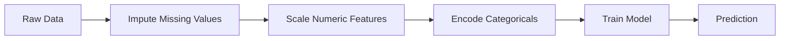
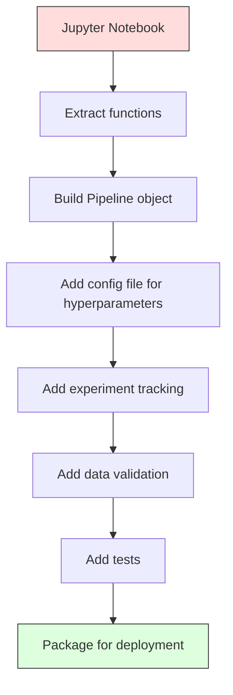

# Tubos de transporte de água
# ML 管线


> Um modelo não é um produto, um pipeline é. O pipeline é tudo, desde dados brutos até previsão implementada, e cada passo deve ser reprodutivo.

> O modelo não é um produto, o tubo é apenas o tubo é tudo, desde os dados originais até a previsão de implementação, cada passo é necessário para ser realizado.

**Type:** Build | **类型：** 构建
**Language:**O Python .**语言：**Python
**Prerequisites:** Phase 2, Lesson 12 (Hyperparameter Tuning) | **前置知识：** Phase 2 第 12 课（超参数调优）
**Time:** ~120 minutes | **时间：** 约 120 分钟

## Objetivos de aprendizagem

- Construir um pipeline de ML a partir do zero que encadeia imputação, escalagem, codificação e treinamento de modelo em um único objeto reprodutível
  A partir de zero construção de tubos de ML, será preenchido, enchido, codificado e modelo treinado em um único objeto replicável
- Identificar cenários de vazamento de dados e explicar como os canais os impedem montando transformadores apenas em dados de formação
  Identificar cenários de fuga de dados, explicar como o tubo passa apenas em dados de treinamento adaptado para transformador para prevenir a fuga
- Construa um ColumnTransformer que aplica diferentes pré-processamento para características numéricas e categorias
  Construir ColunaTransformer, aplicações diferentes ao valor numérico e às características de classe
- Implementar a serialização dos canais e demonstrar que o mesmo canais montado produz resultados idênticos em formação e produção
  Realizar a sequenciação de tubos, demonstrando que os mesmos tubos de adaptação produzem os mesmos resultados no treinamento e produção


> **【中文解读】**
> ML 管线把数据预处理、特征工程、模型训练串串成一条流水线──sklearn pipeline 确保训练和推理的数据处理一致──生产环境中管线化是模型部署的基础──

> **【拓展：从 sklearn Pipeline 到 MLOps 工业级管线】**
> O processo de produção de sistemas de fluxo de água em conjunto com os sistemas de fluxo de dados (MTS) envolve mais de um ciclo de processos de produção de dados (MTS) e de processamento de dados (MTS) que se desenvolve em todo o mundo.

## O problema é o problema da introdução

Tem um bloco de notas que carrega dados, preenche valores faltantes com a mediana, escala características, treina um modelo e imprime precisão.

> Você tem um caderno, carrega dados, preenche o número de faltas, reduz o número de caracteres, o modelo de treinamento, a taxa de precisão de impressão.

Um mês depois, alguém reestrena o modelo e obtém resultados diferentes. A mediana foi calculada no conjunto de dados completo, incluindo os dados de ensaio (vazamento de dados). Os parâmetros de escala não foram salvos, por isso a inferência usa estatísticas diferentes. O código de engenharia de recursos foi copiado e colado entre treinamento e serviço, e as cópias divergiram. Uma coluna categórica ganhou um novo valor em produção que o codificador nunca viu.

> Um mês depois, alguém re-treinou o modelo e obteve resultados diferentes. O número médio foi calculado em um conjunto de dados contendo dados de teste.

Estas não são hipotéticas, são as razões mais comuns pelas quais os sistemas ML falham na produção.

> Estas não são hipóteses. São as causas mais comuns de falhas do sistema de ML na produção.

> **【中文解读】**
> O problema central da solução de ML 管线: o treinamento e o processamento de dados da teoria devem ser totalmente concordantes. O modelo de fracasso mais comum é a padronização do valor médio de cálculo de dados total durante o treinamento.

## O conceito central.

### O que é um oleoduto

Um pipeline é uma sequência ordenada de transformações de dados seguido por um modelo. Cada etapa leva a saída da etapa anterior como entrada. Todo o pipeline é montado uma vez em dados de treinamento. No momento da inferência, o mesmo pipeline montado transforma novos dados e produz previsões.

> O tubo é uma sequência de mudanças de dados ordenada, que se segue por um modelo. Cada passo irá transformar a saída do passo em entrada.



O gasoduto garante:
- As transformações são montadas apenas em dados de formação (sem vazamento)
  变换只在训练数据上拟合 (não há vazamento)
- As mesmas transformações são aplicadas no momento da inferência
  推理时应用相同变化
- Todo o objeto pode ser serializado e implantado como um artefato
  Todo o objeto pode ser ordenado e distribuído como um componente
- A validação cruzada aplica-se ao gasoduto por dobra, evitando uma fuga sutil
  O teste de transferência é aplicado em cada frota, evitando pequenas fugas

### Fugas de dados: O assassino silencioso

O vazamento de dados ocorre quando as informações do conjunto de testes ou dos dados futuros contaminam o treinamento.

> As vazamentos de dados ocorrem durante a formação de contaminação de dados de testes ou futuros dados.

**Leaky (wrong):**
```python
X = df.drop("target", axis=1)
y = df["target"]

scaler = StandardScaler()
X_scaled = scaler.fit_transform(X)

X_train, X_test = X_scaled[:800], X_scaled[800:]
y_train, y_test = y[:800], y[800:]
```

O escalador viu dados de teste. O meio e o desvio padrão incluem amostras de teste.

> O envelope de envelope de dados de teste, o valor médio e o diferencial de padrão, contêm amostras de teste, o que exagerará a estimativa da taxa de precisão.

**Correct:**
```python
X_train, X_test = X[:800], X[800:]

scaler = StandardScaler()
X_train_scaled = scaler.fit_transform(X_train)
X_test_scaled = scaler.transform(X_test)
```

Com um gasoduto, não é preciso pensar nisso.

> Não é preciso pensar nisso.

### Escola de condução

O sklearn `Pipeline`Transformadores de cadeia e estimador.`.fit()`- Não .`.predict()`, e `.score()`que aplicam todas as medidas em ordem.

> sklearn `Pipeline`Vai mudar o câmbio e o calculador.`.fit()`- Não.`.predict()`和 `.score()`, em ordem de aplicação todos os passos:

```python
from sklearn.pipeline import Pipeline
from sklearn.preprocessing import StandardScaler
from sklearn.linear_model import LogisticRegression

pipe = Pipeline([
    ("scaler", StandardScaler()),
    ("model", LogisticRegression()),
])

pipe.fit(X_train, y_train)
predictions = pipe.predict(X_test)
```

Quando ligares .`pipe.fit(X_train, y_train)`- Não .
1. As chamadas do escalador .`fit_transform`No comboio X_
2. Modelo de chamadas`fit`no trem X_escalado

Quando ligares .`pipe.predict(X_test)`- Não .
1. As chamadas do escalador .`transform`(não fit_transform) em X_test
2. Modelo de chamadas`predict`no teste X_test em escala

O escalador nunca vê dados de teste durante a montagem.

> Quando você está a usar`pipe.fit(X_train, y_train)`- Não .
> 1. 缩放器对 X_train 调用 `fit_transform`
> 2. Modelo para a redução de volume do X_train 调用 `fit`
>
> Quando você está a usar`pipe.predict(X_test)`- Não .
> 1. 缩放器对 X_test 调用 `transform`Não é o que se passa .
> 2. 模型对缩放后的 X_test 调用 `predict`
>
> 缩放器在拟合期间永远看不到测试数据―― é o que significa.

### ColunaTransformer: diferentes oleodutos para diferentes colunas

Os conjuntos de dados reais têm colunas numéricas e categorias que necessitam de diferentes pré-processamentos. `ColumnTransformer`- Eu trato disto.

> O verdadeiro conjunto de dados tem uma série de valores e uma série de classes, que requer diferentes pre-processamentos.`ColumnTransformer`Tratar isto.

```python
from sklearn.compose import ColumnTransformer
from sklearn.preprocessing import StandardScaler, OneHotEncoder
from sklearn.impute import SimpleImputer

numeric_pipe = Pipeline([
    ("impute", SimpleImputer(strategy="median")),
    ("scale", StandardScaler()),
])

categorical_pipe = Pipeline([
    ("impute", SimpleImputer(strategy="most_frequent")),
    ("encode", OneHotEncoder(handle_unknown="ignore")),
])

preprocessor = ColumnTransformer([
    ("num", numeric_pipe, ["age", "income", "score"]),
    ("cat", categorical_pipe, ["city", "gender", "plan"]),
])

full_pipeline = Pipeline([
    ("preprocess", preprocessor),
    ("model", GradientBoostingClassifier()),
])
```

O `handle_unknown="ignore"`Quando uma nova categoria aparece (uma cidade que o modelo nunca viu), ele produz um vetor zero em vez de cair.

> OneHotEncoder 中的 `handle_unknown="ignore"`Para a produção é essencial. Quando surgem novas classes de cidades, elas geram zero volumes e não desmoronamento.

### Perseguimento de Experimentos

Um pipeline torna o treinamento reprodutivel, mas também é preciso rastrear o que aconteceu em todos os experimentos: quais os hiperparâmetros usados, qual a versão do conjunto de dados, quais as métricas, qual o código que estava a ser executado.

> 管线让训练可复现, mas você também precisa rastrear o que aconteceu entre os experimentos: usando quais superparâmetros, quais datasets de versão, quais indicadores são, quais são os código que são executados.

**MLflow**é a solução de código aberto mais comum:

> **MLflow**É o mais comum:

```python
import mlflow

with mlflow.start_run():
    mlflow.log_param("max_depth", 5)
    mlflow.log_param("n_estimators", 100)
    mlflow.log_param("learning_rate", 0.1)

    pipe.fit(X_train, y_train)
    accuracy = pipe.score(X_test, y_test)

    mlflow.log_metric("accuracy", accuracy)
    mlflow.sklearn.log_model(pipe, "model")
```

Cada execução é gravada com parâmetros, métricas, artefatos e o modelo completo.

> Cada execução registra os parâmetros, indicadores, componentes e modelos completos. Você pode comparar a execução, repetir qualquer experiência, implementar qualquer versão do modelo.

**Weights & Biases (wandb)**fornece a mesma funcionalidade com um painel de controle hospedado:

> **Weights & Biases (wandb)**提供相同功能,带托管仪表盘:

```python
import wandb

wandb.init(project="my-pipeline")
wandb.config.update({"max_depth": 5, "n_estimators": 100})

pipe.fit(X_train, y_train)
accuracy = pipe.score(X_test, y_test)

wandb.log({"accuracy": accuracy})
```

### Modelo de versão

Depois de fazer o rastreamento de experimentos, é preciso gerir as versões do modelo.

> Depois do rastreamento de experiências, você precisa gerenciar a versão do modelo. Qual modelo está em produção? Qual está em fase? Qual é a semana passada?

O Registo Modelo da MLflow fornece:
- **Version tracking:**Cada modelo salvo recebe um número de versão
  **版本追踪：**Cada modelo de conservação obtém versão número
- **Stage transitions:**"Stage", "Produzção", "Arquivo"
  **阶段转换：**"Stage" ‧"Produzção"‧"Arquivo"
- **Approval workflow:**Os modelos devem ser explicitamente promovidos à produção
  **审批工作流：**O modelo deve ser claramente promovido para produção
- **Rollback:**Passe para uma versão anterior instantaneamente
  **回滚：**立即切回之前的版本

### Versão de dados com DVC

O código é versionado com git. Os dados também devem ser versionados, mas git não pode lidar com arquivos grandes.

> 代码用 git 版本化──数据也应该版本化,但 git 不能处理大文件──DVC(Data Version Control) resolver este problema──

```
dvc init
dvc add data/training.csv
git add data/training.csv.dvc data/.gitignore
git commit -m "Track training data"
dvc push
```

O DVC armazena os dados reais em armazenamento remoto (S3, GCS, Azure) e mantém um pequeno `.dvc`Quando você verifica um compromisso de Git,`dvc checkout`restaura os dados exatos que foram usados.

> DVC colocar o armazém de dados real em distante ((S3、GCS、Azure), em git manter um pequeno `.dvc`Quando você checa um cartão,`dvc checkout`恢复当时使用的精确数据──

Isto significa que cada pin de comitamento de git, tanto o código como os dados, é totalmente reprodutivel.

> Isso significa que cada um dos dados é enviado e fixar o código e dados ao mesmo tempo.

### Experimentos Reproduíveis

Uma experiência reprodutivel requer quatro coisas:

> Uma experiência replicável requer quatro coisas:

1. **Fixed random seeds:**Set sementes para numpy, random, e a estrutura (torca, sklearn)
   **固定随机种子：**Para numpy、random 和 framework(torch、sklearn) configuração de sementes
2. **Pinned dependencies:**requirements.txt ou poetry.lock com versões exatas
   **固定依赖：**requisitos.txt ou poetry.lock 锁定精确版本
3. **Versioned data:**DVC ou similares
   **版本化数据：**DVC ou ferramentas similares
4. **Config files:**Todos os hiperparâmetros num configurador, não codificados
   **配置文件：**Todos os super-parâmetros colocados em configuração, não codificar duro

```python
import numpy as np
import random

def set_seed(seed=42):
    random.seed(seed)
    np.random.seed(seed)
    try:
        import torch
        torch.manual_seed(seed)
        torch.cuda.manual_seed_all(seed)
        torch.backends.cudnn.deterministic = True
    except ImportError:
        pass
```

### Do Notebook ao Pipeline de Produção



A progressão típica:

> Tipico desenvolvimento:

1. **Notebook exploration:**Experimentos rápidos, visualizações, ideias de recursos
   **notebook 探索：**快速实验、可视化、特征思想
2. **Extract functions:**Mover o pré-processamento, a engenharia de recursos, a avaliação em módulos
   **抽取函数：**Pre-processamento, características, avaliação transferido para o módulo
3. **Build Pipeline:**Transformações de cadeia em um gasoduto de sklearn ou em uma classe personalizada
   **构建 Pipeline：**Transformar a cadeia em gasoduto de venda ou auto-definir
4. **Config management:**Mover todos os hiperparâmetros para uma configuração YAML/JSON
   **配置管理：**Mover todos os superparametros para YAML / JSON  Configuração
5. **Experiment tracking:**Adicionar registros de fluxo ML ou de barras
   **实验追踪：**添加 MLflow ou pendra 日志
6. **Data validation:**Verifique esquemas, distribuições e padrões de valores faltantes antes do treinamento
   **数据验证：**訓練前检查 schema、分布、缺失模式
7. **Tests:**Ensaios unitários de transformadores, ensaios de integração para todo o gasoduto
   **测试：**变换器的单元测试、完整管线的集成测试
8. **Deployment:**Serialize o gasoduto, enrolem numa API (FastAPI, Flask), contenerize
   **部署：**序列化管线、包成 API(FastAPI、Flask)、容器化

### Erros comuns no transporte de gasodutos

| Mistake | Why it is bad | Fix |
|---------|-------------|-----|
| Fitting on full data before splitting | Data leakage | Use Pipeline with cross_val_score |
| Feature engineering outside pipeline | Different transforms at train vs serve | Put all transforms in the Pipeline |
| Not handling unknown categories | Production crash on new values | OneHotEncoder(handle_unknown="ignore") |
| Hardcoded column names | Breaks when schema changes | Use column name lists from config |
| No data validation | Silently wrong predictions on bad data | Add schema checks before prediction |
| Training/serving skew | Model sees different features in prod | One Pipeline object for both |

| 错误 | 为什么坏 | 修复 |
|------|---------|------|
| 划分前在全量数据上 fit | 数据泄漏 | 用 Pipeline 配合 cross_val_score |
| 管线外做特征工程 | 训练和服务变换不同 | 把所有变换放进 Pipeline |
| 不处理未知类别 | 生产中新值导致崩溃 | OneHotEncoder(handle_unknown="ignore") |
| 硬编码列名 | schema 改变时失效 | 用配置中的列名列表 |
| 没有数据验证 | 坏数据上预测错误无提示 | 预测前加 schema 检查 |
| 训练/服务偏差 | 生产中模型看到不同特征 | 训练和服务用同一个 Pipeline 对象 |

## Construí-lo e realizei-o.

> **【中文解读】**
> Desde zero implementar ML 管线:自定义 Transformer(实现 fit/transform 接口)、Pipeline 类(链式调用多变换器)、ColumnTransformer(按列分组处理不同类型特征)。

> **【拓展：sklearn Pipeline 在 Kaggle 和工业界的标准模式】**
> O modelo de código padrão do Kaggle Grandmaster quase sempre contém um gasoduto: características de valor com SimpleImputer + StandardScaler, características de classe com SimpleImputer + OneHotEncoder, através do ColumnTransformer 组合后输入模型── isto assegura:
```figure
f3-pipeline-flow
```

## Construí-lo

O código está em `code/pipeline.py`Construirá um oleoduto ML completo a partir do zero:

### Passo 1: Transformador personalizado

```python
class CustomTransformer:
    def __init__(self):
        self.means = None
        self.stds = None

    def fit(self, X):
        self.means = np.mean(X, axis=0)
        self.stds = np.std(X, axis=0)
        self.stds[self.stds == 0] = 1.0
        return self

    def transform(self, X):
        return (X - self.means) / self.stds

    def fit_transform(self, X):
        return self.fit(X).transform(X)
```

### Passo 2: Pipeline a partir do zero

```python
class PipelineFromScratch:
    def __init__(self, steps):
        self.steps = steps

    def fit(self, X, y=None):
        X_current = X.copy()
        for name, step in self.steps[:-1]:
            X_current = step.fit_transform(X_current)
        name, model = self.steps[-1]
        model.fit(X_current, y)
        return self

    def predict(self, X):
        X_current = X.copy()
        for name, step in self.steps[:-1]:
            X_current = step.transform(X_current)
        name, model = self.steps[-1]
        return model.predict(X_current)
```

### Passo 3: Validação cruzada com oleoduto

O código demonstra como a validação cruzada com um pipeline impede a fuga de dados: o escalador é montado separadamente nos dados de formação de cada dobra.

### Passo 4: Pipeline de produção completa com sklearn

Um gasoduto completo com `ColumnTransformer`, vários caminhos de pré-processamento e um modelo, treinado com validação cruzada adequada e registro de experiências.

## Envia-o . Produto .

Esta lição produz:
- `outputs/prompt-ml-pipeline.md`-- habilidade para construir e depurar os oleodutos ML
- `code/pipeline.py`- um gasoduto completo a partir do zero através de sklearn

## Exercícios.

1. Construir um pipeline que trate um conjunto de dados com 3 colunas numéricas e 2 colunas categorias.`ColumnTransformer`Aplicar imputação mediana + escalação para números e imputação mais frequente + codificação de um só calor para categorias. Treinar com validação cruzada de 5 vezes.
   1. Construir e processar 3 colunas de valores numéricos e 2 categorias de colunas de dados.`ColumnTransformer`Para o número de aplicações de cadeias de valores, um número de cadeias de aplicações de classe de cadeias de valores, um número de cadeias de aplicações de classe de cadeias de valores, um número de cadeias de aplicações de classe de aplicações, um número de cadeias de aplicações de classe de valores, um número de cadeias de aplicações de cadeias de valores, um número de cadeias de aplicações de cadeias de valores, um número de cadeias de aplicações de cadeias de valores, um número de cadeias de aplicações de cadeias de valores, um número de cadeias de aplicações de cadeias de valores, um número de cadeias de aplicações de cadeias de classe de valores, um número de cadeias de aplicações de cadeias de valores, um número de cadeias de cadeias de cadeias de cadeias de valores, um número de cadeias de cadeias de cadeias de cadeias de cadeias de valores, um número de cadeias de cadeias de cadeias de cadeias de cadeias de classe de 5 vezes, um treinamento de cadeias de verificação de cadeias de valores, um número de cadeias de cadeias de cadeias de cadeias de cadeias de classe de classe de classe de classe de classe de classe de classe de classe de classe de classe de classe de classe de classe de classe de classe de classe de classe de classe de classe de classe de classe de classe de classe de classe de classe de classe de classe de classe de classe de classe de classe de classe de classe de classe de classe de classe de classe de classe de classe de classe de classe de classe de classe de classe de classe de classe de classe de classe de classe de classe de classe de classe de classe de classe de classe de classe de classe de classe de classe de classe de classe de classe de classe de classe de classe de classe de classe de classe de classe de classe de classe de classe de classe de classe de classe de classe de classe de classe de classe de classe de classe de classe de classe de classe de classe de classe de classe de classe de classe de classe de classe de classe de classe de classe de classe de classe de classe de classe de classe de classe de classe de classe de classe de classe de classe de classe de classe de classe de classe de classe de classe de classe de classe de classe de classe de classe de classe de classe de classe de classe de classe de classe de classe de

2. Introdução deliberada de vazamento de dados: ajuste o escalador no conjunto de dados completo antes de dividir. Compare a pontuação de validação cruzada (queca) com a pontuação de validação cruzada do pipeline (limpo). Quão grande é a diferença?
   2. Por isso, a introdução de vazamentos de dados: em divisão anterior, a quantidade total de dados se encaixa em um escalador.

3. Serialize o seu gasoduto com `joblib.dump`Carregue-o num script separado e execute previsões.
   3. - Não .`joblib.dump`序列化你的管线──在另一个脚本中加载并运行预测──验证预测完全相同──

4. Adicione um transformador personalizado ao pipeline que crie características polinômicas (grado 2) para as duas colunas numéricas mais importantes.
   4. Adicionar um transformador de auto-definção na linha de tubulação, para criar características multi-jogo para as duas linhas de valores mais importantes.

5. Configurar o rastreamento de fluxo de fluxo de fluxo de fluxo de fluxo de fluxo de fluxo para o gasoduto.`mlflow ui`) para comparar corridas e escolher o melhor modelo.
   5. Por exemplo, a linha de configuração de fluxo de dados é de um tipo de sistema de controle de dados.`mlflow ui`) Compare o seu modelo e escolha o melhor modelo.

> **【中文解读】**
> ML 管线的关键设计原则:(1) Todas as mudanças devem ser sequenciadas usando o workbook/pickle 保存完整的装配管线,部署时直接加载;(2) ColumnTransformer 处理混合类型数值特征和类特征分别变换后合并;(3) 管线内不能有任何全局状态每个变压器的适应只依赖传输的训练数据──这些原则确保了训练推理一致性──

> **【拓展：数据泄漏的六种常见形式】**
> (1) Escalador de fites em dados de volume inteiro;(2) 目標编码使用全量数据计算平均值;(3) 时间序列随机划分;(4) 特征选择在全量数据上做;(5) 交叉验证中重复样本出现多次;(6) 预测时使用未来才能获取的特征――管道 通过严格的 fit/transform 分离防止前四种泄漏――对于时间序列和重复样本,需要特殊的交叉验证策略――

## Termos-chave .

| Term | What people say | What it actually means |
|------|----------------|----------------------|
| Pipeline | "Chain of transforms + model" | An ordered sequence of fitted transformers and a model, applied as one unit to prevent leakage |
| Data leakage | "Test info leaked into training" | Using information from outside the training set to build the model, inflating performance estimates |
| ColumnTransformer | "Different preprocessing per column" | Applies different pipelines to different subsets of columns, combining results |
| Experiment tracking | "Logging your runs" | Recording parameters, metrics, artifacts, and code versions for every training run |
| MLflow | "Track and deploy models" | Open-source platform for experiment tracking, model registry, and deployment |
| DVC | "Git for data" | Version control system for large data files, storing hashes in git and data in remote storage |
| Model registry | "Model version catalog" | A system that tracks model versions with stage labels (staging, production, archived) |
| Training/serving skew | "It worked in the notebook" | Differences between how data is processed during training versus inference, causing silent errors |
| Reproducibility | "Same code, same result" | The ability to get identical results from the same code, data, and configuration |

## Mais leitura 延伸阅读

- [scikit-learn Pipeline docs](https://scikit-learn.org/stable/modules/compose.html)-- a referência oficial do gasoduto
  [scikit-learn Pipeline 文档](https://scikit-learn.org/stable/modules/compose.html)- 官方管线参考
- [MLflow documentation](https://mlflow.org/docs/latest/index.html)-- rastreamento de experiências e registo de modelos
  [MLflow 文档](https://mlflow.org/docs/latest/index.html)- 实验追踪和模型注册
- [DVC documentation](https://dvc.org/doc)-- versão de dados
  [DVC 文档](https://dvc.org/doc)- dados de edição
- [Sculley et al., Hidden Technical Debt in Machine Learning Systems (2015)](https://papers.nips.cc/paper/2015/hash/86df7dcfd896fcaf2674f757a2463eba-Abstract.html)-- o documento seminal sobre a complexidade dos sistemas de ML
  [Sculley et al., Hidden Technical Debt in ML Systems (2015)](https://papers.nips.cc/paper/2015/hash/86df7dcfd896fcaf2674f757a2463eba-Abstract.html)- ML 系统复杂性的
- [Google ML Best Practices: Rules of ML](https://developers.google.com/machine-learning/guides/rules-of-ml)-- aconselhamento prático de produção de máquinas de máquinas
  [Google ML Best Practices](https://developers.google.com/machine-learning/guides/rules-of-ml)- 实用生产 ML 建议
