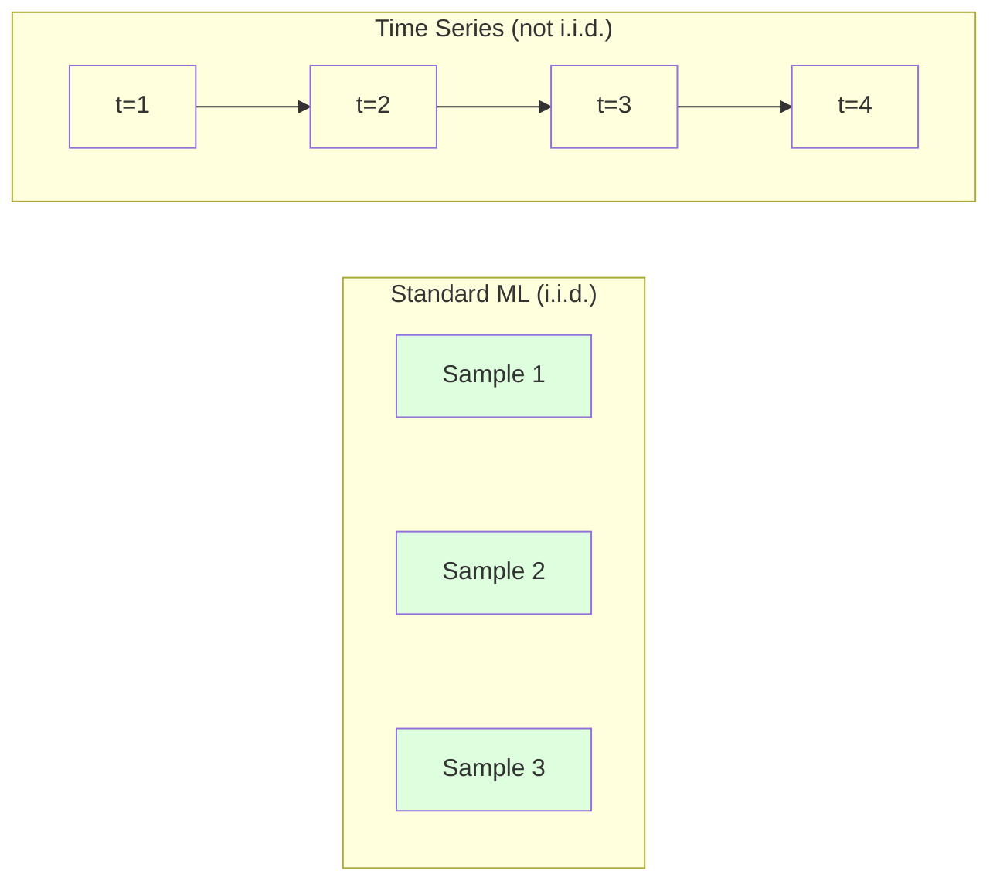
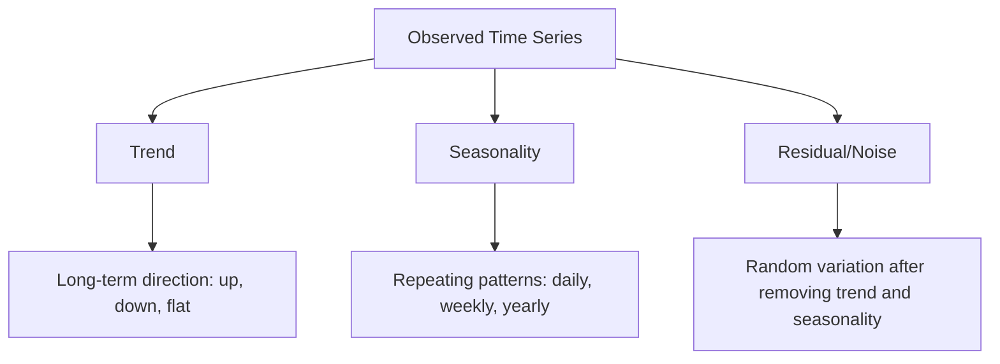
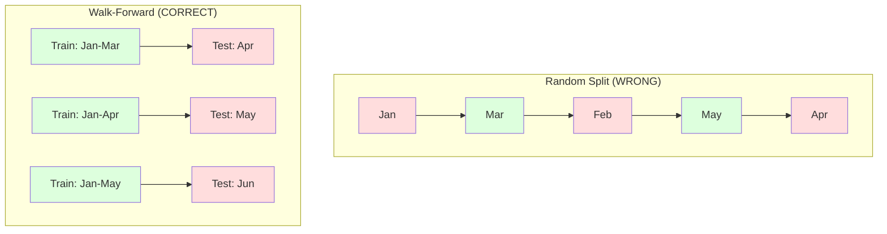

# Fundamentos da série temporal
# 时间序列基础


> O desempenho passado prevê resultados futuros - se verificarmos a estacionalidade primeiro.

> O passado pode prever o futuro, se você primeiro verificar a estabilidade.

**Type:** Build | **类型：** 构建
**Language:**O Python .**语言：**Python
**Prerequisites:** Phase 2, Lessons 01-09 | **前置知识：** Phase 2 第 1-9 课
**Time:** ~90 minutes | **时间：** 约 90 分钟

## Objetivos de aprendizagem

- Descompõe uma série temporal em componentes de tendência, estacionalidade e resíduos e teste de estacionalidade
  Descompõe a sequência temporal em tendências, estações e diferença de tempo, e verifica a equidade.
- Implementar características de atraso e estatísticas de rotação para converter uma série temporal em um problema de aprendizagem supervisionada
  实现滞后特征和滚动统计将时间序列转换为监督学习问题 实现滞后特征和滚动统计将时间序列转换为监督学习问题
- Construir um quadro de validação avançada que impeça a fuga de dados futuros para o treinamento
  Construir um quadro de verificação de rotatividade, para prevenir futuras fugas de dados durante o treinamento
- Explique por que as divisões aleatórias de trens/testes são inválidas para as séries temporais e demonstre a diferença de desempenho em relação às divisões temporais adequadas
  Explicação de por que a separação de treinamento / teste de sequência de tempo não é eficaz, e não usa a separação de tempo correta para mostrar a diferença de desempenho


> **【中文解读】**
> 时间序列是按时间序列排列的数据──ARIMA、指数平滑是经典方法,LSTM/Transformer是深度学习方法──股票预测、销量预测、天气预报是典型应用──

> **【拓展：时间序列预测在金融和供应链中的关键角色】**
> Amazon usa o tempo sequência de previsão para gerenciar o estoque global de centenas de milhões de SKU, previsão diária de mais de 400 milhões de vezes; Uber usa o tempo sequência de previsão de demanda para a dinamização de preços; Instituições financeiras usam ARIMA /GARCH  modelo de previsão de volatilidade para gerir o risco.

## O problema é o problema da introdução

Temos dados ordenados por tempo, vendas diárias, temperatura horária, uso de CPU por minuto, preços de ações semanais, queremos prever o próximo valor, a próxima semana, o próximo trimestre.

> Você tem dados de ordem de tempo. Vendas diárias, temperatura de horas, taxa de utilização de CPU por minuto, preço de ações por semana. Você quer prever o próximo valor, semana, trimestre seguinte.

Você busca o seu conjunto de ferramentas padrão de ML: divisão aleatória de treinamento/teste, validação cruzada, matriz de recursos, previsão. Cada passo é errado.

> Você usa padrão ML 工具:随机训练/测试划分、交叉验证、特征矩阵输入、预测输出── cada passo é errado──

A série temporal quebra as suposições que o ML padrão depende. As amostras não são independentes - a temperatura de hoje depende da de ontem. As divisões aleatórias vazam informações futuras para o passado. As características que parecem ótimas em backtest falham na produção porque dependem de padrões que mudam ao longo do tempo.

>  Sequência de tempo quebra a suposição de que a norma ML depende.  A amostra não é independente A temperatura de hoje depende da de ontem  A distribuição de informações no futuro vai vazamento para o passado  Em reviews, parece muito bom caracterizar a falha na produção, pois eles dependem de padrões de mudança de tempo

Um modelo que obtém 95% de precisão com validação cruzada aleatória pode obter 55% com avaliação baseada em tempo adequada. A diferença não é uma tecnique. É a diferença entre um modelo que trabalha em papel e um que trabalha na produção.

> Um modelo que obteve 95% de precisão em verificação de transferência aleatória em tempo real pode obter apenas 55%. Não é um detalhe técnico. Esta é a diferença entre um modelo válido no papel e um modelo válido na produção.

Esta lição abrange os fundamentos: o que torna os dados do tempo diferentes, como avaliar os modelos honestamente e como transformar uma série de tempos em características que os modelos padrão de ML podem consumir.

> Esta aula abrange conhecimentos básicos: o que faz os dados do tempo diferentes, como avaliar honestamente o modelo, e como transformar a sequência do tempo em características padrão que o modelo ML pode usar.

> **【中文解读】**
> A diferença entre o tempo e a dependência de dados é que o valor de hoje depende do valor de ontem. Isso rompe a suposição de independência e distribuição do standard ML. O conceito central é: estabilidade, estacionalidade, características estatísticas que não mudam com o tempo. Tendências, estações e deslocamentos.

## O conceito central.

### O que torna a série de tempos diferente

A ML padrão assume i.i.d. - independente e distribuída de forma idêntica. Cada amostra é tirada da mesma distribuição, independentemente de outras amostras.

> 標準 ML 假设 i.i.d.独立同分布── cada amostra é extraída da mesma distribuição, com outras amostra não está relacionada── sequência de tempo viola estas duas hipóteses:

- **Not independent.**O preço das ações de hoje depende do de ontem. As vendas desta semana se correlacionam com as da semana passada.
  Não independentes. O preço das ações de hoje depende do de ontem.
- **Not identically distributed.**As vendas em Dezembro parecem diferentes das de Março.
  Não é igual distribuição. Distribuição varia ao longo do tempo.

Estas violações não são menores, alteram a forma como se construem recursos, como se avaliam modelos e quais algoritmos funcionam.

> Estas violações não são pequenas questões. Eles mudaram como você constrói características, como avalia o modelo e quais algoritmos são eficazes.



No ML padrão, as amostras são intercambiáveis. misturando-as não muda nada.

> No ML padrão, o modelo é intercâmbio. Não há nenhuma alteração.

### Componentes de uma série temporal

Cada série de tempos é uma combinação de:

> Cada sequência de tempo é composto dos seguintes componentes:



- **Trend**A direcção a longo prazo: crescimento de 10% de receita por ano.
  趋势:长期方向── crescimento anual de 10% dos rendimentos── aumento da temperatura global──
- **Seasonality**A utilização de ar condicionado é de um modo mais elevado em Julho.
  季节性:固定间隔的重复模式── vendas de varejo aumentaram em 12 meses── o uso de ar em 7 meses atingiu o seu pico──
- **Residual**Se o resíduo parece ruído branco, a decomposição captura o sinal.
  Restos: eliminação de tendências e parte posterior da estação. Se o residuo parece ser ruído branco, a descrição da degradação já captura o sinal.

### Estacionalidade

Uma série temporal é estacionária se suas propriedades estatísticas (média, variância, autocorrelação) não mudarem ao longo do tempo.

> Se a característica estatística de uma sequência de tempo (o valor médio, a diferença, a sua relação) não mudar com o tempo, então ela é plana.

**Why it matters:**Uma série não estacionária tem uma média que deriva. Um modelo treinado com dados de Janeiro aprendeu uma média diferente do que fevereiro mostrará.

> **为什么重要：**O valor médio de uma sequência não-estabilizada vai deslocar-se.

**How to check:**Calcule a média de rolamento e o desvio padrão de rolamento sobre as janelas.

> **如何检查：**計算窗口內滚动平均值和滚动标准差──如果它们漂移,序列就是不平稳的──

**How to fix:**Diferenciamento: em vez de modelar os valores brutos, modelar a mudança entre os valores consecutivos:

> **如何修复：**差分── não em relação ao valor original, mas em relação à variação entre os valores continuados:

```
diff[t] = value[t] - value[t-1]
```

Se uma rodada de diferenciação não faz com que a série fique estacionária, aplique-a novamente (diferença de segunda ordem).

> Se uma rodada de diferença não conseguir fazer a sequência estabilizar, reaplicar uma vez mais.

**Example:**

> **示例：**

Série original: [100, 102, 106, 112, 120]
Primeira diferença: [2, 4, 6, 8] (ainda em tendência para cima)
Segunda diferença: [2, 2, 2] (constante -- estacionário)

A série original tinha uma tendência quadrática. A primeira diferenciação tornou-a uma tendência linear. A segunda diferenciação tornou-a plana. Na prática, raramente é necessário mais de duas rodadas.

> O primeiro ciclo tem duas tendências. O primeiro ciclo tem tendências lineares.

**Formal test:**O teste Augmented Dickey-Fuller (ADF) é o teste estatístico padrão para estacionalidade. A hipótese nula é "a série é não estacionária". Um p-valor abaixo de 0,05 significa que você pode rejeitar o zero e concluir estacionalidade. Não implementamos ADF do zero (requer tabelas de distribuição assintóticas), mas a abordagem de estatística rodante em nosso código dá uma verificação visual prática.

> **正式检验：**Aumento Dickey-Fuller(ADF) teste é um teste estatístico padrão de planejação. O zero-hypothesis é um "série não-planeja" (p 值低于0.05). Significa que você pode rejeitar o zero-hypothesis e obter conclusões planejadas. Não podemos implementar o ADF a partir de zero.

### Autocorrelação

A autocorrelação mede o quanto um valor no tempo t correlaciona com o valor no tempo t-k (pasos k no passado).

> Relação entre o valor do tempo t e o valor do tempo t-k  passados k  步.

**ACF tells you:**
- Se o ACF cair para zero após o lag 5, os valores de mais de 5 passos atrás são irrelevantes.
  A memória da sequência é muito longa. Se o ACF estiver atrasado em 5                                                                                                                                                                                                                                                                                                                                                                                                                                                                                                           
- Se a ACF aumenta em atraso de 12 (dados mensais), há estacionalidade anual.
  Se o ACF estiver atrasado em 12 pontos, há um pico de estação anual.
- Usar lags até onde o ACF se torna insignificante.
  Criação                                                                                                                                                                                                                                                             

**PACF (Partial Autocorrelation Function)**Se hoje correlacionar com 3 dias atrás apenas porque ambos correlacionam com ontem, o PACF no lag 3 será zero enquanto o ACF no lag 3 não será.

> **PACF（偏自相关函数）**Se hoje e 3 dias anteriores estiverem relacionados apenas porque ambos estão relacionados com ontem, o PACF está atrasado em 3 e o ACF está atrasado em 3 e não está em zero.

### Características do Lag: Transformar a série do tempo em aprendizado supervisionado

Os modelos ML padrão precisam de uma matriz de características X e um alvo y. A série temporal dá-lhe uma única coluna de valores.

> 标准 ML 模型需要特征矩阵 X 和目标 y──时间序列给你一列值──桥梁是滞后特征──

Tome a série [10, 12, 14, 13, 15] e crie características lag-1 e lag-2:

> 取序列 [10, 12, 14, 13, 15] 并创建滞后 1 和滞后 2 Características:

| lag_2 | lag_1 | target |
|-------|-------|--------|
| 10    | 12    | 14     |
| 12    | 14    | 13     |
| 14    | 13    | 15     |

Agora você tem um problema de regressão padrão. Qualquer modelo ML (regressão linear, floresta aleatória, aumento de gradiente) pode prever o alvo a partir dos lags.

> Agora você tem um problema de regresso padrão. Qualquer modelo de ML pode ser de um atraso.

Características adicionais que você pode criar:
- **Rolling statistics:**média, std, min, max sobre os últimos valores k
  滚动统计: passado k 个值的平均值、标准差、最小值、最大值
- **Calendar features:**dia da semana, mês, feriado, fim de semana
  日历特征:星期几月份是否假期是否周末
- **Differenced values:**alteração em relação à etapa anterior
  差分值:与前一步的变化
- **Expanding statistics:**média acumulada, soma acumulada
  扩展统计: acumulação média
- **Ratio features:**Valor corrente / média de rotação (quão longe da média recente)
  Características da taxa: actual valor / rolling mean value (%)
- **Interaction features:**1 * dia_da_semana (efeitos dos dias de semana sobre o impulso)
  交互特征:lag_1 * dia_da_semana(工作日对动量的影响)

**How many lags?**Use a função de autocorrelação. Se o ACF for significativo até 10 lag, use pelo menos 10 lags. Se houver estacionalidade semanal, inclua lag 7 (e possivelmente 14).

> **用多少个滞后？**Use as funções relacionadas. Se o ACF estiver atrasado em 10 anos, use pelo menos 10 anos de atraso. Se houver estações de semana, incluindo atraso em 7 anos, pode haver 14 anos.

**The target alignment trap.**Quando se criam características de lag, o objetivo deve ser o valor no tempo t, e todas as características devem usar valores no tempo t-1 ou antes. Se você accidentalmente incluir o valor no tempo t como uma característica, você tem um preditor perfeito - e um modelo completamente inútil. Este é o bug mais comum na engenharia de características de séries temporais.

> **目标对齐陷阱。** Quando se cria um traço atrasado, o objetivo deve ser o valor de tempo t, todos os traços devem usar o valor de tempo t-1 ou mais cedo. Se você não tiver intenção de usar o valor do tempo t como traço, você terá um prédictor perfeito, mas também um modelo completamente inútil. É o bug mais comum no projeto de traços de sequência de tempo.

### Validação de avanço

Esta é a ideia mais importante desta lição. A validação cruzada padrão de k-fold atribui aleatoriamente amostras para treinar e testar. Para séries temporais, isso vazou informações futuras.

> É o conceito mais importante deste curso. O padrão de teste de transição é distribuído de forma rápida para o treinamento e o teste.



Validação de avanço:
1. Traçar dados até o tempo t
   Treinar em dados do tempo antes
2. Previsão no tempo t+1 (ou t+1 a t+k para várias etapas)
   Em tempo t+1 预测(或多步预测 t+1 até t+k)
3. Deslizar a janela para a frente
   Para o pré-slip
4. Repitação
   O que é isso?

Cada teste contém apenas dados que vêm após todos os dados de treinamento. Não há vazamento futuro. Isso dá uma estimativa honesta de como o modelo irá funcionar quando implantado.

> Cada teste de folga contém apenas os dados posteriores ao treino. Não há vazamentos futuros. Isso fornece uma estimativa honesta da capacidade do modelo durante a implantação.

**Expanding window**utiliza todos os dados históricos para a formação (a janela cresce). **Sliding window**Use a expansão quando você acha que dados antigos ainda são relevantes. Use a deslizagem quando o mundo muda e os dados antigos dão mal.

> **扩展窗口**Utilize todos os dados históricos para fazer treinamento (Windows growth)**滑动窗口**Use fixed size training window (Fixed Size Training Window) ([[Fixed Size Training Window]]) ([[Fixed Size Training Window]]) ([[Fixed Size Training Window]]) ([[Fixed Size Training Window]]) ([[Fixed Size Training Window]]) ([[Fixed Size Training Window]]) ([[Fixed Size Training Window]]) ([[Fixed Size Training Window]]) ([[Fixed Size Training Window]]) ([[Fixed Size Training Window]]) ([[Fixed Size Training Window]]) ([[Fixed Size Window]]) ([[Fixed Size Window]]) ([[Fixed Size Training Window]]) ([[Fixed Size Window]]) ([[Fixed Size Window]]) ([[Fixed Size Window]]) ([[Fixed Size Window]]) ([[Fixed Size Window]]) ([[Fixed Size]]) ([[Fixed Size]]) ([[Fixed Size]]) ([[Fixed Size]] ([[Fixed Size]]) ([[Fixed Size]]) ([[Fixed Size]]) ([[Fixed Size]]) ([[Fixed Size]]) ([[Fixed Size]] ([[F) ([[F) ([[F) ([[F) ([[F) ([[]]) ([[]]) ([[]] ([[]]) ([[]]) ([[]] ([[]]) ([[]]) ([[[[]]) ([[[[[[[[[[]]) ([[]]) ([[[[]]) ([[]]) ([[[[[[]]) ([[[[[[]]) ([[[[[[[[]]) ([[]]) ([[]]) ([[[[]]) ([[[[[[]]) ([[[[[[[[]]) ([[]]) ([[]]) ([[]]) ([[]]) ([[]]) ([[]]) ([[]]) ([[]]) ([[]]) ([[]]) ([[]]) ([[]]) ([[]]) ([[]]) ([[]]) ([[]]) ([[]]) ([[]]) ([[]]) ([[]]) ([[]]) ([[]]) ([[]]) ([[]]) ([[]]) ([[]]) ([[]]) ([[]]) ([[]]

### Intuição ARIMA

ARIMA é o modelo clássico de séries temporais.

> ARIMA é um modelo clássico de sequência de tempo.

- **AR (Autoregressive):**Prevê-lo a partir de valores passados.
  AR(auto-regresso): de passado 预测──AR(p) 使用最近 p 个值──
- **I (Integrated):**Diferenciamento para obter estacionalidade.
  I 积分: através de diferença para alcançar a estabilidade.
- **MA (Moving Average):**Previsão a partir de erros de previsão passados.
  MA(移动平均): do passado 预测误差预测。MA(q) Uso recente q 个误差。

ARIMA ((p, d, q) combina os três.

> ARIMA(p, d, q) 组合了所有三成分──你基于ACF/PACF 分析或自动搜索(auto-ARIMA) 选择 p、d、q──

Não vamos implementar o ARIMA do zero - requer otimização numérica que está além do escopo desta lição. A principal ideia é entender o que cada componente faz para que você possa interpretar os resultados do ARIMA e saber quando usá-lo.

> Não vamos implementar ARIMA a partir de zero, mas isso requer otimizar os valores numéricos que vão além do alcance da aula.

### Quando usar o quê

| Approach | Best For | Handles Seasonality | Handles External Features |
|----------|---------|-------------------|------------------------|
| Lag features + ML | Tabular with many external features | With calendar features | Yes |
| ARIMA | Single univariate series, short-term | SARIMA variant | No (ARIMAX for limited) |
| Exponential smoothing | Simple trend + seasonality | Yes (Holt-Winters) | No |
| Prophet | Business forecasting, holidays | Yes (Fourier terms) | Limited |
| Neural networks (LSTM, Transformer) | Long sequences, many series | Learned | Yes |

Para a maioria dos problemas práticos, os recursos de lag + aumento de gradiente é o ponto de partida mais forte.

> Para a maioria dos problemas reais, o atraso + o aumento de gradiente é o ponto de partida mais forte.

### Previsões de horizontes e estratégias

A previsão de um passo prevê um passo de frente.

> 单步预测预测 下一个时间步多步预测预测多个时间步 Há três estratégias:

**Recursive (iterated):**Previnha um passo à frente, use a previsão como entrada para o próximo passo. É simples, mas os erros se acumulam - cada previsão usa a previsão anterior, por isso os erros são compostos.

> **递归（迭代）：**预测一步,将预测结果作为下一步的输入──简单但误差会积累每个预测使用前一个预测,因此错误会叠加──

**Direct:**Treinar um modelo separado para cada horizonte. O modelo-1 prevê t+1, o modelo-5 prevê t+5. Não há acumulação de erros, mas cada modelo tem menos amostras de treinamento e não compartilham informações.

> **直接：**Para cada modelo, o campo de treinamento é único. Modelo-1  Predicção t+1, Modelo-5  Predicção t+5── não há erros acumulados, mas cada modelo tem menos e não compartilha informações──

**Multi-output:**Treinar um modelo que sai todos os horizontes simultaneamente. Compartilha informações através de horizontes, mas requer um modelo que suporta múltiplas saídas (ou uma função de perda personalizada).

> **多输出：**訓練一個模型同時输出所有预测范围──跨范围共享信息,但需要支持多输出模型──或自定义损失函数──

Para a maioria dos problemas práticos, comece com o recursivo para horizontes curtos (1-5 passos) e direto para horizontes mais longos.

> Para a maioria dos problemas reais, o alcance é reduzido a 1 a 5 passos.

### Erros comuns na série de tempos

| Mistake | Why it happens | How to fix |
|---------|---------------|-----------|
| Random train/test split | Habit from standard ML | Use walk-forward or temporal split |
| Using future features | Feature at time t included by mistake | Audit every feature for temporal alignment |
| Overfitting to seasonality | Model memorizes calendar patterns | Hold out a full seasonal cycle in the test set |
| Ignoring scale changes | Revenue doubles but patterns stay | Model percentage change instead of absolute |
| Too many lag features | "More history is better" | Use ACF to determine relevant lags |
| Not differencing | "The model will figure it out" | Tree models handle trends; linear models need stationarity |

## Construí-lo e realizei-o.

> **【中文解读】**
> Do zero implementar a sequência de tempo ferramenta central: lag lag lag lag lag lag lag lag tr characteristics generator (((将序列转转为监督学习格式) 滚动统计) 移动平均、移动标准差) 平稳性检查 (移动平均、移动标准差) 平稳性检查 (移动平均、移动标准差) 平稳性检查 (ADF 检查) 时间序列分解 (时间序列分解) 趋势+季节性+残差) 走向 验证框架──关键教训:绝不能随机划分时间序列数据──

> **【拓展：从 ARIMA 到 Transformer——时间序列预测的进化】**
> 经典时间序列方法 (ARIMA、Holt-Winters) ainda é válido em monovário、短序列. Mas o método moderno já ultrapassou significativamente: o Facebook Prophet Automatic Processing节假日和季节性; a Amazon DeepAR usando RNN para fazer previsão de probabilidade; o Google TimesFM e o Amazon Chronos usando Transformer 架构, obtiveram avanços em zero sample ([[0-shot]]) de previsão de sequências de tempo. Estes modelos podem processar milhares de previsões conjuntas de sequências de tempo relacionadas.
```figure
f3-series-decompose
```

## Construí-lo

O código está em `code/time_series.py`Implementa os blocos de construção do núcleo a partir do zero.

> `code/time_series.py`O código central realizou o núcleo de construção do módulo de código desde o zero.

### Criador de características Lag

```python
def make_lag_features(series, n_lags):
    n = len(series)
    X = np.full((n, n_lags), np.nan)
    for lag in range(1, n_lags + 1):
        X[lag:, lag - 1] = series[:-lag]
    valid = ~np.isnan(X).any(axis=1)
    return X[valid], series[valid]
```

Isto converte uma série 1D em uma matriz de características onde cada linha tem a última `n_lags`Os valores são característicos e o valor atual é o objetivo.

> Isto vai ser um processo transformado em matrizes de caracteres, cada linha será mais recente.`n_lags`个值作为特征,当前值作为目标──

### Validação cruzada

```python
def walk_forward_split(n_samples, n_splits=5, min_train=50):
    assert min_train < n_samples, "min_train must be less than n_samples"
    step = max(1, (n_samples - min_train) // n_splits)
    for i in range(n_splits):
        train_end = min_train + i * step
        test_end = min(train_end + step, n_samples)
        if train_end >= n_samples:
            break
        yield slice(0, train_end), slice(train_end, test_end)
```

Cada divisão garante que os dados de treinamento sejam estritamente apresentados antes dos dados de teste.

> Cada divisão assegura que os dados do treinamento sejam rigorosamente testados antes de serem testados.

### Modelo Autoregressivo Simples

Um modelo de AR puro é apenas regressão linear em características de lag:

> O modelo de pura AR é o regresso linear do traço atrasado:

```python
class SimpleAR:
    def __init__(self, n_lags=5):
        self.n_lags = n_lags
        self.weights = None
        self.bias = None

    def fit(self, series):
        X, y = make_lag_features(series, self.n_lags)
        # Solve via normal equations
        X_b = np.column_stack([np.ones(len(X)), X])
        theta = np.linalg.lstsq(X_b, y, rcond=None)[0]
        self.bias = theta[0]
        self.weights = theta[1:]
        return self
```

Isto é conceptualmente idêntico à regressão linear da lição 02, mas aplicado a versões atrasadas no tempo da mesma variável.

> Este é, no conceito, o mesmo que o regresso linear da segunda classe, mas é aplicado à versão posterior do mesmo valor de variação de tempo.

### Verificação de estacionalidade

O código calcula estatísticas de rotação para avaliar visualmente e numericamente a estacionalidade:

> 代码计算滚动统计量, avaliando a sua estabilidade de forma visível e numérica:

```python
def check_stationarity(series, window=50):
    rolling_mean = np.array([
        series[max(0, i - window):i].mean()
        for i in range(1, len(series) + 1)
    ])
    rolling_std = np.array([
        series[max(0, i - window):i].std()
        for i in range(1, len(series) + 1)
    ])
    return rolling_mean, rolling_std
```

Se a deriva média de rolamento ou a std de rolamento mudar, a série não é estacionária.

> Se o valor médio de rolamento desloca-se ou os padrões de rolamento variam, o sequência é desestabilizada.

O código verifica também a estacionalidade comparando a primeira metade e a segunda metade da série. Se os meios diferirem em mais de metade de um desvio padrão ou a relação de variância exceder 2x, a série é sinalizada como não estacionária.

> O código também passa pela primeira metade e a segunda metade da sequência de comparação para verificar a estabilidade. Se a diferença média de valor exceder metade da diferença padrão, ou a diferença de forma superior a 2 vezes, a sequência é marcada como não estabilidade.

### Autocorrelação

```python
def autocorrelation(series, max_lag=20):
    n = len(series)
    mean = series.mean()
    var = series.var()
    acf = np.zeros(max_lag + 1)
    for k in range(max_lag + 1):
        cov = np.mean((series[:n-k] - mean) * (series[k:] - mean))
        acf[k] = cov / var if var > 0 else 0
    return acf
```

## Use-o com o framework implementado.

Com sklearn, você usa características de lag diretamente com qualquer regressor:

> Usando o sklearn, você pode ficar atrasado para qualquer regresso:

```python
from sklearn.linear_model import Ridge
from sklearn.ensemble import GradientBoostingRegressor

X, y = make_lag_features(series, n_lags=10)

for train_idx, test_idx in walk_forward_split(len(X)):
    model = Ridge(alpha=1.0)
    model.fit(X[train_idx], y[train_idx])
    predictions = model.predict(X[test_idx])
```

Para ARIMA, use modelos estatísticos:

> 对于ARIMA,使用统计模型:

```python
from statsmodels.tsa.arima.model import ARIMA

model = ARIMA(train_series, order=(5, 1, 2))
fitted = model.fit()
forecast = fitted.forecast(steps=30)
```

O código está em `time_series.py`demonstra ambas as abordagens e as compara utilizando a validação avançada.

> `time_series.py`O código central apresenta duas formas, e usa o teste de rolamento para comparar.

### sklearn TimeSeriesSplit

sklearn fornece `TimeSeriesSplit`que implementa a validação avançada:

> - Não .`TimeSeriesSplit`, realizou o pre-rolling verificação:

```python
from sklearn.model_selection import TimeSeriesSplit

tscv = TimeSeriesSplit(n_splits=5)
for train_index, test_index in tscv.split(X):
    X_train, X_test = X[train_index], X[test_index]
    y_train, y_test = y[train_index], y[test_index]
    model.fit(X_train, y_train)
    score = model.score(X_test, y_test)
```

Isto é equivalente ao nosso de cero .`walk_forward_split`Mas integrado no quadro de validação cruzada do sklearn.`cross_val_score`- Não .

> Isto é o mesmo que nós realizamos a partir de zero.`walk_forward_split`Mas integrado no quadro de verificação de intercâmbio do sklearn.`cross_val_score`Uma utilização:

```python
from sklearn.model_selection import cross_val_score

scores = cross_val_score(model, X, y, cv=TimeSeriesSplit(n_splits=5))
print(f"Mean score: {scores.mean():.4f} +/- {scores.std():.4f}")
```

### Metricas de avaliação

A previsão de séries temporais usa métricas de regressão, mas com contexto consciente do tempo:

> 时间序列预测 Usar índice de regresso, mas com tempo sensitivo

- **MAE (Mean Absolute Error):**"Em média, as previsões estão desfeitas em 3,2 graus".
  MAE(平均绝对差 - ), o que significa que o diferencial de pronóstico é muito grande.
- **RMSE (Root Mean Squared Error):**Raiz quadrada do erro quadrado médio. Penaliza erros grandes mais do que MAE. Use quando erros grandes são piores do que muitos erros pequenos.
  RMSE (RMSE) (RMSE) (RMSE) (RMSE) (RMSE) (RMSE) (RMSE) (RMSE) (RMSE) (RMSE) (RMSE) (RMSE) (RMSE) (RMSE) (RMSE) (RMSE) (RMSE) (RMSE) (RMSE) (RMSE) (RMSE) (RMSE) (RMSE) (RMSE) (RMSE) (RMSE) (RMSE) (RMSE) (RMSE) (RMSE) (RMSE) (RMSE) (RMSE) (RMSE) (RMSE) (RMSE) (RMSE) (RMSE) (RMSE) (RMSE) (RMSE) (RMSE) (RMSE) (RMSE) (RMSE) (RMSE) (RMSE) (RMSE) (RMSE) (RMSE) (RMSE) (RMSE) (RMSE) (RMSE) (RMSE) (RMSE) (RMSE) (R) (R) (R) (R) (R) (R) (R) (R) (R) (R) (R) (R) (R) (R) (R) (R) (R) (R) (R) (R) (R) (R) (R) (R) (R) (R) (R) (R) (R) (R) (R) (R) (R) (R) (R) (R) (R) (R) (R) (R) (R) (R) (R) (R) (R) (R) (R) (R) (R) (R) (R) (R) (R) (R) (R) (R) (R) (R) (R) (R) (R) (R) (R) (R) (R) (R) (R) (R) (R) (R) (R) (R) (R) (R)
- **MAPE (Mean Absolute Percentage Error):**Média de erro / verdadeiro_valor = 100. Independente de escala, útil para comparação entre diferentes séries. Mas indefinido quando os valores verdadeiros são zero.
  MAPE (average absolute percentage error): o erro de dados / verdadeiro valor de dados * 100 não tem relação com a medida, é aplicável a diferentes séries de comparação, mas o valor real é não definido.
- **Naive baseline comparison:**Sempre compare com linhas de base simples. A linha de base sazonal ingênua prevê o valor de um período anterior (ontem, na semana passada).
  朴素基线比较:始终与简单基线比较──季节性朴素基线预测一个周期前的值(昨天、上周)── Se o seu modelo não pode ultrapassar a linha simples, explique o problema──

### Características de rolagem

O código demonstra a adição de estatísticas de rotação (média, std, min, max sobre janelas de 7 e 14 dias) para características de lag.

> O código apresenta estatísticas de rotatividade (incluindo o valor médio, o diferencial padrão, o valor mínimo e o valor máximo das janelas 7 天和14 天) adicionado a traços atrasados. Estes dados fornecem informações de tendências e variabilidade recentes que os traços atrasados não podem capturar.

Por exemplo, se a média de rolamento está aumentando, sugere uma tendência ascendente. Se a std de rolamento está aumentando, sugere uma volatilidade crescente. Estes são os tipos de padrões que os modelos baseados em árvores podem aprender, mas os modelos lineares não podem.

> Por exemplo, se o valor médio de rolamento aumenta, indica uma tendência de aumento. Se a diferença de padrão de rolamento aumenta, indica que a volatilidade aumenta. Estes são modelos de árvore que podem ser aprendidos, mas os modelos lineares não podem ser aprendidos.

## Envia-o . Produto .

Esta lição produz:
- `outputs/prompt-time-series-advisor.md`-- um aviso para enquadrar os problemas de séries temporais
  `outputs/prompt-time-series-advisor.md` 构建时间序列问题的提示词
- `code/time_series.py`-- características de atraso, validação avançada, modelo AR, verificações de estacionalidade
  `code/time_series.py` 滞后特征、前向滚动验证、AR 模型、平稳性检查

### Linhas de base que você deve superar

Antes de construir qualquer modelo, estabeleça as linhas de base:

> Antes de construir qualquer modelo, estabelecer base:

1. **Last value (persistence).**Previne que amanhã será o mesmo que hoje.
   O que é que é que é uma grande coisa?
2. **Seasonal naive.**Preveja que hoje será o mesmo dia da semana passada (ou do ano passado). Se o seu modelo não conseguir vencer isso, não aprendeu nenhum padrão útil além da estacionalidade.
   季节性朴素──预测 hoje com a semana passada (ou no ano passado) no mesmo dia── Se o seu modelo não pode ultrapassar esta linha-chave, ele não aprendeu qualquer modelo útil de ultra-temporada──
3. **Moving average.**Previnha a média dos últimos valores k.
   移动平均──预测近期 k 个值的平均值──平滑噪音但无法捕获突变──

Se o seu modelo de ML de fantasia perde para a linha de base sazonal ingênua, você tem um bug.

> Se você tiver um modelo de ML bem concebido e transmitido uma linha de base simples, você tem um bug. O mais comum é: fuga futura de características, método de avaliação errada, ou a sequência é realmente casualidade e imprevisível.

### Dicas Práticas

1. **Start with plotting.**Antes de qualquer modelagem, trace a série crua. Procure tendências, estacionalidade, valores fora da linha, rupturas estruturais (mudanças repentinas no comportamento). Uma inspeção visual de 30 segundos muitas vezes diz mais de uma hora de análise automatizada.
   Antes de qualquer construção, desenhe uma sequência original. Procure tendências, estações, valores anormais, mudanças estruturais, mudanças repentinas de comportamento.

2. **Difference first, model second.**Se a série tiver uma tendência clara, diferencie-a antes de criar características de lag. Os modelos baseados em árvores podem lidar com tendências, mas os modelos lineares não podem, e a diferenciação nunca faz mal.
   Antes de diferença, depois de construção. Se a sequência tiver tendências evidentes, antes de traços de atraso na criação, o modelo de árvore pode lidar com a tendência, mas o modelo linear não pode, e a diferença não terá um impacto negativo.

3. **Hold out at least one full seasonal cycle.**Se tiver uma estacionalidade semanal, o seu conjunto de testes precisa de pelo menos uma semana completa.
   Deixe pelo menos um ciclo de estação completo. Se tiver uma semana de estação, o teste de conjunto precisa de pelo menos uma semana. Se for de um mês, pelo menos um mês.

4. **Monitor in production.**Os modelos de séries temporais se degradam ao longo do tempo à medida que o mundo muda.
   En produção monitoração. O modelo de sequência de tempo se deteriora com a mudança do mundo.

5. **Beware of regime changes.**Um modelo treinado em dados pré-pandêmicos não prevê o comportamento pós-pandêmico. Incluir indicadores de mudanças de regime conhecidas como características, ou usar uma janela deslizante que esqueça dados antigos.
   Mudanças de estado de espírito. O modelo de treinamento de dados pré-epidêmicos não pode prever o comportamento pós-epidêmico.

6. **Log-transform skewed series.**Receita, preços e contagens são muitas vezes distorcidos à direita. Tomar o registro estabiliza a variância e torna os padrões multiplicativos aditivos, que os modelos lineares podem lidar.
   Para a sequência de mudanças numéricas, os preços e a contagem são geralmente de direita.

## Exercícios.

1. **Stationarity experiment.**Gerar uma série com uma tendência linear. Verificar a estacionalidade com estatísticas de rolamento. Aplicar a primeira diferenciação. Verificar novamente. Quantas rodadas de diferenciação é necessário para uma tendência quadrática?
   1. Formar uma sequência de tempo de síntese de tendências e estações.

2. **Lag selection.**Calcule ACF em uma série sazonal (período = 7). Quais lags têm a maior autocorrelação? Crie características de lag usando apenas esses lags (não lags consecutivos). Melhora a precisão em comparação com o uso de lags 1 a 7?
   2. 构建滞后特征(lag 1-7)和滚动统计(window 3、7、14)。

3. **Walk-forward vs random split.**Treinar uma regressão Ridge em características de lag. Avaliação com divisão aleatória 80/20 e com validação avançada.
   3. Em comparação com os mesmos dados, a análise de dados e a análise de dados mostram que a divisão de dados conduz a uma estimativa excessiva de otimismo.

4. **Feature engineering.**Adicione a média de rodada (window=7), a std de rodada (window=7), e as características de dia da semana às características de lag. Compare a precisão com e sem esses extras usando validação avançada.
   4. 实现 ARIMA(p, d, q) 从零──网格搜索最优参数,使用AIC 选择最佳模型──

5. **Multi-step forecasting.**Modifique o modelo AR para prever 5 passos à frente em vez de 1. Compare duas estratégias: (a) prever um passo, usar a previsão como entrada para o próximo passo (recursivo) e (b) treinar modelos separados para cada horizonte (directo). Qual é mais preciso?

> **【中文解读】**
> Time sequence's core toolbox:ADF  inspection judge flatness(p-value < 0.05  reject non-flat assumption);差分 elimination trend(一阶差分 = hoje - ontem);滞后特征将序列转转为监督学习格式(使用t-1, t-2,... 的值预测 t);滚动统计捕获局部趋势(7 天移动平均);;Walk-forward 验证是唯一正确的评估方法:每次使用过去的数据预测未来,然后滑窗──

## Termos-chave .

| Term | What people say | What it actually means |
|------|----------------|----------------------|
| Stationarity | "The stats don't change over time" | A series whose mean, variance, and autocorrelation structure are constant over time |
| Differencing | "Subtract consecutive values" | Computing y[t] - y[t-1] to remove trends and achieve stationarity |
| Autocorrelation (ACF) | "How a series correlates with itself" | The correlation between a time series and a lagged copy of itself, as a function of the lag |
| Partial autocorrelation (PACF) | "Direct correlation only" | Autocorrelation at lag k after removing the effect of all shorter lags |
| Lag features | "Past values as inputs" | Using y[t-1], y[t-2], ..., y[t-k] as features to predict y[t] |
| Walk-forward validation | "Time-respecting cross-validation" | Evaluation where training data always precedes test data chronologically |
| ARIMA | "The classic time series model" | AutoRegressive Integrated Moving Average: combines past values (AR), differencing (I), and past errors (MA) |
| Seasonality | "Repeating calendar patterns" | Regular, predictable cycles in a time series tied to calendar periods (daily, weekly, yearly) |
| Trend | "The long-term direction" | A persistent increase or decrease in the series level over time |
| Expanding window | "Use all history" | Walk-forward validation where the training set grows with each fold |
| Sliding window | "Fixed-size history" | Walk-forward validation where the training set is a fixed-length window that slides forward |

## Mais leitura 延伸阅读

- [Hyndman and Athanasopoulos, Forecasting: Principles and Practice (3rd ed.)](https://otexts.com/fpp3/)- O melhor livro de texto gratuito sobre previsão de séries temporais
  [Hyndman & Athanasopoulos: Forecasting: Principles and Practice](https://otexts.com/fpp3/)- 免费在线教材
- [scikit-learn Time Series Split](https://scikit-learn.org/stable/modules/generated/sklearn.model_selection.TimeSeriesSplit.html)- O divisor de marcha de sklearn
  [statsmodels 时间序列文档](https://www.statsmodels.org/stable/tsa.html)- Python 时间序列分析库
- [statsmodels ARIMA docs](https://www.statsmodels.org/stable/generated/statsmodels.tsa.arima.model.ARIMA.html)-- Implementação do ARIMA com diagnóstico
  [sklearn TimeSeriesSplit](https://scikit-learn.org/stable/modules/cross_validation.html#time-series-cross-validation)
- [Makridakis et al., The M5 Competition (2022)](https://www.sciencedirect.com/science/article/pii/S0169207021001874)-- concorrência de previsão em larga escala que mostra métodos de ML versus métodos estatísticos
