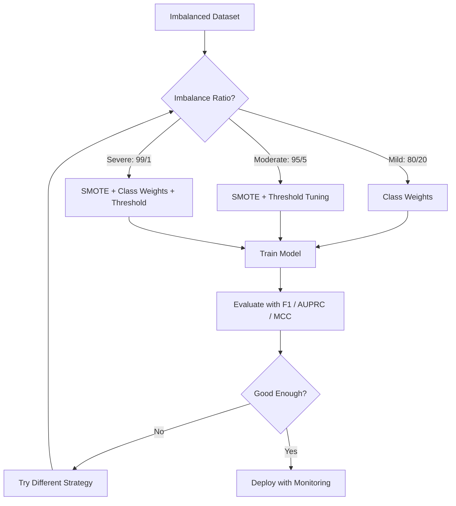
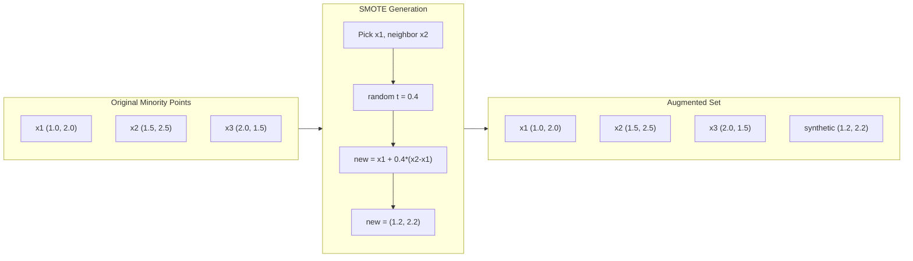
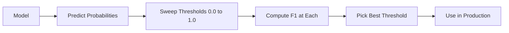
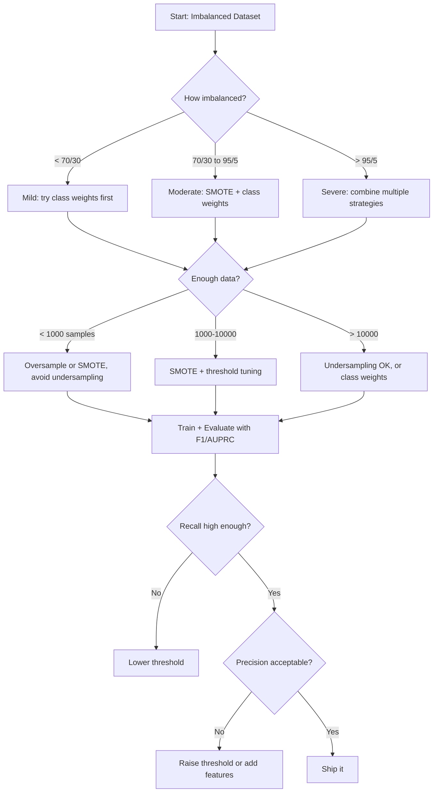

# Tratamento de dados desequilibrados
# 处理不平衡数据


> Quando 99% dos seus dados são "normais", a precisão é uma mentira.

> Quando 99% dos dados são "normais", a precisão é uma mentira.

**Type:** Build | **类型：** 构建
**Language:**O Python .**语言：**Python
**Prerequisites:** Phase 2, Lessons 01-09 (especially evaluation metrics) | **前置知识：** Phase 2 第 1-9 课（尤其是评估指标）
**Time:** ~90 minutes | **时间：** 约 90 分钟

## Objetivos de aprendizagem

- Implementar SMOTE a partir do zero e explicar como a sobre-amplificação sintética difere da duplicação aleatória
  A partir do zero, a SMOTE é implementada, explicando a diferença entre a sintética de amostra e a cópia de dados
- Avaliação de classificadores desequilibrados usando o coeficiente de correlação F1, AUPRC e Matthews em vez de precisão
  Utilize F1、AUPRC 和马修斯相关系数 (MCC) 评估不平衡分类器,而非准确率
- Comparar as estratégias de ponderação de classes, ajuste de limiar e re-amostração e selecionar a abordagem correta para uma determinada relação de desequilíbrio
  Comparar classes de peso, valor e estratégia de pesquisa, para uma proporção determinada desequilibrada escolher o método correto
- Construir um pipeline de dados completamente desequilibrado que combina SMOTE, pesos de classe e otimização de limiar
  Construir combinação SMOTE 类权重和值优化完整不平衡数据管线


> **【中文解读】**
> Não-equilíbrio entre dados é uma estratégia comum.

> **【拓展：不平衡数据在真实系统中的挑战】**
> PayPal processa cerca de 400 milhões de transações diárias, taxa de fraude apenas 0,3%, mas diariamente ainda significa cerca de 120 milhões de transações de fraude. Avaliação com taxa de precisão não faz sentido. 99,7% da taxa de precisão pode ser totalmente supostamente "não fraudulenta".

## O problema é o problema da introdução

Construímos um modelo de detecção de fraude, obtemos uma precisão de 99,9%, celebramos e percebemos que prevê "não fraude" para cada transação.

> Você construiu um modelo de teste de fraude. Obteve uma taxa de precisão de 99,9%.

Este não é um erro. É a coisa racional a fazer quando apenas 0,1% das transações são fraudulentas. O modelo aprende que sempre adivinhar a classe majoritária minimiza o erro geral. É tecnicamente correto e completamente inútil.

> Não é um erro. Quando apenas 0,1% das transações são fraudulentas, é um comportamento razoável.

Isto acontece em todos os lugares que são importantes para a classificação real. Diagnóstico de doença: 1% taxa positiva. Intrusão de rede: 0,01% ataques. Defeitos de fabricação: 0,5% defeituosos. Filtragem de spam: 20% spam. Previsão de churn: 5% churners. Quanto mais consequente a classe minoritária, mais rara tendem a ser.

> Isto ocorre em lugares onde realmente há necessidade de categorias. Diagnóstico de doenças: 1%  %  %  %  %  %  %  %  %  %  %  %  %  %  %  %  %  %  %  %  %  %  %  %  %  %  %  %  %  %  %  %  %  %  %  %  %  %  %  %  %  %  %  %  %  %  %  %  %  %  %  %  %  %  %  %  %  %  %  %  %  %  %  %  %  %  %  %  %  %  %  %  %  %  %  %  %  %  %  %  %  %  %  %  %  %  %  %  %  %  %  %  %  %  %  %  %  %  %  %  %  %  %  %  %  %  %  %  %  %  %  %  %  %  %  %  %  %  %  %  %  %  %  %  %  %  %  %  %  %  %  %  %  %  %  %  %  %  %  %  %  %  %  %  %  %  %  %  %  %  %  %  %  %  %  %  %  %  %  %  %  %  % 

A precisão falha porque trata todas as previsões corretas de forma igual. A rotulagem correta de uma transação legítima e a captura correta de fraude contam como um ponto de precisão. Mas a captura de fraude é toda a razão pela qual o modelo existe. Precisamos de métricas, técnicas e estratégias de treinamento que forcem o modelo a prestar atenção à classe rara, mas importante.

>  Precisação taxa falha porque é igual a todos os pronósticos corretação                                                                                                                                                                                                                                                     

> **【中文解读】**
> O problema central de dados não equilibrados: a taxa de precisão é "mentiras"―99,9%                                                                                                                                                                                                                                                   

## O conceito central.

### Por que a precisão falha

Considere um conjunto de dados com 1000 amostras: 990 negativas, 10 positivas. Um modelo que sempre prevê negativos:

> 考虑一个1000个样本的数据集:990个负样本,10个正样本──一个始终预测负类型的模型:

|  | Predicted Positive | Predicted Negative |
|--|---|---|
| Actually Positive | 0 (TP) | 10 (FN) |
| Actually Negative | 0 (FP) | 990 (TN) |

Precuração = (0 + 990) / 1000 = 99,0%

O modelo detecta zero fraudes, zero doenças, zero defeitos, mas a precisão diz 99%.

> O modelo capturou zero fraudes, zero doenças, zero falhas, mas a taxa de precisão mostra 99% e é por isso que a taxa de precisão é perigosa em questões de desequilíbrio.

### Melhores métricas

**Precision**= TP / (TP + FP). De tudo marcado como positivo, quantos são realmente?

> **精确率**= TP / (TP + FP) ⋅ Em todos os amostras marcados para positividade, há quantas verdadeiras positividade?

**Recall**= TP / (TP + FN). De tudo o que realmente é positivo, quantos capturamos?

> **召回率**= TP / (TP + FN) ⋅ Em todas as amostras reais, quanto capturamos?

**F1 Score**= 2 * precisão * recall / (precisão + recall). A média harmônica. Penaliza um desequilíbrio extremo entre precisão e recall mais do que a média aritmética.

> **F1 分数**= 2 * 精确率 * 召回率 / (精确率 + 召回率) 调和平均值──比算术平均值更严厉地惩罚精确率和召回率之间的极端不平衡──

**F-beta Score**= (1 + beta^2) * precisão * recall / (beta^2 * precisão + recall). Quando beta > 1, a recall é mais importante. Quando beta < 1, a precisão é mais importante. F2 é comum na detecção de fraude (a falta de fraude é pior do que um falso alarme).

> **F-beta 分数**= (1 + beta^2) * 精确率 * 召回率 / (beta^2 * 精确率 + 召回率) ・・・ quando beta > 1 时,召回率 é mais importante。 quando beta < 1 时,精确率 é mais importante。 F2 在欺诈检测中常用(漏检查欺诈比误报更糟) ・・・

**AUPRC**(Área sob a curva de recall de precisão). Como AUC-ROC, mas mais informativo para dados desequilibrados. Um classificador aleatório tem AUPRC igual à taxa de classe positiva (não 0,5 como ROC). Isso torna as melhorias mais fáceis de ver.

> **AUPRC**(precisação de taxa-recuperação curva abaixo da superfície) ⋅ semelhante a AUC-ROC, mas em relação a dados desequilibrados há mais informação ⋅ AUPRC de cada classe de aparelhos é igual a proporção de classe correta ⋅ não como ROC de 0,5) ⋅ que torna a melhoria mais fácil de ver ⋅

**Matthews Correlation Coefficient**= (TP * TN - FP * FN) / sqrt((TP+FP)(TP+FN)(TN+FP)(TN+FN)). Intervalo de -1 a +1. Dá uma pontuação alta apenas quando o modelo faz bem em ambas as classes. Equilibrado mesmo quando as classes são de tamanhos muito diferentes.

> **马修斯相关系数 (MCC)**= (TP * TN - FP * FN) / sqrt((TP+FP)(TP+FN)(TN+FP)(TN+FN))。 O alcance de -1 a +1── apenas em duas categorias todos se mostraram bem quando se deu alta nota── mesmo que as grandes diferenças sejam muito grandes e mantenham o equilíbrio──

Para o modelo "sempre prever negativo" acima: precisão = 0/0 (indefinido, muitas vezes definido em 0), recall = 0/10 = 0, F1 = 0, MCC = 0.

> 对于上述的"始终预测负类"模型:精确率 = 0/0(未定义,通常设为0),召回率 = 0/10 = 0,F1 = 0,MCC = 0──

### O Pipeline de Dados Desbalançados



### SMOTE: Técnica de extração de amostras de minorias sintéticas

A sobre-análise aleatória duplica as amostras minoritárias existentes.

> 随机过采样复制现有少数类型样本―― é válido, mas há risco de ser adaptado, pois o modelo verá repetidamente os mesmos pontos――

O SMOTE cria novas amostras sintéticas de minorias que são plausíveis mas não cópias.

> SMOTE  criar novas sintetizadas pequenas espécies de amostras, elas são razoáveis, mas não secundárias.

1. Para cada amostra de minoria x, encontre os seus vizinhos mais próximos entre outras amostras de minoria
    Para cada minoria de amostras x, entre outras minorias encontrem seus quantos vizinhos mais próximos
2. Escolha um vizinho aleatoriamente
   随机选择一个邻居
3. Crie uma nova amostra no segmento de linha entre x e esse vizinho
   Crie um novo padrão na linha entre x e o vizinho

A fórmula: `new_sample = x + random(0, 1) * (neighbor - x)`

> 公式:`new_sample = x + random(0, 1) * (neighbor - x)`

Isto interpola entre pontos de minoria reais, criando amostras na mesma região do espaço de recursos sem apenas copiar dados existentes.

> Isso é inserir valores entre um pequeno número de classes de pontos, criando amostras na mesma área do espaço característico, não apenas copiando dados existentes.



### Estratégias de amostragem comparadas

**Random Oversampling**: duplicar as amostras de minorias para corresponder à maioria.
- Pros: simples, sem perda de informação
  优点:简单,无信息损失
- Cons: duplicados exatos causam sobreajuste, aumenta o tempo de formação
  缺点: totalmente igual vice-dosso conduzir a sobre-adaptado, aumentar o tempo de treinamento

**Random Undersampling**: remover amostras de maioria para corresponder à quantidade de minorias.
- Pros: treinamento rápido, simples
  优点: training快,简单
- Cons: descarta dados de maioria potencialmente úteis, maior variância
  缺点: Desistir da maioria dos tipos de dados úteis, com maior diferença

**SMOTE**A criação de amostras sintéticas de minorias através da interpolação.
- Pros: gera novos pontos de dados, reduz o excesso de adaptação em comparação com o excesso de amostragem aleatória
  优点: gerar novos dados, em comparação com a tomada de dados reduzida
- Cons: pode criar amostras ruidosas perto do limite de decisão, não conta com a distribuição de classes majoritárias
  缺点:可能在决策边界附近创建噪声样本,不考虑多数类分布

| Strategy | Data Changed | Risk | When to Use |
|----------|-------------|------|-------------|
| Oversample | Minority duplicated | Overfitting | Small datasets, moderate imbalance |
| Undersample | Majority removed | Information loss | Large datasets, want fast training |
| SMOTE | Synthetic minority added | Boundary noise | Moderate imbalance, enough minority samples for k-NN |

### Peso de classe

Em vez de alterar os dados, alterar a forma como o modelo trata os erros.

> Não alterar dados, mas alterar a forma como o modelo trata os erros.

Para um problema binário com 950 amostras negativas e 50 amostras positivas:
- Peso para classe negativa = n_samplas / (2 * n_negativo) = 1000 / (2 * 950) = 0,526
  负类权重 = n_samples / (2 * n_negativo) = 1000 / (2 * 950) = 0,526
- Peso para classe positiva = n_samplas / (2 * n_positivo) = 1000 / (2 * 50) = 10,0
  正类权重 = n_samples / (2 * n_positivo) = 1000 / (2 * 50) = 10,0

A classe positiva tem 19 vezes o peso. classificar mal uma amostra positiva custa tanto quanto classificar mal 19 amostras negativas. O modelo é forçado a prestar atenção à classe minoritária.

> O modelo obteve 19 vezes o peso. O preço de uma classe correta é igual ao preço de uma classe correta.

Na regressão logística, isso modifica a função de perda:

```
weighted_loss = -sum(w_i * [y_i * log(p_i) + (1-y_i) * log(1-p_i)])
```

onde w_i depende da classe da amostra i.

Os pesos de classe são matematicamente equivalentes ao excesso de amostragem na expectativa, mas sem criar novos pontos de dados.

> O peso da classe é esperado com o preço matemático exato, mas não cria novos pontos de dados. Isso os torna mais rápidos e evita o risco de duplicação de amostras.

### Apontação do limiar

A maioria dos classificadores produz uma probabilidade. O limiar padrão é 0,5: se P ((positivo) >= 0,5, prevê positivo. Mas 0,5 é arbitrário. Quando as classes são desequilibradas, o limiar ideal geralmente é muito menor.

> Mas, quando a classe está desequilibrada, o valor máximo é geralmente muito baixo.

O processo:
1. Treinar um modelo
   Treinar um modelo
2. Obter probabilidades previstas no conjunto de validação
   Prevenção de probabilidade de obtenção em testes
3. Limitações de varredura de 0,0 a 1,0
   De 0,0 a 1,0 valor de análise
4. Calcule F1 (ou a métrica escolhida) em cada limiar
   Em cada valor calculado abaixo F1 ((( ou você escolheu o indicador)
5. Escolha o limite que maximize a sua métrica
   选择最大化你的指标的值



Um modelo pode emitir P ((fraude) = 0,15 para uma transação fraudulenta. No limiar 0,5, isso é classificado como não fraude. No limiar 0,10, é corretamente capturado. A calibração de probabilidade importa menos do que a classificação - desde que a fraude obtenha probabilidades maiores do que não-fraude, existe um limiar que as separa.

> O modelo pode ser usado para um negócio de fraude P (fraude) = 0,15♦ em valores de 0,5 abaixo, que são classificados como não-fraudes♦ em valores de 0,10 abaixo, que são corretamente capturados♦ em probabilidade de classificação

### Aprendizagem sensível aos custos

Generalização dos pesos de classe. Em vez de custos uniformes, atribuir custos específicos de classificação errada:

> 类权重的推广── não usar o preço único, mas distribuir os preços de uma determinada classe:

| | Predict Positive | Predict Negative |
|--|---|---|
| Actually Positive | 0 (correct) | C_FN = 100 |
| Actually Negative | C_FP = 1 | 0 (correct) |

O modelo otimiza o custo total, não o número total de erros.

> O preço de um negócio fraudulento é de 100 vezes o preço de um negócio fraudulento.

Esta é a abordagem mais básica quando se pode estimar os custos no mundo real. Um diagnóstico de câncer perdido tem um custo muito diferente de um falso alarme que leva a uma biópsia extra.

> É a maneira mais básica de estimar o custo do mundo real. O custo de um câncer não diagnosticado é muito diferente do que o erro de relatar o exame extra-vivo.

### Diagrama de fluxo de decisão



## Construí-lo e realizei-o.

> **【中文解读】**
> Desde zero realizando SMOTE ([[Sintect Minority Class Over采样技术]]): para cada minoria de amostras, encontrar seu próximo vizinho, em linha, inserir o seu valor de forma aleatória para gerar novas amostras de síntese. Em comparação com simplesmente copiar minoria de amostras, SMOTE produzindo amostras mais diversificadas, não são fáceis de adaptar.

> **【拓展：工业级不平衡数据处理的高级技术】**
> No real financeiro, a estratégia de tratamento de dados desequilibrados é mais complexa do que a SMOTE: usar Loss foco, fazer o modelo se concentrar mais em disseminação de amostras)  dois estágios de treinamento  Primeiro usar o treinamento de amostragem, reutilizar os dados originais)  Aprender a perceber os preços dos fraudes (que será 100 vezes mais caro que o normal)  Usar o sistema de detecção de valores de fraudes da Square  Square Inc.  Usar vários modelos de fusão +  Movimentos  para tratar a minoria de casos de fraude no nível de milhões de transações diárias 
```figure
class-imbalance
```

## Construí-lo

### Passo 1: Gerar um conjunto de dados desequilibrado

```python
import numpy as np


def make_imbalanced_data(n_majority=950, n_minority=50, seed=42):
    rng = np.random.RandomState(seed)

    X_maj = rng.randn(n_majority, 2) * 1.0 + np.array([0.0, 0.0])
    X_min = rng.randn(n_minority, 2) * 0.8 + np.array([2.5, 2.5])

    X = np.vstack([X_maj, X_min])
    y = np.concatenate([np.zeros(n_majority), np.ones(n_minority)])

    shuffle_idx = rng.permutation(len(y))
    return X[shuffle_idx], y[shuffle_idx]
```

### Passo 2: SMOTE a partir do zero

```python
def euclidean_distance(a, b):
    return np.sqrt(np.sum((a - b) ** 2))


def find_k_neighbors(X, idx, k):
    distances = []
    for i in range(len(X)):
        if i == idx:
            continue
        d = euclidean_distance(X[idx], X[i])
        distances.append((i, d))
    distances.sort(key=lambda x: x[1])
    return [d[0] for d in distances[:k]]


def smote(X_minority, k=5, n_synthetic=100, seed=42):
    rng = np.random.RandomState(seed)
    n_samples = len(X_minority)
    k = min(k, n_samples - 1)
    synthetic = []

    for _ in range(n_synthetic):
        idx = rng.randint(0, n_samples)
        neighbors = find_k_neighbors(X_minority, idx, k)
        neighbor_idx = neighbors[rng.randint(0, len(neighbors))]
        t = rng.random()
        new_point = X_minority[idx] + t * (X_minority[neighbor_idx] - X_minority[idx])
        synthetic.append(new_point)

    return np.array(synthetic)
```

### Passo 3: Superamento e sub-análise aleatórias

```python
def random_oversample(X, y, seed=42):
    rng = np.random.RandomState(seed)
    classes, counts = np.unique(y, return_counts=True)
    max_count = counts.max()

    X_resampled = list(X)
    y_resampled = list(y)

    for cls, count in zip(classes, counts):
        if count < max_count:
            cls_indices = np.where(y == cls)[0]
            n_needed = max_count - count
            chosen = rng.choice(cls_indices, size=n_needed, replace=True)
            X_resampled.extend(X[chosen])
            y_resampled.extend(y[chosen])

    X_out = np.array(X_resampled)
    y_out = np.array(y_resampled)
    shuffle = rng.permutation(len(y_out))
    return X_out[shuffle], y_out[shuffle]


def random_undersample(X, y, seed=42):
    rng = np.random.RandomState(seed)
    classes, counts = np.unique(y, return_counts=True)
    min_count = counts.min()

    X_resampled = []
    y_resampled = []

    for cls in classes:
        cls_indices = np.where(y == cls)[0]
        chosen = rng.choice(cls_indices, size=min_count, replace=False)
        X_resampled.extend(X[chosen])
        y_resampled.extend(y[chosen])

    X_out = np.array(X_resampled)
    y_out = np.array(y_resampled)
    shuffle = rng.permutation(len(y_out))
    return X_out[shuffle], y_out[shuffle]
```

### Passo 4: Regressão logística com pesos de classe

```python
def sigmoid(z):
    return 1.0 / (1.0 + np.exp(-np.clip(z, -500, 500)))


def logistic_regression_weighted(X, y, weights, lr=0.01, epochs=200):
    n_samples, n_features = X.shape
    w = np.zeros(n_features)
    b = 0.0

    for _ in range(epochs):
        z = X @ w + b
        pred = sigmoid(z)
        error = pred - y
        weighted_error = error * weights

        gradient_w = (X.T @ weighted_error) / n_samples
        gradient_b = np.mean(weighted_error)

        w -= lr * gradient_w
        b -= lr * gradient_b

    return w, b


def compute_class_weights(y):
    classes, counts = np.unique(y, return_counts=True)
    n_samples = len(y)
    n_classes = len(classes)
    weight_map = {}
    for cls, count in zip(classes, counts):
        weight_map[cls] = n_samples / (n_classes * count)
    return np.array([weight_map[yi] for yi in y])
```

### Passo 5: Ajuste de limiar

```python
def find_optimal_threshold(y_true, y_probs, metric="f1"):
    best_threshold = 0.5
    best_score = -1.0

    for threshold in np.arange(0.05, 0.96, 0.01):
        y_pred = (y_probs >= threshold).astype(int)
        tp = np.sum((y_pred == 1) & (y_true == 1))
        fp = np.sum((y_pred == 1) & (y_true == 0))
        fn = np.sum((y_pred == 0) & (y_true == 1))

        if metric == "f1":
            precision = tp / (tp + fp) if (tp + fp) > 0 else 0.0
            recall = tp / (tp + fn) if (tp + fn) > 0 else 0.0
            score = 2 * precision * recall / (precision + recall) if (precision + recall) > 0 else 0.0
        elif metric == "recall":
            score = tp / (tp + fn) if (tp + fn) > 0 else 0.0
        elif metric == "precision":
            score = tp / (tp + fp) if (tp + fp) > 0 else 0.0

        if score > best_score:
            best_score = score
            best_threshold = threshold

    return best_threshold, best_score
```

### Passo 6: Funções de avaliação

```python
def confusion_matrix_values(y_true, y_pred):
    tp = np.sum((y_pred == 1) & (y_true == 1))
    tn = np.sum((y_pred == 0) & (y_true == 0))
    fp = np.sum((y_pred == 1) & (y_true == 0))
    fn = np.sum((y_pred == 0) & (y_true == 1))
    return tp, tn, fp, fn


def compute_metrics(y_true, y_pred):
    tp, tn, fp, fn = confusion_matrix_values(y_true, y_pred)
    accuracy = (tp + tn) / (tp + tn + fp + fn)
    precision = tp / (tp + fp) if (tp + fp) > 0 else 0.0
    recall = tp / (tp + fn) if (tp + fn) > 0 else 0.0
    f1 = 2 * precision * recall / (precision + recall) if (precision + recall) > 0 else 0.0

    denom = np.sqrt(float((tp + fp) * (tp + fn) * (tn + fp) * (tn + fn)))
    mcc = (tp * tn - fp * fn) / denom if denom > 0 else 0.0

    return {
        "accuracy": accuracy,
        "precision": precision,
        "recall": recall,
        "f1": f1,
        "mcc": mcc,
    }
```

### Passo 7: Comparar todas as abordagens

```python
X, y = make_imbalanced_data(950, 50, seed=42)
split = int(0.8 * len(y))
X_train, X_test = X[:split], X[split:]
y_train, y_test = y[:split], y[split:]

# Baseline: no treatment
w_base, b_base = logistic_regression_weighted(
    X_train, y_train, np.ones(len(y_train)), lr=0.1, epochs=300
)
probs_base = sigmoid(X_test @ w_base + b_base)
preds_base = (probs_base >= 0.5).astype(int)

# Oversampled
X_over, y_over = random_oversample(X_train, y_train)
w_over, b_over = logistic_regression_weighted(
    X_over, y_over, np.ones(len(y_over)), lr=0.1, epochs=300
)
preds_over = (sigmoid(X_test @ w_over + b_over) >= 0.5).astype(int)

# SMOTE
minority_mask = y_train == 1
X_minority = X_train[minority_mask]
synthetic = smote(X_minority, k=5, n_synthetic=len(y_train) - 2 * int(minority_mask.sum()))
X_smote = np.vstack([X_train, synthetic])
y_smote = np.concatenate([y_train, np.ones(len(synthetic))])
w_sm, b_sm = logistic_regression_weighted(
    X_smote, y_smote, np.ones(len(y_smote)), lr=0.1, epochs=300
)
preds_smote = (sigmoid(X_test @ w_sm + b_sm) >= 0.5).astype(int)

# Class weights
sample_weights = compute_class_weights(y_train)
w_cw, b_cw = logistic_regression_weighted(
    X_train, y_train, sample_weights, lr=0.1, epochs=300
)
probs_cw = sigmoid(X_test @ w_cw + b_cw)
preds_cw = (probs_cw >= 0.5).astype(int)

# Threshold tuning (tune on held-out validation set, not test set)
probs_val = sigmoid(X_val @ w_cw + b_cw)
best_thresh, best_f1 = find_optimal_threshold(y_val, probs_val, metric="f1")
preds_thresh = (probs_cw >= best_thresh).astype(int)
```

O arquivo de código executa tudo isto num único script e imprime os resultados.

> O código-fonte funciona em um único script.

## Use-o com o framework implementado.

Com a aprendizagem escitada e a aprendizagem desequilibrada, estas técnicas são de linha única:

> Usando pouco-aprendizagem e desequilíbrio-aprendizagem, estas técnicas só precisam de uma linha de código:

```python
from sklearn.linear_model import LogisticRegression
from sklearn.metrics import classification_report, f1_score
from sklearn.model_selection import train_test_split
from imblearn.over_sampling import SMOTE
from imblearn.under_sampling import RandomUnderSampler
from imblearn.pipeline import Pipeline

X_train, X_test, y_train, y_test = train_test_split(X, y, stratify=y)

model_weighted = LogisticRegression(class_weight="balanced")
model_weighted.fit(X_train, y_train)
print(classification_report(y_test, model_weighted.predict(X_test)))

smote = SMOTE(random_state=42)
X_resampled, y_resampled = smote.fit_resample(X_train, y_train)
model_smote = LogisticRegression()
model_smote.fit(X_resampled, y_resampled)
print(classification_report(y_test, model_smote.predict(X_test)))

pipeline = Pipeline([
    ("smote", SMOTE()),
    ("model", LogisticRegression(class_weight="balanced")),
])
pipeline.fit(X_train, y_train)
print(classification_report(y_test, pipeline.predict(X_test)))
```

As implementações do zero mostram exatamente o que cada técnica faz. SMOTE é apenas interpolação k-NN na classe minoritária. Pesos de classe multiplicam a perda.

> Desde o zero realizado, a precisão demonstrou o papel de cada tipo de tecnologia.

## Envia-o . Produto .

Esta lição produz:
- `outputs/skill-imbalanced-data.md`-- uma lista de controlo das decisões para lidar com os problemas de classificação desequilibrados

## Exercícios.

1. **Borderline-SMOTE**A aplicação de SMOTE é modificada para gerar apenas amostras sintéticas para pontos minoritários próximos ao limite de decisão (aqueles cujos vizinhos k mais próximos incluem amostras de classes majoritárias).
   1. O que é que é o problema? O que é que é o problema?

2. **Cost matrix optimization**A função que assume uma matriz de custos e retorna previsões ótimas que minimizam o custo esperado. Teste com diferentes proporções de custos (1:10, 1:100, 1:1000) e trace como a diferença de precisão-recall muda.
   2. Em comparação com a mesma data collection, a SMOTE e a SMOTE foram comparadas.

3. **Threshold calibration**A calibração não altera a classificação (AUC permanece a mesma) mas torna as probabilidades mais significativas.
   3.  Valor  Adjustação: Probabilidade de saída de regresso lógico, scan  Valor de 0.01 a 0.99, encontrar  Valor F1 mais alto                                                                                                                                                                                                                                          

4. **Ensemble with balanced bagging**A partir da data de lançamento, a equipe de treinamento deve avaliar a quantidade de dados que podem ser utilizados para a execução de um modelo de bootstrap.
   4. 构建完整管线:SMOTE -> 标准化 -> 逻辑归归(class_weight='balanced')-> 值优化──比较管线中移除任一步步的性能下降──

5. **Imbalance ratio experiment**A SMOTE é uma das principais ferramentas de desenvolvimento de dados para a análise de dados.

> **【中文解读】**
> Não equilibrado conjunto de estratégias completas de tratamento de dados: 1) 评估指标使用F1/AUPRC/MCC 替代准确率; 2) 重采样SMOTE 过采样少数类或随机欠采样多数类; 3) 代价敏感在损失函数中给少数类加权;

> **【拓展：Focal Loss——深度学习中的不平衡数据解决方案】**
> Loss Focal(Lin et al., 2017) inicialmente foi proposto para resolver o objetivo de pesquisa em geralmente negativo e extremamente desequilibrado.

## Termos-chave .

| Term | What people say | What it actually means |
|------|----------------|----------------------|
| Class imbalance | "One class has way more samples" | The distribution of classes in the dataset is significantly skewed, causing models to favor the majority class |
| SMOTE | "Synthetic oversampling" | Creates new minority samples by interpolating between existing minority samples and their k-nearest minority neighbors |
| Class weights | "Making errors on rare classes more expensive" | Multiplying the loss function by class-specific weights so the model penalizes minority misclassification more heavily |
| Threshold tuning | "Moving the decision boundary" | Changing the probability cutoff for classification from the default 0.5 to a value that optimizes the desired metric |
| Precision-recall tradeoff | "You cannot have both" | Lowering the threshold catches more positives (higher recall) but also flags more false positives (lower precision), and vice versa |
| AUPRC | "Area under the PR curve" | Summarizes the precision-recall curve into a single number; more informative than AUC-ROC when classes are heavily imbalanced |
| Matthews Correlation Coefficient | "The balanced metric" | A correlation between predicted and actual labels that produces a high score only when the model performs well on both classes |
| Cost-sensitive learning | "Different mistakes cost different amounts" | Incorporating real-world misclassification costs into the training objective so the model optimizes for total cost, not error count |
| Random oversampling | "Duplicate the minority" | Repeating minority class samples to balance class counts; simple but risks overfitting to duplicated points |

## Mais leitura 延伸阅读

- [SMOTE: Synthetic Minority Over-sampling Technique (Chawla et al., 2002)](https://arxiv.org/abs/1106.1813)-- o artigo original do SMOTE, ainda o trabalho mais citado sobre aprendizagem desequilibrada
  [Chawla et al.: SMOTE (2002)](https://arxiv.org/abs/1106.1813)- SMOTE 原始论文
- [Learning from Imbalanced Data (He & Garcia, 2009)](https://ieeexplore.ieee.org/document/5128907)-- uma pesquisa abrangente que abrange abordagens de amostragem, de custos e de algoritmos sensíveis
  [He & Garcia: Learning from Imbalanced Data (2009)](https://link.springer.com/article/10.1007/s10115-008-0164-4)- Não equilibrado aprendizagem
- [imbalanced-learn documentation](https://imbalanced-learn.org/stable/)-- Biblioteca Python com variantes SMOTE, estratégias de sub-esampulagem e integração de pipeline
  [imbalanced-learn 文档](https://imbalanced-learn.org/)- Python não equilibrado
- [The Precision-Recall Plot Is More Informative than the ROC Plot (Saito & Rehmsmeier, 2015)](https://journals.plos.org/plosone/article?id=10.1371/journal.pone.0118432)-- quando e por que preferir curvas de PR a curvas de ROC para problemas desequilibrados
