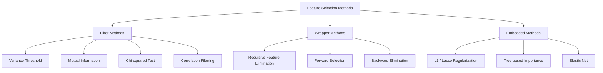
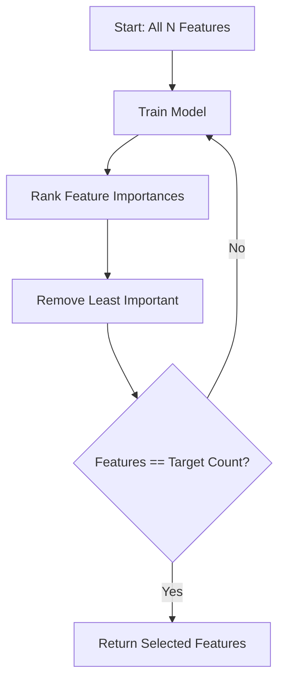
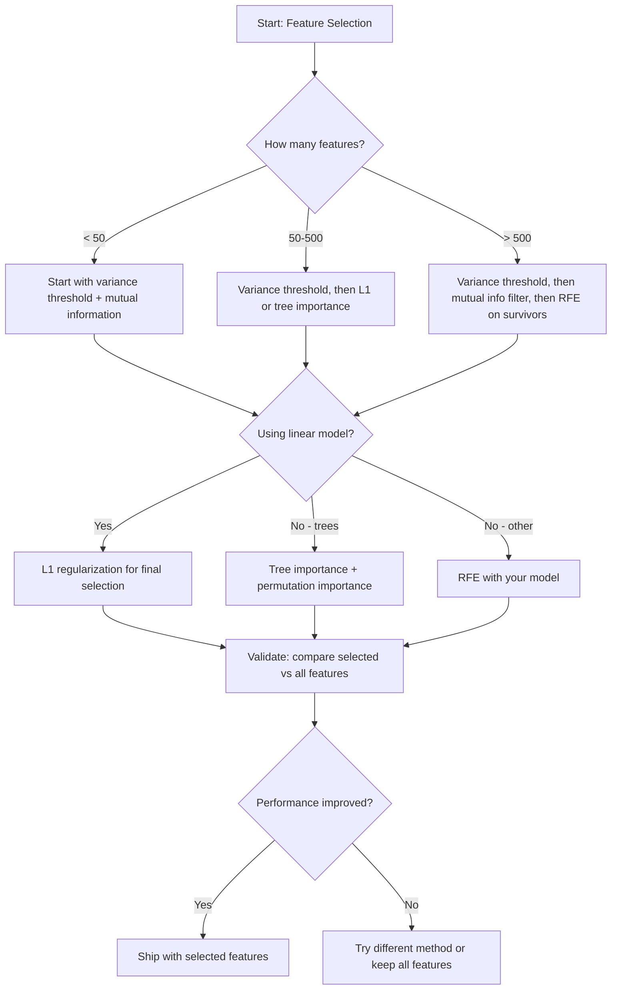

# Seleção de características
# Características de seleção


> Mais recursos não é melhor, os recursos certos são melhores.

> As características não são mais melhores.

**Type:** Build | **类型：** 构建
**Language:**O Python .**语言：**Python
**Prerequisites:** Phase 2, Lessons 01-09, 08 (feature engineering) | **前置知识：** Phase 2 第 1-9 课、第 8 课（特征工程）
**Time:** ~75 minutes | **时间：** 约 75 分钟

## Objetivos de aprendizagem

- Implementar métodos de filtragem (prazo de variação, informação mútua, quadrado de chi) e métodos de embalagem (RFE, seleção para a frente) a partir do zero
  Desde zero realizando o método de "farce" (RFE) e "preferência" (RFE).
- Explique por que a informação mútua capta relações não lineares de características-alvo que a correlação não apresenta
  Explicar por que a informação mútua pode capturar a correlação entre as características não-lineares e as relações-alvo
- Compare a regularização L1 (seleção incorporada) com a RFE (seleção de embalagens) e avaliar as suas compensações computacionais
  Comparar L1 正则化 (嵌入选择) com RFE (包装选择), avaliar o seu cálculo de peso
- Construir um pipeline de seleção de recursos que combina vários métodos e demonstre uma melhor generalização em dados mantidos
  Construir combinações de vários métodos de características selecionadas, demonstrando a generalização das melhorias nos dados deixados


> **【中文解读】**
> Tráfico Seleção entre muitos traços selecionar o subconjunto mais útil. Tráfico Seleção entre muitos traços Seleção entre muitos traços Seleção entre os mais úteis subconjunto. Tráfico Seleção entre muitos traços Seleção entre muitos traços Seleção entre os mais úteis subconjunto.

> **【拓展：特征选择在工业界的重要性】**
> No modelo financeiro de controle de fone, o modelo de regulação requer explicá-lo. Ele deve ser capaz de explicar por que cada característica é usada. L1 regulamentação (Lasso) automaticamente reduzirá o peso de peso de uma característica não importante para zero, ao mesmo tempo em que realiza a seleção de características e o treinamento de modelos. Na análise de expressão genética, 50 genes-chave foram selecionados de entre 20.000 genes, não apenas para melhorar o desempenho do modelo, mas também para o estudo do mecanismo de doença.

## O problema é o problema da introdução

Tens 500 características, o teu modelo treina lentamente, supera o tempo, e ninguém consegue explicar o que aprendeu, adiciona mais características na esperança de melhorar o desempenho, e piora.

> Você tem 500 características. O modelo está a ser treinado lentamente, não há quem possa explicar o que ele aprendeu. Você adiciona mais características e deseja melhorar o desempenho.

Esta é a maldição da dimensionalidade em ação. À medida que o número de características aumenta, o volume do espaço de características explode. Os pontos de dados se tornam escassos. As distâncias entre os pontos convergem. O modelo precisa de mais dados exponencialmente para encontrar padrões reais. As características de ruído afogam as características do sinal. O overfitting torna-se o padrão.

> É o funcionamento real da dimensão do maldição. Com o aumento da quantidade de características, a explosão de massa do espaço de características.

A seleção de características é o antídoto. Elimine o ruído. Elimine a redundância. Mantenha as características que transportam informações reais sobre o alvo. O resultado: treinamento mais rápido, melhor generalização e modelos que você pode realmente explicar.

> Tráfico selecionamento é solução. Eliminação do ruído. Eliminação do redundante. Preservação das características que realmente trazem a informação meta. Resultado: treinamento mais rápido. Melhor generalização.

O objetivo não é usar toda a informação disponível, mas usar a informação certa.

> O objetivo não é usar todas as informações disponíveis.

> **【中文解读】**
> Características Seleção de três grandes tipos de métodos tem vantagens: over法 (fazer mais rápido mas ignorando as interacções entre as características); packaging method (recurrir as características eliminando as RFE; selecionar as anteriores); considerando a combinação de características mas o custo de cálculo é alto; emplacamento method (L1) (regularizar as características de um modelo de árvore) é o melhor equilíbrio entre eficiência e efeito no processo de treinamento.

## O conceito central.

### Três categorias de seleção de características

Cada método de selecção de características se enquadra numa das três categorias:

> Cada método de seleção de características pertence a uma das três categorias seguintes:



**Filter methods**A maioria dos modelos de computador de computador de computador de computador de computador de computador de computador de computador de computador de computador de computador de computador de computador de computador de computador de computador de computador de computador de computador de computador de computador de computador de computador de computador de computador de computador de computador de computador de computador de computador de computador de computador de computador de computador de computador de computador de computador de computador de computador de computador de computador de computador de computador de computador de computador de computador de computador de computador de computador de computador de computador de computador de computador de computador de computador de computador de computador de computador de computador de computador de computador de computador de computador de computador de computador de computador de computador de computador de computador de computador de computador de computador de computador de computador de computador de computador de computador de computador de computador de computador de computador de computador de computador de computador de computador de computador de computador de computador de computador de computador de computador de computador de computador de computador de computador de computador de computador de computador de computador de computador de computador de computador de computador de computador de computador de computador de computador de computador de computador de computador de computador de computador de computador de computador de computador de computador de computador de computador de computador de computador de computador de computador de computador de computador de computador de computador de computador de computador de computador de computador de computador de computador de computador de computador de computador de computador de computador de computador de computador de computador de computador de computador de computador de computador de computador de computador de computador de computador de computador de computador de computador de computador de computador de computador de computador de computador de computador de computador de computador de computador de computador de computador de computador de computador de computador de computador de computador de computador de comput

> **过滤法**Utilize statistics measurement independently de cada característica rating. Não utiliza modelos.

**Wrapper methods**O que é mais importante é que o modelo seja treinado para avaliar os subconjuntos de características.

> **包装法**                                                                                                                                                                                                                                                              

**Embedded methods**Selecionar características como parte do treinamento do modelo. A regularização L1 leva pesos a zero. Árvores de decisão divididas em características mais úteis. A seleção ocorre durante a montagem, não como uma etapa separada.

> **嵌入法**No processo de treinamento de modelos, a seleção de características. L1 A regularização de peso será impulsionada para zero. A árvore de decisão se divide nas características mais úteis. A seleção ocorre no processo de preparação, e não como um passo individual.

### Limite de variação

Se uma característica apenas varia entre amostras, não contém quase nenhuma informação.

> O mais simples é filtrar. Se um traço no modelo não muda, ele quase não transporta informação.

Considere uma característica que é 0,0 para 999 de 1000 amostras. Sua variância é próxima de zero. Nenhum modelo pode usá-lo para distinguir entre classes. Remova-lo.

> ⋅ Considere um 999 de 1000 amostras com um valor de 0,0 característicos. ⋅ Sua diferença de quadrado é quase zero. ⋅ Nenhum modelo pode usá-lo para distinguir a classe. ⋅ Removê-lo.

```
variance(x) = mean((x - mean(x))^2)
```

Defina um limiar (por exemplo, 0,01). Deixe cada característica com variação abaixo dela. Isso remove características constantes ou quase constantes sem olhar para a variável-alvo.

> 设置一个值(如 0.01);; remove方差于该值的每个特征;;; This completely does not need to see the target variable on being able to remove a constant quantity or the approximate constant quantity;;;

Quando utilizar: como um passo de pré-processamento antes de outros métodos.

> Qual é o tempo de utilização: como um pre-processamento anterior a outros métodos, para capturar características claramente inúteis, em custos próximos a zero.

Limitação: uma característica pode ter uma alta variação e ainda ser ruído puro.

> Limitação: um traço pode ter alta diferença, mas ainda é puro ruído.

### Informações mútuas

A informação mútua mede em que medida o conhecimento do valor da característica X reduz a incerteza sobre o alvo Y.

> 互信息衡知道特征 X's value can be reduced to a great extent to the uncertainty of target Y's:

```
I(X; Y) = sum_x sum_y p(x, y) * log(p(x, y) / (p(x) * p(y)))
```

Se X e Y são independentes, p(x, y) = p(x) * p(y), então o termo log é zero e I(X; Y) = 0. Quanto mais X lhe diz sobre Y, maior a informação mútua.

> Se X 和 Y 独立,p(x,y) = p(x) * p(y), portanto, em relação a números em 0 ,I(X;Y) = 0──X 告诉你关于Y 的信息越多,互信息越高──

A principal vantagem sobre a correlação: a informação mútua capta relações não lineares. Uma característica pode ter correlação zero com o alvo, mas alta informação mútua porque a relação é quadrática ou periódica.

> Em relação à correlação, a principal vantagem é que a interinformação captura relações não-lineares. Uma característica pode ter uma correlação com o objetivo de zero, mas, como a relação é secundária ou periódica, a interinformação é muito alta.

Para características contínuas, primeiro discrete em barris (estimação baseada em histograma). O número de barris afeta a estimativa - poucos barris perdem informações, muitos barris adicionam ruído. Uma escolha comum: barris quadrados ou regra de Sturges (1 + log2(n)).

> 对于连续特征,先离散分盒 (分盒) 基于直方图的估计) ⋅分盒数影响估计 太少分盒丢失信息,太多盒增加噪音──常见选择:sqrt(n) 个分箱或 Sturges 规则 (1 + log2(n))──


### Eliminação de características recorrentes (RFE)

O RFE é um método de envoltura.

> A RFE é uma forma de embalagem.

1. Treinar o modelo com todas as características
   Utilizando todos os traços do modelo de treinamento
2. Características de classificação por importância (coefícios para modelos lineares, redução de impurezas para árvores)
   按重要性排列特征 (→ Número de modelos de linha, Número de modelos de árvores)
3. Remover o recurso menos importante ((s)
   Movimento das características mais insignificantes
4. Repita até que o número desejado de características permaneça
   重复 até o restante número de características necessárias



A RFE considera as interações de características porque o modelo vê todas as características remanescentes juntas.

> RFE  considera a interação de características, pois o modelo vê todos os traços restantes juntos.

O custo: você treina o modelo N - tempo-alvo. Com 500 recursos e um objetivo de 10, que é 490 corridas de treinamento. Para modelos caros, isso é lento. Você pode acelerá-lo removendo vários recursos por passo (por exemplo, remover o 10% inferior a cada rodada).

> Preço: Você precisa treinar um modelo N - 目标 次数──500 个特征和目标 10 个,就是 490 个训练──对于昂贵的模型,这很慢──你可以通过每步移除多个特征来加速──如每轮移除底部10%)──

### L1 (Lasso) Regularização

A regularização L1 adiciona o valor absoluto dos pesos à função de perda:

```
loss = prediction_error + alpha * sum(|w_i|)
```

O parâmetro alfa controla a agressividade com que as características são podadas.

> Alfa parâmetros de controle característico de agitação de ramos cortados.

A penalidade L1 cria uma região de restrição em forma de diamante no espaço de peso. A solução ideal tende a aterrar em um canto deste diamante, onde um ou mais pesos são zero. A regularização L2 (aringe) cria uma restrição circular onde os pesos encolhem, mas raramente atingem zero.

> Por que é preciso definir o peso para zero? L1 惩罚 em espaços de peso criar um limite de peso em áreas de peso. O melhor resultado é que um ou mais pontos de peso são em esquinas de peso. L2  Ridge) criar um limite de peso em círculos, o limite de peso é menor, mas muito pouco é alterado para zero.

Esta é a selecção de características incorporadas: o modelo aprende durante o treinamento quais características ignorar.

> É um recurso de seleção de características embutidas: o modelo é um processo de treinamento que permite ignorar quais características são utilizadas.

Vantagens: execução única de treinamento, manuseia de características correlacionadas (põe um e zeros os outros), incorporada na maioria das implementações de modelos lineares.

> 优势:单次训练运行,处理相关特征(选择一个并将其他置零),内置在大多数线性模型实现中──

Limitação: só funciona para modelos lineares. Não pode capturar a importância das características não lineares.

> Limitatividade: apenas aplicável a modelos lineares.

### Importância da característica baseada na árvore

As árvores de decisão e seus conjuntos (bosques aleatórios, aumento de gradientes) classificam naturalmente características. Cada divisão reduz a impureza (Gini ou entropia para classificação, variação para regressão). As características que produzem maiores reduções de impureza são mais importantes.

> 决策树及其集成 (随机森林,梯度升升) 自然地对特征排名.

Para uma floresta aleatória com árvores T:

```
importance(feature_j) = (1/T) * sum over all trees of
    sum over all nodes splitting on feature_j of
        (n_samples * impurity_decrease)
```

Isso dá uma pontuação de importância normalizada para cada característica.

> Isso dá um número de pontos de importância de integração de cada característica.

Atenção: a importância baseada em árvores é tendenciosa em relação a características com muitos valores únicos (alta cardinalidade). Uma coluna de ID aleatória parecerá importante porque divide perfeitamente cada amostra. Use a importância de permutação como uma verificação de sanidade.

> Nota: a importância do modelo de árvore é muito importante, pois é perfeitamente dividido em cada amostra.

### Importância da permutação

Um método modelo-agnóstico:

> Uma forma de não estar relacionada com o modelo:

1. Treinar o modelo e registar o desempenho da linha de base com base nos dados de validação
   訓練模型并记录 验证数据基线性能
2. Para cada característica: misturar os seus valores aleatoriamente, medir a queda no desempenho
   Para cada característica: As vezes que o seu valor se desorganiza, a performance de medição diminui.
3. Quanto maior a queda, mais importante é o recurso
   A baixa é maior, a característica é mais importante.

Se a mistura de um recurso não prejudica o desempenho, o modelo não depende dele.

> Se um traço não for perturbado, o modelo não depende dele.

A importância da permutação evita o viés de cardinalidade da importância baseada na árvore. Mas é lenta: uma avaliação completa por característica, repetida várias vezes para estabilidade.

> A importância da substituição evita a diferença de número de bases de importância do modelo de árvore.

### Tabela de comparação

| Method | Type | Speed | Nonlinear | Feature Interactions |
|--------|------|-------|-----------|---------------------|
| Variance threshold | Filter | Very fast | No | No |
| Mutual information | Filter | Fast | Yes | No |
| Correlation filter | Filter | Fast | No | No |
| RFE | Wrapper | Slow | Depends on model | Yes |
| L1 / Lasso | Embedded | Fast | No (linear) | No |
| Tree importance | Embedded | Medium | Yes | Yes |
| Permutation importance | Model-agnostic | Slow | Yes | Yes |

### Diagrama de fluxo de decisão



## Construí-lo e realizei-o.

> **【中文解读】**
> Do zero realizando três tipos de características selecionadas: over法 ((方差值、互信息、卡方检查独立评估每个特征) 包装法 ((递归特征消除 RFE反复训练模型消除最不重要特征) 嵌入法 ((L1 正规化 Lasso训练时自动将不重要特征权重压缩为零) ⋅通过合成数据 ((已知哪些特征有用) 验证各方法的效果──

> **【拓展：特征选择在 LLM 时代的新意义】**
> Embora o grau de aprendizagem profunda seja chamado de "características de aprendizagem automática", o recurso de seleção ainda é fundamental nos seguintes cenários: 1) a configuração de dados e a seleção de características que podem melhorar a performance e a velocidade de treinamento do XGBoost/LightGBM; 2) os requisitos explicativos que os setores médico e financeiro precisam de explicar quais são as características utilizadas; 3) o espaço embuxado, mesmo o transformador, também precisa de fazer "características selecionadas" em embuxadas em dimensões.
```figure
f3-feature-prune
```

## Construí-lo

### Passo 1: Gerar dados sintéticos com estrutura de características conhecida

```python
import numpy as np


def make_feature_selection_data(n_samples=500, seed=42):
    rng = np.random.RandomState(seed)

    x1 = rng.randn(n_samples)
    x2 = rng.randn(n_samples)
    x3 = rng.randn(n_samples)
    x4 = x1 + 0.1 * rng.randn(n_samples)
    x5 = x2 + 0.1 * rng.randn(n_samples)

    informative = np.column_stack([x1, x2, x3, x4, x5])

    correlated = np.column_stack([
        x1 * 0.9 + 0.1 * rng.randn(n_samples),
        x2 * 0.8 + 0.2 * rng.randn(n_samples),
        x3 * 0.7 + 0.3 * rng.randn(n_samples),
        x1 * 0.5 + x2 * 0.5 + 0.1 * rng.randn(n_samples),
        x2 * 0.6 + x3 * 0.4 + 0.1 * rng.randn(n_samples),
    ])

    noise = rng.randn(n_samples, 10) * 0.5

    X = np.hstack([informative, correlated, noise])
    y = (2 * x1 - 1.5 * x2 + x3 + 0.5 * rng.randn(n_samples) > 0).astype(int)

    feature_names = (
        [f"info_{i}" for i in range(5)]
        + [f"corr_{i}" for i in range(5)]
        + [f"noise_{i}" for i in range(10)]
    )

    return X, y, feature_names
```

Sabemos a verdade fundamental: as características 0-4 são informativas (mais 3 e 4 são cópias correlacionadas de 0 e 1), as características 5-9 são correlacionadas com características informativas, as características 10-19 são ruído puro.

> Nós sabemos a situação real: características 0-4 são informações ((mais 3 e 4 são 0 e 1), características 5-9 são informações relacionadas, características 10-19 são ruído puro;; um bom método de seleção deve ser 0-4 排最高,10-19 排最低;;

### Passo 2: Prazo de variação

```python
def variance_threshold(X, threshold=0.01):
    variances = np.var(X, axis=0)
    mask = variances > threshold
    return mask, variances
```

### Passo 3: Informação mútua (discreta)

```python
def discretize(x, n_bins=10):
    min_val, max_val = x.min(), x.max()
    if max_val == min_val:
        return np.zeros_like(x, dtype=int)
    bin_edges = np.linspace(min_val, max_val, n_bins + 1)
    binned = np.digitize(x, bin_edges[1:-1])
    return binned


def mutual_information(X, y, n_bins=10):
    n_samples, n_features = X.shape
    mi_scores = np.zeros(n_features)

    y_vals, y_counts = np.unique(y, return_counts=True)
    p_y = y_counts / n_samples

    for f in range(n_features):
        x_binned = discretize(X[:, f], n_bins)
        x_vals, x_counts = np.unique(x_binned, return_counts=True)
        p_x = dict(zip(x_vals, x_counts / n_samples))

        mi = 0.0
        for xv in x_vals:
            for yi, yv in enumerate(y_vals):
                joint_mask = (x_binned == xv) & (y == yv)
                p_xy = np.sum(joint_mask) / n_samples
                if p_xy > 0:
                    mi += p_xy * np.log(p_xy / (p_x[xv] * p_y[yi]))
        mi_scores[f] = mi

    return mi_scores
```

### Passo 4: Eliminação da característica recorrente

```python
def simple_logistic_importance(X, y, lr=0.1, epochs=100):
    n_samples, n_features = X.shape
    w = np.zeros(n_features)
    b = 0.0

    for _ in range(epochs):
        z = X @ w + b
        pred = 1.0 / (1.0 + np.exp(-np.clip(z, -500, 500)))
        error = pred - y
        w -= lr * (X.T @ error) / n_samples
        b -= lr * np.mean(error)

    return w, b


def rfe(X, y, n_features_to_select=5, lr=0.1, epochs=100):
    n_total = X.shape[1]
    remaining = list(range(n_total))
    rankings = np.ones(n_total, dtype=int)
    rank = n_total

    while len(remaining) > n_features_to_select:
        X_subset = X[:, remaining]
        w, _ = simple_logistic_importance(X_subset, y, lr, epochs)
        importances = np.abs(w)

        least_idx = np.argmin(importances)
        original_idx = remaining[least_idx]
        rankings[original_idx] = rank
        rank -= 1
        remaining.pop(least_idx)

    for idx in remaining:
        rankings[idx] = 1

    selected_mask = rankings == 1
    return selected_mask, rankings
```

### Passo 5: Seleção de características L1

```python
def soft_threshold(w, alpha):
    return np.sign(w) * np.maximum(np.abs(w) - alpha, 0)


def l1_feature_selection(X, y, alpha=0.1, lr=0.01, epochs=500):
    n_samples, n_features = X.shape
    w = np.zeros(n_features)
    b = 0.0

    for _ in range(epochs):
        z = X @ w + b
        pred = 1.0 / (1.0 + np.exp(-np.clip(z, -500, 500)))
        error = pred - y

        gradient_w = (X.T @ error) / n_samples
        gradient_b = np.mean(error)

        w -= lr * gradient_w
        w = soft_threshold(w, lr * alpha)
        b -= lr * gradient_b

    selected_mask = np.abs(w) > 1e-6
    return selected_mask, w
```

### Passo 6: Importância baseada em árvore (árvore de decisão simples)

```python
def gini_impurity(y):
    if len(y) == 0:
        return 0.0
    classes, counts = np.unique(y, return_counts=True)
    probs = counts / len(y)
    return 1.0 - np.sum(probs ** 2)


def best_split(X, y, feature_idx):
    values = np.unique(X[:, feature_idx])
    if len(values) <= 1:
        return None, -1.0

    best_threshold = None
    best_gain = -1.0
    parent_gini = gini_impurity(y)
    n = len(y)

    for i in range(len(values) - 1):
        threshold = (values[i] + values[i + 1]) / 2.0
        left_mask = X[:, feature_idx] <= threshold
        right_mask = ~left_mask

        n_left = np.sum(left_mask)
        n_right = np.sum(right_mask)

        if n_left == 0 or n_right == 0:
            continue

        gain = parent_gini - (n_left / n) * gini_impurity(y[left_mask]) - (n_right / n) * gini_impurity(y[right_mask])

        if gain > best_gain:
            best_gain = gain
            best_threshold = threshold

    return best_threshold, best_gain


def tree_importance(X, y, n_trees=50, max_depth=5, seed=42):
    rng = np.random.RandomState(seed)
    n_samples, n_features = X.shape
    importances = np.zeros(n_features)

    for _ in range(n_trees):
        sample_idx = rng.choice(n_samples, size=n_samples, replace=True)
        feature_subset = rng.choice(n_features, size=max(1, int(np.sqrt(n_features))), replace=False)

        X_boot = X[sample_idx]
        y_boot = y[sample_idx]

        tree_imp = _build_tree_importance(X_boot, y_boot, feature_subset, max_depth)
        importances += tree_imp

    total = importances.sum()
    if total > 0:
        importances /= total

    return importances


def _build_tree_importance(X, y, feature_subset, max_depth, depth=0):
    n_features = X.shape[1]
    importances = np.zeros(n_features)

    if depth >= max_depth or len(np.unique(y)) <= 1 or len(y) < 4:
        return importances

    best_feature = None
    best_threshold = None
    best_gain = -1.0

    for f in feature_subset:
        threshold, gain = best_split(X, y, f)
        if gain > best_gain:
            best_gain = gain
            best_feature = f
            best_threshold = threshold

    if best_feature is None or best_gain <= 0:
        return importances

    importances[best_feature] += best_gain * len(y)

    left_mask = X[:, best_feature] <= best_threshold
    right_mask = ~left_mask

    importances += _build_tree_importance(X[left_mask], y[left_mask], feature_subset, max_depth, depth + 1)
    importances += _build_tree_importance(X[right_mask], y[right_mask], feature_subset, max_depth, depth + 1)

    return importances
```

### Passo 7: Execute todos os métodos e compare

O arquivo de código executa os cinco métodos no mesmo conjunto de dados sintéticos e imprime uma tabela de comparação que mostra quais características cada método seleciona.

> O código de arquivo funciona em um mesmo conjunto de dados sintetizados em todos os cinco métodos, e imprime um comparativo mostrando quais características cada método escolheu.

## Use-o com o framework implementado.

Com o scikit-learn, a seleção de características é incorporada no pipeline:

> Utilize scikit-learn, características escolher

```python
from sklearn.feature_selection import (
    VarianceThreshold,
    mutual_info_classif,
    RFE,
    SelectFromModel,
)
from sklearn.linear_model import Lasso, LogisticRegression
from sklearn.ensemble import RandomForestClassifier

vt = VarianceThreshold(threshold=0.01)
X_filtered = vt.fit_transform(X)

mi_scores = mutual_info_classif(X, y)
top_k = np.argsort(mi_scores)[-10:]

rfe_selector = RFE(LogisticRegression(), n_features_to_select=10)
rfe_selector.fit(X, y)
X_rfe = rfe_selector.transform(X)

lasso_selector = SelectFromModel(Lasso(alpha=0.01))
lasso_selector.fit(X, y)
X_lasso = lasso_selector.transform(X)

rf = RandomForestClassifier(n_estimators=100)
rf.fit(X, y)
importances = rf.feature_importances_
```

As implementações do zero mostram exatamente o que acontece dentro de cada método.`var(X, axis=0)`A informação mútua é contar as frequências articulares e marginais numa tabela de contingência. A RFE é um ciclo que treina, classifica e prune. L1 é uma descida de gradiente com um passo de limiar suave. A importância da árvore acumula reduções de impurezas através de fendas. Não há magia - apenas estatísticas e loops.

> A partir do zero realização exibem exatamente o que acontece dentro de cada método.`var(X, axis=0)`Não se aplica masquerado. A informação entre si é a frequência conjunta e a frequência marginal na tabela de linhagens de cálculo. A RFE é um ciclo de treinamento, de classificação e de cortes.

As versões sklearn adicionam robustez (por exemplo, mutual_info_classif usa estimativa de densidade k-NN em vez de binagem), velocidade (implementações C) e integração de pipeline.

> A versão de sklearn  aumentou a sua robustez (como a mutual_info_classif)

## Envia-o . Produto .

Esta lição produz:
- `outputs/skill-feature-selector.md`-- uma árvore de decisão de referência rápida para escolher o método de seleção de recursos certo

## Exercícios.

1. **Forward selection**A primeira é a de implementar o oposto da RFE. Comece com características zero. Em cada etapa, adicione o recurso que melhorará o desempenho do modelo mais. Pare quando adicionar recursos não ajuda mais. Compare os recursos selecionados com os resultados da RFE. Qual é mais rápido? Qual dá melhores resultados?
   1. Produção de 100 conjuntos de dados de características, 10 dos quais relacionados com objetivos, 90 são ruídos.

2. **Stability selection**A seleção de características L1 é executada 50 vezes, cada vez em uma sub-sampla aleatória de 80% dos dados, com valores alfa ligeiramente diferentes. Conte a frequência com que cada característica é selecionada. As características selecionadas em > 80% das corridas são "estaveis". Compare características estáveis com a seleção de L1 de uma única corrida. Qual é mais confiável?
   2. 实现后向消除 (), de todas as características, começar, de forma individual,

3. **Multicollinearity detection**A função que, dada uma linha de correlação (por exemplo, 0,9), remove uma característica de cada par altamente correlacionada (manter a que tem maior informação mútua com o alvo).
   3. Em comparação com L1 e RFE no mesmo conjunto de dados, eles escolheram as mesmas características?

4. **Feature selection pipeline**A primeira é a eliminação de características de variação quase zero, em seguida, mantendo o 50% superior por informação mútua, em seguida, executar RFE nos sobreviventes. Compare este pipeline com executar RFE sozinho em todas as características.
   4. Construir um conjunto completo de características Seleção de linha: 方差值 -> 相关性过 -> 互信息 -> L1── mostrar a mudança de características e de características do modelo em cada passo.

5. **Permutation importance from scratch**Para cada característica, misture seus valores 10 vezes, mensure a queda média na pontuação F1. Compare a classificação com a importância baseada em árvore. Encontre casos em que eles discordam e explique por quê (indicação: características correlacionadas).

> **【中文解读】**
> Estratégia de seleção de características: 1) Preveja de diferença de valor para eliminar características constantes; 2) Seleção de características relacionadas com o objetivo; 3) Seleção de características de RFE ou L1 (considerar a interação entre características).

> **【拓展：递归特征消除（RFE）的工业应用】**
> RFE é amplamente utilizado na genomica para selecionar entre 50 a 100 genes mais preditivos entre 20.000 expressões genéticas, não apenas para melhorar o desempenho do modelo, mas também para identificar sinais de doença. Em gestão financeira, RFE ajuda a selecionar entre centenas de características candidatas para a seleção final de características.

## Termos-chave .

| Term | What people say | What it actually means |
|------|----------------|----------------------|
| Filter method | "Score features independently" | A feature selection approach that ranks features using a statistical measure without training a model, evaluating each feature in isolation |
| Wrapper method | "Use the model to pick features" | A feature selection approach that evaluates feature subsets by training a model and using its performance as the selection criterion |
| Embedded method | "The model selects features during training" | Feature selection that happens as part of model fitting, such as L1 regularization driving weights to zero |
| Mutual information | "How much one variable tells you about another" | A measure of the reduction in uncertainty about Y given knowledge of X, capturing both linear and nonlinear dependencies |
| Recursive Feature Elimination | "Train, rank, prune, repeat" | An iterative wrapper method that trains a model, removes the least important feature(s), and repeats until a target count is reached |
| L1 / Lasso regularization | "Penalty that kills features" | Adding the sum of absolute weight values to the loss function, which drives unimportant feature weights to exactly zero |
| Variance threshold | "Remove constant features" | Dropping features whose variance across samples falls below a specified threshold, filtering out features that carry no information |
| Feature importance | "Which features matter most" | A score indicating how much each feature contributes to model predictions, computed from split gains (trees) or coefficient magnitudes (linear) |
| Permutation importance | "Shuffle and measure the damage" | Evaluating feature importance by randomly shuffling each feature's values and measuring the resulting drop in model performance |
| Curse of dimensionality | "Too many features, not enough data" | The phenomenon where adding features increases the volume of the feature space exponentially, making data sparse and distances meaningless |

## Mais leitura 延伸阅读

- [An Introduction to Variable and Feature Selection (Guyon & Elisseeff, 2003)](https://jmlr.org/papers/v3/guyon03a.html)- a pesquisa fundamental sobre os métodos de selecção de características, ainda amplamente referenciada
  [Guyon & Elisseeff: An Introduction to Variable and Feature Selection (2003)](https://jmlr.org/papers/v3/guyon03a.html)- Features seleccionar
- [scikit-learn Feature Selection Guide](https://scikit-learn.org/stable/modules/feature_selection.html)-- referência prática para métodos de filtragem, embalagem e embutidos com exemplos de códigos
  [scikit-learn 特征选择文档](https://scikit-learn.org/stable/modules/feature_selection.html)
- [Stability Selection (Meinshausen & Buhlmann, 2010)](https://arxiv.org/abs/0809.2932)-- combina sub-amplificação com selecção de características para resultados robustos e reprodutíveis
  [Feature Engineering and Selection](http://www.feat.engineering/)- Livros online
- [Beware Default Random Forest Importances (Strobl et al., 2007)](https://bmcbioinformatics.biomedcentral.com/articles/10.1186/1471-2105-8-25)-- demonstra o viés de cardinalidade na importância baseada em árvores e propõe a importância condicional como alternativa
