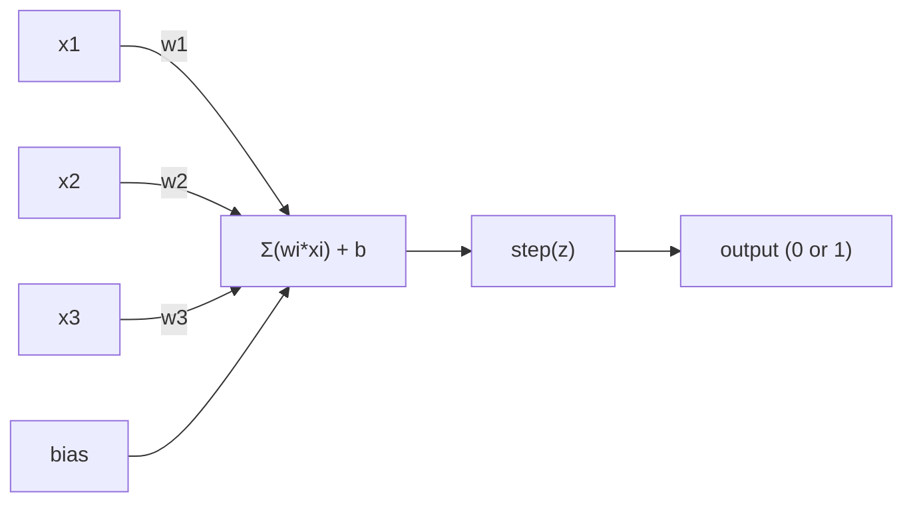
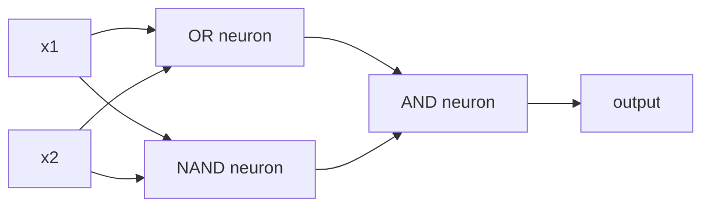

# O Perceptron.

> O perceptron é o átomo das redes neurais, se o abrirmos, encontramos pesos, preconceitos e uma decisão.

> O sensor é o " átomo " da rede neuronal, que se desmembra para ver, dentro dele há o peso, a posição e a decisão.

> **【中文解读】**O que ele faz é muito simples: colocar a entrada multiplicada pelo peso, adicionada à posição, e depois fazer uma decisão de segunda escolha.

**Type:** Build
**Languages:** Python
**Prerequisites:** Phase 1 (Linear Algebra Intuition)
**Time:** ~60 minutes

## Objetivos de aprendizagem

- Implementar um perceptron a partir do zero no Python, incluindo a regra de atualização de peso e a função de ativação de passo
  Desde zero em Python  implementar sensitividade, incluindo regras de peso e função de ativação de estágio
- Explique por que um único perceptron só pode resolver problemas linearmente separaveis e demonstre o caso de falha XOR
  Explicar por que uma única máquina sensorial só pode resolver problemas de separação linear, e demonstrar casos de XOR  falha
- Construa um perceptron de várias camadas compondo portas OR, NAND e AND para resolver XOR
  通過组合 OR、NAND 和 AND 門來构建多层感知机以解决 XOR
- Treinar uma rede de duas camadas com ativação sigmoide e backpropagation para aprender XOR automaticamente
  Usar sigmoid  ativar e contra-direção de divulgação treinamento dois níveis de rede de aprendizado automático XOR

> **【中文解读】**O objetivo deste capítulo: desde zero realizar a percepção, entender por que uma única percepção pode apenas resolver um problema de conectividade (XOR é um contra-exemplo), e então através da combinação de várias percepções para romper essa limitação, finalmente com o poder de auto-aprendizagem de propagação contra-direcionada.

## O problema é o problema da introdução

Você sabe vetores e produtos de pontos. Você sabe que uma matriz transforma entradas em saídas. Mas como uma máquina *aprende* que transformação usar?

> Você já sabe que o volume e o ponto de acumulação. Você sabe que a matriz pode ser transferida para transferência para saída. Mas como as máquinas usam essa variação?

O perceptron responde a isto. É a máquina de aprendizagem mais simples possível: tomar algumas entradas, multiplicar por pesos, adicionar um viés e tomar uma decisão binária. Depois ajustar. É isso. Toda rede neural já construída é camadas desta ideia empilhadas.

> A máquina de percepção responde a esta questão. É a mais simples máquina de aprendizagem: recebe entrada, multiplica peso, adiciona posições, toma decisões de segunda classe, e então ajusta. É assim que todas as redes neurais construídas desde o início da história são uma camada de camadas de esta ideia.

Entender o perceptron significa entender o que "aprender" realmente significa em código: ajustar números até que a saída coincida com a realidade.

> Comprender o sentido de "aprendizagem" no código significa: regular os números até que o resultado coincida com a realidade.

> **【中文解读】**Você já sabe que a matriz pode transformar a entrada em saída. Mas como a máquina "aprende" a usar quais mudanças? A máquina de percepção dá a resposta: introduzir o peso multiplicado, adicionar a posição, fazer decisões de segunda classe, e então, basear-se em erros de ajuste de parâmetros.

## O conceito central.

### Um neurônio, uma decisão, um neurônio, uma decisão.

Um perceptron toma n entradas, multiplica cada uma por um peso, soma-as, adiciona um viés e passa o resultado através de uma função de ativação.

> 感知机接收 n 个输入,将每个输入乘权重,求和,加偏置,然后通过激活函数输出结果――



A função de passo é brutal: se a soma ponderada mais o viés é >= 0, saída 1.

> 阶跃函数 阶跃函数 阶跃函数 阶跃函数 阶跃函数 阶跃函数 阶跃函数 阶跃函数 阶跃函数 阶跃函数 阶跃函数 阶跃函数 阶跃函数 阶跃函数 阶跃函数 阶跃函数 阶跃函数 阶跃函数 阶跃函数 阶跃函数 阶跃函数 阶跃函数 阶跃函数 阶跃函数 阶跃函数 阶跃函数 阶跃函数 阶跃函数 阶跃函数 阶跃函数 阶跃函数 阶权和加偏置 函数 则则则输出 则输出 则输出 则输出 则输出 则

```
step(z) = 1  if z >= 0
           0  if z < 0
```

Este é um classificador linear. Os pesos e o viés definem uma linha (ou hiperplano em dimensões mais altas) que divide o espaço de entrada em duas regiões.

> Este é um linerário divisor. O peso e a posição definem uma linha ou um superplano no espaço de alta dimensão.

> **【中文解读】**感知机的计算流程:输入 x 乘权重 w,求和后加偏置 b,最后通过阶跃函数输出 0 或 1──本质上就是一个线性分类器权重和偏置在空间中画一条线(或超平面),把输入空间分成两个区域──

### O limite de decisão.

Para duas entradas, o perceptron traça uma linha através do espaço 2D:

> Para duas entradas, perceber que o espaço em 2 dimensões é um espaço em linha reta.

```
  x2
  ┤
  │  Class 1        /
  │    (0)          /
  │                /
  │               / w1·x1 + w2·x2 + b = 0
  │              /
  │             /     Class 2
  │            /        (1)
  ┼───────────/──────────── x1
```

Tudo de um lado da linha produz 0, tudo do outro lado produz 1. O treinamento move esta linha até que ela separe corretamente as classes.

> O processo de treinamento é mover esta linha até que ela esteja correta e possa dividir diferentes classes.

> **【中文解读】**                                                                                                                                                                                                                                                              

### A Regra da Aprendizagem

A regra da percepção é simples:

> As regras de aprendizagem do 感知机 são muito simples:

```
For each training example (x, y_true):     # 对每个训练样本
    y_pred = predict(x)                    # 预测输出
    error = y_true - y_pred                # 计算误差

    For each weight:                       # 对每个权重
        w_i = w_i + learning_rate * error * x_i   # 更新权重
    bias = bias + learning_rate * error    # 更新偏置
```

Se a previsão for correta, o erro = 0, nada muda. Se ela prevê 0 mas deve ser 1, os pesos aumentam. Se ela prevê 1 mas deve ser 0, os pesos diminuem. A taxa de aprendizagem controla o tamanho de cada ajuste.

> Se a previsão for correta, o erro é 0, não faça qualquer ajuste. Se a previsão for 0, mas deve ser 1, o peso aumentará. Se a previsão for 1, mas deve ser 0, o peso diminuirá.

> **【中文解读】**感知机的学习规则非常直觉: pré-estimação em relação à in movimento, pré-estimação errada em relação ao erro de direção de ajuste do peso.`optimizer.step()`Fazer coisas é essencialmente o mesmo, apenas calcular mais complicado.

> **【拓展：梯度下降的起源】**感知机学习规则是最简单的梯度下降. 感知机学习规则是最简单的梯度下降. 感知机学习规则是最简单的梯度下降. 感知机学习规则是最简单的梯度下降. 感知机学习规则是最简单的梯度下降. 感知机学习规则是最简单的梯度下降. 感知机学习规则是最简单的梯度下降. 感知机学习规则是最简单的梯度下降. 感知机学习规则是最简单的梯度下降. 感知机学习规则是最简单的梯度下降. 感知机学习规则是最简单的梯度下降. 感知机学习规则是最简单的梯度下降. 感知机学习规则是最简单的梯度下降. 感知机学习规则是最简单的梯度下降.

### O problema do XOR.

Vejam estes portões lógicos:

> É aqui que a percepção falha.

```
AND gate:           OR gate:            XOR gate:
x1  x2  out         x1  x2  out         x1  x2  out
0   0   0           0   0   0           0   0   0
0   1   0           0   1   1           0   1   1
1   0   0           1   0   1           1   0   1
1   1   1           1   1   1           1   1   0
```

E e OR são linearmente separáveis: você pode desenhar uma única linha para separar os 0s dos 1s. XOR não é. Nenhuma única linha pode separar [0,1] e [1,0] de [0,0] e [1,1].

> E 和 OR é linear: você pode desenhar uma linha reta 0 和 1 分开。XOR 不是。

```
AND (separable):        XOR (not separable):

  x2                      x2
  1 ┤  0     1            1 ┤  1     0
    │     /                 │
  0 ┤  0 / 0              0 ┤  0     1
    ┼──/──────── x1         ┼──────────── x1
       line works!          no single line works!
```

Minsky e Papert provaram isso em 1969 e quase matou a pesquisa de redes neurais durante uma década.

> Esta é uma limitação fundamental. Uma única máquina sensorial só pode resolver problemas de separação linear. Minsky e Papert em 1969 provaram que isso quase fez com que a pesquisa de redes neuronais paralisasse por uma década.

A solução: empilhar perceptrões em camadas. Um perceptron de várias camadas pode resolver XOR combinando duas decisões lineares em uma não linear.

>  solução: a máquina sensorial pode ser composta em camadas.

> **【中文解读】**O problema do XOR é o "Akks之" da percepção da máquina: não importa como você desenhe linha direta, não é possível separar as duas categorias de saída do XOR. Minsky e Papert, em 1969, provaram isso, levando diretamente ao "primeiro inverno do estudo da rede neurológica". Mas a sua explicação também é muito bonita: colocar vários mecanismos de percepção em várias camadas, usando duas combinações de linhas diretas para fazer decisões não-lineares.

> **【拓展：为什么深度学习需要"深"】** Uma máquina sensorial de uma única camada só pode desenhar uma linha reta, duas camadas podem desenhar uma linha de dobra, três camadas podem desenhar qualquer forma. Mais camadas, mais funções podem expressar mais complexas. É por isso que o GPT-4 tem quase 100 camadas de transformador em cada camada, o modelo é capaz de expressar um modelo mais complexo. De uma máquina sensorial a uma GPT, o pensamento central é um conjunto de camadas.

## Construí-lo.
```figure
perceptron-boundary
```

## Construí-lo

### Passo 1: A classe Perceptron

```python
class Perceptron:
    def __init__(self, n_inputs, learning_rate=0.1):
        self.weights = [0.0] * n_inputs   # 权重初始化为 0
        self.bias = 0.0                    # 偏置初始化为 0
        self.lr = learning_rate            # 学习率控制每次调整的幅度

    def predict(self, inputs):
        total = sum(w * x for w, x in zip(self.weights, inputs))  # 加权求和：w·x
        total += self.bias                                         # 加偏置：w·x + b
        return 1 if total >= 0 else 0       # 阶跃函数：>=0 输出 1，否则输出 0

    def train(self, training_data, epochs=100):
        for epoch in range(epochs):
            errors = 0
            for inputs, target in training_data:
                prediction = self.predict(inputs)   # 前向预测
                error = target - prediction          # 计算误差
                if error != 0:
                    errors += 1
                    for i in range(len(self.weights)):
                        self.weights[i] += self.lr * error * inputs[i]  # 权重更新
                    self.bias += self.lr * error      # 偏置更新
            if errors == 0:
                print(f"Converged at epoch {epoch + 1}")  # 全部正确，收敛
                return
        print(f"Did not converge after {epochs} epochs")
```

### Passo 2: Treinar em portões de lógica Treinar em portões de lógica

```python
and_data = [          # AND 逻辑门数据：两个输入都为 1 时输出 1
    ([0, 0], 0),
    ([0, 1], 0),
    ([1, 0], 0),
    ([1, 1], 1),
]

or_data = [           # OR 逻辑门数据：任一输入为 1 时输出 1
    ([0, 0], 0),
    ([0, 1], 1),
    ([1, 0], 1),
    ([1, 1], 1),
]

not_data = [          # NOT 逻辑门数据：取反
    ([0], 1),
    ([1], 0),
]

print("=== AND Gate ===")
p_and = Perceptron(2)
p_and.train(and_data)
for inputs, _ in and_data:
    print(f"  {inputs} -> {p_and.predict(inputs)}")

print("\n=== OR Gate ===")
p_or = Perceptron(2)
p_or.train(or_data)
for inputs, _ in or_data:
    print(f"  {inputs} -> {p_or.predict(inputs)}")

print("\n=== NOT Gate ===")
p_not = Perceptron(1)
p_not.train(not_data)
for inputs, _ in not_data:
    print(f"  {inputs} -> {p_not.predict(inputs)}")
```

### Passo 3: Assista ao fracasso do XOR

```python
xor_data = [         # XOR 逻辑门数据：两个输入不同时输出 1
    ([0, 0], 0),
    ([0, 1], 1),
    ([1, 0], 1),
    ([1, 1], 0),
]

print("\n=== XOR Gate (single perceptron) ===")
p_xor = Perceptron(2)
p_xor.train(xor_data, epochs=1000)   # 即使训练 1000 轮也无法收敛
for inputs, expected in xor_data:
    result = p_xor.predict(inputs)
    status = "OK" if result == expected else "WRONG"
    print(f"  {inputs} -> {result} (expected {expected}) {status}")
```

Esta é a prova de que um único perceptron não pode aprender XOR.

> É que a máquina sensível não pode aprender o XOR.

> **【中文解读】**单个感知机训练 XOR 永远不会收不管训练多少轮── é uma limitação matemática dura: uma linha reta não pode dividir os quatro pontos de XOR em duas categorias.

### Passo 4: Resolver XOR com duas camadas

O truque: XOR = (x1 OR x2) E NÃO (x1 E x2). Combine três perceptrões:

> 技巧:XOR = (x1 OR x2) E NÃO (x1 AND x2)



```python
def xor_network(x1, x2):
    or_neuron = Perceptron(2)
    or_neuron.weights = [1.0, 1.0]     # OR 门的权重
    or_neuron.bias = -0.5              # OR 门的偏置

    nand_neuron = Perceptron(2)
    nand_neuron.weights = [-1.0, -1.0]  # NAND 门（AND 的取反）的权重
    nand_neuron.bias = 1.5              # NAND 门的偏置

    and_neuron = Perceptron(2)
    and_neuron.weights = [1.0, 1.0]     # AND 门的权重
    and_neuron.bias = -1.5              # AND 门的偏置

    hidden1 = or_neuron.predict([x1, x2])    # 隐藏层第 1 个神经元：OR
    hidden2 = nand_neuron.predict([x1, x2])  # 隐藏层第 2 个神经元：NAND
    output = and_neuron.predict([hidden1, hidden2])  # 输出层：AND
    return output


print("\n=== XOR Gate (multi-layer network) ===")
for inputs, expected in xor_data:
    result = xor_network(inputs[0], inputs[1])
    print(f"  {inputs} -> {result} (expected {expected})")
```

A acumulação de perceptrões em camadas cria limites de decisão que nenhum perceptrão pode produzir.

> Quatro casos são todos corretos. A máquina de percepção pode criar uma camada de percepção única que não pode produzir uma fronteira de decisão.

> **【中文解读】**关键洞察:XOR = (x1 OR x2) E NÃO(x1 AND x2);; Primeiro nível usa dois sensores separados para fazer OR 和 NAND;; dois lados diretos), segundo nível usa E coloca os dois resultados juntos;;

### Passo 5: Treinar uma rede de duas camadas

O passo 4 ligou os pesos à mão. Isso funciona para XOR, mas não para problemas reais onde você não sabe os pesos certos com antecedência. A solução: substituir a função de passo com sigmoide e aprender os pesos automaticamente através da propagação de volta.

> Passo 4 手动设置权重―― é eficaz para XOR, mas não pode ser usado para ignorar o problema real do peso real―― solução: usar sigmoid 替换阶跃函数, através de inversão de propagada auto-aprendizagem de peso――

```python
class TwoLayerNetwork:
    def __init__(self, learning_rate=0.5):
        import random
        random.seed(0)
        self.w_hidden = [[random.uniform(-1, 1), random.uniform(-1, 1)] for _ in range(2)]  # 隐藏层权重（2个神经元，各2个输入）
        self.b_hidden = [random.uniform(-1, 1), random.uniform(-1, 1)]   # 隐藏层偏置
        self.w_output = [random.uniform(-1, 1), random.uniform(-1, 1)]   # 输出层权重
        self.b_output = random.uniform(-1, 1)   # 输出层偏置
        self.lr = learning_rate

    def sigmoid(self, x):
        import math
        x = max(-500, min(500, x))   # 裁剪防止溢出
        return 1.0 / (1.0 + math.exp(-x))  # sigmoid 函数：σ(x) = 1/(1+e^(-x))

    def forward(self, inputs):
        self.inputs = inputs
        self.hidden_outputs = []
        for i in range(2):
            z = sum(w * x for w, x in zip(self.w_hidden[i], inputs)) + self.b_hidden[i]  # 隐藏层线性变换
            self.hidden_outputs.append(self.sigmoid(z))  # 隐藏层激活
        z_out = sum(w * h for w, h in zip(self.w_output, self.hidden_outputs)) + self.b_output  # 输出层线性变换
        self.output = self.sigmoid(z_out)   # 输出层激活
        return self.output

    def train(self, training_data, epochs=10000):
        for epoch in range(epochs):
            total_error = 0
            for inputs, target in training_data:
                output = self.forward(inputs)       # 前向传播
                error = target - output              # 误差 = 目标 - 预测
                total_error += error ** 2            # 累计平方误差

                d_output = error * output * (1 - output)   # 输出层梯度（链式法则）

                saved_w_output = self.w_output[:]
                hidden_deltas = []
                for i in range(2):
                    h = self.hidden_outputs[i]
                    hd = d_output * saved_w_output[i] * h * (1 - h)  # 隐藏层梯度（反向传播）
                    hidden_deltas.append(hd)

                # 更新输出层权重
                for i in range(2):
                    self.w_output[i] += self.lr * d_output * self.hidden_outputs[i]
                self.b_output += self.lr * d_output

                # 更新隐藏层权重
                for i in range(2):
                    for j in range(len(inputs)):
                        self.w_hidden[i][j] += self.lr * hidden_deltas[i] * inputs[j]
                    self.b_hidden[i] += self.lr * hidden_deltas[i]
```

```python
net = TwoLayerNetwork(learning_rate=2.0)
net.train(xor_data, epochs=10000)
for inputs, expected in xor_data:
    result = net.forward(inputs)
    predicted = 1 if result >= 0.5 else 0   # 以 0.5 为阈值做二分类
    print(f"  {inputs} -> {result:.4f} (rounded: {predicted}, expected {expected})")
```

Duas diferenças principais do passo 4. Primeiro, sigmoide substitui a função de passo - é lisa, então os gradientes existem.`train`O método propaga o erro para trás da saída para a camada oculta, ajustando cada peso proporcionalmente à sua contribuição para o erro.

> Com o passo 4, há duas diferenças importantes. Primeiro, o sigmoide substituiu a função de estágio, então a gradiência existe.`train`O método irá ajustar os erros de saída para secção oculta em direção à difusão, em função da proporção de contribuição de cada peso para os erros.

Esta é a ponte para a lição 03.`d_output`E ...`hidden_deltas`É a regra da cadeia aplicada ao gráfico da rede.

> É o caminho para a terceira aula.`d_output`和 `hidden_deltas`A matemática que está atrás é a aplicação da lei de cadeia em gráficos de redes.

> **【中文解读】**O passo 4 é manualmente definir o peso, mas na verdade não sabemos o peso verdadeiro. A ruptura aqui é: usar o sigmoide 替阶跃函数 (como se pode dirigir), depois usar o inversor propagando (backpropagation) para aprender o peso automático.`d_output`和 `hidden_deltas`É o que é o PyTorch.`loss.backward()`Em coisas a fazer.

> **【拓展：PyTorch autograd 的原理】**A PyTorch é uma máquina de comunicação que é utilizada para a comunicação de dados.`backward()`时沿图反向传播梯度──手动写反向传播 (como aqui) é a melhor maneira de entender o autogrado──

## Use-o em prática.

Tudo o que construíste a partir do zero existe numa única importação:

> Todas as funções que você está construindo a partir de zero podem ser realizadas através de uma entrada:

```python
from sklearn.linear_model import Perceptron as SkPerceptron   # sklearn 内置的感知机
import numpy as np

X = np.array([[0,0],[0,1],[1,0],[1,1]])  # 输入数据
y = np.array([0, 0, 0, 1])               # AND 门的标签

clf = SkPerceptron(max_iter=100, tol=1e-3)  # 最多迭代 100 次，容差 0.001
clf.fit(X, y)                                # 训练
print([clf.predict([x])[0] for x in X])     # 预测所有样本
```

Cinco linhas.`Perceptron`A versão sklearn adiciona verificações de convergência, funções de perda múltipla e suporte de entrada escassa - mas o ciclo central é idêntico: soma ponderada, função de passo, atualização de peso em erro.

> O que é que é que é?`Perceptron`类做同事──sklearn 版本增加收检查、多种损失函数和稀疏输入支持但核心循环完全相同:加权和、阶跃函数、按差更新权重──

A diferença real é evidente em escala.

> A verdadeira diferença está presente na escala.

- A função de passo torna-se sigmoide, ReLU, ou outras ativações suaves
  阶跃 função transformar sigmoid、ReLU ou outras funções activadas
- Os pesos são aprendidos automaticamente através da propagação de volta (Lessão 03)
  权重通过反向传播自动学习 (em inglês)
- As camadas ficam mais profundas: 3, 10, 100+ camadas
  Número de camadas: 3 camadas, 10 camadas, 100+ camadas.
- O mesmo princípio vale: cada camada cria novas características a partir das saídas da camada anterior
   básica princípio invariable: cada camada de saída de camada anterior cria novas características

Um único perceptron só pode desenhar linhas retas, empilhá-las e pode desenhar qualquer forma.

> Uma máquina sensorial só pode desenhar uma linha reta.

> **【中文解读】**O Perceptron 五行代码  sklearn 里已经搞定了我们30行做的事情──核心逻辑完全相同:加权求和、阶跃函数、按差更新权重──真正差在规模:现代网络使用可导的激活函数(如ReLU) 、用反向传播自动学习、有几十到上百层──但基本原理永远是: cada camada de alta camada cria novos recursos em sua saída──

## Envia-o .

Esta lição produz:
- `outputs/skill-perceptron.md`- uma habilidade que cobre quando são necessárias arquiteturas de camada única versus de camada múltipla

> 本课产出:`outputs/skill-perceptron.md`- Um documento de habilidades sobre quando usar estruturas de camadas únicas e múltiplas

## Exercícios.

1. Treinar um perceptron em um gate NAND (o gate universal - qualquer circuito lógico pode ser construído a partir do NAND). Verificar seus pesos e preconceitos formam um limite de decisão válido.
   > **练习 1：**Use sensitividade máquina treinamento NAND 门通用逻辑门 Qualquer eléctrico lógico pode ser construído com NAND) ――验证学到的权重和偏置是否形成有效决策边界──

2. Modifique a classe Perceptron para rastrear o limite de decisão (w1\*x1 + w2\*x2 + b = 0) em cada época.
   > **练习 2：**Modificar Perceptron 类, em cada época 记录决策边界 (w1\*x1 + w2\*x2 + b = 0) ――打印在训练 AND 门时这条线是如何移动的──

3. Construir um perceptron de 3 entradas que produz 1 apenas quando pelo menos 2 das 3 entradas são 1 (uma função de voto de maioria).
   > **练习 3：**Construir uma máquina de percepção de 3 entradas, quando pelo menos 2 entradas são para 1 时输出 1                                                                                                                                                                                                                                                  

## Termos-chave .

| Term | What people say | What it actually means |
|------|----------------|----------------------|
| Perceptron | "A fake neuron" | A linear classifier: dot product of inputs and weights, plus bias, through a step function |
| Weight | "How important an input is" | A multiplier that scales each input's contribution to the decision |
| Bias | "The threshold" | A constant that shifts the decision boundary, letting the perceptron fire even with zero inputs |
| Activation function | "The thing that squishes values" | A function applied after the weighted sum - step function for perceptrons, sigmoid/ReLU for modern networks |
| Linearly separable | "You can draw a line between them" | A dataset where a single hyperplane can perfectly separate the classes |
| XOR problem | "The thing perceptrons can't do" | Proof that single-layer networks cannot learn non-linearly-separable functions |
| Decision boundary | "Where the classifier switches" | The hyperplane w\*x + b = 0 that divides input space into two classes |
| Multi-layer perceptron | "A real neural network" | Perceptrons stacked in layers, where each layer's output feeds the next layer's input |

| 术语 | 通俗说法 | 实际含义 |
|------|---------|---------|
| 感知机 (Perceptron) | "假神经元" | 线性分类器：输入与权重的点积加偏置，过阶跃函数 |
| 权重 (Weight) | "输入的重要性" | 缩放每个输入对决策贡献的乘数 |
| 偏置 (Bias) | "阈值" | 偏移决策边界的常数，让感知机在全零输入时也能激活 |
| 激活函数 (Activation function) | "压扁数值的东西" | 加权求和后施加的函数——感知机用阶跃函数，现代网络用 sigmoid/ReLU |
| 线性可分 (Linearly separable) | "能画线分开" | 数据集可以用一个超平面完美分成两类 |
| XOR 问题 | "感知机做不到的事" | 证明单层网络无法学习非线性可分函数 |
| 决策边界 (Decision boundary) | "分类器切换的地方" | w\*x + b = 0 这个超平面，把输入空间分成两类区域 |
| 多层感知机 (MLP) | "真正的神经网络" | 感知机按层堆叠，每层的输出是下一层的输入 |

## Mais leitura 延伸阅读

- Frank Rosenblatt, "O Perceptron: Um Modelo Probabilístico para Armazenamento e Organização de Informações no Cerebro" (1958) - o artigo original que começou tudo
  Frank Rosenblatt, 感知机: Brain Information Storage and Organization Probability Model
- Minsky & Papert, "Perceptrons" (1969) -- o livro que provou que XOR era insolúvel por redes de camada única e matou a pesquisa de perceptron por uma década
  Minsky 和 Papert,感知机
- Michael Nielsen, "Networks Neurais e Aprendizagem Profunda", Capítulo 1 (http://neuralnetworksanddeeplearning.com/) -- online gratuito, melhor explicação visual de como os perceptrons compõem em redes
  Michael Nielsen,  Neural Network and Deep Learning  1o capítulo  Free online, sobre como os sensores compõem a rede
