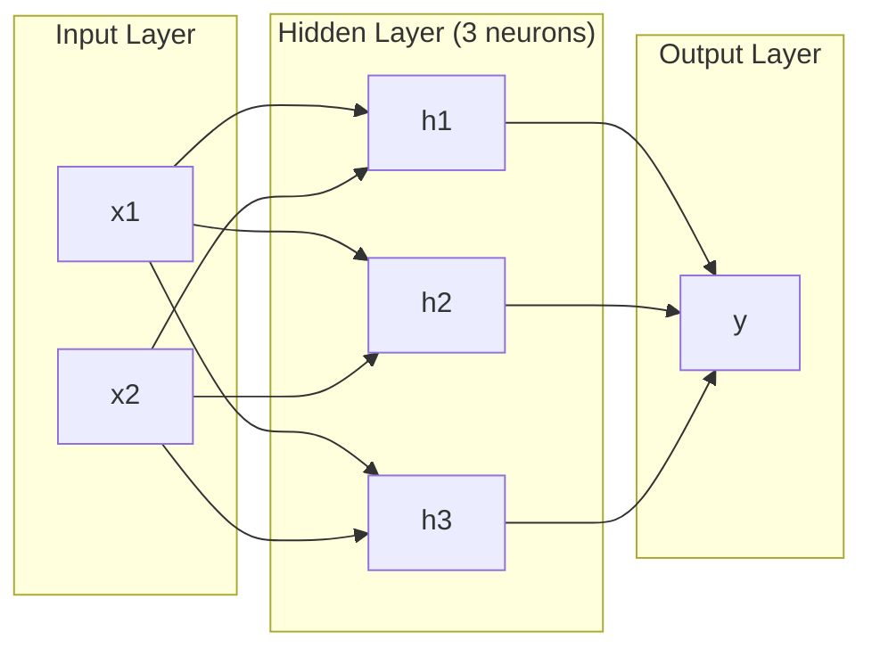
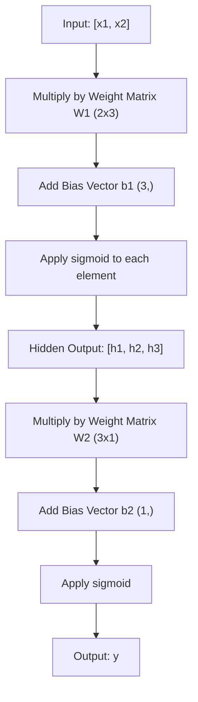
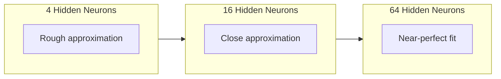

# Multicapa de redes e passes avançados

> Um neurônio traça uma linha, enfileira-as e podes desenhar qualquer coisa.

> Um neurônio desenha uma linha reta. Coloca-as sobre si, e assim podes desenhar qualquer forma.

> **【中文解读】**Um neurônio só pode desenhar uma linha reta, mas colocar vários neurônios em várias camadas, assim pode se adaptar a curvas de qualquer forma. Este é o valor central da rede de várias camadas.

**Type:** Build
**Languages:** Python
**Prerequisites:** Phase 01 (Math Foundations), Lesson 03.01 (The Perceptron)
**Time:** ~90 minutes

## Objetivos de aprendizagem

- Construir uma rede de várias camadas a partir do zero com classes de camadas e redes que executam uma passagem completa para a frente
  Desde o zero de construção com camada e rede de tipo rede de várias camadas, executar a completa pré-disseminação
- Determine as dimensões da matriz através de cada camada de uma rede e identifique as descoincidências de forma
   Perguntas de dimensão de matrizes de cada nível da rede de rastreamento, identificação de formas incompatíveis
- Explique como a empilhamento de ativações não lineares permite que uma rede aprenda os limites de decisão curvos
  解释堆叠非线性激活 如何使网络能够学习曲 的决策边界
- Resolver o problema XOR usando uma arquitetura 2-2-1 com pesos sigmoides sintonizados à mão
  Utilize manual adjustment of sigmoid 权重, use 2-2-1 架构解决 XOR 问题

> **【中文解读】**Objectivo deste capítulo: de zero construção de camadas e redes, compreender a mudança de dimensão de matrizes na distribuição, descobrir por que funções de ativação não lineares permitem que a rede possa aprender as fronteiras de decisão.

## O problema é o problema da introdução

Um neurônio é um caixão de linhas. É isso. Uma linha reta através dos dados. Todos os problemas reais da IA - reconhecimento de imagens, compreensão de linguagem, jogo de Go - exigem curvas.

> 单个神经只是一个图线的工具――仅此而已―― desenhar uma linha reta em seus dados―― cada problema real da IA 图像识别,语言理解,下围棋 需要曲线―― fazer um conjunto de neurônios é um método para obter uma curva――

Em 1969, Minsky e Papert provaram que essa limitação era fatal: uma rede de camada única não pode aprender XOR. Não "lutas para aprender" - matematicamente não pode. A tabela de verdade XOR coloca [0,1] e [1,0] em um lado, [0,0] e [1,1] no outro. Nenhuma única linha os separa.

> Em 1969, Minsky 和 Papert provou que esta limitação é fatal: uma única rede de camadas não pode aprender XOR── não é "muito difícil de aprender" é matematicamente impossível── XOR real valor em um lado, não há uma linha reta que possa dividir os valores.

Isso eliminou o financiamento de redes neurais por mais de uma década. A solução era óbvia em retrospectiva: parar de usar uma camada. Apilação de neurônios em camadas. Deixe a primeira camada esculpir o espaço de entrada em novas características, e deixe a segunda camada combinar essas características em decisões que nenhuma linha poderia fazer.

> O financiamento da rede neuronal foi interrompido por mais de dez anos. Apesar de tudo, a solução é evidente: não mais apenas uma camada.

Essa pilha é a rede de várias camadas. É a base de todos os modelos de aprendizagem profunda em produção hoje. O passagem para a frente - dados fluindo de entrada através de camadas ocultas para saída - é a primeira coisa que precisamos construir antes que qualquer outra coisa funcione.

> Essa composição é uma rede de várias camadas. É a base de cada modelo de aprendizagem profunda no ambiente de produção atual.

> **【中文解读】**Nereus individuais só podem desenhar uma linha reta, mas imagens de reconhecimento, linguagem e compreensão                                                                                                                                                                                                                                                 

## O conceito central.

### Layers: entrada, oculta, saída. Layers: entrada, escondida, saída.

Uma rede de várias camadas tem três tipos de camadas:

> Multicapa de rede tem três tipos de camadas:

**Input layer**- não é realmente uma camada. Ele mantém os dados brutos. Duas características significam dois nós de entrada.

> **输入层**其实不算真正层――它存储原始数据――两个特征意味着两个输入节点――这里没有任何计算――

**Hidden layers**Cada neurônio toma todas as saídas da camada anterior, aplica pesos e um viés, e depois passa o resultado através de uma função de ativação. "Escondido" porque nunca vê esses valores diretamente nos dados de treinamento.

> **隐藏层** realmente干活的地方── cada neurônio recebe a primeira camada de todos os resultados, aplica o peso e a posição, e depois o resultado será através da função de ativação──"oculto" é porque você nunca vê esses valores nos dados de treinamento──

**Output layer**Para classificação binária, um neurônio com sigmoide. Para multi-classe, um neurônio por classe.

> **输出层**                                                                                                                                                                                                                                                              



Esta é uma rede 2-3-1. duas entradas, três neurônios escondidos, uma saída. Cada conexão carrega um peso. Cada neurônio (exceto entrada) carrega um viés.

> É uma rede de 2-3-1 ⋅ duas entradas, três neurônios ocultos, uma saída ⋅ cada ligação tem um peso ⋅ cada neurônio ⋅ excepto a entrada de camada ⋅ tem um desvio ⋅

Cada camada produz um vetor de números chamado estado oculto. Para o texto, os estados ocultos aumentam a dimensionalidade - codificando uma palavra como 768 números para capturar significado semântico. Para as imagens, reduzem a dimensionalidade - comprimindo milhões de pixels em uma representação gerenciável. O estado oculto é onde a aprendizagem vive.

> Cada camada produz um veículo digital, chamado estado oculto. Para o texto, o estado oculto aumenta a dimensão. Para as imagens, elas reduzem a dimensão.

> **【中文解读】**Três camadas: entrada de dados (simplesmente entrada de dados, não calculação) ̇ escondido (do inglês: hidden layer) ̇ fazer características mudando, " escondido " ̇ é porque treinamento dados (trenagem) ̇ saída de dados (output layer) ̇ resposta final ̇ ̇ ̇ ̇ ̇ ̇ ̇ ̇ ̇ ̇ ̇ ̇ ̇ ̇ ̇ ̇ ̇ ̇ ̇ ̇ ̇ ̇ ̇ ̇ ̇ ̇ ̇ ̇ ̇ ̇ ̇ ̇ ̇ ̇ ̇ ̇ ̇ ̇ ̇ ̇ ̇ ̇ ̇ ̇ ̇ ̇ ̇ ̇ ̇ ̇ ̇ ̇ ̇ ̇ ̇ ̇ ̇ ̇ ̇ ̇ ̇ ̇ ̇ ̇ ̇ ̇ ̇ ̇ ̇ ̇ ̇ ̇ ̇ ̇ ̇ ̇ ̇ ̇ ̇ ̇ ̇ ̇ ̇ ̇ ̇ ̇ ̇ ̇ ̇ ̇ ̇ ̇ ̇ ̇ ̇ ̇ ̇ ̇ ̇ ̇ ̇ ̇ ̇ ̇ ̇ ̇ ̇ ̇ ̇ ̇ ̇ ̇ ̇ ̇ ̇ ̇ ̇ ̇ ̇ ̇ ̇ ̇ ̇ ̇ ̇ ̇ ̇ ̇ ̇ ̇ ̇ ̇ ̇ ̇ ̇ ̇ ̇ ̇ ̇ ̇ ̇ ̇ ̇ ̇ ̇ ̇ ̇ ̇ ̇ ̇ ̇ ̇ ̇ ̇ ̇ ̇ ̇ ̇ ̇ ̇ ̇ ̇ ̇ ̇ ̇ ̇ ̇ ̇ ̇ ̇ ̇ ̇ ̇ ̇ ̇ ̇ ̇ ̇ ̇ ̇ ̇ ̇ ̇ ̇ ̇ ̇ ̇ ̇ ̇ ̇ ̇ ̇ ̇ ̇ ̇ ̇ ̇ ̇ ̇ ̇ ̇ ̇ ̇ ̇ ̇ ̇ ̇ ̇ ̇ ̇ ̇ ̇ ̇ ̇ ̇ ̇ ̇ ̇ ̇ ̇

> **【拓展：Transformer 中的隐藏状态】**Em GPT/BERT, cada nível de Transformer é também um estado oculto.`model(x).hidden_states[-1]`提取特征用于下游任务──

### Neurônios e Ativações.

Cada neurônio faz três coisas:

> Cada neurônio faz três coisas:

1. Multiplicar cada entrada pelo seu peso correspondente
   Cada entrada será multiplicada pelo peso do correspondente
2. Somar todos os produtos e adicionar um preconceito
   Vai colocar todas as multiplicidades e posições
3. Passe a soma através de uma função de ativação
   Vai e passará por função de ativação

Por enquanto, a ativação é sigmoide:

> Atualmente, a função activada é sigmoid:

```
sigmoid(z) = 1 / (1 + e^(-z))
```

Sigmoid esmagou qualquer número na faixa (0, 1). grandes entradas positivas empurrar para 1. grandes entradas negativas empurrar para 0. mapas zero para 0.5. Esta curva lisa é o que torna possível a aprendizagem - ao contrário do passo difícil do perceptron, sigmoid tem um gradiente em todos os lugares.

> O sigmoide comprimirá qualquer número para (0, 1) ∞, grande entrada positiva tendência 1, grande entrada negativa tendência 0,0 ∞, mapa para 0,5 ∞. Esta curva plana torna possível o aprendizado, diferente do nível duro da máquina sensível, o sigmoide ∞ tem gradiente.

> **【中文解读】**Cada neurônio faz três coisas: inject multiploquebate, procura e adição de paragem, função de transativação, sigmoide, enfraqueça qualquer número para (0, 1) 区间, o que torna possível a redução de gradiente.

### Passagem Avançada: Como os dados fluem.

O passante avançado empurra dados de entrada através da rede, camada por camada, até que chegue à saída. Não há aprendizado durante o passante avançado. É pura computação: multiplicar, adicionar, ativar, repetir.

> O processo de transferência de dados para a rede, até o momento em que o processo de transferência de dados para a rede, não ocorre qualquer aprendizagem.



Em cada camada, três operações acontecem em sequência:

> Em cada camada, em ordem de execução três operações:

```
z = W * input + b       (linear transformation)    # 线性变换
a = sigmoid(z)           (activation)                # 激活
```

A saída de uma camada torna-se a entrada para a próxima.

> O output de um nível se torna o input de um nível inferior.

> **【中文解读】**Antes de divulgar é o processo de dados de entrada, entrada e saída. Não há qualquer aprendizagem, simplesmente calculação. Em cada camada, faz duas coisas: mudança linear.`model(x)`Em coisas a fazer.

### Dimensões de Matriz.

As dimensões de rastreamento são a habilidade de depuração mais importante na aprendizagem profunda.

> 追踪维度是深度学习中最重要的调试技能──以下是 2-3-1 网络:

| Step | Operation | Dimensions | Result Shape |
|------|-----------|------------|-------------|
| Input | x | -- | (2,) |
| Hidden linear | W1 * x + b1 | W1: (3, 2), b1: (3,) | (3,) |
| Hidden activation | sigmoid(z1) | -- | (3,) |
| Output linear | W2 * h + b2 | W2: (1, 3), b2: (1,) | (1,) |
| Output activation | sigmoid(z2) | -- | (1,) |

| 步骤 | 操作 | 维度 | 结果形状 |
|------|------|------|---------|
| 输入 | x | -- | (2,) |
| 隐藏层线性变换 | W1 * x + b1 | W1: (3, 2), b1: (3,) | (3,) |
| 隐藏层激活 | sigmoid(z1) | -- | (3,) |
| 输出层线性变换 | W2 * h + b2 | W2: (1, 3), b2: (1,) | (1,) |
| 输出层激活 | sigmoid(z2) | -- | (1,) |

A regra: a matriz de peso W na camada k tem forma (neurônios_in_layer_k, neurônios_in_layer_k_minus_1). As linhas correspondem à camada atual. As colunas correspondem à camada anterior. Se as formas não alinham, você tem um bug.

> 規則: 図書 図書 図書 図書 図書 図書 図書 図書 図書 図書 図書 図書 図書 図書 図書 図書 図書 図書 図書 図書 図書 図書 図書 図書 図書 図書 図書 図書 図書 図書 図書 図書 図書 図書 図書 図書 図書 図書 図書 図書 図書 図書 図書 図書 図書 図書 図書 図書 図書 図書 図書 図書 図書 図書 図書 図書 図書 図書 図書 図書 図書 図書 図書 図書 図書 図書 図書 図書 図書 図書 図書 図書 図書 図書 図書 図書 図書 図書 図書 図書 図書 図書 図書 図書 図書 図書 図書 図書 図書 図書 図書 図書 図書 図書 図書 図書 図書 図書 図書 図書 図書 図書 図書 図書 図書 図書 図書 図書 図書 図書 図書 図書 図書 図書 図書 図書 図書 図書 図書 図書 図書 図書 図書 図書 図書 図書 図書 図書 図書 図書 図書 図書 図書 図書 図書 図書 図書 図書 図書 図書 図書 図書 図書 図書 図書 図書 図書 図書 図書 図書 図書 図書 図書 図書 図書 図書 図書 図書 図書

> **【中文解读】**                                                                                                                                                                                                                                                                                                                                                                                                                                                                                                                             

> **【拓展：维度不匹配是深度学习最常见的 bug】**Em PyTorch, você vê muitas vezes.`RuntimeError: mat1 and mat2 shapes cannot be multiplied` This is the dimension is not matched                                                                                                                                                                                                                                                          `torchsummary`Ou `torchinfo`Posso ajudá-lo a verificar automaticamente.

### Teorema da aproximação universal.

Em 1989, George Cybenko provou algo notável: uma rede neural com uma única camada oculta e neurônios suficientes podem aproximar qualquer função contínua de qualquer precisão desejada.

> Em 1989, George Cybenko provou uma coisa extraordinária: uma rede de nervosos com uma única camada oculta e neurônios suficientes pode aproximar-se de qualquer função contínua com qualquer precisão.

Isso não significa que uma camada oculta seja sempre melhor. Significa que a arquitetura é teoricamente capaz. Na prática, redes mais profundas (mais camadas, menos neurônios por camada) aprendem as mesmas funções com muito menos parâmetros totais do que redes de largura superficial. É por isso que a aprendizagem profunda funciona.

> Isso não significa que uma camada oculta seja sempre a melhor. Significa que a estrutura é teoricamente viável. Na prática, uma rede mais profunda (mais camadas, cada camada menos neurônios) usa um total de componentes de uma rede muito menor que a ampla para aprender a mesma função.

A intuição: cada neurônio na camada oculta aprende um "bump" ou característica. Bumps suficientes colocados nos locais certos podem aproximar qualquer curva lisa. Mais neurônios, mais bumps, melhor aproximação.

> 直觉: cada neurônio nas camadas ocultas aprende uma "combinação" ou característica.



> **【中文解读】**Ménageu de aproximação (1989): uma camada oculta +  suficiente neurônios pode aproximar-se de qualquer função continuada. Mas isso não significa que uma camada é suficiente na prática, a rede "profunda e estreita" é mais alta do que a "alvo e largo".

> **【拓展：为什么"深"比"宽"好】**Teóricamente, uma camada 2^n 个神经元等于 n 层 个神经元, mas o primeiro é de grau índice, o segundo é linear.

### Composibilidade, composição.

As redes neurais são compostos. Você pode empilhá-las, acorrentá-las, executá-las em paralelo. Um modelo Whisper usa uma rede de codificadores para processar áudio e uma rede de decodificadores separada para gerar texto. LLM modernos são apenas decodificadores. BERT é apenas encodificador. T5 é encodificador-decodificador. A escolha de arquitetura define o que o modelo pode fazer.

> A rede de neurônios é composta. Você pode compor, ligar, e executá-las. O modelo de Whisper usa um codificador de rede para processar áudio, usando uma rede de codificadores para gerar textos.

> **【中文解读】**A rede de sistemas é composta por: Whisper utilizando um codificador processando áudio + um decodificador gerando texto; GPT é um puramente decodificador; BERT é um puramente decodificador; T5 é um codificador-decodificador; arquitetura escolha determinou a capacidade do modelo;

## Construí-lo.
```figure
mlp-forward
```

## Construí-lo

Python puro, sem nada de numpy, todas as operações de matriz escritas a partir do zero.

> Pure Python. Não é preciso nada. Cada matriço funciona desde o início.

### Passo 1: Ativação Sigmoide

```python
import math

def sigmoid(x):
    x = max(-500.0, min(500.0, x))  # 裁剪到 [-500, 500] 防止指数溢出
    return 1.0 / (1.0 + math.exp(-x))  # σ(x) = 1/(1+e^(-x))
```

A sujeira para [500, 500] impede o desbordamento. `math.exp(500)`É grande, mas finito.`math.exp(1000)`É o infinito.

> - Não, não. - Não, não.`math.exp(500)`Muito grande, mas limitado.`math.exp(1000)`É um grande...

### Passo 2: Classe de camadas

A operação mais importante em toda a aprendizagem profunda é a multiplicação de matriz. Cada camada, cada cabeça de atenção, cada passagem para a frente - são matmulas até ao fundo. Uma camada linear pega um vetor de entrada, multiplica-o por uma matriz de peso e adiciona um vetor de viés: y = Wx + b. Essa equação única é 90% do cálculo em uma rede neural.

> O cálculo mais importante no aprendizado de profundidade é o quadrado de matrizes. Cada camada, cada cabeça de atenção, cada movimento de direção anterior é o quadrado de matrizes.

Uma camada possui uma matriz de peso e um vetor de viés. Seu método de avanço leva um vetor de entrada e retorna a saída ativada.

> Uma camada contém uma massa de peso e um veículo de desvio. Seu método de avanço recebe um veículo de entrada e retorna à saída de ativado.

```python
class Layer:
    def __init__(self, n_inputs, n_neurons, weights=None, biases=None):
        if weights is not None:
            self.weights = weights                       # 使用指定的权重（如手动设置 XOR 的权重）
        else:
            import random
            self.weights = [
                [random.uniform(-1, 1) for _ in range(n_inputs)]  # 随机初始化权重
                for _ in range(n_neurons)
            ]                                           # 形状：(n_neurons, n_inputs)
        if biases is not None:
            self.biases = biases                         # 使用指定的偏置
        else:
            self.biases = [0.0] * n_neurons              # 偏置初始化为 0

    def forward(self, inputs):
        self.last_input = inputs                         # 保存输入（反向传播时需要）
        self.last_output = []
        for neuron_idx in range(len(self.weights)):
            z = sum(
                w * x for w, x in zip(self.weights[neuron_idx], inputs)  # 加权求和
            )
            z += self.biases[neuron_idx]                 # 加偏置
            self.last_output.append(sigmoid(z))          # sigmoid 激活
        return self.last_output
```

A matriz de peso tem forma (n_neurônios, n_input). Cada linha é o peso de um neurônio em todas as entradas. O método avançado faz circuitos através dos neurônios, calcula a soma ponderada mais o viés, aplica sigmoide e coleta os resultados.

> 权重矩阵的形状为 (n_neurons, n_inputs) ⋅ cada linha é um neurônio sobre todos os input de peso──forward 方法遍历神经元,计算加权和加偏置,应用 sigmoid,并收集结果──

> **【拓展：PyTorch 的 nn.Linear】**Aqui está a camada de PyTorch .`nn.Linear`A versão simplificada.`nn.Linear(in_features, out_features)`内部也是维护一个 `(out_features, in_features)`O peso da linha de frente e um.`(out_features,)`Compreendo isso, já compreendi a profundidade do aprendizado 90% do cálculo.

### Passo 3: Classe de rede Classe de rede

Uma rede é uma lista de camadas. A passagem avançada as encadeia: a saída da camada k alimenta a camada k + 1.

> 网络是一个层的列表――前向传播将它们串联: 第 k 层的输出作为第 k+1层的输入――

```python
class Network:
    def __init__(self, layers):
        self.layers = layers   # 按顺序存储所有层

    def forward(self, inputs):
        current = inputs               # 当前层的输入
        for layer in self.layers:
            current = layer.forward(current)  # 逐层前向传播
        return current
```

Isso é todo o passo para a frente. Quatro linhas de lógica. Dados entram, fluem através de cada camada, sai do outro lado.

> É assim que toda a lógica avança.

> **【中文解读】**Rede 类就是 PyTorch `nn.Sequential`É o que significa que o estudo profundo é um modelo de aprendizagem que se propaga.

### Passo 4: XOR com pesos ajustados à mão

Na lição 01, resolvemos XOR combinando perceptrões OR, NAND e AND. Agora faça o mesmo com nossas classes de camada e rede. A arquitetura 2-2-1: duas entradas, dois neurônios ocultos, uma saída.

> Na primeira aula, nós resolvemos o problema através da combinação de OR、NAND 和 AND 感知机 XOR── agora fazemos o mesmo com nossa camada 和 Network 类──2-2-1 Arquitetura: duas entradas, dois nervos ocultos, uma saída──

```python
hidden = Layer(
    n_inputs=2,
    n_neurons=2,
    weights=[[20.0, 20.0], [-20.0, -20.0]],  # 大权重让 sigmoid 接近阶跃函数
    biases=[-10.0, 30.0],                      # 第一个神经元 ≈ OR，第二个 ≈ NAND
)

output = Layer(
    n_inputs=2,
    n_neurons=1,
    weights=[[20.0, 20.0]],                    # 输出层 ≈ AND
    biases=[-30.0],
)

xor_net = Network([hidden, output])

xor_data = [
    ([0, 0], 0),
    ([0, 1], 1),
    ([1, 0], 1),
    ([1, 1], 0),
]

for inputs, expected in xor_data:
    result = xor_net.forward(inputs)
    predicted = 1 if result[0] >= 0.5 else 0
    print(f"  {inputs} -> {result[0]:.6f} (rounded: {predicted}, expected: {expected})")
```

Os grandes pesos (20, -20) fazem com que o sigmoide agi como uma função de passo. O primeiro neurônio oculto se aproxima de OR. O segundo se aproxima de NAND. O neurônio de saída os combina em AND, que é XOR.

> O grande peso (20, -20) faz com que o sigmoide seja representado como uma função de fase-júpite.

### Passo 5: Classificação de círculos.

Um problema mais difícil: classificar pontos 2D como dentro ou fora de um círculo de raio 0,5 centrado na origem. Isto requer um limite de decisão curvo - impossível para um único perceptron.

> Uma questão mais difícil: classificar os dois dimensões de pontos em um centro de ponto de origem, com um diâmetro de 0,5 círculo dentro ou fora do círculo.

```python
import random
import math

random.seed(42)

data = []
for _ in range(200):
    x = random.uniform(-1, 1)
    y = random.uniform(-1, 1)
    label = 1 if (x * x + y * y) < 0.25 else 0   # 距原点距离 < 0.5 则为"内部"
    data.append(([x, y], label))

circle_net = Network([
    Layer(n_inputs=2, n_neurons=8),   # 隐藏层：8 个神经元
    Layer(n_inputs=8, n_neurons=1),   # 输出层：1 个神经元
])
```

Com pesos aleatórios, a rede não classifica bem. Mas o passante para frente ainda funciona. Este é o ponto - o passante para frente é apenas computação. Aprender os pesos certos é backpropagation, vindo na lição 03.

> Usando o peso de cada vez, a classificação da rede será muito ruim. Mas o avanço da divulgação ainda pode ser executado.

```python
correct = 0
for inputs, expected in data:
    result = circle_net.forward(inputs)
    predicted = 1 if result[0] >= 0.5 else 0
    if predicted == expected:
        correct += 1

print(f"Accuracy with random weights: {correct}/{len(data)} ({100*correct/len(data):.1f}%)")
```

Pesos aleatórios dão pouca precisão - muitas vezes pior do que adivinhar a classe majoritária. Depois do treinamento (Lessão 03), esta mesma arquitetura com 8 neurônios escondidos desenhará uma fronteira curva que separa o interior do exterior.

> O peso do poder dá uma taxa de precisão muito inferior, geralmente inferior à maioria dos tipos de especulação. Depois de treinar, também possui 8 estruturas de nervos ocultos que desenham as fronteiras da composição, dividindo o círculo dentro e o círculo fora.

> **【中文解读】**O efeito da divisão de peso da rede é muito ruim. É normal, pois ainda não há treinamento.

## Use-o em prática.

PyTorch faz tudo acima em quatro linhas:

> PyTorch usa quatro linhas de código para completar todas as funções acima:

```python
import torch
import torch.nn as nn

model = nn.Sequential(       # 对应我们的 Network 类
    nn.Linear(2, 8),         # 对应 Layer(2, 8)：权重形状 (8, 2)
    nn.Sigmoid(),             # 对应 sigmoid 激活
    nn.Linear(8, 1),         # 对应 Layer(8, 1)：权重形状 (1, 8)
    nn.Sigmoid(),             # 输出层 sigmoid
)

x = torch.tensor([[0.0, 0.0], [0.0, 1.0], [1.0, 0.0], [1.0, 1.0]])  # XOR 输入
output = model(x)             # 前向传播
print(output)
```

`nn.Linear(2, 8)`é a sua classe de camadas: matriz de peso de forma (8, 2), vetor de desvio de forma (8,). `nn.Sigmoid()`é a função sigmoide aplicada em termos de elementos. `nn.Sequential`é a sua classe de rede: camadas de cadeia em ordem.

> `nn.Linear(2, 8)`É o seu nível de formação de (8, 2)`nn.Sigmoid()`É o seu sigmoide 函数 函数 函数 函数 函数 函数 函数 函数 函数 函数 函数 函数 函数 函数 函数 函数 函数 函数 函数 函数 函数 函数 函数 函数 函数 函数 函数 函数 函数 函数 函数 函数 函数 函数 函数 函数 函数 函数 函数 函数 函数 函数 函数 函数 函数 函数 函数 函数 函数 函数 函数 函数 函数 函数 函数 函数 函数 函数 函数 函数 函数 函数 函数 函数 函数 函数 函数 函数 函数 函数 函数 函数 函数 函数 函数 函数 函数 函数 函数 函数 函数 函数 函数 函数 函数 函数 函数 函数 函数 函数 函数 函数 函数 函数 函数 函数 函数 函数 函数 函数 函数 函数 函数 函数 函数 函数 函数 函数 函数 函数 函数 函数 函数 函数 函数 函数 函数 函数 函数 函数 函数 函数 函数 函数 函数 函数 函数 函数 函数 函数 函数 函数 函数 函数 函数 函数 函数 函数 函数 函数 函数 函数 函数 函数 函数 函数 函数 函数 函数 函数 函数 函数 函数 函数 函数 函数 函数 函数 函数 函数 函数 函数 函数 函数 函数 函数 函数 函数`nn.Sequential`É a sua rede.

A diferença é velocidade e escala. PyTorch funciona em GPUs, lida com lotes de milhões de amostras e calcula automaticamente gradientes para a propagação para trás. Mas a lógica de passagem para a frente é idêntica à que você acabou de construir a partir do zero.

> A diferença é na velocidade e na escala. O PyTorch funciona na GPU, processa milhões de amostras, calcula automaticamente a gradiência de propagação contra a direção.

> **【中文解读】**PyTorch quadrinhos já realizou toda a lógica de nossa construção manual.`nn.Linear`= nossa camada,`nn.Sequential`= nossa rede,`nn.Sigmoid()`= Nosso sigmoid. Diferença é em PyTorch  suportar GPU aceleração √ processamento em massa e auto-requisitação, mas a lógica central da pré-transmissão é completamente a mesma.

## Envia-o .

Esta lição produz um prompt reutilizável para o projeto de arquiteturas de rede:

> Este curso é produzido por um redirecionado de arquitetura de rede.

- `outputs/prompt-network-architect.md`

Use-o quando precisar decidir quantas camadas, quantas neurônios por camada e quais funções de ativação usar para um determinado problema.

> Quando você precisa decidir quantas camadas, quantidades de neurônios por camada e quais funções de ativação usar, pode usá-la.

## Exercícios.

1. Construir uma rede 2-4-2-1 (dois camadas ocultas) e executar a passagem para a frente em dados XOR com pesos aleatórios. Imprimir as saídas da camada oculta intermediária para ver como a representação se transforma em cada camada.
   > **练习 1：**构建 2-4-2-1 网络(两个隐藏层), use随机权重运 XOR 数据的前向传播──印中隐藏层输出,观察每层如何变变数据的表示──

2. Crie o tamanho da camada oculta no classificador de círculo de 8 para 2, e depois para 32.
   > **练习 2：**Colocar a camada oculta do redutor de forma circular de 8 para 2, para 32, separadamente usando o peso de cada movimento.

3. Implementar um `count_parameters`método na classe de rede que retorna o número total de pesos e viés treinables. teste-o em uma rede 784-256-128-10 (a arquitetura clássica MNIST). Quantos parâmetros tem?
   > **练习 3：**Em rede 类中实现 `count_parameters`方法, return all trainable weight and biased total number― Using 784-256-128-10 网络(classical MNIST 架构) test, ele tem quantos parâmetros?

4. Construir um pass para a frente para uma rede 3-4-4-2. alimentar-lhe valores de cor RGB (normalizado para 0-1) e observar as duas saídas. Esta é a arquitetura para um classificador de cores simples com duas classes.
   > **练习 4：**Por 3-4-4-2                                                                                                                                                                                                                                                                                                                                                                                                                                                                                                                          

5. Substitua o sigmoide por uma função "passo vazado": retorne 0,01 * z se z < 0, então 1.0. Execute a passagem para frente no XOR com os mesmos pesos ajustados à mão da etapa 4.
   > **练习 5：**Utilize a função "漏斗阶跃" substituir sigmoid:z < 0 时返回 0.01\*z,否则返回 1.0。 Utilize o passo 4 do manual de peso de execução XOR。

## Termos-chave .

| Term | What people say | What it actually means |
|------|----------------|----------------------|
| Forward pass | "Running the model" | Pushing input through every layer -- multiply by weights, add bias, activate -- to produce an output |
| Hidden layer | "The middle part" | Any layer between input and output whose values are not directly observed in the data |
| Multi-layer network | "A deep neural network" | Layers of neurons stacked sequentially, where each layer's output feeds the next layer's input |
| Activation function | "The nonlinearity" | A function applied after the linear transformation that introduces curves into the decision boundary |
| Sigmoid | "The S-curve" | sigma(z) = 1/(1+e^(-z)), squashes any real number to (0,1), smooth and differentiable everywhere |
| Weight matrix | "The parameters" | A matrix W of shape (current_layer_neurons, previous_layer_neurons) containing learnable connection strengths |
| Bias vector | "The offset" | A vector added after the matrix multiply that lets neurons activate even when all inputs are zero |
| Universal approximation | "Neural nets can learn anything" | A single hidden layer with enough neurons can approximate any continuous function -- but "enough" can mean billions |
| Linear transformation | "The matrix multiply step" | z = W * x + b, the computation before activation, which maps inputs to a new space |
| Decision boundary | "Where the classifier switches" | The surface in input space where the network output crosses the classification threshold |

| 术语 | 通俗说法 | 实际含义 |
|------|---------|---------|
| 前向传播 (Forward pass) | "跑模型" | 把输入推过每一层——乘权重、加偏置、激活——得到输出 |
| 隐藏层 (Hidden layer) | "中间那部分" | 输入层和输出层之间的层，其值在训练数据中不可直接观测 |
| 多层网络 (Multi-layer network) | "深度神经网络" | 神经元按层堆叠，每层的输出是下一层的输入 |
| 激活函数 (Activation function) | "非线性" | 线性变换后施加的函数，让决策边界变成曲线 |
| Sigmoid | "S 曲线" | σ(z) = 1/(1+e^(-z))，把任意实数压缩到 (0,1)，处处平滑可导 |
| 权重矩阵 (Weight matrix) | "参数" | 形状为 (当前层神经元, 上一层神经元) 的矩阵，包含可学习的连接强度 |
| 偏置向量 (Bias vector) | "偏移" | 矩阵乘法后加上的向量，让神经元在全零输入时也能激活 |
| 万能逼近 (Universal approximation) | "神经网络什么都能学" | 一个隐藏层 + 足够多神经元可逼近任何连续函数——但"足够"可能意味着数十亿 |
| 线性变换 (Linear transformation) | "矩阵乘法那步" | z = Wx + b，激活前的计算，把输入映射到新空间 |
| 决策边界 (Decision boundary) | "分类器切换的地方" | 输入空间中网络输出跨过分类阈值的曲面 |

## Mais leitura 延伸阅读

- Michael Nielsen, "Networks Neurais e Aprendizagem Profunda", Capítulo 1-2 (http://neuralnetworksanddeeplearning.com/) -- a explicação mais clara e livre de passes avançados e estrutura de rede, com visualizações interativas
  Michael Nielsen,  Rede Neural e Aprendizagem Profunda  Capítulo 1-2  Sobre a Transmissão e a Estrutura de Rede
- Cybenko, "Aproximação por Superposições de uma Função Sigmoidal" (1989) - o original papel do teorema de aproximação universal, surpreendentemente legível
  Cybenko, usando Sigmoid 函数叠加逼近(1989)原始的万能逼近定定理论文,出人意料地易读
- 3Blue1Brown, "Mas o que é uma rede neural?"https://www.youtube.com/watch?v=aircAruvnKk) -- 20 minutos de caminhada visual através de camadas, pesos e passes para a frente que construem o modelo mental certo
  3Blue1Brown,What is Neural Network?20 min.s video, explicação, ajuda-te a construir uma verdadeira intuição
- O Conselho Europeu de Administração e de Desenvolvimento Económico e Social (CEP)https://www.deeplearningbook.org/) -- a referência padrão para redes de várias camadas, gratuita em linha
  Bom amigo, Benguio, Courville,  profundidade de aprendizagem  6 多层网络的标准参考,免费在线
